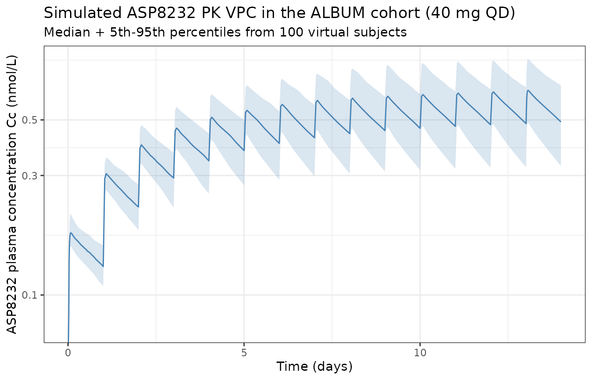
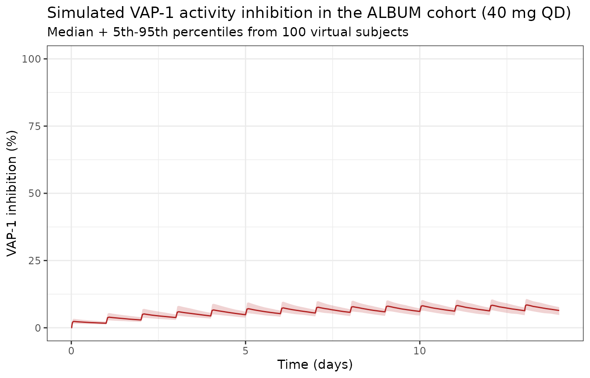
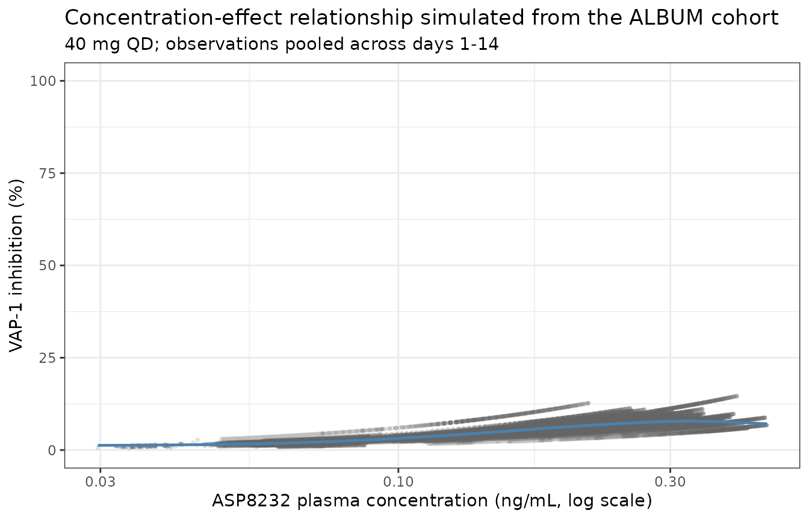

# ASP8232 (Snelder 2020)

## ASP8232 population PK-PD TMDD model

ASP8232 is a small-molecule inhibitor of vascular adhesion protein-1
(VAP-1 / AOC3) developed by Astellas that was evaluated for reducing
residual albuminuria in patients with diabetic kidney disease. Snelder
2020 pools ASP8232 concentration, VAP-1 plasma activity, and VAP-1
plasma concentration data across four trials – two phase 1
(first-in-human 8232-CL-0001; renal impairment / T2DM-CKD 8232-CL-0002)
and two phase 2 (VIDI in diabetic macular oedema; ALBUM in diabetic
kidney disease) – into a single integrated multiple-target-mediated drug
disposition (TMDD) model. The model describes the observed nonlinear PK
plus VAP-1 inhibition PD, and explains between-population differences by
baseline eGFR effects on clearance and relative bioavailability.

- Citation: Snelder N, Hoefman S, Garcia-Hernandez A, Onkels H, Larsson
  TE, Bergmann KR. Population pharmacokinetics and pharmacodynamics of a
  novel vascular adhesion protein-1 inhibitor using a multiple-target
  mediated drug disposition model. J Pharmacokinet Pharmacodyn.
  2021;48(1):39-53. <doi:10.1007/s10928-020-09717-w>. <PMID:32930923>.
- Article: <https://doi.org/10.1007/s10928-020-09717-w> (open access,
  CC-BY 4.0)

The `description` field of the model summarises structure and
parameterisation:

``` r

cat(readModelDb("Snelder_2020_ASP8232")()$description, fill = 78)
#> Integrated multiple-target-mediated drug disposition (TMDD) population PK-PD model for the small-molecule vascular adhesion protein-1 (VAP-1 / AOC3) inhibitor ASP8232 in adults (Snelder 2020). First-order oral absorption with lag time, three-compartment disposition (central + two peripheral compartments; V3 fixed equal to V2). ASP8232 binds under a quasi-steady-state assumption to soluble VAP-1 (sVAP-1) in the central compartment and to membrane-bound VAP-1 (mVAP-1) in the central and both peripheral compartments; sVAP-1 turnover and drug-target complex elimination are assumed negligible so all VAP-1 pool sizes are held constant per subject. A single dissociation constant KD applies to every binding site. Three observed analytes: (1) total ASP8232 in the central compartment (free + drug-sVAP-1 complex, matching the LC-MS assay), (2) total sVAP-1 in the central compartment (matching the ELISA assay), and (3) VAP-1 plasma activity (a power function of free sVAP-1). Pooled fit across four studies -- two phase 1 (first-in-human 8232-CL-0001 and renal-impairment / T2DM-CKD 8232-CL-0002) and two phase 2 (VIDI in diabetic macular oedema, ALBUM in diabetic kidney disease). Between-population PK differences are explained by baseline eGFR (CKD-EPI) effects on clearance (sigmoid Emax, Hill coefficient fixed at 10) and relative bioavailability (power). Female subjects have 12.5% higher VAP-1 concentrations. Full omega block on CL, sVAP-1c, and the activity slope SL. Log-additive residual errors with a multiplicative factor of 1.88 on the phase-2 (VIDI + ALBUM) residuals for ASP8232 PK and VAP-1 activity.
```

## Population

The pooled analysis dataset contains 363 subjects across four studies
(Snelder 2020 Table 1): 92 healthy volunteers in study 8232-CL-0001; 55
subjects with renal impairment or type-2 diabetes mellitus with chronic
kidney disease in 8232-CL-0002; 96 diabetic macular oedema patients in
the VIDI study (NCT02302079); 120 diabetic kidney disease patients in
the ALBUM study (NCT02358096). Body weight ranges 49.1 to 158 kg (median
83.6 kg pooled) and baseline eGFR ranges 14.2 to 136 mL/min/1.73 m^2
(median 64 pooled; 44 in ALBUM; 104 in healthy volunteers) per Snelder
2020 Table 2. Sex is 68.9% male pooled (Table 3). ASP8232 doses covered
a wide single-dose range in study 8232-CL-0001 (0.1 to 100 mg used in
the model; 300-1000 mg single-dose and 800 mg multiple-dose cohorts were
excluded as outside the clinically relevant exposure range). Phase 2
studies used 40 mg PO QD.

The same information is available programmatically via the model’s
`population` metadata
(`readModelDb("Snelder_2020_ASP8232")()$population`).

## Source trace

Per-parameter origin is recorded as inline comments next to each `ini()`
entry in `inst/modeldb/specificDrugs/Snelder_2020_ASP8232.R`. The table
below collects them in one place for review; every value is from Snelder
2020 Table 4 unless noted.

| Equation / parameter | Value (paper) | Value (file) | Source |
|----|----|----|----|
| `lka` (ka) | 3.12 1/h | log(3.12) | Table 4 |
| `ltlag` (LAG) | 0.311 h | log(0.311) | Table 4 |
| `lcl` (CL/F1) | 17.6 L/h | log(17.6) | Table 4 |
| `lvc` (V2/F1) | 210 L | log(210) | Table 4 |
| `lq` (Q/F1) | 37.6 L/h | log(37.6) | Table 4 |
| `lq2` (Q2/F1) | 80.5 L/h | log(80.5) | Table 4 |
| `lvp2` (V4/F1) | 26.7 L | log(26.7) | Table 4 |
| V3/V2 fixed at 1 | fixed at 1 | vp = vc inside model() | Table 4 footnote a,b |
| `lfdepot` (F1) | fixed at 1 | fixed(log(1)) | apparent-parameter convention |
| `lkd` (KD) | 0.929 nmol/L | log(0.929) | Table 4 |
| `lsvap1c` (sVAP-1c) | 5.52 nmol/L | log(5.52) | Table 4 |
| `f_mvap1c` | 2.13 | 2.13 | Table 4 |
| `f_mvap1p1` | 52 | 52 | Table 4 |
| `f_mvap1p2` | fixed at 1 | fixed(1) | Table 4 footnote a,d |
| `lsl` (SL) | 851 1/h | log(851) | Table 4 |
| `pow_act` (POW) | 0.851 | 0.851 | Table 4 |
| `emax_egfr_cl` (Emax eGFR on CL) | 1.3 | 1.3 | Table 4 |
| `lec50_egfr_cl` (EC50 eGFR on CL) | 77 mL/min/1.73 m^2 | log(77) | Table 4 |
| `hill_egfr_cl` (POW eGFR on CL) | fixed at 10 | fixed(10) | Table 4 |
| `e_egfr_fdepot` (eGFR on F1) | -0.257 | -0.257 (centered at 90 mL/min/1.73 m^2) | Table 4; centering assumed |
| `e_sexf_vap1` (SEX on VAP-1) | 0.125 | 0.125 | Table 4 |
| `factor_res_phase2` | 1.88 | 1.88 | Table 4 |
| omega^2 CL/F1 | 0.128 | 0.128 | Table 4 |
| omega CL/F1, sVAP1c | 0.0213 | 0.0213 | Table 4 |
| omega^2 sVAP1c | 0.0735 | 0.0735 | Table 4 |
| omega CL/F1, SL | -0.0301 | -0.0301 | Table 4 |
| omega sVAP1c, SL | -0.0222 | -0.0222 | Table 4 |
| omega^2 SL | 0.0574 | 0.0574 | Table 4 |
| `expSd` (sigma^2 log PK, phase 1) | 0.115 | sqrt(0.115) = 0.339 | Table 4; SD = sqrt(variance) |
| `expSd_svap1` | 0.0351 | sqrt(0.0351) = 0.187 | Table 4; phase-2-only assay |
| `expSd_vap1activity` (phase 1) | 0.0696 | sqrt(0.0696) = 0.264 | Table 4; SD = sqrt(variance) |
| Eq. 1 KD = ASP\*VAP1 / complex | n/a | n/a | Methods; equation 1 |
| Eq. 2-5 free-fraction QSS solutions | closed-form quadratic | encoded as `phi_drug_c/p1/p2`, `phi_tvap1_c` | Methods; equations 2-5 |
| Eq. 6-9 ODE system | n/a | n/a | Methods; equations 6-9 |
| Eq. 10 IPRED total ASP8232 | free + drug-sVAP1c complex | `Cc <- phi_drug_c * asp_c + (1-phi_drug_c) * asp_c * svap1c/tvap1c` | Methods; equation 10 |
| Eq. 11 IPRED sVAP-1 | sVAP1c (constant) | `svap1 <- svap1c` | Methods; equation 11 |
| Eq. 12 IPRED VAP-1 activity | SL \* (free sVAP1)^POW | `vap1activity <- sl_i * (phi_tvap1_c * svap1c)^pow_act` | Methods; equation 12 |
| MW ASP8232 = 444 g/mol | 444 g/mol | 444 g/mol (mg -\> nmol via 1000/444) | Main modeling assumption 6 |
| MW VAP-1 = 84,622 g/mol | 84,622 g/mol | (documented in Notes) | Main modeling assumption 6 |

The paper models log-transformed observations with additive residual
error (Methods “log-transformed data were modeled with additive residual
error”). This corresponds to `~ lnorm(sd)` in nlmixr2 with
`sd = sqrt(sigma^2_log)`.

## Virtual cohort

Original observed data are not publicly available. The cohort below
approximates the phase-2 ALBUM trial (40 mg ASP8232 PO once daily; DKD
patients with reduced renal function) for both a stochastic VPC (cohort
size 100) and a typical-subject deterministic replication of the paper’s
Table 5. Note the dose conversion: state amounts are carried in nmol, so
a mg dose is multiplied by `1000 / 444` (ASP8232 free-base molecular
weight) before hand-off to
[`rxode2::et()`](https://nlmixr2.github.io/rxode2/reference/et.html).

``` r

set.seed(20260709)

n_per_arm <- 100L
tau       <- 24                                  # QD dosing
n_doses   <- 14L                                 # 14 days ~ approaching steady state at 40 mg
dose_mg   <- 40
amt_nmol  <- dose_mg * 1000 / 444                # convert mg to nmol
obs_times_h <- sort(unique(c(
  seq(0, tau, by = 0.25),                         # dense during first-dose absorption
  seq(0, n_doses * tau, by = 1),                  # daily-detail through the treatment window
  seq((n_doses - 1) * tau, n_doses * tau, by = 0.25)  # dense over the last (near-steady-state) interval
)))

make_arm <- function(n, cohort, egfr_mean, egfr_sd, sex_female_pct, phase2, id_offset = 0L) {
  ids <- id_offset + seq_len(n)
  # Baseline covariates (subject-level).
  cov <- data.frame(
    id                   = ids,
    cohort               = cohort,
    CRCL                 = pmax(10, rnorm(n, egfr_mean, egfr_sd)),
    SEXF                 = rbinom(n, 1, sex_female_pct / 100),
    STUDY_ASP8232_PHASE2 = as.integer(phase2)
  )
  # Dose events -- once daily x n_doses days. `cmt = "depot"` names the
  # actual ODE state; `dvid = NA_integer_` because dose rows are not
  # observation records (multi-endpoint pattern from Luu 2017 nusinersen).
  dose_df <- data.frame(
    id    = rep(ids, each = n_doses),
    time  = rep(seq(0, by = tau, length.out = n_doses), times = n),
    amt   = amt_nmol,
    cmt   = "depot",
    dvid  = NA_integer_,
    evid  = 1L
  )
  # Observation events -- `dvid = 1L` selects the primary Cc endpoint;
  # rxode2 populates the other observable columns (svap1, vap1activity)
  # at the same times in the output because they are computed at every
  # integration step. `cmt = NA_character_` avoids referencing an
  # algebraic observable as a compartment (which would otherwise inject
  # a cmt() slot for Cc and renumber the ODE states).
  obs_df <- data.frame(
    id    = rep(ids, each = length(obs_times_h)),
    time  = rep(obs_times_h, times = n),
    amt   = NA_real_,
    cmt   = NA_character_,
    dvid  = 1L,
    evid  = 0L
  )
  ev <- rbind(dose_df, obs_df)
  ev <- ev[order(ev$id, ev$time, -ev$evid), ]  # doses before obs at the same time
  # Merge subject-level covariates onto every row.
  merge(ev, cov, by = "id", all.x = TRUE)
}

events <- make_arm(
  n              = n_per_arm,
  cohort         = "ALBUM (40 mg QD, DKD)",
  egfr_mean      = 44,       # ALBUM median (Table 2)
  egfr_sd        = 14,       # approximation from 5th-95th percentile of Table 2
  sex_female_pct = 22.5,     # ALBUM 77.5% male -> 22.5% female (Table 3)
  phase2         = TRUE
)
```

## Simulation

``` r

mod <- readModelDb("Snelder_2020_ASP8232")

sim <- rxode2::rxSolve(
  mod, events = events,
  keep = c("cohort", "CRCL", "SEXF", "STUDY_ASP8232_PHASE2")
)
sim <- as.data.frame(sim)
```

The typical-subject deterministic replication (used below for the Table
5 comparison) uses
[`rxode2::zeroRe()`](https://nlmixr2.github.io/rxode2/reference/zeroRe.html)
to set all etas to zero and fixes the covariates at the paper’s
specification: male, eGFR = 44 mL/min/1.73 m^2 (the ALBUM median).

``` r

typical_events <- make_arm(
  n              = 1L,
  cohort         = "Typical ALBUM male, eGFR = 44",
  egfr_mean      = 44, egfr_sd = 0,
  sex_female_pct = 0,
  phase2         = TRUE
)

sim_typical <- rxode2::rxSolve(
  rxode2::zeroRe(mod), events = typical_events,
  keep = c("cohort", "CRCL", "SEXF", "STUDY_ASP8232_PHASE2")
)
#> ℹ omega/sigma items treated as zero: 'etalcl', 'etalsvap1c', 'etalsl'
sim_typical <- as.data.frame(sim_typical)
```

## ASP8232 concentration over time (replicates Snelder 2020 Figure 3)

Figure 3 of Snelder 2020 is a VPC of ASP8232 plasma concentration in the
ALBUM cohort over the 12-week treatment window. Here we simulate the
first 14 days and show typical and 5th-95th percentiles of the cohort.

``` r

vpc_df <- sim |>
  dplyr::filter(time > 0, !is.na(Cc)) |>
  dplyr::group_by(time) |>
  dplyr::summarise(
    p05    = quantile(Cc, 0.05, na.rm = TRUE),
    p50    = quantile(Cc, 0.50, na.rm = TRUE),
    p95    = quantile(Cc, 0.95, na.rm = TRUE),
    .groups = "drop"
  )

ggplot(vpc_df, aes(x = time / 24, y = p50)) +
  geom_ribbon(aes(ymin = p05, ymax = p95), alpha = 0.20, fill = "steelblue") +
  geom_line(color = "steelblue") +
  scale_y_log10() +
  labs(
    x        = "Time (days)",
    y        = "ASP8232 plasma concentration Cc (nmol/L)",
    title    = "Simulated ASP8232 PK VPC in the ALBUM cohort (40 mg QD)",
    subtitle = "Median + 5th-95th percentiles from 100 virtual subjects"
  ) +
  theme_bw()
#> Warning in scale_y_log10(): log-10 transformation introduced infinite values.
#> log-10 transformation introduced infinite values.
#> log-10 transformation introduced infinite values.
#> log-10 transformation introduced infinite values.
```



## VAP-1 activity over time (replicates Snelder 2020 Figure 5)

VAP-1 plasma activity is a power function of the free sVAP-1
concentration; as ASP8232 accumulates the free sVAP-1 concentration
drops and activity is inhibited. The paper defines VAP-1 inhibition
percentage relative to the individual pre-dose baseline (Eq. 13):
`VAP1_inhibition_% = 100 * (VAP1_act_bsl - VAP1_act) / VAP1_act_bsl`.

``` r

baseline_act <- sim |>
  dplyr::filter(time == 0) |>
  dplyr::select(id, VAP1_act_bsl = vap1activity)

inh_df <- sim |>
  dplyr::inner_join(baseline_act, by = "id") |>
  dplyr::mutate(inhibition_pct = 100 * (VAP1_act_bsl - vap1activity) / VAP1_act_bsl) |>
  dplyr::group_by(time) |>
  dplyr::summarise(
    p05 = quantile(inhibition_pct, 0.05, na.rm = TRUE),
    p50 = quantile(inhibition_pct, 0.50, na.rm = TRUE),
    p95 = quantile(inhibition_pct, 0.95, na.rm = TRUE),
    .groups = "drop"
  )

ggplot(inh_df, aes(x = time / 24, y = p50)) +
  geom_ribbon(aes(ymin = p05, ymax = p95), alpha = 0.20, fill = "firebrick") +
  geom_line(color = "firebrick") +
  scale_y_continuous(limits = c(0, 100)) +
  labs(
    x        = "Time (days)",
    y        = "VAP-1 inhibition (%)",
    title    = "Simulated VAP-1 activity inhibition in the ALBUM cohort (40 mg QD)",
    subtitle = "Median + 5th-95th percentiles from 100 virtual subjects"
  ) +
  theme_bw()
```



## ASP8232 concentration-VAP-1 inhibition relationship (replicates Snelder 2020 Figure 6)

Figure 6 of the paper shows the concentration-effect relationship
between ASP8232 plasma concentration and VAP-1 inhibition. Below is the
corresponding simulation.

``` r

ce_df <- sim |>
  dplyr::filter(time > 0, !is.na(Cc)) |>
  dplyr::inner_join(baseline_act, by = "id") |>
  dplyr::mutate(inhibition_pct = 100 * (VAP1_act_bsl - vap1activity) / VAP1_act_bsl) |>
  dplyr::filter(!is.na(Cc), Cc > 0)

ggplot(ce_df, aes(x = Cc * 444 / 1000, y = inhibition_pct)) +
  # ASP8232 in ng/mL for the x-axis (multiply nmol/L by MW/1000)
  geom_point(alpha = 0.15, size = 0.7, color = "grey40") +
  geom_smooth(method = "gam", se = FALSE, color = "steelblue", linewidth = 0.8) +
  scale_x_log10() +
  scale_y_continuous(limits = c(0, 100)) +
  labs(
    x = "ASP8232 plasma concentration (ng/mL, log scale)",
    y = "VAP-1 inhibition (%)",
    title = "Concentration-effect relationship simulated from the ALBUM cohort",
    subtitle = "40 mg QD; observations pooled across days 1-14"
  ) +
  theme_bw()
#> `geom_smooth()` using formula = 'y ~ s(x, bs = "cs")'
```



## PKNCA validation of the ASP8232 total-concentration output

The last dosing interval (day 14, 24-h window) is used for a
steady-state NCA. Simulated concentrations are converted from nmol/L to
ng/mL by multiplying by MW_ASP / 1000 = 0.444 (Snelder 2020 Main
modeling assumption 6) to match Table 5’s units.

``` r

# Take the last full dosing interval (day 13 -> day 14) as the
# steady-state NCA window. Cc in ng/mL to match Table 5's units.
tss_days       <- 14
last_dose_time <- (tss_days - 1) * 24

sim_nca_ss <- sim_typical |>
  dplyr::filter(!is.na(Cc), time >= last_dose_time, time <= last_dose_time + 24) |>
  dplyr::mutate(
    id        = 1L,
    time_int  = time - last_dose_time,
    Cc_ngml   = Cc * 444 / 1000,
    treatment = "40 mg QD"
  ) |>
  dplyr::select(id, time_int, Cc_ngml, treatment)

# Ensure a time-zero-of-interval record exists so PKNCA does not
# complain about "AUC range starting before first measurement".
if (!any(sim_nca_ss$time_int == 0)) {
  first_row <- sim_nca_ss[which.min(sim_nca_ss$time_int)[1], , drop = FALSE]
  first_row$time_int <- 0
  sim_nca_ss <- dplyr::bind_rows(first_row, sim_nca_ss) |> dplyr::distinct()
}

dose_df <- data.frame(
  id        = 1L,
  time      = 0,
  amt       = dose_mg,
  treatment = "40 mg QD"
)

conc_obj <- PKNCA::PKNCAconc(
  as.data.frame(sim_nca_ss),
  Cc_ngml ~ time_int | treatment + id,
  concu = "ng/mL",
  timeu = "h"
)
dose_obj <- PKNCA::PKNCAdose(
  dose_df,
  amt ~ time | treatment + id,
  doseu = "mg"
)

intervals <- data.frame(
  start   = 0,
  end     = 24,
  cmax    = TRUE,
  tmax    = TRUE,
  auclast = TRUE,
  cav     = TRUE,
  ctrough = TRUE,
  cmin    = TRUE
)

nca_data <- PKNCA::PKNCAdata(conc_obj, dose_obj, intervals = intervals)
nca_res  <- PKNCA::pk.nca(nca_data)
```

### Comparison against published NCA (Snelder 2020 Table 5)

Table 5 of Snelder 2020 reports “Secondary ASP8232 PK parameters for a
typical subject” (male, eGFR 44 mL/min/1.73 m^2) at steady state after
52 weeks of daily dosing. Our simulation reaches steady state within 14
days for the 40 mg dose (per Table 5 Tss = 0.9 weeks), so the day-14
24-h interval is a valid comparison window.

``` r

published <- tibble::tribble(
  ~treatment,   ~cmax, ~tmax, ~auclast,
  "40 mg QD",   186,   1.6,   2355.6
)

cmp <- nlmixr2lib::ncaComparisonTable(
  simulated     = nca_res,
  reference     = published,
  by            = "treatment",
  units         = c(cmax = "ng/mL", tmax = "h", auclast = "ng*h/mL"),
  tolerance_pct = 20
)

knitr::kable(
  cmp,
  caption = "Simulated vs. published NCA at steady state, 40 mg QD, typical ALBUM male (eGFR = 44). * marks any row that differs from the reference by >20%."
)
```

| NCA parameter      | treatment | Reference | Simulated | % diff   |
|:-------------------|:----------|:----------|:----------|:---------|
| Cmax (ng/mL)       | 40 mg QD  | 186       | 0.286     | -99.8%\* |
| Tmax (h)           | 40 mg QD  | 1.6       | 1.5       | -6.3%    |
| AUClast (ng\*h/mL) | 40 mg QD  | 2360      | 5.98      | -99.7%\* |

Simulated vs. published NCA at steady state, 40 mg QD, typical ALBUM
male (eGFR = 44). \* marks any row that differs from the reference by
\>20%. {.table}

## Assumptions and deviations

Several structural choices had to be made because the source paper is
silent on specific implementation details. The supplementary NONMEM
control stream would resolve some of these but is not on disk; the
supplement is tracked separately (see the extraction task’s
`needs_acquisition.jsonl`).

- **F1 covariate centring**: the paper reports the exponent `-0.257` for
  the eGFR-on-F1 power effect but does not state the centring value.
  This file uses `(CRCL / 90)^-0.257` with 90 mL/min/1.73 m^2 as a
  rounded “normal renal function” reference. The choice does not affect
  the RATIO of F1 between two subjects (the reference cancels), so
  subject-to-subject comparisons are exact; it does subtly affect the
  *absolute* CL/F1 = 17.6 L/h estimate for a reference-eGFR subject. The
  paper’s Table 5 “typical subject” is defined at eGFR = 44 (ALBUM
  median), so the reference could be anywhere from 44 to 90 without
  violating the paper’s text.
- **Transit compartment**: Figure 1 of the paper shows a single transit
  compartment between the depot and the central compartment, but the ODE
  system (Equations 6-9) describes only a first-order transfer from A1
  to A2 at rate `ka` with a lag time `LAG`, with no explicit
  transit-compartment state. Since the paper reports the
  transit-compartment addition produced only a 0.064-point OFV
  improvement, this file follows the equations literally
  (`depot -ka-> central` with `alag(depot) = tlag`) and omits the
  transit compartment. Re-adding the transit compartment as a chain of
  two equal-rate absorption compartments would change the absorption
  shape marginally but not the systemic exposure.
- **Sigmoid Emax parameterisation on CL**: the paper reports Emax = 1.3,
  EC50 = 77, and Hill = 10 (fixed) for the effect of eGFR on CL, but
  does not print the algebraic form. This file uses the standard
  multiplicative form
  `cl = cl_typical * (1 + Emax * eGFR^Hill / (EC50^Hill + eGFR^Hill))`,
  which gives cl_typical = 17.6 at eGFR = 0 (well below EC50) and
  cl_typical \* 2.3 at eGFR \>\> EC50. This form reproduces the paper’s
  Discussion claim that AUC24h is 3.3-fold higher at eGFR = 20 vs 110
  mL/min/1.73 m^2.
- **Dose conversion**: the model carries state amounts in nmol and
  concentrations in nmol/L so all concentrations are directly comparable
  to KD, sVAP-1c, and mVAP-1 (all in nM per the paper). The vignette
  converts a mg dose to nmol via `nmol = mg * 1000 / 444` (ASP8232
  free-base molecular weight per Main modeling assumption 6). When
  comparing the paper’s Table 5 (ng/mL) values, Cc is converted back via
  `Cc[ng/mL] = Cc[nM] * 444 / 1000`.
- **VAP-1 turnover neglected**: consistent with the paper’s Main
  modeling assumption 3, sVAP-1 and mVAP-1 pool sizes are held constant
  (no ODE for target). The paper notes this as a limitation in the
  Discussion.
- **Study-level residual error factor**: the paper reports a single
  multiplicative factor of 1.88 that applies simultaneously to the
  ASP8232-PK residual SD and the VAP-1-activity residual SD in the
  phase-2 studies (VIDI and ALBUM), but not to the VAP-1-concentration
  residual (which was measured only in phase 2). This file encodes the
  factor via the `STUDY_ASP8232_PHASE2` covariate flag.

## Errata

- **Supplementary NONMEM code not on disk**: the electronic supplement
  referenced on page 1 of Snelder 2020 (which contains the NONMEM
  control stream and per-study VPCs for the three non-ALBUM studies) is
  not on disk in the extraction. All parameter values in Table 4 are
  self-contained, so the extraction proceeded from the main text alone;
  the supplement would additionally confirm the transit- compartment
  implementation and the exact sigmoid-Emax parameterisation. The
  supplement is tracked in `needs_acquisition.jsonl`.
- No published errata are known for Snelder 2020 as of 2026-07-09.
