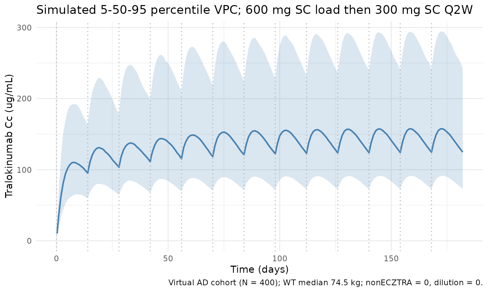
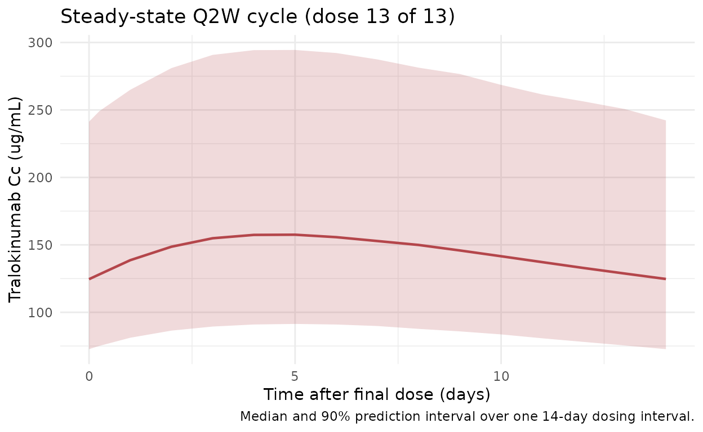

# Soehoel_2022_tralokinumab

## Model and source

- Citation: Soehoel A, Larsen MS, Timmermann S. Population
  Pharmacokinetics of Tralokinumab in Adult Subjects With Moderate to
  Severe Atopic Dermatitis. Clinical Pharmacology in Drug Development.
  2022;11(8):910-921. <doi:10.1002/cpdd.1113>
- Description: Two-compartment population PK model for tralokinumab
  (Soehoel 2022) in adults with moderate-to-severe atopic dermatitis,
  with SC first-order absorption and allometric body-weight effects.
- Article: [Clin Pharmacol Drug Dev.
  2022;11(8):910-921](https://doi.org/10.1002/cpdd.1113) (open-access
  via [PMC9796478](https://pmc.ncbi.nlm.nih.gov/articles/PMC9796478/))

## Population

The published analysis pooled 2561 subjects (13,361 quantifiable serum
concentrations) across 10 clinical trials: 3 phase 3 trials (ECZTRA
1/2/3), 4 phase 2 trials (including the diluted-formulation trial
D2213C00001), and 3 phase 1 trials, enrolling atopic-dermatitis patients
(n = 2066, 81%), asthma patients (n = 441, 17%), and healthy volunteers
(n = 54, 2%). Baseline demographics from Soehoel 2022 Table 1: age
median 38 years (range 18-92, 131 subjects \>= 65 years); body weight
median 74.5 kg (range 36-165); 55% male / 45% female; race 67% White,
22% Asian, 7% Black/African American; ethnicity 9% Hispanic/Latino.
Baseline EASI score in AD subjects: median 27.5 (range 12-72).
Subcutaneous tralokinumab doses ranged from single-dose phase 1
exposures up to the labelled atopic-dermatitis regimen of 600 mg SC
loading followed by 300 mg SC every 2 weeks.

The same information is available programmatically via
`readModelDb("Soehoel_2022_tralokinumab")$population`.

## Source trace

Every structural parameter, covariate effect, IIV element, and
residual-error term below is taken directly from Soehoel 2022 Table 2.
The reference weight is 75 kg; `nonECZTRA = 0` and `dilution = 0` define
the ECZTRA / undiluted reference.

| Equation / parameter                | Value               | Source location                                            |
|-------------------------------------|---------------------|------------------------------------------------------------|
| `lka` (ka)                          | `log(0.184)` 1/day  | Table 2                                                    |
| `lvc` (V2, central volume)          | `log(2.71)` L       | Table 2                                                    |
| `lcl` (CL)                          | `log(0.149)` L/day  | Table 2                                                    |
| `lvp` (V3, peripheral volume)       | `log(1.44)` L       | Table 2                                                    |
| `lq` (Q, intercompartmental CL)     | `log(0.159)` L/day  | Table 2                                                    |
| `lfdepot` (F, SC bioavailability)   | `log(0.761)`        | Table 2                                                    |
| `e_wt_vcvp` (WT on V2 and V3)       | `0.783`             | Table 2 (allometric)                                       |
| `e_wt_clq` (WT on CL and Q)         | `0.873`             | Table 2 (allometric)                                       |
| `e_nonECZTRA_cl` (non-ECZTRA on CL) | `0.344`             | Table 2                                                    |
| `e_nonECZTRA_vc` (non-ECZTRA on V2) | `0.258`             | Table 2                                                    |
| `e_f_dilution` (dilution on F)      | `0.354`             | Table 2                                                    |
| `e_ka_dilution` (dilution on ka)    | `-0.519`            | Table 2                                                    |
| `var(etalvc)`                       | `0.148971`          | Table 2: CV_V2 = 40.1%, `omega^2 = log(1 + 0.401^2)`       |
| `var(etalcl)`                       | `0.093459`          | Table 2: CV_CL = 31.3%, `omega^2 = log(1 + 0.313^2)`       |
| `cov(etalvc, etalcl)`               | `0.071977`          | Table 2: `rho = 0.61`, cov = `rho * sqrt(var_V2 * var_CL)` |
| `CcaddSd` (additive sigma, ug/mL)   | `0.238`             | Table 2                                                    |
| `CcpropSd` (proportional sigma)     | `0.216`             | Table 2                                                    |
| Structure                           | 2-cmt, 1st-order SC | p. 912 Methods; confirmed by Table 2                       |

Table 2 footnote (d) of Soehoel 2022 states that IIV is reported as
`sqrt(exp(omega^2) - 1)`, i.e., the log-normal CV convention. The
inverse relation `omega^2 = log(1 + CV^2)` is used to convert the
reported 40.1% / 31.3% CVs into the variance/covariance triple stored by
the `~ c(...)` form in
[`ini()`](https://nlmixr2.github.io/rxode2/reference/ini.html). A
previous release stored sqrt(.) values (standard deviations), which
would have under-estimated IIV at simulation time; this vignette depends
on the corrected form.

## Virtual cohort

Original observed data are not publicly available. The cohort below
approximates Soehoel 2022 Table 1 demographics restricted to the adult
atopic-dermatitis subpopulation (i.e., the regimen-relevant population):
body weight from a truncated normal centered at the reported median
(74.5 kg, SD ~18 kg) with limits at 36-165 kg; 45% female;
`nonECZTRA = 0` (ECZTRA-trial reference) and `dilution = 0` (undiluted
reference) for the labelled regimen. Sex and race columns are retained
for documentation but do not enter the Soehoel 2022 model.

``` r
set.seed(20260418)
n_subj <- 400

cohort <- tibble::tibble(
  id        = seq_len(n_subj),
  WT        = pmin(pmax(rnorm(n_subj, mean = 74.5, sd = 18), 36), 165),
  SEXF      = as.integer(runif(n_subj) < 0.45),
  nonECZTRA = 0L,
  dilution  = 0L
)

# Labelled AD regimen: 600 mg SC loading dose on day 0, 300 mg SC Q2W
# (every 14 days) for 12 additional doses => study window 0-182 days.
# By doses 10+ the profile is at steady state (terminal half-life ~3 weeks at
# typical parameters).
load_dose <- 600
maint_dose <- 300
tau <- 14
n_maint <- 12
dose_days <- c(0, seq(tau, tau * n_maint, by = tau))
amt_vec <- c(load_dose, rep(maint_dose, n_maint))

ev_dose <- cohort |>
  tidyr::crossing(time = dose_days) |>
  dplyr::arrange(id, time) |>
  dplyr::group_by(id) |>
  dplyr::mutate(amt = amt_vec, cmt = "depot", evid = 1L) |>
  dplyr::ungroup()

obs_days <- sort(unique(c(
  seq(0, tau * (n_maint + 1), by = 1),
  dose_days + 0.25,
  dose_days + 1,
  dose_days + 3
)))

ev_obs <- cohort |>
  tidyr::crossing(time = obs_days) |>
  dplyr::mutate(amt = 0, cmt = NA_character_, evid = 0L)

events <- dplyr::bind_rows(ev_dose, ev_obs) |>
  dplyr::arrange(id, time, dplyr::desc(evid)) |>
  dplyr::select(id, time, amt, cmt, evid,
    WT, SEXF, nonECZTRA, dilution)
```

## Simulation

``` r
mod <- rxode2::rxode2(readModelDb("Soehoel_2022_tralokinumab"))
sim <- rxode2::rxSolve(
  mod, events = events,
  keep = c("WT", "SEXF", "nonECZTRA", "dilution")
)
```

## Figure replication - Cc-vs-time VPC

Soehoel 2022 Figure 3 (prediction-corrected VPC) presents 5th/50th/95th
percentile prediction bands against observed data. Original data are not
publicly available; the figure below shows the simulated 5/50/95
percentile bands from the virtual AD cohort under the labelled
600-mg-load-then-300-mg-Q2W regimen across approximately 13 dosing
cycles (steady-state reached by cycle 8-10).

``` r
vpc <- sim |>
  dplyr::filter(!is.na(Cc), time > 0) |>
  dplyr::group_by(time) |>
  dplyr::summarise(
    Q05 = quantile(Cc, 0.05, na.rm = TRUE),
    Q50 = quantile(Cc, 0.50, na.rm = TRUE),
    Q95 = quantile(Cc, 0.95, na.rm = TRUE),
    .groups = "drop"
  )

ggplot(vpc, aes(time, Q50)) +
  geom_ribbon(aes(ymin = Q05, ymax = Q95), alpha = 0.2, fill = "#4682b4") +
  geom_line(colour = "#4682b4", linewidth = 0.8) +
  geom_vline(xintercept = dose_days, linetype = "dotted", colour = "grey70") +
  scale_y_continuous(limits = c(0, NA)) +
  labs(
    x = "Time (days)",
    y = expression("Tralokinumab Cc (" * mu * "g/mL)"),
    title = "Simulated 5-50-95 percentile VPC; 600 mg SC load then 300 mg SC Q2W",
    caption = "Virtual AD cohort (N = 400); WT median 74.5 kg; nonECZTRA = 0, dilution = 0."
  ) +
  theme_minimal()
```



### Steady-state cycle (dose 13)

Zoomed-in view of the final Q2W cycle (days 168-182) to isolate the
steady-state peak, trough, and AUC_tau used by the NCA below.

``` r
ss_start <- tau * n_maint # day 168 (time of dose 13)
ss_end <- ss_start + tau # day 182

ss_summary <- sim |>
  dplyr::filter(time >= ss_start, time <= ss_end, !is.na(Cc)) |>
  dplyr::group_by(time) |>
  dplyr::summarise(
    Q05 = quantile(Cc, 0.05, na.rm = TRUE),
    Q50 = quantile(Cc, 0.50, na.rm = TRUE),
    Q95 = quantile(Cc, 0.95, na.rm = TRUE),
    .groups = "drop"
  )

ggplot(ss_summary, aes(time - ss_start, Q50)) +
  geom_ribbon(aes(ymin = Q05, ymax = Q95), alpha = 0.2, fill = "#b4464b") +
  geom_line(colour = "#b4464b", linewidth = 0.8) +
  labs(
    x = "Time after final dose (days)",
    y = expression("Tralokinumab Cc (" * mu * "g/mL)"),
    title = "Steady-state Q2W cycle (dose 13 of 13)",
    caption = "Median and 90% prediction interval over one 14-day dosing interval."
  ) +
  theme_minimal()
```



## PKNCA validation

Non-compartmental analysis of the steady-state Q2W interval (days
168-182). Compute Cmax, Cmin (Ctrough at end of tau), AUC_tau, and
average concentration per simulated subject, then summarise across the
cohort.

``` r
nca_conc <- sim |>
  dplyr::filter(time >= ss_start, time <= ss_end, !is.na(Cc)) |>
  dplyr::mutate(time_nom = time - ss_start,
    treatment = "300mg_Q2W_SS") |>
  dplyr::select(id, time = time_nom, Cc, treatment)

nca_dose <- cohort |>
  dplyr::mutate(time = 0, amt = maint_dose, treatment = "300mg_Q2W_SS") |>
  dplyr::select(id, time, amt, treatment)

conc_obj <- PKNCA::PKNCAconc(nca_conc, Cc ~ time | treatment + id)
dose_obj <- PKNCA::PKNCAdose(nca_dose, amt ~ time | treatment + id)

intervals <- data.frame(
  start   = 0,
  end     = tau,
  cmax    = TRUE,
  cmin    = TRUE,
  auclast = TRUE,
  cav     = TRUE
)

nca_res <- PKNCA::pk.nca(PKNCA::PKNCAdata(conc_obj, dose_obj, intervals = intervals))
#>  ■■■■■■■■■■■■■■■■■■■■              65% |  ETA:  1s
summary(nca_res)
#>  start end    treatment   N     auclast       cmax       cmin        cav
#>      0  14 300mg_Q2W_SS 400 2110 [41.5] 163 [40.7] 130 [43.4] 151 [41.5]
#> 
#> Caption: auclast, cmax, cmin, cav: geometric mean and geometric coefficient of variation; N: number of subjects
```

### Comparison against published typical steady-state exposure

Soehoel 2022 does not tabulate point estimates for steady-state Cmax /
Cmin / AUC_tau in the main text; Figure 3 (prediction-corrected VPC) and
the Discussion (`Predicting success with reduced dosing frequency`, 2024
follow-up analyses) imply typical steady-state trough concentrations of
approximately 98 ug/mL and typical average concentrations near 130 ug/mL
for a 75-kg adult on 600-mg-load + 300-mg-Q2W SC. The typical-value
(“population-typical”) prediction with IIV zeroed out provides a direct
comparison:

``` r
mod_typical <- mod |> rxode2::zeroRe()

typical_cohort <- tibble::tibble(
  id        = 1L,
  WT        = 75,
  SEXF      = 0L,
  nonECZTRA = 0L,
  dilution  = 0L
)

ev_typical <- events |>
  dplyr::filter(id == 1L) |>
  dplyr::mutate(WT = 75)

sim_typical <- rxode2::rxSolve(
  mod_typical, events = ev_typical,
  keep = c("WT", "SEXF", "nonECZTRA", "dilution")
) |>
  as.data.frame()
#> ℹ omega/sigma items treated as zero: 'etalvc', 'etalcl'

ss_typical <- sim_typical |>
  dplyr::filter(time >= ss_start, time <= ss_end, !is.na(Cc))

typical_summary <- tibble::tibble(
  metric = c("Cmax (ug/mL)", "Cmin/Ctrough (ug/mL)",
    "Cavg (ug/mL)", "AUC_tau (day*ug/mL)"),
  typical_value = c(
    max(ss_typical$Cc),
    min(ss_typical$Cc),
    mean(ss_typical$Cc),
    sum(diff(ss_typical$time) *
      (ss_typical$Cc[-length(ss_typical$Cc)] +
        ss_typical$Cc[-1]) / 2)
  )
)
knitr::kable(typical_summary, digits = 2,
  caption = "Typical-subject steady-state exposure (WT = 75 kg, nonECZTRA = 0, dilution = 0; IIV zeroed).")
```

| metric               | typical_value |
|:---------------------|--------------:|
| Cmax (ug/mL)         |        154.76 |
| Cmin/Ctrough (ug/mL) |        124.40 |
| Cavg (ug/mL)         |        141.34 |
| AUC_tau (day\*ug/mL) |       2009.01 |

Typical-subject steady-state exposure (WT = 75 kg, nonECZTRA = 0,
dilution = 0; IIV zeroed).

## Assumptions and deviations

- The pooled-analysis population spans AD, asthma, and healthy subjects
  across 10 trials. The virtual cohort here is restricted to the
  AD-relevant reference combination (`nonECZTRA = 0`, `dilution = 0`) so
  the simulated profile mirrors the labelled 600-mg-load + 300-mg-Q2W SC
  atopic-dermatitis regimen.
- Body weight is drawn from a truncated normal approximating Table 1
  (median 74.5 kg, range 36-165 kg). The paper reports only the overall
  pooled median and range; no per-indication WT summary is given, so
  this approximation is unavoidable. Sex is retained as an annotation
  column; it is not a covariate in the Soehoel 2022 final model.
- The `SEXF`, `nonECZTRA`, and `dilution` column names preserve the
  original paper’s mixed-case spellings per the nlmixr2lib
  covariate-columns register for this model; future models should use
  canonical `SEXF` / `NON_ECZTRA` / `DILUTION` forms.
- IIV variances were back-calculated from the reported CV% using the
  log-normal convention from the Table 2 footnote
  (`omega^2 = log(1 + CV^2)`). The variance-covariance triple passed to
  [`ini()`](https://nlmixr2.github.io/rxode2/reference/ini.html) is
  (0.148971, 0.071977, 0.093459).
- Soehoel 2022 does not publish numerical Cmax / Cmin / AUC_tau at
  steady state; the PKNCA summary is therefore a self-consistency check
  of the implemented model rather than a back-to-paper numerical
  comparison. Qualitative agreement with Figure 3 (prediction-corrected
  VPC) is the intended validation.
- No unit conversion is required between the dosing amount (mg) and the
  concentration unit (ug/mL) because mg / L = ug / mL.
