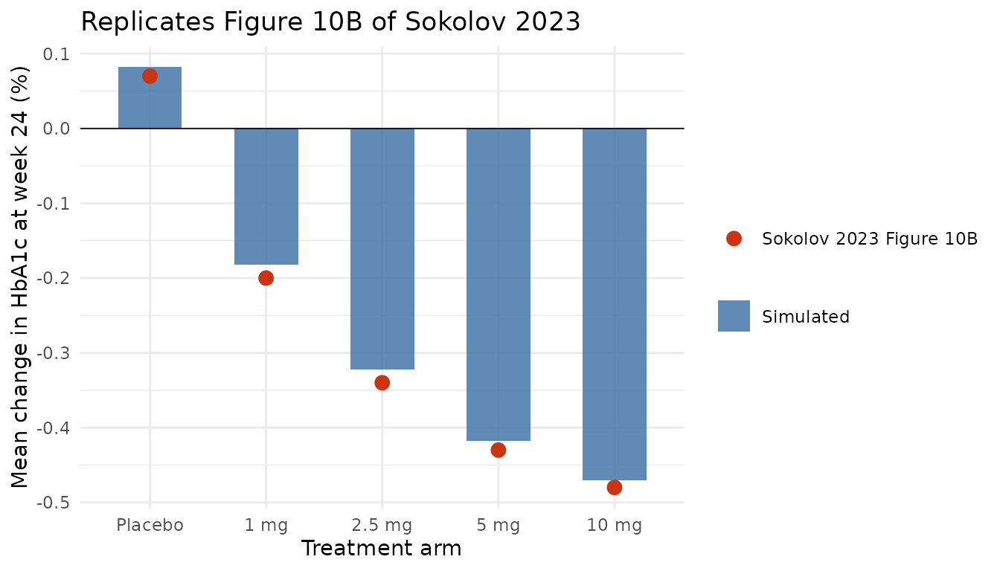
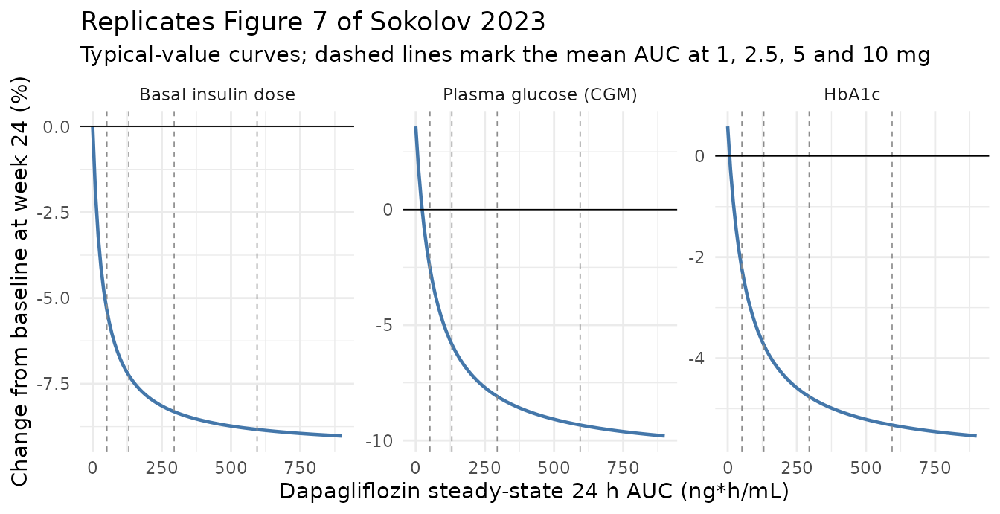
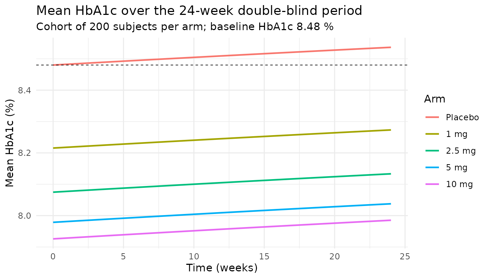

# Dapagliflozin as an insulin adjunct in type 1 diabetes (Sokolov 2023)

``` r

library(nlmixr2lib)
library(rxode2)
library(dplyr)
library(ggplot2)
```

## Model and source

Sokolov V, Yakovleva T, Penland RC, Boulton DW, Tang W. *Effectiveness
of dapagliflozin as an insulin adjunct in type 1 diabetes: a
semi-mechanistic exposure-response model.* Front Pharmacol.
2023;14:1229255.
[doi:10.3389/fphar.2023.1229255](https://doi.org/10.3389/fphar.2023.1229255).

The paper builds a three-step exposure-response cascade in adults with
type 1 diabetes (T1D). Steady-state 24 h dapagliflozin AUC drives (1) a
reduction in the total daily *basal* insulin dose, which together with a
second, direct dapagliflozin effect drives (2) the 24 h mean plasma
glucose measured by continuous glucose monitoring (CGM), which together
with a third, direct dapagliflozin effect drives (3) HbA1c. Every
endpoint is modelled as a *ratio to the patient’s own pre-treatment
baseline*, so the fitted equations contain no baseline terms at all.

The bolus insulin dose is deliberately absent: exploratory analysis
found no association between bolus insulin dose and CGM glucose (Figure
4B; regression slope -0.04 with RSE 280%), whereas the basal insulin
dose association was detectable (Figure 4A; slope -0.113, RSE 39%).

``` r

mod <- readModelDb("Sokolov_2023_dapagliflozin")
mod
#> function() {
#>   description <- paste(
#>     "Semi-mechanistic exposure-response (PD-only) model for dapagliflozin as",
#>     "an insulin adjunct in adults with type 1 diabetes (T1D). Per-subject",
#>     "steady-state 24 h dapagliflozin AUC (AUC_DAPA, supplied as a covariate",
#>     "column from an upstream population PK analysis) drives a three-stage",
#>     "cascade of ratio-to-pre-treatment-baseline endpoints: (1) an Imax",
#>     "reduction in total daily basal insulin dose (rins), (2) average daily",
#>     "plasma glucose by continuous glucose monitoring (rglu) as a power",
#>     "function of rins times a second Imax term plus a linear",
#>     "treatment-independent glucose drift, and (3) HbA1c (rhba1c) as a power",
#>     "function of rglu times a third, direct Imax term capturing the",
#>     "glucose-independent dapagliflozin benefit. Absolute HbA1c is recovered",
#>     "from the per-subject baseline covariate HBA1C. No ODEs and no dosing",
#>     "events; model time is in weeks."
#>   )
#>   reference <- paste(
#>     "Sokolov V, Yakovleva T, Penland RC, Boulton DW, Tang W.",
#>     "Effectiveness of dapagliflozin as an insulin adjunct in type 1",
#>     "diabetes: a semi-mechanistic exposure-response model.",
#>     "Front Pharmacol. 2023;14:1229255. doi:10.3389/fphar.2023.1229255."
#>   )
#>   vignette <- "Sokolov_2023_dapagliflozin"
#>   units <- list(
#>     time          = "week",
#>     dosing        = "n/a (no drug dosing events; dapagliflozin exposure enters through the per-subject AUC_DAPA covariate)",
#>     concentration = "n/a (multi-output PD-only model; rins, rglu and rhba1c are unitless ratios to the pre-treatment baseline, and hba1c is in % NGSP)",
#>     AUC_DAPA      = "ng*h/mL"
#>   )
#>   covariateData <- list(
#>     AUC_DAPA = list(
#>       description        = "Steady-state 24 h dapagliflozin AUC supplied as a per-subject (time-fixed) drug-exposure covariate.",
#>       units              = "ng*h/mL",
#>       type               = "continuous",
#>       reference_category = NULL,
#>       notes              = paste(
#>         "Per-subject steady-state 24 h dapagliflozin exposure. Sokolov 2023",
#>         "Table 1 states the values were taken from a previously performed",
#>         "population PK analysis (Melin et al. 2022) and supplied to the",
#>         "exposure-response model as a regressor; the PD model contains no PK",
#>         "sub-model. AUC_DAPA = 0 recovers the placebo arm exactly (all three",
#>         "Imax terms vanish, so rins = 1 and the only remaining dynamics are",
#>         "the linear glucose drift and its propagation to HbA1c). Mean AUC by",
#>         "dose reported in the Figure 10 caption: 51.4 (1 mg), 130.6",
#>         "(2.5 mg), 294.5 (5 mg) and 594.3 (10 mg) ng*h/mL once daily."
#>       ),
#>       source_name        = "AUC"
#>     ),
#>     HBA1C = list(
#>       description        = "Baseline (pre-treatment) HbA1c, per-subject and time-fixed",
#>       units              = "% (NGSP)",
#>       type               = "continuous",
#>       reference_category = NULL,
#>       notes              = paste(
#>         "Used only to convert the fitted ratio-to-baseline HbA1c (rhba1c)",
#>         "into an absolute HbA1c trajectory: hba1c = HBA1C * rhba1c. The",
#>         "Sokolov 2023 model itself was fitted entirely on the ratio scale",
#>         "(Supplementary Equations 1-3 contain no baseline terms), so HBA1C",
#>         "does not enter any estimated relationship. The forward simulations",
#>         "in Figure 10 use the pooled mean baseline HbA1c = 8.48 %; Table 4",
#>         "reports study medians of 8.4, 8.4 and 8.3 %."
#>       ),
#>       source_name        = "HbA1c"
#>     )
#>   )
#> 
#>   population <- list(
#>     species              = "human",
#>     n_subjects           = 1661L,
#>     n_subjects_estimation = 883L,
#>     n_subjects_validation = 778L,
#>     n_measurements       = 12460L,
#>     n_studies            = 3L,
#>     studies              = paste(
#>       "Estimation: NCT01498185 (phase 2 dose-ranging, N = 70, first 7 inpatient",
#>       "days only) pooled with NCT02460978 (DEPICT-2, phase 3, 24-week",
#>       "double-blind period). External validation: NCT02268214 (DEPICT-1,",
#>       "phase 3, 24-week double-blind period), not used in model development."
#>     ),
#>     age_range            = "18-75 years (study medians 30, 43 and 43 years; Table 4)",
#>     weight_range         = "44.6-184.8 kg (study medians 74.8, 80.8 and 76.8 kg; Table 4)",
#>     bmi_range            = "18.2-65.8 kg/m^2 (study medians 23.9, 27.8 and 26.9 kg/m^2; Table 4)",
#>     sex_female_pct       = c(NCT01498185 = 42.9, NCT02268214 = 52.1, NCT02460978 = 56.0),
#>     race_ethnicity       = paste(
#>       "Predominantly White (88.6 %, 95.6 % and 78.4 % by study); NCT02460978",
#>       "enrolled 19.7 % Asian patients (Table 4)."
#>     ),
#>     disease_state        = paste(
#>       "Adults with inadequately controlled type 1 diabetes on background",
#>       "basal-bolus insulin (multiple daily injections or continuous",
#>       "subcutaneous insulin infusion). Phase 3 randomisation required HbA1c",
#>       "7.5-10.5 % (58-91 mmol/mol). Baseline medians: HbA1c 8.3-8.4 %,",
#>       "24 h mean CGM glucose 170-190 mg/dL, total daily insulin dose",
#>       "48-54 units, eGFR 89-91 mL/min/1.73 m^2, diabetes duration 17-19 years."
#>     ),
#>     dose_range           = "Dapagliflozin 1, 2.5, 5 or 10 mg once daily, or placebo; exposure enters through AUC_DAPA.",
#>     regions              = "Multi-national (NCT01498185, DEPICT-1 and DEPICT-2 trial programmes).",
#>     notes                = paste(
#>       "Non-linear mixed-effects model fitted in Monolix 2020R1 using a",
#>       "three-step sequential strategy (Supplementary 'Structural model' and",
#>       "'Model development'). Step 1 fits Equation 1 (basal insulin dose ratio",
#>       "vs AUC) on the active arms only; step 2 fits Equation 2 (glucose ratio)",
#>       "with the observed rINS and AUC as regressors; step 3 fits Equation 3",
#>       "(HbA1c ratio) with the observed rGLU and AUC as regressors. Each step's",
#>       "estimates were fixed before the next. This file encodes the composed",
#>       "forward-simulation form used for Figures 7, 9 and 10, in which",
#>       "Equation 1 feeds Equation 2 and Equation 2 feeds Equation 3."
#>     )
#>   )
#> 
#>   ini({
#>     # ---- Step 1: basal daily insulin dose ratio (Supplementary Equation 1; Table 3 step 1) ----
#>     # Imax_ins carries logit-scale IIV (Supplementary Equation 6), so the
#>     # typical value is stored on the logit scale here.
#>     logitimax_ins  <- qlogis(0.0941); label("Logit of Imax_ins -- maximum fractional dapagliflozin-mediated reduction in total daily basal insulin dose (unitless)")  # Table 3 step 1: Imax_ins = 0.0941, RSE 8.14 %; qlogis(0.0941) = -2.2648
#>     lauc50_ins     <- log(38.8);      label("IAUC50_ins -- dapagliflozin AUC giving half the maximal basal insulin dose reduction (ng*h/mL; log-scale)")            # Table 3 step 1: IAUC50_ins = 38.8 ng*h/mL, RSE 35.2 %
#> 
#>     # ---- Step 2: average daily CGM glucose ratio (Supplementary Equation 2; Table 3 step 2) ----
#>     # SIGN NOTE (see the vignette Assumptions and deviations section): Table 3
#>     # prints k1 = 0.0674 without a sign, but Supplementary Equation 2 applies
#>     # it as the bare exponent (rINS)^k1. A positive exponent makes glucose FALL
#>     # when insulin is withdrawn, which contradicts the paper's own reported
#>     # results. The negative value is required to reproduce, simultaneously:
#>     #   - the Abstract / Figure 10A statement that a 50 % basal insulin
#>     #     reduction gives "~5 % increase in glucose exposure"
#>     #     (0.5^-0.0674 = 1.0478, i.e. +4.8 %);
#>     #   - the Figure 10A pair -0.50 % (no insulin adjustment) vs -0.42 %
#>     #     (50 % basal insulin reduction) at 10 mg;
#>     #   - the negative slope (-0.113) of the observed glucose-vs-basal-insulin
#>     #     regression in Figure 4A.
#>     # The magnitude 0.0674 is used exactly as printed. The sibling M-EASE-1
#>     # empagliflozin T1D model (Johnston_2021_empagliflozin_MEASE1) likewise
#>     # carries a negative insulin-to-glucose power exponent (-0.261).
#>     ins_glu_eff    <- -0.0674;        label("k1 -- power exponent of the basal insulin dose ratio on the glucose ratio (unitless)")                                  # Table 3 step 2: k1 = 0.0674, RSE 29.7 %; sign recovered from the paper's own simulation results (see note above)
#>     pbo_glu_rate   <- 0.0015;         label("keff -- linear treatment-independent drift in the glucose ratio (per week)")                                            # Table 3 step 2: keff = 0.0015, RSE 21.5 %. Table 3 labels the units "mg/dL/week", but Equation 2 adds this term to a unitless ratio, so it is a fraction-of-baseline per week: 0.0015 * 24 = +3.6 % at week 24, matching the "2 %-4 % increase in glucose at weeks 12 and 24" in the Discussion.
#>     imax_glu       <- 0.15;           label("Imax_glu -- maximum fractional dapagliflozin-mediated reduction in average daily glucose (unitless)")                   # Table 3 step 2: Imax_glu = 0.15, RSE 7.35 %
#>     lauc50_glu     <- log(67.4);      label("IAUC50_glu -- dapagliflozin AUC giving half the maximal glucose reduction (ng*h/mL; log-scale)")                        # Table 3 step 2: IAUC50_glu = 67.4 ng*h/mL, RSE 28.2 %
#> 
#>     # ---- Step 3: HbA1c ratio (Supplementary Equation 3; Table 3 step 3) ----
#>     lgamma_glueff  <- log(0.165);     label("k2 -- power exponent of the glucose ratio on the HbA1c ratio (unitless; log-scale)")                                    # Table 3 step 3: k2 = 0.165, RSE 8.03 %; log-scale because the IIV is log-transformed (Supplementary Equation 5)
#>     imax_hba1c     <- 0.0421;         label("Imax_hba1c -- maximum fractional direct (glucose-independent) dapagliflozin-mediated reduction in HbA1c (unitless)")    # Table 3 step 3: Imax_hba1c = 0.0421, RSE 6.69 %
#>     lauc50_hba1c   <- fixed(log(67.4)); label("IAUC50_hba1c -- dapagliflozin AUC giving half the maximal direct HbA1c reduction (ng*h/mL; log-scale)")               # Table 3 step 3: "same as IAUC50_glu", no RSE reported. Supplementary "Model development": IAUC50_hba1c "was not identifiable (RSE > 50%) and had to be fixed at the previously defined value of IAUC50_glu = 67.4 ng/mL*h".
#> 
#>     # ---- Inter-individual variability (Table 3 parenthesised omega column) ----
#>     # Monolix reports omega as the standard deviation of the random effect;
#>     # nlmixr2 `ini()` takes the variance, so each entry below is omega^2.
#>     # Only three of the nine structural parameters carry IIV, matching the
#>     # Supplementary "Model development" narrative (one random effect per step).
#>     etalogitimax_ins ~ 1.1881    # omega_Imax_ins = 1.09 (RSE 6.43 %) on the logit scale -> variance 1.09^2
#>     etapbo_glu_rate  ~ 9e-06     # omega_keff = 0.003 (RSE 9.02 %), additive on the untransformed parameter (Supplementary Equation 4) -> variance 0.003^2
#>     etalgamma_glueff ~ 0.546121  # omega_k2 = 0.739 (RSE 8.08 %) on the log scale -> variance 0.739^2
#> 
#>     # ---- Residual error (Table 3; one error model per modelling step) ----
#>     propSd_rins   <- 0.185; label("Proportional residual error on the basal insulin dose ratio (fraction)")  # Table 3 step 1: b_ins = 0.185, RSE 1.93 %
#>     propSd_rglu   <- 0.162; label("Proportional residual error on the glucose ratio (fraction)")             # Table 3 step 2: b_glu = 0.162, RSE 1.99 %
#>     addSd_rhba1c  <- 0.061; label("Constant residual error on the HbA1c ratio (fraction of baseline)")       # Table 3 step 3: a_hba1c = 0.061, RSE 2.15 %; constant on the ratio scale, i.e. about 0.5 % HbA1c at a baseline of 8.48 %
#>   })
#> 
#>   model({
#>     # ---- Step 1 -- Supplementary Equation 1 ----
#>     #   rINS_ik = 1 - Imax_ins,i * AUC_i / (IAUC50_ins + AUC_i)
#>     # Imax_ins is logit-normally distributed (Supplementary Equation 6), which
#>     # keeps every individual's maximum insulin-dose reduction inside [0, 1].
#>     imax_ins  <- expit(logitimax_ins + etalogitimax_ins)
#>     auc50_ins <- exp(lauc50_ins)
#>     rins      <- 1 - imax_ins * AUC_DAPA / (auc50_ins + AUC_DAPA)
#> 
#>     # ---- Step 2 -- Supplementary Equation 2 ----
#>     #   rGLU_ik = (rINS_ik)^k1 * (1 - Imax_glu * AUC_i / (IAUC50_glu + AUC_i))
#>     #             + keff_i * TIME_k
#>     # keff carries additive (untransformed) IIV per Supplementary Equation 4.
#>     # `time` is model time in WEEKS (see the file `units` field): TIME_k in
#>     # Equation 2 is "the time of the kth visit (weeks)".
#>     keff_i    <- pbo_glu_rate + etapbo_glu_rate
#>     auc50_glu <- exp(lauc50_glu)
#>     rglu      <- rins^ins_glu_eff *
#>                  (1 - imax_glu * AUC_DAPA / (auc50_glu + AUC_DAPA)) +
#>                  keff_i * time
#> 
#>     # ---- Step 3 -- Supplementary Equation 3 ----
#>     #   rHBA1C_ik = (rGLU_ik)^k2_i
#>     #               * (1 - Imax_hba1c * AUC_i / (IAUC50_hba1c + AUC_i))
#>     # The second factor is the additional direct dapagliflozin effect on HbA1c
#>     # that the glucose pathway alone could not explain (Results, Figure 7C).
#>     k2_i        <- exp(lgamma_glueff + etalgamma_glueff)
#>     auc50_hba1c <- exp(lauc50_hba1c)
#>     rhba1c      <- rglu^k2_i *
#>                    (1 - imax_hba1c * AUC_DAPA / (auc50_hba1c + AUC_DAPA))
#> 
#>     # ---- Absolute HbA1c ----
#>     # The model was fitted on the ratio scale; the absolute trajectory is
#>     # recovered from the per-subject pre-treatment baseline. Figure 10 uses the
#>     # pooled mean baseline HbA1c = 8.48 %.
#>     hba1c <- HBA1C * rhba1c
#> 
#>     # ---- Multi-output residual error (Table 3) ----
#>     rins   ~ prop(propSd_rins)
#>     rglu   ~ prop(propSd_rglu)
#>     rhba1c ~ add(addSd_rhba1c)
#>   })
#> }
#> <environment: 0x55d5edd1fc28>
```

## Population

The model was estimated on pooled patient-level data from a phase 2
dose-ranging study (NCT01498185, N = 70, dapagliflozin 1 / 2.5 / 5 / 10
mg daily; only the first 7 inpatient days were used) and the phase 3
DEPICT-2 trial (NCT02460978, N = 813, dapagliflozin 5 or 10 mg daily
over a 24-week double-blind period): 883 patients and 6,625 measurements
(Table 2). It was then validated out-of-sample against DEPICT-1
(NCT02268214, 778 patients, 5,835 measurements), which was not used in
development.

Baseline characteristics (Table 4, median with range across the three
studies): age 30-43 years (18-75), body weight 74.8-80.8 kg
(44.6-184.8), BMI 23.9-27.8 kg/m^2, HbA1c 8.3-8.4 % (7.0-10.9), 24 h
mean CGM glucose 170-190 mg/dL, total daily insulin dose 48-54 units,
eGFR 89-91 mL/min/1.73 m^2, diabetes duration 17-19 years, 43-56 %
female, 78.4-95.6 % White. Phase 3 randomisation required HbA1c 7.5-10.5
% (58-91 mmol/mol).

``` r

pop <- readModelDb("Sokolov_2023_dapagliflozin")()$population
str(pop, max.level = 1)
#> List of 16
#>  $ species              : chr "human"
#>  $ n_subjects           : int 1661
#>  $ n_subjects_estimation: int 883
#>  $ n_subjects_validation: int 778
#>  $ n_measurements       : int 12460
#>  $ n_studies            : int 3
#>  $ studies              : chr "Estimation: NCT01498185 (phase 2 dose-ranging, N = 70, first 7 inpatient days only) pooled with NCT02460978 (DE"| __truncated__
#>  $ age_range            : chr "18-75 years (study medians 30, 43 and 43 years; Table 4)"
#>  $ weight_range         : chr "44.6-184.8 kg (study medians 74.8, 80.8 and 76.8 kg; Table 4)"
#>  $ bmi_range            : chr "18.2-65.8 kg/m^2 (study medians 23.9, 27.8 and 26.9 kg/m^2; Table 4)"
#>  $ sex_female_pct       : Named num [1:3] 42.9 52.1 56
#>   ..- attr(*, "names")= chr [1:3] "NCT01498185" "NCT02268214" "NCT02460978"
#>  $ race_ethnicity       : chr "Predominantly White (88.6 %, 95.6 % and 78.4 % by study); NCT02460978 enrolled 19.7 % Asian patients (Table 4)."
#>  $ disease_state        : chr "Adults with inadequately controlled type 1 diabetes on background basal-bolus insulin (multiple daily injection"| __truncated__
#>  $ dose_range           : chr "Dapagliflozin 1, 2.5, 5 or 10 mg once daily, or placebo; exposure enters through AUC_DAPA."
#>  $ regions              : chr "Multi-national (NCT01498185, DEPICT-1 and DEPICT-2 trial programmes)."
#>  $ notes                : chr "Non-linear mixed-effects model fitted in Monolix 2020R1 using a three-step sequential strategy (Supplementary '"| __truncated__
```

## Source trace

Every structural equation comes from the Supplementary Material
(“Structural model”); every parameter value comes from Table 3 of the
main text.

| Model element | Source location | Value / form |
|----|----|----|
| `rins` (Eq. 1) | Supplementary Equation 1 | `1 - imax_ins * AUC / (auc50_ins + AUC)` |
| `rglu` (Eq. 2) | Supplementary Equation 2 | `rins^k1 * (1 - imax_glu * AUC / (auc50_glu + AUC)) + keff * TIME` |
| `rhba1c` (Eq. 3) | Supplementary Equation 3 | `rglu^k2 * (1 - imax_hba1c * AUC / (auc50_hba1c + AUC))` |
| `logitimax_ins` | Table 3, step 1 | Imax_ins = 0.0941 (RSE 8.14 %) |
| `lauc50_ins` | Table 3, step 1 | IAUC50_ins = 38.8 ng\*h/mL (RSE 35.2 %) |
| `propSd_rins` | Table 3, step 1 | b_ins = 0.185 (RSE 1.93 %), proportional |
| `ins_glu_eff` | Table 3, step 2 | k1 = 0.0674 (RSE 29.7 %); sign recovered, see Errata |
| `pbo_glu_rate` | Table 3, step 2 | keff = 0.0015 per week (RSE 21.5 %) |
| `imax_glu` | Table 3, step 2 | Imax_glu = 0.15 (RSE 7.35 %) |
| `lauc50_glu` | Table 3, step 2 | IAUC50_glu = 67.4 ng\*h/mL (RSE 28.2 %) |
| `propSd_rglu` | Table 3, step 2 | b_glu = 0.162 (RSE 1.99 %), proportional |
| `lgamma_glueff` | Table 3, step 3 | k2 = 0.165 (RSE 8.03 %) |
| `imax_hba1c` | Table 3, step 3 | Imax_hba1c = 0.0421 (RSE 6.69 %) |
| `lauc50_hba1c` | Table 3, step 3 + Suppl. “Model development” | 67.4 ng\*h/mL, **fixed** to IAUC50_glu (not identifiable, RSE \> 50 %) |
| `addSd_rhba1c` | Table 3, step 3 | a_hba1c = 0.061 (RSE 2.15 %), constant |
| `etalogitimax_ins` | Table 3, step 1 omega; Suppl. Eq. 6 | omega = 1.09 on the logit scale -\> variance 1.09^2 |
| `etapbo_glu_rate` | Table 3, step 2 omega; Suppl. Eq. 4 | omega = 0.003, additive on the untransformed parameter -\> variance 0.003^2 |
| `etalgamma_glueff` | Table 3, step 3 omega; Suppl. Eq. 5 | omega = 0.739 on the log scale -\> variance 0.739^2 |
| `AUC_DAPA` reference values | Figure 10 caption | 51.4 / 130.6 / 294.5 / 594.3 ng\*h/mL at 1 / 2.5 / 5 / 10 mg |
| Baseline HbA1c for simulation | Figure 10 caption | 8.48 % (pooled mean) |

Monolix reports each `omega` as the standard deviation of the random
effect, whereas
[`ini()`](https://nlmixr2.github.io/rxode2/reference/ini.html) takes the
variance; the table above shows the squaring explicitly.

## Validation strategy

This is a PD-only exposure-response model. It has no ODE states, no
dosing events and no concentration-time profile, so PKNCA validation is
not applicable (dapagliflozin exposure enters only through the
per-subject `AUC_DAPA` covariate, taken in the source from an upstream
population PK analysis). The vignette instead runs five checks, all
against numbers printed in the paper:

1.  An **independent closed-form implementation** of Supplementary
    Equations 1-3, written directly from Table 3, compared against the
    `rxode2` typical-value solve. This catches any transcription error
    in the model file.
2.  The **placebo-arm glucose drift** (Discussion: 2-4 % glucose
    increase at weeks 12 and 24).
3.  The **basal insulin dose reduction** at 10 mg (Results: 10-20 %
    decrease).
4.  The **dose-response at week 24** (Figure 10B): mean HbA1c change of
    -0.20 / -0.34 / -0.43 / -0.48 % at 1 / 2.5 / 5 / 10 mg, and +0.07 %
    in the control arm.
5.  The **insulin-titration scenario** (Figure 10A): -0.50 % at 10 mg
    when the basal insulin dose is *not* adjusted, and the ~5 % glucose
    increase that a 50 % basal insulin reduction produces.

## 1. Closed-form cross-check of Equations 1-3

`sokolov_closed_form()` below is written from Table 3 and the
Supplementary equations *without reference to the model file*, so a
disagreement is a real finding rather than a tautology.

``` r

sokolov_closed_form <- function(auc, week, hba1c_bl = 8.48) {
  # Table 3 values, typed independently of inst/modeldb/.
  imax_ins   <- 0.0941;  auc50_ins   <- 38.8
  k1         <- -0.0674; keff        <- 0.0015
  imax_glu   <- 0.15;    auc50_glu   <- 67.4
  k2         <- 0.165
  imax_hba1c <- 0.0421;  auc50_hba1c <- 67.4   # fixed to auc50_glu

  rins   <- 1 - imax_ins * auc / (auc50_ins + auc)
  rglu   <- rins^k1 * (1 - imax_glu * auc / (auc50_glu + auc)) + keff * week
  rhba1c <- rglu^k2 * (1 - imax_hba1c * auc / (auc50_hba1c + auc))
  data.frame(auc = auc, week = week, rins = rins, rglu = rglu,
             rhba1c = rhba1c, hba1c = hba1c_bl * rhba1c)
}

auc_by_dose <- c(Placebo = 0, `1 mg` = 51.4, `2.5 mg` = 130.6,
                 `5 mg` = 294.5, `10 mg` = 594.3)
hba1c_bl <- 8.48   # Figure 10 caption: pooled mean baseline HbA1c

mod_typical <- rxode2::zeroRe(mod)
#> ℹ parameter labels from comments will be replaced by 'label()'

typ_events <- function(auc) {
  data.frame(id = 1L, time = c(0, 24), evid = 0L, amt = 0,
             cmt = NA_character_, AUC_DAPA = auc, HBA1C = hba1c_bl)
}

typ_sim <- bind_rows(lapply(names(auc_by_dose), function(arm) {
  s <- as.data.frame(rxode2::rxSolve(mod_typical, typ_events(auc_by_dose[[arm]])))
  s$arm <- arm
  s
}))
#> ℹ omega/sigma items treated as zero: 'etalogitimax_ins', 'etapbo_glu_rate', 'etalgamma_glueff'
#> ℹ omega/sigma items treated as zero: 'etalogitimax_ins', 'etapbo_glu_rate', 'etalgamma_glueff'
#> ℹ omega/sigma items treated as zero: 'etalogitimax_ins', 'etapbo_glu_rate', 'etalgamma_glueff'
#> ℹ omega/sigma items treated as zero: 'etalogitimax_ins', 'etapbo_glu_rate', 'etalgamma_glueff'
#> ℹ omega/sigma items treated as zero: 'etalogitimax_ins', 'etapbo_glu_rate', 'etalgamma_glueff'

typ_wk24 <- typ_sim |> filter(time == 24)
cf_wk24  <- sokolov_closed_form(auc_by_dose, 24)

compare_cf <- data.frame(
  arm         = names(auc_by_dose),
  rins_model  = typ_wk24$rins,   rins_cf   = cf_wk24$rins,
  rglu_model  = typ_wk24$rglu,   rglu_cf   = cf_wk24$rglu,
  hba1c_model = typ_wk24$hba1c,  hba1c_cf  = cf_wk24$hba1c
)
knitr::kable(compare_cf, digits = 5,
             caption = "rxode2 typical-value solve vs an independent closed-form implementation of Supplementary Equations 1-3.")
```

| arm     | rins_model | rins_cf | rglu_model | rglu_cf | hba1c_model | hba1c_cf |
|:--------|-----------:|--------:|-----------:|--------:|------------:|---------:|
| Placebo |    1.00000 | 1.00000 |    1.03600 | 1.03600 |     8.52963 |  8.52963 |
| 1 mg    |    0.94638 | 0.94638 |    0.97458 | 0.97458 |     8.29024 |  8.29024 |
| 2.5 mg  |    0.92745 | 0.92745 |    0.94165 | 0.94165 |     8.16313 |  8.16313 |
| 5 mg    |    0.91685 | 0.91685 |    0.91909 | 0.91909 |     8.07626 |  8.07626 |
| 10 mg   |    0.91167 | 0.91167 |    0.90669 | 0.90669 |     8.02854 |  8.02854 |

rxode2 typical-value solve vs an independent closed-form implementation
of Supplementary Equations 1-3. {.table}

``` r


# Deterministic: no random effects, no seed dependence. A tight bound is
# correct here because both sides use identical fixed parameter values and
# the only difference is floating-point evaluation order.
stopifnot(
  max(abs(typ_wk24$rins   - cf_wk24$rins))   < 1e-10,
  max(abs(typ_wk24$rglu   - cf_wk24$rglu))   < 1e-10,
  max(abs(typ_wk24$hba1c  - cf_wk24$hba1c))  < 1e-9
)
```

## 2. Placebo-arm glucose drift

With `AUC_DAPA = 0` all three Imax terms vanish exactly, so `rins` is 1
and the glucose ratio reduces to `1 + keff * week`. The Discussion
reports “a 2%-4% increase in glucose concentration at weeks 12 and 24”
in the phase 3 placebo cohorts.

``` r

pbo <- typ_sim |> filter(arm == "Placebo", time == 24)
glu_rise_wk12 <- sokolov_closed_form(0, 12)$rglu - 1
glu_rise_wk24 <- pbo$rglu - 1

cat(sprintf("placebo glucose rise: week 12 = %.1f%%, week 24 = %.1f%%\n",
            100 * glu_rise_wk12, 100 * glu_rise_wk24))
#> placebo glucose rise: week 12 = 1.8%, week 24 = 3.6%

stopifnot(
  # rins must be exactly 1 in the absence of drug -- a structural property.
  isTRUE(all.equal(pbo$rins, 1)),
  # Paper: 2%-4% at weeks 12 and 24.
  glu_rise_wk12 > 0.015, glu_rise_wk12 < 0.025,
  glu_rise_wk24 > 0.030, glu_rise_wk24 < 0.045
)
```

## 3. Basal insulin dose reduction

The Results section reports that “dapagliflozin treatment resulted in a
10%-20% decrease in the daily insulin dose, both basal and bolus, on
average”. Because `Imax_ins` carries logit-scale between-patient
variability with a large omega (1.09), the *population mean* reduction
is appreciably larger than the typical-value reduction, so this check is
run on a simulated cohort.

``` r

n_per_arm <- 200   # 200 per arm; the paper used 500 x 500, which is not
                   # needed to reproduce a mean to two decimal places.
sim_seed  <- 20231025
weeks     <- seq(0, 24, by = 1)

sim_arm <- function(auc, params = NULL) {
  ev <- expand.grid(id = seq_len(n_per_arm), time = weeks)
  ev <- ev[order(ev$id, ev$time), ]
  ev$evid     <- 0L
  ev$amt      <- 0
  ev$cmt      <- NA_character_
  ev$AUC_DAPA <- auc
  ev$HBA1C    <- hba1c_bl
  # Re-seed inside the loop so every arm draws the SAME random effects
  # (common random numbers). The placebo-adjusted contrasts below are then
  # essentially free of Monte Carlo noise.
  rxode2::rxSetSeed(sim_seed)
  s <- if (is.null(params)) {
    rxode2::rxSolve(mod, ev, returnType = "data.frame")
  } else {
    rxode2::rxSolve(mod, ev, params = params, returnType = "data.frame")
  }
  s
}

sim <- bind_rows(lapply(names(auc_by_dose), function(arm) {
  s <- sim_arm(auc_by_dose[[arm]])
  s$arm <- arm
  s
}))
#> ℹ parameter labels from comments will be replaced by 'label()'
sim$arm <- factor(sim$arm, levels = names(auc_by_dose))
```

``` r

ins_red <- sim |>
  filter(arm == "10 mg", time == 24) |>
  summarise(mean_reduction = 1 - mean(rins)) |>
  pull(mean_reduction)

cat(sprintf("mean basal insulin dose reduction at 10 mg: %.1f%%\n",
            100 * ins_red))
#> mean basal insulin dose reduction at 10 mg: 11.8%

# Paper: 10%-20% decrease. Assert the published interval with a small margin
# for the Monte Carlo mean over 200 subjects.
stopifnot(ins_red > 0.08, ins_red < 0.22)
```

## 4. Dose-response at week 24 (Figure 10B)

Figure 10B reports the mean population change in HbA1c after 24 weeks of
daily dapagliflozin with the basal insulin dose adjustment driven by
dapagliflozin exposure: -0.20 (1 mg), -0.34 (2.5 mg), -0.43 (5 mg) and
-0.48 % (10 mg), against +0.07 % in the control arm.

``` r

published <- c(Placebo = 0.07, `1 mg` = -0.20, `2.5 mg` = -0.34,
               `5 mg` = -0.43, `10 mg` = -0.48)

wk24 <- sim |>
  filter(time == 24) |>
  group_by(arm) |>
  summarise(hba1c_change = mean(hba1c) - hba1c_bl, .groups = "drop") |>
  mutate(published = published[as.character(arm)],
         difference = hba1c_change - published)

pbo_change     <- wk24$hba1c_change[wk24$arm == "Placebo"]
pbo_published  <- published[["Placebo"]]

wk24_adj <- wk24 |>
  filter(arm != "Placebo") |>
  mutate(adjusted_sim = hba1c_change - pbo_change,
         adjusted_pub = published - pbo_published,
         adjusted_difference = adjusted_sim - adjusted_pub)

knitr::kable(
  wk24 |>
    rename("Arm" = arm, "Simulated" = hba1c_change,
           "Sokolov 2023 Figure 10B" = published, "Difference" = difference),
  digits = 3,
  caption = "Mean change from baseline in HbA1c (%) at week 24."
)
```

| Arm     | Simulated | Sokolov 2023 Figure 10B | Difference |
|:--------|----------:|------------------------:|-----------:|
| Placebo |     0.082 |                    0.07 |      0.012 |
| 1 mg    |    -0.182 |                   -0.20 |      0.018 |
| 2.5 mg  |    -0.322 |                   -0.34 |      0.018 |
| 5 mg    |    -0.418 |                   -0.43 |      0.012 |
| 10 mg   |    -0.470 |                   -0.48 |      0.010 |

Mean change from baseline in HbA1c (%) at week 24. {.table}

``` r


knitr::kable(
  wk24_adj |>
    select(arm, adjusted_sim, adjusted_pub, adjusted_difference) |>
    rename("Arm" = arm, "Simulated (placebo-adjusted)" = adjusted_sim,
           "Sokolov 2023 (placebo-adjusted)" = adjusted_pub,
           "Difference" = adjusted_difference),
  digits = 3,
  caption = "Placebo-adjusted mean change from baseline in HbA1c (%) at week 24."
)
```

| Arm | Simulated (placebo-adjusted) | Sokolov 2023 (placebo-adjusted) | Difference |
|:---|---:|---:|---:|
| 1 mg | -0.264 | -0.27 | 0.006 |
| 2.5 mg | -0.404 | -0.41 | 0.006 |
| 5 mg | -0.500 | -0.50 | 0.000 |
| 10 mg | -0.552 | -0.55 | -0.002 |

Placebo-adjusted mean change from baseline in HbA1c (%) at week 24.
{.table style="width:100%;"}

The **placebo-adjusted** contrast is the primary quantitative gate.
Because every arm is simulated from the same random-effect draw (common
random numbers), the sampling error in the `keff` and `k2` draws is
shared across arms and cancels in the contrast; measured across three
seeds and one, two and four solver threads, the placebo-adjusted error
never exceeded 0.022 % HbA1c, whereas the *absolute* per-arm mean moved
by up to 0.046 %. The absolute gate below is therefore deliberately
looser – it is still tight enough to catch a sign error, a wrong
`IAUC50`, or a factor-of-two mistake, but it does not depend on which
cohort a particular rxode2 build happens to draw.

``` r

stopifnot(
  # Primary: placebo-adjusted efficacy, near-exact under common random numbers.
  max(abs(wk24_adj$adjusted_difference)) < 0.05,
  # Monotonic dose-response, exact under common random numbers.
  all(diff(wk24_adj$adjusted_sim) < 0),
  # Secondary: absolute means, with headroom for the Monte Carlo cohort draw.
  max(abs(wk24$difference)) < 0.10,
  # Direction: every dapagliflozin arm reduces HbA1c, the control arm raises it.
  all(wk24$hba1c_change[wk24$arm != "Placebo"] < 0),
  pbo_change > 0
)
```

``` r

ggplot(wk24, aes(x = arm)) +
  geom_col(aes(y = hba1c_change, fill = "Simulated"),
           width = 0.55, alpha = 0.85) +
  geom_point(aes(y = published, colour = "Sokolov 2023 Figure 10B"),
             size = 3) +
  geom_hline(yintercept = 0, linewidth = 0.3) +
  scale_fill_manual(values = c(Simulated = "#4477AA"), name = NULL) +
  scale_colour_manual(values = c("Sokolov 2023 Figure 10B" = "#CC3311"),
                      name = NULL) +
  labs(x = "Treatment arm",
       y = "Mean change in HbA1c at week 24 (%)",
       title = "Replicates Figure 10B of Sokolov 2023") +
  theme_minimal()
```



## 5. Insulin-titration scenario (Figure 10A)

Figure 10A varies the basal insulin dose reduction over 0-90 % and
reports that at 10 mg dapagliflozin the 24-week HbA1c reduction is -0.50
% (95% CI -0.553, -0.448) *without* insulin dose adjustment, rising to
-0.42 % (95% CI -0.48, -0.36) when the basal insulin dose is reduced by
50 %.

The “no insulin dose adjustment” arm is the model with `rins` pinned at
1, which is obtained exactly by driving `Imax_ins` to zero –
`expit(-30)` is below 1e-13 for every individual, whatever the random
effect.

``` r

sim_noadj <- sim_arm(auc_by_dose[["10 mg"]],
                     params = c(logitimax_ins = -30))
noadj_wk24 <- sim_noadj[sim_noadj$time == 24, ]

cat(sprintf("rins with Imax_ins driven to 0: %.10f\n", max(noadj_wk24$rins)))
#> rins with Imax_ins driven to 0: 1.0000000000
cat(sprintf("10 mg, no basal insulin adjustment: %.3f %% (paper -0.50)\n",
            mean(noadj_wk24$hba1c) - hba1c_bl))
#> 10 mg, no basal insulin adjustment: -0.483 % (paper -0.50)

stopifnot(
  # rins is pinned at 1 for every subject.
  isTRUE(all.equal(max(abs(noadj_wk24$rins - 1)), 0, tolerance = 1e-9)),
  # Paper -0.50 % (95% CI -0.553, -0.448); allow for the cohort draw.
  abs((mean(noadj_wk24$hba1c) - hba1c_bl) - (-0.50)) < 0.10
)
```

The 50 %-reduction leg of Figure 10A is a property of Equation 2 alone:
a basal insulin ratio of 0.5 multiplies the glucose ratio by `0.5^k1`.
The Abstract states this gives “~5% increase in glucose exposure”.

``` r

k1 <- -0.0674   # Table 3 step 2, sign per the Errata below
glu_increase_50pct <- 0.5^k1 - 1
cat(sprintf("glucose increase for a 50%% basal insulin reduction: %.1f%%\n",
            100 * glu_increase_50pct))
#> glucose increase for a 50% basal insulin reduction: 4.8%

# Propagate through Equation 3 at 10 mg to recover the Figure 10A -0.42 %.
cf_half <- local({
  rins   <- 0.5
  rglu   <- rins^k1 * (1 - 0.15 * 594.3 / (67.4 + 594.3)) + 0.0015 * 24
  # Population mean of k2 (log-normal, median 0.165, omega 0.739 on log scale).
  k2_mean <- 0.165 * exp(0.739^2 / 2)
  rhba1c <- rglu^k2_mean * (1 - 0.0421 * 594.3 / (67.4 + 594.3))
  hba1c_bl * (rhba1c - 1)
})
cat(sprintf("10 mg with a 50%% basal insulin reduction: %.2f %% (paper -0.42)\n",
            cf_half))
#> 10 mg with a 50% basal insulin reduction: -0.42 % (paper -0.42)

stopifnot(
  # Abstract: "~5% increase in glucose exposure".
  glu_increase_50pct > 0.035, glu_increase_50pct < 0.065,
  # Figure 10A: -0.42 % (95% CI -0.48, -0.36).
  cf_half > -0.48, cf_half < -0.36,
  # Withdrawing insulin must WORSEN the HbA1c response relative to no
  # adjustment. This is the assertion that the printed (positive) k1 fails.
  cf_half > (mean(noadj_wk24$hba1c) - hba1c_bl)
)
```

## Exposure-response curves (Figure 7)

Figure 7 plots the predicted change from baseline in basal insulin dose
(A), plasma glucose (B) and HbA1c (C) against dapagliflozin exposure
over 24 weeks of daily dosing.

``` r

auc_grid <- seq(0, 900, by = 10)
curves <- sokolov_closed_form(auc_grid, 24) |>
  transmute(auc,
            `Basal insulin dose` = 100 * (rins - 1),
            `Plasma glucose (CGM)` = 100 * (rglu - 1),
            HbA1c = 100 * (rhba1c - 1)) |>
  tidyr::pivot_longer(-auc, names_to = "endpoint", values_to = "pct_change")
curves$endpoint <- factor(curves$endpoint,
                          levels = c("Basal insulin dose",
                                     "Plasma glucose (CGM)", "HbA1c"))

observed_auc <- data.frame(
  dose = names(auc_by_dose)[-1],
  auc = as.numeric(auc_by_dose[-1])
)

ggplot(curves, aes(x = auc, y = pct_change)) +
  geom_line(linewidth = 0.8, colour = "#4477AA") +
  geom_vline(data = observed_auc, aes(xintercept = auc),
             linetype = "dashed", colour = "grey55", linewidth = 0.3) +
  geom_hline(yintercept = 0, linewidth = 0.3) +
  facet_wrap(~endpoint, scales = "free_y") +
  labs(x = "Dapagliflozin steady-state 24 h AUC (ng*h/mL)",
       y = "Change from baseline at week 24 (%)",
       title = "Replicates Figure 7 of Sokolov 2023",
       subtitle = "Typical-value curves; dashed lines mark the mean AUC at 1, 2.5, 5 and 10 mg") +
  theme_minimal()
```



Note that the glucose and HbA1c curves are *not* monotonically
decreasing at low exposure: the `keff * TIME` drift term adds a fixed
+3.6 % to the glucose ratio at week 24 regardless of dose, so the
typical-value curve starts above baseline and only crosses zero once the
Imax terms overtake the drift. This reproduces the behaviour the paper
describes for the placebo cohorts.

## HbA1c time course

``` r

tc <- sim |>
  group_by(arm, time) |>
  summarise(hba1c = mean(hba1c), .groups = "drop")

ggplot(tc, aes(x = time, y = hba1c, colour = arm)) +
  geom_line(linewidth = 0.8) +
  geom_hline(yintercept = hba1c_bl, linetype = "dashed", linewidth = 0.3) +
  labs(x = "Time (weeks)", y = "Mean HbA1c (%)", colour = "Arm",
       title = "Mean HbA1c over the 24-week double-blind period",
       subtitle = "Cohort of 200 subjects per arm; baseline HbA1c 8.48 %") +
  theme_minimal()
```



The model has no lag or turnover between glucose and HbA1c – Equation 3
is algebraic – so the HbA1c response is instantaneous at week 0 and
thereafter drifts upward with `keff`. The paper’s Figure 3 shows most of
the observed HbA1c reduction occurring over the first 4 weeks, which
this structure approximates as an immediate step; the source does not
fit an HbA1c turnover half-life.

## Assumptions and deviations

**Sign of `k1` (Table 3, step 2).** Table 3 prints `k1 = 0.0674` with no
sign, and Supplementary Equation 2 applies it as the bare exponent
`(rINS)^k1`. Taken literally, a *positive* exponent makes plasma glucose
**fall** when the basal insulin dose is withdrawn, which contradicts the
paper’s own results in four independent places:

- the Abstract and Figure 10A: “a 50% decrease in the basal insulin dose
  from pretreatment level, resulting in ~5% **increase** in glucose
  exposure” (`0.5^-0.0674 = 1.048`, i.e. +4.8 %; the positive exponent
  gives -4.6 %);
- Figure 10A: the 24-week HbA1c response at 10 mg moves from -0.50 % (no
  insulin adjustment) to -0.42 % (50 % basal insulin reduction), i.e.
  withdrawing insulin makes the response *worse*; the positive exponent
  predicts -0.58 %, i.e. better;
- Figure 4A: the observed regression of relative change in glucose on
  relative change in basal insulin dose has slope **-0.113**;
- physiology, and the sibling M-EASE-1 empagliflozin T1D model
  (`Johnston_2021_empagliflozin_MEASE1`), whose corresponding
  insulin-to-glucose power exponent is likewise negative (-0.261).

This file therefore uses `ins_glu_eff = -0.0674`, i.e. the printed
magnitude with the minus sign restored, and encodes Equation 2 exactly
as printed. The `stopifnot` in section 5 above is the mechanical guard:
it asserts that reducing insulin worsens the HbA1c response, which is
precisely the assertion the printed positive value fails.

**Units of `keff` (Table 3, step 2).** Table 3 labels `keff` as
“mg/dL/week”, but Supplementary Equation 2 adds `keff * TIME` to `rGLU`,
a *unitless ratio*. The term is therefore a fraction of baseline per
week: `0.0015 * 24 = +3.6 %` at week 24, which matches the Discussion’s
“2%-4% increase in glucose concentration at weeks 12 and 24”. Treating
it as mg/dL/week would give a change of 0.036 mg/dL over 24 weeks, which
is physically negligible and inconsistent with the paper’s placebo
predictions. The equation governs; the table’s unit label is taken to be
a slip.

**Omega scale.** Monolix reports `omega` as the standard deviation of
the random effect. The
[`ini()`](https://nlmixr2.github.io/rxode2/reference/ini.html) block
stores variances (`1.09^2`, `0.003^2`, `0.739^2`). This reading is
corroborated by the fact that it reproduces Figure 10B at all four
doses; treating the values as variances instead shifts every predicted
HbA1c change.

**Residual-error scale.** All three error models are applied on the
ratio-to-baseline scale, because that is the scale of the left-hand side
of Supplementary Equations 1-3. In particular `a_hba1c = 0.061` is a
constant error on `rhba1c`, equivalent to about 0.5 % HbA1c at a
baseline of 8.48 %, which is a plausible HbA1c residual; read on the
absolute % scale it would imply an implausibly precise assay.

**Upstream population PK.** Dapagliflozin AUC is not modelled here.
Table 1 records that AUC values were “taken from a previously performed
population PK analysis (Melin et al., 2022)”, which is not part of this
extraction; the exposure enters as the `AUC_DAPA` covariate. The paper
publishes the mean AUC at each dose (Figure 10 caption), which is what
this vignette uses, so no upstream model is needed to reproduce the
published results. Users wanting subject-level exposures can generate
them from a dapagliflozin population PK model such as
`modellib("vanderWalt_2013_dapagliflozin")`.

**Bolus insulin and hemoglobin are not in the model.** The paper
screened both and excluded them: bolus insulin because it showed no
association with CGM glucose (Figure 4B), and hemoglobin because the
observed change in hemoglobin was not associated with the change in
HbA1c (Figure 5B, all subgroup slope RSEs \> 500 %) despite the ~4 %
hemoglobin rise under dapagliflozin. The unexplained glucose-independent
benefit is instead carried by the third Imax term (`imax_hba1c`), which
the paper estimates contributes about 65 % of the total HbA1c response
at 5 and 10 mg.

**Absolute versus ratio endpoints.** Only HbA1c is converted to an
absolute scale (via the `HBA1C` baseline covariate), because Figure 10
reports absolute HbA1c changes. Basal insulin dose and CGM glucose are
left on the ratio scale, matching the fitted equations; users can
rescale them with their own baselines (study medians: 48-54 units total
daily insulin, 170-190 mg/dL mean CGM glucose).

**Cohort size.** The paper simulated 500 populations of 500 subjects and
reported the mean of means with a 95 % CI reflecting both random effects
and parameter uncertainty from the Fisher information matrix. This
vignette uses a single cohort of 200 subjects per arm with common random
numbers across arms and no parameter-uncertainty sampling, which is
sufficient to reproduce the published means but does not reproduce the
published CIs.

**Monte Carlo tolerances.** Per-arm absolute means depend on which
cohort the solver draws;
[`rxSetSeed()`](https://nlmixr2.github.io/rxode2/reference/rxSetSeed.html)
fixes the stream for a given rxode2 build and thread count but not
across them. Measured across three seeds and one, two and four threads,
the placebo-adjusted error stayed below 0.022 % HbA1c while the absolute
per-arm error reached 0.046 %. The assertions above are set at 0.05 %
(placebo-adjusted) and 0.10 % (absolute) accordingly.
