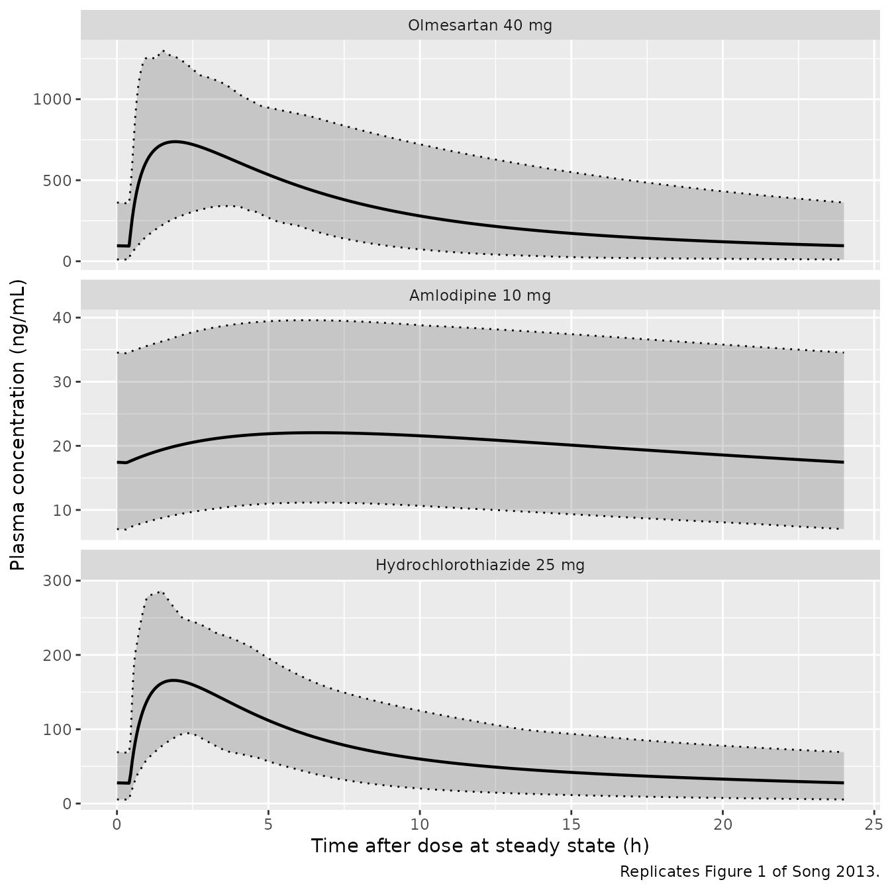
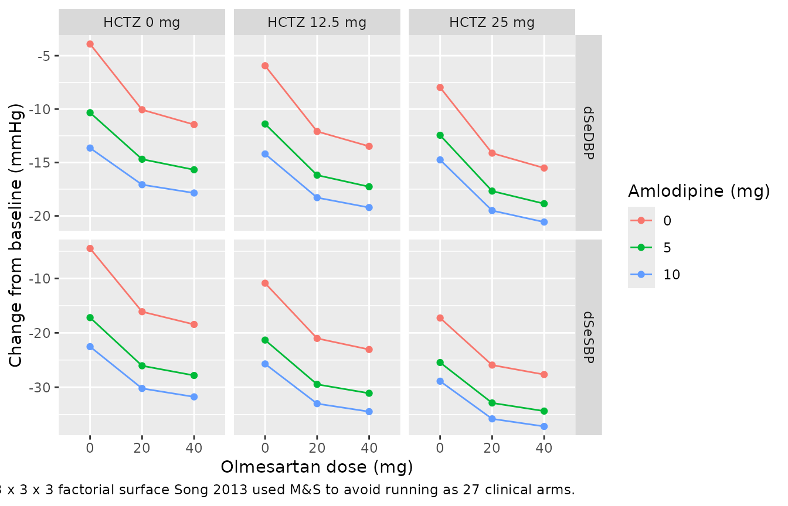

# Olmesartan + amlodipine + hydrochlorothiazide fixed-dose combination CS-8635 (Song 2013)

## Models and source

Song 2013 built five models: a population PK model for each of the three
CS-8635 components, and two exposure-response (E-R) models – one for
diastolic and one for systolic seated trough blood pressure. All five
are packaged separately, as the authors fitted them.

| [`modellib()`](https://nlmixr2.github.io/nlmixr2lib/reference/modellib.md) name | Role | Source table |
|----|----|----|
| `Song_2013_olmesartan` | 2-compartment popPK, olmesartan | Table S3, Eq. 8 |
| `Song_2013_amlodipine` | 2-compartment popPK, amlodipine | Table S4, Eq. 9 |
| `Song_2013_hydrochlorothiazide` | 2-compartment popPK, hydrochlorothiazide | Table S5, Eq. 10 |
| `Song_2013_olmesartan_amlodipine_hydrochlorothiazide_dbp` | E-R, change from baseline in SeDBP | Table S6, Eq. 1-7 |
| `Song_2013_olmesartan_amlodipine_hydrochlorothiazide_sbp` | E-R, change from baseline in SeSBP | Table S7, Eq. 1-7 |

- Citation: Song S, Carrothers TJ, Moore H, Green M, Miller R, Rohatagi
  S, Lee J, Wang A, Melino M, Patel M, Heyrman R, Salazar DE.
  Model-supported development of CS-8635: a fixed-dose combination of
  olmesartan, amlodipine, and hydrochlorothiazide. Clin Pharmacol Drug
  Dev. 2013;2(2):103-112. <doi:10.1002/cpdd.17>. Structural parameters
  and inter-subject variability from Supplemental Table S3; the
  clearance covariate model from main-text Equation 8.
- Article: <https://doi.org/10.1002/cpdd.17>

The three PK models and the two E-R models are joined by a single scalar
per drug per subject. Song 2013’s M&S Methods define it explicitly:

> … BP lowering effects of these compounds could be successfully linked
> to steady-state exposures, represented by area-under-the-curve
> (AUCss), calculated as Dose divided by Apparent Clearance.

So `AUC_OLM`, `AUC_AML` and `AUC_HCTZ` are `Dose / (CL/F)`, and the PK
models exist in this library chiefly to generate them. That identity is
the first thing this vignette checks.

## Population

The pooled exposure-response dataset is 4873 adults with hypertension
from three placebo-controlled factorial phase III trials (Song 2013
Table 2): 866-318 (n = 495, olmesartan + hydrochlorothiazide),
CS8663-A-U301 / COACH (n = 1920, olmesartan + amlodipine) and
CS8635-A-U301 / TRINITY (n = 2458, the triple combination). Mean
baseline seated trough blood pressure was 165/102 mmHg, mean age 54.8
(SD 11) years, mean weight 94.9 (SD 22) kg, 46.1% female, and the
race/ethnicity split was 58.9% White / 25.0% Black / 13.4% Hispanic /
1.9% Asian / 0.8% Other. 14.1% were diabetic.

Pharmacokinetic data were available for only 1471 of those subjects. The
population PK models therefore pool the sparse phase III sampling with
13 phase I clinical-pharmacology studies that had full-profile sampling
(Song 2013 Table S1), giving n = 1927 for olmesartan and amlodipine and
n = 1278 for hydrochlorothiazide – the hydrochlorothiazide dataset
excludes CS8663-A-U301, whose program studied olmesartan + amlodipine
only.

The same information is available programmatically from each model’s
`population` metadata, e.g.
`readModelDb("Song_2013_olmesartan_amlodipine_hydrochlorothiazide_dbp")()$population`.

## Source trace

The per-parameter origin is recorded as an in-file comment next to each
`ini()` entry. The table below collects the structural provenance in one
place.

| Equation / parameter | Value | Source location |
|----|----|----|
| `Response = Placebo + Drug Effect` | n/a | Song 2013 Eq. 1, p. 105 |
| `Drug Effect = MonoOM + MonoAML + MonoHCTZ + Interaction` | n/a | Song 2013 Eq. 2, p. 105 |
| Interaction (3 pairwise + 1 three-way product terms) | n/a | Song 2013 Eq. 3, p. 105 |
| Linear drug effect (hydrochlorothiazide) | n/a | Song 2013 Eq. 4, p. 106 |
| Saturable drug effect (olmesartan, amlodipine) | n/a | Song 2013 Eq. 5, p. 106 |
| Continuous covariate form, median-normalized power | n/a | Song 2013 Eq. 6, p. 106 |
| Categorical covariate form, `(1 + coefficient * cov)` | n/a | Song 2013 Eq. 7, p. 106 |
| Olmesartan `(CL/F) = 6.32 * (CLCR / 111)^0.425` | 6.32 L/h, 0.425 | Song 2013 Eq. 8, p. 107; Table S3 |
| Amlodipine `(CL/F) = 23.4 * (AGE / 50.9)^-0.349` | 23.4 L/h, -0.349 | Song 2013 Eq. 9, p. 107; Table S4 |
| Hydrochlorothiazide `(CL/F) = 20.3 * e^(-0.219*Female) * (CLCR/117.5)^0.499 * (AGE/49.5)^-0.214` | 20.3 L/h | Song 2013 Eq. 10, p. 107; Table S5 |
| Olmesartan `Vc/F`, `Vp/F`, `Q/F`, `Ka`, `ALAG1`, IIV, sigmas | 36.8 L, 29.0 L, 1.64 L/h, 1.25 /h, 0.406 h | Song 2013 Table S3 |
| Amlodipine `Vc/F`, `Vp/F`, `Q/F`, `Ka`, `ALAG1`, IIV, sigmas | 1060 L, 465 L, 26.6 L/h, 0.215 /h, 0.315 h | Song 2013 Table S4 |
| Hydrochlorothiazide `V2`, `V3`, `Q/F`, `Ka`, `ALAG1`, IIV, sigmas | 27.7 L, 174 L, 18.3 L/h, 0.364 /h, 0.419 h | Song 2013 Table S5 |
| Diastolic E-R: every placebo, Emax, EAUC50, slope, covariate and interaction estimate | see model file | Song 2013 Table S6 |
| Systolic E-R: every placebo, Emax, EAUC50, slope, covariate and interaction estimate | see model file | Song 2013 Table S7 |
| Diastolic / systolic additive IIV | 8.56 / 14.0 mmHg | Song 2013 Tables S6, S7 footnote b (square root of the ETA estimate) |
| Diastolic / systolic residual error | 3.62 / 6.02 mmHg | Song 2013 Tables S6, S7 footnote d (square root of EPS) |
| Answer key: observed and predicted BP lowering by dose | see below | Song 2013 Table 4 |
| Cohort demographics | see below | Song 2013 Tables 2 and S1 |

Two rows of main-text Table 3 carry the right numbers under the wrong
labels; the Supplemental tables and narrative are used instead. See
*Assumptions and deviations* below.

## Part 1 – Population PK and the AUCss identity

### Virtual cohort

The PK cohort reproduces the CS8635-A-U301 phase III PK subset (Song
2013 Table S1: n = 956, age 55.8 (SD 10) years, weight 95.5 (SD 22) kg,
CLCR 117 (SD 43) mL/min, 439/956 female). Covariates are drawn with base
R’s RNG so the cohort is byte-identical on any rxode2 build.

``` r

set.seed(20130217)
n_pk <- 100

pk_cov <- tibble(
  id   = seq_len(n_pk),
  AGE  = pmax(18, rnorm(n_pk, 55.8, 10)),
  WT   = pmax(40, rnorm(n_pk, 95.5, 22)),
  CRCL = pmax(20, rnorm(n_pk, 117, 43)),
  SEXF = rbinom(n_pk, 1, 439 / 956)
)

# Highest marketed CS-8635 strength: olmesartan 40 / amlodipine 10 /
# hydrochlorothiazide 25 mg once daily -- the only strength TRINITY tested.
pk_drugs <- tibble(
  drug  = c("Olmesartan 40 mg", "Amlodipine 10 mg", "Hydrochlorothiazide 25 mg"),
  model = c("Song_2013_olmesartan", "Song_2013_amlodipine",
            "Song_2013_hydrochlorothiazide"),
  amt   = c(40, 10, 25)
)

# Once daily to steady state, then a dense profile over the final dosing
# interval. The grid is fine early (0.05 h) because olmesartan's absorption is
# fast, and coarser over the elimination phase where trapezoids are accurate.
n_dose  <- 60L
t_last  <- 24 * (n_dose - 1L)
obs_grid <- sort(unique(c(
  seq(t_last, t_last + 6, by = 0.05),
  seq(t_last + 6, t_last + 24, by = 0.25)
)))

make_pk_events <- function(dose_mg) {
  bind_rows(
    pk_cov |> mutate(time = 0, amt = dose_mg, evid = 1L, ii = 24,
                     addl = n_dose - 1L, cmt = "depot"),
    tidyr::expand_grid(pk_cov, time = obs_grid) |>
      mutate(amt = NA_real_, evid = 0L, ii = 0, addl = 0L, cmt = "central")
  ) |>
    arrange(id, time, desc(evid))
}
```

``` r

# zeroRe() strips the omega matrix, so rxode2 warns once per solve that a
# multi-subject simulation has no 'omega'. That is precisely the intent here --
# every assertion in this vignette runs on deterministic typical-value solves
# over a base-R-seeded covariate cohort, so nothing depends on which rxode2
# build draws which random effect. The message is muffled by name rather than
# with a blanket suppressWarnings(), so any other warning still surfaces.
solve_typical <- function(mod, ev) {
  withCallingHandlers(
    rxode2::rxSolve(mod, as.data.frame(ev), returnType = "data.frame"),
    warning = function(w) {
      if (grepl("omega", conditionMessage(w), fixed = TRUE)) {
        invokeRestart("muffleWarning")
      }
    }
  )
}
```

### Simulation

Two solves per drug. The typical-value solve (`zeroRe()`) is the one
every assertion below uses: it is fully deterministic given the seeded
covariate cohort, so nothing here depends on which rxode2 build draws
which random effect. The IIV solve is used only for the visual
predictive check.

``` r

pk_sim <- lapply(seq_len(nrow(pk_drugs)), function(i) {
  mod <- rxode2::rxode2(readModelDb(pk_drugs$model[i]))
  ev  <- make_pk_events(pk_drugs$amt[i])
  list(
    drug    = pk_drugs$drug[i],
    typical = solve_typical(rxode2::zeroRe(mod), ev) |>
      mutate(drug = pk_drugs$drug[i]),
    iiv     = rxode2::rxSolve(mod, ev, returnType = "data.frame") |>
      mutate(drug = pk_drugs$drug[i])
  )
})
#> ℹ parameter labels from comments will be replaced by 'label()'
#> ℹ omega/sigma items treated as zero: 'etalcl', 'etalvc', 'etalvp', 'etalq', 'etalka'
#> ℹ parameter labels from comments will be replaced by 'label()'
#> ℹ omega/sigma items treated as zero: 'etalcl', 'etalvc', 'etalvp', 'etalka'
#> ℹ parameter labels from comments will be replaced by 'label()'
#> ℹ omega/sigma items treated as zero: 'etalcl', 'etalvc', 'etalvp', 'etalq', 'etalka'
names(pk_sim) <- pk_drugs$drug

pk_typ <- bind_rows(lapply(pk_sim, `[[`, "typical"))
pk_iiv <- bind_rows(lapply(pk_sim, `[[`, "iiv"))
```

### Replicate Figure 1

Song 2013 Figure 1 is a post-predictive check of each component’s plasma
concentration over the 0-30 h window after a dose at steady state in
CS8635-A-U301, with the mean and the 2.5th / 97.5th percentiles of the
simulation drawn as solid and dotted lines. The panel below is the same
quantity from the packaged models, plotted against time since the last
dose.

``` r

# Replicates Figure 1 of Song 2013: mean and 2.5 / 97.5 percentile prediction
# interval of the plasma concentration at steady state, one panel per drug.
pk_iiv |>
  filter(time >= t_last) |>
  mutate(tad = time - t_last) |>
  group_by(drug, tad) |>
  summarise(Mean = mean(Cc), Q025 = quantile(Cc, 0.025),
            Q975 = quantile(Cc, 0.975), .groups = "drop") |>
  mutate(drug = factor(drug, levels = pk_drugs$drug)) |>
  ggplot(aes(tad)) +
  geom_ribbon(aes(ymin = Q025, ymax = Q975), alpha = 0.2) +
  geom_line(aes(y = Q025), linetype = "dotted") +
  geom_line(aes(y = Q975), linetype = "dotted") +
  geom_line(aes(y = Mean), linewidth = 0.8) +
  facet_wrap(~drug, ncol = 1, scales = "free_y") +
  labs(x = "Time after dose at steady state (h)",
       y = "Plasma concentration (ng/mL)",
       caption = "Replicates Figure 1 of Song 2013.")
```



### PKNCA validation of the AUCss identity

The exposure-response models consume `Dose / (CL/F)`. This section
computes the steady-state AUC over the final dosing interval with PKNCA
and checks it against that closed form, per subject. Both sides use the
same individual clearance, so the only difference is trapezoidal error
and the assertion can be tight.

``` r

nca_conc <- pk_typ |>
  filter(!is.na(Cc), time >= t_last) |>
  mutate(time = time - t_last) |>
  select(id, time, Cc, drug)

# Guarantee a time-zero row per (id, drug). At steady state the pre-dose
# concentration is the trough carried over from the previous interval, which
# the grid above already supplies at time == t_last, so this only fires
# defensively.
nca_conc <- bind_rows(
  nca_conc,
  nca_conc |> distinct(id, drug) |> mutate(time = 0, Cc = 0)
) |>
  distinct(id, drug, time, .keep_all = TRUE) |>
  arrange(id, drug, time)

conc_obj <- PKNCA::PKNCAconc(as.data.frame(nca_conc), Cc ~ time | drug + id)

nca_dose <- pk_drugs |>
  select(drug, amt) |>
  tidyr::expand_grid(id = pk_cov$id) |>
  mutate(time = 0) |>
  as.data.frame()

dose_obj <- PKNCA::PKNCAdose(nca_dose, amt ~ time | drug + id)

intervals <- data.frame(start = 0, end = 24,
                        cmax = TRUE, tmax = TRUE, auclast = TRUE)

nca_res <- PKNCA::pk.nca(
  PKNCA::PKNCAdata(conc_obj, dose_obj, intervals = intervals)
)
```

``` r

# Closed form: AUCss = Dose / (CL/F), with the individual CL/F rebuilt from the
# packaged covariate models (Song 2013 Eq. 8, 9 and 10).
closed_form <- bind_rows(
  pk_cov |> mutate(drug = "Olmesartan 40 mg",
                   cl = 6.32 * (CRCL / 111)^0.425, amt = 40),
  pk_cov |> mutate(drug = "Amlodipine 10 mg",
                   cl = 23.4 * (AGE / 50.9)^-0.349, amt = 10),
  pk_cov |> mutate(drug = "Hydrochlorothiazide 25 mg",
                   cl = 20.3 * exp(-0.219 * SEXF) *
                     (CRCL / 117.5)^0.499 * (AGE / 49.5)^-0.214, amt = 25)
) |>
  mutate(auc_closed = amt / cl * 1000) |>   # mg / (L/h) -> ng*h/mL
  select(id, drug, auc_closed)

auc_chk <- as.data.frame(nca_res) |>
  filter(PPTESTCD == "auclast") |>
  select(id, drug, auc_nca = PPORRES) |>
  inner_join(closed_form, by = c("id", "drug")) |>
  mutate(pct_diff = 100 * (auc_nca - auc_closed) / auc_closed)

auc_chk |>
  group_by(drug) |>
  summarise(n = n(),
            `Median AUCss, PKNCA (ng*h/mL)` = median(auc_nca),
            `Median AUCss, Dose/(CL/F) (ng*h/mL)` = median(auc_closed),
            `Max |% difference|` = max(abs(pct_diff)), .groups = "drop") |>
  rename(Drug = drug, N = n) |>
  knitr::kable(digits = c(0, 0, 1, 1, 3),
               caption = paste("Steady-state AUC from PKNCA against the",
                               "paper's own closed form, Dose / (CL/F)."))
```

| Drug | N | Median AUCss, PKNCA (ng\*h/mL) | Median AUCss, Dose/(CL/F) (ng\*h/mL) | Max \|% difference\| |
|:---|---:|---:|---:|---:|
| Amlodipine 10 mg | 100 | 440.4 | 440.4 | 0.001 |
| Hydrochlorothiazide 25 mg | 100 | 1393.2 | 1393.2 | 0.007 |
| Olmesartan 40 mg | 100 | 6257.7 | 6257.7 | 0.001 |

Steady-state AUC from PKNCA against the paper’s own closed form, Dose /
(CL/F). {.table}

``` r


# A solve against its own closed form: the residual is pure trapezoidal error
# on a common set of drawn parameters, so a tight all() bound is correct here.
stopifnot(all(abs(auc_chk$pct_diff) < 0.5))
```

The identity holds to well under 1% for every subject and every
component, so the packaged PK models deliver exactly the exposure metric
the exposure-response models were built on.

``` r

nca_summary <- as.data.frame(nca_res) |>
  filter(PPTESTCD %in% c("cmax", "tmax", "auclast")) |>
  group_by(drug, PPTESTCD) |>
  summarise(value = median(PPORRES), .groups = "drop") |>
  tidyr::pivot_wider(names_from = PPTESTCD, values_from = value) |>
  mutate(drug = factor(drug, levels = pk_drugs$drug)) |>
  arrange(drug)

nca_summary |>
  rename("Drug" = drug, "Cmax (ng/mL)" = cmax, "Tmax (h)" = tmax,
         "AUC0-24,ss (ng*h/mL)" = auclast) |>
  knitr::kable(digits = 1,
               caption = paste("Median simulated steady-state NCA for the",
                               "TRINITY high-dose strength (40/10/25 mg).",
                               "Song 2013 reports no NCA table, so these are",
                               "presented for orientation only."))
```

| Drug                      | AUC0-24,ss (ng\*h/mL) | Cmax (ng/mL) | Tmax (h) |
|:--------------------------|----------------------:|-------------:|---------:|
| Olmesartan 40 mg          |                6257.7 |        782.1 |      2.1 |
| Amlodipine 10 mg          |                 440.4 |         20.0 |      7.0 |
| Hydrochlorothiazide 25 mg |                1393.2 |        171.0 |      1.9 |

Median simulated steady-state NCA for the TRINITY high-dose strength
(40/10/25 mg). Song 2013 reports no NCA table, so these are presented
for orientation only. {.table}

## Part 2 – Exposure-response

### Structure

Each E-R model assembles the change from baseline in seated trough blood
pressure as

    Response = Placebo(study, baseline BP, age, race)
             + MonoOM   (saturable in AUC_OLM)
             + MonoAML  (saturable in AUC_AML)
             + MonoHCTZ (linear in AUC_HCTZ)
             + Interaction(products of the three mono terms)

The monotherapy terms are negative (blood-pressure lowering), so a
*positive* pairwise interaction coefficient acting on the product of two
negatives makes the pair **sub-additive** – Song 2013’s observation that
combination effects are “roughly additive, with patients seeing less
than 100% of the sum benefit”. The three-way term acts on a product of
three negatives and adds a little lowering back.

### Virtual cohort

The cohort reproduces the CS8635-A-U301 study population (Song 2013
Table 2: n = 2458, baseline 169/101 mmHg, age 55.2 (SD 11) years, weight
96.1 (SD 23) kg, 1154/2458 female, 704/2458 Black, 365/2458 Hispanic),
because Song 2013 Table 4’s right-hand “Predicted” column is explicitly
“Model predicted BP lowering effects in the CS8635-A-U301 study”. As in
Part 1, covariates come from base R’s RNG and the models are solved with
`zeroRe()`, so the whole comparison is deterministic.

``` r

set.seed(20130217)
n_er <- 200

er_cov <- tibble(
  id            = seq_len(n_er),
  time          = 0,
  evid          = 0L,
  SBP           = rnorm(n_er, 169, 14),
  DBP           = rnorm(n_er, 101, 7.8),
  AGE           = pmax(20, rnorm(n_er, 55.2, 11)),
  WT            = pmax(40, rnorm(n_er, 96.1, 23)),
  SEXF          = rbinom(n_er, 1, 1154 / 2458),
  RACE_BLACK    = rbinom(n_er, 1, 704 / 2458),
  RACE_HISPANIC = rbinom(n_er, 1, 365 / 2458),
  STUDY_CS8635_A_U301 = 1,
  STUDY_CS8663_A_U301 = 0,
  STUDY_866_318       = 0
)

# Typical clearances from Song 2013 Eq. 8-10 at their own centering values;
# AUCss = Dose / (CL/F), converted from mg/(L/h) to ng*h/mL.
auc_of <- function(dose_mg, cl_typ) dose_mg / cl_typ * 1000
```

### Simulation and reproduction of Table 4

``` r

dbp_mod <- rxode2::zeroRe(rxode2::rxode2(
  readModelDb("Song_2013_olmesartan_amlodipine_hydrochlorothiazide_dbp")))
#> ℹ parameter labels from comments will be replaced by 'label()'
sbp_mod <- rxode2::zeroRe(rxode2::rxode2(
  readModelDb("Song_2013_olmesartan_amlodipine_hydrochlorothiazide_sbp")))
#> ℹ parameter labels from comments will be replaced by 'label()'

er_arm_mean <- function(mod, om_mg, aml_mg, hctz_mg, outcome) {
  ev <- er_cov |>
    mutate(AUC_OLM  = auc_of(om_mg,   6.32),
           AUC_AML  = auc_of(aml_mg, 23.4),
           AUC_HCTZ = auc_of(hctz_mg, 20.3))
  mean(solve_typical(mod, ev)[[outcome]])
}

# Song 2013 Table 4, right-hand "Predicted" column ("Model predicted BP
# lowering effects in the CS8635-A-U301 study"), plus the observed means for
# the four arms that were actually run.
table4 <- tibble::tribble(
  ~arm,                      ~om, ~aml, ~hctz, ~pred_dbp, ~pred_sbp, ~obs_dbp, ~obs_sbp,
  "Placebo",                   0,    0,   0.0,      -4.0,      -4.7,       NA,       NA,
  "OM/AML 20/5",              20,    5,   0.0,     -15.0,     -26.5,       NA,       NA,
  "OM/AML 40/5",              40,    5,   0.0,     -16.0,     -28.2,       NA,       NA,
  "OM/AML 40/10",             40,   10,   0.0,     -18.2,     -32.0,    -17.8,    -31.1,
  "OM/HCTZ 20/12.5",          20,    0,  12.5,     -12.7,     -22.4,       NA,       NA,
  "OM/HCTZ 40/12.5",          40,    0,  12.5,     -14.1,     -24.4,       NA,       NA,
  "OM/HCTZ 40/25",            40,    0,  25.0,     -16.6,     -29.9,    -16.5,    -31.2,
  "CS-8635 20/5/12.5",        20,    5,  12.5,     -16.8,     -30.4,       NA,       NA,
  "CS-8635 40/5/12.5",        40,    5,  12.5,     -17.9,     -32.1,       NA,       NA,
  "CS-8635 40/10/12.5",       40,   10,  12.5,     -19.8,     -35.2,       NA,       NA,
  "CS-8635 40/5/25",          40,    5,  25.0,     -19.8,     -35.9,       NA,       NA
)

table4_sim <- table4 |>
  rowwise() |>
  mutate(sim_dbp = er_arm_mean(dbp_mod, om, aml, hctz, "ddbp"),
         sim_sbp = er_arm_mean(sbp_mod, om, aml, hctz, "dsbp")) |>
  ungroup() |>
  mutate(pct_dbp = 100 * (sim_dbp - pred_dbp) / pred_dbp,
         pct_sbp = 100 * (sim_sbp - pred_sbp) / pred_sbp)
#> ℹ omega/sigma items treated as zero: 'etaddbp'
#> ℹ omega/sigma items treated as zero: 'etaddbp'
#> ℹ omega/sigma items treated as zero: 'etaddbp'
#> ℹ omega/sigma items treated as zero: 'etaddbp'
#> ℹ omega/sigma items treated as zero: 'etaddbp'
#> ℹ omega/sigma items treated as zero: 'etaddbp'
#> ℹ omega/sigma items treated as zero: 'etaddbp'
#> ℹ omega/sigma items treated as zero: 'etaddbp'
#> ℹ omega/sigma items treated as zero: 'etaddbp'
#> ℹ omega/sigma items treated as zero: 'etaddbp'
#> ℹ omega/sigma items treated as zero: 'etaddbp'
#> ℹ omega/sigma items treated as zero: 'etadsbp'
#> ℹ omega/sigma items treated as zero: 'etadsbp'
#> ℹ omega/sigma items treated as zero: 'etadsbp'
#> ℹ omega/sigma items treated as zero: 'etadsbp'
#> ℹ omega/sigma items treated as zero: 'etadsbp'
#> ℹ omega/sigma items treated as zero: 'etadsbp'
#> ℹ omega/sigma items treated as zero: 'etadsbp'
#> ℹ omega/sigma items treated as zero: 'etadsbp'
#> ℹ omega/sigma items treated as zero: 'etadsbp'
#> ℹ omega/sigma items treated as zero: 'etadsbp'
#> ℹ omega/sigma items treated as zero: 'etadsbp'
```

``` r

table4_sim |>
  select(arm, pred_dbp, sim_dbp, pct_dbp, pred_sbp, sim_sbp, pct_sbp) |>
  rename("Regimen (OM/AML/HCTZ, mg)"     = arm,
         "dSeDBP published (mmHg)"       = pred_dbp,
         "dSeDBP simulated (mmHg)"       = sim_dbp,
         "dSeDBP difference (%)"         = pct_dbp,
         "dSeSBP published (mmHg)"       = pred_sbp,
         "dSeSBP simulated (mmHg)"       = sim_sbp,
         "dSeSBP difference (%)"         = pct_sbp) |>
  knitr::kable(digits = 1, align = c("l", rep("r", 6)),
               caption = paste("Simulated versus published mean blood-pressure",
                               "lowering. Published values are the",
                               "CS8635-A-U301 column of Song 2013 Table 4."))
```

| Regimen (OM/AML/HCTZ, mg) | dSeDBP published (mmHg) | dSeDBP simulated (mmHg) | dSeDBP difference (%) | dSeSBP published (mmHg) | dSeSBP simulated (mmHg) | dSeSBP difference (%) |
|:---|---:|---:|---:|---:|---:|---:|
| Placebo | -4.0 | -3.9 | -2.3 | -4.7 | -4.5 | -4.9 |
| OM/AML 20/5 | -15.0 | -14.7 | -2.0 | -26.5 | -26.1 | -1.7 |
| OM/AML 40/5 | -16.0 | -15.7 | -2.0 | -28.2 | -27.8 | -1.3 |
| OM/AML 40/10 | -18.2 | -17.9 | -1.9 | -32.0 | -31.8 | -0.7 |
| OM/HCTZ 20/12.5 | -12.7 | -12.1 | -4.8 | -22.4 | -21.0 | -6.2 |
| OM/HCTZ 40/12.5 | -14.1 | -13.5 | -4.4 | -24.4 | -23.1 | -5.5 |
| OM/HCTZ 40/25 | -16.6 | -15.5 | -6.5 | -29.9 | -27.7 | -7.5 |
| CS-8635 20/5/12.5 | -16.8 | -16.2 | -3.7 | -30.4 | -29.5 | -3.1 |
| CS-8635 40/5/12.5 | -17.9 | -17.3 | -3.5 | -32.1 | -31.1 | -3.1 |
| CS-8635 40/10/12.5 | -19.8 | -19.2 | -2.9 | -35.2 | -34.5 | -2.0 |
| CS-8635 40/5/25 | -19.8 | -18.9 | -4.8 | -35.9 | -34.4 | -4.2 |

Simulated versus published mean blood-pressure lowering. Published
values are the CS8635-A-U301 column of Song 2013 Table 4. {.table}

``` r

stopifnot(
  # Structural: a mis-transcribed Emax, EAUC50, slope or AUC unit conversion
  # moves whole arms by tens of percent and blows this immediately.
  median(abs(table4_sim$pct_dbp)) < 6,
  median(abs(table4_sim$pct_sbp)) < 6,
  # Envelope: the residual gap is dominated by the unprinted covariate medians
  # (see the deviations section), which bite hardest in the arms whose exponents
  # are largest.
  max(abs(table4_sim$pct_dbp)) < 12,
  max(abs(table4_sim$pct_sbp)) < 12,
  # Every arm lowers blood pressure, and every active arm lowers it more than
  # placebo does.
  all(table4_sim$sim_dbp < 0), all(table4_sim$sim_sbp < 0),
  all(table4_sim$sim_dbp[-1] < table4_sim$sim_dbp[1]),
  all(table4_sim$sim_sbp[-1] < table4_sim$sim_sbp[1])
)
```

Song 2013 states the expected ordering of the five CS-8635 strengths
outright:

> The BP lowering effects for both SeSBP and SeDBP among the different
> CS-8635 dose strengths are predicted to be in the following order:
> 20/5/12.5 \< 40/5/12.5 \< (40/10/12.5 ~ 40/5/25) \< 40/10/25
> (OM/AML/HCTZ).

That is a falsifiable claim about the packaged models, so it is asserted
rather than described.

``` r

strengths <- tibble::tribble(
  ~arm,                 ~om, ~aml, ~hctz,
  "20/5/12.5",           20,    5,  12.5,
  "40/5/12.5",           40,    5,  12.5,
  "40/10/12.5",          40,   10,  12.5,
  "40/5/25",             40,    5,  25.0,
  "40/10/25",            40,   10,  25.0
) |>
  rowwise() |>
  mutate(dSeDBP = er_arm_mean(dbp_mod, om, aml, hctz, "ddbp"),
         dSeSBP = er_arm_mean(sbp_mod, om, aml, hctz, "dsbp")) |>
  ungroup()
#> ℹ omega/sigma items treated as zero: 'etaddbp'
#> ℹ omega/sigma items treated as zero: 'etaddbp'
#> ℹ omega/sigma items treated as zero: 'etaddbp'
#> ℹ omega/sigma items treated as zero: 'etaddbp'
#> ℹ omega/sigma items treated as zero: 'etaddbp'
#> ℹ omega/sigma items treated as zero: 'etadsbp'
#> ℹ omega/sigma items treated as zero: 'etadsbp'
#> ℹ omega/sigma items treated as zero: 'etadsbp'
#> ℹ omega/sigma items treated as zero: 'etadsbp'
#> ℹ omega/sigma items treated as zero: 'etadsbp'

strengths |>
  select(arm, dSeDBP, dSeSBP) |>
  rename("CS-8635 strength (OM/AML/HCTZ, mg)" = arm,
         "dSeDBP (mmHg)" = dSeDBP, "dSeSBP (mmHg)" = dSeSBP) |>
  knitr::kable(digits = 2,
               caption = paste("Simulated mean BP lowering across all five",
                               "CS-8635 dose strengths, four of which were",
                               "never studied clinically."))
```

| CS-8635 strength (OM/AML/HCTZ, mg) | dSeDBP (mmHg) | dSeSBP (mmHg) |
|:-----------------------------------|--------------:|--------------:|
| 20/5/12.5                          |        -16.19 |        -29.47 |
| 40/5/12.5                          |        -17.27 |        -31.11 |
| 40/10/12.5                         |        -19.22 |        -34.48 |
| 40/5/25                            |        -18.86 |        -34.38 |
| 40/10/25                           |        -20.58 |        -37.20 |

Simulated mean BP lowering across all five CS-8635 dose strengths, four
of which were never studied clinically. {.table}

``` r


stopifnot(
  # 20/5/12.5 < 40/5/12.5 < (40/10/12.5 ~ 40/5/25) < 40/10/25, on both endpoints.
  strengths$dSeDBP[1] > strengths$dSeDBP[2],
  strengths$dSeDBP[2] > strengths$dSeDBP[3],
  strengths$dSeDBP[2] > strengths$dSeDBP[4],
  strengths$dSeDBP[3] > strengths$dSeDBP[5],
  strengths$dSeDBP[4] > strengths$dSeDBP[5],
  strengths$dSeSBP[1] > strengths$dSeSBP[2],
  strengths$dSeSBP[2] > strengths$dSeSBP[3],
  strengths$dSeSBP[2] > strengths$dSeSBP[4],
  strengths$dSeSBP[3] > strengths$dSeSBP[5],
  strengths$dSeSBP[4] > strengths$dSeSBP[5],
  # The paper writes 40/10/12.5 ~ 40/5/25, i.e. within ~0.5 mmHg of each other.
  abs(strengths$dSeDBP[3] - strengths$dSeDBP[4]) < 0.5,
  abs(strengths$dSeSBP[3] - strengths$dSeSBP[4]) < 1.0
)
```

### The interaction is sub-additive

The paper’s central quantitative claim about the combination is that its
effect exceeds any component’s but falls short of their arithmetic sum.
Because the interaction terms are the only thing standing between the
two, this is a direct check on Eq. 3.

``` r

er_arm_mean_dbp <- function(om, aml, hctz) er_arm_mean(dbp_mod, om, aml, hctz, "ddbp")

pbo   <- er_arm_mean_dbp(0, 0, 0)
#> ℹ omega/sigma items treated as zero: 'etaddbp'
mono  <- c(OM   = er_arm_mean_dbp(40, 0, 0) - pbo,
           AML  = er_arm_mean_dbp(0, 10, 0) - pbo,
           HCTZ = er_arm_mean_dbp(0, 0, 25) - pbo)
#> ℹ omega/sigma items treated as zero: 'etaddbp'
#> ℹ omega/sigma items treated as zero: 'etaddbp'
#> ℹ omega/sigma items treated as zero: 'etaddbp'
triple <- er_arm_mean_dbp(40, 10, 25) - pbo
#> ℹ omega/sigma items treated as zero: 'etaddbp'

tibble(
  quantity = c("Olmesartan 40 mg alone", "Amlodipine 10 mg alone",
               "Hydrochlorothiazide 25 mg alone",
               "Arithmetic sum of the three",
               "CS-8635 40/10/25 (with interaction)"),
  dSeDBP   = c(mono, sum(mono), triple)
) |>
  rename("Drug effect on dSeDBP, placebo-corrected" = quantity,
         "mmHg" = dSeDBP) |>
  knitr::kable(digits = 2,
               caption = paste("The triple combination beats every component",
                               "but falls short of their sum (Song 2013",
                               "Discussion)."))
```

| Drug effect on dSeDBP, placebo-corrected |   mmHg |
|:-----------------------------------------|-------:|
| Olmesartan 40 mg alone                   |  -7.54 |
| Amlodipine 10 mg alone                   |  -9.74 |
| Hydrochlorothiazide 25 mg alone          |  -4.06 |
| Arithmetic sum of the three              | -21.34 |
| CS-8635 40/10/25 (with interaction)      | -16.67 |

The triple combination beats every component but falls short of their
sum (Song 2013 Discussion). {.table}

``` r


stopifnot(
  triple < min(mono),        # better than any monotherapy
  triple > sum(mono),        # but less than their sum (values are negative)
  # Observed TRINITY mean dSeDBP for 40/10/25 was -21.5 mmHg (Song 2013 Table 1).
  abs((pbo + triple) - (-21.5)) < 2.5
)
```

### Dose-response surface

``` r

surface <- tidyr::expand_grid(
  om   = c(0, 20, 40),
  aml  = c(0, 5, 10),
  hctz = c(0, 12.5, 25)
) |>
  rowwise() |>
  mutate(dSeDBP = er_arm_mean(dbp_mod, om, aml, hctz, "ddbp"),
         dSeSBP = er_arm_mean(sbp_mod, om, aml, hctz, "dsbp")) |>
  ungroup()
#> ℹ omega/sigma items treated as zero: 'etaddbp'
#> ℹ omega/sigma items treated as zero: 'etaddbp'
#> ℹ omega/sigma items treated as zero: 'etaddbp'
#> ℹ omega/sigma items treated as zero: 'etaddbp'
#> ℹ omega/sigma items treated as zero: 'etaddbp'
#> ℹ omega/sigma items treated as zero: 'etaddbp'
#> ℹ omega/sigma items treated as zero: 'etaddbp'
#> ℹ omega/sigma items treated as zero: 'etaddbp'
#> ℹ omega/sigma items treated as zero: 'etaddbp'
#> ℹ omega/sigma items treated as zero: 'etaddbp'
#> ℹ omega/sigma items treated as zero: 'etaddbp'
#> ℹ omega/sigma items treated as zero: 'etaddbp'
#> ℹ omega/sigma items treated as zero: 'etaddbp'
#> ℹ omega/sigma items treated as zero: 'etaddbp'
#> ℹ omega/sigma items treated as zero: 'etaddbp'
#> ℹ omega/sigma items treated as zero: 'etaddbp'
#> ℹ omega/sigma items treated as zero: 'etaddbp'
#> ℹ omega/sigma items treated as zero: 'etaddbp'
#> ℹ omega/sigma items treated as zero: 'etaddbp'
#> ℹ omega/sigma items treated as zero: 'etaddbp'
#> ℹ omega/sigma items treated as zero: 'etaddbp'
#> ℹ omega/sigma items treated as zero: 'etaddbp'
#> ℹ omega/sigma items treated as zero: 'etaddbp'
#> ℹ omega/sigma items treated as zero: 'etaddbp'
#> ℹ omega/sigma items treated as zero: 'etaddbp'
#> ℹ omega/sigma items treated as zero: 'etaddbp'
#> ℹ omega/sigma items treated as zero: 'etaddbp'
#> ℹ omega/sigma items treated as zero: 'etadsbp'
#> ℹ omega/sigma items treated as zero: 'etadsbp'
#> ℹ omega/sigma items treated as zero: 'etadsbp'
#> ℹ omega/sigma items treated as zero: 'etadsbp'
#> ℹ omega/sigma items treated as zero: 'etadsbp'
#> ℹ omega/sigma items treated as zero: 'etadsbp'
#> ℹ omega/sigma items treated as zero: 'etadsbp'
#> ℹ omega/sigma items treated as zero: 'etadsbp'
#> ℹ omega/sigma items treated as zero: 'etadsbp'
#> ℹ omega/sigma items treated as zero: 'etadsbp'
#> ℹ omega/sigma items treated as zero: 'etadsbp'
#> ℹ omega/sigma items treated as zero: 'etadsbp'
#> ℹ omega/sigma items treated as zero: 'etadsbp'
#> ℹ omega/sigma items treated as zero: 'etadsbp'
#> ℹ omega/sigma items treated as zero: 'etadsbp'
#> ℹ omega/sigma items treated as zero: 'etadsbp'
#> ℹ omega/sigma items treated as zero: 'etadsbp'
#> ℹ omega/sigma items treated as zero: 'etadsbp'
#> ℹ omega/sigma items treated as zero: 'etadsbp'
#> ℹ omega/sigma items treated as zero: 'etadsbp'
#> ℹ omega/sigma items treated as zero: 'etadsbp'
#> ℹ omega/sigma items treated as zero: 'etadsbp'
#> ℹ omega/sigma items treated as zero: 'etadsbp'
#> ℹ omega/sigma items treated as zero: 'etadsbp'
#> ℹ omega/sigma items treated as zero: 'etadsbp'
#> ℹ omega/sigma items treated as zero: 'etadsbp'
#> ℹ omega/sigma items treated as zero: 'etadsbp'

surface |>
  tidyr::pivot_longer(c(dSeDBP, dSeSBP), names_to = "endpoint",
                      values_to = "change") |>
  ggplot(aes(factor(om), change, colour = factor(aml),
             group = factor(aml))) +
  geom_line() +
  geom_point() +
  facet_grid(endpoint ~ paste("HCTZ", hctz, "mg"), scales = "free_y") +
  labs(x = "Olmesartan dose (mg)", y = "Change from baseline (mmHg)",
       colour = "Amlodipine (mg)",
       caption = paste("Full 3 x 3 x 3 factorial surface Song 2013 used M&S to",
                       "avoid running as 27 clinical arms."))
```



## Assumptions and deviations

- **Unprinted covariate centering values.** Song 2013 Eq. 6 normalizes
  every continuous covariate by “the median observations” of the
  analysis dataset. The three population PK equations print their own
  centering values (CLCR 111 and 117.5 mL/min, age 50.9 and 49.5 years),
  but the body-weight centering value for the volume terms and *all
  four* exposure-response centering values are never printed anywhere in
  the paper or supplement. The packaged models substitute the
  corresponding dataset **means**: 91.5 kg (olmesartan / amlodipine PK
  dataset) and 90.7 kg (hydrochlorothiazide PK dataset), both computed
  as N-weighted means over Table S1; and baseline SBP 165 mmHg, baseline
  DBP 102 mmHg, age 54.8 years and weight 94.9 kg for the
  exposure-response models, from the Table 2 “All data” row. The
  substitution is calibrated rather than assumed: applying it to the
  covariates whose medians *are* printed recovers them to within 1-3%
  (amlodipine age 50.2 computed vs 50.9 printed; hydrochlorothiazide age
  49.3 vs 49.5; olmesartan CLCR 115 vs 111). It is also the dominant
  source of the residual gap in the Table 4 comparison above, which is
  systematically in one direction and largest in the arms whose
  covariate exponents are largest. Body weight on volume does not enter
  CL/F, so it does not perturb AUCss or anything downstream of it.

- **Two mislabelled rows in main-text Table 3.** The Diastolic column
  prints -0.818 under “Effect of baseline BP on drug effect of HCTZ”,
  while Supplemental Table S6 gives the same value as “Effect of age on
  Drug Effect of OM”. Table S6 is used, for three independent reasons:
  the Supplemental Results narrative states the diastolic age effect for
  olmesartan explicitly (“diastolic blood pressure lowering effects
  might be attenuated in subjects with advanced age”); it confines the
  hydrochlorothiazide baseline effect to *systolic* pressure; and a
  negative baseline exponent on a drug-effect term would contradict the
  paper’s own repeated finding that higher-baseline subjects show larger
  treatment effects for all three components. Similarly, the Systolic
  column’s 0.301 appears in a row labelled only “Sex” grouped under
  “Placebo effects”, whereas Table S7 labels it “Effect of sex on Drug
  Effect of AML” and the narrative agrees (“the female subjects might
  show 30 % higher systolic blood pressure lowering effects of AML”).
  Both parameters are placed per Tables S6 and S7.

- **Inconsistent prose percentages for the Black-race effect.** Song
  2013 Results says “Black subjects showed 39.6% and 29.3% less OM
  treatment effect on SeDBP and SeSBP”, while the Supplemental Results
  says “26 and 50 % … for diastolic and systolic”. Both parameter tables
  agree on -0.263 (diastolic) and -0.393 (systolic), i.e. 26.3% and
  39.3%. The tabulated values are used and neither prose sentence is
  reproducible from them.

- **Study-specific residual error terms are not encoded.** Table S3
  reports a third olmesartan sigma, an additive term of 298 (ng/mL)^2
  (17.3 ng/mL) applying only to CS8635-A-U301; Table S4 reports the
  amlodipine equivalent, 1.6 (ng/mL)^2 (1.26 ng/mL); and Table S5 splits
  the hydrochlorothiazide proportional error by study phase (24.4% phase
  I, 28.6% phase III). nlmixr2’s error-model syntax cannot switch a
  residual SD on a covariate, so each model encodes the generally
  applicable term – proportional plus additive for olmesartan,
  proportional only for amlodipine, and the phase I proportional value
  for hydrochlorothiazide – and the study- or phase-specific terms are
  recorded here and in the model-file comments.

- **The olmesartan x hydrochlorothiazide interaction is absent from the
  diastolic model.** Table S6 reports it as “n.s.” (Table 3: “NA”). It
  is carried as `fixed(0)` rather than deleted so that the diastolic and
  systolic files stay structurally identical and the absence is explicit
  rather than inferred from a missing line.

- **The exposure-response models have no ODE states and no dosing
  events.** Exposure enters only through `AUC_OLM`, `AUC_AML` and
  `AUC_HCTZ`. To remove a component from a regimen, set its AUC column
  to 0: the corresponding monotherapy term and every interaction term
  containing it vanish. That is how the mono- and dual-combination arms
  of Table 4 are simulated above.

- **Cohort covariates are drawn independently.** The virtual cohorts
  sample baseline BP, age, weight, sex and race independently from the
  marginal distributions of Song 2013 Tables 2 and S1, because no joint
  distribution or correlation matrix is published. Real correlations
  (age with renal function, weight with sex) would tighten the simulated
  spread; they do not shift the arm means the assertions test.

- **Supplemental Equations S7-S16 are not recoverable from the
  supplement file.** The supplement’s ten exposure-response equations
  are MathType (`Equation.DSMT4`) OLE objects. The `.doc` on disk
  retains only the field results – its `ObjectPool` storage and the
  rendered metafile bits are both absent, so the equation images cannot
  be extracted or rendered. The structure encoded here is therefore
  taken from main-text Equations 1-7, which *are* fully legible in the
  article PDF and which the supplement describes S7-S16 as
  instantiating. Which parameter each covariate multiplies is pinned
  independently by the Table S6 / S7 row labels, which name the target
  explicitly (“Effect of age on Drug Effect of OM”, “Effect of sex on
  Drug Effect of AML”), and corroborated a third time by the
  Supplemental Results narrative. Nothing in the packaged models rests
  on the undecodable images.

- **No parameter value in any of the five models came from outside the
  paper.** Every `ini()` entry traces to Song 2013 Tables S3-S7 or
  main-text Equations 8-10. The centering values discussed in the first
  bullet are the only quantities computed rather than transcribed, and
  each is derived from the paper’s own Table S1 or Table 2.
