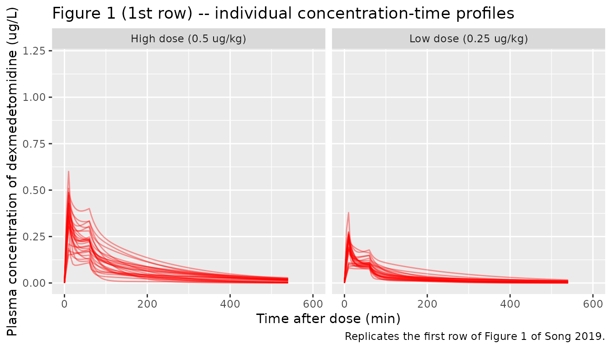
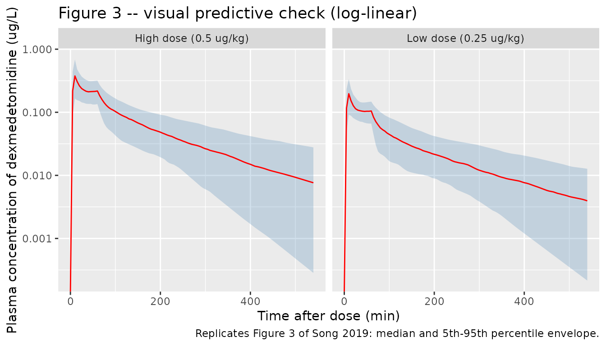

# Dexmedetomidine (Song 2019)

## Model and source

``` r

ui <- rxode2::rxode(readModelDb("Song_2019_dexmedetomidine"))
#> ℹ parameter labels from comments will be replaced by 'label()'
```

- Citation: Song IK, Yi S, Lim HS, Lee JH, Kim EH, Cho JY, Kim MC, Kim
  JT, Kim HS. A Population Pharmacokinetic Model of Intravenous
  Dexmedetomidine for Mechanically Ventilated Children after
  Neurosurgery. J Clin Med. 2019;8(10):1563. <doi:10.3390/jcm8101563>
- Description: Two-compartment population PK model for intravenous
  dexmedetomidine in mechanically ventilated children aged 2-12 years in
  the ICU after neurosurgery, with fixed allometric body-weight scaling
  to a 70 kg reference
- Article: <https://doi.org/10.3390/jcm8101563>

Song and colleagues gave intravenous dexmedetomidine to children who
were mechanically ventilated in the ICU after neurosurgery and fitted a
two-compartment disposition model with first-order elimination. Every
disposition parameter is standardised to a 70 kg body weight through a
fixed allometric power model, with the exponent held at 0.75 for the two
flows (CL, Q) and 1 for the two volumes (V1, V2). Body weight is the
only covariate retained; seven others were screened and rejected.

## Population

Twenty-nine children aged 2-12 years (ASA physical status 1-2, no
cardiovascular, hepatic or renal disease) were randomised to a low-dose
arm (n = 15; 0.25 ug/kg loading over 10 min then 0.25 ug/kg/h for 50
min) or a high-dose arm (n = 14; 0.5 ug/kg loading over 10 min then 0.5
ug/kg/h for 50 min). Median body weight was 22.0 kg (IQR 19.5-30.5) in
the low-dose arm and 23.0 kg (IQR 16.5-37.8) in the high-dose arm;
median age was 8.0 and 7.0 years respectively (Song 2019 Table 1).
Fifteen of the 29 children (51.7%) were girls. The study was run at a
single centre in the Republic of Korea; race/ethnicity is not tabulated,
though the Discussion refers to the cohort as Korean children.

Sampling ran to 480 min after the end of the 60 min infusion. Of 264
plasma samples, 19 fell below the 0.005 ug/L LLOQ.

The same information is available programmatically via the model’s
`population` metadata:

``` r

str(ui$population)
#> List of 11
#>  $ species       : chr "human"
#>  $ n_subjects    : num 29
#>  $ n_studies     : num 1
#>  $ age_range     : chr "2-12 years"
#>  $ age_median    : chr "8.0 years (low-dose, IQR 5.0-10.0); 7.0 years (high-dose, IQR 3.3-10.3)"
#>  $ weight_median : chr "22.0 kg (low-dose, IQR 19.5-30.5); 23.0 kg (high-dose, IQR 16.5-37.8)"
#>  $ sex_female_pct: num 51.7
#>  $ disease_state : chr "Mechanically ventilated in the ICU after elective neurosurgery (mostly craniotomy and tumour removal); ASA phys"| __truncated__
#>  $ dose_range    : chr "0.25 ug/kg IV loading over 10 min then 0.25 ug/kg/h for 50 min (low-dose, n = 15); 0.5 ug/kg IV loading over 10"| __truncated__
#>  $ regions       : chr "Republic of Korea (single centre, Seoul National University Hospital)"
#>  $ notes         : chr "Baseline demographics in Song 2019 Table 1; 264 plasma samples, 19 below the 0.005 ug/L LLOQ. Sampling before i"| __truncated__
```

## Source trace

Every `ini()` entry in
`inst/modeldb/specificDrugs/Song_2019_dexmedetomidine.R` carries an
in-file comment naming its origin. They are collected here for review.

| Equation / parameter | Value | Source location |
|----|----|----|
| `lcl` | `log(81.0)` L/h | Table 2, “Allometric clearance of central compartment (CL pop, L/h)”; RSE 5.5% |
| `lvc` | `log(64.2)` L | Table 2, “Allometric volume of central compartment (V1 pop, L)”; RSE 12.6% |
| `lq` | `log(116.4)` L/h | Table 2, “Allometric clearance of peripheral compartment (Q pop, L/h)”; RSE 13.1% |
| `lvp` | `log(167)` L | Table 2, “Allometric volume of peripheral compartment (V2 pop, L)”; RSE 12.5% |
| `e_wt_cl_q` | `fixed(0.75)` | Methods 2.5 (“n was the allometric weight exponent, which was 0.75 for clearance and intercompartment clearance”); Table 2 footnote c |
| `e_wt_vc_vp` | `fixed(1)` | Methods 2.5 (“and 1 for volume of distribution”); Table 2 footnote c |
| `etalcl` | `0.0708694` | Table 2, “CL (CV%)” = 27.1; `log(1 + 0.271^2)` |
| `etalvc` | `0.3074847` | Table 2, “V1 (CV%)” = 60.0; `log(1 + 0.600^2)` |
| `etalq` | `0.1972832` | Table 2, “Q (CV%)” = 46.7; `log(1 + 0.467^2)` |
| `etalvp` | `0.3136780` | Table 2, “V2 (CV%)” = 60.7; `log(1 + 0.607^2)` |
| `addSd` | `0.0227` ug/L | Table 2, “Additive error (ug/L)”; RSE 81.5% |
| `propSd` | `0.427` | Table 2, “Proportional error (%)” = 42.7; RSE 14.2% |
| `cl <- exp(lcl + etalcl) * (WT/70)^e_wt_cl_q` | n/a | Table 2 footnote c: `CL = CLpop (WT/70)^0.75` |
| `vc <- exp(lvc + etalvc) * (WT/70)^e_wt_vc_vp` | n/a | Table 2 footnote c: `V1 = V1pop (WT/70)` |
| `q <- exp(lq + etalq) * (WT/70)^e_wt_cl_q` | n/a | Table 2 footnote c (see Errata: the footnote misprints `Q = CLpop (...)`) |
| `vp <- exp(lvp + etalvp) * (WT/70)^e_wt_vc_vp` | n/a | Table 2 footnote c: `V2 = V2pop (WT/70)` |
| two-compartment ODEs, IV input to `central` | n/a | Results 3.3: “best described using a two-compartment disposition model with first-order elimination kinetics” |
| `Cc ~ add(addSd) + prop(propSd)` | n/a | Methods 2.5 (combined additive and proportional variance model); Table 2 reports both components |

## Validation strategy

Song 2019 publishes **no** non-compartmental analysis: there is no table
of Cmax / Tmax / AUC / half-life to compare against, and the observed
concentrations appear only as individual spaghetti plots (Figure 1) and
a VPC (Figure 3). The validation therefore rests on three layers:

1.  **Exact, deterministic gates.** The allometric anchor is checked
    against the literal Table 2 numbers, and the solved ODE system is
    checked against the analytic two-compartment infusion solution built
    independently from those same numbers. These are the precision
    instruments and are asserted tightly.
2.  **A PKNCA gate on an IV bolus.** For a linear disposition model an
    IV bolus makes `CL = Dose / AUC0-inf` and `Vss = CL x MRT = V1 + V2`
    exact identities, so NCA recovers the published CL and the published
    `V1 + V2` with no fitting. The reference column is computed from the
    Table 2 values, not from the model object, so a transcription error
    in the model file makes this gate go red.
3.  **A coarse envelope check against Figure 1.** The simulated cohort’s
    peak concentrations are compared with the range visible in the
    published panels. This layer catches unit and order-of-magnitude
    errors; it is deliberately loose, because the published figure can
    only be read to about a factor of two.

``` r

# Analytic two-compartment machinery, written from the published Table 2
# numbers and standard linear-systems algebra -- deliberately independent of
# the packaged model so that these functions can disagree with it.

# Disposition parameters for a subject of weight `wt`, per Song 2019 Table 2
# footnote c. The four population values are the literal Table 2 estimates.
song_params <- function(wt) {
  list(
    cl = 81.0 * (wt / 70)^0.75,
    vc = 64.2 * (wt / 70),
    q = 116.4 * (wt / 70)^0.75,
    vp = 167 * (wt / 70)
  )
}

# Macro-constants alpha / beta and the bolus coefficients A / B.
song_macro <- function(p) {
  k10 <- p$cl / p$vc
  k12 <- p$q / p$vc
  k21 <- p$q / p$vp
  s <- k10 + k12 + k21
  root <- sqrt(s^2 - 4 * k10 * k21)
  alpha <- (s + root) / 2
  beta <- (s - root) / 2
  list(
    k21 = k21,
    alpha = alpha,
    beta = beta,
    A = (alpha - k21) / (alpha - beta),
    B = (k21 - beta) / (alpha - beta)
  )
}

# Concentration from ONE constant-rate infusion of `rate` (ug/h) running from
# `tstart` to `tend`, evaluated at times `t`. Zero before `tstart`.
song_conc_infusion <- function(t, rate, tstart, tend, p) {
  m <- song_macro(p)
  tt <- pmax(t - tstart, 0)
  dur <- tend - tstart
  # Elapsed infusion time: grows to `dur` then stops.
  te <- pmin(tt, dur)
  # Time since infusion stopped (0 while still running).
  tp <- pmax(tt - dur, 0)
  (rate / p$vc) * (
    m$A / m$alpha * exp(-m$alpha * tp) * (1 - exp(-m$alpha * te)) +
      m$B / m$beta * exp(-m$beta * tp) * (1 - exp(-m$beta * te))
  )
}

# The published regimen: `dose` ug/kg loading over 10 min, then `dose` ug/kg/h
# maintenance for 50 min (Song 2019 Methods 2.2). Superposition of two
# constant-rate infusions.
song_conc_regimen <- function(t, dose_ug_per_kg, wt) {
  p <- song_params(wt)
  load_rate <- dose_ug_per_kg * wt / (10 / 60) # ug/h over the 10 min loading
  maint_rate <- dose_ug_per_kg * wt # ug/h over the 50 min maintenance
  song_conc_infusion(t, load_rate, 0, 10 / 60, p) +
    song_conc_infusion(t, maint_rate, 10 / 60, 60 / 60, p)
}
```

### Gate 1 – the allometric anchor reproduces Table 2 exactly

At the 70 kg reference weight the four individual parameters must
collapse to the published population values. This gates the reference
weight, both exponents, and the direction of the power terms in one
step.

``` r

anchor <- rxode2::rxSolve(
  rxode2::zeroRe(ui),
  events = rxode2::et(amt = 100, cmt = "central") |>
    rxode2::et(seq(0, 4, by = 0.25)),
  params = c(WT = 70)
) |>
  as.data.frame()
#> ℹ omega/sigma items treated as zero: 'etalcl', 'etalvc', 'etalq', 'etalvp'

anchor_tab <- tibble::tibble(
  Parameter = c("CL (L/h)", "V1 (L)", "Q (L/h)", "V2 (L)"),
  Model = c(
    unique(anchor$cl), unique(anchor$vc),
    unique(anchor$q), unique(anchor$vp)
  ),
  `Table 2` = c(81.0, 64.2, 116.4, 167)
)

knitr::kable(
  anchor_tab,
  digits = 4,
  caption = "Gate 1. Individual parameters at the 70 kg allometric reference."
)
```

| Parameter | Model | Table 2 |
|:----------|------:|--------:|
| CL (L/h)  |  81.0 |    81.0 |
| V1 (L)    |  64.2 |    64.2 |
| Q (L/h)   | 116.4 |   116.4 |
| V2 (L)    | 167.0 |   167.0 |

Gate 1. Individual parameters at the 70 kg allometric reference.
{.table}

``` r


# Deterministic identity -- no cohort, no RNG. Tight by construction.
stopifnot(all(abs(anchor_tab$Model - anchor_tab$`Table 2`) < 1e-9))
```

A second deterministic check confirms the *exponents* rather than just
the anchor: halving body weight must scale the flows by `0.5^0.75` and
the volumes by `0.5^1`.

``` r

half <- rxode2::rxSolve(
  rxode2::zeroRe(ui),
  events = rxode2::et(amt = 100, cmt = "central") |>
    rxode2::et(seq(0, 4, by = 0.25)),
  params = c(WT = 35)
) |>
  as.data.frame()
#> ℹ omega/sigma items treated as zero: 'etalcl', 'etalvc', 'etalq', 'etalvp'

stopifnot(
  abs(unique(half$cl) / 81.0 - 0.5^0.75) < 1e-9,
  abs(unique(half$q) / 116.4 - 0.5^0.75) < 1e-9,
  abs(unique(half$vc) / 64.2 - 0.5) < 1e-9,
  abs(unique(half$vp) / 167 - 0.5) < 1e-9
)
```

### Gate 2 – the solved ODE matches the analytic infusion solution

The published regimen is two consecutive constant-rate infusions at
different rates. Solving the packaged ODE system and evaluating the
closed form above must agree to solver tolerance for every subject
weight and both dose levels. Both sides use the same parameter values
here, so the residual is pure numerical error and a tight bound is the
correct assertion.

``` r

grid_t <- c(seq(0, 1, by = 1 / 120), seq(1.05, 9, by = 0.05))

cf_check <- lapply(
  list(
    list(label = "0.25 ug/kg", dose = 0.25, wt = 22),
    list(label = "0.25 ug/kg", dose = 0.25, wt = 38),
    list(label = "0.5 ug/kg", dose = 0.5, wt = 16),
    list(label = "0.5 ug/kg", dose = 0.5, wt = 23)
  ),
  function(sc) {
    ev <- rxode2::et(
      amt = sc$dose * sc$wt,
      rate = sc$dose * sc$wt / (10 / 60),
      cmt = "central", time = 0
    ) |>
      rxode2::et(
        amt = sc$dose * sc$wt * (50 / 60),
        rate = sc$dose * sc$wt,
        cmt = "central", time = 10 / 60
      ) |>
      rxode2::et(grid_t, cmt = "central")

    sol <- rxode2::rxSolve(
      rxode2::zeroRe(ui), events = ev, params = c(WT = sc$wt)
    ) |>
      as.data.frame()

    tibble::tibble(
      scenario = paste0(sc$label, ", ", sc$wt, " kg"),
      time = sol$time,
      ode = sol$Cc,
      closed_form = song_conc_regimen(sol$time, sc$dose, sc$wt)
    )
  }
) |>
  dplyr::bind_rows()
#> ℹ omega/sigma items treated as zero: 'etalcl', 'etalvc', 'etalq', 'etalvp'
#> ℹ omega/sigma items treated as zero: 'etalcl', 'etalvc', 'etalq', 'etalvp'
#> ℹ omega/sigma items treated as zero: 'etalcl', 'etalvc', 'etalq', 'etalvp'
#> ℹ omega/sigma items treated as zero: 'etalcl', 'etalvc', 'etalq', 'etalvp'

cf_summary <- cf_check |>
  dplyr::filter(time > 0) |>
  dplyr::group_by(scenario) |>
  dplyr::summarise(
    `Max abs rel. difference` = max(abs(ode / closed_form - 1)),
    .groups = "drop"
  )

knitr::kable(
  cf_summary,
  digits = 10,
  caption = paste(
    "Gate 2. Solved ODE vs the analytic two-compartment infusion solution",
    "built from the Table 2 parameters."
  )
)
```

| scenario          | Max abs rel. difference |
|:------------------|------------------------:|
| 0.25 ug/kg, 22 kg |              2.2366e-06 |
| 0.25 ug/kg, 38 kg |              2.1485e-06 |
| 0.5 ug/kg, 16 kg  |              2.2964e-06 |
| 0.5 ug/kg, 23 kg  |              2.2229e-06 |

Gate 2. Solved ODE vs the analytic two-compartment infusion solution
built from the Table 2 parameters. {.table}

``` r


# Same parameters on both sides, so this is solver error only.
stopifnot(max(cf_summary$`Max abs rel. difference`) < 1e-5)
```

### Gate 3 – PKNCA on an IV bolus recovers the published CL and Vss

For a linear two-compartment model given as an IV bolus,
`CL = Dose / AUC0-inf` and `Vss = CL x AUMC0-inf / AUC0-inf = V1 + V2`
hold exactly. Running PKNCA over a typical-value bolus profile therefore
recovers the published clearance and the published sum of volumes
without any fitting. Two weights are used: 70 kg (the allometric
reference, where the expected values are the Table 2 numbers verbatim)
and 20 kg (a weight typical of the study cohort).

Random effects are zeroed so the gate is deterministic – it does not
depend on which cohort rxode2’s thread-partitioned RNG happens to draw.

``` r

nca_arms <- tibble::tibble(
  id = 1:2,
  arm = c("70 kg (allometric reference)", "20 kg (typical study child)"),
  WT = c(70, 20)
) |>
  dplyr::mutate(amt = 1 * WT) # 1 ug/kg IV bolus

# Log-spaced observation grid: a linear grid under-resolves the alpha phase
# (t-half alpha is roughly 0.15 h here) and inflates the AUC.
nca_times <- unique(c(0, exp(seq(log(0.002), log(36), length.out = 320))))

nca_events <- dplyr::bind_rows(
  nca_arms |>
    dplyr::mutate(time = 0, evid = 1L, cmt = "central"),
  nca_arms |>
    dplyr::select(-amt) |>
    tidyr::crossing(time = nca_times) |>
    dplyr::mutate(amt = NA_real_, evid = 0L, cmt = "central")
) |>
  dplyr::arrange(id, time, dplyr::desc(evid))

stopifnot(!anyDuplicated(unique(nca_events[, c("id", "time", "evid")])))

nca_sim <- rxode2::rxSolve(
  rxode2::zeroRe(ui),
  events = nca_events,
  keep = c("arm", "WT")
) |>
  as.data.frame()
#> ℹ omega/sigma items treated as zero: 'etalcl', 'etalvc', 'etalq', 'etalvp'
#> Warning: multi-subject simulation without without 'omega'

# Solver noise in the far tail would make log() of a negative value NaN.
stopifnot(all(nca_sim$Cc >= 0, na.rm = TRUE))
```

``` r

sim_nca <- nca_sim |>
  dplyr::filter(!is.na(Cc)) |>
  dplyr::select(id, time, Cc, arm)

# Guarantee a time-zero record per (arm, id) so PKNCA can anchor AUC0-*.
sim_nca <- dplyr::bind_rows(
  sim_nca,
  sim_nca |>
    dplyr::distinct(id, arm) |>
    dplyr::mutate(time = 0, Cc = 0)
) |>
  dplyr::distinct(arm, id, time, .keep_all = TRUE) |>
  dplyr::arrange(id, time)

dose_df <- nca_events |>
  dplyr::filter(evid == 1L) |>
  dplyr::select(id, time, amt, arm)

conc_obj <- PKNCA::PKNCAconc(
  sim_nca, Cc ~ time | arm + id,
  concu = "ug/L", timeu = "h"
)
dose_obj <- PKNCA::PKNCAdose(dose_df, amt ~ time | arm + id, doseu = "ug")

intervals <- data.frame(
  start = 0,
  end = Inf,
  cmax = TRUE,
  aucinf.obs = TRUE,
  cl.obs = TRUE,
  vss.obs = TRUE,
  half.life = TRUE
)

nca_res <- PKNCA::pk.nca(
  PKNCA::PKNCAdata(conc_obj, dose_obj, intervals = intervals)
)
```

The reference column below is computed from the literal Table 2
estimates via the independent `song_params()` / `song_macro()` helpers,
so it moves only if the *paper’s* numbers change – not if the model file
drifts.

[`ncaComparisonTable()`](https://nlmixr2.github.io/nlmixr2lib/reference/ncaComparisonTable.md)
labels PKNCA’s `cl.obs` and `vss.obs` as “CL/F” and “Vss/F”, because for
the oral models that dominate the library those parameters are only
identifiable up to bioavailability. Dexmedetomidine is given
intravenously here, so `F` is 1 by definition and the two rows should be
read as absolute `CL` and `Vss`.

``` r

nca_reference <- nca_arms |>
  dplyr::rowwise() |>
  dplyr::mutate(
    p = list(song_params(WT)),
    m = list(song_macro(p)),
    cmax = amt / p$vc, # IV bolus: C(0) = Dose / V1
    aucinf.obs = amt / p$cl, # Dose / CL
    cl.obs = p$cl,
    vss.obs = p$vc + p$vp,
    half.life = log(2) / m$beta
  ) |>
  dplyr::ungroup() |>
  dplyr::select(arm, cmax, aucinf.obs, cl.obs, vss.obs, half.life)

cmp <- nlmixr2lib::ncaComparisonTable(
  simulated = nca_res,
  reference = nca_reference,
  by = "arm",
  units = c(
    cmax = "ug/L", aucinf.obs = "ug/L*h", cl.obs = "L/h",
    vss.obs = "L", half.life = "h"
  ),
  params = c("cmax", "aucinf.obs", "cl.obs", "vss.obs", "half.life"),
  tolerance_pct = 20
)

knitr::kable(
  cmp,
  caption = paste(
    "Gate 3. PKNCA on a 1 ug/kg IV bolus vs closed-form values derived from",
    "Song 2019 Table 2. * marks a >20% difference."
  )
)
```

| NCA parameter | arm | Reference | Simulated | % diff |
|:---|:---|:---|:---|:---|
| Cmax (ug/L) | 70 kg (allometric reference) | 1.09 | 1.09 | -0.0% |
| Cmax (ug/L) | 20 kg (typical study child) | 1.09 | 1.09 | -0.0% |
| AUC0-∞ (obs) (ug/L\*h) | 70 kg (allometric reference) | 0.864 | 0.864 | +0.0% |
| AUC0-∞ (obs) (ug/L\*h) | 20 kg (typical study child) | 0.632 | 0.632 | +0.0% |
| t½ (h) | 70 kg (allometric reference) | 2.78 | 2.77 | -0.3% |
| t½ (h) | 20 kg (typical study child) | 2.03 | 2.02 | -0.3% |
| CL/F (L/h) | 70 kg (allometric reference) | 81 | 81 | -0.0% |
| CL/F (L/h) | 20 kg (typical study child) | 31.7 | 31.7 | -0.0% |
| Vss/F (L) | 70 kg (allometric reference) | 231 | 231 | -0.0% |
| Vss/F (L) | 20 kg (typical study child) | 66.1 | 66.1 | -0.0% |

Gate 3. PKNCA on a 1 ug/kg IV bolus vs closed-form values derived from
Song 2019 Table 2. \* marks a \>20% difference. {.table}

``` r

nca_wide <- as.data.frame(nca_res$result) |>
  dplyr::filter(PPTESTCD %in% c("cl.obs", "vss.obs", "half.life", "cmax")) |>
  dplyr::select(arm, PPTESTCD, PPORRES) |>
  tidyr::pivot_wider(names_from = PPTESTCD, values_from = PPORRES) |>
  dplyr::left_join(nca_reference, by = "arm", suffix = c("_nca", "_ref"))

# Deterministic (random effects zeroed): the only error is numerical --
# trapezoidal integration plus the lambda-z extrapolation of the tail. The
# bounds below are far tighter than any plausible transcription error, which
# would move CL or Vss by tens of percent.
stopifnot(
  max(abs(nca_wide$cl.obs_nca / nca_wide$cl.obs_ref - 1)) < 0.01,
  max(abs(nca_wide$vss.obs_nca / nca_wide$vss.obs_ref - 1)) < 0.02,
  max(abs(nca_wide$cmax_nca / nca_wide$cmax_ref - 1)) < 0.01,
  max(abs(nca_wide$half.life_nca / nca_wide$half.life_ref - 1)) < 0.05
)
```

## Virtual cohort

The individual patient data are not public, so the cohort below draws
body weights from a log-normal distribution calibrated to the medians
and interquartile ranges in Song 2019 Table 1, truncated to a range
plausible for 2-12 year olds. Each arm holds 150 virtual children (the
published arms held 15 and 14).

``` r

# set.seed() seeds R's RNG for the weight draw. It does NOT seed rxode2's
# simulation RNG, whose streams are partitioned per solver thread -- so the
# etas drawn below differ between a 2-core CI runner and a 16-thread
# workstation. Every assertion downstream is written to hold for any cohort
# this model can produce.
set.seed(20190219)

n_per_arm <- 150L

draw_weights <- function(n, median_kg, iqr_lo, iqr_hi) {
  # Match the published median and IQR on the log scale; 1.349 = IQR of a
  # standard normal.
  sdlog <- log(iqr_hi / iqr_lo) / 1.349
  pmin(pmax(stats::rlnorm(n, log(median_kg), sdlog), 10), 60)
}

make_arm <- function(n, arm, dose_ug_per_kg, median_kg, iqr_lo, iqr_hi,
                     id_offset = 0L) {
  subj <- tibble::tibble(
    id = id_offset + seq_len(n),
    arm = arm,
    dose_ug_per_kg = dose_ug_per_kg,
    WT = draw_weights(n, median_kg, iqr_lo, iqr_hi)
  )

  # Published sampling grid (Methods 2.3): pre-dose; 10, 30, 60 min after the
  # start of infusion; 15, 30, 60, 120, 240, 480 min after its end at 60 min.
  obs_min <- c(0, 10, 30, 60, 75, 90, 120, 180, 300, 540)
  # Plus a dense grid so the plotted profile is smooth.
  dense_min <- seq(0, 540, by = 5)

  # Infusions are given as `rate` (amount per hour) rather than `dur`; both are
  # valid in an rxode2 event table, but `rate` is unambiguous in a plain
  # data.frame and needs no modelled-duration bookkeeping.
  doses <- dplyr::bind_rows(
    subj |>
      dplyr::mutate(
        time = 0,
        amt = dose_ug_per_kg * WT,
        rate = dose_ug_per_kg * WT / (10 / 60),
        evid = 1L,
        cmt = "central"
      ),
    subj |>
      dplyr::mutate(
        time = 10 / 60,
        amt = dose_ug_per_kg * WT * (50 / 60),
        rate = dose_ug_per_kg * WT,
        evid = 1L,
        cmt = "central"
      )
  )

  obs <- subj |>
    tidyr::crossing(time_min = sort(unique(c(obs_min, dense_min)))) |>
    dplyr::mutate(
      time = time_min / 60,
      sampled = as.integer(time_min %in% obs_min),
      amt = NA_real_,
      rate = 0,
      evid = 0L,
      cmt = "central"
    ) |>
    dplyr::select(-time_min)

  dplyr::bind_rows(doses, obs) |>
    dplyr::arrange(id, time, dplyr::desc(evid))
}

events <- dplyr::bind_rows(
  make_arm(n_per_arm, "Low dose (0.25 ug/kg)", 0.25, 22.0, 19.5, 30.5,
    id_offset = 0L
  ),
  make_arm(n_per_arm, "High dose (0.5 ug/kg)", 0.5, 23.0, 16.5, 37.8,
    id_offset = 1000L
  )
)

stopifnot(!anyDuplicated(unique(events[, c("id", "time", "evid")])))
```

``` r

events |>
  dplyr::distinct(id, arm, WT) |>
  dplyr::group_by(arm) |>
  dplyr::summarise(
    n = dplyr::n(),
    `Median weight (kg)` = stats::median(WT),
    `Q1 (kg)` = stats::quantile(WT, 0.25),
    `Q3 (kg)` = stats::quantile(WT, 0.75),
    .groups = "drop"
  ) |>
  knitr::kable(
    digits = 1,
    caption = "Virtual cohort weights vs Song 2019 Table 1 (22.0 [19.5-30.5] and 23.0 [16.5-37.8] kg)."
  )
```

| arm                   |   n | Median weight (kg) | Q1 (kg) | Q3 (kg) |
|:----------------------|----:|-------------------:|--------:|--------:|
| High dose (0.5 ug/kg) | 150 |               22.9 |    14.4 |    34.9 |
| Low dose (0.25 ug/kg) | 150 |               22.1 |    18.4 |    26.1 |

Virtual cohort weights vs Song 2019 Table 1 (22.0 \[19.5-30.5\] and 23.0
\[16.5-37.8\] kg). {.table}

## Simulation

``` r

sim <- rxode2::rxSolve(
  ui,
  events = events,
  keep = c("arm", "WT", "dose_ug_per_kg", "sampled")
) |>
  as.data.frame()
```

## Replicate published figures

``` r

# Replicates the first row of Figure 1 of Song 2019: observed plasma
# dexmedetomidine concentrations over time, by dose group. The published
# panels show individual observations; the simulated equivalent is drawn as
# 25 randomly chosen individual profiles per arm on the same axes
# (0-600 min, 0-1.2 ug/L).
show_ids <- sim |>
  dplyr::distinct(id, arm) |>
  dplyr::group_by(arm) |>
  dplyr::slice_head(n = 25) |>
  dplyr::pull(id)

sim |>
  dplyr::filter(id %in% show_ids) |>
  ggplot(aes(time * 60, Cc, group = id)) +
  geom_line(alpha = 0.4, colour = "red") +
  facet_wrap(~arm) +
  coord_cartesian(xlim = c(0, 600), ylim = c(0, 1.2)) +
  labs(
    x = "Time after dose (min)",
    y = "Plasma concentration of dexmedetomidine (ug/L)",
    title = "Figure 1 (1st row) -- individual concentration-time profiles",
    caption = "Replicates the first row of Figure 1 of Song 2019."
  )
```



``` r

# Replicates Figure 3 of Song 2019: visual predictive check, 5th / 50th / 95th
# percentiles by dose group, linear and log-linear.
vpc <- sim |>
  dplyr::group_by(arm, time) |>
  dplyr::summarise(
    Q05 = stats::quantile(Cc, 0.05, na.rm = TRUE),
    Q50 = stats::quantile(Cc, 0.50, na.rm = TRUE),
    Q95 = stats::quantile(Cc, 0.95, na.rm = TRUE),
    .groups = "drop"
  )

ggplot(vpc, aes(time * 60, Q50)) +
  geom_ribbon(aes(ymin = Q05, ymax = Q95), alpha = 0.25, fill = "steelblue") +
  geom_line(colour = "red") +
  facet_wrap(~arm) +
  scale_y_log10() +
  labs(
    x = "Time after dose (min)",
    y = "Plasma concentration of dexmedetomidine (ug/L)",
    title = "Figure 3 -- visual predictive check (log-linear)",
    caption = "Replicates Figure 3 of Song 2019: median and 5th-95th percentile envelope."
  )
#> Warning in scale_y_log10(): log-10 transformation introduced infinite values.
#> log-10 transformation introduced infinite values.
#> log-10 transformation introduced infinite values.
#> log-10 transformation introduced infinite values.
```



### Envelope check against the published Figure 1

The published panels are individual observations on a linear axis.
Reading them gives peak concentrations spanning roughly 0.05-0.45 ug/L
in the low-dose arm and 0.1-1.15 ug/L in the high-dose arm, with the
bulk of each arm well inside those limits. The bounds below are read off
those panels and are wide enough to survive any cohort the model can
draw, while still failing on a unit error, a decimal-place slip, or a
mis-scaled infusion rate – each of which moves the whole distribution by
a factor of ten or more.

``` r

peak_tab <- sim |>
  dplyr::filter(sampled == 1L) |>
  dplyr::group_by(arm, id) |>
  dplyr::summarise(cmax = max(Cc), .groups = "drop") |>
  dplyr::group_by(arm) |>
  dplyr::summarise(
    `Median Cmax (ug/L)` = stats::median(cmax),
    `Q1 (ug/L)` = stats::quantile(cmax, 0.25),
    `Q3 (ug/L)` = stats::quantile(cmax, 0.75),
    .groups = "drop"
  )

knitr::kable(
  peak_tab,
  digits = 3,
  caption = "Peak simulated concentration on the published sampling grid, by arm."
)
```

| arm                   | Median Cmax (ug/L) | Q1 (ug/L) | Q3 (ug/L) |
|:----------------------|-------------------:|----------:|----------:|
| High dose (0.5 ug/kg) |              0.377 |     0.298 |     0.495 |
| Low dose (0.25 ug/kg) |              0.197 |     0.155 |     0.257 |

Peak simulated concentration on the published sampling grid, by arm.
{.table}

``` r


low <- peak_tab$`Median Cmax (ug/L)`[peak_tab$arm == "Low dose (0.25 ug/kg)"]
high <- peak_tab$`Median Cmax (ug/L)`[peak_tab$arm == "High dose (0.5 ug/kg)"]

# Absolute bounds read from the Figure 1 panels, not from one simulated run.
stopifnot(
  low > 0.05, low < 0.45,
  high > 0.10, high < 1.15
)
```

### Dose proportionality

The model is linear, so doubling both the loading and the maintenance
rate must double every concentration. Evaluating the two arms on
identical typical-value subjects makes this an exact identity, which
gates the *event table* encoding (a maintenance rate that failed to
scale with dose would break it) rather than the ODE.

``` r

prop_weights <- c(16, 22, 30, 38)

prop_events <- dplyr::bind_rows(
  lapply(seq_along(prop_weights), function(i) {
    wt <- prop_weights[i]
    dplyr::bind_rows(
      make_arm(1L, "Low dose (0.25 ug/kg)", 0.25, wt, wt, wt,
        id_offset = i
      ),
      make_arm(1L, "High dose (0.5 ug/kg)", 0.5, wt, wt, wt,
        id_offset = 100L + i
      )
    ) |>
      dplyr::mutate(WT = wt, pair = i)
  })
)

# Tight tolerances: the identity is checked to 1e-8, and the ODE solve at the
# default rtol leaves ~3e-8 of step-size-dependent error in the ratio.
prop_sim <- rxode2::rxSolve(
  rxode2::zeroRe(ui),
  events = prop_events,
  keep = c("arm", "WT", "pair"),
  rtol = 1e-10, atol = 1e-12
) |>
  as.data.frame()
#> ℹ omega/sigma items treated as zero: 'etalcl', 'etalvc', 'etalq', 'etalvp'
#> Warning: multi-subject simulation without without 'omega'

prop_ratio <- prop_sim |>
  dplyr::filter(time > 0) |>
  dplyr::select(pair, arm, time, Cc) |>
  tidyr::pivot_wider(names_from = arm, values_from = Cc) |>
  dplyr::mutate(
    ratio = `High dose (0.5 ug/kg)` / `Low dose (0.25 ug/kg)`
  )

stopifnot(max(abs(prop_ratio$ratio - 2)) < 1e-8)
cat(
  "Max deviation of the high/low concentration ratio from 2.0: ",
  format(max(abs(prop_ratio$ratio - 2)), digits = 3), "\n",
  sep = ""
)
#> Max deviation of the high/low concentration ratio from 2.0: 1.62e-11
```

## Assumptions and deviations

- **IIV coefficient-of-variation convention.** Song 2019 Methods 2.5
  specifies an exponential IIV model, `Pi = theta * exp(eta_i)` with
  `Var(eta) = omega^2`, and Table 2 reports each IIV as a “CV%”. The
  paper never states which CV definition produced those numbers. The
  exact log-normal relation `omega^2 = log(1 + CV^2)` is used here,
  which is this package’s default when a source is silent. The
  alternative reading – that the tabulated CV% is `omega * 100` – would
  give `omega^2` of 0.0734 / 0.3600 / 0.2181 / 0.3684 for CL / V1 / Q /
  V2 instead of the 0.0709 / 0.3075 / 0.1973 / 0.3137 encoded. The two
  readings differ by under 2% on the SD scale for CL and by about 8% for
  V2, so no structural conclusion turns on the choice; it does slightly
  affect the width of the simulated VPC envelope.
- **Table 2 footnote c misprints the Q equation.** The footnote reads
  `Q = CLpop (WT/70)^0.75`, using `CLpop` where `Qpop` is meant. The
  adjacent Table 2 row and the Abstract both give the intercompartmental
  clearance as 116.4 L/h per 70 kg, and the surrounding footnote text
  follows a strict `parameter = parameter_pop x (WT/70)^n` pattern for
  CL, V1 and V2, so this is a typographical error. The model uses
  `Qpop = 116.4`.
- **Residual-error components are read as standard deviations.** Table 2
  lists an additive error of 0.0227 ug/L and a proportional error of
  42.7% without stating whether these are variances or SDs. Reading them
  as SDs is the only self-consistent option: as a variance, the additive
  term would imply an SD of 0.151 ug/L, close to the entire typical peak
  concentration in the low-dose arm (about 0.2 ug/L) and far above the
  0.005 ug/L LLOQ.
- **Body-weight distribution is assumed.** Individual weights are not
  published. The virtual cohort draws log-normal weights matched to the
  Table 1 medians and IQRs, truncated to 10-60 kg. Age, height, BSA,
  lean body mass, ideal body weight, BMI and body fat percentage are
  recorded in the model file’s `covariatesDataExcluded` metadata: Song
  2019 screened all seven by forward selection and retained none, so
  none is simulated.
- **Race/ethnicity is not simulated.** Table 1 does not tabulate it. The
  Discussion refers to the cohort as Korean children and speculates
  about CYP2A6 variation, but no genotype covariate is in the model.
- **BLQ handling is not reproduced.** Song 2019 discarded BLQ samples
  before the first quantifiable point, substituted `LLOQ/2` for the
  first BLQ point in the elimination phase, and discarded the rest. The
  simulation emits continuous concentrations with no censoring, so the
  simulated VPC tail extends below the 0.005 ug/L LLOQ where the
  published one does not.
- **No published NCA to compare against.** Song 2019 reports no Cmax /
  AUC / half-life table, so Gate 3’s reference column is the closed-form
  two-compartment result computed from the Table 2 parameter estimates
  rather than a transcribed published table. See “Validation strategy”
  above.
- **Bootstrap confidence intervals are not encoded.** Table 2’s
  bootstrap medians and 95% CIs are recorded in the in-file comments for
  provenance but the model carries the point estimates.
