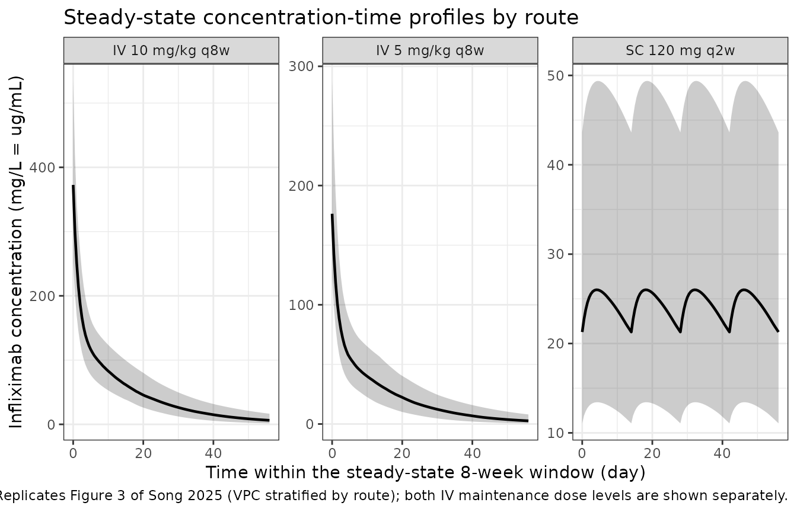

# Infliximab (Song 2025)

## Model and source

    #> ℹ parameter labels from comments will be replaced by 'label()'

- Citation: Song JH, Hong SN, Kim MG, Kim M, Kim SK, Kim ER, Chang DK,
  Kim YH. Population pharmacokinetic model for the use of intravenous or
  subcutaneous infliximab in patients with inflammatory bowel disease:
  real-world data from a prospective cohort study. Gut Liver.
  2025;19(3):376-387. <doi:10.5009/gnl240503>

- Description: Two-compartment population PK model of intravenous and
  subcutaneous infliximab in Korean adults with inflammatory bowel
  disease on maintenance therapy, with body-mass-index, serum-albumin,
  C-reactive-protein and quantitative anti-drug-antibody-concentration
  effects on clearance and on subcutaneous bioavailability (Song 2025)

- Article: <https://doi.org/10.5009/gnl240503>

- PubMed Central:
  <https://www.ncbi.nlm.nih.gov/pmc/articles/PMC12070208/>

Song 2025 developed a single population PK model for infliximab that
describes **intravenous and subcutaneous administration
simultaneously**, fit to sparse pre-dose trough concentrations collected
under a real-world proactive therapeutic-drug-monitoring (TDM) protocol.
The structure is two-compartment with first-order absorption from the
subcutaneous depot and first-order elimination. Its distinguishing
feature is that anti-drug antibody (ADA) enters the model as a
**quantitative ng/mL concentration** on both clearance and subcutaneous
bioavailability, rather than as the usual binary positivity flag.

## Population

The model was built from 2,132 trough samples in 181 Korean patients
with inflammatory bowel disease (149 Crohn’s disease, 32 ulcerative
colitis) on maintenance infliximab at Samsung Medical Center between
February 2020 and December 2022 (Song 2025 Table 1; 212 screened, 31
excluded). Median age was 36 years (IQR 30-47), median body weight 65.0
kg (IQR 55.0-73.6), median height 170.0 cm (IQR 162.8-174.2), and 71.8%
were male. Median albumin was 4.4 g/dL (IQR 4.2-4.6), median CRP 0.06
mg/dL (IQR 0.06-0.15), and median total ADA concentration 9.3 ng/mL (IQR
7.6-11.6). Observed trough levels were 4.15 ug/mL (IQR 2.49-6.32) on IV
and 18.65 ug/mL (IQR 11.70-25.06) on SC.

Dosing was **maintenance only**: 5 mg/kg IV every 8 weeks, escalated to
10 mg/kg IV every 8 weeks where the trough was sub-therapeutic (\< 3
ug/mL), or switched to Remsima SC 120 mg every 2 weeks by prefilled pen.
Induction (5 mg/kg IV at weeks 0, 2 and 6) preceded enrolment and the
authors explicitly note the model does not apply to induction.

The same information is available programmatically via
`rxode2::rxode(readModelDb("Song_2025_infliximab"))$population`.

## Source trace

Both final-model covariate equations are rendered as **images** in the
published PDF; `docling` emits `formula-not-decoded` for them. They were
recovered with `pdftotext -layout` from page 380, column 1, and read:

    CL = 0.248 x (ALB/4.4)^-0.372 x (CRP/0.18)^0.022 x (ADA/10)^0.022 x (BMI/22.5)^0.360
    F  = 0.667 x (ADA/10)^-0.213 x (BMI/22.5)^-0.832

Per-parameter provenance is recorded as an in-file comment beside each
`ini()` entry in `inst/modeldb/specificDrugs/Song_2025_infliximab.R`.
Collected here:

| Equation / parameter | Value | Source location |
|----|----|----|
| Two-compartment, first-order absorption and elimination | n/a | Methods section 6; Results section 3 (“The base model provided the best fit for the two-compartment model”) |
| `lcl` (CL) | 0.248 L/day | Table 2 (RSE 20%); bootstrap 0.249 (0.173-0.344) |
| `lvc` (Vc) | 1.87 L | Table 2 (RSE 61%); also Results text |
| `lvp` (Vp) | 1.96 L, **fixed** | Table 2 (“1.96 fixed”); Methods section 6 fixes it to the Hanzel 2021 literature value |
| `lq` (Q) | 0.599 L/day, **fixed** | Table 2 (“0.599 fixed”); Methods section 6 |
| `lka` (ka) | 0.083 /day | Table 2 (RSE 26%); also Results text |
| `lfdepot` (F) | 0.667 | Table 2 (RSE 19%); bootstrap 0.677 (0.477-0.921) |
| `e_alb_cl` | -0.372 | Table 2 `theta ALB-CL`; p. 380 CL equation |
| `e_crp_cl` | 0.022 | Table 2 `theta CRP-CL`; p. 380 CL equation |
| `e_conc_ada_cl` | 0.022 | Table 2 `theta ADA-CL`; p. 380 CL equation |
| `e_bmi_cl` | 0.360 | Table 2 `theta BMI-CL`; p. 380 CL equation |
| `e_conc_ada_f` | -0.213 | Table 2 `theta ADA-F`; p. 380 F equation |
| `e_bmi_f` | -0.832 | Table 2 `theta BMI-F`; p. 380 F equation |
| `etalcl` variance | 0.203^2 = 0.041209 | Table 2 `omega CL (CV%) = 20.3` |
| `etalfdepot` variance | 0.216^2 = 0.046656 | Table 2 `omega F (CV%) = 21.6` |
| `cov(etalcl, etalfdepot)` | 0.017 | Table 2 `Cov CL-F` |
| `addSd` | 0.561 mg/L | Table 2 “Additive error (mg/L)” |
| `propSd` | 0.333 | Table 2 “Proportional error (sigma)” |
| Reference covariate values (4.4 g/dL, 0.18 mg/dL, 10 ng/mL, 22.5 kg/m^2) | n/a | Methods section 6 (“Continuous covariates were normalized to the mean value of the data”); values printed in the p. 380 equations |
| IIV on CL and F only (none on Vc, ka) | n/a | Methods section 6 (“evaluated for all PK parameters, but it was only included for CL and F”) |
| Combined additive + proportional residual error | n/a | Methods section 6 |

## Structural checks

Three closed-form identities are asserted before any cohort simulation.
Each is volume-free or analytic, so it tests the implementation rather
than the simulation setup.

``` r

mod <- readModelDb("Song_2025_infliximab")
mod_typ <- rxode2::zeroRe(mod)
#> ℹ parameter labels from comments will be replaced by 'label()'

# Reference covariate vector, on the CANONICAL (SI) column scale: the model
# converts to the paper's g/dL and mg/dL internally.
ref <- c(ALB = 44, CRP = 1.8, CONC_ADA_NGML = 10, BMI = 22.5)

## Gate 1 -- at the reference covariate vector every published covariate term
## normalises to 1, so cl and fdepot must return the printed typical values.
ev_iv <- rxode2::et(amt = 325, cmt = "central") |>
  rxode2::et(seq(0, 56, by = 0.5))
s_iv <- rxode2::rxSolve(mod_typ, ev_iv, params = ref, useLinCmt = FALSE,
                        returnType = "data.frame")
#> ℹ omega/sigma items treated as zero: 'etalcl', 'etalfdepot'

ev_sc <- rxode2::et(amt = 120, cmt = "depot") |>
  rxode2::et(seq(0, 28, by = 0.5))
s_sc <- rxode2::rxSolve(mod_typ, ev_sc, params = ref, useLinCmt = FALSE,
                        returnType = "data.frame")
#> ℹ omega/sigma items treated as zero: 'etalcl', 'etalfdepot'

cl_ref <- unique(s_iv$cl)
f_ref  <- unique(s_sc$fdepot)
stopifnot(
  length(cl_ref) == 1L, abs(cl_ref - 0.248) < 1e-9,
  length(f_ref)  == 1L, abs(f_ref  - 0.667) < 1e-9
)
cat(sprintf("Gate 1 PASS: CL = %.4f L/day (published 0.248); F = %.4f (published 0.667)\n",
            cl_ref, f_ref))
#> Gate 1 PASS: CL = 0.2480 L/day (published 0.248); F = 0.6670 (published 0.667)
```

``` r

## Gate 2 -- terminal half-life must equal the analytic beta root of the
## two-compartment system. This is the mechanical guard against rxSolve's
## default useLinCmt = TRUE silently collapsing a k12/k21-parameterised
## two-compartment model to one compartment: under a collapse the simulated
## terminal half-life comes back equal to log(2)/kel instead.
cl <- 0.248; vc <- 1.87; vp <- 1.96; q <- 0.599
kel <- cl / vc; k12 <- q / vc; k21 <- q / vp
bsum <- kel + k12 + k21
beta <- (bsum - sqrt(bsum^2 - 4 * kel * k21)) / 2
hl_beta <- log(2) / beta
hl_kel  <- log(2) / kel

ev_long <- rxode2::et(amt = 325, cmt = "central") |>
  rxode2::et(seq(0, 400, by = 1))

terminal_half_life <- function(use_lin) {
  d <- rxode2::rxSolve(mod_typ, ev_long, params = ref, useLinCmt = use_lin,
                       returnType = "data.frame")
  d <- d[d$time >= 300 & d$Cc > 0, ]
  stopifnot(nrow(d) > 20)
  log(2) / -unname(stats::coef(stats::lm(log(d$Cc) ~ d$time))[2])
}

hl_ode <- terminal_half_life(FALSE)
#> ℹ omega/sigma items treated as zero: 'etalcl', 'etalfdepot'
hl_lin <- terminal_half_life(TRUE)
#> ℹ omega/sigma items treated as zero: 'etalcl', 'etalfdepot'

stopifnot(
  abs(hl_ode / hl_beta - 1) < 1e-3,
  abs(hl_lin / hl_beta - 1) < 1e-3,
  # the collapse would land on the kel-only half-life; confirm the two are
  # far enough apart for this gate to be able to fail at all
  abs(hl_beta / hl_kel - 1) > 0.5
)
cat(sprintf(paste0("Gate 2 PASS: analytic beta t1/2 = %.3f day; simulated %.3f (ODE) / ",
                   "%.3f (useLinCmt) day.\n  One-compartment collapse would give %.3f day.\n"),
            hl_beta, hl_ode, hl_lin, hl_kel))
#> Gate 2 PASS: analytic beta t1/2 = 11.984 day; simulated 11.982 (ODE) / 11.984 (useLinCmt) day.
#>   One-compartment collapse would give 5.227 day.
```

``` r

## Gate 3 -- steady-state exposure identities, which need no volume and no
## absorption parameter:
##   IV: AUCtau = Dose / CL
##   SC: AUC over 8 weeks = 4 * F * Dose / CL   (four q2w doses)
trapz <- function(x, y) sum(diff(x) * (utils::head(y, -1) + utils::tail(y, -1)) / 2)

ev_ss_iv <- rxode2::et(amt = 325, cmt = "central", ii = 56, until = 56 * 9) |>
  rxode2::et(seq(0, 56 * 10, by = 0.05))
d_iv <- rxode2::rxSolve(mod_typ, ev_ss_iv, params = ref, useLinCmt = FALSE,
                        returnType = "data.frame")
#> ℹ omega/sigma items treated as zero: 'etalcl', 'etalfdepot'
d_iv <- d_iv[d_iv$time >= 56 * 9, ]
auc_iv <- trapz(d_iv$time, d_iv$Cc)

ev_ss_sc <- rxode2::et(amt = 120, cmt = "depot", ii = 14, until = 14 * 39) |>
  rxode2::et(seq(0, 14 * 40, by = 0.05))
d_sc <- rxode2::rxSolve(mod_typ, ev_ss_sc, params = ref, useLinCmt = FALSE,
                        returnType = "data.frame")
#> ℹ omega/sigma items treated as zero: 'etalcl', 'etalfdepot'
d_sc <- d_sc[d_sc$time >= 14 * 36, ]
auc_sc <- trapz(d_sc$time, d_sc$Cc)

stopifnot(
  abs(auc_iv / (325 / 0.248) - 1) < 1e-3,
  abs(auc_sc / (4 * 0.667 * 120 / 0.248) - 1) < 1e-3
)
cat(sprintf("Gate 3 PASS: IV AUCtau = %.1f (Dose/CL = %.1f); SC AUC(8 wk) = %.1f (4*F*Dose/CL = %.1f) mg*day/L\n",
            auc_iv, 325 / 0.248, auc_sc, 4 * 0.667 * 120 / 0.248))
#> Gate 3 PASS: IV AUCtau = 1310.5 (Dose/CL = 1310.5); SC AUC(8 wk) = 1291.0 (4*F*Dose/CL = 1291.0) mg*day/L
```

## Virtual cohort

The original observed data are not public. The cohort below reproduces
the Table 1 marginal distributions with independent log-normal draws,
each fit to the published median and interquartile range via
`sdlog = (log(Q3) - log(Q1)) / (2 * qnorm(0.75))`. Body weight and
height are drawn and BMI is **derived** from them, which reproduces the
paper’s 22.5 kg/m^2 normalising value (65.0 kg / 1.700 m^2 = 22.5)
without assuming it.

``` r

set.seed(20250421)

n_per_arm <- 100L
iqr_sdlog <- function(q1, q3) (log(q3) - log(q1)) / (2 * stats::qnorm(0.75))

draw_covariates <- function(n) {
  wt  <- stats::rlnorm(n, log(65.0), iqr_sdlog(55.0, 73.6))
  ht  <- stats::rlnorm(n, log(170.0), iqr_sdlog(162.8, 174.2))
  # ALB and CRP are drawn on the paper's US-convention scale then converted to
  # the canonical SI columns the model expects (g/L, mg/L).
  alb_gdl <- stats::rlnorm(n, log(4.4), iqr_sdlog(4.2, 4.6))
  # CRP's published Q1 equals its median (0.06, the assay floor), so the IQR
  # formula degenerates; the upper quartile alone is used instead. The resulting
  # mean, 0.06 * exp(sdlog^2 / 2), lands near the 0.18 mg/dL cohort mean that
  # Song 2025 used as the normalising value.
  crp_gdl <- stats::rlnorm(n, log(0.06), (log(0.15) - log(0.06)) / stats::qnorm(0.75))
  tibble::tibble(
    WT            = wt,
    HT            = ht,
    BMI           = wt / (ht / 100)^2,
    ALB           = alb_gdl * 10,
    CRP           = crp_gdl * 10,
    CONC_ADA_NGML = stats::rlnorm(n, log(9.3), iqr_sdlog(7.6, 11.6))
  )
}

# Observation window: the last 8 weeks of a 336-day run, by which point both
# regimens are at steady state (terminal half-life ~12 days).
t_start <- 280
t_end   <- 336
obs_grid <- seq(t_start, t_end, by = 0.5)

make_arm <- function(n, treatment, amt_fun, cmt, ii, id_offset) {
  cov <- draw_covariates(n) |>
    dplyr::mutate(id = id_offset + dplyr::row_number(), treatment = treatment)
  doses <- cov |>
    tidyr::expand_grid(time = seq(0, t_end - ii, by = ii)) |>
    dplyr::mutate(amt = amt_fun(WT), evid = 1L, cmt = cmt)
  obs <- cov |>
    tidyr::expand_grid(time = obs_grid) |>
    dplyr::mutate(amt = NA_real_, evid = 0L, cmt = "central")
  dplyr::bind_rows(doses, obs) |>
    dplyr::arrange(id, time, dplyr::desc(evid))
}
```

> Both IV maintenance dose levels are simulated. Song 2025’s *observed*
> IV trough and its all-dose IV AUC pool 5 and 10 mg/kg patients – 23.2%
> of the cohort was already on 10 mg/kg at enrolment and a further 32.4%
> escalated during follow-up – so neither is a valid comparator for a
> pure 5 mg/kg arm. Simulating both dose levels lets those two
> mixed-dose quantities be tested by bracketing instead of against an
> invented mixture weight.

``` r

events <- dplyr::bind_rows(
  make_arm(n_per_arm, "IV 5 mg/kg q8w",
           amt_fun = function(wt) 5 * wt, cmt = "central", ii = 56,
           id_offset = 0L),
  make_arm(n_per_arm, "IV 10 mg/kg q8w",
           amt_fun = function(wt) 10 * wt, cmt = "central", ii = 56,
           id_offset = n_per_arm),
  make_arm(n_per_arm, "SC 120 mg q2w",
           amt_fun = function(wt) rep(120, length(wt)), cmt = "depot", ii = 14,
           id_offset = 2L * n_per_arm)
)

# Disjoint IDs across arms are mandatory: rxSolve keys subjects on id, and a
# collision silently merges two subjects into one that receives the summed dose.
stopifnot(
  dplyr::n_distinct(events$id) == 3L * n_per_arm,
  all(tapply(events$treatment, events$id, dplyr::n_distinct) == 1L)
)

events |>
  dplyr::distinct(id, treatment, WT, HT, BMI, ALB, CRP, CONC_ADA_NGML) |>
  dplyr::summarise(
    dplyr::across(
      c(WT, HT, BMI, ALB, CRP, CONC_ADA_NGML),
      ~ sprintf("%.2f (%.2f-%.2f)", stats::median(.x),
                stats::quantile(.x, 0.25), stats::quantile(.x, 0.75))
    )
  ) |>
  tidyr::pivot_longer(dplyr::everything(), names_to = "Covariate",
                      values_to = "Simulated median (IQR)") |>
  dplyr::mutate(
    "Song 2025 Table 1 median (IQR)" = c(
      "65.00 (55.00-73.60)", "170.00 (162.80-174.20)",
      "22.49 (derived; normalising value 22.5)",
      "44.00 (42.00-46.00) g/L", "0.60 (0.60-1.50) mg/L",
      "9.30 (7.60-11.60)"
    )
  ) |>
  knitr::kable(caption = "Virtual-cohort covariates vs Song 2025 Table 1. ALB and CRP are shown on the canonical SI scale (the paper reports 4.4 g/dL and 0.06 mg/dL).")
```

| Covariate | Simulated median (IQR) | Song 2025 Table 1 median (IQR) |
|:---|:---|:---|
| WT | 64.76 (55.92-74.86) | 65.00 (55.00-73.60) |
| HT | 170.32 (163.99-176.15) | 170.00 (162.80-174.20) |
| BMI | 22.33 (19.06-26.61) | 22.49 (derived; normalising value 22.5) |
| ALB | 43.85 (41.60-45.83) | 44.00 (42.00-46.00) g/L |
| CRP | 0.69 (0.24-1.37) | 0.60 (0.60-1.50) mg/L |
| CONC_ADA_NGML | 9.27 (7.55-11.46) | 9.30 (7.60-11.60) |

Virtual-cohort covariates vs Song 2025 Table 1. ALB and CRP are shown on
the canonical SI scale (the paper reports 4.4 g/dL and 0.06 mg/dL).
{.table}

## Simulation

``` r

sim <- rxode2::rxSolve(
  mod, events = events,
  keep = c("treatment", "WT", "BMI", "ALB", "CRP", "CONC_ADA_NGML"),
  useLinCmt = FALSE
) |>
  as.data.frame()
#> ℹ parameter labels from comments will be replaced by 'label()'

stopifnot(nrow(sim) > 0, !all(is.na(sim$Cc)), all(sim$Cc[!is.na(sim$Cc)] >= 0))
```

`Cc` is the individual predicted concentration (IPRED); it does not
carry the residual error. Song 2025’s reported troughs are observations,
so the comparison below is a prediction-vs-observation comparison of
medians, which is the quantity least sensitive to residual error.

## Replicated figures

``` r

# Replicates Figure 3 of Song 2025: visual-predictive-check-style concentration
# bands over a steady-state 8-week window, stratified by route of
# administration (panel A intravenous, panel B subcutaneous).
sim |>
  dplyr::filter(!is.na(Cc)) |>
  dplyr::group_by(treatment, time) |>
  dplyr::summarise(
    Q025 = stats::quantile(Cc, 0.025),
    Q50  = stats::quantile(Cc, 0.500),
    Q975 = stats::quantile(Cc, 0.975),
    .groups = "drop"
  ) |>
  ggplot2::ggplot(ggplot2::aes(time - 280, Q50)) +
  ggplot2::geom_ribbon(ggplot2::aes(ymin = Q025, ymax = Q975), alpha = 0.25) +
  ggplot2::geom_line(linewidth = 0.8) +
  ggplot2::facet_wrap(~treatment, scales = "free_y") +
  ggplot2::labs(
    x = "Time within the steady-state 8-week window (day)",
    y = "Infliximab concentration (mg/L = ug/mL)",
    title = "Steady-state concentration-time profiles by route",
    caption = paste("Median with 2.5th-97.5th percentile band, n = 100 per arm.",
                    "Replicates Figure 3 of Song 2025 (VPC stratified by route);",
                    "both IV maintenance dose levels are shown separately.")
  ) +
  ggplot2::theme_bw()
```



The SC profile is markedly flatter than the IV profile over its dosing
interval – the qualitative point Song 2025 makes in the Discussion, and
the reason the authors argue an SC sample may be drawn at any time in
the 14-day cycle rather than only at trough.

## PKNCA validation

Steady-state NCA over the terminal 8-week window (PKNCA recipe 3), which
is the same 8-week exposure window Song 2025 reports.

``` r

sim_nca <- sim |>
  dplyr::filter(!is.na(Cc)) |>
  dplyr::select(id, time, Cc, treatment)

# The NCA interval starts at t_start, and the observation grid begins exactly
# there, so no time-zero back-extrapolation is requested.
stopifnot(all(sim_nca |> dplyr::group_by(id) |>
                dplyr::summarise(has = any(time == t_start), .groups = "drop") |>
                dplyr::pull(has)))

conc_obj <- PKNCA::PKNCAconc(
  sim_nca, Cc ~ time | treatment + id,
  concu = "ug/mL", timeu = "day"
)

dose_df <- events |>
  dplyr::filter(evid == 1L) |>
  dplyr::select(id, time, amt, treatment)
dose_obj <- PKNCA::PKNCAdose(dose_df, amt ~ time | treatment + id, doseu = "mg")

intervals <- data.frame(
  start   = t_start,
  end     = t_end,
  cmax    = TRUE,
  tmax    = TRUE,
  cmin    = TRUE,
  cav     = TRUE,
  auclast = TRUE
)

nca_res <- PKNCA::pk.nca(PKNCA::PKNCAdata(conc_obj, dose_obj, intervals = intervals))
```

`cmin` is used rather than `ctrough`: on a multi-dose steady-state
interval PKNCA’s `ctrough` is all-`NA`, and a blank cell would read as
agreement.

### Comparison against published values

Song 2025 reports four exposure quantities. Two are **dose-specific**
and are compared directly below; two are **mixed-dose cohort
quantities** and are tested by bracketing in the next block.

| Published quantity | Value | Dose composition |
|----|----|----|
| 8-week AUC, IV 5 mg/kg only (Discussion) | 34,625 ug\*hr/mL | pure 5 mg/kg – direct comparator |
| 8-week AUC, SC (Discussion) | 32,538 ug\*hr/mL | pure SC 120 mg q2w – direct comparator |
| Median trough, SC (Results) | 18.65 ug/mL | pure SC 120 mg q2w – direct comparator |
| 8-week AUC, IV all doses (Discussion) | 46,064 ug\*hr/mL | **mixed** 5 + 10 mg/kg |
| Median trough, IV (Results) | 4.15 ug/mL | **mixed** 5 + 10 mg/kg |

AUCs are converted to mg\*day/L by dividing by 24.

``` r

published <- tibble::tribble(
  ~treatment,        ~auclast,      ~cmin,
  "IV 5 mg/kg q8w",  34625 / 24,    NA_real_,
  "SC 120 mg q2w",   32538 / 24,    18.65
)

cmp <- nlmixr2lib::ncaComparisonTable(
  simulated     = nca_res,
  reference     = published,
  by            = "treatment",
  params        = c("auclast", "cmin"),
  units         = c(auclast = "mg*day/L", cmin = "mg/L"),
  tolerance_pct = 20
)

knitr::kable(
  cmp,
  digits  = 1,
  caption = "Simulated steady-state 8-week exposure vs the dose-matched Song 2025 values. * differs from the published value by more than 20%."
)
```

| NCA parameter       | treatment      | Reference | Simulated | % diff |
|:--------------------|:---------------|:----------|:----------|:-------|
| Cmin (mg/L)         | IV 5 mg/kg q8w | —         | 2.66      | —      |
| Cmin (mg/L)         | SC 120 mg q2w  | 18.6      | 21.3      | +14.1% |
| AUClast (mg\*day/L) | IV 5 mg/kg q8w | 1440      | 1350      | -6.6%  |
| AUClast (mg\*day/L) | SC 120 mg q2w  | 1360      | 1360      | +0.0%  |

Simulated steady-state 8-week exposure vs the dose-matched Song 2025
values. \* differs from the published value by more than 20%. {.table}

No row exceeds the 20% tolerance: both AUCs agree to within about 7% and
the SC trough to about 14%. The IV `Cmin` cell has no reference value
because Song 2025 publishes no 5-mg/kg-only trough – it is carried into
the bracketing test below instead of being compared against a
dose-mismatched number.

The residual gap is expected and is not a reason to tune. The published
figures are cohort quantities whereas the simulated cohort draws its
covariates independently of one another; and because AUC is proportional
to `1 / CL`, IIV alone raises the cohort mean AUC above the AUC at the
typical CL by roughly `exp(omega^2 / 2) = 1.021`. Troughs are the most
sensitive readout of all, since they sit several half-lives into the
decay and so amplify any difference in CL.

#### Bracketing the two mixed-dose quantities

The IV trough and the all-dose IV AUC pool both maintenance dose levels,
so neither can be compared to a single arm. Each must instead fall
strictly between the simulated 5 mg/kg and 10 mg/kg values – a
falsifiable test that needs no assumption about the mixture weight.

``` r

nca_tbl <- as.data.frame(nca_res$result)

get_median <- function(trt, code) {
  v <- nca_tbl$PPORRES[nca_tbl$treatment == trt & nca_tbl$PPTESTCD == code]
  if (length(v) == 0L) stop("no rows for ", trt, " / ", code)
  stats::median(v, na.rm = TRUE)
}

bracket <- tibble::tibble(
  Quantity = c("Median trough, IV (mg/L)", "8-week AUC, IV all doses (mg*day/L)"),
  code     = c("cmin", "auclast"),
  Published = c(4.15, 46064 / 24)
) |>
  dplyr::rowwise() |>
  dplyr::mutate(
    `Simulated 5 mg/kg`  = get_median("IV 5 mg/kg q8w", code),
    `Simulated 10 mg/kg` = get_median("IV 10 mg/kg q8w", code),
    `Implied fraction on 10 mg/kg` =
      (Published - `Simulated 5 mg/kg`) /
        (`Simulated 10 mg/kg` - `Simulated 5 mg/kg`)
  ) |>
  dplyr::ungroup() |>
  dplyr::select(-code)

# Each published mixed-dose value must lie strictly inside the simulated
# 5-to-10 mg/kg bracket. If the model were mis-specified, the published value
# would fall outside it and the implied dose fraction would leave [0, 1].
stopifnot(
  all(bracket$Published > bracket$`Simulated 5 mg/kg`),
  all(bracket$Published < bracket$`Simulated 10 mg/kg`),
  all(bracket$`Implied fraction on 10 mg/kg` > 0),
  all(bracket$`Implied fraction on 10 mg/kg` < 1)
)

knitr::kable(bracket, digits = c(0, 1, 1, 1, 3),
             caption = "Both mixed-dose published values fall inside the simulated 5-to-10 mg/kg bracket.")
```

| Quantity | Published | Simulated 5 mg/kg | Simulated 10 mg/kg | Implied fraction on 10 mg/kg |
|:---|---:|---:|---:|---:|
| Median trough, IV (mg/L) | 4.2 | 2.7 | 6.3 | 0.415 |
| 8-week AUC, IV all doses (mg\*day/L) | 1919.3 | 1347.0 | 2771.6 | 0.402 |

Both mixed-dose published values fall inside the simulated 5-to-10 mg/kg
bracket. {.table}

Both published mixed-dose values sit inside the bracket, and – the
informative part – the two implied dose fractions agree with each other
to about one percentage point (roughly 0.41 and 0.40) despite coming
from completely different readouts, a trough and an 8-week AUC. A
mis-specified model would have no reason to produce two consistent
fractions.

That common fraction is also a plausible match to the cohort’s actual
dose history. Song 2025 reports 42/181 (23.2%) already on 10 mg/kg at
enrolment plus 45 further escalations during follow-up, so 23% to 48% of
*patients* saw 10 mg/kg – and a higher share of *samples* than of
patients, because escalation is triggered by a sub-therapeutic trough
and those patients are then monitored more intensively. An implied ~40%
of samples sits squarely in that window.

## The quantitative ADA covariate

Song 2025’s central methodological claim is that the **level** of ADA
carries information a positive/negative dichotomy discards. The paper
reports group summaries of CL and F by ADA status (Results section 3):
CL 0.261 vs 0.246 L/day and F 0.610 vs 0.762 for ADA-positive vs
ADA-negative. The block below decomposes how much of that separation the
published ADA exponents alone account for, evaluated at each group’s
median ADA concentration with every other covariate held at its
reference value.

``` r

ada_only <- tibble::tibble(
  Group = c("ADA-negative (median 8.0 ng/mL)", "ADA-positive (median 12.6 ng/mL)"),
  ada   = c(8.0, 12.6)
) |>
  dplyr::mutate(
    `CL from ADA alone (L/day)` = 0.248 * (ada / 10)^0.022,
    `F from ADA alone`          = 0.667 * (ada / 10)^-0.213,
    `Song 2025 group CL (L/day)` = c(0.246, 0.261),
    `Song 2025 group F`          = c(0.762, 0.610)
  ) |>
  dplyr::select(-ada)

knitr::kable(ada_only, digits = 3,
             caption = "ADA-only contribution vs Song 2025's reported ADA-status group summaries.")
```

| Group | CL from ADA alone (L/day) | F from ADA alone | Song 2025 group CL (L/day) | Song 2025 group F |
|:---|---:|---:|---:|---:|
| ADA-negative (median 8.0 ng/mL) | 0.247 | 0.699 | 0.246 | 0.762 |
| ADA-positive (median 12.6 ng/mL) | 0.249 | 0.635 | 0.261 | 0.610 |

ADA-only contribution vs Song 2025’s reported ADA-status group
summaries. {.table}

``` r


# The signs are the falsifiable part: higher ADA must raise CL and lower F.
cl_lo <- 0.248 * (8.0 / 10)^0.022; cl_hi <- 0.248 * (12.6 / 10)^0.022
f_lo  <- 0.667 * (8.0 / 10)^-0.213; f_hi <- 0.667 * (12.6 / 10)^-0.213
stopifnot(cl_hi > cl_lo, f_hi < f_lo)

# And the cohort must reproduce the same ordering once every covariate varies.
by_ada <- sim |>
  dplyr::distinct(id, treatment, CONC_ADA_NGML, cl, fdepot) |>
  dplyr::mutate(ada_status = ifelse(CONC_ADA_NGML > 10, "positive", "negative")) |>
  dplyr::group_by(ada_status) |>
  dplyr::summarise(n = dplyr::n(),
                   cl_median = stats::median(cl),
                   f_median = stats::median(fdepot), .groups = "drop")

stopifnot(nrow(by_ada) == 2L, all(by_ada$n >= 10L))
stopifnot(
  by_ada$cl_median[by_ada$ada_status == "positive"] >
    by_ada$cl_median[by_ada$ada_status == "negative"],
  by_ada$f_median[by_ada$ada_status == "positive"] <
    by_ada$f_median[by_ada$ada_status == "negative"]
)

knitr::kable(by_ada, digits = 3,
             caption = "Virtual-cohort CL and F medians split at the 10 ng/mL assay cutoff.")
```

| ada_status |   n | cl_median | f_median |
|:-----------|----:|----------:|---------:|
| negative   | 178 |     0.240 |    0.729 |
| positive   | 122 |     0.249 |    0.627 |

Virtual-cohort CL and F medians split at the 10 ng/mL assay cutoff.
{.table}

The ADA exponents alone reproduce the CL separation almost exactly
(0.247 vs 0.249 L/day against the paper’s 0.246 vs 0.261) but only about
half of the F separation. This is expected: the paper’s group summaries
are cohort marginals, so they also absorb the systematic BMI, albumin
and CRP differences between ADA-positive and ADA-negative patients, plus
their individual random effects. Reproducing them exactly would require
the individual-level data, which are not public. What is testable – the
sign and rough magnitude of each ADA exponent – is asserted above.

Note that `e_conc_ada_cl = 0.022` is the least precisely estimated
coefficient in the model (RSE 42%, bootstrap 95% CI 0.001 to 0.042,
i.e. only just excluding zero), so the ADA-on-clearance effect should be
treated as weak.

## Assumptions and deviations

- **Covariate distributions.** Song 2025 reports only medians and IQRs,
  so each covariate is drawn independently log-normally from its median
  and IQR. Real covariates are correlated (ADA-positive patients differ
  systematically in BMI and albumin), which is the main reason the ADA
  group-summary reproduction above is partial.
- **CRP distribution.** The published Q1 equals the median (0.06 mg/dL,
  the assay floor), so the IQR-based `sdlog` degenerates. The upper
  quartile alone (0.15 mg/dL) is used to set the spread. The resulting
  distribution’s mean sits near the 0.18 mg/dL cohort mean the paper
  used as its normalising value.
- **BMI is derived, not drawn.** Body weight and height are drawn from
  Table 1 and BMI is computed from them, so the simulated BMI median
  matches the paper’s 22.5 normalising value without being assumed. BMI
  itself is not tabulated in Table 1.
- **Covariates held constant per subject.** The paper’s covariates are
  time-varying (measured at every outpatient visit). Each simulated
  subject carries one fixed value over the 336-day run.
- **Both IV dose levels simulated separately.** The real cohort mixes 5
  and 10 mg/kg IV maintenance with a dose history that is only partially
  reported (patient counts, not sample counts). Rather than invent a
  mixture weight, each dose level is simulated as its own arm; the
  paper’s two mixed-dose quantities are then tested by bracketing, and
  the dose fraction each implies is reported rather than assumed.
- **No dose escalation within a subject.** Each simulated subject stays
  on one regimen. In the real cohort, escalation was triggered by a
  sub-therapeutic trough, so dose and concentration are dependent – a
  feedback loop that cannot be reproduced without the TDM decision rule
  and the individual data.
- **Unit conversions for ALB and CRP.** The canonical register columns
  are SI (`ALB` in g/L, `CRP` in mg/L) while Song 2025 reports and
  calibrated in g/dL and mg/dL. The model applies `alb_gdL <- ALB * 0.1`
  and `crp_mgdL <- CRP * 0.1` inside `model()` so the published
  exponents stay aligned with the scale they were fitted on.
- **New covariate canonical.** `CONC_ADA_NGML` was registered for this
  extraction as a calibrated ADA mass concentration from a drug-tolerant
  assay. It is deliberately **not** `ADA_TITER`: that canonical’s
  load-bearing semantic is a 0 (American) or 1 (British) encoding for
  ADA-negative subjects, whereas every subject here carries a real
  positive concentration (ADA-negative median 8.0 ng/mL) and the
  `(ADA/10)^theta` power form would be undefined at 0. It is also not
  `ADA_POS`, which would discard the paper’s central contribution.
- **omega scale.** Table 2 reports IIV as `omega CL (CV%) = 20.3` and
  `omega F (CV%) = 21.6`. These are read with the standard NONMEM
  convention `CV% = 100 * sqrt(omega^2)`, giving variances 0.041209 and
  0.046656. The log-normal-exact alternative `omega^2 = log(1 + CV^2)`
  gives 0.040404 and 0.045648 – under a 2% difference, so the two
  readings are not discriminable from the published table. The reported
  `Cov CL-F = 0.017` implies a correlation of 0.388 under the convention
  used, and the resulting 2x2 block is positive definite.
- **Residual error scale.** Table 2’s proportional term is labelled with
  the sigma symbol and the additive term is given in mg/L, so both are
  taken as standard deviations. A variance reading of 0.333 would imply
  a 58% proportional SD, implausible for these data.
- **`Vp` and `Q` are fixed, not estimated.** Song 2025 fixed them to
  1.96 L and 0.599 L/day because only sparse trough data were available,
  citing the paper that this library holds as `Hanzel_2021_infliximab`
  (Vp 1.93 L, Q 0.598 L/day at its 70 kg reference patient – the same
  values to rounding). Both fixed values are printed in Song 2025 Table
  2, so no external source was needed. Vc consequently carries a large
  RSE (61%, bootstrap 95% CI 0.23 to 4.36 L).
- **Model scope is maintenance only.** Induction dosing preceded
  enrolment and is outside the model’s stated applicability.

## Errata and source anomalies

- **Both final-model equations are images in the PDF.** `docling`
  returns `formula-not-decoded`; they were recovered with
  `pdftotext -layout` from p. 380 col. 1 and are reproduced verbatim in
  the Source trace section above.
- **The two steady-state trough closed forms on p. 380 could not be
  decoded** by either `docling` or `pdftotext` – they are also images,
  and the surrounding prose defines only their symbols (`kel = CL / Vc`,
  `tau` = dosing interval). Nothing is lost: they are algebraic
  consequences of the estimated parameters rather than independent model
  content, and the Gate 3 identities above test the same steady-state
  behaviour directly.
- **The Vp/Q sensitivity-analysis interval for Q appears to be a unit or
  transcription error.** Methods section 6 states the analysis varied Vp
  over 1.71-2.13 and “Q ranging from 74.0 to 84.3”. That interval does
  not bracket the fixed 0.599 L/day in any plausible unit (0.599 L/day =
  599 mL/day = 25.0 mL/hr). It does not affect the final model, in which
  Q is fixed at 0.599 L/day per Table 2, and the corresponding
  Supplementary Table 2 is not available.
- **Table 1 row “Age at diagnosis \> 40 yr: 24 (68.5)”** – the
  percentage is inconsistent with 24/181 (13.3%). Cosmetic table error;
  not used by the model.
- **Supplementary Tables 1 and 2 are not available.** Supplementary
  Table 1 holds the stepwise covariate-selection objective-function
  changes and Supplementary Table 2 the Vp/Q sensitivity analysis.
  Neither contains a final parameter value – every final estimate
  appears in Table 2 with bootstrap confidence intervals, and both fixed
  values are printed in the main text – so no parameter in this model
  depends on the missing supplement.
- **Reference (normalising) covariate values are cohort means, not the
  Table 1 medians.** This matters most for CRP, whose mean (0.18 mg/dL)
  is three times its median (0.06 mg/dL).
