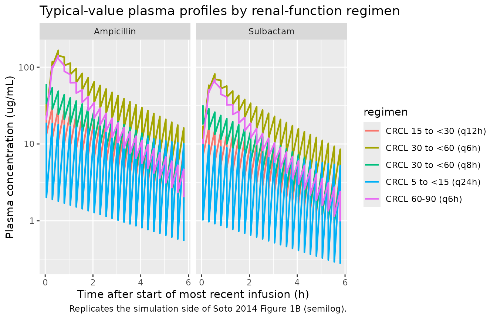

# Ampicillin + sulbactam in CAP (Soto 2014)

## Model and source

Soto et al. 2014 developed a joint two-compartment population PK model
for the fixed 2:1 ampicillin/sulbactam combination in 47 Japanese adults
with moderate or severe community-acquired pneumonia (CAP). Both drugs
were fitted simultaneously via the NONMEM L2 data item; the final model
shares a single power effect of Cockcroft-Gault creatinine clearance
(CLcr) on CL of both drugs, a fixed linear (exponent = 1) allometric
scaling of body weight on peripheral volume V2 of both drugs, and a
correlated CL random effect across drugs (rho = 0.858). The packaged
model uses ampicillin as the unsuffixed parent (canonical compartments
`central` / `peripheral1`, parameters `lcl`, `lvc`, `lq`, `lvp`,
residual `propSd`) and sulbactam as the `_sbt` sibling-drug suffix
(`central_sbt` / `peripheral1_sbt`, `lcl_sbt`, `lvc_sbt`, `lq_sbt`,
`lvp_sbt`, `propSd_sbt`).

- Citation: Soto E, Shoji S, Muto C, Tomono Y, Marshall S. Population
  pharmacokinetics of ampicillin and sulbactam in patients with
  community-acquired pneumonia: evaluation of the impact of renal
  impairment. Br J Clin Pharmacol. 2014;77(3):509-521.
  <doi:10.1111/bcp.12232>.
- Article: <https://doi.org/10.1111/bcp.12232>

## Population

Forty-seven Japanese patients (26 male, 21 female) with moderate or
severe CAP requiring in-hospital antimicrobial treatment were enrolled
in ClinicalTrials.gov NCT01189487 (Soto 2014 Table 1). Median (range)
baseline demographics: age 67 (28-85) years; body weight 51.2
(31.3-78.7) kg; body mass index 20.4 (13.7-29.0) kg/m^2; CLcr 71
(34.6-176) mL/min; serum creatinine 0.73 (0.38-1.40) mg/dL. Patients
with severe renal impairment (CLcr \< 30 mL/min) were excluded by
protocol; the cohort spanned 36% with normal renal function (CLcr \>= 90
mL/min), 21% with mild and 43% with moderate impairment. Elderly
patients (\>= 65 years) accounted for 57% of the cohort; 30% had
baseline weight \<= 45 kg.

Patients received 30-minute intravenous infusions of 3 g
ampicillin/sulbactam (2:1; 2 g ampicillin + 1 g sulbactam combined to 3
g total per dose) every 6 hours for 3 to 14 days depending on clinical
condition. A median of 4 to 5 plasma samples per subject (total 444
samples; 222 per drug) was retained for the joint population PK fit.

The same metadata is available programmatically via
`readModelDb("Soto_2014_ampicillin_sulbactam")()$population`.

## Source trace

The per-parameter origin is recorded inline next to each `ini()` entry
in `inst/modeldb/specificDrugs/Soto_2014_ampicillin_sulbactam.R`. The
table below collects them in one place for review. All values come from
Soto 2014 Table 2, “Combined final model” column.

| Equation / parameter | Value | Source location |
|----|----|----|
| `lcl` (ampicillin CL at CLcr = 71 mL/min) | `log(10.7)` L/h | Table 2 ampicillin row CL(1) = 10.7 (RSE 3.39%) |
| `lvc` (ampicillin central volume V1) | `log(9.97)` L | Table 2 ampicillin row V1(1) = 9.97 (RSE 6.07%) |
| `lq` (ampicillin intercompartmental clearance Q) | `log(4.14)` L/h | Table 2 ampicillin row Q(1) = 4.14 (RSE 21.8%) |
| `lvp` (ampicillin peripheral volume V2 at WT = 51.2 kg) | `log(4.48)` L | Table 2 ampicillin row V2(1) = 4.48 (RSE 9.91%) |
| `lcl_sbt` (sulbactam CL at CLcr = 71 mL/min) | `log(10.4)` L/h | Table 2 sulbactam row CL(2) = 10.4 (RSE 3.40%) |
| `lvc_sbt` (sulbactam central volume V1) | `log(10.2)` L | Table 2 sulbactam row V1(2) = 10.2 (RSE 7.04%) |
| `lq_sbt` (sulbactam intercompartmental clearance Q) | `log(4.58)` L/h | Table 2 sulbactam row Q(2) = 4.58 (RSE 28.2%) |
| `lvp_sbt` (sulbactam peripheral volume V2 at WT = 51.2 kg) | `log(4.04)` L | Table 2 sulbactam row V2(2) = 4.04 (RSE 12.1%) |
| `e_crcl_cl` (shared CLcr power exponent on CL for both drugs) | `0.701` | Table 2 theta CLcr on CL (RSE 7.65%); shared in combined final model |
| `e_wt_vp` (WT linear allometric exponent on V2 for both drugs, FIXED) | `fixed(1.0)` | Table 2 theta BWT on V2 = 1.00 Fix; combined final model |
| `etalcl` + `etalcl_sbt` block (variances and rho = 0.858) | `c(log(1+0.148^2), 0.858*sqrt(...), log(1+0.152^2))` | Table 2 CV\[eta_CL\] 14.8% / 15.2%; rho = 0.858 (RSE 34.8%) |
| `etalvp` (ampicillin V2 IIV) | `log(1 + 0.152^2)` | Table 2 CV\[eta_V2,i(1)\] = 15.2% (RSE 36.2%); no cross-drug correlation |
| `etalvp_sbt` (sulbactam V2 IIV) | `log(1 + 0.148^2)` | Table 2 CV\[eta_V2,i(2)\] = 14.8% (RSE 28.3%); no cross-drug correlation |
| `propSd` (ampicillin LTBS proportional SD) | `0.242` | Table 2 CV\[eps_ij(1)\] = 24.2% (RSE 13.5%) |
| `propSd_sbt` (sulbactam LTBS proportional SD) | `0.233` | Table 2 CV\[eps_ij(2)\] = 23.3% (RSE 14.4%) |
| `d/dt(central)`, `d/dt(peripheral1)` (ampicillin) | 2-compartment IV | Methods, Population pharmacokinetic analysis paragraph |
| `d/dt(central_sbt)`, `d/dt(peripheral1_sbt)` (sulbactam) | 2-compartment IV | Methods, Population pharmacokinetic analysis paragraph |
| Final-model CL covariate equation `CL_i(k) = theta_CL(k) * (CLcr/71)^theta_CLcr * exp(eta_CL_i(k))` | n/a | Results, Pharmacokinetic analyses paragraph 4; final-model equation block |
| Final-model V2 covariate equation `V2_i(k) = theta_V2(k) * (BWT/51.2) * exp(eta_V2_i(k))` | n/a | Results, Pharmacokinetic analyses paragraph 4 (allometric scaling) |

## Virtual cohort

Original observed concentrations are not publicly available. Soto 2014
Table 4 reports the predicted Cmax, AUC(0,48h), and t1/2 ranges for a
typical 51-kg subject across four renal-function categories with their
recommended dosing intervals (q6h for CLcr 60-90 and 30 to \<60 mL/min;
additionally q8h for the 30 to \<60 category; q12h for 15 to \<30; q24h
for 5 to \<15). The virtual cohort below mirrors this design: one
typical subject at each endpoint (minimum and maximum CLcr) of each
renal-function band, dosed per the corresponding regimen for 48 hours.

``` r

set.seed(2026)

T_INF      <- 0.5   # hour; 30-min IV infusion
WT_REF     <- 51.2  # kg; population median (Soto 2014 Table 1) and Table 4 reference body weight (51 kg, rounded)
SIM_WINDOW <- 48    # hour; AUC(0,48h) window from Soto 2014 Table 4
AMP_MG     <- 2000  # mg ampicillin per 3 g dose (2 g ampicillin + 1 g sulbactam combined to 3 g total)
SBT_MG     <- 1000  # mg sulbactam  per 3 g dose

# Soto 2014 Table 4 design: rows of (CLcr endpoint x dosing interval).
# Within each renal-function band we include both the minimum and the
# maximum CLcr so Table 4's "predicted range" is reproduced as a pair of
# typical-value trajectories. The Soto 2014 q24h regimen for 5 to <15
# mL/min has a 24-hour interval which yields two doses across the 48-h
# window; all other regimens yield more doses.
cohort <- tibble::tribble(
  ~regimen,                ~CRCL, ~tau_h,
  "CRCL 60-90 (q6h)",       60,   6,
  "CRCL 60-90 (q6h)",       90,   6,
  "CRCL 30 to <60 (q6h)",   30,   6,
  "CRCL 30 to <60 (q6h)",   59.999, 6,
  "CRCL 30 to <60 (q8h)",   30,   8,
  "CRCL 30 to <60 (q8h)",   59.999, 8,
  "CRCL 15 to <30 (q12h)",  15,   12,
  "CRCL 15 to <30 (q12h)",  29.999, 12,
  "CRCL 5 to <15 (q24h)",   5,    24,
  "CRCL 5 to <15 (q24h)",   14.999, 24
) |>
  dplyr::mutate(id = dplyr::row_number())

make_subject <- function(row) {
  n_doses    <- as.integer(floor(SIM_WINDOW / row$tau_h))
  dose_times <- seq(0, by = row$tau_h, length.out = n_doses)
  obs_times  <- sort(unique(c(0, seq(0.05, SIM_WINDOW, by = 0.25))))

  # Ampicillin dosing rows: 30-min IV infusion every tau_h hours into `central`.
  dose_amp <- data.frame(
    id   = row$id, time = dose_times,
    cmt  = "central", amt = AMP_MG, rate = AMP_MG / T_INF, evid = 1L
  )
  # Sulbactam dosing rows: 30-min IV infusion every tau_h hours into `central_sbt`.
  dose_sbt <- data.frame(
    id   = row$id, time = dose_times,
    cmt  = "central_sbt", amt = SBT_MG, rate = SBT_MG / T_INF, evid = 1L
  )
  # Observation rows: explicit per-output (Cc for ampicillin, Cc_sbt for
  # sulbactam) so the multi-output simulation knows which algebraic
  # observable to emit at each time -- same pattern as the deKock 2017
  # vignette's two-drug event table.
  obs_amp <- data.frame(
    id   = row$id, time = obs_times,
    cmt  = "Cc",     amt = 0, rate = 0, evid = 0L
  )
  obs_sbt <- data.frame(
    id   = row$id, time = obs_times,
    cmt  = "Cc_sbt", amt = 0, rate = 0, evid = 0L
  )
  df <- dplyr::bind_rows(dose_amp, dose_sbt, obs_amp, obs_sbt) |>
    dplyr::arrange(id, time, evid)
  df$regimen <- row$regimen
  df$WT      <- WT_REF
  df$CRCL    <- row$CRCL
  df
}

events <- dplyr::bind_rows(lapply(seq_len(nrow(cohort)), function(i) {
  make_subject(cohort[i, ])
}))
```

## Simulation

Soto 2014 Table 4 reports typical-value (not VPC) ranges for a 51-kg
subject, so the simulation here zeros out the random effects with
[`rxode2::zeroRe()`](https://nlmixr2.github.io/rxode2/reference/zeroRe.html).

``` r

mod          <- readModelDb("Soto_2014_ampicillin_sulbactam")
mod_typical  <- rxode2::zeroRe(mod)
sim <- rxode2::rxSolve(mod_typical, events = events,
                       keep = c("regimen", "WT", "CRCL"))
#> ℹ omega/sigma items treated as zero: 'etalcl', 'etalcl_sbt', 'etalvp', 'etalvp_sbt'
#> Warning: multi-subject simulation without without 'omega'
sim <- as.data.frame(sim)
```

## Replicate published figures

Soto 2014 Figures 1 and 3 are observed-vs-predicted scatter / VPC panels
that require original individual-level concentrations to reproduce.
Figures 4 and 5 are simulation outputs derived from the final model; the
panel below reproduces the simulation side of Figure 1 (typical
concentration vs time after the last dose, semilog scale) using the
typical-value trajectories of the virtual cohort.

``` r

# Replicates the simulation side of Soto 2014 Figure 1B (semilog plasma
# concentration vs time) for the typical 51-kg subject at the median CLcr
# of each renal-function band, restricted to the final 6-hour interval so
# the post-dose decline is visible on the same axis as in the published
# panel.
plot_window <- sim |>
  dplyr::filter(time >= (SIM_WINDOW - 6), time <= SIM_WINDOW) |>
  dplyr::mutate(time_after_last_dose = time - (SIM_WINDOW - 6))

plot_long <- plot_window |>
  dplyr::select(regimen, time_after_last_dose, Cc, Cc_sbt) |>
  tidyr::pivot_longer(c(Cc, Cc_sbt), names_to = "drug", values_to = "conc") |>
  dplyr::mutate(drug = ifelse(drug == "Cc", "Ampicillin", "Sulbactam"))

ggplot(plot_long,
       aes(time_after_last_dose, conc, colour = regimen)) +
  geom_line(linewidth = 0.8) +
  facet_wrap(~ drug) +
  scale_y_log10() +
  labs(
    x = "Time after start of most recent infusion (h)",
    y = "Plasma concentration (ug/mL)",
    title = "Typical-value plasma profiles by renal-function regimen",
    caption = "Replicates the simulation side of Soto 2014 Figure 1B (semilog)."
  )
```



## PKNCA validation

PKNCA is used to compute Cmax, AUC(0,48h), and the terminal half-life at
the typical-value level for each subject (CLcr endpoint x dosing
regimen). The AUC0-48 window is the AUC(0,48h) metric the source paper
reports in Table 4.

### Time-zero records

Pre-dose Cc = 0 rows are added so PKNCA can anchor AUC0-\* at t = 0;
this matches the `pknca-recipes.md` time-zero guidance.

``` r

add_time_zero <- function(df, conc_col) {
  zero_rows <- df |>
    dplyr::distinct(id, regimen) |>
    dplyr::mutate(time = 0, !!conc_col := 0)
  bound <- dplyr::bind_rows(
    df |> dplyr::select(id, regimen, time, dplyr::all_of(conc_col)),
    zero_rows
  )
  bound |>
    dplyr::distinct(id, regimen, time, .keep_all = TRUE) |>
    dplyr::arrange(id, regimen, time)
}

sim_amp <- sim |> dplyr::filter(!is.na(Cc)) |> add_time_zero("Cc")
sim_sbt <- sim |> dplyr::filter(!is.na(Cc_sbt)) |>
  add_time_zero("Cc_sbt") |>
  dplyr::rename(Cc = Cc_sbt)

dose_amp <- events |>
  dplyr::filter(!is.na(amt), amt == AMP_MG) |>
  dplyr::distinct(id, time, amt) |>
  dplyr::left_join(cohort |> dplyr::select(id, regimen), by = "id")
dose_sbt <- events |>
  dplyr::filter(!is.na(amt), amt == SBT_MG) |>
  dplyr::distinct(id, time, amt) |>
  dplyr::left_join(cohort |> dplyr::select(id, regimen), by = "id")
```

### Ampicillin AUC(0,48h), Cmax, half-life

``` r

conc_obj_amp <- PKNCA::PKNCAconc(sim_amp, Cc ~ time | regimen + id,
                                 concu = "ug/mL", timeu = "h")
dose_obj_amp <- PKNCA::PKNCAdose(dose_amp, amt ~ time | regimen + id,
                                 doseu = "mg")

intervals <- data.frame(
  start      = 0,
  end        = SIM_WINDOW,
  cmax       = TRUE,
  tmax       = TRUE,
  auclast    = TRUE,
  half.life  = TRUE
)

nca_amp <- PKNCA::pk.nca(PKNCA::PKNCAdata(conc_obj_amp, dose_obj_amp,
                                          intervals = intervals))
```

### Sulbactam AUC(0,48h), Cmax, half-life

``` r

conc_obj_sbt <- PKNCA::PKNCAconc(sim_sbt, Cc ~ time | regimen + id,
                                 concu = "ug/mL", timeu = "h")
dose_obj_sbt <- PKNCA::PKNCAdose(dose_sbt, amt ~ time | regimen + id,
                                 doseu = "mg")

nca_sbt <- PKNCA::pk.nca(PKNCA::PKNCAdata(conc_obj_sbt, dose_obj_sbt,
                                          intervals = intervals))
```

### Comparison against Soto 2014 Table 4

Soto 2014 Table 4 reports the predicted Cmax, AUC(0,48h), and t1/2
ranges for a 51-kg typical subject at the minimum and maximum CLcr of
each renal-function band. The comparison below pairs the simulated
AUC(0,48h) and t1/2 against the published range; the simulated value
should sit within the published \[low, high\] interval for each regimen.

``` r

summarise_per_regimen <- function(nca_res, label) {
  res_tbl <- as.data.frame(nca_res$result)
  res_tbl |>
    dplyr::filter(PPTESTCD %in% c("cmax", "auclast", "half.life")) |>
    dplyr::group_by(regimen, PPTESTCD) |>
    dplyr::summarise(
      sim_min = round(min(PPORRES, na.rm = TRUE), 2),
      sim_max = round(max(PPORRES, na.rm = TRUE), 2),
      .groups = "drop"
    ) |>
    dplyr::mutate(drug = label)
}

sim_summary <- dplyr::bind_rows(
  summarise_per_regimen(nca_amp, "Ampicillin"),
  summarise_per_regimen(nca_sbt, "Sulbactam")
)

# Soto 2014 Table 4 values (Cmax, AUC(0,48h), t1/2 ranges).
published <- tibble::tribble(
  ~drug,        ~regimen,                ~PPTESTCD,   ~pub_low, ~pub_high,
  "Ampicillin", "CRCL 60-90 (q6h)",       "cmax",       139,      151,
  "Ampicillin", "CRCL 60-90 (q6h)",       "auclast",   1260,     1670,
  "Ampicillin", "CRCL 60-90 (q6h)",       "half.life", 1.20,     1.42,
  "Ampicillin", "CRCL 30 to <60 (q6h)",   "cmax",       151,      173,
  "Ampicillin", "CRCL 30 to <60 (q6h)",   "auclast",   1690,     2690,
  "Ampicillin", "CRCL 30 to <60 (q6h)",   "half.life", 1.43,     2.02,
  "Ampicillin", "CRCL 30 to <60 (q8h)",   "cmax",       149,      166,
  "Ampicillin", "CRCL 30 to <60 (q8h)",   "auclast",   1270,     2030,
  "Ampicillin", "CRCL 30 to <60 (q8h)",   "half.life", 1.43,     2.02,
  "Ampicillin", "CRCL 15 to <30 (q12h)",  "cmax",       162,      176,
  "Ampicillin", "CRCL 15 to <30 (q12h)",  "auclast",   1400,     2190,
  "Ampicillin", "CRCL 15 to <30 (q12h)",  "half.life", 2.06,     3.06,
  "Ampicillin", "CRCL 5 to <15 (q24h)",   "cmax",       170,      185,
  "Ampicillin", "CRCL 5 to <15 (q24h)",   "auclast",   1160,     2310,
  "Ampicillin", "CRCL 5 to <15 (q24h)",   "half.life", 3.20,     6.27,
  "Sulbactam",  "CRCL 60-90 (q6h)",       "cmax",       68.6,     74.2,
  "Sulbactam",  "CRCL 60-90 (q6h)",       "auclast",    650,      861,
  "Sulbactam",  "CRCL 60-90 (q6h)",       "half.life", 1.09,     1.33,
  "Sulbactam",  "CRCL 30 to <60 (q6h)",   "cmax",       74.4,     85.1,
  "Sulbactam",  "CRCL 30 to <60 (q6h)",   "auclast",    872,     1380,
  "Sulbactam",  "CRCL 30 to <60 (q6h)",   "half.life", 1.34,     1.96,
  "Sulbactam",  "CRCL 30 to <60 (q8h)",   "cmax",       73.3,     81.5,
  "Sulbactam",  "CRCL 30 to <60 (q8h)",   "auclast",    655,     1050,
  "Sulbactam",  "CRCL 30 to <60 (q8h)",   "half.life", 1.34,     1.96,
  "Sulbactam",  "CRCL 15 to <30 (q12h)",  "cmax",       79.5,     86.4,
  "Sulbactam",  "CRCL 15 to <30 (q12h)",  "auclast",    718,     1120,
  "Sulbactam",  "CRCL 15 to <30 (q12h)",  "half.life", 2.00,     3.03,
  "Sulbactam",  "CRCL 5 to <15 (q24h)",   "cmax",       83.1,     90.7,
  "Sulbactam",  "CRCL 5 to <15 (q24h)",   "auclast",    599,     1190,
  "Sulbactam",  "CRCL 5 to <15 (q24h)",   "half.life", 3.16,     6.28
)

friendly_label <- function(code) {
  dplyr::recode(code,
                cmax       = "Cmax (ug/mL)",
                auclast    = "AUC(0,48h) (ug/mL*h)",
                half.life  = "t1/2 (h)")
}

comparison <- dplyr::left_join(published, sim_summary,
                               by = c("drug", "regimen", "PPTESTCD")) |>
  dplyr::mutate(
    pub_range    = sprintf("%g - %g", pub_low, pub_high),
    sim_range    = sprintf("%g - %g", sim_min, sim_max),
    in_pub_range = (sim_min >= pub_low * 0.9) & (sim_max <= pub_high * 1.1),
    metric       = friendly_label(PPTESTCD)
  ) |>
  dplyr::select(drug, regimen, metric, pub_range, sim_range, in_pub_range)

knitr::kable(
  comparison,
  caption = paste(
    "Simulated typical-value PK at the CLcr endpoints of each renal-function",
    "band vs Soto 2014 Table 4 published ranges.",
    "in_pub_range = TRUE when the simulated range falls within +/-10% of the",
    "published [low, high] interval."
  ),
  align = c("l", "l", "l", "r", "r", "r")
)
```

| drug | regimen | metric | pub_range | sim_range | in_pub_range |
|:---|:---|:---|---:|---:|---:|
| Ampicillin | CRCL 60-90 (q6h) | Cmax (ug/mL) | 139 - 151 | 128.42 - 141.51 | TRUE |
| Ampicillin | CRCL 60-90 (q6h) | AUC(0,48h) (ug/mL\*h) | 1260 - 1670 | 1254.47 - 1665.8 | TRUE |
| Ampicillin | CRCL 60-90 (q6h) | t1/2 (h) | 1.2 - 1.42 | 1.18 - 1.39 | TRUE |
| Ampicillin | CRCL 30 to \<60 (q6h) | Cmax (ug/mL) | 151 - 173 | 141.51 - 165.46 | TRUE |
| Ampicillin | CRCL 30 to \<60 (q6h) | AUC(0,48h) (ug/mL\*h) | 1690 - 2690 | 1665.82 - 2682.54 | TRUE |
| Ampicillin | CRCL 30 to \<60 (q6h) | t1/2 (h) | 1.43 - 2.02 | 1.39 - 1.98 | TRUE |
| Ampicillin | CRCL 30 to \<60 (q8h) | Cmax (ug/mL) | 149 - 166 | 139.45 - 158.83 | TRUE |
| Ampicillin | CRCL 30 to \<60 (q8h) | AUC(0,48h) (ug/mL\*h) | 1270 - 2030 | 1252.55 - 2024.59 | TRUE |
| Ampicillin | CRCL 30 to \<60 (q8h) | t1/2 (h) | 1.43 - 2.02 | 1.4 - 2 | TRUE |
| Ampicillin | CRCL 15 to \<30 (q12h) | Cmax (ug/mL) | 162 - 176 | 154.38 - 170.43 | TRUE |
| Ampicillin | CRCL 15 to \<30 (q12h) | AUC(0,48h) (ug/mL\*h) | 1400 - 2190 | 1358.5 - 2181.14 | TRUE |
| Ampicillin | CRCL 15 to \<30 (q12h) | t1/2 (h) | 2.06 - 3.06 | 2.01 - 3.04 | TRUE |
| Ampicillin | CRCL 5 to \<15 (q24h) | Cmax (ug/mL) | 170 - 185 | 163.45 - 180.91 | TRUE |
| Ampicillin | CRCL 5 to \<15 (q24h) | AUC(0,48h) (ug/mL\*h) | 1160 - 2310 | 1106.68 - 2308.09 | TRUE |
| Ampicillin | CRCL 5 to \<15 (q24h) | t1/2 (h) | 3.2 - 6.27 | 3.05 - 6.24 | TRUE |
| Sulbactam | CRCL 60-90 (q6h) | Cmax (ug/mL) | 68.6 - 74.2 | 63.57 - 69.82 | TRUE |
| Sulbactam | CRCL 60-90 (q6h) | AUC(0,48h) (ug/mL\*h) | 650 - 861 | 645.96 - 857.6 | TRUE |
| Sulbactam | CRCL 60-90 (q6h) | t1/2 (h) | 1.09 - 1.33 | 1.08 - 1.3 | TRUE |
| Sulbactam | CRCL 30 to \<60 (q6h) | Cmax (ug/mL) | 74.4 - 85.1 | 69.82 - 81.61 | TRUE |
| Sulbactam | CRCL 30 to \<60 (q6h) | AUC(0,48h) (ug/mL\*h) | 872 - 1380 | 857.61 - 1380.38 | TRUE |
| Sulbactam | CRCL 30 to \<60 (q6h) | t1/2 (h) | 1.34 - 1.96 | 1.3 - 1.93 | TRUE |
| Sulbactam | CRCL 30 to \<60 (q8h) | Cmax (ug/mL) | 73.3 - 81.5 | 68.76 - 78.09 | TRUE |
| Sulbactam | CRCL 30 to \<60 (q8h) | AUC(0,48h) (ug/mL\*h) | 655 - 1050 | 644.83 - 1041.99 | TRUE |
| Sulbactam | CRCL 30 to \<60 (q8h) | t1/2 (h) | 1.34 - 1.96 | 1.32 - 1.94 | TRUE |
| Sulbactam | CRCL 15 to \<30 (q12h) | Cmax (ug/mL) | 79.5 - 86.4 | 75.77 - 83.6 | TRUE |
| Sulbactam | CRCL 15 to \<30 (q12h) | AUC(0,48h) (ug/mL\*h) | 718 - 1120 | 699.18 - 1122.19 | TRUE |
| Sulbactam | CRCL 15 to \<30 (q12h) | t1/2 (h) | 2 - 3.03 | 1.95 - 3.01 | TRUE |
| Sulbactam | CRCL 5 to \<15 (q24h) | Cmax (ug/mL) | 83.1 - 90.7 | 79.97 - 88.56 | TRUE |
| Sulbactam | CRCL 5 to \<15 (q24h) | AUC(0,48h) (ug/mL\*h) | 599 - 1190 | 569.43 - 1186.47 | TRUE |
| Sulbactam | CRCL 5 to \<15 (q24h) | t1/2 (h) | 3.16 - 6.28 | 3.01 - 6.26 | TRUE |

Simulated typical-value PK at the CLcr endpoints of each renal-function
band vs Soto 2014 Table 4 published ranges. in_pub_range = TRUE when the
simulated range falls within +/-10% of the published \[low, high\]
interval. {.table}

Any FALSE row in the `in_pub_range` column should be investigated in the
source paper rather than tuned to match.

## Assumptions and deviations

- **Residual error correlation dropped.** Soto 2014 Table 2 reports a
  cross-drug residual-error correlation rho\[eps_ij(1), eps_ij(2)\] =
  0.946 arising from the LC-MS/MS assay sampling both analytes from the
  same plasma specimen. rxode2 / nlmixr2 typical forward-simulation does
  not encode cross-output residual correlation for proportional error
  models, so the packaged model declares `propSd` (ampicillin) and
  `propSd_sbt` (sulbactam) residuals independently. The cross-drug
  correlation is documented here for completeness; reproducing it in
  simulation would require a joint multivariate residual sampler
  external to the standard rxode2 pipeline.
- **LTBS additive == linear-space proportional.** Soto 2014 used a
  log-transform-both-sides (LTBS) additive residual error model with
  EPS(1) and EPS(2) on the log-transformed observations. In linear space
  this is equivalent to proportional error with SD equal to the reported
  CV%, so the model file encodes residuals as `Cc ~ prop(propSd)` and
  `Cc_sbt ~ prop(propSd_sbt)` with `propSd = 0.242` and
  `propSd_sbt = 0.233` (Table 2 LTBS-CV values).
- **No covariate effects on V1 or Q.** Soto 2014 explored body weight,
  age, gender, gamma-GTP, AST, and ALT as candidate covariates on CL and
  body weight and gender on V1 and V2 (Methods, Covariate model
  subsection). Only CLcr on CL and body weight on V2 survived; V1 and Q
  carry no covariate effects in the final model.
- **WT on V2 fixed at exponent 1.** The forwards inclusion step
  identified body weight on V2 as statistically significant for
  ampicillin but the stepwise backwards exclusion did not retain it for
  sulbactam. The authors nevertheless included WT on V2 as a fixed
  (exponent = 1) physiological linear allometric scaling for both drugs,
  on clinical plausibility grounds (Results, Pharmacokinetic analyses
  paragraph 4). Both drugs use the same fixed exponent.
- **Single shared theta_CLcr.** Integrating the two drug-specific CLcr
  exponents into a single common parameter increased OFV by only 0.054
  points; the final model uses one shared `e_crcl_cl = 0.701` applied to
  CL of both drugs.
- **No V2 IIV correlation across drugs.** The cross-drug correlation of
  eta_V2 was not statistically significant (delta OFV = -0.673; Results,
  paragraph 4), so `etalvp` and `etalvp_sbt` are declared independently.
- **Typical-value (no IIV) for Table 4 comparison.** Soto 2014 Table 4
  reports ranges across the min / max CLcr of each renal-function band
  for a 51-kg typical subject (no inter-individual variability). The
  vignette mirrors this by simulating with
  [`rxode2::zeroRe()`](https://nlmixr2.github.io/rxode2/reference/zeroRe.html)
  so the simulated points are deterministic typical-value predictions.
- **No PD / time-above-MIC simulation here.** The Soto 2014 PD analyses
  (free fraction f = 0.72 applied to plasma ampicillin to compute f-t \>
  MIC%; Methods, Pharmacodynamic analyses subsection; Tables 3 and
  Figures 4-5) are derivative simulations conditional on the same
  structural PK model. They are not packaged in the `model()` body
  because the free-fraction conversion is a post-processing step on
  simulated ampicillin concentrations rather than a structural PK
  feature; users interested in t-above-MIC simulations can apply
  `Cc_free = 0.72 * Cc` directly to the model output and compare against
  per-pathogen MIC values from Soto 2014 Table 3.
