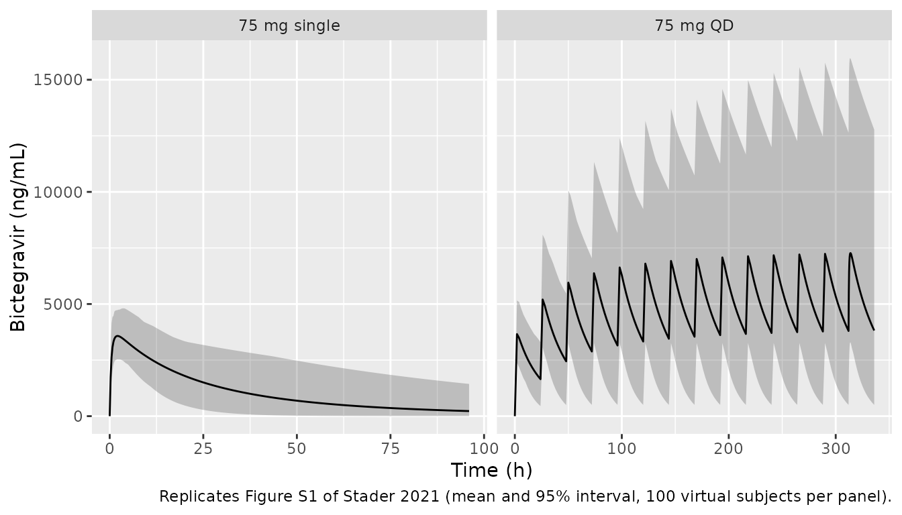
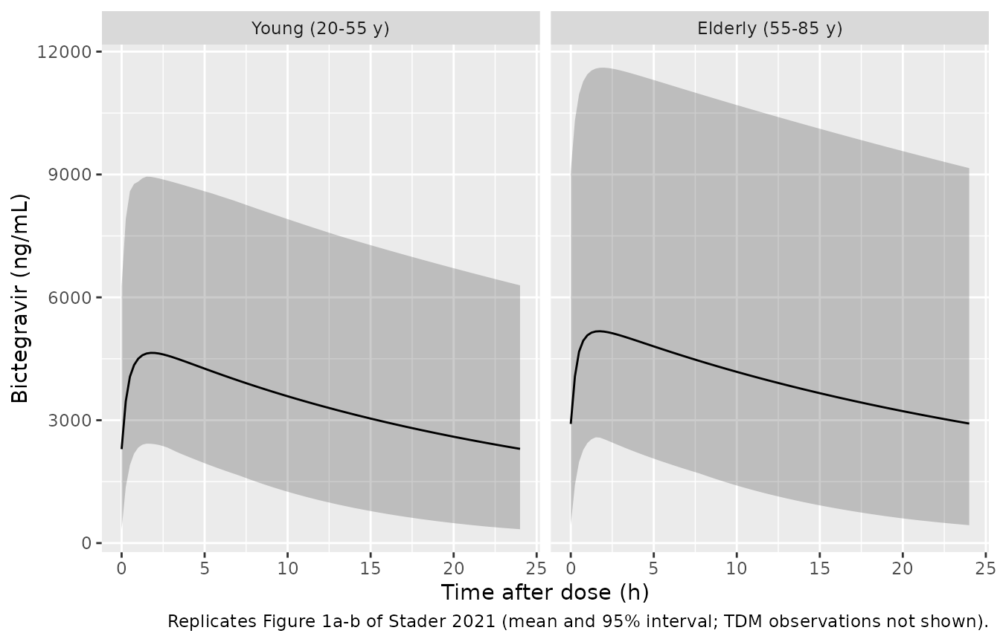
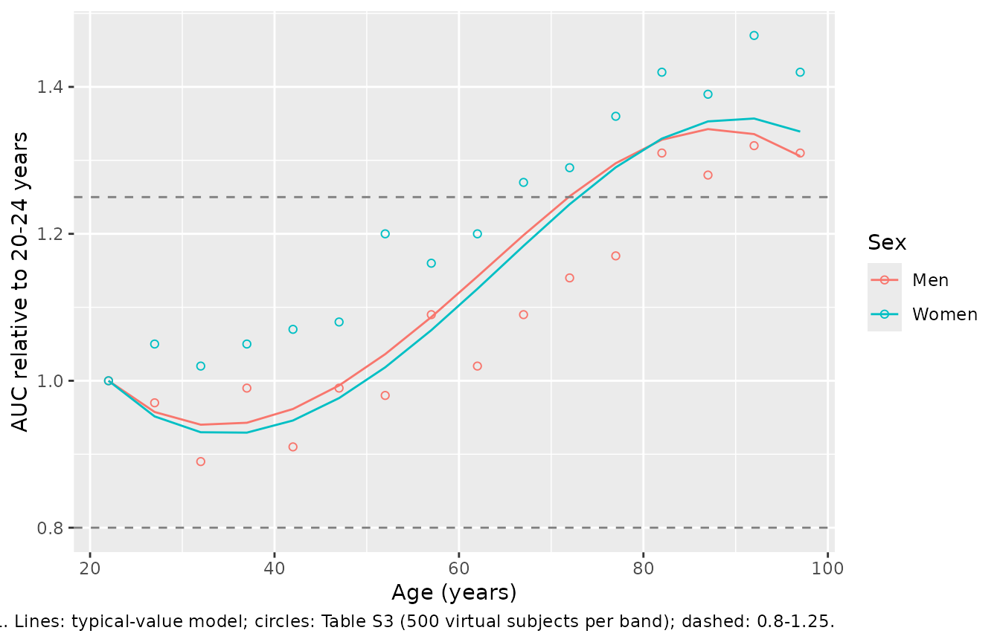

# Bictegravir whole-body PBPK in ageing adults (Stader 2021)

## Model and source

- Citation: Stader F, Courlet P, Decosterd LA, Battegay M, Marzolini C.
  Physiologically-Based Pharmacokinetic Modeling Combined with Swiss HIV
  Cohort Study Data Supports No Dose Adjustment of Bictegravir in
  Elderly Individuals Living With HIV. Clin Pharmacol Ther.
  2021;109(4):1025-1029. <doi:10.1002/cpt.2178>. Model code:
  Supplementary Material s002 (CPT_Matlab_Code, Matlab source of the
  PBPK framework including Drug/DrugLibrary/bictegravir.m); drug
  parameters: Supplementary Table S1.
- Description: PBPK (whole-body, Stader et al. Matlab 2017a framework,
  as deposited with the paper). Oral bictegravir (single-agent tablet)
  in adults aged 20 to 99 years, used to predict the continuous effect
  of ageing on bictegravir pharmacokinetics in people living with HIV.
  Sixteen organs (lung, adipose, bone, brain, gonads, heart, kidney,
  muscle, skin, thymus, gut, spleen, pancreas, liver, lymph node and a
  remaining tissue) with vascular (\_vas), interstitial (\_ew) and
  intracellular (\_iw) sub-compartments (the gut carries vascular and
  interstitial only), venous and arterial blood, and a compartmental
  absorption and transit (CAT) gut of stomach plus duodenum, jejunum,
  ileum and colon, each with luminal fluid, an uptake layer and
  enterocytes: 63 ODEs. Organ weights, blood flows, lymph flows,
  haematocrit, albumin, GFR, microsomal protein per gram liver, hepatic
  CYP3A4 / UGT1A1 and intestinal CYP3A4 abundances and GI transit times
  are age-, sex-, height- and weight-dependent regressions from the
  deposited virtual-population generator; the generator’s per-subject
  random draws are carried as fixed etas so that rxSolve() with etas
  sampled reproduces the virtual population. Distribution by Rodgers and
  Rowland partitioning with permeability-limited cellular uptake;
  hepatic elimination by CYP3A4, UGT1A1 and an unassigned pathway,
  intestinal CYP3A4 metabolism in the enterocytes, and GFR-scaled renal
  clearance. Cc is the framework’s reported plasma concentration, which
  the deposited code reads from the venous-blood state.
- Article: <https://doi.org/10.1002/cpt.2178> (open access, PMC8048864)
- Supplement: Supporting Information s001 (Tables S1-S4, Figures S1-S2)
  and s002 (`CPT_Matlab_Code`, the complete Matlab source of the PBPK
  framework as run for the paper, including the bictegravir drug file
  `Drug/DrugLibrary/bictegravir.m`).

Stader et al. used their in-house whole-body PBPK framework (Matlab
2017a) to ask whether bictegravir needs a dose adjustment in elderly
people living with HIV. The paper describes the framework in a paragraph
and gives the bictegravir inputs in Table S1; the model equations, the
virtual-population generator and every system parameter are in the
deposited Matlab code, which is the source of this implementation. Every
equation in the model file cites the Matlab file it comes from.

## Population

The bictegravir drug model was built against published phase I data in
healthy volunteers who received 5-600 mg bictegravir as single doses or
once daily (Table S2; Gallant et al. 2017), and was verified against
therapeutic drug monitoring (TDM) samples from the Swiss HIV Cohort
Study: 60 young people living with HIV (mean age 42.2 years, range
22.8-54.7) and 32 elderly people living with HIV (mean 63.8 years, range
55.0-81.1), all on 50 mg bictegravir with no CYP3A or UGT1A1 inhibitor
or inducer (Results; Table 1). The paper then predicted bictegravir
pharmacokinetics after seven 50 mg doses in 500 virtual individuals (50%
women) per 5-year age band from 20 to 99 years (Methods; Figure 1c;
Table S3).

A PBPK model has no fitted population: its “population” is a virtual
one, drawn by the framework’s generator from age- and sex-dependent
regressions. The same information is available programmatically via the
model’s `population` metadata
(`readModelDb("Stader_2021_bictegravir_pbpk")()$population`).

## Source trace

Drug parameters (the `ini()` block) come from the deposited drug file
`Drug/DrugLibrary/bictegravir.m`, which Table S1 reprints (rounded) with
the same references. All are fixed inputs, not estimates.

| Parameter | Value | Source location |
|----|----|----|
| `logp` | 1.28 | `bictegravir.m` `DRUG.logP`; Table S1 ‘logP’ |
| `pka` | 9.81 (monoprotic acid) | `bictegravir.m` `DRUG.pka1`, `DRUG.type`; Table S1 ‘pKa 1’ 9.8, ‘ma’ |
| `bp` | 0.64 | `bictegravir.m` `DRUG.BP`; Table S1 ‘BP’ |
| `fu` | 0.0025 (albumin) | `bictegravir.m` `DRUG.fu`; Table S1 ‘fup’ |
| `papp` | 24.6 x 1e-6 cm/s | `bictegravir.m` `DRUG.Papp`; Table S1 ‘Papp’ |
| `jin_all` | 0.7 | `bictegravir.m` `DRUG.JinScalarAll`; Table S1 ‘Tissue Scalar All’ (optimized) |
| `jin_liver` | 2.0 | `bictegravir.m` `DRUG.JinScalar(liver)`; Table S1 ‘Tissue Scalar LI’ (optimized) |
| `clint_cyp3a4` | 0.114 uL/min/pmol | `bictegravir.m` `DRUG.CLint_CYP_1(CYP3A4)`; Table S1 (retrograde) |
| `clint_ugt1a1` | 0.292 uL/min/pmol | `bictegravir.m` `DRUG.CLint_UGT_1(UGT1A1)`; Table S1 (retrograde) |
| `clint_hep` | 3.993 uL/min/mg | `bictegravir.m` `DRUG.CLint`; Table S1 ‘Unspecified’ (retrograde) |
| `lcl_renal` | log(0.0043 L/h) | `bictegravir.m` `DRUG.CLrenal`; Table S1 ‘CLrenal’ 0.004 |
| 33 `eta*` terms | (CV/100)^2 | `normrnd(Mean, (CV/100)*Mean)` draws of `Population/PBPK_Population_Tissue.m`, `_Liver.m`, `_GIT.m` |

| Model component | Source location (s002 `CPT_Matlab_Code/`) |
|----|----|
| BSA, height and weight draws | `Population/PBPK_Population_Demographics.m` |
| Haematocrit, albumin, organ weights, remaining-tissue balance | `Population/PBPK_Population_Tissue.m` (‘Blood parameters’, ‘Organ weights’) |
| Organ densities, tissue composition, vascular fractions, sub-compartment volumes, pH | `Population/PBPK_Population_Tissue.m` |
| Cardiac output, regional blood flows, lymph flows, GFR | `Population/PBPK_Population_Tissue.m` |
| MPPGL, hepatic CYP3A4 and UGT1A1 abundance | `Population/PBPK_Population_Liver.m` |
| GI segment volumes, lengths, surfaces, enterocyte volumes, transit times, intestinal CYP3A4 | `Population/PBPK_Population_GIT.m` |
| Rodgers and Rowland Kpu, fup, fuint, fucel, CLin/CLout | `Drug/PBPK_Drug_distribution.m` |
| Scalar handling (Jin, Fin, kPerUP) | `Drug/PBPK_Drug_PostProcessing.m` |
| Peff, CLab | `Drug/PBPK_Drug_absorption.m` |
| CLint scaling, renal clearance | `Drug/PBPK_Drug_elimination.m` |
| All 63 ODEs | `PBPK_ODE_solution.m` (`rhs_function`) |
| Reported concentration `Cc` | `PBPK_ExtractConcentration.m` (`CONC.VB`) |
| AUC, half-life and CL/F definitions | `PBPK_PostProcessing.m` (`Calc_PKparaT`, `Calc_PKparaINF`) |

A mechanical check by the maintainers confirmed that every numeric
literal in the model’s `model()` block appears in the deposited Matlab
code, and that the composition, density, vascular-fraction,
lymph-fraction and pH values of all 16 organs match the Matlab
assignments organ by organ.

## Virtual population

The helpers below re-implement the framework’s generator: integer ages
from a Weibull distribution (scale 61.73, shape 1.55) restricted to the
study age range, an exact sex split, normal height (CV 3.8%) and weight
(CV 15.2%) around the age- and sex-specific means, reset to the means
when the BMI falls outside 18.5-30 kg/m^2
(`PBPK_Population_Demographics.m`). The 33 physiological random draws
are the model’s etas; they are drawn here in base R from the model’s own
`omega` and passed as data columns to the typical-value model, so every
cohort in this article is fixed by
[`set.seed()`](https://rdrr.io/r/base/Random.html) alone and identical
on any machine and thread count.

``` r

mod <- readModelDb("Stader_2021_bictegravir_pbpk")
ui <- rxode2::rxode(mod)
#> ℹ parameter labels from comments will be replaced by 'label()'
#> Warning: some etas defaulted to non-mu referenced, possible parsing error: etamppgl_redraw, etacyp3a4_liver_redraw, etaugt1a1_liver_redraw, etagastric, etasitt_redraw, etacolt_redraw, etacyp3a4_gut_redraw
#> as a work-around try putting the mu-referenced expression on a simple line
mod_tv <- rxode2::zeroRe(ui)
#> Warning: No sigma parameters in the model
#> some etas defaulted to non-mu referenced, possible parsing error: etamppgl_redraw, etacyp3a4_liver_redraw, etaugt1a1_liver_redraw, etagastric, etasitt_redraw, etacolt_redraw, etacyp3a4_gut_redraw
#> as a work-around try putting the mu-referenced expression on a simple line
omega_sd <- sqrt(diag(ui$omega))

gen_cohort <- function(n, age_min, age_max, prop_fem = 0.5, id_offset = 0L) {
  draw_age <- function(k) round(61.73 * (-log(1 - runif(k)))^(1 / 1.55))
  age <- draw_age(n)
  bad <- age < age_min | age > age_max
  while (any(bad)) {
    age[bad] <- draw_age(sum(bad))
    bad <- age < age_min | age > age_max
  }
  n_fem <- round(n * prop_fem)
  sexf <- rep(c(1, 0), c(n_fem, n - n_fem))[sample.int(n)]
  ht_mean <- -0.0039 * age^2 + 0.238 * age - 12.5 * sexf + 176
  ht <- rnorm(n, ht_mean, 0.038 * ht_mean)
  wt_mean <- -0.0039 * age^2 + 1.12 * ht + 0.611 * age - 0.424 * sexf - 137
  wt <- rnorm(n, wt_mean, 0.152 * wt_mean)
  bmi <- wt / (ht / 100)^2
  reset <- bmi < 18.5 | bmi > 30
  ht[reset] <- ht_mean[reset]
  wt[reset] <- wt_mean[reset]
  etas <- as.data.frame(matrix(
    rnorm(n * length(omega_sd), sd = rep(omega_sd, each = n)),
    nrow = n, dimnames = list(NULL, names(omega_sd))
  ))
  cbind(data.frame(id = id_offset + seq_len(n), AGE = age, SEXF = sexf, HT = ht, WT = wt), etas)
}

make_events <- function(cohort, dose, n_doses, obs_times, tau = 24, label) {
  doses <- tidyr::crossing(id = cohort$id, time = tau * (seq_len(n_doses) - 1)) |>
    mutate(amt = dose, evid = 1L, cmt = "stomach")
  obs <- tidyr::crossing(id = cohort$id, time = obs_times) |>
    mutate(amt = 0, evid = 0L, cmt = "venous")
  bind_rows(doses, obs) |>
    left_join(cohort, by = "id") |>
    mutate(treatment = label) |>
    arrange(id, time, desc(evid))
}
```

## Mass balance (typical 30-year-old man)

The model is carried in drug amounts, so dose = drug in the body + drug
eliminated. Liver metabolism, gut-wall metabolism and renal clearance
are integrated from the returned flux terms and faecal loss is the
`a_feces` state. This is a deterministic check on the ODE bookkeeping,
so it is tight.

``` r

age <- 30
ht <- -0.0039 * age^2 + 0.238 * age + 176
wt <- -0.0039 * age^2 + 1.12 * ht + 0.611 * age - 137
ev_mb <- bind_rows(
  data.frame(id = 1L, time = 0, amt = 50, evid = 1L, cmt = "stomach"),
  data.frame(id = 1L, time = seq(0, 120, by = 0.02), amt = 0, evid = 0L, cmt = "venous")
) |>
  mutate(AGE = age, SEXF = 0, HT = ht, WT = wt)
mb <- rxode2::rxSolve(mod_tv, ev_mb, rtol = 1e-10, atol = 1e-12, returnType = "data.frame")
#> ℹ omega/sigma items treated as zero: 'etahct', 'etahsa', 'etaw_adipose', 'etaw_bone', 'etaw_brain', 'etaw_gonads', 'etaw_heart', 'etaw_kidney', 'etaw_muscle', 'etaw_skin', 'etaw_thymus', 'etaw_gut', 'etaw_spleen', 'etaw_pancreas', 'etaw_liver', 'etaw_lnode', 'etaw_blood', 'etaco', 'etaltot', 'etagfr', 'etamppgl', 'etamppgl_redraw', 'etacyp3a4_liver', 'etacyp3a4_liver_redraw', 'etaugt1a1_liver', 'etaugt1a1_liver_redraw', 'etagastric', 'etasitt', 'etasitt_redraw', 'etacolt', 'etacolt_redraw', 'etacyp3a4_gut', 'etacyp3a4_gut_redraw'
states <- rxode2::rxState(mod_tv)
trap <- function(x, y) c(0, cumsum(diff(x) * (head(y, -1) + tail(y, -1)) / 2))
mb <- mb |>
  mutate(
    in_body = rowSums(across(all_of(setdiff(states, "a_feces")))),
    met_liver = trap(time, clint_liver * ci_liver * fucel_liver),
    met_gut = trap(time, (clmet_duodenum * cent_duodenum + clmet_jejunum * cent_jejunum +
      clmet_ileum * cent_ileum) * fucel_gut),
    renal = trap(time, cl_r * cv_kidney),
    total = in_body + a_feces + met_liver + met_gut + renal
  )
mb_err <- max(abs(mb$total - 50)) / 50
mb_end <- tail(mb, 1)
knitr::kable(
  data.frame(
    Route = c("Remaining in body", "Hepatic metabolism", "Gut-wall metabolism", "Renal", "Faeces"),
    `Amount at 120 h (mg)` = signif(c(mb_end$in_body, mb_end$met_liver, mb_end$met_gut, mb_end$renal, mb_end$a_feces), 4),
    check.names = FALSE
  ),
  caption = sprintf("Fate of a 50 mg dose; maximum mass-balance error %.1e of the dose.", mb_err)
)
```

| Route               | Amount at 120 h (mg) |
|:--------------------|---------------------:|
| Remaining in body   |            2.516e-01 |
| Hepatic metabolism  |            4.951e+01 |
| Gut-wall metabolism |            1.445e-02 |
| Renal               |            2.276e-01 |
| Faeces              |            3.000e-07 |

Fate of a 50 mg dose; maximum mass-balance error 6.6e-06 of the dose.
{.table}

``` r

# Measured 6.6e-6; trapezoidal integration of the fluxes on a 0.02 h grid is
# the limit. A dropped or duplicated flux term moves this by whole percent.
stopifnot(mb_err < 1e-3)
```

Hepatic metabolism removes about 99% of the dose and renal excretion
0.46%. The paper assigns 1% of the clinically observed clearance to the
renal route (0.0043 L/h, Table S1); the framework applies that clearance
to the kidney blood concentration, and gut-wall CYP3A4 metabolism is
negligible because the enterocytes release bictegravir to the gut tissue
far faster than they metabolise it.

## Phase I verification (Table S2, Figure S1)

The paper simulated 10 trials of 10 virtual individuals (50% women) for
each phase I regimen (Methods). The framework’s user-choice file
defaults to ages 20-50 years for such runs, which is used here.
Multiple-dose arms receive 14 once-daily doses and are evaluated over
the last dosing interval.

``` r

set.seed(20210401)
obs_single <- c(0, seq(0.25, 12, by = 0.25), seq(13, 48, by = 1), seq(50, 240, by = 2))
obs_multi <- c(seq(0, 312, by = 2), 312 + c(seq(0.25, 12, by = 0.25), seq(13, 24, by = 1)))
arms <- list(
  list(label = "50 mg single", dose = 50, n_doses = 1, obs = obs_single),
  list(label = "50 mg QD", dose = 50, n_doses = 14, obs = obs_multi),
  list(label = "75 mg single", dose = 75, n_doses = 1, obs = obs_single),
  list(label = "75 mg QD", dose = 75, n_doses = 14, obs = obs_multi)
)
events_p1 <- bind_rows(lapply(seq_along(arms), function(i) {
  a <- arms[[i]]
  make_events(gen_cohort(100, 20, 50, id_offset = (i - 1L) * 100L), a$dose, a$n_doses, a$obs, label = a$label)
}))
stopifnot(!anyDuplicated(unique(events_p1[, c("id", "time", "evid")])))
sim_p1 <- rxode2::rxSolve(mod_tv, events_p1, keep = "treatment", returnType = "data.frame")
#> ℹ omega/sigma items treated as zero: 'etahct', 'etahsa', 'etaw_adipose', 'etaw_bone', 'etaw_brain', 'etaw_gonads', 'etaw_heart', 'etaw_kidney', 'etaw_muscle', 'etaw_skin', 'etaw_thymus', 'etaw_gut', 'etaw_spleen', 'etaw_pancreas', 'etaw_liver', 'etaw_lnode', 'etaw_blood', 'etaco', 'etaltot', 'etagfr', 'etamppgl', 'etamppgl_redraw', 'etacyp3a4_liver', 'etacyp3a4_liver_redraw', 'etaugt1a1_liver', 'etaugt1a1_liver_redraw', 'etagastric', 'etasitt', 'etasitt_redraw', 'etacolt', 'etacolt_redraw', 'etacyp3a4_gut', 'etacyp3a4_gut_redraw'
stopifnot(!anyNA(sim_p1$Cc))
```

``` r

# Replicates Figure S1 of Stader 2021: 75 mg single (a) and once-daily (b)
# dosing in healthy volunteers, mean and 95% interval of the virtual
# population (observed phase I data not reproduced here).
sim_p1 |>
  filter(treatment %in% c("75 mg single", "75 mg QD")) |>
  mutate(treatment = factor(treatment, c("75 mg single", "75 mg QD"))) |>
  group_by(treatment, time) |>
  summarise(
    mean = mean(Cc), lo = quantile(Cc, 0.025), hi = quantile(Cc, 0.975),
    .groups = "drop"
  ) |>
  filter(!(treatment == "75 mg single" & time > 96)) |>
  ggplot(aes(time, mean)) +
  geom_ribbon(aes(ymin = lo, ymax = hi), alpha = 0.25) +
  geom_line() +
  facet_wrap(~treatment, scales = "free_x") +
  labs(
    x = "Time (h)", y = "Bictegravir (ng/mL)",
    caption = "Replicates Figure S1 of Stader 2021 (mean and 95% interval, 100 virtual subjects per panel)."
  )
```



``` r

nca_run <- function(sim, events, intervals) {
  conc <- sim |>
    filter(!is.na(Cc)) |>
    select(id, time, Cc, treatment)
  conc <- bind_rows(conc, conc |> distinct(id, treatment) |> mutate(time = 0, Cc = 0)) |>
    distinct(id, treatment, time, .keep_all = TRUE) |>
    arrange(id, treatment, time)
  dose <- events |>
    filter(evid == 1) |>
    select(id, time, amt, treatment)
  PKNCA::pk.nca(PKNCA::PKNCAdata(
    PKNCA::PKNCAconc(conc, Cc ~ time | treatment + id),
    PKNCA::PKNCAdose(dose, amt ~ time | treatment + id),
    intervals = intervals
  ))
}
iv_single <- data.frame(start = 0, end = Inf, cmax = TRUE, tmax = TRUE, aucinf.obs = TRUE, half.life = TRUE)
iv_multi <- data.frame(start = 312, end = 336, cmax = TRUE, tmax = TRUE, auclast = TRUE, half.life = TRUE)
single_arms <- c("50 mg single", "75 mg single")
nca_s <- nca_run(
  filter(sim_p1, treatment %in% single_arms), filter(events_p1, treatment %in% single_arms), iv_single
)
nca_m <- nca_run(
  filter(sim_p1, !treatment %in% single_arms), filter(events_p1, !treatment %in% single_arms), iv_multi
)

# The paper reports arithmetic means, so aggregate the same way (ncaComparisonTable
# would otherwise use medians).
mean_wide <- function(nca) {
  as.data.frame(nca$result) |>
    filter(PPTESTCD %in% c("cmax", "aucinf.obs", "auclast", "half.life")) |>
    group_by(treatment, PPTESTCD) |>
    summarise(PPORRES = mean(PPORRES, na.rm = TRUE), .groups = "drop") |>
    pivot_wider(names_from = PPTESTCD, values_from = PPORRES)
}
# Table S2, 'predicted' columns (mean of 100 virtual subjects). The single-dose
# AUC is the framework's AUCinf (Calc_PKparaINF); the multiple-dose AUC is
# over the last 24 h interval.
ref_s <- tibble::tribble(
  ~treatment, ~cmax, ~aucinf.obs, ~half.life,
  "50 mg single", 2469, 67347, 19.1,
  "75 mg single", 3799, 102670, 18.5
)
ref_m <- tibble::tribble(
  ~treatment, ~cmax, ~auclast, ~half.life,
  "50 mg QD", 4122, 69162, 18.9,
  "75 mg QD", 6367, 107029, 19.4
)
cmp_p1 <- bind_rows(
  nlmixr2lib::ncaComparisonTable(mean_wide(nca_s), ref_s, by = "treatment",
    units = c(cmax = "ng/mL", aucinf.obs = "ng*h/mL", half.life = "h")),
  nlmixr2lib::ncaComparisonTable(mean_wide(nca_m), ref_m, by = "treatment",
    units = c(cmax = "ng/mL", auclast = "ng*h/mL", half.life = "h"))
)
knitr::kable(cmp_p1,
  caption = "Phase I regimens: simulated vs. Stader 2021 Table S2 predicted means. * differs by >20%.",
  align = c("l", "l", "r", "r", "r")
)
```

| NCA parameter           | treatment    | Reference | Simulated |   % diff |
|:------------------------|:-------------|----------:|----------:|---------:|
| Cmax (ng/mL)            | 50 mg single |      2470 |      2360 |    -4.4% |
| Cmax (ng/mL)            | 75 mg single |      3800 |      3660 |    -3.6% |
| AUC0-∞ (obs) (ng\*h/mL) | 50 mg single |     67300 |     72300 |    +7.4% |
| AUC0-∞ (obs) (ng\*h/mL) | 75 mg single |    103000 |    119000 |   +16.1% |
| t½ (h)                  | 50 mg single |      19.1 |      19.5 |    +1.9% |
| t½ (h)                  | 75 mg single |      18.5 |      20.8 |   +12.5% |
| Cmax (ng/mL)            | 50 mg QD     |      4120 |      3950 |    -4.1% |
| Cmax (ng/mL)            | 75 mg QD     |      6370 |      7340 |   +15.3% |
| AUClast (ng\*h/mL)      | 50 mg QD     |     69200 |     64000 |    -7.5% |
| AUClast (ng\*h/mL)      | 75 mg QD     |    107000 |    131000 | +22.0%\* |
| t½ (h)                  | 50 mg QD     |      18.9 |        17 |   -10.1% |
| t½ (h)                  | 75 mg QD     |      19.4 |      23.1 |   +18.9% |

Phase I regimens: simulated vs. Stader 2021 Table S2 predicted means. \*
differs by \>20%. {.table}

Both columns are means of 100-subject virtual cohorts drawn from
right-skewed distributions (hepatic CYP3A4 abundance alone has an 81%
CV, and subjects drawn near the enzyme and microsomal-protein minima
have AUCs several-fold above the median), so two such means differ by
sampling alone. The paper’s own dose-normalised AUCs in Table S2 range
from 1,270 to 1,462 ng\*h/mL per mg across its separately drawn cohorts
for the same reason. The table below therefore compares each simulated
AUC mean with the paper’s using both standard errors: the paper’s (its
printed SD over 100 subjects) and the simulation’s.

``` r

auc_ci <- bind_rows(
  as.data.frame(nca_s$result) |> filter(PPTESTCD == "aucinf.obs"),
  as.data.frame(nca_m$result) |> filter(PPTESTCD == "auclast")
) |>
  group_by(treatment) |>
  summarise(
    mean = mean(PPORRES), se = sd(PPORRES) / sqrt(n()),
    .groups = "drop"
  ) |>
  left_join(
    # Table S2 predicted AUC mean and SD (100 virtual subjects per regimen).
    tibble::tribble(
      ~treatment, ~paper, ~paper_sd,
      "50 mg single", 67347, 31128,
      "75 mg single", 102670, 54206,
      "50 mg QD", 69162, 39887,
      "75 mg QD", 107029, 66315
    ),
    by = "treatment"
  ) |>
  mutate(z = (mean - paper) / sqrt(se^2 + (paper_sd / sqrt(100))^2))
auc_ci |>
  transmute(
    Regimen = treatment,
    `Simulated mean AUC (ng*h/mL)` = signif(mean, 3),
    `SE (ng*h/mL)` = signif(se, 2),
    `Table S2 mean (SE) (ng*h/mL)` = paste0(paper, " (", signif(paper_sd / 10, 2), ")"),
    `Difference / combined SE` = round(z, 2)
  ) |>
  knitr::kable(caption = "Simulated AUC means vs. Stader 2021 Table S2, scaled by the combined standard error of the two means.")
```

| Regimen | Simulated mean AUC (ng\*h/mL) | SE (ng\*h/mL) | Table S2 mean (SE) (ng\*h/mL) | Difference / combined SE |
|:---|---:|---:|:---|---:|
| 50 mg QD | 64000 | 3100 | 69162 (4000) | -1.03 |
| 50 mg single | 72300 | 5700 | 67347 (3100) | 0.77 |
| 75 mg QD | 131000 | 11000 | 107029 (6600) | 1.84 |
| 75 mg single | 119000 | 8400 | 102670 (5400) | 1.65 |

Simulated AUC means vs. Stader 2021 Table S2, scaled by the combined
standard error of the two means. {.table}

``` r

# Every difference is within 3 combined standard errors; a mis-specified
# clearance shifts all four regimens together by far more.
stopifnot(nrow(auc_ci) == 4L, all(abs(auc_ci$z) < 3))
```

``` r

pd <- as.numeric(gsub("[%*+]", "", cmp_p1[["% diff"]]))
# Both sides are means of 100-subject virtual cohorts, so they differ by
# sampling noise; the half-life column is also sensitive to the fitting
# window. Mis-transcribed clearances, volumes or doses move these by far more.
stopifnot(length(pd) == 12L, all(is.finite(pd)))
stopifnot(abs(median(pd)) < 10, max(abs(pd)) < 30)
```

Because the model is linear, exposure is exactly dose-proportional, as
in the framework (the paper’s predicted Table S2 AUC/dose varies only by
cohort, 1,270-1,462 ng\*h/mL per mg). The paper attributes its observed
Cmax under-prediction at 5 mg and over-prediction at 600 mg to
non-linear absorption that the framework does not model (Discussion).

``` r

one <- gen_cohort(1, 20, 50)
dp <- lapply(c(25, 100), function(d) {
  s <- rxode2::rxSolve(mod_tv, make_events(one, d, 1, obs_single, label = paste(d, "mg")), returnType = "data.frame")
  sum(diff(s$time) * (head(s$Cc, -1) + tail(s$Cc, -1)) / 2)
})
#> ℹ omega/sigma items treated as zero: 'etahct', 'etahsa', 'etaw_adipose', 'etaw_bone', 'etaw_brain', 'etaw_gonads', 'etaw_heart', 'etaw_kidney', 'etaw_muscle', 'etaw_skin', 'etaw_thymus', 'etaw_gut', 'etaw_spleen', 'etaw_pancreas', 'etaw_liver', 'etaw_lnode', 'etaw_blood', 'etaco', 'etaltot', 'etagfr', 'etamppgl', 'etamppgl_redraw', 'etacyp3a4_liver', 'etacyp3a4_liver_redraw', 'etaugt1a1_liver', 'etaugt1a1_liver_redraw', 'etagastric', 'etasitt', 'etasitt_redraw', 'etacolt', 'etacolt_redraw', 'etacyp3a4_gut', 'etacyp3a4_gut_redraw'
#> ℹ omega/sigma items treated as zero: 'etahct', 'etahsa', 'etaw_adipose', 'etaw_bone', 'etaw_brain', 'etaw_gonads', 'etaw_heart', 'etaw_kidney', 'etaw_muscle', 'etaw_skin', 'etaw_thymus', 'etaw_gut', 'etaw_spleen', 'etaw_pancreas', 'etaw_liver', 'etaw_lnode', 'etaw_blood', 'etaco', 'etaltot', 'etagfr', 'etamppgl', 'etamppgl_redraw', 'etacyp3a4_liver', 'etacyp3a4_liver_redraw', 'etaugt1a1_liver', 'etaugt1a1_liver_redraw', 'etagastric', 'etasitt', 'etasitt_redraw', 'etacolt', 'etacolt_redraw', 'etacyp3a4_gut', 'etacyp3a4_gut_redraw'
stopifnot(abs(dp[[2]] / dp[[1]] / 4 - 1) < 1e-4)
```

## Verification against Swiss HIV Cohort Study TDM data (Table 1, Figure 1a-b)

Young (20-55 years) and elderly (55-85 years) virtual cohorts receive 50
mg once daily to steady state (14 doses); the last 24 h interval is
analysed. The individual TDM observations are not public, so only the
predictions are reproduced.

``` r

set.seed(20210402)
obs_ss <- c(seq(0, 312, by = 4), 312 + c(seq(0.25, 12, by = 0.25), seq(13, 24, by = 1)))
events_hiv <- bind_rows(
  make_events(gen_cohort(100, 20, 55, id_offset = 1000L), 50, 14, obs_ss, label = "Young (20-55 y)"),
  make_events(gen_cohort(100, 55, 85, id_offset = 2000L), 50, 14, obs_ss, label = "Elderly (55-85 y)")
)
stopifnot(!anyDuplicated(unique(events_hiv[, c("id", "time", "evid")])))
sim_hiv <- rxode2::rxSolve(mod_tv, events_hiv, keep = "treatment", returnType = "data.frame")
#> ℹ omega/sigma items treated as zero: 'etahct', 'etahsa', 'etaw_adipose', 'etaw_bone', 'etaw_brain', 'etaw_gonads', 'etaw_heart', 'etaw_kidney', 'etaw_muscle', 'etaw_skin', 'etaw_thymus', 'etaw_gut', 'etaw_spleen', 'etaw_pancreas', 'etaw_liver', 'etaw_lnode', 'etaw_blood', 'etaco', 'etaltot', 'etagfr', 'etamppgl', 'etamppgl_redraw', 'etacyp3a4_liver', 'etacyp3a4_liver_redraw', 'etaugt1a1_liver', 'etaugt1a1_liver_redraw', 'etagastric', 'etasitt', 'etasitt_redraw', 'etacolt', 'etacolt_redraw', 'etacyp3a4_gut', 'etacyp3a4_gut_redraw'
stopifnot(!anyNA(sim_hiv$Cc))
```

``` r

# Replicates Figure 1a-b of Stader 2021: steady-state profile over one dosing
# interval, mean and 95% interval of each virtual cohort.
sim_hiv |>
  filter(time >= 312) |>
  mutate(tad = time - 312, treatment = factor(treatment, c("Young (20-55 y)", "Elderly (55-85 y)"))) |>
  group_by(treatment, tad) |>
  summarise(mean = mean(Cc), lo = quantile(Cc, 0.025), hi = quantile(Cc, 0.975), .groups = "drop") |>
  ggplot(aes(tad, mean)) +
  geom_ribbon(aes(ymin = lo, ymax = hi), alpha = 0.25) +
  geom_line() +
  facet_wrap(~treatment) +
  labs(
    x = "Time after dose (h)", y = "Bictegravir (ng/mL)",
    caption = "Replicates Figure 1a-b of Stader 2021 (mean and 95% interval; TDM observations not shown)."
  )
```



``` r

nca_hiv <- nca_run(sim_hiv, events_hiv, iv_multi)
# Table 1, 'predicted' rows (arithmetic mean).
ref_hiv <- tibble::tribble(
  ~treatment, ~cmax, ~auclast, ~half.life,
  "Young (20-55 y)", 4626, 79703, 18.9,
  "Elderly (55-85 y)", 4971, 89423, 27.9
)
cmp_hiv <- nlmixr2lib::ncaComparisonTable(mean_wide(nca_hiv), ref_hiv, by = "treatment",
  units = c(cmax = "ng/mL", auclast = "ng*h/mL", half.life = "h"))
knitr::kable(cmp_hiv,
  caption = "Young vs. elderly PLWH: simulated vs. Stader 2021 Table 1 predicted means. * differs by >20%.",
  align = c("l", "l", "r", "r", "r")
)
```

| NCA parameter      | treatment         | Reference | Simulated | % diff |
|:-------------------|:------------------|----------:|----------:|-------:|
| Cmax (ng/mL)       | Young (20-55 y)   |      4630 |      4700 |  +1.7% |
| Cmax (ng/mL)       | Elderly (55-85 y) |      4970 |      5230 |  +5.3% |
| AUClast (ng\*h/mL) | Young (20-55 y)   |     79700 |     81700 |  +2.6% |
| AUClast (ng\*h/mL) | Elderly (55-85 y) |     89400 |     96000 |  +7.3% |
| t½ (h)             | Young (20-55 y)   |      18.9 |      21.1 | +11.4% |
| t½ (h)             | Elderly (55-85 y) |      27.9 |      25.9 |  -7.1% |

Young vs. elderly PLWH: simulated vs. Stader 2021 Table 1 predicted
means. \* differs by \>20%. {.table}

``` r

pd_hiv <- as.numeric(gsub("[%*+]", "", cmp_hiv[["% diff"]]))
stopifnot(length(pd_hiv) == 6L, all(is.finite(pd_hiv)))
stopifnot(abs(median(pd_hiv)) < 12, max(abs(pd_hiv)) < 35)
```

The paper’s CL/F column in Table 1 equals the dose divided by the mean
AUC (50,000 / 79,703 = 0.627 L/h young; 50,000 / 89,423 = 0.559 L/h
elderly), so it adds no independent information beyond the AUC row.

## Continuous effect of ageing (Figure 1c, Table S3)

The ageing analysis is reproduced with a deterministic typical-value
solve per 5-year age band (at the band midpoint, with the generator’s
mean height and weight) and sex, after seven once-daily 50 mg doses,
normalised to the 20-24-year band. The paper’s values are means of 500
virtual individuals per band, so their band-to-band scatter (visible in
the women’s column) is sampling noise that a typical-value solve does
not have.

``` r

bands <- seq(20, 95, by = 5)
tv <- tidyr::crossing(band = bands, SEXF = c(0, 1)) |>
  mutate(
    id = seq_len(n()), AGE = band + 2,
    HT = -0.0039 * AGE^2 + 0.238 * AGE - 12.5 * SEXF + 176,
    WT = -0.0039 * AGE^2 + 1.12 * HT + 0.611 * AGE - 0.424 * SEXF - 137
  )
ev_age <- bind_rows(
  tidyr::crossing(id = tv$id, time = seq(0, 144, by = 24)) |> mutate(amt = 50, evid = 1L, cmt = "stomach"),
  tidyr::crossing(id = tv$id, time = seq(144, 168, by = 0.1)) |> mutate(amt = 0, evid = 0L, cmt = "venous")
) |>
  left_join(select(tv, id, AGE, SEXF, HT, WT), by = "id") |>
  arrange(id, time, desc(evid))
sim_age <- rxode2::rxSolve(mod_tv, ev_age, returnType = "data.frame")
#> ℹ omega/sigma items treated as zero: 'etahct', 'etahsa', 'etaw_adipose', 'etaw_bone', 'etaw_brain', 'etaw_gonads', 'etaw_heart', 'etaw_kidney', 'etaw_muscle', 'etaw_skin', 'etaw_thymus', 'etaw_gut', 'etaw_spleen', 'etaw_pancreas', 'etaw_liver', 'etaw_lnode', 'etaw_blood', 'etaco', 'etaltot', 'etagfr', 'etamppgl', 'etamppgl_redraw', 'etacyp3a4_liver', 'etacyp3a4_liver_redraw', 'etaugt1a1_liver', 'etaugt1a1_liver_redraw', 'etagastric', 'etasitt', 'etasitt_redraw', 'etacolt', 'etacolt_redraw', 'etacyp3a4_gut', 'etacyp3a4_gut_redraw'
age_pk <- sim_age |>
  group_by(id) |>
  summarise(cmax = max(Cc), auc = sum(diff(time) * (head(Cc, -1) + tail(Cc, -1)) / 2)) |>
  left_join(tv, by = "id") |>
  group_by(SEXF) |>
  mutate(r_cmax = cmax / cmax[band == 20], r_auc = auc / auc[band == 20]) |>
  ungroup()

# Table S3 (Cmax and AUCt ratios to the 20-24-year band).
s3 <- tibble::tibble(
  band = bands,
  cmax_0 = c(1.00, 0.97, 0.91, 0.99, 0.92, 0.98, 0.97, 1.04, 1.00, 1.05, 1.09, 1.11, 1.21, 1.20, 1.24, 1.21),
  cmax_1 = c(1.00, 1.03, 1.00, 1.01, 1.02, 1.02, 1.10, 1.08, 1.11, 1.16, 1.18, 1.22, 1.27, 1.27, 1.34, 1.27),
  auc_0 = c(1.00, 0.97, 0.89, 0.99, 0.91, 0.99, 0.98, 1.09, 1.02, 1.09, 1.14, 1.17, 1.31, 1.28, 1.32, 1.31),
  auc_1 = c(1.00, 1.05, 1.02, 1.05, 1.07, 1.08, 1.20, 1.16, 1.20, 1.27, 1.29, 1.36, 1.42, 1.39, 1.47, 1.42)
) |>
  pivot_longer(-band, names_to = c("metric", "SEXF"), names_sep = "_", values_to = "paper") |>
  mutate(SEXF = as.numeric(SEXF))
age_cmp <- age_pk |>
  select(band, SEXF, cmax = r_cmax, auc = r_auc) |>
  pivot_longer(c(cmax, auc), names_to = "metric", values_to = "model") |>
  left_join(s3, by = c("band", "SEXF", "metric"))
stopifnot(nrow(age_cmp) == 64L, !anyNA(age_cmp$paper))
age_diff <- abs(age_cmp$model - age_cmp$paper)
age_worst <- age_cmp[which.max(age_diff), ]

age_cmp |>
  filter(metric == "auc") |>
  mutate(Sex = ifelse(SEXF == 1, "Women", "Men")) |>
  ggplot(aes(band + 2, model, colour = Sex)) +
  geom_line() +
  geom_point(aes(y = paper), shape = 1) +
  geom_hline(yintercept = c(0.8, 1.25), linetype = "dashed", colour = "grey50") +
  labs(
    x = "Age (years)", y = "AUC relative to 20-24 years",
    caption = paste(
      "Replicates Figure 1c of Stader 2021. Lines: typical-value model;",
      "circles: Table S3 (500 virtual subjects per band); dashed: 0.8-1.25."
    )
  )
```



``` r

age_cmp |>
  mutate(Sex = ifelse(SEXF == 1, "Women", "Men"), metric = toupper(metric)) |>
  filter(band %in% c(20, 40, 60, 70, 80, 90)) |>
  transmute(
    Metric = metric, Sex, `Age band` = paste0(band, "-", band + 4),
    `Model ratio` = round(model, 2), `Table S3 ratio` = paper
  ) |>
  arrange(Metric, Sex) |>
  knitr::kable(caption = "Selected age bands: typical-value ratio vs. Stader 2021 Table S3.")
```

| Metric | Sex   | Age band | Model ratio | Table S3 ratio |
|:-------|:------|:---------|------------:|---------------:|
| AUC    | Men   | 20-24    |        1.00 |           1.00 |
| AUC    | Men   | 40-44    |        0.96 |           0.91 |
| AUC    | Men   | 60-64    |        1.14 |           1.02 |
| AUC    | Men   | 70-74    |        1.25 |           1.14 |
| AUC    | Men   | 80-84    |        1.33 |           1.31 |
| AUC    | Men   | 90-94    |        1.34 |           1.32 |
| AUC    | Women | 20-24    |        1.00 |           1.00 |
| AUC    | Women | 40-44    |        0.95 |           1.07 |
| AUC    | Women | 60-64    |        1.13 |           1.20 |
| AUC    | Women | 70-74    |        1.24 |           1.29 |
| AUC    | Women | 80-84    |        1.33 |           1.42 |
| AUC    | Women | 90-94    |        1.36 |           1.47 |
| CMAX   | Men   | 20-24    |        1.00 |           1.00 |
| CMAX   | Men   | 40-44    |        0.95 |           0.92 |
| CMAX   | Men   | 60-64    |        1.06 |           1.00 |
| CMAX   | Men   | 70-74    |        1.14 |           1.09 |
| CMAX   | Men   | 80-84    |        1.20 |           1.21 |
| CMAX   | Men   | 90-94    |        1.23 |           1.24 |
| CMAX   | Women | 20-24    |        1.00 |           1.00 |
| CMAX   | Women | 40-44    |        0.93 |           1.02 |
| CMAX   | Women | 60-64    |        1.04 |           1.11 |
| CMAX   | Women | 70-74    |        1.13 |           1.18 |
| CMAX   | Women | 80-84    |        1.20 |           1.27 |
| CMAX   | Women | 90-94    |        1.25 |           1.34 |

Selected age bands: typical-value ratio vs. Stader 2021 Table S3.
{.table}

``` r


# Deterministic solve against noisy 500-subject means. Achieved: mean |diff|
# 0.058, worst 0.18 (AUC, women 50-54 years, where Table S3 jumps from 1.08 to
# 1.20 and back to 1.16). A dropped age term in a clearance pathway flattens
# the whole curve and moves the 80+ ratios by 0.2-0.3.
stopifnot(mean(abs(age_cmp$model - age_cmp$paper)) < 0.08)
stopifnot(max(abs(age_cmp$model - age_cmp$paper)) < 0.25)
old <- filter(age_cmp, metric == "auc", band >= 80)
stopifnot(all(old$model > 1.2), all(abs(old$model - old$paper) < 0.15))
```

Across all 64 Cmax and AUC ratios the typical-value model differs from
Table S3 by 0.058 on average and by at most 0.18 (AUC, women, 50-54
years). The model reproduces the paper’s conclusion: bictegravir AUC
rises by about 30-40% from the youngest to the oldest adults, with the
same age dependence in men and women.

## Assumptions and deviations

- **Source of the implementation.** The paper describes the framework
  only in outline; every equation and system parameter is taken from the
  deposited Matlab code (Supplementary s002), which is the code the
  authors ran. The drug inputs agree with Table S1 to its printed
  rounding.
- **Reported concentration is the venous-blood state.** The framework
  stores blood concentrations in its vascular compartments (the
  vascular-to-interstitial flux divides them by BP) and reports
  `CONC.VB * MW`, the venous-blood value, as the plasma concentration
  without a blood:plasma conversion. `Cc` reproduces that as-run output,
  so it matches the paper’s predictions (Tables 1 and S2). A true plasma
  concentration under the same model would be `Cc / 0.64`.
- **As-run quirks kept.** (i) The Fin scalar is read from the stacked
  scalar array one row too early, so the pancreas receives the liver’s
  influx scalar (2.0) as its vascular-to-interstitial scalar and every
  other tissue 1.
  2.  The remaining tissue’s density, composition and vascular fraction
      are weighted means that include the remaining tissue itself at its
      initial value of 1. (iii) The remaining-tissue blood flow does not
      subtract the brain flow. (iv) Heart blood flows outside 0-12% of
      cardiac output are replaced by 0.04% (men) or 0.05% (women). (v)
      The min/max truncation of the tissue generator only operates for
      populations of one or two subjects, so draws are untruncated for
      the paper’s populations; the liver and gut generators do truncate,
      with a single redraw at one tenth of the CV. All are reproduced
      because they are what generated the published numbers.
- **One simplification of the as-run code.** The framework’s Rodgers and
  Rowland albumin-binding term (`KaPR`) uses the unbound fraction of the
  first virtual subject for every subject. A per-subject rxode2 model
  cannot refer to another subject, so each subject uses its own unbound
  fraction. The effect is confined to the partition coefficients, which
  set the rate (not the extent) of cellular distribution in this
  framework.
- **Constant enzyme abundances.** The framework integrates CYP and UGT
  abundances as ODE states so that perpetrator drugs can induce or
  inactivate them. With bictegravir alone (no inhibition or induction)
  those states stay at their initial abundances, so they are carried as
  constants.
- **Settings not recorded in the paper.** The deposited
  `PBPK_UserChoice.m` holds the last-used settings, not the settings of
  each published run. The phase I cohorts here use its default age range
  (20-50 years); the multiple-dose arms run 14 once-daily doses to
  steady state (the ageing analysis uses the paper’s seven doses). The
  renal-clearance CV (15%) is one draw per simulation in the framework,
  shared by all subjects, and is not represented; renal clearance is 1%
  of the total.
- **Uniform gastric emptying.** The gastric emptying time is uniform on
  0.25-1.00 h in the code (its comment says 0.25-0.4 h); the code’s
  range is used, encoded as `phi(etagastric)` of a standard normal eta.
- **Covariates.** Height and weight are individual covariates rather
  than model-internal draws, so users can supply real values; the cohort
  helper above reproduces the generator’s draws.
- **Literature check.** No correction notice for this article was found
  on EuropePMC as of 2026-09-28.
