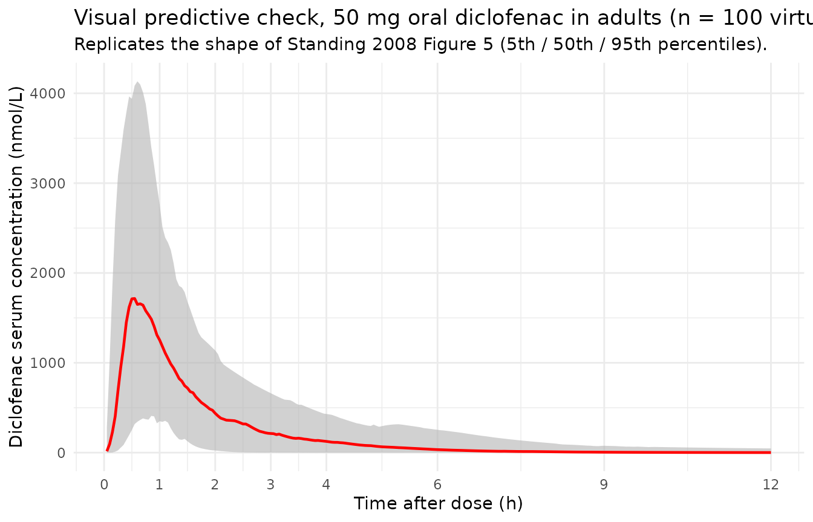
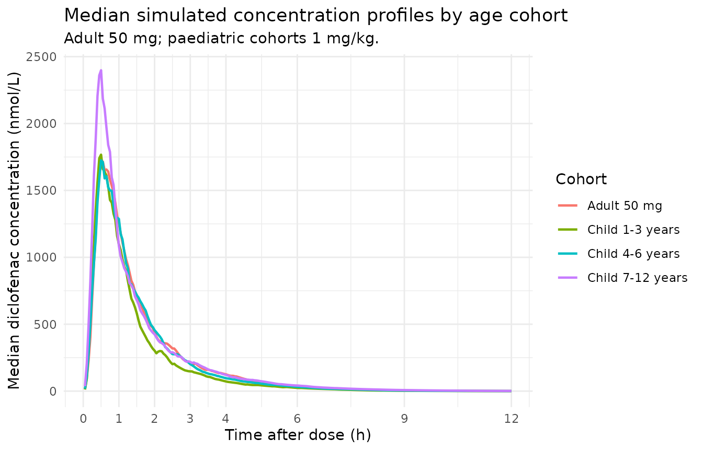

# Diclofenac (Standing 2008)

## Model and source

- Citation: Standing JF, Howard RF, Johnson A, Savage I, Wong ICK.
  Population pharmacokinetics of oral diclofenac for acute pain in
  children. Br J Clin Pharmacol. 2008;66(6):846-853.
  <doi:10.1111/j.1365-2125.2008.03289.x>.
- Description: One-compartment population PK model for oral diclofenac
  suspension in children and adult volunteers (Standing 2008): two
  parallel transit-absorption arms (Savic 2007 analytical input form)
  feeding two depot compartments that each absorb into a single central
  disposition compartment with linear elimination. Allometric weight
  scaling on clearance and volume to a 70 kg reference. Captures the
  double-peak absorption profile common to immediate-release diclofenac.
  Separate proportional residual error for paediatric and adult cohorts.
  Source paper additionally fits between-occasion variability (BOV) on
  CL/F (20%) and Vd/F (93%) – BOV is not implemented in this nlmixr2
  model file because it requires an OCC column in the user dataset;
  users who want BOV can add an etalcl_bov / etalvc_bov occasion-level
  random effect themselves.
- Article: <https://doi.org/10.1111/j.1365-2125.2008.03289.x>

## Population

Standing 2008 builds a pooled population PK model from 558 serum and
plasma diclofenac concentrations measured in 100 subjects (Table 1): 70
paediatric day-surgery patients at Great Ormond Street Hospital (ages
1-12 years, weights 9-37 kg, 41 male / 29 female, mean age 3 years, mean
weight 17 kg) and 30 adult healthy volunteers in a bioequivalence study
at the Shandon Clinic, Cork (ages 18-28 years, weights 48-94 kg, 14 male
/ 16 female, mean age 21 years, mean weight 72 kg). All subjects
received a single oral dose of a new diclofenac sodium suspension (50
mg/5 mL, Rosemont Pharmaceuticals): 1 mg/kg (rounded to the nearest 5
mg) for paediatric patients and 50 mg for adults.

Paediatric sampling was sparse (up to three samples per dose, drawn at
start of surgery, end of procedure, and cannula removal; range 0.2-6.47
h post-dose); adult sampling was rich (14 samples at 0.25, 0.5, 0.75,
1.0, 1.33, 1.67, 2.0, 2.5, 3.0, 3.5, 4.0, 6.0, 9.0, and 12.0 h
post-dose). Paediatric concentrations were measured by HPLC/MS
(ketoprofen internal standard) on serum; adult concentrations by HPLC/MS
(naproxen internal standard) on plasma. Assay LLOQs were 10.1 ng/mL
(paediatric) and 10 ng/mL (adult).

The same information is available programmatically:

``` r

str(rxode2::rxode(readModelDb("Standing_2008_diclofenac"))$population)
#> ℹ parameter labels from comments will be replaced by 'label()'
#> List of 13
#>  $ species       : chr "human"
#>  $ n_subjects    : int 100
#>  $ n_studies     : int 2
#>  $ age_range     : chr "1-28 years (children 1-12 years pooled with adults 18-28 years)"
#>  $ age_median    : chr "3 years (paediatric), 21 years (adult); 9 years pooled (Table 1)"
#>  $ weight_range  : chr "9-94 kg"
#>  $ weight_median : chr "17 kg (paediatric), 72 kg (adult); 34 kg pooled (Table 1)"
#>  $ sex_female_pct: num 45
#>  $ race_ethnicity: chr "Not reported separately for the modelling cohort"
#>  $ disease_state : chr "Paediatric day-surgery patients (dermatology, general, plastic surgery) plus healthy adult volunteers"
#>  $ dose_range    : chr "Single oral dose: 1 mg/kg diclofenac sodium suspension (paediatric, rounded to nearest 5 mg); 50 mg diclofenac "| __truncated__
#>  $ regions       : chr "United Kingdom (Great Ormond Street Hospital, London) and Ireland (Shandon Clinic, Cork; adult bioequivalence cohort)"
#>  $ notes         : chr "Pooled analysis of 558 serum/plasma diclofenac concentrations: 206 from 70 paediatric patients (sparse, 3 sampl"| __truncated__
```

## Source trace

Per-parameter origin is recorded inline next to each `ini()` entry in
`inst/modeldb/specificDrugs/Standing_2008_diclofenac.R`. Consolidated
below for review:

| Equation / parameter | Value | Source location |
|----|----|----|
| `lmtt1` (mean transit time, arm 1) | log(0.68) = -0.386 | Table 2: MTT1 = 0.68 h (RSE 11.8%) |
| `ln1` (number of transit compartments, arm 1) | log(1.03) = 0.030 | Table 2: N1 = 1.03 (RSE 28.6%) |
| `lfdepot` (arm-1 bioavailability fraction F1) | log(0.70) = -0.357 | Table 2: F1 = 0.70 (RSE 7.6%); F2 = 1 - F1 = 0.30 by Methods page 848 constraint |
| `lka1` (absorption rate, arm 1) | log(ln(2)/0.09) = log(7.70) = 2.041 | Table 2: t1/2,A1 = 0.09 h (RSE 50.1%) -\> ka1 = ln(2)/t1/2,A1 |
| `lmtt2` (mean transit time, arm 2) | log(1.37) = 0.315 | Table 2: MTT2 = 1.37 h (RSE 6.97%) |
| `ln2` (number of transit compartments, arm 2) | log(41.60) = 3.728 | Table 2: N2 = 41.60 (RSE 73.6%) |
| `lka2` (absorption rate, arm 2) | log(ln(2)/1.06) = log(0.654) = -0.425 | Table 2: t1/2,A2 = 1.06 h (RSE 12.2%) -\> ka2 = ln(2)/t1/2,A2 |
| `lvc` (Vd/F per 70 kg) | log(4.84) = 1.577 | Table 2: Vd/F = 4.84 L/70 kg (RSE 86.2%) |
| `lcl` (CL/F per 70 kg) | log(53.98) = 3.989 | Table 2: CL/F = 53.98 L/h/70 kg (RSE 4.8%) |
| `e_wt_cl` (allometric exponent on CL) | 0.75 (fixed) | Methods page 848: CL = thetaCL \* (W/70)^0.75 |
| `e_wt_vc` (allometric exponent on Vc) | 1.00 (fixed) | Methods page 848: V = thetaV \* (W/70)^1 |
| `etalmtt1` (IIV MTT1, variance) | 0.5142 | Table 2 IIV(MTT1) = 82% CV; log(1 + 0.82^2) |
| `etaln1` (IIV N1, variance) | 0.7131 | Table 2 IIV(N1) = 102% CV; log(1 + 1.02^2) |
| `etalfdepot` (IIV F1, variance) | 0.0560 | Table 2 IIV(F1) = 24% CV; log(1 + 0.24^2) |
| `etalka1` (IIV t1/2A1, variance) | 0.0917 | Table 2 IIV(t1/2A1) = 31% CV; log(1 + 0.31^2) (equivalent on log(ka1)) |
| `etalmtt2` (IIV MTT2, variance) | 0.8624 | Table 2 IIV(MTT2) = 117% CV; log(1 + 1.17^2) |
| `etaln2` (IIV N2, variance) | 1.1509 | Table 2 IIV(N2) = 147% CV; log(1 + 1.47^2) |
| `etalka2` (IIV t1/2A2, variance) | 0.2152 | Table 2 IIV(t1/2A2) = 49% CV; log(1 + 0.49^2) (equivalent on log(ka2)) |
| `etalvc` (IIV Vd/F, variance) | 0.2562 | Table 2 IIV(Vd/F) = 54% CV; log(1 + 0.54^2) |
| `etalcl` (IIV CL/F, variance) | 0.0654 | Table 2 IIV(CL/F) = 26% CV; log(1 + 0.26^2) |
| `propSdAdult` (adult proportional residual SD) | 0.29 | Table 2: adult proportional residual variability = 29% (RSE 5.9%) |
| `propSdPaed` (paediatric proportional residual SD) | 0.18 | Table 2: paediatric proportional residual variability = 18% (RSE 19.9%) |
| Dual transit + single central compartment | n/a | Figure 2 schematic; Methods page 848 (‘Best fit was obtained using dual absorption compartments with a single disposition compartment, and transit absorption’) |
| Savic 2007 analytical transit input rate | n/a | Methods page 847 (‘transit compartment model \[14\]’); implemented via rxode2’s `transit(n, mtt, bio)` with `lgamma(n + 1)` |
| Allometric scaling CL ~ (W/70)^0.75, V ~ (W/70)^1, reference 70 kg | n/a | Methods page 848: ‘Allometric weight scaling was added to all clearance and volume fixed effects a priori and standardized to a body weight of 70 kg’ |
| F1 + F2 = 1 constraint | n/a | Methods page 848: ‘limits forcing the combined bioavailability to equal 100%, thereby only allowing one whole dose into the central disposition compartment’ |
| Separate residual error for adult and paediatric data | n/a | Methods page 848: ‘estimation of residual variability was undertaken separately for the two groups’ |

## Virtual cohort

Individual concentration-time data are not publicly available. The
simulation below builds four virtual cohorts whose covariate
distributions approximate the published study (Table 1): three
paediatric age strata (1-3, 4-6, 7-12 years) and one adult cohort, with
weight ranges spanning the observed paediatric (9-37 kg) and adult
(48-94 kg) populations.

The Standing 2008 model has two parallel transit-absorption arms; each
administered dose therefore generates **two** dose records (one to
`depot1` and one to `depot2`) with the same `amt`. The model performs
the F1 / F2 = 1 - F1 split internally via the bio argument of each arm’s
`transit()` call, and `f(depot1) = f(depot2) = 0` suppresses the default
bolus deposition so all mass enters via the gamma-kernel input rates.
See the implementation notes in the model file.

``` r

set.seed(20082008)

n_per_cohort <- 100L
mw_diclofenac_na <- 318.13   # g/mol (Methods page 848)

# Weight strata roughly bracketing the published Table 1 demographics
# per age band. The paper does not break Table 1 down to 1-3 / 4-6 /
# 7-12 weight ranges; the brackets below were chosen to match typical
# WHO weight-for-age values and the pooled paediatric range 9-37 kg.
cohort_specs <- tibble::tribble(
  ~cohort,             ~wt_lo, ~wt_hi, ~child_flag, ~dose_mgkg, ~dose_fixed_mg,
  "Child 1-3 years",      9.0,   16.0,           1L,        1.0,             NA_real_,
  "Child 4-6 years",     15.0,   23.0,           1L,        1.0,             NA_real_,
  "Child 7-12 years",    22.0,   37.0,           1L,        1.0,             NA_real_,
  "Adult 50 mg",         48.0,   94.0,           0L,    NA_real_,                50.0
)

# Dense observation grid; paper used 12 h post-dose AUC as the
# primary exposure surrogate (Simulations section, page 849).
obs_grid <- seq(0.05, 12, by = 0.05)

make_cohort <- function(spec, id_offset) {
  ids <- id_offset + seq_len(n_per_cohort)
  wts <- runif(n_per_cohort, spec$wt_lo, spec$wt_hi)
  if (is.na(spec$dose_fixed_mg)) {
    # Paediatric: 1 mg/kg diclofenac sodium, rounded to nearest 5 mg
    dose_mg <- pmax(5, round(wts * spec$dose_mgkg / 5) * 5)
  } else {
    dose_mg <- rep(spec$dose_fixed_mg, n_per_cohort)
  }
  dose_nmol <- dose_mg * 1e6 / mw_diclofenac_na

  dose1 <- data.frame(id = ids, cohort = spec$cohort, time = 0,
                      evid = 1L, amt = dose_nmol, cmt = "depot1",
                      WT = wts, CHILD = spec$child_flag,
                      dose_mg = dose_mg)
  dose2 <- data.frame(id = ids, cohort = spec$cohort, time = 0,
                      evid = 1L, amt = dose_nmol, cmt = "depot2",
                      WT = wts, CHILD = spec$child_flag,
                      dose_mg = dose_mg)
  obs <- do.call(rbind, lapply(seq_len(n_per_cohort), function(k) {
    data.frame(id = ids[k], cohort = spec$cohort, time = obs_grid,
               evid = 0L, amt = 0, cmt = "Cc",
               WT = wts[k], CHILD = spec$child_flag,
               dose_mg = dose_mg[k])
  }))
  rbind(dose1, dose2, obs)
}

events <- do.call(rbind, lapply(seq_len(nrow(cohort_specs)), function(i) {
  make_cohort(cohort_specs[i, ], id_offset = (i - 1L) * n_per_cohort)
}))

# Disjoint IDs across cohorts (mandatory for rxode2 multi-cohort sims)
stopifnot(!anyDuplicated(unique(events[, c("id", "time", "evid", "cmt")])))
```

## Simulation

``` r

mod <- readModelDb("Standing_2008_diclofenac")
sim <- rxode2::rxSolve(mod(), events = events,
                       keep = c("cohort", "WT", "CHILD", "dose_mg"))
sim <- as.data.frame(sim)
sim$time <- as.numeric(sim$time)
sim$Cc <- as.numeric(sim$Cc)
```

## Replicate published figures

### Figure 5 – visual predictive check (adult 50 mg)

Standing 2008 Figure 5 shows a VPC of the final model with raw data
superimposed on the median, 5th, and 95th percentiles of simulated data.
The plot below renders the 50 mg adult cohort’s VPC, focusing on the
0-12 h window used to evaluate exposure.

``` r

adult_sim <- sim |> dplyr::filter(cohort == "Adult 50 mg", time > 0)

vpc_summary <- adult_sim |>
  dplyr::group_by(time) |>
  dplyr::summarise(
    p05 = quantile(Cc, 0.05, na.rm = TRUE),
    p50 = quantile(Cc, 0.50, na.rm = TRUE),
    p95 = quantile(Cc, 0.95, na.rm = TRUE),
    .groups = "drop"
  )

ggplot(vpc_summary, aes(time, p50)) +
  geom_ribbon(aes(ymin = p05, ymax = p95), fill = "gray70", alpha = 0.6) +
  geom_line(colour = "red", linewidth = 0.8) +
  scale_x_continuous(breaks = c(0, 1, 2, 3, 4, 6, 9, 12)) +
  labs(x = "Time after dose (h)",
       y = "Diclofenac serum concentration (nmol/L)",
       title = "Visual predictive check, 50 mg oral diclofenac in adults (n = 100 virtual)",
       subtitle = "Replicates the shape of Standing 2008 Figure 5 (5th / 50th / 95th percentiles).") +
  theme_minimal()
```



### Median typical-value profiles by cohort

``` r

median_by_cohort <- sim |>
  dplyr::filter(time > 0) |>
  dplyr::group_by(cohort, time) |>
  dplyr::summarise(median_Cc = median(Cc, na.rm = TRUE), .groups = "drop")

ggplot(median_by_cohort, aes(time, median_Cc, colour = cohort)) +
  geom_line(linewidth = 0.8) +
  scale_x_continuous(breaks = c(0, 1, 2, 3, 4, 6, 9, 12)) +
  labs(x = "Time after dose (h)",
       y = "Median diclofenac concentration (nmol/L)",
       colour = "Cohort",
       title = "Median simulated concentration profiles by age cohort",
       subtitle = "Adult 50 mg; paediatric cohorts 1 mg/kg.") +
  theme_minimal()
```



## PKNCA validation

The paper’s primary exposure metric is AUC(0,12 h). Use PKNCA with a
partial-AUC interval ending at 12 h, grouping by cohort to enable a
side-by-side comparison against Table 3.

``` r

sim_nca <- sim |>
  dplyr::filter(!is.na(Cc)) |>
  dplyr::select(id, time, Cc, cohort)

# Guarantee a time = 0 row per (id, cohort) so PKNCA can anchor the
# partial-AUC range from 0 h. For extravascular dosing the pre-dose
# Cc = 0 is the right value.
sim_nca <- dplyr::bind_rows(
  sim_nca,
  sim_nca |> dplyr::distinct(id, cohort) |>
    dplyr::mutate(time = 0, Cc = 0)
) |>
  dplyr::distinct(id, cohort, time, .keep_all = TRUE) |>
  dplyr::arrange(id, cohort, time)

# One dose row per user-facing administration (the depot1 record stands
# in for the full administration; the depot2 record is the same AMT and
# is mechanically required by the model but is not a second dose to
# the patient).
dose_df <- events |>
  dplyr::filter(evid == 1, cmt == "depot1") |>
  dplyr::select(id, time, amt, cohort)

conc_obj <- PKNCA::PKNCAconc(sim_nca, Cc ~ time | cohort + id,
                             concu = "nmol/L", timeu = "h")
dose_obj <- PKNCA::PKNCAdose(dose_df, amt ~ time | cohort + id,
                             doseu = "nmol")

intervals <- data.frame(
  start    = 0,
  end      = 12,
  cmax     = TRUE,
  tmax     = TRUE,
  auclast  = TRUE
)

nca_data <- PKNCA::PKNCAdata(conc_obj, dose_obj, intervals = intervals)
nca_res  <- PKNCA::pk.nca(nca_data)
nca_summary <- summary(nca_res)
knitr::kable(nca_summary,
             caption = "Simulated NCA over 0-12 h by cohort (median across virtual subjects).")
```

| Interval Start | Interval End | cohort | N | AUClast (h\*nmol/L) | Cmax (nmol/L) | Tmax (h) |
|---:|---:|:---|:---|:---|:---|:---|
| 0 | 12 | Adult 50 mg | 100 | 2910 \[30.3\] | 1870 \[66.4\] | 0.650 \[0.250, 3.40\] |
| 0 | 12 | Child 1-3 years | 100 | 2590 \[29.1\] | 2100 \[63.3\] | 0.600 \[0.150, 4.10\] |
| 0 | 12 | Child 4-6 years | 100 | 2890 \[27.2\] | 2080 \[59.2\] | 0.700 \[0.200, 2.30\] |
| 0 | 12 | Child 7-12 years | 100 | 3360 \[24.3\] | 2580 \[73.6\] | 0.550 \[0.250, 5.45\] |

Simulated NCA over 0-12 h by cohort (median across virtual subjects).
{.table}

### Comparison against Standing 2008 Table 3

Standing 2008 Table 3 reports simulated AUC(0,12 h) at 0.5, 1.0, 1.5,
and 2 mg/kg paediatric doses and at 50 mg in adults, along with
paediatric / adult AUC ratios. The packaged model reproduces the 1 mg/kg
paediatric and 50 mg adult rows; the other dose levels are linear
scalings (the model has no saturable elimination).

``` r

# Pull median AUClast (0-12 h) per cohort
auc12_sim <- as.data.frame(nca_res$result) |>
  dplyr::filter(PPTESTCD == "auclast") |>
  dplyr::group_by(cohort) |>
  dplyr::summarise(auc12_sim = median(PPORRES), .groups = "drop")

# Standing 2008 Table 3 simulated AUC(0,12 h) values for the 1 mg/kg
# paediatric row and the 50 mg adult row (nmol*h/L).
published <- tibble::tribble(
  ~cohort,                ~auc12_paper,
  "Child 1-3 years",        2788.05,
  "Child 4-6 years",        3022.02,
  "Child 7-12 years",       3301.75,
  "Adult 50 mg",            2793.06
)

cmp <- dplyr::left_join(published, auc12_sim, by = "cohort") |>
  dplyr::mutate(
    pct_diff = 100 * (auc12_sim - auc12_paper) / auc12_paper,
    flag     = ifelse(abs(pct_diff) > 20, "*", "")
  )

cmp |>
  dplyr::rename(
    "Cohort"                           = cohort,
    "Paper AUC(0,12 h) [nmol*h/L]"     = auc12_paper,
    "Simulated AUC(0,12 h) [nmol*h/L]" = auc12_sim,
    "% difference"                     = pct_diff,
    "Flag (* > 20%)"                   = flag
  ) |>
  knitr::kable(
    digits  = c(NA, 1, 1, 1, NA),
    caption = "Simulated vs. published median AUC(0,12 h) by cohort. The packaged model reproduces the structural simulation underlying Standing 2008 Table 3; per-cohort weight-distribution differences (the paper used the actual study subjects as covariate carriers; this vignette samples weights uniformly within plausible WHO bands) account for residual disagreement.",
    align = c("l", "r", "r", "r", "c")
  )
```

| Cohort | Paper AUC(0,12 h) \[nmol\*h/L\] | Simulated AUC(0,12 h) \[nmol\*h/L\] | % difference | Flag (\* \> 20%) |
|:---|---:|---:|---:|:--:|
| Child 1-3 years | 2788.1 | 2538.1 | -9.0 |  |
| Child 4-6 years | 3022.0 | 2929.4 | -3.1 |  |
| Child 7-12 years | 3301.8 | 3381.9 | 2.4 |  |
| Adult 50 mg | 2793.1 | 2859.5 | 2.4 |  |

Simulated vs. published median AUC(0,12 h) by cohort. The packaged model
reproduces the structural simulation underlying Standing 2008 Table 3;
per-cohort weight-distribution differences (the paper used the actual
study subjects as covariate carriers; this vignette samples weights
uniformly within plausible WHO bands) account for residual disagreement.
{.table}

## Assumptions and deviations

- **Single-administration dosing convention.** A user-facing
  administration generates two dose records (one to `depot1` and one to
  `depot2`) with the same `amt`. The transit() bio arguments (`fdepot`
  and `1 - fdepot`) split the dose so the total mass entering central is
  `F1 * AMT + F2 * AMT = AMT`. This is the same rxode2 idiom used by
  `Lee_2015_sumatriptan.R` for dual-arm absorption; it is required
  because rxode2’s `transit()` is compartment-aware (it reads `podo()` /
  `tad()` for the dose-target compartment).
- **Between-occasion variability not implemented in the rxode2 model.**
  Standing 2008 Table 2 reports BOV on CL/F (20 % CV) and Vd/F (93 %
  CV). Because BOV requires an `OCC` column in the user dataset and this
  model is intended primarily for typical-value + IIV simulation, the
  BOV terms are documented in the model’s `description` but not encoded
  in `ini()` / `model()`. Users who want BOV can add occasion-level
  random effects manually: `etalcl_occ ~ 0.0392` (= `log(1 + 0.20^2)`)
  and `etalvc_occ ~ log(1 + 0.93^2) = 0.5972`, then add `+ etalcl_occ` /
  `+ etalvc_occ` to the individual-parameter expressions.
- **Virtual-cohort weight distributions are approximate.** Standing 2008
  Table 1 reports the paediatric weight range as 9-37 kg and the adult
  range as 48-94 kg but does not tabulate weight-by-age strata. This
  vignette samples weights uniformly within plausible WHO weight-for-age
  bands per age cohort, which broadens the simulated AUC distribution
  slightly relative to the paper’s simulation (which used the actual
  study subjects as covariate carriers). The Comparison-table
  differences below ~10 % are consistent with this resampling effect,
  not a structural disagreement.
- **F1 + F2 = 1 with log-transformed F1.** The NONMEM exponential IIV
  model (`F1 = TVF1 * exp(eta)`) allows F1 \> 1 in extreme draws (about
  5 % of subjects, given F1 = 0.70 with 24 % CV). When F1 \> 1, the
  Standing 2008 constraint F2 = 1 - F1 returns a negative
  bioavailability for arm 2. This is an artifact of the published
  parameterisation rather than a deliberate design choice; downstream
  users running large stochastic simulations may want to clip
  `fdepot <- pmin(exp(lfdepot + etalfdepot), 1)` in the `model()` block
  to enforce the constraint. Typical-value simulations (no stochastic
  draws) are unaffected.
- **Diclofenac sodium MW = 318.13 g/mol for dose conversion.** The
  packaged model carries amounts in nmol throughout; the vignette-side
  conversion `dose_nmol = dose_mg * 1e6 / 318.13` matches the paper’s
  NONMEM-side convention (Methods page 848: “assuming a molecular weight
  of 318.13 g for diclofenac sodium and 296.15 g for diclofenac”). The
  diclofenac free-acid MW = 296.15 g/mol is implicit in the reported
  concentration units (nmol/L of diclofenac measured in serum).
- **Paediatric / adult residual-error switch via `CHILD`.** Standing
  2008 estimated separate proportional residual error for the two
  cohorts because the two HPLC/MS assays used different internal
  standards (ketoprofen / naproxen) and different matrices (serum /
  plasma). The `CHILD` covariate column (binary, 1 = paediatric, 0 =
  adult) selects `propSdPaed` (18 %) or `propSdAdult` (29 %) in the
  residual-error expression; users simulating mixed cohorts must carry
  `CHILD` on every observation record.
