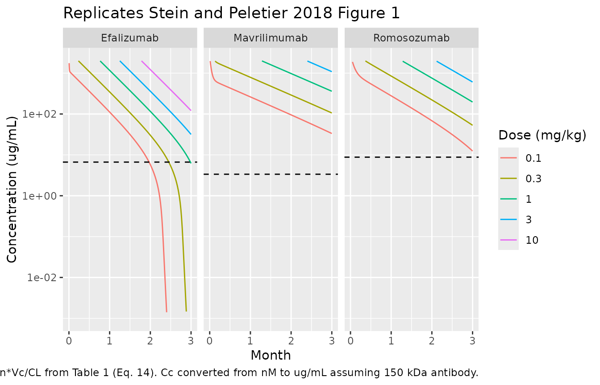

# Onset of nonlinear PK for mavrilimumab, efalizumab, romosozumab (Stein 2018)

## Model and source

- Citation: Stein AM, Peletier LA. Predicting the onset of nonlinear
  pharmacokinetics. *CPT Pharmacometrics Syst Pharmacol.* 2018
  Oct;7(10):670-677.
- Article: <https://doi.org/10.1002/psp4.12316>
- Underlying data sources:
  - Mavrilimumab (anti-GM-CSF receptor): Burmester GR, *et al.* *Ann
    Rheum Dis.* 2011;70(9):1542-1549.
  - Efalizumab (anti-CD11a): Bauer RJ, *et al.* *J Pharmacokinet
    Biopharm.* 1999;27(4):397-420.
  - Romosozumab (anti-sclerostin): Padhi D, *et al.* *J Bone Miner Res.*
    2011;26(1):19-26.

Stein and Peletier (2018) derive an analytical expression for the
critical concentration `Ccrit` at which the elimination rate of a
monoclonal antibody with combined linear plus saturable
(target-mediated) clearance doubles, marking the transition between
approximately-linear and nonlinear PK. They fit two-compartment
quasi-steady-state (QSS) TMDD models to the published PK data of three
antibodies (mavrilimumab, efalizumab, romosozumab) and use those
typical-value fits to illustrate how
`Ccrit = Vmax / CL = ksyn / (CL/Vc)` lines up with the visible kink in
the concentration-time curves.

This vignette covers all three drugs because they share a paper, a
structural model, and a single narrative. The packaged models live in
three companion files under `inst/modeldb/specificDrugs/`:

``` r

data.frame(
  Drug   = c("Mavrilimumab", "Efalizumab", "Romosozumab"),
  Target = c("GM-CSF receptor alpha", "CD11a (LFA-1)", "Sclerostin"),
  Model  = c("Stein_2018_mavrilimumab",
             "Stein_2018_efalizumab",
             "Stein_2018_romosozumab")
) |> knitr::kable()
```

| Drug         | Target                | Model                   |
|:-------------|:----------------------|:------------------------|
| Mavrilimumab | GM-CSF receptor alpha | Stein_2018_mavrilimumab |
| Efalizumab   | CD11a (LFA-1)         | Stein_2018_efalizumab   |
| Romosozumab  | Sclerostin            | Stein_2018_romosozumab  |

## Population

The packaged parameters in Stein and Peletier 2018 Table 1 are
typical-value fits to phase 1 / early-phase PK data from three
previously published trials:

- **Mavrilimumab** (Burmester 2011) – adults with rheumatoid arthritis;
  single IV doses ranging from 0.01 to 10 mg/kg.
- **Efalizumab** (Bauer 1999) – adults with psoriasis; single IV doses
  ranging from 0.03 to 10 mg/kg.
- **Romosozumab** (Padhi 2011) – healthy adults; single IV doses
  including 1, 5, and 10 mg/kg.

Stein and Peletier 2018 (Methods, Model analysis, fitting, and
simulation) note that they fixed `ke(R) = ke(CR)` in all three fits, an
assumption commonly made for membrane-bound targets where `ke(R)` is
poorly identified from PK alone. The article (Model fit section, page
672) additionally cautions that the large values for `ke(R)` and
`ke(CR)` reported for efalizumab (4400/day) and romosozumab (860/day)
reflect the **practical unidentifiability** of these parameters in that
experimental setting – they are not meant as physiological estimates.

The article does not report between-subject variability or residual
error for the fits; the packaged models are therefore typical-value only
and have no IIV or residual error structure. Programmatically, the
per-model population is available via
`readModelDb("<model>")$population`.

## Source trace

Every parameter is taken directly from Stein and Peletier 2018 Table 1.
The structural model is paper Eq. 7 with the QSS algebraic relations
from paper Eq. 5.

| Drug         | Parameter | Value (Table 1) | Units  |
|--------------|-----------|-----------------|--------|
| Mavrilimumab | Vc        | 2.8             | L      |
| Mavrilimumab | Vp        | 5.6             | L      |
| Mavrilimumab | CL        | 0.3             | L/day  |
| Mavrilimumab | Q         | 1.7             | L/day  |
| Mavrilimumab | ksyn      | 2.4             | nM/day |
| Mavrilimumab | Kss       | 1.1             | nM     |
| Mavrilimumab | ke(R)     | 2.2             | 1/day  |
| Mavrilimumab | ke(CR)    | 2.2             | 1/day  |
| Efalizumab   | Vc        | 2.4             | L      |
| Efalizumab   | Vp        | 3.6             | L      |
| Efalizumab   | CL        | 0.46            | L/day  |
| Efalizumab   | Q         | 9.7             | L/day  |
| Efalizumab   | ksyn      | 8.5             | nM/day |
| Efalizumab   | Kss       | 1.2             | nM     |
| Efalizumab   | ke(R)     | 4400            | 1/day  |
| Efalizumab   | ke(CR)    | 4400            | 1/day  |
| Romosozumab  | Vc        | 2.4             | L      |
| Romosozumab  | Vp        | 2.6             | L      |
| Romosozumab  | CL        | 0.25            | L/day  |
| Romosozumab  | Q         | 0.54            | L/day  |
| Romosozumab  | ksyn      | 6.1             | nM/day |
| Romosozumab  | Kss       | 12              | nM     |
| Romosozumab  | ke(R)     | 860             | 1/day  |
| Romosozumab  | ke(CR)    | 860             | 1/day  |

| Equation                     | Source                         |
|------------------------------|--------------------------------|
| Two-compartment QSS TMDD ODE | Stein and Peletier 2018 Eq. 7  |
| QSS algebraic relations      | Stein and Peletier 2018 Eq. 5  |
| Critical concentration Ccrit | Stein and Peletier 2018 Eq. 14 |

## Critical concentration

The closed-form expression for `Ccrit` in the two-compartment QSS TMDD
model (Stein and Peletier 2018 Eq. 14, derived under the rapid-exchange
limit `Q >> CL` and `Q >> Vmax`) is

    Ccrit = Vmax / CL = ksyn * Vc / CL

Substituting the Table 1 values directly gives a per-drug `Ccrit`:

``` r

mav <- rxode2::rxode2(readModelDb("Stein_2018_mavrilimumab"))
efa <- rxode2::rxode2(readModelDb("Stein_2018_efalizumab"))
rom <- rxode2::rxode2(readModelDb("Stein_2018_romosozumab"))

ccrit_nM <- function(mod) {
  ini  <- as.data.frame(mod$iniDf)
  vc   <- exp(ini$est[ini$name == "lvc"])
  cl   <- exp(ini$est[ini$name == "lcl"])
  ksyn <- exp(ini$est[ini$name == "lksyn"])
  ksyn * vc / cl
}

ccrit_tbl <- tibble::tibble(
  Drug      = c("Mavrilimumab", "Efalizumab", "Romosozumab"),
  Ccrit_nM  = c(ccrit_nM(mav), ccrit_nM(efa), ccrit_nM(rom)),
  Ccrit_ug_per_mL = Ccrit_nM * 150e3 / 1e9 * 1e3  # nM -> ug/mL using 150 kDa MW
)
knitr::kable(ccrit_tbl, digits = 2,
             caption = "Critical concentration computed from Stein and Peletier 2018 Eq. 14 using Table 1 parameters. The 150 kDa molecular weight follows Stein and Peletier 2018 page 672.")
```

| Drug         | Ccrit_nM | Ccrit_ug_per_mL |
|:-------------|---------:|----------------:|
| Mavrilimumab |    22.40 |            3.36 |
| Efalizumab   |    44.35 |            6.65 |
| Romosozumab  |    58.56 |            8.78 |

Critical concentration computed from Stein and Peletier 2018 Eq. 14
using Table 1 parameters. The 150 kDa molecular weight follows Stein and
Peletier 2018 page 672. {.table}

## Simulation: replicate Figure 1

Figure 1 of Stein and Peletier 2018 shows model predictions for each
drug across a range of single IV bolus doses (mg/kg). The dot-marked
`Ccrit` line is overlaid to highlight the transition between linear and
nonlinear elimination.

We simulate each drug at a common set of single IV doses (0.1, 0.3, 1,
3, 10 mg/kg) using the packaged `Stein_2018_<drug>` models. The molar
dose conversion follows Stein and Peletier 2018 page 672:

    dose_nmol = dose_mg_per_kg * 70 kg / 150 kDa * 1e9 nmol/mol

``` r

mg_kg_to_nmol <- function(mg_per_kg) mg_per_kg * 70 / 150e3 * 1e9
nM_to_ug_per_mL <- function(conc_nM) conc_nM * 150e3 / 1e9 * 1e3

dose_levels_mg_kg <- c(0.1, 0.3, 1, 3, 10)

# Observation grid: dense early to capture the bolus peak, then daily out to 3
# months (Figure 1 x-axis: 0-3 months).
obs_times <- sort(unique(c(
  seq(0, 1, by = 0.05),
  seq(1, 7, by = 0.25),
  seq(7, 90, by = 0.5)
)))

build_events <- function(drug_label, model_name, doses_mg_kg) {
  out <- vector("list", length(doses_mg_kg))
  for (i in seq_along(doses_mg_kg)) {
    d_mg_kg <- doses_mg_kg[i]
    d_nmol  <- mg_kg_to_nmol(d_mg_kg)
    ev <- rxode2::et(amt = d_nmol, cmt = "central", id = i) |>
      rxode2::et(time = obs_times, id = i)
    out[[i]] <- as.data.frame(ev) |>
      dplyr::mutate(drug = drug_label,
                    model = model_name,
                    dose_mg_per_kg = d_mg_kg,
                    dose_nmol = d_nmol)
  }
  dplyr::bind_rows(out)
}

events_mav <- build_events("Mavrilimumab", "Stein_2018_mavrilimumab", dose_levels_mg_kg)
events_efa <- build_events("Efalizumab",   "Stein_2018_efalizumab",   dose_levels_mg_kg)
events_rom <- build_events("Romosozumab",  "Stein_2018_romosozumab",  dose_levels_mg_kg)

sim_one <- function(model_name, events) {
  mod <- rxode2::rxode2(readModelDb(model_name))
  sim <- rxode2::rxSolve(mod, events = events,
                         keep = c("drug", "dose_mg_per_kg", "dose_nmol")) |>
    as.data.frame()
  if (!"id" %in% names(sim)) sim$id <- 1L
  sim
}

sim_mav <- sim_one("Stein_2018_mavrilimumab", events_mav)
sim_efa <- sim_one("Stein_2018_efalizumab",   events_efa)
sim_rom <- sim_one("Stein_2018_romosozumab",  events_rom)

sim_all <- dplyr::bind_rows(sim_mav, sim_efa, sim_rom) |>
  dplyr::mutate(conc_ug_per_mL = nM_to_ug_per_mL(Cc),
                drug = factor(drug,
                              levels = c("Efalizumab", "Mavrilimumab", "Romosozumab")))
```

``` r

# Replicates Stein and Peletier 2018 Figure 1: concentration-time curves for the
# three mAbs at multiple single-IV doses, with the per-drug Ccrit line overlaid.
ccrit_overlay <- ccrit_tbl |>
  dplyr::rename(drug = Drug) |>
  dplyr::mutate(drug = factor(drug,
                              levels = c("Efalizumab", "Mavrilimumab", "Romosozumab")))

sim_all |>
  dplyr::filter(time > 0, Cc > 0) |>
  ggplot2::ggplot(ggplot2::aes(time / 30, conc_ug_per_mL,
                               colour = factor(dose_mg_per_kg),
                               group = interaction(drug, dose_mg_per_kg))) +
  ggplot2::geom_line() +
  ggplot2::geom_hline(data = ccrit_overlay,
                      ggplot2::aes(yintercept = Ccrit_ug_per_mL),
                      linetype = "dashed") +
  ggplot2::scale_y_log10(limits = c(1e-3, 2e3)) +
  ggplot2::facet_wrap(~ drug) +
  ggplot2::labs(
    x = "Month",
    y = "Concentration (ug/mL)",
    colour = "Dose (mg/kg)",
    title = "Replicates Stein and Peletier 2018 Figure 1",
    caption = paste(
      "Dashed line: Ccrit = Vmax/CL = ksyn*Vc/CL from Table 1 (Eq. 14).",
      "Cc converted from nM to ug/mL assuming 150 kDa antibody."
    )
  )
#> Warning: Removed 1468 rows containing missing values or values outside the scale range
#> (`geom_line()`).
```



The simulated curves reproduce the visual feature highlighted in Stein
and Peletier 2018 Figure 1: as the concentration falls below `Ccrit`,
the slope on a log scale becomes substantially steeper, signaling the
transition from approximately-linear nonspecific clearance to nonlinear
target-mediated elimination. For romosozumab and efalizumab the `ke(R)`
and `ke(CR)` parameters are practically unidentifiable (Stein and
Peletier 2018 page 672); the simulated curves below `Ccrit` therefore
inherit the very-fast complex internalization implied by Table 1
(`ke(CR)` = 4400/day and 860/day, respectively) and drop steeply,
exactly as in the published figure.

## PKNCA validation

Because Stein and Peletier 2018 do not report numerical NCA parameters
in the article text, the PKNCA pass below is a sanity check rather than
a published-vs-simulated comparison. The expectations are:

- At the highest single-IV dose (10 mg/kg = 467 nmol), the initial
  concentration `C0 = D / Vc` (no absorption, no IIV). For mavrilimumab
  this is `467 / 2.8 = 166.79 nM`, matching the simulated `Cc` at
  `t = 0`.
- Above `Ccrit` the elimination is approximately linear with rate
  `CL/Vc`; the AUC contribution from the linear phase is approximately
  `D / CL` per Stein and Peletier 2018 Eq. 14 derivation.

``` r

sim_nca <- sim_all |>
  dplyr::filter(!is.na(Cc), Cc > 0) |>
  dplyr::transmute(id = paste(drug, dose_mg_per_kg, sep = "_"),
                   time = time, conc = Cc,
                   drug = drug,
                   dose_mg_per_kg = dose_mg_per_kg)
dose_df <- dplyr::bind_rows(events_mav, events_efa, events_rom) |>
  dplyr::filter(evid == 1) |>
  dplyr::transmute(id = paste(drug, dose_mg_per_kg, sep = "_"),
                   time = time, amt = amt,
                   drug = drug,
                   dose_mg_per_kg = dose_mg_per_kg)
conc_obj <- PKNCA::PKNCAconc(sim_nca, conc ~ time | drug + dose_mg_per_kg + id)
dose_obj <- PKNCA::PKNCAdose(dose_df, amt ~ time | drug + dose_mg_per_kg + id)
intervals <- data.frame(
  start = 0, end = Inf,
  cmax = TRUE, tmax = TRUE,
  aucinf.obs = TRUE, half.life = TRUE
)
nca <- PKNCA::pk.nca(PKNCA::PKNCAdata(conc_obj, dose_obj, intervals = intervals))
knitr::kable(summary(nca),
             caption = "Simulated NCA parameters per drug and per single-IV dose level (typical-value, no IIV). Concentrations in nM; AUC in nM*day; half-life in day.")
```

| start | end | drug         | dose_mg_per_kg | N   | cmax   | tmax  | half.life | aucinf.obs |
|------:|----:|:-------------|---------------:|:----|:-------|:------|:----------|:-----------|
|     0 | Inf | Efalizumab   |            0.1 | 1   | 19400  | 0.000 | 0.588     | 98400      |
|     0 | Inf | Efalizumab   |            0.3 | 1   | 58300  | 0.000 | 0.439     | 301000     |
|     0 | Inf | Efalizumab   |            1.0 | 1   | 194000 | 0.000 | 4.67      | 1.01e6     |
|     0 | Inf | Efalizumab   |            3.0 | 1   | 583000 | 0.000 | 7.90      | 3.04e6     |
|     0 | Inf | Efalizumab   |           10.0 | 1   | 1.94e6 | 0.000 | 9.14      | 1.01e7     |
|     0 | Inf | Mavrilimumab |            0.1 | 1   | 16700  | 0.000 | 20.4      | 153000     |
|     0 | Inf | Mavrilimumab |            0.3 | 1   | 50000  | 0.000 | 20.7      | 465000     |
|     0 | Inf | Mavrilimumab |            1.0 | 1   | 167000 | 0.000 | 20.9      | 1.55e6     |
|     0 | Inf | Mavrilimumab |            3.0 | 1   | 500000 | 0.000 | 20.9      | 4.66e6     |
|     0 | Inf | Mavrilimumab |           10.0 | 1   | 1.67e6 | 0.000 | 20.9      | 1.56e7     |
|     0 | Inf | Romosozumab  |            0.1 | 1   | 19400  | 0.000 | 10.2      | 181000     |
|     0 | Inf | Romosozumab  |            0.3 | 1   | 58300  | 0.000 | 14.2      | 554000     |
|     0 | Inf | Romosozumab  |            1.0 | 1   | 194000 | 0.000 | 15.6      | 1.86e6     |
|     0 | Inf | Romosozumab  |            3.0 | 1   | 583000 | 0.000 | 15.7      | 5.59e6     |
|     0 | Inf | Romosozumab  |           10.0 | 1   | 1.94e6 | 0.000 | 15.7      | 1.87e7     |

Simulated NCA parameters per drug and per single-IV dose level
(typical-value, no IIV). Concentrations in nM; AUC in nM\*day; half-life
in day. {.table}

## Assumptions and deviations

- **Three model files share one vignette.** Following the
  replicate-author-structure default, mavrilimumab, efalizumab, and
  romosozumab are packaged as three independent `Stein_2018_<drug>`
  files because they share a structural model but have different Table 1
  parameter values. The vignette covers all three because they were fit
  together as illustrations of one analytical result (Stein and Peletier
  2018 Eq. 14).
- **No IIV, no residual error.** Stein and Peletier 2018 do not report
  between-subject variability or residual-error magnitudes for the Table
  1 fits. The packaged models are typical-value only;
  [`rxode2::zeroRe()`](https://nlmixr2.github.io/rxode2/reference/zeroRe.html)
  is unnecessary because there are no random effects to zero.
- **Practical unidentifiability of `ke(R)` and `ke(CR)`.** Stein and
  Peletier 2018 page 672 (Model fit) explicitly state that the large
  `ke(R)` / `ke(CR)` values used for efalizumab (4400/day) and
  romosozumab (860/day) reflect the practical unidentifiability of these
  parameters from PK data. They are carried verbatim from Table 1 and
  should be interpreted as fitting placeholders rather than
  physiological rates.
- **`ke(R) = ke(CR)` assumption.** Stein and Peletier 2018 fix
  `ke(R) = ke(CR)` in all three fits (Methods, Model analysis, fitting,
  and simulation). The packaged models reflect this assumption – `lkdeg`
  and `lkint` are set to the same Table 1 value, but are kept as two
  parameters so the assumption is visible to a downstream user who wants
  to relax it.
- **Molecular weight assumption for unit conversion.** Stein and
  Peletier 2018 use a 150 kDa molecular weight to convert 10 mg/kg in a
  70 kg patient to 4667 nmol (page 672). The vignette uses the same 150
  kDa assumption to convert simulated `Cc` (nM) to `ug/mL` for the
  Figure 1 visual comparison.
- **Two-compartment QSS TMDD as a simulation tool.** The article’s
  primary contribution is the analytical derivation of `Ccrit`, not the
  popPK fit per se. The Table 1 parameters are reported as illustrative
  typical-value fits; downstream users wanting a popPK-grade model with
  IIV / residual error should consult the original Bauer 1999 /
  Burmester 2011 / Padhi 2011 sources.
- **Supplementary material not consulted.** Stein and Peletier 2018
  reference a Supplementary Material containing the model fits to the
  Figure 1 data; that supplement was not available on disk during this
  extraction. Table 1 in the main article carries the parameter values
  used here, and Stein and Peletier 2018 page 672 confirms those are the
  values used for all simulations in the main text.
