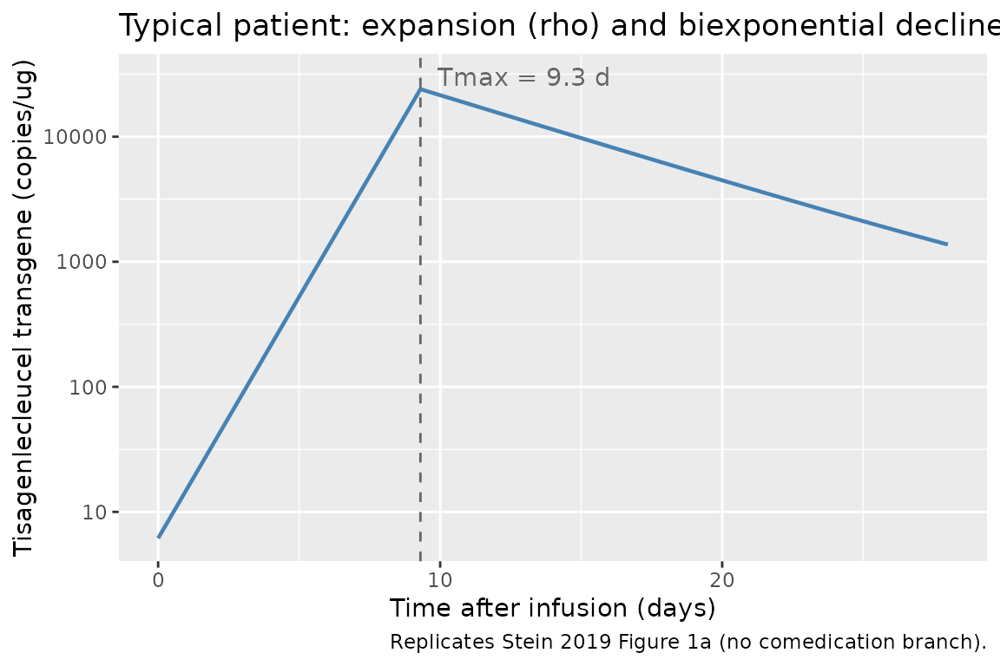
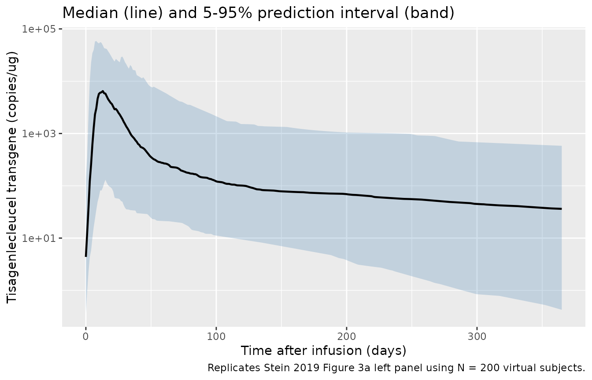

# Tisagenlecleucel (Stein 2019)

## Model and source

- Citation: Stein AM, Grupp SA, Levine JE, et al. Tisagenlecleucel
  Model-Based Cellular Kinetic Analysis of Chimeric Antigen Receptor-T
  Cells. *CPT Pharmacometrics Syst Pharmacol* 2019;8(5):285-295.
- Article: <https://doi.org/10.1002/psp4.12388> (open access; CC
  BY-NC-ND 4.0)

This is a cellular kinetic model for tisagenlecleucel CAR-T cells, not a
classical PK model. Tisagenlecleucel is a single-infusion autologous
CD19-targeted chimeric antigen receptor T-cell product. Following
infusion the transduced cells expand exponentially in the peripheral
blood until a time `Tmax`, and then decline biexponentially (a fast
contraction phase followed by a slow memory-cell-like persistence
phase). The model is described in Stein 2019 Figure 2 with the
analytical solution given in the supplementary material. Levels are
reported as transgene copies per microgram of genomic DNA measured by
qPCR.

## Population

The base model (which is also the final model) was fit to pooled data
from ELIANA (NCT02435849) and ENSIGN (NCT02228096), two phase II trials
of tisagenlecleucel in pediatric and young adult patients with relapsed
or refractory B-cell acute lymphoblastic leukemia (r/r B-ALL). The
model-based analysis used 90 patients (Stein 2019 Table 2 Patient
characteristics):

- Age median 12 years, range 3-25 years
- Weight median 39 kg, range 14-140 kg
- Sex 50% male / 50% female
- Race 77% White, 9% Asian, 14% Other/unknown
- Down syndrome 8%; previous stem cell transplant 57%; lymphodepleting
  chemotherapy with fludarabine 94%
- Received tocilizumab 36% (median time to first dose 5.7 days, range
  1-27)
- Received corticosteroids 26% (median time to first dose 7.5 days,
  range 0.11-170)

Doses (cells per kg) were 3.1e6 median (0.2-5.4e6) for patients \<=50
kg, and total cells 1.0e8 (0.03-2.6e8) for patients \>50 kg. The same
population metadata is available programmatically via
`readModelDb("Stein_2019_Tisagenlecleucel")$population`.

## Source trace

The per-parameter origin is recorded as an in-file comment next to each
`ini()` entry in
`inst/modeldb/specificDrugs/Stein_2019_Tisagenlecleucel.R`. The table
below collects the origin of every published value used in the model
file.

| Equation / parameter | Value | Source location |
|----|----|----|
| `foldx` | 3,900 | Stein 2019 Table 1 (foldx, fold expansion) |
| `Tmax` | 9.3 days | Stein 2019 Table 1 (Tmax) |
| `Cmax` | 24,000 copies/ug | Stein 2019 Table 1 (Cmax) |
| `alpha` | 0.16 1/day | Stein 2019 Table 1 (alpha) |
| `FB` | 0.0079 | Stein 2019 Table 1 (FB) |
| `beta` | 0.0032 1/day | Stein 2019 Table 1 (beta) |
| IIV `omega^2(foldx)` | 2.4 | Stein 2019 Table 1 (Random effect foldx) |
| IIV `omega^2(Tmax)` | 0.38 | Stein 2019 Table 1 (Random effect Tmax) |
| IIV `omega^2(Cmax)` | 0.65 | Stein 2019 Table 1 (Random effect Cmax) |
| IIV `omega^2(alpha)` | 0.91 | Stein 2019 Table 1 (Random effect alpha) |
| IIV `omega^2(FB)` | 0.8 | Stein 2019 Table 1 (Random effect FB) |
| IIV `omega^2(beta)` | 0.86 | Stein 2019 Table 1 (Random effect beta) |
| Residual error `a` | 0.56 | Stein 2019 Table 1 (Residual error a; constant on log-scale) |
| `rho = log(foldx)/Tmax` | derived | Stein 2019 Figure 2 Definitions |
| `R0 = Cmax/foldx` | derived | Stein 2019 Figure 2 Initial Conditions |
| `dE/dt = rho * E` (t \< Tmax) | \- | Stein 2019 Figure 2 Equations |
| `dE/dt = -alpha * E` (t \>= Tmax) | \- | Stein 2019 Figure 2 Equations |
| `dM/dt = k * E - beta * M`, `k = FB * (alpha - beta)` | \- | Stein 2019 Figure 2 Equations / Definitions |
| Analytical solution `f(t-Tmax) = AA * exp(-alpha*(t-Tmax)) + BB * exp(-beta*(t-Tmax))`, `AA = (1 - FB) * Cmax`, `BB = FB * Cmax` | \- | Stein 2019 supplement, “Analytical solution for the compartmental model” |

## A note on dosing events

Tisagenlecleucel is administered as a single CAR-positive T-cell
infusion at `t = 0`. The Stein 2019 cellular kinetic model does not
parameterize the infused cell dose directly; instead the model is
parameterized by the peak transgene level (`Cmax`) and the fold
expansion from baseline (`foldx`), which together define the implicit
baseline transcript level `R0 = Cmax / foldx`. The model is therefore
initialized at `t = 0` to the typical (or random) `R0` and there is no
`evid = 1` row in the simulation event table.

## Typical-individual trajectory (Figure 1a replication)

``` r

mod <- readModelDb("Stein_2019_Tisagenlecleucel")
mod_typical <- rxode2::zeroRe(mod)
#> ℹ parameter labels from comments will be replaced by 'label()'

ev_typical <- rxode2::et(seq(0, 28, by = 0.1))
sim_typical <- rxode2::rxSolve(mod_typical, ev_typical) |> as.data.frame()
#> ℹ omega/sigma items treated as zero: 'etalfoldx', 'etaltmax', 'etalcmax', 'etalalpha', 'etalfb', 'etalbeta'

ggplot(sim_typical, aes(time, Cc)) +
  geom_line(linewidth = 0.8, color = "steelblue") +
  geom_vline(xintercept = 9.3, linetype = "dashed", color = "grey40") +
  annotate("text", x = 9.3, y = 30000, label = "Tmax = 9.3 d",
           hjust = -0.1, color = "grey40") +
  scale_y_log10() +
  labs(x = "Time after infusion (days)",
       y = "Tisagenlecleucel transgene (copies/ug)",
       title = "Typical patient: expansion (rho) and biexponential decline",
       caption = "Replicates Stein 2019 Figure 1a (no comedication branch).")
```



The trajectory shows the exponential expansion at rate `rho` from `R0`
at `t = 0` up to `Cmax` at `t = Tmax`, followed by the rapid contraction
phase at rate `alpha` and subsequent slow persistence at rate `beta`.
With the typical parameter values:

- `R0 = Cmax / foldx = 24000 / 3900 = 6.15 copies/ug`
- `rho = log(foldx) / Tmax = log(3900) / 9.3 = 0.889 1/day`

## Population VPC (Figure 3a replication)

Stein 2019 Figure 3a shows a visual predictive check of the model fit.
We replicate the prediction-interval band over a 12-month follow-up
using 200 virtual subjects sampled from the published IIV. Note that the
published random-effect variances are large (omega^2 around 0.6-0.9 for
several parameters), so the prediction interval is wide.

``` r

set.seed(2019)
n_subj <- 200
ev_pop <- rxode2::et(seq(0, 365, by = 1)) |> rxode2::et(id = 1:n_subj)
sim_pop <- rxode2::rxSolve(mod, ev_pop) |> as.data.frame()
#> ℹ parameter labels from comments will be replaced by 'label()'

vpc_summary <- sim_pop |>
  group_by(time) |>
  summarise(
    Q05 = quantile(Cc, 0.05, na.rm = TRUE),
    Q50 = quantile(Cc, 0.50, na.rm = TRUE),
    Q95 = quantile(Cc, 0.95, na.rm = TRUE),
    .groups = "drop"
  )

ggplot(vpc_summary, aes(time, Q50)) +
  geom_ribbon(aes(ymin = Q05, ymax = Q95), fill = "steelblue", alpha = 0.25) +
  geom_line(linewidth = 0.8) +
  scale_y_log10() +
  labs(x = "Time after infusion (days)",
       y = "Tisagenlecleucel transgene (copies/ug)",
       title = "Median (line) and 5-95% prediction interval (band)",
       caption = paste0("Replicates Stein 2019 Figure 3a left panel using N = ",
                        n_subj, " virtual subjects."))
```



## Half-life and doubling-time verification

Stein 2019 Discussion (“Mechanism of biphasic decline”) reports a
doubling time of 0.78 days, an initial decline half-life of 4.3 days,
and a terminal half-life of 220 days. We recompute these directly from
the file’s parameter values:

``` r

foldx <- 3900
Tmax  <- 9.3
alpha <- 0.16
beta  <- 0.0032
rho   <- log(foldx) / Tmax

half_life <- data.frame(
  Quantity        = c("Doubling time (ln(2)/rho)",
                      "Initial decline half-life (ln(2)/alpha)",
                      "Terminal half-life (ln(2)/beta)"),
  Paper_value_d   = c(0.78, 4.3, 220),
  File_value_d    = round(c(log(2) / rho, log(2) / alpha, log(2) / beta), 2)
)
knitr::kable(half_life, caption = "Half-life and doubling-time recomputation.")
```

| Quantity                                | Paper_value_d | File_value_d |
|:----------------------------------------|--------------:|-------------:|
| Doubling time (ln(2)/rho)               |          0.78 |         0.78 |
| Initial decline half-life (ln(2)/alpha) |          4.30 |         4.33 |
| Terminal half-life (ln(2)/beta)         |        220.00 |       216.61 |

Half-life and doubling-time recomputation. {.table}

The recomputed values agree with the paper’s reported half-lives (the
small discrepancy on the terminal half-life is rounding:
`log(2) / 0.0032 = 217 d` vs the paper’s reported 220 d).

## PKNCA validation against paper Figure S1

Stein 2019 Figure S1 shows that the model-based and trapezoidal-rule NCA
estimates of Cmax and AUC over days 0-28 agree well (R^2 = 0.62 for
Cmax, R^2 = 0.84 for AUCd28) when computed from the same per-patient
post-hoc parameters. We perform the analogous trapezoidal NCA on the
simulated typical-individual trajectory using PKNCA and compare to the
analytical expressions reported in the paper.

``` r

# Dense observation grid for the typical individual
ev_dense <- rxode2::et(seq(0, 28, by = 0.1))
sim_dense <- rxode2::rxSolve(mod_typical, ev_dense) |>
  as.data.frame() |>
  mutate(id = 1L, treatment = "typical")
#> ℹ omega/sigma items treated as zero: 'etalfoldx', 'etaltmax', 'etalcmax', 'etalalpha', 'etalfb', 'etalbeta'

# Drop the t = 0 row only because PKNCA tolerates a non-zero first observation;
# we keep it here so AUC includes the full expansion phase.
conc_obj <- PKNCA::PKNCAconc(sim_dense, Cc ~ time | treatment + id)

intervals <- data.frame(
  start      = 0,
  end        = 28,
  cmax       = TRUE,
  tmax       = TRUE,
  auclast    = TRUE,
  half.life  = TRUE
)

nca_data <- PKNCA::PKNCAdata(conc_obj, intervals = intervals)
nca_res  <- PKNCA::pk.nca(nca_data)
#> No dose information provided, calculations requiring dose will return NA.
nca_summary <- summary(nca_res)
knitr::kable(nca_summary, caption = "PKNCA estimates over days 0-28 for the typical individual.")
```

| start | end | treatment | N   | auclast | cmax  | tmax | half.life |
|------:|----:|:----------|:----|:--------|:------|:-----|:----------|
|     0 |  28 | typical   | 1   | 172000  | 24000 | 9.30 | 4.75      |

PKNCA estimates over days 0-28 for the typical individual. {.table}

``` r


# Recover the analytical Cmax to compare
analytical <- data.frame(
  Quantity            = c("Cmax (copies/ug)", "Tmax (days)"),
  Paper_typical_value = c(24000, 9.3),
  PKNCA_simulation    = c(round(max(sim_dense$Cc), 0),
                          round(sim_dense$time[which.max(sim_dense$Cc)], 2))
)
knitr::kable(analytical,
             caption = "Analytical typical Cmax / Tmax vs PKNCA from the simulation.")
```

| Quantity         | Paper_typical_value | PKNCA_simulation |
|:-----------------|--------------------:|-----------------:|
| Cmax (copies/ug) |             24000.0 |          24000.0 |
| Tmax (days)      |                 9.3 |              9.3 |

Analytical typical Cmax / Tmax vs PKNCA from the simulation. {.table}

PKNCA recovers the analytical typical Cmax (24,000 copies/ug at Tmax =
9.3 days) from the simulated trajectory.

## Assumptions and deviations

- **Comedication parameters omitted.** Stein 2019 Table 1 reports two
  additional fixed effects, `Ftoci` (1.2) and `Fster` (1.0), that
  multiply the expansion rate `rho` once a patient receives tocilizumab
  or corticosteroids during the expansion window. The paper’s Discussion
  (“Effect of tocilizumab and corticosteroids on expansion”) concludes
  that neither comedication impacted the expansion rate. The library
  model therefore implements the structural expansion-and-decline
  equations only, giving the typical “untreated” trajectory that applies
  to the 64% of patients who did not receive tocilizumab and the 74% who
  did not receive corticosteroids in the pooled study population. To
  extend this model to a comedication-aware form (matching the
  supplement’s mlxtran), a future follow-up would need to register two
  new canonical covariates – the time of first tocilizumab dose and the
  time of first corticosteroid dose – before introducing the
  multiplicative rho-modification.

- **No covariates.** Stein 2019 Results (“Covariate analysis”) reports
  that bootstrapping the full covariate model showed no statistically
  significant impact of any covariate (sex, race, Down syndrome, prior
  HSCT, fludarabine lymphodepletion, study, transduction efficiency,
  dose-per-kg, tocilizumab receipt, corticosteroid receipt) on `Cmax`.
  The final cellular kinetic model therefore equals the base model and
  the library `covariateData` list is empty.

- **Initial baseline transcript level.** The model is initialized at
  `R0 = Cmax / foldx`, which corresponds to the average baseline
  transcript level immediately after the cell infusion (Stein 2019
  Figure 2 Initial Conditions). Pre-infusion (`t < 0`) levels are zero
  in reality; the model returns `R0` for `t < 0` only as a convenience
  for plotting and is not intended to represent biology before infusion.

- **Terminal half-life uncertainty.** The longest follow-up in the
  analysis was approximately 1 year (Stein 2019 Discussion, “Long-term
  persistence”); the terminal half-life of ~220 days is therefore an
  extrapolation that the authors note “must be interpreted with caution
  and will be updated as more data become available.”

- **[`checkModelConventions()`](https://nlmixr2.github.io/nlmixr2lib/reference/checkModelConventions.md)
  warning on dosing units.** The convention checker flags
  `units$dosing = "transgene copies/ug genomic DNA"` and
  `units$concentration = "transgene copies/ug genomic DNA"` as not
  recognized as a standard mass / molar dimensional unit. Both fields
  are intentionally identical because the cellular kinetic model has no
  traditional injected drug amount: the implicit “dose” is the baseline
  transcript level `R0` in the same transgene-copies units as the
  observed signal. This is a known harmless warning for the qPCR-based
  cellular kinetic class of models.

## Reference

- Stein AM, Grupp SA, Levine JE, et al. Tisagenlecleucel Model-Based
  Cellular Kinetic Analysis of Chimeric Antigen Receptor-T Cells. CPT
  Pharmacometrics Syst Pharmacol. 2019;8(5):285-295.
  <doi:10.1002/psp4.12388>
