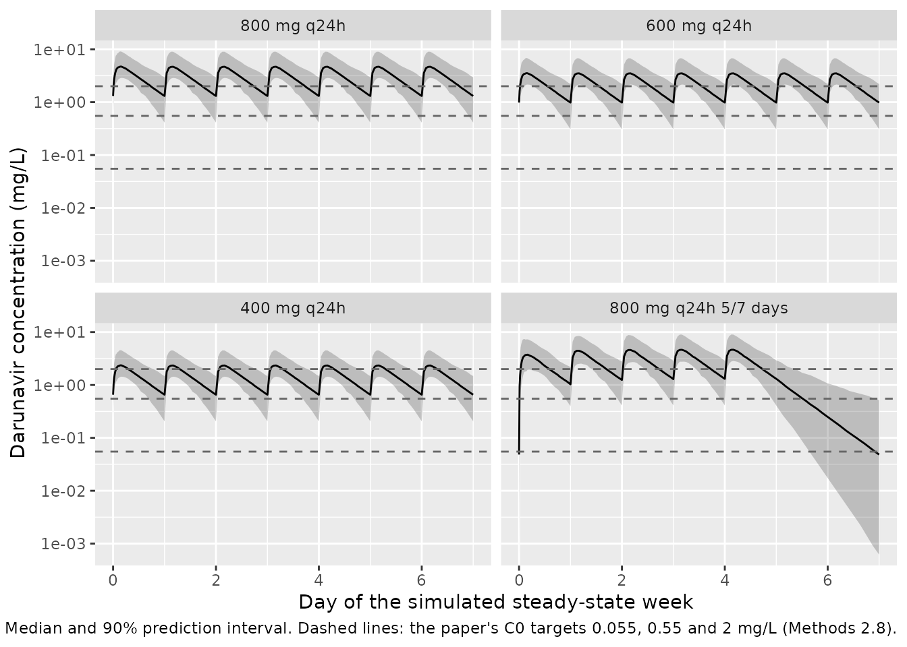

# Darunavir (Stillemans 2021)

## Model and source

- Citation: Stillemans G, Belkhir L, Vandercam B, Vincent A, Haufroid V,
  Elens L. Exploration of Reduced Doses and Short-Cycle Therapy for
  Darunavir/Cobicistat in Patients with HIV Using Population
  Pharmacokinetic Modeling and Simulations. Clin Pharmacokinet.
  2021;60:177-189. <doi:10.1007/s40262-020-00920-z>. PMCID: PMC7862523.
- Description: One-compartment population pharmacokinetic model with
  first-order absorption and elimination for oral cobicistat- or
  ritonavir-boosted darunavir in adults with HIV-1 infection (Stillemans
  2021). Apparent clearance decreases exponentially with alpha-1 acid
  glycoprotein (AAG), is lower in women and in CYP3A5 nonexpressers
  (*3/*3); apparent volume decreases exponentially with AAG and is
  higher in SLCO3A1 rs8027174 G\>T carriers.
- Article: <https://doi.org/10.1007/s40262-020-00920-z> (open access,
  PMC7862523)
- Electronic supplementary material (covariate-selection table used for
  the equation forms): Online Resource 2 of the article.

The model is a one-compartment model with first-order absorption and
first-order elimination for oral darunavir boosted with cobicistat (most
patients) or ritonavir. Apparent clearance (CL/F) falls exponentially
with plasma alpha-1 acid glycoprotein (AAG), is lower in women and in
CYP3A5 nonexpressers (*3/*3); apparent volume (V/F) falls exponentially
with AAG and is 81% larger in SLCO3A1 rs8027174 G\>T carriers.

## Population

The model was fitted to 405 darunavir concentrations from 127 adults
with HIV-1 infection followed at the Cliniques Universitaires Saint-Luc,
Brussels (NCT03101644): 309 sparse samples taken at random post-intake
times during routine visits, plus 96 samples from 12-hour rich profiles
(pre-dose to 6 h) in 12 adherent patients (Methods 2.1, Results 3.1).
Median age was 55 years (IQR 13), median weight 73 kg (IQR 17), 33.1%
were women, 52.8% Caucasian and 43.3% African. Most patients took
darunavir 800 mg once daily (91.3%); 85.8% were boosted with cobicistat
and 14.2% with ritonavir (Table 1). CYP3A5 genotypes were *1/*1 26.0%,
*1/*3 26.0% and *3/*3 45.7%; 14.2% carried the SLCO3A1 rs8027174 T
allele and none were T/T (Table 2).

The same information is available programmatically:

``` r

str(rxode2::rxode(readModelDb("Stillemans_2021_darunavir"))$population)
#> ℹ parameter labels from comments will be replaced by 'label()'
#> List of 13
#>  $ species       : chr "human"
#>  $ n_subjects    : num 127
#>  $ n_studies     : num 1
#>  $ n_observations: num 405
#>  $ age_median    : chr "55 years (IQR 13)"
#>  $ weight_median : chr "73 kg (IQR 17)"
#>  $ sex_female_pct: num 33.1
#>  $ race_ethnicity: chr "Caucasian 52.8%, African 43.3%, other 3.9% (Table 1)"
#>  $ disease_state : chr "HIV-1 infection, adult outpatients on boosted darunavir (median treatment duration 4.2 years; 78.7% with viral "| __truncated__
#>  $ dose_range    : chr "darunavir 800 mg q24h (91.3%), 600 mg q12h (7.9%) or 1200 mg q24h (0.8%); boosted with cobicistat (85.8%) or ritonavir (14.2%)"
#>  $ regions       : chr "Belgium (Cliniques Universitaires Saint-Luc, Brussels)"
#>  $ genotypes     : chr "CYP3A5 *1/*1 26.0%, *1/*3 26.0%, *3/*3 45.7%; SLCO3A1 rs8027174 G/T 14.2% (Table 2)"
#>  $ notes         : chr "Prospective observational TDM study (NCT03101644). Dataset A: 309 sparse samples, one per visit at random post-"| __truncated__
```

## Source trace

Every `ini()` value carries an in-file comment naming its source. The
table collects them.

| Equation / parameter | Value | Source location |
|----|----|----|
| One-compartment, first-order absorption and elimination, no lag | n/a | Results 3.2 |
| `lka` (ka) | log(0.68) 1/h | Table 3 |
| `lcl` (CL/F) | log(12.9) L/h | Table 3 |
| `lvc` (V/F) | log(152) L | Table 3 |
| `e_aag_cl` | -0.61 per g/L, exponential | Table 3; equation form Methods 2.6 and ESM Online Resource 2 |
| `e_aag_vc` | -0.68 per g/L, exponential | Table 3; ESM Online Resource 2 |
| `e_sexf_cl` | -0.21, exponential | Table 3; ESM Online Resource 2 |
| `e_cyp3a5_cl` | -0.16, categorical on nonexpressers | Table 3; ESM Online Resource 2; Results 3.3 (‘19% higher in expressors’) |
| `e_snp_slco3a1_rs8027174_vc` | 0.81, categorical | Table 3; ESM Online Resource 2; Results 3.3 (‘increased by 81%’) |
| `etalka` | 0.60^2 = 0.36 | Table 3, ‘omega ka (SD)’ |
| `etalcl` | 0.22^2 = 0.0484 | Table 3, ‘omega CL (SD)’ |
| `etalvc` | 0.33^2 = 0.1089 | Table 3, ‘omega V (SD)’ |
| `propSd` | 0.281 | Table 3, ‘sigma exponential (SD)’ |
| `addSd` | 0.641 mg/L | Table 3, ‘sigma additive (SD)’ |
| AAG centring value | 1 g/L (assumed) | Not reported; see Assumptions |

The covariate equations are those printed in Methods 2.6, with the form
for each retained covariate taken from ESM Online Resource 2:

- Exponential: `P = theta * exp(theta_cov * (cov - median))` (AAG on
  CL/F and V/F; sex on CL/F, with male as the reference so the female
  term is `exp(-0.21)`).
- Categorical: `P = theta * (1 + theta_cov)` for the non-reference group
  (CYP3A5 nonexpressers on CL/F; SLCO3A1 T carriers on V/F).

## Typical-value covariate effects

These are deterministic properties of the model file and are checked
against the paper’s own statements.

``` r

ui <- rxode2::rxode(readModelDb("Stillemans_2021_darunavir"))
#> ℹ parameter labels from comments will be replaced by 'label()'
th <- ui$theta
typical <- tibble::tribble(
  ~Effect, ~Model, ~Paper,
  "CL/F expresser / nonexpresser", 1 / (1 + th[["e_cyp3a5_cl"]]), 1.19,
  "CL/F female / male", exp(th[["e_sexf_cl"]]), exp(-0.21),
  "V/F SLCO3A1 T carrier / G/G", 1 + th[["e_snp_slco3a1_rs8027174_vc"]], 1.81,
  "CL/F at AAG + 1 g/L / at centre", exp(th[["e_aag_cl"]]), exp(-0.61),
  "V/F at AAG + 1 g/L / at centre", exp(th[["e_aag_vc"]]), exp(-0.68)
)
knitr::kable(typical, digits = 3, caption = "Typical-value covariate ratios.")
```

| Effect                          | Model | Paper |
|:--------------------------------|------:|------:|
| CL/F expresser / nonexpresser   | 1.190 | 1.190 |
| CL/F female / male              | 0.811 | 0.811 |
| V/F SLCO3A1 T carrier / G/G     | 1.810 | 1.810 |
| CL/F at AAG + 1 g/L / at centre | 0.543 | 0.543 |
| V/F at AAG + 1 g/L / at centre  | 0.507 | 0.507 |

Typical-value covariate ratios. {.table}

``` r

# 'CL being 19% higher in expressors' is the paper's rounding of 1/0.84.
stopifnot(abs(typical$Model - typical$Paper) < 0.005)
```

## Virtual cohort

The observed data are not public. Table 4 of the paper was produced by
simulating steady-state profiles for the study cohort itself (1000
replicates, no residual error) under each of four regimens, so every
regimen saw the same patients. The virtual cohort mirrors that: 200
patients whose covariate frequencies follow Tables 1 and 2, each with
one draw of the random effects, replicated under all four regimens. AAG
is not summarised in the paper, so it is drawn from a log-normal
distribution centred on the model’s AAG centring value (see
Assumptions).

``` r

# `set.seed()` seeds R's RNG, which draws both the covariates and the random
# effects here (the etas are supplied as data columns, see below), so the
# cohort is the same on every machine. The assertions are nonetheless
# written with Monte-Carlo headroom rather than to one draw.
set.seed(20210722)

mod <- readModelDb("Stillemans_2021_darunavir")
omega <- rxode2::rxode(mod)$omega
#> ℹ parameter labels from comments will be replaced by 'label()'
stopifnot(all(omega[upper.tri(omega)] == 0))

n_subj <- 200

subjects <- tibble(
  subject = seq_len(n_subj),
  SEXF = rbinom(n_subj, 1, 42 / 127),
  # Expressers (*1/*1 + *1/*3) among genotyped subjects, Table 2
  CYP3A5_EXPR = rbinom(n_subj, 1, 66 / 124),
  # G/T carriers among genotyped subjects, Table 2
  SNP_SLCO3A1_RS8027174 = rbinom(n_subj, 1, 18 / 123),
  AAG = exp(rnorm(n_subj, log(1), 0.34))
)
for (eta in colnames(omega)) {
  subjects[[eta]] <- rnorm(n_subj, 0, sqrt(omega[eta, eta]))
}

regimens <- tibble::tribble(
  ~regimen, ~dose, ~days_on,
  "800 mg q24h", 800, 7,
  "600 mg q24h", 600, 7,
  "400 mg q24h", 400, 7,
  "800 mg q24h 5/7 days", 800, 5
)

make_arm <- function(regimen, dose, days_on, id_offset) {
  subj <- subjects |>
    mutate(id = id_offset + subject, regimen = regimen)
  # Three weeks of dosing; within each week doses on days_on consecutive
  # days. The analysis window is the third week (336-504 h), when the
  # once-daily arms are at steady state (half-life about 10 h).
  dose_times <- as.vector(outer((seq_len(days_on) - 1) * 24, c(0, 168, 336), "+"))
  obs_times <- sort(unique(c(seq(336, 504, by = 1), seq(336, 340, by = 0.25))))
  doses <- tidyr::crossing(subj, time = dose_times) |>
    mutate(amt = dose, evid = 1L, cmt = "depot")
  obs <- tidyr::crossing(subj, time = obs_times) |>
    mutate(amt = 0, evid = 0L, cmt = "central")
  bind_rows(doses, obs) |>
    arrange(id, time, desc(evid))
}

events <- bind_rows(lapply(seq_len(nrow(regimens)), function(i) {
  make_arm(
    regimens$regimen[i], regimens$dose[i], regimens$days_on[i],
    id_offset = (i - 1L) * n_subj
  )
}))
stopifnot(!anyDuplicated(unique(events[, c("id", "time", "evid")])))
```

## Simulation

Table 4 was simulated without residual error, so the comparison uses
`Cc` (the individual prediction), not the residual-error `sim` column.
The model is solved with its random effects zeroed; the per-patient eta
columns in the event table then supply each patient’s random effects,
identically in every regimen.

``` r

sim <- rxode2::rxSolve(
  rxode2::zeroRe(mod),
  events = events,
  keep = c("regimen", "subject"),
  returnType = "data.frame"
) |>
  mutate(regimen = factor(regimen, levels = regimens$regimen))
#> ℹ parameter labels from comments will be replaced by 'label()'
#> ℹ omega/sigma items treated as zero: 'etalka', 'etalcl', 'etalvc'
#> Warning: multi-subject simulation without without 'omega'

# The eta columns must reach the solve: the same patient's CL/F differs
# between patients but is identical across the four regimens.
cl_by_arm <- sim |>
  distinct(subject, regimen, cl)
stopifnot(
  nrow(cl_by_arm) == 4 * n_subj,
  sd(log(cl_by_arm$cl[cl_by_arm$regimen == "800 mg q24h"])) > 0.15,
  all(tapply(cl_by_arm$cl, cl_by_arm$subject, function(x) diff(range(x))) < 1e-8)
)

# The model is linear, so with shared patients the once-daily troughs scale
# exactly with dose, as Table 4's do (1.17 / 1.56 = 0.75, 0.78 / 1.56 = 0.50).
trough <- sim |>
  dplyr::filter(time == 360, regimen != "800 mg q24h 5/7 days") |>
  select(subject, regimen, Cc) |>
  tidyr::pivot_wider(names_from = regimen, values_from = Cc)
stopifnot(
  max(abs(trough[["600 mg q24h"]] / trough[["800 mg q24h"]] - 0.75)) < 1e-4,
  max(abs(trough[["400 mg q24h"]] / trough[["800 mg q24h"]] - 0.50)) < 1e-4,
  abs(1.17 / 1.56 - 0.75) < 0.01,
  abs(0.78 / 1.56 - 0.50) < 0.01
)
```

## Steady-state profiles

``` r

sim |>
  mutate(day = (time - 336) / 24) |>
  group_by(regimen, day) |>
  summarise(
    Q05 = quantile(Cc, 0.05),
    Q50 = median(Cc),
    Q95 = quantile(Cc, 0.95),
    .groups = "drop"
  ) |>
  ggplot(aes(day, Q50)) +
  geom_ribbon(aes(ymin = Q05, ymax = Q95), alpha = 0.25) +
  geom_line() +
  geom_hline(yintercept = c(0.055, 0.55, 2), linetype = "dashed", colour = "grey40") +
  facet_wrap(~regimen) +
  scale_y_log10() +
  labs(
    x = "Day of the simulated steady-state week",
    y = "Darunavir concentration (mg/L)",
    caption = paste(
      "Median and 90% prediction interval. Dashed lines: the paper's",
      "C0 targets 0.055, 0.55 and 2 mg/L (Methods 2.8)."
    )
  )
```



## PKNCA validation

For the once-daily arms the steady-state interval is the last 24 h of
the second week of dosing, 336-360 h (dose at 336 h, trough at 360 h).
For the weekends-off arm the paper takes ‘the C0 immediately before a
new cycle (day 8) and the AUC over day 7 to day 8’ (Table 4 footnote),
i.e. 480-504 h here, 48-72 h after the fifth dose of the week. The
trough is summarised with `cmin`; within each of these windows the
minimum is the end-of-window concentration.

``` r

sim_nca <- sim |>
  dplyr::filter(!is.na(Cc)) |>
  dplyr::select(id, time, Cc, regimen) |>
  mutate(regimen = as.character(regimen))

dose_df <- events |>
  dplyr::filter(evid == 1) |>
  dplyr::select(id, time, amt, regimen)

conc_obj <- PKNCA::PKNCAconc(sim_nca, Cc ~ time | regimen + id)
dose_obj <- PKNCA::PKNCAdose(dose_df, amt ~ time | regimen + id)

intervals <- data.frame(
  regimen = regimens$regimen,
  start = c(336, 336, 336, 480),
  end = c(360, 360, 360, 504),
  cmin = TRUE,
  auclast = TRUE
)

nca_res <- PKNCA::pk.nca(
  PKNCA::PKNCAdata(conc_obj, dose_obj, intervals = intervals)
)
```

### Comparison against Table 4

``` r

published <- tibble::tribble(
  ~regimen, ~cmin, ~auclast,
  "800 mg q24h", 1.56, 76.2,
  "600 mg q24h", 1.17, 57.2,
  "400 mg q24h", 0.78, 38.1,
  "800 mg q24h 5/7 days", 0.1, 6.5
)

cmp <- nlmixr2lib::ncaComparisonTable(
  simulated = nca_res,
  reference = published,
  by = "regimen",
  units = c(cmin = "mg/L", auclast = "mg*h/L"),
  tolerance_pct = 20
)
knitr::kable(
  cmp,
  caption = paste(
    "Simulated vs. published (Table 4) median C0 and AUC0-24.",
    "* differs from the published value by more than 20%."
  )
)
```

| NCA parameter     | regimen              | Reference | Simulated | % diff   |
|:------------------|:---------------------|:----------|:----------|:---------|
| Cmin (mg/L)       | 800 mg q24h          | 1.56      | 1.31      | -16.0%   |
| Cmin (mg/L)       | 600 mg q24h          | 1.17      | 0.982     | -16.0%   |
| Cmin (mg/L)       | 400 mg q24h          | 0.78      | 0.655     | -16.0%   |
| Cmin (mg/L)       | 800 mg q24h 5/7 days | 0.1       | 0.0484    | -51.6%\* |
| AUClast (mg\*h/L) | 800 mg q24h          | 76.2      | 70.3      | -7.7%    |
| AUClast (mg\*h/L) | 600 mg q24h          | 57.2      | 52.7      | -7.8%    |
| AUClast (mg\*h/L) | 400 mg q24h          | 38.1      | 35.2      | -7.7%    |
| AUClast (mg\*h/L) | 800 mg q24h 5/7 days | 6.5       | 2.9       | -55.3%\* |

Simulated vs. published (Table 4) median C0 and AUC0-24. \* differs from
the published value by more than 20%. {.table}

``` r

sim_medians <- as.data.frame(nca_res) |>
  dplyr::filter(PPTESTCD %in% c("cmin", "auclast")) |>
  group_by(regimen, PPTESTCD) |>
  summarise(sim = median(PPORRES), .groups = "drop") |>
  tidyr::pivot_wider(names_from = PPTESTCD, values_from = sim) |>
  inner_join(published, by = "regimen", suffix = c("_sim", "_pub")) |>
  mutate(
    auc_pct = 100 * (auclast_sim / auclast_pub - 1),
    c0_pct = 100 * (cmin_sim / cmin_pub - 1)
  )
daily <- sim_medians |> dplyr::filter(regimen != "800 mg q24h 5/7 days")
stopifnot(nrow(daily) == 3)
# AUC0-24 is the structural check: at steady state it equals dose / CL/F,
# so a mis-transcribed clearance or covariate effect moves it by tens of
# percent. Realised -8% for this cohort (-2% to -4% with 1000-patient
# cohorts in development); 12% leaves room for the Monte-Carlo error of a
# 200-patient median (about 3%).
stopifnot(all(abs(daily$auc_pct) < 12))
# C0 median runs about 15% below Table 4 (realised -16%; see Assumptions and
# deviations); 25% still fails on a halved or doubled volume.
stopifnot(all(abs(daily$c0_pct) < 25))
```

The once-daily AUC0-24 medians reproduce Table 4 to within about 8%. The
simulated median troughs are about 15% below Table 4 and the
weekends-off trough and AUC are about half of the published values; both
point to the paper’s simulations having a somewhat slower elimination
than the Table 3 estimates imply for this virtual cohort (see
Assumptions and deviations).

## Probability of target attainment (Table 4)

``` r

c0 <- as.data.frame(nca_res) |>
  dplyr::filter(PPTESTCD == "cmin") |>
  dplyr::select(id, regimen, C0 = PPORRES)

pta <- c0 |>
  group_by(regimen) |>
  summarise(
    `C0 > 0.055 mg/L` = 100 * mean(C0 > 0.055),
    `C0 > 0.55 mg/L` = 100 * mean(C0 > 0.55),
    `C0 > 2 mg/L` = 100 * mean(C0 > 2),
    .groups = "drop"
  ) |>
  tidyr::pivot_longer(-regimen, names_to = "target", values_to = "Simulated")

pta_pub <- tibble::tribble(
  ~regimen, ~target, ~Published,
  "800 mg q24h", "C0 > 0.055 mg/L", 99.3,
  "800 mg q24h", "C0 > 0.55 mg/L", 89.6,
  "800 mg q24h", "C0 > 2 mg/L", 33.2,
  "600 mg q24h", "C0 > 0.055 mg/L", 99.1,
  "600 mg q24h", "C0 > 0.55 mg/L", 84.0,
  "600 mg q24h", "C0 > 2 mg/L", 16.4,
  "400 mg q24h", "C0 > 0.055 mg/L", 98.6,
  "400 mg q24h", "C0 > 0.55 mg/L", 69.8,
  "400 mg q24h", "C0 > 2 mg/L", 3.6,
  "800 mg q24h 5/7 days", "C0 > 0.055 mg/L", 60.7,
  "800 mg q24h 5/7 days", "C0 > 0.55 mg/L", 15.3,
  "800 mg q24h 5/7 days", "C0 > 2 mg/L", 1.3
)

pta_cmp <- pta_pub |>
  inner_join(pta, by = c("regimen", "target")) |>
  mutate(Difference = Simulated - Published)
stopifnot(nrow(pta_cmp) == nrow(pta_pub))

pta_cmp |>
  dplyr::rename("Regimen" = regimen, "Target" = target, "Published (%)" = Published,
                "Simulated (%)" = Simulated, "Difference (points)" = Difference) |>
  knitr::kable(digits = 1, caption = "Probability of target attainment, simulated vs. Table 4.")
```

| Regimen | Target | Published (%) | Simulated (%) | Difference (points) |
|:---|:---|---:|---:|---:|
| 800 mg q24h | C0 \> 0.055 mg/L | 99.3 | 99.5 | 0.2 |
| 800 mg q24h | C0 \> 0.55 mg/L | 89.6 | 90.5 | 0.9 |
| 800 mg q24h | C0 \> 2 mg/L | 33.2 | 18.0 | -15.2 |
| 600 mg q24h | C0 \> 0.055 mg/L | 99.1 | 99.0 | -0.1 |
| 600 mg q24h | C0 \> 0.55 mg/L | 84.0 | 84.5 | 0.5 |
| 600 mg q24h | C0 \> 2 mg/L | 16.4 | 7.5 | -8.9 |
| 400 mg q24h | C0 \> 0.055 mg/L | 98.6 | 99.0 | 0.4 |
| 400 mg q24h | C0 \> 0.55 mg/L | 69.8 | 59.5 | -10.3 |
| 400 mg q24h | C0 \> 2 mg/L | 3.6 | 1.0 | -2.6 |
| 800 mg q24h 5/7 days | C0 \> 0.055 mg/L | 60.7 | 44.5 | -16.2 |
| 800 mg q24h 5/7 days | C0 \> 0.55 mg/L | 15.3 | 4.0 | -11.3 |
| 800 mg q24h 5/7 days | C0 \> 2 mg/L | 1.3 | 0.0 | -1.3 |

Probability of target attainment, simulated vs. Table 4. {.table}

``` r


pta_gap <- function(reg, tgt) {
  v <- pta_cmp$Difference[pta_cmp$regimen == reg & pta_cmp$target == tgt]
  if (length(v) != 1L) stop("no unique PTA row for ", reg, " / ", tgt)
  v
}
# 0.055 mg/L on the once-daily arms: nearly everyone is above it in both
# the paper and the simulation (binomial SE under 1 point near 99%).
stopifnot(
  abs(pta_gap("800 mg q24h", "C0 > 0.055 mg/L")) < 5,
  abs(pta_gap("600 mg q24h", "C0 > 0.055 mg/L")) < 5,
  abs(pta_gap("400 mg q24h", "C0 > 0.055 mg/L")) < 5
)
# 0.55 mg/L at 800 and 600 mg: realised within 1 point here; the
# binomial SE at 200 patients is about 2.5 points. The 400 mg / 0.55 mg/L
# and all 2 mg/L cells sit on the steep part of the trough distribution and
# inherit the trough deviation, so they are reported but not gated.
stopifnot(
  abs(pta_gap("800 mg q24h", "C0 > 0.55 mg/L")) < 10,
  abs(pta_gap("600 mg q24h", "C0 > 0.55 mg/L")) < 10
)
# Weekends-off therapy: the paper's conclusion is that it leaves a large
# share of patients below even the lowest target (39.3% below 0.055 mg/L)
# and almost nobody above 2 mg/L. Assert that qualitative result only; the
# magnitude is a known deviation.
sct <- pta_cmp |> dplyr::filter(regimen == "800 mg q24h 5/7 days")
stopifnot(
  sct$Simulated[sct$target == "C0 > 0.055 mg/L"] < 85,
  sct$Simulated[sct$target == "C0 > 2 mg/L"] < 10
)
```

The once-daily regimens reproduce the 0.055 mg/L target, and the 0.55
mg/L target at 800 and 600 mg, closely. At 400 mg for 0.55 mg/L, and for
the 2 mg/L target at every dose, fewer simulated than published patients
reach the target, consistent with the lower simulated troughs. For
weekends-off therapy the qualitative conclusion is reproduced – a large
fraction of patients fall below 0.055 mg/L before the next cycle – but
the simulated fractions above each target are lower than in Table 4.

## Assumptions and deviations

- **AAG centring value.** The paper centres the exponential AAG effects
  on the cohort median, but prints that median nowhere (not in Table 1,
  the supplement, or the companion external-validation paper
  <doi:10.1007/s00228-020-03036-2>, whose validation data had no AAG).
  The model file centres on 1 g/L, a round value inside the adult
  reference interval. The typical CL/F and V/F therefore describe a
  patient with AAG 1 g/L. If the true median was M g/L, a user-supplied
  AAG gives CL/F multiplied by `exp(0.61 * (M - 1))` and V/F by
  `exp(0.68 * (M - 1))` relative to the published model – about 6% and
  7% per 0.1 g/L of difference. Population-level simulations such as
  Table 4 are unaffected provided the virtual AAG distribution is
  centred on the same value.
- **AAG distribution in the virtual cohort.** Not reported; drawn
  log-normal with median 1 g/L and log-SD 0.34 (about 35% CV). The only
  AAG values the paper prints are two outliers at 2.66 and 2.2 g/L.
- **Sex effect form.** ESM Online Resource 2 lists the sex effect as
  exponential, so women have CL/F multiplied by `exp(-0.21) = 0.81`,
  i.e. 19% lower; the Results prose says ‘21% lower’, reading the
  coefficient directly. The printed equation form was followed.
- **CYP3A5 coding.** The paper’s ’CYP3A5*3 on CL’ applies to* 3/\*3
  nonexpressers with expressers as reference (‘CL being 19% higher in
  expressors’, 1/0.84 = 1.19). The model uses the canonical expresser
  column `CYP3A5_EXPR` and applies the effect to `1 - CYP3A5_EXPR`.
- **Residual error.** The paper describes a ‘mixed (additive plus
  exponential)’ residual model with SDs 0.281 and 0.641 mg/L. It is
  encoded as proportional plus additive error, the linear-scale
  equivalent of an exponential term for moderate SDs.
- **Covariate frequencies.** Missing genotypes (2-3%) were set to the
  most frequent category in the paper; the virtual cohort uses the
  frequencies among genotyped subjects.
- **Known deviation: troughs and the weekends-off tail.** With the Table
  3 estimates, the simulated steady-state AUC0-24 matches Table 4 to
  within about 8% but median C0 is about 15% lower, and in the
  weekends-off regimen the median C0 72 h after the last dose and the
  day 7-8 AUC are about half of the published 0.1 mg/L and 6.5 mg\*h/L.
  These quantities are governed by the elimination rate CL/V; the
  published values imply an effective half-life a few hours longer than
  this cohort produces. Reading the Table 3 IIV as variances instead of
  SDs does not remove the gap and worsens the PTA agreement, and the AAG
  centring value cancels out of the simulation. The paper simulated its
  own patients’ covariates, including the AAG distribution and the joint
  distribution of genotype and sex, which cannot be reproduced from the
  published summaries. The deviation is recorded rather than tuned.
- **Related model.** The companion paper (Stillemans 2021, Eur J Clin
  Pharmacol, <doi:10.1007/s00228-020-03036-2>) re-estimated a version of
  this model without AAG for external validation; that reduced model is
  a separate publication and is not part of this file.
- No erratum or correction notice was found for the article (Europe PMC
  author search, 2026-09-27).
