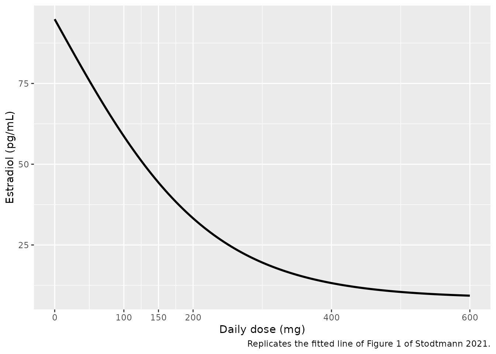
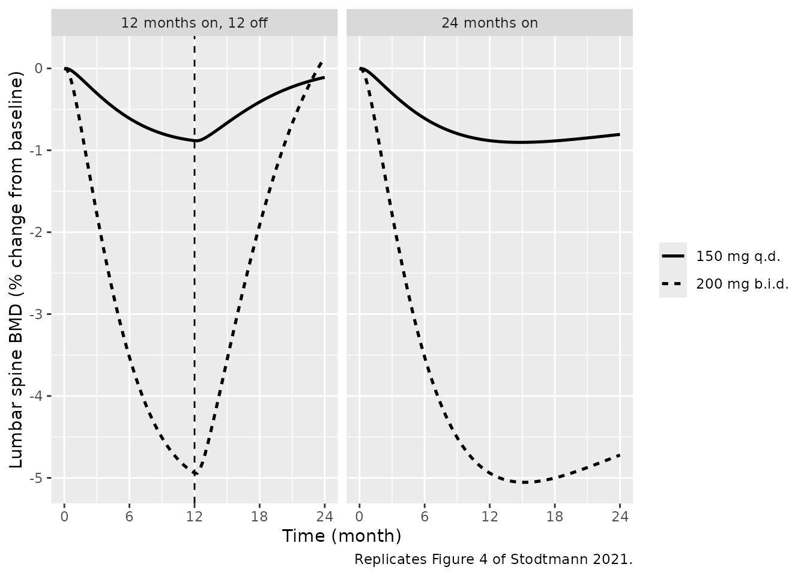
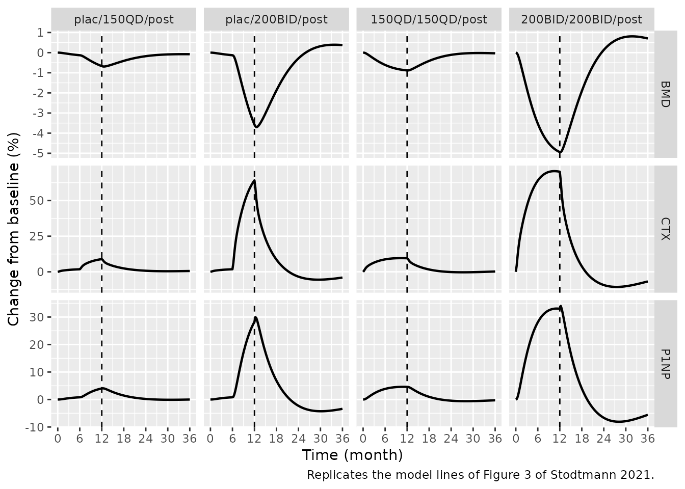
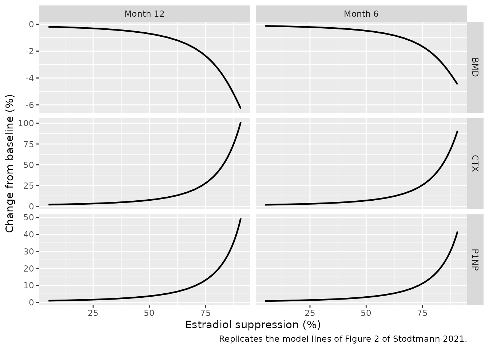

# Elagolix bone QSP (Stodtmann 2021)

## Model and source

- Citation: Stodtmann S, Nader A, Polepally AR, Suleiman AA, Winzenborg
  I, Noertersheuser P, Ng J, Mostafa NM, Shebley M. Validation of a
  quantitative systems pharmacology model of calcium homeostasis using
  elagolix Phase 3 clinical trial data in women with endometriosis. Clin
  Transl Sci. 2021;14:1611-1619. <doi:10.1111/cts.13040>. The dose-E2
  model (equation 3, Table 2) is from that paper. The QSP model was
  applied there without modification from Riggs MM, Bennetts M, van der
  Graaf PH, Martin SW. Integrated pharmacometrics and systems
  pharmacology model-based analyses to guide GnRH receptor modulator
  development for management of endometriosis. CPT Pharmacometrics Syst
  Pharmacol. 2012;1:e11. <doi:10.1038/psp.2012.10>, which supplies the
  estrogen effects (equations 2-5), the E2 scaling function (equation 6)
  and the lumbar spine BMD equation (equation 7). Riggs 2012 in turn
  fixes every other system value to Peterson MC, Riggs MM. Bone.
  2010;46(1):49-63. <doi:10.1016/j.bone.2009.08.053>; those backbone
  equations and values are transcribed from the authors’ open-source
  release of the same model,
  <https://github.com/metrumresearchgroup/OpenBoneMin>, file
  inst/OpenBoneMin.cpp at commit b3d59bfc (2026-01-26), whose estrogen
  block carries the Riggs 2012 extension. Differences between the
  printed Riggs 2012 values and the code are listed in the validation
  vignette.
- Description: QSP. Elagolix dose-estradiol model coupled to the
  Peterson-Riggs calcium-homeostasis and bone-remodelling systems
  pharmacology model with the Riggs 2012 estrogen extension, predicting
  lumbar spine bone mineral density (BMD) and the bone-turnover markers
  serum CTX (resorption) and P1NP (formation) in premenopausal women
  with endometriosis. An empirical shifted/scaled-logit function of the
  total daily elagolix dose gives the average serum estradiol (E2)
  level; E2 relative to its untreated level is mapped to a fractional
  estrogen effect through the Riggs 2012 sigmoid scaling function, which
  acts on latent and active TGF-beta, responding osteoblasts, osteoblast
  apoptosis and the renal tubular calcium-reabsorption maximum of the
  29-state calcium / PTH / calcitriol / phosphate / RANK-RANKL-OPG /
  osteoblast-osteoclast / RUNX2-CREB-BCL2 backbone. Lumbar spine BMD
  follows an indirect-response equation driven by relative osteoblast
  (formation) and osteoclast (resorption) activity. Deterministic
  typical-value model: no IIV and no residual error.
- Article: <https://doi.org/10.1111/cts.13040>
- QSP model applied by the article (Riggs 2012):
  <https://doi.org/10.1038/psp.2012.10>
- Structural source for the calcium / bone backbone:
  <https://github.com/metrumresearchgroup/OpenBoneMin>

Stodtmann et al. link elagolix, an oral gonadotropin-releasing hormone
receptor antagonist, to lumbar spine bone mineral density (BMD) in two
steps:

1.  an empirical **dose-E2 model** – a shifted/scaled logit of the total
    daily elagolix dose that returns the average serum estradiol (E2)
    level (equation 3, Table 2), estimated in the paper; and
2.  the **calcium-homeostasis / bone-remodelling QSP model** of Peterson
    and Riggs with the estrogen extension of Riggs et al. 2012, applied
    “without any modification”, which turns E2 into lumbar spine BMD,
    serum CTX (resorption) and P1NP (formation).

The packaged model is the coupled system. It is deterministic (no IIV,
no residual error) and has no elagolix pharmacokinetics: E2 is a
steady-state function of the daily dose, supplied as the time-varying
covariate `DOSE_ELAGOLIX_MGD`. Non-compartmental analysis is therefore
not an appropriate check. The vignette instead reproduces the paper’s
Figure 1 dose-E2 curve, its Table 3 predicted BMD changes, Figures 2-4,
and the Riggs 2012 benchmark on which the bone model was built.

``` r

mod <- readModelDb("Stodtmann_2021_elagolix")
ui <- rxode2::rxode2(mod)
length(ui$state)
#> [1] 30
```

## Population

The dose-E2 model was fit to average E2 levels from six elagolix studies
in premenopausal women (Stodtmann 2021 Table 1): a phase 1 study in
healthy volunteers (100/150/200 mg once daily, 100/200/300 mg twice
daily and 600 mg once daily for three menstrual cycles, E2 sampled three
times a week), a phase 2b study in women with heavy menstrual bleeding
from uterine fibroids, and four phase 3 studies in women with moderate
to severe endometriosis-associated pain (Elaris EM-I and EM-II, 150 mg
once daily or 200 mg twice daily for 6 months, and their 6-month
extensions EM-III and EM-IV with 6 months of post-treatment follow-up).
Weighted nonlinear least squares was used, weighting each regimen by its
cohort size and up-weighting the intensively sampled phase 1 study. The
paper does not tabulate demographics; they are published with each
trial.

The QSP model was not refit: the phase 3 BMD, CTX and P1NP data served
only as external validation.

``` r

str(mod()$population)
#> List of 9
#>  $ species       : chr "human"
#>  $ n_subjects    : logi NA
#>  $ n_studies     : num 6
#>  $ age_range     : chr "premenopausal adult women (individual demographics not reported in this paper)"
#>  $ sex_female_pct: num 100
#>  $ disease_state : chr "Premenopausal women: healthy volunteers (phase 1), women with heavy menstrual bleeding associated with uterine "| __truncated__
#>  $ dose_range    : chr "Elagolix 100/150/200 mg once daily, 100/200/300 mg twice daily and 600 mg once daily (total daily dose 0-600 mg"| __truncated__
#>  $ regions       : chr "multinational (phase 3 Elaris EM program)"
#>  $ notes         : chr "The dose-E2 model was fit by weighted nonlinear least squares to mean E2 levels from all six studies of Table 1"| __truncated__
```

## Source trace

### Dose-E2 model (the part estimated in Stodtmann 2021)

| Equation / parameter | Value | Source location |
|----|----|----|
| `e2 = E2min + (E2max - E2min) / (1 + exp(slope * DailyDose))` | – | Stodtmann 2021 equation 3 |
| `e2slope` | 0.00894 per mg/day | Table 2 ‘Slope’ |
| `lE2max` | 5.20 (E2max = 181.3 pg/mL) | Table 2 ‘Log(E2max)’ |
| `lE2min` | 2.14 (E2min = 8.50 pg/mL) | Table 2 ‘Log(E2min)’ |
| Untreated E2 = (E2max + E2min) / 2 = 94.9 pg/mL | – | Table 2 footnote |

### Estrogen coupling (Riggs 2012, applied unchanged)

| Equation / parameter | Value | Source location |
|----|----|----|
| `E2frac = e2 / E2ref` | `E2ref` = 100 pg/mL | Riggs 2012 p 2, “assuming a typical baseline E2 of ~100 pg/ml” |
| `E = E2frac^2.1 / (E2frac^2.1 + 0.15^2.1)` | `E2gam` = 2.1, `E2frac50` = 0.15 | Riggs 2012 equation 6 |
| Latent TGF-beta production `* (1/E)^tgfbGAM` | `tgfbGAM` = 0.075 | Riggs 2012 equation 2 and p 4 |
| Latent-to-active TGF-beta conversion `* E^tgfbactGAM` | `tgfbactGAM` = 0.045 | Riggs 2012 equations 2-3 and p 4 |
| Responding-osteoblast production `* (1/E)^robGAM` | `robGAM` = 0.16 | Riggs 2012 equation 4 and p 4 |
| Active-osteoblast apoptosis `* (1/E)^E2scalePicB1` | `E2scalePicB1` = 0.000012 | Riggs 2012 equation 5 and p 4 |
| Tubular Ca-reabsorption maximum, linear in E | `maxTmESTkid` = 0.923737 | Riggs 2012 p 4 (“~8% decline … with a 90% estrogen reduction”); value from OpenBoneMin line 214 |
| `d(BMD)/dt = kin * (OB/OB0)^gamOB - kout * (OC/OC0)^gamOCls * BMD` | – | Riggs 2012 equation 7; OpenBoneMin line 679 |
| `koutBMDls` | 0.000397 /h (0.00953 /day) | Riggs 2012 p 4 (see “Errata”); OpenBoneMin line 170 |
| `gamOCls` | 0.14 | Riggs 2012 p 4 (see “Errata”); OpenBoneMin line 174 |
| `gamOB` | 0.0739 | Riggs 2012 p 4 |

### Calcium / bone backbone (Peterson and Riggs 2010)

Riggs 2012 states that, apart from the parameters above, “all other
model parameters were considered as system values and fixed at the
previously reported values” of Peterson and Riggs 2010. That backbone –
29 states covering plasma calcium, phosphate, PTH and the parathyroid
gland, calcitriol and 1-alpha-hydroxylase, gut absorption, exchangeable
and non-exchangeable bone calcium, the RANK / RANKL / OPG axis,
osteoblast and osteoclast populations, latent and active TGF-beta, and
the RUNX2 / CREB / BCL-2 cascade – is transcribed from
`inst/OpenBoneMin.cpp` in the authors’ open-source release (commit
b3d59bfc). Every backbone value in the model file carries an `obm:NNN`
comment giving its line in that file. The transcription is shared with
the `Riggs_2012_ckd_mbd_qsp` model in this package. When this model was
added, the coupled model was run side by side with `OpenBoneMin.cpp`
itself (compiled with mrgsolve) at the code’s own estrogen exponents and
an identical constant estrogen fraction: lumbar spine BMD at 6, 12, 18
and 24 months agreed to four significant figures for both elagolix
regimens, as did CTX and P1NP at 12 months.

### State-name mapping

| This model | `OpenBoneMin.cpp` | Meaning |
|----|----|----|
| `PTH` | `PTH` | plasma parathyroid hormone (pmol) |
| `PTpool` | `S` | parathyroid gland PTH-production capacity |
| `PThypertrophy` | `PTmax` | parathyroid gland hypertrophy factor |
| `calcitriol` | `B` | plasma calcitriol (pmol) |
| `alphaOHase` | `AOH` | renal 1-alpha-hydroxylase |
| `plasmaCa` | `P` | plasma calcium (mmol) |
| `ECCPhos` | `ECCPhos` | extracellular phosphate (mmol) |
| `PhosGut` | `PhosGut` | dietary phosphate in gut (mmol) |
| `IntraPO` | `IntraPO` | intracellular phosphate (mmol) |
| `gutCa` | `T` | dietary calcium in gut (mmol) |
| `gutCaAbsorp` | `R` | calcitriol-dependent gut absorption capacity |
| `HAp` | `HAp` | hydroxyapatite deposition capacity |
| `boneCaExch` | `Q` | immediately exchangeable bone calcium (mmol) |
| `boneCaNonExch` | `Qbone` | non-exchangeable bone calcium (mmol) |
| `OBfast`, `OBslow` | `OBfast`, `OBslow` | osteoblast pools |
| `OC` | `OC` | active osteoclasts |
| `ROB` | `ROB1` | responding osteoblasts |
| `TGFB`, `TGFBact` | `TGFB`, `TGFBact` | latent and active TGF-beta |
| `RANKL` | `L` | free RANK ligand |
| `RANK` | `RNK` | free RANK |
| `RANK_RANKL` | `M` | RANK-RANKL complex |
| `OPG` | `O` | free osteoprotegerin |
| `OPG_RANKL` | `N` | OPG-RANKL complex |
| `RX2`, `CREB`, `BCL2` | `RX2`, `CREB`, `BCL2` | intracellular cascade |
| `BMDls` | `BMDls` | lumbar spine bone mineral density (ratio to baseline) |
| `urineCa` | `UCA` | cumulative urinary calcium (mmol) |
| `EST` (algebraic) | `EST` | estrogen fraction E of Riggs 2012 |

### Outputs

| Output | Definition | Paper quantity |
|----|----|----|
| `e2` | dose-E2 model prediction (pg/mL) | Figure 1 |
| `EST` | estrogen fraction E (unitless) | Riggs 2012 equation 6 |
| `BMDlspct` | `(BMDls - 1) * 100` | lumbar spine BMD, % change from baseline |
| `CTXchgpct` | `100 * (OC / OC0 - 1)` | CTX, % change from baseline |
| `P1NPchgpct` | `100 * (OB / OB0 - 1)` | P1NP, % change from baseline |

## Simulation helpers

Time is in hours (the OpenBoneMin convention); one month is 8766 / 12 h.
A treatment sequence is a table of switch times and daily doses,
expanded onto a weekly observation grid. Observation rows are placed on
the `BMDls` state; every algebraic output is returned alongside it.

``` r

hours_per_month <- 8766 / 12

simulate_sequence <- function(start_month, daily_dose, end_month = 36, by = 0.25) {
  month <- seq(0, end_month, by = by)
  events <- data.frame(
    id = 1,
    time = month * hours_per_month,
    evid = 0,
    cmt = "BMDls",
    DOSE_ELAGOLIX_MGD = daily_dose[findInterval(month, start_month)]
  )
  sim <- rxode2::rxSolve(
    ui,
    events,
    returnType = "data.frame",
    atol = 1e-10,
    rtol = 1e-8,
    maxsteps = 1e6
  )
  sim$month <- sim$time / hours_per_month
  sim
}

value_at <- function(sim, month, column = "BMDlspct") {
  sim[[column]][abs(sim$month - month) < 1e-6]
}
```

## Check 1: the dose-E2 model (Figure 1)

``` r

dose_grid <- seq(0, 600, by = 5)
e2_grid <- rxode2::rxSolve(
  ui,
  data.frame(id = seq_along(dose_grid), time = 0, evid = 0, cmt = "BMDls",
             DOSE_ELAGOLIX_MGD = dose_grid),
  returnType = "data.frame"
)
e2_curve <- data.frame(dose = dose_grid, e2 = e2_grid$e2)

ggplot(e2_curve, aes(dose, e2)) +
  geom_line(linewidth = 1) +
  scale_x_continuous(breaks = c(0, 100, 150, 200, 400, 600)) +
  labs(x = "Daily dose (mg)", y = "Estradiol (pg/mL)",
       caption = "Replicates the fitted line of Figure 1 of Stodtmann 2021.")
```



The curve starts at the untreated level of the Table 2 footnote and
falls to the ~10 pg/mL the paper reports at 600 mg/day.

``` r

e2_at <- function(d) e2_curve$e2[e2_curve$dose == d]
e2_checks <- data.frame(
  daily_dose = c(0, 150, 400, 600),
  e2 = c(e2_at(0), e2_at(150), e2_at(400), e2_at(600))
)
knitr::kable(e2_checks, digits = 1)
```

| daily_dose |   e2 |
|-----------:|-----:|
|          0 | 94.9 |
|        150 | 44.3 |
|        400 | 13.2 |
|        600 |  9.3 |

``` r

stopifnot(
  # Table 2 footnote: (exp(5.20) + exp(2.14)) / 2
  abs(e2_at(0) - (exp(5.20) + exp(2.14)) / 2) < 1e-8,
  # Results: baseline 80-100 pg/mL, ~10 pg/mL at 600 mg/day
  e2_at(0) > 80, e2_at(0) < 100,
  abs(e2_at(600) - 10) < 1.5
)
```

## Check 2: the untreated system

At `DOSE_ELAGOLIX_MGD = 0` the dose-E2 model gives 94.9 pg/mL, an E2
fraction of 0.949 against the Riggs 2012 reference of 100 pg/mL, and an
estrogen fraction E of 0.980 rather than exactly 1. Both are properties
of the published equations (equation 6 itself gives E = 0.982 at an E2
fraction of 1). The untreated system therefore drifts very slightly from
the bone model’s premenopausal steady state:

``` r

untreated <- simulate_sequence(0, 0, end_month = 24)
drift <- data.frame(
  month = c(6, 12, 18, 24),
  BMD = sapply(c(6, 12, 18, 24), value_at, sim = untreated),
  CTX = sapply(c(6, 12, 18, 24), value_at, sim = untreated, column = "CTXchgpct"),
  P1NP = sapply(c(6, 12, 18, 24), value_at, sim = untreated, column = "P1NPchgpct")
)
drift |>
  dplyr::rename("Month" = month, "BMD change (%)" = BMD,
                "CTX change (%)" = CTX, "P1NP change (%)" = P1NP) |>
  knitr::kable(digits = 2)
```

| Month | BMD change (%) | CTX change (%) | P1NP change (%) |
|------:|---------------:|---------------:|----------------:|
|     6 |          -0.13 |           1.80 |            0.81 |
|    12 |          -0.19 |           1.98 |            0.98 |
|    18 |          -0.19 |           1.77 |            0.85 |
|    24 |          -0.17 |           1.52 |            0.68 |

``` r

stopifnot(
  max(abs(drift$BMD)) < 0.25,
  max(abs(drift$CTX)) < 3,
  max(abs(drift$P1NP)) < 1.5
)
```

A drift of under 0.2% in BMD over two years is well inside the paper’s
validation RMSE (0.68-0.78% for BMD, Table S2) and is invisible in the
placebo segments of Figure 3.

## Check 3: the Riggs 2012 benchmark

Riggs 2012 states that “continuous suppression of estrogen by 80% for 6
months was expected to cause a 2% BMD loss” and marks a “Reference
(-2.2%)” line on its Figure 4. The daily elagolix dose that gives E2 =
20 pg/mL (80% suppression against 100 pg/mL) is found by inverting
equation 3.

``` r

dose_for_e2 <- function(e2_target) {
  log((exp(5.20) - exp(2.14)) / (e2_target - exp(2.14)) - 1) / 0.00894
}
riggs80 <- simulate_sequence(0, dose_for_e2(20), end_month = 6)
riggs60 <- simulate_sequence(0, dose_for_e2(40), end_month = 6)
riggs_tab <- data.frame(
  suppression = c("80% (E2 20 pg/mL)", "60% (E2 40 pg/mL)"),
  daily_dose = c(dose_for_e2(20), dose_for_e2(40)),
  bmd6 = c(value_at(riggs80, 6), value_at(riggs60, 6)),
  riggs = c("~ -2% (Figure 4 reference -2.2%)", "~ -1%")
)
riggs_tab |>
  dplyr::rename("E2 suppression" = suppression, "Daily dose (mg)" = daily_dose,
                "Simulated 6-month BMD change (%)" = bmd6,
                "Riggs 2012" = riggs) |>
  knitr::kable(digits = 2)
```

| E2 suppression | Daily dose (mg) | Simulated 6-month BMD change (%) | Riggs 2012 |
|:---|---:|---:|:---|
| 80% (E2 20 pg/mL) | 295.38 | -2.26 | ~ -2% (Figure 4 reference -2.2%) |
| 60% (E2 40 pg/mL) | 167.86 | -0.74 | ~ -1% |

``` r

stopifnot(
  abs(value_at(riggs80, 6) - (-2.2)) < 0.25,
  value_at(riggs60, 6) > -1.2, value_at(riggs60, 6) < -0.5
)
```

## Check 4: Table 3, continuous dosing for 24 months

``` r

cont150 <- simulate_sequence(0, 150, end_month = 24)
cont400 <- simulate_sequence(0, 400, end_month = 24)
months <- c(6, 12, 18, 24)
table3 <- data.frame(
  regimen = rep(c("150 mg q.d.", "200 mg b.i.d."), each = 4),
  month = rep(months, 2),
  published = c(-0.61, -0.91, -0.96, -0.91, -3.47, -4.95, -5.15, -4.97),
  simulated = c(sapply(months, value_at, sim = cont150),
                sapply(months, value_at, sim = cont400))
)
table3$difference <- table3$simulated - table3$published
table3 |>
  dplyr::rename("Regimen" = regimen, "Month" = month,
                "Published QSP (%)" = published, "Simulated (%)" = simulated,
                "Difference (pp)" = difference) |>
  knitr::kable(digits = 2)
```

| Regimen       | Month | Published QSP (%) | Simulated (%) | Difference (pp) |
|:--------------|------:|------------------:|--------------:|----------------:|
| 150 mg q.d.   |     6 |             -0.61 |         -0.61 |            0.00 |
| 150 mg q.d.   |    12 |             -0.91 |         -0.88 |            0.03 |
| 150 mg q.d.   |    18 |             -0.96 |         -0.89 |            0.07 |
| 150 mg q.d.   |    24 |             -0.91 |         -0.81 |            0.10 |
| 200 mg b.i.d. |     6 |             -3.47 |         -3.53 |           -0.06 |
| 200 mg b.i.d. |    12 |             -4.95 |         -4.94 |            0.01 |
| 200 mg b.i.d. |    18 |             -5.15 |         -5.00 |            0.15 |
| 200 mg b.i.d. |    24 |             -4.97 |         -4.72 |            0.25 |

The 6- and 12-month predictions – the horizon the phase 3 data cover and
the one the paper validated – agree to within 0.06 percentage points.
The 18- and 24-month extrapolations agree to within 0.25 percentage
points; the packaged model reaches its nadir about two months earlier
than the published curve (see “Assumptions and deviations”).

``` r

on_trial <- table3$month <= 12
nadir_month <- cont400$month[which.min(cont400$BMDlspct)]
nadir_month
#> [1] 15.25
stopifnot(
  max(abs(table3$difference[on_trial])) < 0.1,
  max(abs(table3$difference)) < 0.3,
  nadir_month > 13, nadir_month < 17
)
```

Three choices the paper does not state explicitly were settled against
this table (see “Assumptions and deviations”). Each alternative is a
parameter override of the packaged model; the root mean square error
across the eight Table 3 cells is lowest for the packaged choices.

``` r

table3_rmse <- function(params = NULL) {
  pred <- unlist(lapply(c(150, 400), function(d) {
    ev <- data.frame(id = 1, time = months * hours_per_month, evid = 0,
                     cmt = "BMDls", DOSE_ELAGOLIX_MGD = d)
    sim <- rxode2::rxSolve(ui, ev, params = params, returnType = "data.frame",
                           atol = 1e-10, rtol = 1e-8, maxsteps = 1e6)
    sim$BMDlspct
  }))
  sqrt(mean((pred - table3$published)^2))
}
alternatives <- data.frame(
  variant = c(
    "Packaged: E2 / 100 pg/mL, printed Riggs 2012 exponents",
    "E2 relative to the untreated 94.9 pg/mL",
    "OpenBoneMin tgfbGAM = 0.0374",
    "OpenBoneMin gamOB = 0.0793",
    "OpenBoneMin CKD BMD set (koutBMDlsDEN, gamOClsDEN)"
  ),
  rmse = c(
    table3_rmse(),
    table3_rmse(c(E2ref = (exp(5.20) + exp(2.14)) / 2)),
    table3_rmse(c(tgfbGAM = 0.0374)),
    table3_rmse(c(gamOB = 0.0793)),
    table3_rmse(c(koutBMDls = 0.000145, gamOCls = 0.0679))
  )
)
alternatives |>
  dplyr::rename("Variant" = variant, "Table 3 RMSE (pp)" = rmse) |>
  knitr::kable(digits = 3)
```

| Variant                                                | Table 3 RMSE (pp) |
|:-------------------------------------------------------|------------------:|
| Packaged: E2 / 100 pg/mL, printed Riggs 2012 exponents |             0.114 |
| E2 relative to the untreated 94.9 pg/mL                |             0.250 |
| OpenBoneMin tgfbGAM = 0.0374                           |             0.212 |
| OpenBoneMin gamOB = 0.0793                             |             0.184 |
| OpenBoneMin CKD BMD set (koutBMDlsDEN, gamOClsDEN)     |             2.585 |

``` r

stopifnot(which.min(alternatives$rmse) == 1)
```

## Check 5: Figure 4, 12 months on treatment then 12 months off

``` r

fig4 <- dplyr::bind_rows(
  cont150 |> dplyr::mutate(regimen = "150 mg q.d.", scenario = "24 months on"),
  cont400 |> dplyr::mutate(regimen = "200 mg b.i.d.", scenario = "24 months on"),
  simulate_sequence(c(0, 12), c(150, 0), end_month = 24) |>
    dplyr::mutate(regimen = "150 mg q.d.", scenario = "12 months on, 12 off"),
  simulate_sequence(c(0, 12), c(400, 0), end_month = 24) |>
    dplyr::mutate(regimen = "200 mg b.i.d.", scenario = "12 months on, 12 off")
)
ggplot(fig4, aes(month, BMDlspct, linetype = regimen)) +
  geom_line(linewidth = 0.9) +
  facet_wrap(~ scenario) +
  geom_vline(data = data.frame(scenario = "12 months on, 12 off", x = 12),
             aes(xintercept = x), linetype = "dashed") +
  scale_x_continuous(breaks = seq(0, 24, 6)) +
  labs(x = "Time (month)", y = "Lumbar spine BMD (% change from baseline)",
       linetype = NULL,
       caption = "Replicates Figure 4 of Stodtmann 2021.")
```



``` r

recovery <- fig4 |>
  dplyr::filter(scenario == "12 months on, 12 off", abs(month - 24) < 1e-6)
recovery |>
  dplyr::select(regimen, BMDlspct) |>
  dplyr::rename("Regimen" = regimen, "BMD change at month 24 (%)" = BMDlspct) |>
  knitr::kable(digits = 2)
```

| Regimen       | BMD change at month 24 (%) |
|:--------------|---------------------------:|
| 150 mg q.d.   |                      -0.11 |
| 200 mg b.i.d. |                       0.14 |

``` r

# Figure 4 (right) and Results: BMD returns to near baseline within ~12 months
# of stopping, faster after the larger loss.
stopifnot(all(abs(recovery$BMDlspct) < 0.5))
```

## Check 6: Figure 3, treatment sequences of the phase 3 program

``` r

sequences <- list(
  "plac/150QD/post" = list(start = c(0, 6, 12), dose = c(0, 150, 0)),
  "plac/200BID/post" = list(start = c(0, 6, 12), dose = c(0, 400, 0)),
  "150QD/150QD/post" = list(start = c(0, 12), dose = c(150, 0)),
  "200BID/200BID/post" = list(start = c(0, 12), dose = c(400, 0))
)
fig3 <- dplyr::bind_rows(lapply(names(sequences), function(nm) {
  s <- sequences[[nm]]
  simulate_sequence(s$start, s$dose, end_month = 36) |>
    dplyr::mutate(sequence = nm)
}))
fig3_long <- fig3 |>
  dplyr::select(sequence, month, BMD = BMDlspct, CTX = CTXchgpct, P1NP = P1NPchgpct) |>
  tidyr::pivot_longer(c(BMD, CTX, P1NP), names_to = "endpoint", values_to = "change") |>
  dplyr::mutate(sequence = factor(sequence, levels = names(sequences)),
                endpoint = factor(endpoint, levels = c("BMD", "CTX", "P1NP")))
ggplot(fig3_long, aes(month, change)) +
  geom_line(linewidth = 0.8) +
  geom_vline(xintercept = 12, linetype = "dashed") +
  facet_grid(endpoint ~ sequence, scales = "free_y") +
  scale_x_continuous(breaks = seq(0, 36, 6)) +
  labs(x = "Time (month)", y = "Change from baseline (%)",
       caption = "Replicates the model lines of Figure 3 of Stodtmann 2021.")
```



At the end of 12 months of 200 mg twice daily the model gives CTX and
P1NP increases of about 70% and 33%, the level the Figure 3 model line
and the EM-III / EM-IV data reach; the biomarkers return to baseline
within about six months of stopping, BMD more slowly.

``` r

end_of_treatment <- fig3 |>
  dplyr::filter(abs(month - 12) < 1e-6) |>
  dplyr::select(sequence, BMDlspct, CTXchgpct, P1NPchgpct)
end_of_treatment |>
  dplyr::rename("Sequence" = sequence, "BMD (%)" = BMDlspct,
                "CTX (%)" = CTXchgpct, "P1NP (%)" = P1NPchgpct) |>
  knitr::kable(digits = 1)
```

| Sequence           | BMD (%) | CTX (%) | P1NP (%) |
|:-------------------|--------:|--------:|---------:|
| plac/150QD/post    |    -0.7 |     8.9 |      4.0 |
| plac/200BID/post   |    -3.6 |    64.1 |     28.2 |
| 150QD/150QD/post   |    -0.9 |     9.5 |      4.6 |
| 200BID/200BID/post |    -4.9 |    70.2 |     33.0 |

``` r

eot <- function(nm, col) end_of_treatment[[col]][end_of_treatment$sequence == nm]
stopifnot(
  # Figure 3 (right), month 12 of 200 mg b.i.d., read from the plot
  eot("200BID/200BID/post", "CTXchgpct") > 55, eot("200BID/200BID/post", "CTXchgpct") < 85,
  eot("200BID/200BID/post", "P1NPchgpct") > 20, eot("200BID/200BID/post", "P1NPchgpct") < 45,
  # Resorption rises more than formation, which is what drives BMD down
  eot("200BID/200BID/post", "CTXchgpct") > eot("200BID/200BID/post", "P1NPchgpct"),
  # Six months of treatment after placebo lose less BMD than twelve months
  eot("plac/200BID/post", "BMDlspct") > eot("200BID/200BID/post", "BMDlspct")
)
# Six months after stopping 200 mg b.i.d.: markers near baseline, BMD not yet
six_months_off <- fig3 |>
  dplyr::filter(sequence == "200BID/200BID/post", abs(month - 18) < 1e-6)
six_months_off[, c("BMDlspct", "CTXchgpct", "P1NPchgpct")]
#>    BMDlspct CTXchgpct P1NPchgpct
#> 1 -1.912322  3.876757   4.006426
stopifnot(
  abs(six_months_off$CTXchgpct) < 10,
  abs(six_months_off$P1NPchgpct) < 10,
  six_months_off$BMDlspct < -1
)
```

## Check 7: Figure 2, response against E2 suppression at months 6 and 12

E2 suppression is `1 - e2 / 100`, against the Riggs 2012 reference; the
paper’s placebo observations sit at the ~5% suppression this implies for
the untreated 94.9 pg/mL.

``` r

fig2_doses <- seq(0, 600, by = 20)
fig2 <- dplyr::bind_rows(lapply(fig2_doses, function(d) {
  sim <- simulate_sequence(0, d, end_month = 12, by = 6)
  sim |>
    dplyr::filter(month %in% c(6, 12)) |>
    dplyr::transmute(month, suppression = 100 * (1 - e2 / 100),
                     BMD = BMDlspct, CTX = CTXchgpct, P1NP = P1NPchgpct)
}))
fig2 |>
  tidyr::pivot_longer(c(BMD, CTX, P1NP), names_to = "endpoint", values_to = "change") |>
  dplyr::mutate(month = paste("Month", month)) |>
  ggplot(aes(suppression, change)) +
  geom_line(linewidth = 0.8) +
  facet_grid(endpoint ~ month, scales = "free_y") +
  labs(x = "Estradiol suppression (%)", y = "Change from baseline (%)",
       caption = "Replicates the model lines of Figure 2 of Stodtmann 2021.")
```



``` r

m6 <- fig2[fig2$month == 6, ]
stopifnot(
  # Every endpoint is monotone in suppression
  all(diff(m6$BMD) < 0), all(diff(m6$CTX) > 0), all(diff(m6$P1NP) > 0),
  # Figure 2 (left): about -4% BMD at the ~90% suppression of 600 mg/day
  abs(m6$BMD[m6$suppression == max(m6$suppression)] - (-4)) < 1
)
```

## Assumptions and deviations

- **E2 fraction reference.** Stodtmann 2021 does not say how its
  predicted E2 was converted to the fraction that enters Riggs 2012
  equation 6. The model uses E2 / 100 pg/mL, the “typical baseline E2 of
  ~100 pg/ml” Riggs 2012 uses to define its suppression categories. E2
  relative to the untreated 94.9 pg/mL reproduces Table 3 markedly worse
  (Check 4), and the paper’s Figure 2 placebo points, at ~5%
  suppression, confirm the 100 pg/mL reference.
- **Printed Riggs 2012 values over code values.** Where Riggs 2012
  prints a value and OpenBoneMin carries a different one, the printed
  value is used, matching the paper’s statement that the model was
  applied as published: `tgfbGAM` 0.075 (code 0.0374), `tgfbactGAM`
  0.045 (code 0.045273), `E2scalePicB1` 0.000012 (code 0.0000116832) and
  `gamOB` 0.0739 (code 0.0793). Substituting the code’s `tgfbGAM` or
  `gamOB` worsens the Table 3 agreement (Check 4).
- **Deterministic, typical value.** No inter-individual variability and
  no residual error were reported; the paper describes population-level
  trends.
- **Estrogen fraction applied instantaneously.** The dose-E2 model is a
  steady-state relationship, so E2 and E change as a step when the daily
  dose changes. The 12-hour estrogen half-life of Riggs 2012 equation 1
  is negligible against the months-long bone response.
- **Menopause limb omitted.** The age-driven estrogen decline of Riggs
  2012 equation 1 describes the menopause transition and is switched off
  in OpenBoneMin by default; the population here is premenopausal, so it
  is not included.
- **Inert OpenBoneMin components dropped.** The denosumab, teriparatide
  and generic-drug PK compartments, the denosumab-specific and
  femoral-neck BMD states and the GFR-decline state are all inert unless
  dosed or switched on, and are not part of this model. Glomerular
  filtration is fixed at the OpenBoneMin baseline of 100 mL/min.
- **P1NP as the formation marker.** Riggs 2012 uses total osteoblasts
  relative to baseline as its bone-specific alkaline phosphatase
  surrogate; Stodtmann 2021 compares the same model quantity with P1NP,
  which was measured in the elagolix trials instead of BSAP.
- **Residual shape difference beyond 12 months.** Beyond the 12-month
  horizon of the validation data the packaged model reaches its BMD
  nadir around month 15 rather than about month 17 (Figure 4) and
  recovers slightly faster on continued treatment, so it under-predicts
  the published 24-month loss by about 0.1 (150 mg q.d.) and 0.25 (200
  mg b.i.d.) percentage points (Check 4). None of the alternatives in
  Check 4 removes it, nor does a 28- or 30-day month; the cause is not
  identifiable from the paper.

## Errata

- **Riggs 2012 BMD parameter labels.** Riggs 2012 p 4 prints “kout,BMD
  (0.140 (unitless)) and gammaOC (0.00953 d^-1)”. The units show the
  labels are swapped: an exponent is unitless and a rate constant
  carries 1/day. OpenBoneMin confirms it, with `koutBMDls = 0.000397` /h
  (= 0.00953 /day) and `gamOCls = 0.14`. The model uses the corrected
  assignment. The alternative OpenBoneMin set (`koutBMDlsDEN`,
  `gamOClsDEN`), fitted in the separate CKD analysis, reproduces Table 3
  an order of magnitude worse (Check 4) and is not the set used here.
- **Riggs 2012 `gamOB` 0.0739 versus OpenBoneMin 0.0793.** Two Riggs
  papers print 0.0739; the code’s 0.0793 looks like a digit
  transposition. The printed value is used (see above).
