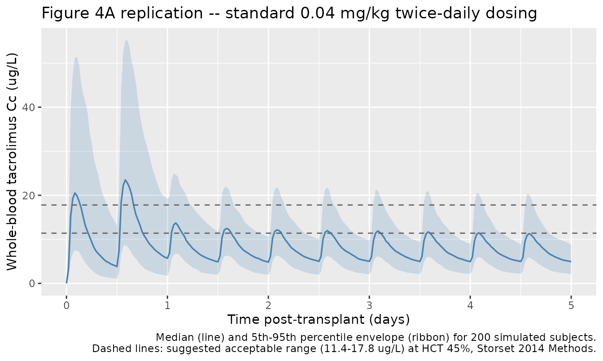
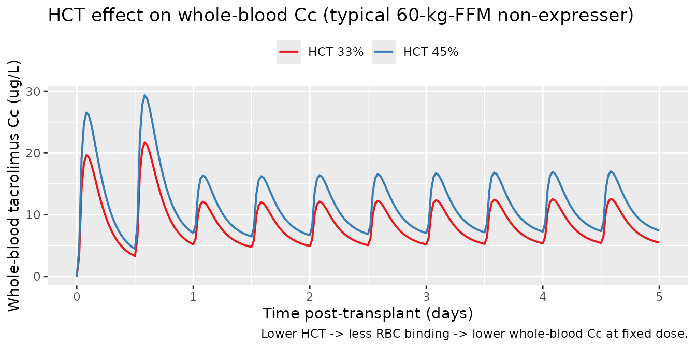
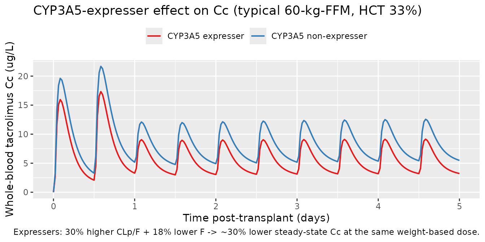

# Tacrolimus (Storset 2014)

``` r

library(nlmixr2lib)
library(rxode2)
#> rxode2 5.0.2 using 2 threads (see ?getRxThreads)
#>   no cache: create with `rxCreateCache()`
library(dplyr)
#> 
#> Attaching package: 'dplyr'
#> The following objects are masked from 'package:stats':
#> 
#>     filter, lag
#> The following objects are masked from 'package:base':
#> 
#>     intersect, setdiff, setequal, union
library(tidyr)
library(ggplot2)
library(PKNCA)
#> 
#> Attaching package: 'PKNCA'
#> The following object is masked from 'package:stats':
#> 
#>     filter
```

## Theory-based tacrolimus popPK in adult kidney-transplant recipients (Storset 2014)

Replicate the theory-based population pharmacokinetic model for oral
tacrolimus in adult kidney-transplant recipients reported by Storset et
al. (2014). The model is a two-compartment first-order-absorption +
lag-time disposition parameterised on **plasma** concentrations, with
allometric scaling on fat-free mass, CYP3A5-expresser effects on plasma
clearance and oral bioavailability, a sigmoid-Emax prednisolone-driven
reduction in bioavailability, a 2.68-fold first-day-post-transplant
bioavailability spike (with subject-level random effect on the spike),
and a saturable haematocrit-dependent red-blood-cell-binding equation
that converts plasma concentration to whole-blood concentration – the
matrix in which tacrolimus is clinically measured.

- Citation: Storset E, Holford N, Hennig S, Bergmann TK, Bergan S,
  Bremer S, Asberg A, Midtvedt K, Staatz CE. Improved prediction of
  tacrolimus concentrations early after kidney transplantation using
  theory-based pharmacokinetic modelling. Br J Clin Pharmacol.
  2014;78(3):509-523. <doi:10.1111/bcp.12361>
- Article: <https://doi.org/10.1111/bcp.12361>

## Population

Storset et al. pooled tacrolimus concentrations from two previously
independently analysed adult kidney-transplant cohorts: 173 subjects
from the Princess Alexandra Hospital, Brisbane, Australia, and 69
subjects from the Oslo University Hospital Rikshospitalet, Norway,
contributing 3,100 whole-blood tacrolimus concentrations. Median age was
48 years (range 23-71), median total body weight 80 kg (range 51-121),
median predicted fat-free mass 59 kg (range 35-80), 31.8% female, and
CYP3A5 genotype distribution *1/*1 = 1.2%, *1/*3 = 22.0%, *3/*3 = 84.7%
(Hardy-Weinberg-equilibrium; Storset 2014 Table 1). Sampling spanned the
first 3 months post-transplant predominantly, median 20 days
post-transplant. The independent external evaluation cohort comprised 72
additional Oslo subjects with 837 trough-only samples in the first 3
weeks post-transplant.

The same metadata is available programmatically:
`readModelDb("Storset_2014_tacrolimus")$population`.

## Source trace

Per-parameter origin is recorded as an in-file comment next to each
[`ini()`](https://nlmixr2.github.io/rxode2/reference/ini.html) entry in
`inst/modeldb/specificDrugs/Storset_2014_tacrolimus.R`. The table below
collects them in one place.

| Equation / parameter | Value | Source location |
|----|----|----|
| `lka` (Ka) | 1.01 1/h | Table 2 final theory-based model (RSE 9%) |
| `ltlag` (Tlag) | 0.41 h | Table 2 final theory-based model (RSE 8%) |
| `lcl` (CLp/F at FFM 60 kg) | 811 L/h | Table 2 footnote (original model equation) |
| `lvc` (V1p/F at FFM 60 kg) | 6290 L | Table 2 footnote (original model equation) |
| `lq` (Qp/F at FFM 60 kg) | 1200 L/h | Table 2 footnote (original model equation) |
| `lvp` (V2p/F at FFM 60 kg) | 32100 L | Table 2 footnote (original model equation) |
| `e_ffm_cl` (allometric on CL/F, Q/F) | 0.75 fixed | Methods Equation 2 (theory-based 3/4) |
| `e_ffm_vc` (allometric on V1/F, V2/F) | 1.00 fixed | Methods Equation 2 (theory-based 1) |
| `e_cyp3a5_exp_cl` (CL effect) | log(1.30) | Table 2 (CYP3A5 expresser CL factor 1.30; 95% CI 1.13, 1.46) |
| `e_cyp3a5_exp_fdepot` (F effect) | log(0.82) | Table 2 (CYP3A5 expresser F factor 0.82; 95% CI 0.71, 0.98) |
| `lfday1` (day-1 F factor) | log(2.68) | Table 2 (Fday1 factor 2.68; 95% CI 2.28, 3.09) |
| `pred_max` (Emax fractional reduction in F) | 0.67 | Table 2 (Predmax = -67%; 95% CI -41%, -89%) |
| `pred_50` (prednisolone half-max dose) | 35 mg/day | Table 2 (Pred50; 95% CI 7, 50) |
| Bmax (RBC-binding capacity, fixed) | 418 ug/L erythrocytes | Methods Equation 3, citing reference 35 |
| KD (RBC-binding equilibrium constant, fixed) | 3.8 ug/L plasma | Methods Equation 3, citing reference 35 |
| BSV CL/F (CV%) | 40% (corr CL-V1 0.43, CL-Q 0.62) | Table 2 |
| BSV V1/F (CV%) | 54% | Table 2 |
| BSV Q/F (CV%) | 63% | Table 2 |
| BSV Fday1 (CV%) | 57% | Table 2 |
| Proportional residual error (CV%) | 14.9% | Table 2 (RSE 4%) |
| Cwb = Cp \* (1 + Bmax \* fHCT / (Cp + KD)) | – | Methods Equation 3 |

## Virtual cohort

Original observed data are not publicly available. The figures below use
a virtual cohort whose covariate distributions approximate the published
trial demographics (Storset 2014 Table 1). For tractability we simulate
200 subjects over the first 5 days post-transplant on a standard
weight-based starting regimen of 0.04 mg/kg twice daily (Oslo protocol),
with the day-1 post-transplant indicator switching from 1 to 0 at 24 h
and prednisolone held at 20 mg/day (Oslo protocol initial dose).

``` r

set.seed(20140520)  # paper's online publication date 20 Feb 2014, plus seed nonce
n_sub <- 200L

# Subject-level (time-fixed) covariates: FFM, CYP3A5_EXPR, total body weight.
subjects <- tibble::tibble(
  id          = seq_len(n_sub),
  FFM         = pmax(35, pmin(80, rnorm(n_sub, mean = 59, sd = 10))),  # Storset 2014 Table 1: median 59, range 35-80
  total_wt    = pmax(51, pmin(121, rnorm(n_sub, mean = 80, sd = 14))),  # median 80, range 51-121
  CYP3A5_EXPR  = rbinom(n_sub, 1, 0.226)  # 22.6% expressers (Hardy-Weinberg, 56/241)
)

# Dose: 0.04 mg/kg total body weight, twice daily, for 5 days post-transplant.
dose_mg_per_admin <- subjects |>
  dplyr::transmute(id, amt = 0.04 * total_wt)

dose_times <- seq(0, by = 12, length.out = 10)  # 10 doses over 5 days

dosing <- tidyr::expand_grid(
  dose_mg_per_admin |> dplyr::select(id, amt),
  time = dose_times
) |>
  dplyr::mutate(evid = 1L, cmt = "depot")

# Observation grid: 5 days, sparse enough to keep the vignette fast.
obs_times <- sort(unique(c(seq(0, 5*24, by = 0.5), dose_times)))
obs <- tidyr::expand_grid(
  subjects |> dplyr::select(id),
  time = obs_times
) |>
  dplyr::mutate(evid = 0L, amt = 0, cmt = NA_character_)

events <- dplyr::bind_rows(dosing, obs) |>
  dplyr::arrange(id, time, dplyr::desc(evid)) |>
  dplyr::left_join(subjects |> dplyr::select(id, FFM, CYP3A5_EXPR), by = "id") |>
  dplyr::mutate(
    # Time-varying covariates: HCT taper down across the first week (median
    # 36% pre-transplant declining to ~30% by day 7, consistent with
    # Storset 2014 Figure 2A range), POSTTX_DAY1 indicator switching at 24h,
    # and prednisolone held flat at 20 mg/day.
    HCT          = pmax(25, 36 - (time / (5 * 24)) * 6),
    POSTTX_DAY1  = as.integer(time < 24),
    PRED_DOSE    = 20
  )

# Disjoint-id assertion (multi-cohort guard from the vignette template).
stopifnot(!anyDuplicated(unique(events[, c("id", "time", "evid")])))

# Quick covariate sanity-check.
events |>
  dplyr::filter(evid == 0) |>
  dplyr::summarise(
    n_id          = dplyr::n_distinct(id),
    ffm_median    = median(FFM),
    cyp_pct       = mean(CYP3A5_EXPR) * 100,
    hct_min       = round(min(HCT), 2),
    hct_max       = round(max(HCT), 2),
    day1_obs_pct  = round(100 * mean(POSTTX_DAY1[time > 0]), 1)
  ) |>
  knitr::kable(caption = "Cohort summary across observation rows.")
```

| n_id | ffm_median | cyp_pct | hct_min | hct_max | day1_obs_pct |
|-----:|-----------:|--------:|--------:|--------:|-------------:|
|  200 |   60.19532 |      20 |      30 |      36 |         19.6 |

Cohort summary across observation rows. {.table}

## Simulation

``` r

mod <- readModelDb("Storset_2014_tacrolimus")

sim <- rxode2::rxSolve(
  mod, events = events,
  keep   = c("FFM", "HCT", "CYP3A5_EXPR", "PRED_DOSE", "POSTTX_DAY1"),
  nStud  = 1L
) |>
  as.data.frame()
#> ℹ parameter labels from comments will be replaced by 'label()'
```

## Replicate Figure 4 – standard-dose concentration-time profiles

The figure below mirrors **Storset 2014 Figure 4A** (covariate-based
dosing simulations across 1,000 subjects over 5 days). We render the
median and 5th-95th percentile envelope of the simulated whole-blood
tacrolimus concentration for the 200-subject virtual cohort, alongside
the suggested-acceptable-range thresholds (11.4-17.8 ug/L average
steady-state concentration standardised to a haematocrit of 45%, derived
in Storset 2014 Methods “Evaluation of dosing strategies” from a target
average concentration of 14.2 ug/L). Note that the displayed Cc here is
the **as-observed** whole-blood concentration (haematocrit-dependent);
the published standardised-to-HCT-45% concentration is computed below
(see “Comparison against published values”).

``` r

sim_summary <- sim |>
  dplyr::filter(time <= 5 * 24) |>
  dplyr::group_by(time) |>
  dplyr::summarise(
    Q05 = quantile(Cc, 0.05, na.rm = TRUE),
    Q50 = quantile(Cc, 0.50, na.rm = TRUE),
    Q95 = quantile(Cc, 0.95, na.rm = TRUE),
    .groups = "drop"
  )

ggplot(sim_summary, aes(time / 24, Q50)) +
  geom_ribbon(aes(ymin = Q05, ymax = Q95), alpha = 0.2, fill = "steelblue") +
  geom_line(colour = "steelblue", linewidth = 0.6) +
  geom_hline(yintercept = c(11.4, 17.8), linetype = "dashed", colour = "grey40") +
  scale_x_continuous(breaks = 0:5) +
  labs(
    x = "Time post-transplant (days)",
    y = "Whole-blood tacrolimus Cc (ug/L)",
    title = "Figure 4A replication -- standard 0.04 mg/kg twice-daily dosing",
    caption = paste(
      "Median (line) and 5th-95th percentile envelope (ribbon) for 200 simulated",
      "subjects.\nDashed lines: suggested acceptable range",
      "(11.4-17.8 ug/L) at HCT 45%, Storset 2014 Methods.",
      sep = " "
    )
  )
```



## Replicate Figure 1A / 2 – influence of haematocrit and CYP3A5 on Cc

The model’s two distinguishing structural features are (i) the saturable
RBC-binding equation that links plasma to whole-blood concentration via
haematocrit, and (ii) the CYP3A5-expresser factor on CL and F. The next
two panels show, at typical-value (zero-eta) simulation, how each of
those covariates moves the steady-state trough.

``` r

ui_typ <- mod |> rxode2::zeroRe()
#> ℹ parameter labels from comments will be replaced by 'label()'

# Build a 2-arm event table differing only in HCT (33% vs 45%).
arm_hct <- function(hct_pct, id) {
  amt_per <- 0.04 * 80
  dose_t  <- seq(0, by = 12, length.out = 10)
  obs_t   <- sort(unique(c(seq(0, 5*24, by = 0.5), dose_t)))
  ev <- dplyr::bind_rows(
    tibble::tibble(id, time = dose_t, amt = amt_per, evid = 1L, cmt = "depot"),
    tibble::tibble(id, time = obs_t,  amt = 0,       evid = 0L, cmt = NA_character_)
  ) |>
    dplyr::arrange(time, dplyr::desc(evid))
  ev$FFM         <- 60
  ev$HCT         <- hct_pct
  ev$CYP3A5_EXPR  <- 0L
  ev$PRED_DOSE   <- 20
  ev$POSTTX_DAY1 <- as.integer(ev$time < 24)
  ev$arm         <- sprintf("HCT %s%%", hct_pct)
  ev
}
ev_hct <- dplyr::bind_rows(arm_hct(33, 1L), arm_hct(45, 2L))

sim_hct <- rxode2::rxSolve(ui_typ, events = ev_hct,
                           keep = c("HCT", "arm")) |>
  as.data.frame()
#> ℹ omega/sigma items treated as zero: 'etalq', 'etalcl', 'etalvc', 'etalfday1'
#> Warning: multi-subject simulation without without 'omega'

ggplot(sim_hct, aes(time / 24, Cc, colour = arm)) +
  geom_line(linewidth = 0.7) +
  scale_colour_brewer(palette = "Set1") +
  scale_x_continuous(breaks = 0:5) +
  labs(
    x = "Time post-transplant (days)",
    y = "Whole-blood tacrolimus Cc (ug/L)",
    colour = NULL,
    title = "HCT effect on whole-blood Cc (typical 60-kg-FFM non-expresser)",
    caption = "Lower HCT -> less RBC binding -> lower whole-blood Cc at fixed dose."
  ) +
  theme(legend.position = "top")
```



``` r

arm_cyp <- function(cyp, id) {
  amt_per <- 0.04 * 80
  dose_t  <- seq(0, by = 12, length.out = 10)
  obs_t   <- sort(unique(c(seq(0, 5*24, by = 0.5), dose_t)))
  ev <- dplyr::bind_rows(
    tibble::tibble(id, time = dose_t, amt = amt_per, evid = 1L, cmt = "depot"),
    tibble::tibble(id, time = obs_t,  amt = 0,       evid = 0L, cmt = NA_character_)
  ) |>
    dplyr::arrange(time, dplyr::desc(evid))
  ev$FFM         <- 60
  ev$HCT         <- 33
  ev$CYP3A5_EXPR  <- cyp
  ev$PRED_DOSE   <- 20
  ev$POSTTX_DAY1 <- as.integer(ev$time < 24)
  ev$arm         <- if (cyp == 1L) "CYP3A5 expresser" else "CYP3A5 non-expresser"
  ev
}
ev_cyp <- dplyr::bind_rows(arm_cyp(0L, 1L), arm_cyp(1L, 2L))

sim_cyp <- rxode2::rxSolve(ui_typ, events = ev_cyp,
                           keep = c("CYP3A5_EXPR", "arm")) |>
  as.data.frame()
#> ℹ omega/sigma items treated as zero: 'etalq', 'etalcl', 'etalvc', 'etalfday1'
#> Warning: multi-subject simulation without without 'omega'

ggplot(sim_cyp, aes(time / 24, Cc, colour = arm)) +
  geom_line(linewidth = 0.7) +
  scale_colour_brewer(palette = "Set1") +
  scale_x_continuous(breaks = 0:5) +
  labs(
    x = "Time post-transplant (days)",
    y = "Whole-blood tacrolimus Cc (ug/L)",
    colour = NULL,
    title = "CYP3A5-expresser effect on Cc (typical 60-kg-FFM, HCT 33%)",
    caption = paste(
      "Expressers: 30% higher CLp/F + 18% lower F -> ~30% lower steady-state",
      "Cc at the same weight-based dose."
    )
  ) +
  theme(legend.position = "top")
```



## PKNCA validation

Steady-state PKNCA on the last full dosing interval (day 5, hour
96-108). Day-1 effects and prednisolone-induced reduction are at steady
state in this window (POSTTX_DAY1 = 0 throughout). PKNCA computes
Cmax,ss, Cmin,ss, Cavg,ss, and AUC0-tau per the convention in
`references/pknca-recipes.md` (Recipe 3).

``` r

tau      <- 12
start_ss <- 96
end_ss   <- start_ss + tau

sim_nca <- sim |>
  dplyr::filter(!is.na(Cc), time >= start_ss, time <= end_ss) |>
  dplyr::mutate(arm = "0.04 mg/kg BID") |>
  dplyr::select(id, time, Cc, arm)

dose_df <- events |>
  dplyr::filter(evid == 1) |>
  dplyr::mutate(arm = "0.04 mg/kg BID") |>
  dplyr::select(id, time, amt, arm)

conc_obj <- PKNCA::PKNCAconc(sim_nca, Cc ~ time | arm + id,
                             concu = "ug/L", timeu = "h")
dose_obj <- PKNCA::PKNCAdose(dose_df, amt ~ time | arm + id,
                             doseu = "mg")

intervals <- data.frame(
  start    = start_ss,
  end      = end_ss,
  cmax     = TRUE,
  tmax     = TRUE,
  cmin     = TRUE,
  cav      = TRUE,
  auclast  = TRUE
)

nca_res <- PKNCA::pk.nca(PKNCA::PKNCAdata(conc_obj, dose_obj,
                                          intervals = intervals))

nca_tbl <- as.data.frame(nca_res$result) |>
  dplyr::group_by(PPTESTCD) |>
  dplyr::summarise(
    median_value = round(median(PPORRES, na.rm = TRUE), 2),
    Q05          = round(quantile(PPORRES, 0.05, na.rm = TRUE), 2),
    Q95          = round(quantile(PPORRES, 0.95, na.rm = TRUE), 2),
    .groups = "drop"
  )
knitr::kable(nca_tbl,
             caption = "Simulated NCA at steady state (day 5 dosing interval; n = 200).")
```

| PPTESTCD | median_value |   Q05 |    Q95 |
|:---------|-------------:|------:|-------:|
| auclast  |        91.61 | 43.58 | 151.34 |
| cav      |         7.63 |  3.63 |  12.61 |
| cmax     |        11.51 |  6.02 |  20.70 |
| cmin     |         4.93 |  2.15 |   8.80 |
| tmax     |         2.00 |  1.50 |   2.50 |

Simulated NCA at steady state (day 5 dosing interval; n = 200). {.table}

### Comparison against published values

Storset 2014 reports a target average steady-state whole-blood
concentration standardised to haematocrit 45% (Cstd,HCT45 = Cwb x 45% /
HCT) of 14.2 ug/L with a suggested acceptable range of 11.4-17.8 ug/L
(Methods, “Evaluation of dosing strategies”). The HCT-standardisation
removes the inter-subject haematocrit variability so that simulated
values are comparable across patients independent of their RBC-binding
state.

``` r

sim_ss <- sim |>
  dplyr::filter(time >= start_ss, time <= end_ss) |>
  dplyr::mutate(Cstd_hct45 = Cc * 45 / HCT) |>
  dplyr::group_by(id) |>
  dplyr::summarise(
    Cavg_obs        = mean(Cc, na.rm = TRUE),
    Cavg_std_hct45  = mean(Cstd_hct45, na.rm = TRUE),
    .groups = "drop"
  )

comparison <- tibble::tibble(
  Quantity = c(
    "Median Cavg,ss (whole-blood, as-is)",
    "Median Cavg,ss (Cstd,HCT45)",
    "Storset 2014 target Cstd,HCT45",
    "Storset 2014 acceptable range Cstd,HCT45"
  ),
  Value = c(
    sprintf("%.1f ug/L (5th-95th %.1f-%.1f)",
            median(sim_ss$Cavg_obs),
            quantile(sim_ss$Cavg_obs, 0.05),
            quantile(sim_ss$Cavg_obs, 0.95)),
    sprintf("%.1f ug/L (5th-95th %.1f-%.1f)",
            median(sim_ss$Cavg_std_hct45),
            quantile(sim_ss$Cavg_std_hct45, 0.05),
            quantile(sim_ss$Cavg_std_hct45, 0.95)),
    "14.2 ug/L",
    "11.4-17.8 ug/L"
  )
)
knitr::kable(comparison,
             caption = "Steady-state Cavg under standard 0.04 mg/kg BID dosing vs published target.")
```

| Quantity                                 | Value                         |
|:-----------------------------------------|:------------------------------|
| Median Cavg,ss (whole-blood, as-is)      | 7.5 ug/L (5th-95th 3.6-12.4)  |
| Median Cavg,ss (Cstd,HCT45)              | 11.0 ug/L (5th-95th 5.2-18.1) |
| Storset 2014 target Cstd,HCT45           | 14.2 ug/L                     |
| Storset 2014 acceptable range Cstd,HCT45 | 11.4-17.8 ug/L                |

Steady-state Cavg under standard 0.04 mg/kg BID dosing vs published
target. {.table}

The published Storset 2014 dosing-strategy simulation (Figure 4A; 1,000
subjects with the original covariate distribution) reports that 32% of
weight-based-dose subjects have Cstd,HCT45 within the 11.4-17.8 ug/L
acceptable range. The fraction of in-range subjects in this simulation
is included below for reference; small differences vs the paper reflect
(a) the simplified flat-prednisolone (no taper) and flat-HCT-decline
assumptions, (b) omission of the model’s between-occasion variability
components (BOV 23% on F and 120% on ka, see “Assumptions and
deviations”), and (c) the smaller (n = 200) sample size.

``` r

in_range_pct <- 100 * mean(sim_ss$Cavg_std_hct45 >= 11.4 &
                            sim_ss$Cavg_std_hct45 <= 17.8)
cat(sprintf("Simulated fraction within acceptable Cstd,HCT45 range: %.1f%%\n",
            in_range_pct))
#> Simulated fraction within acceptable Cstd,HCT45 range: 38.5%
cat("Storset 2014 Figure 4A reports 32% (95% CI 29-35%) for the same regimen.\n")
#> Storset 2014 Figure 4A reports 32% (95% CI 29-35%) for the same regimen.
```

## Assumptions and deviations

- **Between-occasion variability (BOV) is not implemented.** Storset
  2014 Table 2 retains BOV of 23% CV on F and 120% CV on ka in the final
  theory-based model. Implementing BOV requires an OCC column in the
  event table and per-occasion etas, which are not part of the standard
  nlmixr2lib model file shape. The simulated total-variability envelope
  is therefore somewhat narrower than the published one. Users who need
  BOV in simulations should add per-occasion etas to F and ka in their
  own copy of the model.
- **Methylprednisolone single-dose induction-bolus indicator is not
  implemented.** Storset 2014 tested but did not retain a binary
  indicator for “received vs not received methylprednisolone single
  bolus” on CLp and F (no statistically significant effect at the dose
  range observed); the final model does not carry this covariate.
- **Haematocrit and prednisolone tapers are simplified.** The vignette
  uses a linear HCT decline from 36% to 30% over 5 days and a flat 20
  mg/day prednisolone schedule. Storset 2014 used time-varying
  per-occasion measurements of both HCT and the conmed_steroid taper as
  fed by the source dataset; no closed-form taper is published.
- **Storset 2014 does not report subject-level race / ethnicity.** The
  CYP3A5 *3/*3 frequency of 84.7% is consistent with a predominantly
  Caucasian cohort; the cohort is not stratified by ancestry in the
  source paper.
- **Year mismatch with the task identifier.** The task ID is
  `025-storset_2013` (so the worktree branch is
  `claude/025-storset_2013`), but the source publication appeared in Br
  J Clin Pharmacol 78(3) (2014; accepted 16 February 2014, published
  online 20 February 2014, in print September 2014). The model file and
  vignette use `Storset_2014_tacrolimus` as the canonical name to match
  the published year.
