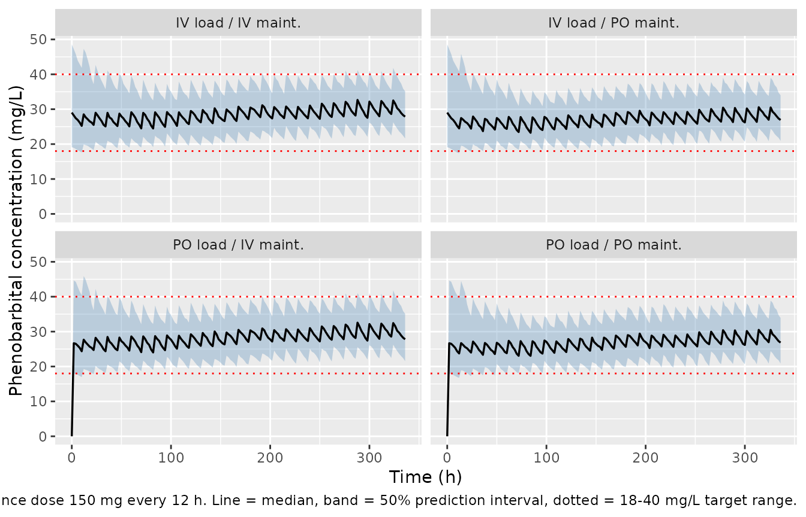

# Phenobarbital (Stoschus 2025)

## Model and source

- Citation: Stoschus M, Schmidbauer ML, Starp J, Kunst S, Gakis G, Paal
  M, Vogeser M, Scharf-Janssen C, Liebchen U, Dimitriadis K (2025).
  Optimizing phenobarbital dosing in critically ill patients with
  refractory and superrefractory status epilepticus using a population
  pharmacokinetic model. Epilepsia 66(11):3757-3768.
  <doi:10.1111/epi.18517>.
- Description: One-compartment population PK model for oral and
  intravenous phenobarbital in critically ill adults with refractory and
  superrefractory status epilepticus (Stoschus 2025), with first-order
  absorption (ka fixed at 1.9 /h from Viswanathan 1979 because the
  therapeutic-drug-monitoring samples were taken after the absorption
  phase), estimated oral bioavailability F = 0.96, and ideal body weight
  entering as allometric scaling on both volume of distribution
  (exponent 1) and clearance (exponent 0.75), centered on the cohort
  median IBW of 68.8 kg. Interindividual variability is carried on V and
  CL, interoccasion variability on CL across consecutive TDM sampling
  intervals, with a proportional residual-error model.
- Article: <https://doi.org/10.1111/epi.18517>

Stoschus 2025 developed a population pharmacokinetic model for
phenobarbital in critically ill adults treated for refractory (RSE) and
superrefractory (SRSE) status epilepticus, and used it to derive
ideal-body-weight-based loading and maintenance dosing recommendations
for a 12-h dosing schedule.

The structural model is one compartment with first-order absorption and
first-order elimination. The absorption rate constant could not be
estimated because most therapeutic drug monitoring (TDM) samples were
drawn after the absorption phase, so it was fixed to a literature value.
Ideal body weight (IBW) was the only covariate retained, entering as
classical allometric scaling on both volume of distribution and
clearance.

``` r

mod <- readModelDb("Stoschus_2025_phenobarbital")
ui <- rxode2::rxode(mod)
#> Warning: some etas defaulted to non-mu referenced, possible parsing error: etaiov_cl_1, etaiov_cl_2, etaiov_cl_3, etaiov_cl_4, etaiov_cl_5, etaiov_cl_6, etaiov_cl_7, etaiov_cl_8
#> as a work-around try putting the mu-referenced expression on a simple line
```

## Population

The model was fit to 301 TDM samples from 37 adults treated between 2015
and 2024 at a single German neurointensive care unit (Stoschus 2025
Table 1). Thirty-five patients (95%) had superrefractory status
epilepticus and two (5%) refractory status epilepticus; the median
Status Epilepticus Severity Score was 5. Thirteen patients (35%) were
female and the median age was 63 years (5th-95th percentile 24-83).
Median total body weight was 78.5 kg and median ideal body weight 68.8
kg – the latter is the reference for the allometric terms. Renal
function was largely preserved (median estimated glomerular filtration
rate 102 mL/min, median serum creatinine 0.7 mg/dL), with three patients
(8%) on renal replacement therapy.

Patients received guideline-directed loading doses of 10-20 mg/kg and
maintenance doses of 1-4 mg/kg over a median treatment duration of 16
days (median administered dose 200 mg). Of 1242 doses, 824 (66%) were
oral – tablets dispersed in water and given via gastric tube – and 418
(34%) were intravenous 5-min infusions. The median observed
phenobarbital concentration was 32.8 mg/L, with a median of 6 TDM
samples per patient.

``` r

str(ui$population)
#> List of 13
#>  $ species       : chr "human"
#>  $ n_subjects    : int 37
#>  $ n_studies     : int 1
#>  $ age_range     : chr "24.0-83.0 years (5th-95th percentile); all patients >= 18 years by inclusion criterion"
#>  $ age_median    : chr "63.0 years"
#>  $ weight_range  : chr "51.7-93.3 kg total body weight (5th-95th percentile)"
#>  $ weight_median : chr "78.5 kg total body weight; 68.8 kg ideal body weight (the allometric-scaling reference)"
#>  $ sex_female_pct: num 35.1
#>  $ race_ethnicity: chr "Not reported."
#>  $ disease_state : chr "Refractory (2 patients, 5%) and superrefractory (35 patients, 95%) status epilepticus in a neurointensive care "| __truncated__
#>  $ dose_range    : chr "Guideline-directed phenobarbital: loading doses 10-20 mg/kg and maintenance doses 1-4 mg/kg, median administere"| __truncated__
#>  $ regions       : chr "Germany (single center: LMU University Hospital, Munich)."
#>  $ notes         : chr "Retrospective single-center cohort of patients treated 2015-2024, contributing 301 therapeutic-drug-monitoring "| __truncated__
```

## Source trace

Every `ini()` entry carries an in-file comment naming its origin in
`inst/modeldb/specificDrugs/Stoschus_2025_phenobarbital.R`. The table
collects them for review.

| Equation / parameter | Value | Source location |
|----|----|----|
| `lfdepot` (F) | 0.96 | Table 2, row `F` (RSE 3.95%; 95% CI 0.85-0.99) |
| `lka` (ka, fixed) | 1.9 /h | Table 2, row `k a, h-1` with footnote “ka was fixed according to literature values”; Methods 2.2 |
| `lvc` (V) | 34.3 L | Table 2, row `V, L` (RSE 12.7%; 95% CI 26.81-43.89) |
| `lcl` (CL) | 0.38 L/h | Table 2, row `CL, L/h` (RSE 7.81%; 95% CI 0.32-0.44) |
| `e_ibw_vc` (fixed) | 1 | Results 3.2, Equation 1: `V_i = V * (IBW_i / medIBW)^1` |
| `e_ibw_cl` (fixed) | 0.75 | Results 3.2, Equation 2: `CL_i = CL * (IBW_i / medIBW)^0.75` |
| reference `medIBW` | 68.8 kg | Table 1, row “Ideal body weight, kg” (cohort median) |
| `etalvc` | 0.50799 | Table 2 IIV row `V`: SD 0.71, CV 81.36%; `omega^2 = log(1 + 0.8136^2)` |
| `etalcl` | 0.157914 | Table 2 IIV row `CL`: SD 0.4, CV 41.36%; `omega^2 = log(1 + 0.4136^2)` |
| `etaiov_cl_1..8` | 0.127331 | Table 2 IOV row `CL`: SD 0.36, CV 36.85%; `omega^2 = log(1 + 0.3685^2)` |
| `propSd` | 0.082 | Table 2, row `Proportional` (RSE 7.76%; 95% CI 0.071-0.096) |
| one-compartment, first-order absorption and elimination | n/a | Methods 2.2; Results 3.2 |
| IIV on V and CL, IOV on CL, proportional RUV | n/a | Results 3.2, first paragraph |

The two structural equations are printed in the article as images; the
exponents were read from the PDF text layer as `^1` on V (Equation 1)
and `^.75` on CL (Equation 2).

### Variance scale

Table 2 reports interindividual and interoccasion variability as an SD
(rounded to two significant figures) alongside a CV% (four significant
figures). Methods 2.2 states that a lognormal distribution was assumed.
Round-tripping each row through the lognormal relation confirms the SD
column is the omega on the log scale, so the variances used here are
back-solved from the more precise CV%.

``` r

tibble::tibble(
  parameter = c("IIV V", "IIV CL", "IOV CL"),
  cv_pct    = c(81.36, 41.36, 36.85),
  sd_printed = c(0.71, 0.40, 0.36)
) |>
  mutate(
    omega2       = log(1 + (cv_pct / 100)^2),
    sd_backsolved = sqrt(omega2),
    cv_roundtrip = 100 * sqrt(exp(sd_printed^2) - 1)
  ) |>
  knitr::kable(digits = 4, caption =
    "The printed SD reproduces the printed CV% and vice versa, confirming the lognormal log-scale reading.")
```

| parameter | cv_pct | sd_printed | omega2 | sd_backsolved | cv_roundtrip |
|:----------|-------:|-----------:|-------:|--------------:|-------------:|
| IIV V     |  81.36 |       0.71 | 0.5080 |        0.7127 |      80.9626 |
| IIV CL    |  41.36 |       0.40 | 0.1579 |        0.3974 |      41.6546 |
| IOV CL    |  36.85 |       0.36 | 0.1273 |        0.3568 |      37.1985 |

The printed SD reproduces the printed CV% and vice versa, confirming the
lognormal log-scale reading. {.table}

## Typical-value checks

Two quantities are fixed by the structural parameters and can be checked
in closed form before any simulation.

The paper states an elimination half-life of 62.6 h, “derived from our
estimated population-specific parameters” (Methods 2.3), which it used
to justify assessing steady-state trough concentrations at t = 336 h.

``` r

V  <- 34.3
CL <- 0.38
c(published_h = 62.6, closed_form_h = log(2) * V / CL)
#>   published_h closed_form_h 
#>      62.60000      62.56565
```

Results 3.2 also reports the weight-normalised typical values obtained
when dividing by the cohort median *total* body weight of 78.5 kg.

``` r

c(V_L_per_kg_paper = 0.44, V_L_per_kg_model = V / 78.5,
  CL_L_h_kg_paper = 0.0048, CL_L_h_kg_model = CL / 78.5)
#> V_L_per_kg_paper V_L_per_kg_model  CL_L_h_kg_paper  CL_L_h_kg_model 
#>      0.440000000      0.436942675      0.004800000      0.004840764
```

## Virtual cohort and simulation

Original patient data are not public. Simulations below use virtual
cohorts whose ideal body weights are the discrete values the paper
simulated (55-80 kg in 5-kg steps), all inside the observed cohort range
of 52.4-82.4 kg.

Occasions follow the paper’s definition – the interval between
consecutive TDM samples, cohort median 48 h – so the `OCC` column
advances every 48 h and is capped at the eight occasions the model file
encodes.

``` r

occ_of <- function(time) pmin(floor(time / 48) + 1, 8)

# Build one 12-h-schedule regimen: loading dose at t = 0, maintenance doses
# every 12 h thereafter, observed on `obs_times`.
regimen <- function(ld, md, route, ibw, obs_times, last_dose = 324) {
  cmt <- if (identical(route, "IV")) "central" else "depot"
  ev <- rxode2::et(amt = ld, cmt = cmt, time = 0)
  if (md > 0) {
    for (tt in seq(12, last_dose, by = 12)) {
      ev <- rxode2::et(ev, amt = md, cmt = cmt, time = tt)
    }
  }
  ev <- rxode2::et(ev, obs_times, cmt = "central")
  d <- as.data.frame(ev)
  d$IBW <- ibw
  d$OCC <- occ_of(d$time)
  d
}

# Solve a cohort. The seed is set immediately before every rxSolve so that
# runs sharing a seed and an event-table shape draw the *same* subjects --
# common random numbers, which is what makes dose grids comparable.
solve_cohort <- function(events, n, seed) {
  set.seed(seed)
  as.data.frame(rxode2::rxSolve(ui, events, nSub = n, returnType = "data.frame"))
}
```

### Instrument check: are the published omegas actually realised?

Before using the cohort to judge the model, confirm the simulated cohort
reproduces the parameters that were put into it. A validation built on a
mis-drawn cohort measures nothing.

``` r

chk <- solve_cohort(regimen(1000, 0, "IV", 68.8, 12), n = 2000L, seed = 11L) |>
  filter(time == 12)
#> Warning: some etas defaulted to non-mu referenced, possible parsing error: etaiov_cl_1, etaiov_cl_2, etaiov_cl_3, etaiov_cl_4, etaiov_cl_5, etaiov_cl_6, etaiov_cl_7, etaiov_cl_8
#> as a work-around try putting the mu-referenced expression on a simple line

tibble::tibble(
  quantity = c("median V (L)", "median CL (L/h)", "sd(log V)", "sd(log CL)"),
  simulated = c(median(chk$vc), median(chk$cl), sd(log(chk$vc)), sd(log(chk$cl))),
  expected  = c(34.3, 0.38, sqrt(0.50799), sqrt(0.157914 + 0.127331))
) |>
  mutate(pct_diff = 100 * (simulated - expected) / expected) |>
  knitr::kable(digits = 4, caption =
    "Simulated cohort reproduces the published typical values and the IIV (V) and IIV+IOV (CL) log-scale spreads.")
```

| quantity        | simulated | expected | pct_diff |
|:----------------|----------:|---------:|---------:|
| median V (L)    |   34.4200 |  34.3000 |   0.3498 |
| median CL (L/h) |    0.3840 |   0.3800 |   1.0446 |
| sd(log V)       |    0.7012 |   0.7127 |  -1.6155 |
| sd(log CL)      |    0.5349 |   0.5341 |   0.1457 |

Simulated cohort reproduces the published typical values and the IIV (V)
and IIV+IOV (CL) log-scale spreads. {.table}

The clearance spread combines the interindividual and interoccasion
terms, because at any single time point a subject carries one IIV draw
and one occasion’s IOV draw.

## Replicating Figure 2

Figure 2 of Stoschus 2025 shows concentration-time profiles at IBW 70 kg
for a 12-h schedule with the optimal loading dose of 1100 mg and
maintenance dose of 150 mg, across the four combinations of loading and
maintenance route, with the median, the 50% prediction interval, and the
18-40 mg/L target band.

``` r

obs_grid <- sort(unique(c(seq(0, 336, by = 2), 12, 336)))

fig2 <- bind_rows(lapply(
  list(c("IV", "IV"), c("IV", "PO"), c("PO", "IV"), c("PO", "PO")),
  function(rr) {
    ld_route <- rr[1]; md_route <- rr[2]
    # Loading and maintenance routes can differ, so build the two dose blocks
    # separately and bind them.
    cmt_ld <- if (ld_route == "IV") "central" else "depot"
    cmt_md <- if (md_route == "IV") "central" else "depot"
    ev <- rxode2::et(amt = 1100, cmt = cmt_ld, time = 0)
    for (tt in seq(12, 324, by = 12)) ev <- rxode2::et(ev, amt = 150, cmt = cmt_md, time = tt)
    ev <- rxode2::et(ev, obs_grid, cmt = "central")
    d <- as.data.frame(ev); d$IBW <- 70; d$OCC <- occ_of(d$time)
    solve_cohort(d, n = 200L, seed = 303L) |>
      mutate(arm = paste0(ld_route, " load / ", md_route, " maint."))
  }
))

fig2 |>
  group_by(arm, time) |>
  summarise(Q25 = quantile(Cc, 0.25), Q50 = median(Cc), Q75 = quantile(Cc, 0.75),
            .groups = "drop") |>
  ggplot(aes(time, Q50)) +
  geom_ribbon(aes(ymin = Q25, ymax = Q75), alpha = 0.3, fill = "steelblue") +
  geom_line(linewidth = 0.6) +
  geom_hline(yintercept = c(18, 40), linetype = "dotted", colour = "red") +
  facet_wrap(~arm) +
  labs(x = "Time (h)", y = "Phenobarbital concentration (mg/L)",
       caption = paste("Replicates Figure 2 of Stoschus 2025: IBW 70 kg, loading dose 1100 mg,",
                       "maintenance dose 150 mg every 12 h. Line = median,",
                       "band = 50% prediction interval, dotted = 18-40 mg/L target range."))
```



As the paper reports, the intravenous and oral profiles are nearly
indistinguishable – a direct consequence of the 96% oral
bioavailability.

``` r

fig2 |>
  filter(time == 336) |>
  group_by(arm) |>
  summarise(median_Cmin = median(Cc), .groups = "drop") |>
  knitr::kable(digits = 2, caption =
    "Trough at t = 336 h by route combination; oral and intravenous agree closely.")
```

| arm                 | median_Cmin |
|:--------------------|------------:|
| IV load / IV maint. |       27.87 |
| IV load / PO maint. |       26.92 |
| PO load / IV maint. |       27.80 |
| PO load / PO maint. |       26.86 |

Trough at t = 336 h by route combination; oral and intravenous agree
closely. {.table}

## PKNCA validation

NCA is run on a typical-value single-dose profile, where each parameter
has an exact closed-form counterpart. Using `zeroRe()` matters here:
with an 81% CV on volume the population *mean* profile is not the
typical-value profile, so a cohort median would not be comparable to a
closed-form identity.

``` r

ui_typ <- rxode2::zeroRe(ui)
#> Warning: some etas defaulted to non-mu referenced, possible parsing error: etaiov_cl_1, etaiov_cl_2, etaiov_cl_3, etaiov_cl_4, etaiov_cl_5, etaiov_cl_6, etaiov_cl_7, etaiov_cl_8
#> as a work-around try putting the mu-referenced expression on a simple line

nca_events <- regimen(1000, 0, "IV", 68.8, obs_times = sort(unique(
  c(seq(0, 24, by = 0.25), seq(24, 720, by = 2))
)))
set.seed(404L)
sim_nca_raw <- as.data.frame(
  rxode2::rxSolve(ui_typ, nca_events, returnType = "data.frame")
)
#> Warning: some etas defaulted to non-mu referenced, possible parsing error: etaiov_cl_1, etaiov_cl_2, etaiov_cl_3, etaiov_cl_4, etaiov_cl_5, etaiov_cl_6, etaiov_cl_7, etaiov_cl_8
#> as a work-around try putting the mu-referenced expression on a simple line
#> ℹ omega/sigma items treated as zero: 'etalvc', 'etalcl', 'etaiov_cl_1', 'etaiov_cl_2', 'etaiov_cl_3', 'etaiov_cl_4', 'etaiov_cl_5', 'etaiov_cl_6', 'etaiov_cl_7', 'etaiov_cl_8'
if (is.null(sim_nca_raw$id)) sim_nca_raw$id <- 1L

sim_nca <- sim_nca_raw |>
  filter(!is.na(Cc)) |>
  mutate(treatment = "1000 mg IV, typical value") |>
  select(id, time, Cc, treatment)

# Guarantee a time-zero anchor for AUC.
sim_nca <- bind_rows(
  sim_nca,
  sim_nca |> distinct(id, treatment) |> mutate(time = 0, Cc = 0)
) |>
  distinct(id, treatment, time, .keep_all = TRUE) |>
  arrange(id, treatment, time)

conc_obj <- PKNCA::PKNCAconc(sim_nca, Cc ~ time | treatment + id)

dose_df <- data.frame(id = 1L, time = 0, amt = 1000,
                      treatment = "1000 mg IV, typical value")
dose_obj <- PKNCA::PKNCAdose(dose_df, amt ~ time | treatment + id)

nca_res <- PKNCA::pk.nca(PKNCA::PKNCAdata(
  conc_obj, dose_obj,
  intervals = data.frame(start = 0, end = Inf,
                         cmax = TRUE, tmax = TRUE,
                         aucinf.obs = TRUE, half.life = TRUE)
))
```

### Comparison against published and closed-form values

The paper reports one NCA-comparable quantity directly, the 62.6 h
elimination half-life. The remaining rows are exact closed-form
identities for a one-compartment intravenous bolus at the reference IBW,
which gate the NCA machinery as well as the model: an error in the
dosing route, the observation grid, or the PKNCA setup breaks the AUC
identity immediately.

``` r

published <- tibble::tribble(
  ~treatment,                  ~cmax,   ~tmax, ~aucinf.obs, ~half.life,
  "1000 mg IV, typical value", 1000 / V, 0,     1000 / CL,   62.6
)

nlmixr2lib::ncaComparisonTable(
  simulated = nca_res,
  reference = published,
  by        = "treatment",
  units     = c(cmax = "mg/L", aucinf.obs = "mg*h/L", tmax = "h", half.life = "h"),
  tolerance_pct = 20
) |>
  knitr::kable(caption = paste(
    "Simulated vs reference NCA. half.life is the published 62.6 h;",
    "cmax = dose/V, aucinf.obs = dose/CL are closed-form identities.",
    "* marks a >20% difference."))
```

| NCA parameter          | treatment                 | Reference | Simulated | % diff |
|:-----------------------|:--------------------------|:----------|:----------|:-------|
| Cmax (mg/L)            | 1000 mg IV, typical value | 29.2      | 29.2      | +0.0%  |
| Tmax (h)               | 1000 mg IV, typical value | 0         | 0         | —      |
| AUC0-∞ (obs) (mg\*h/L) | 1000 mg IV, typical value | 2630      | 2630      | -0.0%  |
| t½ (h)                 | 1000 mg IV, typical value | 62.6      | 62.6      | -0.1%  |

Simulated vs reference NCA. half.life is the published 62.6 h; cmax =
dose/V, aucinf.obs = dose/CL are closed-form identities. \* marks a
\>20% difference. {.table}

The AUC identity `AUC(0-inf) = dose / CL` is the strongest single check
in this vignette: it simultaneously gates the ODE, the dose encoding,
the observation window, and PKNCA’s settings.

## Replicating Table 3: optimal 12-h dosing

Table 3 of Stoschus 2025 gives, for each IBW from 55 to 80 kg, the
loading and maintenance doses maximising the probability that the trough
concentration falls in 18-40 mg/L. Loading doses were selected on the
trough at t = 12 h and maintenance doses on the trough at t = 336 h,
with the optimal loading dose applied first.

Because the model is linear in dose and the loading-dose trough involves
a single dose, the whole 100-2500 mg loading grid can be evaluated
exactly from one unit-dose solve per IBW and route – the same subjects
are used at every dose, which removes the Monte Carlo noise that would
otherwise dominate the comparison between adjacent doses.

``` r

u <- solve_cohort(regimen(1, 0, "IV", 70, 12), n = 200L, seed = 505L) |> filter(time == 12)
m <- solve_cohort(regimen(1100, 0, "IV", 70, 12), n = 200L, seed = 505L) |> filter(time == 12)
c(max_relative_error = max(abs(1100 * u$Cc - m$Cc) / m$Cc))
#> max_relative_error 
#>       2.171103e-16
```

Dose-proportionality holds to machine precision, so the scaling is exact
rather than an approximation.

``` r

IBWS <- seq(55, 80, by = 5)
in_target <- function(x) mean(x >= 18 & x <= 40)
load_grid <- seq(100, 2500, by = 100)

loading_published <- tibble::tibble(
  IBW = rep(IBWS, each = 2),
  route = rep(c("IV", "PO"), times = 6),
  dose_paper = c(1000, 900, 1000, 1000, 1000, 1000, 1100, 1100, 1300, 1300, 1300, 1300)
)

loading <- bind_rows(lapply(IBWS, function(ib) {
  bind_rows(lapply(c("IV", "PO"), function(rt) {
    unit <- solve_cohort(regimen(1, 0, rt, ib, 12), n = 200L, seed = 606L) |>
      filter(time == 12)
    p <- vapply(load_grid, function(D) in_target(D * unit$Cc), numeric(1))
    dp <- loading_published$dose_paper[loading_published$IBW == ib &
                                         loading_published$route == rt]
    tibble::tibble(IBW = ib, route = rt,
                   dose_model = load_grid[which.max(p)], pta = max(p),
                   dose_paper = dp, pta_at_paper = in_target(dp * unit$Cc))
  }))
}))

loading |>
  mutate(`PTA at model optimum (%)` = round(100 * pta, 1),
         `PTA at Table 3 dose (%)`  = round(100 * pta_at_paper, 1),
         `PTA loss (pp)` = round(100 * (pta - pta_at_paper), 1)) |>
  select(IBW, route, `Model optimum (mg)` = dose_model,
         `Table 3 (mg)` = dose_paper,
         `PTA at model optimum (%)`, `PTA at Table 3 dose (%)`, `PTA loss (pp)`) |>
  knitr::kable(caption = paste(
    "Loading doses: model optimum vs Stoschus 2025 Table 3. The last column is a",
    "paired comparison on identical subjects, so it isolates the dose choice from",
    "Monte Carlo noise."))
```

| IBW | route | Model optimum (mg) | Table 3 (mg) | PTA at model optimum (%) | PTA at Table 3 dose (%) | PTA loss (pp) |
|---:|:---|---:|---:|---:|---:|---:|
| 55 | IV | 800 | 1000 | 52.5 | 48.0 | 4.5 |
| 55 | PO | 800 | 900 | 50.0 | 47.5 | 2.5 |
| 60 | IV | 800 | 1000 | 49.0 | 47.0 | 2.0 |
| 60 | PO | 900 | 1000 | 51.0 | 48.5 | 2.5 |
| 65 | IV | 900 | 1000 | 49.5 | 48.0 | 1.5 |
| 65 | PO | 900 | 1000 | 50.0 | 49.5 | 0.5 |
| 70 | IV | 1000 | 1100 | 50.0 | 47.5 | 2.5 |
| 70 | PO | 1000 | 1100 | 49.5 | 46.5 | 3.0 |
| 75 | IV | 1000 | 1300 | 50.5 | 45.5 | 5.0 |
| 75 | PO | 1000 | 1300 | 48.5 | 46.0 | 2.5 |
| 80 | IV | 1100 | 1300 | 49.5 | 48.0 | 1.5 |
| 80 | PO | 1200 | 1300 | 50.0 | 47.0 | 3.0 |

Loading doses: model optimum vs Stoschus 2025 Table 3. The last column
is a paired comparison on identical subjects, so it isolates the dose
choice from Monte Carlo noise. {.table style="width:100%;"}

Maintenance doses need the full multiple-dose regimen, so each dose is
simulated directly. The seed is reset before every solve and every event
table has the same shape, so all doses within an IBW-route combination
are evaluated on the same virtual subjects.

``` r

maint_grid <- seq(50, 300, by = 50)
ld_paper <- list(IV = c(1000, 1000, 1000, 1100, 1300, 1300),
                 PO = c(900, 1000, 1000, 1100, 1300, 1300))

maintenance <- bind_rows(lapply(seq_along(IBWS), function(i) {
  bind_rows(lapply(c("IV", "PO"), function(rt) {
    p <- vapply(maint_grid, function(MD) {
      s <- solve_cohort(regimen(ld_paper[[rt]][i], MD, rt, IBWS[i], 336),
                        n = 200L, seed = 707L)
      in_target(s$Cc[s$time == 336])
    }, numeric(1))
    dp <- if (IBWS[i] == 55) 100 else 150
    tibble::tibble(IBW = IBWS[i], route = rt,
                   dose_model = maint_grid[which.max(p)], pta = max(p),
                   dose_paper = dp, pta_at_paper = p[match(dp, maint_grid)])
  }))
}))

maintenance |>
  mutate(`PTA at model optimum (%)` = round(100 * pta, 1),
         `PTA at Table 3 dose (%)`  = round(100 * pta_at_paper, 1),
         `PTA loss (pp)` = round(100 * (pta - pta_at_paper), 1)) |>
  select(IBW, route, `Model optimum (mg)` = dose_model,
         `Table 3 (mg)` = dose_paper,
         `PTA at model optimum (%)`, `PTA at Table 3 dose (%)`, `PTA loss (pp)`) |>
  knitr::kable(caption = paste(
    "Maintenance doses: model optimum vs Stoschus 2025 Table 3, with the same",
    "paired comparison on identical subjects."))
```

| IBW | route | Model optimum (mg) | Table 3 (mg) | PTA at model optimum (%) | PTA at Table 3 dose (%) | PTA loss (pp) |
|---:|:---|---:|---:|---:|---:|---:|
| 55 | IV | 150 | 100 | 63.5 | 57.0 | 6.5 |
| 55 | PO | 150 | 100 | 64.0 | 57.0 | 7.0 |
| 60 | IV | 150 | 150 | 65.0 | 65.0 | 0.0 |
| 60 | PO | 150 | 150 | 65.0 | 65.0 | 0.0 |
| 65 | IV | 150 | 150 | 64.0 | 64.0 | 0.0 |
| 65 | PO | 150 | 150 | 66.5 | 66.5 | 0.0 |
| 70 | IV | 150 | 150 | 65.0 | 65.0 | 0.0 |
| 70 | PO | 150 | 150 | 65.0 | 65.0 | 0.0 |
| 75 | IV | 150 | 150 | 65.0 | 65.0 | 0.0 |
| 75 | PO | 150 | 150 | 65.5 | 65.5 | 0.0 |
| 80 | IV | 150 | 150 | 65.0 | 65.0 | 0.0 |
| 80 | PO | 200 | 150 | 67.0 | 62.5 | 4.5 |

Maintenance doses: model optimum vs Stoschus 2025 Table 3, with the same
paired comparison on identical subjects. {.table style="width:100%;"}

### Probability of target attainment

``` r

tibble::tibble(
  quantity = c("Loading, IV", "Loading, oral", "Maintenance, IV", "Maintenance, oral"),
  model_pct = 100 * c(
    mean(loading$pta[loading$route == "IV"]),
    mean(loading$pta[loading$route == "PO"]),
    mean(maintenance$pta[maintenance$route == "IV"]),
    mean(maintenance$pta[maintenance$route == "PO"])
  ),
  published_pct = c(42.7, 42.5, 44.3, 44.5)
) |>
  mutate(difference_pp = model_pct - published_pct) |>
  knitr::kable(digits = 1, caption =
    "Target attainment at each optimal dose, averaged over IBW 55-80 kg (Stoschus 2025 Results 3.3).")
```

| quantity          | model_pct | published_pct | difference_pp |
|:------------------|----------:|--------------:|--------------:|
| Loading, IV       |      50.2 |          42.7 |           7.5 |
| Loading, oral     |      49.8 |          42.5 |           7.3 |
| Maintenance, IV   |      64.6 |          44.3 |          20.3 |
| Maintenance, oral |      65.5 |          44.5 |          21.0 |

Target attainment at each optimal dose, averaged over IBW 55-80 kg
(Stoschus 2025 Results 3.3). {.table}

The maintenance optimum reproduces Table 3 exactly at the five ideal
body weights where the paper recommends 150 mg, and selects 150 mg
rather than 100 mg at 55 kg. The loading optima come out systematically
one to two 100-mg grid steps *below* Table 3.

That last difference should be read against the `PTA loss` column rather
than against the dose itself. Because the attainment surface is very
flat near its peak, giving the paper’s Table 3 dose instead of this
model’s optimum costs only a few percentage points of target attainment
on identical simulated subjects, and the argmax moves between adjacent
grid points when the random seed changes. The grid point that wins is
therefore not a stable quantity at 200 subjects per arm, whereas the
paired attainment loss is. The practical conclusion is that the
published doses and the doses this model prefers are close to
equivalent, not that one is right and the other wrong.

The absolute attainment percentages, however, come out higher in this
reproduction than the published values, and the gap is larger for the
maintenance doses than the loading doses. This is discussed under
Assumptions and deviations below; no parameter was adjusted to close it.

## Assumptions and deviations

- **Number of occasions.** The paper defines an occasion as the interval
  between consecutive TDM samples (cohort median 48 h) and reports a
  single IOV magnitude, but never states an occasion count. The model
  file encodes eight 48-h occasions spanning 0-384 h, chosen to cover
  the 336 h at which the paper assessed steady-state troughs. Records
  with `OCC` outside 1-8 carry no IOV. Because a single IOV variance is
  shared, occasions 2-8 are fixed equal to occasion 1. The marginal
  clearance variability at any one time point does not depend on this
  choice; only the correlation of clearance over time does.

- **Target attainment is reproduced higher than published.** Averaged
  over IBW 55-80 kg the model gives about 50% attainment for loading
  doses (paper: 42.7% intravenous, 42.5% oral) and about 65% for
  maintenance doses (paper: 44.3% and 44.5%). The instrument check above
  confirms the simulated cohort carries exactly the published typical
  values and log-scale spreads, and the closed-form half-life,
  weight-normalised parameters, and NCA identities all agree, so the
  discrepancy is not a mis-encoded parameter. The most likely
  explanation is a difference in the simulation setup rather than in the
  model: the paper simulated in C++ via `mrgsolve` with 100 000
  (loading) and 10 000 (maintenance) replicates per covariate-dose
  combination, and Appendix S1 – which documents that simulation code
  and is not available on disk for this extraction – may specify
  additional variability, a different occasion structure, or a different
  trough definition. Notably, the published attainment of about 42-43%
  is what a lognormal trough distribution with a log-scale SD of 0.71
  would give, which is the interindividual SD on volume alone; the
  trough spread realised here is smaller because volume partly cancels
  between the `dose/V` and `exp(-CL/V * t)` terms. No parameter was
  tuned to reconcile the numbers.

- **Ideal body weight formula.** Methods 2.1 states IBW was computed
  with the formula of Brower et al. (paper reference 25) but does not
  reproduce the formula, and that reference is not on disk. A user
  deriving IBW from height and sex must consult that reference; the
  model takes `IBW` as a supplied covariate column and does not derive
  it.

- **Appendix S1 not available.** The supplement holds the CV definition
  (Equation 1), the covariate screening list (Table S1), the OFV table
  (Table S2), and the diagnostic and 24-h-schedule figures (Figures
  S1-S3). No final parameter value depends on it: all fixed effects,
  IIV, IOV, and residual error are in main-text Table 2, and both
  covariate equations are in the main text. The lognormal CV relation
  was confirmed by round-tripping Table 2’s own SD and CV% columns
  against each other rather than by reading Equation 1.

- **Covariates screened but not retained.** Age, sex, total body weight,
  height, renal replacement therapy, serum creatinine, bilirubin,
  albumin, ALT, AST, and concomitant valproate, phenytoin, metamizole,
  and cenobamate were tested and excluded (Methods 2.2; Results 3.2).
  They are recorded in the model file’s `covariatesDataExcluded`
  metadata rather than `covariateData`, since none is referenced in
  `model()`. The Discussion cautions that clearance effects of
  concomitant valproate and phenytoin reported elsewhere “cannot be
  ruled out and might be included in the estimated CL parameter”.

- **Dosing routes.** Bioavailability applies to the `depot` compartment
  only. Intravenous doses are given directly to `central`, which is what
  makes F identifiable in this cohort; the paper’s 5-min infusions are
  modelled as boluses, negligible against a 62.6 h half-life.

- **Extrapolation limits.** The paper restricts its dosing
  recommendations to IBW 55-80 kg within an observed range of 52.4-82.4
  kg, and states the model is for adults only and “not intended for
  pediatric use”. Simulations here stay inside that range.
