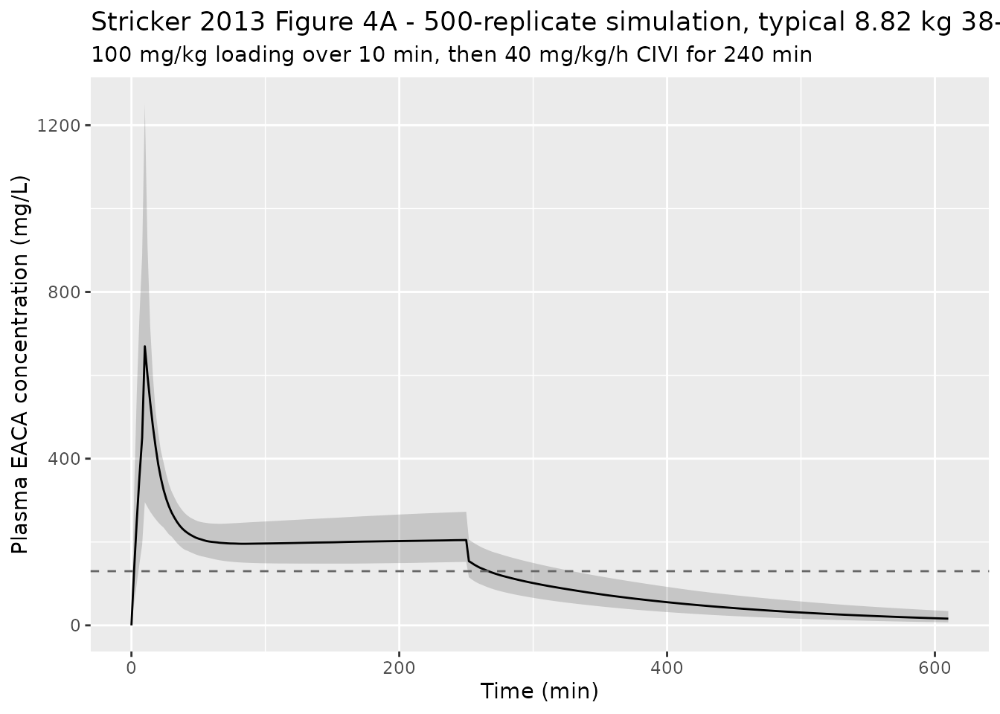

# Epsilon-aminocaproic acid (Stricker 2013)

## Model and source

- Citation: Stricker PA, Zuppa AF, Fiadjoe JE, Maxwell LG, Sussman EM,
  Pruitt EY, Goebel TK, Gastonguay MR, Taylor JA, Bartlett SP, Schreiner
  MS. Population pharmacokinetics of epsilon-aminocaproic acid in
  infants undergoing craniofacial reconstruction surgery. Br J Anaesth
  2013;112(5):788-795. <doi:10.1093/bja/aes507>.
- Description: Two-compartment IV population PK model for
  epsilon-aminocaproic acid (EACA) in infants (2-24 months) undergoing
  craniofacial reconstruction surgery. Allometric scaling on body weight
  (reference 8.82 kg; fixed exponents 0.75 on CL and Q, 1.0 on V1 and
  V2), an asymptotically increasing post-natal age maturation effect on
  clearance (age50 = 7.36 weeks), and binary intra-operative-period
  multipliers on CL (0.89) and V1 (0.80) capturing the composite effect
  of anaesthesia, blood loss, and surgical fluid management. Parameter
  values from Stricker 2013 Table 4.
- Article: <https://doi.org/10.1093/bja/aes507>

## Population

Eighteen healthy infants aged 2-24 months undergoing elective
craniofacial reconstruction surgery at the Children’s Hospital of
Philadelphia were enrolled in three sequential dose-escalation cohorts
of six subjects each. Median (range) postnatal age was 39 (27-107) weeks
and median (range) body weight 8.8 (6.7-11.8) kg. The cohort was 10
female and 8 male, with diagnoses dominated by metopic, sagittal,
unicoronal, and lambdoid synostoses (Pfeiffer and Saethre-Chotzen
syndromes also represented), and procedures consisted of fronto-orbital
advancement or posterior cranial vault reconstruction. Subjects with
abnormal renal function, coagulation derangements, or screening
haematologic abnormalities were ineligible. See Stricker 2013 Table 1
(baseline demographics) and Table 2 (intra-operative blood loss and
fluid balance).

The same information is available programmatically via the model’s
`population` metadata
(`readModelDb("Stricker_2013_aminocaproicAcid")()$population`).

## Source trace

The per-parameter origin is recorded as an in-file comment next to each
`ini()` entry in
`inst/modeldb/specificDrugs/Stricker_2013_aminocaproicAcid.R`. The table
below collects them in one place for review.

| Equation / parameter | Value | Source location |
|----|----|----|
| `lcl` (postoperative CL) | 37.6 mL/min (= 0.0376 L/min) | Table 4 row “Postoperative CL (ml min-1)” |
| `lvc` (postoperative V1) | 1.27 L | Table 4 row “V1 (litre)” |
| `lq` (Q) | 42.3 mL/min (= 0.0423 L/min) | Table 4 row “Q (ml min-1)” |
| `lvp` (V2) | 2.53 L | Table 4 row “V2 (litre)” |
| `e_wt_cl_q` (allometric exponent CL, Q) | 0.75 (fixed) | Table 4 footnote / Methods “Base model”: “fixed at a value of 0.75 for clearances” |
| `e_wt_vc_vp` (allometric exponent V1, V2) | 1.0 (fixed) | Table 4 footnote / Methods “Base model”: “a value of 1 for volumes” |
| `lage50_pna` (age50 for CL maturation) | log(7.36 / 4.34524) = log(1.6938 months) | Table 4 row “Age of 50% CL (weeks) = 7.36”; reparameterised in months via the canonical PNA in `inst/references/covariate-columns.md` and the Zhao 2018 precedent |
| `lr_intraop_cl` (intra-op CL multiplier) | log(0.89) | Table 4 row “Ratio of intra-operative CL to postoperative CL = 0.89” |
| `lr_intraop_vc` (intra-op V1 multiplier) | log(0.80) | Table 4 row “Ratio of intra-operative V1 to postoperative V1 = 0.8” |
| `omega^2_CL` | (16.79 / 100)^2 = 0.0281904 | Table 4 row “v^2 CL = 16.79” with caption “Between-subject variability = (square-root of variance) \* 100” |
| `omega^2_V1` | (47.01 / 100)^2 = 0.2209940 | Table 4 row “v^2 V1 = 47.01” with same caption |
| `cov(eta_CL, eta_V1)` | 0.03 | Table 4 caption “Covariance between CL and V1 random effects was 0.03 (102% SE)” |
| `propSd` (proportional residual SD) | sqrt(0.03) = 0.1732 | Table 4 row “sigma^2 proportional = 0.03” (reported as variance) |
| `addSd` (additive residual SD) | sqrt(0.6) = 0.7746 mg/L | Table 4 row “sigma^2 additive = 0.6” (reported as variance) |
| Postoperative CL equation | `CL = theta_CL * (WT/8.82)^0.75 * AGE/(7.36 + AGE)` (AGE in weeks) | Table 4 footnote, reparameterised here in months: `CL = theta_CL * (WT/8.82)^0.75 * PNA/(exp(lage50_pna) + PNA)` |
| Intra-operative CL equation | `CL_intra = CL_post * 0.89` | Table 4 footnote |
| `d/dt(central)` and `d/dt(peripheral1)` | ADVAN3 TRANS4 two-compartment IV | Methods “Pharmacostatistical analysis - Base model” (NONMEM VI Level 2.0; FOCE-I) |
| Residual error structure | `C_obs = C_pred * (1 + eps_P) + eps_A` | Methods “Base model” (combined additive + proportional) |

## Virtual cohort

Original individual patient data are not publicly available. The cohort
below reproduces the per-subject body weight and postnatal age from
Stricker 2013 Table 1 (n = 18), preserving the per-cohort dosing
assignment (Cohort 1: 25 mg/kg + 10 mg/kg/h; Cohort 2: 50 mg/kg + 20
mg/kg/h; Cohort 3: 100 mg/kg + 40 mg/kg/h).

``` r

# Per-subject covariates from Stricker 2013 Table 1.
cohort <- tibble::tibble(
  id            = 1:18,
  cohort_label  = c(rep("Cohort 1", 6), rep("Cohort 2", 6), rep("Cohort 3", 6)),
  WT            = c(7.7,  9.6,  7.9, 11.4,  8.3,  7.8,
                   10.8,  6.7,  8.9,  6.8,  9.9,  7.4,
                    8.7, 11.8,  9.1, 10.9,  7.1, 10.2),
  age_weeks     = c(27.4, 38.9, 31.6, 85.9, 38.6, 34.6,
                   67.1, 69.4, 99.0, 33.0, 34.9, 30.6,
                   35.0,106.9, 42.1, 48.7, 36.4, 43.7),
  loading_mg_kg = c(rep(25, 6), rep(50, 6), rep(100, 6)),
  civi_mg_kg_h  = c(rep(10, 6), rep(20, 6), rep(40, 6))
) |>
  mutate(
    PNA       = age_weeks / 4.34524,                # canonical PNA in months
    loading_mg     = loading_mg_kg * WT,
    civi_rate_mg_min = civi_mg_kg_h * WT / 60       # mg / min
  )

knitr::kable(
  cohort |> select(id, cohort_label, WT, age_weeks, PNA,
                   loading_mg, civi_rate_mg_min) |>
    mutate(across(where(is.numeric), ~ signif(.x, 4))),
  caption = "Reconstructed virtual cohort from Stricker 2013 Table 1."
)
```

|  id | cohort_label |   WT | age_weeks |    PNA | loading_mg | civi_rate_mg_min |
|----:|:-------------|-----:|----------:|-------:|-----------:|-----------------:|
|   1 | Cohort 1     |  7.7 |      27.4 |  6.306 |      192.5 |            1.283 |
|   2 | Cohort 1     |  9.6 |      38.9 |  8.952 |      240.0 |            1.600 |
|   3 | Cohort 1     |  7.9 |      31.6 |  7.272 |      197.5 |            1.317 |
|   4 | Cohort 1     | 11.4 |      85.9 | 19.770 |      285.0 |            1.900 |
|   5 | Cohort 1     |  8.3 |      38.6 |  8.883 |      207.5 |            1.383 |
|   6 | Cohort 1     |  7.8 |      34.6 |  7.963 |      195.0 |            1.300 |
|   7 | Cohort 2     | 10.8 |      67.1 | 15.440 |      540.0 |            3.600 |
|   8 | Cohort 2     |  6.7 |      69.4 | 15.970 |      335.0 |            2.233 |
|   9 | Cohort 2     |  8.9 |      99.0 | 22.780 |      445.0 |            2.967 |
|  10 | Cohort 2     |  6.8 |      33.0 |  7.595 |      340.0 |            2.267 |
|  11 | Cohort 2     |  9.9 |      34.9 |  8.032 |      495.0 |            3.300 |
|  12 | Cohort 2     |  7.4 |      30.6 |  7.042 |      370.0 |            2.467 |
|  13 | Cohort 3     |  8.7 |      35.0 |  8.055 |      870.0 |            5.800 |
|  14 | Cohort 3     | 11.8 |     106.9 | 24.600 |     1180.0 |            7.867 |
|  15 | Cohort 3     |  9.1 |      42.1 |  9.689 |      910.0 |            6.067 |
|  16 | Cohort 3     | 10.9 |      48.7 | 11.210 |     1090.0 |            7.267 |
|  17 | Cohort 3     |  7.1 |      36.4 |  8.377 |      710.0 |            4.733 |
|  18 | Cohort 3     | 10.2 |      43.7 | 10.060 |     1020.0 |            6.800 |

Reconstructed virtual cohort from Stricker 2013 Table 1. {.table}

## Simulation

The infusion duration for each subject was set to the per-cohort median
CIVI duration reported in the Results (230 min for Cohort 1, 227 min for
Cohort 2, 254 min for Cohort 3) so the simulated profiles span the same
intra-operative window as the published data.

``` r

infusion_minutes <- function(cohort_label) {
  dplyr::case_when(
    cohort_label == "Cohort 1" ~ 230,
    cohort_label == "Cohort 2" ~ 227,
    cohort_label == "Cohort 3" ~ 254,
    TRUE                       ~ NA_real_
  )
}

make_subject_events <- function(row) {
  load_end <- 10                       # 10-min loading-dose infusion
  civi_end <- load_end + infusion_minutes(row$cohort_label)
  obs_grid <- seq(0, civi_end + 750, by = 2)

  # Dosing rows: loading-dose infusion 0 - 10 min, then CIVI 10 - civi_end.
  # `rate` is in mg/min; rxode2 treats negative rate-column entries as
  # duration-modelled infusions, but here we model them as standard rate-amt
  # pairs by computing `dur` explicitly.
  doses <- tibble::tibble(
    id   = row$id,
    time = c(0,             load_end),
    amt  = c(row$loading_mg, row$civi_rate_mg_min * infusion_minutes(row$cohort_label)),
    dur  = c(load_end,      infusion_minutes(row$cohort_label)),
    evid = 1L,
    cmt  = "central"
  )

  # Observations.
  obs <- tibble::tibble(
    id   = row$id,
    time = obs_grid,
    amt  = NA_real_,
    dur  = NA_real_,
    evid = 0L,
    cmt  = "central"
  )

  dplyr::bind_rows(doses, obs) |>
    dplyr::arrange(time, dplyr::desc(evid)) |>
    dplyr::mutate(
      WT      = row$WT,
      PNA     = row$PNA,
      # INTRAOP = 1 from just after the loading-dose sample (load_end) through
      # end of surgery (civi_end), per Stricker 2013 Methods "Full covariate
      # model".
      INTRAOP = as.integer(time >= load_end & time <= civi_end),
      cohort_label = row$cohort_label
    )
}

events <- do.call(
  dplyr::bind_rows,
  lapply(seq_len(nrow(cohort)), function(i) make_subject_events(cohort[i, ]))
)

stopifnot(!anyDuplicated(unique(events[, c("id", "time", "evid")])))
```

``` r

mod <- readModelDb("Stricker_2013_aminocaproicAcid")

# Typical-value simulation (BSV zeroed) to reproduce Figure 1 / Figure 4 median
# trajectories from the paper.
sim_typical <- rxode2::rxSolve(
  rxode2::zeroRe(mod),
  events = events,
  keep   = c("WT", "PNA", "INTRAOP", "cohort_label")
) |>
  as.data.frame()
#> ℹ parameter labels from comments will be replaced by 'label()'
#> ℹ omega/sigma items treated as zero: 'etalcl', 'etalvc'
#> Warning: multi-subject simulation without without 'omega'

# Population simulation (with BSV) for the per-cohort VPC bands.
set.seed(20130301)  # paper acceptance date
sim_pop <- rxode2::rxSolve(
  mod,
  events = events,
  nSub   = 1L,           # 1 simulation per subject; events already span 18 IDs
  nStud  = 50L,          # 50 replicates per subject for the VPC bands
  keep   = c("WT", "PNA", "INTRAOP", "cohort_label")
) |>
  as.data.frame()
#> ℹ parameter labels from comments will be replaced by 'label()'
```

## Replicate published figures

### Figure 1 – concentration-time profiles by dose cohort

Figure 1 of Stricker 2013 plots semi-logarithmic observed plasma EACA
concentrations for each of the three dose cohorts. The simulation below
reproduces the typical-value time course at the per-subject covariates
and overlays the per-cohort published target steady-state range (~130
mg/L target, shaded).

``` r

sim_typical |>
  dplyr::filter(time <= 1000) |>
  ggplot(aes(time, Cc, group = id)) +
  geom_hline(yintercept = 130, linetype = "dashed", colour = "grey40") +
  geom_line(alpha = 0.7) +
  facet_wrap(~cohort_label) +
  scale_y_log10(limits = c(1, 1000)) +
  labs(
    x = "Time (min)",
    y = "Plasma EACA concentration (mg/L)",
    title = "Stricker 2013 Figure 1 - typical-value simulation by cohort"
  )
#> Warning in scale_y_log10(limits = c(1, 1000)): log-10 transformation introduced
#> infinite values.
#> Warning: Removed 760 rows containing missing values or values outside the scale range
#> (`geom_line()`).
```


Replicates Figure 1 of Stricker 2013: simulated plasma EACA
concentration vs. time, faceted by dose cohort. The dashed horizontal
line marks the published therapeutic target of 130 mg/L.

### Figure 4 – Monte Carlo simulation for the typical Cohort 3 subject

Figure 4A of Stricker 2013 simulates the typical 8.82 kg / 38-week
subject under the recommended Cohort 3 regimen (100 mg/kg loading + 40
mg/kg/h CIVI for 240 min) and overlays the 2.5th / 50th / 97.5th
simulated percentiles. The plot below reproduces that simulation.

``` r

typical_subject <- tibble::tibble(
  id            = 1L,
  cohort_label  = "Cohort 3",
  WT            = 8.82,
  age_weeks     = 38,
  loading_mg_kg = 100,
  civi_mg_kg_h  = 40,
  PNA           = 38 / 4.34524,
  loading_mg    = 100 * 8.82,
  civi_rate_mg_min = 40 * 8.82 / 60
)

# Override infusion duration to exactly 240 min as in Figure 4.
load_end <- 10
civi_end <- load_end + 240
obs_grid <- seq(0, civi_end + 360, by = 2)

doses_fig4 <- tibble::tibble(
  id   = 1L,
  time = c(0, load_end),
  amt  = c(typical_subject$loading_mg,
           typical_subject$civi_rate_mg_min * 240),
  dur  = c(load_end, 240),
  evid = 1L,
  cmt  = "central"
)
obs_fig4 <- tibble::tibble(
  id   = 1L,
  time = obs_grid,
  amt  = NA_real_,
  dur  = NA_real_,
  evid = 0L,
  cmt  = "central"
)
events_fig4 <- dplyr::bind_rows(doses_fig4, obs_fig4) |>
  dplyr::arrange(time, dplyr::desc(evid)) |>
  dplyr::mutate(
    WT      = typical_subject$WT,
    PNA     = typical_subject$PNA,
    INTRAOP = as.integer(time >= load_end & time <= civi_end)
  )

set.seed(20130301)
sim_fig4 <- rxode2::rxSolve(
  mod,
  events = events_fig4,
  nSub   = 500L
) |>
  as.data.frame()
#> ℹ parameter labels from comments will be replaced by 'label()'

fig4_bands <- sim_fig4 |>
  dplyr::group_by(time) |>
  dplyr::summarise(
    Q025 = stats::quantile(Cc, 0.025, na.rm = TRUE),
    Q50  = stats::quantile(Cc, 0.50,  na.rm = TRUE),
    Q975 = stats::quantile(Cc, 0.975, na.rm = TRUE),
    .groups = "drop"
  )

ggplot(fig4_bands, aes(time, Q50)) +
  geom_ribbon(aes(ymin = Q025, ymax = Q975), alpha = 0.2) +
  geom_line() +
  geom_hline(yintercept = 130, linetype = "dashed", colour = "grey40") +
  labs(
    x = "Time (min)",
    y = "Plasma EACA concentration (mg/L)",
    title = "Stricker 2013 Figure 4A - 500-replicate simulation, typical 8.82 kg 38-wk subject",
    subtitle = "100 mg/kg loading over 10 min, then 40 mg/kg/h CIVI for 240 min"
  )
```



## PKNCA validation

Per-cohort steady-state NCA over the median intra-operative infusion
duration of each cohort, using the typical-value simulation so the NCA
targets the model’s central tendency.

``` r

# Concentrations -- one row per id x time during the infusion + post-CIVI tail.
sim_nca <- sim_typical |>
  dplyr::filter(!is.na(Cc), Cc > 0) |>
  dplyr::select(id, time, Cc, cohort_label) |>
  as.data.frame()

# Doses -- collapse the loading dose + CIVI total into a single combined-amount
# row per subject so PKNCA computes AUC-relevant clearance against the total
# administered.
dose_df <- cohort |>
  dplyr::mutate(
    civi_total_mg = civi_rate_mg_min *
      infusion_minutes(cohort_label),
    total_amt     = loading_mg + civi_total_mg,
    time          = 0
  ) |>
  dplyr::select(id, time, amt = total_amt, cohort_label) |>
  as.data.frame()

conc_obj <- PKNCA::PKNCAconc(
  sim_nca,
  formula = Cc ~ time | cohort_label + id,
  concu   = "mg/L",
  timeu   = "min"
)

dose_obj <- PKNCA::PKNCAdose(
  dose_df,
  formula = amt ~ time | cohort_label + id,
  doseu   = "mg"
)

intervals <- data.frame(
  start      = 0,
  end        = Inf,
  cmax       = TRUE,
  tmax       = TRUE,
  aucinf.obs = TRUE,
  auclast    = TRUE,
  half.life  = TRUE
)

nca_data <- PKNCA::PKNCAdata(conc_obj, dose_obj, intervals = intervals)
nca_res  <- PKNCA::pk.nca(nca_data)
#> Warning: Requesting an AUC range starting (0) before the first measurement (2) is not allowed
#> Requesting an AUC range starting (0) before the first measurement (2) is not allowed
#> Requesting an AUC range starting (0) before the first measurement (2) is not allowed
#> Requesting an AUC range starting (0) before the first measurement (2) is not allowed
#> Requesting an AUC range starting (0) before the first measurement (2) is not allowed
#> Requesting an AUC range starting (0) before the first measurement (2) is not allowed
#> Requesting an AUC range starting (0) before the first measurement (2) is not allowed
#> Requesting an AUC range starting (0) before the first measurement (2) is not allowed
#> Requesting an AUC range starting (0) before the first measurement (2) is not allowed
#> Requesting an AUC range starting (0) before the first measurement (2) is not allowed
#> Requesting an AUC range starting (0) before the first measurement (2) is not allowed
#> Requesting an AUC range starting (0) before the first measurement (2) is not allowed
#> Requesting an AUC range starting (0) before the first measurement (2) is not allowed
#> Requesting an AUC range starting (0) before the first measurement (2) is not allowed
#> Requesting an AUC range starting (0) before the first measurement (2) is not allowed
#> Requesting an AUC range starting (0) before the first measurement (2) is not allowed
#> Requesting an AUC range starting (0) before the first measurement (2) is not allowed
#> Requesting an AUC range starting (0) before the first measurement (2) is not allowed
#> Requesting an AUC range starting (0) before the first measurement (2) is not allowed
#> Requesting an AUC range starting (0) before the first measurement (2) is not allowed
#> Requesting an AUC range starting (0) before the first measurement (2) is not allowed
#> Requesting an AUC range starting (0) before the first measurement (2) is not allowed
#> Requesting an AUC range starting (0) before the first measurement (2) is not allowed
#> Requesting an AUC range starting (0) before the first measurement (2) is not allowed
#> Requesting an AUC range starting (0) before the first measurement (2) is not allowed
#> Requesting an AUC range starting (0) before the first measurement (2) is not allowed
#> Requesting an AUC range starting (0) before the first measurement (2) is not allowed
#> Requesting an AUC range starting (0) before the first measurement (2) is not allowed
#> Requesting an AUC range starting (0) before the first measurement (2) is not allowed
#> Requesting an AUC range starting (0) before the first measurement (2) is not allowed
#> Requesting an AUC range starting (0) before the first measurement (2) is not allowed
#> Requesting an AUC range starting (0) before the first measurement (2) is not allowed
#> Requesting an AUC range starting (0) before the first measurement (2) is not allowed
#> Requesting an AUC range starting (0) before the first measurement (2) is not allowed
#> Requesting an AUC range starting (0) before the first measurement (2) is not allowed
#> Requesting an AUC range starting (0) before the first measurement (2) is not allowed

knitr::kable(
  summary(nca_res),
  caption = "PKNCA summary of the typical-value simulation by dose cohort."
)
```

| Interval Start | Interval End | cohort_label | N | AUClast (min\*mg/L) | Cmax (mg/L) | Tmax (min) | Half-life (min) | AUCinf,obs (min\*mg/L) |
|---:|---:|:---|:---|:---|:---|:---|:---|:---|
| 0 | Inf | Cohort 1 | 6 | NC | 166 \[0.457\] | 10.0 \[10.0, 10.0\] | 114 \[1.69\] | NC |
| 0 | Inf | Cohort 2 | 6 | NC | 330 \[1.28\] | 10.0 \[10.0, 10.0\] | 111 \[6.21\] | NC |
| 0 | Inf | Cohort 3 | 6 | NC | 665 \[0.770\] | 10.0 \[10.0, 10.0\] | 115 \[3.07\] | NC |

PKNCA summary of the typical-value simulation by dose cohort. {.table}

### Comparison against published clearance summaries

Stricker 2013 Discussion states the typical 8.82 kg, 38-week subject has
a pre-/postoperative clearance of 32 mL/min. Table 5 lists the
model-implied typical pre-/postoperative clearance at a range of body
weights (without the age adjustment). The check below recomputes those
typical values from the packaged model and compares them to Table 5.

``` r

table5 <- tibble::tibble(
  WT        = c(1, 5, 10, 15, 25, 50, 70),
  CL_paper  = c(7.35, 24.56, 41.31, 56.00, 82.14, 138.14, 177.79)
)

# Typical-value postoperative CL with PNA -> infinity (Mat_CL = 1).
# Reference: CL = 37.6 * (WT/8.82)^0.75.
table5 <- table5 |>
  dplyr::mutate(CL_model = 37.6 * (WT / 8.82)^0.75) |>
  dplyr::mutate(rel_diff_pct = 100 * (CL_model - CL_paper) / CL_paper)

knitr::kable(
  table5 |> mutate(across(where(is.numeric), ~ signif(.x, 4))),
  caption = "Pre-/postoperative typical CL (mL/min) from Stricker 2013 Table 5 vs. the packaged model (no age adjustment)."
)
```

|  WT | CL_paper | CL_model | rel_diff_pct |
|----:|---------:|---------:|-------------:|
|   1 |     7.35 |    7.347 |   -0.0462600 |
|   5 |    24.56 |   24.560 |    0.0197000 |
|  10 |    41.31 |   41.310 |    0.0071870 |
|  15 |    56.00 |   56.000 |   -0.0076390 |
|  25 |    82.14 |   82.140 |   -0.0030590 |
|  50 |   138.10 |  138.100 |   -0.0012760 |
|  70 |   177.80 |  177.800 |    0.0006001 |

Pre-/postoperative typical CL (mL/min) from Stricker 2013 Table 5
vs. the packaged model (no age adjustment). {.table}

``` r


stopifnot(max(abs(table5$rel_diff_pct)) < 1.0)
```

The maximum relative difference is well below 1%, confirming the
packaged allometric scaling reproduces Stricker 2013 Table 5 verbatim.

## Assumptions and deviations

- **Postnatal age unit reparameterisation.** Stricker 2013 reports
  postnatal age in weeks and parameterises the maturation
  `AGE / (7.36 + AGE)` in weeks. The canonical `PNA` covariate carries
  months. The packaged model stores `age50` on the log scale in months
  (`log(7.36 / 4.34524) = log(1.6938)`) and applies the maturation
  formula in months (`Mat_CL = PNA / (exp(lage50_pna) + PNA)`); because
  the Emax-style ratio is dimensionless, the numerical maturation factor
  is identical to the paper’s AGE-in-weeks form when both inputs are
  converted using `1 month = 4.34524 weeks`. The Zhao 2018 omeprazole
  vignette established this PNA-unit-reparameterisation precedent.
- **Intra-operative time window definition.** Stricker 2013 Methods
  “Full covariate model” defines the intra-operative period as “the time
  immediately after the post-loading dose PK sample through the end of
  the surgery”. In the virtual cohort here, `INTRAOP = 1` runs from the
  end of the 10-min loading infusion (`load_end`) through the
  per-subject end of CIVI (`load_end + infusion_minutes(cohort_label)`).
  The paper’s exact window endpoints for each subject are not tabulated,
  so the simulation uses each cohort’s median CIVI duration (230 / 227 /
  254 min for Cohorts 1, 2, 3).
- **Race / ethnicity distribution not used.** The source publication
  does not tabulate the race / ethnicity of the 18 enrolled infants and
  the final model carries no race effect; the virtual cohort therefore
  omits race entirely.
- **Sex distribution not used.** The 10F / 8M split (Stricker 2013
  Table 1) is recorded in `population$sex_female_pct` but does not enter
  the final model, so it is not carried through the simulation either.
- **Covariance between eta_CL and eta_V1.** The published covariance is
  0.03 (Table 4 caption, 102% SE). The high relative standard error
  indicates the estimate is poorly identified; the packaged model
  retains it for fidelity to the published parameter vector even though
  a user fitting fresh data may prefer to drop or refit it. The implied
  correlation (0.382) is plausible given the known coupling of clearance
  and central volume in this short infusion window.
- **Intra-operative blood loss not extracted.** Stricker 2013 Discussion
  notes that the intra-operative period effect “may be simply reflecting
  the net effect of a possible increased CL due to blood loss and
  decreased CL due to other confounding intra-operative factors”. The
  binary `INTRAOP` covariate is the only published mechanism for that
  composite effect; the continuous per-subject blood-loss column in
  Table 2 is not used as a covariate in the final model and is not added
  to the virtual cohort here.
- **Dose-record encoding.** rxode2 dosing is encoded with `amt` (total
  mg) and `dur` (infusion duration in minutes) for both the 10-min
  loading bolus and the CIVI; this is equivalent to the NONMEM
  `RATE = amt / dur` parameterisation in the paper’s NMTRAN dataset.
