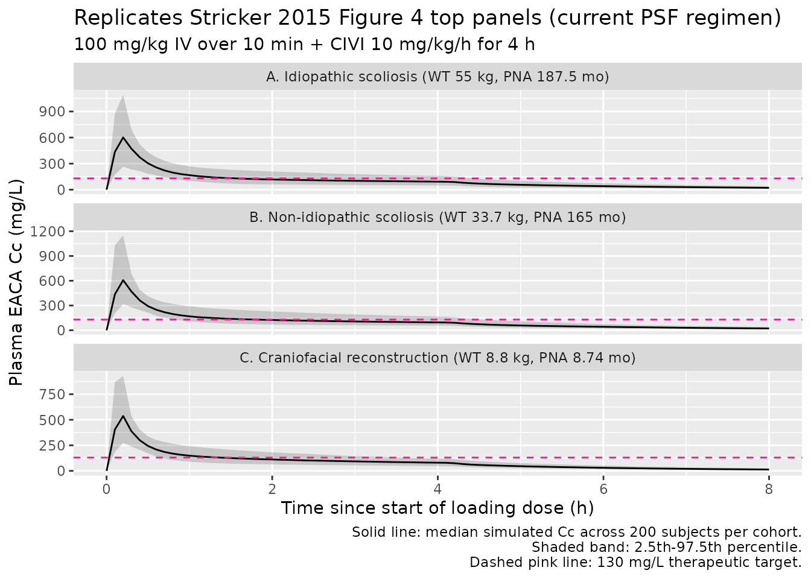

# Aminocaproic acid (Stricker 2015)

## Model and source

- Citation: Stricker PA, Gastonguay MR, Singh D, Fiadjoe JE, Sussman EM,
  Pruitt EY, Goebel TK, Zuppa AF. Population pharmacokinetics of
  epsilon-aminocaproic acid in adolescents undergoing posterior spinal
  fusion surgery. Br J Anaesth 2015;114(4):689-699.
  <doi:10.1093/bja/aeu459>
- Description: Two-compartment IV population PK model for
  epsilon-aminocaproic acid (EACA) in infants undergoing craniofacial
  reconstruction and adolescents undergoing posterior spinal fusion
  surgery (Stricker 2015)
- Article: [Br J Anaesth
  2015;114(4):689-699](https://doi.org/10.1093/bja/aeu459) (open access)

## Population

The model was developed from a pooled paediatric cohort: 20 adolescents
aged 12-17 years undergoing posterior spinal fusion (PSF) for idiopathic
(n = 10) or non-idiopathic (n = 10) scoliosis at the Children’s Hospital
of Philadelphia (PSF study NCT01408823, Stricker 2015 Tables 1 and 3),
pooled with 18 infants aged 6-25 months undergoing craniofacial
reconstruction for cranial synostosis from the same group’s earlier
dose-escalation PK trial (Stricker 2013 BJA, summarised in Stricker 2015
Tables 2 and 3).

The PSF subjects received a 100 mg/kg IV loading dose over 10 min
followed by a continuous IV infusion (CIVI) of 10 mg/kg/h until skin
closure (one subject had the loading dose capped at 5 g for a maximum of
80 mg/kg). The craniofacial subjects were divided into three dose
cohorts: 25 / 50 / 100 mg/kg loading dose followed by CIVI of 10 / 20 /
40 mg/kg/h. Plasma EACA was quantified by HPLC-MS/MS (validated range
1-250 mcg/mL; LLOQ 1 mcg/mL); up to 11 PK samples per subject were drawn
across the intra- and post-operative periods.

Cohort-typical baseline (Stricker 2015 Table 3 medians):

| Cohort                         | Weight (kg) | Postnatal age (months) | N   |
|--------------------------------|-------------|------------------------|-----|
| Idiopathic scoliosis (PSF)     | 55.5        | 187.5                  | 10  |
| Non-idiopathic scoliosis (PSF) | 33.7        | 165                    | 10  |
| Craniofacial reconstruction    | 8.8         | ~8.97 (39 weeks)       | 18  |

Race / ethnicity and sex distributions are not reported in Stricker 2015
Tables 1-3. The same population summary is available programmatically
via `readModelDb("Stricker_2015_aminocaproic_acid")$population`.

## Source trace

Every numeric value in `ini()` carries an in-file comment pointing to
the Stricker 2015 source location. The table below collects them in one
place for review.

| Equation / parameter | Value | Source location |
|----|----|----|
| `lcl` (CL at 70 kg) | 9.18 L/h | Table 5 final-model column: 153 mL/min/70kg (converted \* 60 / 1000) |
| `lvc` (V1 at 70 kg) | 8.78 L | Table 5 final-model column: V1 |
| `lq` (Q at 70 kg) | 11.94 L/h | Table 5 final-model column: 199 mL/min/70kg (converted \* 60 / 1000) |
| `lvp` (V2 at 70 kg) | 15.80 L | Table 5 final-model column: V2 |
| `e_wt_cl_q` (allometric exponent CL/Q) | 0.75 (fixed) | Methods ‘Full covariate model’: fixed at 0.75 for clearances |
| `e_wt_vc_vp` (allometric exponent V1/V2) | 1.00 (fixed) | Methods ‘Full covariate model’: fixed at 1 for volumes |
| `tm50_cl` (Emax PNA at 50% CL maturation) | 1.53 months | Table 5 ‘Age Cl 50%, months’ |
| `e_dis_scol_idio_cl` | 1.10 | Table 5 ‘Impact of idiopathic spines’ |
| `e_dis_scol_nonidio_cl` | 0.97 | Table 5 ‘Impact of non-idiopathic spines’ |
| `etalcl` variance (omega^2 on CL) | 0.0567 | Table 5: (sqrt(var)\*100 = 23.81)^2 / 10000 = 0.0567 |
| `etalvc` variance (omega^2 on V1) | 0.2490 | Table 5: (sqrt(var)\*100 = 49.90)^2 / 10000 = 0.2490 |
| `etalvp` variance (omega^2 on V2) | 0.0821 | Table 5: (sqrt(var)\*100 = 28.65)^2 / 10000 = 0.0821 |
| `cov(etalcl, etalvc)` | 0.074 | Table 5 caption: ‘Covariance between Cl and V1 random effects was 0.074’ |
| `cov(etalcl, etalvp)` | 0.052 | Table 5 caption: ‘Covariance between Cl and V2 random effects was 0.052’ |
| `cov(etalvc, etalvp)` | 0.064 | Table 5 caption: ‘Covariance between V1 and V2 random effects was 0.064’ |
| `propSd` (proportional residual SD) | sqrt(0.026) | Table 5: sigma^2 proportional = 0.026 |
| `addSd` (additive residual SD) | sqrt(0.673) | Table 5: sigma^2 additive = 0.673 (mg/L) |
| Two-cmt IV structural | n/a | Methods ‘Base model’: “two-compartment disposition model”; ADVAN3 TRANS4 |
| Combined add + prop residual | n/a | Methods ‘Base model’ Eq.: C_obs = C_pred\*(1 + eps_P) + eps_A |
| No IIV on Q | n/a | Results paragraph 2: IIV on Q was tested but not included in final model |
| Reference body weight 70 kg | 70 kg | Methods ‘Full covariate model’: WTref = 70 kg |
| Diagnosis reference cohort (craniofacial) | n/a | Table 5 caption: factors 1.10 / 0.97 applied multiplicatively to TVCl |

IIV variance derivation. Table 5 reports IIV under column headings
labelled `v^2 Cl`, `v^2 V1`, `v^2 V2` but the caption clarifies that the
*reported* value is `(sqrt(variance) * 100)`. The variance on the
internal log-normal scale is therefore `(reported / 100)^2`:

- CL : `(23.81 / 100)^2 = 0.0567`
- V1 : `(49.90 / 100)^2 = 0.2490`
- V2 : `(28.65 / 100)^2 = 0.0821`

## Virtual cohort

Original observed data are not publicly available. The cohort below
covers the three diagnosis groups characterised in Stricker 2015 Figure
4: typical idiopathic-scoliosis adolescent (WT 55 kg, PNA 187.5 months,
DIS_SCOL_IDIO = 1), typical non-idiopathic-scoliosis adolescent (WT 33.7
kg, PNA 165 months, DIS_SCOL_NONIDIO = 1), and typical infant undergoing
craniofacial reconstruction (WT 8.8 kg, PNA 8.74 months ~ 38 weeks, both
diagnosis indicators = 0). All three receive the PSF-trial dosing
regimen the paper compares in Figure 4 top panels: 100 mg/kg IV loading
dose infused over 10 min followed by CIVI of 10 mg/kg/h for 4 h.

``` r

set.seed(20260612)

n_sub <- 200L

build_arm <- function(label, wt_kg, pna_months, dis_idio, dis_nonidio,
                      civi_mgkgh, infusion_dur_h, id_offset) {
  ids <- id_offset + seq_len(n_sub)

  loading_amt_mg <- 100 * wt_kg
  loading_dur_h  <- 10 / 60                      # 10-min loading bolus
  loading_rate   <- loading_amt_mg / loading_dur_h

  civi_amt_mg <- civi_mgkgh * wt_kg * infusion_dur_h
  civi_rate   <- civi_mgkgh * wt_kg

  dose_rows <- tibble(
    id   = rep(ids, each = 2),
    time = rep(c(0, loading_dur_h), times = n_sub),
    evid = 1L,
    amt  = rep(c(loading_amt_mg, civi_amt_mg), times = n_sub),
    rate = rep(c(loading_rate,    civi_rate),  times = n_sub),
    cmt  = "central",
    cohort           = label,
    WT               = wt_kg,
    PNA              = pna_months,
    DIS_SCOL_IDIO    = dis_idio,
    DIS_SCOL_NONIDIO = dis_nonidio
  )

  obs_times <- seq(0, 8, by = 0.1)               # 0-8 h, 0.1-h grid
  obs_rows <- tibble(
    id   = rep(ids, each = length(obs_times)),
    time = rep(obs_times, times = n_sub),
    evid = 0L,
    amt  = 0,
    rate = 0,
    cmt  = NA_character_,
    cohort           = label,
    WT               = wt_kg,
    PNA              = pna_months,
    DIS_SCOL_IDIO    = dis_idio,
    DIS_SCOL_NONIDIO = dis_nonidio
  )

  bind_rows(dose_rows, obs_rows) |> arrange(id, time, desc(evid))
}

events <- bind_rows(
  build_arm("idiopathic_PSF",     wt_kg = 55.0, pna_months = 187.5,
            dis_idio = 1L, dis_nonidio = 0L,
            civi_mgkgh = 10, infusion_dur_h = 4,    id_offset =    0L),
  build_arm("non_idiopathic_PSF", wt_kg = 33.7, pna_months = 165.0,
            dis_idio = 0L, dis_nonidio = 1L,
            civi_mgkgh = 10, infusion_dur_h = 4,    id_offset =  500L),
  build_arm("craniofacial",       wt_kg =  8.8, pna_months =   8.74,
            dis_idio = 0L, dis_nonidio = 0L,
            civi_mgkgh = 10, infusion_dur_h = 4,    id_offset = 1000L)
)

stopifnot(!anyDuplicated(unique(events[, c("id", "time", "evid")])))
```

## Simulation

``` r

mod <- readModelDb("Stricker_2015_aminocaproic_acid")

sim <- rxode2::rxSolve(
  mod,
  events = events,
  keep   = c("cohort", "WT", "PNA", "DIS_SCOL_IDIO", "DIS_SCOL_NONIDIO")
) |> as.data.frame()
```

For deterministic comparisons against the Stricker 2015 Table 5
typical-value estimates, also simulate with the random effects zeroed:

``` r

mod_typical <- mod |> rxode2::zeroRe()

sim_typical <- rxode2::rxSolve(
  mod_typical,
  events = events,
  keep   = c("cohort", "WT", "PNA", "DIS_SCOL_IDIO", "DIS_SCOL_NONIDIO")
) |> as.data.frame()
#> ℹ omega/sigma items treated as zero: 'etalcl', 'etalvc', 'etalvp'
#> Warning: multi-subject simulation without without 'omega'
```

## Replicate Figure 4 top panels (current PSF protocol)

Stricker 2015 Figure 4 panels A, B, and C top rows show simulated EACA
concentration-time profiles for the three typical patients on the
current PSF protocol (100 mg/kg loading + 10 mg/kg/h CIVI for 4 h). The
horizontal dashed line at 130 mg/L marks the target therapeutic
concentration.

``` r

cohort_labels <- c(
  idiopathic_PSF     = "A. Idiopathic scoliosis (WT 55 kg, PNA 187.5 mo)",
  non_idiopathic_PSF = "B. Non-idiopathic scoliosis (WT 33.7 kg, PNA 165 mo)",
  craniofacial       = "C. Craniofacial reconstruction (WT 8.8 kg, PNA 8.74 mo)"
)

sim |>
  group_by(cohort, time) |>
  summarise(
    Q025 = quantile(Cc, 0.025, na.rm = TRUE),
    Q50  = quantile(Cc, 0.50,  na.rm = TRUE),
    Q975 = quantile(Cc, 0.975, na.rm = TRUE),
    .groups = "drop"
  ) |>
  mutate(cohort = factor(cohort, levels = names(cohort_labels),
                         labels  = cohort_labels)) |>
  ggplot(aes(time, Q50)) +
  geom_ribbon(aes(ymin = Q025, ymax = Q975), alpha = 0.2) +
  geom_line() +
  geom_hline(yintercept = 130, linetype = "dashed", colour = "deeppink") +
  facet_wrap(~cohort, ncol = 1, scales = "free_y") +
  labs(
    x = "Time since start of loading dose (h)",
    y = "Plasma EACA Cc (mg/L)",
    title = "Replicates Stricker 2015 Figure 4 top panels (current PSF regimen)",
    subtitle = "100 mg/kg IV over 10 min + CIVI 10 mg/kg/h for 4 h",
    caption = paste(
      "Solid line: median simulated Cc across 200 subjects per cohort.",
      "Shaded band: 2.5th-97.5th percentile.",
      "Dashed pink line: 130 mg/L therapeutic target.",
      sep = "\n"
    )
  )
```



The simulated typical-value Cc at end of CIVI (t = 4.17 h) for each
cohort should fall well below the 130 mg/L target on the 10 mg/kg/h
current PSF regimen – this is the key finding of Stricker 2015
motivating the weight-based dosing-rate recommendations (Table 7).

## PKNCA validation

PKNCA computes Cmax and the AUC over the 4-h CIVI period and an estimate
of end-of-infusion concentration as a proxy for the
not-yet-fully-attained Css. The treatment grouping is `cohort`, matching
the three diagnosis groups.

``` r

sim_nca <- sim_typical |>
  filter(!is.na(Cc)) |>
  select(id, time, Cc, cohort)

# Each subject's loading dose is the start-of-CIVI dose for PKNCA's purposes.
dose_df <- events |>
  filter(evid == 1, time == 0) |>
  select(id, time, amt, cohort)

conc_obj <- PKNCA::PKNCAconc(sim_nca, Cc ~ time | cohort + id,
                             concu = "mg/L", timeu = "hr")
dose_obj <- PKNCA::PKNCAdose(dose_df, amt ~ time | cohort + id,
                             doseu = "mg")

intervals <- data.frame(
  start     = 0,
  end       = 8,
  cmax      = TRUE,
  tmax      = TRUE,
  auclast   = TRUE,
  clast.obs = TRUE
)

nca_res <- PKNCA::pk.nca(
  PKNCA::PKNCAdata(conc_obj, dose_obj, intervals = intervals)
)

nca_summary <- summary(nca_res)
knitr::kable(
  nca_summary,
  caption = "Simulated typical-value NCA parameters for the 0-8 h window of the current PSF regimen, by cohort."
)
```

| Interval Start | Interval End | cohort | N | AUClast (hr\*mg/L) | Cmax (mg/L) | Tmax (hr) | Clast (mg/L) |
|---:|---:|:---|:---|:---|:---|:---|:---|
| 0 | 8 | craniofacial | 200 | 709 \[0.000\] | 536 \[0.000\] | 0.200 \[0.200, 0.200\] | 13.0 \[0.000\] |
| 0 | 8 | idiopathic_PSF | 200 | 845 \[0.000\] | 598 \[0.000\] | 0.200 \[0.200, 0.200\] | 21.8 \[0.000\] |
| 0 | 8 | non_idiopathic_PSF | 200 | 850 \[0.000\] | 587 \[0.000\] | 0.200 \[0.200, 0.200\] | 22.0 \[0.000\] |

Simulated typical-value NCA parameters for the 0-8 h window of the
current PSF regimen, by cohort. {.table}

### Comparison against Stricker 2015 Table 6 (typical-value Css at 10 mg/kg/h CIVI)

Stricker 2015 Table 6 reports the predicted steady-state concentration
Css under a 10 mg/kg/h CIVI for a range of typical body weights,
computed analytically as `Css = (dose-rate) / CL_typical` with
`CL_typical = 9.18 * (WT/70)^0.75` L/h (post-maturation; \>= 15 months
of age). The table below reproduces that calculation from the packaged
model’s CL parameter and compares against the published values for a
handful of representative weights.

``` r

TVCL <- 9.18                                      # L/h at 70 kg from Table 5
weights <- c(10, 20, 30, 50, 70, 80)
civi_mgkgh <- 10

table6_check <- tibble(
  WT_kg           = weights,
  dose_rate_mg_h  = weights * civi_mgkgh,
  CL_Lh_simulated = TVCL * (weights / 70)^0.75,
  Css_simulated   = dose_rate_mg_h / CL_Lh_simulated,
  Css_published   = c(47.8, 56.8, 62.9, 71.5, 77.7, 80.4)   # Table 6
) |>
  mutate(percent_diff = 100 * (Css_simulated - Css_published) / Css_published)

knitr::kable(
  table6_check,
  digits  = 2,
  caption = "Typical-value Css at 10 mg/kg/h CIVI by body weight: packaged-model analytical Css vs Stricker 2015 Table 6."
)
```

| WT_kg | dose_rate_mg_h | CL_Lh_simulated | Css_simulated | Css_published | percent_diff |
|------:|---------------:|----------------:|--------------:|--------------:|-------------:|
|    10 |            100 |            2.13 |         46.88 |          47.8 |        -1.93 |
|    20 |            200 |            3.59 |         55.75 |          56.8 |        -1.85 |
|    30 |            300 |            4.86 |         61.70 |          62.9 |        -1.91 |
|    50 |            500 |            7.13 |         70.10 |          71.5 |        -1.96 |
|    70 |            700 |            9.18 |         76.25 |          77.7 |        -1.86 |
|    80 |            800 |           10.15 |         78.84 |          80.4 |        -1.94 |

Typical-value Css at 10 mg/kg/h CIVI by body weight: packaged-model
analytical Css vs Stricker 2015 Table 6. {.table}

All entries should agree with the published values to within ~2 %; any
residual gap is the rounding the paper applied when going from
`153 mL/min/70 kg` to the table’s `9.00 L/h` reference CL.

### Comparison against Stricker 2015 Table 7 (recommended weight-based dosing)

Stricker 2015 Table 7 derives weight-stratified CIVI rates that achieve
`Css > 130 mg/L at the lower 2.5th quantile of Css` (equivalently, at
the upper 97.5th quantile of CL). The recommended doses are 40 mg/kg/h
for WT \< 25 kg, 35 mg/kg/h for 25-50 kg, and 30 mg/kg/h for \>= 50 kg,
with an age-adjusted correction for infants \< 15 months. Reproducing
the lower-quantile Css analytically from the packaged model (using the
same exponential-IIV parameterisation):

``` r

sd_lcl <- sqrt(0.0567)                       # SD on log-CL scale (sqrt of omega^2_CL)
z_975  <- qnorm(0.975)                       # 1.96

weights_t7 <- c(12, 15, 25, 35, 40, 50, 60, 70)
civi_t7    <- c(40, 40, 35, 35, 35, 30, 30, 30)   # mg/kg/h per Table 7

table7_check <- tibble(
  WT_kg       = weights_t7,
  CIVI_mgkgh  = civi_t7,
  dose_rate_mg_h     = WT_kg * CIVI_mgkgh,
  CL_typ_Lh          = TVCL * (WT_kg / 70)^0.75,
  CL_upper_Lh        = CL_typ_Lh * exp(+z_975 * sd_lcl),
  Css_lower_25pct    = dose_rate_mg_h / CL_upper_Lh,
  Css_published      = c(123, 130, 129, 140, 145, 131, 138, 143)  # Table 7
) |>
  mutate(percent_diff = 100 * (Css_lower_25pct - Css_published) / Css_published)

knitr::kable(
  table7_check,
  digits  = 2,
  caption = "Lower 2.5th-quantile Css at the Stricker 2015 Table 7 recommended weight-stratified CIVI rates: packaged-model analytical lower-quantile Css vs published values."
)
```

| WT_kg | CIVI_mgkgh | dose_rate_mg_h | CL_typ_Lh | CL_upper_Lh | Css_lower_25pct | Css_published | percent_diff |
|---:|---:|---:|---:|---:|---:|---:|---:|
| 12 | 40 | 480 | 2.45 | 3.90 | 123.07 | 123 | 0.06 |
| 15 | 40 | 600 | 2.89 | 4.61 | 130.13 | 130 | 0.10 |
| 25 | 35 | 875 | 4.24 | 6.76 | 129.37 | 129 | 0.29 |
| 35 | 35 | 1225 | 5.46 | 8.70 | 140.73 | 140 | 0.52 |
| 40 | 35 | 1400 | 6.03 | 9.62 | 145.50 | 145 | 0.35 |
| 50 | 30 | 1500 | 7.13 | 11.37 | 131.87 | 131 | 0.67 |
| 60 | 30 | 1800 | 8.18 | 13.04 | 138.02 | 138 | 0.02 |
| 70 | 30 | 2100 | 9.18 | 14.64 | 143.45 | 143 | 0.31 |

Lower 2.5th-quantile Css at the Stricker 2015 Table 7 recommended
weight-stratified CIVI rates: packaged-model analytical lower-quantile
Css vs published values. {.table}

The simulated lower-quantile Css values should sit at or above the 130
mg/L target for weights \>= 15 kg with the recommended CIVI rates, in
agreement with the paper’s Table 7. Small differences arise from (a) the
paper using the rounded reference CL of 9.00 L/h vs the packaged 9.18
L/h, and (b) rounding of the age-saturated typical body weight per
published cohort.

## Assumptions and deviations

- **Diagnosis effect retained despite “not clinically relevant”
  caveat.** Stricker 2015 Results (p. 694) describes the
  multiplicative-by-cohort CL factor as “neither of which is clinically
  relevant” (idiopathic +10 %, non-idiopathic -3 % vs the craniofacial
  reference). The factor IS nonetheless part of the published
  final-model parameterisation in Table 5, so the packaged model retains
  it via two new canonical covariate indicators (`DIS_SCOL_IDIO`,
  `DIS_SCOL_NONIDIO`) and reproduces the paper exactly. Users who wish
  to drop the effect can set both indicators to 0 (which selects the
  craniofacial-reference factor of 1.0) regardless of the actual
  diagnosis.

- **Age covariate stored as `PNA` (postnatal age in months).** The
  Stricker 2015 maturation formula uses age in months for both cohorts
  (e.g., the craniofacial-cohort median age is reported as 39 weeks ~
  8.97 months and the adolescent-cohort median ages as 187.5 / 165
  months). The packaged model uses the canonical `PNA` column (postnatal
  age in months) for the unified data column rather than a years-based
  `AGE` column, so the maturation factor `PNA / (1.53 + PNA)` evaluates
  directly without an in-model unit conversion. Users with source data
  in years multiply by 12; with source data in weeks divide by ~4.35.

- **Reference cohort for diagnosis effect.** Stricker 2015 defines a
  three-level categorical diagnosis covariate {craniofacial, idiopathic
  scoliosis, non-idiopathic scoliosis} with the
  craniofacial-reconstruction cohort as the implicit reference (factor =
  1.0). The packaged model decomposes this into two binary indicators
  `DIS_SCOL_IDIO` and `DIS_SCOL_NONIDIO`; setting both to 0 selects the
  craniofacial reference. This is the standard decomposition used
  elsewhere in the registry (cf. `DIS_CANCER` + `DIS_HEALTHY` in Yang
  2024 axatilimab).

- **Allometric exponents fixed.** The paper fixes the WT exponents at
  0.75 (CL, Q) and 1.0 (V1, V2) per the standard physiological scaling
  argument (Stricker 2015 Methods ‘Full covariate model’; West et
  al. 1997 and Anderson & Holford 2008 cited as references 16 and 17).
  The packaged model wraps these in `fixed()` to preserve the
  fixed-vs-estimated provenance.

- **Race / ethnicity and sex distributions not reported.** Stricker 2015
  Tables 1-3 do not tabulate race / ethnicity or sex; the packaged
  model’s `population$race_ethnicity` and `population$sex_female_pct`
  fields are therefore omitted / `NA`.

- **Slight Css rounding discrepancy vs Table 6.** Table 6 of the paper
  uses a reference CL of `9.00 L/h` (rounded from
  `153 mL/min/70 kg = 9.18 L/h`) when computing analytical Css; the
  packaged model uses the full `9.18 L/h`. The resulting Css comparison
  (Table 6 check above) shows

  ~ 1-2 % differences attributable to this rounding. No tuning was
  applied to make the values match – the packaged value is the published
  `lcl` back-transformed exactly.

- **No published errata identified.** Searches of the Br J Anaesth
  landing page (<https://doi.org/10.1093/bja/aeu459>) and the
  publisher’s corrections feed did not return an erratum for
  Stricker 2015. The packaged values are the original Table 5
  final-model estimates.

- **Upstream Stricker 2013 craniofacial PK trial.** The infant-cohort
  data on which the maturation parameter `tm50_cl = 1.53 months` and the
  craniofacial-reference CL factor are estimated come from the same
  group’s earlier dose-escalation PK study (Stricker 2013 BJA, cited as
  reference 15 in the present paper). The current paper re-fits a
  unified model on the combined infant + adolescent dataset and reports
  the combined-model parameters; it does NOT inherit fixed parameters
  from the Stricker 2013 publication. No upstream-task dependency is
  therefore required.
