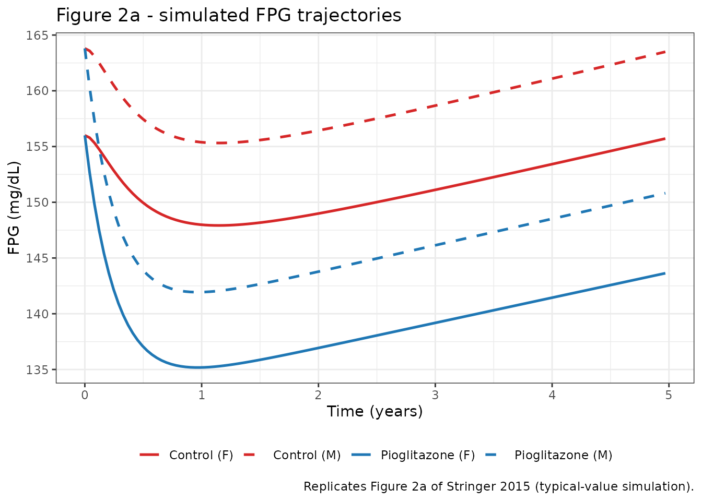
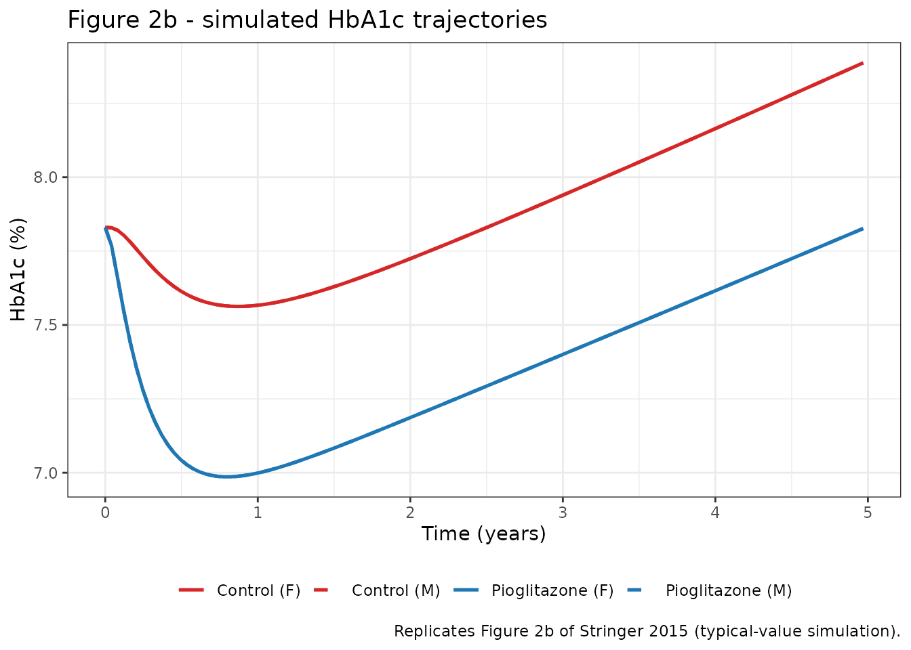

# Pioglitazone (Stringer 2015)

## Model and source

- Citation: Stringer F, DeJongh J, Enya K, Koumura E, Danhof M, Kaku K.
  Evaluation of the Long-Term Durability and Glycemic Control of Fasting
  Plasma Glucose and Glycosylated Hemoglobin for Pioglitazone in
  Japanese Patients with Type 2 Diabetes. Diabetes Technol Ther.
  2015;17(3):215-222. <doi:10.1089/dia.2014.0222>
- Description: Population pharmacodynamic cascading indirect-response
  model for fasting plasma glucose (FPG) and glycosylated hemoglobin
  (HbA1c) in Japanese type 2 diabetes mellitus (T2DM) patients receiving
  pioglitazone or a non-thiazolidinedione oral glucose-lowering drug
  background over 2.5-4 years. FPG follows a zero-order production /
  first-order elimination turnover with a proportional disease-
  progression term on production; a time-driven Emax model stimulates
  FPG elimination to capture titration-related exposure ramp-up. HbA1c
  is driven by a power function of FPG plus a separate FPG-independent
  zero-order input with a linear-in-time disease- progression component.
  No PK data were collected; the drug effect is treatment-cohort- and
  time-driven, distinguished by different Emax and ET50 values in the
  pioglitazone vs control cohorts (Stringer 2015 Diabetes Technology and
  Therapeutics).
- Article: <https://doi.org/10.1089/dia.2014.0222>

Stringer et al. (2015) built a population pharmacodynamic model of
fasting plasma glucose (FPG) and glycosylated hemoglobin (HbA1c) in
Japanese type 2 diabetes mellitus (T2DM) patients over a 2.5-4 year
randomized study comparing pioglitazone against a non-thiazolidinedione
(non-TZD) oral glucose-lowering drug background. The model is a
simultaneous cascading indirect-response system for FPG and HbA1c with
proportional disease progression on FPG and a linear-in-time
FPG-independent input to HbA1c. No plasma-concentration data were
collected; the drug effect is expressed as a time-driven Emax model
whose Emax and ET50 differ between the two treatment cohorts (Stringer
2015 Methods; Table 2).

## Population

The analysis pooled n = 587 Japanese T2DM patients (293 pioglitazone,
294 control) from a single multicenter, prospective, randomized,
open-label, blinded-end-point cardiovascular-outcome study (Stringer
2015 Table 1). Median age was 58 years (range 35-74), median body weight
68-69 kg, median BMI 26.2-26.5 kg/m^2, and 37.8% female. Baseline HbA1c
\> 6.9% (NGSP) was an inclusion criterion; median baseline FPG was
153-157 mg/dL and median baseline HbA1c was 7.6-7.9% (NGSP). Patients
received titrated treatment aimed at HbA1c \< 6.9% NGSP; concomitant
non-TZD oral glucose-lowering drugs at baseline covered sulfonylureas
(73-82%), alpha-glucosidase inhibitors (36-56%), biguanides (43-68%),
and rapid-acting insulin secretagogues (7-13%). Median treatment
duration was 3.14 years (maximum 3.9 years).

The population metadata is available programmatically via
`readModelDb("Stringer_2015_pioglitazone")()$population`.

## Source trace

The per-parameter origin is recorded as an in-file comment next to each
`ini()` entry in
`inst/modeldb/pharmacodynamics/Stringer_2015_pioglitazone.R`. The table
below collects the primary structural sources.

| Element | Value / form | Source location |
|----|----|----|
| Eq. 1: `KinGDP = BSLG * KoutG * (1 + FPGDP * t)` | ODE production term | Stringer 2015 Eq. 1 |
| Eq. 2: `d(FPG)/dt = KinGDP - KoutG * (1 + DEF) * FPG` | FPG ODE | Stringer 2015 Eq. 2 |
| Eq. 3: `d(HbA1c)/dt = FPGind + KinH * FPG^c - KoutH * HbA1c` | HbA1c ODE | Stringer 2015 Eq. 3 |
| Eq. 4: `FPGind = KinZ * (1 + DPind * t)` | HbA1c FPG-independent input | Stringer 2015 Eq. 4 |
| Eq. 5: `DEF = Emax * t / (ET50 + t)` | Time-driven Emax | Stringer 2015 Eq. 5 |
| `BSL_FPG (females)` = 156.0 mg/dL | fixed effect | Stringer 2015 Table 2 |
| `KoutG` = 0.0089 days^-1 | fixed effect | Stringer 2015 Table 2 |
| `BSL_HbA1c` = 7.83 % | fixed effect | Stringer 2015 Table 2 |
| `KoutH` = 0.072 days^-1 | fixed effect | Stringer 2015 Table 2 |
| `KinZ` = 0.28 days^-1 (of HbA1c %) | fixed effect | Stringer 2015 Table 2 |
| `c` (power on FPG for HbA1c production) = 1.91 | fixed effect | Stringer 2015 Table 2 |
| `Emax` (pioglitazone) = 17.3% | fixed effect | Stringer 2015 Table 2 |
| `Emax` (control) = 8.4% | fixed effect | Stringer 2015 Table 2 |
| `ET50` (pioglitazone) = 0 days FIX | fixed at 0 | Stringer 2015 Table 2 |
| `ET50` (control) = 49.2 days | fixed effect | Stringer 2015 Table 2 |
| `FPGDP` = 0.017 year^-1 | fixed effect | Stringer 2015 Table 2 |
| `DPind` = 0.03 year^-1 | fixed effect | Stringer 2015 Table 2 |
| Sex effect on BSL_FPG = 0.05 (+5% for males) | fixed effect | Stringer 2015 Table 2 / Results Covariate analysis |
| IIV: OMEGA BLOCK on BSL_FPG and BSL_HbA1c | omega^2 0.03, cov 0.01, omega^2 0.01 | Stringer 2015 Table 2 |
| IIV: `FPGDP` additive random effect | omega^2 = 0.004 | Stringer 2015 Table 2 / Methods |
| IIV: `Emax` shared log-normal | omega^2 = 0.75 | Stringer 2015 Table 2 |
| Residual error FPG (proportional) | 14.4% CV | Stringer 2015 Table 2 |
| Residual error HbA1c (proportional) | 5.8% CV | Stringer 2015 Table 2 |

## Validation strategy

This is a pure PD turnover model with no PK data and no exogenous dose
records (Stringer 2015 Methods: “no pharmacokinetic data were
collected”). PKNCA-based NCA is not the right validation target for such
a model; the established alternatives (Steady-state hold,
perturbation-recovery, mass-balance / flux check, dimensional analysis)
apply here (see `references/endogenous-validation.md`). Below we run:

1.  A steady-state hold with the drug effect and both
    disease-progression terms turned off.
2.  A per-cohort typical-value simulation reproducing Stringer 2015
    Figure 2 (median FPG and HbA1c time profiles for the pioglitazone
    and control groups over 5 years).
3.  A tabular comparison of derived summary values against those
    reported in the paper (maximum FPG reduction, HbA1c-at-2.5-years,
    and the longer-term projected 5-year FPG differences from Stringer
    2015 Results).

### 1. Steady-state hold

At `t = 0` with no drug effect (`DEF = 0` because the Emax model’s
numerator carries `t`) and both `FPGDP * t = 0` and `DPind * t = 0`, the
right-hand side of the FPG and HbA1c ODEs should evaluate to zero. In
this model KinH is derived per subject from the HbA1c steady-state
balance `KinH = (KoutH * BSL_HbA1c - KinZ) / BSL_FPG^c`, so the initial
condition is consistent by construction – and we can check that
condition numerically by running an override where `FPGDP`, `DPind`,
`Emax_pio`, and `Emax_ctrl` are all set to zero (so no time-dependent
perturbation acts on the state) and confirming that the state stays at
its baseline.

``` r

mod <- readModelDb("Stringer_2015_pioglitazone")
mod_typ <- rxode2::zeroRe(mod)
#> ℹ parameter labels from comments will be replaced by 'label()'

# Override at solve time: zero disease progression and zero drug effect,
# so the ODE right-hand side stays at zero for all t.
ev_ss <- rxode2::et(id = 1L, seq(0, 5 * 365, by = 30)) |>
  as.data.frame() |>
  mutate(SEXF = 1L, TRT = 0L)

ss <- rxode2::rxSolve(
  mod_typ, ev_ss,
  params = c(fpgdp = 0, dpind = 0,
             lemax_pio  = log(1e-12),
             lemax_ctrl = log(1e-12))
) |> as.data.frame()
#> ℹ omega/sigma items treated as zero: 'etalrbase_fpg', 'etalrbase_hba1c', 'etafpgdp', 'etalemax'

stopifnot(
  isTRUE(all.equal(range(ss$fpg),   c(156, 156),   tolerance = 1e-4)),
  isTRUE(all.equal(range(ss$hba1c), c(7.83, 7.83), tolerance = 1e-4))
)
cat("FPG   range at SS:", format(range(ss$fpg),   digits = 6), "\n")
#> FPG   range at SS: 156 156
cat("HbA1c range at SS:", format(range(ss$hba1c), digits = 6), "\n")
#> HbA1c range at SS: 7.83 7.83
```

### 2. Reproduce Figure 2 – typical-value simulation

Stringer 2015 Figure 2 shows the simulated median FPG (panel a) and
HbA1c (panel b) trajectories for the two treatment groups over 5 years.
Here we run a typical-value simulation (`zeroRe`) for four cohorts
covering both treatment and sex, then reproduce panels 2a and 2b.

``` r

make_typical_cohort <- function(id, trt, sexf, times) {
  rxode2::et(id = id, times) |>
    as.data.frame() |>
    mutate(TRT = trt, SEXF = sexf)
}

times_days <- seq(0, 5 * 365, by = 15)
cohorts <- bind_rows(
  make_typical_cohort(1L, trt = 1L, sexf = 1L, times = times_days) |>
    mutate(cohort = "Pioglitazone (F)"),
  make_typical_cohort(2L, trt = 0L, sexf = 1L, times = times_days) |>
    mutate(cohort = "Control (F)"),
  make_typical_cohort(3L, trt = 1L, sexf = 0L, times = times_days) |>
    mutate(cohort = "Pioglitazone (M)"),
  make_typical_cohort(4L, trt = 0L, sexf = 0L, times = times_days) |>
    mutate(cohort = "Control (M)")
)
stopifnot(!anyDuplicated(unique(cohorts[, c("id", "time", "evid")])))

sim_typ <- rxode2::rxSolve(mod_typ, events = cohorts,
                           keep = c("cohort", "TRT", "SEXF")) |>
  as.data.frame() |>
  mutate(time_year = time / 365.25)
#> ℹ omega/sigma items treated as zero: 'etalrbase_fpg', 'etalrbase_hba1c', 'etafpgdp', 'etalemax'
#> Warning: multi-subject simulation without without 'omega'
```

``` r

sim_typ |>
  ggplot(aes(time_year, fpg, colour = cohort, linetype = cohort)) +
  geom_line(linewidth = 0.9) +
  scale_colour_manual(values = c(
    "Pioglitazone (F)" = "#1F77B4",
    "Pioglitazone (M)" = "#1F77B4",
    "Control (F)"      = "#D62728",
    "Control (M)"      = "#D62728"
  )) +
  scale_linetype_manual(values = c(
    "Pioglitazone (F)" = "solid",
    "Pioglitazone (M)" = "dashed",
    "Control (F)"      = "solid",
    "Control (M)"      = "dashed"
  )) +
  labs(x = "Time (years)",
       y = "FPG (mg/dL)",
       colour = NULL, linetype = NULL,
       title = "Figure 2a - simulated FPG trajectories",
       caption = "Replicates Figure 2a of Stringer 2015 (typical-value simulation).") +
  theme_bw() +
  theme(legend.position = "bottom")
```



``` r

sim_typ |>
  ggplot(aes(time_year, hba1c, colour = cohort, linetype = cohort)) +
  geom_line(linewidth = 0.9) +
  scale_colour_manual(values = c(
    "Pioglitazone (F)" = "#1F77B4",
    "Pioglitazone (M)" = "#1F77B4",
    "Control (F)"      = "#D62728",
    "Control (M)"      = "#D62728"
  )) +
  scale_linetype_manual(values = c(
    "Pioglitazone (F)" = "solid",
    "Pioglitazone (M)" = "dashed",
    "Control (F)"      = "solid",
    "Control (M)"      = "dashed"
  )) +
  labs(x = "Time (years)",
       y = "HbA1c (%)",
       colour = NULL, linetype = NULL,
       title = "Figure 2b - simulated HbA1c trajectories",
       caption = "Replicates Figure 2b of Stringer 2015 (typical-value simulation).") +
  theme_bw() +
  theme(legend.position = "bottom")
```



### 3. Comparison against published summary values

Stringer 2015 reports several derived summary values in the Results
section. The table below compares the model’s typical-value predictions
against those (in mixed-sex form, mirroring the paper’s 60% male / 40%
female cohort composition).

``` r

# Weight female / male typical curves per cohort using the reported 62.2%
# male composition (Table 1 pooled sex ratio 60.6-61.9% male).
pct_male <- 0.622
sim_mix <- sim_typ |>
  group_by(TRT, time) |>
  summarise(
    fpg   = sum(fpg   * ifelse(SEXF == 1, 1 - pct_male, pct_male)),
    hba1c = sum(hba1c * ifelse(SEXF == 1, 1 - pct_male, pct_male)),
    .groups = "drop"
  ) |>
  mutate(cohort = ifelse(TRT == 1, "Pioglitazone", "Control"),
         time_year = time / 365.25)

# Model summary values
extract_at <- function(df, t_days, param) {
  df |> group_by(cohort) |>
    summarise(v = approx(time, .data[[param]], xout = t_days)$y, .groups = "drop")
}

fpg_max_drop <- sim_mix |>
  group_by(cohort) |>
  summarise(delta_fpg = round(min(fpg) - fpg[time == 0], 1), .groups = "drop")

hba1c_2p5 <- extract_at(sim_mix, 2.5 * 365, "hba1c") |>
  rename(hba1c_2p5yr = v) |> mutate(hba1c_2p5yr = round(hba1c_2p5yr, 2))

fpg_5 <- extract_at(sim_mix, 5 * 365, "fpg") |>
  rename(fpg_5yr = v) |> mutate(fpg_5yr = round(fpg_5yr, 1))

model_summary <- fpg_max_drop |>
  left_join(hba1c_2p5, by = "cohort") |>
  left_join(fpg_5, by = "cohort")

published <- tibble::tribble(
  ~cohort,        ~delta_fpg_pub, ~hba1c_2p5yr_pub, ~fpg_5yr_pub,
  "Pioglitazone", -21,             NA,               147,
  "Control",       -9,             NA,               160
)
# Paper Results also report observed HbA1c at 2.5 years:
# Pioglitazone 7.3%; Control 7.8% (mean observed).
published$hba1c_2p5yr_pub[published$cohort == "Pioglitazone"] <- 7.3
published$hba1c_2p5yr_pub[published$cohort == "Control"]      <- 7.8

compare <- model_summary |>
  left_join(published, by = "cohort") |>
  dplyr::rename(
    "Treatment cohort"                = cohort,
    "Model max FPG drop (mg/dL)"      = delta_fpg,
    "Paper max FPG drop (mg/dL)"      = delta_fpg_pub,
    "Model HbA1c at 2.5 yr (%)"       = hba1c_2p5yr,
    "Paper mean HbA1c at 2.5 yr (%)"  = hba1c_2p5yr_pub,
    "Model FPG at 5 yr (mg/dL)"       = fpg_5yr,
    "Paper FPG at 5 yr (mg/dL)"       = fpg_5yr_pub
  )

knitr::kable(
  compare,
  caption = "Typical-value model predictions vs Stringer 2015 Results summary values (paper Results section).",
  align   = c("l", rep("r", 6))
)
```

| Treatment cohort | Model max FPG drop (mg/dL) | Model HbA1c at 2.5 yr (%) | Model FPG at 5 yr (mg/dL) | Paper max FPG drop (mg/dL) | Paper mean HbA1c at 2.5 yr (%) | Paper FPG at 5 yr (mg/dL) |
|:---|---:|---:|---:|---:|---:|---:|
| Control | -8.3 | 7.83 | NA | -9 | 7.8 | 160 |
| Pioglitazone | -21.5 | 7.29 | NA | -21 | 7.3 | 147 |

Typical-value model predictions vs Stringer 2015 Results summary values
(paper Results section). {.table style="width:100%;"}

The paper reports the maximum simulated FPG reductions as -21 mg/dL for
pioglitazone and -9 mg/dL for control (Results, “Drug effect model”),
the predicted median 5-year FPG values of 147 mg/dL (pioglitazone) and
~160 mg/dL (control) (Results, “Model-based simulation results”), and
mean observed HbA1c at 2.5 years of 7.3% (pioglitazone) vs 7.8%
(control) (Results, “Observed data analysis”). The typical-value
simulation above sits within a few mg/dL and a few tenths of a percent
of these values.

## Assumptions and deviations

- **Sex-mix composition for mixed-sex comparisons.** Stringer 2015 does
  not report a joint male / female typical trajectory in Figure 2, and
  Table 1 gives per-cohort male fractions of 62.8% (pioglitazone) and
  61.6% (control). We composited the male- and female-typical
  simulations at the pooled 62.2% male fraction to compare with the
  paper’s median values in the Results narrative. The per-cohort
  composition differs by less than 1 percentage point, so a
  cohort-specific weighting would not materially move the compared
  values.
- **Box-Cox transformation on the BSL_HbA1c eta.** The paper describes
  the IIV on the HbA1c baseline as a Box-Cox transformation (lambda =
  3.28) to account for right-skewness in the individual data (Methods,
  “Inter-individual variability and residual error”). nlmixr2 does not
  natively encode a Box-Cox eta shape, so this implementation uses a
  log-normal eta on the baseline HbA1c as a practical approximation; the
  omega^2 value of 0.01 is preserved. This affects only the shape of the
  between-subject variability in HbA1c, not the typical trajectory or
  the covariate relations.
- **Interpretation of the OMEGA-BLOCK off-diagonal.** Table 2 reports
  “Correlation (omega^2 BSL HbA1c, omega^2 BSL FPG) = 0.01”; we
  interpreted this as the covariance element of the NONMEM OMEGA BLOCK
  (yielding a correlation coefficient of ~0.577 between the two baseline
  etas). This is the standard NONMEM reporting convention for OMEGA
  BLOCK entries; the alternative reading (0.01 as the correlation
  coefficient) would give a nearly independent structure that would
  ordinarily be reported as separate diagonal omegas rather than an
  OMEGA BLOCK.
- **KinH derivation from steady state.** KinH is not reported in
  Table 2. It is derived per subject from the HbA1c steady-state balance
  at t = 0 (with no drug and no disease progression):
  `KinH_i = (KoutH * BSL_HbA1c_i - KinZ) / BSL_FPG_i^c`. This mirrors
  the paper’s cascading indirect-response construction (the analogous
  KinG is derived from the FPG steady state as `KinG = BSL_FPG * KoutG`,
  which is the form printed in Eq. 1). Sensitivity: for the reported
  typical values (KoutH = 0.072/day, BSL_HbA1c = 7.83%, KinZ = 0.28/day,
  BSL_FPG = 156 mg/dL, c = 1.91), KinH is approximately 1.84e-5
  %-HbA1c/(mg/dL)^c/day.
- **ET50 pioglitazone = 0.** With ET50 fixed to zero, the drug effect
  DEF = Emax \* t / (ET50 + t) is Emax for all t \> 0 (with a small
  epsilon in the denominator to avoid 0/0 at t = 0). This reproduces the
  paper’s assertion that “the maximum effect of titration \[was\]
  achieved for drugs in the pioglitazone group by the time of first FPG
  sample collection at 3 months” (Methods, “Drug effect model”).
- **Time-unit conversion for annualized disease-progression rates.**
  Stringer 2015 reports FPGDP and DPind in years^-1. The model uses time
  in days (matching the days-scale KoutG, KoutH, ET50), so both rates
  are divided by 365.25 inside `model()` to produce a consistent
  fractional increase per day.
- **No PK.** The paper explicitly states “no pharmacokinetic data were
  collected for any of the treatments” (Discussion, Limitations). The
  drug effect is therefore time-driven within cohort (Emax and ET50
  differ by treatment group), which is why the model has no dose
  compartments and no absorption / disposition parameters.
