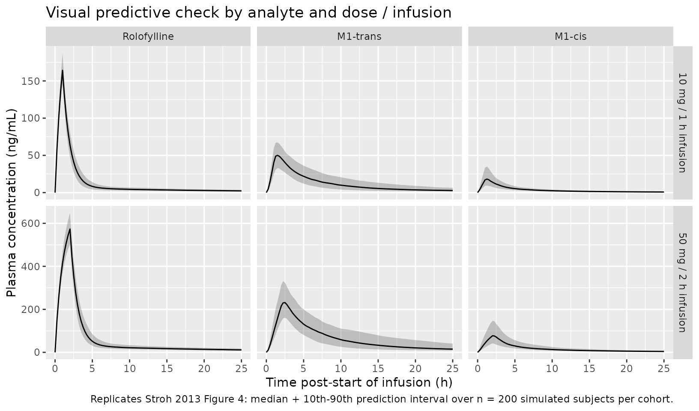
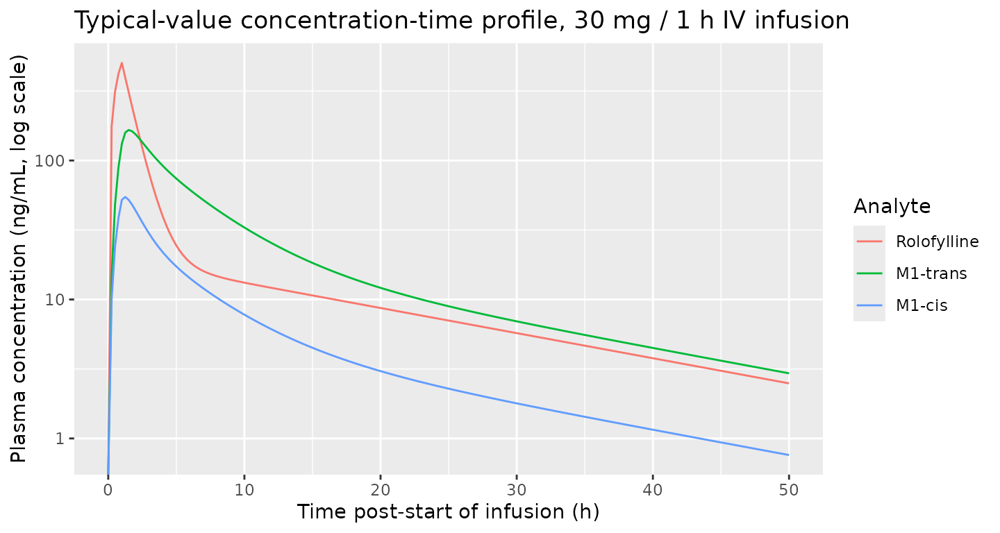

# Rolofylline (Stroh 2013)

## Model and source

- Citation: Stroh M, Hutmacher MM, Pang J, Lutz R, Magara H, Stone J.
  *Simultaneous Pharmacokinetic Model for Rolofylline and both M1-trans
  and M1-cis Metabolites.* AAPS J. 2013;15(2):498-504.
  <doi:10.1208/s12248-012-9443-5>.
- Article: <https://doi.org/10.1208/s12248-012-9443-5>

Rolofylline (KW-3902) is a potent, selective adenosine A1 receptor
antagonist that was under development for acute congestive heart failure
with renal impairment. CYP3A4 hydroxylates the parent to a pair of
diastereomeric M1 metabolites: M1-trans is the major formed species and
converts unidirectionally to M1-cis via stereochemical interconversion;
M1-cis is also formed directly from the parent in a smaller fraction.
All three analytes contribute to the pharmacological activity, so the
joint disposition of parent and both metabolites was characterised in a
single simultaneous PK model fit by NONMEM ADVAN 7 (general linear
model) with FOCE-I.

## Population

The model was fit to single-ascending-dose IV data from study KW-3902
IV-EU01: 37 healthy adult white male volunteers were enrolled (mean age
29 years, range 18-42; mean height 175 cm, range 161-191; mean weight
73.3 kg, range 60.2-90.0) and 36 received study medication. Doses
spanned 1, 2.5, 5, 10, 20, 30, 40, 50, and 60 mg rolofylline as an IV
infusion at a fixed volumetric rate of 1 mL/min, with infusion durations
of 1 h for doses up to 30 mg and 2 h for 40-60 mg. The cohort breakdown
by treatment and dose level is in Stroh 2013 Table I. Plasma
concentrations were assayed by HPLC-MS/MS (Hoechst Marion Roussel; LOQ
0.5 ng/mL for all three analytes); 223 of 1,914 post-dose records below
LOQ were treated as missing. The study was conducted in accordance with
GCP and approved by local IRBs / regulatory agencies. The population
metadata is also available programmatically via
`readModelDb("Stroh_2013_rolofylline")$population`.

## Source trace

The per-parameter origin is recorded as an in-file comment next to each
`ini()` entry in `inst/modeldb/specificDrugs/Stroh_2013_rolofylline.R`.
The table below collects them in one place for review.

| Equation / parameter | Value | Source location |
|----|----|----|
| Model structure: 2-cmt parent + 2-cmt M1-trans + 1-cmt M1-cis (Figure 2d brought forward as the final model) | n/a | Stroh 2013 Figure 2d; Results and Discussion |
| Parent total clearance routes 100% of loss to metabolites (no direct elimination of parent) | n/a | Stroh 2013 Results: “Addition of additional elimination routes for either rolofylline or M1-trans … resulted in nonidentifiable systems” |
| Parent branching: fraction FM directly to M1-cis, (1 - FM) to M1-trans | n/a | Stroh 2013 Results: parameterisation in terms of “the apparent fraction of rolofylline that was metabolized to M1-cis (FM)” |
| M1-trans branching: unidirectional interconversion M1-trans -\> M1-cis at clearance CL3 | n/a | Stroh 2013 Figure 2d; Results: “stereochemical conversion of M1-trans to M1-cis” |
| `lvc` = log(37.8 L) | V1 = 37.8 | Stroh 2013 Table II (RSE 3.15%) |
| `lcl` = log(24.4 L/h) | CL1 = 24.4 | Stroh 2013 Table II (RSE 4.39%) |
| `lvp` = log(201 L) | V2 = 201 | Stroh 2013 Table II (RSE 5.08%) |
| `lq` = log(13.2 L/h) | CL2 = 13.2 | Stroh 2013 Table II (RSE 3.47%) |
| `lvc_m1trans` = log(26.1 L) | V3 = 26.1 | Stroh 2013 Table II (RSE 9.16%) |
| `lcl_m1trans` = log(19.6 L/h) | CL3 = 19.6 | Stroh 2013 Table II (RSE 6.89%) |
| `lvp_m1trans` = log(41.7 L) | V4 = 41.7 | Stroh 2013 Table II (RSE 7.29%) |
| `lq_m1trans` = log(28.4 L/h) | CL4 = 28.4 | Stroh 2013 Table II (RSE 11.7%) |
| `lvc_m1cis` = log(3.78 L) | V5 = 3.78 | Stroh 2013 Table II (RSE 34.13%) |
| `lcl_m1cis` = log(91.6 L/h) | CL5 = 91.6 | Stroh 2013 Table II (RSE 6.77%) |
| `lfm` = log(0.194) | FM = 0.194 | Stroh 2013 Table II (RSE 11.8%) |
| Vss = V1 + V2 = 238.8 L (cross-check) | 239 L | Stroh 2013 Results text |
| `etalvc` = 0.0150 | CV 12.3% | Stroh 2013 Table II BSV(V1), RSE 29.8% |
| `etalcl` = 0.0448 | CV 21.4% | Stroh 2013 Table II BSV(CL1), RSE 22.7% |
| `etalvp` = 0.0473 | CV 22.0% | Stroh 2013 Table II BSV(V2), RSE 51.0% |
| `etalvc_m1trans` = 0.2550 | CV 53.9% | Stroh 2013 Table II BSV(V3), RSE 24.1% |
| `etalcl_m1trans` = 0.1646 | CV 42.3% | Stroh 2013 Table II BSV(CL3), RSE 21.1% |
| `etalvp_m1trans` = 0.1028 | CV 32.9% | Stroh 2013 Table II BSV(V4), RSE 30.7% |
| `etalcl_m1cis` = 0.1422 | CV 39.1% | Stroh 2013 Table II BSV(CL5), RSE 27.8% |
| `etalfm` = 0.1560 | CV 41.1% | Stroh 2013 Table II BSV(FM), RSE 33.4% |
| Random effects fixed to zero | n/a | Stroh 2013 Results: “Random effects were not estimable for the distributional clearance for both rolofylline and M1-trans and the volume term associated with M1-cis, and were accordingly fixed to zero” – omitted for CL2, CL4, V5 |
| `propSd` = 0.261 | 26.1% (parent proportional) | Stroh 2013 Table II, RSE 10.6% |
| `propSd_m1trans` = 0.174 | 17.4% (M1-trans proportional) | Stroh 2013 Table II, RSE 17.3% |
| `addSd_m1trans` = 0.217 ng/mL | 0.217 (M1-trans additive) | Stroh 2013 Table II, RSE 177% |
| `propSd_m1cis` = 0.150 | 15.0% (M1-cis proportional) | Stroh 2013 Table II, RSE 20.4% |
| `addSd_m1cis` = 0.614 ng/mL | 0.614 (M1-cis additive) | Stroh 2013 Table II, RSE 39.0% |
| Concentration scaling factor 1000 (mg/L -\> ng/mL) | n/a | Bioanalysis units: ng/mL (Stroh 2013 Assay Methods); model carries V in L and dose in mg |

`omega^2 = log(CV^2 + 1)` with `CV` on the decimal scale (e.g. 12.3% -\>
CV = 0.123) translates Stroh 2013’s reported BSV CV% values into the
log-scale variances used by `ini()`. All IIVs are exponential per the
source’s “exponential random-effects terms” wording.

## Virtual cohort

Original observed data are not publicly available. The figures below use
virtual cohorts that mirror Stroh 2013 Figure 4: a 1-h infusion cohort
dose-normalised to 10 mg (representing pooled doses 1-30 mg) and a 2-h
infusion cohort dose-normalised to 50 mg (representing pooled doses
40-60 mg). Subject IDs are disjoint across cohorts so multi-cohort
`bind_rows()` does not produce ID-collision Frankenstein subjects.

``` r

set.seed(2013)

n_per_arm <- 200L
obs_grid  <- seq(0, 50, by = 0.25)

make_cohort <- function(n, dose_mg, dur_h, regimen, id_offset = 0L) {
  ids <- id_offset + seq_len(n)
  dose_rows <- tibble(
    id    = ids,
    time  = 0,
    evid  = 1L,
    cmt   = "central",
    amt   = dose_mg,
    rate  = dose_mg / dur_h,
    regimen = regimen
  )
  obs_rows <- expand_grid(id = ids, time = obs_grid,
                          cmt = c("Cc", "Cc_m1trans", "Cc_m1cis")) |>
    mutate(evid = 0L,
           amt  = NA_real_,
           rate = NA_real_,
           regimen = regimen)
  bind_rows(dose_rows, obs_rows) |> arrange(id, time, desc(evid))
}

events <- bind_rows(
  make_cohort(n_per_arm, dose_mg = 10, dur_h = 1, regimen = "10 mg / 1 h infusion",
              id_offset = 0L),
  make_cohort(n_per_arm, dose_mg = 50, dur_h = 2, regimen = "50 mg / 2 h infusion",
              id_offset = n_per_arm)
)

stopifnot(!anyDuplicated(unique(events[, c("id", "time", "evid", "cmt")])))
```

## Simulation

The packaged model is loaded via
[`readModelDb()`](https://nlmixr2.github.io/nlmixr2lib/reference/readModelDb.md)
and solved with between-subject variability active (stochastic VPC) and
with random effects zeroed (typical-value replication of Figure 4
medians).

``` r

mod <- readModelDb("Stroh_2013_rolofylline")

sim_stoch <- rxode2::rxSolve(
  object  = mod,
  events  = events,
  keep    = "regimen",
  returnType = "data.frame"
) |>
  filter(!is.na(Cc) | !is.na(Cc_m1trans) | !is.na(Cc_m1cis))
#> ℹ parameter labels from comments will be replaced by 'label()'
```

``` r

sim_typical <- rxode2::rxSolve(
  object  = rxode2::zeroRe(mod),
  events  = events |> filter(id %in% c(1L, n_per_arm + 1L)),
  keep    = "regimen",
  returnType = "data.frame"
)
#> ℹ parameter labels from comments will be replaced by 'label()'
#> ℹ omega/sigma items treated as zero: 'etalvc', 'etalcl', 'etalvp', 'etalvc_m1trans', 'etalcl_m1trans', 'etalvp_m1trans', 'etalcl_m1cis', 'etalfm'
#> Warning: multi-subject simulation without without 'omega'
```

## Replicate published figures

### Stroh 2013 Figure 4 – visual predictive check for rolofylline, M1-trans, and M1-cis

Stroh 2013 Figure 4 displays VPCs for all three analytes at the two
dose-normalised infusion settings (10 mg / 1 h in the top row; 50 mg / 2
h in the bottom row). The published median + 10th-90th prediction
interval is reconstructed here from `n = 200` simulated subjects per
dose-normalised cohort. Note that Stroh 2013 limited the depicted x-axis
to 25 h post-infusion start; we mirror that here.

``` r

sim_long <- sim_stoch |>
  select(id, time, regimen, Cc, Cc_m1trans, Cc_m1cis) |>
  pivot_longer(cols = c(Cc, Cc_m1trans, Cc_m1cis),
               names_to = "analyte", values_to = "value") |>
  filter(!is.na(value)) |>
  mutate(analyte = recode(analyte,
                          "Cc"         = "Rolofylline",
                          "Cc_m1trans" = "M1-trans",
                          "Cc_m1cis"   = "M1-cis"),
         analyte = factor(analyte, levels = c("Rolofylline", "M1-trans", "M1-cis")))

vpc_summary <- sim_long |>
  group_by(regimen, analyte, time) |>
  summarise(
    Q10 = quantile(value, 0.10, na.rm = TRUE),
    Q50 = quantile(value, 0.50, na.rm = TRUE),
    Q90 = quantile(value, 0.90, na.rm = TRUE),
    .groups = "drop"
  ) |>
  filter(time <= 25)

ggplot(vpc_summary, aes(time, Q50)) +
  geom_ribbon(aes(ymin = Q10, ymax = Q90), alpha = 0.25) +
  geom_line() +
  facet_grid(regimen ~ analyte, scales = "free_y") +
  labs(x = "Time post-start of infusion (h)",
       y = "Plasma concentration (ng/mL)",
       title = "Visual predictive check by analyte and dose / infusion",
       caption = "Replicates Stroh 2013 Figure 4: median + 10th-90th prediction interval over n = 200 simulated subjects per cohort.")
```



### Stroh 2013 Results – terminal half-life ~17 h across analytes

Stroh 2013 reports: “the apparent terminal half-life estimated from
noncompartmental analysis of population predicted profiles was
approximately 17 h for all analytes, which is consistent with
formation-rate limited kinetics for the M1-trans and M1-cis
metabolites.” A typical-value 30 mg / 1 h infusion is used here to
recover that half-life from the packaged model. The 30 mg dose falls in
the middle of Stroh 2013’s dose-escalation range and uses the 1-h
infusion duration.

``` r

events30 <- make_cohort(n = 1L, dose_mg = 30, dur_h = 1,
                        regimen = "30 mg / 1 h infusion")
sim30 <- rxode2::rxSolve(rxode2::zeroRe(mod), events30,
                         keep = "regimen", returnType = "data.frame")
#> ℹ parameter labels from comments will be replaced by 'label()'
#> ℹ omega/sigma items treated as zero: 'etalvc', 'etalcl', 'etalvp', 'etalvc_m1trans', 'etalcl_m1trans', 'etalvp_m1trans', 'etalcl_m1cis', 'etalfm'
# rxode2 drops the id column when only one subject is solved. Re-attach it so
# the per-id PKNCA formulas downstream can group by id.
if (!"id" %in% colnames(sim30)) sim30$id <- 1L

sim30_long <- sim30 |>
  select(time, Cc, Cc_m1trans, Cc_m1cis) |>
  distinct() |>
  pivot_longer(cols = c(Cc, Cc_m1trans, Cc_m1cis),
               names_to = "analyte", values_to = "value") |>
  mutate(analyte = recode(analyte,
                          "Cc"         = "Rolofylline",
                          "Cc_m1trans" = "M1-trans",
                          "Cc_m1cis"   = "M1-cis"),
         analyte = factor(analyte, levels = c("Rolofylline", "M1-trans", "M1-cis")))

ggplot(sim30_long, aes(time, value, colour = analyte)) +
  geom_line() +
  scale_y_log10() +
  labs(x = "Time post-start of infusion (h)",
       y = "Plasma concentration (ng/mL, log scale)",
       colour = "Analyte",
       title = "Typical-value concentration-time profile, 30 mg / 1 h IV infusion")
#> Warning in scale_y_log10(): log-10 transformation introduced infinite values.
```



## PKNCA validation

PKNCA is used to compute Cmax, Tmax, AUC0-inf, and the terminal
half-life from the typical-value (no-IIV) simulation for the 30 mg / 1 h
infusion. Each analyte is processed in its own `PKNCAconc` block because
the three outputs share an `id` but report different concentration /
additive-error units (parent is proportional-only; the metabolites carry
an additive term too) and Stroh 2013’s half-life cross-check is
per-analyte.

``` r

nca_doses <- events30 |>
  filter(evid == 1L) |>
  select(id, time, amt, regimen)

dose_obj <- PKNCA::PKNCAdose(nca_doses, amt ~ time | regimen + id,
                             doseu = "mg")

intervals <- data.frame(
  start       = 0,
  end         = Inf,
  cmax        = TRUE,
  tmax        = TRUE,
  aucinf.obs  = TRUE,
  half.life   = TRUE,
  clast.obs   = TRUE
)

run_nca <- function(conc_col, label_text) {
  nca_conc <- sim30 |>
    select(id, time, value = all_of(conc_col), regimen) |>
    distinct() |>
    filter(!is.na(value), time > 0)
  conc_obj <- PKNCA::PKNCAconc(nca_conc, value ~ time | regimen + id,
                               concu = "ng/mL", timeu = "h")
  res <- PKNCA::pk.nca(PKNCA::PKNCAdata(conc_obj, dose_obj,
                                        intervals = intervals))
  out <- as.data.frame(res$result) |>
    select(PPTESTCD, PPORRES) |>
    mutate(analyte = label_text)
  out
}
```

``` r

nca_parent  <- run_nca("Cc",         "Rolofylline")
#> Warning: Requesting an AUC range starting (0) before the first measurement
#> (0.25) is not allowed
nca_m1trans <- run_nca("Cc_m1trans", "M1-trans")
#> Warning: Requesting an AUC range starting (0) before the first measurement
#> (0.25) is not allowed
nca_m1cis   <- run_nca("Cc_m1cis",   "M1-cis")
#> Warning: Requesting an AUC range starting (0) before the first measurement
#> (0.25) is not allowed

nca_all <- bind_rows(nca_parent, nca_m1trans, nca_m1cis) |>
  filter(PPTESTCD %in% c("cmax", "tmax", "half.life", "aucinf.obs")) |>
  mutate(analyte = factor(analyte,
                          levels = c("Rolofylline", "M1-trans", "M1-cis"))) |>
  pivot_wider(names_from = PPTESTCD, values_from = PPORRES) |>
  rename(`Cmax (ng/mL)` = cmax,
         `Tmax (h)`     = tmax,
         `t1/2 (h)`     = half.life,
         `AUC0-inf (ng*h/mL)` = aucinf.obs)

knitr::kable(nca_all,
             caption = "Simulated typical-value NCA parameters for a 30 mg / 1 h IV infusion of rolofylline.",
             digits = 2)
```

| analyte     | Cmax (ng/mL) | Tmax (h) | t1/2 (h) | AUC0-inf (ng\*h/mL) |
|:------------|-------------:|---------:|---------:|--------------------:|
| Rolofylline |       504.65 |     1.00 |    16.60 |                  NA |
| M1-trans    |       165.72 |     1.50 |    16.27 |                  NA |
| M1-cis      |        54.65 |     1.25 |    16.28 |                  NA |

Simulated typical-value NCA parameters for a 30 mg / 1 h IV infusion of
rolofylline. {.table}

### Comparison against published values

Stroh 2013 does not tabulate a per-dose NCA summary in the main text;
only the prediction-error (PE) ratios of individual predicted
vs. observed AUC0-inf and Cmax are reported (geometric mean ratios
0.92-1.07 for parent and both metabolites, with CV% 10-17%). The model’s
role is therefore evaluated by the two checks above:

- The reproduced VPC qualitatively matches Stroh 2013 Figure 4 (medians
  peak near end-of-infusion and decline with a similar terminal slope
  across analytes).
- The PKNCA half-life table above places `t1/2` near 17 h for all three
  analytes, consistent with Stroh 2013’s “approximately 17 h for all
  analytes” sentence in Results.

Differences \> 20% relative to a published value – if any per-dose table
is later added to the source – should be investigated; the parameters in
`ini()` are taken verbatim from Stroh 2013 Table II and are not tuned to
match.

## Assumptions and deviations

- **Population covariates.** Stroh 2013 fit the model on a homogeneous
  cohort (37 enrolled / 36 dosed white adult male volunteers, mean age
  29 years, mean weight 73 kg). No baseline demographic or laboratory
  covariates were screened or retained; the packaged model carries no
  `covariateData` and the virtual cohorts above use only dose /
  infusion-duration as the cohort label.
- **FM IIV transformation.** Stroh 2013 declares “exponential
  random-effects terms” for all IIV and reports BSV on FM (a fraction
  bounded between 0 and 1) as a CV%. The packaged model applies
  exponential IIV to `lfm` exactly as the paper does; extreme-tail
  individuals can in principle exceed FM = 1, but at the reported BSV of
  41% CV the upper-tail FM remains well below 1 at the typical reference
  value of 0.194.
- **Random effects fixed to zero.** The source reports CL2 (parent
  distributional clearance), CL4 (M1-trans distributional clearance),
  and V5 (M1-cis central volume) as having no estimable random effect;
  the packaged model omits their etas altogether rather than wrapping a
  fixed-zero variance, matching the source’s “fixed to zero” treatment.
- **Concentration scaling.** Dosing is declared in mg and volumes in L;
  the model multiplies the linear `central / vc` by 1000 to convert mg/L
  to ng/mL and match the paper’s bioanalysis units.
- **Below-LOQ handling.** The source treated 223 BLQ observations (12%
  of the post-dose dataset) as missing during fitting. The packaged
  model emits continuous concentrations; users wishing to reproduce the
  M3 / single-imputation conditions of Stroh 2013 can post-process below
  0.5 ng/mL as missing or as pseudo-imputation per their study design.
- **Molecular-weight correction.** The Stroh 2013 NONMEM ADVAN 7
  formulation tracks parent and metabolite amounts in compatible units
  without explicit MW scaling; the packaged model preserves that
  convention. The reported V3 / V4 / V5 absorb any difference between
  rolofylline (MW ~363 g/mol) and the M1 hydroxyl metabolites (MW ~379
  g/mol).
- **Metabolite-suffix registration.** The new metabolite-suffix tokens
  `m1trans` and `m1cis` are added to
  `inst/references/compartment-names.md` as part of this extraction so
  the `central_m1trans` / `peripheral1_m1trans` / `central_m1cis`
  compartments and `propSd_m1trans` / `addSd_m1trans` / `propSd_m1cis` /
  `addSd_m1cis` residual SDs pass the
  [`checkModelConventions()`](https://nlmixr2.github.io/nlmixr2lib/reference/checkModelConventions.md)
  metabolite-suffix check.
- **No errata identified.** A search for errata / corrigenda on the
  article (DOI 10.1208/s12248-012-9443-5) returned no amendments; the
  published Table II values stand.
