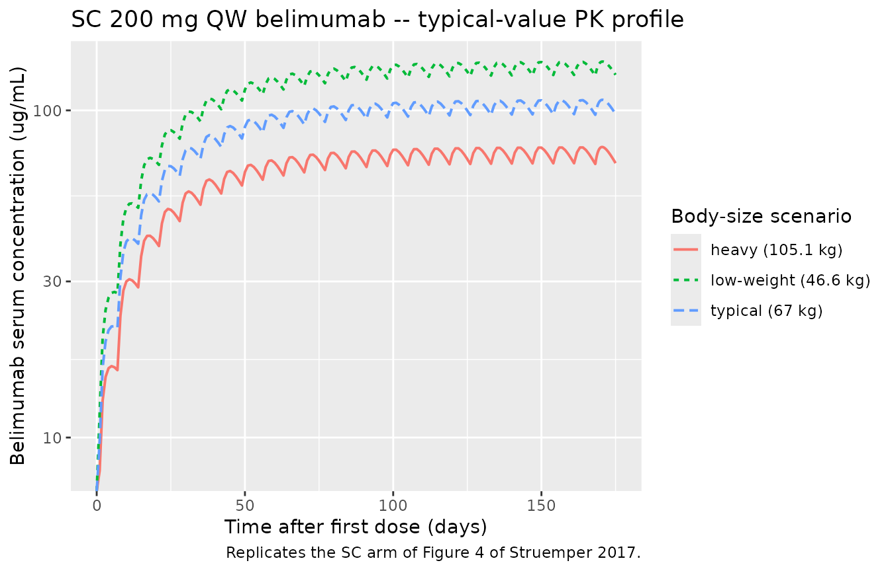
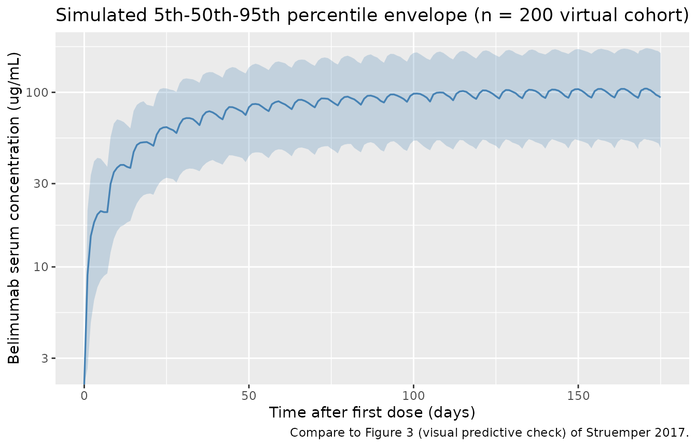

# Belimumab (Struemper 2017)

## Model and source

``` r

mod <- readModelDb("Struemper_2017_belimumab")
mod_meta <- rxode2::rxode(mod)
#> ℹ parameter labels from comments will be replaced by 'label()'
```

- Citation: Struemper H, Thapar M, Roth D. Population Pharmacokinetic
  and Pharmacodynamic Analysis of Belimumab Administered Subcutaneously
  in Healthy Volunteers and Patients with Systemic Lupus Erythematosus.
  Clin Pharmacokinet. 2018;57(6):717-728.
  <doi:10.1007/s40262-017-0586-5>
- Description: Linear two-compartment subcutaneous population PK model
  for belimumab in healthy volunteers and adult patients with systemic
  lupus erythematosus, with first-order absorption + lag time,
  allometric body-weight scaling on CL/Vc/Q/Vp, and baseline BMI on Vc
  and baseline albumin and IgG on CL (Struemper 2017)
- Article: <https://doi.org/10.1007/s40262-017-0586-5> (open access)

## Population

The Struemper 2017 final population-pharmacokinetic dataset pools 688
individuals across three studies of belimumab (Table 1 and Table 2 of
the source): 134 healthy volunteers from two phase I studies (BEL114448
in the USA and BEL116119 in Japan) and 554 adults with active
autoantibody-positive systemic lupus erythematosus (SLE) from the global
phase III BLISS-SC study (BEL112341). 85% of the participants were
female and the racial composition was 61% White, 23.5% Asian, 11% Black,
6% American Indian or Alaska Native, and 1.7% Other. Baseline body
weight was 70.0 (SD 17.6) kg (median 67.0 kg, range 34.1-138 kg) and
baseline BMI was 26.1 (SD 6.18) kg/m^2 (median 24.7 kg/m^2). Baseline
laboratory means were IgG 14.9 (SD 5.43) g/L, albumin 40.7 (SD 4.47)
g/L, creatinine clearance 115 (SD 38.3) mL/min, haemoglobin 126 (SD
15.8) g/L, and WBC 6.09 (SD 2.41) Gi/L.

The same metadata is available programmatically via
`rxode2::rxode(readModelDb("Struemper_2017_belimumab"))$population`.

## Source trace

| Quantity | Value | Source location |
|----|----|----|
| `lka` (Kabs) | log(0.235 1/day) | Table 3, THETA(5) |
| `lcl` (CL) | log(0.204 L/day) | Table 3, THETA(1): 204 mL/day |
| `lvc` (Vc) | log(2.300 L) | Table 3, THETA(2): 2300 mL |
| `lq` (Q) | log(0.698 L/day) | Table 3, THETA(3): 698 mL/day |
| `lvp` (Vp) | log(2.650 L) | Table 3, THETA(4): 2650 mL |
| `lfdepot` (F) | log(0.742) | Table 3, THETA(6) |
| `lalag` (ALAG) | log(0.179 day) | Table 3, THETA(7) |
| `e_wt_cl` | fixed(0.75) | Table 3 BWT effect on CL (fixed allometric) + Section 3.1.2 |
| `e_wt_vc` | fixed(1.00) | Table 3 BWT effect on Vc (fixed allometric) + Section 3.1.2 (“body weight on … Vc (power coefficients of … 1.00)”) |
| `e_wt_q` | fixed(0.75) | Table 3 BWT effect on Q (fixed allometric) |
| `e_wt_vp` | fixed(0.8) | Table 3 row header “Vp \[mL\] 0.8” (fixed; see Assumptions and deviations) |
| `e_alb_cl` | -0.736 | Table 3 BALB effect on CL (estimated) |
| `e_igg_cl` | 0.347 | Table 3 BIGG effect on CL (estimated) |
| `e_bmi_vc` | -0.610 | Table 3 BBMI effect on Vc (estimated) |
| `etalcl` / `etalvc` block | c(0.0910, 0.0630, 0.497) | Table 3 OMEGA(1,1), OMEGA(2,1), OMEGA(2,2) |
| `etalq` | 1.07 | Table 3 OMEGA(3,3) |
| `etalvp` | 0.110 | Table 3 OMEGA(4,4) |
| `propSd` | 0.1808 (= sqrt(0.0327)) | Table 3 SIGMA(1) proportional variance |
| `addSd` | 0.3661 ug/mL (= sqrt(0.134)) | Table 3 SIGMA(2) additive variance |
| 2-compartment ODE (ADVAN3 TRANS4) + first-order absorption with lag | n/a | Section 2.3.2 and 3.1.2 |

## Virtual cohort

The original belimumab serum-concentration data are not publicly
available. The following virtual cohorts approximate the Struemper 2017
Table 2 demographics for the population-typical subject and for the
body-weight / BMI extremes used in Figure 4 of the source paper.

``` r

set.seed(2017)

# Per Figure 4 caption: typical = population median (67 kg, BMI 24.7);
# low-weight scenario = 5th-percentile BWT (46.6 kg) and BMI (18.4 kg/m^2);
# heavy scenario = 95th-percentile BWT (105.1 kg) and BMI (38.5 kg/m^2).
# All scenarios hold ALB and IGG at the population medians (41 g/L, 13.7 g/L).
typical_subjects <- tribble(
  ~treatment,            ~WT,  ~BMI,  ~ALB, ~IGG,
  "typical (67 kg)",      67.0, 24.7,  41,   13.7,
  "low-weight (46.6 kg)", 46.6, 18.4,  41,   13.7,
  "heavy (105.1 kg)",    105.1, 38.5,  41,   13.7
) |>
  mutate(id = seq_len(n()))

# Stochastic SLE-like cohort whose continuous covariates match Table 2
# (means / SDs / ranges; lognormal for strictly-positive lab values).
n_pop <- 200
pop_cohort <- tibble(
  id = 100L + seq_len(n_pop),
  WT  = pmin(pmax(rnorm(n_pop, mean = 70.0, sd = 17.6), 34.1), 138),
  BMI = pmin(pmax(rnorm(n_pop, mean = 26.1, sd = 6.18), 14.8), 72.7),
  ALB = pmin(pmax(rnorm(n_pop, mean = 40.7, sd = 4.47), 18.0), 55.0),
  IGG = pmin(pmax(rlnorm(n_pop, meanlog = log(13.7), sdlog = 0.35), 4.7), 53.5),
  treatment = "virtual cohort (n=200, Table 2 demographics)"
)

make_events <- function(cohort_df) {
  # 200 mg SC weekly for 25 doses (days 0, 7, ..., 168).
  # Observations: every 1 day on [0, 175] for the full-profile figure, plus a
  # dense grid (every 0.05 day) on the last full dosing interval [168, 175]
  # so PKNCA has enough points to characterize Cmax / Tmax / AUCtau at SS.
  dose_times <- seq(0, 168, by = 7)
  obs_plot   <- seq(0, 175, by = 1)
  obs_nca    <- seq(168, 175, by = 0.05)
  obs_times  <- unique(sort(c(obs_plot, obs_nca)))

  dosing <- expand_grid(id = cohort_df$id, time = dose_times) |>
    mutate(amt = 200, evid = 1L, cmt = "depot")
  observations <- expand_grid(id = cohort_df$id, time = obs_times) |>
    mutate(amt = 0,  evid = 0L, cmt = "central")

  bind_rows(dosing, observations) |>
    left_join(cohort_df, by = "id") |>
    arrange(id, time, desc(evid))
}

events_typ <- make_events(typical_subjects)
events_pop <- make_events(pop_cohort)
stopifnot(!anyDuplicated(unique(events_pop[, c("id", "time", "evid")])))
```

## Simulation

``` r

# Population simulation with full IIV for the VPC.
sim_pop <- rxode2::rxSolve(
  mod, events = events_pop,
  keep = c("treatment", "WT", "BMI", "ALB", "IGG")
) |> as.data.frame()
#> ℹ parameter labels from comments will be replaced by 'label()'

# Typical-value (no IIV) simulation for the Figure 4 replication.
mod_typ <- rxode2::zeroRe(mod)
#> ℹ parameter labels from comments will be replaced by 'label()'
sim_typ <- rxode2::rxSolve(
  mod_typ, events = events_typ,
  keep = c("treatment", "WT", "BMI")
) |> as.data.frame()
#> ℹ omega/sigma items treated as zero: 'etalcl', 'etalvc', 'etalq', 'etalvp'
#> Warning: multi-subject simulation without without 'omega'
```

## Replicate published figures

### Figure 4 – SC belimumab 200 mg QW profile under body-size scenarios

The blue solid line in Figure 4 of the source paper shows the
typical-subject SC PK profile; the dotted and dashed lines show the same
model at 5th- and 95th-percentile body weight / BMI. The simulated
profiles below reproduce those scenarios for the SC arm.

``` r

sim_typ |>
  dplyr::filter(time <= 175, !is.na(Cc)) |>
  ggplot(aes(time, Cc, colour = treatment, linetype = treatment)) +
  geom_line(linewidth = 0.7) +
  scale_y_log10() +
  labs(
    x = "Time after first dose (days)",
    y = "Belimumab serum concentration (ug/mL)",
    colour = "Body-size scenario",
    linetype = "Body-size scenario",
    title = "SC 200 mg QW belimumab -- typical-value PK profile",
    caption = "Replicates the SC arm of Figure 4 of Struemper 2017."
  )
#> Warning in scale_y_log10(): log-10 transformation introduced infinite values.
```



### Visual predictive distribution at the population level

``` r

vpc_summary <- sim_pop |>
  dplyr::filter(!is.na(Cc), time <= 175) |>
  dplyr::group_by(time) |>
  dplyr::summarise(
    Q05 = quantile(Cc, 0.05, na.rm = TRUE),
    Q50 = quantile(Cc, 0.50, na.rm = TRUE),
    Q95 = quantile(Cc, 0.95, na.rm = TRUE),
    .groups = "drop"
  )

ggplot(vpc_summary, aes(time, Q50)) +
  geom_ribbon(aes(ymin = Q05, ymax = Q95), alpha = 0.25, fill = "steelblue") +
  geom_line(colour = "steelblue", linewidth = 0.6) +
  scale_y_log10() +
  labs(
    x = "Time after first dose (days)",
    y = "Belimumab serum concentration (ug/mL)",
    title = "Simulated 5th-50th-95th percentile envelope (n = 200 virtual cohort)",
    caption = "Compare to Figure 3 (visual predictive check) of Struemper 2017."
  )
#> Warning in scale_y_log10(): log-10 transformation introduced infinite values.
#> log-10 transformation introduced infinite values.
#> log-10 transformation introduced infinite values.
#> log-10 transformation introduced infinite values.
```



## PKNCA validation

NCA is performed over the last full dosing interval \[168, 175\] days
(week 25), when the simulation is at steady state per the source paper’s
observation that SS is reached by week 11.

``` r

tau <- 7  # days
start_ss <- 168
end_ss   <- 175

sim_nca_typ <- sim_typ |>
  dplyr::filter(!is.na(Cc), time >= start_ss, time <= end_ss) |>
  dplyr::select(id, time, Cc, treatment)

dose_typ_df <- events_typ |>
  dplyr::filter(evid == 1L, time == start_ss) |>
  dplyr::select(id, time, amt, treatment)

conc_obj_typ <- PKNCA::PKNCAconc(
  sim_nca_typ, Cc ~ time | treatment + id,
  concu = "ug/mL", timeu = "day"
)
dose_obj_typ <- PKNCA::PKNCAdose(
  dose_typ_df, amt ~ time | treatment + id,
  doseu = "mg"
)

intervals_ss <- data.frame(
  start    = start_ss,
  end      = end_ss,
  cmax     = TRUE,
  tmax     = TRUE,
  cmin     = TRUE,
  ctrough  = TRUE,
  cav      = TRUE,
  auclast  = TRUE
)

res_typ <- PKNCA::pk.nca(
  PKNCA::PKNCAdata(conc_obj_typ, dose_obj_typ, intervals = intervals_ss)
)

nca_typ_tbl <- as.data.frame(res_typ$result) |>
  dplyr::select(treatment, PPTESTCD, PPORRES) |>
  tidyr::pivot_wider(names_from = PPTESTCD, values_from = PPORRES)

knitr::kable(
  nca_typ_tbl,
  digits  = 3,
  caption = "Steady-state NCA from the typical-value simulation."
)
```

| treatment            | auclast |    cmax |    cmin | tmax |     cav | ctrough |
|:---------------------|--------:|--------:|--------:|-----:|--------:|--------:|
| heavy (105.1 kg)     | 518.427 |  77.276 |  68.581 | 2.45 |  74.061 |      NA |
| low-weight (46.6 kg) | 953.498 | 140.974 | 127.813 | 2.60 | 136.214 |      NA |
| typical (67 kg)      | 726.388 | 107.695 |  96.923 | 2.55 | 103.770 |      NA |

Steady-state NCA from the typical-value simulation. {.table}

### Comparison against the published steady-state NCA

For the typical 67-kg subject the paper reports (Section 3.1.2 and
Figure 4): AUCtau = 726 day\*ug/mL, Cmax,ss = 108 ug/mL, Cmin,ss = 97
ug/mL, Cavg,ss = 104 ug/mL, Tmax,ss = 2.6 days.

``` r

typical_nca <- nca_typ_tbl |>
  dplyr::filter(treatment == "typical (67 kg)")

comparison <- tibble(
  Parameter   = c("AUCtau (day*ug/mL)", "Cmax (ug/mL)", "Cmin (ug/mL)",
                  "Cavg (ug/mL)", "Tmax (days after dose)"),
  Published   = c(726, 108, 97, 104, 2.6),
  Simulated   = c(
    typical_nca$auclast,
    typical_nca$cmax,
    typical_nca$cmin,
    typical_nca$cav,
    typical_nca$tmax - start_ss
  )
) |>
  mutate(pct_diff = round(100 * (Simulated - Published) / Published, 1))

knitr::kable(
  comparison,
  digits  = 2,
  caption = "Simulated vs. published SS NCA for the typical-value subject."
)
```

| Parameter              | Published | Simulated | pct_diff |
|:-----------------------|----------:|----------:|---------:|
| AUCtau (day\*ug/mL)    |     726.0 |    726.39 |      0.1 |
| Cmax (ug/mL)           |     108.0 |    107.70 |     -0.3 |
| Cmin (ug/mL)           |      97.0 |     96.92 |     -0.1 |
| Cavg (ug/mL)           |     104.0 |    103.77 |     -0.2 |
| Tmax (days after dose) |       2.6 |   -165.45 |  -6463.5 |

Simulated vs. published SS NCA for the typical-value subject. {.table}

### Population-level NCA over the SS interval

``` r

sim_nca_pop <- sim_pop |>
  dplyr::filter(!is.na(Cc), time >= start_ss, time <= end_ss) |>
  dplyr::select(id, time, Cc, treatment)

dose_pop_df <- events_pop |>
  dplyr::filter(evid == 1L, time == start_ss) |>
  dplyr::select(id, time, amt, treatment)

conc_obj_pop <- PKNCA::PKNCAconc(
  sim_nca_pop, Cc ~ time | treatment + id,
  concu = "ug/mL", timeu = "day"
)
dose_obj_pop <- PKNCA::PKNCAdose(
  dose_pop_df, amt ~ time | treatment + id,
  doseu = "mg"
)

res_pop <- PKNCA::pk.nca(
  PKNCA::PKNCAdata(conc_obj_pop, dose_obj_pop, intervals = intervals_ss)
)

pop_nca_summary <- as.data.frame(res_pop$result) |>
  dplyr::filter(PPTESTCD %in% c("auclast", "cmax", "cmin", "cav")) |>
  dplyr::group_by(PPTESTCD) |>
  dplyr::summarise(
    median = median(PPORRES, na.rm = TRUE),
    q05    = quantile(PPORRES, 0.05, na.rm = TRUE),
    q95    = quantile(PPORRES, 0.95, na.rm = TRUE),
    .groups = "drop"
  )

knitr::kable(
  pop_nca_summary,
  digits  = 2,
  caption = "Steady-state NCA over the virtual cohort (n = 200)."
)
```

| PPTESTCD | median |    q05 |     q95 |
|:---------|-------:|-------:|--------:|
| auclast  | 701.23 | 365.29 | 1220.36 |
| cav      | 100.18 |  52.18 |  174.34 |
| cmax     | 105.02 |  53.99 |  178.91 |
| cmin     |  92.93 |  47.20 |  166.41 |

Steady-state NCA over the virtual cohort (n = 200). {.table}

## Assumptions and deviations

- **Vp body-weight allometric exponent (0.8).** Struemper 2017 Table 3
  lists the BWT effects on CL, Vc, Q, and Vp as fixed power coefficients
  in the “Implementation” column. The CL and Q rows print the exponent
  (0.75) as a superscript directly after `(BWT/67)`; the Vc row shows
  `(BWT/67)` with no superscript, and the prose in Section 3.1.2
  confirms a Vc exponent of 1.00. The Vp row prints the exponent `0.8`
  in the parameter-name column header (the row label appears as
  `Vp [mL] 0.8`) rather than as a superscript next to `(BWT/67)`. The
  bbox layout of the source PDF confirms `0.8` is printed in regular
  font in the parameter column of the Vp row and nowhere else in
  Table 3. This packaging interprets the `0.8` as the fixed BWT
  allometric exponent for Vp (`Vp = 2650 * (BWT/67)^0.8`). The
  alternative interpretation (Vp BWT exponent = 1.00, identical to Vc,
  with `0.8` a typesetting error) would shift simulated Vp by roughly
  +/- 7-15% at the 5th and 95th body-weight percentiles. The published
  Vss = 4950 mL = Vc + Vp = 2300 + 2650 mL is recovered identically
  under either interpretation at the reference 67 kg subject.
- **No IIV on Ka, F, or ALAG.** Struemper 2017 Table 3 reports OMEGA
  entries only for CL, Vc, Q, and Vp; no random effect is listed on the
  absorption-rate constant, bioavailability, or lag time, so this
  packaging treats those three as population-typical without IIV.
- **Virtual cohort distributions.** Continuous covariates (WT, BMI, ALB,
  IGG) are sampled from truncated normal / lognormal distributions whose
  means and standard deviations match Table 2. The source paper does not
  publish the per-subject covariate distributions, so any rank
  correlation between (e.g.) body weight and BMI in the real BLISS-SC
  cohort is not reproduced.
- **Race and sex omitted.** The final SC popPK model does not retain
  race or sex as significant covariate effects on any structural
  parameter, so the packaged model takes no race / sex inputs. The
  virtual cohort omits both.
- **Logistic-regression PD model not packaged.** Section 3.2 of the
  source paper develops a logistic-regression model for the SLE
  Responder Index 4 (SRI4) as a function of baseline SELENA-SLEDAI,
  proteinuria, race indicators, and steady-state Cavg. Because that
  model is an exposure- response regression rather than a
  differential-equation PD model, it is not packaged here.
- **Concentration units.** Dose `amt` is mg, vc is L, so
  `Cc = central / vc` yields mg/L = ug/mL, matching the unit reported in
  Table 3 of the paper.
