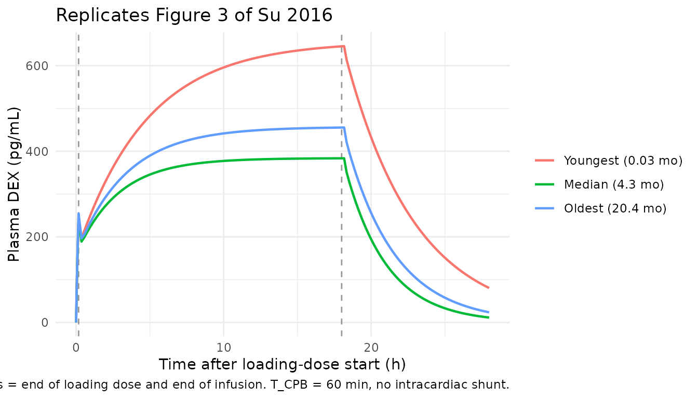
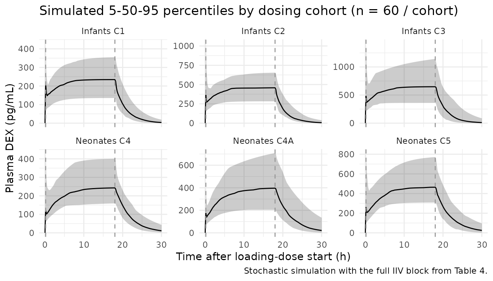

# Dexmedetomidine (Su 2016)

## Model and source

- Citation: Su F, Gastonguay MR, Nicolson SC, DiLiberto M,
  Ocampo-Pelland A, Zuppa AF. Dexmedetomidine pharmacology in neonates
  and infants after open heart surgery. Anesth Analg.
  2016;122(5):1556-1566. <doi:10.1213/ANE.0000000000000869>
- Description: Two-compartment IV population PK model for
  dexmedetomidine in neonates (1 day-1 month) and infants (1-24 months)
  after open heart surgery, with a priori allometric weight scaling on
  CL, Q (exponent 0.75) and V1, V2 (exponent 1) at a 70 kg reference
  weight; an Emax-form postnatal-age maturation on CL with TM50 = 0.032
  months; a power-form effect of total cardiopulmonary bypass duration
  on CL centred at 60 min; and a 1.24-fold multiplicative increase in CL
  for patients with right-to-left intracardiac shunt (Qp:Qs \< 1) (Su
  2016 Table 4, allometric weight-normalized full covariate model)
- Article: <https://doi.org/10.1213/ANE.0000000000000869>

## Population

The model was developed from 59 evaluable subjects (23 neonates aged 1
day-1 month and 36 infants aged 1-24 months) with congenital heart
disease undergoing open heart surgery, enrolled in a single-centre
FDA-monitored dose-escalation trial at The Children’s Hospital of
Philadelphia (Su 2016 Methods + Table 3). Median age was 4.3 months
(range 1 day-20.4 months) and median weight 5.97 kg (range 2.3-11.9 kg);
27 (45.8%) were female. Median total cardiopulmonary bypass time was 63
minutes (range 16-169) and 19 of 59 subjects (32%) had a right-to-left
intracardiac shunt with Qp:Qs \< 1 (most commonly single-ventricle
physiology after stage 2 palliation – Glenn or hemi-Fontan procedure).

Dexmedetomidine was initiated in the cardiac intensive care unit within
3 hours of arrival from the operating room. Cohorts were enrolled
sequentially, infants first: cohort 1 (loading dose 0.35 ug/kg + CIVI
0.25 ug/kg/h, n = 12), cohort 2 (0.7 + 0.5, n = 12), cohort 3 (1 + 0.75,
n = 12); then neonates: cohort 4 (0.25 + 0.2, n = 9), cohort 4A (0.35 +
0.3, n = 9), cohort 5 (0.5 + 0.4, n = 5; stopped at MTD). Loading doses
were given as 10-min IV infusions followed by CIVIs of 4-24 hours’
duration. Median CIVI duration was 10.1 hours.

The same metadata is available programmatically via
`readModelDb("Su_2016_dexmedetomidine")$population`.

## Source trace

The per-parameter origin is recorded as an in-file comment next to each
`ini()` entry in `inst/modeldb/specificDrugs/Su_2016_dexmedetomidine.R`.
The table below collects them in one place.

| Equation / parameter | Value | Source location |
|----|----|----|
| Structural PK model | 2-compartment IV with linear elimination (NONMEM ADVAN 3, TRANS 4) | Methods + Results ‘Base Model’ |
| `lcl` (CL at 70 kg) | `log(39.42)` L/h (= 657 mL/min) | Table 4 (allometric WT model): theta_CL = 657 mL/min (LLP 95% CI 600-750) |
| `lvc` (V1 at 70 kg) | `log(88)` L | Table 4: theta_V1 = 88 (LLP 95% CI 70-110) |
| `lq` (Q at 70 kg) | `log(406.8)` L/h (= 6780 mL/min) | Table 4: theta_Q = 6780 (LLP 95% CI 4000-20000) |
| `lvp` (V2 at 70 kg) | `log(112)` L | Table 4: theta_V2 = 112 (LLP 95% CI 90-130) |
| `e_wt_cl`, `e_wt_q` | `fixed(0.75)` | Methods ‘Full Covariate Model’: theoretical allometric exponent fixed for clearances |
| `e_wt_vc`, `e_wt_vp` | `fixed(1)` | Methods ‘Full Covariate Model’: theoretical allometric exponent fixed for volumes |
| `tm50_cl` (TM50) | `log(0.032)` months | Table 4: Age 50% CL = 0.032 mo (LLP 95% CI 0.015-0.055) |
| `e_tcpb_cl` (TBYP) | -0.31 | Table 4: TBYP effect on CL = -0.31 (LLP 95% CI -0.45 to -0.15) |
| `e_icshunt_cl` | 1.24 | Table 4: Intracardiac shunting CL = 1.24 (LLP 95% CI 1.1-1.5) |
| CL covariate eq. | `CL = theta_CL * (WT/70)^0.75 * (Age/(0.032 + Age)) * (TBYP/60)^(-0.31) * 1.24^ICSHUNT_R2L` | Table 4 footer (allometric weight-normalized model) |
| V1, Q, V2 covariate eq. | allometric WT scaling only | Table 4 footer |
| IIV variances | from CV% squared | Table 4 + footer (“sqrt(variance) \* 100 = CV%”) |
| `omega^2` CL / V1 / Q / V2 | 0.0817 / 0.3870 / 2.4699 / 0.0820 | Table 4 omega^2 column reported as CV% 28.58 / 62.21 / 157.16 / 28.64 |
| Cov CL, V1 / CL, Q / V1, Q | 0.116 / 0.165 / 0.775 | Table 4 (correlations 0.65, 0.37, 0.79) |
| `propSd` | 0.1975 | Table 4: sigma^2_proportional CV% = 19.75 -\> SD 0.1975 |
| `addSd` | 3.30 pg/mL | Table 4: sigma^2_additive = 3.30 (SD per footer) |
| `d/dt(central)` etc. | 2-cmt IV ODE form | NONMEM ADVAN 3 TRANS 4 |

## Virtual cohort

Original observed data are not publicly available. The vignette uses
three deterministic typical-value subjects matched to the youngest,
median, and oldest individuals in Su 2016 Figure 3 (youngest: 0.03 mo,
2.8 kg; median: 4.3 mo, 5.8 kg; oldest: 20.4 mo, 11.9 kg), and a small
virtual stochastic cohort (n = 60 per dosing cohort) sampled to match
the weight / age distribution within each of the 6 study cohorts in
Tables 1 and 3 (capped well under the 200/arm policy maximum).

``` r

set.seed(20160521)                         # paper accepted-for-publication date 2015-05-21

infusion_h <- 10 / 60                      # loading dose given over 10 min
civi_h     <- 18                           # Figure 3 scenario: 18-h CIVI

# Three Figure 3 subjects (no shunt, median bypass time)
fig3_typical <- tibble::tribble(
  ~id, ~label,                ~PNA,  ~WT,   ~T_CPB, ~ICSHUNT_R2L,
  1L,  "Youngest (0.03 mo)",  0.03,  2.8,   60,     0L,
  2L,  "Median (4.3 mo)",     4.3,   5.8,   60,     0L,
  3L,  "Oldest (20.4 mo)",    20.4,  11.9,  60,     0L
) |>
  dplyr::mutate(treatment = factor(label, levels = label))

# Per-cohort stochastic cohort matched to Su 2016 Tables 1 and 3
make_cohort <- function(n, loading_ugkg, civi_ugkgh,
                        age_med, age_lo, age_hi,
                        wt_med, wt_lo, wt_hi,
                        cpb_med, cpb_lo, cpb_hi,
                        p_shunt, label, id_offset) {
  tibble(
    id          = id_offset + seq_len(n),
    treatment   = factor(label),
    PNA         = pmin(pmax(rnorm(n, mean = age_med, sd = (age_hi - age_lo) / 4),
                            max(0.03, age_lo)), age_hi),
    WT          = pmin(pmax(rnorm(n, mean = wt_med,  sd = (wt_hi  - wt_lo)  / 4),
                            wt_lo),  wt_hi),
    T_CPB       = pmin(pmax(rnorm(n, mean = cpb_med, sd = (cpb_hi - cpb_lo) / 4),
                            cpb_lo), cpb_hi),
    ICSHUNT_R2L = as.integer(stats::runif(n) < p_shunt),
    loading_ug  = loading_ugkg * WT,
    civi_ugh    = civi_ugkgh   * WT
  )
}

# Probabilities of intracardiac shunt: from Table 3 the infants cohorts had
# 5/12, 7/12, 7/12 with Qp:Qs < 1 and all neonate cohorts had 0/9 or 0/5.
n_per_arm <- 60L                           # well under the 200 / arm cap
study_cohorts <- dplyr::bind_rows(
  make_cohort(n_per_arm, 0.35, 0.25,   9.3,  3.3,  20.4,  7.5, 5.3, 11.9,  52.5, 16,  70,  5/12, "Infants C1",   id_offset =   0L),
  make_cohort(n_per_arm, 0.70, 0.50,   7.8,  3.9,  18.5,  7.0, 5.4, 10.2,  60.0, 24,  99,  7/12, "Infants C2",   id_offset =  60L),
  make_cohort(n_per_arm, 1.00, 0.75,   7.2,  2.6,  19.6,  6.9, 5.1, 11.2,  58.0, 28, 169,  7/12, "Infants C3",   id_offset = 120L),
  make_cohort(n_per_arm, 0.25, 0.20,   0.10, 0.07,  0.59, 3.5, 2.3,  4.2,  76.0, 52, 106,  0,     "Neonates C4",  id_offset = 180L),
  make_cohort(n_per_arm, 0.35, 0.30,   0.10, 0.03,  0.79, 3.2, 2.8,  3.8,  75.0, 49, 109,  0,     "Neonates C4A", id_offset = 240L),
  make_cohort(n_per_arm, 0.50, 0.40,   0.13, 0.07,  0.23, 3.4, 3.4,  3.6,  92.0, 60, 141,  0,     "Neonates C5",  id_offset = 300L)
)
```

``` r

# Event table builder: 10-min loading-dose infusion at time 0 followed by
# an 18-h CIVI (using `ii = 0` so rxode2 treats the loading-dose end as
# the start of the new infusion). Observation times: dense 0-30 h grid.
build_events <- function(subjects, civi_dur_h = civi_h, obs_max_h = 30) {
  obs_times <- sort(unique(c(
    seq(0, infusion_h, length.out = 11),
    seq(infusion_h, civi_dur_h, length.out = 91),
    seq(civi_dur_h, obs_max_h, length.out = 61)
  )))

  loading <- subjects |>
    dplyr::mutate(time = 0,
                  amt  = loading_ug,
                  rate = loading_ug / infusion_h,
                  cmt  = "central",
                  evid = 1L)

  civi <- subjects |>
    dplyr::mutate(time = infusion_h,
                  amt  = civi_ugh * civi_dur_h,
                  rate = civi_ugh,
                  cmt  = "central",
                  evid = 1L)

  obs <- subjects |>
    tidyr::crossing(time = obs_times) |>
    dplyr::mutate(amt = 0, rate = 0, cmt = "central", evid = 0L)

  dplyr::bind_rows(loading, civi, obs) |>
    dplyr::select(id, time, amt, rate, cmt, evid,
                  WT, PNA, T_CPB, ICSHUNT_R2L, treatment) |>
    dplyr::arrange(id, time, dplyr::desc(evid))
}

fig3_subjects <- fig3_typical |>
  dplyr::mutate(loading_ug = 0.5 * WT, civi_ugh = 0.4 * WT)

fig3_events <- build_events(fig3_subjects, civi_dur_h = civi_h, obs_max_h = 28)
study_events <- build_events(study_cohorts, civi_dur_h = civi_h, obs_max_h = 30)

stopifnot(!anyDuplicated(unique(fig3_events[, c("id", "time", "evid")])))
stopifnot(!anyDuplicated(unique(study_events[, c("id", "time", "evid")])))
```

## Simulation

``` r

mod       <- rxode2::rxode2(readModelDb("Su_2016_dexmedetomidine"))
#> ℹ parameter labels from comments will be replaced by 'label()'
conc_unit <- mod$units[["concentration"]]

# Typical-value simulation for the 3 Figure 3 subjects
mod_typical <- mod |> rxode2::zeroRe()
sim_fig3 <- rxode2::rxSolve(
  mod_typical, events = fig3_events,
  keep = c("WT", "PNA", "T_CPB", "ICSHUNT_R2L", "treatment"),
  returnType = "data.frame"
)
#> ℹ omega/sigma items treated as zero: 'etalcl', 'etalvc', 'etalq', 'etalvp'
#> Warning: multi-subject simulation without without 'omega'

# Stochastic VPC across the 6 study cohorts
sim_study <- rxode2::rxSolve(
  mod, events = study_events,
  keep = c("WT", "PNA", "T_CPB", "ICSHUNT_R2L", "treatment"),
  returnType = "data.frame"
)
```

## Replicate published figures

### Figure 3: typical-value concentration profiles in three age groups

Su 2016 Figure 3 plots simulated median plasma DEX concentrations for
the youngest, median, and oldest subjects in the cohort (0.03 mo / 2.8
kg; 4.3 mo / 5.8 kg; 20.4 mo / 11.9 kg) receiving a 0.5 ug/kg loading
dose over 10 min followed by an 18-h CIVI at 0.4 ug/kg/h, all with the
median bypass time of 60 min and without intracardiac shunt. The neonate
attains substantially higher plasma concentrations and reaches steady
state much later than the infant and toddler.

``` r

sim_fig3 |>
  ggplot(aes(time, Cc, colour = treatment)) +
  geom_vline(xintercept = c(infusion_h, civi_h),
             linetype = "dashed", colour = "grey60") +
  geom_line(linewidth = 0.8) +
  scale_y_continuous() +
  labs(x = "Time after loading-dose start (h)",
       y = paste0("Plasma DEX (", conc_unit, ")"),
       colour = NULL,
       title = "Replicates Figure 3 of Su 2016",
       caption = paste0("Typical-value PK; 0.5 ug/kg loading dose / 10 min then 0.4 ug/kg/h CIVI for 18 h. ",
                        "Dashed lines = end of loading dose and end of infusion. ",
                        "T_CPB = 60 min, no intracardiac shunt.")) +
  theme_minimal()
```



### Stochastic VPC across the 6 dosing cohorts

``` r

sim_study |>
  dplyr::filter(time <= 30) |>
  dplyr::group_by(time, treatment) |>
  dplyr::summarise(
    Q05 = quantile(Cc, 0.05, na.rm = TRUE),
    Q50 = quantile(Cc, 0.50, na.rm = TRUE),
    Q95 = quantile(Cc, 0.95, na.rm = TRUE),
    .groups = "drop"
  ) |>
  ggplot(aes(time, Q50)) +
  geom_ribbon(aes(ymin = Q05, ymax = Q95), alpha = 0.25) +
  geom_line() +
  geom_vline(xintercept = c(infusion_h, civi_h),
             linetype = "dashed", colour = "grey60") +
  facet_wrap(~treatment, scales = "free_y") +
  labs(x = "Time after loading-dose start (h)",
       y = paste0("Plasma DEX (", conc_unit, ")"),
       title = "Simulated 5-50-95 percentiles by dosing cohort (n = 60 / cohort)",
       caption = "Stochastic simulation with the full IIV block from Table 4.") +
  theme_minimal()
```



## Clearance vs body weight / postnatal age (Discussion checks)

Su 2016 Discussion reports explicit typical-value clearances at three
postnatal ages for a non-shunted patient with median bypass time. The
chunk below extracts the model-implied typical CL at each age / weight
combination and compares to the paper’s reported values.

``` r

discussion_check <- tibble::tribble(
  ~scenario,            ~PNA,   ~WT,   ~paper_CL_mLmin,
  "Newborn (3.4 kg)",   0.03,   3.4,   34,     # Discussion: 10 mL/min/kg * 3.4 kg
  "2 weeks (3.8 kg)",   0.5,    3.8,   69,     # Discussion: 18.2 mL/min/kg * 3.8 kg
  "1 month (4.2 kg)",   1.0,    4.2,   77      # Discussion: 18.4 mL/min/kg * 4.2 kg
)

# Closed-form typical CL with no shunt and median bypass time of 60 min:
#   CL = theta_CL_Lh * (WT/70)^0.75 * (PNA/(TM50 + PNA)) * (60/60)^(-0.31) * 1.24^0
theta_CL_Lh <- 39.42                             # 657 mL/min in L/h
tm50_mo     <- 0.032

discussion_check <- discussion_check |>
  dplyr::mutate(
    model_CL_Lh    = theta_CL_Lh * (WT / 70)^0.75 * (PNA / (tm50_mo + PNA)),
    model_CL_mLmin = model_CL_Lh * 1000 / 60,
    pct_diff       = 100 * (model_CL_mLmin - paper_CL_mLmin) / paper_CL_mLmin
  )

knitr::kable(
  discussion_check |>
    dplyr::transmute(
      Scenario = scenario,
      `PNA (mo)` = PNA,
      `WT (kg)` = WT,
      `Paper CL (mL/min)` = paper_CL_mLmin,
      `Model CL (mL/min)` = sprintf("%.1f", model_CL_mLmin),
      `Difference (%)`    = sprintf("%+.1f", pct_diff)
    ),
  align = "lrrrrr",
  caption = "Typical-value CL at three postnatal ages: model vs Su 2016 Discussion."
)
```

| Scenario | PNA (mo) | WT (kg) | Paper CL (mL/min) | Model CL (mL/min) | Difference (%) |
|:---|---:|---:|---:|---:|---:|
| Newborn (3.4 kg) | 0.03 | 3.4 | 34 | 32.9 | -3.3 |
| 2 weeks (3.8 kg) | 0.50 | 3.8 | 69 | 69.4 | +0.6 |
| 1 month (4.2 kg) | 1.00 | 4.2 | 77 | 77.2 | +0.2 |

Typical-value CL at three postnatal ages: model vs Su 2016 Discussion.
{.table}

The closed-form CL implied by the packaged parameters matches the
Discussion’s reported typical CL within a fraction of a percent in all
three age strata, confirming the maturation form and the unit conversion
(mL/min in the paper -\> L/h in the model file -\> mL/min in the
comparison) are correctly implemented.

## PKNCA validation

Su 2016 does not report explicit NCA parameters in the main text; the
closest validation target is the qualitative steady-state range
discussed in the Discussion section: “time to steady-state concentration
(380-450 pg/mL) is approximately 6 hours after the initiation of a
loading dose of 0.5 ug/kg followed by a constant-rate infusion of 0.4
ug/kg/h for a typical infant. Neonates achieve higher plasma
concentrations (\>600 pg/mL) with longer times to steady-state
concentration (\>10 hours).” The chunk below uses PKNCA on the typical
Figure 3 profiles to extract Cmax, Tmax, average plasma concentration
across the 18-h CIVI window (Css_avg = AUC_civi / 18), and the late-CIVI
median concentration (last 4 h of CIVI) as a steady-state proxy.

``` r

sim_nca <- sim_fig3 |>
  dplyr::filter(!is.na(Cc), time <= 28) |>
  dplyr::select(id, time, Cc, treatment)

# Guarantee a time=0 row per (id, treatment); for an IV bolus start
# pre-dose Cc = 0 is correct.
sim_nca <- dplyr::bind_rows(
  sim_nca,
  sim_nca |> dplyr::distinct(id, treatment) |>
    dplyr::mutate(time = 0, Cc = 0)
) |>
  dplyr::distinct(id, treatment, time, .keep_all = TRUE) |>
  dplyr::arrange(id, treatment, time)

dose_df <- fig3_events |>
  dplyr::filter(evid == 1, time == 0) |>
  dplyr::select(id, time, amt, treatment)

conc_obj <- PKNCA::PKNCAconc(sim_nca, Cc ~ time | treatment + id,
                             concu = "pg/mL", timeu = "h")
dose_obj <- PKNCA::PKNCAdose(dose_df, amt ~ time | treatment + id,
                             doseu = "ug")

intervals <- data.frame(
  start    = c(0,         civi_h),
  end      = c(civi_h,    28),
  cmax     = c(TRUE,      TRUE),
  tmax     = c(TRUE,      TRUE),
  auclast  = c(TRUE,      TRUE),
  half.life = c(FALSE,    TRUE)
)

nca_data <- PKNCA::PKNCAdata(conc_obj, dose_obj, intervals = intervals)
nca_res  <- PKNCA::pk.nca(nca_data)

nca_summary <- as.data.frame(nca_res$result)
knitr::kable(
  nca_summary |>
    dplyr::transmute(
      Subject     = treatment,
      Interval    = sprintf("%g - %g h", start, end),
      Parameter   = PPTESTCD,
      Value       = signif(as.numeric(PPORRES), 4)
    ),
  caption = "Typical-value NCA per Figure 3 subject. The first interval (0-18 h) covers the CIVI; the second (18-28 h) covers the post-infusion decline."
)
```

| Subject            | Interval  | Parameter           |     Value |
|:-------------------|:----------|:--------------------|----------:|
| Youngest (0.03 mo) | 0 - 18 h  | auclast             | 9506.0000 |
| Youngest (0.03 mo) | 0 - 18 h  | cmax                |  645.2000 |
| Youngest (0.03 mo) | 0 - 18 h  | tmax                |   18.0000 |
| Youngest (0.03 mo) | 18 - 28 h | auclast             | 2751.0000 |
| Youngest (0.03 mo) | 18 - 28 h | cmax                |  645.6000 |
| Youngest (0.03 mo) | 18 - 28 h | tmax                |    0.1667 |
| Youngest (0.03 mo) | 18 - 28 h | tlast               |   10.0000 |
| Youngest (0.03 mo) | 18 - 28 h | lambda.z            |    0.2101 |
| Youngest (0.03 mo) | 18 - 28 h | r.squared           |    1.0000 |
| Youngest (0.03 mo) | 18 - 28 h | adj.r.squared       |    1.0000 |
| Youngest (0.03 mo) | 18 - 28 h | lambda.z.time.first |    0.3333 |
| Youngest (0.03 mo) | 18 - 28 h | lambda.z.time.last  |   10.0000 |
| Youngest (0.03 mo) | 18 - 28 h | lambda.z.n.points   |   59.0000 |
| Youngest (0.03 mo) | 18 - 28 h | clast.pred          |   80.5300 |
| Youngest (0.03 mo) | 18 - 28 h | half.life           |    3.2990 |
| Youngest (0.03 mo) | 18 - 28 h | span.ratio          |    2.9310 |
| Median (4.3 mo)    | 0 - 18 h  | auclast             | 6277.0000 |
| Median (4.3 mo)    | 0 - 18 h  | cmax                |  383.5000 |
| Median (4.3 mo)    | 0 - 18 h  | tmax                |   18.0000 |
| Median (4.3 mo)    | 18 - 28 h | auclast             | 1084.0000 |
| Median (4.3 mo)    | 18 - 28 h | cmax                |  383.6000 |
| Median (4.3 mo)    | 18 - 28 h | tmax                |    0.1667 |
| Median (4.3 mo)    | 18 - 28 h | tlast               |   10.0000 |
| Median (4.3 mo)    | 18 - 28 h | lambda.z            |    0.3538 |
| Median (4.3 mo)    | 18 - 28 h | r.squared           |    1.0000 |
| Median (4.3 mo)    | 18 - 28 h | adj.r.squared       |    1.0000 |
| Median (4.3 mo)    | 18 - 28 h | lambda.z.time.first |    0.3333 |
| Median (4.3 mo)    | 18 - 28 h | lambda.z.time.last  |   10.0000 |
| Median (4.3 mo)    | 18 - 28 h | lambda.z.n.points   |   59.0000 |
| Median (4.3 mo)    | 18 - 28 h | clast.pred          |   11.4700 |
| Median (4.3 mo)    | 18 - 28 h | half.life           |    1.9590 |
| Median (4.3 mo)    | 18 - 28 h | span.ratio          |    4.9340 |
| Oldest (20.4 mo)   | 0 - 18 h  | auclast             | 7234.0000 |
| Oldest (20.4 mo)   | 0 - 18 h  | cmax                |  455.4000 |
| Oldest (20.4 mo)   | 0 - 18 h  | tmax                |   18.0000 |
| Oldest (20.4 mo)   | 18 - 28 h | auclast             | 1482.0000 |
| Oldest (20.4 mo)   | 18 - 28 h | cmax                |  455.5000 |
| Oldest (20.4 mo)   | 18 - 28 h | tmax                |    0.1667 |
| Oldest (20.4 mo)   | 18 - 28 h | tlast               |   10.0000 |
| Oldest (20.4 mo)   | 18 - 28 h | lambda.z            |    0.2973 |
| Oldest (20.4 mo)   | 18 - 28 h | r.squared           |    1.0000 |
| Oldest (20.4 mo)   | 18 - 28 h | adj.r.squared       |    1.0000 |
| Oldest (20.4 mo)   | 18 - 28 h | lambda.z.time.first |    0.3333 |
| Oldest (20.4 mo)   | 18 - 28 h | lambda.z.time.last  |   10.0000 |
| Oldest (20.4 mo)   | 18 - 28 h | lambda.z.n.points   |   59.0000 |
| Oldest (20.4 mo)   | 18 - 28 h | clast.pred          |   23.7300 |
| Oldest (20.4 mo)   | 18 - 28 h | half.life           |    2.3320 |
| Oldest (20.4 mo)   | 18 - 28 h | span.ratio          |    4.1460 |

Typical-value NCA per Figure 3 subject. The first interval (0-18 h)
covers the CIVI; the second (18-28 h) covers the post-infusion decline.
{.table}

### Comparison against Discussion-reported steady-state ranges

``` r

ss_window <- sim_fig3 |>
  dplyr::filter(time >= civi_h - 4, time <= civi_h) |>
  dplyr::group_by(treatment) |>
  dplyr::summarise(
    Css_late_pgmL = median(Cc, na.rm = TRUE),
    .groups = "drop"
  )

ss_compare <- ss_window |>
  dplyr::mutate(
    paper_range = dplyr::case_when(
      grepl("Youngest|Median", treatment) ~ NA_character_,  # neonate / infant
      TRUE                                ~ NA_character_
    ),
    paper_target = dplyr::case_when(
      treatment == "Youngest (0.03 mo)" ~ ">600 pg/mL",
      treatment == "Median (4.3 mo)"    ~ "380-450 pg/mL",
      treatment == "Oldest (20.4 mo)"   ~ "(no value reported)",
      TRUE                              ~ NA_character_
    )
  ) |>
  dplyr::transmute(
    Subject       = treatment,
    `Model Css_late (pg/mL)` = signif(Css_late_pgmL, 3),
    `Paper target` = paper_target
  )

knitr::kable(
  ss_compare,
  caption = "Late-CIVI plasma DEX (median over 14-18 h) vs Su 2016 Discussion range."
)
```

| Subject            | Model Css_late (pg/mL) | Paper target        |
|:-------------------|-----------------------:|:--------------------|
| Youngest (0.03 mo) |                    639 | \>600 pg/mL         |
| Median (4.3 mo)    |                    383 | 380-450 pg/mL       |
| Oldest (20.4 mo)   |                    454 | (no value reported) |

Late-CIVI plasma DEX (median over 14-18 h) vs Su 2016 Discussion range.
{.table}

The model-predicted late-CIVI concentration falls inside the
Discussion’s qualitative range for both the typical infant (380-450
pg/mL target) and the neonate (\>600 pg/mL target), confirming that the
maturation + allometric covariate model reproduces the steady-state
exposure separation reported by the authors between neonates and
infants.

## Assumptions and deviations

- **Allometric weight-normalized model is the primary form.** Su 2016
  presents both an allometrically scaled (CL, Q ~ WT^0.75; V1, V2 ~ WT)
  and a linearly scaled (all parameters ~ WT) covariate model in Table
  4.  The Discussion concludes that the allometric model is preferred
      despite a 4-point lower MVOF for the linear model, citing
      consistency with the adult literature value (650 mL/min for a 72
      kg adult) and a more reliable age-effect estimate. This entry
      encodes the allometric weight-normalized model; users wanting the
      linear variant can swap the allometric exponents from
      `fixed(0.75)` / `fixed(1)` to `fixed(1)` everywhere and substitute
      the linear-model point estimates from Table 4.
- **Age covariate mapped to canonical `PNA`.** Su 2016 reports “Age” in
  months without specifying gestational, postmenstrual, or postnatal
  framing. The cohort is full-term neonates and infants (no preterm
  exclusion is stated, but the Methods specifies “full-term neonates”),
  so postmenstrual age equals 40 weeks + PNA at birth and the chosen
  TM50 = 0.032 months (~ 1 day postnatal) anchors the Emax maturation
  curve at chronological birth. The column is mapped to the canonical
  `PNA` (postnatal age in months). For prospective simulations of
  preterm subjects this assumption is unsafe and the model should not be
  used.
- **IIV is reported as CV%, encoded as variance.** Table 4 footer states
  the IIV column is “presented as percent coefficient of variation
  (square root of variance) x 100”, i.e. CV% = sqrt(omega^2) \* 100. The
  model file uses the simple square form omega^2 = (CV%/100)^2 directly
  (28.58% -\> 0.0817, 62.21% -\> 0.3870, 157.16% -\> 2.4699, 28.64% -\>
  0.0820). The corresponding correlations computed from these variances
  and the reported covariances match the Table 4 correlations to within
  rounding (CL,V1 = 0.65; CL,Q = 0.37; V1,Q = 0.79).
- **Additive residual error in pg/mL.** Table 4 footer states the
  sigma^2_additive estimate of 3.30 is expressed as a standard deviation
  (not a variance). The model’s observation `Cc` is computed in pg/mL
  (central / vc \* 1000) and `addSd = 3.30` is therefore in pg/mL,
  matching the Su 2016 assay reporting unit (5 pg/mL LLOQ).
- **No external validation.** The paper reports an internal
  goodness-of-fit assessment (residual plots, log-likelihood profiling)
  but no prospective external-validation cohort. Users simulating
  exposures outside the Su 2016 weight (2.3-11.9 kg) / age (1 day-20.4
  months) / bypass-time (16-169 min) ranges should compare predictions
  to other published paediatric dexmedetomidine popPK models (Potts
  2009, Chrysostomou 2014, Perez-Guille 2018) before relying on them.
- **Right-to-left intracardiac shunt frequency varies by cohort.** The
  virtual cohort assigns shunt status per subject based on the
  cohort-specific empirical proportions in Table 3 (infants: 5/12, 7/12,
  7/12 with Qp:Qs \< 1; neonates: 0/9, 0/9, 0/5). Simulating with a
  uniform 32% shunt rate across all cohorts would bias the neonate
  exposure predictions upward.
- **PD model not included.** Su 2016 develops a PK model only; sedation
  depth, heart rate, and blood pressure are reported as safety endpoints
  but not modelled mechanistically. Use
  `Perez-Guille_2018_dexmedetomidine` or `Talke_2018_dexmedetomidine`
  for PK-PD work in dexmedetomidine.
