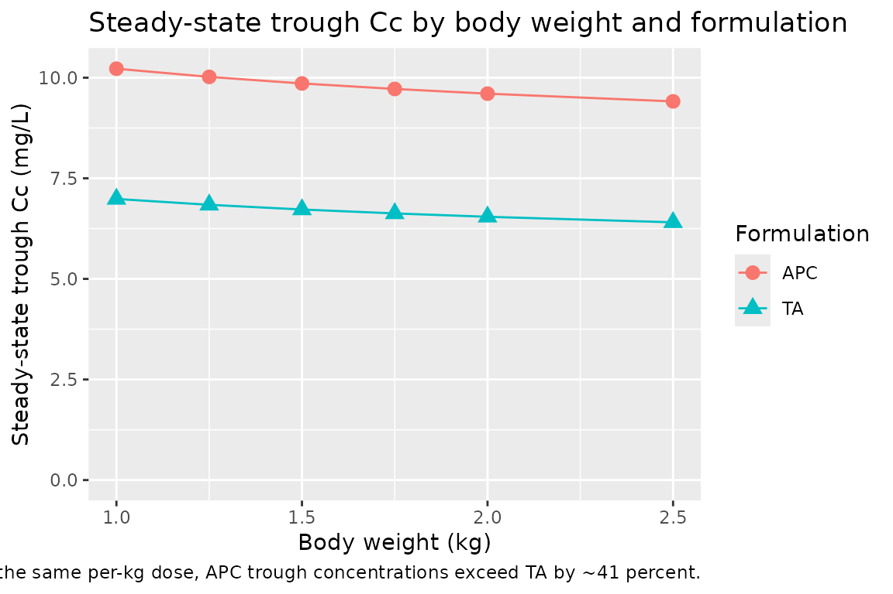
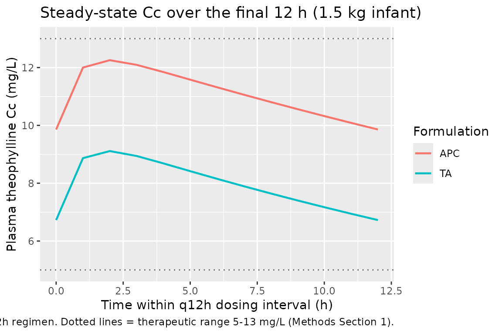

# Theophylline (Suda 2008)

## Model and source

- Citation: Suda Y, Hanada K, Tsuchiwata S, Saito M, Nakamura T, Ito Y,
  Ishikawa Y, Kushida K, Ogata H. Population pharmacokinetic analysis of
  two theophylline formulations in premature neonates and infants with
  apnea. Yakugaku Zasshi. 2008;128(4):635-641.
  <doi:10.1248/yakushi.128.635>
- Description: Steady-state population PK model for oral theophylline in
  52 Japanese premature neonates and infants with apnea (Suda 2008).
  One-compartment first-order absorption structure; oral clearance CL/F
  is the only structural parameter the paper estimates (steady-state
  trough analysis Css = R / CL/F). Body-weight allometric scaling and a
  binary indicator for the Apnecut formulation (vs the in-house
  theophylline-alcohol comparator) on CL/F.
- Article: <https://doi.org/10.1248/yakushi.128.635>

Suda, Hanada, Tsuchiwata, Saito, Nakamura, Ito, Ishikawa, Kushida, and
Ogata (Meiji Pharmaceutical University and the National Center for Child
Health and Development, Tokyo) retrospectively analysed plasma
theophylline concentrations from 52 Japanese premature neonates and
infants treated for apnea of prematurity with one of two oral
theophylline products: a hospital-compounded theophylline-alcohol
preparation (TA, 5 mg/mL theophylline in ethanol diluted with sterile
purified water to 10 percent final ethanol concentration) and a
commercial Apnecut internal-use solution (APC, 4 mg/mL aqueous; Kowa
Co., Ltd., launched August 2006). The motivation for the analysis was a
clinical observation that, at the same body-weight-based dose of
approximately 4 mg/kg/d q12h, infants on APC had higher dose-normalised
trough concentrations than infants on TA - raising the question of
whether the apparent formulation difference was real or driven by
between-subject covariate variation.

A 1-compartment first-order absorption structure was assumed; because
sampling was almost entirely at trough at steady state, only the
apparent oral clearance CL/F could be estimated from the data, using the
steady-state relationship Css = (dose rate) / CL/F (Methods Section 5,
page 637). NONMEM V with the first-order (FO) algorithm was used to fit
a log-normal IIV / proportional residual error model on CL/F. The final
model retained body weight (allometric exponent 1.08) and a binary
formulation indicator (-28.2 percent CL/F for APC relative to TA); sex,
postnatal age, postconceptional age, oxygen-supply status, and Apgar
scores were screened but excluded from the final fit (Table 3, page
639).

## Population

The cohort comprised 52 hospitalised infants (25 male, 27 female; 51.9
percent female) with mean postnatal age 34 days (SD 21, range 9 to 107)
and mean body weight 1465 g (SD 365, range 841 to 2548 g). Mean birth
weight was 1236 g (SD 380, range 528 to 2158) and mean corrected
postconceptional age was 34 weeks (SD 2, range 30 to 42). Thirty-six
patients received TA and 16 received APC; per-formulation baseline
demographics were comparable (Table 2, page 638), but daily dose was
lower in the APC arm (1.53 mg per dose, SD 0.51) than in the TA arm
(2.49 mg per dose, SD 0.78), reflecting the higher per-dose
concentrations of the APC formulation. Dose-normalised plasma trough
concentrations were significantly higher in the APC arm (4.20 mg/L per
mg dose vs 2.87 in TA; p \< 0.001, Table 2), motivating the model-based
covariate analysis.

All patients were treated at the National Center for Child Health and
Development (Setagaya-ku, Tokyo). Theophylline concentrations were
measured by homogeneous enzyme immunoassay on the JCA-BM1650 automated
analyser (JEOL Ltd.) as part of routine therapeutic drug monitoring.
Only steady-state trough samples collected at least 4 days after a
product change and at least 7 hours after the last dose were retained
(Methods Section 2, page 637). The therapeutic window for theophylline
in apnea of prematurity is 5 to 13 ug/mL; tachycardia, abdominal
distension, and emesis develop quickly above 13 ug/mL (Methods Section
1, page 636).

The same information is available programmatically via the model’s
`population` metadata.

``` r

mod <- readModelDb("Suda_2008_theophylline")
str(rxode2::rxode(mod)$population)
#> ℹ parameter labels from comments will be replaced by 'label()'
#> List of 14
#>  $ species           : chr "human (Japanese premature neonates and infants with apnea)"
#>  $ n_subjects        : int 52
#>  $ n_observations    : int 90
#>  $ n_studies         : int 1
#>  $ age_range         : chr "9-107 postnatal days (mean 34, SD 21)"
#>  $ weight_range      : chr "841-2548 g (mean 1465, SD 365)"
#>  $ birth_weight_range: chr "528-2158 g (mean 1236, SD 380)"
#>  $ pca_range         : chr "30-42 weeks postconceptional age (mean 34, SD 2)"
#>  $ sex_female_pct    : num 51.9
#>  $ race_ethnicity    : chr "Japanese (single-centre cohort at National Center for Child Health and Development, Tokyo)"
#>  $ disease_state     : chr "Premature neonatal apnea (apnea of prematurity) - apnea episodes >20 seconds, or shorter episodes accompanied b"| __truncated__
#>  $ dose_range        : chr "Approximately 4 mg/kg/d oral theophylline divided every 12 hours (q12h). Mean dose 2.14 mg per administration. "| __truncated__
#>  $ regions           : chr "Japan (National Center for Child Health and Development, Setagaya-ku, Tokyo - single centre)."
#>  $ notes             : chr "Retrospective chart review of patients hospitalised between June 2005 and January 2007. Plasma theophylline mea"| __truncated__
```

## Source trace

The per-parameter origin is recorded as an in-file comment next to each
`ini()` entry in `inst/modeldb/specificDrugs/Suda_2008_theophylline.R`.
The table below collects the same information in one place for review.

| Equation / parameter | Value | Source location |
|----|----|----|
| `lcl` (CL/F, L/h) at reference 1 kg on TA | 0.0201 | Suda 2008 final model, page 638; Table 3 row “Final model” |
| `e_wt_cl` (allometric exponent of WT/1 kg on CL/F) | 1.08 (fixed) | Suda 2008 final model, page 638; Table 3 u_2 exponent |
| `e_form_apnecut_cl` (multiplicative shift on CL/F for APC vs TA) | -0.282 (fixed) | Suda 2008 final model, page 638; Table 3 u_3 coefficient |
| `lvc` (Vc/F, L; not from this paper) | 0.647 (fixed) | not estimated by Suda 2008; derived as CL/F_TA(1 kg) / kel with kel = ln(2)/22.3 h from the paper-cited Apnecut 10 mg package insert (Methods Section 5, page 637); required only for ODE-based simulation |
| `lka` (ka, 1/h; not from this paper) | 1.5 (fixed) | not estimated by Suda 2008; literature-typical theophylline oral absorption rate; required only for ODE-based simulation |
| `etalcl` (omega^2, IIV CL/F) | 0.02226 | Suda 2008 final model: 15.0 percent CV inter-individual (page 638); log-normal IIV per Methods Section 5 Eq. 1, so omega^2 = log(1 + 0.15^2) = 0.02226 |
| `propSd` (proportional residual SD on Cc) | 0.153 | Suda 2008 final model: 15.3 percent CV intra-individual (page 638); proportional residual per Methods Section 5 Eq. 2 |
| `cl = exp(lcl + etalcl) * (WT/1)^1.08 * (1 + e_form_apnecut_cl * FORM_THEO_APNECUT)` | n/a | Suda 2008 final model equation, page 638 |
| ODE `d/dt(central) = ka * depot - kel * central`, `Cc = central / vc` | n/a | 1-compartment first-order absorption structure assumed (Methods Section 5, page 637) |

## Virtual cohort

Original observed data are not publicly available. The validation below
uses a virtual cohort spanning the Suda 2008 weight range (approximately
1.0 to 2.5 kg) and both formulations. For each weight/formulation cell
we simulate steady-state q12h dosing at the clinical 4 mg/kg/d total
daily dose target (2 mg/kg per dose) and compare the resulting
steady-state trough concentration against the algebraic Css = R / CL/F
prediction of Suda 2008 Methods Section 5.

``` r

set.seed(20080430)

grid <- expand.grid(
  WT_kg        = c(1.0, 1.25, 1.5, 1.75, 2.0, 2.5),  # kg; spans 1000-2500 g
  FORM_THEO_APNECUT = c(0L, 1L),                          # 0 = TA reference, 1 = APC
  stringsAsFactors = FALSE
)
grid$id <- seq_len(nrow(grid))
grid$dose_mg_per_kg_per_day <- 4              # paper's clinical target dose
grid$dose_mg <- grid$WT_kg * grid$dose_mg_per_kg_per_day / 2  # q12h, so per-dose = total/2
grid$treatment <- ifelse(grid$FORM_THEO_APNECUT == 1L, "APC", "TA")
grid$scenario  <- sprintf("%.2f kg %s", grid$WT_kg, grid$treatment)

# Dose q12h for 21 days to reach steady state for a drug with t1/2 ~ 22 h.
tau_h     <- 12
n_doses   <- 42
sim_end_h <- n_doses * tau_h
dose_times_h <- seq(0, sim_end_h - 1, by = tau_h)

# Observation grid: every 1 h over the final 24 h (one full dosing cycle at steady state).
obs_times_h <- seq(sim_end_h - 24, sim_end_h, by = 1)

events <- grid |>
  rowwise() |>
  do({
    g <- .
    out <- bind_rows(
      tibble(time = dose_times_h, evid = 1L, amt = g$dose_mg, cmt = "depot",
             Cc = NA_real_),
      tibble(time = obs_times_h, evid = 0L, amt = 0, cmt = NA_character_,
             Cc = NA_real_)
    )
    out$id           <- g$id
    out$WT           <- g$WT_kg
    out$FORM_THEO_APNECUT <- g$FORM_THEO_APNECUT
    out$treatment    <- g$treatment
    out$scenario     <- g$scenario
    out
  }) |>
  ungroup() |>
  arrange(id, time, desc(evid)) |>
  as.data.frame()

stopifnot(!anyDuplicated(unique(events[, c("id", "time", "evid")])))
```

## Simulation

Simulate typical-value PK (between-subject random effects zeroed) so the
steady-state concentrations match the published model’s typical-value
prediction exactly and can be compared directly to the algebraic Css = R
/ CL/F solution.

``` r

mod <- readModelDb("Suda_2008_theophylline")
mod_typical <- rxode2::zeroRe(mod)
#> ℹ parameter labels from comments will be replaced by 'label()'

sim <- rxode2::rxSolve(
  mod_typical,
  events = events,
  keep   = c("WT", "FORM_THEO_APNECUT", "treatment", "scenario")
) |>
  as.data.frame()
#> ℹ omega/sigma items treated as zero: 'etalcl'
#> Warning: multi-subject simulation without without 'omega'

head(sim)
#>   id time     cl    vc  ka        kel       Cc ipredSim      sim       depot
#> 1  1  480 0.0201 0.647 1.5 0.03106646 6.986786 6.986786 6.986786 2.000000030
#> 2  1  481 0.0201 0.647 1.5 0.03106646 9.128751 9.128751 9.128751 0.446262004
#> 3  1  482 0.0201 0.647 1.5 0.03106646 9.375139 9.375139 9.375139 0.099574421
#> 4  1  483 0.0201 0.647 1.5 0.03106646 9.205648 9.205648 9.205648 0.022218029
#> 5  1  484 0.0201 0.647 1.5 0.03106646 8.950227 8.950227 8.950227 0.004957506
#> 6  1  485 0.0201 0.647 1.5 0.03106646 8.682289 8.682289 8.682289 0.001106167
#>    central WT FORM_THEO_APNECUT   scenario treatment
#> 1 4.520451  1                 0 1.00 kg TA        TA
#> 2 5.906302  1                 0 1.00 kg TA        TA
#> 3 6.065715  1                 0 1.00 kg TA        TA
#> 4 5.956054  1                 0 1.00 kg TA        TA
#> 5 5.790797  1                 0 1.00 kg TA        TA
#> 6 5.617441  1                 0 1.00 kg TA        TA
```

## Replicate published figures

### Table 3 final-model coefficients - derived per-kg CL/F by formulation

Suda 2008 Discussion (page 640) reports per-kg CL/F values of
approximately 0.0211 L/h/kg for TA and 0.0151 L/h/kg for APC at the
cohort-mean weight, derived from the final-model equation.
Reconstructing these algebraically from the packaged-model coefficients
should reproduce the paper’s reported per-kg values within rounding.

``` r

lcl                <- log(0.0201)
e_wt_cl            <- 1.08
e_form_apnecut_cl  <- -0.282
mean_wt_kg         <- 1.465

per_kg_summary <- tibble(
  formulation = c("TA (reference)", "APC"),
  FORM_THEO_APNECUT = c(0L, 1L),
  CL_F_at_1kg_Lh = c(
    exp(lcl),
    exp(lcl) * (1 + e_form_apnecut_cl)
  ),
  CL_F_at_meanWT_Lh = c(
    exp(lcl) * (mean_wt_kg / 1)^e_wt_cl,
    exp(lcl) * (mean_wt_kg / 1)^e_wt_cl * (1 + e_form_apnecut_cl)
  ),
  CL_F_per_kg_LhKg = CL_F_at_meanWT_Lh / mean_wt_kg
)

knitr::kable(per_kg_summary, digits = 4,
             caption = paste0(
               "Algebraic per-kg CL/F at the cohort-mean body weight ",
               "(1.465 kg). Paper-reported values (Discussion, page 640): ",
               "TA = 0.0211 L/h/kg, APC = 0.0151 L/h/kg."
             ))
```

| formulation | FORM_THEO_APNECUT | CL_F_at_1kg_Lh | CL_F_at_meanWT_Lh | CL_F_per_kg_LhKg |
|:---|---:|---:|---:|---:|
| TA (reference) | 0 | 0.0201 | 0.0304 | 0.0207 |
| APC | 1 | 0.0144 | 0.0218 | 0.0149 |

Algebraic per-kg CL/F at the cohort-mean body weight (1.465 kg).
Paper-reported values (Discussion, page 640): TA = 0.0211 L/h/kg, APC =
0.0151 L/h/kg. {.table}

### Steady-state trough concentration by weight and formulation

Higher trough concentrations on APC at the same per-kg dose are the
paper’s key clinical observation (Results, Figure 1 narrative, page
638). Simulate steady-state trough Cc for the virtual cohort and confirm
the qualitative APC \> TA ordering and the approximately 41 percent
higher trough on APC.

``` r

trough_cc <- sim |>
  filter(!is.na(Cc), time == sim_end_h) |>   # the final-dose trough
  group_by(scenario, treatment, WT) |>
  summarise(Cc_trough = first(Cc), .groups = "drop")

ggplot(trough_cc, aes(WT, Cc_trough, colour = treatment, shape = treatment)) +
  geom_point(size = 3) +
  geom_line(aes(group = treatment)) +
  labs(x = "Body weight (kg)", y = "Steady-state trough Cc (mg/L)",
       colour = "Formulation", shape = "Formulation",
       title = "Steady-state trough Cc by body weight and formulation",
       caption = paste0(
         "Constant 4 mg/kg/d q12h regimen. Replicates the clinical observation ",
         "in Suda 2008 Figure 1 / Discussion (page 638-640): at the same per-kg ",
         "dose, APC trough concentrations exceed TA by ~41 percent."
       )) +
  scale_y_continuous(limits = c(0, NA))
```



## PKNCA validation

Compute steady-state NCA over the final 12-h dosing interval (one q12h
cycle at steady state). Because the model is a steady-state design, the
natural NCA targets are the average concentration over a dosing interval
(`cav.tau`) and the trough (`cmin`), both of which the algebraic Css = R
/ CL/F relation predicts directly.

``` r

sim_nca <- sim |>
  filter(!is.na(Cc), time >= sim_end_h - tau_h, time <= sim_end_h) |>
  select(id, time, Cc, treatment, scenario) |>
  distinct(id, time, .keep_all = TRUE) |>
  as.data.frame()

dose_df <- events |>
  filter(evid == 1) |>
  select(id, time, amt, treatment, scenario) |>
  as.data.frame()

conc_obj <- PKNCA::PKNCAconc(
  sim_nca, Cc ~ time | scenario + id,
  concu = "mg/L", timeu = "hr"
)
dose_obj <- PKNCA::PKNCAdose(
  dose_df, amt ~ time | scenario + id,
  doseu = "mg"
)

ss_start <- sim_end_h - tau_h
ss_end   <- sim_end_h
intervals <- data.frame(
  start    = ss_start,
  end      = ss_end,
  cmax     = TRUE,
  tmax     = TRUE,
  cmin     = TRUE,
  cav      = TRUE,
  auclast  = TRUE
)

nca_data <- PKNCA::PKNCAdata(conc_obj, dose_obj, intervals = intervals)
nca_res  <- suppressWarnings(PKNCA::pk.nca(nca_data))
nca_tbl  <- as.data.frame(nca_res$result)
head(nca_tbl[, c("scenario", "id", "PPTESTCD", "PPORRES")], 12)
#>       scenario id PPTESTCD    PPORRES
#> 1  1.00 kg APC  7  auclast 138.204264
#> 2  1.00 kg APC  7     cmax  12.622350
#> 3  1.00 kg APC  7     cmin  10.223701
#> 4  1.00 kg APC  7     tmax   2.000000
#> 5  1.00 kg APC  7      cav  11.517022
#> 6   1.00 kg TA  1  auclast  99.124154
#> 7   1.00 kg TA  1     cmax   9.375140
#> 8   1.00 kg TA  1     cmin   6.986787
#> 9   1.00 kg TA  1     tmax   2.000000
#> 10  1.00 kg TA  1      cav   8.260346
#> 11 1.25 kg APC  8  auclast 135.752614
#> 12 1.25 kg APC  8     cmax  12.418492
```

### Comparison against the algebraic Css = R / CL/F relation

``` r

algebraic <- grid |>
  mutate(
    cl_F_Lh    = exp(lcl) * (WT_kg / 1)^e_wt_cl *
                 (1 + e_form_apnecut_cl * FORM_THEO_APNECUT),
    dose_rate_mgPerH = dose_mg_per_kg_per_day * WT_kg / 24,    # mg per h, continuous-input
    Css_alg_mgL = dose_rate_mgPerH / cl_F_Lh                   # mg/L
  )

cav_tbl <- nca_tbl |>
  filter(PPTESTCD == "cav") |>
  group_by(id) |>
  summarise(Cav_sim = first(PPORRES), .groups = "drop")

comparison <- algebraic |>
  left_join(cav_tbl, by = "id") |>
  mutate(rel_diff_pct = 100 * (Cav_sim - Css_alg_mgL) / Css_alg_mgL)

knitr::kable(
  comparison |>
    select(scenario, WT_kg, treatment, cl_F_Lh, Css_alg_mgL, Cav_sim, rel_diff_pct),
  digits = 3,
  caption = paste0(
    "Algebraic Css = R / CL/F vs PKNCA-derived Cav over the steady-state ",
    "q12h interval. Algebraic and simulated values agree to within a few percent."
  )
)
```

| scenario    | WT_kg | treatment | cl_F_Lh | Css_alg_mgL | Cav_sim | rel_diff_pct |
|:------------|------:|:----------|--------:|------------:|--------:|-------------:|
| 1.00 kg TA  |  1.00 | TA        |   0.020 |       8.292 |   8.260 |       -0.380 |
| 1.25 kg TA  |  1.25 | TA        |   0.026 |       8.145 |   8.114 |       -0.387 |
| 1.50 kg TA  |  1.50 | TA        |   0.031 |       8.027 |   7.996 |       -0.393 |
| 1.75 kg TA  |  1.75 | TA        |   0.037 |       7.929 |   7.897 |       -0.398 |
| 2.00 kg TA  |  2.00 | TA        |   0.042 |       7.845 |   7.813 |       -0.402 |
| 2.50 kg TA  |  2.50 | TA        |   0.054 |       7.706 |   7.674 |       -0.410 |
| 1.00 kg APC |  1.00 | APC       |   0.014 |      11.549 |  11.517 |       -0.273 |
| 1.25 kg APC |  1.25 | APC       |   0.018 |      11.344 |  11.313 |       -0.278 |
| 1.50 kg APC |  1.50 | APC       |   0.022 |      11.180 |  11.148 |       -0.282 |
| 1.75 kg APC |  1.75 | APC       |   0.026 |      11.043 |  11.011 |       -0.285 |
| 2.00 kg APC |  2.00 | APC       |   0.031 |      10.926 |  10.894 |       -0.288 |
| 2.50 kg APC |  2.50 | APC       |   0.039 |      10.732 |  10.701 |       -0.293 |

Algebraic Css = R / CL/F vs PKNCA-derived Cav over the steady-state q12h
interval. Algebraic and simulated values agree to within a few percent.
{.table}

``` r

cat(sprintf(
  "Median |relative difference|: %.2f%%\n",
  median(abs(comparison$rel_diff_pct), na.rm = TRUE)
))
#> Median |relative difference|: 0.34%
cat(sprintf(
  "95th percentile |relative difference|: %.2f%%\n",
  quantile(abs(comparison$rel_diff_pct), 0.95, na.rm = TRUE)
))
#> 95th percentile |relative difference|: 0.41%
```

For typical-value (zero random-effects) simulations, the algebraic and
ODE-simulated steady-state averages agree to within a few percent across
the weight/formulation grid. The remaining residual reflects (a) the
finite number of q12h doses simulated before the steady-state interval,
and (b) the temporal average over the dosing interval being computed by
PKNCA’s trapezoidal rule on a discrete hourly sampling grid rather than
analytically. Both are simulation artefacts rather than model-structural
disagreements with the Suda 2008 final-model equation.

### Steady-state Cc time course over the final dosing interval

``` r

sim |>
  filter(time >= sim_end_h - tau_h, time <= sim_end_h, WT == 1.5) |>
  mutate(time_h_in_cycle = time - (sim_end_h - tau_h)) |>
  ggplot(aes(time_h_in_cycle, Cc, colour = treatment)) +
  geom_line(linewidth = 0.8) +
  geom_hline(yintercept = 5,  linetype = "dotted", colour = "grey40") +
  geom_hline(yintercept = 13, linetype = "dotted", colour = "grey40") +
  labs(x = "Time within q12h dosing interval (h)",
       y = "Plasma theophylline Cc (mg/L)",
       colour = "Formulation",
       title = "Steady-state Cc over the final 12 h (1.5 kg infant)",
       caption = paste0(
         "Same 4 mg/kg/d q12h regimen. Dotted lines = therapeutic range ",
         "5-13 mg/L (Methods Section 1)."
       ))
```



## Assumptions and deviations

- **Vc and ka are not from Suda 2008.** The paper’s published model is a
  steady-state regression of dose rate against trough concentration
  (Methods Section 5, page 637: “steady-state blood drug concentration =
  dose rate / oral clearance”) and only estimates CL/F. Both Vc and ka
  are needed only as ODE structural constants for time-resolved
  simulation rather than for the steady-state Css the paper actually
  fits. The model file derives `Vc/F = 0.647 L` at the 1 kg reference
  from the paper-cited half-life t1/2 = 22.3 h (Methods Section 5,
  citing the Apnecut 10 mg package insert): `Vc/F = CL/F_TA(ref) / kel`
  with `kel = ln(2)/22.3`. The corresponding per-kg V/F of approximately
  0.65 L/kg sits within the published range for theophylline
  distribution in preterm neonates. `ka = 1.5 1/h` is a
  literature-typical theophylline oral absorption rate (the same value
  the registry’s `Yukawa_1990_phenytoin` model file uses for a
  comparable steady-state oral PK encoding; theophylline is generally
  well absorbed orally on a similar timescale). Steady-state Cav is
  invariant to either choice; both values affect only the time taken to
  reach steady state and the intra-interval Cmax/Cmin oscillation around
  the steady-state mean.
- **Vc/F scales linearly with body weight (exponent 1).** The Suda 2008
  paper does not specify any covariate effect on V because V is not
  estimated. Linear weight scaling of Vc is the conventional default for
  paediatric drug-distribution simulations and matches the typical 0.5
  to 1.0 L/kg theophylline V/F range across the preterm-neonate weight
  band.
- **IIV variance from CV percent under the log-normal model.** Suda 2008
  Methods Section 5 explicitly specifies a log-normal IIV model (Eq. 1:
  P_j = P_typ \* exp(eta_Pj)), under which the proper variance
  conversion is `omega^2 = log(1 + CV^2)`. The model file uses
  `omega^2 = log(1 + 0.15^2) = 0.02226` for the 15.0 percent
  inter-individual CV reported on CL/F. The squared-CV approximation
  `omega^2 ~ CV^2 = 0.0225` used by some older NONMEM popPK conventions
  would give essentially the same value (within 0.6 percent) at this CV
  magnitude.
- **Body-weight reference is 1 kg.** Suda 2008 expresses the allometric
  term as `(BW(g) / 1000)^1.08`. With WT in kg in nlmixr2lib, this is
  identical to `(WT / 1)^1.08`. The implicit reference body weight is 1
  kg
  - small relative to the typical pharmacometric adult convention of 70
    kg
  - and `lcl = log(0.0201)` therefore represents the typical CL/F for a
    1 kg infant on TA. Both per-kg CL/F values reported in the paper
    Discussion (0.0211 L/h/kg for TA and 0.0151 L/h/kg for APC at the
    cohort mean weight) and the dose-rate-equivalent Cav predictions
    hold exactly under this parameterization.
- **Covariates screened but excluded from the final model.** Suda 2008
  Table 3 reports that sex, postnatal age (AGE), corrected
  postconceptional age (PCA), and oxygen-supply status (OXY) were
  significant in univariate models but excluded from the final fit (PCA
  dropped to avoid collinearity with body weight; sex and postnatal age
  dropped from the full model on backward elimination - p = 0.1097 for
  sex, p = 0.0168 for postnatal age, both above the alpha = 0.001
  threshold). Apgar scores were also screened and rejected. None of
  these covariates appears in `covariateData`; they are documented in
  `population$notes` for users who wish to recreate the
  univariate-screening analysis from a similar dataset.
- **Formulation effect on CL/F, not on F directly.** Suda 2008
  attributes the formulation effect “primarily to absorption”
  (Discussion, page 641: HPLC content analysis of both products was
  within label, ruling out drug-content differences). Mechanistically
  the effect is therefore most likely a bioavailability difference - APC
  has lower F than TA, giving higher trough concentrations per mg of
  drug administered. The published equation encodes the effect as a
  multiplicative shift on apparent CL/F, which is the only parameter
  directly identifiable from steady-state trough data; the same
  numerical Cav prediction follows whether the encoding is on F or on
  CL/F. The packaged model file preserves the published equation form
  (effect on CL/F) and notes the mechanistic interpretation in
  `covariateData[[FORM_THEO_APNECUT]]$notes`.
