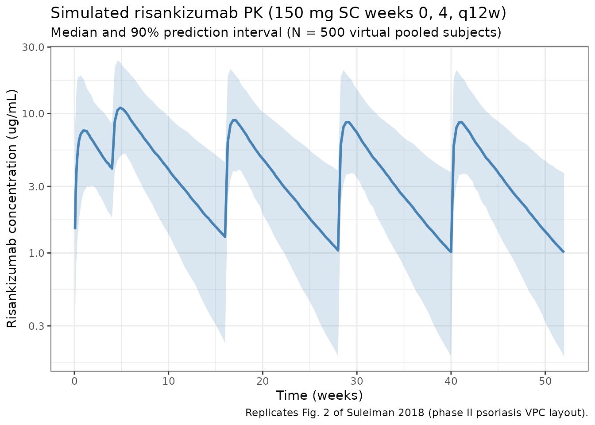

# Risankizumab (Suleiman 2018)

``` r

library(nlmixr2lib)
library(rxode2)
#> rxode2 5.1.6 using 2 threads (see ?getRxThreads)
#>   no cache: create with `rxCreateCache()`
library(dplyr)
#> 
#> Attaching package: 'dplyr'
#> The following objects are masked from 'package:stats':
#> 
#>     filter, lag
#> The following objects are masked from 'package:base':
#> 
#>     intersect, setdiff, setequal, union
library(tidyr)
library(ggplot2)
library(PKNCA)
#> 
#> Attaching package: 'PKNCA'
#> The following object is masked from 'package:stats':
#> 
#>     filter
```

## Risankizumab population PK in psoriasis and Crohn’s disease (phase I-II)

Simulate risankizumab concentration-time profiles using the final
population PK model of Suleiman et al. (2018) from the pooled analysis
of one phase I study in psoriasis (Study 1, n=31), one phase II study in
psoriasis (Study 2, n=126), and one phase II study in Crohn’s disease
(Study 3, n=115). The source paper pooled 2831 plasma concentrations
from 272 individuals across the three studies.

The model is a two-compartment structure with first-order subcutaneous
absorption and linear elimination (NONMEM `ADVAN4`). Typical parameters
for a 70 kg reference subject with baseline albumin 40 g/L (the overall
cohort median) are CL = 0.30 L/day, Vc = 5.66 L, Vp = 3.43 L, Q = 0.33
L/day, ka = 0.18 /day, and F = 0.72. The final covariate set is body
weight on CL, Q, Vc, and Vp (two shared exponents: 0.93 for CL/Q and
0.99 for Vc/Vp) and baseline serum albumin on CL (exponent -1.54).

- Citation: Suleiman AA, Khatri A, Minocha M, Othman AA. Population
  Pharmacokinetics of the Interleukin-23 Inhibitor Risankizumab in
  Subjects with Psoriasis and Crohn’s Disease: Analyses of Phase I and
  II Trials. Clin Pharmacokinet. 2018;57(10):1259-1270.
  <doi:10.1007/s40262-018-0704-z>
- Article: <https://doi.org/10.1007/s40262-018-0704-z>

### Source trace

Per-parameter origins are recorded as in-file comments in the model
file; the table below collects them in one place.

| Equation / parameter | Value | Source location |
|----|----|----|
| Two-compartment ODE structure (ka -\> central \<-\> peripheral1, linear CL) | n/a | Sect. 2.3.2 and 3.2 (NONMEM ADVAN4) |
| CL (typical, 70 kg, 40 g/L ALB) | 0.30 L/day | Table 3 |
| Vc (typical, 70 kg) | 5.66 L | Table 3 |
| Q (typical, 70 kg) | 0.33 L/day | Table 3 |
| Vp (typical, 70 kg) | 3.43 L | Table 3 |
| ka (typical) | 0.18 /day | Table 3 |
| F (SC absolute bioavailability) | 0.72 | Table 3 |
| WT on CL and Q (shared exponent) | (WT/70)^0.93 | Table 3; Eq. 3 |
| WT on Vc and Vp (shared exponent) | (WT/70)^0.99 | Table 3 |
| ALB on CL | (ALB/40)^-1.54 | Table 3; Eq. 4; ALB reference = overall Table 2 median 40 g/L |
| IIV CL | 37% CV -\> omega^2 = log(1 + 0.37^2) = 0.12832 | Table 3 (footnote b conversion) |
| IIV Vc | 55% CV -\> omega^2 = log(1 + 0.55^2) = 0.26432 | Table 3 |
| IIV Vp | 35% CV -\> omega^2 = log(1 + 0.35^2) = 0.11556 | Table 3 |
| IIV ka | 80% CV -\> omega^2 = log(1 + 0.80^2) = 0.49470 | Table 3 |
| IIV CL-Vc covariance | 0.07182 (correlation 39%) | Sibling Suleiman 2019 Table 3 (non-paper provenance; see Assumptions) |
| Residual error | proportional, propSd = 0.19 (19% CV) | Sibling Suleiman 2019 Table 3 (non-paper provenance; see Assumptions) |
| Dosing regimen (psoriasis phase III) | 150 mg SC weeks 0 and 4, then q12w | Sect. 2.3.4 |
| Dosing regimen (Crohn’s phase II maintenance) | IV 600 mg weeks 0, 4, 8 induction, then SC 180 mg q8w | Sect. 2.3.4 |

### Covariate column naming

| Source column | Canonical column used here            |
|---------------|---------------------------------------|
| `WT` (kg)     | `WT` (kg; per `covariate-columns.md`) |
| `ALB` (g/L)   | `ALB` (g/L; canonical general-scope)  |

### Virtual population

Approximate the pooled Suleiman 2018 cohort (Table 2): median body
weight 79 kg (range 36-138), overall albumin median 40 g/L (range
24-51). The paper simulates 100,000 virtual subjects per indication; the
vignette uses 500 for a fast render.

``` r

set.seed(2018)
n_subj <- 500

pop <- tibble(
  ID  = seq_len(n_subj),
  WT  = pmin(pmax(rlnorm(n_subj, log(79), 0.26), 36), 138),  # kg
  ALB = pmin(pmax(rnorm(n_subj, 40, 4.5), 24), 51)           # g/L
)
```

### Dosing dataset

Psoriasis phase III regimen (Sect. 2.3.4): 150 mg SC at weeks 0 and 4,
then every 12 weeks (q12w) thereafter. Simulate through week 52.

``` r

dose_weeks <- c(0, 4, 16, 28, 40)
dose_times <- dose_weeks * 7

obs_times <- sort(unique(c(
  seq(0,  28,       by = 0.5),
  seq(28, 52 * 7,   by = 2)
)))

d_dose <- pop %>%
  crossing(TIME = dose_times) %>%
  mutate(AMT = 150, EVID = 1, CMT = 1, DV = NA_real_)

d_obs <- pop %>%
  crossing(TIME = obs_times) %>%
  mutate(AMT = NA_real_, EVID = 0, CMT = 2, DV = NA_real_)

d_sim <- bind_rows(d_dose, d_obs) %>%
  arrange(ID, TIME, desc(EVID)) %>%
  as.data.frame()
```

### Simulate

``` r

mod <- readModelDb("Suleiman_2018_risankizumab")
sim <- rxSolve(mod, d_sim, returnType = "data.frame")
#> ℹ parameter labels from comments will be replaced by 'label()'
```

### Concentration-time profile (replicates Fig. 2, Suleiman 2018)

``` r

sim_summary <- sim %>%
  filter(time > 0) %>%
  group_by(time) %>%
  summarise(
    median = median(Cc, na.rm = TRUE),
    lo     = quantile(Cc, 0.05, na.rm = TRUE),
    hi     = quantile(Cc, 0.95, na.rm = TRUE),
    .groups = "drop"
  )

ggplot(sim_summary, aes(x = time / 7)) +
  geom_ribbon(aes(ymin = lo, ymax = hi), alpha = 0.2, fill = "steelblue") +
  geom_line(aes(y = median), colour = "steelblue", linewidth = 1) +
  scale_y_log10() +
  labs(
    x        = "Time (weeks)",
    y        = "Risankizumab concentration (ug/mL)",
    title    = "Simulated risankizumab PK (150 mg SC weeks 0, 4, q12w)",
    subtitle = "Median and 90% prediction interval (N = 500 virtual pooled subjects)",
    caption  = "Replicates Fig. 2 of Suleiman 2018 (phase II psoriasis VPC layout)."
  ) +
  theme_bw()
```



### Typical-subject comparison against the published abstract

The Abstract gives typical values for two reference subjects (with
random effects zeroed): (a) 90 kg psoriasis patient, ALB 42 g/L -\> CL =
0.35 L/day, Vc = 7.26 L, Vp = 4.39 L, Vss = 11.7 L, terminal half-life
~27 days; (b) 65 kg Crohn’s patient, ALB 37 g/L -\> CL = 0.31 L/day, Vc
= 5.26 L, Vp = 3.19 L, Vss = 8.45 L, terminal half-life ~22 days.
Reproduce these using the packaged model:

``` r

mod_typ <- rxode2::zeroRe(mod)
#> ℹ parameter labels from comments will be replaced by 'label()'

typ_scenarios <- tribble(
  ~scenario,           ~WT, ~ALB, ~paper_CL, ~paper_Vc, ~paper_Vp, ~paper_Vss, ~paper_thalf,
  "90 kg psoriasis",    90,   42,      0.35,      7.26,      4.39,       11.7,           27,
  "65 kg Crohn's",      65,   37,      0.31,      5.26,      3.19,       8.45,           22
)

# Closed-form typical values from the model equations.
lam_terminal <- function(kel, q, vc, vp) {
  k12 <- q / vc
  k21 <- q / vp
  s   <- kel + k12 + k21
  (s - sqrt(s^2 - 4 * kel * k21)) / 2
}

typ_calc <- typ_scenarios %>%
  rowwise() %>%
  mutate(
    calc_CL = 0.30 * (WT / 70)^0.93 * (ALB / 40)^(-1.54),
    calc_Vc = 5.66 * (WT / 70)^0.99,
    calc_Vp = 3.43 * (WT / 70)^0.99,
    calc_Q  = 0.33 * (WT / 70)^0.93,
    calc_Vss = calc_Vc + calc_Vp,
    calc_kel = calc_CL / calc_Vc,
    calc_thalf = log(2) / lam_terminal(calc_kel, calc_Q, calc_Vc, calc_Vp)
  ) %>%
  ungroup()

knitr::kable(
  typ_calc %>%
    transmute(
      scenario,
      `CL (paper / calc)`   = sprintf("%.2f / %.3f", paper_CL,   calc_CL),
      `Vc (paper / calc)`   = sprintf("%.2f / %.2f", paper_Vc,   calc_Vc),
      `Vp (paper / calc)`   = sprintf("%.2f / %.2f", paper_Vp,   calc_Vp),
      `Vss (paper / calc)`  = sprintf("%.2f / %.2f", paper_Vss,  calc_Vss),
      `t1/2 (paper / calc, days)` = sprintf("%.1f / %.1f", paper_thalf, calc_thalf)
    ),
  caption = "Suleiman 2018 typical-subject reference cases (Abstract vs closed-form derivation from the packaged model)."
)
```

| scenario | CL (paper / calc) | Vc (paper / calc) | Vp (paper / calc) | Vss (paper / calc) | t1/2 (paper / calc, days) |
|:---|:---|:---|:---|:---|:---|
| 90 kg psoriasis | 0.35 / 0.352 | 7.26 / 7.26 | 4.39 / 4.40 | 11.70 / 11.66 | 27.0 / 26.3 |
| 65 kg Crohn’s | 0.31 / 0.316 | 5.26 / 5.26 | 3.19 / 3.19 | 8.45 / 8.45 | 22.0 / 21.9 |

Suleiman 2018 typical-subject reference cases (Abstract vs closed-form
derivation from the packaged model). {.table}

### PKNCA validation

Run PKNCA on a steady-state 12-week maintenance interval of the
psoriasis phase III regimen (weeks 16-28). The paper’s Abstract reports
steady-state AUC(weeks 40-52) = 344 +/- 151 ug\*day/mL for the psoriasis
regimen; PKNCA on the 500-subject virtual cohort should be in a
comparable range.

``` r

nca_conc <- sim %>%
  filter(time >= 16 * 7, time <= 28 * 7) %>%
  mutate(
    time_rel  = time - 16 * 7,
    treatment = "risankizumab_150mg_q12w"
  ) %>%
  rename(ID = id) %>%
  select(ID, time_rel, Cc, treatment)

nca_dose <- pop %>%
  mutate(
    time_rel  = 0,
    AMT       = 150,
    treatment = "risankizumab_150mg_q12w"
  ) %>%
  select(ID, time_rel, AMT, treatment)

conc_obj <- PKNCAconc(nca_conc, Cc ~ time_rel | treatment + ID)
dose_obj <- PKNCAdose(nca_dose, AMT ~ time_rel | treatment + ID)
data_obj <- PKNCAdata(
  conc_obj,
  dose_obj,
  intervals = data.frame(
    start     = 0,
    end       = 12 * 7,
    cmax      = TRUE,
    tmax      = TRUE,
    auclast   = TRUE,
    half.life = TRUE
  )
)
nca_results <- pk.nca(data_obj)
nca_summary <- summary(nca_results)
knitr::kable(
  nca_summary,
  digits  = 2,
  caption = "PKNCA summary for the steady-state maintenance interval (weeks 16-28) of the psoriasis phase III 150 mg SC q12w regimen."
)
```

| start | end | treatment | N | auclast | cmax | tmax | half.life |
|---:|---:|:---|:---|:---|:---|:---|:---|
| 0 | 84 | risankizumab_150mg_q12w | 500 | 333 \[50.8\] | 9.44 \[50.7\] | 8.00 \[2.00, 24.0\] | 28.6 \[11.9\] |

PKNCA summary for the steady-state maintenance interval (weeks 16-28) of
the psoriasis phase III 150 mg SC q12w regimen. {.table
style="width:100%;"}

### Weight-effect sensitivity (replicates Fig. 4, Suleiman 2018)

Suleiman 2018 Fig. 4 shows the exposure ratio vs a reference subject
across body weight and albumin strata. Reproduce the body-weight arm by
simulating typical subjects at 60, 79 (cohort median), and 100 kg with
ALB fixed at the cohort median.

``` r

wt_grid <- c(60, 79, 100)

wt_scenarios <- tibble(WT = wt_grid, ALB = 40)

wt_typ <- wt_scenarios %>%
  rowwise() %>%
  do({
    row <- .
    typ_pop <- tibble(ID = 1L, WT = row$WT, ALB = row$ALB)
    events <- bind_rows(
      typ_pop %>% crossing(TIME = dose_times) %>%
        mutate(AMT = 150, EVID = 1, CMT = 1, DV = NA_real_),
      typ_pop %>% crossing(TIME = obs_times) %>%
        mutate(AMT = NA_real_, EVID = 0, CMT = 2, DV = NA_real_)
    ) %>%
      arrange(TIME, desc(EVID)) %>%
      as.data.frame()
    df <- rxSolve(mod_typ, events, returnType = "data.frame") %>%
      filter(time >= 16 * 7, time <= 28 * 7, Cc > 0) %>%
      arrange(time)
    auctau <- sum(diff(df$time) * (head(df$Cc, -1) + tail(df$Cc, -1)) / 2)
    tibble(WT = row$WT, ALB = row$ALB, AUCtau = auctau)
  }) %>%
  bind_rows()
#> ℹ omega/sigma items treated as zero: 'etalcl', 'etalvc', 'etalvp', 'etalka'
#> ℹ omega/sigma items treated as zero: 'etalcl', 'etalvc', 'etalvp', 'etalka'
#> ℹ omega/sigma items treated as zero: 'etalcl', 'etalvc', 'etalvp', 'etalka'

ref_auc <- wt_typ$AUCtau[wt_typ$WT == 79]

wt_typ <- wt_typ %>%
  mutate(ratio = AUCtau / ref_auc)

knitr::kable(
  wt_typ,
  digits  = 2,
  caption = "Typical-subject AUCtau (weeks 16-28) vs body weight; ratios relative to the cohort-median 79 kg subject. Consistent with Fig. 4 of Suleiman 2018 which shows heavier subjects (>100 kg) exposed to ~25% lower AUC."
)
```

|  WT | ALB | AUCtau | ratio |
|----:|----:|-------:|------:|
|  60 |  40 | 425.93 |  1.29 |
|  79 |  40 | 330.14 |  1.00 |
| 100 |  40 | 265.40 |  0.80 |

Typical-subject AUCtau (weeks 16-28) vs body weight; ratios relative to
the cohort-median 79 kg subject. Consistent with Fig. 4 of Suleiman 2018
which shows heavier subjects (\>100 kg) exposed to ~25% lower AUC.
{.table}

### Assumptions and deviations

- **Reference albumin 40 g/L (non-paper-explicit).** Suleiman 2018 Eq. 4
  (`(cov / median)^theta`) is defined in terms of the covariate’s
  median, but Table 3 does not print the reference value used. The
  overall Table 2 median (40 g/L) was verified by back-calculating the
  paper’s typical-subject CL: 0.30 \* (90/70)^0.93 \* (42/40)^-1.54 =
  0.351 L/day matches the Abstract’s 0.35 L/day for a typical 90 kg
  psoriasis subject with ALB 42 g/L, and 0.30 \* (65/70)^0.93 \*
  (37/40)^-1.54 = 0.314 L/day matches 0.31 L/day for a 65 kg Crohn’s
  subject with ALB 37 g/L.

- **Proportional residual error (propSd = 0.19) is non-paper
  provenance.** Suleiman 2018 Sect. 3.2 states “Residual variability was
  best described by a proportional error model” but Table 3 does not
  report the magnitude; the value is expected to be in the paper’s
  Electronic Supplementary Material, which was not on disk during
  extraction. The packaged value 0.19 is carried from the sibling
  `Suleiman_2019_risankizumab` model in the same registry: same first
  author (Suleiman AA) and same authorship group (Khatri, Minocha,
  Othman), same drug, and the 2018 phase I-II cohort is a strict subset
  of the 2019 integrated phase I-III cohort used to fit the 2019 model.
  This substitution was authorised via sidecar requests 001/002 (option
  C).

- **CL-Vc covariance (0.07182, correlation 39%) is non-paper
  provenance.** Suleiman 2018 Sect. 3.2 states “introducing a
  correlation between CL and Vc reduced the OFV by 135 points” but Table
  3 reports only IIV variances, not the off-diagonal. The correlation is
  expected to be in the unavailable ESM. The packaged correlation (39%)
  is carried from `Suleiman_2019_risankizumab` Table 3 under the same
  sibling-substitution reasoning above; covariance = 0.39 \*
  sqrt(0.12832 \* 0.26432) = 0.07182 given the 2018 IIV variances.

- **Virtual population approximates the pooled Table 2 demographics.**
  Suleiman 2018 does not publish individual-level data. Body weight is
  sampled log-normal around the pooled 79 kg median with SD 0.26 on the
  log scale (clipped to the observed 36-138 kg range). Albumin is
  sampled normally around the pooled 40 g/L median with SD 4.5 (clipped
  to the observed 24-51 g/L range). No correlation between WT and ALB is
  imposed; the paper does not report the joint distribution.

- **Disease population (psoriasis vs Crohn’s) is not a model
  covariate.** The paper explicitly finds no residual pharmacokinetic
  difference between psoriasis and Crohn’s disease after accounting for
  body weight and albumin (Abstract, Conclusions), so the packaged model
  does not carry an indication indicator.

- **Sex, age, race, C-reactive protein, ALT, AST, serum creatinine,
  creatinine clearance, and ADA / NAb status** were evaluated in the
  paper (Sect. 2.3.2) but were not retained in the final model and are
  not part of the packaged model.

- **Time-varying ADA covariate.** Suleiman 2018 tested ADA status as
  binary, ADA titer as continuous, and time-varying LOCF-imputed binary;
  none were retained. The later Suleiman 2019 paper
  (`Suleiman_2019_risankizumab`) does carry an ADA titer threshold
  effect (\>= 128 -\> +43% CL) which was estimated from a much larger
  ADA-positive subgroup in phase III. Users wanting an ADA-sensitive
  risankizumab model should use the 2019 sibling.

### Reference

- Suleiman AA, Khatri A, Minocha M, Othman AA. Population
  Pharmacokinetics of the Interleukin-23 Inhibitor Risankizumab in
  Subjects with Psoriasis and Crohn’s Disease: Analyses of Phase I and
  II Trials. Clin Pharmacokinet. 2018;57(10):1259-1270.
  <doi:10.1007/s40262-018-0704-z>
