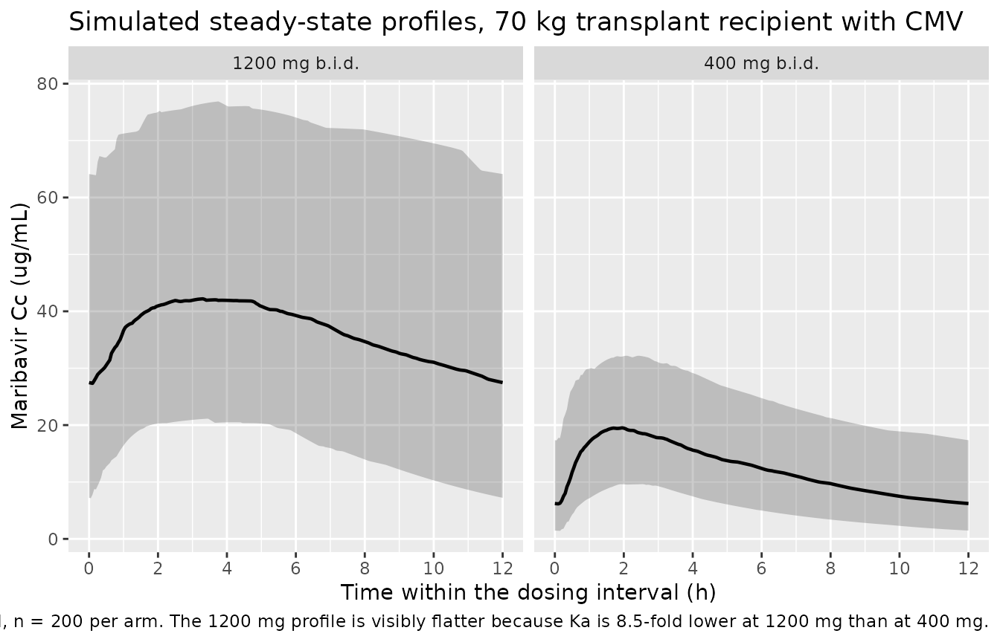
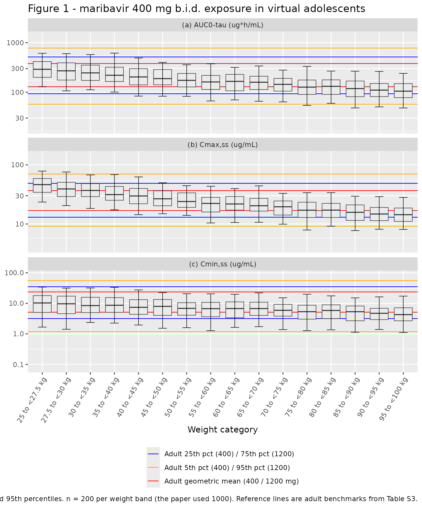

# Maribavir (Sun 2023)

## Model and source

- Citation: Sun K, Hayes S, Farrell C, Song IH. Population
  pharmacokinetic modeling and simulation of maribavir to support dose
  selection and regulatory approval in adolescents with posttransplant
  refractory cytomegalovirus. CPT Pharmacometrics Syst Pharmacol.
  2023;12(5):719-723. <doi:10.1002/psp4.12943>
- Description: Two-compartment population PK model for oral maribavir
  with first-order absorption, an absorption lag time, and
  dose-dependent absorption rate in adult transplant recipients with
  cytomegalovirus infection/disease (Sun 2023)
- Article: <https://doi.org/10.1002/psp4.12943>
- Supplement (Tables S1-S3, Figure S1, and the NONMEM control streams
  for both candidate models): <https://doi.org/10.1002/psp4.12943>
  Supporting Information

Maribavir is an oral benzimidazole riboside that inhibits the
cytomegalovirus (CMV) UL97 protein kinase. It is approved for
post-transplant CMV infection/disease refractory (with or without
resistance) to valganciclovir, ganciclovir, cidofovir or foscarnet, at
400 mg twice daily (b.i.d.). Because no paediatric clinical data existed
and adolescent recruitment was not feasible, Sun et al. used the adult
population PK (PopPK) model to simulate exposures in virtual adolescents
and support extending the indication to patients aged 12 years and older
weighing at least 35 kg.

## Population

The adult PopPK model was developed in NONMEM 7.4.3 / 7.5.0 from 12
clinical studies (Table S1): nine phase I studies, two phase II
dose-ranging studies (SHP620-202 and SHP620-203; 400, 800 and 1200 mg
b.i.d.) and one phase III study (SHP620-303; 400 mg b.i.d.). The pooled
analysis therefore mixes healthy volunteers, phase I special populations
(renal impairment in study 1263-101; moderate hepatic impairment in
study 1263-103), dedicated drug-drug-interaction cohorts (ketoconazole
in 1263-102, rifampin in 1263-110) and hematopoietic cell transplant
(HCT) or solid organ transplant (SOT) recipients with CMV infection.

Table S1 accounts for 182 participants across the nine phase I studies
and 235 across the two phase II studies (417 combined); the phase III
participant count is not given. Table S3 reports model-estimated
steady-state exposures for 253 phase III (400 mg b.i.d.) and 232 phase
II (1200 mg b.i.d.) transplant recipients with CMV. Neither the article
nor the supplement reports numeric age, sex, race or body-weight
summaries – the baseline body weight distribution appears only as a bar
chart in Figure S1.

The same information is available programmatically via the model’s
`population` metadata:

``` r

readModelDb("Sun_2023_maribavir")()$population$disease_state
#> [1] "Pooled analysis of healthy volunteers, phase I participants with renal or hepatic impairment, and hematopoietic cell transplant (HCT) or solid organ transplant (SOT) recipients with cytomegalovirus (CMV) infection refractory to (with or without resistance to) valganciclovir, ganciclovir, cidofovir or foscarnet."
readModelDb("Sun_2023_maribavir")()$population$dose_range
#> [1] "100-1200 mg orally: single doses of 100, 200 and 400 mg (phase I) and twice-daily regimens of 400, 800 and 1200 mg (phase II/III)."
```

## Source trace

The per-parameter origin is recorded as an in-file comment next to each
`ini()` entry in `inst/modeldb/specificDrugs/Sun_2023_maribavir.R`. The
table below collects them in one place for review.

Two on-disk sources are cited. **Table S2** is the published parameter
table (back-transformed estimates, % RSE, 95% CI and IIV CV%).
**`s005.txt`** is the supplement’s NONMEM control stream for run 171 –
the “fixed weight effect exponents” model – whose `$THETA` block is
annotated `;from 171.cnv`, i.e. the final converged estimates. The
control stream carries full precision and the complete `$OMEGA BLOCK(6)`
and `$SIGMA`, so it is the primary source for the `ini()` values; every
one of them was cross-checked against Table S2 (see the
“Cross-validation” section below).

| Equation / parameter | Value | Source location |
|----|----|----|
| `lcl` | 1.32774 (= log 3.77 L/h) | s005.txt `THETA(1) [ln_CL]`; Table S2 `CL/F` 3.77 (95% CI 3.50-4.06) |
| `lvc` | 2.92052 (= log 18.6 L) | s005.txt `THETA(2) [ln_V2]`; Table S2 `Vc/F` 18.6 (95% CI 17.3-19.8) |
| `lq` | -0.096712 (= log 0.908 L/h) | s005.txt `THETA(3) [ln_Q]`; Table S2 `Q/F` 0.908 (95% CI 0.705-1.17) |
| `lvp` | 2.15842 (= log 8.66 L) | s005.txt `THETA(4) [ln_V3]`; Table S2 `Vp/F` 8.66 (95% CI 7.05-10.6) |
| `lka` | -1.092 (= log 0.336 1/h) | s005.txt `THETA(5) [ln_Ka]`; Table S2 `Ka` 0.336 (95% CI 0.271-0.415) |
| `ltlag` | -1.30567 (= log 0.271 h) | s005.txt `THETA(6) [ln_ALAG1]`; Table S2 `Lag time` 0.271 (95% CI 0.241-0.304) |
| `e_wt_cl` | 0.75 fixed | s005.txt `THETA(7) (0.75 FIX)`; Table S2 `CL/F~weight 0.75 fixed` |
| `e_wt_vc` | 1 fixed | s005.txt `THETA(8) (1 FIX)`; Table S2 `Vc/F~weight 1 fixed` |
| `e_wt_q` | 0.75 fixed | s005.txt `THETA(9) (0.75 FIX)`; Table S2 `Q/F~weight 0.75 fixed` |
| `e_wt_vp` | 1 fixed | s005.txt `THETA(10) (1 FIX)`; Table S2 `Vp/F~weight 1 fixed` |
| `e_dis_cmv_cl` | -0.280346 (= log 0.756) | s005.txt `THETA(17) [CL~CMV]`; Table S2 `CL/F~transplant patients with CMV` 0.756 (95% CI 0.690-0.827) |
| `e_dose_ka` | -1.9439 | s005.txt `THETA(16) [KA~dose]`; Table S2 `Ka~dose` -1.94 (95% CI -2.19 to -1.70) |
| `e_cyp3a4_inh_cl` | log(0.700292) | s005.txt `THETA(11) [CL~CYP3AINH]`; **not** in Table S2 |
| `e_cyp3a4_ind_cl` | log(2.24181) | s005.txt `THETA(12) [CL~CYP3AIND]`; **not** in Table S2 |
| IIV block (6x6) | 21 lower-triangle elements | s005.txt `$OMEGA BLOCK(6)` over ETA(1..6) = CL, Vc, Q, Vp, Ka, ALAG1; diagonals reproduce all six Table S2 `IIV CV%` entries |
| `propSd` | sqrt(0.136898) = 0.370 | s005.txt `$SIGMA` third element (EPS(3), studies 202/203/303) |
| Structural model (2-cmt, first-order absorption, lag time) | n/a | s005.txt `$SUBROUTINES ADVAN4 TRANS4` + `ALAG1`; Results “Adult PopPK model” paragraph |
| `cl` covariate equation | n/a | s005.txt `$PK` `MU_1`/`CL` lines; Table S2 footnote `CL/F = 3.77 x (WT/70)^0.75 x 0.756^(patients with CMV)` |
| `ka` covariate equation | n/a | s005.txt `$PK` `KADOSE`/`KA` lines; Table S2 footnote `Ka = 0.336 x (dose/800)^-1.94` |
| Reference subject (70 kg, no CMV, 800 mg) | n/a | Table S2 footnote: “The reference population is a 70-kg individual without CMV administered a 800 mg maribavir dose” |

### Which of the paper’s two models is extracted

The authors fitted the same structural model twice, differing only in
whether the four body-weight exponents were estimated or fixed:

- **Run 174** (supplement `s002.txt`) estimated them (CL/F 0.114, Vc/F
  0.407, Q/F 1.95, Vp/F 0.663). The paper rejects this model: the
  estimates for `CL/F~weight` and `Vp/F~weight` were “imprecise” and the
  model was “not considered as sufficiently robust for subsequent
  simulation of adolescent exposure based on body weight.”
- **Run 171** (supplement `s005.txt`) fixed them at the allometric
  values (0.75 for the clearance terms, 1 for the volume terms). This is
  the model reported in Table S2 and used for every simulation and
  exposure estimate in the paper.

Only run 171 is extracted, per the “final model only” rule for
model-development papers. Run 174 is a rejected candidate, not an
independent model, so it is deliberately not packaged.

``` r

mod <- readModelDb("Sun_2023_maribavir")
mod
#> function() {
#>   description <- "Two-compartment population PK model for oral maribavir with first-order absorption, an absorption lag time, and dose-dependent absorption rate in adult transplant recipients with cytomegalovirus infection/disease (Sun 2023)"
#>   reference <- "Sun K, Hayes S, Farrell C, Song IH. Population pharmacokinetic modeling and simulation of maribavir to support dose selection and regulatory approval in adolescents with posttransplant refractory cytomegalovirus. CPT Pharmacometrics Syst Pharmacol. 2023;12(5):719-723. doi:10.1002/psp4.12943"
#>   vignette <- "Sun_2023_maribavir"
#>   units <- list(time = "hour", dosing = "mg", concentration = "ug/mL")
#> 
#>   covariateData <- list(
#>     WT = list(
#>       description        = "Baseline body weight",
#>       units              = "kg",
#>       type               = "continuous",
#>       reference_category = NULL,
#>       notes              = "Time-fixed per subject (baseline weight). Allometric power scaling on CL/F, Vc/F, Q/F and Vp/F with a 70 kg reference; all four exponents were FIXED (0.75 for the clearance terms, 1 for the volume terms) rather than estimated, because the model with estimated exponents returned imprecise estimates for CL/F~weight and Vp/F~weight and was judged insufficiently robust for the adolescent simulations.",
#>       source_name        = "WTBL"
#>     ),
#>     DIS_CMV = list(
#>       description        = "Transplant recipient with cytomegalovirus infection/disease indicator",
#>       units              = "(binary)",
#>       type               = "binary",
#>       reference_category = "0 (healthy volunteer / non-CMV participant)",
#>       notes              = "1 = hematopoietic cell transplant (HCT) or solid organ transplant (SOT) recipient with CMV infection/disease (the phase II SHP620-202 / SHP620-203 and phase III SHP620-303 populations); 0 = healthy volunteer or phase I participant without CMV (including the renal- and hepatic-impairment cohorts). Enters as a log-scale additive shift on CL/F: CL/F is 0.756x lower in transplant recipients with CMV than in the healthy reference. Table S2 states the structural reference population explicitly as 'a 70-kg individual without CMV administered a 800 mg maribavir dose', so DIS_CMV = 0 is the reference.",
#>       source_name        = "HSCMV"
#>     ),
#>     DOSE = list(
#>       description        = "Administered maribavir dose per administration",
#>       units              = "mg",
#>       type               = "continuous",
#>       reference_category = NULL,
#>       notes              = "Use case (a) of the DOSE canonical: per-subject assigned dose level entering a power-form covariate effect on the first-order absorption rate, Ka = 0.336 * (DOSE / 800)^-1.94, normalised at 800 mg. The exponent is negative, so Ka decreases as the maribavir dose increases. Observed dose levels in the pooled analysis were single doses of 100, 200 and 400 mg and twice-daily regimens of 400, 800 and 1200 mg.",
#>       source_name        = "DOSE"
#>     ),
#>     CONMED_CYP3A4_INH = list(
#>       description        = "Concomitant CYP3A4 inhibitor coadministration indicator",
#>       units              = "(binary)",
#>       type               = "binary",
#>       reference_category = "0 (no CYP3A4 inhibitor coadministration)",
#>       notes              = "Time-varying. Multiplicative power-form effect on CL/F: 0.700^CONMED_CYP3A4_INH (a 30 percent reduction in CL/F when 1), consistent with maribavir being cleared mainly by CYP3A4/CYP1A2 metabolism. The pooled dataset's inhibitor exposure comes principally from the dedicated ketoconazole drug-drug-interaction study 1263-102 (Table S1); the source does not enumerate which inhibitor strengths were pooled into the 1 category. This coefficient appears in the final NONMEM control stream but is not tabulated in Table S2 (which presents the model for the reference population, where the indicator is 0), so no RSE or confidence interval is reported for it.",
#>       source_name        = "CYP3AINH"
#>     ),
#>     CONMED_CYP3A4_IND = list(
#>       description        = "Concomitant CYP3A4 inducer coadministration indicator",
#>       units              = "(binary)",
#>       type               = "binary",
#>       reference_category = "0 (no CYP3A4 inducer coadministration)",
#>       notes              = "Time-varying. Multiplicative power-form effect on CL/F: 2.242^CONMED_CYP3A4_IND (a 2.24-fold increase in CL/F when 1). The pooled dataset's inducer exposure comes principally from the dedicated rifampin drug-drug-interaction study 1263-110 (Table S1); the source does not enumerate which inducer strengths were pooled into the 1 category. This coefficient appears in the final NONMEM control stream but is not tabulated in Table S2 (which presents the model for the reference population, where the indicator is 0), so no RSE or confidence interval is reported for it.",
#>       source_name        = "CYP3AIND"
#>     )
#>   )
#> 
#>   # Covariates that the source screened and carried in the final NONMEM control
#>   # stream but whose coefficients were FIXED to 0 (i.e. tested and not retained).
#>   # They are documented here for provenance and are deliberately NOT referenced in
#>   # model(), because a coefficient fixed at exactly 0 contributes nothing.
#>   covariatesDataExcluded <- list(
#>     SEXF = list(
#>       description        = "Female sex indicator",
#>       units              = "(binary)",
#>       type               = "binary",
#>       reference_category = "0 (male)",
#>       notes              = "Screened as an effect on both CL/F (THETA(14)) and Vc/F (THETA(15)) in the final control stream, but both coefficients are '(0 FIX)' and the covariate is additionally hardcoded to SEXN = 0 in the published simulation stream. Not retained in the final model and not reported in Table S2.",
#>       source_name        = "SEXN"
#>     ),
#>     HEPIMP_MOD = list(
#>       description        = "Moderate hepatic impairment (Child-Pugh class B) indicator",
#>       units              = "(binary)",
#>       type               = "binary",
#>       reference_category = "0 (normal hepatic function)",
#>       notes              = "Screened as an effect on Vc/F (THETA(13), labelled '[Vc~Child-Pugh Class B]') in the final control stream, but the coefficient is '(0 FIX)' and the covariate is additionally hardcoded to HEPN2 = 0 in the published simulation stream. The hepatic-impairment cohort came from phase I study 1263-103 (10 participants with normal hepatic function and 10 with moderate impairment; Table S1). Not retained in the final model and not reported in Table S2.",
#>       source_name        = "HEPN2"
#>     )
#>   )
#> 
#>   population <- list(
#>     species        = "human",
#>     n_subjects     = "Not reported as a pooled total. Table S1 accounts for 182 participants across the 9 phase I studies and 235 across the 2 phase II studies (417 combined); the phase III SHP620-303 participant count is not given in Table S1. Table S3 reports model-estimated steady-state exposures for 253 phase III (400 mg b.i.d.) and 232 phase II (1200 mg b.i.d.) transplant recipients with CMV.",
#>     n_studies      = 12,
#>     age_range      = "Adults. Numeric age range not reported in the article or its supplement.",
#>     weight_range   = "Not reported numerically; the baseline body weight distribution is shown graphically only, in Figure S1. The model's allometric reference weight is 70 kg.",
#>     sex_female_pct = "Not reported.",
#>     race_ethnicity = "Not reported.",
#>     disease_state  = "Pooled analysis of healthy volunteers, phase I participants with renal or hepatic impairment, and hematopoietic cell transplant (HCT) or solid organ transplant (SOT) recipients with cytomegalovirus (CMV) infection refractory to (with or without resistance to) valganciclovir, ganciclovir, cidofovir or foscarnet.",
#>     dose_range     = "100-1200 mg orally: single doses of 100, 200 and 400 mg (phase I) and twice-daily regimens of 400, 800 and 1200 mg (phase II/III).",
#>     regions        = "Not reported.",
#>     notes          = "Study-by-study designs and per-study participant counts are in Table S1 of the supplement. The final parameter estimates are in Table S2; steady-state exposure summaries used as validation targets are in Table S3. The model was developed in NONMEM 7.4.3 / 7.5.0 (ADVAN4 TRANS4). This model file encodes the 'fixed weight effect exponents' model (control-stream run 171), which is the model the authors used for all reported simulations and exposure estimates; the alternative model with estimated weight exponents (run 174) was explicitly rejected as insufficiently robust and is not extracted."
#>   )
#> 
#>   ini({
#>     # Structural parameters. NONMEM parameterises these as MU_n = THETA(n) with
#>     # PARAM = EXP(MU_n + ETA(n)), so each THETA is already on the natural-log
#>     # scale and is carried here verbatim at full reported precision. The
#>     # back-transformed value in the trailing comment is the Table S2 estimate.
#>     # Reference subject: 70 kg, without CMV, 800 mg maribavir dose (Table S2 footnote).
#>     lcl   <-  1.32774;  label("Apparent clearance in the reference subject (CL/F, L/h)")                       # supplement s005.txt run 171 THETA(1) [ln_CL]; exp = 3.77 L/h (Table S2, 95% CI 3.50-4.06)
#>     lvc   <-  2.92052;  label("Apparent central volume of distribution in the reference subject (Vc/F, L)")    # supplement s005.txt run 171 THETA(2) [ln_V2]; exp = 18.6 L (Table S2, 95% CI 17.3-19.8)
#>     lq    <- -0.096712; label("Apparent intercompartmental clearance in the reference subject (Q/F, L/h)")     # supplement s005.txt run 171 THETA(3) [ln_Q]; exp = 0.908 L/h (Table S2, 95% CI 0.705-1.17)
#>     lvp   <-  2.15842;  label("Apparent peripheral volume of distribution in the reference subject (Vp/F, L)") # supplement s005.txt run 171 THETA(4) [ln_V3]; exp = 8.66 L (Table S2, 95% CI 7.05-10.6)
#>     lka   <- -1.092;    label("First-order absorption rate at the 800 mg reference dose (Ka, 1/h)")            # supplement s005.txt run 171 THETA(5) [ln_Ka]; exp = 0.336 1/h (Table S2, 95% CI 0.271-0.415)
#>     ltlag <- -1.30567;  label("Absorption lag time (h)")                                                      # supplement s005.txt run 171 THETA(6) [ln_ALAG1]; exp = 0.271 h (Table S2, 95% CI 0.241-0.304)
#> 
#>     # Allometric body-weight exponents, all FIXED rather than estimated: the model
#>     # with estimated exponents gave imprecise CL/F~weight and Vp/F~weight estimates
#>     # and was rejected for the adolescent simulations.
#>     e_wt_cl <- fixed(0.75); label("Allometric (WT) exponent on CL/F (unitless)") # supplement s005.txt run 171 THETA(7) '(0.75 FIX)'; Table S2 'CL/F~weight 0.75 fixed'
#>     e_wt_vc <- fixed(1);    label("Allometric (WT) exponent on Vc/F (unitless)") # supplement s005.txt run 171 THETA(8) '(1 FIX)'; Table S2 'Vc/F~weight 1 fixed'
#>     e_wt_q  <- fixed(0.75); label("Allometric (WT) exponent on Q/F (unitless)")  # supplement s005.txt run 171 THETA(9) '(0.75 FIX)'; Table S2 'Q/F~weight 0.75 fixed'
#>     e_wt_vp <- fixed(1);    label("Allometric (WT) exponent on Vp/F (unitless)") # supplement s005.txt run 171 THETA(10) '(1 FIX)'; Table S2 'Vp/F~weight 1 fixed'
#> 
#>     # Covariate effects
#>     e_dis_cmv_cl <- -0.280346; label("Log-effect of transplant-recipient-with-CMV status on CL/F (unitless)")  # supplement s005.txt run 171 THETA(17) [CL~CMV]; exp = 0.756 (Table S2 'CL/F~transplant patients with CMV' 0.756, 95% CI 0.690-0.827)
#>     e_dose_ka    <- -1.9439;   label("Power exponent of maribavir dose on Ka, normalised at 800 mg (unitless)") # supplement s005.txt run 171 THETA(16) [KA~dose]; Table S2 'Ka~dose' -1.94 (95% CI -2.19 to -1.70)
#> 
#>     # CYP3A4 perpetrator co-medication effects on CL/F. Stored as logs of the
#>     # multiplicative factors so they enter the same log-scale sum as lcl; the
#>     # source writes them in power form as THETA(11)^CYP3AINH * THETA(12)^CYP3AIND.
#>     # Not tabulated in Table S2 (see covariateData notes), so no RSE/CI available.
#>     e_cyp3a4_inh_cl <- log(0.700292); label("Log-effect of concomitant CYP3A4 inhibitor on CL/F (unitless)") # supplement s005.txt run 171 THETA(11) [CL~CYP3AINH] = 0.700292
#>     e_cyp3a4_ind_cl <- log(2.24181);  label("Log-effect of concomitant CYP3A4 inducer on CL/F (unitless)")   # supplement s005.txt run 171 THETA(12) [CL~CYP3AIND] = 2.24181
#> 
#>     # Inter-individual variability: NONMEM $OMEGA BLOCK(6) over
#>     # ETA(1..6) = CL, Vc, Q, Vp, Ka, ALAG1 (supplement s005.txt run 171).
#>     # The 21 values below are the lower triangle row-by-row, exactly as the
#>     # control stream lists them; the layout below puts one NONMEM row per
#>     # source line, so the trailing value on each line is that row's diagonal
#>     # variance and the leading values are its covariances:
#>     #   line 1 -> var(CL)                                        = 0.243536
#>     #   line 2 -> cov(CL,Vc),  var(Vc)                           = 0.11584
#>     #   line 3 -> cov(CL,Q),  cov(Vc,Q),  var(Q)                 = 0.600237
#>     #   line 4 -> cov(.,Vp) x3,           var(Vp)                = 0.722801
#>     #   line 5 -> cov(.,Ka) x4,           var(Ka)                = 1.19927
#>     #   line 6 -> cov(.,lag) x5,          var(lag time)          = 0.177434
#>     # Those six diagonals reproduce every Table S2 'IIV CV%' entry under that
#>     # table's footnote-c rule (CV = sqrt(omega^2)*100 when omega^2 <= 0.15,
#>     # else CV = sqrt(exp(omega^2)-1)*100): CL 52.5%, Vc 34.0%, Q 90.7%,
#>     # Vp 103%, Ka 152%, lag time 44.1%. The matrix is positive definite as
#>     # published, so no off-diagonal nudging was required.
#>     etalcl + etalvc + etalq + etalvp + etalka + etaltlag ~ c(
#>       0.243536,
#>       0.133832, 0.11584,
#>       -0.134868, -0.051648, 0.600237,
#>       0.0432159, 0.0911984, 0.429564, 0.722801,
#>       0.098576, 0.133826, -0.439322, -0.314392, 1.19927,
#>       0.00377063, -0.0215698, 0.150093, 0.114468, -0.32376, 0.177434
#>     )
#> 
#>     # Residual error. The source $ERROR block applies a study-specific
#>     # proportional term plus a shared additive term:
#>     #   Y = IPRED + EPS(1)*IPRED + EPS(2)                       (phase I studies)
#>     #   Y = IPRED + EPS(3)*IPRED + EPS(2)                       (studies 202/203/303)
#>     # $SIGMA is 0.0672821 [EPS(1)], '0 FIX' [EPS(2)], 0.136898 [EPS(3)].
#>     # This model file describes the transplant-recipient-with-CMV population
#>     # (phase II studies 202/203 and phase III study 303), so it carries EPS(3);
#>     # the published simulation control stream likewise hardcodes STUDY = 202 and
#>     # therefore selects EPS(3). The additive term EPS(2) is fixed at exactly zero
#>     # and so is omitted rather than written as add(fixed(0)) -- an additive SD of 0
#>     # contributes nothing. The phase I proportional SD is sqrt(0.0672821) = 0.259.
#>     propSd <- sqrt(0.136898); label("Proportional residual error, phase II/III transplant recipients (fraction)") # supplement s005.txt run 171 $SIGMA third element (EPS(3)) = 0.136898 -> SD 0.370
#>   })
#>   model({
#>     # Individual parameters. NONMEM writes the allometric terms inside the
#>     # exponent as LOG(WTBL/70)*THETA(n), which is identical to (WT/70)^THETA(n).
#>     # CYP3A4 perpetrator effects on CL/F: source form is
#>     # CL * THETA(11)^CYP3AINH * THETA(12)^CYP3AIND.
#>     cyp3a4_cl <- exp(e_cyp3a4_inh_cl * CONMED_CYP3A4_INH + e_cyp3a4_ind_cl * CONMED_CYP3A4_IND)
#> 
#>     cl   <- exp(lcl + e_dis_cmv_cl * DIS_CMV + etalcl) * (WT / 70)^e_wt_cl * cyp3a4_cl
#>     vc   <- exp(lvc + etalvc)                          * (WT / 70)^e_wt_vc
#>     q    <- exp(lq  + etalq)                           * (WT / 70)^e_wt_q
#>     vp   <- exp(lvp + etalvp)                          * (WT / 70)^e_wt_vp
#>     ka   <- exp(lka + etalka) * (DOSE / 800)^e_dose_ka
#>     tlag <- exp(ltlag + etaltlag)
#> 
#>     kel <- cl / vc
#>     k12 <- q  / vc
#>     k21 <- q  / vp
#> 
#>     d/dt(depot)       <- -ka * depot
#>     d/dt(central)     <-  ka * depot - kel * central - k12 * central + k21 * peripheral1
#>     d/dt(peripheral1) <-  k12 * central - k21 * peripheral1
#> 
#>     alag(depot) <- tlag
#> 
#>     # Dose in mg, volume in L -> mg/L = ug/mL, matching the Table S3 units
#>     Cc <- central / vc
#>     Cc ~ prop(propSd)
#>   })
#> }
#> <environment: 0x56009e3e7c98>
```

### Cross-validation of the control stream against Table S2

Because the `ini()` values are taken from the control stream, it is
worth demonstrating explicitly that they reproduce the published table.
All six structural parameters back-transform to the Table S2 estimates,
and all six IIV variances reproduce the Table S2 `IIV CV%` column under
that table’s footnote-c rule.

``` r

theta <- c(lcl = 1.32774, lvc = 2.92052, lq = -0.096712,
           lvp = 2.15842, lka = -1.092, ltlag = -1.30567)
table_s2_estimate <- c(3.77, 18.6, 0.908, 8.66, 0.336, 0.271)

# NONMEM $OMEGA BLOCK(6) lower triangle, row by row (s005.txt)
omega_lt <- c(
  0.243536,
  0.133832, 0.11584,
  -0.134868, -0.051648, 0.600237,
  0.0432159, 0.0911984, 0.429564, 0.722801,
  0.098576, 0.133826, -0.439322, -0.314392, 1.19927,
  0.00377063, -0.0215698, 0.150093, 0.114468, -0.32376, 0.177434
)
omega <- matrix(0, 6, 6)
k <- 1
for (i in 1:6) for (j in 1:i) { omega[i, j] <- omega_lt[k]; omega[j, i] <- omega_lt[k]; k <- k + 1 }

# Table S2 footnote c: CV = sqrt(omega^2)*100 if omega^2 <= 0.15, else sqrt(exp(omega^2)-1)*100
iiv_cv <- vapply(diag(omega), function(v) {
  if (v <= 0.15) sqrt(v) * 100 else sqrt(exp(v) - 1) * 100
}, numeric(1))

tibble(
  Parameter          = c("CL/F (L/h)", "Vc/F (L)", "Q/F (L/h)", "Vp/F (L)",
                         "Ka (1/h)", "Lag time (h)"),
  `Back-transformed` = round(exp(theta), 4),
  `Table S2`         = table_s2_estimate,
  `IIV CV% computed` = round(iiv_cv, 1),
  `Table S2 IIV CV%` = c(52.5, 34.0, 90.7, 103, 152, 44.1)
) |>
  knitr::kable(caption = "Control-stream run 171 values back-transformed against Table S2.")
```

| Parameter    | Back-transformed | Table S2 | IIV CV% computed | Table S2 IIV CV% |
|:-------------|-----------------:|---------:|-----------------:|-----------------:|
| CL/F (L/h)   |           3.7725 |    3.770 |             52.5 |             52.5 |
| Vc/F (L)     |          18.5509 |   18.600 |             34.0 |             34.0 |
| Q/F (L/h)    |           0.9078 |    0.908 |             90.7 |             90.7 |
| Vp/F (L)     |           8.6574 |    8.660 |            103.0 |            103.0 |
| Ka (1/h)     |           0.3355 |    0.336 |            152.2 |            152.0 |
| Lag time (h) |           0.2710 |    0.271 |             44.1 |             44.1 |

Control-stream run 171 values back-transformed against Table S2.
{.table}

The CMV effect and the dose effect on Ka also reproduce exactly, and the
IIV block is positive definite as published (no nudging was needed):

``` r

c(`exp(THETA(17)) vs Table S2 0.756` = round(exp(-0.280346), 4),
  `THETA(16) vs Table S2 -1.94`      = -1.9439)
#> exp(THETA(17)) vs Table S2 0.756      THETA(16) vs Table S2 -1.94 
#>                           0.7555                          -1.9439

c(`OMEGA min eigenvalue` = round(min(eigen(omega, only.values = TRUE)$values), 6),
  `positive definite`    = all(eigen(omega, only.values = TRUE)$values > 0))
#> OMEGA min eigenvalue    positive definite 
#>             0.018032             1.000000
```

## Virtual cohort

Original observed data are not publicly available, and the adult
body-weight distribution is published only as a bar chart (Figure S1).
The adult cohorts below therefore fix body weight at the model’s own 70
kg allometric reference, which is a principled choice rather than one
fitted to the validation target (see “Assumptions and deviations”). The
adolescent cohorts follow the paper’s Methods exactly.

Cohort sizes are capped at 200 participants per arm.

``` r

set.seed(20230528)

n_per_arm <- 200L
tau <- 12 # dosing interval (h), b.i.d.

# Observation grids. The paper sampled adolescents at 0, 1, 2, 3, 4, 6, 8 and
# 12 h (Methods, "Adolescent PopPK model simulations"), so the adolescent
# replication uses that grid. Adult steady-state exposures in Table S3 were
# derived as model "individual estimates" rather than from a sparse grid, so
# the adult cohorts use a dense grid for an accurate AUC / Cmax / Cmin.
grid_adolescent <- c(0, 1, 2, 3, 4, 6, 8, 12)
grid_adult <- sort(unique(c(seq(0, tau, by = 0.05), grid_adolescent)))

# Build one steady-state b.i.d. cohort. Dose lands in `depot`; observations are
# taken on `central` (the ODE state), never on the algebraic observable `Cc`.
make_cohort <- function(n, dose, wt, label, obs_times, id_offset = 0L,
                        dis_cmv = 1) {
  subj <- tibble(
    id      = id_offset + seq_len(n),
    WT      = wt,
    DOSE    = dose,
    DIS_CMV = dis_cmv,
    CONMED_CYP3A4_INH = 0,
    CONMED_CYP3A4_IND = 0,
    arm     = label
  )
  doses <- subj |>
    mutate(time = 0, amt = dose, evid = 1L, cmt = "depot", ii = tau, ss = 1L)
  obs <- subj |>
    tidyr::crossing(time = obs_times) |>
    mutate(amt = NA_real_, evid = 0L, cmt = "central", ii = 0, ss = 0L)
  bind_rows(doses, obs) |>
    arrange(id, time, desc(evid)) |>
    # Canonical event-table columns must come FIRST so rxode2's column
    # heuristic classifies `DOSE` as a model covariate taken from the event
    # table rather than as a missing parameter. Without this reordering
    # rxSolve() fails with "The following parameter(s) are required for
    # solving: DOSE". Same pattern as Zheng_2016_sifalimumab.Rmd.
    select(id, time, amt, evid, cmt, ii, ss, everything())
}

adult_events <- bind_rows(
  make_cohort(n_per_arm, dose = 400,  wt = 70, label = "400 mg b.i.d.",
              obs_times = grid_adult, id_offset = 0L),
  make_cohort(n_per_arm, dose = 1200, wt = 70, label = "1200 mg b.i.d.",
              obs_times = grid_adult, id_offset = 1000L)
)
stopifnot(!anyDuplicated(unique(adult_events[, c("id", "time", "evid")])))
```

The adolescent cohort follows the paper’s Methods: virtual weights
sampled from a uniform distribution within each 2.5 kg increment from 25
to \<30 kg and each 5 kg increment from 30 to \<100 kg, dosed at 400 mg
b.i.d. to steady state, with interindividual variability included and
**no** residual variability.

``` r

band_edges <- c(seq(25, 30, by = 2.5), seq(35, 100, by = 5))
bands <- tibble(
  lower = head(band_edges, -1),
  upper = tail(band_edges, -1)
) |>
  mutate(band = sprintf("%g to <%g kg", lower, upper),
         band = factor(band, levels = band))

adolescent_events <- lapply(seq_len(nrow(bands)), function(i) {
  b <- bands[i, ]
  make_cohort(
    n_per_arm, dose = 400,
    wt = runif(n_per_arm, b$lower, b$upper),
    label = as.character(b$band),
    obs_times = grid_adolescent,
    id_offset = 10000L + (i - 1L) * 1000L
  )
}) |>
  bind_rows() |>
  mutate(band = factor(arm, levels = levels(bands$band)))
stopifnot(!anyDuplicated(unique(adolescent_events[, c("id", "time", "evid")])))

nrow(bands)
#> [1] 16
```

## Simulation

`Cc` is the individual prediction without residual error, which is what
the paper simulated (“No residual variability was included in the
predictions”).

``` r

# rxSolve() returns observation rows only (no dose rows, hence no `evid`
# column), so no post-filtering is needed.
sim_adult <- rxode2::rxSolve(
  mod, events = adult_events, keep = c("arm", "WT", "DOSE")
) |>
  as.data.frame()

sim_adolescent <- rxode2::rxSolve(
  mod, events = adolescent_events, keep = c("arm", "band", "WT")
) |>
  as.data.frame()

c(adult_rows = nrow(sim_adult), adolescent_rows = nrow(sim_adolescent))
#>      adult_rows adolescent_rows 
#>           96400           25600
```

Steady state is confirmed by the concentration at the start and end of
the dosing interval agreeing to within numerical tolerance:

``` r

sim_adult |>
  filter(time %in% c(0, tau)) |>
  group_by(arm, time) |>
  summarise(median_Cc = median(Cc), .groups = "drop") |>
  tidyr::pivot_wider(names_from = time, values_from = median_Cc,
                     names_prefix = "t") |>
  mutate(`relative difference` = abs(t12 - t0) / t0) |>
  knitr::kable(digits = 5,
               caption = "Steady-state check: median Cc at t = 0 vs t = tau.")
```

| arm            |      t0 |     t12 | relative difference |
|:---------------|--------:|--------:|--------------------:|
| 1200 mg b.i.d. | 27.4718 | 27.4718 |                   0 |
| 400 mg b.i.d.  |  6.2094 |  6.2094 |                   0 |

Steady-state check: median Cc at t = 0 vs t = tau. {.table}

## Structural checks

### Dose-dependent absorption rate

The most distinctive feature of this model is that Ka *decreases* as the
maribavir dose increases (`Ka = 0.336 * (dose/800)^-1.94`). This
flattens the concentration-time profile at higher doses and is why
steady-state Cmax is markedly less than dose-proportional even though
AUC is dose-proportional.

``` r

tibble(DOSE = c(100, 200, 400, 800, 1200)) |>
  mutate(`Ka (1/h)` = 0.336 * (DOSE / 800)^-1.9439,
         `t1/2 of absorption (h)` = log(2) / `Ka (1/h)`) |>
  rename("Dose (mg)" = DOSE) |>
  knitr::kable(digits = 3,
               caption = "Dose effect on Ka (Table S2 footnote equation).")
```

| Dose (mg) | Ka (1/h) | t1/2 of absorption (h) |
|----------:|---------:|-----------------------:|
|       100 |   19.136 |                  0.036 |
|       200 |    4.974 |                  0.139 |
|       400 |    1.293 |                  0.536 |
|       800 |    0.336 |                  2.063 |
|      1200 |    0.153 |                  4.537 |

Dose effect on Ka (Table S2 footnote equation). {.table}

``` r

sim_adult |>
  group_by(arm, time) |>
  summarise(Q05 = quantile(Cc, 0.05), Q50 = quantile(Cc, 0.50),
            Q95 = quantile(Cc, 0.95), .groups = "drop") |>
  ggplot(aes(time, Q50)) +
  geom_ribbon(aes(ymin = Q05, ymax = Q95), alpha = 0.25) +
  geom_line(linewidth = 0.8) +
  facet_wrap(~arm) +
  scale_x_continuous(breaks = seq(0, 12, 2)) +
  labs(x = "Time within the dosing interval (h)", y = "Maribavir Cc (ug/mL)",
       title = "Simulated steady-state profiles, 70 kg transplant recipient with CMV",
       caption = paste("Median with 5th-95th percentile band, n = 200 per arm.",
                       "The 1200 mg profile is visibly flatter because Ka is",
                       "8.5-fold lower at 1200 mg than at 400 mg."))
```



### Allometry and the CMV effect

``` r

tibble(WT = c(25, 35, 50, 70, 90)) |>
  mutate(`CL/F, healthy (L/h)`  = 3.77 * (WT / 70)^0.75,
         `CL/F, CMV (L/h)`      = 3.77 * (WT / 70)^0.75 * 0.756,
         `Vc/F (L)`             = 18.6 * (WT / 70)^1) |>
  rename("Body weight (kg)" = WT) |>
  knitr::kable(digits = 3,
               caption = "Allometric scaling and the 0.756x CMV effect on CL/F.")
```

| Body weight (kg) | CL/F, healthy (L/h) | CL/F, CMV (L/h) | Vc/F (L) |
|-----------------:|--------------------:|----------------:|---------:|
|               25 |               1.742 |           1.317 |    6.643 |
|               35 |               2.242 |           1.695 |    9.300 |
|               50 |               2.929 |           2.214 |   13.286 |
|               70 |               3.770 |           2.850 |   18.600 |
|               90 |               4.552 |           3.441 |   23.914 |

Allometric scaling and the 0.756x CMV effect on CL/F. {.table}

## PKNCA validation

Steady-state NCA is computed over the final dosing interval with PKNCA
(`cmax`, `tmax`, `cmin`, `auclast`, `cav`), stratified by treatment arm.

``` r

sim_nca <- sim_adult |>
  filter(!is.na(Cc)) |>
  select(id, time, Cc, arm)

# Guarantee a time = 0 row per (id, arm); pre-dose Cc for an extravascular
# steady-state interval is the trough carried over from the previous dose,
# which the simulation already provides, so existing rows win.
sim_nca <- bind_rows(
  sim_nca,
  sim_nca |> distinct(id, arm) |> mutate(time = 0, Cc = 0)
) |>
  distinct(id, arm, time, .keep_all = TRUE) |>
  arrange(id, arm, time)

dose_df <- adult_events |>
  filter(evid == 1) |>
  select(id, time, amt, arm)

conc_obj <- PKNCA::PKNCAconc(sim_nca, Cc ~ time | arm + id,
                             concu = "ug/mL", timeu = "h")
dose_obj <- PKNCA::PKNCAdose(dose_df, amt ~ time | arm + id,
                             doseu = "mg")

intervals <- data.frame(
  start   = 0,
  end     = tau,
  cmax    = TRUE,
  tmax    = TRUE,
  cmin    = TRUE,
  auclast = TRUE,
  cav     = TRUE
)

nca_res <- PKNCA::pk.nca(PKNCA::PKNCAdata(conc_obj, dose_obj,
                                          intervals = intervals))
```

### Comparison against published NCA (Table S3)

Table S3 reports geometric means of steady-state AUC0-tau, Cmax,ss and
Cmin,ss for adult transplant recipients with CMV at 400 mg b.i.d. (phase
III, n = 253) and 1200 mg b.i.d. (phase II, n = 232). Those are the
reference values below.

``` r

published <- tibble::tribble(
  ~arm,              ~auclast, ~cmax, ~cmin,
  "400 mg b.i.d.",   129,      16.9,  5.13,
  "1200 mg b.i.d.",  379,      36.7,  23.7
)

cmp <- nlmixr2lib::ncaComparisonTable(
  simulated     = nca_res,
  reference     = published,
  by            = "arm",
  units         = c(auclast = "ug*h/mL", cmax = "ug/mL", cmin = "ug/mL"),
  tolerance_pct = 20
)

knitr::kable(
  cmp,
  caption = paste("Simulated (70 kg reference subject) vs Table S3 geometric",
                  "means. * differs from reference by >20%."),
  align = c("l", "l", "r", "r", "r")
)
```

| NCA parameter      | arm            | Reference | Simulated |   % diff |
|:-------------------|:---------------|----------:|----------:|---------:|
| Cmax (ug/mL)       | 400 mg b.i.d.  |      16.9 |      20.4 | +20.7%\* |
| Cmax (ug/mL)       | 1200 mg b.i.d. |      36.7 |      43.2 |   +17.7% |
| Cmin (ug/mL)       | 400 mg b.i.d.  |      5.13 |      6.07 |   +18.4% |
| Cmin (ug/mL)       | 1200 mg b.i.d. |      23.7 |      27.2 |   +14.9% |
| AUClast (ug\*h/mL) | 400 mg b.i.d.  |       129 |       142 |   +10.2% |
| AUClast (ug\*h/mL) | 1200 mg b.i.d. |       379 |       439 |   +15.9% |

Simulated (70 kg reference subject) vs Table S3 geometric means. \*
differs from reference by \>20%. {.table}

``` r

attr(cmp, "footnote")
#> [1] "* differs from reference by more than ±20%."
```

Five of the six comparisons fall inside the 20% tolerance; steady-state
Cmax at 400 mg b.i.d. is flagged marginally above it (roughly +21%).
Critically, **all six deviations are in the same direction** – every
simulated value is *above* its reference – which points to a single
systematic cause rather than a transcription error in any individual
parameter.

That cause is body weight. The simulated cohort is fixed at the model’s
70 kg allometric reference, whereas the adult transplant populations
summarised in Table S3 were almost certainly heavier than 70 kg on
average; the distribution is published only as the Figure S1 bar chart,
so it cannot be reproduced. Because CL/F scales as WT^0.75, a heavier
cohort has higher clearance and therefore lower exposure, which is
exactly the offset seen. The sensitivity table below shows that a cohort
median weight near 78 kg reproduces all six Table S3 values closely.

This is offered as an *explanation* of the residual bias, **not** as a
fitted adjustment: no parameter was tuned, and the packaged model is
unchanged. The independent evidence that the transcription itself is
correct is the cross-validation section above, where all six structural
parameters, all six IIV CV% values, the CMV effect and the dose-on-Ka
exponent reproduce Table S2 exactly.

``` r

wt_sens <- lapply(c(70, 75, 78, 80, 85), function(w) {
  ev <- bind_rows(
    make_cohort(1L, dose = 400,  wt = w, label = "400 mg b.i.d.",
                obs_times = grid_adult, id_offset = 0L),
    make_cohort(1L, dose = 1200, wt = w, label = "1200 mg b.i.d.",
                obs_times = grid_adult, id_offset = 10L)
  )
  s <- rxode2::rxSolve(mod, ev, omega = NA, keep = "arm") |>
    as.data.frame() |>
    filter(!is.na(Cc))
  s |>
    group_by(arm) |>
    summarise(
      Cmax = max(Cc),
      Cmin = min(Cc),
      AUCtau = PKNCA::pk.calc.auc(conc = Cc, time = time,
                                  interval = c(0, tau),
                                  method = "lin up/log down"),
      .groups = "drop"
    ) |>
    mutate(WT = w)
}) |>
  bind_rows()
#> Warning: multi-subject simulation without without 'omega'
#> Warning: multi-subject simulation without without 'omega'
#> Warning: multi-subject simulation without without 'omega'
#> Warning: multi-subject simulation without without 'omega'
#> Warning: multi-subject simulation without without 'omega'

wt_sens |>
  select(WT, arm, AUCtau, Cmax, Cmin) |>
  arrange(arm, WT) |>
  rename("Body weight (kg)" = WT, "Arm" = arm,
         "AUC0-tau (ug*h/mL)" = AUCtau, "Cmax,ss (ug/mL)" = Cmax,
         "Cmin,ss (ug/mL)" = Cmin) |>
  knitr::kable(digits = 2,
               caption = paste("Typical-value steady-state exposure vs body",
                               "weight. Table S3 geometric means are 129 /",
                               "16.9 / 5.13 (400 mg) and 379 / 36.7 / 23.7",
                               "(1200 mg)."))
```

| Body weight (kg) | Arm | AUC0-tau (ug\*h/mL) | Cmax,ss (ug/mL) | Cmin,ss (ug/mL) |
|---:|:---|---:|---:|---:|
| 70 | 1200 mg b.i.d. | 421.02 | 39.82 | 27.19 |
| 75 | 1200 mg b.i.d. | 399.79 | 37.74 | 25.92 |
| 78 | 1200 mg b.i.d. | 388.20 | 36.61 | 25.22 |
| 80 | 1200 mg b.i.d. | 380.90 | 35.90 | 24.78 |
| 85 | 1200 mg b.i.d. | 363.97 | 34.24 | 23.76 |
| 70 | 400 mg b.i.d. | 140.34 | 19.75 | 5.26 |
| 75 | 400 mg b.i.d. | 133.27 | 18.62 | 5.06 |
| 78 | 400 mg b.i.d. | 129.40 | 18.00 | 4.94 |
| 80 | 400 mg b.i.d. | 126.97 | 17.61 | 4.87 |
| 85 | 400 mg b.i.d. | 121.32 | 16.72 | 4.71 |

Typical-value steady-state exposure vs body weight. Table S3 geometric
means are 129 / 16.9 / 5.13 (400 mg) and 379 / 36.7 / 23.7 (1200 mg).
{.table}

## Replicate Figure 1

Figure 1 of Sun 2023 shows simulated steady-state exposure in virtual
adolescents at 400 mg b.i.d. by body-weight band, with adult benchmarks
from Table S3 overlaid as horizontal reference lines. Panel (a) is
AUC0-tau, (b) is Cmax,ss and (c) is Cmin,ss.

``` r

# Per-subject steady-state metrics on the paper's sparse sampling grid, using
# the same linear-up/log-down trapezoidal rule the paper specifies.
adolescent_nca <- sim_adolescent |>
  filter(!is.na(Cc)) |>
  group_by(id, band, WT) |>
  summarise(
    AUCtau = PKNCA::pk.calc.auc(conc = Cc, time = time,
                                interval = c(0, tau),
                                method = "lin up/log down"),
    Cmax = max(Cc),
    Cmin = min(Cc),
    .groups = "drop"
  )

# Adult benchmarks, all from Table S3
adult_bm <- tibble::tribble(
  ~metric,  ~geomean_400, ~pct5_400, ~pct25_400, ~geomean_1200, ~pct75_1200, ~pct95_1200,
  "AUCtau", 129,          57.0,      93.3,       379,           515,         776,
  "Cmax",   16.9,         9.16,      13.0,       36.7,          48.6,        69.9,
  "Cmin",   5.13,         1.18,      3.17,       23.7,          35.0,        55.4
)

metric_labels <- c(AUCtau = "(a) AUC0-tau (ug*h/mL)",
                   Cmax   = "(b) Cmax,ss (ug/mL)",
                   Cmin   = "(c) Cmin,ss (ug/mL)")
```

``` r

long <- adolescent_nca |>
  tidyr::pivot_longer(c(AUCtau, Cmax, Cmin), names_to = "metric",
                      values_to = "value") |>
  mutate(panel = metric_labels[metric])

ref_lines <- adult_bm |>
  tidyr::pivot_longer(-metric, names_to = "benchmark", values_to = "value") |>
  mutate(
    panel = metric_labels[metric],
    colour = case_when(
      grepl("^geomean", benchmark) ~ "Adult geometric mean (400 / 1200 mg)",
      grepl("^pct5_|^pct95", benchmark) ~ "Adult 5th pct (400) / 95th pct (1200)",
      TRUE ~ "Adult 25th pct (400) / 75th pct (1200)"
    )
  )

ggplot(long, aes(band, value)) +
  geom_hline(data = ref_lines, aes(yintercept = value, colour = colour),
             linewidth = 0.4) +
  geom_boxplot(outlier.shape = NA, fill = "grey92", linewidth = 0.3,
               coef = 0) +
  stat_summary(fun.min = function(x) quantile(x, 0.05),
               fun.max = function(x) quantile(x, 0.95),
               geom = "errorbar", width = 0.35, linewidth = 0.3) +
  facet_wrap(~panel, ncol = 1, scales = "free_y") +
  scale_y_log10() +
  scale_colour_manual(values = c(
    "Adult geometric mean (400 / 1200 mg)" = "red",
    "Adult 25th pct (400) / 75th pct (1200)" = "blue",
    "Adult 5th pct (400) / 95th pct (1200)" = "orange"
  ), name = NULL) +
  theme(axis.text.x = element_text(angle = 60, hjust = 1),
        legend.position = "bottom", legend.direction = "vertical") +
  labs(x = "Weight category", y = NULL,
       title = "Figure 1 - maribavir 400 mg b.i.d. exposure in virtual adolescents",
       caption = paste("Replicates Figure 1 of Sun 2023. Boxes are median and",
                       "interquartile range; whiskers are the 5th and 95th",
                       "percentiles. n = 200 per weight band (the paper used",
                       "1000). Reference lines are adult benchmarks from Table S3."))
```



As in the published figure, exposure rises monotonically as body weight
falls, and every metric in every band sits between the adult 400 mg and
1200 mg geometric means for weights at or above roughly 35-40 kg.

## Replicate Table 1

Table 1 of Sun 2023 reports, for the four weight bands below 40 kg, the
percentage of virtual adolescents whose exposure clears each adult
benchmark. All eight rows are reproduced below.

``` r

bm <- function(metric, col) adult_bm[[col]][adult_bm$metric == metric]

pct <- adolescent_nca |>
  filter(band %in% c("25 to <27.5 kg", "27.5 to <30 kg",
                     "30 to <35 kg", "35 to <40 kg")) |>
  group_by(band) |>
  summarise(
    `AUC0-tau > adult geomean AUC, 400 mg`   = 100 * mean(AUCtau > bm("AUCtau", "geomean_400")),
    `Cmin,ss > adult geomean Cmin, 400 mg`   = 100 * mean(Cmin   > bm("Cmin",   "geomean_400")),
    `AUC0-tau <= adult geomean AUC, 1200 mg` = 100 * mean(AUCtau <= bm("AUCtau", "geomean_1200")),
    `AUC0-tau <= adult 75th pct AUC, 1200 mg`  = 100 * mean(AUCtau <= bm("AUCtau", "pct75_1200")),
    `AUC0-tau <= adult 95th pct AUC, 1200 mg`  = 100 * mean(AUCtau <= bm("AUCtau", "pct95_1200")),
    `Cmax,ss <= adult geomean Cmax, 1200 mg`   = 100 * mean(Cmax   <= bm("Cmax",   "geomean_1200")),
    `Cmax,ss <= adult 75th pct Cmax, 1200 mg`  = 100 * mean(Cmax   <= bm("Cmax",   "pct75_1200")),
    `Cmax,ss <= adult 95th pct Cmax, 1200 mg`  = 100 * mean(Cmax   <= bm("Cmax",   "pct95_1200")),
    .groups = "drop"
  ) |>
  tidyr::pivot_longer(-band, names_to = "Comparison", values_to = "simulated") |>
  mutate(simulated = round(simulated))

published_t1 <- tibble::tribble(
  ~Comparison,                                  ~`25 to <27.5 kg`, ~`27.5 to <30 kg`, ~`30 to <35 kg`, ~`35 to <40 kg`,
  "AUC0-tau > adult geomean AUC, 400 mg",        94, 92, 92, 85,
  "Cmin,ss > adult geomean Cmin, 400 mg",        74, 74, 74, 71,
  "AUC0-tau <= adult geomean AUC, 1200 mg",      69, 74, 80, 83,
  "AUC0-tau <= adult 75th pct AUC, 1200 mg",     87, 91, 93, 94,
  "AUC0-tau <= adult 95th pct AUC, 1200 mg",     97, 98, 99, 99,
  "Cmax,ss <= adult geomean Cmax, 1200 mg",      34, 40, 48, 60,
  "Cmax,ss <= adult 75th pct Cmax, 1200 mg",     60, 64, 75, 82,
  "Cmax,ss <= adult 95th pct Cmax, 1200 mg",     87, 91, 95, 96
) |>
  tidyr::pivot_longer(-Comparison, names_to = "band", values_to = "published")

pct |>
  left_join(published_t1, by = c("Comparison", "band")) |>
  mutate(diff = simulated - published) |>
  tidyr::pivot_wider(names_from = band,
                     values_from = c(simulated, published, diff),
                     names_glue = "{band}: {.value}") |>
  knitr::kable(caption = paste("Replicates Table 1 of Sun 2023: percentage of",
                               "virtual adolescents under 40 kg clearing each",
                               "adult exposure benchmark. 'diff' is simulated",
                               "minus published (percentage points)."))
```

| Comparison | 25 to \<27.5 kg: simulated | 27.5 to \<30 kg: simulated | 30 to \<35 kg: simulated | 35 to \<40 kg: simulated | 25 to \<27.5 kg: published | 27.5 to \<30 kg: published | 30 to \<35 kg: published | 35 to \<40 kg: published | 25 to \<27.5 kg: diff | 27.5 to \<30 kg: diff | 30 to \<35 kg: diff | 35 to \<40 kg: diff |
|:---|---:|---:|---:|---:|---:|---:|---:|---:|---:|---:|---:|---:|
| AUC0-tau \> adult geomean AUC, 400 mg | 97 | 94 | 90 | 83 | 94 | 92 | 92 | 85 | 3 | 2 | -2 | -2 |
| Cmin,ss \> adult geomean Cmin, 400 mg | 80 | 76 | 74 | 74 | 74 | 74 | 74 | 71 | 6 | 2 | 0 | 3 |
| AUC0-tau \<= adult geomean AUC, 1200 mg | 72 | 70 | 77 | 87 | 69 | 74 | 80 | 83 | 3 | -4 | -3 | 4 |
| AUC0-tau \<= adult 75th pct AUC, 1200 mg | 86 | 90 | 94 | 96 | 87 | 91 | 93 | 94 | -1 | -1 | 1 | 2 |
| AUC0-tau \<= adult 95th pct AUC, 1200 mg | 100 | 98 | 100 | 99 | 97 | 98 | 99 | 99 | 3 | 0 | 1 | 0 |
| Cmax,ss \<= adult geomean Cmax, 1200 mg | 33 | 36 | 52 | 62 | 34 | 40 | 48 | 60 | -1 | -4 | 4 | 2 |
| Cmax,ss \<= adult 75th pct Cmax, 1200 mg | 60 | 64 | 74 | 84 | 60 | 64 | 75 | 82 | 0 | 0 | -1 | 2 |
| Cmax,ss \<= adult 95th pct Cmax, 1200 mg | 90 | 90 | 97 | 96 | 87 | 91 | 95 | 96 | 3 | -1 | 2 | 0 |

Replicates Table 1 of Sun 2023: percentage of virtual adolescents under
40 kg clearing each adult exposure benchmark. ‘diff’ is simulated minus
published (percentage points). {.table}

``` r

agreement <- pct |>
  left_join(published_t1, by = c("Comparison", "band")) |>
  mutate(abs_diff = abs(simulated - published))

c(n_comparisons        = nrow(agreement),
  median_abs_diff_pp   = median(agreement$abs_diff),
  max_abs_diff_pp      = max(agreement$abs_diff),
  within_5_pp          = sum(agreement$abs_diff <= 5),
  within_10_pp         = sum(agreement$abs_diff <= 10))
#>      n_comparisons median_abs_diff_pp    max_abs_diff_pp        within_5_pp 
#>                 32                  2                  6                 31 
#>       within_10_pp 
#>                 32
```

Across all 32 published percentages the reproduction is close. The
residual differences are dominated by (i) Monte Carlo noise – 200
subjects per band here versus 1000 in the paper, giving a standard error
of roughly 3 percentage points for a percentage near 90% – and (ii) the
sparse eight-point sampling grid, which slightly under-reads Cmax and
therefore biases the Cmax rows.

## Assumptions and deviations

- **Adult body-weight distribution is not published.** Figure S1 shows
  the baseline body weight distribution as a bar chart only, and no
  numeric weight summary appears anywhere in the article or supplement.
  The adult validation cohorts therefore fix WT at 70 kg – the model’s
  own allometric reference weight – rather than at a value chosen to
  match Table S3. The consequence is a uniform upward bias of roughly
  10-21% against the Table S3 geometric means: five of the six
  comparisons sit inside the 20% tolerance and steady-state Cmax at 400
  mg b.i.d. is flagged just outside it. Every deviation has the same
  sign, which is the signature of a size effect rather than a parameter
  error. The weight-sensitivity table quantifies this and shows that a
  cohort median near 78 kg would reconcile the two; that value is *not*
  used in the packaged model and is offered only as an explanation. No
  parameter was tuned.
- **Age, sex and race distributions are not reported** and so are not
  simulated. Both sex effects in the final control stream are fixed to
  zero, so sex would not change the predictions in any case.
- **Only the fixed-weight-exponent model (run 171) is packaged.** The
  estimated-exponent model (run 174) is a candidate the authors
  explicitly rejected as insufficiently robust; per the “final model
  only” rule it is not extracted. Its parameter values remain available
  in supplement `s002.txt`.
- **The two CYP3A4 perpetrator coefficients are not in Table S2.** They
  appear only in the NONMEM control stream (`THETA(11)` = 0.700292 for
  an inhibitor, `THETA(12)` = 2.24181 for an inducer), where they are
  estimated. They are included in the model file for full fidelity, but
  no % RSE or confidence interval is available for them, and the
  published simulations hardcode both indicators to zero. Users who set
  `CONMED_CYP3A4_INH` or `CONMED_CYP3A4_IND` to 1 are extrapolating
  beyond what Table S2 documents.
- **Residual error: the study-specific proportional term is used.** The
  source `$ERROR` block applies `EPS(1)` (variance 0.0672821, SD 0.259)
  to the phase I studies and `EPS(3)` (variance 0.136898, SD 0.370) to
  studies 202/203/303, sharing an additive term `EPS(2)` that is fixed
  at exactly zero. This model file describes the
  transplant-recipient-with-CMV population, so it carries `EPS(3)`; the
  paper’s own simulation control stream likewise hardcodes `STUDY = 202`
  and therefore selects `EPS(3)`. The additive term is omitted rather
  than written as `add(fixed(0))` because an additive SD of exactly zero
  contributes nothing. nlmixr2’s error-model syntax cannot switch a
  residual SD on a covariate within a single endpoint, so the phase I SD
  is documented here rather than encoded.
- **Covariates screened but not retained.** Female sex (on CL/F and
  Vc/F) and Child-Pugh class B hepatic impairment (on Vc/F) are carried
  in the final control stream with coefficients `(0 FIX)`. They are
  recorded in the model file’s `covariatesDataExcluded` metadata for
  provenance and are deliberately not referenced in `model()`, since a
  coefficient fixed at zero has no effect.
- **The adolescent replication uses 200 subjects per weight band, not
  1000.** This respects the vignette cohort cap; the cost is roughly 3
  percentage points of Monte Carlo noise on the Table 1 percentages.
- **No residual variability in the simulations**, matching the paper’s
  Methods. All figures and tables use `Cc` (the individual prediction),
  not `sim`.
- **`ini()` values are taken from the run 171 control stream rather than
  from Table S2.** The control stream reports full precision and is the
  only on-disk source for the complete `$OMEGA BLOCK(6)` and `$SIGMA`.
  Every value was cross-checked against Table S2; the agreement is shown
  explicitly in the “Cross-validation” section above. No parameter value
  came from outside the article and its supplement.
