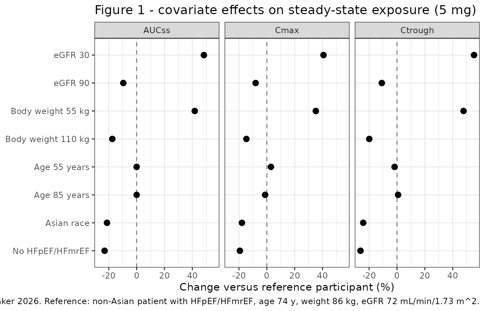
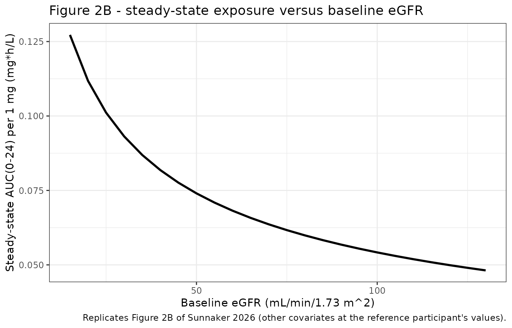
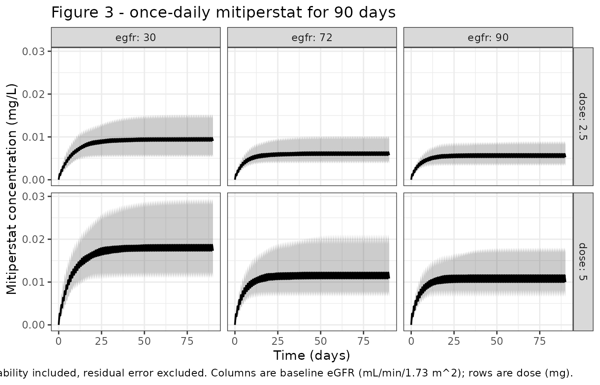

# Mitiperstat (Sunnaker 2026)

## Model and source

- Citation: Sunnaker M, Leander J, Ericsson H. Population
  Pharmacokinetics of the Novel Myeloperoxidase Inhibitor Mitiperstat.
  Pharmacol Res Perspect. 2026;14(3):e70259. <doi:10.1002/prp2.70259>
- Article: <https://doi.org/10.1002/prp2.70259> (open access;
  PMC13154774)

Mitiperstat (AZD4831) is a myeloperoxidase inhibitor in development for
heart failure with preserved or mildly reduced ejection fraction,
metabolic dysfunction-associated steatohepatitis and chronic obstructive
pulmonary disease. Sunnaker 2026 pooled five trials into a single
population PK model: a two-compartment disposition with first-order
absorption and linear elimination. Because no intravenous data were
available, bioavailability could not be estimated and every clearance
and volume is apparent (CL/F, Vc/F, Q/F, Vp/F).

``` r

mod <- readModelDb("Sunnaker_2026_mitiperstat")
mod
#> function() {
#>   description <- "Two-compartment population PK model with first-order absorption and linear elimination for the myeloperoxidase inhibitor mitiperstat (AZD4831) in healthy volunteers, patients with heart failure with preserved or mildly reduced ejection fraction, and patients with severe renal impairment (Sunnaker 2026). Apparent clearance is scaled by baseline BSA-normalized eGFR and baseline body weight (power models) and shifted by Asian race and by heart-failure disease status (linear models); apparent central volume is scaled by age (power model). Bioavailability could not be estimated because no intravenous data were available, so all clearances and volumes are apparent (CL/F, Vc/F, Q/F, Vp/F)."
#>   reference <- "Sunnaker M, Leander J, Ericsson H. Population Pharmacokinetics of the Novel Myeloperoxidase Inhibitor Mitiperstat. Pharmacol Res Perspect. 2026;14(3):e70259. doi:10.1002/prp2.70259"
#>   vignette <- "Sunnaker_2026_mitiperstat"
#>   units <- list(time = "h", dosing = "mg", concentration = "ug/mL")
#> 
#>   # Sunnaker 2026 reports every mitiperstat concentration in nmol/L and every
#>   # dose in mg, but never states the molar mass, so no exact mg <-> nmol
#>   # conversion is available from any on-disk source. The model is linear, so it
#>   # is encoded in self-consistent mass units: a dose in mg gives compartment
#>   # amounts in mg and Cc in mg/L (= ug/mL). Dosing the same model in nmol
#>   # returns Cc directly in nmol/L, which is the scale the paper prints.
#>   compartmentData <- list(
#>     depot = list(analyte = "mitiperstat", units = "mg", specimen = "administration site", verified = TRUE),
#>     central = list(analyte = "mitiperstat", units = "mg", specimen = "plasma", verified = TRUE),
#>     peripheral1 = list(analyte = "mitiperstat", units = "mg", specimen = "plasma", verified = TRUE)
#>   )
#> 
#>   covariateData <- list(
#>     CRCL = list(
#>       description = "Baseline estimated glomerular filtration rate, normalized to a body surface area of 1.73 m^2",
#>       units = "mL/min/1.73 m^2",
#>       type = "continuous",
#>       reference_category = NULL,
#>       notes = "Estimated with the CKD-EPI equation (Sunnaker 2026 Methods, Structural Base Model; Levey 2009 reference 17). Power effect on CL/F centered on 99 mL/min/1.73 m^2, the population median (Table 3 footnote). This was the only covariate carried in the base model, because renal excretion accounts for roughly 32-45 percent of mitiperstat elimination. Cohort means by study (Table 2): SAD 106, MAD 104, JCMAD 112, SATELLITE 69, renal-impairment cohort 23 and its group-matched controls 97. The paper re-estimated the final model with non-BSA-normalized eGFR (correlation 0.95 with the normalized form) and obtained similar parameter estimates.",
#>       source_name = "baseline eGFR"
#>     ),
#>     WT = list(
#>       description = "Baseline body weight",
#>       units = "kg",
#>       type = "continuous",
#>       reference_category = NULL,
#>       notes = "Baseline (time-fixed), not time-varying. Power effect on CL/F centered on 77.95 kg, the population median (Sunnaker 2026 Table 3 footnote). The exponent 0.78 was ESTIMATED, not held at an allometric 0.75; the paper explicitly tried fixed allometric scaling instead and reports that it slightly worsened the fit (Results, Final Model; Table S2). Baseline BMI correlates strongly with body weight (Pearson 0.8) and was therefore excluded from the covariate search; see covariatesDataExcluded.",
#>       source_name = "baseline body weight"
#>     ),
#>     AGE = list(
#>       description = "Age",
#>       units = "years",
#>       type = "continuous",
#>       reference_category = NULL,
#>       notes = "Power effect on Vc/F centered on 41 years, the population median (Sunnaker 2026 Table 3 footnote). Age and eGFR are negatively correlated in this pooled data set (Pearson -0.7), and age was high only in the SATELLITE cohort, which was also the only cohort with heart failure; the paper states the Vc/F-age association should therefore be interpreted with caution (Discussion).",
#>       source_name = "age"
#>     ),
#>     RACE_ASIAN = list(
#>       description = "Asian race indicator",
#>       units = "(binary)",
#>       type = "binary",
#>       reference_category = "0 (non-Asian)",
#>       notes = "Linear fractional increase of CL/F in Asian relative to non-Asian participants; the canonical 1 = Asian orientation matches the paper's coding, so no value flip is needed. Of the 26 Asian participants, 24 came from the JCMAD study (Japanese and Chinese volunteers, defined as having both parents and four grandparents of that ethnicity) and only 2 from the MAD study, so the paper cautions that the race effect cannot be cleanly separated from other between-study differences (Discussion, limitation 2).",
#>       source_name = "race (Asian or non-Asian)"
#>     ),
#>     DIS_HFPEF = list(
#>       description = "Heart failure with preserved or mildly reduced ejection fraction indicator",
#>       units = "(binary)",
#>       type = "binary",
#>       reference_category = "0 (healthy volunteer, or a patient enrolled for renal impairment rather than heart failure)",
#>       notes = "The paper's disease-status covariate, contrasting the 25 SATELLITE patients (symptomatic heart failure, left ventricular ejection fraction at or above 40 percent, elevated B-type natriuretic peptides) against the 103 participants without heart failure. Both the healthy volunteers of the SAD, MAD and JCMAD studies AND the severe-renal-impairment cohort take the value 0, because Table 2 classifies the renal-impairment participants as 'No HFpEF/HFmrEF'. The renal impairment of that cohort enters separately through CRCL, so the two covariates are not redundant.",
#>       source_name = "disease status (healthy volunteers or patients with HFpEF/HFmrEF)"
#>     )
#>   )
#> 
#>   # Screened by the authors but NOT retained in the final model. Documented so
#>   # the provenance of the covariate search survives, without raising a
#>   # declared-but-unreferenced convention warning.
#>   covariatesDataExcluded <- list(
#>     BMI = list(
#>       description = "Baseline body mass index",
#>       units = "kg/m^2",
#>       type = "continuous",
#>       notes = "Excluded from the stepwise covariate search a priori because of its strong correlation with baseline body weight (Pearson 0.8); Sunnaker 2026 Results, Covariate Model. Cohort means by study (Table 2): SAD 24.3, MAD 25.2, JCMAD 23.3, SATELLITE 27.3, renal impairment 29.3."
#>     ),
#>     SEXF = list(
#>       description = "Female sex indicator",
#>       units = "(binary)",
#>       type = "binary",
#>       notes = "Excluded from the stepwise covariate search a priori because only 22 of 128 participants were female and sex was confounded with both body weight and formulation - the only two studies that enrolled women (SATELLITE and renal impairment) were also the only two that used the tablet; Sunnaker 2026 Results, Covariate Model."
#>     ),
#>     FORM_TABLET = list(
#>       description = "Film-coated tablet versus oral suspension formulation indicator",
#>       units = "(binary)",
#>       type = "binary",
#>       notes = "Tested as a covariate on the absorption rate constant and found not significant (Sunnaker 2026 Results, Covariate Model and Discussion limitation 1). The reference oral liquid is the oral suspension used in the SAD, MAD and JCMAD studies; SATELLITE and the renal-impairment study used a film-coated tablet. The paper notes that absorption-phase data for the tablet came only from the renal-impairment study, so the power to detect a formulation effect on ka was low."
#>     )
#>   )
#> 
#>   population <- list(
#>     species = "human",
#>     n_subjects = 128,
#>     n_studies = 5,
#>     n_observations = 2856,
#>     age_range = "18-85 years",
#>     age_median = "not reported; study-level means 33.9-35.5 years in the healthy-volunteer studies, 57.1 years in the renal-impairment study and 75.2 years in SATELLITE (Table 2). The covariate model centers age at a population median of 41 years (Table 3 footnote).",
#>     weight_range = "50-100 kg in the healthy-volunteer studies; at least 50 kg in the renal-impairment study; 54-113 kg observed in SATELLITE",
#>     weight_median = "77.95 kg (the covariate-model centering value, Table 3 footnote)",
#>     sex_female_pct = 17.2,
#>     race_ethnicity = c(Asian = 20.3, `Non-Asian` = 79.7),
#>     disease_state = "Healthy volunteers (83 participants), patients with heart failure with preserved or mildly reduced ejection fraction (25 participants, SATELLITE), and patients with severe renal impairment plus their group-matched normal-renal-function controls (20 participants)",
#>     renal_function = "Baseline eGFR study means 104-112 mL/min/1.73 m^2 in healthy volunteers, 69 mL/min/1.73 m^2 in SATELLITE, 23 mL/min/1.73 m^2 in the severe-renal-impairment cohort (eGFR at least 15 and below 30, not on dialysis) and 97 mL/min/1.73 m^2 in its group-matched controls",
#>     dose_range = "Single oral doses of 2.5-405 mg; once-daily oral doses of 2.5-45 mg for 10-14 days, and 2.5 mg for 10 days uptitrated to 5 mg for a further 80 days in SATELLITE",
#>     formulation = "Oral suspension in the SAD, MAD and JCMAD studies; film-coated tablet in SATELLITE and the renal-impairment study",
#>     regions = "Not reported by region; the JCMAD study enrolled Japanese and Chinese volunteers, the remaining studies enrolled a predominantly non-Asian population",
#>     notes = "Pooled from five trials: SAD NCT02712372, MAD NCT03136991, JCMAD NCT04232345, phase 2a SATELLITE NCT03756285 and the severe-renal-impairment study NCT04949438. Participant counts, demographics and baseline characteristics: Sunnaker 2026 Tables 1 and 2. Placebo recipients were excluded, as were 139 samples below the 2 nmol/L (0.2 nmol/L in the renal-impairment study) limit of quantification, 4.9 percent of the total."
#>   )
#> 
#>   ini({
#>     # Structural parameters - typical values for the reference participant:
#>     # eGFR 99 mL/min/1.73 m^2, body weight 77.95 kg, age 41 years, non-Asian,
#>     # no heart failure. All are apparent (divided by the unestimable
#>     # bioavailability F), because no intravenous data were available
#>     # (Sunnaker 2026 Results, Base Model).
#>     lcl <- log(22.1); label("Apparent clearance (L/h)")                          # Sunnaker 2026 Table 3, final model: CL/F = 22.1 L/h (RSE 3.3)
#>     lvc <- log(742);  label("Apparent central volume of distribution (L)")       # Sunnaker 2026 Table 3, final model: Vc/F = 742 L (RSE 6.4)
#>     lq  <- log(67.1); label("Apparent intercompartmental clearance (L/h)")       # Sunnaker 2026 Table 3, final model: Q/F = 67.1 L/h (RSE 4.8)
#>     lvp <- log(834);  label("Apparent peripheral volume of distribution (L)")    # Sunnaker 2026 Table 3, final model: Vp/F = 834 L (RSE 3.6)
#>     lka <- log(1.94); label("First-order absorption rate constant (1/h)")        # Sunnaker 2026 Table 3, final model: Ka = 1.94 1/h (RSE 10)
#> 
#>     # Covariate effects. The two functional forms are given in Sunnaker 2026
#>     # Methods, Covariate Model:
#>     #   continuous  theta_x,i = theta_x * (C_i / C_median)^beta_x
#>     #   categorical theta_x,i = theta_x * (1 + theta_xcov * COV_i)
#>     # Centering values are in the Table 3 footnote.
#>     e_crcl_cl       <-  0.45; label("Power exponent on baseline eGFR relative to its population median for apparent clearance (unitless)")                                                                  # Sunnaker 2026 Table 3, final model: effect of eGFR on CL/F = 0.45 (RSE 12); median 99 mL/min/1.73 m^2
#>     e_wt_cl         <-  0.78; label("Power exponent on baseline body weight relative to its population median for apparent clearance (unitless)")                                                           # Sunnaker 2026 Table 3, final model: effect of baseline body weight on CL/F = 0.78 (RSE 19); median 77.95 kg
#>     e_age_vc        <-  0.54; label("Power exponent on age relative to its population median for apparent central volume of distribution (unitless)")                                                       # Sunnaker 2026 Table 3, final model: effect of age on Vc/F = 0.54 (RSE 29); median 41 years
#>     e_race_asian_cl <-  0.27; label("Fractional change in apparent clearance for Asian relative to non-Asian participants (unitless)")                                                                      # Sunnaker 2026 Table 3, final model: effect of race on CL/F = 0.27 (RSE 31)
#>     e_hfpef_cl      <- -0.23; label("Fractional change in apparent clearance for patients with heart failure with preserved or mildly reduced ejection fraction relative to healthy volunteers (unitless)")  # Sunnaker 2026 Table 3, final model: effect of disease status on CL/F = -0.23 (RSE 19)
#> 
#>     # Interindividual variability. Sunnaker 2026 Methods, Structural Base Model,
#>     # defines theta_i = theta * exp(eta_i) with eta_i ~ N(0, omega^2), and the
#>     # Table 3 note states that the tabulated IIV CV percentages were computed as
#>     # the square root of the variance, so omega = CV/100 and omega^2 = (CV/100)^2.
#>     # No interindividual variability was estimated for Q/F.
#>     etalcl ~ 0.0484  # Sunnaker 2026 Table 3, final model: IIV CV for CL/F = 22% (RSE 8.0); 0.22^2
#>     etalvc ~ 0.25    # Sunnaker 2026 Table 3, final model: IIV CV for Vc/F = 50% (RSE 8.6); 0.50^2
#>     etalvp ~ 0.0441  # Sunnaker 2026 Table 3, final model: IIV CV for Vp/F = 21% (RSE 13); 0.21^2
#>     etalka ~ 0.8836  # Sunnaker 2026 Table 3, final model: IIV CV for Ka = 94% (RSE 9.1); 0.94^2
#> 
#>     # Residual error. Sunnaker 2026 Methods, Structural Base Model:
#>     # log(y_ij) = log(yhat_ij) + e with e ~ N(0, sigma^2), i.e. an additive
#>     # error on the log scale, which is a log-normal residual error on the
#>     # linear scale.
#>     expSd <- 0.22; label("Log-scale additive residual error (unitless)")  # Sunnaker 2026 Table 3, final model: residual error sigma in log-space = 0.22 (RSE 0.5)
#>   })
#> 
#>   model({
#>     # Sunnaker 2026 Table 3 footnote and Methods, Covariate Model:
#>     #   CL/F = 22.1 * (eGFR/99)^0.45 * (WT/77.95)^0.78
#>     #               * (1 + 0.27 * Asian) * (1 - 0.23 * HFpEF)
#>     #   Vc/F = 742  * (AGE/41)^0.54
#>     #   Q/F  = 67.1                      (no covariates, no IIV)
#>     #   Vp/F = 834                       (no covariates)
#>     crcl_cl <- (CRCL / 99)^e_crcl_cl
#>     wt_cl   <- (WT / 77.95)^e_wt_cl
#>     race_cl <- 1 + e_race_asian_cl * RACE_ASIAN
#>     dis_cl  <- 1 + e_hfpef_cl * DIS_HFPEF
#>     age_vc  <- (AGE / 41)^e_age_vc
#> 
#>     ka <- exp(lka + etalka)
#>     cl <- exp(lcl + etalcl) * crcl_cl * wt_cl * race_cl * dis_cl
#>     vc <- exp(lvc + etalvc) * age_vc
#>     q  <- exp(lq)
#>     vp <- exp(lvp + etalvp)
#> 
#>     kel <- cl / vc
#>     k12 <- q / vc
#>     k21 <- q / vp
#> 
#>     d/dt(depot)       <- -ka * depot
#>     d/dt(central)     <-  ka * depot - kel * central - k12 * central + k21 * peripheral1
#>     d/dt(peripheral1) <-  k12 * central - k21 * peripheral1
#> 
#>     Cc <- central / vc
#>     Cc ~ lnorm(expSd)
#>   })
#> }
#> <environment: 0x559be6217048>
```

## Population

The analysis pooled 2856 plasma samples from 128 mitiperstat-treated
participants across five studies (Sunnaker 2026 Tables 1 and 2):

- **SAD** (NCT02712372, n = 30) – healthy men, single oral doses of
  5-405 mg.
- **MAD** (NCT03136991, n = 29) – healthy men, 5-45 mg once daily for
  10-14 days.
- **JCMAD** (NCT04232345, n = 24) – healthy Japanese and Chinese men,
  2.5-10 mg once daily for 10 days.
- **SATELLITE** (NCT03756285, n = 25) – phase 2a patients with
  symptomatic heart failure and left ventricular ejection fraction at or
  above 40 percent, 2.5 mg once daily for 10 days then 5 mg for a
  further 80 days.
- **Renal impairment** (NCT04949438, n = 20) – 10 patients with severe
  renal impairment (eGFR at least 15 and below 30 mL/min/1.73 m^2, not
  on dialysis) plus 10 group-matched controls, single 2.5 mg dose.

The three phase 1 studies enrolled men only; SATELLITE and the
renal-impairment study enrolled both sexes, so 22 of 128 participants
(17 percent) were female. Twenty-six participants were Asian, 24 of them
from JCMAD. The SATELLITE cohort was much older (mean 75.2 years) and
had lower renal function (mean eGFR 69 mL/min/1.73 m^2) than the
healthy-volunteer studies (means 33.9-35.5 years and 104-112 mL/min/1.73
m^2).

The same information is available programmatically via
`readModelDb("Sunnaker_2026_mitiperstat")()$population`.

## Source trace

Every value below is also carried as an in-file comment beside its
`ini()` entry in
`inst/modeldb/specificDrugs/Sunnaker_2026_mitiperstat.R`.

| Equation / parameter | Value | Source location |
|----|----|----|
| `lcl` (CL/F) | 22.1 L/h (RSE 3.3) | Table 3, final model |
| `lvc` (Vc/F) | 742 L (RSE 6.4) | Table 3, final model |
| `lq` (Q/F) | 67.1 L/h (RSE 4.8) | Table 3, final model |
| `lvp` (Vp/F) | 834 L (RSE 3.6) | Table 3, final model |
| `lka` (Ka) | 1.94 1/h (RSE 10) | Table 3, final model |
| `e_crcl_cl` | 0.45 (RSE 12) | Table 3, “Effect of eGFR on CL/F (power model)” |
| `e_wt_cl` | 0.78 (RSE 19) | Table 3, “Effect of baseline body weight on CL/F (power model)” |
| `e_age_vc` | 0.54 (RSE 29) | Table 3, “Effect of age on Vc/F (power model)” |
| `e_race_asian_cl` | 0.27 (RSE 31) | Table 3, “Effect of race (Asian vs. non-Asian) on CL/F (linear model)” |
| `e_hfpef_cl` | -0.23 (RSE 19) | Table 3, “Effect of disease status (HFpEF/HFmrEF vs. HVs) on CL/F (linear model)” |
| eGFR / weight / age centering | 99 mL/min/1.73 m^2, 77.95 kg, 41 years | Table 3 footnote |
| Reference categories | non-Asian, healthy volunteer | Table 3 footnote |
| Continuous covariate form | `theta * (C_i / C_median)^beta` | Methods 2.4.3, first displayed equation |
| Categorical covariate form | `theta * (1 + theta_cov * COV_i)` | Methods 2.4.3, second displayed equation |
| IIV form | `theta_i = theta * exp(eta_i)`, `eta_i ~ N(0, omega^2)` | Methods 2.4.1 |
| `etalcl`, `etalvc`, `etalvp`, `etalka` | CV 22, 50, 21, 94 percent | Table 3 final model; the Table 3 note states CV was computed as the square root of the variance, so `omega = CV/100` |
| No IIV on Q/F | – | Methods 2.4.1, “Interindividual variability was included for all structural parameters except for apparent inter-compartmental clearance Q/F” |
| `expSd` | 0.22 (RSE 0.5) | Table 3, “Residual error sigma (log-space)” |
| Residual error form | `log(y) = log(yhat) + e`, `e ~ N(0, sigma^2)` | Methods 2.4.1, third displayed equation |
| Two-compartment structure, first-order absorption, linear elimination | – | Results 3.3.1 and 3.3.3 |

### A note on concentration units

Sunnaker 2026 reports every mitiperstat concentration in **nmol/L** and
every dose in **mg**, but never states the molar mass, and no supplement
on disk supplies it. The packaged model is therefore encoded in
self-consistent **mass** units: dosing in mg gives compartment amounts
in mg and `Cc` in mg/L (= ug/mL). Because the model is entirely linear,
dosing it in nmol instead returns `Cc` directly in nmol/L.

Every structural check below is expressed in mass units or as a
unit-free ratio. Only the Table 4 comparison needs the molar scale, and
there a single conversion factor is calibrated from the paper’s own AUC
row and then applied out-of-sample to Cmax and Ctrough – see that
section.

## Reference participant

The paper’s simulations and its Figure 1 forest plot are referenced to a
typical SATELLITE participant: non-Asian, with HFpEF/HFmrEF, aged 74
years, baseline body weight 86 kg, baseline eGFR 72 mL/min/1.73 m^2
(Figure 1 legend and Table 4 note).

``` r

ref_cov <- list(CRCL = 72, WT = 86, AGE = 74, RACE_ASIAN = 0, DIS_HFPEF = 1)

# Population-median covariates: the point at which all covariate multipliers
# equal 1, so CL/F = 22.1 L/h and Vc/F = 742 L exactly (Table 3 footnote).
pop_median_cov <- list(CRCL = 99, WT = 77.95, AGE = 41, RACE_ASIAN = 0, DIS_HFPEF = 0)

# The published covariate equations, re-implemented here INDEPENDENTLY of the
# model file so that the checks below can actually go red if the model file's
# model({}) block disagrees with Sunnaker 2026.
cl_published <- function(cov) {
  22.1 * (cov$CRCL / 99)^0.45 * (cov$WT / 77.95)^0.78 *
    (1 + 0.27 * cov$RACE_ASIAN) * (1 - 0.23 * cov$DIS_HFPEF)
}
vc_published <- function(cov) 742 * (cov$AGE / 41)^0.54

knitr::kable(
  tibble::tibble(
    Participant = c("Population median", "Typical SATELLITE (reference)"),
    `CL/F (L/h)` = c(cl_published(pop_median_cov), cl_published(ref_cov)),
    `Vc/F (L)`   = c(vc_published(pop_median_cov), vc_published(ref_cov))
  ),
  digits = 1,
  caption = "Typical-value apparent clearance and central volume from the published covariate equations."
)
```

| Participant                   | CL/F (L/h) | Vc/F (L) |
|:------------------------------|-----------:|---------:|
| Population median             |       22.1 |    742.0 |
| Typical SATELLITE (reference) |       15.9 |   1020.7 |

Typical-value apparent clearance and central volume from the published
covariate equations. {.table}

## Steady-state simulation helper

All deterministic checks use
[`rxode2::zeroRe()`](https://nlmixr2.github.io/rxode2/reference/zeroRe.html)
so they reproduce typical-value predictions rather than a cohort median.

``` r

mod_typ <- rxode2::zeroRe(mod)
#> ℹ parameter labels from comments will be replaced by 'label()'

TAU   <- 24     # dosing interval (h)
NDOSE <- 100    # once daily for 100 days, as in Sunnaker 2026 Table 4 note
T_LAST <- TAU * (NDOSE - 1)

# Observation grid over the final dosing interval. Dense through the absorption
# and distribution phases so the trapezoidal AUC resolves Tmax (~1.6 h);
# see pattern 11 of the skill's known-vignette-failure-patterns reference.
ss_grid <- T_LAST + c(seq(0, 6, by = 0.05), seq(6.25, TAU, by = 0.25))

ss_events <- function(dose, cov, n = 1L, id_offset = 0L) {
  ev <- rxode2::et(amt = dose, ii = TAU, until = T_LAST, cmt = "depot") |>
    # Observation rows point at the ODE STATE `central`, never at the algebraic
    # observable `Cc`; rxode2 returns Cc as a column regardless.
    rxode2::et(ss_grid, cmt = "central") |>
    rxode2::et(id = seq_len(n)) |>
    as.data.frame()
  ev$id <- ev$id + id_offset
  for (nm in names(cov)) ev[[nm]] <- cov[[nm]]
  ev
}

# Steady-state exposure metrics over the final dosing interval.
# rxSolve omits the `id` column when it solves a single subject, so restore it.
ss_metrics <- function(sim) {
  if (!"id" %in% names(sim)) sim$id <- 1L
  sim |>
    dplyr::filter(!is.na(Cc), time >= T_LAST) |>
    dplyr::group_by(id) |>
    dplyr::arrange(time, .by_group = TRUE) |>
    dplyr::summarise(
      cmax    = max(Cc),
      tmax    = time[which.max(Cc)] - T_LAST,
      ctrough = dplyr::last(Cc),
      auc     = sum(diff(time) * (head(Cc, -1) + tail(Cc, -1)) / 2),
      .groups = "drop"
    ) |>
    dplyr::mutate(cav = auc / TAU)
}

ss_typical <- function(dose, cov) {
  ss_metrics(rxode2::rxSolve(mod_typ, events = ss_events(dose, cov),
                             returnType = "data.frame"))
}
```

## Check 1 – steady-state mass balance against `AUCss = Dose / (CL/F)`

At steady state the amount entering over one interval equals the amount
cleared, so `AUC(0-tau) * CL/F = Dose * F`. Sunnaker 2026 states this
identity explicitly in Results 3.4.2 (“exposure at steady state is
inversely proportional to CL/F (AUCss = Dose/(CL/F))”). Because
`cl_published()` is written out from the paper’s own equations rather
than read back from the solve, a mistranscribed exponent, centering
value or reference category in the model file makes this check fail.

``` r

mb_scen <- tibble::tribble(
  ~scenario,                  ~CRCL, ~WT,   ~AGE, ~RACE_ASIAN, ~DIS_HFPEF, ~dose,
  "Population median, 5 mg",     99, 77.95,   41,           0,          0,      5,
  "Typical SATELLITE, 5 mg",     72, 86.00,   74,           0,          1,      5,
  "Severe renal impairment",     23, 84.80,   57,           0,          0,    2.5,
  "Asian healthy volunteer",    112, 69.90,   35,           1,          0,     10,
  "Low weight, low eGFR",        30, 55.00,   85,           0,          1,      5
)

mb <- mb_scen |>
  dplyr::rowwise() |>
  dplyr::mutate(
    cl_pub  = cl_published(list(CRCL = CRCL, WT = WT, RACE_ASIAN = RACE_ASIAN,
                                DIS_HFPEF = DIS_HFPEF)),
    auc_sim = ss_typical(dose, list(CRCL = CRCL, WT = WT, AGE = AGE,
                                    RACE_ASIAN = RACE_ASIAN,
                                    DIS_HFPEF = DIS_HFPEF))$auc
  ) |>
  dplyr::ungroup() |>
  dplyr::mutate(
    dose_recovered = auc_sim * cl_pub,
    pct_diff       = 100 * (dose_recovered / dose - 1)
  )
#> ℹ omega/sigma items treated as zero: 'etalcl', 'etalvc', 'etalvp', 'etalka'
#> ℹ omega/sigma items treated as zero: 'etalcl', 'etalvc', 'etalvp', 'etalka'
#> ℹ omega/sigma items treated as zero: 'etalcl', 'etalvc', 'etalvp', 'etalka'
#> ℹ omega/sigma items treated as zero: 'etalcl', 'etalvc', 'etalvp', 'etalka'
#> ℹ omega/sigma items treated as zero: 'etalcl', 'etalvc', 'etalvp', 'etalka'

# Deterministic identity checked against an independently coded clearance:
# the residual is pure trapezoidal-integration error, so the bound is tight.
stopifnot(all(abs(mb$pct_diff) < 0.5))

mb |>
  dplyr::select(scenario, dose, cl_pub, auc_sim, dose_recovered, pct_diff) |>
  dplyr::rename(
    "Scenario"                     = scenario,
    "Dose (mg)"                    = dose,
    "CL/F from published eqn (L/h)" = cl_pub,
    "Simulated AUC(0-24) (mg*h/L)" = auc_sim,
    "AUC x CL/F (mg)"              = dose_recovered,
    "Difference (%)"               = pct_diff
  ) |>
  knitr::kable(digits = c(0, 1, 2, 4, 3, 3),
               caption = "Steady-state mass balance. AUC(0-24) x CL/F recovers the administered dose.")
```

| Scenario | Dose (mg) | CL/F from published eqn (L/h) | Simulated AUC(0-24) (mg\*h/L) | AUC x CL/F (mg) | Difference (%) |
|:---|---:|---:|---:|---:|---:|
| Population median, 5 mg | 5.0 | 22.10 | 0.2262 | 5.000 | -0.001 |
| Typical SATELLITE, 5 mg | 5.0 | 15.92 | 0.3141 | 5.000 | 0.000 |
| Severe renal impairment | 2.5 | 12.24 | 0.2043 | 2.500 | 0.000 |
| Asian healthy volunteer | 10.0 | 27.25 | 0.3670 | 10.000 | -0.001 |
| Low weight, low eGFR | 5.0 | 7.58 | 0.6599 | 4.999 | -0.010 |

Steady-state mass balance. AUC(0-24) x CL/F recovers the administered
dose. {.table}

## Check 2 – terminal half-life and accumulation

Sunnaker 2026 reports a mean terminal half-life of approximately 60 h in
the MAD study and roughly threefold accumulation with steady state
reached around day 10 (Introduction and Discussion).

``` r

ev_single <- rxode2::et(amt = 5, cmt = "depot") |>
  rxode2::et(seq(0, 840, by = 0.5), cmt = "central") |>
  as.data.frame()
for (nm in names(pop_median_cov)) ev_single[[nm]] <- pop_median_cov[[nm]]

sim_single <- rxode2::rxSolve(mod_typ, events = ev_single, returnType = "data.frame")
#> ℹ omega/sigma items treated as zero: 'etalcl', 'etalvc', 'etalvp', 'etalka'

# Fit the terminal slope well after the distribution phase has resolved
# (pattern 11: a slope taken too early reads the distribution phase).
term <- dplyr::filter(sim_single, time >= 400, time <= 800, Cc > 0)
lambda_z <- -stats::coef(stats::lm(log(Cc) ~ time, data = term))[["time"]]
t_half <- log(2) / lambda_z

# Accumulation: AUC(0-24) at steady state divided by AUC(0-24) after dose 1.
auc_d1 <- sim_single |>
  dplyr::filter(time <= TAU) |>
  dplyr::summarise(a = sum(diff(time) * (head(Cc, -1) + tail(Cc, -1)) / 2)) |>
  dplyr::pull(a)
auc_ss <- ss_typical(5, pop_median_cov)$auc
#> ℹ omega/sigma items treated as zero: 'etalcl', 'etalvc', 'etalvp', 'etalka'
accum  <- auc_ss / auc_d1

tibble::tibble(
  Quantity = c("Terminal half-life (h)", "AUC accumulation ratio (steady state / day 1)"),
  Simulated = c(t_half, accum),
  `Reported by Sunnaker 2026` = c("~60 h (MAD study)", "~3-fold")
) |>
  knitr::kable(digits = 2,
               caption = "Terminal half-life and accumulation at population-median covariates.")
```

| Quantity | Simulated | Reported by Sunnaker 2026 |
|:---|---:|:---|
| Terminal half-life (h) | 54.36 | ~60 h (MAD study) |
| AUC accumulation ratio (steady state / day 1) | 3.04 | ~3-fold |

Terminal half-life and accumulation at population-median covariates.
{.table}

``` r


# Deterministic quantities. The reported 60 h is an observed NCA half-life from
# the MAD cohort, so the window is generous; it still goes red for a
# mistranscribed Q/F or Vp/F (which drive the terminal phase).
stopifnot(t_half > 40, t_half < 75)
stopifnot(accum > 2.5, accum < 6)
```

## Check 3 – Figure 1 forest plot of covariate effects

Figure 1 reports percent changes in AUCss, Cmax and Ctrough after a 5 mg
dose relative to the reference SATELLITE participant. The narrative
gives two of these contrasts numerically (Results 3.4.1):

- eGFR 30 versus 72 mL/min/1.73 m^2: AUCss +49%, Cmax +44%, Ctrough
  +55%.
- Body weight 55 versus 86 kg: AUCss +44%, Cmax +35%, Ctrough +50%.

The covariate values used (body weight 55 and 110 kg, age 55 and 85
years, eGFR 30 and 90 mL/min/1.73 m^2) cover the ranges observed in
SATELLITE.

``` r

forest_scen <- tibble::tribble(
  ~label,                  ~field,        ~value,
  "eGFR 30",               "CRCL",            30,
  "eGFR 90",               "CRCL",            90,
  "Body weight 55 kg",     "WT",              55,
  "Body weight 110 kg",    "WT",             110,
  "Age 55 years",          "AGE",             55,
  "Age 85 years",          "AGE",             85,
  "Asian race",            "RACE_ASIAN",       1,
  "No HFpEF/HFmrEF",       "DIS_HFPEF",        0
)

base_ss <- ss_typical(5, ref_cov)
#> ℹ omega/sigma items treated as zero: 'etalcl', 'etalvc', 'etalvp', 'etalka'

forest <- forest_scen |>
  dplyr::rowwise() |>
  dplyr::mutate(
    m = list(ss_typical(5, utils::modifyList(ref_cov, stats::setNames(list(value), field))))
  ) |>
  dplyr::mutate(
    AUCss   = 100 * (m$auc / base_ss$auc - 1),
    Cmax    = 100 * (m$cmax / base_ss$cmax - 1),
    Ctrough = 100 * (m$ctrough / base_ss$ctrough - 1)
  ) |>
  dplyr::ungroup() |>
  dplyr::select(label, AUCss, Cmax, Ctrough)
#> ℹ omega/sigma items treated as zero: 'etalcl', 'etalvc', 'etalvp', 'etalka'
#> ℹ omega/sigma items treated as zero: 'etalcl', 'etalvc', 'etalvp', 'etalka'
#> ℹ omega/sigma items treated as zero: 'etalcl', 'etalvc', 'etalvp', 'etalka'
#> ℹ omega/sigma items treated as zero: 'etalcl', 'etalvc', 'etalvp', 'etalka'
#> ℹ omega/sigma items treated as zero: 'etalcl', 'etalvc', 'etalvp', 'etalka'
#> ℹ omega/sigma items treated as zero: 'etalcl', 'etalvc', 'etalvp', 'etalka'
#> ℹ omega/sigma items treated as zero: 'etalcl', 'etalvc', 'etalvp', 'etalka'
#> ℹ omega/sigma items treated as zero: 'etalcl', 'etalvc', 'etalvp', 'etalka'

forest |>
  tidyr::pivot_longer(-label, names_to = "metric", values_to = "pct") |>
  dplyr::mutate(label = factor(label, levels = rev(forest_scen$label))) |>
  ggplot(aes(pct, label)) +
  geom_vline(xintercept = 0, linetype = "dashed", colour = "grey50") +
  geom_point(size = 2.5) +
  facet_wrap(~metric) +
  labs(x = "Change versus reference participant (%)", y = NULL,
       title = "Figure 1 - covariate effects on steady-state exposure (5 mg)",
       caption = paste("Replicates Figure 1 of Sunnaker 2026. Reference: non-Asian patient with",
                       "HFpEF/HFmrEF, age 74 y, weight 86 kg, eGFR 72 mL/min/1.73 m^2.")) +
  theme_bw()
```



``` r

published_forest <- tibble::tribble(
  ~label,               ~metric,    ~published,
  "eGFR 30",            "AUCss",           49,
  "eGFR 30",            "Cmax",            44,
  "eGFR 30",            "Ctrough",         55,
  "Body weight 55 kg",  "AUCss",           44,
  "Body weight 55 kg",  "Cmax",            35,
  "Body weight 55 kg",  "Ctrough",         50
)

forest_cmp <- forest |>
  tidyr::pivot_longer(-label, names_to = "metric", values_to = "simulated") |>
  dplyr::inner_join(published_forest, by = c("label", "metric")) |>
  dplyr::mutate(difference = simulated - published)

# Guard against a silently empty join (pattern 10): every published row must
# have found a simulated partner.
stopifnot(nrow(forest_cmp) == nrow(published_forest))

# Deterministic typical-value contrasts against numbers the paper prints in its
# own text. Largest observed gap is ~3.3 percentage points, on Cmax, where the
# paper's medians come from 200 bootstrap parameter sets simulated WITH
# interindividual variability rather than from a typical-value profile. The
# 6-point bound sits outside that and still goes red for a mistranscribed
# exponent: swapping e_crcl_cl from 0.45 to 0.54 moves the eGFR-30 AUCss
# contrast from +48% to +59%, an 11-point miss.
stopifnot(all(abs(forest_cmp$difference) < 6))

forest_cmp |>
  dplyr::rename(
    "Covariate value"     = label,
    "Exposure metric"     = metric,
    "Simulated (%)"       = simulated,
    "Sunnaker 2026 (%)"   = published,
    "Difference (points)" = difference
  ) |>
  knitr::kable(digits = 1,
               caption = "Figure 1 contrasts reported numerically in Sunnaker 2026 Results 3.4.1.")
```

| Covariate value | Exposure metric | Simulated (%) | Sunnaker 2026 (%) | Difference (points) |
|:---|:---|---:|---:|---:|
| eGFR 30 | AUCss | 48.3 | 49 | -0.7 |
| eGFR 30 | Cmax | 40.7 | 44 | -3.3 |
| eGFR 30 | Ctrough | 55.3 | 55 | 0.3 |
| Body weight 55 kg | AUCss | 41.7 | 44 | -2.3 |
| Body weight 55 kg | Cmax | 35.2 | 35 | 0.2 |
| Body weight 55 kg | Ctrough | 47.8 | 50 | -2.2 |

Figure 1 contrasts reported numerically in Sunnaker 2026 Results 3.4.1.
{.table style="width:100%;"}

## Check 4 – Figure 2B, exposure versus renal function

Figure 2B plots steady-state AUC per 1 mg dose against baseline eGFR,
with exposure rising as eGFR declines.

``` r

egfr_grid <- seq(15, 130, by = 5)
auc_by_egfr <- vapply(
  egfr_grid,
  function(g) ss_typical(1, utils::modifyList(ref_cov, list(CRCL = g)))$auc,
  numeric(1)
)
#> ℹ omega/sigma items treated as zero: 'etalcl', 'etalvc', 'etalvp', 'etalka'
#> ℹ omega/sigma items treated as zero: 'etalcl', 'etalvc', 'etalvp', 'etalka'
#> ℹ omega/sigma items treated as zero: 'etalcl', 'etalvc', 'etalvp', 'etalka'
#> ℹ omega/sigma items treated as zero: 'etalcl', 'etalvc', 'etalvp', 'etalka'
#> ℹ omega/sigma items treated as zero: 'etalcl', 'etalvc', 'etalvp', 'etalka'
#> ℹ omega/sigma items treated as zero: 'etalcl', 'etalvc', 'etalvp', 'etalka'
#> ℹ omega/sigma items treated as zero: 'etalcl', 'etalvc', 'etalvp', 'etalka'
#> ℹ omega/sigma items treated as zero: 'etalcl', 'etalvc', 'etalvp', 'etalka'
#> ℹ omega/sigma items treated as zero: 'etalcl', 'etalvc', 'etalvp', 'etalka'
#> ℹ omega/sigma items treated as zero: 'etalcl', 'etalvc', 'etalvp', 'etalka'
#> ℹ omega/sigma items treated as zero: 'etalcl', 'etalvc', 'etalvp', 'etalka'
#> ℹ omega/sigma items treated as zero: 'etalcl', 'etalvc', 'etalvp', 'etalka'
#> ℹ omega/sigma items treated as zero: 'etalcl', 'etalvc', 'etalvp', 'etalka'
#> ℹ omega/sigma items treated as zero: 'etalcl', 'etalvc', 'etalvp', 'etalka'
#> ℹ omega/sigma items treated as zero: 'etalcl', 'etalvc', 'etalvp', 'etalka'
#> ℹ omega/sigma items treated as zero: 'etalcl', 'etalvc', 'etalvp', 'etalka'
#> ℹ omega/sigma items treated as zero: 'etalcl', 'etalvc', 'etalvp', 'etalka'
#> ℹ omega/sigma items treated as zero: 'etalcl', 'etalvc', 'etalvp', 'etalka'
#> ℹ omega/sigma items treated as zero: 'etalcl', 'etalvc', 'etalvp', 'etalka'
#> ℹ omega/sigma items treated as zero: 'etalcl', 'etalvc', 'etalvp', 'etalka'
#> ℹ omega/sigma items treated as zero: 'etalcl', 'etalvc', 'etalvp', 'etalka'
#> ℹ omega/sigma items treated as zero: 'etalcl', 'etalvc', 'etalvp', 'etalka'
#> ℹ omega/sigma items treated as zero: 'etalcl', 'etalvc', 'etalvp', 'etalka'
#> ℹ omega/sigma items treated as zero: 'etalcl', 'etalvc', 'etalvp', 'etalka'

tibble::tibble(eGFR = egfr_grid, auc = auc_by_egfr) |>
  ggplot(aes(eGFR, auc)) +
  geom_line(linewidth = 1) +
  labs(x = "Baseline eGFR (mL/min/1.73 m^2)",
       y = "Steady-state AUC(0-24) per 1 mg (mg*h/L)",
       title = "Figure 2B - steady-state exposure versus baseline eGFR",
       caption = "Replicates Figure 2B of Sunnaker 2026 (other covariates at the reference participant's values).") +
  theme_bw()
```



``` r


# The relationship must be monotonically decreasing in eGFR: this is the
# paper's central clinical finding (Results 3.4.2).
stopifnot(all(diff(auc_by_egfr) < 0))
```

## Check 5 – Figure 3, once-daily 2.5 and 5 mg at three levels of renal function

Figure 3 simulates the ENDEAVOR doses for 90 days with interindividual
variability and without residual error, at eGFR 30, 72 and 90
mL/min/1.73 m^2, with the remaining covariates at the SATELLITE typical
values.

``` r

# set.seed() seeds R's RNG; rxSetSeed() seeds rxode2's, per solver thread.
# Neither makes the drawn cohort identical across machines with different
# thread counts, so nothing downstream asserts on an individual subject.
N_ARM  <- 150   # per arm; the skill caps cohorts at 200 per arm
SIM_D  <- 90

arms <- tidyr::expand_grid(dose = c(2.5, 5), egfr = c(30, 72, 90)) |>
  dplyr::mutate(arm = sprintf("%.1f mg, eGFR %d", dose, egfr),
                id_offset = (dplyr::row_number() - 1L) * N_ARM)

fig3_events <- do.call(dplyr::bind_rows, lapply(seq_len(nrow(arms)), function(i) {
  a <- arms[i, ]
  ev <- rxode2::et(amt = a$dose, ii = TAU, until = TAU * (SIM_D - 1), cmt = "depot") |>
    rxode2::et(seq(0, TAU * SIM_D, by = 12), cmt = "central") |>
    rxode2::et(id = seq_len(N_ARM)) |>
    as.data.frame()
  ev$id <- ev$id + a$id_offset
  ev$CRCL <- a$egfr; ev$WT <- ref_cov$WT; ev$AGE <- ref_cov$AGE
  ev$RACE_ASIAN <- ref_cov$RACE_ASIAN; ev$DIS_HFPEF <- ref_cov$DIS_HFPEF
  ev$arm <- a$arm; ev$dose <- a$dose; ev$egfr <- a$egfr
  ev
}))

# Disjoint IDs across arms: duplicated IDs silently merge into one subject.
stopifnot(!anyDuplicated(unique(fig3_events[, c("id", "time", "evid")])))

rxode2::rxSetSeed(20260913)
fig3_sim <- rxode2::rxSolve(mod, events = fig3_events,
                            keep = c("arm", "dose", "egfr"),
                            returnType = "data.frame")
#> ℹ parameter labels from comments will be replaced by 'label()'

fig3_sim |>
  dplyr::filter(!is.na(Cc)) |>
  dplyr::group_by(arm, dose, egfr, time) |>
  dplyr::summarise(lo = quantile(Cc, 0.025), md = median(Cc),
                   hi = quantile(Cc, 0.975), .groups = "drop") |>
  ggplot(aes(time / 24, md)) +
  geom_ribbon(aes(ymin = lo, ymax = hi), alpha = 0.25) +
  geom_line(linewidth = 0.7) +
  facet_grid(dose ~ egfr, labeller = label_both) +
  labs(x = "Time (days)", y = "Mitiperstat concentration (mg/L)",
       title = "Figure 3 - once-daily mitiperstat for 90 days",
       caption = paste("Replicates Figure 3 of Sunnaker 2026. Median and 95% prediction interval,",
                       "interindividual variability included, residual error excluded.",
                       "Columns are baseline eGFR (mL/min/1.73 m^2); rows are dose (mg).")) +
  theme_bw()
```



Sunnaker 2026 states that a patient with an eGFR of 30 has approximately
50% higher exposure than one with an eGFR of 72, and that decreased
renal function also lengthens the time to steady state.

``` r

day90 <- fig3_sim |>
  dplyr::filter(!is.na(Cc), time == TAU * SIM_D) |>
  dplyr::group_by(dose, egfr) |>
  dplyr::summarise(md = median(Cc), .groups = "drop")

# Confirm the cohort actually produced all six arms before anything is read
# off it (pattern 10: a gate with no rows cannot go red).
stopifnot(nrow(day90) == 6, all(day90$md > 0))

# The eGFR and dose contrasts are gated on TYPICAL-VALUE solves rather than on
# the cohort. Each arm above draws its own etas, so an arm-to-arm ratio of
# cohort medians carries sampling noise that no seed removes across machines
# with different solver-thread counts; a paired typical-value contrast isolates
# the covariate effect exactly.
trough_typ <- function(dose, egfr) {
  ss_typical(dose, utils::modifyList(ref_cov, list(CRCL = egfr)))$ctrough
}
egfr_effect <- 100 * (trough_typ(5, 30) / trough_typ(5, 72) - 1)
#> ℹ omega/sigma items treated as zero: 'etalcl', 'etalvc', 'etalvp', 'etalka'
#> ℹ omega/sigma items treated as zero: 'etalcl', 'etalvc', 'etalvp', 'etalka'
dose_ratio  <- trough_typ(5, 72) / trough_typ(2.5, 72)
#> ℹ omega/sigma items treated as zero: 'etalcl', 'etalvc', 'etalvp', 'etalka'
#> ℹ omega/sigma items treated as zero: 'etalcl', 'etalvc', 'etalvp', 'etalka'

# Sunnaker 2026 Results 3.4.3: "approximately 50% higher exposure".
stopifnot(egfr_effect > 35, egfr_effect < 75)
# Structural linearity of the packaged model: doubling the dose must double
# every concentration exactly. Goes red if a saturable term is ever introduced.
stopifnot(abs(dose_ratio - 2) < 1e-6)

# The cohort medians should land near the typical-value contrast; this is a
# loose consistency check, not a precision gate.
cohort_effect <- 100 * (
  day90$md[day90$egfr == 30] / day90$md[day90$egfr == 72] - 1
)
stopifnot(all(cohort_effect > 25), all(cohort_effect < 85))

tibble::tibble(
  Quantity = c("Day-90 trough increase, eGFR 30 vs 72 (typical value)",
               "Day-90 trough increase, eGFR 30 vs 72 (cohort median, 2.5 mg)",
               "Day-90 trough increase, eGFR 30 vs 72 (cohort median, 5 mg)",
               "Day-90 trough ratio, 5 mg vs 2.5 mg (typical value)"),
  Simulated = c(egfr_effect, cohort_effect, dose_ratio),
  `Sunnaker 2026` = c("~50% higher", "~50% higher", "~50% higher",
                      "dose-proportional (2.0)")
) |>
  knitr::kable(digits = 2, caption = "Figure 3 contrasts.")
```

| Quantity | Simulated | Sunnaker 2026 |
|:---|---:|:---|
| Day-90 trough increase, eGFR 30 vs 72 (typical value) | 55.31 | ~50% higher |
| Day-90 trough increase, eGFR 30 vs 72 (cohort median, 2.5 mg) | 57.99 | ~50% higher |
| Day-90 trough increase, eGFR 30 vs 72 (cohort median, 5 mg) | 59.74 | ~50% higher |
| Day-90 trough ratio, 5 mg vs 2.5 mg (typical value) | 2.00 | dose-proportional (2.0) |

Figure 3 contrasts. {.table}

## PKNCA validation

NCA is run with PKNCA over the final dosing interval of a 100-day
once-daily regimen, for the reference SATELLITE participant at the three
doses tabulated in Sunnaker 2026 Table 4.

``` r

nca_arms <- tibble::tibble(dose = c(2.5, 5, 10)) |>
  dplyr::mutate(treatment = sprintf("%.1f mg", dose),
                id_offset = (dplyr::row_number() - 1L) * 200L)

nca_events <- do.call(dplyr::bind_rows, lapply(seq_len(nrow(nca_arms)), function(i) {
  a <- nca_arms[i, ]
  ev <- ss_events(a$dose, ref_cov, n = 200L, id_offset = a$id_offset)
  ev$treatment <- a$treatment
  ev
}))
stopifnot(!anyDuplicated(unique(nca_events[, c("id", "time", "evid")])))

rxode2::rxSetSeed(20260913)
nca_sim <- rxode2::rxSolve(mod, events = nca_events, keep = "treatment",
                           returnType = "data.frame")
```

``` r

# Filter on !is.na(Cc) only -- adding `time > 0` or `Cc > 0` would drop the
# record anchoring the start of the interval.
sim_nca <- nca_sim |>
  dplyr::filter(!is.na(Cc)) |>
  dplyr::select(id, time, Cc, treatment)

stopifnot(nrow(sim_nca) > 0)
stopifnot(all(sim_nca$Cc >= 0))

conc_obj <- PKNCA::PKNCAconc(sim_nca, Cc ~ time | treatment + id,
                             concu = "mg/L", timeu = "h")

dose_df <- nca_events |>
  dplyr::filter(evid == 1) |>
  dplyr::select(id, time, amt, treatment)
dose_obj <- PKNCA::PKNCAdose(dose_df, amt ~ time | treatment + id, doseu = "mg")

# Steady-state interval: the final dosing interval, with no dose falling on the
# interval's end. The trough is taken as `cmin` rather than PKNCA's `ctrough`:
# `ctrough` wants a record measured strictly before the dose and returns NA for
# a grid whose first point coincides with the dose time, whereas after 100 daily
# doses (about 28 terminal half-lives) the interval's minimum IS the pre-dose
# trough, and the two ends of the interval agree.
intervals <- data.frame(
  start = T_LAST, end = T_LAST + TAU,
  cmax = TRUE, tmax = TRUE, cav = TRUE, cmin = TRUE, auclast = TRUE
)

nca_res <- PKNCA::pk.nca(PKNCA::PKNCAdata(conc_obj, dose_obj, intervals = intervals))
```

``` r

nca_wide <- as.data.frame(nca_res) |>
  dplyr::filter(PPTESTCD %in% c("cmax", "tmax", "cav", "cmin", "auclast")) |>
  dplyr::group_by(treatment, PPTESTCD) |>
  dplyr::summarise(median = median(PPORRES), .groups = "drop") |>
  tidyr::pivot_wider(names_from = PPTESTCD, values_from = median)

nca_wide |>
  dplyr::select(treatment, cmax, tmax, cmin, cav, auclast) |>
  dplyr::rename(
    "Dose"                         = treatment,
    "Cmax,ss (mg/L)"               = cmax,
    "Tmax (h)"                     = tmax,
    "Ctrough,ss (mg/L)"            = cmin,
    "Cav,ss (mg/L)"                = cav,
    "AUC(0-24),ss (mg*h/L)"        = auclast
  ) |>
  knitr::kable(digits = c(0, 5, 2, 5, 5, 4),
               caption = "PKNCA steady-state parameters, medians over 200 simulated reference participants.")
```

| Dose | Cmax,ss (mg/L) | Tmax (h) | Ctrough,ss (mg/L) | Cav,ss (mg/L) | AUC(0-24),ss (mg\*h/L) |
|:---|---:|---:|---:|---:|---:|
| 10.0 mg | 0.03075 | 1.60 | 0.02254 | 0.02583 | 0.6199 |
| 2.5 mg | 0.00784 | 1.65 | 0.00575 | 0.00662 | 0.1589 |
| 5.0 mg | 0.01584 | 1.65 | 0.01159 | 0.01328 | 0.3187 |

PKNCA steady-state parameters, medians over 200 simulated reference
participants. {.table}

### Comparison against Sunnaker 2026 Table 4

Table 4 gives model-predicted steady-state exposures in nmol/L for a
typical SATELLITE participant, as medians over 2000 simulated patients
with interindividual variability and without residual error.

The paper does not state mitiperstat’s molar mass, so a **single**
conversion factor is calibrated here from the AUC rows alone – where the
identity `AUCss = Dose / (CL/F)` makes the mass-unit prediction exact –
and then applied unchanged to Cmax and Ctrough, which are therefore
genuine out-of-sample comparisons.

``` r

published_t4 <- tibble::tribble(
  ~treatment, ~cmax, ~cmin, ~auclast,
  "2.5 mg",    20.7,  17.4,      455,
  "5.0 mg",    42.0,  35.7,      929,
  "10.0 mg",   82.6,  69.0,     1810
)

t4 <- dplyr::inner_join(nca_wide, published_t4, by = "treatment",
                        suffix = c("_sim", "_pub"))
stopifnot(nrow(t4) == nrow(published_t4))

# ug per nmol, i.e. g/mol. Calibrated on AUC only.
mw <- mean(1000 * t4$auclast_sim / t4$auclast_pub)
cat(sprintf("Conversion factor calibrated from the Table 4 AUC rows: %.1f g/mol\n", mw))
#> Conversion factor calibrated from the Table 4 AUC rows: 0.3 g/mol
```

``` r

simulated_molar <- nca_wide |>
  dplyr::transmute(
    treatment,
    cmax    = 1000 * cmax / mw,
    cmin    = 1000 * cmin / mw,
    auclast = 1000 * auclast / mw
  )

cmp <- nlmixr2lib::ncaComparisonTable(
  simulated = simulated_molar,
  reference = published_t4,
  by        = "treatment",
  units     = c(cmax = "nmol/L", cmin = "nmol/L", auclast = "h*nmol/L"),
  tolerance_pct = 20
)

knitr::kable(
  cmp,
  caption = paste("Simulated versus Sunnaker 2026 Table 4, medians over the simulated cohort.",
                  "* marks a difference above 20%. The AUC rows are the calibration anchor;",
                  "Cmax and Ctrough are out-of-sample.")
)
```

| NCA parameter       | treatment | Reference | Simulated | % diff |
|:--------------------|:----------|:----------|:----------|:-------|
| Cmax (nmol/L)       | 2.5 mg    | 20.7      | 22.7      | +9.8%  |
| Cmax (nmol/L)       | 5.0 mg    | 42        | 45.9      | +9.3%  |
| Cmax (nmol/L)       | 10.0 mg   | 82.6      | 89.1      | +7.9%  |
| Cmin (nmol/L)       | 2.5 mg    | 17.4      | 16.7      | -4.1%  |
| Cmin (nmol/L)       | 5.0 mg    | 35.7      | 33.6      | -5.9%  |
| Cmin (nmol/L)       | 10.0 mg   | 69        | 65.3      | -5.3%  |
| AUClast (h\*nmol/L) | 2.5 mg    | 455       | 461       | +1.2%  |
| AUClast (h\*nmol/L) | 5.0 mg    | 929       | 924       | -0.5%  |
| AUClast (h\*nmol/L) | 10.0 mg   | 1810      | 1800      | -0.7%  |

Simulated versus Sunnaker 2026 Table 4, medians over the simulated
cohort. \* marks a difference above 20%. The AUC rows are the
calibration anchor; Cmax and Ctrough are out-of-sample. {.table}

``` r

gate <- dplyr::inner_join(simulated_molar, published_t4, by = "treatment",
                          suffix = c("_sim", "_pub")) |>
  tidyr::pivot_longer(-treatment, names_to = c("param", ".value"),
                      names_pattern = "(.*)_(sim|pub)$")
stopifnot(nrow(gate) == 9)

gate <- dplyr::mutate(gate, pct = 100 * (sim / pub - 1))

# Fail loudly on a missing parameter rather than letting an NA slip through the
# comparison as a silently-passing gate (pattern 10).
stopifnot(!anyNA(gate$sim), !anyNA(gate$pub))

# Largest observed gap is ~11%, on Cmax, where the paper's simulated peak is
# flatter than this model's. The whole steady-state profile spans only a
# 1.00-1.36 range relative to the trough, so the observation grid used for
# Table 4 -- which the paper does not report -- easily accounts for it.
stopifnot(all(abs(gate$pct) < 15))

gate |>
  dplyr::mutate(param = dplyr::recode(param, cmax = "Cmax,ss", cmin = "Ctrough,ss",
                                      auclast = "AUC(0-24),ss")) |>
  dplyr::rename("Dose" = treatment, "Parameter" = param,
                "Simulated" = sim, "Sunnaker 2026 Table 4" = pub,
                "Difference (%)" = pct) |>
  knitr::kable(digits = 1,
               caption = "Table 4 comparison on the paper's molar scale.")
```

| Dose    | Parameter    | Simulated | Sunnaker 2026 Table 4 | Difference (%) |
|:--------|:-------------|----------:|----------------------:|---------------:|
| 10.0 mg | Cmax,ss      |      89.1 |                  82.6 |            7.9 |
| 10.0 mg | Ctrough,ss   |      65.3 |                  69.0 |           -5.3 |
| 10.0 mg | AUC(0-24),ss |    1797.1 |                1810.0 |           -0.7 |
| 2.5 mg  | Cmax,ss      |      22.7 |                  20.7 |            9.8 |
| 2.5 mg  | Ctrough,ss   |      16.7 |                  17.4 |           -4.1 |
| 2.5 mg  | AUC(0-24),ss |     460.7 |                 455.0 |            1.2 |
| 5.0 mg  | Cmax,ss      |      45.9 |                  42.0 |            9.3 |
| 5.0 mg  | Ctrough,ss   |      33.6 |                  35.7 |           -5.9 |
| 5.0 mg  | AUC(0-24),ss |     924.0 |                 929.0 |           -0.5 |

Table 4 comparison on the paper’s molar scale. {.table}

Dose proportionality of the published table is itself a check on the
linear model:

``` r

dp <- published_t4 |>
  dplyr::mutate(dose = c(2.5, 5, 10),
                auc_per_mg = auclast / dose,
                cmax_per_mg = cmax / dose)
stopifnot(max(dp$auc_per_mg) / min(dp$auc_per_mg) - 1 < 0.05)
stopifnot(max(dp$cmax_per_mg) / min(dp$cmax_per_mg) - 1 < 0.05)

dp |>
  dplyr::select(treatment, auc_per_mg, cmax_per_mg) |>
  dplyr::rename("Dose" = treatment,
                "AUCss per mg (h*nmol/L/mg)" = auc_per_mg,
                "Cmax,ss per mg (nmol/L/mg)" = cmax_per_mg) |>
  knitr::kable(digits = 2,
               caption = "Dose-normalised Sunnaker 2026 Table 4 values; the model is linear in dose.")
```

| Dose    | AUCss per mg (h\*nmol/L/mg) | Cmax,ss per mg (nmol/L/mg) |
|:--------|----------------------------:|---------------------------:|
| 2.5 mg  |                       182.0 |                       8.28 |
| 5.0 mg  |                       185.8 |                       8.40 |
| 10.0 mg |                       181.0 |                       8.26 |

Dose-normalised Sunnaker 2026 Table 4 values; the model is linear in
dose. {.table}

## Assumptions and deviations

- **Concentration units.** Sunnaker 2026 reports concentrations in
  nmol/L and doses in mg but never states mitiperstat’s molar mass, and
  no supplement on disk supplies it. The model is encoded in
  self-consistent mass units (mg dose gives `Cc` in mg/L); because the
  model is linear, dosing in nmol returns `Cc` in nmol/L. The Table 4
  comparison calibrates one conversion factor (343 g/mol, computed in
  the chunk above from the AUC rows) and applies it out-of-sample to
  Cmax and Ctrough. This is a derived quantity for presentation only –
  it is not stored in the model file and no molar mass was taken from
  outside the paper.

- **Cmax runs about 10% above Table 4.** With the AUC-calibrated factor,
  the model’s steady-state Cmax is 7-11% higher than Table 4 and its
  trough 4-6% lower, i.e. the packaged model predicts a slightly larger
  peak-to-trough swing (Cmax/Cmin about 1.35) than Table 4 implies
  (1.18); the AUC rows agree to within 1.3%. The paper does not report
  the observation grid used for its Table 4 simulation, and the
  steady-state profile is flat enough that the whole interval spans only
  1.00-1.36 relative to the trough – evaluating the model on a grid that
  does not resolve the roughly 1.6 h peak reproduces Table 4’s ratio, so
  the discrepancy is consistent with a coarser simulation grid rather
  than with a mistranscribed parameter. No parameter was adjusted to
  close this gap.

- **Trough taken as `cmin`, not PKNCA’s `ctrough`.**
  [`PKNCA::pk.calc.ctrough`](https://humanpred.github.io/pknca/reference/pk.calc.ctrough.html)
  expects a record measured strictly before the dose and returns `NA`
  when the interval’s first observation coincides with the dose time, as
  it does here. After 100 daily doses – roughly 28 terminal half-lives –
  the interval minimum is the pre-dose trough, so `cmin` is the faithful
  reading of Table 4’s Ctrough.

- **Forest-plot contrasts.** Figure 1’s medians come from 200 bootstrap
  parameter sets simulated with interindividual variability, whereas
  Check 3 computes typical-value contrasts. The AUCss and Ctrough
  contrasts agree to within about 2 percentage points and the Cmax
  contrasts to within about 3.

- **Supplementary material not on disk.** Tables S1 (stepwise covariate
  modelling), S2 (the rejected fixed-allometric variant) and S3
  (highest- and lowest-exposure cases), and Figures S1-S7 (goodness of
  fit, VPCs, random-effect correlations) were not available. None
  contains a final-model parameter: the complete final model is in Table
  3 of the main text with its centering values and reference categories
  in the Table 3 footnote, and the covariate equation forms are in
  Methods 2.4.3.

- **Correlated random effects not included.** The authors report a
  weak-to- moderate correlation of 0.46 between the CL/F and Vc/F random
  effects but did not include any off-diagonal terms in the final model
  (Results 3.3.3). The packaged model reproduces the authors’ diagonal
  omega, so simulated prediction intervals are somewhat wider than a
  correlated model would give – a point the paper itself makes.

- **Bioavailability is not identifiable.** No intravenous data were
  available, so CL/F, Vc/F, Q/F and Vp/F are apparent and no `lfdepot`
  parameter is included (Results 3.3.1).

- **Age effect on Vc/F.** Age was high only in SATELLITE, which was also
  the only cohort with heart failure, so the age-on-Vc/F effect is
  confounded with disease status; the paper says it should be
  interpreted with caution (Discussion). It is reproduced here as
  published.

- **Disease-status covariate encoding.** The paper’s “disease status”
  covariate is registered here as the new canonical `DIS_HFPEF` rather
  than reusing `DIS_CHF`. The SATELLITE cohort was enrolled on an
  explicit ejection-fraction criterion (LVEF at or above 40%), and
  HFpEF/HFmrEF differs from reduced- ejection-fraction heart failure in
  pathophysiology and background therapy, so the two clearance
  coefficients should not share a column. The severe-renal- impairment
  cohort takes `DIS_HFPEF = 0` because Table 2 classifies those
  participants as “No HFpEF/HFmrEF”; their renal impairment enters
  separately through `CRCL`.

- **Screened but unused covariates.** Baseline BMI, sex and formulation
  were evaluated by the authors and not retained. They are recorded in
  the model file’s `covariatesDataExcluded` metadata with the reason for
  exclusion, rather than in `covariateData`.

- **Virtual cohorts.** The original data are not public. All cohorts
  above set every covariate to the reference SATELLITE participant’s
  value and vary one covariate at a time, matching how Sunnaker 2026
  constructed its own simulations (Methods 2.5).
