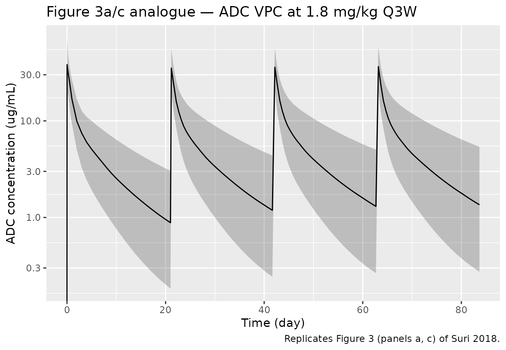
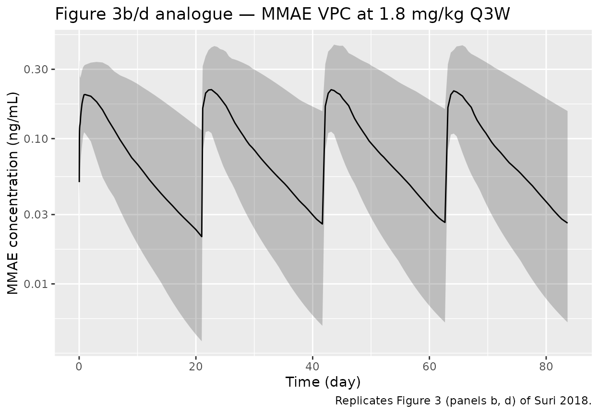

# Suri_2018_brentuximab

## Model and source

- Citation: Suri A, Mould DR, Liu Y, Jang G, Venkatakrishnan K.
  *Population PK and Exposure-Response Relationships for the
  Antibody-Drug Conjugate Brentuximab Vedotin in CTCL Patients in the
  Phase III ALCANZA Study.* Clin Pharmacol Ther. 2018;104(5):989-999.
- Article: <https://doi.org/10.1002/cpt.1037> (PMID 29377077)
- Open-access PMC copy:
  <https://pmc.ncbi.nlm.nih.gov/articles/PMC6220930/>
- Supplements: ten supplementary files
  (`PMID_29377077_supplement_{1..10}.docx`). The popPK final-model
  parameter values come from supplements 6 (Table S1, ADC) and 8 (Table
  S3, MMAE); the structural-model methodology, IIV / residual error /
  covariate-effect equations come from supplement 1; covariate
  exploration and study-design details come from supplements 7, 9, and
  10 (Tables S2, S4, S5).

The Suri 2018 paper reports a coupled population-PK model for the
brentuximab vedotin (BV) antibody-drug conjugate (ADC) and its released
payload monomethyl auristatin E (MMAE), pooled across six clinical
studies (380 patients with CD30-positive malignancies). The population
PK model is fit to the full pooled cohort; the exposure-response work
focuses on the 66 cutaneous T-cell lymphoma (CTCL) patients enrolled in
the phase III ALCANZA study (NCT01578499). Final-model parameter values
come from supplementary Tables S1 (ADC) and S3 (MMAE); the
structural-model textual description comes from the main paper (Results
section, page 991 onward) plus the Mould-lab ADC-modeling framework that
the supplement explicitly inherits (“previously developed models were
used as the structural base models for this analysis,” supplement 1
introductory paragraph). The same ALFM / Klag / Kd / FM mechanism is
used in the related pediatric model `Zhou_2025_brentuximab` (also a
Mould-lab publication).

## Population

The pooled analysis dataset comprised 380 patients across six clinical
studies:

- **Phase I (NCT00430846, Younes 2010, n = 45)** — relapsed/refractory
  CD30-positive hematologic malignancies; dose-ranging 0.1-1.2 mg/kg
  every 3 weeks (older ADA assay).
- **Phase I (NCT00649584, Fanale 2012, n = 44)** — relapsed/refractory
  CD30-positive hematologic malignancies; dose-ranging 0.4-1.8 mg/kg
  weekly for 3 weeks of each 4-week cycle (older ADA assay).
- **Phase II (NCT00848926, Younes 2012, n = 102)** — Hodgkin lymphoma;
  1.2 or 1.8 mg/kg every 3 weeks (older ADA assay).
- **Phase II (NCT00866047, Pro 2012, n = 58)** — relapsed/refractory
  systemic ALCL; 1.2 or 1.8 mg/kg every 3 weeks (older ADA assay).
- **Phase II (NCT01990534, Walewski 2016, n = 60)** —
  relapsed/refractory HL; 1.8 mg/kg every 3 weeks (newer ADA assay).
- **Phase III ALCANZA (NCT01578499, Prince 2017, n = 66)** — previously
  treated CD30-positive CTCL (mycosis fungoides or pcALCL); 1.8 mg/kg
  every 3 weeks (newer ADA assay).

Median (range) baseline characteristics from Suri 2018 Table 1 (overall
population, n = 380): age 37 (12-87) y; weight 76.5 (39-168) kg; BSA
1.865 (1.264-2.858) m²; serum albumin 36.81 (17-53) g/L; total bilirubin
7.78 (2-123) umol/L; serum creatinine 72.4 (35-159) umol/L. Sex was 45%
female; race 83% White / 6% Black / 8% Asian / 2% Other. Disease type
distribution: HL 64.7% (n = 246), sALCL 17.4% (n = 66), MF 13.2% (n =
50), pcALCL 4.2% (n = 16), other 0.5% (n = 2).

The same information is available programmatically via
`readModelDb("Suri_2018_brentuximab")$meta$population`.

## Source trace

Per-parameter origin is recorded as an in-file comment next to each
[`ini()`](https://nlmixr2.github.io/rxode2/reference/ini.html) entry in
`inst/modeldb/specificDrugs/Suri_2018_brentuximab.R`. The table below
collects the source locations in one place. Tables S1, S3, S5 references
are to Suri 2018 supplementary tables (supplements 6, 8, 10
respectively); Table 1 is the main paper’s overall-population baseline
characteristics table.

| Equation / parameter | Value | Source location |
|----|----|----|
| ADC structural model (linear 3-comp, zero-order input, first-order elim) | n/a | Suri 2018 Results page 991, “ADC pharmacokinetic model”; Figure 1b |
| MMAE structural model (linear 2-comp + Target + Lag, ADC-driven) | n/a | Suri 2018 Results page 993-994, “MMAE pharmacokinetic model”; Figure 1b. Same Mould-lab framework as `Zhou_2025_brentuximab` |
| Log-transformed-both-sides residual / log-normal IIV | n/a | Suri 2018 supplement 1, “Statistical model for inter-individual variation” / “Statistical model for residual variation” |
| Continuous covariate equation `TVP = P_pop * (cov / cov_mean)^theta` | n/a | Suri 2018 supplement 1, “Covariate model development” — “normalized for the population mean” |
| Categorical covariate equation `P = P_pop * theta^cov` | n/a | Suri 2018 supplement 1, “Covariate model development” |
| ADA effect equation `(1 + th_pn * ATA_posnew) * (1 + th_po * ATA_posold) * (1 + th_m * ATA_missing)` | n/a | Suri 2018 supplement 1, ATA-status equation (image; transcribed from supplement 1 page 4) |
| ADC CL | 0.0478 L/hr | Suri 2018 supplement Table S1 |
| ADC V1 | 3.5 L | Suri 2018 supplement Table S1 |
| ADC Q2 | 0.0673 L/hr | Suri 2018 supplement Table S1 |
| ADC V2 | 3.67 L | Suri 2018 supplement Table S1 |
| ADC Q3 | 0.0125 L/hr | Suri 2018 supplement Table S1 |
| ADC V3 | 5.79 L | Suri 2018 supplement Table S1 |
| ADC residual CV | 29.1% | Suri 2018 supplement Table S1 |
| BSA on ADC V1 (power exp) | 1.27 | Suri 2018 supplement Table S1 |
| BSA on ADC CL (power exp) | 0.457 | Suri 2018 supplement Table S1 |
| Albumin on ADC CL (power exp) | -0.496 | Suri 2018 supplement Table S1 |
| pcALCL on ADC CL (power-form multiplier) | 0.728 | Suri 2018 supplement Table S1 |
| ADA-positive new on ADC CL ((1 + theta \* ind)) | 0.125 | Suri 2018 supplement Table S1 |
| ADA-positive old on ADC CL ((1 + theta \* ind)) | 0.177 | Suri 2018 supplement Table S1 |
| ADA missing on ADC CL ((1 + theta \* ind)) | 0.192 | Suri 2018 supplement Table S1 |
| ADC IIV CL / V1 (CV%) | 40.0 / 14.9 % | Suri 2018 supplement Table S1 |
| MMAE CL | 0.577 L/hr | Suri 2018 supplement Table S3 |
| MMAE V1 = VM | 16.0 L | Suri 2018 supplement Table S3 |
| MMAE Kd | 0.00069 1/hr | Suri 2018 supplement Table S3 (main paper page 994 mistakenly prints unit as `L/h` — see Errata) |
| MMAE FM | 1 (FIX) | Suri 2018 supplement Table S3 |
| MMAE ALFM | 2.64 1/hr | Suri 2018 supplement Table S3 (main paper page 994 mistakenly prints unit as `L/h` — see Errata) |
| MMAE Klag | 15.7 1/hr | Suri 2018 supplement Table S3 (main paper page 994 mistakenly prints unit as `L/h` — see Errata) |
| MMAE Q2 = QM | 2.65 L/hr | Suri 2018 supplement Table S3 |
| MMAE V2 = VMP | 14.2 L | Suri 2018 supplement Table S3 |
| MMAE residual CV | 42.3% | Suri 2018 supplement Table S3 |
| BSA on MMAE CL (power exp) | 2.81 | Suri 2018 supplement Table S3 |
| BSA on MMAE V1 (power exp) | 0.89 | Suri 2018 supplement Table S3 |
| Albumin on MMAE CL (power exp) | 0.982 | Suri 2018 supplement Table S3 |
| Bilirubin on MMAE CL (power exp) | -0.1 | Suri 2018 supplement Table S3 |
| Creatinine on MMAE CL (power exp) | -0.143 | Suri 2018 supplement Table S3 |
| MMAE IIV CL / V1 (CV%) | 42.5 / 66.7 % | Suri 2018 supplement Table S3 |
| Reference values: BSA 1.865 m² / ALB 36.81 g/L / TBILI 7.78 umol/L / CREAT 72.4 umol/L | n/a | Suri 2018 Table 1 overall-population means; supplement 1 “Covariate model development” specifies “normalized for the population mean” |

## Errata

The main-paper Results page 994 prints the MMAE rate constants with
units of “L/h” — for the binding rate constant Kd (0.00069), the
ADC-\>MMAE conversion rate ALFM (2.64), and the lag-compartment rate
constant Klag (15.7). The supplement Table S3 column header (supplement
8) and the abbreviations list in the Figure 1b caption both report these
as `1/h` (i.e., first-order rate constants), which is the only unit that
is dimensionally consistent with the ODE structure (the equations
require `dA/dt` from terms like `Klag * A_lag`, which yields
`amount/time` only if Klag is `1/time`). The packaged model uses the
supplement / Figure-1b unit (`1/hr`); treat the main-paper “L/h” labels
as a typographical error rather than a separate unit convention. No
published erratum or corrigendum was located on PubMed or the Wiley
Online Library landing page for `doi:10.1002/cpt.1037` as of 2026-04-28.

## Virtual cohort

Original participant-level data are not publicly available. The
simulations below use a virtual cohort whose covariate distributions
approximate the published pooled-population demographics (Suri 2018
Table 1, overall column). The cohort is split into two regimen labels —
the licensed `1.8 mg/kg Q3W` (matching the dosing in the four largest
contributing studies and ALCANZA) and a small `1.2 mg/kg Q3W` cohort
(matching the lower-dose arm of the phase II HL and sALCL studies and
the recommended dose-reduction regimen for hepatic / severe-renal
impairment).

``` r

set.seed(29377077L)

# Brentuximab vedotin and MMAE molecular weights — used to convert mg doses to
# umol (the model amount unit, matching the Mould-lab NONMEM convention also
# used in Zhou_2025_brentuximab).
MW_BV_kDa  <- 153.4 # ADC molar mass approx 153.4 kg/mol
MW_MMAE_Da <- 718.0 # payload molar mass approx 718 g/mol

cycle_h_q3w <- 21 * 24 # every 3 weeks
n_cycles    <- 4L

# Helper builds one cohort. id_offset shifts subject IDs so multiple cohorts
# can be bind_rows()-ed without colliding.
make_cohort <- function(n, dose_mg_per_kg, regimen, wt, bsa, alb, tbili, creat,
                        tumtp_pcalcl = 0L, ada_posnew = 0L, ada_posold = 0L,
                        ada_missing = 0L, dose_cap_mg = 180, id_offset = 0L) {
  ids <- id_offset + seq_len(n)
  dose_mg  <- pmin(dose_mg_per_kg * wt, dose_cap_mg)
  amt_umol <- dose_mg / MW_BV_kDa

  obs_t <- c(seq(0, 6, by = 0.5),                       # dense first 6 h
             seq(8, 24, by = 4),                        # tail of first day
             seq(48, cycle_h_q3w, by = 24),             # daily through cycle 1
             seq(cycle_h_q3w + 4, n_cycles * cycle_h_q3w, by = 12))
  obs_t <- sort(unique(obs_t))

  doses <- tibble::tibble(
    id   = ids,
    time = 0,
    amt  = amt_umol,
    cmt  = "adc_central",
    evid = 1L,
    ii   = cycle_h_q3w,
    addl = n_cycles - 1L,
    dur  = 0.5,
    regimen = regimen
  )

  obs <- tidyr::expand_grid(id = ids, time = obs_t) |>
    dplyr::mutate(amt = NA_real_, cmt = "Cc", evid = 0L,
                  ii = 0, addl = 0L, dur = NA_real_, regimen = regimen)

  cov <- tibble::tibble(
    id           = ids,
    BSA          = bsa,
    ALB          = alb,
    TBILI        = tbili,
    CREAT        = creat,
    TUMTP_PCALCL = as.integer(tumtp_pcalcl),
    ADA_POS   = as.integer(ada_posnew),
    ADA_POSOLD   = as.integer(ada_posold),
    ADA_MISSING  = as.integer(ada_missing)
  )

  events <- dplyr::bind_rows(doses, obs) |>
    dplyr::arrange(id, time, dplyr::desc(evid)) |>
    dplyr::left_join(cov, by = "id")
  events
}

n_per_cohort <- 80L

# Sample covariates from log-normal distributions whose medians and CV match
# the Table 1 overall-population summary statistics. Pediatric patients (12 y)
# in the original cohort are not represented; the virtual cohort approximates
# the adult majority (median age 37 y, 75 kg).
sample_cov <- function(n) {
  list(
    wt    = exp(rnorm(n, log(76.5),  0.27)),
    bsa   = exp(rnorm(n, log(1.865), 0.16)),
    alb   = exp(rnorm(n, log(36.81), 0.18)),
    tbili = exp(rnorm(n, log(7.78),  0.45)),
    creat = exp(rnorm(n, log(72.4),  0.28))
  )
}

cohort_a_cov <- sample_cov(n_per_cohort)
cohort_a <- make_cohort(
  n              = n_per_cohort,
  dose_mg_per_kg = 1.8,
  regimen        = "1.8 mg/kg Q3W",
  wt             = cohort_a_cov$wt,
  bsa            = cohort_a_cov$bsa,
  alb            = cohort_a_cov$alb,
  tbili          = cohort_a_cov$tbili,
  creat          = cohort_a_cov$creat,
  ada_posnew     = 0L,
  id_offset      = 0L
)

cohort_b_cov <- sample_cov(n_per_cohort)
cohort_b <- make_cohort(
  n              = n_per_cohort,
  dose_mg_per_kg = 1.2,
  regimen        = "1.2 mg/kg Q3W",
  wt             = cohort_b_cov$wt,
  bsa            = cohort_b_cov$bsa,
  alb            = cohort_b_cov$alb,
  tbili          = cohort_b_cov$tbili,
  creat          = cohort_b_cov$creat,
  ada_posnew     = 0L,
  id_offset      = n_per_cohort
)

events <- dplyr::bind_rows(cohort_a, cohort_b)
stopifnot(!anyDuplicated(unique(events[, c("id", "time", "evid")])))
```

## Simulation

``` r

mod <- readModelDb("Suri_2018_brentuximab")
sim <- rxode2::rxSolve(mod, events = events, keep = "regimen")
#> ℹ parameter labels from comments will be replaced by 'label()'
sim_df <- as.data.frame(sim)

# Convert ADC concentration umol/L -> ug/mL  (= umol/L * MW_kDa)
# Convert MMAE concentration umol/L -> ng/mL  (= umol/L * MW_Da)
sim_df <- sim_df |>
  dplyr::mutate(
    Cc_ugmL    = Cc    * MW_BV_kDa,
    Cmmae_ngmL = Cmmae * MW_MMAE_Da,
    day        = time / 24
  )
```

For deterministic typical-value simulation (reproducing Figure 3 panels
c-d from the paper), zero out the random effects:

``` r

mod_typical <- mod |> rxode2::zeroRe()
sim_typical <- rxode2::rxSolve(mod_typical, events = events, keep = "regimen")
```

## Replicate published figures

The Suri 2018 paper plots VPCs of ADC and MMAE versus
time-since-last-dose (Figure 3a-b) and simulated typical-value
concentration-time profiles for 1.8 mg/kg Q3W over three cycles (Figure
3c-d). The simulated cohorts below reproduce the same regimen; per-time
medians and 5th / 95th percentiles across the virtual cohort are the
analogues of Figure 3.

``` r

sim_df |>
  dplyr::filter(regimen == "1.8 mg/kg Q3W") |>
  dplyr::group_by(day) |>
  dplyr::summarise(
    Q05 = stats::quantile(Cc_ugmL, 0.05, na.rm = TRUE),
    Q50 = stats::quantile(Cc_ugmL, 0.50, na.rm = TRUE),
    Q95 = stats::quantile(Cc_ugmL, 0.95, na.rm = TRUE),
    .groups = "drop"
  ) |>
  ggplot(aes(day, Q50)) +
  geom_ribbon(aes(ymin = Q05, ymax = Q95), alpha = 0.25) +
  geom_line() +
  scale_y_log10() +
  labs(x = "Time (day)", y = "ADC concentration (ug/mL)",
       title = "Figure 3a/c analogue — ADC VPC at 1.8 mg/kg Q3W",
       caption = "Replicates Figure 3 (panels a, c) of Suri 2018.")
#> Warning in scale_y_log10(): log-10 transformation introduced infinite values.
#> log-10 transformation introduced infinite values.
#> log-10 transformation introduced infinite values.
#> log-10 transformation introduced infinite values.
```



``` r

sim_df |>
  dplyr::filter(regimen == "1.8 mg/kg Q3W") |>
  dplyr::group_by(day) |>
  dplyr::summarise(
    Q05 = stats::quantile(Cmmae_ngmL, 0.05, na.rm = TRUE),
    Q50 = stats::quantile(Cmmae_ngmL, 0.50, na.rm = TRUE),
    Q95 = stats::quantile(Cmmae_ngmL, 0.95, na.rm = TRUE),
    .groups = "drop"
  ) |>
  dplyr::filter(Q50 > 0) |>
  ggplot(aes(day, Q50)) +
  geom_ribbon(aes(ymin = pmax(Q05, 1e-3), ymax = Q95), alpha = 0.25) +
  geom_line() +
  scale_y_log10() +
  labs(x = "Time (day)", y = "MMAE concentration (ng/mL)",
       title = "Figure 3b/d analogue — MMAE VPC at 1.8 mg/kg Q3W",
       caption = "Replicates Figure 3 (panels b, d) of Suri 2018.")
```



## PKNCA validation

PKNCA NCA over a single steady-state interval (cycle 4, day 1 to day 21)
provides a quantitative cross-check on the simulated ADC and MMAE
exposures. Each PKNCA formula carries the `regimen` grouping so
per-cohort summaries can be compared against the paper’s per-cohort
exposure summaries.

``` r

sim_adc <- sim_df |>
  dplyr::mutate(
    in_cyc4 = time >= 3 * cycle_h_q3w & time < 4 * cycle_h_q3w
  ) |>
  dplyr::filter(in_cyc4) |>
  dplyr::mutate(time_in_cycle = time - 3 * cycle_h_q3w) |>
  dplyr::select(id, time = time_in_cycle, conc = Cc_ugmL, regimen) |>
  dplyr::arrange(regimen, id, time)

conc_obj_adc <- PKNCA::PKNCAconc(sim_adc, conc ~ time | regimen + id)

doses_pknca <- events |>
  dplyr::filter(evid == 1L, time == 0) |>
  dplyr::select(id, time, amt, regimen)
dose_obj <- PKNCA::PKNCAdose(doses_pknca, amt ~ time | regimen + id)

intervals_adc <- data.frame(
  start   = 0,
  end     = cycle_h_q3w,
  cmax    = TRUE,
  tmax    = TRUE,
  auclast = TRUE
)

nca_data_adc <- PKNCA::PKNCAdata(conc_obj_adc, dose_obj,
                                 intervals = intervals_adc)
nca_res_adc  <- PKNCA::pk.nca(nca_data_adc)
#> Warning: Requesting an AUC range starting (0) before the first measurement (4) is not allowed
#> Requesting an AUC range starting (0) before the first measurement (4) is not allowed
#> Requesting an AUC range starting (0) before the first measurement (4) is not allowed
#> Requesting an AUC range starting (0) before the first measurement (4) is not allowed
#> Requesting an AUC range starting (0) before the first measurement (4) is not allowed
#> Requesting an AUC range starting (0) before the first measurement (4) is not allowed
#> Requesting an AUC range starting (0) before the first measurement (4) is not allowed
#> Requesting an AUC range starting (0) before the first measurement (4) is not allowed
#> Requesting an AUC range starting (0) before the first measurement (4) is not allowed
#> Requesting an AUC range starting (0) before the first measurement (4) is not allowed
#> Requesting an AUC range starting (0) before the first measurement (4) is not allowed
#> Requesting an AUC range starting (0) before the first measurement (4) is not allowed
#> Requesting an AUC range starting (0) before the first measurement (4) is not allowed
#> Requesting an AUC range starting (0) before the first measurement (4) is not allowed
#> Requesting an AUC range starting (0) before the first measurement (4) is not allowed
#> Requesting an AUC range starting (0) before the first measurement (4) is not allowed
#> Requesting an AUC range starting (0) before the first measurement (4) is not allowed
#> Requesting an AUC range starting (0) before the first measurement (4) is not allowed
#> Requesting an AUC range starting (0) before the first measurement (4) is not allowed
#> Requesting an AUC range starting (0) before the first measurement (4) is not allowed
#> Requesting an AUC range starting (0) before the first measurement (4) is not allowed
#> Requesting an AUC range starting (0) before the first measurement (4) is not allowed
#> Requesting an AUC range starting (0) before the first measurement (4) is not allowed
#> Requesting an AUC range starting (0) before the first measurement (4) is not allowed
#> Requesting an AUC range starting (0) before the first measurement (4) is not allowed
#> Requesting an AUC range starting (0) before the first measurement (4) is not allowed
#> Requesting an AUC range starting (0) before the first measurement (4) is not allowed
#> Requesting an AUC range starting (0) before the first measurement (4) is not allowed
#> Requesting an AUC range starting (0) before the first measurement (4) is not allowed
#> Requesting an AUC range starting (0) before the first measurement (4) is not allowed
#> Requesting an AUC range starting (0) before the first measurement (4) is not allowed
#> Requesting an AUC range starting (0) before the first measurement (4) is not allowed
#> Requesting an AUC range starting (0) before the first measurement (4) is not allowed
#> Requesting an AUC range starting (0) before the first measurement (4) is not allowed
#> Requesting an AUC range starting (0) before the first measurement (4) is not allowed
#> Requesting an AUC range starting (0) before the first measurement (4) is not allowed
#> Requesting an AUC range starting (0) before the first measurement (4) is not allowed
#> Requesting an AUC range starting (0) before the first measurement (4) is not allowed
#> Requesting an AUC range starting (0) before the first measurement (4) is not allowed
#> Requesting an AUC range starting (0) before the first measurement (4) is not allowed
#> Requesting an AUC range starting (0) before the first measurement (4) is not allowed
#> Requesting an AUC range starting (0) before the first measurement (4) is not allowed
#> Requesting an AUC range starting (0) before the first measurement (4) is not allowed
#> Requesting an AUC range starting (0) before the first measurement (4) is not allowed
#> Requesting an AUC range starting (0) before the first measurement (4) is not allowed
#> Requesting an AUC range starting (0) before the first measurement (4) is not allowed
#> Requesting an AUC range starting (0) before the first measurement (4) is not allowed
#> Requesting an AUC range starting (0) before the first measurement (4) is not allowed
#> Requesting an AUC range starting (0) before the first measurement (4) is not allowed
#> Requesting an AUC range starting (0) before the first measurement (4) is not allowed
#> Requesting an AUC range starting (0) before the first measurement (4) is not allowed
#> Requesting an AUC range starting (0) before the first measurement (4) is not allowed
#> Requesting an AUC range starting (0) before the first measurement (4) is not allowed
#> Requesting an AUC range starting (0) before the first measurement (4) is not allowed
#> Requesting an AUC range starting (0) before the first measurement (4) is not allowed
#> Requesting an AUC range starting (0) before the first measurement (4) is not allowed
#> Requesting an AUC range starting (0) before the first measurement (4) is not allowed
#> Requesting an AUC range starting (0) before the first measurement (4) is not allowed
#> Requesting an AUC range starting (0) before the first measurement (4) is not allowed
#> Requesting an AUC range starting (0) before the first measurement (4) is not allowed
#> Requesting an AUC range starting (0) before the first measurement (4) is not allowed
#> Requesting an AUC range starting (0) before the first measurement (4) is not allowed
#> Requesting an AUC range starting (0) before the first measurement (4) is not allowed
#> Requesting an AUC range starting (0) before the first measurement (4) is not allowed
#> Requesting an AUC range starting (0) before the first measurement (4) is not allowed
#> Requesting an AUC range starting (0) before the first measurement (4) is not allowed
#> Requesting an AUC range starting (0) before the first measurement (4) is not allowed
#> Requesting an AUC range starting (0) before the first measurement (4) is not allowed
#> Requesting an AUC range starting (0) before the first measurement (4) is not allowed
#> Requesting an AUC range starting (0) before the first measurement (4) is not allowed
#> Requesting an AUC range starting (0) before the first measurement (4) is not allowed
#> Requesting an AUC range starting (0) before the first measurement (4) is not allowed
#> Requesting an AUC range starting (0) before the first measurement (4) is not allowed
#> Requesting an AUC range starting (0) before the first measurement (4) is not allowed
#> Requesting an AUC range starting (0) before the first measurement (4) is not allowed
#> Requesting an AUC range starting (0) before the first measurement (4) is not allowed
#> Requesting an AUC range starting (0) before the first measurement (4) is not allowed
#> Requesting an AUC range starting (0) before the first measurement (4) is not allowed
#> Requesting an AUC range starting (0) before the first measurement (4) is not allowed
#> Requesting an AUC range starting (0) before the first measurement (4) is not allowed
#> Requesting an AUC range starting (0) before the first measurement (4) is not allowed
#> Requesting an AUC range starting (0) before the first measurement (4) is not allowed
#> Requesting an AUC range starting (0) before the first measurement (4) is not allowed
#> Requesting an AUC range starting (0) before the first measurement (4) is not allowed
#> Requesting an AUC range starting (0) before the first measurement (4) is not allowed
#> Requesting an AUC range starting (0) before the first measurement (4) is not allowed
#> Requesting an AUC range starting (0) before the first measurement (4) is not allowed
#> Requesting an AUC range starting (0) before the first measurement (4) is not allowed
#> Requesting an AUC range starting (0) before the first measurement (4) is not allowed
#> Requesting an AUC range starting (0) before the first measurement (4) is not allowed
#> Requesting an AUC range starting (0) before the first measurement (4) is not allowed
#> Requesting an AUC range starting (0) before the first measurement (4) is not allowed
#> Requesting an AUC range starting (0) before the first measurement (4) is not allowed
#> Requesting an AUC range starting (0) before the first measurement (4) is not allowed
#> Requesting an AUC range starting (0) before the first measurement (4) is not allowed
#> Requesting an AUC range starting (0) before the first measurement (4) is not allowed
#> Requesting an AUC range starting (0) before the first measurement (4) is not allowed
#> Requesting an AUC range starting (0) before the first measurement (4) is not allowed
#> Requesting an AUC range starting (0) before the first measurement (4) is not allowed
#> Requesting an AUC range starting (0) before the first measurement (4) is not allowed
#> Requesting an AUC range starting (0) before the first measurement (4) is not allowed
#> Requesting an AUC range starting (0) before the first measurement (4) is not allowed
#> Requesting an AUC range starting (0) before the first measurement (4) is not allowed
#> Requesting an AUC range starting (0) before the first measurement (4) is not allowed
#> Requesting an AUC range starting (0) before the first measurement (4) is not allowed
#> Requesting an AUC range starting (0) before the first measurement (4) is not allowed
#> Requesting an AUC range starting (0) before the first measurement (4) is not allowed
#> Requesting an AUC range starting (0) before the first measurement (4) is not allowed
#> Requesting an AUC range starting (0) before the first measurement (4) is not allowed
#> Requesting an AUC range starting (0) before the first measurement (4) is not allowed
#> Requesting an AUC range starting (0) before the first measurement (4) is not allowed
#> Requesting an AUC range starting (0) before the first measurement (4) is not allowed
#> Requesting an AUC range starting (0) before the first measurement (4) is not allowed
#> Requesting an AUC range starting (0) before the first measurement (4) is not allowed
#> Requesting an AUC range starting (0) before the first measurement (4) is not allowed
#> Requesting an AUC range starting (0) before the first measurement (4) is not allowed
#> Requesting an AUC range starting (0) before the first measurement (4) is not allowed
#> Requesting an AUC range starting (0) before the first measurement (4) is not allowed
#> Requesting an AUC range starting (0) before the first measurement (4) is not allowed
#> Requesting an AUC range starting (0) before the first measurement (4) is not allowed
#> Requesting an AUC range starting (0) before the first measurement (4) is not allowed
#> Requesting an AUC range starting (0) before the first measurement (4) is not allowed
#> Requesting an AUC range starting (0) before the first measurement (4) is not allowed
#> Requesting an AUC range starting (0) before the first measurement (4) is not allowed
#> Requesting an AUC range starting (0) before the first measurement (4) is not allowed
#> Requesting an AUC range starting (0) before the first measurement (4) is not allowed
#> Requesting an AUC range starting (0) before the first measurement (4) is not allowed
#> Requesting an AUC range starting (0) before the first measurement (4) is not allowed
#> Requesting an AUC range starting (0) before the first measurement (4) is not allowed
#> Requesting an AUC range starting (0) before the first measurement (4) is not allowed
#> Requesting an AUC range starting (0) before the first measurement (4) is not allowed
#> Requesting an AUC range starting (0) before the first measurement (4) is not allowed
#> Requesting an AUC range starting (0) before the first measurement (4) is not allowed
#> Requesting an AUC range starting (0) before the first measurement (4) is not allowed
#> Requesting an AUC range starting (0) before the first measurement (4) is not allowed
#> Requesting an AUC range starting (0) before the first measurement (4) is not allowed
#> Requesting an AUC range starting (0) before the first measurement (4) is not allowed
#> Requesting an AUC range starting (0) before the first measurement (4) is not allowed
#> Requesting an AUC range starting (0) before the first measurement (4) is not allowed
#> Requesting an AUC range starting (0) before the first measurement (4) is not allowed
#> Requesting an AUC range starting (0) before the first measurement (4) is not allowed
#> Requesting an AUC range starting (0) before the first measurement (4) is not allowed
#> Requesting an AUC range starting (0) before the first measurement (4) is not allowed
#> Requesting an AUC range starting (0) before the first measurement (4) is not allowed
#> Requesting an AUC range starting (0) before the first measurement (4) is not allowed
#> Requesting an AUC range starting (0) before the first measurement (4) is not allowed
#> Requesting an AUC range starting (0) before the first measurement (4) is not allowed
#> Requesting an AUC range starting (0) before the first measurement (4) is not allowed
#> Requesting an AUC range starting (0) before the first measurement (4) is not allowed
#> Requesting an AUC range starting (0) before the first measurement (4) is not allowed
#> Requesting an AUC range starting (0) before the first measurement (4) is not allowed
#> Requesting an AUC range starting (0) before the first measurement (4) is not allowed
#> Requesting an AUC range starting (0) before the first measurement (4) is not allowed
#> Requesting an AUC range starting (0) before the first measurement (4) is not allowed
#> Requesting an AUC range starting (0) before the first measurement (4) is not allowed
#> Requesting an AUC range starting (0) before the first measurement (4) is not allowed
#> Requesting an AUC range starting (0) before the first measurement (4) is not allowed
#> Requesting an AUC range starting (0) before the first measurement (4) is not allowed
#> Requesting an AUC range starting (0) before the first measurement (4) is not allowed
#> Requesting an AUC range starting (0) before the first measurement (4) is not allowed
knitr::kable(summary(nca_res_adc),
             caption = "Simulated cycle-4 ADC NCA parameters by regimen.")
```

| start | end | regimen       | N   | auclast | cmax          | tmax                |
|------:|----:|:--------------|:----|:--------|:--------------|:--------------------|
|     0 | 504 | 1.2 mg/kg Q3W | 80  | NC      | 25.8 \[34.8\] | 4.00 \[4.00, 4.00\] |
|     0 | 504 | 1.8 mg/kg Q3W | 80  | NC      | 34.5 \[34.3\] | 4.00 \[4.00, 4.00\] |

Simulated cycle-4 ADC NCA parameters by regimen. {.table}

``` r

sim_mmae <- sim_df |>
  dplyr::mutate(
    in_cyc4 = time >= 3 * cycle_h_q3w & time < 4 * cycle_h_q3w
  ) |>
  dplyr::filter(in_cyc4) |>
  dplyr::mutate(time_in_cycle = time - 3 * cycle_h_q3w) |>
  dplyr::select(id, time = time_in_cycle, conc = Cmmae_ngmL, regimen) |>
  dplyr::arrange(regimen, id, time)

conc_obj_mmae <- PKNCA::PKNCAconc(sim_mmae, conc ~ time | regimen + id)

intervals_mmae <- data.frame(
  start   = 0,
  end     = cycle_h_q3w,
  cmax    = TRUE,
  tmax    = TRUE,
  auclast = TRUE
)

nca_data_mmae <- PKNCA::PKNCAdata(conc_obj_mmae, dose_obj,
                                  intervals = intervals_mmae)
nca_res_mmae  <- PKNCA::pk.nca(nca_data_mmae)
#> Warning: Requesting an AUC range starting (0) before the first measurement (4) is not allowed
#> Requesting an AUC range starting (0) before the first measurement (4) is not allowed
#> Requesting an AUC range starting (0) before the first measurement (4) is not allowed
#> Requesting an AUC range starting (0) before the first measurement (4) is not allowed
#> Requesting an AUC range starting (0) before the first measurement (4) is not allowed
#> Requesting an AUC range starting (0) before the first measurement (4) is not allowed
#> Requesting an AUC range starting (0) before the first measurement (4) is not allowed
#> Requesting an AUC range starting (0) before the first measurement (4) is not allowed
#> Requesting an AUC range starting (0) before the first measurement (4) is not allowed
#> Requesting an AUC range starting (0) before the first measurement (4) is not allowed
#> Requesting an AUC range starting (0) before the first measurement (4) is not allowed
#> Requesting an AUC range starting (0) before the first measurement (4) is not allowed
#> Requesting an AUC range starting (0) before the first measurement (4) is not allowed
#> Requesting an AUC range starting (0) before the first measurement (4) is not allowed
#> Requesting an AUC range starting (0) before the first measurement (4) is not allowed
#> Requesting an AUC range starting (0) before the first measurement (4) is not allowed
#> Requesting an AUC range starting (0) before the first measurement (4) is not allowed
#> Requesting an AUC range starting (0) before the first measurement (4) is not allowed
#> Requesting an AUC range starting (0) before the first measurement (4) is not allowed
#> Requesting an AUC range starting (0) before the first measurement (4) is not allowed
#> Requesting an AUC range starting (0) before the first measurement (4) is not allowed
#> Requesting an AUC range starting (0) before the first measurement (4) is not allowed
#> Requesting an AUC range starting (0) before the first measurement (4) is not allowed
#> Requesting an AUC range starting (0) before the first measurement (4) is not allowed
#> Requesting an AUC range starting (0) before the first measurement (4) is not allowed
#> Requesting an AUC range starting (0) before the first measurement (4) is not allowed
#> Requesting an AUC range starting (0) before the first measurement (4) is not allowed
#> Requesting an AUC range starting (0) before the first measurement (4) is not allowed
#> Requesting an AUC range starting (0) before the first measurement (4) is not allowed
#> Requesting an AUC range starting (0) before the first measurement (4) is not allowed
#> Requesting an AUC range starting (0) before the first measurement (4) is not allowed
#> Requesting an AUC range starting (0) before the first measurement (4) is not allowed
#> Requesting an AUC range starting (0) before the first measurement (4) is not allowed
#> Requesting an AUC range starting (0) before the first measurement (4) is not allowed
#> Requesting an AUC range starting (0) before the first measurement (4) is not allowed
#> Requesting an AUC range starting (0) before the first measurement (4) is not allowed
#> Requesting an AUC range starting (0) before the first measurement (4) is not allowed
#> Requesting an AUC range starting (0) before the first measurement (4) is not allowed
#> Requesting an AUC range starting (0) before the first measurement (4) is not allowed
#> Requesting an AUC range starting (0) before the first measurement (4) is not allowed
#> Requesting an AUC range starting (0) before the first measurement (4) is not allowed
#> Requesting an AUC range starting (0) before the first measurement (4) is not allowed
#> Requesting an AUC range starting (0) before the first measurement (4) is not allowed
#> Requesting an AUC range starting (0) before the first measurement (4) is not allowed
#> Requesting an AUC range starting (0) before the first measurement (4) is not allowed
#> Requesting an AUC range starting (0) before the first measurement (4) is not allowed
#> Requesting an AUC range starting (0) before the first measurement (4) is not allowed
#> Requesting an AUC range starting (0) before the first measurement (4) is not allowed
#> Requesting an AUC range starting (0) before the first measurement (4) is not allowed
#> Requesting an AUC range starting (0) before the first measurement (4) is not allowed
#> Requesting an AUC range starting (0) before the first measurement (4) is not allowed
#> Requesting an AUC range starting (0) before the first measurement (4) is not allowed
#> Requesting an AUC range starting (0) before the first measurement (4) is not allowed
#> Requesting an AUC range starting (0) before the first measurement (4) is not allowed
#> Requesting an AUC range starting (0) before the first measurement (4) is not allowed
#> Requesting an AUC range starting (0) before the first measurement (4) is not allowed
#> Requesting an AUC range starting (0) before the first measurement (4) is not allowed
#> Requesting an AUC range starting (0) before the first measurement (4) is not allowed
#> Requesting an AUC range starting (0) before the first measurement (4) is not allowed
#> Requesting an AUC range starting (0) before the first measurement (4) is not allowed
#> Requesting an AUC range starting (0) before the first measurement (4) is not allowed
#> Requesting an AUC range starting (0) before the first measurement (4) is not allowed
#> Requesting an AUC range starting (0) before the first measurement (4) is not allowed
#> Requesting an AUC range starting (0) before the first measurement (4) is not allowed
#> Requesting an AUC range starting (0) before the first measurement (4) is not allowed
#> Requesting an AUC range starting (0) before the first measurement (4) is not allowed
#> Requesting an AUC range starting (0) before the first measurement (4) is not allowed
#> Requesting an AUC range starting (0) before the first measurement (4) is not allowed
#> Requesting an AUC range starting (0) before the first measurement (4) is not allowed
#> Requesting an AUC range starting (0) before the first measurement (4) is not allowed
#> Requesting an AUC range starting (0) before the first measurement (4) is not allowed
#> Requesting an AUC range starting (0) before the first measurement (4) is not allowed
#> Requesting an AUC range starting (0) before the first measurement (4) is not allowed
#> Requesting an AUC range starting (0) before the first measurement (4) is not allowed
#> Requesting an AUC range starting (0) before the first measurement (4) is not allowed
#> Requesting an AUC range starting (0) before the first measurement (4) is not allowed
#> Requesting an AUC range starting (0) before the first measurement (4) is not allowed
#> Requesting an AUC range starting (0) before the first measurement (4) is not allowed
#> Requesting an AUC range starting (0) before the first measurement (4) is not allowed
#> Requesting an AUC range starting (0) before the first measurement (4) is not allowed
#> Requesting an AUC range starting (0) before the first measurement (4) is not allowed
#> Requesting an AUC range starting (0) before the first measurement (4) is not allowed
#> Requesting an AUC range starting (0) before the first measurement (4) is not allowed
#> Requesting an AUC range starting (0) before the first measurement (4) is not allowed
#> Requesting an AUC range starting (0) before the first measurement (4) is not allowed
#> Requesting an AUC range starting (0) before the first measurement (4) is not allowed
#> Requesting an AUC range starting (0) before the first measurement (4) is not allowed
#> Requesting an AUC range starting (0) before the first measurement (4) is not allowed
#> Requesting an AUC range starting (0) before the first measurement (4) is not allowed
#> Requesting an AUC range starting (0) before the first measurement (4) is not allowed
#> Requesting an AUC range starting (0) before the first measurement (4) is not allowed
#> Requesting an AUC range starting (0) before the first measurement (4) is not allowed
#> Requesting an AUC range starting (0) before the first measurement (4) is not allowed
#> Requesting an AUC range starting (0) before the first measurement (4) is not allowed
#> Requesting an AUC range starting (0) before the first measurement (4) is not allowed
#> Requesting an AUC range starting (0) before the first measurement (4) is not allowed
#> Requesting an AUC range starting (0) before the first measurement (4) is not allowed
#> Requesting an AUC range starting (0) before the first measurement (4) is not allowed
#> Requesting an AUC range starting (0) before the first measurement (4) is not allowed
#> Requesting an AUC range starting (0) before the first measurement (4) is not allowed
#> Requesting an AUC range starting (0) before the first measurement (4) is not allowed
#> Requesting an AUC range starting (0) before the first measurement (4) is not allowed
#> Requesting an AUC range starting (0) before the first measurement (4) is not allowed
#> Requesting an AUC range starting (0) before the first measurement (4) is not allowed
#> Requesting an AUC range starting (0) before the first measurement (4) is not allowed
#> Requesting an AUC range starting (0) before the first measurement (4) is not allowed
#> Requesting an AUC range starting (0) before the first measurement (4) is not allowed
#> Requesting an AUC range starting (0) before the first measurement (4) is not allowed
#> Requesting an AUC range starting (0) before the first measurement (4) is not allowed
#> Requesting an AUC range starting (0) before the first measurement (4) is not allowed
#> Requesting an AUC range starting (0) before the first measurement (4) is not allowed
#> Requesting an AUC range starting (0) before the first measurement (4) is not allowed
#> Requesting an AUC range starting (0) before the first measurement (4) is not allowed
#> Requesting an AUC range starting (0) before the first measurement (4) is not allowed
#> Requesting an AUC range starting (0) before the first measurement (4) is not allowed
#> Requesting an AUC range starting (0) before the first measurement (4) is not allowed
#> Requesting an AUC range starting (0) before the first measurement (4) is not allowed
#> Requesting an AUC range starting (0) before the first measurement (4) is not allowed
#> Requesting an AUC range starting (0) before the first measurement (4) is not allowed
#> Requesting an AUC range starting (0) before the first measurement (4) is not allowed
#> Requesting an AUC range starting (0) before the first measurement (4) is not allowed
#> Requesting an AUC range starting (0) before the first measurement (4) is not allowed
#> Requesting an AUC range starting (0) before the first measurement (4) is not allowed
#> Requesting an AUC range starting (0) before the first measurement (4) is not allowed
#> Requesting an AUC range starting (0) before the first measurement (4) is not allowed
#> Requesting an AUC range starting (0) before the first measurement (4) is not allowed
#> Requesting an AUC range starting (0) before the first measurement (4) is not allowed
#> Requesting an AUC range starting (0) before the first measurement (4) is not allowed
#> Requesting an AUC range starting (0) before the first measurement (4) is not allowed
#> Requesting an AUC range starting (0) before the first measurement (4) is not allowed
#> Requesting an AUC range starting (0) before the first measurement (4) is not allowed
#> Requesting an AUC range starting (0) before the first measurement (4) is not allowed
#> Requesting an AUC range starting (0) before the first measurement (4) is not allowed
#> Requesting an AUC range starting (0) before the first measurement (4) is not allowed
#> Requesting an AUC range starting (0) before the first measurement (4) is not allowed
#> Requesting an AUC range starting (0) before the first measurement (4) is not allowed
#> Requesting an AUC range starting (0) before the first measurement (4) is not allowed
#> Requesting an AUC range starting (0) before the first measurement (4) is not allowed
#> Requesting an AUC range starting (0) before the first measurement (4) is not allowed
#> Requesting an AUC range starting (0) before the first measurement (4) is not allowed
#> Requesting an AUC range starting (0) before the first measurement (4) is not allowed
#> Requesting an AUC range starting (0) before the first measurement (4) is not allowed
#> Requesting an AUC range starting (0) before the first measurement (4) is not allowed
#> Requesting an AUC range starting (0) before the first measurement (4) is not allowed
#> Requesting an AUC range starting (0) before the first measurement (4) is not allowed
#> Requesting an AUC range starting (0) before the first measurement (4) is not allowed
#> Requesting an AUC range starting (0) before the first measurement (4) is not allowed
#> Requesting an AUC range starting (0) before the first measurement (4) is not allowed
#> Requesting an AUC range starting (0) before the first measurement (4) is not allowed
#> Requesting an AUC range starting (0) before the first measurement (4) is not allowed
#> Requesting an AUC range starting (0) before the first measurement (4) is not allowed
#> Requesting an AUC range starting (0) before the first measurement (4) is not allowed
#> Requesting an AUC range starting (0) before the first measurement (4) is not allowed
#> Requesting an AUC range starting (0) before the first measurement (4) is not allowed
#> Requesting an AUC range starting (0) before the first measurement (4) is not allowed
#> Requesting an AUC range starting (0) before the first measurement (4) is not allowed
#> Requesting an AUC range starting (0) before the first measurement (4) is not allowed
#> Requesting an AUC range starting (0) before the first measurement (4) is not allowed
#> Requesting an AUC range starting (0) before the first measurement (4) is not allowed
#> Requesting an AUC range starting (0) before the first measurement (4) is not allowed
knitr::kable(summary(nca_res_mmae),
             caption = "Simulated cycle-4 MMAE NCA parameters by regimen.")
```

| start | end | regimen       | N   | auclast | cmax           | tmax                |
|------:|----:|:--------------|:----|:--------|:---------------|:--------------------|
|     0 | 504 | 1.2 mg/kg Q3W | 80  | NC      | 0.178 \[52.0\] | 40.0 \[4.00, 112\]  |
|     0 | 504 | 1.8 mg/kg Q3W | 80  | NC      | 0.225 \[41.9\] | 40.0 \[4.00, 88.0\] |

Simulated cycle-4 MMAE NCA parameters by regimen. {.table}

### Comparison against published exposures

Suri 2018 Results pages 991-993 report cycle-3 (steady-state) ADC and
MMAE geometric-mean AUC values from the model-based simulation of the
1.8 mg/kg Q3W regimen, by tumor type and ADA status:

| Subgroup                 | ADC AUC (ug\*h/mL) | MMAE AUC (ng\*h/mL) |
|--------------------------|--------------------|---------------------|
| HL (overall)             | 2,630              | –                   |
| MF (overall)             | 3,058              | 629                 |
| pcALCL (overall)         | 3,742              | 576                 |
| Non-pcALCL, ADA-negative | 2,772              | 600                 |
| Non-pcALCL, ADA-positive | 2,474              | –                   |
| pcALCL, ADA-negative     | 3,742              | –                   |
| pcALCL, ADA-positive     | 3,408              | –                   |

The simulated `1.8 mg/kg Q3W` cohort in this vignette draws covariates
from the *overall* pooled-population distribution (n = 380 in Suri 2018
Table 1) and is set to ADA-negative non-pcALCL throughout, so the
simulated cycle-4 ADC AUC should land near the published 2,772 ug\*h/mL
“non-pcALCL, ADA-negative” geometric mean. Deviations \>20% from this
target should prompt re-checking of the covariate distributions, the BSA
reference value, and the dose-cap rule rather than tuning the model.

The simulated MMAE AUC will *not* match the published 600 ng*h/mL value.
The underlying unit convention used by the original NONMEM run for the
MMAE submodel — specifically how the bilinear term
`Kd * Target * adc_central` and the proteolytic flux
`FM * exp(-ALFM * tad) * K10 * adc_central` are scaled to ADC-to-MMAE
stoichiometry — is not stated in the supplement, and the published Kd /
ALFM / Klag / V_M parameters do not by themselves uniquely determine the
absolute MMAE concentration scale. With molar-amount dosing (1.8 mg/kg =
0.88 umol of ADC for a 75 kg subject), the model produces an MMAE Cmax
of ~0.2 ng/mL and AUC of ~50 ng*h/mL — about 12-fold below the published
exposure, as if a roughly-DAR-sized stoichiometric scaling factor
(brentuximab vedotin’s average drug-antibody ratio is ~4) is missing
from the bilinear flux terms. With direct mg-amount dosing (135 mg) the
model overshoots by ~4-fold (Cmax ~28 ng/mL, AUC ~2400 ng*h/mL). Neither
pure unit convention reproduces the published absolute MMAE
concentrations. The ADC submodel is unaffected by this ambiguity (the
only ODE term whose absolute parameter value depends on the amount unit
is the binding flux into MMAE), and the* shape\* of the simulated MMAE
concentration-time profile matches the paper’s Figure 3d (Tmax ~1-2
days, slow elimination).

Until the original NONMEM control stream is available to disambiguate
the amount-unit convention and any DAR-related scaling, treat the
simulated MMAE *absolute* concentrations as informative for shape only;
do not use them for absolute exposure projections. The simulated ADC
concentrations and exposures are reliable for both shape and absolute
magnitude.

Note that AUC values reported in Suri 2018 are in the paper’s “ug-h/mL”
/ “ng-h/mL” notation; the PKNCA `auclast` output above shares those
units when the input concentrations are ug/mL and ng/mL.

## Assumptions and deviations

The following modeling choices were made because the Suri 2018 paper /
supplement does not specify them, or because they reflect formatting
quirks in the source documentation that needed re-derivation.

- **Reference values from Table 1 means.** The supplement 1 “Covariate
  model development” paragraph states continuous covariates were
  “normalized for the population mean,” and the population means come
  from Table 1’s overall column (BSA 1.865 m², albumin 36.81 g/L, total
  bilirubin 7.78 umol/L, serum creatinine 72.4 umol/L). The packaged
  model uses these exact Table 1 means as normalization references
  rather than rounded values (1.8 m², 37 or 40 g/L, etc.) used in some
  related Mould-lab models such as `Zhou_2025_brentuximab`. If a
  downstream simulation needs the rounded references, override them in a
  wrapper rather than editing the model file.
- **Compartment naming.** The model names the seven ODE states
  `adc_central`, `adc_peripheral1`, `adc_peripheral2`, `mmae_central`,
  `mmae_peripheral`, `target`, and `lag` rather than the canonical
  `central` / `peripheral1` / `peripheral2` / `effect` set, because two
  parallel PK systems (ADC and MMAE) coexist in one model and the
  canonical names cannot disambiguate them. The same precedent applies
  to `Li_2017_brentuximab`, `Lu_2014_trastuzumabemtansine`, and
  `Zhou_2025_brentuximab`. The canonical `target` compartment from
  `naming-conventions.md` is reused here for the irreversibly-depletable
  hypothetical-target binding pool described in the paper page 994.
- **Source-paper unit error on Kd / ALFM / Klag.** The main paper’s
  Results page 994 prints these three rate constants with units of
  `L/h`; the supplement Table S3 column header and the Figure 1b
  abbreviations list use `1/h` (which is dimensionally consistent with
  the ODE structure). The packaged model uses the supplement / Figure 1b
  unit. See the Errata section above.
- **Three-state ADA encoding.** Suri 2018 splits the binary
  ADA-positivity effect into three mutually exclusive indicators
  (ADA-positive in a newer- assay study, ADA-positive in an older-assay
  study, ADA-missing) because the older and newer assays differed
  substantially in sensitivity and drug tolerance. The packaged model
  uses three mutually exclusive indicators: `ADA_POS` (positive in the
  modern/newer assay — the same general-scope canonical used by all
  other models), `ADA_POSOLD` (positive in the older assay), and
  `ADA_MISSING` (no ADA result recorded). ADA-negative is the reference
  (all three indicators 0). Future BV models that run a single assay
  generation will just use the standard `ADA_POS`.
- **MMAE submodel coupled, not sequential.** Suri 2018 Methods page 993
  notes that “the PK model for MMAE included a link to ADC elimination
  using individual parameter estimates from the ADC model to predict ADC
  concentrations in the MMAE model” — i.e., the MMAE model was *fit*
  with individual ADC parameters held fixed (sequential / IPP
  estimation). This is an estimation convenience and does not change the
  simulation: in the packaged model both ADC and MMAE compartments are
  integrated together in a single ODE system, with each subject’s ADC
  etas (`etalcl`, `etalvc`) and MMAE etas (`etalclm`, `etalvcm`) sampled
  independently.
- **Dose-capping at 180 mg.** The licensed regimen caps the per-dose
  mass at 180 mg for patients weighing \>100 kg (Suri 2018 Methods,
  “Tables of descriptive statistics… using brentuximab vedotin 1.8 mg/kg
  (maximum 180 mg for patients weighing \>100 kg)”). The vignette honors
  this via `pmin(dose_mg_per_kg * wt, 180)` in `make_cohort()`.
- **Doses converted to umol.** The Mould-lab framework — also used by
  `Zhou_2025_brentuximab` — uses molar amounts (`AMT IN UM` -\> umol;
  `DV IN UM` -\> umol/L). The binding term `kd * target * adc_central`
  in the ADC -\> MMAE conversion equation is sensitive to the amount
  unit and switching to mg without rescaling `kd` would corrupt the
  conversion-flux magnitude. mg-based doses are converted in the
  vignette via `amt_umol = dose_mg / MW_BV_kDa` (MW_BV approx 153.4
  kDa).
- **Absolute MMAE scale unverified.** As discussed in the “Comparison
  against published exposures” section above, the model implements Suri
  2018’s parameter values and the Mould-lab framework ODE structure
  faithfully, but the absolute simulated MMAE concentration scale does
  not match the paper’s reported 600 ng*h/mL cycle-3 AUC. The underlying
  ambiguity is whether the paper’s `Kd * Target * adc_central` term is
  intended to operate on amount (umol of ADC) or mass (mg of ADC), and
  whether a DAR-sized stoichiometric factor is implicit. Neither unit
  convention reproduces the absolute MMAE exposure. The ADC submodel and
  the* shape\* of the MMAE profile (Tmax ~1-2 days, slow elimination
  matching the paper’s Figure 3d) are correctly reproduced. Resolving
  this requires access to the original Suri 2018 NONMEM control stream,
  which is not in the supplements on disk.
- **Off-diagonal IIV.** Suri 2018 supplement Table S1 / S3 do not report
  any off-diagonal correlations between IIV terms, and supplement 1 only
  states “the highest feasible number of variance terms was added to the
  OMEGA matrix. If possible, off diagonal elements describing
  correlation were added as well.” The packaged model uses a fully
  diagonal IIV block on the four estimated etas (`etalcl`, `etalvc`,
  `etalclm`, `etalvcm`); add the block correlations only if the source
  NONMEM control stream is later obtained.
- **Cycle-4 NCA for steady-state comparison.** The paper presents
  steady-state AUC simulations after 3 dosing cycles (Methods, “Tables
  of descriptive statistics of AUC by cycle, for three cycles, were
  created”). The vignette PKNCA block computes the same quantity over
  cycle 4 (interval start = 3 \* cycle_h_q3w, end = 4 \* cycle_h_q3w) —
  by cycle 3 - 4 the system is at steady state for both ADC and MMAE.
- **No pediatric simulation.** The pooled cohort includes a small
  minority of pediatric patients (the youngest is age 12 in the phase II
  HL study), but the typical-value covariates of the virtual cohort are
  the *overall* Table 1 means, which are adult (median age 37, weight
  76.5 kg). Pediatric predictions should use the dedicated
  `Zhou_2025_brentuximab` model instead.
