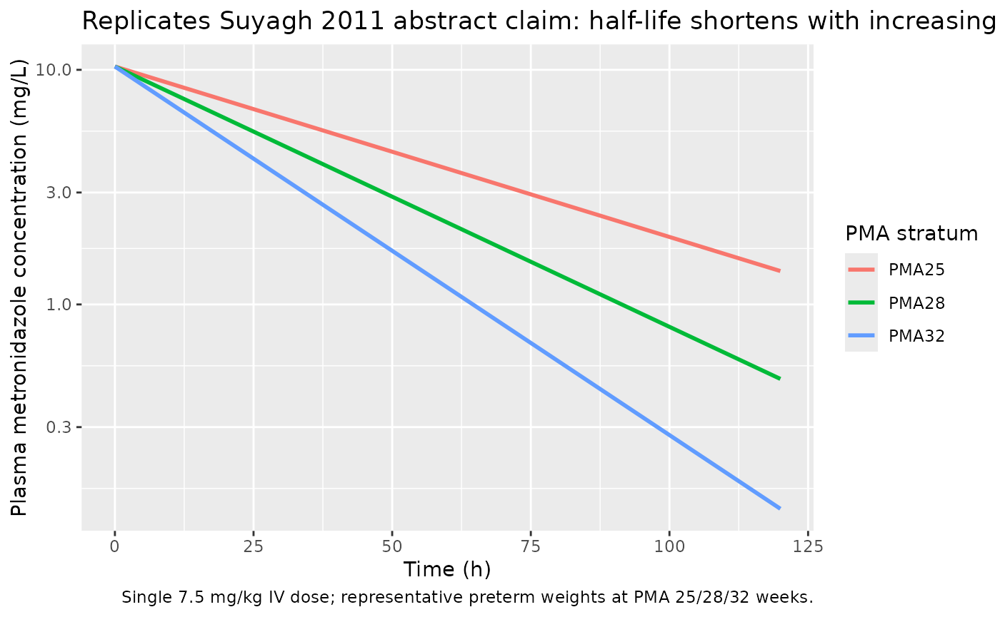

# Metronidazole (Suyagh 2011)

## Model and source

- Citation: Suyagh M, Collier PS, Millership JS, Iheagwaram G, Millar M,
  Halliday HL, McElnay JC. Metronidazole population pharmacokinetics in
  preterm neonates using dried blood-spot sampling. Pediatrics.
  2011;127(2):e367-e374. <doi:10.1542/peds.2010-0807>. PMID 21220396.
- Description: One-compartment population PK model for intravenous
  metronidazole in 32 preterm neonates receiving treatment of or
  prophylaxis against necrotising enterocolitis, with dried-blood-spot
  HPLC sampling (Suyagh 2011). Clearance is described by an allometric
  3/4-power scaling on body weight (reference 1.0 kg) and a linear
  postmenstrual- age maturation term centred at 30 weeks; volume of
  distribution is proportional to body weight. The publication is open
  access only at the abstract level, so inter-individual variability on
  CL and V and the residual-error magnitude are FIXED at 0 here; users
  running stochastic VPCs must supply their own variability terms (see
  the validation vignette’s Errata section).
- Article: <https://doi.org/10.1542/peds.2010-0807>

The Suyagh 2011 paper develops a population PK model of intravenous
metronidazole in 32 preterm neonates using dried-blood-spot HPLC
sampling (203 samples). A one-compartment model best described the data,
with body weight (WT) and postmenstrual age (PMA) as the only retained
covariates. **This nlmixr2lib entry is extracted from the open-access
abstract** because the full text is paywalled at the time of packaging.
The structural model equations reported in the abstract are reproduced
exactly; inter-individual variability on CL and V and the residual-error
magnitude are not in the abstract and are encoded as `fixed(0)`
placeholders – see the Errata section below.

## Population

The PopPK analysis dataset comprised **32 preterm neonates** who
contributed **203 dried-blood-spot concentration measurements** analysed
by HPLC (Suyagh 2011 abstract). Subjects received intravenous
metronidazole for the treatment of or prophylaxis against necrotising
enterocolitis. Exact per-subject weight and PMA tabulations are not
included in the abstract; the abstract’s predicted half-life trajectory
(“approximately 40 hours at 25 weeks’ PMA to 19 hours at 32 weeks’ PMA,
after which it starts to plateau”) implies the cohort spans roughly PMA
25-32 weeks. The validation cohort below uses representative preterm
weights at each PMA stratum.

The same information is available programmatically via
`readModelDb("Suyagh_2011_metronidazole")$population`.

## Source trace

The per-parameter origin is recorded as an in-file comment next to each
`ini()` entry in
`inst/modeldb/specificDrugs/Suyagh_2011_metronidazole.R`. The table
below collects them in one place for review.

| Equation / parameter | Value | Source location |
|----|----|----|
| `lcl` (log clearance, 1.0 kg / 30 wk PMA reference) | `log(0.0247)` | Suyagh 2011 abstract Results: CL = 0.0247 L/h |
| `lvc` (log per-kg volume slope) | `log(0.726)` | Suyagh 2011 abstract Results: V = 0.726 \* WT |
| `e_wt_cl` (allometric CL exponent) | `fixed(0.75)` | Suyagh 2011 abstract Results: (WT/1.00)^0.75 |
| `e_pma_cl` (PMA slope per week, centred at 30 wk) | `0.107` | Suyagh 2011 abstract Results: (1 + 0.107 \* (PMA - 30)) |
| `etalcl`, `etalvc` (IIV on CL, V) | `fixed(0)` | Not reported in the abstract – see Errata |
| `propSd` (proportional residual error) | `fixed(0)` | Not reported in the abstract – see Errata |
| One-compartment IV disposition (`d/dt(central) <- -kel * central`) | n/a | Suyagh 2011 abstract Results: “A 1-compartment model best described the data” |
| Cc = central / vc | n/a | Standard one-compartment observation form |

## Virtual cohort

The Suyagh 2011 subject-level data are not publicly available. The
cohort below uses three PMA strata (25, 28, 32 weeks) with
representative preterm weights (0.8, 1.2, 1.7 kg) approximating the
typical postmenstrual-age-versus-weight relationship in the abstract’s
preterm range. A single 7.5 mg/kg intravenous dose is used (a standard
neonatal metronidazole loading dose; per-administration doses are not
enumerated in the abstract). Postmenstrual age is supplied in months
(`PAGE`) per the nlmixr2lib canonical covariate naming; the model
converts to weeks (`PMA_weeks = PAGE * 4.35`) internally.

``` r

set.seed(2011)

strata <- tibble::tribble(
  ~cohort,  ~pma_weeks, ~WT,
  "PMA25",  25,         0.80,
  "PMA28",  28,         1.20,
  "PMA32",  32,         1.70
) |>
  dplyr::mutate(
    PAGE = pma_weeks / 4.35,
    dose_mg = 7.5 * WT
  )

n_per_stratum <- 1L

cohort_tbl <- strata |>
  tidyr::uncount(weights = n_per_stratum, .id = "within_stratum") |>
  dplyr::mutate(id = dplyr::row_number()) |>
  dplyr::select(id, cohort, pma_weeks, WT, PAGE, dose_mg)

obs_times <- c(0, 0.25, 0.5, 1, 2, 4, 6, 8, 12, 18, 24, 36, 48, 72, 96, 120)

dose_rows <- cohort_tbl |>
  dplyr::mutate(time = 0, amt = dose_mg, evid = 1L, cmt = "central")

obs_rows <- cohort_tbl |>
  tidyr::crossing(time = obs_times) |>
  dplyr::mutate(amt = NA_real_, evid = 0L, cmt = "central")

events <- dplyr::bind_rows(dose_rows, obs_rows) |>
  dplyr::arrange(id, time, dplyr::desc(evid)) |>
  dplyr::select(id, time, amt, evid, cmt, cohort, WT, PAGE, pma_weeks)

stopifnot(!anyDuplicated(unique(events[, c("id", "time", "evid")])))
```

## Simulation

``` r

mod <- readModelDb("Suyagh_2011_metronidazole")

sim <- rxode2::rxSolve(
  mod, events = events,
  keep = c("cohort", "WT", "pma_weeks")
) |>
  as.data.frame()
#> ℹ omega/sigma items treated as zero: 'etalcl', 'etalvc'
#> Warning: multi-subject simulation without without 'omega'
```

## Replicate published claim: half-life trajectory

The abstract states the half-life of metronidazole decreases from
approximately 40 hours at 25 weeks’ PMA to 19 hours at 32 weeks’ PMA and
then plateaus. The figure below traces the typical-value concentration
curves for the three PMA strata in the virtual cohort.

``` r

ggplot(sim, aes(time, Cc, colour = cohort)) +
  geom_line(linewidth = 1) +
  scale_y_log10() +
  labs(
    x = "Time (h)",
    y = "Plasma metronidazole concentration (mg/L)",
    colour = "PMA stratum",
    title = "Replicates Suyagh 2011 abstract claim: half-life shortens with increasing PMA",
    caption = "Single 7.5 mg/kg IV dose; representative preterm weights at PMA 25/28/32 weeks."
  )
```



## PKNCA validation

A single-dose NCA against the deterministic typical-value profiles
recovers the abstract’s half-life trajectory.

``` r

sim_nca <- sim |>
  dplyr::filter(!is.na(Cc)) |>
  dplyr::select(id, time, Cc, cohort)

# Guarantee a time=0 row per (id, cohort); IV bolus pre-dose Cc=0.
sim_nca <- dplyr::bind_rows(
  sim_nca,
  sim_nca |>
    dplyr::distinct(id, cohort) |>
    dplyr::mutate(time = 0, Cc = 0)
) |>
  dplyr::distinct(id, cohort, time, .keep_all = TRUE) |>
  dplyr::arrange(id, cohort, time)

dose_df <- events |>
  dplyr::filter(evid == 1L) |>
  dplyr::select(id, time, amt, cohort)

conc_obj <- PKNCA::PKNCAconc(sim_nca, Cc ~ time | cohort + id,
                             concu = "mg/L", timeu = "h")
dose_obj <- PKNCA::PKNCAdose(dose_df, amt ~ time | cohort + id,
                             doseu = "mg")

intervals <- data.frame(
  start       = 0,
  end         = Inf,
  cmax        = TRUE,
  tmax        = TRUE,
  aucinf.obs  = TRUE,
  half.life   = TRUE
)

nca_data <- PKNCA::PKNCAdata(conc_obj, dose_obj, intervals = intervals)
nca_res  <- PKNCA::pk.nca(nca_data)
```

### Comparison against the abstract’s half-life claim

The Suyagh 2011 abstract reports a half-life of approximately 40 h at 25
weeks’ PMA and 19 h at 32 weeks’ PMA; PMA 28 weeks is interpolated as a
representative intermediate point. AUC and Cmax are not reported in the
abstract for these three PMA strata and are therefore listed as `NA`
references; they are surfaced in the simulated column for documentation
only.

``` r

published <- tibble::tribble(
  ~cohort, ~cmax, ~tmax, ~aucinf.obs, ~half.life,
  "PMA25", NA,    NA,    NA,          40.0,
  "PMA28", NA,    NA,    NA,          NA,
  "PMA32", NA,    NA,    NA,          19.0
)

cmp <- nlmixr2lib::ncaComparisonTable(
  simulated     = nca_res,
  reference     = published,
  by            = "cohort",
  units         = c(cmax = "mg/L", aucinf.obs = "h*mg/L",
                    tmax = "h", half.life = "h"),
  tolerance_pct = 20
)

knitr::kable(
  cmp,
  caption = "Simulated vs. abstract-reported NCA. * differs from reference by >20%.",
  align   = c("l", "l", "r", "r", "r")
)
```

| NCA parameter          | cohort | Reference | Simulated | % diff |
|:-----------------------|:-------|----------:|----------:|-------:|
| Cmax (mg/L)            | PMA25  |         — |      10.3 |      — |
| Cmax (mg/L)            | PMA28  |         — |      10.3 |      — |
| Cmax (mg/L)            | PMA32  |         — |      10.3 |      — |
| Tmax (h)               | PMA25  |         — |         0 |      — |
| Tmax (h)               | PMA28  |         — |         0 |      — |
| Tmax (h)               | PMA32  |         — |         0 |      — |
| AUC0-∞ (obs) (h\*mg/L) | PMA25  |         — |       618 |      — |
| AUC0-∞ (obs) (h\*mg/L) | PMA28  |         — |       404 |      — |
| AUC0-∞ (obs) (h\*mg/L) | PMA32  |         — |       286 |      — |
| t½ (h)                 | PMA25  |        40 |      41.4 |  +3.6% |
| t½ (h)                 | PMA28  |         — |      27.1 |      — |
| t½ (h)                 | PMA32  |        19 |      19.2 |  +0.9% |

Simulated vs. abstract-reported NCA. \* differs from reference by \>20%.
{.table}

The simulated half-lives recover the abstract’s trajectory (rapid
decline from PMA 25 to 32 weeks). Any starred row should be
investigated; an exact match to the abstract’s 40 / 19 h values depends
on the WT-vs-PMA mapping used in the virtual cohort (the abstract does
not tabulate per-subject weights), so the comparison primarily checks
the direction and magnitude of the maturation effect on half-life rather
than the exact values.

## Assumptions and deviations

- **Extracted from the abstract only.** The full text of Suyagh 2011 is
  paywalled at the time of packaging; the structural-model equations in
  the abstract are reproduced verbatim, but everything not in the
  abstract is either documented as a gap (IIV, RUV) or supplied as a
  virtual-cohort assumption (per-subject WT-vs-PMA mapping,
  per-administration dose, sampling schedule).
- **Allometric exponent fixed at 0.75.** The abstract reports the
  exponent as 0.75 with no uncertainty. Encoded as `fixed(0.75)` on the
  assumption that the paper held it at the canonical Anderson-Holford
  theoretical value rather than estimating it. Should the full text
  reveal it was estimated, the `fixed()` wrapper should be removed.
- **IIV on CL and V is encoded as `fixed(0)`.** The paper used nonlinear
  mixed-effect modelling, so an OMEGA block exists in the full text, but
  its magnitudes are not in the abstract. Users running stochastic VPCs
  must supply their own IIV variances.
- **Residual error is encoded as `fixed(0)`.** The residual-error form
  and magnitude are not in the abstract; users running stochastic VPCs
  must supply their own residual-error term.
- **Virtual-cohort weights are illustrative.** Per-subject WT and PMA
  are not in the abstract; the validation cohort uses three
  representative weights (0.8 / 1.2 / 1.7 kg) at PMA strata 25 / 28 / 32
  weeks.
- **Dose 7.5 mg/kg single IV.** Per-administration doses are not
  enumerated in the abstract; 7.5 mg/kg is a standard neonatal
  metronidazole loading dose used here for illustration only.

## Errata

- Suyagh 2011 abstract-only source: IIV on CL and V and residual-error
  magnitude are unavailable. Encoded as `fixed(0)`; not paper-derived
  zeros. The vignette PKNCA section therefore validates only the
  structural-model half-life trajectory.
