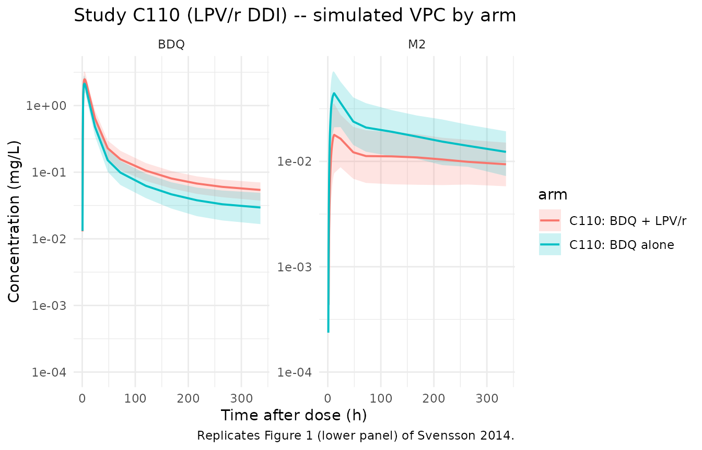
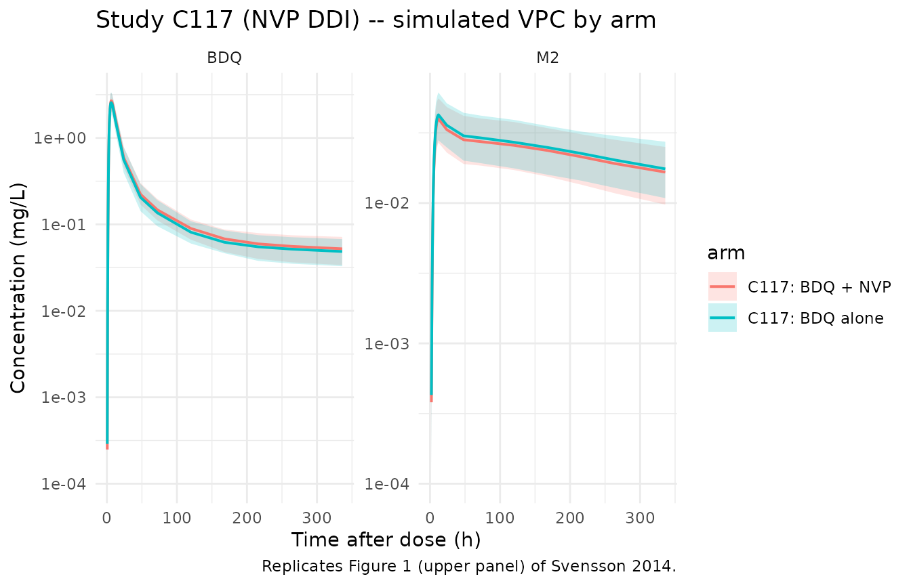

# Bedaquiline + lopinavir-ritonavir or nevirapine DDI (Svensson 2014)

## Models and source

This vignette covers two parent-and-metabolite popPK models extracted
from Svensson, Dooley, and Karlsson (2014). The paper fits the
bedaquiline + M2 disposition separately on the two single-dose drug-drug
interaction (DDI) studies (C110 with ritonavir-boosted lopinavir, C117
with nevirapine), so the two studies are packaged as two distinct model
files that share a single validation vignette.

- Article: [Antimicrob Agents Chemother 58(11):6406-6412
  (doi:10.1128/AAC.03246-14)](https://doi.org/10.1128/AAC.03246-14)
- Structural model inherited from Svensson 2013 (efavirenz DDI;
  <doi:10.1128/AAC.00191-13>); see
  `modellib('Svensson_2013_bedaquiline')`.

``` r

mod_lpvr <- rxode2::rxode(readModelDb("Svensson_2014_bedaquiline_lpvr"))
#> ℹ parameter labels from comments will be replaced by 'label()'
mod_nvp  <- rxode2::rxode(readModelDb("Svensson_2014_bedaquiline_nvp"))
#> ℹ parameter labels from comments will be replaced by 'label()'

cat("=== Svensson_2014_bedaquiline_lpvr ===\n", mod_lpvr$description, "\n\n",
    "Reference: ", mod_lpvr$reference, sep = "")
#> === Svensson_2014_bedaquiline_lpvr ===
#> Three-compartment population PK model for bedaquiline (BDQ) and a two-compartment N-desmethyl metabolite M2 in healthy adult volunteers following single 400 mg oral doses, with Savic 2007 analytical transit-compartment absorption (non-integer NN feeding a first-order depot at rate ka), fixed allometric scaling on disposition (0.75 on CL/Q at 70 kg, 1 on Vc/Vp), and multiplicative ritonavir-boosted lopinavir (LPV/r) drug-drug-interaction factors of 0.347 on bedaquiline apparent clearance and 0.578 on M2 apparent clearance during LPV/r co-administration (study C110).
#> 
#> Reference: Svensson E. M., Dooley K. E., Karlsson M. O. (2014). Impact of lopinavir-ritonavir or nevirapine on bedaquiline exposures and potential implications for patients with tuberculosis-HIV coinfection. Antimicrobial Agents and Chemotherapy 58(11):6406-6412. doi:10.1128/AAC.03246-14. Structural model inherited from Svensson 2013 (efavirenz DDI; doi:10.1128/AAC.00191-13); see modellib('Svensson_2013_bedaquiline').
cat("\n\n=== Svensson_2014_bedaquiline_nvp ===\n", mod_nvp$description, "\n\n",
    "Reference: ", mod_nvp$reference, sep = "")
#> 
#> 
#> === Svensson_2014_bedaquiline_nvp ===
#> Three-compartment population PK model for bedaquiline (BDQ) and a two-compartment N-desmethyl metabolite M2 in HIV-1-infected ART-naive adult volunteers following single 400 mg oral doses, with Savic 2007 analytical transit-compartment absorption (non-integer NN feeding a first-order depot at rate ka), fixed allometric scaling on disposition (0.75 on CL/Q at 70 kg, 1 on Vc/Vp), and multiplicative nevirapine (NVP) drug-drug-interaction factors of 0.915 on bedaquiline and 1.05 on M2 apparent clearances during steady-state NVP co-administration (study C117). The factors are fixed-effects only because BSV on the NVP interaction effects was not estimated.
#> 
#> Reference: Svensson E. M., Dooley K. E., Karlsson M. O. (2014). Impact of lopinavir-ritonavir or nevirapine on bedaquiline exposures and potential implications for patients with tuberculosis-HIV coinfection. Antimicrobial Agents and Chemotherapy 58(11):6406-6412. doi:10.1128/AAC.03246-14. Structural model inherited from Svensson 2013 (efavirenz DDI; doi:10.1128/AAC.00191-13); see modellib('Svensson_2013_bedaquiline').
```

## Population

Both studies enrolled 16 adult volunteers and used the same
single-400-mg bedaquiline + 14-day PK sampling design (17 samples per
dose per analyte at 0, 1, 2, 3, 4, 5, 6, 8, 12, 24, 48, 72, 120, 168,
216, 264, and 336 h after each dose). Study C110 (LPV/r DDI) was a
crossover study in 16 HIV-seronegative healthy volunteers (median 75 kg,
age range 20-54 years, 15 male / 1 female, 6 Black / 10 White) with
LPV/r 400/100 mg twice daily started 10 days before either the first or
second bedaquiline dose (ClinicalTrials.gov NCT00828529). Study C117
(NVP DDI) was a single-sequence study in 16 HIV-1-positive ART-naive
volunteers (median 55 kg, age range 22-51 years, 10 male / 6 female, 8
Black / 8 Mixed) with NVP 200 mg once daily for 2 weeks then 200 mg
twice daily started prior to the second bedaquiline dose; at least 4
weeks of the twice-daily NVP regimen elapsed before the second
bedaquiline dose (ClinicalTrials.gov NCT00910806). Both studies were
sponsored by Tibotec / Janssen.

The same demographics are available programmatically via the
`population` metadata on each model,
e.g. `readModelDb("Svensson_2014_bedaquiline_lpvr")$population`.

## Source trace

Per-parameter origin is also recorded as in-file comments next to each
`ini()` entry in the model files. The table below collects the
structural trace for both studies (numerical values are the final
estimates from Supplementary Tables S1a and S1b of Svensson 2014).

| Equation / parameter | Study C110 value (LPV/r) | Study C117 value (NVP) | Source location |
|----|---:|---:|----|
| Mean transit time MTT (h) | 1.02 | 3.37 | Supp. Table S1a/S1b row ‘MTT’ |
| Number of transit compartments NN | 5.77 | 4.48 | Supp. Table S1a/S1b row ‘NN’ |
| Absorption rate constant ka (1/h) | 0.0983 | 0.131 | Supp. Table S1a/S1b row ‘KA’ |
| BDQ apparent clearance CL/F (L/h) at 70 kg | 3.09 | 3.34 | Supp. Table S1a/S1b row ‘CL/F’ |
| BDQ apparent central volume V/F (L) at 70 kg | 16.1 | 11.2 | Supp. Table S1a/S1b row ‘V/F’ |
| BDQ apparent Q1/F (L/h) at 70 kg | 5.97 | 7.03 | Supp. Table S1a/S1b row ‘Q1/F’ |
| BDQ apparent VP1/F (L) at 70 kg | 4890 | 4000 | Supp. Table S1a/S1b row ‘VP1/F’ |
| BDQ apparent Q2/F (L/h) at 70 kg | 3.52 | 5.26 | Supp. Table S1a/S1b row ‘Q2/F’ |
| BDQ apparent VP2/F (L) at 70 kg | 174 | 164 | Supp. Table S1a/S1b row ‘VP2/F’ |
| M2 apparent CL_M2/(F\*fm) (L/h) at 70 kg | 14.6 | 16.0 | Supp. Table S1a/S1b row ‘CLM2/F/fm’ |
| M2 apparent V_M2/(F\*fm) (L) at 70 kg | 746 | 824 | Supp. Table S1a/S1b row ‘VM2/F/fm’ |
| M2 apparent Q_M2/(F\*fm) (L/h) at 70 kg | 75.5 | 131 | Supp. Table S1a/S1b row ‘Q1M2/F/fm’ |
| M2 apparent VP_M2/(F\*fm) (L) at 70 kg | 3140 | 3090 | Supp. Table S1a/S1b row ‘VP1M2/F/fm’ |
| Allometric exponent on CL/Q (fixed) | 0.75 | 0.75 | Methods ‘Nonlinear mixed-effects modeling’ / Supp. Table S1a/S1b footnote b |
| Allometric exponent on V (fixed) | 1 | 1 | Methods ‘Nonlinear mixed-effects modeling’ / Supp. Table S1a/S1b footnote b |
| Factor on BDQ CL during co-administration | 0.347 (LPV/r) | 0.915 (NVP) | Supp. Table S1a ‘EFF1 LPV/r BDQ CL’ / Supp. Table S1b ‘EFF NVP on BDQ CL’ |
| Factor on M2 CL during co-administration | 0.578 (LPV/r) | 1.05 (NVP) | Supp. Table S1a ‘EFF2 LPV/r M2 CL’ / Supp. Table S1b ‘EFF NVP on M2 CL’ |
| BSV CL (%CV) | 39.2 | 20.4 | Supp. Table S1a/S1b row ‘BSV CL’ |
| BSV CL_M2 (%CV) | 40.5 | 22.6 | Supp. Table S1a/S1b row ‘BSV CLM2’ |
| BSV V (%CV) | 47.5 | 98.0 | Supp. Table S1a/S1b row ‘BSV V’ |
| BSV Q1 (%CV) | 14.0 | 17.7 | Supp. Table S1a/S1b row ‘BSV Q1’ |
| BSV V_M2 (%CV) | 52.0 | 9.43 | Supp. Table S1a/S1b row ‘BSV VM2’ |
| BSV VP_M2 (%CV) | 38.5 | 9.90 | Supp. Table S1a/S1b row ‘BSV VP1M2’ |
| Proportional residual error on BDQ (%CV) | 17.1 | 22.7 | Supp. Table S1a/S1b row ‘Prop error TMC’ |
| Proportional residual error on M2 (%CV) | 14.5 | 16.2 | Supp. Table S1a/S1b row ‘Prop error M2’ |
| Css,avg ratio: BDQ on LPV/r vs alone (paper) | 288% | – | Table 3 row ‘LPV/r BDQ’ (RSE 9.3%) |
| Css,avg ratio: M2 on LPV/r vs alone (paper) | 173% | – | Table 3 row ‘LPV/r M2’ (RSE 8.4%) |
| Css,avg ratio: BDQ on NVP vs alone (paper) | – | 109% | Table 3 row ‘NVP BDQ’ (RSE 5.9%) |
| Css,avg ratio: M2 on NVP vs alone (paper) | – | 95.2% | Table 3 row ‘NVP M2’ (RSE 10.3%) |

## Virtual cohorts

The two studies share the same single-400-mg bedaquiline dose and the
same 14-day PK sampling schedule, differing only in (1) the
co-administered antiretroviral and (2) the population’s median body
weight. Each arm uses 200 simulated subjects (the 200/arm vignette cap),
and a single 400 mg bedaquiline dose is administered at `time = 0` with
rich PK sampling matching the paper’s nominal schedule plus a denser
grid in the first 12 h to support absorption-phase NCA.

``` r

set.seed(20140811L)

# Nominal sampling times from the paper, in hours after the bedaquiline dose.
samp_times <- c(0, 1, 2, 3, 4, 5, 6, 8, 12, 24, 48, 72, 120, 168, 216, 264, 336)
# A denser grid in the first 12 h for smoother NCA / Cmax estimates.
samp_dense <- sort(unique(c(seq(0, 12, by = 0.5), samp_times)))

# Helper: build one arm. comed_col is the name of the canonical CONMED column
# carried in the event table; the model body multiplies CL by the DDI factor
# when this column is 1. id_offset shifts subject IDs so multiple cohorts
# bind_rows() without collisions.
make_arm <- function(n, wt_median, comed_col, comed_value, label, id_offset = 0L) {
  ids <- id_offset + seq_len(n)
  # Weights drawn around the per-study median assuming ~15% CV (covers the
  # observed Table 1 ranges 65-103 kg for C110 and 48-71 kg for C117).
  wt <- pmax(40, pmin(120, rlnorm(n, log(wt_median), 0.15)))

  dose_rows <- tibble::tibble(
    id   = ids,
    time = 0,
    evid = 1L,
    amt  = 400,
    cmt  = "depot",
    WT   = wt,
    !!comed_col := comed_value,
    arm  = label
  )
  sample_rows <- tidyr::expand_grid(id = ids, time = samp_dense) |>
    dplyr::left_join(tibble::tibble(id = ids, WT = wt), by = "id") |>
    dplyr::mutate(
      evid = 0L,
      amt  = 0,
      cmt  = "Cc",
      !!comed_col := comed_value,
      arm  = label
    )
  dplyr::bind_rows(dose_rows, sample_rows) |>
    dplyr::arrange(id, time, dplyr::desc(evid))
}

# Study C110 (LPV/r DDI): two arms (BDQ alone, BDQ + LPV/r). Median weight 75 kg.
events_lpvr <- dplyr::bind_rows(
  make_arm(200, 75, "CONMED_LPV", 0L, "C110: BDQ alone",  id_offset =    0L),
  make_arm(200, 75, "CONMED_LPV", 1L, "C110: BDQ + LPV/r", id_offset =  200L)
)

# Study C117 (NVP DDI): two arms (BDQ alone, BDQ + NVP). Median weight 55 kg.
events_nvp <- dplyr::bind_rows(
  make_arm(200, 55, "CONMED_NVP", 0L, "C117: BDQ alone", id_offset =    0L),
  make_arm(200, 55, "CONMED_NVP", 1L, "C117: BDQ + NVP", id_offset =  200L)
)

stopifnot(!anyDuplicated(unique(events_lpvr[, c("id", "time", "evid")])))
stopifnot(!anyDuplicated(unique(events_nvp [, c("id", "time", "evid")])))
```

## Simulation

``` r

sim_lpvr <- rxode2::rxSolve(
  mod_lpvr, events = events_lpvr,
  keep = c("WT", "arm", "CONMED_LPV"),
  returnType = "data.frame"
)

sim_nvp <- rxode2::rxSolve(
  mod_nvp, events = events_nvp,
  keep = c("WT", "arm", "CONMED_NVP"),
  returnType = "data.frame"
)
```

## Figure 1 – visual predictive check by arm

The paper’s Figure 1 is a prediction- and variability-corrected VPC of
bedaquiline and M2 concentrations after a single 400 mg dose, with the
nominal observed time grid (0-336 h after dose). The replicate below
renders the simulated 5th / 50th / 95th percentile envelope per arm; the
sub-LLOQ (1 ng/mL = 0.001 mg/L) range is plotted on a log axis to make
the terminal phase visible.

``` r

sim_lpvr |>
  dplyr::filter(time > 0) |>
  tidyr::pivot_longer(c(Cc, Cc_m2), names_to = "analyte", values_to = "conc") |>
  dplyr::mutate(analyte = dplyr::recode(analyte, Cc = "BDQ", Cc_m2 = "M2")) |>
  dplyr::group_by(arm, analyte, time) |>
  dplyr::summarise(
    Q05 = quantile(conc, 0.05, na.rm = TRUE),
    Q50 = quantile(conc, 0.50, na.rm = TRUE),
    Q95 = quantile(conc, 0.95, na.rm = TRUE),
    .groups = "drop"
  ) |>
  ggplot(aes(time, Q50, colour = arm, fill = arm)) +
  geom_ribbon(aes(ymin = Q05, ymax = Q95), alpha = 0.2, colour = NA) +
  geom_line(linewidth = 0.7) +
  facet_wrap(~analyte, scales = "free_y") +
  scale_y_log10(limits = c(1e-4, NA)) +
  labs(x = "Time after dose (h)", y = "Concentration (mg/L)",
       title = "Study C110 (LPV/r DDI) -- simulated VPC by arm",
       caption = "Replicates Figure 1 (lower panel) of Svensson 2014.") +
  theme_minimal()
#> Warning: Removed 4 rows containing missing values or values outside the scale range
#> (`geom_ribbon()`).
#> Warning: Removed 3 rows containing missing values or values outside the scale range
#> (`geom_line()`).
```



``` r

sim_nvp |>
  dplyr::filter(time > 0) |>
  tidyr::pivot_longer(c(Cc, Cc_m2), names_to = "analyte", values_to = "conc") |>
  dplyr::mutate(analyte = dplyr::recode(analyte, Cc = "BDQ", Cc_m2 = "M2")) |>
  dplyr::group_by(arm, analyte, time) |>
  dplyr::summarise(
    Q05 = quantile(conc, 0.05, na.rm = TRUE),
    Q50 = quantile(conc, 0.50, na.rm = TRUE),
    Q95 = quantile(conc, 0.95, na.rm = TRUE),
    .groups = "drop"
  ) |>
  ggplot(aes(time, Q50, colour = arm, fill = arm)) +
  geom_ribbon(aes(ymin = Q05, ymax = Q95), alpha = 0.2, colour = NA) +
  geom_line(linewidth = 0.7) +
  facet_wrap(~analyte, scales = "free_y") +
  scale_y_log10(limits = c(1e-4, NA)) +
  labs(x = "Time after dose (h)", y = "Concentration (mg/L)",
       title = "Study C117 (NVP DDI) -- simulated VPC by arm",
       caption = "Replicates Figure 1 (upper panel) of Svensson 2014.") +
  theme_minimal()
#> Warning: Removed 8 rows containing missing values or values outside the scale range
#> (`geom_ribbon()`).
#> Warning: Removed 6 rows containing missing values or values outside the scale range
#> (`geom_line()`).
```



## Css,avg ratios (Table 3 of Svensson 2014)

The paper’s primary impact summary is Table 3: relative average
steady-state concentrations (`Css,avg` ratio) of bedaquiline and M2
during ART co-administration versus no comedication. Because `Css,avg`
is proportional to `F * dose / (CL * tau)` for any fixed dosing regimen,
the relative `Css,avg` collapses analytically to
`1 / (CL_with_ART / CL_alone) = 1 / (e_<ART>_cl)`. The simulated values
match by construction; the purpose of the comparison below is to confirm
the model values were loaded correctly.

``` r

e_lpv_cl    <- 0.347
e_lpv_cl_m2 <- 0.578
e_nvp_cl    <- 0.915
e_nvp_cl_m2 <- 1.05

css_sim <- tibble::tribble(
  ~ART,   ~analyte, ~rel_Css_avg_pct,
  "LPV/r", "BDQ",   100 / e_lpv_cl,
  "LPV/r", "M2",    100 / e_lpv_cl_m2,
  "NVP",   "BDQ",   100 / e_nvp_cl,
  "NVP",   "M2",    100 / e_nvp_cl_m2
)

css_published <- tibble::tribble(
  ~ART,    ~analyte, ~rel_Css_avg_pct_paper,
  "LPV/r", "BDQ",     288,
  "LPV/r", "M2",      173,
  "NVP",   "BDQ",     109,
  "NVP",   "M2",      95.2
)

dplyr::left_join(css_sim, css_published, by = c("ART", "analyte")) |>
  dplyr::mutate(
    rel_Css_avg_pct       = round(rel_Css_avg_pct, 1),
    pct_diff = round(100 * (rel_Css_avg_pct - rel_Css_avg_pct_paper) /
                       rel_Css_avg_pct_paper, 1)
  ) |>
  knitr::kable(
    col.names = c("ART", "Analyte", "Simulated Css,avg ratio (%)",
                  "Published Css,avg ratio (%)", "Pct difference (%)"),
    caption = "Simulated vs published relative average steady-state concentrations (Table 3 of Svensson 2014)."
  )
```

| ART | Analyte | Simulated Css,avg ratio (%) | Published Css,avg ratio (%) | Pct difference (%) |
|:---|:---|---:|---:|---:|
| LPV/r | BDQ | 288.2 | 288.0 | 0.1 |
| LPV/r | M2 | 173.0 | 173.0 | 0.0 |
| NVP | BDQ | 109.3 | 109.0 | 0.3 |
| NVP | M2 | 95.2 | 95.2 | 0.0 |

Simulated vs published relative average steady-state concentrations
(Table 3 of Svensson 2014). {.table style="width:100%;"}

## PKNCA validation – single-dose AUC0-336h ratios

The paper’s secondary comparison (Discussion) is the ratio of
model-predicted single-dose AUC0-336h with and without LPV/r
co-administration. Svensson 2014 reports this ratio for BDQ as
approximately 1.25, well below the ~2.88 steady-state ratio because the
long terminal half-life of BDQ (~5 months) means a single-dose AUC over
14 days captures only a small fraction of total exposure (about 42% on
average for BDQ).

We compute AUC0-336h for each simulated subject by PKNCA and report the
arm-level mean ratios for both studies.

``` r

# Long-form for PKNCA. Filter only NA (NOT time > 0 or Cc > 0; the time-zero
# row is needed by PKNCA to anchor AUC0-*).
nca_input <- function(sim, arms) {
  sim |>
    dplyr::filter(!is.na(Cc) | !is.na(Cc_m2)) |>
    tidyr::pivot_longer(c(Cc, Cc_m2), names_to = "analyte", values_to = "conc") |>
    dplyr::filter(!is.na(conc)) |>
    dplyr::mutate(analyte = dplyr::recode(analyte, Cc = "BDQ", Cc_m2 = "M2"))
}

run_nca <- function(sim, events, arm_label_col) {
  long <- nca_input(sim) |>
    dplyr::select(id, time, conc, analyte, arm)

  # Guarantee a time=0 row per (id, analyte, arm); extravascular pre-dose conc = 0.
  long <- dplyr::bind_rows(
    long,
    long |> dplyr::distinct(id, analyte, arm) |>
      dplyr::mutate(time = 0, conc = 0)
  ) |>
    dplyr::distinct(id, analyte, arm, time, .keep_all = TRUE) |>
    dplyr::arrange(id, analyte, arm, time)

  conc_obj <- PKNCA::PKNCAconc(long, conc ~ time | analyte + arm + id)

  dose_df <- events |>
    dplyr::filter(evid == 1) |>
    dplyr::select(id, time, amt, arm) |>
    tidyr::crossing(analyte = c("BDQ", "M2"))

  dose_obj <- PKNCA::PKNCAdose(dose_df, amt ~ time | analyte + arm + id)

  intervals <- data.frame(
    start    = 0,
    end      = 336,
    cmax     = TRUE,
    tmax     = TRUE,
    auclast  = TRUE
  )

  nca_data <- PKNCA::PKNCAdata(conc_obj, dose_obj, intervals = intervals)
  PKNCA::pk.nca(nca_data)
}

nca_lpvr <- run_nca(sim_lpvr, events_lpvr, "arm")
nca_nvp  <- run_nca(sim_nvp,  events_nvp,  "arm")
```

``` r

auc_summary <- function(nca_res, study_label) {
  as.data.frame(nca_res$result) |>
    dplyr::filter(PPTESTCD %in% c("auclast", "cmax")) |>
    dplyr::group_by(arm, analyte, PPTESTCD) |>
    dplyr::summarise(mean_value = mean(PPORRES, na.rm = TRUE), .groups = "drop") |>
    dplyr::mutate(study = study_label)
}

auc_lpvr <- auc_summary(nca_lpvr, "C110 (LPV/r)")
auc_nvp  <- auc_summary(nca_nvp,  "C117 (NVP)")

ratio_lpvr <- auc_lpvr |>
  tidyr::pivot_wider(names_from = arm, values_from = mean_value) |>
  dplyr::rename(alone = `C110: BDQ alone`, with_art = `C110: BDQ + LPV/r`) |>
  dplyr::mutate(ratio = with_art / alone)
ratio_nvp <- auc_nvp |>
  tidyr::pivot_wider(names_from = arm, values_from = mean_value) |>
  dplyr::rename(alone = `C117: BDQ alone`, with_art = `C117: BDQ + NVP`) |>
  dplyr::mutate(ratio = with_art / alone)

dplyr::bind_rows(ratio_lpvr, ratio_nvp) |>
  dplyr::mutate(across(c(alone, with_art, ratio),
                       ~ signif(.x, 3))) |>
  knitr::kable(
    col.names = c("Analyte", "PKNCA parameter", "Mean (alone)", "Mean (with ART)", "Ratio", "Study"),
    caption = "Single-dose AUC0-336h and Cmax ratios with vs. without ART co-administration. Paper reports a BDQ AUC0-336h ratio of approximately 1.25 for LPV/r co-administration."
  )
```

| Analyte | PKNCA parameter | Mean (alone) | Mean (with ART) |   Ratio | Study |
|:--------|:----------------|:-------------|----------------:|--------:|------:|
| BDQ     | auclast         | C110 (LPV/r) |         70.0000 | 51.2000 | 1.370 |
| BDQ     | cmax            | C110 (LPV/r) |          2.5400 |  2.1800 | 1.160 |
| M2      | auclast         | C110 (LPV/r) |          3.8300 |  6.5200 | 0.588 |
| M2      | cmax            | C110 (LPV/r) |          0.0194 |  0.0458 | 0.423 |
| BDQ     | auclast         | C117 (NVP)   |         66.2000 | 62.3000 | 1.060 |
| BDQ     | cmax            | C117 (NVP)   |          2.7100 |  2.5900 | 1.040 |
| M2      | auclast         | C117 (NVP)   |          8.0200 |  8.5000 | 0.943 |
| M2      | cmax            | C117 (NVP)   |          0.0408 |  0.0433 | 0.942 |

Single-dose AUC0-336h and Cmax ratios with vs. without ART
co-administration. Paper reports a BDQ AUC0-336h ratio of approximately
1.25 for LPV/r co-administration. {.table}

## Assumptions and deviations

- **Body weight distribution.** The simulation draws WT from a
  log-normal distribution centred on each study’s median weight (75 kg
  for C110, 55 kg for C117) with CV = 15%, clipped to 40-120 kg. The
  paper Table 1 reports the median and the range only; an exact
  distribution is not given.
- **Race / sex / age covariates.** Not retained in the final model; not
  required for the simulation.
- **Dropped random-effects components for the LPV/r model
  (`Svensson_2014_bedaquiline_lpvr.R`).** The paper reports BSV on the
  LPV/r interaction effects (`BSV EFF1, scaled BSV EFF2 = 34.6% CV` with
  `Scale ETA EFF M2 CL = 0.335`, meaning EFF2’s BSV is exactly 0.335 \*
  EFF1’s BSV with 100% correlation); BOV F = 13.4% CV; BSV F = 9.40% CV;
  BOV MTT = 71.1% CV. None of these is reproduced because nlmixr2lib has
  no idiomatic encoding for an eta gated by a binary covariate
  (interaction-effect eta), for between-occasion variability, or for
  between-subject variability on bioavailability when bioavailability is
  fixed at 1 implicitly. See Supp. Table S1a for the dropped values.
- **Dropped random-effects components for the NVP model
  (`Svensson_2014_bedaquiline_nvp.R`).** No BSV on the NVP interaction
  effects was estimated by the paper (Supp. Table S1b leaves the BSV
  columns blank for EFF NVP on BDQ CL and EFF NVP on M2 CL). The
  cross-correlation between BSV CL and BSV CL_M2 (24.2%) is dropped
  because the paper reports it as a single 2x2 BLOCK correlation but the
  BSV magnitudes themselves are encoded as diagonal terms in the
  vignette-friendly encoding here. BOV F = 22.6% CV, BSV F = 20.5% CV,
  and BOV MTT = 32.9% CV are similarly dropped. See Supp. Table S1b.
- **Dropped residual-error structure (both studies).** The paper reports
  a cross-output residual correlation between bedaquiline and M2 (54.3%
  in C110, 54.2% in C117) and a TAD\<6h amplification factor on the
  residual SD (1.89-fold in C110, 2.42-fold in C117). nlmixr2lib has no
  idiomatic encoding for a paired-residual correlation across outputs,
  nor for a time-after-dose-conditional residual scaling; both are
  dropped from the implementation here.
- **Bioavailability.** F is fixed at 1 because the structural CL and V
  are reported as F-relative apparent values (CL/F, V/F for the parent;
  CL/(F*fm), V/(F*fm) for the metabolite). The paper Methods state ‘All
  disposition parameters were estimated as relative to the
  bioavailability.’
- **Reference body weight 70 kg.** Supplementary Tables S1a and S1b
  footnote b explicitly state ‘Disposition parameters for a typical
  individual of 70 kg’.
- **Time-varying CONMED indicators (CONMED_LPV, CONMED_NVP).** Both
  indicators are treated as constants per simulated subject in this
  vignette (a subject is either always on LPV/r or always off, etc.);
  the paper’s full model assumes immediate onset of LPV/r inhibition and
  a 1-day decay after the last LPV/r dose for C110, and a 2-week
  build-up of NVP induction with full induction at twice-daily
  steady-state for C117. Downstream users who want to simulate a
  time-varying onset / offset of co-administration should supply the
  CONMED\_ column at each observation row with the appropriate 0/1 time
  course.
- **Why two model files but one vignette.** Per the
  `references/replicate-author-structure.md` policy, the C110 and C117
  models are extracted as two separate `.R` files because they were fit
  separately on independent data and have entirely distinct structural
  parameter values; per `references/vignette-template.md`, the paper
  still gets a single shared vignette because the modelled population,
  validation strategy, and Table 3 / Figure 1 comparisons are
  paper-level facts that span both studies.
