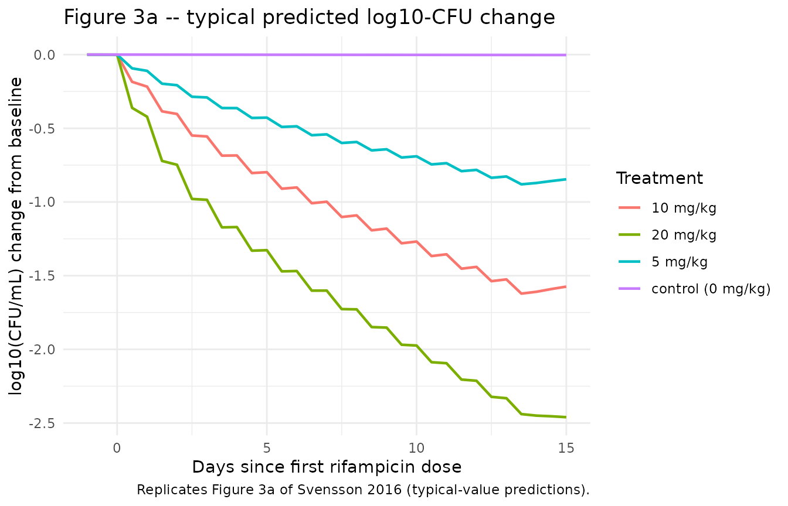
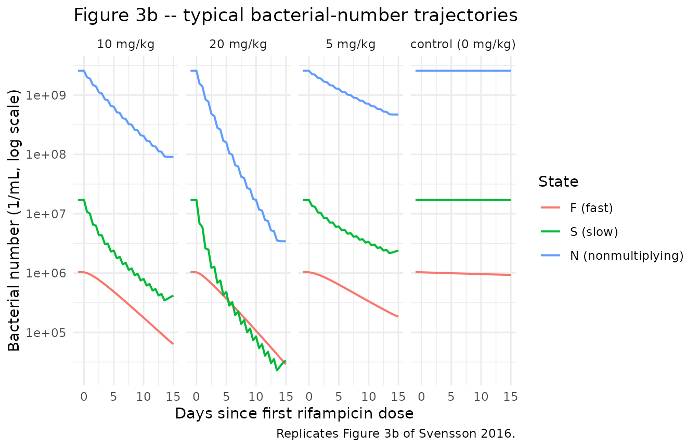
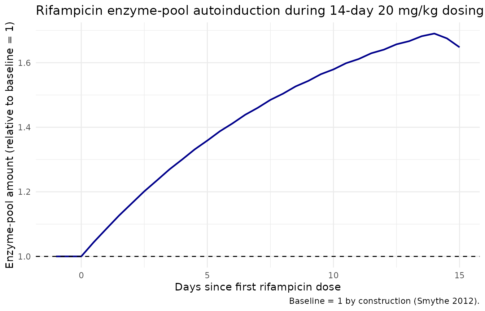

# Rifampicin + Multistate Tuberculosis Pharmacometric model (Svensson 2016)

## Model and source

``` r

ui <- rxode2::rxode(readModelDb("Svensson_2016_rifampicin"))
#> ℹ parameter labels from comments will be replaced by 'label()'
```

- Citation: Svensson R. J., Simonsson U. S. H. (2016). Application of
  the Multistate Tuberculosis Pharmacometric Model in Patients With
  Rifampicin-Treated Pulmonary Tuberculosis. CPT: Pharmacometrics &
  Systems Pharmacology 5(5):264-273. <doi:10.1002/psp4.12079>. PK
  structure (one-compartment + single transit + enzyme-pool
  autoinduction + Anderson-Holford NFM allometric scaling) adapted from
  Smythe et al. (2012) Antimicrob Agents Chemother 56(4):2091-2098
  <doi:10.1128/AAC.05792-11>. MTP disease model structure (three
  bacterial substates with time-dependent fast-to-slow transfer) from
  Clewe et al. (2016) J Antimicrob Chemother 71(4):964-974
  <doi:10.1093/jac/dkv478>.
- Description: Combined population PK/PD model for rifampicin in adults
  with drug-susceptible pulmonary tuberculosis: a one-compartment,
  single-transit, oral PK model with first-order
  plasma-concentration-driven autoinduction of clearance via an
  enzyme-pool turnover (structure from Smythe 2012) linked to the
  Multistate Tuberculosis Pharmacometric (MTP) three-state bacterial
  disease model (fast-, slow-, and nonmultiplying Mycobacterium
  tuberculosis states; structure from Clewe 2016) with rifampicin drug
  effects as fixed-at-100% on/off inhibition of fast-multiplying
  bacterial growth plus second-order plasma-concentration-driven death
  of slow- and nonmultiplying bacteria; all PK parameters and all MTP
  transfer/growth rates are fixed to the upstream-paper estimates, while
  the system carrying capacity Bmax (with 152% CV IIV) and the two
  second-order death rates SDk and NDk are re-estimated against 19
  patients from a 1966-1977 Kenyan rifampicin monotherapy trial.
- Article: <https://doi.org/10.1002/psp4.12079>
- Upstream PK paper (Smythe 2012):
  <https://doi.org/10.1128/AAC.05792-11>
- Upstream MTP paper (Clewe 2016): <https://doi.org/10.1093/jac/dkv478>

## Population

The Svensson 2016 PD dataset (Jindani et al. 1980) consists of 19
patients with treatment-naive drug-susceptible pulmonary tuberculosis
from Kenya, randomized to rifampicin oral monotherapy at 5 mg/kg (n=3),
10 mg/kg (n=8), or 20 mg/kg (n=8) once daily at 08:00 for 14 days, plus
a no-treatment negative-control arm (n=4) used to identify the
natural-history disease parameters. Sputum CFU was sampled every 2 days
during a 12-hour overnight window (8 PM-8 AM). Individual demographic
covariates were not recorded; all patients were assumed HIV-negative and
were assigned the Smythe 2012 cohort-mean weight (56 kg) and fat-free
mass (45 kg). All patients were assumed to be in stationary-phase
infection at trial entry, modelled as time = 150 days since infection.

The structural disease parameters and initial bacterial loads come from
the Clewe 2016 in vitro MTP model (Mycobacterium tuberculosis H37Rv
strain). The rifampicin PK-enzyme turnover structure and the FFM/WT NFM
allometric scaling come from the Smythe 2012 adult-tuberculosis cohort
(174 patients, South Africa / Senegal / Benin / Guinea).

The same information is available programmatically via
`ui$meta$population` (after
`ui <- rxode2::rxode(readModelDb("Svensson_2016_rifampicin"))`).

## Source trace

| Equation / parameter | Value | Source location |
|----|----|----|
| `lcl` CL/F (preinduced, 70 kg) | 10.0 L/h = 240 L/day | Svensson 2016 Table 2; Smythe 2012 Table 3 |
| `lvc` V/F (70 kg) | 86.7 L | Svensson 2016 Table 2; Smythe 2012 Table 3 |
| `lmtt` MTT | 0.713 h = 0.0297 day | Svensson 2016 Table 2; Smythe 2012 Table 3 |
| `nn_fix` Number of transit compartments | 1 | Svensson 2016 Table 2; Smythe 2012 Table 3 |
| `lemax` Emax (enzyme production induction) | 1.04 | Svensson 2016 Table 2; Smythe 2012 Table 3 |
| `lec50` EC50 | 0.0705 mg/L | Svensson 2016 Table 2; Smythe 2012 Table 3 |
| `lkenz` kENZ | 0.00369 /h = 0.0886 /day | Svensson 2016 Table 2; Smythe 2012 Table 3 |
| `lfdepot` F | 1.00 | Svensson 2016 Table 2 |
| `e_fat_cl` (Ffat)CL/F | 0.311 | Svensson 2016 Table 2; Smythe 2012 Table 3 |
| `e_fat_vc` (Ffat)V/F | 0.188 | Svensson 2016 Table 2; Smythe 2012 Table 3 |
| `lkg` kG (fast-growth) | 0.206 /day | Svensson 2016 Table 2; Clewe 2016 |
| `lkfn` kFN | 8.97e-7 /day | Svensson 2016 Table 2; Clewe 2016 |
| `lksn` kSN | 0.186 /day | Svensson 2016 Table 2; Clewe 2016 |
| `lksf` kSF | 0.0145 /day | Svensson 2016 Table 2; Clewe 2016 |
| `lkns` kNS | 0.00123 /day | Svensson 2016 Table 2; Clewe 2016 |
| `lkfslin` kFSlin | 0.00166 /day^2 | Svensson 2016 Table 2; Clewe 2016 |
| `lf0` F0 (initial fast) | 4.10 /mL | Svensson 2016 Table 2; Clewe 2016 |
| `ls0` S0 (initial slow) | 9770 /mL | Svensson 2016 Table 2; Clewe 2016 |
| `lbmax` Bmax (carrying capacity) | 2.61e9 /mL | Svensson 2016 Table 2 (estimated) |
| `fg_on_off` FG inhibition | 1.00 (on/off) | Svensson 2016 Table 2 (fixed at 1) |
| `lsdk` SDk | 0.200 L/mg/day | Svensson 2016 Table 2 (estimated) |
| `lndk` NDk | 0.106 L/mg/day | Svensson 2016 Table 2 (estimated) |
| `etalbmax` IIV Bmax | 152% CV (omega^2 = 1.197) | Svensson 2016 Table 2 |
| `addSd` residual error (combined) | 1.124 | Svensson 2016 Table 2 (e = 1.10 and e_repl = 0.231 folded) |
| MTP ODEs (3 bacterial states with time-dependent kFS) | n/a | Svensson 2016 Methods ‘The Multistate Tuberculosis Pharmacometric model’ |
| PK ODEs (single transit + central + enzyme pool) | n/a | Smythe 2012 Figure 1 and Eqs 1-3 |
| Drug-effect ODE injection | n/a | Svensson 2016 Methods ‘Drug effect’ and Figure 1 |
| Initial conditions: N(0) = 0 | n/a | Standard MTP convention (no nonmultiplying bacteria at infection); Clewe 2016 |
| Treatment-start time t = 150 days | n/a | Svensson 2016 Results paragraph 2 ‘time of entering trial was assumed to 150 days’ |

## Virtual cohort

Original observed data are not publicly redistributable. The simulation
below uses four single-subject typical-value cohorts (one per treatment
arm) matching the Svensson 2016 trial design, with body weight 56 kg and
fat-free mass 45 kg.

``` r

set.seed(20160517)

n_treatment_days <- 14L
infection_to_treatment_days <- 150  # Svensson 2016 Results paragraph 2

make_cohort <- function(id, dose_mgkg, dose_label,
                        wt_kg = 56, ffm_kg = 45,
                        n_doses = n_treatment_days,
                        t_first_dose = infection_to_treatment_days) {

  amt_mg <- dose_mgkg * wt_kg

  if (dose_mgkg > 0) {
    dose_rows <- data.frame(
      id    = id,
      time  = t_first_dose + (0:(n_doses - 1)),
      evid  = 1L,
      amt   = amt_mg,
      cmt   = "depot",
      WT    = wt_kg,
      FFM   = ffm_kg,
      treatment = dose_label,
      stringsAsFactors = FALSE
    )
  } else {
    dose_rows <- NULL
  }

  # Sparse during 0-149 day warm-up, dense during the 14-day treatment window
  # and a 2-day post-treatment tail (the simulation must start at t = 0 for the
  # MTP states to evolve from F0 / S0 / N0 to stationary phase before dosing).
  warmup_times <- c(0, 50, 100, 130, 145, 148, 149)
  treat_times  <- seq(t_first_dose,
                      t_first_dose + n_doses + 1,
                      by = 0.5)
  obs_times <- unique(sort(c(warmup_times, treat_times)))

  obs_rows <- data.frame(
    id    = id,
    time  = obs_times,
    evid  = 0L,
    amt   = 0,
    cmt   = NA_character_,
    WT    = wt_kg,
    FFM   = ffm_kg,
    treatment = dose_label,
    stringsAsFactors = FALSE
  )

  dplyr::bind_rows(dose_rows, obs_rows)
}

events <- dplyr::bind_rows(
  make_cohort(1L, dose_mgkg =  0, dose_label = "control (0 mg/kg)"),
  make_cohort(2L, dose_mgkg =  5, dose_label = "5 mg/kg"),
  make_cohort(3L, dose_mgkg = 10, dose_label = "10 mg/kg"),
  make_cohort(4L, dose_mgkg = 20, dose_label = "20 mg/kg")
) |>
  dplyr::arrange(id, time)

stopifnot(!anyDuplicated(unique(events[, c("id", "time", "evid")])))

knitr::kable(head(events, 8), caption = "First eight rows of the simulation event table.")
```

|  id | time | evid | amt | cmt |  WT | FFM | treatment         |
|----:|-----:|-----:|----:|:----|----:|----:|:------------------|
|   1 |    0 |    0 |   0 | NA  |  56 |  45 | control (0 mg/kg) |
|   1 |   50 |    0 |   0 | NA  |  56 |  45 | control (0 mg/kg) |
|   1 |  100 |    0 |   0 | NA  |  56 |  45 | control (0 mg/kg) |
|   1 |  130 |    0 |   0 | NA  |  56 |  45 | control (0 mg/kg) |
|   1 |  145 |    0 |   0 | NA  |  56 |  45 | control (0 mg/kg) |
|   1 |  148 |    0 |   0 | NA  |  56 |  45 | control (0 mg/kg) |
|   1 |  149 |    0 |   0 | NA  |  56 |  45 | control (0 mg/kg) |
|   1 |  150 |    0 |   0 | NA  |  56 |  45 | control (0 mg/kg) |

First eight rows of the simulation event table. {.table}

## Simulation

``` r

mod_full <- rxode2::rxode(readModelDb("Svensson_2016_rifampicin"))
#> ℹ parameter labels from comments will be replaced by 'label()'

# Typical-value simulation (Svensson 2016 Figure 3 shows TYPICAL predictions,
# not VPCs). zeroRe() drops the Bmax IIV so each id produces the typical-value
# trajectory for its dose group.
mod_typ <- mod_full |> rxode2::zeroRe()

sim <- rxode2::rxSolve(
  mod_typ,
  events = events,
  keep   = c("treatment", "WT", "FFM")
) |>
  as.data.frame()
#> ℹ omega/sigma items treated as zero: 'etalbmax'
#> Warning: multi-subject simulation without without 'omega'
```

## Replicate published figures

### Figure 3a – log-10 CFU change from baseline by dose

``` r

# Replicates Figure 3a of Svensson 2016: typical-value log10-CFU change from
# baseline vs. time since first dose, stratified by daily oral rifampicin dose.
sim_fig3a <- sim |>
  dplyr::filter(time >= infection_to_treatment_days - 1) |>
  dplyr::mutate(
    cfu_total = fast + slow,
    log10_cfu = log10(pmax(cfu_total, 1e-3)),
    days_since_first_dose = time - infection_to_treatment_days
  ) |>
  dplyr::group_by(id) |>
  dplyr::mutate(
    log10_cfu_baseline = log10_cfu[which.min(abs(days_since_first_dose))],
    delta_log10_cfu    = log10_cfu - log10_cfu_baseline
  ) |>
  dplyr::ungroup()

ggplot(sim_fig3a, aes(days_since_first_dose, delta_log10_cfu, color = treatment)) +
  geom_line(linewidth = 0.8) +
  labs(
    x = "Days since first rifampicin dose",
    y = "log10(CFU/mL) change from baseline",
    color = "Treatment",
    title = "Figure 3a -- typical predicted log10-CFU change",
    caption = "Replicates Figure 3a of Svensson 2016 (typical-value predictions)."
  ) +
  theme_minimal()
```



### Figure 3b – typical bacterial-state trajectories

``` r

# Replicates Figure 3b of Svensson 2016: typical model-predicted bacterial
# numbers for fast-, slow-, and nonmultiplying states, faceted by dose group.
sim_fig3b <- sim |>
  dplyr::filter(time >= infection_to_treatment_days - 1) |>
  dplyr::mutate(days_since_first_dose = time - infection_to_treatment_days) |>
  tidyr::pivot_longer(
    cols = c(fast, slow, nonm),
    names_to  = "state",
    values_to = "count"
  ) |>
  dplyr::mutate(state = factor(state,
                               levels = c("fast", "slow", "nonm"),
                               labels = c("F (fast)", "S (slow)", "N (nonmultiplying)")))

ggplot(sim_fig3b,
       aes(days_since_first_dose, pmax(count, 1e-3), color = state)) +
  geom_line(linewidth = 0.7) +
  facet_wrap(~treatment, nrow = 1) +
  scale_y_log10() +
  labs(
    x = "Days since first rifampicin dose",
    y = "Bacterial number (1/mL, log scale)",
    color = "State",
    title = "Figure 3b -- typical bacterial-number trajectories",
    caption = "Replicates Figure 3b of Svensson 2016."
  ) +
  theme_minimal()
```



### Stationary-phase sanity check at t = 150 days

The negative-control arm receives no rifampicin and should be at
stationary phase throughout the 14-day observation window (log10-CFU
change from baseline near zero). The Svensson 2016 prediction-corrected
VPC (Figure 2a) of the no-drug arm shows the same flat pattern.

``` r

fig_ctrl <- sim_fig3a |>
  dplyr::filter(treatment == "control (0 mg/kg)") |>
  dplyr::summarise(
    min_delta = min(delta_log10_cfu),
    max_delta = max(delta_log10_cfu),
    final_delta = delta_log10_cfu[which.max(days_since_first_dose)]
  )

knitr::kable(fig_ctrl,
             caption = "Negative-control (0 mg/kg) log10-CFU change from baseline summary.")
```

|  min_delta | max_delta | final_delta |
|-----------:|----------:|------------:|
| -0.0027542 | 0.0002208 |  -0.0027542 |

Negative-control (0 mg/kg) log10-CFU change from baseline summary.
{.table}

``` r


stopifnot(abs(fig_ctrl$max_delta - fig_ctrl$min_delta) < 0.5)
```

### Rifampicin PK – enzyme-pool autoinduction

A side-check that the Smythe 2012 PK-enzyme turnover layer is wired
correctly: in the 20 mg/kg arm, the enzyme pool should approach a new
steady state over ~40 days (5 half-lives at kENZ half-life ~8 days).
Since this trial is only 14 days long, autoinduction is incomplete at
end of treatment but is partially evident.

``` r

sim_pk <- sim |>
  dplyr::filter(treatment == "20 mg/kg",
                time >= infection_to_treatment_days - 1,
                time <= infection_to_treatment_days + n_treatment_days + 1) |>
  dplyr::mutate(days_since_first_dose = time - infection_to_treatment_days)

ggplot(sim_pk, aes(days_since_first_dose, enz_pool)) +
  geom_line(linewidth = 0.8, color = "darkblue") +
  geom_hline(yintercept = 1, linetype = "dashed") +
  labs(
    x = "Days since first rifampicin dose",
    y = "Enzyme-pool amount (relative to baseline = 1)",
    title = "Rifampicin enzyme-pool autoinduction during 14-day 20 mg/kg dosing",
    caption = "Baseline = 1 by construction (Smythe 2012)."
  ) +
  theme_minimal()
```



## Assumptions and deviations

- **Body weight and fat-free mass.** Individual demographics for the
  1966-1977 Jindani sputum cohort were not recorded. All four virtual
  subjects use WT = 56 kg and FFM = 45 kg, the Smythe 2012 cohort-mean
  values that Svensson 2016 Methods paragraph ‘Population
  pharmacokinetic model’ uses for every patient.
- **HIV status.** All patients are treated as HIV-negative. The Smythe
  2012 PK model includes a 30% increase in V/F for HIV-positive patients
  (V/F-HIV = 29.6% in Smythe 2012 Table 3) but Svensson 2016 explicitly
  assumes HIV- negative across the dataset and does not exercise that
  covariate. The current model file therefore does not register
  `HIV_POS` as a covariate. Users who want the full Smythe 2012 PK with
  HIV adjustment should extract Smythe 2012 separately.
- **Sputum sampling compartment.** Svensson 2016 chose a sputum-sample
  compartment that averages (fast + slow) over the 12-hour overnight
  collection window (8 PM-8 AM), reset via NONMEM data-record events at
  the start of each collection. The Results paragraph 6 states that the
  last-time-point and mid-time-point readouts of (fast + slow) at the
  collection time gave ‘similar OFV’ to the sample-compartment method.
  nlmixr2lib’s model file uses the instantaneous readout
  `Sputum_lnCFU <- log(fast + slow + 1e-6)` because (a) it is simpler to
  encode (no compartment-reset events in the data); (b) the paper itself
  states the difference is negligible; and
  3.  the sample-compartment method requires the user to supply
      per-sampling- interval reset events in their event table, which
      would be opaque for a library model.
- **Residual error model – two components folded into one.** Svensson
  2016 Table 2 reports two additive-on-log-scale residual components: a
  per- replicate error (e = 110% CV) and a within-sputum-sample error
  shared between technical replicates from the same sputum (e_repl =
  23.1% CV), implemented via the NONMEM L2 data item. nlmixr2lib has no
  idiomatic encoding for L2-style nested residuals; the two are folded
  into a single additive SD on log(CFU/mL) of sqrt(1.10^2 + 0.231^2) =
  1.124. Users running estimation against replicate-level CFU data
  should be aware that the combined SD will be wider than the
  per-replicate SD reported in the paper.
- **No PK observations.** The Svensson 2016 cohort has no rifampicin
  plasma concentration measurements; PK is reproduced typically (no IIV,
  no residual error) from the upstream Smythe 2012 model via the
  ‘population PK parameter’ approach (Zhang et al. 2003). The model file
  does not assign residual error to `Cc` because plasma concentration is
  an internal model state, not an observation; users wishing to estimate
  or simulate PK uncertainty should consult Smythe 2012 directly.
- **Initial bacterial conditions and treatment-start time.** F(0) =
  4.10/mL, S(0) = 9770/mL, N(0) = 0/mL at infection (t = 0 days);
  rifampicin treatment is assumed to begin at t = 150 days because the
  in vitro Clewe 2016 model predicts stationary phase by ~130 days. The
  simulation must run from t = 0 for the bacterial states to evolve
  naturally to stationary phase before dosing.
- **Mechanism-specific compartment names.** The MTP disease states use
  the paper-named compartments `fast`, `slow`, `nonm`, and `enz_pool`
  plus the paper-named observation `Sputum_lnCFU`. None of these are in
  the canonical compartment / observation-variable register;
  [`checkModelConventions()`](https://nlmixr2.github.io/nlmixr2lib/reference/checkModelConventions.md)
  emits warnings (not errors) for them. The compartment names match the
  source paper’s variable letters (F, S, N) and the in vitro Clewe 2016
  MTP framework; future MTP-style extractions (Clewe 2016 in vitro, Chen
  2014 mouse, etc.) will use the same names.
- **External-validation trials (Svensson 2016 Figure 4) not reproduced
  here.** The Sirgel 2005, Diacon 2007, and Rustomjee 2008 cohorts were
  used only to confirm out-of-sample predictive performance and do not
  change the parameter estimates; they can be simulated by replacing the
  `dose_mgkg` / `n_doses` parameters in the `make_cohort()` helper.
