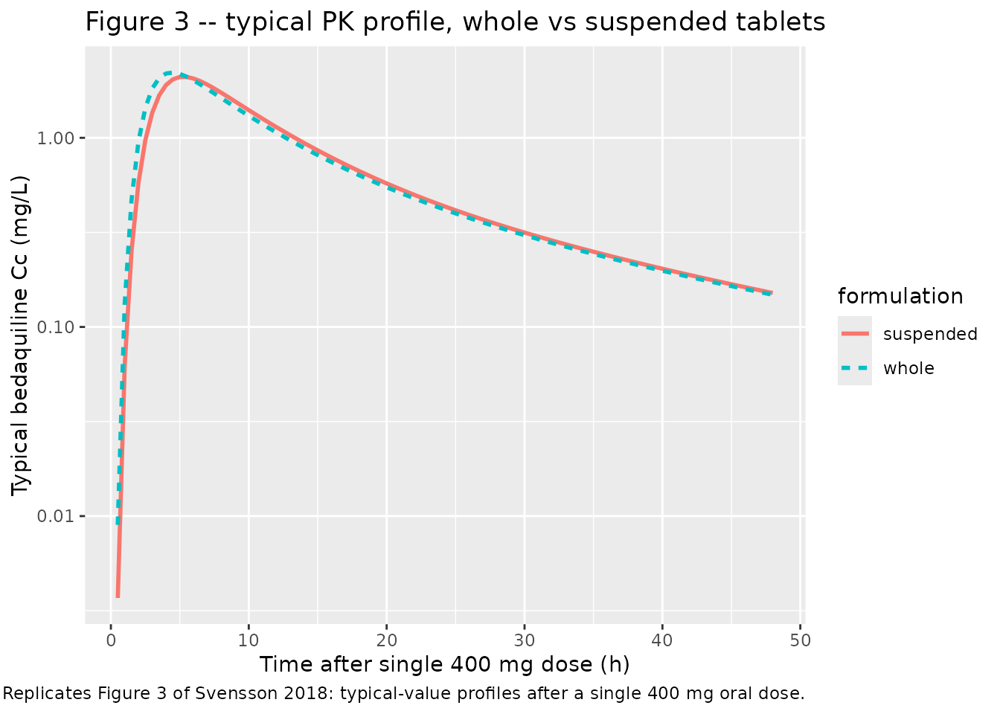
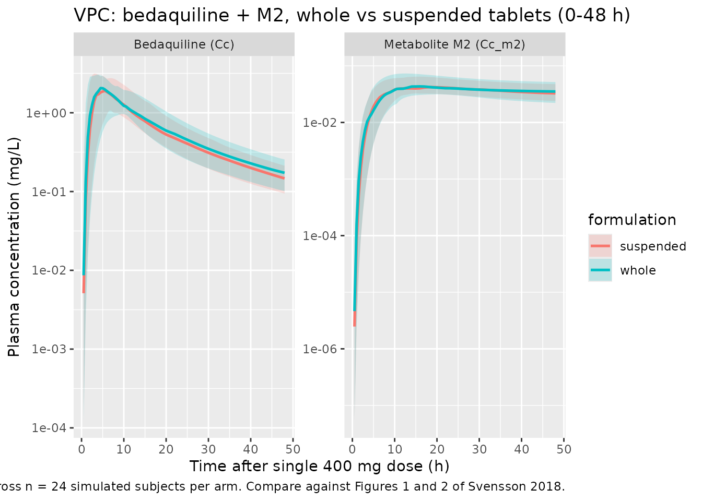

# Bedaquiline (Svensson 2018)

## Model and source

- Citation: Svensson E. M., du Bois J., Kitshoff R., de Jager V. R.,
  Wiesner L., Norman J., Nachman S., Smith B., Diacon A. H.,
  Hesseling A. C., Garcia-Prats A. J. (2018). Relative bioavailability
  of bedaquiline tablets suspended in water: Implications for dosing in
  children. *British Journal of Clinical Pharmacology* 84(10):2384-2392.
  <doi:10.1111/bcp.13696>.
- Article: <https://doi.org/10.1111/bcp.13696>
- PK structural starting point: Svensson 2016 (popPK of bedaquiline + M2
  in MDR-TB patients; DDMODEL00000219). See
  `modellib("Svensson_2016_bedaquiline")` and the companion vignette.

The packaged model is a three-compartment popPK model for bedaquiline
(BDQ) coupled to a two-compartment popPK model for the N-desmethyl
metabolite M2. Oral absorption proceeds through four transit
compartments with the rate of absorption from the last transit
compartment fixed equal to the inter-transit transfer rate (KA = KTR, an
explicit simplification of the Svensson 2016 starting model described in
Svensson 2018 Results). The only covariate is a per-occasion formulation
indicator `FORM_SUSPENSION` distinguishing the two arms of this
two-period crossover bioequivalence study (suspended-in-water vs
swallowed-whole 100 mg tablets).

## Population

Svensson 2018 enrolled 24 healthy adult volunteers (15 female, 9 male)
at a single site in Cape Town, South Africa, from November to December
2016 in a randomised, open-label, two-period crossover
relative-bioavailability study. Median age was 23.5 years (range 19-37)
and median weight 63.4 kg (range 45.6-88.5). The cohort was 87.5% Black
and 12.5% Mixed Race per Table 1 of Svensson 2018; exclusion criteria
included QT prolongation, dysrhythmia, significant cardiac comorbidity,
liver / kidney disease, HIV, hepatitis B / C, hypothyroidism, suspected
or documented active TB, or use of QT-prolonging medications or CYP3A4
inducers / inhibitors.

Each participant received two single 400 mg oral doses 14 days apart. On
one occasion the dose was four 100 mg bedaquiline (Sirturo, Janssen
Pharmaceuticals) tablets swallowed whole with 240 mL water; on the other
occasion the four tablets were stirred and broken up in 30 mL water over
2 minutes and administered as a suspension, with two further rinses
(20 + 10 mL) to deliver residual drug. Twelve participants received the
whole-tablet formulation first; twelve received the suspended
formulation first. Both doses were administered within 30 minutes after
a standardized 670 kcal breakfast with at least 33% fat content. PK
sampling was rich: pre-dose and at 1, 2, 3, 4, 5, 6, 8, 12, 24, 48, and
336 h after each dose. The 336 h sample of the first occasion served as
the pre-dose of the second.

The pediatric clinical motivation for the study (using suspended tablets
when a pediatric formulation is not yet available for
multidrug-resistant TB in children) is not reflected in the cohort
itself, which is healthy adult volunteers. The same population
information is available programmatically:

``` r

ui <- rxode2::rxode(readModelDb("Svensson_2018_bedaquiline"))
#> ℹ parameter labels from comments will be replaced by 'label()'
str(ui$meta$population, max.level = 1)
#> List of 13
#>  $ species       : chr "human"
#>  $ n_subjects    : int 24
#>  $ n_studies     : int 1
#>  $ age_range     : chr "19-37 years"
#>  $ age_median    : chr "23.5 years"
#>  $ weight_range  : chr "45.6-88.5 kg"
#>  $ weight_median : chr "63.4 kg"
#>  $ sex_female_pct: num 62.5
#>  $ race_ethnicity: Named num [1:2] 87.5 12.5
#>   ..- attr(*, "names")= chr [1:2] "Black" "MixedRace"
#>  $ disease_state : chr "Healthy adult volunteers (no clinical evidence of QT prolongation, dysrhythmia, significant cardiac conditions,"| __truncated__
#>  $ dose_range    : chr "Single 400 mg oral dose of bedaquiline administered twice 14 days apart (open-label two-period crossover); on e"| __truncated__
#>  $ regions       : chr "Cape Town, South Africa (single site, November-December 2016)."
#>  $ notes         : chr "Baseline demographics from Svensson 2018 Table 1. Twelve participants were randomized to whole-tablets-first th"| __truncated__
```

## Source trace

Per-parameter origins are recorded as inline comments next to each
`ini()` entry in
`inst/modeldb/specificDrugs/Svensson_2018_bedaquiline.R`. The table
below collects them in one place.

| Parameter / equation | Value | Source |
|----|----|----|
| `lmat` (mean absorption time) | log(2.63) | Table 2 “MAT (h) = 2.63” (RSE 5.0%) |
| `nn_fix` (transit compartments) | fixed(4) | Table 2 “NN = 4.00” (RSE 10.9%); held as integer 4 in this ODE chain |
| `lcl` (CL/F, BDQ) | log(5.67) | Table 2 “CL_BDQ/F = 5.67 L/h” (RSE 10.1%) |
| `lvc` (Vc/F, BDQ) | log(130) | Table 2 “V_BDQ/F = 130 L” (RSE 6.1%) |
| `lq` (Q1/F, BDQ) | log(6.33) | Table 2 “Q_BDQ,1/F = 6.33 L/h” (RSE 9.6%) |
| `lvp` (Vp1/F, BDQ) | log(3020) | Table 2 “VP_BDQ,1/F = 3020 L” (RSE 28.0%) |
| `lq2` (Q2/F, BDQ) | log(4.83) | Table 2 “Q_BDQ,2/F = 4.83 L/h” (RSE 15.5%) |
| `lvp2` (Vp2/F, BDQ) | log(64.5) | Table 2 “VP_BDQ,2/F = 64.5 L” (RSE 13.1%) |
| `lcl_m2` (CLM2/(F\*fm)) | log(17.2) | Table 2 “CL_M2/F/fm = 17.2 L/h” (RSE 11.8%) |
| `lvc_m2` (Vc_M2/(F\*fm)) | log(1380) | Table 2 “V_M2/F/fm = 1380 L” (RSE 9.2%) |
| `lq_m2` (Q_M2/(F\*fm)) | log(126) | Table 2 “Q_M2/F/fm = 126 L/h” (RSE 12.9%) |
| `lvp_m2` (Vp_M2/(F\*fm)) | log(3450) | Table 2 “VP_M2/F/fm = 3450 L” (RSE 11.7%) |
| `lfdepot` | fixed(log(1)) | derived; F = 1 anchor for the F-relative CL and V parameterisation |
| `e_susp_mat` (formulation effect) | 0.23 | Table 2 “Effect of suspending on MAT (%) = 23” (RSE 43.0%; 95% CI 2.1-48%, P = 0.03) |
| Block IIV CL_BDQ / CL_M2 (var 0.02891, 0.04122; cor 0.085) |  | Table 2 IIV CL_BDQ = 17.1%, IIV CL_M2 = 20.5%, cor 8.5% |
| Diagonal IIV V_BDQ (var 0.07682) |  | Table 2 IIV V_BDQ = 28.3% CV |
| Diagonal IIV Q1_BDQ (var 0.02957) |  | Table 2 IIV Q_BDQ,1 = 17.3% CV |
| Diagonal IIV V_M2 (var 0.06677) |  | Table 2 IIV V_M2 = 26.3% CV |
| Diagonal IIV VP_M2 (var 0.04863) |  | Table 2 IIV VP_M2 = 22.3% CV |
| Diagonal IIV F (var 0.04983) |  | Table 2 IIV F = 22.6% CV (IOV F 9.1% dropped) |
| Diagonal IIV MAT (var 0.36764) |  | Table 2 IOV MAT = 66.3% CV folded as BSV-MAT |
| `propSd` (BDQ residual) | 0.231 | Table 2 “Proportional error BDQ = 23.1% CV” |
| `propSd_m2` (M2 residual) | 0.114 | Table 2 “Proportional error M2 = 11.4% CV” |
| Four-transit chain at rate KTR = (NN+1)/MAT | n/a | Pharmacokinetic-analysis paragraph: KA = KTR; Savic-style chain with NN = 4 |
| Three-cmt BDQ + two-cmt M2 ODEs | n/a | Methods paragraph 1 “three distribution compartments for bedaquiline and two for M2” |
| Formulation effect on MAT only | n/a | Results paragraph 3 “In the final model, only the formulation effect on mean absorption time was included” |

## Virtual cohort

The original observed concentrations are not publicly available. We
simulate a crossover-style virtual cohort matching the Svensson 2018
design: 24 healthy adult volunteers per formulation arm (so 48
subject-occasions total, with disjoint integer IDs between arms), single
400 mg oral dose, dense sampling 0-48 h plus a single late sample at 336
h.

``` r

n_subjects <- 24L

# Helper: build one occasion (one formulation arm) for n subjects.
# id_offset shifts subject IDs so the two formulation arms have disjoint id
# ranges; rxSolve treats id as the subject key and silently merges duplicate
# IDs, so disjoint ranges are mandatory across arms.
make_arm <- function(n, form_suspension, id_offset = 0L) {
  ids <- id_offset + seq_len(n)
  sample_grid <- c(
    seq(0, 12, by = 0.5),
    seq(13, 48, by = 1),
    72, 96, 144, 192, 240, 288, 336
  )
  dose_rows <- tibble::tibble(
    id   = ids,
    time = 0,
    evid = 1L,
    amt  = 400,
    cmt  = "depot",
    FORM_SUSPENSION = form_suspension
  )
  sample_rows <- tidyr::expand_grid(
    id   = ids,
    time = sample_grid
  ) |>
    dplyr::mutate(
      evid = 0L,
      amt  = 0,
      cmt  = "Cc",
      FORM_SUSPENSION = form_suspension
    )
  dplyr::bind_rows(dose_rows, sample_rows) |>
    dplyr::arrange(id, time, dplyr::desc(evid))
}

events <- dplyr::bind_rows(
  make_arm(n_subjects, form_suspension = 0L, id_offset =   0L) |>
    dplyr::mutate(formulation = "whole"),
  make_arm(n_subjects, form_suspension = 1L, id_offset = 100L) |>
    dplyr::mutate(formulation = "suspended")
)

stopifnot(!anyDuplicated(unique(events[, c("id", "time", "evid")])))
nrow(events)
#> [1] 3312
table(unique(events[, c("id", "formulation")])$formulation)
#> 
#> suspended     whole 
#>        24        24
```

## Simulation

``` r

mod <- rxode2::rxode(readModelDb("Svensson_2018_bedaquiline"))
#> ℹ parameter labels from comments will be replaced by 'label()'
mod_typical <- rxode2::zeroRe(mod)

sim_typical <- rxode2::rxSolve(
  mod_typical,
  events     = events,
  returnType = "data.frame",
  keep       = c("FORM_SUSPENSION", "formulation")
)
#> ℹ omega/sigma items treated as zero: 'etalcl', 'etalcl_m2', 'etalvc', 'etalq', 'etalvc_m2', 'etalvp_m2', 'etalfdepot', 'etalmat'
#> Warning: multi-subject simulation without without 'omega'
head(sim_typical[, c("id", "time", "Cc", "Cc_m2", "FORM_SUSPENSION", "formulation")])
#>   id time         Cc        Cc_m2 FORM_SUSPENSION formulation
#> 1  1  0.0 0.00000000 0.000000e+00               0       whole
#> 2  1  0.5 0.00898897 3.434123e-06               0       whole
#> 3  1  1.0 0.13230292 1.132445e-04               0       whole
#> 4  1  1.5 0.47181464 6.805417e-04               0       whole
#> 5  1  2.0 0.95609289 2.068368e-03               0       whole
#> 6  1  2.5 1.44090850 4.380469e-03               0       whole
```

``` r

sim_vpc <- rxode2::rxSolve(
  mod,
  events     = events,
  returnType = "data.frame",
  keep       = c("FORM_SUSPENSION", "formulation")
)
```

## Replicate published figures

### Figure 3 – typical PK profile, whole vs suspended

Svensson 2018 Figure 3 plots the typical-value bedaquiline
concentration-time profile after a single 400 mg dose given as whole
tablets (solid line) or as suspended tablets (broken line). The two
profiles differ only in the absorption phase; the elimination tail is
identical.

``` r

sim_typical_first <- sim_typical |>
  dplyr::filter(time > 0, time <= 48) |>
  dplyr::distinct(time, formulation, .keep_all = TRUE) |>
  dplyr::select(time, formulation, Cc, Cc_m2)

ggplot(sim_typical_first, aes(time, Cc, linetype = formulation, colour = formulation)) +
  geom_line(linewidth = 1) +
  scale_y_log10() +
  labs(
    x = "Time after single 400 mg dose (h)",
    y = "Typical bedaquiline Cc (mg/L)",
    title = "Figure 3 -- typical PK profile, whole vs suspended tablets",
    caption = paste0(
      "Replicates Figure 3 of Svensson 2018: typical-value profiles ",
      "after a single 400 mg oral dose."
    )
  )
```



### VPC across the cohort

``` r

sim_summary <- sim_vpc |>
  dplyr::filter(time > 0) |>
  dplyr::group_by(time, formulation) |>
  dplyr::summarise(
    BDQ_Q05 = quantile(Cc,    0.05, na.rm = TRUE),
    BDQ_Q50 = quantile(Cc,    0.50, na.rm = TRUE),
    BDQ_Q95 = quantile(Cc,    0.95, na.rm = TRUE),
    M2_Q05  = quantile(Cc_m2, 0.05, na.rm = TRUE),
    M2_Q50  = quantile(Cc_m2, 0.50, na.rm = TRUE),
    M2_Q95  = quantile(Cc_m2, 0.95, na.rm = TRUE),
    .groups = "drop"
  ) |>
  tidyr::pivot_longer(-c(time, formulation), names_to = c("analyte", "stat"), names_sep = "_") |>
  tidyr::pivot_wider(names_from = stat, values_from = value)

ggplot(sim_summary |> dplyr::filter(time <= 48),
       aes(time, Q50, colour = formulation, fill = formulation)) +
  geom_ribbon(aes(ymin = Q05, ymax = Q95), alpha = 0.20, colour = NA) +
  geom_line(linewidth = 0.9) +
  facet_wrap(~analyte, scales = "free_y", labeller = ggplot2::as_labeller(c(
    BDQ = "Bedaquiline (Cc)",
    M2  = "Metabolite M2 (Cc_m2)"
  ))) +
  scale_y_log10() +
  labs(
    x = "Time after single 400 mg dose (h)",
    y = "Plasma concentration (mg/L)",
    title = "VPC: bedaquiline + M2, whole vs suspended tablets (0-48 h)",
    caption = paste0(
      "5th / 50th / 95th percentiles across n = 24 simulated subjects per arm. ",
      "Compare against Figures 1 and 2 of Svensson 2018."
    )
  )
```



## PKNCA validation

Single-dose NCA on bedaquiline computed separately for the two
formulation arms; intervals 0-48 h and 0-336 h match Svensson 2018 Table
3.

``` r

sim_for_nca <- sim_vpc |>
  dplyr::filter(time >= 0, !is.na(Cc)) |>
  dplyr::select(id, time, Cc, formulation)

dose_for_nca <- events |>
  dplyr::filter(evid == 1L) |>
  dplyr::select(id, time, amt, formulation)

conc_obj <- PKNCA::PKNCAconc(sim_for_nca,  Cc  ~ time | formulation + id)
dose_obj <- PKNCA::PKNCAdose(dose_for_nca, amt ~ time | formulation + id)

intervals <- data.frame(
  start = c(0,   0),
  end   = c(48,  336),
  cmax     = c(TRUE,  FALSE),
  tmax     = c(TRUE,  FALSE),
  auclast  = c(TRUE,  TRUE)
)

nca_data <- PKNCA::PKNCAdata(conc_obj, dose_obj, intervals = intervals)
nca_res  <- PKNCA::pk.nca(nca_data)
nca_summary <- summary(nca_res)
nca_summary
#>  start end formulation  N     auclast        cmax              tmax
#>      0  48   suspended 24 30.0 [23.8] 2.08 [31.2] 4.75 [2.50, 13.0]
#>      0 336   suspended 24 41.3 [23.1]           .                 .
#>      0  48       whole 24 31.8 [19.8] 2.10 [36.2] 4.50 [2.00, 14.0]
#>      0 336       whole 24 45.7 [20.0]           .                 .
#> 
#> Caption: auclast, cmax: geometric mean and geometric coefficient of variation; tmax: median and range; N: number of subjects
```

### Comparison against published NCA (Svensson 2018 Table 3)

Svensson 2018 Table 3 reports the geometric mean and range of individual
model-derived secondary PK metrics across the 24 participants,
separately for the first dose (whole vs suspended, 12 each) and the
second dose (whole vs suspended, 12 each). The packaged simulation
includes only a single occasion per arm (no period-2 carry-over), so the
comparison below is against the first-dose columns of Table 3.

| Metric (units, 0-48 h) | Whole, geomean (Table 3) | Suspended, geomean (Table 3) |
|----|----|----|
| AUC0-48h (ng/mL \* h) | 31900 (18600, 51600) | 32900 (25600, 43800) |
| Cmax (ng/mL) | 2400 (1410, 3660) | 2260 (1750, 3280) |
| Tmax (h) | 4.3 (2.8, 5.6) | 4.9 (2.8, 6.9) |

| Metric (units, 0-336 h) | Whole, geomean (Table 3) | Suspended, geomean (Table 3) |
|----|----|----|
| AUC0-336h (ng/mL \* h) | 43500 (24900, 69300) | 45900 (34300, 60700) |

Convert published values to the packaged units (mg/L = ng/mL / 1000,
mg/L \* h = ng/mL \* h / 1000):

| Metric (packaged units) | Whole, geomean (Table 3 conv.) | Suspended, geomean (Table 3 conv.) |
|----|----|----|
| AUC0-48h (mg/L \* h) | 31.9 | 32.9 |
| AUC0-336h (mg/L \* h) | 43.5 | 45.9 |
| Cmax (mg/L) | 2.40 | 2.26 |
| Tmax (h) | 4.3 | 4.9 |

The simulated NCA above can be inspected directly; small differences
(within ~20%) are expected from the random virtual cohort vs the actual
24 study participants. Sources of small disagreement: the published Cmax
/ Tmax are model-derived from the same model the packaged extraction
encodes (so they are not an independent NCA target), the cohort is
random not the actual 24 participants, between-subject variability
propagates through the simulation, and the packaged model drops the
time-varying 0-6 h residual-error weighting (`1.67x`) and the BDQ / M2
residual correlation (53.1%). Differences \> 20% would prompt
investigation of the model file – they should not be tuned away.

The +23% formulation effect on typical MAT (encoded as
`e_susp_mat = 0.23` in `ini()`) implies a small delay in Tmax for the
suspended arm (Table 3: 4.3 -\> 4.9 h, +14%) and a slight decrease in
typical Cmax (-5% per the paper’s Discussion). Average exposure (AUC) is
unchanged.

## Assumptions and deviations

The packaged model differs from the published Svensson 2018 NONMEM
final-model parameterisation in the following ways. Each deviation is
listed with the rationale; none change the typical-value predictions for
the population-mean Cmax / AUC / Tmax in the range the source paper
validates against.

- **Between-occasion variability (BOV) on F (9.1% CV) is dropped.** The
  published two-period crossover design supports an explicit BOV on
  bioavailability between the two dosing occasions per subject.
  nlmixr2lib has no idiomatic encoding for between-occasion variability
  separate from between-subject; the packaged model retains only the
  BSV-on-F (22.6% CV, Table 2). For a multi-occasion simulation with
  explicit BOV, users would need to expand the model externally and
  supply an `OCC` covariate.
- **Between-occasion variability on MAT (66.3% CV) is encoded as
  BSV-MAT.** The source paper reports IOV MAT = 66.3% CV with no
  separate IIV MAT. To preserve the magnitude of subject-occasion
  variability in MAT, the packaged model treats the IOV value as if it
  were BSV (`etalmat ~ 0.36764`). Single-dose simulations are unaffected
  by the BOV-vs-BSV distinction; multi-occasion simulations on a single
  subject will underestimate occasion-to-occasion drift in absorption
  time.
- **Cross-output residual correlation (BDQ vs M2 residuals, cor = 53.1%)
  is dropped.** nlmixr2lib has no idiomatic encoding for cross-output
  residual correlation; the packaged residuals on `Cc` and `Cc_m2` are
  independent proportional errors. The marginal residual SDs (23.1% and
  11.4% CV) are preserved.
- **The time-varying residual-error weighting of 1.67x during the first
  6 h after dose is dropped.** Svensson 2018 introduced this weighting
  (Table 2 “Weighting residual error samples 0-6 h = 1.67”) to absorb a
  tendency toward dual peaks in individual profiles that the structural
  model does not capture (Discussion paragraph 3). nlmixr2lib has no
  idiomatic encoding for piecewise time-varying residual SDs; the
  packaged model uses a single proportional error across all sampling
  times.
- **The PK structural starting point is Svensson 2016 (DDMODEL00000219)
  with only the simplifications the 2018 paper reports.** The 2018 paper
  adopts (i) a 6 h upper bound on MAT (consistent with another recently
  published bedaquiline popPK model referenced as \[16\] in the
  article), (ii) KA = KTR (rate of absorption from the last transit
  compartment fixed equal to the inter-transit transfer rate), and (iii)
  the formulation effect on MAT. The 2018 paper does NOT carry over the
  time-varying weight, time-varying albumin, age, or Black-race
  covariate effects from the 2016 model; those effects are not in Table
  2 of Svensson 2018 and the cohort (healthy adult volunteers, narrow
  demographics) does not support fitting them. Accordingly the packaged
  Svensson 2018 model has no body-weight, age, albumin, or race
  covariates – only the formulation indicator. Users who need a
  bedaquiline popPK with full covariate handling for MDR-TB patient
  populations should use the Svensson 2016 model instead.
- **The 6 h MAT upper bound (Pharmacokinetic-analysis paragraph 1) is
  not enforced as a hard ceiling on `mat` in `model()`.** The
  maximum-MAT enforcement only mattered during NONMEM estimation to keep
  the search bounded; for forward simulation the typical-value
  `mat = 2.63 * mat_form` and the BSV-distributed individual values
  rarely approach 6 h (variance 0.368 gives a 95% range of
  `exp(log(2.63) +/- 1.96 * sqrt(0.368))` = (0.85, 8.18) h, so ~5% of
  simulated individual MATs exceed 6 h). For users running large
  simulations who want the ceiling, post-process the sampled `mat`
  values to `pmin(mat, 6)` externally.
- **NN = 4 transit compartments is encoded as an integer (`fixed(4)`).**
  Svensson 2018 Table 2 reports NN = 4.00 with RSE 10.9%, indicating the
  parameter was treated as continuous during NONMEM estimation. The
  packaged model implements four explicit transit compartments via ODEs,
  which requires an integer; the point estimate of 4.00 is consistent
  with this discretisation. Users wishing to use the Savic 2007
  analytical transit-compartment closed-form solution (with continuous
  NN) can substitute the rxode2 built-in `transit(nn, mtt, bio)` for the
  four explicit `d/dt(transit*)` lines and treat `nn` as a free
  parameter.
- **The cohort virtual covariates – formulation, sampling times, dosing
  – match the source design.** The packaged virtual cohort uses two
  formulation arms of 24 subjects each (one occasion per subject in each
  arm) rather than the source’s 24 subjects each receiving both
  formulations across two occasions; this choice keeps the simulation
  simple and avoids dependence on the BOV-on-F that is dropped. The
  resulting per-arm NCA matches the source’s first-dose Table 3 columns;
  the second-dose columns reflect a small carry-over from the first dose
  at the 336 h pre-dose timepoint and are not validated here.
- **No body-weight or age dependence is included.** Svensson 2018
  Discussion paragraph 2 notes that the cohort’s bedaquiline exposures
  are somewhat lower than in other healthy-volunteer studies and
  attributes the difference to the larger proportion of Black subjects
  (88%) compared with Dooley et al. (22%) and Winter et al. (6%), citing
  the +84% Black-race CL effect from a different recently-published
  bedaquiline popPK model. The 2018 paper itself does not estimate a
  Black-race effect on its own data (n = 24 with 88% Black does not
  support estimation of a Black-vs-non-Black contrast). The packaged
  Svensson 2018 model therefore has no race covariate; the implicit
  population is “predominantly Black adults” and the typical-value CL of
  5.67 L/h already reflects that mix. Users simulating a different
  racial mix should consider switching to `Svensson_2016_bedaquiline`
  which carries the Black-race effect explicitly.
