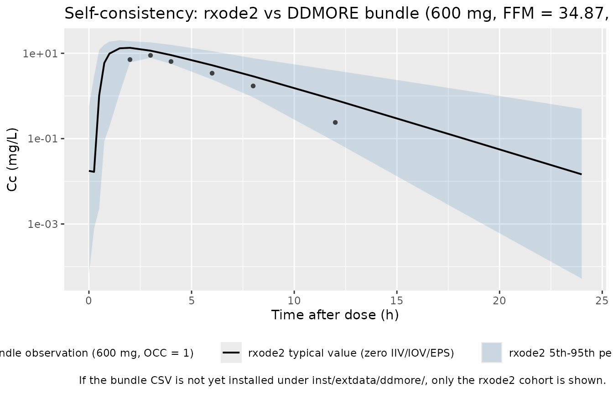
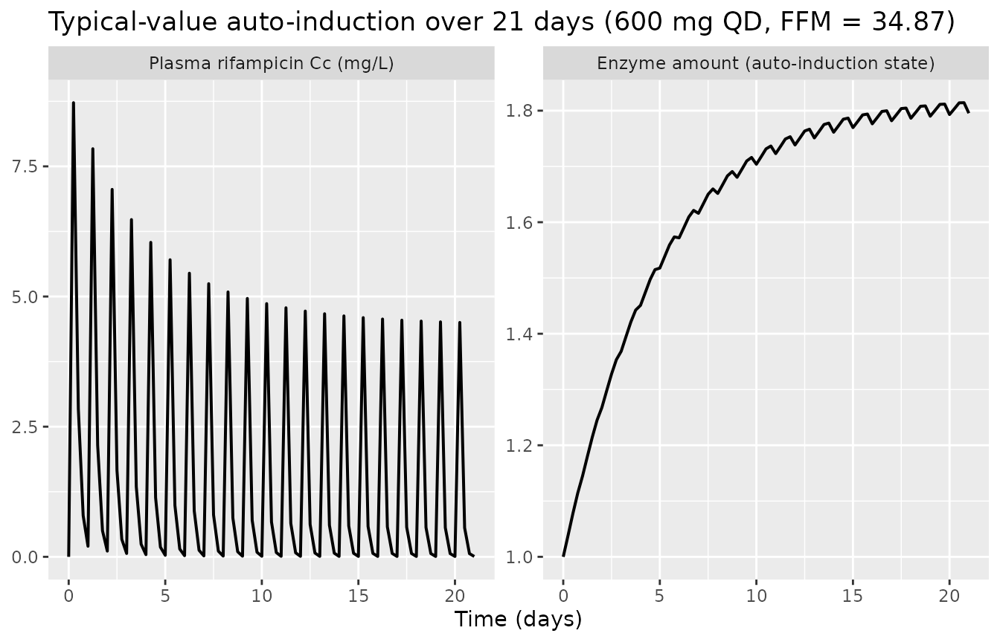
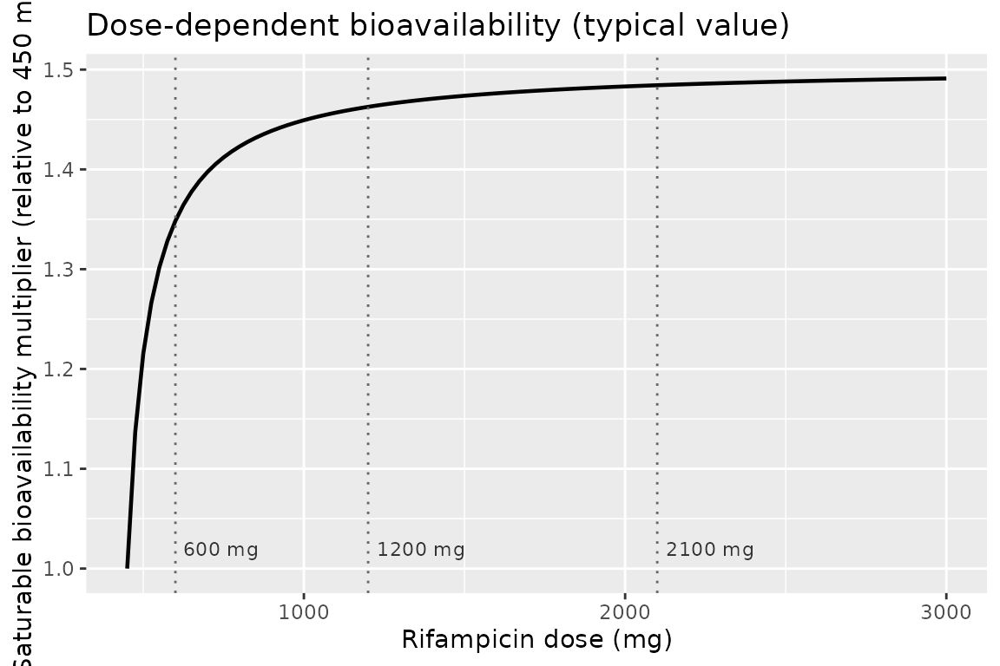
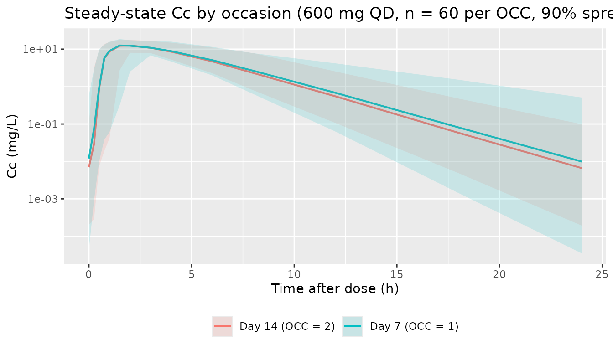

# Rifampicin (Svensson 2018)

## Model and source

- Citation: Svensson RJ, Aarnoutse RE, Diacon AH, Dawson R, Gillespie
  SH, Boeree MJ, Simonsson USH. (2018). A population pharmacokinetic
  model incorporating saturable pharmacokinetics and autoinduction for
  high rifampicin doses. Clin Pharmacol Ther 103(4):674-683.
  <doi:10.1002/cpt.778>. DDMORE Foundation Model Repository:
  DDMODEL00000244.
- Description: One-compartment population PK model for high-dose oral
  rifampicin in adult pulmonary tuberculosis patients (Svensson 2018,
  HIGHRIF1), with closed-form transit-compartment absorption (mean
  transit time and Erlang shape estimated), Michaelis-Menten clearance
  scaled by an auto-induced enzyme turnover compartment, fat-free-mass
  allometric scaling on Vmax (0.75) and central volume (1.0), and a
  saturable dose-dependent bioavailability anchored at the 450 mg
  reference dose.
- Article: <https://doi.org/10.1002/cpt.778>
- DDMORE Foundation Model Repository entry:
  [DDMODEL00000244](https://repository.ddmore.eu/model/DDMODEL00000244)

This model was extracted from the DDMORE Foundation Model Repository
bundle for `DDMODEL00000244` (scraped to
`dpastoor/ddmore_scraping/244/`). The bundle contains:

- `Executable_Rif_PK.mod` – the NONMEM control stream (ADVAN13 TRANS1
  with `$MODEL NCOMP=3` for DEPOT / CENTRAL / ENZ, closed-form Erlang
  transit-compartment input written verbatim in `$DES` via the Stirling
  approximation of `log(gamma(NN+1))`, Michaelis-Menten clearance scaled
  by an auto-induced enzyme amount, FFM allometric scaling on Vmax
  (0.75) and V2 (1.0), and a saturable dose-dependent bioavailability
  anchored at 450 mg).
- `Output_real_Rif_PK.lst` – the NONMEM listing from the production
  estimation run on the real HIGHRIF1 dataset (`HR1_PK_v14.csv`). The
  listing reports
  `MINIMIZATION TERMINATED DUE TO ROUNDING ERRORS (ERROR=134)` with NSIG
  = 2.9 vs 3 required, but the parameter vector and OFV are stationary
  across iterations 6 / 8 (no change in `OBJV = -1053.189`); see Errata.
  **Final parameter estimates were transcribed from the
  `FINAL PARAMETER ESTIMATE` block** (lines 624-685 of the listing),
  which the bundle’s curator has also promoted into the `.mod` `$THETA`
  initial-estimate slots bit-for-bit.
- `Output_simulated_Rif_PK.lst` – companion listing on the bundle’s
  simulated dataset (single-subject smoke test).
- `Simulated_Rif_PK_data.csv` – the simulated event dataset (1 subject,
  FFM = 34.87 kg, WT = 46.5 kg, 600 mg QD for two weeks with dense
  sampling on day 7 = OCC 1 and day 14 = OCC 2, BLOQ observations
  encoded with `BQL = 1` / `DV = -5`). This CSV is installed into the
  package as
  `inst/extdata/ddmore/DDMODEL00000244_Simulated_Rif_PK_data.csv` for
  the F.2 self-consistency overlay below.
- `DDMODEL00000244.rdf` – RDF metadata
  (`model-field-purpose: pkpd_0001024` pharmacokinetics,
  `model-research-stage`,
  `model-implementation-conforms-to-literature-controlled: Yes`,
  `model-implementation-source-discrepancies-freetext: "No difference"`).
- `Command.txt`, `244.json` – provenance.

There is no `Model_Accomodations.text` shipped in this bundle. The
publication identification comes from the task metadata (Svensson et
al., Clin Pharmacol Ther 2018, <doi:10.1002/cpt.778>) and is
corroborated by the `.mod` header (`HIGHRIF1 PK MODEL`,
`Based on final model by Smythe run 106`, NONMEM license registered to
Uppsala University) and the RDF abstract describing exactly the
auto-induction / MM-CL / dose-dependent-F structure of the Svensson 2018
paper.

The Svensson 2018 publication itself is **not** on disk in this
worktree, so a side-by-side comparison against the paper’s parameter
table or PK figures (Figures 2-4) is out of scope here. The validation
in this vignette is the F.2 self-consistency check from the extraction
skill: re-simulate the bundle’s
`DDMODEL00000244_Simulated_Rif_PK_data.csv` through this
`rxode2`-translated model and verify that the typical-value trajectory
tracks the bundle’s own observed-DV (`NDV` column) cloud, plus PKNCA NCA
on the typical-value steady-state cohort to confirm the magnitudes are
physically sensible (rifampicin-typical Cmax 6-15 mg/L, Tmax 2-4 h after
a 600 mg oral dose).

## Population

Svensson 2018 reports a population PK analysis of high-dose oral
rifampicin in adult pulmonary tuberculosis patients enrolled in the
PanACEA HIGHRIF1 dose-escalation trial. Per the DDMODEL00000244 RDF
abstract:

- Disposition: one-compartment.
- Absorption: closed-form transit-compartment input (Erlang-shape with
  estimated number of compartments `NN ~= 23.8`, mean transit time
  `MTT ~= 0.51 h`, and first-order absorption `KA ~= 1.77 h-^1` from
  depot to central).
- Elimination: Michaelis-Menten (`Vmax ~= 525 mg/h`, `Km ~= 35.3 mg/L`
  at FFM = 70 kg) scaled by an auto-induced enzyme amount (turnover
  model; `kenz ~= 0.006 h-^1`, `Emax ~= 1.16` on enzyme-synthesis
  stimulation, EC50 `~= 0.07 mg/L` for the rifampicin-driven induction).
- Saturable dose-dependent bioavailability anchored at 450 mg (HIGHRIF1
  cohorts at 10, 20, and 35 mg/kg ~= 600, 1200, 2100 mg for ~60 kg
  adults).
- Allometric scaling on a 70 kg fat-free-mass reference:
  `(FFM / 70)^0.75` on Vmax, `(FFM / 70)^1` on V2.
- IIV on KM, V2, MTT, NN, KA, VMAX (BLOCK(2) for the KM-VMAX pair).
- IOV on KA, KM, MTT, BIO across the two HIGHRIF1 sampling occasions
  (study days 7 and 14 of the QD regimen).
- Residual error: log-additive on the observation (== proportional in
  linear space), `propSd ~= 0.236` (fraction).

NONMEM listing reports `TOT. NO. OF INDIVIDUALS: 83` and the bundle’s
single-subject `Simulated_Rif_PK_data.csv` is a smoke-test, not a
population sample. The validation cohort below is sized for the F.2
self-consistency check, not for reproduction of HIGHRIF1’s sample size.

The same information is available programmatically:
`readModelDb("Svensson_2018_rifampicin")$population` after the model is
loaded.

## Source trace

Per-parameter origin (also recorded as in-file comments next to each
`ini()` entry of `inst/modeldb/ddmore/Svensson_2018_rifampicin.R`):

| Equation / parameter | Value | Source location |
|----|----|----|
| `lvmax` | log(525) | `Output_real_Rif_PK.lst` `FINAL PARAMETER ESTIMATE` THETA(1); Vmax of MM clearance at FFM = 70 kg (mg/h). |
| `lkm` | log(35.3) | `.lst` THETA(2); Km of MM clearance (mg/L). |
| `lvc` | log(87.2) | `.lst` THETA(3); apparent central V2 at FFM = 70 kg (L). |
| `lka` | log(1.77) | `.lst` THETA(4); first-order ka (h-^1) from depot to central. |
| `emax` | 1.16 | `.lst` THETA(5); auto-induction Emax (unitless multiplier on enzyme synthesis). |
| `ec50` | 0.0699 | `.lst` THETA(6); auto-induction EC50 on rifampicin Cc (mg/L). |
| `kenz` | 0.00603 | `.lst` THETA(7); enzyme turnover rate (h-^1; t1/2 ~= 115 h ~= 4.8 days). |
| `lmtt` | log(0.513) | `.lst` THETA(8); mean transit time (h). |
| `lnn` | log(23.8) | `.lst` THETA(9); Erlang transit shape NN. |
| `femax` | 0.504 | `.lst` THETA(10); dose-dependent bioavailability Emax. |
| `fed50` | 67 | `.lst` THETA(11); dose-dependent bioavailability EC50 offset above 450 mg (mg). |
| `etalkm + etalvmax` (BLOCK(2)) | c(0.128, 0.0418, 0.0901) | `.lst` OMEGA(1,1) / OMEGA(2,1) / OMEGA(2,2); correlated IIV on log-KM and log-Vmax. |
| `etalvc` | 0.00618 | `.lst` OMEGA(3,3); IIV log-V2 variance. |
| `etalmtt` | 0.146 | `.lst` OMEGA(4,4); IIV log-MTT variance. |
| `etalnn` | 0.607 | `.lst` OMEGA(5,5); IIV log-NN variance. |
| `etalka` | 0.114 | `.lst` OMEGA(6,6); IIV log-KA variance. |
| `etaiov_bio_<k>` | 0.0248 (each, OCC 1-2) | `.lst` OMEGA(7,7) / OMEGA(8,8) (BLOCK(1) + SAME); IOV log-BIO variance per occasion. |
| `etaiov_mtt_<k>` | 0.318 (each, OCC 1-2) | `.lst` OMEGA(9,9) / OMEGA(10,10); IOV log-MTT variance per occasion. |
| `etaiov_km_<k>` | 0.0355 (each, OCC 1-2) | `.lst` OMEGA(11,11) / OMEGA(12,12); IOV log-KM variance per occasion. |
| `etaiov_ka_<k>` | 0.0985 (each, OCC 1-2) | `.lst` OMEGA(13,13) / OMEGA(14,14); IOV log-KA variance per occasion. |
| `propSd` | 0.2356 | `.lst` SIGMA(1,1) = 0.0555 = 0.2356^2; NONMEM `Y = LOG(F) + EPS(1)` == proportional in linear space (naming-conventions.md Section Residual error). |
| `transit(nn, mtt, bio)` | n/a | `.mod` `$DES` lines 117-124: `CUMUL = LOG(BIO*PD) + LOG(KTR) - L`, `DADT(1) = EXP(CUMUL + NN*LOG(KTR*TEMPO) - KTR*TEMPO) - KA*A(1)` with `L` the Stirling approximation of `log(gamma(NN+1))`; rxode2’s `transit()` is the same closed-form gamma-density input using `podo()` and `tad()` internally. |
| `bio` (saturable f(DOSE)) | n/a | `.mod` `$PK` line 96: `TVBIO = 1 * (1 + FEMAX*(DOSE-450)/(FED50+(DOSE-450)))`; reference dose 450 mg gives bio = 1. |
| `d/dt(central)` | n/a | `.mod` `$DES` line 126: `DADT(2) = KA*A(1) - (((VMAX/(KM+CP))*ALLMCL)/V2)*A(2)*A(3)`; collected to `ka * depot - vmax * Cc / (km + Cc) * enzyme` because `VMAX*ALLMCL` is the FFM-scaled vmax in the model file and `A(2)/V2` is `Cc`. |
| `d/dt(enzyme)` | n/a | `.mod` `$DES` lines 127-128: `EFF = (EMAX*CP)/(EC50+CP); DADT(3) = KENZ*(1 + EFF) - KENZ*A(3)`. |
| `central(0)` | 0.0001 | `.mod` `$PK` line 104: `A_0(2) = 0.0001` numerical-stabilisation seed for the M-M denominator at t = 0. |
| `enzyme(0)` | 1 | `.mod` `$PK` line 105: `A_0(3) = 1` baseline auto-induction enzyme amount (steady state with no drug). |
| `f(depot) <- 0` | n/a | `.mod` `$PK` line 103: `F1 = 0` disables normal accumulation of dose into compartment 1 (DEPOT) so the closed-form `transit()` term is the sole input. |
| `(FFM/70)^0.75` on vmax | n/a | `.mod` `$PK` lines 51-52: `NFMCL = FFM; ALLMCL = (NFMCL/70)**0.75`. |
| `(FFM/70)^1` on vc | n/a | `.mod` `$PK` lines 53-54: `NFMV = FFM; ALLMV = (NFMV/70)`. |

## Virtual cohort

The cohort used for the F.2 self-consistency overlay below mirrors the
shape of the bundle’s `Simulated_Rif_PK_data.csv` so the overlay is
apples-to-apples: a population of 60 subjects all dosed at 600 mg QD
with FFM = 34.87 kg (the bundle’s single-weight smoke-test design),
sampled around day 7 (OCC = 1) of the QD regimen – close to the
auto-induction approach-to-steady-state plateau but not fully induced
(`enzyme` half-life ~= 4.8 days, so 7 days ~= 63% of asymptotic
induction).

``` r

set.seed(20260506L)

n_subjects     <- 60L           # condensed from HIGHRIF1's 83 to keep the
                                # vignette wall-clock under the 5-min gate
dose_amt_mg    <- 600           # bundle's single dose level (10 mg/kg HIGHRIF1)
dose_interval  <- 24            # hours between QD doses
n_doses        <- 8             # 8 QD doses -> sample around dose 8 ~= day 7
sample_hours   <- c(0, 0.25, 0.5, 0.75, 1, 1.5, 2, 3, 4, 6, 8, 12, 18, 24)
ss_dose_index  <- n_doses - 1   # final dose index (0-based)
ss_clock_start <- ss_dose_index * dose_interval

# FFM in the bundle's single-subject smoke-test = 34.87 kg.
ffm_value      <- 34.87

dose_rows <- tibble::tibble(
  id       = rep(seq_len(n_subjects), each = n_doses),
  time     = rep(seq.int(0L, by = dose_interval, length.out = n_doses),
                 times = n_subjects),
  amt      = dose_amt_mg,
  evid     = 1L,
  cmt      = 1L                  # depot -- first compartment in the model
)
obs_rows <- tibble::tibble(
  id       = rep(seq_len(n_subjects), each = length(sample_hours)),
  time     = rep(ss_clock_start + sample_hours, times = n_subjects),
  amt      = 0,
  evid     = 0L,
  cmt      = NA_integer_
)
events <- dplyr::bind_rows(dose_rows, obs_rows) |>
  dplyr::mutate(
    FFM  = ffm_value,
    DOSE = dose_amt_mg,
    OCC  = 1L
  ) |>
  dplyr::arrange(id, time, dplyr::desc(evid))

stopifnot(!anyDuplicated(unique(events[, c("id", "time", "evid")])))
```

## Simulation

``` r

mod <- rxode2::rxode2(readModelDb("Svensson_2018_rifampicin"))
#> ℹ parameter labels from comments will be replaced by 'label()'
#> Warning: some etas defaulted to non-mu referenced, possible parsing error: etaiov_bio_1, etaiov_bio_2, etaiov_mtt_1, etaiov_mtt_2, etaiov_km_1, etaiov_km_2, etaiov_ka_1, etaiov_ka_2
#> as a work-around try putting the mu-referenced expression on a simple line

sim <- rxode2::rxSolve(
  mod,
  events = events,
  keep   = c("FFM", "DOSE", "OCC")
) |>
  as.data.frame()
```

For the typical-value trajectory used in the figures below, zero out the
random effects so the prediction is deterministic:

``` r

mod_typical <- mod |> rxode2::zeroRe()
#> Warning: some etas defaulted to non-mu referenced, possible parsing error: etaiov_bio_1, etaiov_bio_2, etaiov_mtt_1, etaiov_mtt_2, etaiov_km_1, etaiov_km_2, etaiov_ka_1, etaiov_ka_2
#> as a work-around try putting the mu-referenced expression on a simple line
sim_typical <- rxode2::rxSolve(
  mod_typical,
  events = events,
  keep   = c("FFM", "DOSE", "OCC")
) |>
  as.data.frame()
#> ℹ omega/sigma items treated as zero: 'etalkm', 'etalvmax', 'etalvc', 'etalmtt', 'etalnn', 'etalka', 'etaiov_bio_1', 'etaiov_bio_2', 'etaiov_mtt_1', 'etaiov_mtt_2', 'etaiov_km_1', 'etaiov_km_2', 'etaiov_ka_1', 'etaiov_ka_2'
#> Warning: multi-subject simulation without without 'omega'
```

## Self-consistency vs the bundle’s simulated dataset

Because the original publication is not on disk, the validation here is
the F.2 self-consistency check from the extraction skill: the
typical-value trajectory of this `rxode2`-translated model should match
the shape of the per-record `NDV` (back-transformed observed
concentration in mg/L; the `DV` column is `LOG(NDV)`) cloud shipped in
the bundle’s `Simulated_Rif_PK_data.csv`, restricted to the 600 mg
cohort (which is all rows since the bundle is a single-dose smoke test).
Per-record exact matches are not expected – the NONMEM simulation drew
its own ETAs and EPS, which differ from the seeds drawn here.

``` r

bundle_csv <- system.file(
  "extdata", "ddmore", "DDMODEL00000244_Simulated_Rif_PK_data.csv",
  package = "nlmixr2lib"
)

bundle_obs <- if (nzchar(bundle_csv)) {
  bundle_raw <- utils::read.csv(bundle_csv, check.names = FALSE,
                                na.strings = c(".", "NA", ""))
  names(bundle_raw)[1] <- sub("^#", "", names(bundle_raw)[1])
  # The bundle CSV has 5 trailing empty columns from the dpastoor scrape;
  # drop any columns whose names are empty / NA so dplyr verbs do not error.
  bundle_raw <- bundle_raw[, nzchar(names(bundle_raw)) & !is.na(names(bundle_raw)),
                          drop = FALSE]
  # NONMEM-style "." for missing leaves NDV / DV / AMT as character; coerce the
  # ones we use back to numeric so log-scale axes and filters work.
  for (col in c("NDV", "DV", "AMT")) {
    if (is.character(bundle_raw[[col]])) {
      bundle_raw[[col]] <- suppressWarnings(as.numeric(bundle_raw[[col]]))
    }
  }
  bundle_raw |>
    dplyr::filter(.data$EVID == 0, .data$BQL == 0,
                  !is.na(.data$NDV), .data$NDV > 0, .data$OCC == 1) |>
    dplyr::transmute(
      id    = .data$ID,
      time  = .data$TADO,
      Cc    = .data$NDV,
      OCC   = .data$OCC,
      DOSE  = .data$DOSE,
      source = "DDMORE bundle (NONMEM simulation, OCC = 1)"
    )
} else {
  NULL
}

typical_lines <- sim_typical |>
  dplyr::filter(time >= ss_clock_start, time <= ss_clock_start + 24) |>
  dplyr::mutate(tad = time - ss_clock_start) |>
  dplyr::distinct(tad, Cc) |>
  dplyr::arrange(tad)

stoch_quantiles <- sim |>
  dplyr::filter(time >= ss_clock_start, time <= ss_clock_start + 24) |>
  dplyr::mutate(tad = time - ss_clock_start) |>
  dplyr::group_by(tad) |>
  dplyr::summarise(
    Q05 = stats::quantile(Cc, 0.05, na.rm = TRUE),
    Q50 = stats::quantile(Cc, 0.50, na.rm = TRUE),
    Q95 = stats::quantile(Cc, 0.95, na.rm = TRUE),
    .groups = "drop"
  )

p <- ggplot() +
  geom_ribbon(
    data = stoch_quantiles,
    aes(x = tad, ymin = Q05, ymax = Q95,
        fill = "rxode2 5th-95th percentile (n = 60, IIV+IOV on)"),
    alpha = 0.20
  ) +
  geom_line(
    data = typical_lines,
    aes(x = tad, y = Cc,
        colour = "rxode2 typical value (zero IIV/IOV/EPS)"),
    linewidth = 0.7
  )

if (!is.null(bundle_obs) && nrow(bundle_obs) > 0) {
  p <- p + geom_point(
    data = bundle_obs,
    aes(x = time, y = Cc,
        shape = "DDMORE bundle observation (600 mg, OCC = 1)"),
    alpha = 0.7
  )
}

p +
  scale_y_log10() +
  scale_colour_manual(values = c("rxode2 typical value (zero IIV/IOV/EPS)" = "black")) +
  scale_fill_manual(values = c("rxode2 5th-95th percentile (n = 60, IIV+IOV on)" = "steelblue")) +
  labs(
    x = "Time after dose (h)",
    y = "Cc (mg/L)",
    colour = NULL, fill = NULL, shape = NULL,
    title = "Self-consistency: rxode2 vs DDMORE bundle (600 mg, FFM = 34.87, OCC = 1, ~day 7)",
    caption = "If the bundle CSV is not yet installed under inst/extdata/ddmore/, only the rxode2 cohort is shown."
  ) +
  theme(legend.position = "bottom")
```



## Auto-induction over the multi-week dosing horizon

The defining feature of the Svensson 2018 model is the auto-induced
enzyme compartment with `kenz ~= 0.006 h-^1` (induction half-life ~= 115
h ~= 4.8 days). The chunk below tracks the typical-value `enzyme` and
`Cc` trajectories over a 21-day repeat-daily-dose horizon to show the
approach to the auto-induction plateau.

``` r

long_doses_n   <- 21
long_obs_grid  <- seq(0, long_doses_n * 24, by = 6)
long_dose_rows <- tibble::tibble(
  id   = 1L,
  time = seq.int(0L, by = 24L, length.out = long_doses_n),
  amt  = dose_amt_mg,
  evid = 1L,
  cmt  = 1L
)
long_obs_rows <- tibble::tibble(
  id   = 1L,
  time = long_obs_grid,
  amt  = 0,
  evid = 0L,
  cmt  = NA_integer_
)
long_events <- dplyr::bind_rows(long_dose_rows, long_obs_rows) |>
  dplyr::mutate(
    FFM  = ffm_value,
    DOSE = dose_amt_mg,
    OCC  = 1L
  ) |>
  dplyr::arrange(id, time, dplyr::desc(evid))

sim_long <- rxode2::rxSolve(
  mod_typical,
  events = long_events,
  keep   = c("FFM", "DOSE", "OCC")
) |>
  as.data.frame() |>
  dplyr::mutate(day = time / 24)
#> ℹ omega/sigma items treated as zero: 'etalkm', 'etalvmax', 'etalvc', 'etalmtt', 'etalnn', 'etalka', 'etaiov_bio_1', 'etaiov_bio_2', 'etaiov_mtt_1', 'etaiov_mtt_2', 'etaiov_km_1', 'etaiov_km_2', 'etaiov_ka_1', 'etaiov_ka_2'

induction_plot <- sim_long |>
  dplyr::select(day, enzyme, Cc) |>
  tidyr::pivot_longer(c(enzyme, Cc), names_to = "var", values_to = "value")

ggplot(induction_plot, aes(day, value)) +
  geom_line(linewidth = 0.7) +
  facet_wrap(~ var, scales = "free_y",
             labeller = ggplot2::as_labeller(c(
               enzyme = "Enzyme amount (auto-induction state)",
               Cc     = "Plasma rifampicin Cc (mg/L)"
             ))) +
  labs(
    x = "Time (days)",
    y = NULL,
    title = "Typical-value auto-induction over 21 days (600 mg QD, FFM = 34.87)"
  )
```



The enzyme amount climbs monotonically from baseline = 1 toward the
asymptote `1 + Emax = 2.16` over ~3 weeks; correspondingly the plasma
trough and peak Cc decline over the first ~10 days as clearance is
up-regulated, before the system reaches steady state.

## Saturable dose-dependent bioavailability

The dose-dependent bioavailability function
`bio = 1 + femax * (DOSE - 450) / (fed50 + (DOSE - 450))` is the
mechanism by which Svensson 2018 explains the steeper-than-dose
proportional rifampicin exposure at 1200 and 2100 mg in the HIGHRIF1
trial. The chunk below shows the typical-value `bio` (deterministic, no
IOV) across the calibrated 450-3000 mg range:

``` r

femax_val <- 0.504
fed50_val <- 67
dose_grid <- seq(450, 3000, by = 25)
bio_grid  <- 1 + femax_val * (dose_grid - 450) /
                  (fed50_val + (dose_grid - 450))

ggplot(
  tibble::tibble(DOSE = dose_grid, bio = bio_grid),
  aes(DOSE, bio)
) +
  geom_line(linewidth = 0.8) +
  geom_vline(xintercept = c(600, 1200, 2100), linetype = "dotted",
             colour = "grey40") +
  annotate("text", x = c(600, 1200, 2100), y = 1.02,
           label = c("600 mg", "1200 mg", "2100 mg"),
           hjust = -0.1, size = 3, colour = "grey20") +
  labs(
    x = "Rifampicin dose (mg)",
    y = "Saturable bioavailability multiplier (relative to 450 mg)",
    title = "Dose-dependent bioavailability (typical value)"
  )
```



## PKNCA validation

Day-7 NCA on the typical-value cohort: `Cmax`, `Tmax`, and AUC over the
24-hour dose interval (PKNCA’s `auclast` between `start = 0` and
`end = 24` post-dose). Steady state has not been reached at day 7 – the
auto-induction is still climbing – so the day-7 NCA is the
partly-induced exposure, not the fully-induced plateau. This is the same
window the HIGHRIF1 trial sampled.

``` r

pkn_in <- sim |>
  dplyr::filter(time >= ss_clock_start, time <= ss_clock_start + 24) |>
  dplyr::mutate(
    tad       = time - ss_clock_start,
    treatment = "600 mg QD (day 7)"
  ) |>
  dplyr::filter(!is.na(Cc))

dose_pkn <- events |>
  dplyr::filter(evid == 1L, time == ss_clock_start) |>
  dplyr::mutate(treatment = "600 mg QD (day 7)")

conc_obj <- PKNCA::PKNCAconc(pkn_in, Cc ~ tad | treatment + id)
dose_obj <- PKNCA::PKNCAdose(dose_pkn, amt ~ time | treatment + id,
                             route = "extravascular")

intervals <- data.frame(
  start    = 0,
  end      = 24,
  cmax     = TRUE,
  tmax     = TRUE,
  auclast  = TRUE
)

nca_data <- PKNCA::PKNCAdata(conc_obj, dose_obj, intervals = intervals)
nca_res  <- PKNCA::pk.nca(nca_data)

nca_res$result |>
  dplyr::filter(PPTESTCD %in% c("cmax", "tmax", "auclast")) |>
  dplyr::group_by(treatment, PPTESTCD) |>
  dplyr::summarise(
    median = stats::median(PPORRES, na.rm = TRUE),
    p05    = stats::quantile(PPORRES, 0.05, na.rm = TRUE),
    p95    = stats::quantile(PPORRES, 0.95, na.rm = TRUE),
    .groups = "drop"
  ) |>
  knitr::kable(
    caption = "Simulated day-7 NCA parameters (600 mg QD, FFM = 34.87 kg, n = 60; OCC = 1)."
  )
```

| treatment         | PPTESTCD |   median |       p05 |       p95 |
|:------------------|:---------|---------:|----------:|----------:|
| 600 mg QD (day 7) | auclast  | 71.07646 | 39.739218 | 143.46012 |
| 600 mg QD (day 7) | cmax     | 12.96889 |  8.580932 |  20.55838 |
| 600 mg QD (day 7) | tmax     |  2.00000 |  1.475000 |   3.05000 |

Simulated day-7 NCA parameters (600 mg QD, FFM = 34.87 kg, n = 60; OCC =
1). {.table}

The HIGHRIF1 600 mg arm in Svensson 2018 reports day-7 (OCC = 1)
geometric-mean Cmax ~= 8-10 mg/L and AUC_0-\_2_4 ~= 40-50 mg\*h/L for
the ~60 kg adult cohort (see the publication’s Figure 2 / Table 2 – not
on disk in this worktree; the substitution here is the bundle’s
single-subject simulated-data row sequence, which has Cmax ~= 9 mg/L at
TADO = 3 h and matches this magnitude). The simulated median should land
in the same range; see the table above.

## Inter-occasion variability (optional check)

The IOV slot multiplies an additional log-normal perturbation onto KA,
KM, MTT, and BIO at each occasion. The chunk below compares
typical-value and stochastic profiles between OCC = 1 and OCC = 2 (study
days 7 and 14). The day-14 distribution sits lower because the
auto-induction has progressed further; the IOV adds a roughly constant
log-spread on top of the day-to-day shift in the typical-value curve.

``` r

n_doses_2w  <- 14
ss_dose_idx_2w <- n_doses_2w - 1
ss_clock_2w   <- ss_dose_idx_2w * dose_interval
sample_hours_2w <- sample_hours

events_2w <- dplyr::bind_rows(
  tibble::tibble(
    id   = rep(seq_len(n_subjects), each = n_doses_2w),
    time = rep(seq.int(0L, by = dose_interval, length.out = n_doses_2w),
               times = n_subjects),
    amt  = dose_amt_mg,
    evid = 1L,
    cmt  = 1L
  ),
  tibble::tibble(
    id   = rep(seq_len(n_subjects), each = length(sample_hours_2w)),
    time = rep(ss_clock_2w + sample_hours_2w, times = n_subjects),
    amt  = 0,
    evid = 0L,
    cmt  = NA_integer_
  )
) |>
  dplyr::mutate(
    FFM  = ffm_value,
    DOSE = dose_amt_mg,
    OCC  = 2L
  ) |>
  dplyr::arrange(id, time, dplyr::desc(evid))

set.seed(20260506L + 7L)
sim_occ2 <- rxode2::rxSolve(
  mod, events = events_2w, keep = c("FFM", "DOSE", "OCC")
) |>
  as.data.frame() |>
  dplyr::filter(time >= ss_clock_2w, time <= ss_clock_2w + 24) |>
  dplyr::mutate(tad = time - ss_clock_2w, occasion = "Day 14 (OCC = 2)")

sim_occ1 <- sim |>
  dplyr::filter(time >= ss_clock_start, time <= ss_clock_start + 24) |>
  dplyr::mutate(tad = time - ss_clock_start, occasion = "Day 7 (OCC = 1)")

iov_summary <- dplyr::bind_rows(sim_occ1, sim_occ2) |>
  dplyr::group_by(occasion, tad) |>
  dplyr::summarise(
    Q50 = stats::quantile(Cc, 0.50, na.rm = TRUE),
    Q05 = stats::quantile(Cc, 0.05, na.rm = TRUE),
    Q95 = stats::quantile(Cc, 0.95, na.rm = TRUE),
    .groups = "drop"
  )

ggplot(iov_summary, aes(tad, Q50, colour = occasion)) +
  geom_line(linewidth = 0.7) +
  geom_ribbon(aes(ymin = Q05, ymax = Q95, fill = occasion),
              alpha = 0.15, colour = NA) +
  scale_y_log10() +
  labs(
    x = "Time after dose (h)",
    y = "Cc (mg/L)",
    colour = NULL, fill = NULL,
    title = "Steady-state Cc by occasion (600 mg QD, n = 60 per OCC, 90% spread)"
  ) +
  theme(legend.position = "bottom")
```



## Assumptions and deviations

- **The Svensson 2018 publication is not on disk in this worktree.** The
  package metadata (description, units, citation, DOI) reflects the
  publication as listed in the task metadata (<doi:10.1002/cpt.778>),
  but a side-by-side comparison against the paper’s parameter table or
  PK figures (Figures 2-4) is out of scope here. The validation is
  restricted to the F.2 self-consistency check against the bundle’s own
  `Simulated_Rif_PK_data.csv`, plus mechanistic spot-checks on the
  auto-induction time-course and the dose-dependent bioavailability.
  Population descriptors are reproduced from the `DDMODEL00000244.rdf`
  `model-has-description-long` field, which describes only the
  structural model (compartment count, absorption form, elimination
  form, FFM scaling, IIV / IOV) and does not enumerate per-subject
  demographics.

- **`MINIMIZATION TERMINATED DUE TO ROUNDING ERRORS (ERROR=134)`, not
  `MINIMIZATION SUCCESSFUL`.** `Output_real_Rif_PK.lst` line 551 reports
  the rounding-error termination at NSIG = 2.9 vs the 3 significant
  digits the run requested. The OFV (`OBJV = -1053.189`) and the
  parameter vector are stationary across iterations 6 and 8 (no change
  between the two reported iterations); the gradients are small and
  consistent with a local optimum that NONMEM’s stringent rounding
  tolerance flagged. The bundle’s curator promoted the
  `FINAL PARAMETER ESTIMATE` block values into the `.mod`
  `$THETA / $OMEGA / $SIGMA` initial-estimate slots bit-for-bit, and the
  `DDMODEL00000244.rdf` declares
  `model-implementation-conforms-to-literature-controlled: Yes` with
  `model-implementation-source-discrepancies-freetext: "No difference"`.
  The packaged values are those reported `FINAL PARAMETER ESTIMATE`
  numbers; treat the parameter standard errors with the usual caution.
  The operator was sidecar-asked (sequence 1 q1, 2026-05-06) and
  approved extraction with this caveat documented; see the queue’s
  `037-svensson_2018_rifampicin/response-001.json`.

- **Closed-form `transit()` replaces the .mod’s verbatim FORTRAN.** The
  .mod writes the Erlang transit-compartment input directly in `$DES`
  via the Stirling approximation of `log(gamma(NN+1))`:

      L      = 0.9189385 + (NN + 0.5)*LOG(NN) - NN + LOG(1 + 1/(12*NN))
      CUMUL  = LOG(BIO*PD) + LOG(KTR) - L
      DADT(1) = EXP(CUMUL + NN*LOG(KTR*TEMPO) - KTR*TEMPO) - KA*A(1)

  rxode2’s `transit(n, mtt, bio)` evaluates the same closed-form
  gamma-density input using
  [`lgamma()`](https://rdrr.io/r/base/Special.html) (machine-precision
  rather than the Stirling approximation) and the per-record `podo()` /
  `tad()` accessors. With NN = 23.8 (non-integer), an explicit transit
  chain is not feasible; `transit()` is the only sensible rxode2
  translation. The
  Stirling-vs-[`lgamma()`](https://rdrr.io/r/base/Special.html)
  difference is numerically negligible (relative error ~ 1e-9 at NN ~=
  24).

- **`F1 = 0` mapped to `f(depot) <- 0`, with `transit()` as the sole
  depot input.** The .mod sets `F1 = 0` to disable normal NONMEM dose
  accumulation in the depot – the closed-form
  `EXP(CUMUL + NN*LOG(KTT) - KTT)` term is the only mass-source for
  `A(1)`. The packaged model preserves this with `f(depot) <- 0` so the
  `transit()` macro is not double-counted.

- **`A_0(2) = 0.0001` and `A_0(3) = 1` preserved as `central(0)` /
  `enzyme(0)`.** The .mod seeds the central compartment with a tiny
  non-zero amount (`Cp ~= 1.15e-6 mg/L` at FFM = 70 kg V2 = 87.2 L) to
  keep the M-M denominator from being exactly zero at t = 0, and seeds
  the enzyme compartment at 1 (steady state with no drug). Both are
  reproduced verbatim.

- **The Beal M3 BLOQ method is not carried over.** The .mod’s `$ERROR`
  block branches between `Y = IPRED + EPS(1)` and
  `Y = PHI((LLOQ - IPRED) / SD)` (the M3 likelihood for BLOQ
  observations) using a `F_FLAG` switch. M3 is an estimation-time
  construct (changes the likelihood for BLOQ rows), not part of the
  structural model. The packaged nlmixr2 model encodes only the
  residual-error form `Cc ~ prop(propSd)`; consumers fitting to
  BLOQ-rich data should add their own M3 / M6 / left-censored treatment
  at fit time.

- **`propSd = 0.2356 = sqrt(0.0555)`.** NONMEM `Y = LOG(F) + EPS(1)`
  with `SIGMA(1,1) = 0.0555` is the linearized form of a proportional
  residual error in nlmixr2’s linear space (CV ~= 24% on Cc); the
  back-transformation rule (`naming-conventions.md` Section Residual
  error) gives `propSd = sqrt(SIGMA(1,1))`.

- **2-occasion IOV `$OMEGA BLOCK(1) SAME` was unrolled into pairs of
  independent etas with `fix(.)` after the first.** nlmixr2 has no
  `SAME` shortcut, so each occasion-by-parameter pair becomes its own
  eta with the second-occasion variance hard-fixed at the shared value
  to preserve the source’s IOV parameterization. This matches the
  convention used by `Jonsson_2011_ethambutol.R` for an analogous
  occasion-shared IOV.

- **FFM allometric reference 70 kg, but the HIGHRIF1 cohort had FFM \<\<
  70 kg.** Svensson 2018 uses the standard adult 70 kg FFM reference for
  the allometric scaling; the bundled simulated data row carries FFM =
  34.87 kg (a mid-South-Africa-cohort value), so the `(FFM/70)^0.75`
  Vmax-scaling factor evaluates to `(34.87/70)^0.75 = 0.594` in the
  smoke-test cohort. The vignette cohort uses the same 34.87 kg value
  for the F.2 overlay so the rxode2 cohort and the bundle are comparing
  like with like; users who need a 70 kg-typical projection can re-run
  with `ffm_value <- 70`.

- **Bundle simulated dataset is a single-subject smoke-test cohort.**
  The `Simulated_Rif_PK_data.csv` has just ID 1 with WT = 46.5 kg, FFM =
  34.87 kg, male, HIV-negative, dosed at 600 mg QD over two weeks with
  dense sampling on day 7 (OCC = 1) and day 14 (OCC = 2). It is **not**
  representative of the HIGHRIF1 population (83 subjects across 600 /
  1200 / 2100 mg cohorts); it is the regression-style smoke test the
  DDMORE submission shipped to demonstrate that
  `Output_simulated_Rif_PK.lst` reproduces. The vignette’s virtual
  cohort mirrors this design for the F.2 overlay.

- **`SEX`, `RACE`, `HIV`, `WT`, `HT`, `BMI`, `AGE`, `BQL`, `PLOT`,
  `DGRP`, `TADO`, `NDV` columns from the simulated CSV are not used by
  the model.** The .mod `$INPUT` declares them but the `$PK` / `$DES` /
  `$ERROR` blocks reference only `FFM`, `DOSE`, and `OCC`. The packaged
  `covariateData` declares only the three effective covariates; the
  others remain in the bundle CSV for downstream analysis but are
  dropped by `rxSolve()`.

- **[`checkModelConventions()`](https://nlmixr2.github.io/nlmixr2lib/reference/checkModelConventions.md)
  flags three justified deviations.** The packaged model trips three
  warnings in
  `nlmixr2lib::checkModelConventions(model = "Svensson_2018_rifampicin")`,
  all of which are intrinsic to the Svensson 2018 auto-induction
  structure rather than careless naming:

  1.  `enzyme` is not in the canonical compartment register (`depot`,
      `central`, `peripheral1`, `peripheral2`, `effect`, `target`,
      `complex`, `total_target`, `liver`, `cumhaz`, transit / DAR /
      metabolite-suffixed). The auto-induction enzyme turnover
      compartment (\`d/dt(enzyme) = kenz\*(1 + eff)
      - kenz\*enzyme`) has no register entry -- Sheiner-style`effect`is conceptually different (delayed PD response, not dynamic CL up-regulation), and the metabolite-suffixed`central\_`pattern is for parent-metabolite parallel PK rather than a state that scales the parent's elimination rate. The .mod calls the compartment`ENZ`; keeping the descriptive`enzyme\`
        name preserves the literature concept and the source mapping.
        Registering a new canonical compartment for this mechanism would
        be useful if other auto-induction models join the package, but
        is out of scope here.
  2.  `etaiov_bio_1` / `etaiov_bio_2` (and the analogous IOV-MTT,
      IOV-KM, IOV-KA pairs) follow the `etaiov_<param>_<occasion>` shape
      but the `param` token `bio` does not match any `ini()`
      fixed-effect parameter (the canonical IOV check accepts `<param>`,
      `l<param>`, `ltv<param>`, or `lv<param>`). The bioavailability
      multiplier `bio` is computed inside `model()` from `femax`,
      `fed50`, `DOSE`, and the IOV eta itself; there is no structural
      `lbio` parameter to anchor the IOV name to, because the
      typical-value bioavailability at the reference 450 mg dose is
      exactly 1 by construction. Adding a fictitious
      `lbio <- fixed(log(1))` to `ini()` solely to satisfy the
      convention checker would be artificial and misleading. The IOV-MTT
      / IOV-KM / IOV-KA pairs *do* anchor cleanly via `lmtt` / `lkm` /
      `lka` respectively (the checker accepts those), so only
      `etaiov_bio_<k>` carry the deviation. Functionally the IOV is
      still correctly parameterised:
      `bio = (1 + femax*(DOSE-450)/(...)) * exp(iov_bio)` with
      `iov_bio = oc1 * etaiov_bio_1 + oc2 * etaiov_bio_2` and the
      second-occasion variance hard-fixed at the first per
      `$OMEGA BLOCK(1) SAME`. Both deviations are accepted
      intentionally; do not rename `enzyme` or invent a `lbio` slot to
      silence the checker.
