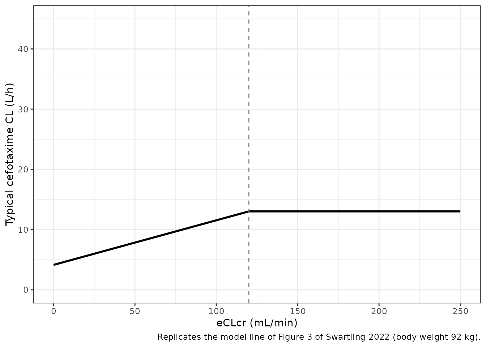
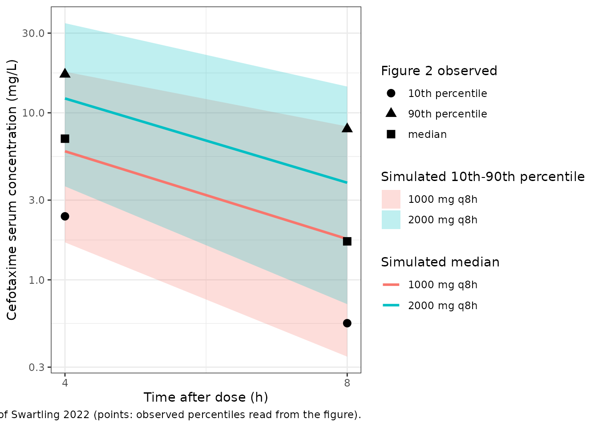

# Cefotaxime (Swartling 2022)

## Model and source

- Citation: Swartling M, Smekal AK, Furebring M, Lipcsey M, Jonsson S,
  Nielsen EI. Population pharmacokinetics of cefotaxime in intensive
  care patients. Eur J Clin Pharmacol. 2022;78(2):251-258.
  <doi:10.1007/s00228-021-03218-6>
- Description: Two-compartment intravenous population PK model for
  cefotaxime in critically ill adult ICU patients not on renal
  replacement therapy (Swartling 2022; ACCIS study, 51 patients at seven
  Swedish ICUs including one burn unit). Clearance and
  intercompartmental clearance scale allometrically with body weight at
  ICU admission (fixed exponent 0.75, reference 92 kg) and both volumes
  scale linearly with it. Clearance increases linearly with
  Cockcroft-Gault estimated creatinine clearance (centred at 94 mL/min)
  up to 120 mL/min and is flat above it. A single random effect is
  shared by clearance and central volume, scaled by an estimated factor
  on the central volume (IIV 49% on CL, 64% on Vc); residual error is
  proportional.
- Article: <https://doi.org/10.1007/s00228-021-03218-6> (open access,
  PMC8748331)
- Online Resource 2 (final NONMEM control stream) and Online Resource 1
  (MAP-estimation precision, Table S1) are published with the article.

``` r

mod <- rxode2::rxode(readModelDb("Swartling_2022_cefotaxime"))
#> ℹ parameter labels from comments will be replaced by 'label()'
mod
#>  ── rxode2-based free-form 2-cmt ODE model ────────────────────────────────────── 
#>  ── Initalization: ──  
#> Fixed Effects ($theta): 
#>          lcl          lvc          lvp           lq    e_wt_cl_q   e_wt_vc_vp 
#>     2.406945     1.635106     2.901422     2.674149     0.750000     1.000000 
#>    e_crcl_cl     crcl_cap scale_etalvc       propSd 
#>     6.670000   120.000000     1.310000     0.333000 
#> 
#> Omega ($omega): 
#>        etalcl
#> etalcl 0.2401
#> attr(,"lotriLabels")
#> [1] "0.49^2; Swartling 2022 Table 2: IIV CL 49% CV (RSE 15%, shrinkage 0.8%)"
#> attr(,"lotriFix")
#>        etalcl
#> etalcl  FALSE
#> 
#> States ($state or $stateDf): 
#>   Compartment Number Compartment Name
#> 1                  1          central
#> 2                  2      peripheral1
#>  ── μ-referencing ($muRefTable): ──  
#>   theta    eta level covariates
#> 1   lcl etalcl    id           
#> 
#>  ── Model (Normalized Syntax): ── 
#> function() {
#>     compartmentData <- list(central = list(analyte = "cefotaxime", 
#>         units = "mg", specimen = "serum", verified = TRUE), peripheral1 = list(analyte = "cefotaxime", 
#>         units = "mg", specimen = "serum", verified = FALSE))
#>     covariateData <- list(WT = list(description = "Body weight at ICU admission", 
#>         units = "kg", type = "continuous", reference_category = NULL, 
#>         notes = "Swartling 2022 enters body weight AT ICU ADMISSION (control-stream column BWAI) as a time-independent covariate, added before the other covariates on allometric principles ('Pharmacokinetic modelling' section): CL and Q scale as (WT/92)^0.75 and Vc and Vp as (WT/92). The reference 92 kg is the Table 1 cohort median (IQR 81-102, range 55-124). The paper chose ICU-admission weight deliberately because weight gained from resuscitation fluids may reflect volume of distribution. Missing values (7 patients) were imputed by linear regression on the weight before ICU admission (Table 1 median 87 kg, range 55-123), which is a separate column (BWBI) not used by the final model.", 
#>         source_name = "BWAI"), CRCL = list(description = "Estimated creatinine clearance by the Cockcroft-Gault formula computed with body weight at ICU admission; raw mL/min, NOT BSA-normalized", 
#>         units = "mL/min", type = "continuous", reference_category = NULL, 
#>         notes = "Swartling 2022 tests eCLcr (Cockcroft-Gault, reference 18) as a TIME-DEPENDENT covariate on CL, carried forward to the next observation without interpolation (first value carried backward). Online Resource 2 names the column COGBWA (Cockcroft-Gault on body weight at ICU admission); the Table 1 footnote confirms the formula used body weight at ICU admission. Centring value 94 mL/min is the Table 1 median over treatment days 1-3 (IQR 65-138, range 5-258; day 1 median 85, day 2 97, day 3 105). The final model is piecewise linear with a slope fixed to zero above 120 mL/min, which the paper states is equivalent to truncating eCLcr at 120 mL/min. Creatinine was drawn routinely at 6 a.m., so the value paired with a cefotaxime sample may lag it by up to 24 h. Supply the raw (un-normalized) Cockcroft-Gault value; a BSA-normalized eGFR would rescale the effect.", 
#>         source_name = "COGBWA"))
#>     covariatesDataExcluded <- list(DIS_BURN_RECENT = list(description = "Treated in the burn-unit ICU (1) versus a general ICU (0)", 
#>         units = "(binary)", type = "binary", reference_category = "0 (general ICU)", 
#>         notes = "Tested as a time-independent categorical covariate on the volume parameters because V in burn patients may differ from other ICU patients; not retained after eCLcr entered on CL ('Inclusion of the other covariates (e.g. burn patients) after inclusion of eCLcr as a covariate did not significantly improve the model'). 18 of 51 patients (35%) were treated in the burn unit. Control-stream column BURN.", 
#>         source_name = "BURN"), TRTDAY = list(description = "Day of antibiotic treatment (1, 2 or 3), categorical", 
#>         units = "(day)", type = "categorical", reference_category = NULL, 
#>         notes = "Tested as a time-dependent categorical covariate on the volume parameters and CL. The Discussion reports it was statistically significant (p < 0.05) before eCLcr entered on CL, but it was not retained in the final model. Only 34 of 51 patients had day-3 samples.", 
#>         source_name = "day of treatment"), SAPS3 = list(description = "Simplified Acute Physiology Score 3 at ICU admission", 
#>         units = "(score)", type = "continuous", reference_category = NULL, 
#>         notes = "Tested as a continuous covariate on CL to capture non-renal factors; not retained. Table 1 median 55 (IQR 47-63, range 25-89). Two missing values were imputed with the population mean.", 
#>         source_name = "SAPS3"))
#>     description <- "Two-compartment intravenous population PK model for cefotaxime in critically ill adult ICU patients not on renal replacement therapy (Swartling 2022; ACCIS study, 51 patients at seven Swedish ICUs including one burn unit). Clearance and intercompartmental clearance scale allometrically with body weight at ICU admission (fixed exponent 0.75, reference 92 kg) and both volumes scale linearly with it. Clearance increases linearly with Cockcroft-Gault estimated creatinine clearance (centred at 94 mL/min) up to 120 mL/min and is flat above it. A single random effect is shared by clearance and central volume, scaled by an estimated factor on the central volume (IIV 49% on CL, 64% on Vc); residual error is proportional."
#>     population <- list(species = "human", n_subjects = 51L, n_studies = 1L, 
#>         n_sites = 7L, n_concentrations = 263L, age_range = "23-90 years", 
#>         age_median = "64 years (IQR 50-73)", weight_range = "55-124 kg (body weight at ICU admission)", 
#>         weight_median = "92 kg (IQR 81-102) at ICU admission", 
#>         sex_female_pct = 35, disease_state = "Critically ill adults (>18 years) in the intensive care unit treated with cefotaxime for a proven or suspected infection, 18 in a burn-unit ICU and 33 in general ICUs. Most common infections: lower respiratory tract (59%), skin and soft tissue (25%), urinary tract (8%). SAPS3 at admission median 55 (range 25-89). Pregnant patients, patients with treatment restrictions and patients on renal replacement therapy were excluded.", 
#>         dose_range = "Cefotaxime 1000-3000 mg as a 5-min IV infusion, 2-6 times daily, at physician discretion; most common 1000 mg t.i.d. followed by 2000 mg t.i.d. An extra dose in the middle of the first dosing interval was given in four cases.", 
#>         regions = "Sweden (seven ICUs in five hospitals)", renal_function = "Cockcroft-Gault eCLcr median 94 mL/min over treatment days 1-3 (IQR 65-138, range 5-258).", 
#>         notes = "Sub-study of the prospective observational multi-centre ACCIS study (Antibiotic Concentrations in Critical Ill ICU Patients in Sweden; ACTRN12616000167460), December 2015 to July 2017. Two samples per day (mid-interval and just before the next dose) for up to three consecutive days from the first day of treatment; median 6 samples per patient (range 2-6). Total serum cefotaxime by LC-MS/MS, quantification range 0.50-50 mg/L; 15 samples (6%) below the LLOQ were set to LLOQ/2. Four erroneously high supposed troughs were excluded. NONMEM 7.4, FOCE-INTERACTION. Only cefotaxime, not desacetylcefotaxime, was measured.")
#>     reference <- "Swartling M, Smekal AK, Furebring M, Lipcsey M, Jonsson S, Nielsen EI. Population pharmacokinetics of cefotaxime in intensive care patients. Eur J Clin Pharmacol. 2022;78(2):251-258. doi:10.1007/s00228-021-03218-6"
#>     units <- list(time = "h", dosing = "mg", concentration = "mg/L")
#>     vignette <- "Swartling_2022_cefotaxime"
#>     ini({
#>         lcl <- 2.40694510831829
#>         label("Clearance at WT = 92 kg and CRCL = 94 mL/min (L/h)")
#>         lvc <- 1.63510565918268
#>         label("Central volume of distribution at WT = 92 kg (L)")
#>         lvp <- 2.90142159408275
#>         label("Peripheral volume of distribution at WT = 92 kg (L)")
#>         lq <- 2.67414864942653
#>         label("Intercompartmental clearance at WT = 92 kg (L/h)")
#>         e_wt_cl_q <- fix(0.75)
#>         label("Allometric exponent of WT/92 on CL and Q (unitless)")
#>         e_wt_vc_vp <- fix(1)
#>         label("Allometric exponent of WT/92 on Vc and Vp (unitless)")
#>         e_crcl_cl <- 6.67
#>         label("Fractional change in CL per 1000 mL/min of CRCL below the cap (unitless)")
#>         crcl_cap <- fix(120)
#>         label("Upper cap applied to CRCL before the CL effect (mL/min)")
#>         scale_etalvc <- 1.31
#>         label("Scaling factor applied to the shared CL eta for Vc (unitless)")
#>         propSd <- c(0, 0.333)
#>         label("Proportional residual error (fraction)")
#>         etalcl ~ 0.2401
#>         label("0.49^2; Swartling 2022 Table 2: IIV CL 49% CV (RSE 15%, shrinkage 0.8%)")
#>     })
#>     model({
#>         crcl_capped <- min(CRCL, crcl_cap)
#>         crcl_eff <- 1 + e_crcl_cl * (crcl_capped - 94)/1000
#>         wt_cl_q <- (WT/92)^e_wt_cl_q
#>         wt_vc_vp <- (WT/92)^e_wt_vc_vp
#>         cl <- exp(lcl + etalcl) * wt_cl_q * crcl_eff
#>         vc <- exp(lvc + scale_etalvc * etalcl) * wt_vc_vp
#>         vp <- exp(lvp) * wt_vc_vp
#>         q <- exp(lq) * wt_cl_q
#>         kel <- cl/vc
#>         k12 <- q/vc
#>         k21 <- q/vp
#>         d/dt(central) <- -kel * central - k12 * central + k21 * 
#>             peripheral1
#>         d/dt(peripheral1) <- k12 * central - k21 * peripheral1
#>         Cc <- central/vc
#>         Cc ~ prop(propSd)
#>     })
#> }
```

## Population

Swartling 2022 is a sub-study of ACCIS (Antibiotic Concentrations in
Critical Ill ICU Patients in Sweden, ACTRN12616000167460), a prospective
observational multi-centre PK study run at seven ICUs - one of them a
burn unit - in five Swedish hospitals between December 2015 and July
2017. Adults treated with intravenous cefotaxime for a proven or
suspected infection were included within 24 h of starting treatment;
patients on renal replacement therapy were excluded from this analysis.

Fifty-one patients (18 in the burn unit, 33 in general ICUs) contributed
**263 total serum cefotaxime concentrations**, a median of 6 per
patient, drawn at mid-interval and just before the next dose on up to
three consecutive days from the first day of treatment. Doses were
1000-3000 mg as a 5-min infusion, 2-6 times daily, most often 1000 mg
t.i.d. and then 2000 mg t.i.d. Table 1 reports a median age of 64 years
(range 23-90), 35% female, body weight at ICU admission 92 kg (IQR
81-102, range 55-124), SAPS3 55 (range 25-89) and Cockcroft-Gault
estimated creatinine clearance (eCLcr) 94 mL/min over days 1-3 (IQR
65-138, range 5-258).

``` r

str(readModelDb("Swartling_2022_cefotaxime")()$population)
#> List of 15
#>  $ species         : chr "human"
#>  $ n_subjects      : int 51
#>  $ n_studies       : int 1
#>  $ n_sites         : int 7
#>  $ n_concentrations: int 263
#>  $ age_range       : chr "23-90 years"
#>  $ age_median      : chr "64 years (IQR 50-73)"
#>  $ weight_range    : chr "55-124 kg (body weight at ICU admission)"
#>  $ weight_median   : chr "92 kg (IQR 81-102) at ICU admission"
#>  $ sex_female_pct  : num 35
#>  $ disease_state   : chr "Critically ill adults (>18 years) in the intensive care unit treated with cefotaxime for a proven or suspected "| __truncated__
#>  $ dose_range      : chr "Cefotaxime 1000-3000 mg as a 5-min IV infusion, 2-6 times daily, at physician discretion; most common 1000 mg t"| __truncated__
#>  $ regions         : chr "Sweden (seven ICUs in five hospitals)"
#>  $ renal_function  : chr "Cockcroft-Gault eCLcr median 94 mL/min over treatment days 1-3 (IQR 65-138, range 5-258)."
#>  $ notes           : chr "Sub-study of the prospective observational multi-centre ACCIS study (Antibiotic Concentrations in Critical Ill "| __truncated__
```

## Source trace

Every `ini()` value carries an in-file comment pointing to its source.
The table below collects them. “OR2” is Online Resource 2, the final
NONMEM control stream.

| Equation / parameter | Value | Source location |
|----|----|----|
| Two-compartment IV model, linear elimination | `central` + `peripheral1` | Results ‘Pharmacokinetic modelling’; OR2 `ADVAN3 TRANS4`, `S1 = V1` |
| `lcl` (CL) | 11.1 L/h (RSE 8.2%) | Table 2 |
| `lvc` (Vc) | 5.13 L (RSE 28%) | Table 2 |
| `lvp` (Vp) | 18.2 L (RSE 12%) | Table 2 |
| `lq` (Q) | 14.5 L/h (RSE 19%) | Table 2 |
| `e_wt_cl_q` | 0.75, fixed | Table 2 footnotes a, d; OR2 `(BWAI/92)**0.75` |
| `e_wt_vc_vp` | 1, fixed | Table 2 footnotes b, c; OR2 `(BWAI/92)` |
| Weight reference 92 kg | cohort median | Table 1 (weight at ICU admission); Table 2 footnotes |
| `e_crcl_cl` | 6.67 per 1000 mL/min (RSE 17%) | Table 2 ‘theta cov (eCLcr \<= 120)’; footnote a; OR2 `THETA(7)*((COGBWA-94)/1000)` |
| eCLcr centring 94 mL/min | cohort median | Table 1; Table 2 footnote a; OR2 |
| `crcl_cap` | 120 mL/min, fixed | Results (‘fixed slope of zero at values above 120 mL/min … equals truncating eCLcr’); Table 2 footnote a; OR2 `IF(COGBWA.GT.120)` branch |
| `scale_etalvc` | 1.31 (RSE 39%) | Table 2 ‘f CL,Vc’; OR2 `V1 = TVV1*EXP(ETA(1)*THETA(6))` |
| `etalcl` | 0.2401 = 0.49^2 | Table 2 ‘IIV CL (% CV)’ 49 (shrinkage 0.8%); scale resolved below |
| Shared eta on CL and Vc | \- | Results; OR2 `CL = TVCL*EXP(ETA(1))`, single `$OMEGA` |
| `propSd` | 0.333 | Table 2 ‘Proportional residual error (% CV)’ 33.3; OR2 `W = IPRED*THETA(5)`, `$SIGMA 1 FIX` |
| Typical CL at eCLcr 0: 4.2 L/h; 0.74 L/h per 10 mL/min | \- | Results, Figure 3 |

### Resolving the %CV convention for the IIV

Table 2 reports IIV as ‘% CV’ - 49% on CL and 64% on Vc - and footnote b
states that the Vc value ‘was derived as CV for CL times the estimated f
CL,Vc’. The model multiplies the eta itself by the factor, so that
multiplication is exact only if the ‘% CV’ is the standard deviation of
eta (`sqrt(omega^2)`). Under the exact log-normal form
`CV = sqrt(exp(omega^2) - 1)` the same model would print a different Vc
CV:

``` r

cvCl <- 0.49
fVc <- 1.31
cvTable <- data.frame(
  convention = c(
    "CV% = 100 * sqrt(omega^2)",
    "CV% = 100 * sqrt(exp(omega^2) - 1)"
  ),
  omega2_cl = c(cvCl^2, log(1 + cvCl^2))
)
cvTable$vc_cv_pct <- c(
  100 * fVc * sqrt(cvTable$omega2_cl[1]),
  100 * sqrt(exp(fVc^2 * cvTable$omega2_cl[2]) - 1)
)
cvTable |>
  dplyr::rename(
    "Convention" = convention,
    "omega^2 on CL" = omega2_cl,
    "Implied Vc CV (%)" = vc_cv_pct
  ) |>
  knitr::kable(digits = 3)
```

| Convention                          | omega^2 on CL | Implied Vc CV (%) |
|:------------------------------------|--------------:|------------------:|
| CV% = 100 \* sqrt(omega^2)          |         0.240 |            64.190 |
| CV% = 100 \* sqrt(exp(omega^2) - 1) |         0.215 |            66.836 |

``` r

# Only the SD reading reproduces the printed 64%.
stopifnot(
  round(cvTable$vc_cv_pct[1]) == 64,
  round(cvTable$vc_cv_pct[2]) != 64
)
```

Only the first convention gives the printed 64%, and the proportional
residual row in the same table is also a standard deviation (the control
stream estimates it as `THETA(5)` with `$SIGMA 1 FIX`). The model
therefore uses `omega^2 = 0.49^2 = 0.2401`.

## Replicate Figure 3: clearance versus estimated creatinine clearance

Figure 3 draws the typical clearance of a 92-kg patient against eCLcr: a
line from 4.2 L/h at eCLcr 0 rising 0.74 L/h per 10 mL/min to a plateau
at 120 mL/min. The model’s typical clearance is solved on a grid of
eCLcr values with the random effects zeroed.

``` r

modTyp <- rxode2::zeroRe(mod)
crclGrid <- c(0, seq(5, 250, by = 5))
evFig3 <- data.frame(
  id = seq_along(crclGrid),
  time = 0,
  evid = 0,
  amt = 0,
  cmt = "central",
  WT = 92,
  CRCL = crclGrid
)
fig3 <- rxode2::rxSolve(modTyp, evFig3, returnType = "data.frame")
#> ℹ omega/sigma items treated as zero: 'etalcl'
#> Warning: multi-subject simulation without without 'omega'
fig3$CRCL <- crclGrid

ggplot(fig3, aes(CRCL, cl)) +
  geom_line(linewidth = 1) +
  geom_vline(xintercept = 120, linetype = "dashed", colour = "grey50") +
  coord_cartesian(ylim = c(0, 45)) +
  labs(
    x = "eCLcr (mL/min)",
    y = "Typical cefotaxime CL (L/h)",
    caption = "Replicates the model line of Figure 3 of Swartling 2022 (body weight 92 kg)."
  ) +
  theme_bw()
```



``` r


clAt <- function(x) fig3$cl[fig3$CRCL == x]
fig3Check <- data.frame(
  quantity = c(
    "CL at eCLcr 94 mL/min (L/h)",
    "CL at eCLcr 0 (y-intercept, L/h)",
    "Change in CL per 10 mL/min below 120 (L/h)",
    "CL at eCLcr 120 and above (plateau, L/h)"
  ),
  paper = c(11.1, 4.2, 0.74, NA),
  model = c(
    stats::approx(fig3$CRCL, fig3$cl, 94)$y,
    clAt(0),
    (clAt(100) - clAt(50)) / 5,
    clAt(200)
  )
)
fig3Check |>
  dplyr::rename(
    "Quantity" = quantity,
    "Swartling 2022" = paper,
    "Model" = model
  ) |>
  knitr::kable(digits = 3)
```

| Quantity                                   | Swartling 2022 |  Model |
|:-------------------------------------------|---------------:|-------:|
| CL at eCLcr 94 mL/min (L/h)                |          11.10 | 11.100 |
| CL at eCLcr 0 (y-intercept, L/h)           |           4.20 |  4.141 |
| Change in CL per 10 mL/min below 120 (L/h) |           0.74 |  0.740 |
| CL at eCLcr 120 and above (plateau, L/h)   |             NA | 13.025 |

``` r


stopifnot(
  abs(fig3Check$model[1] - 11.1) < 1e-6,
  # 11.1 * (1 - 6.67 * 94 / 1000) = 4.14; the paper's 4.2 is from unrounded
  # estimates, so a 0.1 L/h tolerance is the rounding band, not slack.
  abs(fig3Check$model[2] - 4.2) < 0.1,
  abs(fig3Check$model[3] - 0.74) < 0.005,
  # Flat above the 120 mL/min cap.
  abs(clAt(120) - clAt(250)) < 1e-9
)
```

The Figure 3 plateau reads about 13 L/h, matching the model’s 13.02 L/h.

## Virtual cohort

Covariates are drawn to match Table 1. Body weight at ICU admission is
normal (median 92 kg, SD 15.6 kg from the IQR 81-102) and eCLcr
log-normal (median 94 mL/min, log-SD 0.56 from the IQR 65-138). Values
outside the observed ranges (55-124 kg; 5-258 mL/min) are redrawn, not
clamped, so the cohort keeps its shape inside the band. eCLcr is held
constant within a patient; the model accepts a time-varying `CRCL`
column, as the paper’s data had.

``` r

N_ARM <- 200L
set.seed(20220101)
drawBand <- function(n, draw, lo, hi) {
  out <- numeric(0)
  while (length(out) < n) {
    x <- draw(n)
    out <- c(out, x[x >= lo & x <= hi])
  }
  out[seq_len(n)]
}
makeCohort <- function(n) {
  data.frame(
    WT = drawBand(n, function(k) stats::rnorm(k, 92, 15.6), 55, 124),
    CRCL = drawBand(n, function(k) exp(stats::rnorm(k, log(94), 0.56)), 5, 258)
  )
}
cohort <- makeCohort(N_ARM)
summary(cohort)
#>        WT              CRCL       
#>  Min.   : 55.92   Min.   : 18.02  
#>  1st Qu.: 81.20   1st Qu.: 67.22  
#>  Median : 94.16   Median : 92.54  
#>  Mean   : 93.71   Mean   :101.30  
#>  3rd Qu.:105.17   3rd Qu.:130.71  
#>  Max.   :120.63   Max.   :251.37
```

## Replicate Figure 2: concentrations over three days of treatment

Figure 2 is a prediction-corrected VPC of mid-interval and trough
samples against time after dose. Two regimens are simulated for the
cohort - the two most common, 1000 mg and 2000 mg every 8 h as 5-min
infusions - with samples at mid-interval (4 h) and trough (8 h) after
every dose over three days, including residual error.

``` r

DOSE_TIMES <- seq(0, 64, by = 8)
makeEvents <- function(amt, idOffset) {
  ids <- seq_len(N_ARM) + idOffset
  doses <- expand.grid(time = DOSE_TIMES, id = ids)
  doses$evid <- 1L
  doses$amt <- amt
  doses$rate <- amt / (5 / 60)
  obs <- expand.grid(time = c(DOSE_TIMES + 4, DOSE_TIMES + 8), id = ids)
  obs$evid <- 0L
  obs$amt <- 0
  obs$rate <- 0
  ev <- rbind(doses, obs)
  ev$cmt <- "central"
  ev$WT <- cohort$WT[ev$id - idOffset]
  ev$CRCL <- cohort$CRCL[ev$id - idOffset]
  ev$regimen <- paste(amt, "mg q8h")
  ev[order(ev$id, ev$time, -ev$evid), ]
}
events <- rbind(makeEvents(1000, 0L), makeEvents(2000, N_ARM))

rxode2::rxSetSeed(20220102)
simVpc <- rxode2::rxSolve(mod, events, returnType = "data.frame", keep = "regimen")
simVpc <- simVpc |>
  dplyr::mutate(
    tad = ifelse(time %% 8 == 0, 8, time %% 8),
    day = floor((time - 1e-9) / 24) + 1
  ) |>
  dplyr::filter(time <= 72)

vpcSummary <- simVpc |>
  dplyr::group_by(regimen, tad) |>
  dplyr::summarise(
    p10 = stats::quantile(sim, 0.10),
    p50 = stats::median(sim),
    p90 = stats::quantile(sim, 0.90),
    .groups = "drop"
  )

# Observed percentiles read by the maintainers from Figure 2 of Swartling 2022
# (prediction-corrected, all regimens pooled); approximate raster readings.
figure2Obs <- data.frame(
  tad = c(4, 8, 4, 8, 4, 8),
  conc = c(7, 1.7, 2.4, 0.55, 17, 8),
  statistic = rep(c("median", "10th percentile", "90th percentile"), each = 2)
)

ggplot(vpcSummary, aes(tad)) +
  geom_ribbon(aes(ymin = p10, ymax = p90, fill = regimen), alpha = 0.25) +
  geom_line(aes(y = p50, colour = regimen), linewidth = 1) +
  geom_point(
    data = figure2Obs, aes(tad, conc, shape = statistic),
    size = 3, inherit.aes = FALSE
  ) +
  scale_y_log10() +
  scale_x_continuous(breaks = c(4, 8)) +
  labs(
    x = "Time after dose (h)",
    y = "Cefotaxime serum concentration (mg/L)",
    fill = "Simulated 10th-90th percentile",
    colour = "Simulated median",
    shape = "Figure 2 observed",
    caption = "Replicates Figure 2 of Swartling 2022 (points: observed percentiles read from the figure)."
  ) +
  theme_bw()
```



``` r


knitr::kable(
  vpcSummary |>
    dplyr::rename(
      "Regimen" = regimen,
      "Time after dose (h)" = tad,
      "10th percentile (mg/L)" = p10,
      "Median (mg/L)" = p50,
      "90th percentile (mg/L)" = p90
    ),
  digits = 2
)
```

| Regimen | Time after dose (h) | 10th percentile (mg/L) | Median (mg/L) | 90th percentile (mg/L) |
|:---|---:|---:|---:|---:|
| 1000 mg q8h | 4 | 1.68 | 5.89 | 17.63 |
| 1000 mg q8h | 8 | 0.35 | 1.76 | 8.29 |
| 2000 mg q8h | 4 | 3.63 | 12.19 | 34.41 |
| 2000 mg q8h | 8 | 0.72 | 3.81 | 14.36 |

The Figure 2 observed median (about 7 mg/L at mid-interval and 1.7 mg/L
at trough) lies between the simulated 1000 mg and 2000 mg medians, as
expected for a cohort treated mostly with those two regimens.

### Trough concentrations by treatment day

Table 1 reports observed troughs (samples drawn within 1 h before the
next dose), pooled over regimens: median 1.8 mg/L overall, 2.6 on day 1,
2.2 on day 2 and 1.4 on day 3.

``` r

troughs <- simVpc |>
  dplyr::filter(tad == 8, day <= 3) |>
  dplyr::group_by(regimen, day) |>
  dplyr::summarise(
    median = stats::median(sim),
    q25 = stats::quantile(sim, 0.25),
    q75 = stats::quantile(sim, 0.75),
    .groups = "drop"
  )
table1 <- data.frame(
  day = 1:3,
  obs = c("2.6 (0.9-7.5)", "2.2 (0.8-4.4)", "1.4 (0.7-2.8)")
)
troughs |>
  dplyr::left_join(table1, by = "day") |>
  dplyr::rename(
    "Regimen" = regimen,
    "Treatment day" = day,
    "Simulated median (mg/L)" = median,
    "Simulated Q1 (mg/L)" = q25,
    "Simulated Q3 (mg/L)" = q75,
    "Table 1 observed median (IQR), all regimens" = obs
  ) |>
  knitr::kable(digits = 2)
```

| Regimen | Treatment day | Simulated median (mg/L) | Simulated Q1 (mg/L) | Simulated Q3 (mg/L) | Table 1 observed median (IQR), all regimens |
|:---|---:|---:|---:|---:|:---|
| 1000 mg q8h | 1 | 1.71 | 0.79 | 3.68 | 2.6 (0.9-7.5) |
| 1000 mg q8h | 2 | 1.72 | 0.76 | 3.62 | 2.2 (0.8-4.4) |
| 1000 mg q8h | 3 | 1.84 | 0.79 | 3.83 | 1.4 (0.7-2.8) |
| 2000 mg q8h | 1 | 3.42 | 1.68 | 7.39 | 2.6 (0.9-7.5) |
| 2000 mg q8h | 2 | 3.86 | 1.74 | 7.89 | 2.2 (0.8-4.4) |
| 2000 mg q8h | 3 | 4.01 | 1.55 | 8.20 | 1.4 (0.7-2.8) |

``` r


pooledMedian <- stats::median(simVpc$sim[simVpc$tad == 8])
# The pooled simulated trough median for the two dominant regimens sits
# close to the observed 1.8 mg/L. A mis-transcribed CL, volume or unit moves
# it several-fold; the 2-fold band admits the unknown regimen mix and the
# per-cohort draw.
stopifnot(pooledMedian > 1.8 / 2, pooledMedian < 1.8 * 2)
```

The pooled simulated trough median is 2.55 mg/L against the observed 1.8
mg/L. The observed decline from day 1 to day 3 is not reproduced: the
model holds eCLcr constant in each virtual patient, whereas Table 1
shows eCLcr rising from a median 85 mL/min on day 1 to 105 on day 3, and
the paper reports that the treatment day itself was not retained as a
covariate.

## PKNCA validation at steady state

A typical 92-kg patient with eCLcr 94 mL/min is dosed every 8 h for
three days at 1000 mg and 2000 mg (5-min infusions). NCA is run on the
final dosing interval (64-72 h), where the model is at steady state.

``` r

ncaTimes <- sort(unique(c(64, 64 + c(5 / 60, 0.25, 0.5, 1, 1.5, 2, 3, 4, 5, 6, 7, 8))))
makeTypical <- function(amt, id) {
  doses <- data.frame(id = id, time = DOSE_TIMES, evid = 1L, amt = amt, rate = amt / (5 / 60))
  obs <- data.frame(id = id, time = c(0, ncaTimes), evid = 0L, amt = 0, rate = 0)
  ev <- rbind(doses, obs)
  ev$cmt <- "central"
  ev$WT <- 92
  ev$CRCL <- 94
  ev$treatment <- paste(amt, "mg q8h")
  ev[order(ev$time, -ev$evid), ]
}
evTyp <- rbind(makeTypical(1000, 1L), makeTypical(2000, 2L))
simTyp <- rxode2::rxSolve(
  modTyp, evTyp,
  returnType = "data.frame", keep = "treatment",
  rtol = 1e-10, atol = 1e-12
)
#> ℹ omega/sigma items treated as zero: 'etalcl'
#> Warning: multi-subject simulation without without 'omega'

concNca <- simTyp |>
  dplyr::filter(!is.na(Cc), time >= 64 | time == 0) |>
  dplyr::mutate(Cc = pmax(Cc, 0)) |>
  dplyr::select(id, time, Cc, treatment)
doseNca <- evTyp |>
  dplyr::filter(evid == 1, time == 64) |>
  dplyr::select(id, time, amt, treatment)

concObj <- PKNCA::PKNCAconc(concNca, Cc ~ time | treatment + id)
doseObj <- PKNCA::PKNCAdose(doseNca, amt ~ time | treatment + id)
intervals <- data.frame(
  start = 64, end = 72,
  cmax = TRUE, tmax = TRUE, cmin = TRUE, auclast = TRUE
)
ncaRes <- PKNCA::pk.nca(PKNCA::PKNCAdata(concObj, doseObj, intervals = intervals))
ncaTab <- as.data.frame(ncaRes$result) |>
  dplyr::select(treatment, PPTESTCD, PPORRES) |>
  tidyr::pivot_wider(names_from = PPTESTCD, values_from = PPORRES)
ncaTab |>
  dplyr::rename(
    "Regimen" = treatment,
    "Cmax (mg/L)" = cmax,
    "Tmax (h)" = tmax,
    "Cmin (mg/L)" = cmin,
    "AUC0-8 (mg*h/L)" = auclast
  ) |>
  knitr::kable(digits = 2)
```

| Regimen     | AUC0-8 (mg\*h/L) | Cmax (mg/L) | Cmin (mg/L) | Tmax (h) |
|:------------|-----------------:|------------:|------------:|---------:|
| 1000 mg q8h |            91.21 |      161.46 |        1.61 |     0.08 |
| 2000 mg q8h |           182.41 |      322.92 |        3.23 |     0.08 |

``` r


# Mass balance at steady state: CL * AUCtau = dose. Checks the typical CL and
# the dose / volume units through the full ODE path. The trapezoid on the NCA
# grid is the dominant error (the peak is only 5 min wide), measured about 1%.
auc <- ncaTab$auclast[match(c("1000 mg q8h", "2000 mg q8h"), ncaTab$treatment)]
massBalance <- 11.1 * auc / c(1000, 2000)
massBalance
#> [1] 1.012392 1.012392
stopifnot(all(abs(massBalance - 1) < 0.05))
```

The paper reports no NCA parameters, so there is no published NCA table
to compare against; the model-predicted Cmax and trough above are
consistent with the Figure 2 mid-interval and trough percentiles.

## Assumptions and deviations

- **IIV scale.** Table 2 prints IIV as ‘% CV’. The model uses
  `omega^2 = 0.49^2` because only the standard-deviation reading
  reproduces the printed Vc CV (49 x 1.31 = 64); see “Resolving the %CV
  convention” above.
- **eCLcr cap as a fixed parameter.** The paper’s piecewise-linear
  covariate with a slope fixed to zero above 120 mL/min is encoded as
  `min(CRCL, crcl_cap)` with `crcl_cap <- fixed(120)`, which the paper
  states is equivalent. The breakpoint was chosen by stepwise evaluation
  of candidate breakpoints, not estimated, so it is fixed.
- **Allometric exponents** 0.75 (CL, Q) and 1 (Vc, Vp) are hard-coded in
  the control stream and are encoded as `fixed()` parameters.
- **Covariate definitions.** `WT` is body weight AT ICU ADMISSION (not
  the pre-admission weight), and `CRCL` is the raw Cockcroft-Gault
  estimate in mL/min computed with that weight - not BSA-normalized.
  Supplying a BSA-normalized eGFR would rescale the covariate effect.
- **Virtual cohort.** Weight and eCLcr distributions are reconstructed
  from the Table 1 medians and IQRs (normal and log-normal
  respectively), independent of each other; the paper does not report
  their correlation. eCLcr is held constant within each virtual patient.
- **Regimens.** Only the two most common regimens (1000 mg and 2000 mg
  every 8 h) are simulated; the paper does not tabulate the regimen mix.
  The extra dose some patients received in the first dosing interval is
  not simulated.
- **Figure 2 comparison.** Figure 2 is prediction-corrected and pools
  all regimens; its percentiles were read by the maintainers from the
  raster image and are approximate. They are shown for orientation only
  and are not used in any assertion.
- **Population restriction.** The model was developed without patients
  on renal replacement therapy and is not intended for them. Only total
  cefotaxime was measured; desacetylcefotaxime is not modelled.
- **No erratum** was found for this article (checked 2026-09-30).
