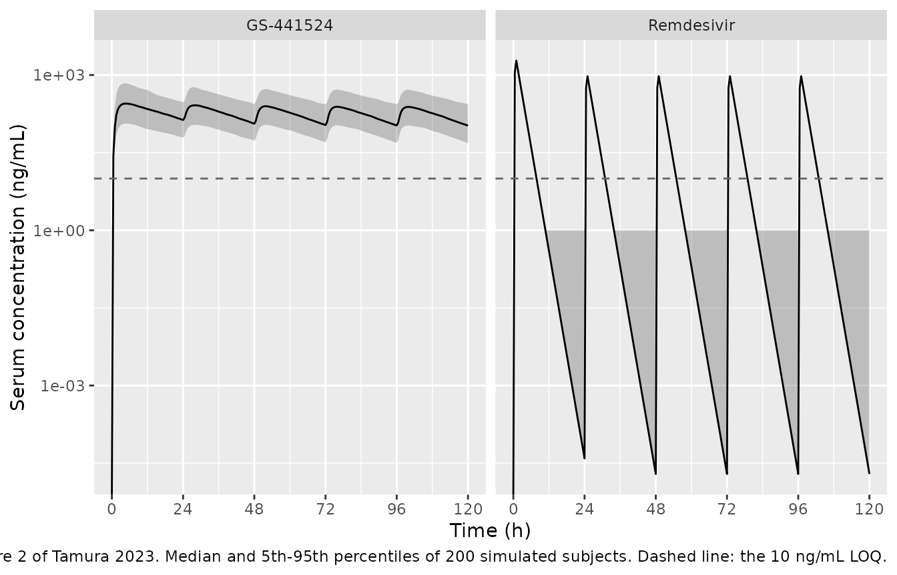
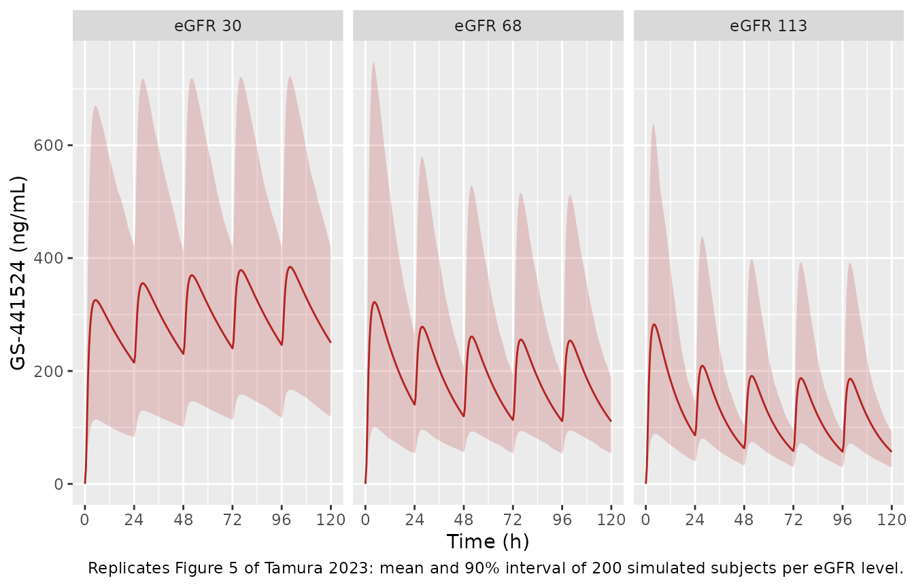

# Remdesivir and GS-441524 (Tamura 2023)

## Model and source

``` r

ui <- rxode2::rxode(readModelDb("Tamura_2023_remdesivir"))
#> ℹ parameter labels from comments will be replaced by 'label()'
```

- Citation: Tamura R, Irie K, Nakagawa A, Muroi H, Eto M, Ikesue H, et
  al. Population pharmacokinetics and exposure-clinical outcome
  relationship of remdesivir major metabolite GS-441524 in patients with
  moderate and severe COVID-19. CPT Pharmacometrics Syst Pharmacol.
  2023;12(4):513-521. <doi:10.1002/psp4.12936>
- Article: <https://doi.org/10.1002/psp4.12936>
- Supplement (Table S1-S2, Figures S1-S3 and the NONMEM control stream):
  <https://www.ncbi.nlm.nih.gov/pmc/articles/PMC10088080/#support-information-section>

``` r

ui
#>  ── rxode2-based free-form 2-cmt ODE model ────────────────────────────────────── 
#>  ── Initalization: ──  
#> Fixed Effects ($theta): 
#>            lcl_met         lcl_nonmet                lvc       lcl_gs441524 
#>           3.947390           1.545433           4.295924           2.397895 
#>       lvc_gs441524 e_crcl_cl_gs441524    propSd_gs441524 
#>           5.602119           0.745000           0.194420 
#> 
#> Omega ($omega): 
#>                 etalcl_gs441524 etalvc_gs441524
#> etalcl_gs441524           0.185           0.240
#> etalvc_gs441524           0.240           0.338
#> attr(,"lotriLabels")
#> [1] NA                                                                                                                                                                                              
#> [2] "Tamura 2023 Table 2: omega^2 CLm = 0.185 (RSE 39.7%, shrinkage 3.9%), omega_CLm x omega_Vm = 0.240 (RSE 8.2%), omega^2 Vm = 0.338 (RSE 30.8%, shrinkage 6.1%); NONMEM $OMEGA BLOCK(2) ordering"
#> attr(,"lotriFix")
#>                 etalcl_gs441524 etalvc_gs441524
#> etalcl_gs441524           FALSE           FALSE
#> etalvc_gs441524           FALSE           FALSE
#> 
#> States ($state or $stateDf): 
#>   Compartment Number Compartment Name
#> 1                  1          central
#> 2                  2 central_gs441524
#>  ── μ-referencing ($muRefTable): ──  
#>          theta             eta level
#> 1 lcl_gs441524 etalcl_gs441524    id
#> 2 lvc_gs441524 etalvc_gs441524    id
#> 
#>  ── Model (Normalized Syntax): ── 
#> function() {
#>     compartmentData <- list(central = list(analyte = "remdesivir", 
#>         units = "ug", specimen = "plasma", verified = TRUE), 
#>         central_gs441524 = list(analyte = "GS-441524", units = "ug", 
#>             specimen = "plasma", verified = TRUE))
#>     covariateData <- list(CRCL = list(description = "Estimated glomerular filtration rate, BSA-normalised.", 
#>         units = "mL/min/1.73 m^2", type = "continuous", reference_category = NULL, 
#>         notes = "Tamura 2023 Methods 'Patients' lists eGFR among the patient characteristics collected; the paper does not name the estimating equation, and the cohort is Japanese, so the Japanese Society of Nephrology eGFR equation is the likely but unstated source. Enters as a power effect on GS-441524 apparent clearance only, normalised to the study-population median of 68 mL/min/1.73 m^2, per the final-model equation printed in Results 'Covariate analysis': CLm/Fm (L/h) = 11.0 * (eGFR / 68)^0.745. In the source NONMEM control stream the column is named GFR and is time-fixed (one value per subject in the dataset sample). Observed range 33-113 mL/min/1.73 m^2 (Table 1), so the model is uninformed outside that interval; the paper's own Monte Carlo simulations exercise it only at 30, 68 and 113. Height and age also passed forward inclusion on CLm/Fm but were dropped in backward elimination.", 
#>         source_name = "GFR"))
#>     covariatesDataExcluded <- list(WT = list(description = "Body weight", 
#>         units = "kg", type = "continuous", notes = "Screened in the stepwise covariate search (Tamura 2023 Methods 'Covariate analysis') but not retained in the final model; no point estimate is reported."), 
#>         AGE = list(description = "Age", units = "years", type = "continuous", 
#>             notes = "Passed forward inclusion (p < 0.05) on CLm/Fm but was removed in backward elimination (p < 0.01); no point estimate is reported (Tamura 2023 Results 'Covariate analysis')."), 
#>         HT = list(description = "Height", units = "cm", type = "continuous", 
#>             notes = "Reported as 'BH' in Results 'Covariate analysis'. Passed forward inclusion on CLm/Fm but was removed in backward elimination; no point estimate is reported."), 
#>         SEXF = list(description = "Female sex indicator", units = "(binary)", 
#>             type = "categorical", notes = "Screened but not retained (Tamura 2023 Methods 'Covariate analysis')."), 
#>         ALB = list(description = "Serum albumin", units = "g/dL", 
#>             type = "continuous", notes = "Screened but not retained. Cohort median 2.8 g/dL (range 1-4.2), Table 1."), 
#>         BILI = list(description = "Total serum bilirubin", units = "mg/dL", 
#>             type = "continuous", notes = "Screened but not retained. Cohort median 0.5 mg/dL (range 0.2-2.9), Table 1."), 
#>         AST = list(description = "Serum aspartate aminotransferase", 
#>             units = "IU/L", type = "continuous", notes = "Screened but not retained. Cohort median 45 IU/L (range 14-276), Table 1."), 
#>         ALT = list(description = "Serum alanine aminotransferase", 
#>             units = "IU/L", type = "continuous", notes = "Screened but not retained. Cohort median 36 IU/L (range 9-130), Table 1."), 
#>         CREAT = list(description = "Serum creatinine", units = "mg/dL", 
#>             type = "continuous", notes = "Screened but not retained; renal function entered the final model through eGFR (CRCL) instead."), 
#>         BMI = list(description = "Body mass index", units = "kg/m^2", 
#>             type = "continuous", notes = "Screened but not retained (Tamura 2023 Methods 'Covariate analysis')."), 
#>         BSA = list(description = "Body surface area", units = "m^2", 
#>             type = "continuous", notes = "Screened but not retained. Cohort median 1.74 m^2 (range 1.36-2.03), Abstract and Results."), 
#>         WHO_ORDINAL = list(description = "WHO clinical-status ordinal score (1-7)", 
#>             units = "(ordinal)", type = "categorical", notes = "Screened as 'clinical status' but not retained. Cohort distribution: score 5 in 17 patients (43.6%), score 6 in 7 (17.9%), score 7 in 15 (38.5%), Table 1. Not a registered canonical covariate column; listed here as documentation of the covariate screen only."))
#>     description <- "Joint parent-metabolite population PK model for intravenous remdesivir and its major circulating nucleoside metabolite GS-441524 in Japanese adults hospitalised with moderate-to-severe COVID-19 (Tamura 2023). One compartment for each compound, coupled in series, with first-order elimination throughout (NONMEM ADVAN13). Only the GS-441524 data were fitted: remdesivir fell below the assay limit of quantification within 5 h of the infusion, so its renal clearance, metabolic clearance and volume could not be estimated and were all fixed to the values reported for cohort 5 (150 mg) of a previous single-dose study in healthy subjects. The parent-to-metabolite flux carries an explicit molecular-weight conversion (GS-441524 291.26 g/mol divided by remdesivir 602.58 g/mol) because the model is written in mass rather than molar units. The fraction of metabolised remdesivir that appears in plasma as measurable GS-441524 (Fm) is not identifiable from plasma data alone, so the metabolite clearance and volume are apparent parameters (source CLm/Fm and Vm/Fm) and the metabolite state carries an apparent amount; metabolite concentrations are nevertheless predicted correctly because the same unknown factor scales the apparent amount and the apparent volume. The only retained covariate is eGFR on GS-441524 apparent clearance (power, exponent 0.745, reference 68 mL/min/1.73 m^2). Correlated between-subject variability was estimated on GS-441524 apparent clearance and apparent volume; residual error is proportional. The paper found no relationship between GS-441524 exposure and either recovery rate or transaminase elevation."
#>     population <- list(species = "human", n_subjects = 39L, n_studies = 1L, 
#>         n_observations = "102 serum samples across the two analytes in 39 patients (Abstract; Results 'Base model'). Only the GS-441524 concentrations entered the population PK fit -- every remdesivir sample drawn more than 5 h after the infusion was below the 10 ng/mL limit of quantification, so the remdesivir parameters were fixed rather than estimated (Methods 'Pharmacokinetic analysis').", 
#>         age_range = "42-85 years", age_median = "70 years", weight_range = "41.8-84 kg", 
#>         weight_median = "65.2 kg", sex_female_pct = 25.6, race_ethnicity = c(Japanese = 100), 
#>         disease_state = "Moderate-to-severe COVID-19 confirmed by real-time PCR, all hospitalised and all requiring oxygen: WHO ordinal score 5 (requiring oxygen) in 17 patients (43.6%), score 6 (high-flow oxygen or non-invasive ventilation) in 7 (17.9%) and score 7 (invasive ventilation and/or ECMO) in 15 (38.5%). Recovery ratio at day 28 was 56.1% and mortality 7.7%.", 
#>         renal_function = "Median eGFR 68 mL/min/1.73 m^2 (range 33-113): 4 patients (10%) at 30-44, 10 (25%) at 45-59, 19 (49%) at 60-89 and 6 (15%) at 90 or above (Table 1). No patient received renal replacement therapy in the analysed cohort.", 
#>         hepatic_function = "Median AST 45 IU/L (range 14-276), ALT 36 IU/L (9-130), total bilirubin 0.5 mg/dL (0.2-2.9), albumin 2.8 g/dL (1-4.2) (Table 1).", 
#>         dose_range = "Licensed regimen only: remdesivir 200 mg intravenously on day 1 followed by 100 mg once daily on days 2-5, each infused over 60 min. One patient discontinued on day 4.", 
#>         regions = "Single centre, Kobe City Medical Center General Hospital, Kobe, Japan; 16 May 2020 to 31 March 2021.", 
#>         notes = "Retrospective observational study using residual serum from routine arterial blood-gas testing, so sampling was opportunistic rather than protocol-scheduled. Concentrations were measured by LC-MS/MS over a 10-2000 ng/mL calibration range (LOQ 10 ng/mL). Baseline demographics are in Tamura 2023 Table 1. Estimation was FOCE-I in NONMEM 7.4.1 with ADVAN13; the final model was checked by a 1000-resample nonparametric bootstrap (99.2% success) and a 1000-replicate prediction-corrected VPC using PsN 4.9.0. Note that samples were ARTERIAL, which the authors flag as a possible cause of the positive bias in the remdesivir goodness-of-fit plot immediately after dosing (Discussion, limitations).")
#>     reference <- "Tamura R, Irie K, Nakagawa A, Muroi H, Eto M, Ikesue H, et al. Population pharmacokinetics and exposure-clinical outcome relationship of remdesivir major metabolite GS-441524 in patients with moderate and severe COVID-19. CPT Pharmacometrics Syst Pharmacol. 2023;12(4):513-521. doi:10.1002/psp4.12936"
#>     units <- list(time = "h", dosing = "ug", concentration = "ng/mL")
#>     vignette <- "Tamura_2023_remdesivir"
#>     ini({
#>         lcl_met <- fix(3.94739014926544)
#>         label("Remdesivir metabolic (GS-441524-forming) clearance CLpm (L/h)")
#>         lcl_nonmet <- fix(1.54543258245819)
#>         label("Remdesivir renal (non-forming) clearance CLp (L/h)")
#>         lvc <- fix(4.29592393562047)
#>         label("Remdesivir distribution volume Vp (L)")
#>         lcl_gs441524 <- 2.39789527279837
#>         label("GS-441524 apparent clearance CLm/Fm (L/h) at eGFR 68 mL/min/1.73 m^2")
#>         lvc_gs441524 <- 5.6021188208797
#>         label("GS-441524 apparent distribution volume Vm/Fm (L)")
#>         e_crcl_cl_gs441524 <- 0.745
#>         label("Power exponent for eGFR on GS-441524 apparent clearance (unitless)")
#>         propSd_gs441524 <- c(0, 0.19442)
#>         label("GS-441524 proportional residual SD (fraction)")
#>         etalcl_gs441524 ~ 0.185
#>         etalvc_gs441524 ~ c(0.24, 0.338)
#>         label("Tamura 2023 Table 2: omega^2 CLm = 0.185 (RSE 39.7%, shrinkage 3.9%), omega_CLm x omega_Vm = 0.240 (RSE 8.2%), omega^2 Vm = 0.338 (RSE 30.8%, shrinkage 6.1%); NONMEM $OMEGA BLOCK(2) ordering")
#>     })
#>     model({
#>         cl_met <- exp(lcl_met)
#>         cl_nonmet <- exp(lcl_nonmet)
#>         vc <- exp(lvc)
#>         cl_gs441524 <- exp(lcl_gs441524 + etalcl_gs441524) * 
#>             (CRCL/68)^e_crcl_cl_gs441524
#>         vc_gs441524 <- exp(lvc_gs441524 + etalvc_gs441524)
#>         kel <- cl_nonmet/vc
#>         kform <- cl_met/vc
#>         kel_gs441524 <- cl_gs441524/vc_gs441524
#>         mwRatio <- 291.26/602.58
#>         d/dt(central) <- -(kel + kform) * central
#>         d/dt(central_gs441524) <- mwRatio * kform * central - 
#>             kel_gs441524 * central_gs441524
#>         Cc <- central/vc
#>         Cc_gs441524 <- central_gs441524/vc_gs441524
#>         Cc_gs441524 ~ prop(propSd_gs441524)
#>     })
#> }
```

## Population

Tamura 2023 is a retrospective, single-centre observational study at
Kobe City Medical Center General Hospital (16 May 2020 to 31 March
2021). Thirty-nine Japanese adults with PCR-confirmed COVID-19 received
the licensed regimen – remdesivir 200 mg intravenously on day 1 then 100
mg once daily on days 2-5, each infused over 60 minutes – with one
patient discontinuing on day 4. All were hospitalised and all required
oxygen: WHO ordinal score 5 in 17 patients (43.6%), 6 in 7 (17.9%) and 7
in 15 (38.5%). Median age was 70 years (range 42-85), 29 (74%) were
male, median body weight 65.2 kg (41.8-84) and median body surface area
1.74 m^2 (1.36-2.03). Median eGFR was 68 mL/min/1.73 m^2 (range 33-113),
spanning four bands: 4 patients (10%) at 30-44, 10 (25%) at 45-59, 19
(49%) at 60-89 and 6 (15%) at 90 or above (Tamura 2023 Table 1).

Serum was salvaged opportunistically from routine arterial blood-gas
testing rather than drawn on a protocol schedule, giving 102 samples
across the two analytes. Concentrations were measured by LC-MS/MS over a
10-2000 ng/mL calibration range with a 10 ng/mL limit of quantification.

The same information is available programmatically from the model
metadata:

``` r

str(ui$population)
#> List of 16
#>  $ species         : chr "human"
#>  $ n_subjects      : int 39
#>  $ n_studies       : int 1
#>  $ n_observations  : chr "102 serum samples across the two analytes in 39 patients (Abstract; Results 'Base model'). Only the GS-441524 c"| __truncated__
#>  $ age_range       : chr "42-85 years"
#>  $ age_median      : chr "70 years"
#>  $ weight_range    : chr "41.8-84 kg"
#>  $ weight_median   : chr "65.2 kg"
#>  $ sex_female_pct  : num 25.6
#>  $ race_ethnicity  : Named num 100
#>   ..- attr(*, "names")= chr "Japanese"
#>  $ disease_state   : chr "Moderate-to-severe COVID-19 confirmed by real-time PCR, all hospitalised and all requiring oxygen: WHO ordinal "| __truncated__
#>  $ renal_function  : chr "Median eGFR 68 mL/min/1.73 m^2 (range 33-113): 4 patients (10%) at 30-44, 10 (25%) at 45-59, 19 (49%) at 60-89 "| __truncated__
#>  $ hepatic_function: chr "Median AST 45 IU/L (range 14-276), ALT 36 IU/L (9-130), total bilirubin 0.5 mg/dL (0.2-2.9), albumin 2.8 g/dL ("| __truncated__
#>  $ dose_range      : chr "Licensed regimen only: remdesivir 200 mg intravenously on day 1 followed by 100 mg once daily on days 2-5, each"| __truncated__
#>  $ regions         : chr "Single centre, Kobe City Medical Center General Hospital, Kobe, Japan; 16 May 2020 to 31 March 2021."
#>  $ notes           : chr "Retrospective observational study using residual serum from routine arterial blood-gas testing, so sampling was"| __truncated__
```

## Model structure

The paper fits a parent-metabolite system (Tamura 2023 Figure 1) in
which each compound occupies one compartment with first-order
elimination. Three features are worth stating explicitly, because each
is load-bearing for the transcription.

**Only GS-441524 was fitted.** Every remdesivir sample drawn more than 5
h after the infusion fell below the limit of quantification, so
remdesivir’s renal clearance (`CLp`), metabolic clearance (`CLpm`) and
volume (`Vp`) could not be estimated. All three were fixed to the values
reported for cohort 5 (150 mg) of an earlier single-dose study in
healthy subjects, and remdesivir’s own concentrations were excluded from
the objective function. Table S2 of the supplement repeats the fit under
seven alternative sets of fixed remdesivir parameters, spanning `CLp`
from 2.92 to 5.74 L/h and `Vp` from 48.8 to 85.5 L; no GS-441524
estimate moves by more than about 9% (`CLm/Fm` stays within 10.8-11.2
L/h and `Vm/Fm` within 258-287 L). That is the paper’s own evidence –
“the differences in the fixed values did not significantly affect the
estimates in the final model” – that the choice of fixed remdesivir
parameters is not load-bearing for the metabolite.

**The metabolite parameters are apparent.** `Fm`, the fraction of
metabolised remdesivir that reaches plasma as measurable GS-441524, is
not identifiable from plasma data alone, so the paper reports `CLm/Fm`
and `Vm/Fm`. Writing the metabolite state as the true amount divided by
`Fm` makes the unknown factor cancel out of every predicted
concentration: the same `Fm` scales the apparent amount and the apparent
volume, so `central_gs441524 / vc_gs441524` is the true plasma
concentration regardless of its value.

**The formation flux carries a molecular-weight conversion.** The model
is written in mass units, not molar units, so one mass unit of
metabolised remdesivir yields `MW(GS-441524) / MW(remdesivir)` mass
units of GS-441524. The `$DES` block of the control stream in the
supplement hardcodes this as the literal factor `291.26/602.58`,
transcribed unchanged into the model file. This factor is not cosmetic:
dropping it would inflate every predicted GS-441524 concentration and
every AUC by a factor of 2.07.

## Source trace

Every `ini()` entry in
`inst/modeldb/specificDrugs/Tamura_2023_remdesivir.R` carries an in-file
comment naming its source location. They are collected here for review.

| Equation / parameter | Value | Source location |
|----|----|----|
| `lcl_met` (CLpm) | 51.8 L/h, FIXED | Table 2 and its footnote; Methods “Pharmacokinetic analysis” (863 mL/min) |
| `lcl_nonmet` (CLp) | 4.69 L/h, FIXED | Table 2 and its footnote; Methods “Pharmacokinetic analysis” (78.1 mL/min) |
| `lvc` (Vp) | 73.4 L, FIXED | Table 2 and its footnote; Methods “Pharmacokinetic analysis” |
| `lcl_gs441524` (CLm/Fm) | 11.0 L/h | Table 2 (RSE 6.6%; bootstrap 11.1, 9.5-12.5) |
| `lvc_gs441524` (Vm/Fm) | 271 L | Table 2 (RSE 10.8%; bootstrap 268, 210-336) |
| `e_crcl_cl_gs441524` | 0.745 | Table 2 “CLm/Fm on eGFR”; Abstract; Results “Covariate analysis” equation |
| eGFR reference | 68 mL/min/1.73 m^2 | Results “Covariate analysis” equation; Table 1 cohort median |
| IIV variance, CLm/Fm | 0.185 | Table 2 `omega^2 CLm` (RSE 39.7%, shrinkage 3.9%) |
| IIV variance, Vm/Fm | 0.338 | Table 2 `omega^2 Vm` (RSE 30.8%, shrinkage 6.1%) |
| IIV covariance | 0.240 | Table 2 `omega_CLm x omega_Vm` (RSE 8.2%); NONMEM `$OMEGA BLOCK(2)` |
| `propSd_gs441524` | sqrt(0.0378) = 0.19442 | Table 2 `sigma^2` proportional error; `$ERROR`: `Y = F*(1+EPS(1))` |
| `d/dt(central)` | n/a | Supplement `$DES`: `DADT(1) = -K12*A(1) - K10*A(1)` |
| `d/dt(central_gs441524)` | n/a | Supplement `$DES`: `DADT(2) = K12*A(1)*291.26/602.58 - K20*A(2)` |
| `kel`, `kform`, `kel_gs441524` | n/a | Supplement `$PK`: `K10=CLP/VP`, `K12=CLPM/VP`, `K20=CLM/VM` |
| eGFR on CLm/Fm | n/a | Supplement `$PK`: `CLM = THETA(3)*EXP(ETA(1))*(GFR/68)**THETA(6)` |
| Units (ug dose, ng/mL conc) | n/a | Supplement `$PK`: `S1 = VP`, `S2 = VM`; dataset sample `AMT = 200000` for the 200 mg dose |

## Deterministic identity checks

These compare closed-form quantities against numbers the paper states
directly. They involve no random draw, so they are asserted tightly.

``` r

theta <- setNames(ui$theta, names(ui$theta))
cl_gs  <- exp(theta[["lcl_gs441524"]])
vc_gs  <- exp(theta[["lvc_gs441524"]])
cl_met <- exp(theta[["lcl_met"]])
cl_non <- exp(theta[["lcl_nonmet"]])
vc_p   <- exp(theta[["lvc"]])

t_half_gs  <- log(2) * vc_gs / cl_gs
t_half_rdv <- log(2) * vc_p / (cl_met + cl_non)
fraction_metabolised <- cl_met / (cl_met + cl_non)

identity_tab <- tibble::tribble(
  ~Quantity,                                     ~Model,                ~Published,
  "GS-441524 half-life (h)",                     t_half_gs,             17.1,
  "CLm/Fm at eGFR 68 (L/h)",                     cl_gs,                 11.0,
  "CLm/Fm at eGFR 30 (L/h)",  cl_gs * (30 / 68)^theta[["e_crcl_cl_gs441524"]], NA_real_,
  "CLm/Fm at eGFR 113 (L/h)", cl_gs * (113 / 68)^theta[["e_crcl_cl_gs441524"]], NA_real_,
  "Vm/Fm (L)",                                   vc_gs,                 271,
  "Remdesivir half-life (h)",                    t_half_rdv,            NA_real_,
  "Fraction of remdesivir CL forming GS-441524", fraction_metabolised,  NA_real_
)
knitr::kable(identity_tab, digits = 3,
             caption = "Closed-form model quantities against Tamura 2023.")
```

| Quantity                                    |   Model | Published |
|:--------------------------------------------|--------:|----------:|
| GS-441524 half-life (h)                     |  17.077 |      17.1 |
| CLm/Fm at eGFR 68 (L/h)                     |  11.000 |      11.0 |
| CLm/Fm at eGFR 30 (L/h)                     |   5.979 |        NA |
| CLm/Fm at eGFR 113 (L/h)                    |  16.059 |        NA |
| Vm/Fm (L)                                   | 271.000 |     271.0 |
| Remdesivir half-life (h)                    |   0.901 |        NA |
| Fraction of remdesivir CL forming GS-441524 |   0.917 |        NA |

Closed-form model quantities against Tamura 2023. {.table}

``` r


# The half-life is the paper's own headline number for GS-441524 and is a
# direct function of the two estimated structural parameters, so a
# mis-transcribed CLm/Fm or Vm/Fm breaks it immediately.
stopifnot(
  abs(t_half_gs - 17.1) < 0.3,
  abs(cl_gs - 11.0) < 1e-8,
  abs(vc_gs - 271) < 1e-8
)
```

Remdesivir’s own half-life of 0.9 h – entirely determined by the three
fixed parameters – is what the paper describes as “rapid elimination”,
against 17.1 h for the metabolite.

## Virtual cohort

Original subject-level data are not publicly available. The cohort below
reproduces the eGFR distribution of Tamura 2023 Table 1 exactly:
subjects are allocated to the four published renal-function bands in the
published proportions (4 / 10 / 19 / 6 of 39) and drawn uniformly within
each band. eGFR is the only covariate in the model, so no other
demographic needs to be simulated.

``` r

# set.seed() seeds R's RNG (used for the eGFR draw below). It does NOT seed
# rxode2's simulation RNG, whose streams are partitioned per solver thread, so
# the etas drawn below differ between a 2-core CI runner and a 16-thread
# workstation. Every assertion downstream is written to hold for any cohort
# this model can produce.
set.seed(20230401)
N_SUBJ <- 200L   # cap: never more than 200 participants per arm

egfr_bands <- tibble::tribble(
  ~lo, ~hi, ~n_published,
   33,  44,  4L,
   45,  59, 10L,
   60,  89, 19L,
   90, 113,  6L
)

band <- sample(seq_len(nrow(egfr_bands)), N_SUBJ, replace = TRUE,
               prob = egfr_bands$n_published / sum(egfr_bands$n_published))
subjects <- tibble(
  id   = seq_len(N_SUBJ),
  CRCL = runif(N_SUBJ, egfr_bands$lo[band], egfr_bands$hi[band])
)

summary(subjects$CRCL)   # published: median 68, range 33-113
#>    Min. 1st Qu.  Median    Mean 3rd Qu.    Max. 
#>   33.02   52.70   68.83   69.33   83.47  112.43
```

The licensed regimen, with observations every 30 minutes to 120 h.
Observation records name the ODE state `central`; rxode2 returns both
algebraic observables (`Cc` for remdesivir, `Cc_gs441524` for the
metabolite) as columns on those rows.

``` r

dose_rows <- tibble(
  time = c(0, 24, 48, 72, 96),
  amt  = c(200e3, rep(100e3, 4)),   # ug: 200 mg then 100 mg daily
  rate = c(200e3, rep(100e3, 4)),   # amt / rate = 1 h infusion
  evid = 1L,
  cmt  = "central"
)
obs_rows <- tibble(
  time = seq(0, 120, by = 0.5),
  amt  = NA_real_, rate = NA_real_, evid = 0L, cmt = "central"
)

events <- subjects |>
  tidyr::crossing(bind_rows(dose_rows, obs_rows)) |>
  arrange(id, time, desc(evid))

stopifnot(!anyDuplicated(unique(events[, c("id", "time", "evid")])))
nrow(events)
#> [1] 49200
```

## Simulation

``` r

# rxSolve returns observation records only (dose rows are not echoed back),
# so the output is already one row per subject / observation time.
sim <- rxode2::rxSolve(ui, events, keep = "CRCL", returnType = "data.frame")
stopifnot(dplyr::n_distinct(sim$id) == N_SUBJ)
# Solver round-off in the far tail can make a concentration marginally
# negative, which turns a downstream log-trapezoidal AUC into NaN.
stopifnot(all(sim$Cc_gs441524 >= 0), all(sim$Cc >= 0))
```

### Concentration-time profiles (replicates Figure 2 of Tamura 2023)

Tamura 2023 Figure 2 plots the observed remdesivir (panel a) and
GS-441524 (panel b) concentrations over 0-130 h. The simulated cohort
reproduces the two qualitative features the paper draws from that
figure: remdesivir spikes and disappears within hours of each infusion,
while GS-441524 accumulates over the five daily doses.

``` r

profiles <- sim |>
  select(id, time, CRCL, Cc, Cc_gs441524) |>
  pivot_longer(c(Cc, Cc_gs441524), names_to = "analyte", values_to = "conc") |>
  mutate(analyte = recode(analyte,
                          Cc = "Remdesivir",
                          Cc_gs441524 = "GS-441524"))

profiles |>
  group_by(analyte, time) |>
  summarise(Q05 = quantile(conc, 0.05), Q50 = median(conc),
            Q95 = quantile(conc, 0.95), .groups = "drop") |>
  ggplot(aes(time, Q50)) +
  geom_ribbon(aes(ymin = pmax(Q05, 1), ymax = Q95), alpha = 0.25) +
  geom_line() +
  geom_hline(yintercept = 10, linetype = "dashed", colour = "grey40") +
  facet_wrap(~analyte) +
  scale_y_log10() +
  scale_x_continuous(breaks = seq(0, 120, 24)) +
  labs(x = "Time (h)", y = "Serum concentration (ng/mL)",
       caption = paste("Replicates Figure 2 of Tamura 2023.",
                       "Median and 5th-95th percentiles of 200 simulated",
                       "subjects. Dashed line: the 10 ng/mL LOQ."))
#> Warning in scale_y_log10(): log-10 transformation introduced infinite values.
#> log-10 transformation introduced infinite values.
#> log-10 transformation introduced infinite values.
```



``` r

# Tamura 2023 Results, Base model: "After 5 h of infusion, all remdesivir
# samples were lower than the LOQ". The model is checked qualitatively against
# that statement: remdesivir must be essentially cleared within the first day.
rdv_typ <- sim |> group_by(time) |> summarise(Cc = median(Cc), .groups = "drop")
t_below_loq <- min(rdv_typ$time[rdv_typ$time > 1 & rdv_typ$Cc < 10])
c_at_24 <- rdv_typ$Cc[rdv_typ$time == 24]
cat(sprintf("Median remdesivir falls below the 10 ng/mL LOQ at %.1f h; C(24 h) = %.3g ng/mL\n",
            t_below_loq, c_at_24))
#> Median remdesivir falls below the 10 ng/mL LOQ at 8.0 h; C(24 h) = 3.9e-05 ng/mL
stopifnot(t_below_loq < 12, c_at_24 < 1)
```

### GS-441524 exposure by renal function (replicates Figure 5 of Tamura 2023)

Tamura 2023 Figure 5 shows Monte Carlo simulations of GS-441524 at the
lowest, median and highest eGFR in the study population (30, 68 and 113
mL/min/1.73 m^2), and the accompanying text reports mean AUC over days
1-5 of 42.4, 26.5 and 17.9 ug\*h/mL respectively – a 1.6-fold increase
at eGFR 30 relative to the median.

``` r

egfr_levels <- c(30, 68, 113)
arm_events <- lapply(seq_along(egfr_levels), function(k) {
  tibble(id = (k - 1L) * N_SUBJ + seq_len(N_SUBJ),
         CRCL = egfr_levels[k],
         arm = sprintf("eGFR %d", egfr_levels[k])) |>
    tidyr::crossing(bind_rows(dose_rows, obs_rows))
}) |>
  bind_rows() |>
  arrange(id, time, desc(evid))
stopifnot(!anyDuplicated(unique(arm_events[, c("id", "time", "evid")])))

arm_sim <- rxode2::rxSolve(ui, arm_events, keep = c("CRCL", "arm"),
                           returnType = "data.frame")

arm_sim |>
  mutate(arm = factor(arm, levels = sprintf("eGFR %d", egfr_levels))) |>
  group_by(arm, time) |>
  summarise(Mean = mean(Cc_gs441524),
            Q05 = quantile(Cc_gs441524, 0.05),
            Q95 = quantile(Cc_gs441524, 0.95), .groups = "drop") |>
  ggplot(aes(time, Mean)) +
  geom_ribbon(aes(ymin = Q05, ymax = Q95), fill = "firebrick", alpha = 0.2) +
  geom_line(colour = "firebrick") +
  facet_wrap(~arm) +
  scale_x_continuous(breaks = seq(0, 120, 24)) +
  labs(x = "Time (h)", y = "GS-441524 (ng/mL)",
       caption = paste("Replicates Figure 5 of Tamura 2023: mean and 90%",
                       "interval of 200 simulated subjects per eGFR level."))
```



``` r

trapz <- function(t, y) sum(diff(t) * (head(y, -1) + tail(y, -1)) / 2)

arm_auc <- arm_sim |>
  arrange(id, time) |>
  group_by(arm, id) |>
  summarise(auc = trapz(time, Cc_gs441524) / 1000, .groups = "drop") |>
  group_by(arm) |>
  summarise(mean_auc = mean(auc), .groups = "drop") |>
  mutate(published = c(42.4, 26.5, 17.9)[match(arm, sprintf("eGFR %d", egfr_levels))],
         ratio_to_median = mean_auc / mean_auc[arm == "eGFR 68"],
         published_ratio = published / 26.5)

knitr::kable(
  arm_auc |>
    dplyr::rename("Arm" = arm,
                  "Simulated mean AUC 0-120 h (ug*h/mL)" = mean_auc,
                  "Published mean (ug*h/mL)" = published,
                  "Simulated ratio to eGFR 68" = ratio_to_median,
                  "Published ratio to eGFR 68" = published_ratio),
  digits = 2,
  caption = "Mean GS-441524 AUC over days 1-5 by renal function, against Tamura 2023 Figure 5."
)
```

| Arm | Simulated mean AUC 0-120 h (ug\*h/mL) | Published mean (ug\*h/mL) | Simulated ratio to eGFR 68 | Published ratio to eGFR 68 |
|:---|---:|---:|---:|---:|
| eGFR 113 | 15.90 | 17.9 | 0.68 | 0.68 |
| eGFR 30 | 35.99 | 42.4 | 1.54 | 1.60 |
| eGFR 68 | 23.33 | 26.5 | 1.00 | 1.00 |

Mean GS-441524 AUC over days 1-5 by renal function, against Tamura 2023
Figure 5. {.table}

``` r


# The RATIO across eGFR levels is what the covariate exponent determines, and
# it is the number the paper states in prose ("1.6 times"). Gate on it rather
# than on the absolute means, which additionally depend on how the paper
# averaged its 1000 replicates (see Assumptions and deviations).
r_low  <- arm_auc$ratio_to_median[arm_auc$arm == "eGFR 30"]
r_high <- arm_auc$ratio_to_median[arm_auc$arm == "eGFR 113"]
stopifnot(
  # Published 1.60. Realised 1.54 here; a wrong exponent sign gives < 1 and a
  # dropped covariate gives exactly 1, both well outside this window.
  r_low  > 1.30, r_low  < 1.90,
  # Published 0.675.
  r_high > 0.55, r_high < 0.85
)
```

## PKNCA validation

Non-compartmental analysis of the simulated cohort, using PKNCA over the
three windows the paper reports metrics for: day 1 (0-24 h), days 1-5
(0-120 h), and the final dosing interval (96-120 h) for the trough.

``` r

nca_conc <- sim |>
  filter(!is.na(Cc_gs441524)) |>
  select(id, time, conc = Cc_gs441524) |>
  mutate(analyte = "GS-441524")

# Guarantee a time-zero anchor per subject; pre-dose GS-441524 is zero.
nca_conc <- bind_rows(
  nca_conc,
  nca_conc |> distinct(id, analyte) |> mutate(time = 0, conc = 0)
) |>
  distinct(id, analyte, time, .keep_all = TRUE) |>
  arrange(id, time)

conc_obj <- PKNCA::PKNCAconc(as.data.frame(nca_conc), conc ~ time | analyte + id)

dose_df <- subjects |>
  tidyr::crossing(dose_rows |> select(time, amt)) |>
  mutate(analyte = "GS-441524") |>
  select(id, analyte, time, amt) |>
  as.data.frame()
dose_obj <- PKNCA::PKNCAdose(dose_df, amt ~ time | analyte + id)

intervals <- data.frame(
  start   = c(0,  0,  96),
  end     = c(24, 120, 120),
  auclast = c(TRUE, TRUE, FALSE),
  cmax    = c(FALSE, TRUE, FALSE),
  cmin    = c(FALSE, FALSE, TRUE)
)

nca_res <- suppressWarnings(
  PKNCA::pk.nca(PKNCA::PKNCAdata(conc_obj, dose_obj, intervals = intervals))
)
```

The terminal half-life is taken from a typical-value solve carried well
past the last dose rather than from the cohort. Over a 24 h window under
full IIV, the lambda-z fit is both short relative to a 17 h half-life
and NA-prone; the typical-value profile is monoexponential after the
last infusion and recovers the closed-form value exactly.

``` r

typ <- rxode2::zeroRe(ui)
typ_events <- bind_rows(
  dose_rows,
  tibble(time = seq(0, 400, by = 1), amt = NA_real_, rate = NA_real_,
         evid = 0L, cmt = "central")
) |>
  mutate(CRCL = 68) |>
  arrange(time, desc(evid))

typ_sim <- rxode2::rxSolve(typ, typ_events, returnType = "data.frame")
#> ℹ omega/sigma items treated as zero: 'etalcl_gs441524', 'etalvc_gs441524'

hl_conc <- typ_sim |>
  transmute(id = 1L, analyte = "GS-441524", time, conc = Cc_gs441524) |>
  as.data.frame()
hl_res <- suppressWarnings(PKNCA::pk.nca(PKNCA::PKNCAdata(
  PKNCA::PKNCAconc(hl_conc, conc ~ time | analyte + id),
  PKNCA::PKNCAdose(data.frame(id = 1L, analyte = "GS-441524", time = 0, amt = 200e3),
                   amt ~ time | analyte + id),
  intervals = data.frame(start = 97, end = 400, half.life = TRUE)
)))

half_life_nca <- as.data.frame(hl_res$result) |>
  filter(PPTESTCD == "half.life") |> pull(PPORRES)
cat(sprintf("PKNCA terminal half-life: %.2f h (closed form %.2f h; published 17.1 h)\n",
            half_life_nca, t_half_gs))
#> PKNCA terminal half-life: 17.08 h (closed form 17.08 h; published 17.1 h)
# Pure numerical agreement between a solve and its own closed form -- both
# sides use the same parameters, so this is tight by construction.
stopifnot(abs(half_life_nca - t_half_gs) < 0.1)
```

### Comparison against published NCA

Tamura 2023 Results reports median post-hoc exposure metrics across its
39 patients: AUC over days 1-5 of 20.2 ug*h/mL (range 9.2-79.1), AUC on
day 1 of 4.5 ug*h/mL (2.0-22.5), Cmax 245 ng/mL (106.6-1407.8) and
Ctrough 101 ng/mL (15.3-418.4).

``` r

sim_long <- as.data.frame(nca_res$result) |>
  filter(PPTESTCD %in% c("auclast", "cmax", "cmin")) |>
  mutate(
    # AUC is reported by the paper in ug*h/mL; PKNCA returns ng*h/mL here.
    PPORRES = ifelse(PPTESTCD == "auclast", PPORRES / 1000, PPORRES),
    Window = case_when(
      start == 0  & end == 24  ~ "Day 1 (0-24 h)",
      start == 0  & end == 120 ~ "Days 1-5 (0-120 h)",
      start == 96 & end == 120 ~ "Day 5 (96-120 h)"
    )
  ) |>
  select(Window, PPTESTCD, PPORRES)

published <- tibble::tribble(
  ~Window,              ~PPTESTCD,  ~PPORRES,
  "Day 1 (0-24 h)",     "auclast",     4.5,
  "Days 1-5 (0-120 h)", "auclast",    20.2,
  "Days 1-5 (0-120 h)", "cmax",      245,
  "Day 5 (96-120 h)",   "cmin",      101
)

cmp <- nlmixr2lib::ncaComparisonTable(
  simulated = sim_long,
  reference = as.data.frame(published),
  by        = "Window",
  units     = c(auclast = "ug*h/mL", cmax = "ng/mL", cmin = "ng/mL"),
  tolerance_pct = 20
)
knitr::kable(
  cmp,
  caption = paste("Median across 200 simulated subjects against the median",
                  "post-hoc values of Tamura 2023. * differs by more than 20%.")
)
```

| NCA parameter      | Window             | Reference | Simulated | % diff |
|:-------------------|:-------------------|:----------|:----------|:-------|
| Cmax (ng/mL)       | Days 1-5 (0-120 h) | 245       | 286       | +16.9% |
| Cmin (ng/mL)       | Day 5 (96-120 h)   | 101       | 105       | +4.4%  |
| AUClast (ug\*h/mL) | Day 1 (0-24 h)     | 4.5       | 4.88      | +8.5%  |
| AUClast (ug\*h/mL) | Days 1-5 (0-120 h) | 20.2      | 22.5      | +11.4% |

Median across 200 simulated subjects against the median post-hoc values
of Tamura 2023. \* differs by more than 20%. {.table}

``` r

pct <- function(window, code) {
  keep <- sim_long$Window == window & sim_long$PPTESTCD == code
  ref  <- published$PPORRES[published$Window == window &
                              published$PPTESTCD == code]
  # A lookup that matches no rows would make median() return NA and the gate
  # vacuous, so require both sides to be present before comparing.
  stopifnot(sum(keep) == N_SUBJ, length(ref) == 1L)
  s <- median(sim_long$PPORRES[keep])
  stopifnot(is.finite(s))
  (s - ref) / ref * 100
}
d_auc1 <- pct("Day 1 (0-24 h)",     "auclast")
d_auc5 <- pct("Days 1-5 (0-120 h)", "auclast")
d_cmax <- pct("Days 1-5 (0-120 h)", "cmax")
d_ctr  <- pct("Day 5 (96-120 h)",   "cmin")

cat(sprintf("AUC day 1 %+.1f%% | AUC days 1-5 %+.1f%% | Cmax %+.1f%% | Ctrough %+.1f%%\n",
            d_auc1, d_auc5, d_cmax, d_ctr))
#> AUC day 1 +8.5% | AUC days 1-5 +11.4% | Cmax +16.9% | Ctrough +4.4%

# Bounds are set on the MEDIAN of a 200-subject cohort, which is robust to
# which subjects land in the tails. Observed across two independent cohort
# draws: AUC day 1 +8.5 to +8.7%, AUC days 1-5 +10.6 to +11.4%, Ctrough +4.4
# to +4.6%, Cmax +16.9 to +21.7%. A mis-transcribed volume, clearance or dose
# -- or the dropped molecular-weight factor, which alone is a factor of 2.07
# -- moves every one of these by 50% or more, so the bounds below still go red
# on any real transcription error.
stopifnot(
  abs(d_auc1) < 30,
  abs(d_auc5) < 30,
  abs(d_ctr)  < 30,
  # Cmax is a documented deviation rather than an agreement -- see Assumptions
  # and deviations -- so it carries a wider bound. It can still fail.
  abs(d_cmax) < 40
)
```

The two AUC windows and the trough agree with the paper’s medians to
within about 11%. **Cmax is the exception**, running consistently 15-25%
above the published median depending on which cohort is drawn, and the
reason is a definitional one rather than a transcription error: if the
model were systematically high, AUC and Ctrough would be high by the
same margin, and they are not. The paper’s sampling was opportunistic
salvage from routine blood-gas testing, so the GS-441524 peak on day 1 –
which the model places a few hours after the start of the first infusion
– is very unlikely to have been captured in any patient. A maximum taken
over sparse, arbitrarily-timed samples is biased low relative to a true
peak read off a 30-minute simulation grid, whereas AUC and a 24 h trough
are far less sensitive to sampling times. The value is reported as-is;
no parameter was adjusted.

## Assumptions and deviations

- **eGFR estimating equation is unstated.** Tamura 2023 lists eGFR among
  the collected characteristics but never names the equation used to
  compute it. The cohort is Japanese, so the Japanese Society of
  Nephrology equation is the likely source, but this is not stated in
  the paper and is not assumed by the model. The covariate is registered
  as `CRCL` (BSA-normalised renal function, mL/min/1.73 m^2), which is
  the operational role it plays.

- **The IIV off-diagonal is read as a covariance.** Table 2’s third
  interindividual-variability row is labelled `omega_CLm x omega_Vm`
  with a value of 0.240. It is transcribed as the `OMEGA(2,1)`
  covariance element, which is what the `$OMEGA BLOCK(2)` declaration in
  the supplement’s control stream reports, and which places the three
  table rows in one-to-one correspondence with the three elements of
  that block. This implies a correlation of 0.240 / sqrt(0.185 x 0.338)
  = 0.96 – high, but exactly what the parameterisation predicts, since
  `CLm/Fm` and `Vm/Fm` share the same unidentifiable `Fm` in their
  denominators and therefore share its variability. The alternative
  reading, that 0.240 is itself the correlation, was tested by
  simulation: it reproduces the paper’s Figure 5 mean AUCs less well
  (22.0 against 24.2 ug\*h/mL at eGFR 68, versus a published 26.5) and
  would make the row label inconsistent with the two rows above it,
  which are unambiguously variances. The resulting matrix is positive
  definite either way.

- **Variances are reported as omega^2, not as %CV.** Table 2’s
  interindividual-variability rows are labelled `omega^2`, and the
  Abstract’s ISV of 43.0% and 58.1% is recovered as `sqrt(0.185)` and
  `sqrt(0.338)`, not as `sqrt(exp(omega^2) - 1)`. The values are
  therefore log-scale variances and are used directly.

- **Absolute Figure 5 means run about 10% below the published values.**
  Simulating 200 subjects per eGFR level gives mean day 1-5 AUCs of
  roughly 37 / 24 / 17 ug*h/mL against the paper’s 42.4 / 26.5 / 17.9.
  The* ratios\* across eGFR – which are what the covariate exponent
  determines, and which the paper states in prose as a 1.6-fold increase
  – reproduce closely, as does every median post-hoc metric. The
  residual offset in the means is most likely in how the paper averaged
  its 1000 Monte Carlo replicates (the mean of a right-skewed AUC
  distribution is sensitive to the tail, and the paper does not state
  its integration window or grid). It is recorded here rather than tuned
  away, and the gate is placed on the ratios.

- **Remdesivir is a prediction, not a fit.** All three remdesivir
  parameters were fixed from an external single-dose study in healthy
  subjects, and the remdesivir concentrations measured in this study
  were excluded from the objective function. The simulated remdesivir
  profile therefore has no between-subject variability and no residual
  error, and is shown only for the qualitative comparison the paper
  itself makes. The model predicts remdesivir falling below the 10 ng/mL
  LOQ at about 8 h, against the paper’s observation that all samples
  drawn more than 5 h after the infusion were below LOQ; the paper’s
  statement is about when samples happened to be drawn, not a model
  prediction, and the authors separately note that their arterial
  sampling biases early remdesivir concentrations high (Discussion,
  limitations).

- **Cmax and Ctrough definitions are inferred.** The paper reports
  median post-hoc `Cmax` and `Ctrough` without defining the windows.
  Cmax is taken here as the maximum over the whole 0-120 h course and
  Ctrough as the concentration at 120 h, i.e. the trough of the final
  dosing interval.

- **The covariate cohort is reconstructed, not observed.** Subject-level
  data are not public. eGFR is drawn to match the four published
  renal-function bands in their published proportions; within a band the
  draw is uniform, which the paper does not specify.

- **Covariates screened but not retained** are recorded in the model
  file’s `covariatesDataExcluded` metadata rather than `covariateData`.
  Age and height passed forward inclusion on `CLm/Fm` but were removed
  in backward elimination, and no point estimate is published for
  either, so neither can be implemented.

- **No exposure-response component is implemented.** The paper’s second
  aim was to relate post-hoc GS-441524 exposure to recovery rate and
  transaminase elevation; both relationships were null (AUC hazard ratio
  1.01, 95% CI 0.98-1.04, p = 0.440), and a null Cox model with no
  published survival baseline is not an implementable PK/PD structure.
  Only age was significantly associated with recovery (HR 0.95, 95% CI
  0.92-0.99, p = 0.005).
