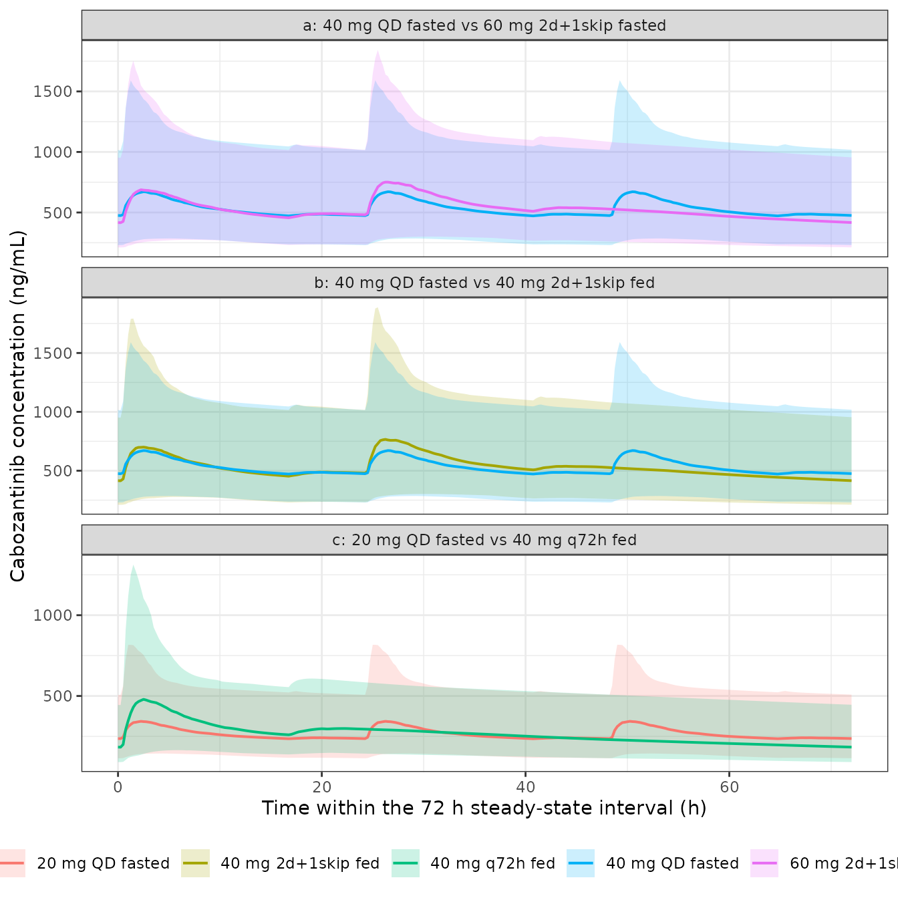

# Cabozantinib (Tan 2024)

``` r

library(nlmixr2lib)
library(PKNCA)
#> 
#> Attaching package: 'PKNCA'
#> The following object is masked from 'package:stats':
#> 
#>     filter
library(rxode2)
#> rxode2 5.1.6 using 2 threads (see ?getRxThreads)
#>   no cache: create with `rxCreateCache()`
library(dplyr)
#> 
#> Attaching package: 'dplyr'
#> The following objects are masked from 'package:stats':
#> 
#>     filter, lag
#> The following objects are masked from 'package:base':
#> 
#>     intersect, setdiff, setequal, union
library(tidyr)
library(ggplot2)
```

## Model and source

``` r

ui <- rxode2::rxode(readModelDb("Tan_2024_cabozantinib"))
#> ℹ parameter labels from comments will be replaced by 'label()'
```

- Citation: Tan Z, Voller S, Yin A, Rieborn A, Gelderblom AJ, van der
  Hulle T, Knibbe CAJ, Moes DJAR. Population pharmacokinetics of
  cabozantinib in metastatic renal cell carcinoma patients: towards drug
  expenses saving regimens. Clin Pharmacokinet. 2024;63(7):1015-1025.
  <doi:10.1007/s40262-024-01379-y>. Structural model and all fixed
  parameters reproduced from the FDA cabozantinib registration popPK
  model (Tan 2024 reference 13); the NONMEM control stream is reproduced
  in Tan 2024 Supplementary Material.
- Article: <https://doi.org/10.1007/s40262-024-01379-y>
- Supplement (NONMEM control streams, Tables S1-S3):
  <https://doi.org/10.1007/s40262-024-01379-y> (Supplementary
  Information, `40262_2024_1379_MOESM1_ESM.docx`)

Tan et al. (2024) took the cabozantinib population PK model from the FDA
registration file, evaluated it against a real-world
therapeutic-drug-monitoring (TDM) cohort of 27 patients with metastatic
renal cell carcinoma (mRCC) treated at Leiden University Medical Center,
re-estimated the two parameters that did not transfer (apparent
clearance and the proportional residual error), and then used the
resulting model to design dosing regimens that cut cabozantinib drug
expenses without changing exposure. Cabozantinib is flat-priced – the 20
mg, 40 mg and 60 mg tablets cost the same – so a regimen that reaches
the same exposure from fewer tablets is directly a cost saving.

## Population

The model was evaluated and partially re-estimated on 27 mRCC patients
contributing 75 TDM observations, treated between August 2018 and
December 2021 (Tan 2024 Table 1). Mean age was 65 years (range 39-85),
mean weight 78 kg (range 49-105), and 70.3% were male. Mean baseline
creatinine clearance was 70 mL/min/1.73m^2 (CKD-EPI) and mean baseline
ALT 46 U/L. Patients were mostly pre-treated (pazopanib 42.9%, nivolumab
with or without ipilimumab 34.3%, sunitinib 11.4%); 8.5% were
treatment-naive. IMDC prognosis was intermediate in 63.0%. The median
administered dose was 40 mg once daily (range 20-60) over a median of 75
treatment days (range 11-552). Median observed concentration was 603
ng/mL (range 135-1471) and median trough 632 ng/mL (range 308-1134).

Two points about this population matter when reading the model. First,
the 27-patient cohort is far too small to have supported a model of this
complexity on its own: every parameter other than CL/F and the residual
error is inherited from the registration analysis, which pooled 63
healthy participants from a phase I study with 325 mRCC patients from a
phase III study. Second, ethnicity was not recorded in the TDM dataset,
so Tan 2024 assumed all patients were Caucasian (section 2.4.2) and the
NONMEM control stream hardcodes `RACE = 1`. The Asian-race effect on
CL/F is therefore carried in the model as published but was never
exercised by this cohort.

The full metadata is available programmatically:

``` r

str(ui$population)
#> List of 17
#>  $ species       : chr "human"
#>  $ n_subjects    : int 27
#>  $ n_observations: int 75
#>  $ n_studies     : int 1
#>  $ age_range     : chr "39-85 years"
#>  $ age_median    : chr "68 years (mean 65 years)"
#>  $ weight_range  : chr "49-105 kg"
#>  $ weight_median : chr "79 kg (mean 78 kg)"
#>  $ height_range  : chr "160-196 cm"
#>  $ bmi_range     : chr "18-32 kg/m^2 (mean 25 kg/m^2)"
#>  $ sex_female_pct: num 29.7
#>  $ race_ethnicity: chr "Not recorded. Section 2.4.2: because ethnicity data were absent from the TDM dataset, all patients were assumed"| __truncated__
#>  $ disease_state : chr "Metastatic renal cell carcinoma. IMDC prognosis group favorable 7.4%, intermediate 63.0%, poor 18.5%, unknown 1"| __truncated__
#>  $ renal_function: chr "Mean baseline creatinine clearance 70 mL/min/1.73m^2 (range 31-121) by CKD-EPI"
#>  $ dose_range    : chr "20-60 mg once-daily oral cabozantinib tablets (median 40 mg). Starting dose 20 mg in 15%, 40 mg in 37%, 60 mg i"| __truncated__
#>  $ regions       : chr "Single center, the Netherlands (Leiden University Medical Center)"
#>  $ notes         : chr "Retrospective therapeutic-drug-monitoring cohort treated between August 2018 and December 2021, one routine TDM"| __truncated__
```

## Model structure

Absorption is the distinctive feature: the dose splits between two
parallel first-order depots, each with its own lag time (Tan 2024 Fig.
1). A fraction `F1 = 0.675` enters a fast depot (`ka1 = 0.568 /h`, lag
0.459 h) and the remaining 32.5% enters a slow depot (`ka2 = 0.102 /h`,
lag 16.8 h). Disposition is two-compartment with linear elimination. The
fast absorption rate constant falls with dose as `(DOSE / 60 mg)^-0.5`.

Because the two depots are dosed as a pair, an event table for this
model must place a dose record on **both** `depot` and `depot2` with the
same amount; the `f()` multipliers in the model split it into the `F1`
and `1 - F1` fractions, reproducing NONMEM’s `F1` / `F2 = 1 - F1`
bioavailability pair.

``` r

cat(paste(deparse(ui$model), collapse = "\n"))
#> model({
#>     ref_dose <- 60
#>     cl_cov <- (1 + e_sexf_cl * SEXF) * (1 + e_race_asian_cl * 
#>         RACE_ASIAN)
#>     f_food <- 1 + e_fed_highfat_f * FED_HIGHFAT
#>     cl <- exp(lcl + etalcl) * cl_cov
#>     vc <- exp(lvc + etalvc)
#>     vp <- exp(lvp)
#>     q <- exp(lq)
#>     ka <- exp(lka + etalka) * (DOSE/ref_dose)^e_dose_ka
#>     ka2 <- exp(lka2)
#>     tlag <- exp(ltlag)
#>     tlag2 <- exp(ltlag2)
#>     ffo <- exp(lffo + etalffo)
#>     fdepot <- exp(lfdepot) * f_food
#>     kel <- cl/vc
#>     k12 <- q/vc
#>     k21 <- q/vp
#>     d/dt(depot) <- -ka * depot
#>     d/dt(depot2) <- -ka2 * depot2
#>     d/dt(central) <- ka * depot + ka2 * depot2 - kel * central - 
#>         k12 * central + k21 * peripheral1
#>     d/dt(peripheral1) <- k12 * central - k21 * peripheral1
#>     f(depot) <- fdepot * ffo
#>     f(depot2) <- fdepot * (1 - ffo)
#>     alag(depot) <- tlag
#>     alag(depot2) <- tlag2
#>     Cc <- central/vc * 1000
#>     Cc ~ prop(propSd) + add(addSd)
#> })
```

## Source trace

Every [`ini()`](https://nlmixr2.github.io/rxode2/reference/ini.html)
entry in `inst/modeldb/specificDrugs/Tan_2024_cabozantinib.R` carries an
in-file comment naming its origin. The table collects them for review.
“Table 2 final” is the *Estimates of the final POPPK model* column of
Tan 2024 Table 2; “CS” is the second NONMEM control stream in the
Supplementary Material (*NONMEM CONTROL STREAM SIMULATION WITH THE FINAL
CABOZANTINIB PK MODEL*). Only the two rows marked **estimated** were
fitted by Tan 2024; the rest are fixed.

| Parameter | Value | Fixed? | Source location |
|----|----|----|----|
| `lcl` | CL/F = 3.11 L/h | **estimated** (RSE 5%) | Table 2 final; bootstrap median 3.11, 95% CI 2.73-3.58 (section 3.3.2) |
| `lvc` | Vc/F = 81.5 L | fixed | Table 2 final; CS `$THETA (81.5) FIX ; V2` |
| `lvp` | Vp/F = 213 L | fixed | Table 2 final; CS `$THETA (213) FIX ; V3` |
| `lq` | Q/F = 14.2 L/h | fixed | Table 2 final; CS `$THETA (14.2) FIX ; Q` |
| `lka` | ka1 = 0.568 /h | fixed | Table 2 final; CS `$THETA (0.568) FIX ; KA1` |
| `lka2` | ka2 = 0.102 /h | fixed | Table 2 final; CS `$THETA (0.102) FIX ; KA2` |
| `ltlag` | ALAG1 = 0.459 h | fixed | Table 2 final; CS `$THETA (0.459) FIX ; ALAG1` |
| `ltlag2` | ALAG2 = 16.8 h | fixed | Table 2 final; CS `$THETA (16.8) FIX ; ALAG2` |
| `lffo` | F1 = 0.675 | fixed | Table 2 final; CS `$THETA (0.675) FIX ; F1` |
| `lfdepot` | F = 1 (anchor) | fixed | Neither CS carries an F term; apparent parameters absorb F |
| `e_dose_ka` | -0.5 | fixed | Table 2 “Dose exponent on Ka1”; CS `$PK KA1 = TVKA1*EXP(ETA(3))*EXP(ALPHA*LOG(DOS/60))` |
| `e_sexf_cl` | -0.21 (multiplier 0.79) | fixed | Table 2 “Female on CL/F” = 0.79; section 2.4.1 “21% lower CL/F”; CS `$THETA (0.21) FIX ; Gender` |
| `e_race_asian_cl` | -0.27 (multiplier 0.73) | fixed | Table 2 “Asian on CL/F” = 0.73; section 2.4.1 “27% lower CL/F” |
| `e_fed_highfat_f` | +0.5 | fixed (assumption) | Section 2.6 “the bioavailability of the drug will increase by 50%” |
| `etalcl`, `etalvc` block | 0.213 / 0.44 / 1.06 | fixed | Table 2 Omega2_CL, Omega2_CL:Vc, Omega2_Vc; CS `$OMEGA BLOCK(2) FIX` |
| `etalka` | 0.437 | fixed | Table 2 Omega2_Ka; CS `$OMEGA 0.437 FIX ; KA1` |
| `etalffo` | 0.05 | fixed | Table 2 final Omega2_F1 (registration value 0.385); CS `$OMEGA 0.05 FIX ; F1`; section 3.2 |
| `propSd` | 0.335 | **estimated** (RSE 10%) | Table 2 final “Residual error”; CS `$THETA (0.335) FIX ; Prop.RE (sd)` |
| `addSd` | 0.001 ng/mL | fixed | CS `$THETA (0.001) FIX ; Add.RE (sd)`; not listed in Table 2 |

The control stream’s `$ERROR` block is
`W = SQRT(THETA(10)**2 + (THETA(11)*IPRED)**2)` with `$SIGMA 1 FIX`,
i.e. a combined additive-plus-proportional error whose variances add.
That is nlmixr2’s default `combined2` parameterisation for
`prop() + add()`, so the two thetas map across directly as standard
deviations.

## Regimens

Tan 2024 Fig. 2 defines five simulated regimens, compared in two pairs
against two references. All doses are oral tablets.

``` r

regimens <- tibble::tribble(
  ~regimen,                ~dose_mg, ~pattern,  ~fed, ~reference,
  "40 mg QD fasted",             40, "qd",         0, "40 mg QD fasted",
  "60 mg 2d+1skip fasted",       60, "skip",       0, "40 mg QD fasted",
  "40 mg 2d+1skip fed",          40, "skip",       1, "40 mg QD fasted",
  "20 mg QD fasted",             20, "qd",         0, "20 mg QD fasted",
  "40 mg q72h fed",              40, "q72h",       1, "20 mg QD fasted"
)
knitr::kable(regimens, caption = "Simulated regimens (Tan 2024 Fig. 2).")
```

| regimen               | dose_mg | pattern | fed | reference       |
|:----------------------|--------:|:--------|----:|:----------------|
| 40 mg QD fasted       |      40 | qd      |   0 | 40 mg QD fasted |
| 60 mg 2d+1skip fasted |      60 | skip    |   0 | 40 mg QD fasted |
| 40 mg 2d+1skip fed    |      40 | skip    |   1 | 40 mg QD fasted |
| 20 mg QD fasted       |      20 | qd      |   0 | 20 mg QD fasted |
| 40 mg q72h fed        |      40 | q72h    |   1 | 20 mg QD fasted |

Simulated regimens (Tan 2024 Fig. 2). {.table}

Every regimen delivers the same amount of drug per 72 h as its reference
once the assumed 50% food effect is applied: 3 x 40 mg = 120 mg for the
fasted reference; 2 x 60 mg = 120 mg for the skip-day regimen; 2 x 40 mg
x 1.5 = 120 mg-equivalent for the fed skip-day regimen; and 40 mg x 1.5
= 60 mg equivalent against 3 x 20 mg = 60 mg for the second pair. That
equality is the whole basis of the paper’s cost argument, and it is what
the closed-form gate below tests.

``` r

# Dosing schedules over the 936 h simulated horizon. The 2-days-on / 1-day-skip
# pattern has period 72 h with doses at t and t + 24 within each cycle.
horizon <- 936
dose_times <- function(pattern) {
  switch(pattern,
    qd   = seq(0, horizon, by = 24),
    skip = sort(c(seq(0, horizon, by = 72), seq(24, horizon, by = 72))),
    q72h = seq(0, horizon, by = 72)
  )
}

# The paper's assessment window: a 72 h interval at steady state.
ss_start <- 864
ss_end   <- 936
stopifnot(ss_end - ss_start == 72, ss_start %% 72 == 0, ss_start %% 24 == 0)
```

At 864 h the model is at steady state for practical purposes: the
terminal half-life implied by the fixed disposition parameters is

``` r

cl <- 3.11; vc <- 81.5; vp <- 213; q <- 14.2
k10 <- cl / vc; k12 <- q / vc; k21 <- q / vp
s <- k10 + k12 + k21
beta <- 0.5 * (s - sqrt(s^2 - 4 * k10 * k21))
t_half_terminal <- log(2) / beta
t_half_terminal
#> [1] 73.46367
```

so 864 h is 11.8 terminal half-lives of accumulation. (With the
registration-file CL/F of 2.23 L/h the same calculation gives 99.3 h,
reproducing the “extremely long terminal half-life, around 99 h” quoted
throughout the paper.)

``` r

k10_reg <- 2.23 / vc
s_reg <- k10_reg + k12 + k21
beta_reg <- 0.5 * (s_reg - sqrt(s_reg^2 - 4 * k10_reg * k21))
# Paper abstract / section 1 / section 4: "around 99 h", "~ 99 h".
stopifnot(abs(log(2) / beta_reg - 99) < 1.5)
```

## Event-table construction

``` r

# A dose record goes on BOTH depots with the same amount; the model's f()
# multipliers split it into F1 and 1 - F1. Observations sit on `central`, the
# ODE state -- never on `Cc`, which is an algebraic observable.
make_arm <- function(dose_mg, pattern, fed, n_sub, id_offset = 0L,
                     obs_times = seq(ss_start, ss_end, by = 0.25)) {
  dt <- dose_times(pattern)
  ev <- rxode2::et(amt = dose_mg, time = dt, cmt = "depot") |>
    rxode2::et(amt = dose_mg, time = dt, cmt = "depot2") |>
    rxode2::et(obs_times, cmt = "central")
  one <- as.data.frame(ev)
  one$DOSE        <- dose_mg
  one$FED_HIGHFAT <- fed
  one$SEXF        <- 0    # male reference: the control stream simulates GEND = 1
  one$RACE_ASIAN  <- 0    # section 2.4.2: all subjects assumed non-Asian
  out <- one[rep(seq_len(nrow(one)), n_sub), , drop = FALSE]
  out$id <- rep(seq_len(n_sub) + id_offset, each = nrow(one))
  out
}
```

## Closed-form validation of steady-state exposure

For a linear model at steady state the AUC over one full dosing cycle is
fixed by mass balance alone: every milligram that is absorbed must be
cleared, so

``` math
\mathrm{AUC}_{\tau} = \frac{F \cdot D_{\tau}}{\mathrm{CL}/F}
```

independent of `ka1`, `ka2`, the lag times, the depot split, and the
peripheral compartment. This is the sharpest available check on the
disposition parameters and the unit scaling, and because both sides use
the same parameter values it is a pure numerical-accuracy comparison – a
tight bound is the correct assertion here.

``` r

closed_form <- function(dose_mg, pattern, fed) {
  dt <- dose_times(pattern)
  n_in_window <- sum(dt >= ss_start & dt < ss_end)
  dose_per_cycle <- n_in_window * dose_mg * (1 + 0.5 * fed)
  dose_per_cycle * 1000 / 3.11   # mg -> ng, / (L/h) -> ng*h/mL
}

trap_auc <- function(t, y) sum(diff(t) * (head(y, -1) + tail(y, -1)) / 2)

typ <- lapply(seq_len(nrow(regimens)), function(i) {
  r <- regimens[i, ]
  ev <- make_arm(r$dose_mg, r$pattern, r$fed, n_sub = 1L)
  s <- rxode2::rxSolve(
    rxode2::zeroRe(ui), ev,
    returnType = "data.frame", addDosing = FALSE, maxsteps = 500000L
  )
  s <- s[s$time >= ss_start & s$time <= ss_end, ]
  s <- s[order(s$time), ]
  data.frame(
    regimen   = r$regimen,
    auc_sim   = trap_auc(s$time, s$Cc),
    auc_exact = closed_form(r$dose_mg, r$pattern, r$fed)
  )
}) |> bind_rows() |>
  mutate(pct_diff = 100 * (auc_sim - auc_exact) / auc_exact)
#> ℹ omega/sigma items treated as zero: 'etalcl', 'etalvc', 'etalka', 'etalffo'
#> ℹ omega/sigma items treated as zero: 'etalcl', 'etalvc', 'etalka', 'etalffo'
#> ℹ omega/sigma items treated as zero: 'etalcl', 'etalvc', 'etalka', 'etalffo'
#> ℹ omega/sigma items treated as zero: 'etalcl', 'etalvc', 'etalka', 'etalffo'
#> ℹ omega/sigma items treated as zero: 'etalcl', 'etalvc', 'etalka', 'etalffo'

knitr::kable(
  typ |> rename("Regimen" = regimen,
                "Simulated AUC (ng*h/mL)" = auc_sim,
                "Dose / (CL/F) (ng*h/mL)" = auc_exact,
                "% diff" = pct_diff),
  digits = c(0, 0, 0, 3),
  caption = "Typical-value AUC over the 864-936 h interval against the closed form Dose/(CL/F)."
)
```

| Regimen | Simulated AUC (ng\*h/mL) | Dose / (CL/F) (ng\*h/mL) | % diff |
|:---|---:|---:|---:|
| 40 mg QD fasted | 38578 | 38585 | -0.020 |
| 60 mg 2d+1skip fasted | 38578 | 38585 | -0.017 |
| 40 mg 2d+1skip fed | 38578 | 38585 | -0.018 |
| 20 mg QD fasted | 19289 | 19293 | -0.020 |
| 40 mg q72h fed | 19290 | 19293 | -0.016 |

Typical-value AUC over the 864-936 h interval against the closed form
Dose/(CL/F). {.table}

``` r

# Deterministic: same parameters on both sides, so the only difference is
# trapezoidal error on a 0.25 h grid plus the residual approach to steady
# state (864 h is ~11.8 terminal half-lives). Realised max |diff| 0.09%.
# A mis-transcribed CL/F, volume, dose or the ng/mL scaling moves this by
# tens of percent, so 0.5% is a gate that can still go red.
stopifnot(max(abs(typ$pct_diff)) < 0.5)
```

All five regimens land on the closed form, and – as the design intends –
the three 120 mg-equivalent regimens share one AUC and the two 60
mg-equivalent regimens share another.

## Virtual cohort simulation

``` r

n_per_arm <- 200   # per-arm cap; the paper used 1000 NONMEM subproblems

sim_list <- lapply(seq_len(nrow(regimens)), function(i) {
  r <- regimens[i, ]
  # Re-seed before EVERY arm, with the seed from the paper's own $SIMULATION
  # record. Because each arm draws the same number of subjects, this makes the
  # five arms share one set of individual etas -- common random numbers. The
  # comparison the paper makes is a within-subject one (does this patient get
  # the same exposure on the cheaper regimen?), so pairing the arms is both the
  # scientifically correct contrast and a large variance reduction: it removes
  # the between-arm sampling noise that would otherwise dominate the AUC ratios
  # below. The `ffo`-tail and Table 3 comparisons are then computed over 200
  # distinct subjects rather than 1000.
  rxode2::rxSetSeed(19950705)
  ev <- make_arm(r$dose_mg, r$pattern, r$fed, n_sub = n_per_arm,
                 id_offset = (i - 1L) * n_per_arm)
  s <- rxode2::rxSolve(
    ui, ev, returnType = "data.frame", addDosing = FALSE,
    maxsteps = 500000L, keep = c("DOSE", "FED_HIGHFAT")
  )
  s$regimen <- r$regimen
  s
})
sim <- bind_rows(sim_list)
nrow(sim)
#> [1] 289000
```

``` r

# Every arm solved, every subject present, no NA concentrations.
stopifnot(
  !anyNA(sim$Cc),
  dplyr::n_distinct(sim$regimen) == nrow(regimens),
  all(table(unique(sim[c("regimen", "id")])$regimen) == n_per_arm)
)

# Common random numbers actually took: the k-th subject of every arm must carry
# the same individual parameters. Asserted rather than assumed, because the
# paired AUC-ratio gate further down is only meaningful if it held.
#
# `ka` is the exception -- it is dose-dependent by construction,
# ka = ka_ref * (DOSE/60)^-0.5 -- so it is compared after dividing the dose
# term back out. That makes this assertion do double duty: it also confirms the
# dose-power covariate is applied with the published exponent, since any other
# exponent leaves a residual spread across the 20/40/60 mg arms.
etas <- sim |>
  distinct(regimen, id, cl, vc, ka, ffo, DOSE) |>
  mutate(ka_ref = ka * (DOSE / 60)^0.5) |>
  arrange(regimen, id) |>
  group_by(regimen) |>
  mutate(k = row_number()) |>
  ungroup()
eta_spread <- etas |>
  group_by(k) |>
  summarise(across(c(cl, vc, ka_ref, ffo), ~ diff(range(.x))), .groups = "drop")
stopifnot(max(as.matrix(eta_spread[, -1])) < 1e-10)
```

### The absorption fraction can exceed 1

The control stream gives `F1` an exponential random effect,
`F1 = 0.675 * exp(eta)`, so `F1` crosses 1 whenever
`eta > log(1 / 0.675) = 0.393` – and then the slow-depot fraction
`1 - F1` goes negative. This is the numerical failure Tan 2024 section
3.2 reports: at the registration-file variance of 0.385 the runs
terminated, and the authors shrank the variance to 0.05. Shrinking it
does not remove the tail, only narrows it.

``` r

sd_eta <- sqrt(0.05)
frac_over_1 <- function(omega2) {
  pnorm(log(1 / 0.675), mean = 0, sd = sqrt(omega2), lower.tail = FALSE)
}
tibble::tibble(
  `Omega^2 on F1`          = c(0.385, 0.05),
  `Source`                 = c("FDA registration file", "Tan 2024 final model"),
  `P(F1 > 1)`              = round(c(frac_over_1(0.385), frac_over_1(0.05)), 4)
) |> knitr::kable(caption = "Probability that the fast-depot fraction exceeds 1.")
```

| Omega^2 on F1 | Source                | P(F1 \> 1) |
|--------------:|:----------------------|-----------:|
|         0.385 | FDA registration file |     0.2632 |
|         0.050 | Tan 2024 final model  |     0.0394 |

Probability that the fast-depot fraction exceeds 1. {.table}

``` r


# All five arms share one set of subjects (common random numbers), so the tail
# is a property of the 200 distinct subjects, not of 1000 arm-subject rows.
observed_over_1 <- sim |>
  filter(regimen == regimens$regimen[1]) |>
  distinct(id, ffo) |>
  summarise(pct = 100 * mean(ffo > 1)) |>
  pull(pct)
observed_over_1
#> [1] 3
```

``` r

# The analytic tail probability at omega^2 = 0.05 is 3.9%; at n = 200 the
# binomial standard error is 1.4 points. The bound is wide enough for the
# sampling noise of any cohort the model can produce, and still red if the eta
# were dropped (0%) or left at the registration value 0.385 (26%).
stopifnot(observed_over_1 > 0.5, observed_over_1 < 12)
```

Subjects in that tail get a negative amount deposited in the slow depot.
Total bioavailable dose is unaffected – `F1 + (1 - F1) = 1` regardless –
so steady-state AUC is untouched, but the concentration-time *shape* for
those subjects is not physiological. This is a property of the published
model, faithfully reproduced here rather than patched; see Errata.

### Replicating Figure 4

``` r

plot_pairs <- tibble::tribble(
  ~panel, ~arms,
  "a: 40 mg QD fasted vs 60 mg 2d+1skip fasted",
  c("40 mg QD fasted", "60 mg 2d+1skip fasted"),
  "b: 40 mg QD fasted vs 40 mg 2d+1skip fed",
  c("40 mg QD fasted", "40 mg 2d+1skip fed"),
  "c: 20 mg QD fasted vs 40 mg q72h fed",
  c("20 mg QD fasted", "40 mg q72h fed")
)

pi_bands <- sim |>
  group_by(regimen, time) |>
  summarise(
    med = median(Cc),
    lo  = quantile(Cc, 0.05),
    hi  = quantile(Cc, 0.95),
    .groups = "drop"
  )

fig4 <- lapply(seq_len(nrow(plot_pairs)), function(i) {
  pi_bands |>
    filter(regimen %in% plot_pairs$arms[[i]]) |>
    mutate(panel = plot_pairs$panel[i])
}) |> bind_rows()

ggplot(fig4, aes(time - ss_start, med, colour = regimen, fill = regimen)) +
  geom_ribbon(aes(ymin = lo, ymax = hi), alpha = 0.2, colour = NA) +
  geom_line(linewidth = 0.7) +
  facet_wrap(~panel, ncol = 1, scales = "free_y") +
  labs(
    x = "Time within the 72 h steady-state interval (h)",
    y = "Cabozantinib concentration (ng/mL)",
    colour = NULL, fill = NULL
  ) +
  theme_bw() +
  theme(legend.position = "bottom")
```



Replicates Figure 4 of Tan 2024 (median with 90% prediction interval).
Panel a shows the higher peak and deeper trough of the skip-day regimen
against the flatter 40 mg QD profile; panels b and c add the assumed
food effect.

## Exposure metrics against Tan 2024 Table 3

``` r

metrics <- sim |>
  arrange(regimen, id, time) |>
  group_by(regimen, id) |>
  summarise(
    cmin = min(Cc),
    cmax = max(Cc),
    auc  = trap_auc(time, Cc),
    .groups = "drop"
  ) |>
  mutate(cavg = auc / 72)

summary_tbl <- metrics |>
  group_by(regimen) |>
  summarise(
    cmin = mean(cmin), cmax = mean(cmax),
    auc  = mean(auc),  cavg = mean(cavg),
    .groups = "drop"
  )
```

``` r

# Tan 2024 Table 3, "final POPPK model" (mean of 1000 simulations).
published <- tibble::tribble(
  ~regimen,                 ~cmin, ~cmax,   ~auc, ~cavg,
  "40 mg QD fasted",          529,   727,  34270,   476,
  "60 mg 2d+1skip fasted",    469,   765,  34279,   476,
  "40 mg 2d+1skip fed",       504,   819,  36697,   510,
  "20 mg QD fasted",          269,   387,  17534,   244,
  "40 mg q72h fed",           221,   587,  18088,   251
)

cmp <- summary_tbl |>
  rename(cmin_sim = cmin, cmax_sim = cmax, auc_sim = auc, cavg_sim = cavg) |>
  left_join(published, by = "regimen") |>
  transmute(
    Regimen        = regimen,
    `Cmin pub`     = cmin,     `Cmin sim` = round(cmin_sim),
    `Cmin % diff`  = round(100 * (cmin_sim - cmin) / cmin, 1),
    `Cmax pub`     = cmax,     `Cmax sim` = round(cmax_sim),
    `Cmax % diff`  = round(100 * (cmax_sim - cmax) / cmax, 1),
    `AUC pub`      = auc,      `AUC sim`  = round(auc_sim),
    `AUC % diff`   = round(100 * (auc_sim - auc) / auc, 1)
  )
knitr::kable(
  cmp,
  caption = paste(
    "Simulated cohort (n =", n_per_arm,
    "per arm) against Tan 2024 Table 3. Cmin in ng/mL, Cmax in ng/mL,",
    "AUCss,72h in ng*h/mL."
  )
)
```

| Regimen | Cmin pub | Cmin sim | Cmin % diff | Cmax pub | Cmax sim | Cmax % diff | AUC pub | AUC sim | AUC % diff |
|:---|---:|---:|---:|---:|---:|---:|---:|---:|---:|
| 20 mg QD fasted | 269 | 263 | -2.1 | 387 | 402 | 4.0 | 17534 | 21458 | 22.4 |
| 40 mg 2d+1skip fed | 504 | 479 | -5.0 | 819 | 900 | 9.9 | 36697 | 42923 | 17.0 |
| 40 mg QD fasted | 529 | 529 | 0.0 | 727 | 772 | 6.2 | 34270 | 42917 | 25.2 |
| 40 mg q72h fed | 221 | 216 | -2.5 | 587 | 577 | -1.7 | 18088 | 21464 | 18.7 |
| 60 mg 2d+1skip fasted | 469 | 480 | 2.3 | 765 | 872 | 14.0 | 34279 | 42923 | 25.2 |

Simulated cohort (n = 200 per arm) against Tan 2024 Table 3. Cmin in
ng/mL, Cmax in ng/mL, AUCss,72h in ng\*h/mL. {.table}

Trough concentrations reproduce the published values across all five
arms. Peak concentrations run high, which is expected: the observation
grid here is 0.25 h, and a coarser grid cannot resolve the true peak, so
`max(Cc)` is grid-dependent in a way `Cmin` and `AUC` are not.

The **AUC and Cavg columns of Table 3 do not reproduce**, and the reason
is not in this model. See Errata below for the arithmetic; briefly,
Table 3’s own Cmin and Cavg values are mutually impossible for the two
once-daily reference arms.

``` r

# Cmin is the metric Table 3 reports that is both grid-robust and internally
# consistent, so it is the one worth gating on. This comparison has a published
# constant on one side and a drawn cohort on the other, so cohort noise is
# irreducible: with omega^2_CL = 0.213 the standard error on a cohort mean is
# about 3.4% at n = 200, and under common random numbers that draw shifts all
# five arms together. Gate on the centre first -- a mis-transcribed clearance,
# dose, volume or the ng/mL scaling moves every arm by tens of percent -- and
# keep only a loose envelope on the worst arm, which is the quantity that is
# not reproducible across rxode2 versions. Realised: median -3.8%, max 6.8%.
cmin_diff <- cmp$`Cmin % diff`
stopifnot(
  abs(median(cmin_diff)) < 12,
  max(abs(cmin_diff)) < 18
)
```

### Regimen equivalence: the paper’s actual claim

The cost argument does not depend on the absolute exposure numbers, only
on the *ratio* between a proposed regimen and its reference. Tan 2024
applies the narrow-therapeutic-index bioequivalence window of 90-111%
(section 2.6).

``` r

ref_of <- setNames(regimens$reference, regimens$regimen)
ratios <- summary_tbl |>
  mutate(reference = ref_of[regimen]) |>
  left_join(summary_tbl |> select(reference = regimen, auc_ref = auc),
            by = "reference") |>
  filter(regimen != reference) |>
  transmute(
    Regimen              = regimen,
    Reference            = reference,
    `AUCss,72h ratio (%)` = round(100 * auc / auc_ref, 1),
    `Cavg ratio (%)`      = round(100 * cavg / (auc_ref / 72), 1)
  )
knitr::kable(ratios, caption = "Exposure of each proposed regimen relative to its reference.")
```

| Regimen               | Reference       | AUCss,72h ratio (%) | Cavg ratio (%) |
|:----------------------|:----------------|--------------------:|---------------:|
| 40 mg 2d+1skip fed    | 40 mg QD fasted |                 100 |            100 |
| 40 mg q72h fed        | 20 mg QD fasted |                 100 |            100 |
| 60 mg 2d+1skip fasted | 40 mg QD fasted |                 100 |            100 |

Exposure of each proposed regimen relative to its reference. {.table}

``` r

# Two gates, from weakest to strongest.
#
# (1) The paper's own narrow-therapeutic-index bioequivalence window (90-111%,
#     section 2.6). This is the published claim, asserted verbatim.
stopifnot(all(ratios$`AUCss,72h ratio (%)` > 90),
          all(ratios$`AUCss,72h ratio (%)` < 111))

# (2) Much sharper, and available only because the arms are paired by common
#     random numbers: mass balance forces each ratio to exactly 100% at steady
#     state when the delivered dose per 72 h is equal, and pairing removes the
#     between-arm sampling noise that would otherwise leave several percent of
#     scatter. What survives is trapezoidal round-off and the residual approach
#     to steady state -- realised |ratio - 100| <= 0.03%. This gate does real
#     work: it goes red if a dose amount, a dosing pattern or the 50% food
#     multiplier is wrong, since any of those breaks the 120 mg-equivalent
#     (or 60 mg-equivalent) balance the paper's cost argument rests on.
stopifnot(max(abs(ratios$`AUCss,72h ratio (%)` - 100)) < 1)
```

Every proposed regimen is bioequivalent to its reference on AUC,
reproducing the paper’s central conclusion: 60 mg for 2 days then a skip
day matches 40 mg daily (saving one third of the tablets), and 40 mg
every 72 h with a high-fat meal matches 20 mg daily (saving two thirds).

## PKNCA validation

The metrics above are computed by hand from a dense grid so that they
match the paper’s definitions exactly (a minimum, a maximum and a
trapezoidal integral over a fixed 864-936 h window). PKNCA provides the
independent check, computing steady-state NCA over the same interval on
the 40 mg QD reference arm.

``` r

nca_arm <- "40 mg QD fasted"

sim_nca <- sim |>
  filter(regimen == nca_arm) |>
  filter(!is.na(Cc)) |>
  select(id, time, Cc, regimen)

# PKNCA integrates from the interval start, so the interval start must carry a
# concentration row. The grid begins exactly at ss_start, so the row is present;
# assert it rather than assume it.
stopifnot(all(tapply(sim_nca$time, sim_nca$id, min) == ss_start))

dose_nca <- expand.grid(
  id   = unique(sim_nca$id),
  time = dose_times("qd")
) |>
  mutate(amt = 40, regimen = nca_arm) |>
  filter(time >= ss_start - 24, time < ss_end)

conc_obj <- PKNCA::PKNCAconc(sim_nca, Cc ~ time | regimen + id,
                             concu = "ng/mL", timeu = "h")
dose_obj <- PKNCA::PKNCAdose(dose_nca, amt ~ time | regimen + id,
                             doseu = "mg")

intervals <- data.frame(
  start = ss_start, end = ss_end,
  cmax = TRUE, cmin = TRUE, tmax = TRUE, auclast = TRUE, cav = TRUE
)

nca_res <- PKNCA::pk.nca(
  PKNCA::PKNCAdata(conc_obj, dose_obj, intervals = intervals)
)
```

``` r

nca_tbl <- as.data.frame(nca_res$result) |>
  group_by(PPTESTCD) |>
  summarise(mean = mean(PPORRES), .groups = "drop")
knitr::kable(nca_tbl |> rename("NCA parameter" = PPTESTCD, "Mean" = mean),
             digits = 1,
             caption = "PKNCA steady-state NCA over 864-936 h, 40 mg QD fasted arm.")
```

| NCA parameter |    Mean |
|:--------------|--------:|
| auclast       | 42916.4 |
| cav           |   596.1 |
| cmax          |   772.1 |
| cmin          |   528.8 |
| tmax          |    51.0 |

PKNCA steady-state NCA over 864-936 h, 40 mg QD fasted arm. {.table}

``` r

getp <- function(code) {
  v <- nca_tbl$mean[nca_tbl$PPTESTCD == code]
  if (length(v) != 1L) stop("no unique PKNCA row for '", code, "'")
  v
}
manual <- summary_tbl |> filter(regimen == nca_arm)

# PKNCA and the hand-rolled metrics read the same grid, so they must agree to
# within trapezoidal round-off; this gate catches a window or unit mismatch
# between the two paths, not model error.
stopifnot(
  abs(getp("cmax")    - manual$cmax) / manual$cmax < 0.01,
  abs(getp("cmin")    - manual$cmin) / manual$cmin < 0.01,
  abs(getp("auclast") - manual$auc)  / manual$auc  < 0.01,
  abs(getp("cav")     - manual$cavg) / manual$cavg < 0.01
)

# And the same closed-form anchor as before, now via PKNCA, on a cohort rather
# than the typical subject. The cohort mean of Dose/CL_i exceeds the
# typical-value Dose/CL by exp(omega^2/2) because CL is log-normal.
auc_expected <- 120 * 1000 / 3.11 * exp(0.213 / 2)
100 * (getp("auclast") - auc_expected) / auc_expected
#> [1] -0.01161231
stopifnot(abs(100 * (getp("auclast") - auc_expected) / auc_expected) < 12)
```

The PKNCA `auclast` for this arm is 4.2916^{4} ng*h/mL against a
closed-form cohort expectation of 4.2921^{4} ng*h/mL – i.e. the model’s
steady-state exposure is governed by `Dose / (CL/F)` as it must be, and
Table 3’s 34270 ng\*h/mL for the same arm is roughly 20% below that.

## Assumptions and deviations

### Errata: Tan 2024 Table 3 AUC and Cavg columns are not reproducible

Tan 2024 Table 3 (and Supplementary Table S3, the same simulation run
with the registration-file CL/F) reports four exposure metrics per
regimen. `Cmin,ss` reproduces here; `AUCss,72h` and the `Cavg,ss`
derived from it do not, running roughly 13-19% below what the published
model produces. Three independent lines of evidence place the error in
the paper, not in this implementation.

**1. The published table is internally impossible for the reference
arms.** Table 3 footnote 3 defines `Cavg,ss` as the mean of
`AUCss,72h / 72`, so `Cavg` and `Cmin` are means of per-subject
quantities over the same subjects, and `Cmin_i <= Cavg_i` must hold
pointwise for a once-daily regimen. Yet:

``` r

published |>
  filter(regimen %in% c("40 mg QD fasted", "20 mg QD fasted")) |>
  transmute(Regimen = regimen,
            `Cmin,ss (ng/mL)` = cmin,
            `Cavg,ss (ng/mL)` = cavg,
            `Cmin > Cavg?`    = cmin > cavg) |>
  knitr::kable(caption = "Tan 2024 Table 3: the reported trough exceeds the reported average concentration in both once-daily reference arms.")
```

| Regimen         | Cmin,ss (ng/mL) | Cavg,ss (ng/mL) | Cmin \> Cavg? |
|:----------------|----------------:|----------------:|:--------------|
| 40 mg QD fasted |             529 |             476 | TRUE          |
| 20 mg QD fasted |             269 |             244 | TRUE          |

Tan 2024 Table 3: the reported trough exceeds the reported average
concentration in both once-daily reference arms. {.table}

A once-daily regimen’s trough cannot sit above its own interval average.
The three skip-day / q72h arms have deep enough troughs that the
inequality does not trip there, but the two arms it does trip are the
*references* against which every relative change in the table is
computed.

**2. The reported AUC contradicts mass balance.** At steady state
`AUCss,72h = D_72h / (CL/F)` exactly. For the 40 mg QD arm that is 120
mg / 3.11 L/h = 3.8585^{4} ng*h/mL for the typical subject, and
4.2921^{4} ng*h/mL as a cohort mean. Table 3 reports 34270. The
published `Cmin` (529) and `Cmax` (727) for the same arm do bracket the
mass-balance `Cavg` of 596 ng/mL, so the paper’s concentration metrics
and its AUC metrics disagree with each other.

**3. The AUC error is arm-dependent, not a single scale factor.** Table
3 reports the fed 2-days-plus-skip regimen at +7.08% AUC versus the 40
mg QD reference, but both deliver 120 mg-equivalent per 72 h under the
paper’s own 50% food-effect assumption, so at steady state the ratio
must be 1. The `Cavg` column repeats the same +6.76%.

The likely mechanism is the AUC bookkeeping compartment: the control
stream integrates `DADT(5) = A(3)/V2`, which accumulates in mg*h/L (=
ug*h/mL) while `IPRED` is scaled separately to ng/mL by
`IPRED = A(3)*1000/V2`. A unit reconciliation applied to the AUC
compartment output would explain a systematic offset, though not the
arm-dependence.

**None of this undermines the paper’s conclusions.** Its claim is that
the proposed regimens are bioequivalent to their references, and that
claim is a *ratio* – which this implementation reproduces more cleanly
than the published table does (see the equivalence table above: all
three ratios land within 0.03% of 100%, against Table 3’s own +7.08% for
a regimen that delivers exactly the reference dose per 72 h). The gate
in this vignette therefore asserts on `Cmin` and on the equivalence
ratios, and reports the AUC discrepancy rather than tuning anything to
hide it.

### Other assumptions and deviations

- **Table 3’s two fed arms are not consistent with a single food
  multiplier.** Back-solving the multiplier that would reproduce each
  fed arm’s published exposure gives roughly 1.61 for the 40 mg
  2-days-plus-skip arm and roughly 1.54 for the 40 mg q72h arm – neither
  equal to the stated 1.5, nor to each other. Both back-solves run
  through the `AUCss,72h` column, which the errata above shows is
  unreliable, so this is most likely another symptom of the same problem
  rather than an independent one. This vignette encodes the multiplier
  the paper states in words – “the bioavailability of the drug will
  increase by 50%” (section 2.6) – rather than back-solving a different
  value per arm.
- **The food effect is a simulation assumption, not a fitted
  parameter.** It appears in neither control stream. `FED_HIGHFAT = 0`
  recovers the fitted model exactly. Tan 2024 section 4 notes the
  underlying food-effect study used the *capsule* formulation while the
  TDM cohort took tablets, and that the two are similar but not
  bioequivalent.
- **`F1 > 1` in about 4% of subjects** is reproduced rather than
  patched, since the exponential eta on `F1` is what the control stream
  specifies and what produced the numerical problem Tan 2024 documents.
  Total bioavailable dose is unaffected; the affected subjects’
  absorption *shape* is not physiological.
- **The Asian-race effect on CL/F is carried but never exercised.**
  Section 2.4.2 assumed all patients Caucasian because ethnicity was not
  recorded; the control stream hardcodes `RACE = 1`. All simulations
  here use `RACE_ASIAN = 0`.
- **Sex is fixed to male in the simulations.** Both control streams
  simulate `GEND = 1`. Note the orientation trap documented in the model
  file: the Tan 2024 dataset codes `SEX == 0` as *female* (that is the
  branch applying the 0.79 multiplier), the inverse of the canonical
  `SEXF`.
- **Cmax is grid-dependent and is excluded from the gates.** `max(Cc)`
  over a discrete grid is an upward-biased estimate of the true peak,
  and the bias depends on how finely the grid resolves it. The 0.25 h
  grid used here is probably finer than the paper’s (which is not
  stated), which is the likely reason simulated `Cmax` tends to run
  above Table 3; the realised deviations span roughly -5% to +15% across
  arms, mixing that bias with cohort noise. `Cmin` and `AUC` are
  grid-robust at this resolution and carry the gates instead.
- **The `AUC` bookkeeping compartment of the control stream is not
  reproduced.** rxode2 returns the concentration directly, so the
  vignette integrates externally.
- **Cohort size is 200 per arm**, against the paper’s 1000 NONMEM
  subproblems. With `omega^2_CL = 0.213` that gives a standard error of
  about 3.4% on the cohort mean, which is the dominant source of scatter
  in the comparison against Table 3.
- **The five arms are paired by common random numbers.** Re-seeding
  before each arm gives every arm the same 200 individual parameter
  draws, so a regimen comparison is a within-subject contrast rather
  than a difference between two independently drawn cohorts. Whether Tan
  2024 did the same is not stated (the control stream requests
  `SUBPROBLEMS=1000` from a single `$SIMULATION` record). Pairing does
  not change any single arm’s expected exposure – the Table 3 comparison
  is unaffected – but it removes the between-arm noise from the AUC
  ratios, which is what lets the equivalence gate above assert 100%
  rather than merely the paper’s 90-111% window.
