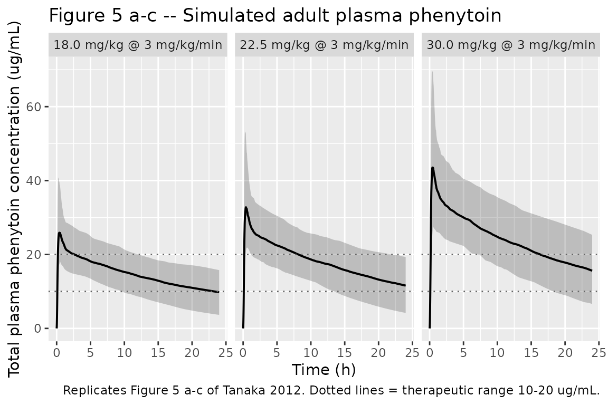

# Phenytoin (Tanaka 2012)

## Model and source

- Citation: Tanaka J, Kasai H, Shimizu K, Shimasaki S, Kumagai Y.
  Population pharmacokinetics of phenytoin after intravenous
  administration of fosphenytoin sodium in pediatric patients, adult
  patients, and healthy volunteers. Eur J Clin Pharmacol.
  2013;69(3):489-497. <doi:10.1007/s00228-012-1373-8>
- Description: Two-compartment population PK model for phenytoin after
  IV fosphenytoin sodium administration in Japanese healthy volunteers
  and adult / pediatric patients (Tanaka 2012). The fosphenytoin
  compartment converts first-order (K12) to the phenytoin central
  compartment; phenytoin is cleared from central and exchanges with a
  peripheral compartment via Q.
- Article: <https://doi.org/10.1007/s00228-012-1373-8>

Tanaka, Kasai, Shimizu, Shimasaki, and Kumagai (Bell Medical Solutions,
Nobelpharma Co., and Kitasato University East Hospital) pooled data from
two Japanese Phase I studies in healthy adult male volunteers and one
Phase III study in adult and pediatric neurosurgical / epileptic
patients to develop a two-compartment population PK model for phenytoin
after intravenous administration of fosphenytoin sodium. The structural
model (Figure 1) has a fosphenytoin compartment that converts
first-order at rate K12 into the phenytoin central compartment;
phenytoin is eliminated linearly from central and exchanges with a
peripheral compartment via Q. Body weight enters as a power covariate on
CL, V2 (central), and V3 (peripheral) with reference 60 kg. The model is
used to recommend an adult fosphenytoin sodium dose of 22.5 mg/kg at 3
mg/kg/min for achieving the 10-20 ug/mL therapeutic range (Conclusions,
page 495).

## Population

The cohort included 71 subjects: 24 healthy adult male Japanese
volunteers (two Phase I studies; ages 20-37, mean 24.9 years), 14 adult
patients (Phase III; ages 17-86, mean 38.2 years; 7 male / 7 female;
body weight 39.0-72.2 kg), and 33 pediatric patients (Phase III; ages
2-16, mean 7.8 years; 13 male / 20 female; body weight 7.8-60.3 kg). All
subjects were Japanese. Adult and pediatric patients had status
epilepticus, acute repetitive seizures, or required seizure prophylaxis
after brain surgery / head trauma. A total of 923 plasma phenytoin
concentrations were collected. Healthy volunteers received fixed doses
of phenytoin sodium 250 mg or fosphenytoin sodium 375, 563, or 750 mg
via 10-30 min IV infusions; patients received weight-banded fosphenytoin
sodium 15, 18, or 22.5 mg/kg at 1 or 3 mg/kg/min (infusion duration
capped at 150 mg/min total). Source: Tanaka 2012 Table 2 and Materials
and methods - Study design (page 490).

The same information is available programmatically via the model’s
`population` metadata.

``` r

mod <- readModelDb("Tanaka_2012_phenytoin")
str(rxode2::rxode(mod)$population)
#> ℹ parameter labels from comments will be replaced by 'label()'
#> List of 11
#>  $ species       : chr "human"
#>  $ n_subjects    : int 71
#>  $ n_studies     : int 3
#>  $ age_range     : chr "2-86 years"
#>  $ weight_range  : chr "7.8-74.4 kg"
#>  $ sex_female_pct: num 38
#>  $ race_ethnicity: Named num 100
#>   ..- attr(*, "names")= chr "Asian"
#>  $ disease_state : chr "Pooled cohort of 24 healthy adult volunteers (Phase I crossover + Phase I dose-escalation), 14 adult patients ("| __truncated__
#>  $ dose_range    : chr "IV fosphenytoin sodium 375-750 mg (healthy volunteers, fixed doses) or 15-22.5 mg/kg (patients) infused at 8.3-"| __truncated__
#>  $ regions       : chr "Japan"
#>  $ notes         : chr "Tanaka 2012 Table 2 baseline demographics. Three pooled studies: two Phase I in healthy adult Japanese males (n"| __truncated__
```

## Source trace

The per-parameter origin is recorded as an in-file comment next to each
`ini()` entry in `inst/modeldb/specificDrugs/Tanaka_2012_phenytoin.R`.
The table below collects the same information in one place for review.

| Equation / parameter | Value at reference 60 kg | Source location |
|----|----|----|
| `lcl` (CL, L/h) | 1.61 | Table 3 theta_1 |
| `lvc` (V2, L) | 20.8 | Table 3 theta_3 |
| `lq` (Q, L/h) | 53.0 | Table 3 theta_4 |
| `lvp` (V3, L) | 26.0 | Table 3 theta_5 |
| `lka` (K12, 1/h) | 5.02 | Table 3 theta_7 |
| `e_wt_cl` | 0.569 | Table 3 theta_2; Equation 1 |
| `e_wt_vc` | 1.0 (fixed) | Results page 494: “The influence factor of V2 was fixed to 1”; no theta entry in Table 3 |
| `e_wt_vp` | 0.584 | Table 3 theta_6; Equation 1 |
| `etalcl` (omega^2) | 0.194 | Table 3 omega\_{CL,CL} |
| `etalvc` (omega^2) | 0.161 | Table 3 omega\_{V2,V2} |
| `etalq` (omega^2) | 0.271 | Table 3 omega\_{Q,Q} |
| `etalvp` (omega^2) | 0.0430 | Table 3 omega\_{V3,V3} |
| `etalka` (omega^2) | 0.106 | Table 3 omega\_{K12,K12} |
| `propSd` (= sqrt(sigma_1^2)) | sqrt(0.00148) = 0.0385 | Table 3 sigma\_{1,1} = 0.00148 (variance) |
| `addSd` (= sqrt(sigma_2^2)) | sqrt(0.317) = 0.563 | Table 3 sigma\_{2,2} = 0.317 (variance) |
| Equation 1: `CL = theta_1 * (WT/60)^theta_2 * exp(eta_CL)` | n/a | Eq. 1, page 494 |
| Equation 1: `V2 = theta_3 * (WT/60)^1 * exp(eta_V2)` | n/a | Eq. 1, page 494 |
| Equation 1: `V3 = theta_5 * (WT/60)^theta_6 * exp(eta_V3)` | n/a | Eq. 1, page 494 |
| Equation 1: `Q = theta_4 * exp(eta_Q)` | n/a | Eq. 1, page 494 |
| Equation 1: `K12 = theta_7 * exp(eta_K12)` | n/a | Eq. 1, page 494 |
| Residual error: `Y_ij = F_ij * exp(eps1_ij) + eps2_ij` | n/a | Methods - Structural model, page 491 |
| Structural diagram (depot fosphenytoin -\> central phenytoin via K12; central \<-\> peripheral via Q; CL from central) | n/a | Figure 1, page 491 |

## Virtual cohort

The original observed data are not publicly available. The cohort below
mirrors the Phase III adult patient population (body weight 53.5 +/- 9.9
kg) and reproduces the dose scenarios studied in the Tanaka 2012 Figure
5 dose simulation (adult fosphenytoin sodium 18, 22.5, and 30 mg/kg at 3
mg/kg/min constant infusion). Each treatment arm carries 200 simulated
subjects to match the paper’s simulation design (“data sets of 200
subjects”; page 491).

``` r

set.seed(20120824)

# Adult cohort body weights resampled from N(53.5, 9.9^2), truncated to the
# Phase III range 39.0-72.2 kg per Tanaka 2012 Table 2 column 3.
sample_adult_wt <- function(n) {
  out <- numeric(0)
  while (length(out) < n) {
    candidate <- rnorm(n, mean = 53.5, sd = 9.9)
    keep <- candidate >= 39.0 & candidate <= 72.2
    out <- c(out, candidate[keep])
  }
  out[seq_len(n)]
}

make_cohort <- function(dose_mg_per_kg, infusion_rate_mg_per_kg_per_min,
                        n = 200L, t_end_h = 24, id_offset = 0L) {
  treatment_label <- sprintf("%.1f mg/kg @ %g mg/kg/min", dose_mg_per_kg,
                             infusion_rate_mg_per_kg_per_min)
  wt <- sample_adult_wt(n)
  total_dose_mg     <- dose_mg_per_kg * wt
  infusion_rate_mgh <- infusion_rate_mg_per_kg_per_min * wt * 60  # mg/h
  infusion_dur_h    <- total_dose_mg / infusion_rate_mgh
  ids <- id_offset + seq_len(n)
  # Dosing rows: rxode2 zero-order infusion uses rate > 0 with dur or amt.
  dose_rows <- tibble(
    id    = ids,
    time  = 0,
    evid  = 1L,
    cmt   = "depot",
    amt   = total_dose_mg,
    rate  = infusion_rate_mgh,
    WT    = wt,
    treatment = treatment_label
  )
  # Observation grid: dense around the infusion + early distribution phase,
  # then hourly out to t_end.
  obs_times <- sort(unique(c(seq(0, 1, by = 1/60),                  # 0-1 h, 1-min
                             seq(1, 4, by = 5/60),                  # 1-4 h, 5-min
                             seq(4, t_end_h, by = 0.25))))          # 4-24 h, 15-min
  obs_rows <- tidyr::expand_grid(
    id   = ids,
    time = obs_times
  ) |>
    mutate(evid = 0L, cmt = NA_character_, amt = 0, rate = 0) |>
    left_join(dose_rows |> select(id, WT, treatment), by = "id")
  bind_rows(dose_rows, obs_rows) |>
    arrange(id, time, desc(evid))
}

events <- bind_rows(
  make_cohort(18.0, 3, id_offset =   0L),
  make_cohort(22.5, 3, id_offset = 200L),
  make_cohort(30.0, 3, id_offset = 400L)
)

stopifnot(!anyDuplicated(unique(events[, c("id", "time", "evid")])))
```

## Simulation

``` r

mod <- readModelDb("Tanaka_2012_phenytoin")
sim <- rxode2::rxSolve(
  mod,
  events = as.data.frame(events),
  keep   = c("WT", "treatment")
) |>
  as.data.frame()
#> ℹ parameter labels from comments will be replaced by 'label()'
head(sim)
#>   id       time      cl       vc        q       vp       ka       kel      k12
#> 1  1 0.00000000 2.22382 16.00298 38.41588 21.01436 4.248547 0.1389628 2.400545
#> 2  1 0.01666667 2.22382 16.00298 38.41588 21.01436 4.248547 0.1389628 2.400545
#> 3  1 0.03333333 2.22382 16.00298 38.41588 21.01436 4.248547 0.1389628 2.400545
#> 4  1 0.05000000 2.22382 16.00298 38.41588 21.01436 4.248547 0.1389628 2.400545
#> 5  1 0.06666667 2.22382 16.00298 38.41588 21.01436 4.248547 0.1389628 2.400545
#> 6  1 0.08333333 2.22382 16.00298 38.41588 21.01436 4.248547 0.1389628 2.400545
#>        k21        Cc  ipredSim       sim    depot    central peripheral1
#> 1 1.828077 0.0000000 0.0000000 0.3100928   0.0000   0.000000  0.00000000
#> 2 1.828077 0.3478397 0.3478397 0.8026623 157.5881   5.566474  0.07436494
#> 3 1.828077 1.3407009 1.3407009 1.9685640 304.4034  21.455214  0.57415637
#> 4 1.828077 2.9079562 2.9079562 3.7868196 441.1824  46.535974  1.87061680
#> 5 1.828077 4.9856253 4.9856253 5.4506826 568.6111  79.784879  4.28144846
#> 6 1.828077 7.5157951 7.5157951 6.5030180 687.3288 120.275144  8.07642483
#>         WT                treatment
#> 1 54.41109 18.0 mg/kg @ 3 mg/kg/min
#> 2 54.41109 18.0 mg/kg @ 3 mg/kg/min
#> 3 54.41109 18.0 mg/kg @ 3 mg/kg/min
#> 4 54.41109 18.0 mg/kg @ 3 mg/kg/min
#> 5 54.41109 18.0 mg/kg @ 3 mg/kg/min
#> 6 54.41109 18.0 mg/kg @ 3 mg/kg/min
```

## Replicate published figures

### Figure 5 – simulated plasma phenytoin concentrations in adults

Tanaka 2012 Figure 5a-c shows simulated phenytoin concentration profiles
over 24 h after single IV fosphenytoin doses of 18, 22.5, and 30 mg/kg
at 3 mg/kg/min in adults, with the therapeutic range 10-20 ug/mL marked.
The 95th and 5th percentile envelopes are drawn alongside individual
subject profiles.

``` r

fig5_adults <- sim |>
  filter(time <= 24) |>
  group_by(treatment, time) |>
  summarise(
    Q05 = quantile(Cc, 0.05, na.rm = TRUE),
    Q50 = quantile(Cc, 0.50, na.rm = TRUE),
    Q95 = quantile(Cc, 0.95, na.rm = TRUE),
    .groups = "drop"
  )

ggplot(fig5_adults, aes(time, Q50)) +
  geom_ribbon(aes(ymin = Q05, ymax = Q95), alpha = 0.25) +
  geom_line(linewidth = 0.7) +
  geom_hline(yintercept = c(10, 20), linetype = "dotted", colour = "grey40") +
  facet_wrap(~ treatment, nrow = 1) +
  scale_y_continuous(limits = c(0, 70)) +
  labs(x = "Time (h)", y = "Total plasma phenytoin concentration (ug/mL)",
       title = "Figure 5 a-c -- Simulated adult plasma phenytoin",
       caption = "Replicates Figure 5 a-c of Tanaka 2012. Dotted lines = therapeutic range 10-20 ug/mL.")
```



At 18 mg/kg the concentration drops below the 10 ug/mL lower bound
within a few hours; at 22.5 mg/kg the typical-value profile stays within
the therapeutic range across most of the 24-h window (consistent with
the paper’s Conclusion that 22.5 mg/kg at 3 mg/kg/min is the optimal
adult dose); at 30 mg/kg the Cmax exceeds the 20 ug/mL toxic threshold
in essentially all simulated subjects (Tanaka 2012 Results, page 495).

### Fosphenytoin to phenytoin conversion half-life

Tanaka 2012 reports an estimated fosphenytoin to phenytoin conversion
half-life of approximately 8 minutes, derived from K12 (Discussion, page
495: “The estimated half-life of conversion from fosphenytoin to
phenytoin calculated from K12, which was approximately 8 min, was
consistent with the half-life proposed by Boucher et al.”). With K12 =
5.02 1/h:

``` r

k12_per_h <- 5.02
half_life_min <- log(2) / k12_per_h * 60
sprintf("t_{1/2,conv} = ln(2) / %.2f h^-1 = %.2f min", k12_per_h, half_life_min)
#> [1] "t_{1/2,conv} = ln(2) / 5.02 h^-1 = 8.28 min"
```

## PKNCA validation

Single-dose NCA over the 24-h post-infusion window per Recipe 1 in
`references/pknca-recipes.md`, stratified by treatment arm.

``` r

sim_nca <- sim |>
  filter(!is.na(Cc)) |>
  select(id, time, Cc, treatment)

dose_df <- events |>
  filter(evid == 1) |>
  select(id, time, amt, treatment)

conc_obj <- PKNCA::PKNCAconc(
  as.data.frame(sim_nca), Cc ~ time | treatment + id,
  concu = "ug/mL", timeu = "h"
)
dose_obj <- PKNCA::PKNCAdose(
  as.data.frame(dose_df), amt ~ time | treatment + id,
  doseu = "mg"
)

intervals <- data.frame(
  start      = 0,
  end        = 24,
  cmax       = TRUE,
  tmax       = TRUE,
  auclast    = TRUE,
  half.life  = TRUE
)

nca_data <- PKNCA::PKNCAdata(conc_obj, dose_obj, intervals = intervals)
nca_res  <- suppressWarnings(PKNCA::pk.nca(nca_data))
nca_tbl  <- as.data.frame(nca_res$result)

nca_summary <- nca_tbl |>
  filter(PPTESTCD %in% c("cmax", "tmax", "auclast", "half.life")) |>
  group_by(treatment, PPTESTCD) |>
  summarise(
    median = median(PPORRES, na.rm = TRUE),
    q05    = quantile(PPORRES, 0.05, na.rm = TRUE),
    q95    = quantile(PPORRES, 0.95, na.rm = TRUE),
    .groups = "drop"
  )
knitr::kable(nca_summary, digits = 3,
             caption = "Single-dose NCA over 0-24 h by adult dose arm (n = 200 each).")
```

| treatment                | PPTESTCD  |  median |     q05 |     q95 |
|:-------------------------|:----------|--------:|--------:|--------:|
| 18.0 mg/kg @ 3 mg/kg/min | auclast   | 339.845 | 237.992 | 493.119 |
| 18.0 mg/kg @ 3 mg/kg/min | cmax      |  27.045 |  17.149 |  47.995 |
| 18.0 mg/kg @ 3 mg/kg/min | half.life |  19.907 |  10.308 |  40.471 |
| 18.0 mg/kg @ 3 mg/kg/min | tmax      |   0.433 |   0.266 |   0.984 |
| 22.5 mg/kg @ 3 mg/kg/min | auclast   | 451.106 | 315.375 | 619.170 |
| 22.5 mg/kg @ 3 mg/kg/min | cmax      |  33.151 |  21.869 |  54.154 |
| 22.5 mg/kg @ 3 mg/kg/min | half.life |  21.891 |   9.349 |  50.527 |
| 22.5 mg/kg @ 3 mg/kg/min | tmax      |   0.417 |   0.283 |   1.000 |
| 30.0 mg/kg @ 3 mg/kg/min | auclast   | 585.925 | 427.382 | 833.110 |
| 30.0 mg/kg @ 3 mg/kg/min | cmax      |  45.255 |  28.956 |  69.968 |
| 30.0 mg/kg @ 3 mg/kg/min | half.life |  21.076 |  10.611 |  48.236 |
| 30.0 mg/kg @ 3 mg/kg/min | tmax      |   0.433 |   0.300 |   0.867 |

Single-dose NCA over 0-24 h by adult dose arm (n = 200 each). {.table}

### Comparison against published figures

Tanaka 2012 does not publish a NCA table; the validation target is
therefore the visual envelope in Figure 5. The 95th-percentile Cmax in
the simulated output should match the paper’s Figure 5 envelopes:

- 18 mg/kg – Cmax envelope below the 20 ug/mL toxic threshold; medians
  drop below 10 ug/mL within the first few hours.
- 22.5 mg/kg – 95th-percentile Cmax modestly exceeds 20 ug/mL; the
  typical profile remains close to the 10-20 ug/mL band over the 24-h
  window.
- 30 mg/kg – 95th-percentile Cmax well above 20 ug/mL; even the 5th
  percentile reaches the toxic threshold (Results, page 495: “Cmax
  values were more than 20 ug/mL in almost all simulations at a dose of
  30 mg/kg”).

``` r

sim |>
  group_by(treatment, id) |>
  summarise(Cmax = max(Cc, na.rm = TRUE), .groups = "drop") |>
  group_by(treatment) |>
  summarise(
    median_Cmax = median(Cmax),
    q05_Cmax    = quantile(Cmax, 0.05),
    q95_Cmax    = quantile(Cmax, 0.95),
    pct_over_20 = 100 * mean(Cmax > 20),
    .groups = "drop"
  ) |>
  knitr::kable(digits = 2,
               caption = "Per-subject Cmax envelope and percent of subjects with Cmax > 20 ug/mL toxic threshold.")
```

| treatment                | median_Cmax | q05_Cmax | q95_Cmax | pct_over_20 |
|:-------------------------|------------:|---------:|---------:|------------:|
| 18.0 mg/kg @ 3 mg/kg/min |       27.04 |    17.15 |    47.99 |        83.0 |
| 22.5 mg/kg @ 3 mg/kg/min |       33.15 |    21.87 |    54.15 |        97.5 |
| 30.0 mg/kg @ 3 mg/kg/min |       45.25 |    28.96 |    69.97 |       100.0 |

Per-subject Cmax envelope and percent of subjects with Cmax \> 20 ug/mL
toxic threshold. {.table style="width:100%;"}

## Assumptions and deviations

- **Pediatric arm not reproduced in this vignette.** Tanaka 2012 Figure
  5 panels d-f show pediatric simulations at the same 18 / 22.5 / 30
  mg/kg doses, with covariates resampled from the Phase III pediatric
  cohort. The packaged model handles pediatric patients identically –
  the allometric power-law on WT is valid across the 7.8-74.4 kg
  observed range – but the vignette restricts to the adult arm to keep
  figure replication focused. Users can substitute a
  `sample_pediatric_wt()` helper drawing from `N(24.4, 13.0^2)`
  truncated to 7.8-60.3 kg (Tanaka 2012 Table 2 column 4) to reproduce
  the pediatric panels.
- **Residual error variance reported as `sigma^2`, encoded as
  `sqrt(sigma^2)` on SD scale.** Tanaka 2012 Table 3 reports residual
  errors as variances (column header `sigma^2`). nlmixr2’s `prop()` and
  `add()` error functions use SD; the model file converts via
  `propSd = sqrt(0.00148) = 0.0385` and
  `addSd = sqrt(0.317) = 0.5630 ug/mL`. The combined exponential +
  additive form `Y = F * exp(eps1) + eps2` (page 491) linearizes to
  `Y ~ F * (1 + eps1) + eps2` for small eps1, mapping to the
  `prop(propSd) + add(addSd)` combination used here.
- **Inter-individual variability covariances zero.** Tanaka 2012 Table 3
  reports only diagonal entries (`omega_{CL,CL}`, `omega_{V2,V2}`,
  `omega_{Q,Q}`, `omega_{V3,V3}`, `omega_{K12,K12}`); the off-diagonals
  are not estimated and are treated as zero in this implementation.
- **Bioavailability of phenytoin from IV fosphenytoin assumed to be 1.**
  Tanaka 2012 Structural model (page 491) states “The bioavailability of
  phenytoin derived from intravenous fosphenytoin sodium injection is
  approximately 1.” No explicit `F1` is fit; the model file therefore
  omits an `lfdepot` term and the depot-to-central first-order
  conversion implicitly carries the 1:1 mass conversion that the paper’s
  parameters assume.
- **Direct IV phenytoin administration (Phase I crossover arm) requires
  dataset-level `cmt` targeting central.** The Phase I crossover study
  (page 490) dosed phenytoin sodium 250 mg IV directly without the
  fosphenytoin prodrug step. To simulate that scenario, set
  `cmt = "central"` on the corresponding dose record so the dose
  bypasses the depot (fosphenytoin) compartment.
- **Dose units are mg of fosphenytoin sodium.** The model is
  parameterised to the paper’s reported doses (mg of fosphenytoin
  sodium), not phenytoin equivalents. The K12 conversion step implicitly
  absorbs the molecular weight ratio that Tanaka 2012 did not explicitly
  fit; users who wish to dose in phenytoin equivalents (PE) should scale
  the input amount by the appropriate conversion factor before passing
  to `rxSolve`.
