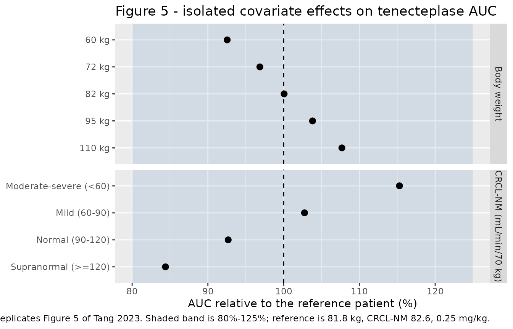
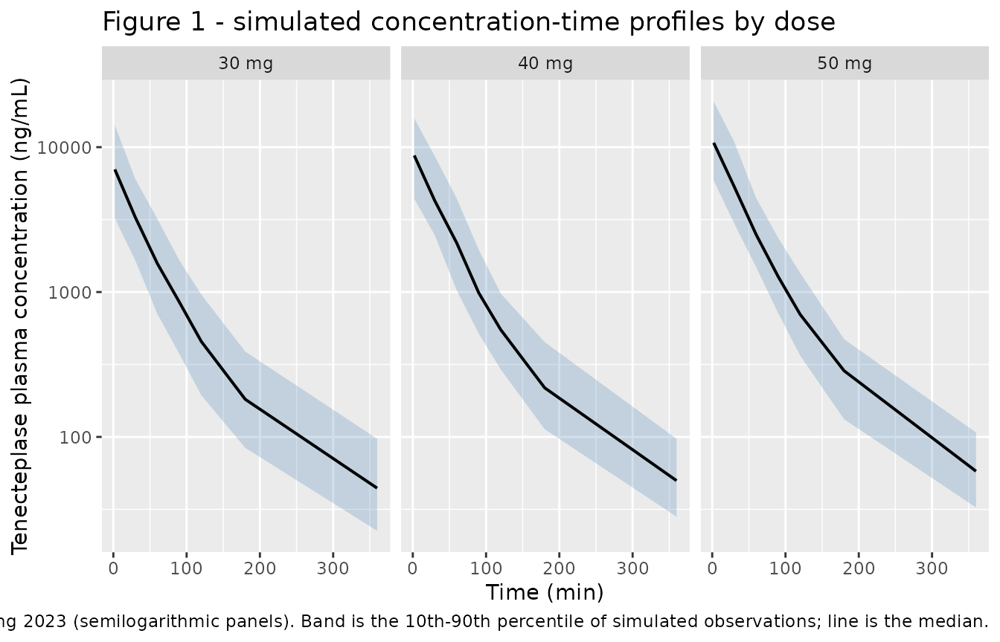

# Tenecteplase (Tang 2023)

## Model and source

- Citation: Tang F, Langenhorst J, Dang S, Kassir N, Owen R, Purdon B,
  Magnusson MO, Deng R (2023). Population Pharmacokinetics of
  Tenecteplase in Patients With Acute Myocardial Infarction and
  Application to Patients With Acute Ischemic Stroke. The Journal of
  Clinical Pharmacology 63(2):197-209. <doi:10.1002/jcph.2164>.
- Description: Two-compartment linear population PK model for
  intravenous bolus tenecteplase in adults with acute myocardial
  infarction (Tang 2023; phase II TIMI 10B, 785 plasma concentrations
  from 103 patients). Clearance is the sum of a
  renal-function-independent intercept and an additive linear effect of
  Cockcroft-Gault creatinine clearance normalized to 70 kg body weight
  (CRCL-NM), centered on the cohort median 82.6 mL/min/70 kg; allometric
  body-weight scaling is fixed at 0.75 on CL and Q and 1 on Vc and Vp
  with a 70 kg reference. Because the sandwich ELISA cannot distinguish
  tenecteplase from endogenous tissue plasminogen activator, the
  predicted observation is the sum of the model-predicted tenecteplase
  concentration and a per-subject background signal (bl_tpa, typical
  18.6 ng/mL). Inter-individual variability on Vc is perfectly
  correlated with that on CL and is constructed as vc_eta_scale \*
  etalcl; the log-additive residual error itself carries
  inter-individual variability on its magnitude. The authors caution
  that the statistically selected renal contribution to clearance is
  biologically implausible for a 65 kDa protein cleared mainly by
  hepatic metabolism, and that it may reflect collinearity between
  CRCL-NM, age and serum creatinine in the stepwise covariate search.
- Article: <https://doi.org/10.1002/jcph.2164>
- Supplement (Tables S1-S5, Figures S1-S2): open-access supporting
  information distributed with the article via PubMed Central
  (PMC10099546).

## Population

The model was developed from the phase II **TIMI 10B** study in adults
with acute myocardial infarction: 785 plasma concentrations from 103
tenecteplase-treated patients. Patients were randomized to a single
intravenous bolus of 30 mg (n = 52), 40 mg (n = 31) or 50 mg (n = 20);
the 50 mg arm was suspended on 22 August 1996 and replaced by 40 mg
after three intracranial hemorrhages among 78 patients dosed at 50 mg.
All patients received 150-325 mg of aspirin daily plus heparin.

Baseline characteristics (Table S1, all doses pooled): body weight 84.1
+/- 20.0 kg, age 56.4 +/- 11.4 years, Cockcroft-Gault creatinine
clearance normalized to 70 kg (CRCL-NM) 83.3 +/- 25.5 mL/min/70 kg,
serum creatinine 1.08 +/- 0.956 mg/dL, AST 38.9 +/- 42.1 U/L, ALT 53.7
+/- 33.5 U/L. 75 of 103 patients (72.8%) were male. Race was 69.9%
White, 13.6% Black, 13.6% Hispanic, 1.9% other, 1.0% Asian. The
reference patient used throughout the paper’s own simulations is the
cohort **median**: 81.8 kg and 82.6 mL/min/70 kg.

PK samples were drawn at baseline and 2, 30, 60, 90, 120, 180 and 360
minutes after the start of administration; all were above the 8 ng/mL
lower limit of quantification.

The same information is available programmatically via
`readModelDb("Tang_2023_tenecteplase")()$population`.

## Model structure

Tenecteplase PK is a two-compartment linear model with intravenous bolus
dosing. Body weight scales all disposition parameters allometrically on
a 70 kg reference, with exponents **fixed** at 0.750 (CL, Q) and 1.00
(Vc, Vp); the paper constrains the exponent to be shared between CL and
Q and between Vc and Vp. Clearance additionally carries an **additive
linear** effect of CRCL-NM centered on the cohort median (Eq. 9):

``` math
\mathrm{CL} = \bigl(\mathrm{CL}_{\mathrm{pop}} + \theta \times (\mathrm{CRCL\text{-}NM} - 82.6)\bigr) \times \left(\frac{\mathrm{WT}}{70}\right)^{0.75}
```

Equation 8 shows the identical model written as the sum of a renal and a
nonrenal clearance, which is where the interpretation of `e_crcl_cl` =
0.322 as “the renal CL of tenecteplase relative to that of creatinine”
comes from. The implied nonrenal clearance is `91.3 - 0.322 * 82.6` =
64.7 mL/min, so clearance stays positive across the whole physiological
CRCL-NM range.

Because the sandwich ELISA cannot distinguish tenecteplase from
endogenous tissue plasminogen activator, the predicted observation is
the sum of the model-predicted tenecteplase concentration and a
per-subject background signal (Eq. 2): `yhat = C + BS`. The residual
error is log-additive (Eq. 3) and, unusually, carries its own
inter-individual variability on the residual magnitude, which the
authors introduced to reduce the leverage of outliers without excluding
observations.

**A caution the authors state explicitly.** Tenecteplase is a 65 kDa
protein cleared mainly by hepatic metabolism, so a 29% renal
contribution to clearance is not biologically expected. The Discussion
warns that “given the biological unlikelihood of a renal contribution to
CL, statistical significance of CRCL-NM needs to be interpreted with
caution”, and notes that CRCL-NM, age and serum creatinine were strongly
collinear (Figure S2). An alternative covariate analysis that removed
CRCL-NM and CREA from the structural set instead selected age and race
on CL (run 50, Table S4) with a worse OFV. The packaged model reproduces
the paper’s **final** model (run 34); the alternative model is not
encoded.

## Source trace

| Equation / parameter | Value | Source location |
|----|----|----|
| Two-compartment linear structure | n/a | Abstract; Results “Model Development” (run 17 base model) |
| Exponential IIV `theta_pi = theta_p * exp(eta_pi)` | n/a | Equation 1 |
| Observation `yhat = C + BS` | n/a | Equation 2 |
| Log-additive residual with IIV `log y = log yhat + eps * exp(eta)` | n/a | Equation 3 |
| Allometric form `(WT/70)^theta` | n/a | Equation 6 |
| Final CL covariate model | n/a | Equation 9 (run 34) |
| `lcl` (CL at WT 70 kg, CRCL-NM 82.6) | 91.3 mL/min | Table 1 “CL, mL/min” (RSE 2.52%); Table S4 final-model column |
| `lvc` (Vc at WT 70 kg) | 3610 mL | Table 1 “Vc, mL” (RSE 2.94%) |
| `lq` (Q at WT 70 kg) | 10.0 mL/min | Table 1 “Q, mL/min” (RSE 5.89%) |
| `lvp` (Vp at WT 70 kg) | 914 mL | Table 1 “Vp, mL” (RSE 5.70%) |
| `e_wt_cl_q` (fixed) | 0.750 | Table 1 “Exponent for WT on CL and Q”, no RSE; Results run 13 |
| `e_wt_vc_vp` (fixed) | 1.00 | Table 1 “Exponent for WT on volume”, no RSE; Results run 13 |
| `e_crcl_cl` | 0.322 | Table 1 “CRCL-NM effect on CL” (RSE 10.6%); Eq. 9 |
| `lbl_tpa` (background signal BS) | 18.6 ng/mL | Table 1 “BS, ng/mL” (RSE 5.48%); Eq. 2 |
| `vc_eta_scale` | 0.913 | Table 1 “IIV CL - IIV Vc scaler” (RSE 5.87%); Results run 7 |
| `etalcl` | SD 0.199 | Table 1 “IIV CL, CV” (RSE 11.0%, shrinkage 12.0%) |
| `etalbl_tpa` | SD 0.285 | Table 1 “IIV BS, CV” (RSE 18.5%, shrinkage 25.5%) |
| `etaexpSd` | SD 0.789 | Table 1 “IIV RUV, CV” (RSE 10.7%, shrinkage 0%) |
| `expSd` | 0.311 | Table 1 “LogAdd RUV tenecteplase, CV” (RSE 7.74%) |
| Reference patient (WT, CRCL-NM) | 81.8 kg, 82.6 mL/min/70 kg | Results “Evaluation of Covariate Effect by Simulation” |

### Note on the variance scale

Table 1 heads its variability column “CV”, but the values are **omega
standard deviations** on the exponential-IIV scale of Eq. 1, not
variances and not `sqrt(exp(omega^2) - 1)` coefficients of variation.
Two independent signals fix this:

1.  The Table S3 and Table S4 captions state “The RSE for IIV and RUV
    parameters is reported on the approximate SD scale.”
2.  The final row of the same column is the log-additive residual error,
    whose sigma on the log scale *is* its approximate CV. A column that
    mixed a log-scale sigma with lognormal CVs computed by
    back-transformation would not be internally consistent.

Methods Eq. 1 also defines `eta_pi` as “a normally distributed random
variable with mean 0 and standard deviation (SD) omega_p”. The model
file therefore records `omega^2 = SD^2`.

``` r

mod <- readModelDb("Tang_2023_tenecteplase")
ui  <- rxode2::rxode(mod)
#> ℹ parameter labels from comments will be replaced by 'label()'

# Reference patient used by the paper's own simulations.
WT_REF   <- 81.8   # kg,             cohort median (Results)
CRCL_REF <- 82.6   # mL/min/70 kg,   cohort median (Eq. 9 centering constant)
```

## Deterministic checks against published values

These use
[`rxode2::zeroRe()`](https://nlmixr2.github.io/rxode2/reference/zeroRe.html)
so they are typical-value predictions with no between-subject
variability, and are therefore exactly reproducible on any machine. Each
compares the model against a number the paper prints.

``` r

# Dense grid: fine through the distribution phase (alpha t1/2 ~ 21 min), then
# out to 1440 min (~19 terminal half-lives) so the AUC extrapolation is
# negligible without pushing the solve into numerical noise.
TGRID <- sort(unique(c(
  seq(0, 30, by = 0.25), seq(30, 120, by = 1),
  seq(120, 360, by = 2), seq(360, 1440, by = 10)
)))

mod_typ <- rxode2::zeroRe(mod)
#> ℹ parameter labels from comments will be replaced by 'label()'
#> Warning: No sigma parameters in the model

# Solve one typical-value profile per row of `spec` (id, amt, WT, CRCL, label).
solve_typical <- function(spec) {
  dose <- spec |>
    dplyr::mutate(time = 0, evid = 1L, cmt = "central") |>
    dplyr::select(id, time, amt, evid, cmt, WT, CRCL, label)
  obs <- spec |>
    dplyr::select(id, WT, CRCL, label) |>
    tidyr::crossing(time = TGRID) |>
    dplyr::mutate(amt = NA_real_, evid = 0L, cmt = "central")
  ev <- dplyr::bind_rows(dose, obs) |>
    dplyr::arrange(id, time, dplyr::desc(evid))
  rxode2::rxSolve(mod_typ, ev, keep = c("WT", "CRCL", "label"),
                  returnType = "data.frame")
}

# Tenecteplase-only concentration. `Cc` is what the assay reports, i.e.
# tenecteplase PLUS the endogenous t-PA background (Eq. 2), but the paper's
# AUC is dose/CL, which is the tenecteplase AUC. Integrating `Cc` unchanged
# would add bl_tpa * T to every AUC (a ~28% inflation over this window), so
# the background is removed before any NCA or integration.
tnk_conc <- function(sim) sim$Cc - sim$bl_tpa

# Trapezoidal AUC of the tenecteplase concentration, ug*min/mL.
auc_trapz <- function(d) {
  d <- d[order(d$time), ]
  cc <- tnk_conc(d)
  sum(diff(d$time) * (utils::head(cc, -1) + utils::tail(cc, -1)) / 2) / 1000
}
```

### Reference-patient clearance and the renal fraction

``` r

ref <- data.frame(id = 1L, amt = 0.25 * WT_REF, WT = WT_REF,
                  CRCL = CRCL_REF, label = "reference")
sim_ref <- solve_typical(ref)
#> ℹ omega/sigma items treated as zero: 'etalcl', 'etalbl_tpa', 'etaexpSd'

cl_model <- unique(round(sim_ref$cl, 6))
stopifnot(length(cl_model) == 1L)

# Renal fraction of total CL at the median covariate values, from the model's
# own coefficients: e_crcl_cl * CRCL_REF / CL_pop.
theta_crcl <- ui$theta[["e_crcl_cl"]]
cl_pop     <- exp(ui$theta[["lcl"]])
renal_frac <- 100 * theta_crcl * CRCL_REF / cl_pop

cat(sprintf("Reference-patient CL : %.1f mL/min   (paper Discussion: 103)\n", cl_model))
#> Reference-patient CL : 102.6 mL/min   (paper Discussion: 103)
cat(sprintf("Renal fraction of CL : %.1f%%          (paper Results: 29.2%%)\n", renal_frac))
#> Renal fraction of CL : 29.1%          (paper Results: 29.2%)

# Deterministic quantities -- safe to assert tightly.
stopifnot(
  abs(cl_model - 103) / 103 < 0.01,
  abs(renal_frac - 29.2) < 0.5
)
```

### Published AUC anchors

The paper reports simulated median AUC for a reference patient at four
dose levels, derived as `dose/CL` (Methods: “AUC from the time of dosing
to infinity was used as derived from dose/CL”). Reproducing these
exercises the covariate model, the allometric scaling, the centering
constant and the mg-to-ng unit conversion in one number each. The AUC
below is obtained by **integrating the solved ODE profile**, not from
the model’s `cl` variable, so an error in the compartment structure
would show up here.

``` r

anchors <- tibble::tribble(
  ~label,        ~amt,             ~published_auc,
  "0.1 mg/kg",   0.1 * WT_REF,      79.7,   # Results: "0.1 mg/kg (79.7 ug*min/mL)"
  "0.25 mg/kg",  0.25 * WT_REF,     NA,     # 90% PI 145-256; checked separately
  "0.5 mg/kg",   0.5 * WT_REF,     398,     # Results: "0.5 mg/kg (398 ug*min/mL)"
  "50 mg",      50,                487      # Results: "50 mg (487 ug*min/mL)"
) |>
  dplyr::mutate(id = dplyr::row_number(), WT = WT_REF, CRCL = CRCL_REF)

sim_anchor <- solve_typical(anchors)
#> ℹ omega/sigma items treated as zero: 'etalcl', 'etalbl_tpa', 'etaexpSd'
#> Warning: multi-subject simulation without without 'omega'
stopifnot(all(tnk_conc(sim_anchor) >= 0))   # no solver noise in the tail

auc_tab <- sim_anchor |>
  dplyr::group_by(label) |>
  dplyr::group_modify(~ tibble::tibble(auc_model = auc_trapz(.x))) |>
  dplyr::ungroup() |>
  dplyr::left_join(dplyr::select(anchors, label, published_auc), by = "label") |>
  dplyr::mutate(pct_diff = 100 * (auc_model - published_auc) / published_auc)

auc_tab |>
  dplyr::rename(
    "Dose level"                = label,
    "Model AUC (ug*min/mL)"     = auc_model,
    "Published AUC (ug*min/mL)" = published_auc,
    "Difference (%)"            = pct_diff
  ) |>
  knitr::kable(digits = c(0, 1, 1, 2),
               caption = "AUC from the integrated ODE solve vs the published simulated median AUC for the reference patient (81.8 kg, CRCL-NM 82.6 mL/min/70 kg). Replicates the dose-level values quoted in Results, 'Evaluation of Covariate Effect by Simulation'.")
```

| Dose level | Model AUC (ug\*min/mL) | Published AUC (ug\*min/mL) | Difference (%) |
|:-----------|-----------------------:|---------------------------:|---------------:|
| 0.1 mg/kg  |                   79.7 |                       79.7 |           0.02 |
| 0.25 mg/kg |                  199.3 |                         NA |             NA |
| 0.5 mg/kg  |                  398.6 |                      398.0 |           0.15 |
| 50 mg      |                  487.3 |                      487.0 |           0.06 |

AUC from the integrated ODE solve vs the published simulated median AUC
for the reference patient (81.8 kg, CRCL-NM 82.6 mL/min/70 kg).
Replicates the dose-level values quoted in Results, ‘Evaluation of
Covariate Effect by Simulation’. {.table}

``` r


# The 0.25 mg/kg row has no published point estimate, only a 90% prediction
# interval of 145-256 ug*min/mL reflecting parameter uncertainty.
auc_025 <- auc_tab$auc_model[auc_tab$label == "0.25 mg/kg"]
stopifnot(length(auc_025) == 1L)
cat(sprintf("0.25 mg/kg model AUC: %.1f ug*min/mL (published 90%% PI 145-256)\n", auc_025))
#> 0.25 mg/kg model AUC: 199.3 ug*min/mL (published 90% PI 145-256)

# Deterministic: tolerance is set by the paper's 3-significant-figure rounding,
# not by a single run. Realised differences are all under 0.2%.
stopifnot(
  max(abs(auc_tab$pct_diff), na.rm = TRUE) < 1,
  auc_025 > 145, auc_025 < 256
)
```

## Replicate Figure 5: isolated covariate effects on AUC

Figure 5 presents forest plots of simulated AUC across renal-function
strata and weight groups relative to the reference patient, with an
80%-125% band. The paper’s conclusion is that “simulated tenecteplase
exposure mostly did not surpass the 80%-125% limits”, in contrast to the
dose changes checked above, which move exposure far outside it. Both
panels below dose 0.25 mg/kg, so the weight panel carries the `WT^0.25`
net effect of a weight-proportional dose against `WT^0.75` clearance
scaling.

``` r

renal_strata <- tibble::tribble(
  ~label,                       ~CRCL,
  "Moderate-severe (<60)",       45,
  "Mild (60-90)",                75,
  "Normal (90-120)",            105,
  "Supranormal (>=120)",        135
) |>
  dplyr::mutate(WT = WT_REF, amt = 0.25 * WT_REF, panel = "CRCL-NM (mL/min/70 kg)")

# Weight groups spanning the cohort (84.1 +/- 20.0 kg, Table S1).
weight_groups <- tibble::tibble(
  WT = c(60, 72, 82, 95, 110)
) |>
  dplyr::mutate(label = paste0(WT, " kg"), CRCL = CRCL_REF,
                amt = 0.25 * WT, panel = "Body weight")

cov_spec <- dplyr::bind_rows(renal_strata, weight_groups) |>
  dplyr::mutate(id = dplyr::row_number())

sim_cov <- solve_typical(cov_spec)
#> ℹ omega/sigma items treated as zero: 'etalcl', 'etalbl_tpa', 'etaexpSd'
#> Warning: multi-subject simulation without without 'omega'

forest <- sim_cov |>
  dplyr::group_by(label) |>
  dplyr::group_modify(~ tibble::tibble(auc = auc_trapz(.x))) |>
  dplyr::ungroup() |>
  dplyr::left_join(dplyr::select(cov_spec, label, panel), by = "label") |>
  dplyr::mutate(ratio_pct = 100 * auc / auc_025,
                label = factor(label, levels = rev(cov_spec$label)))

ggplot(forest, aes(ratio_pct, label)) +
  annotate("rect", xmin = 80, xmax = 125, ymin = -Inf, ymax = Inf,
           alpha = 0.15, fill = "steelblue") +
  geom_vline(xintercept = 100, linetype = "dashed") +
  geom_point(size = 2.5) +
  facet_grid(panel ~ ., scales = "free_y", space = "free_y") +
  labs(x = "AUC relative to the reference patient (%)", y = NULL,
       title = "Figure 5 - isolated covariate effects on tenecteplase AUC",
       caption = "Replicates Figure 5 of Tang 2023. Shaded band is 80%-125%; reference is 81.8 kg, CRCL-NM 82.6, 0.25 mg/kg.")
```



``` r


forest |>
  dplyr::select(panel, label, ratio_pct) |>
  dplyr::rename("Panel" = panel, "Group" = label,
                "AUC vs reference (%)" = ratio_pct) |>
  knitr::kable(digits = 1, caption = "Typical-value AUC relative to the reference patient.")
```

| Panel                  | Group                  | AUC vs reference (%) |
|:-----------------------|:-----------------------|---------------------:|
| Body weight            | 110 kg                 |                107.7 |
| Body weight            | 60 kg                  |                 92.5 |
| Body weight            | 72 kg                  |                 96.9 |
| Body weight            | 82 kg                  |                100.1 |
| Body weight            | 95 kg                  |                103.8 |
| CRCL-NM (mL/min/70 kg) | Mild (60-90)           |                102.8 |
| CRCL-NM (mL/min/70 kg) | Moderate-severe (\<60) |                115.3 |
| CRCL-NM (mL/min/70 kg) | Normal (90-120)        |                 92.7 |
| CRCL-NM (mL/min/70 kg) | Supranormal (\>=120)   |                 84.4 |

Typical-value AUC relative to the reference patient. {.table}

``` r


# The paper's published claim: covariate effects stay inside 80%-125%, whereas
# the 0.1 / 0.5 mg/kg dose changes sit far outside it. Deterministic values.
stopifnot(all(forest$ratio_pct > 80), all(forest$ratio_pct < 125))

# Contrast: the dose levels the paper calls "substantially outside" the band.
dose_ratio <- 100 * auc_tab$auc_model / auc_025
stopifnot(min(dose_ratio) < 60, max(dose_ratio) > 190)
```

## Virtual cohort and Figure 1

``` r

# `set.seed()` seeds R's RNG for the covariate draws below. It does NOT seed
# rxode2's simulation RNG, and rxode2's streams are partitioned per solver
# thread, so the simulated etas differ between a 2-core CI runner and a
# 16-thread workstation. Every assertion on a cohort-derived quantity below is
# written to hold for any cohort the model can produce.
set.seed(20230201)
rxode2::rxSetSeed(20230201)

N_PER_ARM <- 200L   # cap is 200/arm

# Covariates drawn to match Table S1 (all doses pooled), truncated to keep
# weight and renal function physiological.
make_cohort <- function(n, dose_mg, arm, id_offset = 0L) {
  subj <- tibble::tibble(
    id   = id_offset + seq_len(n),
    WT   = pmin(pmax(stats::rnorm(n, 84.1, 20.0), 45), 150),
    CRCL = pmin(pmax(stats::rnorm(n, 83.3, 25.5), 20), 170),
    arm  = arm,
    doseMg = dose_mg
  )
  dose <- subj |>
    dplyr::mutate(time = 0, amt = dose_mg, evid = 1L, cmt = "central")
  obs <- subj |>
    tidyr::crossing(time = c(0, 2, 30, 60, 90, 120, 180, 360)) |>
    dplyr::mutate(amt = NA_real_, evid = 0L, cmt = "central")
  dplyr::bind_rows(dose, obs) |> dplyr::arrange(id, time, dplyr::desc(evid))
}

events <- dplyr::bind_rows(
  make_cohort(N_PER_ARM, 30, "30 mg", id_offset =    0L),
  make_cohort(N_PER_ARM, 40, "40 mg", id_offset = 1000L),
  make_cohort(N_PER_ARM, 50, "50 mg", id_offset = 2000L)
)
stopifnot(!anyDuplicated(unique(events[, c("id", "time", "evid")])))
```

``` r

sim <- rxode2::rxSolve(mod, events = events,
                       keep = c("WT", "CRCL", "arm", "doseMg"),
                       returnType = "data.frame")
#> ℹ parameter labels from comments will be replaced by 'label()'

# `Cc` is the individual prediction (tenecteplase + background); `sim` adds the
# log-additive residual error, whose magnitude is itself per-subject
# (expSdi = expSd * exp(etaexpSd)).
stopifnot(all(c("Cc", "sim", "expSdi") %in% names(sim)))
```

``` r

# Replicates Figure 1 of Tang 2023: observed concentrations over time by dose,
# semilogarithmic. Here as a VPC-style band of the simulated observations.
sim |>
  dplyr::filter(time > 0) |>
  dplyr::group_by(arm, time) |>
  dplyr::summarise(
    Q10 = stats::quantile(sim, 0.10),
    Q50 = stats::quantile(sim, 0.50),
    Q90 = stats::quantile(sim, 0.90),
    .groups = "drop"
  ) |>
  ggplot(aes(time, Q50)) +
  geom_ribbon(aes(ymin = Q10, ymax = Q90), alpha = 0.25, fill = "steelblue") +
  geom_line(linewidth = 0.7) +
  facet_wrap(~arm) +
  scale_y_log10() +
  labs(x = "Time (min)", y = "Tenecteplase plasma concentration (ng/mL)",
       title = "Figure 1 - simulated concentration-time profiles by dose",
       caption = "Replicates Figure 1 of Tang 2023 (semilogarithmic panels). Band is the 10th-90th percentile of simulated observations; line is the median.")
```



## PKNCA validation

NCA is run on the typical-value reference-patient profiles at the four
dose levels the paper simulates, so the comparison against the published
`dose/CL` AUC values is exact rather than cohort-dependent.
Concentrations are tenecteplase-only (background removed, as described
above).

``` r

sim_nca <- sim_anchor |>
  dplyr::mutate(Cc = tnk_conc(sim_anchor)) |>
  dplyr::filter(!is.na(Cc)) |>
  dplyr::select(id, time, Cc, label)

# Guarantee a time = 0 row per (id, label). For an IV bolus the t = 0 record is
# the peak, which the solve already provides; this is a defensive no-op that
# keeps PKNCA from warning about an AUC range starting before the first
# measurement.
sim_nca <- dplyr::bind_rows(
  sim_nca,
  sim_nca |> dplyr::distinct(id, label) |> dplyr::mutate(time = 0, Cc = 0)
) |>
  dplyr::distinct(id, label, time, .keep_all = TRUE) |>
  dplyr::arrange(id, label, time)

conc_obj <- PKNCA::PKNCAconc(sim_nca, Cc ~ time | label + id)

dose_df <- anchors |>
  dplyr::mutate(time = 0) |>
  dplyr::select(id, time, amt, label)
dose_obj <- PKNCA::PKNCAdose(dose_df, amt ~ time | label + id)

intervals <- data.frame(
  start = 0, end = Inf,
  cmax = TRUE, tmax = TRUE, aucinf.obs = TRUE, half.life = TRUE
)

nca_res <- PKNCA::pk.nca(PKNCA::PKNCAdata(conc_obj, dose_obj, intervals = intervals))
knitr::kable(as.data.frame(nca_res), digits = 3,
             caption = "PKNCA results for the typical-value reference patient at each simulated dose level.")
```

| label      |  id | start | end | PPTESTCD            |    PPORRES | exclude |
|:-----------|----:|------:|----:|:--------------------|-----------:|:--------|
| 0.1 mg/kg  |   1 |     0 | Inf | cmax                |   1939.058 | NA      |
| 0.1 mg/kg  |   1 |     0 | Inf | tmax                |      0.000 | NA      |
| 0.1 mg/kg  |   1 |     0 | Inf | tlast               |   1440.000 | NA      |
| 0.1 mg/kg  |   1 |     0 | Inf | clast.obs           |      0.000 | NA      |
| 0.1 mg/kg  |   1 |     0 | Inf | lambda.z            |      0.009 | NA      |
| 0.1 mg/kg  |   1 |     0 | Inf | r.squared           |      1.000 | NA      |
| 0.1 mg/kg  |   1 |     0 | Inf | adj.r.squared       |      1.000 | NA      |
| 0.1 mg/kg  |   1 |     0 | Inf | lambda.z.time.first |    208.000 | NA      |
| 0.1 mg/kg  |   1 |     0 | Inf | lambda.z.time.last  |   1440.000 | NA      |
| 0.1 mg/kg  |   1 |     0 | Inf | lambda.z.n.points   |    185.000 | NA      |
| 0.1 mg/kg  |   1 |     0 | Inf | clast.pred          |      0.000 | NA      |
| 0.1 mg/kg  |   1 |     0 | Inf | half.life           |     76.731 | NA      |
| 0.1 mg/kg  |   1 |     0 | Inf | span.ratio          |     16.056 | NA      |
| 0.1 mg/kg  |   1 |     0 | Inf | aucinf.obs          |  79715.539 | NA      |
| 0.25 mg/kg |   2 |     0 | Inf | cmax                |   4847.645 | NA      |
| 0.25 mg/kg |   2 |     0 | Inf | tmax                |      0.000 | NA      |
| 0.25 mg/kg |   2 |     0 | Inf | tlast               |   1440.000 | NA      |
| 0.25 mg/kg |   2 |     0 | Inf | clast.obs           |      0.001 | NA      |
| 0.25 mg/kg |   2 |     0 | Inf | lambda.z            |      0.009 | NA      |
| 0.25 mg/kg |   2 |     0 | Inf | r.squared           |      1.000 | NA      |
| 0.25 mg/kg |   2 |     0 | Inf | adj.r.squared       |      1.000 | NA      |
| 0.25 mg/kg |   2 |     0 | Inf | lambda.z.time.first |    208.000 | NA      |
| 0.25 mg/kg |   2 |     0 | Inf | lambda.z.time.last  |   1440.000 | NA      |
| 0.25 mg/kg |   2 |     0 | Inf | lambda.z.n.points   |    185.000 | NA      |
| 0.25 mg/kg |   2 |     0 | Inf | clast.pred          |      0.001 | NA      |
| 0.25 mg/kg |   2 |     0 | Inf | half.life           |     76.731 | NA      |
| 0.25 mg/kg |   2 |     0 | Inf | span.ratio          |     16.056 | NA      |
| 0.25 mg/kg |   2 |     0 | Inf | aucinf.obs          | 199288.848 | NA      |
| 0.5 mg/kg  |   3 |     0 | Inf | cmax                |   9695.291 | NA      |
| 0.5 mg/kg  |   3 |     0 | Inf | tmax                |      0.000 | NA      |
| 0.5 mg/kg  |   3 |     0 | Inf | tlast               |   1440.000 | NA      |
| 0.5 mg/kg  |   3 |     0 | Inf | clast.obs           |      0.002 | NA      |
| 0.5 mg/kg  |   3 |     0 | Inf | lambda.z            |      0.009 | NA      |
| 0.5 mg/kg  |   3 |     0 | Inf | r.squared           |      1.000 | NA      |
| 0.5 mg/kg  |   3 |     0 | Inf | adj.r.squared       |      1.000 | NA      |
| 0.5 mg/kg  |   3 |     0 | Inf | lambda.z.time.first |    208.000 | NA      |
| 0.5 mg/kg  |   3 |     0 | Inf | lambda.z.time.last  |   1440.000 | NA      |
| 0.5 mg/kg  |   3 |     0 | Inf | lambda.z.n.points   |    185.000 | NA      |
| 0.5 mg/kg  |   3 |     0 | Inf | clast.pred          |      0.002 | NA      |
| 0.5 mg/kg  |   3 |     0 | Inf | half.life           |     76.731 | NA      |
| 0.5 mg/kg  |   3 |     0 | Inf | span.ratio          |     16.056 | NA      |
| 0.5 mg/kg  |   3 |     0 | Inf | aucinf.obs          | 398577.694 | NA      |
| 50 mg      |   4 |     0 | Inf | cmax                |  11852.434 | NA      |
| 50 mg      |   4 |     0 | Inf | tmax                |      0.000 | NA      |
| 50 mg      |   4 |     0 | Inf | tlast               |   1440.000 | NA      |
| 50 mg      |   4 |     0 | Inf | clast.obs           |      0.002 | NA      |
| 50 mg      |   4 |     0 | Inf | lambda.z            |      0.009 | NA      |
| 50 mg      |   4 |     0 | Inf | r.squared           |      1.000 | NA      |
| 50 mg      |   4 |     0 | Inf | adj.r.squared       |      1.000 | NA      |
| 50 mg      |   4 |     0 | Inf | lambda.z.time.first |    208.000 | NA      |
| 50 mg      |   4 |     0 | Inf | lambda.z.time.last  |   1440.000 | NA      |
| 50 mg      |   4 |     0 | Inf | lambda.z.n.points   |    185.000 | NA      |
| 50 mg      |   4 |     0 | Inf | clast.pred          |      0.002 | NA      |
| 50 mg      |   4 |     0 | Inf | half.life           |     76.731 | NA      |
| 50 mg      |   4 |     0 | Inf | span.ratio          |     16.056 | NA      |
| 50 mg      |   4 |     0 | Inf | aucinf.obs          | 487258.794 | NA      |

PKNCA results for the typical-value reference patient at each simulated
dose level. {.table}

### Comparison against published NCA

The paper does not tabulate a conventional NCA table; the only exposure
metric it publishes is AUC derived as `dose/CL`. Those are the reference
values below, converted to `ng*min/mL` to match PKNCA’s units. The 0.25
mg/kg level has no published point estimate (only a 90% prediction
interval) and so is excluded from this table.

``` r

published <- tibble::tribble(
  ~label,       ~aucinf.obs,
  "0.1 mg/kg",   79.7 * 1000,
  "0.5 mg/kg",  398   * 1000,
  "50 mg",      487   * 1000
)

cmp <- nlmixr2lib::ncaComparisonTable(
  simulated     = nca_res,
  reference     = published,
  by            = "label",
  params        = "aucinf.obs",
  units         = c(aucinf.obs = "ng*min/mL"),
  tolerance_pct = 20
)

knitr::kable(cmp,
             caption = "Simulated (PKNCA, aucinf.obs) vs published AUC = dose/CL. * differs from reference by >20%.")
```

| NCA parameter             | label     | Reference | Simulated | % diff |
|:--------------------------|:----------|:----------|:----------|:-------|
| AUC0-∞ (obs) (ng\*min/mL) | 0.1 mg/kg | 79700     | 79700     | +0.0%  |
| AUC0-∞ (obs) (ng\*min/mL) | 0.5 mg/kg | 398000    | 399000    | +0.1%  |
| AUC0-∞ (obs) (ng\*min/mL) | 50 mg     | 487000    | 487000    | +0.1%  |

Simulated (PKNCA, aucinf.obs) vs published AUC = dose/CL. \* differs
from reference by \>20%. {.table}

``` r

# Independent of the display table: PKNCA's AUCinf must agree with the
# published dose/CL values. Deterministic typical-value profiles.
nca_auc <- as.data.frame(nca_res) |>
  dplyr::filter(PPTESTCD == "aucinf.obs") |>
  dplyr::select(label, PPORRES) |>
  dplyr::left_join(published, by = "label") |>
  dplyr::filter(!is.na(aucinf.obs)) |>
  dplyr::mutate(pct_diff = 100 * (PPORRES - aucinf.obs) / aucinf.obs)

stopifnot(nrow(nca_auc) == 3L)               # the gate must have rows to test
print(nca_auc)
#> # A tibble: 3 × 4
#>   label     PPORRES aucinf.obs pct_diff
#>   <chr>       <dbl>      <dbl>    <dbl>
#> 1 0.1 mg/kg  79716.      79700   0.0195
#> 2 0.5 mg/kg 398578.     398000   0.145 
#> 3 50 mg     487259.     487000   0.0531
stopifnot(max(abs(nca_auc$pct_diff)) < 2)
```

## External validation against study N1811s

The paper’s partial external validation compares model predictions
against summary statistics from 75 patients with acute ischemic stroke
(study N1811s), sampled once at 1 hour post dose. Observed means (SD)
were 389 (146), 641 (240), 1227 (491) and 1647 (732) ng/mL at 0.1, 0.2,
0.4 and 0.5 mg/kg. The paper reports that the model **overpredicted**
these means by a factor of about 1.39 on average, while 71.7% of the
derived observation distribution still fell inside the model’s 90%
prediction interval.

This replication is approximate by construction: N1811s reported neither
weight nor CRCL-NM, so the authors assumed the TIMI 10B weight
distribution and predicted CRCL-NM from each group’s median age using an
age/CRCL-NM regression fitted to TIMI 10B that the paper does not
report. The cohort below therefore uses the TIMI 10B covariate
distribution unchanged for both. Because the stroke population is older
with lower renal function, the paper’s own simulation sits somewhat
higher than this one.

``` r

set.seed(18110)
rxode2::rxSetSeed(18110)

n1811s_obs <- tibble::tribble(
  ~arm,          ~dose_mgkg, ~obs_mean,
  "0.1 mg/kg",   0.1,         389,
  "0.2 mg/kg",   0.2,         641,
  "0.4 mg/kg",   0.4,        1227,
  "0.5 mg/kg",   0.5,        1647
)

make_wb_cohort <- function(n, dose_mgkg, arm, id_offset) {
  subj <- tibble::tibble(
    id   = id_offset + seq_len(n),
    WT   = pmin(pmax(stats::rnorm(n, 84.1, 20.0), 45), 150),
    CRCL = pmin(pmax(stats::rnorm(n, 83.3, 25.5), 20), 170),
    arm  = arm
  ) |>
    dplyr::mutate(amt = dose_mgkg * WT)
  dose <- subj |> dplyr::mutate(time = 0, evid = 1L, cmt = "central")
  obs  <- subj |> dplyr::mutate(time = 60, amt = NA_real_, evid = 0L, cmt = "central")
  dplyr::bind_rows(dose, obs) |> dplyr::arrange(id, time, dplyr::desc(evid))
}

ev_n1811s <- dplyr::bind_rows(
  lapply(seq_len(nrow(n1811s_obs)), function(i) {
    make_wb_cohort(150L, n1811s_obs$dose_mgkg[i], n1811s_obs$arm[i],
                   id_offset = i * 10000L)
  })
)
stopifnot(!anyDuplicated(unique(ev_n1811s[, c("id", "time", "evid")])))

sim_n1811s <- rxode2::rxSolve(mod, events = ev_n1811s,
                              keep = c("WT", "CRCL", "arm"),
                              returnType = "data.frame")

ext <- sim_n1811s |>
  dplyr::filter(time == 60) |>
  dplyr::group_by(arm) |>
  dplyr::summarise(model_mean = mean(sim), .groups = "drop") |>
  dplyr::left_join(n1811s_obs, by = "arm") |>
  dplyr::mutate(ratio = model_mean / obs_mean)

ext |>
  dplyr::select(arm, obs_mean, model_mean, ratio) |>
  dplyr::rename("Dose" = arm,
                "Observed mean (ng/mL)" = obs_mean,
                "Model mean (ng/mL)"    = model_mean,
                "Model / observed"      = ratio) |>
  knitr::kable(digits = c(0, 0, 0, 2),
               caption = "External validation against study N1811s at 1 hour post dose. Tang 2023 reports a mean overprediction factor of about 1.39.")
```

| Dose      | Observed mean (ng/mL) | Model mean (ng/mL) | Model / observed |
|:----------|----------------------:|-------------------:|-----------------:|
| 0.1 mg/kg |                   389 |                469 |             1.21 |
| 0.2 mg/kg |                   641 |               1231 |             1.92 |
| 0.4 mg/kg |                  1227 |               1923 |             1.57 |
| 0.5 mg/kg |                  1647 |               2621 |             1.59 |

External validation against study N1811s at 1 hour post dose. Tang 2023
reports a mean overprediction factor of about 1.39. {.table}

``` r


# The direction and rough magnitude of the overprediction are the published
# claim; the exact factor depends on the unreported age/CRCL-NM regression, and
# a mean over a heavy-tailed lognormal residual (omega 0.789 on the residual
# magnitude) is itself a noisy statistic. The bound is wide enough to survive
# any cohort the model can draw while still failing on a unit or dose error,
# which would move the ratio by an order of magnitude.
stopifnot(median(ext$ratio) > 1.0, median(ext$ratio) < 2.5)
```

## Assumptions and deviations

- **Variance scale.** Table 1’s “CV” column is read as omega **standard
  deviations**, on the strength of the Table S3/S4 caption (“The RSE for
  IIV and RUV parameters is reported on the approximate SD scale”) and
  the log-additive residual row. If the column instead held
  `sqrt(exp(omega^2) - 1)`, the structural IIVs would change by under 2%
  and the IIV on the residual magnitude by about 12%; no published
  quantity in the paper resolves it more tightly than the caption
  already does.
- **IIV on Vc is not separately reported.** The paper estimates a single
  eta shared by CL and Vc with a scaler (correlation fixed to 1). The
  implied omega for Vc is `0.913 * 0.199` = 0.182 and is not printed
  anywhere in the paper.
- **Alternative covariate model not encoded.** Run 50 (age and race on
  CL, Table S4) is a sensitivity analysis with a worse OFV than the
  final model; only the final model (run 34) is packaged. Age and race
  are recorded in `covariatesDataExcluded` with their run-50
  coefficients so the provenance is preserved.
- **Background signal in `Cc`.** `Cc` is the assay-measured total, i.e.
  tenecteplase plus the endogenous t-PA background (Eq. 2), following
  the `Bauer_2023_vonicogAlfa.R` convention. The background is removed
  before NCA and before every AUC integration in this vignette, because
  the paper’s AUC is `dose/CL` (tenecteplase only). Set `bl_tpa` to zero
  to recover the tenecteplase-only prediction directly.
- **Virtual cohort covariates.** Weight and CRCL-NM are drawn
  independently from normal distributions matched to the Table S1 means
  and SDs and truncated to physiological ranges. The paper reports these
  marginally, not jointly, and Figure S2 shows they are correlated with
  age and each other; the independence assumption is a simplification
  and affects only the cohort figures, not the deterministic checks.
- **N1811s external validation is approximate.** Neither weight nor
  CRCL-NM was reported for N1811s. The paper predicted CRCL-NM from
  median age via a TIMI 10B regression that it does not publish; this
  vignette instead reuses the TIMI 10B covariate distribution. The
  reproduced overprediction is therefore expected to differ somewhat
  from the paper’s stated factor of 1.39, and the assertion is
  correspondingly wide.
- **No published NCA table.** The paper reports no Cmax / Tmax /
  half-life values, so the NCA comparison covers AUC only. The other
  PKNCA parameters are shown for completeness but have no published
  counterpart.
- **All parameter values come from the paper’s own text, Table 1 and the
  open-access supplement (Tables S1-S4).** No value was digitized from a
  figure, supplied by correspondence, or carried from an upstream model.
