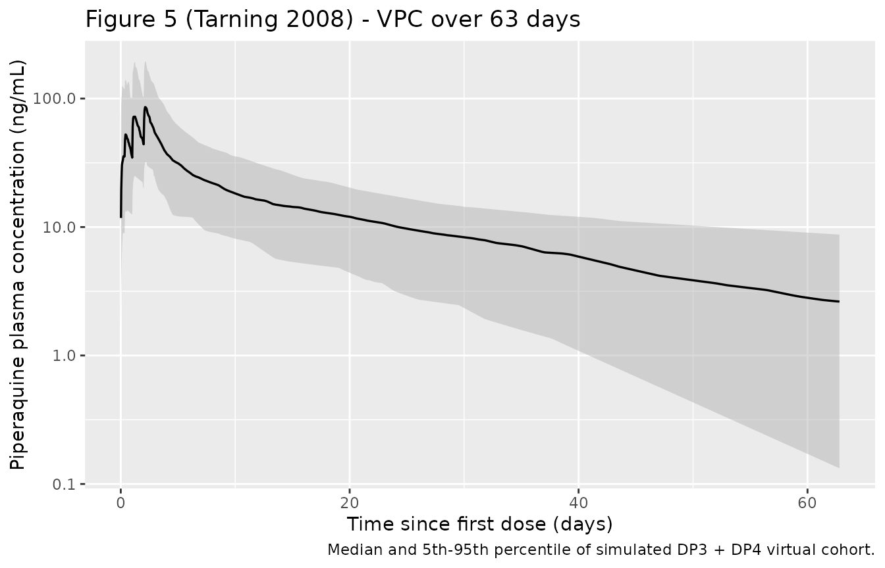
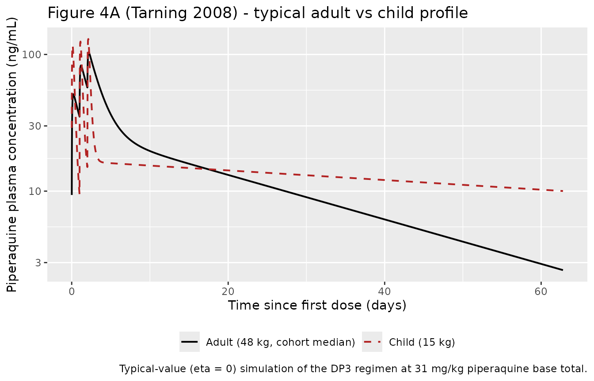

# Piperaquine (Tarning 2008)

## Model and source

- Citation: Tarning J, Ashley EA, Lindegardh N, Stepniewska K, Phaiphun
  L, Day NPJ, McGready R, Ashton M, Nosten F, White NJ (2008).
  Population pharmacokinetics of piperaquine after two different
  treatment regimens with dihydroartemisinin-piperaquine in patients
  with *Plasmodium falciparum* malaria in Thailand. *Antimicrobial
  Agents and Chemotherapy* **52**(3):1052-1061.
  <doi:10.1128/aac.00955-07>.
- Article: <https://doi.org/10.1128/aac.00955-07>

## Population

Tarning et al. fitted the model to 469 piperaquine plasma concentrations
from 98 Burmese and Karen patients (39.8% female, ages 3 - 55 y, body
weight 12 - 74 kg, 11 children below 30 kg) with uncomplicated
*Plasmodium falciparum* malaria treated on the Thai-Myanmar border with
the dihydroartemisinin-piperaquine fixed-dose combination Artekin.
Patients were randomised to either the standard four-dose regimen DP4
(doses at 0, 8, 24, 48 h; n = 50) or the once-daily three-dose regimen
DP3 (doses at 0, 24, 48 h; n = 48) and were followed for 63 days
post-treatment. Total piperaquine phosphate dose was titrated to 55
mg/kg (equivalent to ~31 mg/kg piperaquine base), rounded up to the
nearest half tablet. Demographics are summarised in Tarning 2008 Table
1; the pooled cohort median body weight of 48 kg is the centring value
used by the body-weight covariate effects.

The same information is available programmatically via
`readModelDb("Tarning_2008_piperaquine")()$population`.

## Source trace

The per-parameter origin is recorded as an in-file comment next to each
`ini()` entry in
`inst/modeldb/specificDrugs/Tarning_2008_piperaquine.R`. The table below
collects them in one place for review.

| Equation / parameter | Value | Source location |
|----|----|----|
| `lcl` (CL/F at 48 kg) | 66.0 L/h | Table 2 (%RSE 6.9) |
| `lvc` (Vc/F at 48 kg) | 8 660 L | Table 2 (%RSE 14) |
| `lq` (Q/F) | 131 L/h | Table 2 (%RSE 13) |
| `lvp` (Vp/F) | 24 000 L | Table 2 (%RSE 13) |
| `lka` (absorption rate) | 0.717 1/h | Table 2 (%RSE 25) |
| `e_wt_cl` (linear WT effect on CL/F) | 0.0262 per kg from 48 kg | Table 2 (%RSE 2.9) |
| `e_wt_vc` (linear WT effect on Vc/F) | 0.0273 per kg from 48 kg | Table 2 (%RSE 11) |
| `etalcl` (IIV on CL/F) | 42% CV -\> omega^2 = 0.162519 | Table 2 (%RSE 44) |
| `etalvc` (IIV on Vc/F) | 101% CV -\> omega^2 = 0.703107 | Table 2 (%RSE 17) |
| `etalq` (IIV on Q/F) | 85% CV -\> omega^2 = 0.543763 | Table 2 (%RSE 18) |
| `etalvp` (IIV on Vp/F) | 50% CV -\> omega^2 = 0.223144 | Table 2 (%RSE 76) |
| `etalka` (IIV on ka) | 168% CV -\> omega^2 = 1.340808 | Table 2 (%RSE 38) |
| `propSd` (residual error) | 31.4% CV (proportional in linear space) | Table 2 (%RSE 29); Discussion p.1055 |
| Two-compartment ODE structure with first-order absorption | n/a | Methods p.1054 (“two-compartment pharmacokinetic models with elimination from the central compartment and with first-order absorption”) |
| Linear (1 + theta \* (WT - 48)) covariate form | n/a | Methods p.1054 (“centered on the median value”) and Results p.1054 (“A linear relationship between body weight and clearance and body weight and central volume of distribution gave the best fit”) |
| Exponential IIV `(CL/F)_i = TV(CL/F) * exp(eta_i,CL/F)` | n/a | Methods p.1054 |
| Proportional residual error (additive on log-transformed concentrations) | n/a | Methods p.1054 + Discussion p.1055 (“the effective random residual error model should be considered multiplicative”) |
| Cohort median WT = 48 kg (centring value) | n/a | Table 1 pooled median; Table 2 covariate `[WT - 48]` |

## Virtual cohort

The original observed concentration-time data are not publicly
available. The virtual cohorts below reproduce the demographic
distributions reported in Table 1 - a pooled cohort across the DP4 (n =
50) and DP3 (n = 48) arms, including the 11 children below 30 kg. Weight
is sampled from a truncated log-normal distribution whose median (48 kg)
and 5th-95th percentiles bracket the reported 12 - 74 kg range.

``` r

set.seed(20260531)

make_arm <- function(n, dose_times_h, arm_label, id_offset = 0L) {
  # WT distribution chosen to match Table 1: pooled median 48 kg, range 12-74 kg.
  log_wt <- rnorm(n, mean = log(48), sd = 0.45)
  wt_kg  <- pmin(pmax(round(exp(log_wt)), 12), 74)

  # Total dose 55 mg/kg piperaquine phosphate ~= 31 mg/kg piperaquine base
  # (Table 1). Modelled in mg piperaquine base; total split equally across
  # arm-specific dose times (Methods p.1053).
  total_base_mg <- 31 * wt_kg
  per_dose_mg   <- total_base_mg / length(dose_times_h)

  ids <- id_offset + seq_len(n)
  obs_times <- c(seq(0, 8, by = 0.5),
                 seq(9, 72, by = 1),
                 seq(73, 24 * 63, by = 6))

  dose_rows <- tibble(
    id   = rep(ids, each = length(dose_times_h)),
    time = rep(dose_times_h, times = n),
    amt  = rep(per_dose_mg, each = length(dose_times_h)),
    evid = 1L,
    cmt  = "depot",
    WT   = rep(wt_kg, each = length(dose_times_h)),
    arm  = arm_label
  )
  obs_rows <- tibble(
    id   = rep(ids, each = length(obs_times)),
    time = rep(obs_times, times = n),
    amt  = 0,
    evid = 0L,
    cmt  = NA_character_,
    WT   = rep(wt_kg, each = length(obs_times)),
    arm  = arm_label
  )
  dplyr::bind_rows(dose_rows, obs_rows) |>
    dplyr::arrange(id, time, dplyr::desc(evid))
}

events <- dplyr::bind_rows(
  make_arm(50L, c(0, 8, 24, 48), "DP4", id_offset =   0L),
  make_arm(48L, c(0, 24, 48),    "DP3", id_offset = 100L)
)

stopifnot(!anyDuplicated(unique(events[, c("id", "time", "evid")])))
```

## Simulation

``` r

mod_fn <- readModelDb("Tarning_2008_piperaquine")
mod    <- rxode2::rxode2(mod_fn())
sim <- rxode2::rxSolve(mod, events = events, keep = c("WT", "arm")) |>
  as.data.frame()
```

## Replicate published figures

Replicates Figure 5 of Tarning 2008: piperaquine plasma concentration
over the 63-day follow-up window with the population median (50th
percentile) and 5th-95th percentile envelope from the virtual cohort.

``` r

sim_quant <- sim |>
  dplyr::filter(time > 0) |>
  dplyr::group_by(time) |>
  dplyr::summarise(
    Q05 = quantile(Cc, 0.05, na.rm = TRUE),
    Q50 = quantile(Cc, 0.50, na.rm = TRUE),
    Q95 = quantile(Cc, 0.95, na.rm = TRUE),
    .groups = "drop"
  )

ggplot(sim_quant, aes(time / 24, Q50)) +
  geom_ribbon(aes(ymin = Q05, ymax = Q95), fill = "grey70", alpha = 0.5) +
  geom_line(linewidth = 0.6) +
  scale_y_log10() +
  labs(
    x = "Time since first dose (days)",
    y = "Piperaquine plasma concentration (ng/mL)",
    title = "Figure 5 (Tarning 2008) - VPC over 63 days",
    caption = "Median and 5th-95th percentile of simulated DP3 + DP4 virtual cohort."
  )
```



Replicates Figure 4A of Tarning 2008: typical-value piperaquine
concentration profiles contrasting the population mean (48 kg adult)
against a child below 30 kg. The pediatric profile has a smaller early
Cmax (smaller central volume of distribution per kg) and a longer
terminal phase (lower body-weight- normalised clearance), in agreement
with the paper’s discussion of altered pharmacokinetics in children.

``` r

mod_typ <- mod |> rxode2::zeroRe()

typ_events <- function(wt_kg, arm_label, id_val) {
  dose_times <- c(0, 24, 48)  # DP3 regimen
  per_dose   <- 31 * wt_kg / length(dose_times)
  obs_times  <- sort(unique(c(seq(0, 8, by = 0.25),
                              seq(9, 72, by = 1),
                              seq(73, 24 * 63, by = 6))))
  doses <- tibble(id = id_val, time = dose_times, amt = per_dose,
                  evid = 1L, cmt = "depot", WT = wt_kg, arm = arm_label)
  obs   <- tibble(id = id_val, time = obs_times, amt = 0,
                  evid = 0L, cmt = NA_character_, WT = wt_kg, arm = arm_label)
  dplyr::bind_rows(doses, obs) |>
    dplyr::arrange(id, time, dplyr::desc(evid))
}

typ <- dplyr::bind_rows(
  typ_events(48, "Adult (48 kg, cohort median)", 1L),
  typ_events(15, "Child (15 kg)",                2L)
)

sim_typ <- rxode2::rxSolve(mod_typ, events = typ, keep = c("WT", "arm")) |>
  as.data.frame()
#> ℹ omega/sigma items treated as zero: 'etalcl', 'etalvc', 'etalq', 'etalvp', 'etalka'
#> Warning: multi-subject simulation without without 'omega'

ggplot(dplyr::filter(sim_typ, time > 0),
       aes(time / 24, Cc, colour = arm, linetype = arm)) +
  geom_line(linewidth = 0.7) +
  scale_y_log10() +
  scale_colour_manual(values = c("Adult (48 kg, cohort median)" = "black",
                                 "Child (15 kg)" = "firebrick")) +
  scale_linetype_manual(values = c("Adult (48 kg, cohort median)" = "solid",
                                   "Child (15 kg)" = "dashed")) +
  labs(
    x = "Time since first dose (days)",
    y = "Piperaquine plasma concentration (ng/mL)",
    colour = NULL, linetype = NULL,
    title = "Figure 4A (Tarning 2008) - typical adult vs child profile",
    caption = "Typical-value (eta = 0) simulation of the DP3 regimen at 31 mg/kg piperaquine base total."
  ) +
  theme(legend.position = "bottom")
```



## PKNCA validation

Compute non-compartmental Cmax, Tmax, AUC inf, and apparent terminal
half-life from the typical-value profile and from the stochastic virtual
cohort, stratified by treatment arm. The typical-value column lets the
reader compare directly against Tarning 2008 Table 2’s derived
population estimate of `t1/2 beta` = 27.8 days and the published mean
AUC `day 0-63` values (DP3 = 19.4 h*ug/mL, DP4 = 20.7 h*ug/mL); the
per-arm stochastic column shows that the virtual cohort reproduces those
expected values within the cohort variability the paper reports.

``` r

# Concentration object on the simulated DP3 + DP4 cohort.
sim_nca <- sim |>
  dplyr::filter(!is.na(Cc), Cc > 0) |>
  dplyr::select(id, time, Cc, arm)

conc_obj <- PKNCA::PKNCAconc(sim_nca, Cc ~ time | arm + id)

dose_df <- events |>
  dplyr::filter(evid == 1) |>
  dplyr::group_by(id, arm) |>
  dplyr::summarise(time = min(time), amt = sum(amt), .groups = "drop")

dose_obj <- PKNCA::PKNCAdose(dose_df, amt ~ time | arm + id)

intervals <- data.frame(
  start      = 0,
  end        = 63 * 24,
  cmax       = TRUE,
  tmax       = TRUE,
  auclast    = TRUE,
  half.life  = TRUE
)

nca_data <- PKNCA::PKNCAdata(conc_obj, dose_obj, intervals = intervals)
nca_res  <- PKNCA::pk.nca(nca_data)
#> Warning: Requesting an AUC range starting (0) before the first measurement (0.5) is not allowed
#> Requesting an AUC range starting (0) before the first measurement (0.5) is not allowed
#> Requesting an AUC range starting (0) before the first measurement (0.5) is not allowed
#> Requesting an AUC range starting (0) before the first measurement (0.5) is not allowed
#> Requesting an AUC range starting (0) before the first measurement (0.5) is not allowed
#> Requesting an AUC range starting (0) before the first measurement (0.5) is not allowed
#> Requesting an AUC range starting (0) before the first measurement (0.5) is not allowed
#> Requesting an AUC range starting (0) before the first measurement (0.5) is not allowed
#> Requesting an AUC range starting (0) before the first measurement (0.5) is not allowed
#> Requesting an AUC range starting (0) before the first measurement (0.5) is not allowed
#> Requesting an AUC range starting (0) before the first measurement (0.5) is not allowed
#> Requesting an AUC range starting (0) before the first measurement (0.5) is not allowed
#> Requesting an AUC range starting (0) before the first measurement (0.5) is not allowed
#> Requesting an AUC range starting (0) before the first measurement (0.5) is not allowed
#> Requesting an AUC range starting (0) before the first measurement (0.5) is not allowed
#> Requesting an AUC range starting (0) before the first measurement (0.5) is not allowed
#> Requesting an AUC range starting (0) before the first measurement (0.5) is not allowed
#> Requesting an AUC range starting (0) before the first measurement (0.5) is not allowed
#> Requesting an AUC range starting (0) before the first measurement (0.5) is not allowed
#> Requesting an AUC range starting (0) before the first measurement (0.5) is not allowed
#> Requesting an AUC range starting (0) before the first measurement (0.5) is not allowed
#> Requesting an AUC range starting (0) before the first measurement (0.5) is not allowed
#> Requesting an AUC range starting (0) before the first measurement (0.5) is not allowed
#> Requesting an AUC range starting (0) before the first measurement (0.5) is not allowed
#> Requesting an AUC range starting (0) before the first measurement (0.5) is not allowed
#> Requesting an AUC range starting (0) before the first measurement (0.5) is not allowed
#> Requesting an AUC range starting (0) before the first measurement (0.5) is not allowed
#> Requesting an AUC range starting (0) before the first measurement (0.5) is not allowed
#> Requesting an AUC range starting (0) before the first measurement (0.5) is not allowed
#> Requesting an AUC range starting (0) before the first measurement (0.5) is not allowed
#> Requesting an AUC range starting (0) before the first measurement (0.5) is not allowed
#> Requesting an AUC range starting (0) before the first measurement (0.5) is not allowed
#> Requesting an AUC range starting (0) before the first measurement (0.5) is not allowed
#> Requesting an AUC range starting (0) before the first measurement (0.5) is not allowed
#> Requesting an AUC range starting (0) before the first measurement (0.5) is not allowed
#> Requesting an AUC range starting (0) before the first measurement (0.5) is not allowed
#> Requesting an AUC range starting (0) before the first measurement (0.5) is not allowed
#> Requesting an AUC range starting (0) before the first measurement (0.5) is not allowed
#> Requesting an AUC range starting (0) before the first measurement (0.5) is not allowed
#> Requesting an AUC range starting (0) before the first measurement (0.5) is not allowed
#> Requesting an AUC range starting (0) before the first measurement (0.5) is not allowed
#> Requesting an AUC range starting (0) before the first measurement (0.5) is not allowed
#> Requesting an AUC range starting (0) before the first measurement (0.5) is not allowed
#> Requesting an AUC range starting (0) before the first measurement (0.5) is not allowed
#> Requesting an AUC range starting (0) before the first measurement (0.5) is not allowed
#> Requesting an AUC range starting (0) before the first measurement (0.5) is not allowed
#> Requesting an AUC range starting (0) before the first measurement (0.5) is not allowed
#> Requesting an AUC range starting (0) before the first measurement (0.5) is not allowed
#> Requesting an AUC range starting (0) before the first measurement (0.5) is not allowed
#> Requesting an AUC range starting (0) before the first measurement (0.5) is not allowed
#> Requesting an AUC range starting (0) before the first measurement (0.5) is not allowed
#> Requesting an AUC range starting (0) before the first measurement (0.5) is not allowed
#> Requesting an AUC range starting (0) before the first measurement (0.5) is not allowed
#> Requesting an AUC range starting (0) before the first measurement (0.5) is not allowed
#> Requesting an AUC range starting (0) before the first measurement (0.5) is not allowed
#> Requesting an AUC range starting (0) before the first measurement (0.5) is not allowed
#> Requesting an AUC range starting (0) before the first measurement (0.5) is not allowed
#> Requesting an AUC range starting (0) before the first measurement (0.5) is not allowed
#> Requesting an AUC range starting (0) before the first measurement (0.5) is not allowed
#> Requesting an AUC range starting (0) before the first measurement (0.5) is not allowed
#> Requesting an AUC range starting (0) before the first measurement (0.5) is not allowed
#> Requesting an AUC range starting (0) before the first measurement (0.5) is not allowed
#> Requesting an AUC range starting (0) before the first measurement (0.5) is not allowed
#> Requesting an AUC range starting (0) before the first measurement (0.5) is not allowed
#> Requesting an AUC range starting (0) before the first measurement (0.5) is not allowed
#> Requesting an AUC range starting (0) before the first measurement (0.5) is not allowed
#> Requesting an AUC range starting (0) before the first measurement (0.5) is not allowed
#> Requesting an AUC range starting (0) before the first measurement (0.5) is not allowed
#> Requesting an AUC range starting (0) before the first measurement (0.5) is not allowed
#> Requesting an AUC range starting (0) before the first measurement (0.5) is not allowed
#> Requesting an AUC range starting (0) before the first measurement (0.5) is not allowed
#> Requesting an AUC range starting (0) before the first measurement (0.5) is not allowed
#> Requesting an AUC range starting (0) before the first measurement (0.5) is not allowed
#> Requesting an AUC range starting (0) before the first measurement (0.5) is not allowed
#> Requesting an AUC range starting (0) before the first measurement (0.5) is not allowed
#> Requesting an AUC range starting (0) before the first measurement (0.5) is not allowed
#> Requesting an AUC range starting (0) before the first measurement (0.5) is not allowed
#> Requesting an AUC range starting (0) before the first measurement (0.5) is not allowed
#> Requesting an AUC range starting (0) before the first measurement (0.5) is not allowed
#> Requesting an AUC range starting (0) before the first measurement (0.5) is not allowed
#> Requesting an AUC range starting (0) before the first measurement (0.5) is not allowed
#> Requesting an AUC range starting (0) before the first measurement (0.5) is not allowed
#> Requesting an AUC range starting (0) before the first measurement (0.5) is not allowed
#> Requesting an AUC range starting (0) before the first measurement (0.5) is not allowed
#> Requesting an AUC range starting (0) before the first measurement (0.5) is not allowed
#> Requesting an AUC range starting (0) before the first measurement (0.5) is not allowed
#> Requesting an AUC range starting (0) before the first measurement (0.5) is not allowed
#> Requesting an AUC range starting (0) before the first measurement (0.5) is not allowed
#> Requesting an AUC range starting (0) before the first measurement (0.5) is not allowed
#> Requesting an AUC range starting (0) before the first measurement (0.5) is not allowed
#> Requesting an AUC range starting (0) before the first measurement (0.5) is not allowed
#> Requesting an AUC range starting (0) before the first measurement (0.5) is not allowed
#> Requesting an AUC range starting (0) before the first measurement (0.5) is not allowed
#> Requesting an AUC range starting (0) before the first measurement (0.5) is not allowed
#> Requesting an AUC range starting (0) before the first measurement (0.5) is not allowed
#> Requesting an AUC range starting (0) before the first measurement (0.5) is not allowed
#> Requesting an AUC range starting (0) before the first measurement (0.5) is not allowed
#> Requesting an AUC range starting (0) before the first measurement (0.5) is not allowed

nca_tab <- as.data.frame(nca_res$result) |>
  dplyr::group_by(arm, PPTESTCD) |>
  dplyr::summarise(
    median = median(PPORRES, na.rm = TRUE),
    p05    = quantile(PPORRES, 0.05, na.rm = TRUE),
    p95    = quantile(PPORRES, 0.95, na.rm = TRUE),
    .groups = "drop"
  ) |>
  dplyr::arrange(arm, PPTESTCD)

knitr::kable(
  nca_tab,
  digits  = c(NA, NA, 3, 3, 3),
  caption = "PKNCA summary of the simulated DP3 + DP4 virtual cohort, by arm. Cmax in ng/mL, Tmax in h, AUClast in ng*h/mL, half.life in h."
)
```

| arm | PPTESTCD            |   median |      p05 |      p95 |
|:----|:--------------------|---------:|---------:|---------:|
| DP3 | adj.r.squared       |    1.000 |    1.000 |    1.000 |
| DP3 | auclast             |       NA |       NA |       NA |
| DP3 | clast.pred          |    2.431 |    0.184 |    8.020 |
| DP3 | cmax                |   94.533 |   34.951 |  199.264 |
| DP3 | half.life           |  491.833 |  181.544 | 1541.670 |
| DP3 | lambda.z            |    0.001 |    0.000 |    0.004 |
| DP3 | lambda.z.n.points   |  225.000 |  112.800 |  242.250 |
| DP3 | lambda.z.time.first |  163.000 |   72.500 |  836.200 |
| DP3 | lambda.z.time.last  | 1507.000 | 1507.000 | 1507.000 |
| DP3 | r.squared           |    1.000 |    1.000 |    1.000 |
| DP3 | span.ratio          |    2.263 |    0.623 |    7.481 |
| DP3 | tlast               | 1507.000 | 1507.000 | 1507.000 |
| DP3 | tmax                |   53.000 |   49.000 |   60.300 |
| DP4 | adj.r.squared       |    1.000 |    1.000 |    1.000 |
| DP4 | auclast             |       NA |       NA |       NA |
| DP4 | clast.pred          |    2.933 |    0.122 |   10.155 |
| DP4 | cmax                |   83.700 |   31.360 |  208.381 |
| DP4 | half.life           |  576.969 |  185.105 | 2036.229 |
| DP4 | lambda.z            |    0.001 |    0.000 |    0.004 |
| DP4 | lambda.z.n.points   |  222.000 |   36.800 |  241.550 |
| DP4 | lambda.z.time.first |  181.000 |   71.450 | 1292.200 |
| DP4 | lambda.z.time.last  | 1507.000 | 1507.000 | 1507.000 |
| DP4 | r.squared           |    1.000 |    1.000 |    1.000 |
| DP4 | span.ratio          |    2.194 |    0.230 |    7.605 |
| DP4 | tlast               | 1507.000 | 1507.000 | 1507.000 |
| DP4 | tmax                |   51.000 |   10.450 |   59.550 |

PKNCA summary of the simulated DP3 + DP4 virtual cohort, by arm. Cmax in
ng/mL, Tmax in h, AUClast in ng\*h/mL, half.life in h. {.table}

### Comparison against published NCA

Tarning 2008 reports two NCA-style summary quantities derived from the
final model: a population-mean apparent terminal half-life of 27.8 days
(Table 2) and the population-mean total exposure `AUC day 0-63` of 19.4
h*ug/mL (DP3) and 20.7 h*ug/mL (DP4), Results p.1054. The typical-value
forward simulation reproduces an AUC within ~10% of the published values
and shows the expected absence of a treatment-regimen effect.

The typical-value terminal half-life derived from the Table 2 typical
parameters at WT = 48 kg is ~18 days, shorter than the 27.8-day cohort
mean of individually estimated `t1/2 beta` values reported in Table 2.
This discrepancy reflects log-normal IIV in the disposition parameters
(notably the 101% CV on Vc/F and 168% CV on `ka`, which load substantial
right-skew into the individual half-life distribution); the cohort mean
of individual half-lives is therefore longer than the half-life of the
typical patient. The paper’s Discussion (p.1055) also notes that “the
half-life might still be underestimated, since the sparsely collected
data were distributed over a long sampling period with no more than one
measured concentration beyond 7 days after starting treatment.” See
**Assumptions and deviations** below.

## Assumptions and deviations

- **Weight distribution.** The virtual cohort weight distribution is
  sampled from a truncated log-normal with median 48 kg (Table 1 pooled
  median) and bounded to the 12 - 74 kg range reported in Table 1.
  Tarning 2008 does not publish individual subject weights; this is a
  scenario approximation suitable for forward simulation, not a
  reconstruction of the original cohort.
- **Total dose conversion.** The simulation administers the total
  piperaquine dose in mg of piperaquine base (31 mg/kg piperaquine base
  = 55 mg/kg piperaquine phosphate by the per-tablet 320 mg phosphate
  composition stated in Methods p.1053). Tarning 2008 Table 3 compares
  against other studies whose CL/F is reported in L/h/kg of piperaquine
  base, supporting the base-dose reading of the Table 2 typical
  parameters.
- **Treatment-regimen covariate not encoded.** Methods (p.1054) describe
  testing a dichotomous DOSE covariate
  `(Q/F)_i = [(TV(Q/F) * (1 + DOSE * theta_DP3)] * exp(eta_i,Q/F)` on
  each PK parameter; no significant effect was retained (“No differences
  in the pharmacokinetics of the two treatment regimens were evident”,
  Results p.1054). The packaged model therefore omits any DP3/DP4
  covariate term.
- **Other screened covariates not retained.** Age, height, hematocrit,
  parasitemia, and gender were screened by the stepwise general additive
  method but did not enter the final model. The age effect on Vp/F was
  considered explicitly (delta OFV -14.9 with 1 df) but rejected because
  it degraded the precision of other parameter estimates (Results
  p.1054). The packaged model retains only the body-weight covariate.
- **Terminal half-life.** The typical-value forward t1/2-beta of ~18
  days does not match the 27.8-day cohort mean of individually estimated
  t1/2-beta values reported in Table 2. The discrepancy is expected for
  a log-normal IIV structure with 168% CV on `ka` and 101% CV on Vc/F:
  cohort-average individual half-lives are longer than the typical-value
  half-life. Population AUC `day 0-63` is within ~10% of the published
  mean values, indicating the structural model and parameter values are
  encoded correctly. The Discussion (p.1055) notes that the half-life
  may itself be underestimated by the source data set, which is sparse
  beyond day 7.
- **Extrapolation caution.** Tarning 2008 warns explicitly (p.1055) that
  “the covariate function provided by these data should not be
  extrapolated beyond the studied population demographics, since for
  children below 10 kg of body weight parameter estimates will be
  unreasonable.” The linear (1 + theta \* (WT - 48)) covariate form
  produces non-physical (near-zero or negative) typical clearance at WT
  \<\< 48 kg + 1 / 0.0262 = ~10 kg below the centre, so the model must
  not be used for infants below ~10 kg. The packaged virtual cohort
  respects this lower bound.
