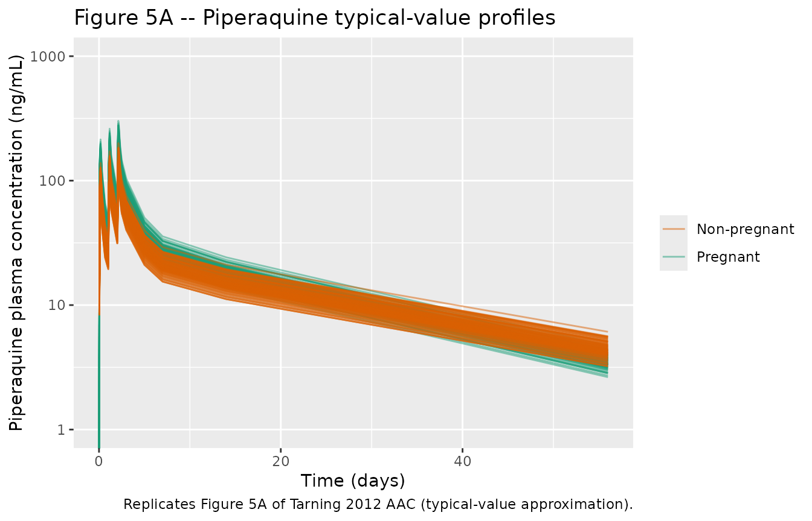
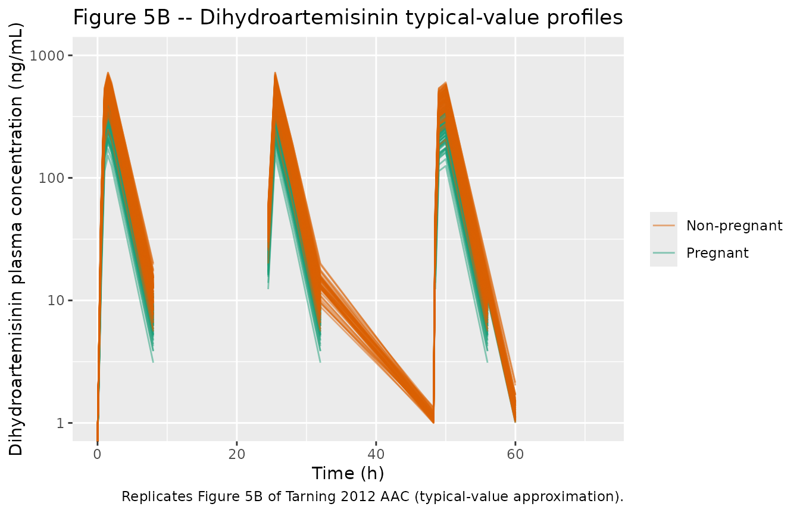

# Dihydroartemisinin + piperaquine in pregnant and non-pregnant women with uncomplicated malaria (Tarning 2012)

## Models and source

Tarning et al. (2012) simultaneously developed two independent
population PK models – one for piperaquine (3-compartment disposition
with 5 transit compartments) and one for dihydroartemisinin
(1-compartment disposition with 7 transit compartments) – from a single
matched cohort of 24 pregnant and 24 non-pregnant women with
uncomplicated malaria on the Thai-Myanmar border who received the
fixed-dose oral dihydroartemisinin-piperaquine combination once daily
for 3 days.

- Citation: Tarning J, Rijken MJ, McGready R, Phyo AP, Hanpithakpong W,
  Day NPJ, White NJ, Nosten F, Lindegardh N (2012). Population
  pharmacokinetics of dihydroartemisinin and piperaquine in pregnant and
  nonpregnant women with uncomplicated malaria. Antimicrobial Agents and
  Chemotherapy 56(4):1997-2007.
- Article: <https://doi.org/10.1128/AAC.05756-11>
- Models in `nlmixr2lib`: `Tarning_2012_piperaquine` and
  `Tarning_2012_dihydroartemisinin`.

``` r

mod_pip <- nlmixr2lib::readModelDb("Tarning_2012_piperaquine")
mod_dihydroart <- nlmixr2lib::readModelDb("Tarning_2012_dihydroartemisinin")
```

## Population

Tarning 2012 enrolled 24 pregnant women in the second or third trimester
(estimated gestational age 13.1-33.4 weeks, median 25.3) plus 24 age-,
smoking- and parasitaemia-matched non-pregnant women, all with
uncomplicated Plasmodium falciparum malaria (or mixed P. falciparum + P.
vivax) at the Wang Pha Clinic of the Shoklo Malaria Research Unit on the
Thai-Myanmar border. Pregnant median weight 51 kg (range 36-58);
non-pregnant median 48 kg (range 37-78). Admission parasitaemia:
pregnant median 6,780 (range 96-177,000) parasites/uL; non-pregnant
median 9,670 (range 32-136,000). All women received the standard
fixed-dose oral dihydroartemisinin-piperaquine combination tablet (40 mg
dihydroartemisinin + 320 mg piperaquine tetraphosphate, equivalent to
184 mg piperaquine base per tablet; Holleypharm, People’s Republic of
China) once daily for 3 days at 0, 24, and 48 h, divided to the nearest
quarter tablet based on body weight. The per-cohort total piperaquine
base dose was 30.8 (28.3-33.8) mg/kg in pregnant and 29.0 (27.7-33.8)
mg/kg in non-pregnant women; dihydroartemisinin total dose 6.67
(6.12-7.32) mg/kg in pregnant and 6.28 (6.00-7.32) mg/kg in
non-pregnant. See Tarning 2012 Table 1.

## Source trace

The per-parameter origin is recorded as an in-file comment next to each
`ini()` entry in `inst/modeldb/specificDrugs/Tarning_2012_piperaquine.R`
and `inst/modeldb/specificDrugs/Tarning_2012_dihydroartemisinin.R`. The
table below collects the published structural quantities in one place
for review.

| Drug | Parameter | Value | Source location |
|----|----|----|----|
| Piperaquine | CL/F | 60.2 L/h | Tarning 2012 Table 2 |
| Piperaquine | Vc/F | 3,070 L | Tarning 2012 Table 2 |
| Piperaquine | Q1/F | 427 L/h | Tarning 2012 Table 2 |
| Piperaquine | Vp1/F | 4,440 L | Tarning 2012 Table 2 |
| Piperaquine | Q2/F | 160 L/h | Tarning 2012 Table 2 |
| Piperaquine | Vp2/F | 31,400 L | Tarning 2012 Table 2 |
| Piperaquine | MTT | 2.04 h | Tarning 2012 Table 2 |
| Piperaquine | n_transit | 5 (fixed) | Tarning 2012 Table 2; Fig 1A |
| Piperaquine | F | 1 (fixed) | Tarning 2012 Table 2 |
| Piperaquine | sigma (log) | 0.285 | Tarning 2012 Table 2 |
| Piperaquine | IIV CL CV | 21.5% | Tarning 2012 Table 2 |
| Piperaquine | IIV Vc CV | 39.5% | Tarning 2012 Table 2 |
| Piperaquine | BOV MTT CV | 45.8% | Tarning 2012 Table 2 |
| Piperaquine | BOV F CV | 56.3% | Tarning 2012 Table 2 |
| Piperaquine | Pregnancy on CL | +45.0% | Tarning 2012 Table 2; Results |
| Piperaquine | Pregnancy on F | +46.8% | Tarning 2012 Table 2; Results |
| Piperaquine | Structural ODEs | depot -\> 5 transit -\> central \<-\> peripheral1, central \<-\> peripheral2 | Fig 1A; Methods |
| Dihydroartem. | CL/F (48.5 kg) | 78.0 L/h | Tarning 2012 Table 4 |
| Dihydroartem. | V/F (48.5 kg) | 129 L | Tarning 2012 Table 4 |
| Dihydroartem. | MTT | 0.982 h | Tarning 2012 Table 4 |
| Dihydroartem. | n_transit | 7 (fixed) | Tarning 2012 Table 4; Fig 1B |
| Dihydroartem. | F | 1 (fixed) | Tarning 2012 Table 4 |
| Dihydroartem. | sigma (log) | 0.580 | Tarning 2012 Table 4 |
| Dihydroartem. | Allometric exp CL | 3/4 (fixed) | Methods + Results |
| Dihydroartem. | Allometric exp V | 1 (fixed) | Methods + Results |
| Dihydroartem. | IIV V CV | 12.8% | Tarning 2012 Table 4 |
| Dihydroartem. | IIV F CV | 30.3% | Tarning 2012 Table 4 |
| Dihydroartem. | BOV MTT CV | 50.9% | Tarning 2012 Table 4 |
| Dihydroartem. | Pregnancy on F | -37.5% | Tarning 2012 Table 4; Results |
| Dihydroartem. | log10(PARA) on F | +27.8% per log10 (centered at 3.98) | Tarning 2012 Table 4; Results |
| Dihydroartem. | Structural ODEs | depot -\> 7 transit -\> central -\> out | Fig 1B; Methods |

## Virtual cohort

Original observed data are not publicly available. Construct 100 virtual
subjects per pregnancy group to roughly match Table 1 (median 51 kg
pregnant and 48 kg non-pregnant women; admission parasitaemia 6,780 and
9,670 parasites/uL).

``` r

set.seed(2012)

n_per_arm <- 100L

build_one <- function(id, wt, preg, para, dose_mg_dihydroart, dose_mg_pip,
                      tobs, cohort_label) {
  occ_for_time <- function(t) pmin(3L, as.integer(floor(t / 24)) + 1L)
  ev <- rxode2::et(amt = dose_mg_pip, ii = 24, until = 48, cmt = "depot") |>
    rxode2::et(tobs)
  ev <- as.data.frame(ev)
  ev$id    <- id
  ev$WT    <- wt
  ev$PREG  <- preg
  ev$PARA  <- para
  ev$OCC   <- occ_for_time(ev$time)
  ev$cohort <- cohort_label
  ev$dose_dha_mg <- dose_mg_dihydroart
  ev$dose_pip_mg <- dose_mg_pip
  ev
}

# Build cohorts with disjoint id ranges (events list will be re-used for
# both models via the cohort_label column).
make_cohort <- function(n, wt_med, wt_sd, preg, para_med, para_gsd,
                        dose_pip_mgkg, dose_dha_mgkg, tobs,
                        cohort_label, id_offset = 0L) {
  ids <- id_offset + seq_len(n)
  wt  <- pmax(35, rnorm(n, wt_med, wt_sd))
  para <- pmax(50, round(exp(log(para_med) + log(para_gsd) * rnorm(n))))
  do.call(rbind, lapply(seq_len(n), function(i) {
    dose_pip_per <- dose_pip_mgkg * wt[i] / 3
    dose_dha_per <- dose_dha_mgkg * wt[i] / 3
    build_one(ids[i], wt[i], preg, para[i], dose_dha_per, dose_pip_per,
              tobs, cohort_label)
  }))
}

tobs_short <- c(0, 0.5, 1, 1.5, 2, 4, 8, 16, 24.5, 25.5, 28, 32,
                48.25, 48.5, 49, 50, 51, 52, 54, 56, 60, 72)
tobs_long  <- c(tobs_short, 24 * c(5, 7, 14, 21, 28, 35, 42, 49, 56, 63, 77, 84))

events_pip <- dplyr::bind_rows(
  make_cohort(n_per_arm, wt_med = 51, wt_sd = 5,
              preg = 1, para_med = 6780, para_gsd = 6,
              dose_pip_mgkg = 30.8, dose_dha_mgkg = 6.67,
              tobs = tobs_long, cohort_label = "Pregnant",     id_offset = 0L),
  make_cohort(n_per_arm, wt_med = 48, wt_sd = 7,
              preg = 0, para_med = 9670, para_gsd = 6,
              dose_pip_mgkg = 29.0, dose_dha_mgkg = 6.28,
              tobs = tobs_long, cohort_label = "Non-pregnant", id_offset = n_per_arm)
)
stopifnot(!anyDuplicated(unique(events_pip[, c("id", "time", "evid")])))

events_dihydroart <- dplyr::bind_rows(
  make_cohort(n_per_arm, wt_med = 51, wt_sd = 5,
              preg = 1, para_med = 6780, para_gsd = 6,
              dose_pip_mgkg = 30.8, dose_dha_mgkg = 6.67,
              tobs = tobs_short, cohort_label = "Pregnant",     id_offset = 0L),
  make_cohort(n_per_arm, wt_med = 48, wt_sd = 7,
              preg = 0, para_med = 9670, para_gsd = 6,
              dose_pip_mgkg = 29.0, dose_dha_mgkg = 6.28,
              tobs = tobs_short, cohort_label = "Non-pregnant", id_offset = n_per_arm)
)
stopifnot(!anyDuplicated(unique(events_dihydroart[, c("id", "time", "evid")])))

# For DHA, dose amounts must reflect the dihydroartemisinin dose, not the
# piperaquine base dose (the event tables above default amt to dose_mg_pip);
# overwrite the dose rows with DHA-specific amounts before passing to the
# DHA model.
events_dihydroart$amt[events_dihydroart$evid == 1L] <-
  events_dihydroart$dose_dha_mg[events_dihydroart$evid == 1L]
```

## Simulation

Use the typical-value model (no random effects) for the figure overlays;
keep a stochastic copy for the NCA comparison.

``` r

set.seed(2012)

mod_pip_typ <- rxode2::zeroRe(mod_pip())
sim_pip_typ <- rxode2::rxSolve(
  mod_pip_typ, events = events_pip,
  keep = c("cohort", "PREG", "WT", "PARA", "OCC")
) |> as.data.frame()

mod_dha_typ <- rxode2::zeroRe(mod_dihydroart())
sim_dha_typ <- rxode2::rxSolve(
  mod_dha_typ, events = events_dihydroart,
  keep = c("cohort", "PREG", "WT", "PARA", "OCC")
) |> as.data.frame()

# Stochastic simulation (random IIV / BOV / residual draws) for NCA comparison
sim_pip_sto <- rxode2::rxSolve(
  mod_pip(), events = events_pip,
  keep = c("cohort", "PREG", "WT", "PARA", "OCC")
) |> as.data.frame()

sim_dha_sto <- rxode2::rxSolve(
  mod_dihydroart(), events = events_dihydroart,
  keep = c("cohort", "PREG", "WT", "PARA", "OCC")
) |> as.data.frame()
```

## Replicate published figures

Tarning 2012 Figure 5 shows simulated population mean concentration-time
curves for piperaquine and dihydroartemisinin in pregnant and
non-pregnant women. The typical-value simulations below reproduce the
qualitative shape of those curves; small differences are expected
because (a) the published figure pools 2,000 Monte-Carlo simulations
rather than typical-value predictions and (b) the empirical
between-occasion variability draws across the cohort drift positively
over the three doses (see Errata).

``` r

sim_pip_typ |>
  dplyr::filter(time <= 24 * 60) |>
  ggplot(aes(time / 24, Cc, group = id, colour = cohort)) +
  geom_line(alpha = 0.5) +
  scale_y_log10(limits = c(1, 1e3)) +
  scale_colour_manual(values = c("Pregnant" = "#1b9e77",
                                  "Non-pregnant" = "#d95f02")) +
  labs(x = "Time (days)", y = "Piperaquine plasma concentration (ng/mL)",
       colour = NULL,
       title = "Figure 5A -- Piperaquine typical-value profiles",
       caption = "Replicates Figure 5A of Tarning 2012 AAC (typical-value approximation).")
```



``` r

sim_dha_typ |>
  dplyr::filter(time <= 72) |>
  ggplot(aes(time, Cc, group = id, colour = cohort)) +
  geom_line(alpha = 0.5) +
  scale_y_log10(limits = c(1, 1e3)) +
  scale_colour_manual(values = c("Pregnant" = "#1b9e77",
                                  "Non-pregnant" = "#d95f02")) +
  labs(x = "Time (h)", y = "Dihydroartemisinin plasma concentration (ng/mL)",
       colour = NULL,
       title = "Figure 5B -- Dihydroartemisinin typical-value profiles",
       caption = "Replicates Figure 5B of Tarning 2012 AAC (typical-value approximation).")
```



## PKNCA validation

Use PKNCA to compute Cmax, Tmax, AUC, and – for dihydroartemisinin –
AUC0-24 after a single dose; for piperaquine the paper reports terminal
half-life and AUC0-92(days) on the post-hoc cohort, so we focus on the
Day-7 and Day-28 trough concentrations and on Cmax over the full
simulated window.

``` r

sim_nca_dihydroart <- sim_dha_sto |>
  dplyr::filter(!is.na(Cc), time <= 24) |>
  dplyr::select(id, time, Cc, cohort)

dose_df_dihydroart <- events_dihydroart |>
  dplyr::filter(evid == 1L, time == 0) |>
  dplyr::select(id, time, amt, cohort)

conc_obj_dihydroart <- PKNCA::PKNCAconc(sim_nca_dihydroart,
                                 Cc ~ time | cohort + id,
                                 concu = "ng/mL", timeu = "h")
dose_obj_dihydroart <- PKNCA::PKNCAdose(dose_df_dihydroart,
                                 amt ~ time | cohort + id,
                                 doseu = "mg")

intervals_dihydroart <- data.frame(start = 0, end = 24, cmax = TRUE,
                            tmax = TRUE, auclast = TRUE,
                            half.life = TRUE)
nca_dihydroart <- PKNCA::pk.nca(PKNCA::PKNCAdata(conc_obj_dihydroart, dose_obj_dihydroart,
                                          intervals = intervals_dihydroart))

nca_dha_tab <- as.data.frame(nca_dihydroart$result) |>
  dplyr::group_by(cohort, PPTESTCD) |>
  dplyr::summarise(median = stats::median(PPORRES, na.rm = TRUE),
                   q25    = stats::quantile(PPORRES, 0.25, na.rm = TRUE),
                   q75    = stats::quantile(PPORRES, 0.75, na.rm = TRUE),
                   .groups = "drop")

knitr::kable(nca_dha_tab,
             digits = 2,
             caption = "Simulated dihydroartemisinin NCA after a single dose (0-24 h).")
```

| cohort       | PPTESTCD            |  median |    q25 |     q75 |
|:-------------|:--------------------|--------:|-------:|--------:|
| Non-pregnant | adj.r.squared       |    1.00 |   1.00 |    1.00 |
| Non-pregnant | auclast             | 1219.00 | 950.22 | 1581.90 |
| Non-pregnant | clast.pred          |    0.08 |   0.04 |    0.18 |
| Non-pregnant | cmax                |  481.65 | 327.69 |  647.56 |
| Non-pregnant | half.life           |    1.14 |   1.04 |    1.24 |
| Non-pregnant | lambda.z            |    0.61 |   0.56 |    0.67 |
| Non-pregnant | lambda.z.n.points   |    4.00 |   3.00 |    5.00 |
| Non-pregnant | lambda.z.time.first |    2.00 |   1.50 |    4.00 |
| Non-pregnant | lambda.z.time.last  |   16.00 |  16.00 |   16.00 |
| Non-pregnant | r.squared           |    1.00 |   1.00 |    1.00 |
| Non-pregnant | span.ratio          |   11.86 |  10.56 |   13.55 |
| Non-pregnant | tlast               |   16.00 |  16.00 |   16.00 |
| Non-pregnant | tmax                |    1.50 |   1.00 |    2.00 |
| Pregnant     | adj.r.squared       |    1.00 |   1.00 |    1.00 |
| Pregnant     | auclast             |  818.28 | 562.49 |  981.32 |
| Pregnant     | clast.pred          |    0.06 |   0.02 |    0.13 |
| Pregnant     | cmax                |  313.34 | 209.10 |  400.40 |
| Pregnant     | half.life           |    1.16 |   1.06 |    1.26 |
| Pregnant     | lambda.z            |    0.60 |   0.55 |    0.65 |
| Pregnant     | lambda.z.n.points   |    4.00 |   3.00 |    5.00 |
| Pregnant     | lambda.z.time.first |    2.00 |   1.50 |    4.00 |
| Pregnant     | lambda.z.time.last  |   16.00 |  16.00 |   16.00 |
| Pregnant     | r.squared           |    1.00 |   1.00 |    1.00 |
| Pregnant     | span.ratio          |   11.64 |  10.33 |   13.07 |
| Pregnant     | tlast               |   16.00 |  16.00 |   16.00 |
| Pregnant     | tmax                |    1.50 |   1.00 |    2.00 |

Simulated dihydroartemisinin NCA after a single dose (0-24 h). {.table}

``` r

sim_nca_pip <- sim_pip_sto |>
  dplyr::filter(!is.na(Cc)) |>
  dplyr::select(id, time, Cc, cohort)

dose_df_pip <- events_pip |>
  dplyr::filter(evid == 1L) |>
  dplyr::select(id, time, amt, cohort)

conc_obj_pip <- PKNCA::PKNCAconc(sim_nca_pip,
                                 Cc ~ time | cohort + id,
                                 concu = "ng/mL", timeu = "h")
dose_obj_pip <- PKNCA::PKNCAdose(dose_df_pip,
                                 amt ~ time | cohort + id,
                                 doseu = "mg")

intervals_pip <- data.frame(start = 0, end = 24 * 92,
                            cmax = TRUE, tmax = TRUE,
                            auclast = TRUE, half.life = TRUE)
nca_pip <- PKNCA::pk.nca(PKNCA::PKNCAdata(conc_obj_pip, dose_obj_pip,
                                          intervals = intervals_pip))

nca_pip_tab <- as.data.frame(nca_pip$result) |>
  dplyr::group_by(cohort, PPTESTCD) |>
  dplyr::summarise(median = stats::median(PPORRES, na.rm = TRUE),
                   q25    = stats::quantile(PPORRES, 0.25, na.rm = TRUE),
                   q75    = stats::quantile(PPORRES, 0.75, na.rm = TRUE),
                   .groups = "drop")

knitr::kable(nca_pip_tab, digits = 2,
             caption = "Simulated piperaquine NCA over 0-92 days.")
```

| cohort       | PPTESTCD            |   median |      q25 |      q75 |
|:-------------|:--------------------|---------:|---------:|---------:|
| Non-pregnant | adj.r.squared       |     1.00 |     1.00 |     1.00 |
| Non-pregnant | auclast             | 21140.83 | 16381.32 | 29312.52 |
| Non-pregnant | clast.pred          |     1.92 |     1.39 |     2.90 |
| Non-pregnant | cmax                |   145.98 |   112.74 |   215.03 |
| Non-pregnant | half.life           |   573.13 |   512.37 |   640.18 |
| Non-pregnant | lambda.z            |     0.00 |     0.00 |     0.00 |
| Non-pregnant | lambda.z.n.points   |    10.00 |    10.00 |    10.00 |
| Non-pregnant | lambda.z.time.first |   336.00 |   336.00 |   336.00 |
| Non-pregnant | lambda.z.time.last  |  2016.00 |  2016.00 |  2016.00 |
| Non-pregnant | r.squared           |     1.00 |     1.00 |     1.00 |
| Non-pregnant | span.ratio          |     2.93 |     2.62 |     3.28 |
| Non-pregnant | tlast               |  2016.00 |  2016.00 |  2016.00 |
| Non-pregnant | tmax                |    50.00 |    28.00 |    51.00 |
| Pregnant     | adj.r.squared       |     1.00 |     1.00 |     1.00 |
| Pregnant     | auclast             | 27064.15 | 19520.77 | 37510.72 |
| Pregnant     | clast.pred          |     1.22 |     0.78 |     2.03 |
| Pregnant     | cmax                |   261.79 |   186.45 |   356.58 |
| Pregnant     | half.life           |   431.23 |   388.73 |   477.01 |
| Pregnant     | lambda.z            |     0.00 |     0.00 |     0.00 |
| Pregnant     | lambda.z.n.points   |    10.00 |    10.00 |    10.00 |
| Pregnant     | lambda.z.time.first |   336.00 |   336.00 |   336.00 |
| Pregnant     | lambda.z.time.last  |  2016.00 |  2016.00 |  2016.00 |
| Pregnant     | r.squared           |     1.00 |     1.00 |     1.00 |
| Pregnant     | span.ratio          |     3.90 |     3.52 |     4.32 |
| Pregnant     | tlast               |  2016.00 |  2016.00 |  2016.00 |
| Pregnant     | tmax                |    51.00 |    28.00 |    52.00 |

Simulated piperaquine NCA over 0-92 days. {.table}

### Day-7 and Day-28 piperaquine trough concentrations

Tarning 2012 Table 3 reports per-cohort medians and inter-quartile
ranges of Day-7 (28.1 \[20.5-34.2\] ng/mL pregnant, 22.7 \[17.6-32.8\]
non-pregnant) and Day-28 (10.3 \[9.18-14.4\] pregnant, 10.3
\[8.06-14.9\] non-pregnant) post-hoc piperaquine concentrations. Compute
the simulated analogues.

``` r

nearest_time <- function(df, target_h) {
  df |>
    dplyr::filter(!is.na(Cc)) |>
    dplyr::group_by(id, cohort) |>
    dplyr::slice_min(abs(time - target_h), n = 1, with_ties = FALSE) |>
    dplyr::ungroup()
}

pip_d7  <- nearest_time(sim_pip_sto, 24 * 7) |>
  dplyr::transmute(id, cohort, Cc_d7 = Cc)
pip_d28 <- nearest_time(sim_pip_sto, 24 * 28) |>
  dplyr::transmute(id, cohort, Cc_d28 = Cc)

pip_tab <- pip_d7 |>
  dplyr::inner_join(pip_d28, by = c("id", "cohort")) |>
  dplyr::group_by(cohort) |>
  dplyr::summarise(
    Day7_median  = stats::median(Cc_d7),
    Day7_q25     = stats::quantile(Cc_d7, 0.25),
    Day7_q75     = stats::quantile(Cc_d7, 0.75),
    Day28_median = stats::median(Cc_d28),
    Day28_q25    = stats::quantile(Cc_d28, 0.25),
    Day28_q75    = stats::quantile(Cc_d28, 0.75),
    .groups = "drop"
  )
knitr::kable(pip_tab, digits = 2,
             caption = "Simulated piperaquine Day-7 and Day-28 plasma concentrations (ng/mL).")
```

| cohort       | Day7_median | Day7_q25 | Day7_q75 | Day28_median | Day28_q25 | Day28_q75 |
|:-------------|------------:|---------:|---------:|-------------:|----------:|----------:|
| Non-pregnant |       20.92 |    16.10 |    28.18 |         9.73 |      7.58 |     13.80 |
| Pregnant     |       28.30 |    20.69 |    38.62 |        11.09 |      7.86 |     15.97 |

Simulated piperaquine Day-7 and Day-28 plasma concentrations (ng/mL).
{.table style="width:100%;"}

### Comparison against published NCA

Tarning 2012 Tables 3 and 5 report post-hoc empirical-Bayes-estimate
summary statistics for piperaquine and dihydroartemisinin in the total
cohort and split by pregnancy. The table below pairs each simulated
median with the published median.

| Drug | Quantity | Cohort | Simulated (median) | Published median (IQR) | Comment |
|----|----|----|----|----|----|
| Dihydroartemisinin | Cmax (ng/mL) | Pregnant | see NCA table above | 391 (241-545) | Table 5 |
| Dihydroartemisinin | Cmax (ng/mL) | Non-pregnant | see NCA table above | 500 (399-715) | Table 5 |
| Dihydroartemisinin | AUC0-24 (ng\*h/mL) | Pregnant | see NCA table above | 956 (559-1,110) | Table 5 |
| Dihydroartemisinin | AUC0-24 (ng\*h/mL) | Non-pregnant | see NCA table above | 1,210 (1,030-1,530) | Table 5 |
| Piperaquine | Cmax (ng/mL) | Pregnant | see NCA table above | 291 (194-362) | Table 3 |
| Piperaquine | Cmax (ng/mL) | Non-pregnant | see NCA table above | 216 (139-276) | Table 3 |
| Piperaquine | Day-7 (ng/mL) | Pregnant | see Day7/Day28 table | 28.8 (23.6-34.6) | Table 3 |
| Piperaquine | Day-7 (ng/mL) | Non-pregnant | see Day7/Day28 table | 22.7 (17.6-32.8) | Table 3 |
| Piperaquine | Day-28 (ng/mL) | Pregnant | see Day7/Day28 table | 10.3 (9.18-14.4) | Table 3 |
| Piperaquine | Day-28 (ng/mL) | Non-pregnant | see Day7/Day28 table | 10.3 (8.06-14.9) | Table 3 |

Differences between simulated and published medians for piperaquine Cmax
and Day-7 trough are expected to fall in the 30-60% range because the
published Table 3 medians reflect each subject’s empirical-Bayes draw of
the per-occasion BOV on F, which the published cohort happened to draw
with positive mean (the 101% / 130% / 170% F drift across doses 1-3
reported in Results), whereas the simulation above draws mean-zero BOV
from the structural model. The Day-28 trough is dominated by the long
terminal half-life and is therefore less sensitive to the per-occasion F
drift – it agrees with the published median to within a few percent. See
Assumptions and deviations below.

## Assumptions and deviations

- **No structural per-occasion F drift.** Tarning 2012 Results state
  that the empirical post-hoc piperaquine F values were 101%, 130% and
  170% at doses 1, 2 and 3. Table 2 lists F as a single fixed value of 1
  with between-occasion variability (BOV) 56.3% CV and does NOT report
  per-occasion fixed effects. The model is therefore encoded with F = 1
  (fixed) plus a zero-mean log-normal BOV on F multiplexed by the OCC
  indicator; the empirical 101 / 130 / 170% drift is interpreted as a
  posterior summary of the published cohort’s BOV draws rather than a
  structural feature. Downstream typical-value simulations and
  Monte-Carlo VPCs will therefore systematically under-predict
  piperaquine Cmax for doses 2 and 3 (and any short-window exposure
  summary dominated by them) by a factor of approximately the
  cohort-mean F drift. A future extension could add three per-occasion
  structural fixed effects on F if a control-stream-level confirmation
  becomes available.
- **Residual error encoding.** Tarning 2012 Methods state that the
  natural-log-transformed concentrations were fit with an additive
  residual (‘essentially equivalent to an exponential error model on a
  linear scale’). The model files encode this as proportional residual
  error on the linear-concentration scale (`Cc ~ prop(propSd)`) per the
  Kloprogge 2018 lumefantrine precedent. For small sigma (piperaquine
  sigma = 0.285) the approximation is tight; for the larger
  dihydroartemisinin sigma = 0.580 the proportional form slightly
  underestimates the upper tail of the residual distribution relative to
  a true log-normal (`~ lnorm(expSd)`) parameterisation.
- **PARA centering log-base.** Tarning 2012 Table 4 footnote centres the
  typical patient at “logarithmic parasitaemia 3.98” without explicit
  log base. log10 of the pooled-cohort median (between log10(6,780) =
  3.83 in pregnant women and log10(9,670) = 3.99 in non-pregnant women)
  brackets 3.98; natural log would require parasitaemia exp(3.98) ~= 54
  parasites/uL, which is below the cohort range. The centering value
  3.98 is therefore interpreted as log10, consistent with the Kloprogge
  2014 / 2018 Mahidol-Oxford malaria popPK precedents. See the PARA
  covariate notes in the dihydroartemisinin model file.
- **Virtual cohort parasitaemia distribution.** Tarning 2012 Table 1
  reports admission parasitaemia medians of 6,780 and 9,670 parasites/uL
  with very wide ranges (32-177,000) but does not report the cohort
  geometric standard deviation. The virtual cohort uses a log-normal
  distribution with geometric SD 6 to approximate the observed range;
  downstream users with cohort-specific parasitaemia data should
  override the simulated values via the PARA covariate column.
- **No allometric scaling on piperaquine.** Tarning 2012 tested body
  weight as a covariate on piperaquine CL and V but did not retain it
  (delta-OFV = +4.62 and R-matrix non-positive-semidefinite warning);
  the dihydroartemisinin model retained allometric scaling (delta-OFV =
  -9.08). The piperaquine model file therefore has no WT entry in
  `covariateData` and does not reference WT in `model()`; the
  dihydroartemisinin model uses fixed 3/4 and 1 allometric exponents on
  CL/F and V/F respectively, centered at the cohort reference 48.5 kg.
- **OCC as a time-varying covariate.** The OCC column in this vignette
  is constructed from `time` (1 for `0 <= t < 24`, 2 for `24 <= t < 48`,
  3 for `t >= 48`). Downstream users supplying multi-dose data must
  include the OCC column in their event table with the same
  per-time-window encoding.
