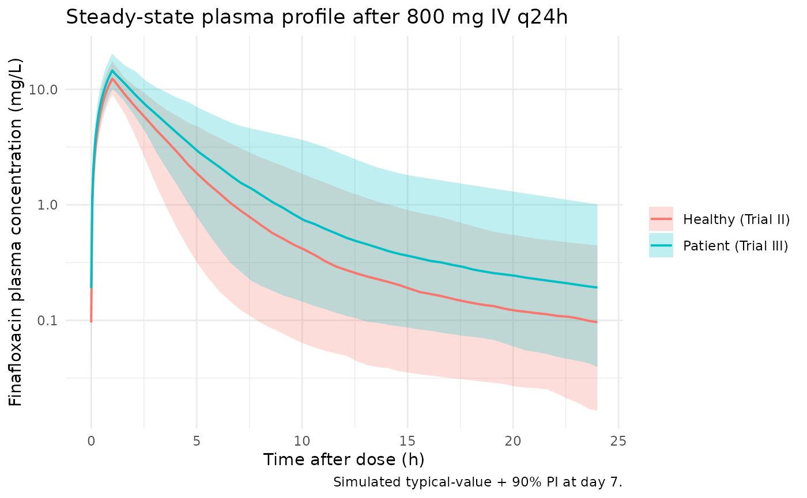

# Finafloxacin (Taubert 2018)

## Model and source

- Citation: Taubert M, Luckermann M, Vente A, Dalhoff A, Fuhr U.
  Population pharmacokinetics of finafloxacin in healthy volunteers and
  patients with complicated urinary tract infections. Antimicrob Agents
  Chemother. 2018;62(4):e02328-17. <doi:10.1128/AAC.02328-17>
- Description: Two-compartment population PK model for finafloxacin (a
  novel fluoroquinolone with enhanced antibacterial activity at acidic
  pH) with linear elimination, parallel first-order plus zero-order oral
  absorption (each with its own absorption lag time), an additive
  renal + non-renal clearance decomposition, and a cumulative-urinary
  excretion compartment. Built from pooled data of 266 subjects across
  three trials: 127 healthy volunteers (Trial I oral 25-1,000 mg/day;
  Trial II IV 200-1,000 mg/day) and 139 patients with complicated
  urinary tract infections (Trial III IV 800 mg/day, 60-min infusions).
  Covariates: body surface area on the central volume of distribution
  (power form, exponent 1.50, reference 1.829 m^2) and healthy / patient
  cohort status (DIS_HEALTHY) on both the renal and non-renal clearance
  arms. The paper-reported total apparent clearance (20.9 L/h healthy;
  -29% in patients) and population-specific fraction renally excreted
  (FER1 = 0.40 healthy, FER2 = 0.21 patient) are re-parameterised into
  the canonical lcl_renal + lcl_nonren additive decomposition; the
  typical values are anchored to DIS_HEALTHY = 0 (patient reference) per
  the inst/references/covariate-columns.md DIS_HEALTHY convention. The
  IIV translation between the paper and the re-parameterised forms is
  documented in the validation vignette Assumptions and deviations
  (Taubert 2018).
- Article: <https://doi.org/10.1128/AAC.02328-17>

## Population

Taubert 2018 fit a unified population PK model to pooled data from 266
subjects across three trials (paper Table 1):

- Trial I (n = 77): healthy adult volunteers receiving oral finafloxacin
  25-1,000 mg/day (single and multiple ascending doses); median weight
  75.3 kg (61-97.7), median height 176.7 cm (161-190), median age 42.5
  years (19-55), 71 male.
- Trial II (n = 50): healthy adult volunteers receiving IV finafloxacin
  200-1,000 mg/day; median weight 76.5 kg (50.9-112.4), median height
  174.5 cm (138-200), median age 41.5 years (19-63), 42 male.
- Trial III (n = 139): hospitalised patients with complicated urinary
  tract infections or acute complicated / uncomplicated pyelonephritis
  receiving IV finafloxacin 800 mg/day for 5 or 10 days (60-min short
  infusions); median weight 73.5 kg (64-140), median height 164 cm
  (145-186), median age 61 years (19-90), 21 male.

A total of 3,235 plasma samples and 633 urine samples were modelled
(ClinicalTrials.gov NCT01928433). The same information is available
programmatically via
`readModelDb("Taubert_2018_finafloxacin")$population`.

## Source trace

The per-parameter origin is recorded as an in-file comment next to each
`ini()` entry in
`inst/modeldb/specificDrugs/Taubert_2018_finafloxacin.R`. The table
below collects them in one place for review.

| Equation / parameter | Value | Source location |
|----|----|----|
| `lcl_renal` | log(3.12) (= log(20.9 \* 0.71 \* 0.21)) | Table 3 (CL_total, patient effect, FER2) |
| `lcl_nonren` | log(11.72) (= log(20.9 \* 0.71 \* 0.79)) | Table 3 (CL_total, patient effect, 1 - FER2) |
| `lvc` | log(46.9) | Table 3 (Vc) |
| `lq` | log(2.80) | Table 3 (Q) |
| `lvp` | log(43.1) | Table 3 (Vp) |
| `e_bsa_vc` | 1.50 | Table 3 (BSA on Vc) |
| `e_dis_healthy_cl_renal` | log(8.36 / 3.12) = 0.985 | Table 3 (FER1 / FER2, with patient CL effect) |
| `e_dis_healthy_cl_nonren` | log(12.54 / 11.72) = 0.068 | Table 3 ((1 - FER1) / (1 - FER2), with patient CL effect) |
| `lfdepot` | log(0.75) | Table 3 oral (F) |
| `logitf1st` | logit(0.77) | Table 3 oral (f1st) |
| `lka` | log(6.61) | Table 3 oral (Ka) |
| `ltlag1` | log(0.22) | Table 3 oral (LAG1) |
| `ld0` | log(7.77) | Table 3 oral (D0) |
| `ltlag2` | log(0.54) | Table 3 oral (LAG2) |
| `etalcl_renal` | log(1 + 0.57^2) | combined CL_total IIV (54%) + FER1 IIV (19%) |
| `etalcl_nonren` | log(1 + 0.54^2) | Table 3 (IIV on CL_total) |
| `etalvc, etalq, etalvp` | log(1 + CV^2) | Table 3 (IIV %CV per parameter) |
| oral absorption IIVs | log(1 + CV^2) | Table 3 oral (IIV %CV per parameter) |
| `addSd`, `propSd` | 0.001, 0.24 | Table 3 (IV plasma RUV) |
| `addSd_urineAmt`, `propSd_urineAmt` | 0.001, 0.33 | Table 3 (IV urine RUV) |
| Two-compartment ODE structure | n/a | Methods, Population pharmacokinetic analysis |
| Parallel first-order + zero-order absorption | n/a | Results, Oral absorption model |
| Urinary excretion compartment | n/a | Methods (output compartment for renal arm) |

## Virtual cohort

The original observed data are not publicly available. The simulations
below use two virtual cohorts whose covariate distributions approximate
the Trial II (healthy IV) and Trial III (patient IV) demographics from
Table 1.

``` r

set.seed(20180101)

make_cohort <- function(n, wt_mu, wt_sd, ht_mu, ht_sd, pct_female, dis_healthy, id_offset = 0L) {
  tibble(
    id          = id_offset + seq_len(n),
    WT          = pmax(40, rnorm(n, mean = wt_mu, sd = wt_sd)),
    HT          = pmax(140, rnorm(n, mean = ht_mu, sd = ht_sd)),
    SEXF        = rbinom(n, size = 1, prob = pct_female / 100),
    DIS_HEALTHY = dis_healthy
  ) |>
    mutate(BSA = sqrt(WT * HT / 3600))
}

n_per_cohort <- 200L

cohort_healthy <- make_cohort(
  n          = n_per_cohort,
  wt_mu      = 76.5,
  wt_sd      = 12.0,
  ht_mu      = 174.5,
  ht_sd      = 9.0,
  pct_female = 16.0,
  dis_healthy = 1L,
  id_offset  = 0L
) |>
  mutate(cohort = "Healthy (Trial II)")

cohort_patient <- make_cohort(
  n          = n_per_cohort,
  wt_mu      = 73.5,
  wt_sd      = 15.0,
  ht_mu      = 164.0,
  ht_sd      = 9.0,
  pct_female = 85.0,
  dis_healthy = 0L,
  id_offset  = n_per_cohort
) |>
  mutate(cohort = "Patient (Trial III)")

cohorts <- bind_rows(cohort_healthy, cohort_patient)
```

Each subject receives 800 mg IV finafloxacin once daily as a 60-min
infusion (`rate = amt / duration = 800 mg/h`) for seven days;
observations are sampled densely across the final dosing interval to
characterise steady-state PK.

``` r

dose_times <- seq(0, 24 * 6, by = 24)
obs_times  <- c(
  seq(24 * 6, 24 * 6 + 1, by = 0.05),
  seq(24 * 6 + 1.1, 24 * 6 + 23.9, by = 0.5),
  24 * 7
)

dose_rows <- cohorts |>
  tidyr::crossing(time = dose_times) |>
  mutate(
    evid = 1,
    amt  = 800,
    cmt  = "central",
    rate = 800,
    dv   = NA_real_
  )

obs_rows <- cohorts |>
  tidyr::crossing(time = obs_times) |>
  mutate(
    evid = 0,
    amt  = NA_real_,
    cmt  = "Cc",
    rate = 0,
    dv   = NA_real_
  )

events <- bind_rows(dose_rows, obs_rows) |>
  arrange(id, time, desc(evid))

stopifnot(!anyDuplicated(unique(events[, c("id", "time", "evid")])))
```

## Simulation

``` r

mod <- readModelDb("Taubert_2018_finafloxacin")

sim <- rxode2::rxSolve(
  mod,
  events = events,
  keep   = c("cohort", "WT", "HT", "BSA", "DIS_HEALTHY")
) |>
  as.data.frame() |>
  dplyr::filter(time >= 24 * 6)
#> ℹ parameter labels from comments will be replaced by 'label()'
```

## Replicate published figures

``` r

# Replicates the steady-state concentration-time pattern visible in Figure 1
# (b, c) and Figure 3 of Taubert 2018: median + 90% prediction interval at
# steady state for healthy volunteers (Trial II) vs. cUTI patients (Trial III).
sim |>
  mutate(time_h = time - 24 * 6) |>
  group_by(cohort, time_h) |>
  summarise(
    Q05 = quantile(Cc, 0.05, na.rm = TRUE),
    Q50 = quantile(Cc, 0.50, na.rm = TRUE),
    Q95 = quantile(Cc, 0.95, na.rm = TRUE),
    .groups = "drop"
  ) |>
  ggplot(aes(time_h, Q50, fill = cohort, colour = cohort)) +
  geom_ribbon(aes(ymin = Q05, ymax = Q95), alpha = 0.25, colour = NA) +
  geom_line(linewidth = 0.7) +
  scale_y_log10() +
  labs(
    x = "Time after dose (h)",
    y = "Finafloxacin plasma concentration (mg/L)",
    fill   = NULL,
    colour = NULL,
    title  = "Steady-state plasma profile after 800 mg IV q24h",
    caption = "Simulated typical-value + 90% PI at day 7."
  ) +
  theme_minimal()
```



## PKNCA validation

Use PKNCA to compute Cmax, Tmax, AUC, and half-life on the simulated
final dosing interval (`24*6 < time <= 24*7`) so the results align with
the steady-state Table 4 of Taubert 2018.

``` r

sim_nca <- sim |>
  dplyr::filter(time > 24 * 6) |>
  dplyr::mutate(time_h = time - 24 * 6) |>
  dplyr::filter(!is.na(Cc), Cc > 0) |>
  dplyr::select(id, time = time_h, Cc, cohort, WT)

conc_obj <- PKNCA::PKNCAconc(sim_nca, Cc ~ time | cohort + id)

dose_df <- cohorts |>
  dplyr::mutate(time = 0, amt = 800)

dose_obj <- PKNCA::PKNCAdose(dose_df, amt ~ time | cohort + id)

intervals <- data.frame(
  start         = 0,
  end           = 24,
  cmax          = TRUE,
  tmax          = TRUE,
  auclast       = TRUE,
  half.life     = TRUE
)

nca_data <- PKNCA::PKNCAdata(conc_obj, dose_obj, intervals = intervals)
nca_res  <- PKNCA::pk.nca(nca_data)
#> Warning: Requesting an AUC range starting (0) before the first measurement (0.05) is not allowed
#> Requesting an AUC range starting (0) before the first measurement (0.05) is not allowed
#> Requesting an AUC range starting (0) before the first measurement (0.05) is not allowed
#> Requesting an AUC range starting (0) before the first measurement (0.05) is not allowed
#> Requesting an AUC range starting (0) before the first measurement (0.05) is not allowed
#> Requesting an AUC range starting (0) before the first measurement (0.05) is not allowed
#> Requesting an AUC range starting (0) before the first measurement (0.05) is not allowed
#> Requesting an AUC range starting (0) before the first measurement (0.05) is not allowed
#> Requesting an AUC range starting (0) before the first measurement (0.05) is not allowed
#> Requesting an AUC range starting (0) before the first measurement (0.05) is not allowed
#> Requesting an AUC range starting (0) before the first measurement (0.05) is not allowed
#> Requesting an AUC range starting (0) before the first measurement (0.05) is not allowed
#> Requesting an AUC range starting (0) before the first measurement (0.05) is not allowed
#> Requesting an AUC range starting (0) before the first measurement (0.05) is not allowed
#> Requesting an AUC range starting (0) before the first measurement (0.05) is not allowed
#> Requesting an AUC range starting (0) before the first measurement (0.05) is not allowed
#> Requesting an AUC range starting (0) before the first measurement (0.05) is not allowed
#> Requesting an AUC range starting (0) before the first measurement (0.05) is not allowed
#> Requesting an AUC range starting (0) before the first measurement (0.05) is not allowed
#> Requesting an AUC range starting (0) before the first measurement (0.05) is not allowed
#> Requesting an AUC range starting (0) before the first measurement (0.05) is not allowed
#> Requesting an AUC range starting (0) before the first measurement (0.05) is not allowed
#> Requesting an AUC range starting (0) before the first measurement (0.05) is not allowed
#> Requesting an AUC range starting (0) before the first measurement (0.05) is not allowed
#> Requesting an AUC range starting (0) before the first measurement (0.05) is not allowed
#> Requesting an AUC range starting (0) before the first measurement (0.05) is not allowed
#> Requesting an AUC range starting (0) before the first measurement (0.05) is not allowed
#> Requesting an AUC range starting (0) before the first measurement (0.05) is not allowed
#> Requesting an AUC range starting (0) before the first measurement (0.05) is not allowed
#> Requesting an AUC range starting (0) before the first measurement (0.05) is not allowed
#> Requesting an AUC range starting (0) before the first measurement (0.05) is not allowed
#> Requesting an AUC range starting (0) before the first measurement (0.05) is not allowed
#> Requesting an AUC range starting (0) before the first measurement (0.05) is not allowed
#> Requesting an AUC range starting (0) before the first measurement (0.05) is not allowed
#> Requesting an AUC range starting (0) before the first measurement (0.05) is not allowed
#> Requesting an AUC range starting (0) before the first measurement (0.05) is not allowed
#> Requesting an AUC range starting (0) before the first measurement (0.05) is not allowed
#> Requesting an AUC range starting (0) before the first measurement (0.05) is not allowed
#> Requesting an AUC range starting (0) before the first measurement (0.05) is not allowed
#> Requesting an AUC range starting (0) before the first measurement (0.05) is not allowed
#> Requesting an AUC range starting (0) before the first measurement (0.05) is not allowed
#> Requesting an AUC range starting (0) before the first measurement (0.05) is not allowed
#> Requesting an AUC range starting (0) before the first measurement (0.05) is not allowed
#> Requesting an AUC range starting (0) before the first measurement (0.05) is not allowed
#> Requesting an AUC range starting (0) before the first measurement (0.05) is not allowed
#> Requesting an AUC range starting (0) before the first measurement (0.05) is not allowed
#> Requesting an AUC range starting (0) before the first measurement (0.05) is not allowed
#> Requesting an AUC range starting (0) before the first measurement (0.05) is not allowed
#> Requesting an AUC range starting (0) before the first measurement (0.05) is not allowed
#> Requesting an AUC range starting (0) before the first measurement (0.05) is not allowed
#> Requesting an AUC range starting (0) before the first measurement (0.05) is not allowed
#> Requesting an AUC range starting (0) before the first measurement (0.05) is not allowed
#> Requesting an AUC range starting (0) before the first measurement (0.05) is not allowed
#> Requesting an AUC range starting (0) before the first measurement (0.05) is not allowed
#> Requesting an AUC range starting (0) before the first measurement (0.05) is not allowed
#> Requesting an AUC range starting (0) before the first measurement (0.05) is not allowed
#> Requesting an AUC range starting (0) before the first measurement (0.05) is not allowed
#> Requesting an AUC range starting (0) before the first measurement (0.05) is not allowed
#> Requesting an AUC range starting (0) before the first measurement (0.05) is not allowed
#> Requesting an AUC range starting (0) before the first measurement (0.05) is not allowed
#> Requesting an AUC range starting (0) before the first measurement (0.05) is not allowed
#> Requesting an AUC range starting (0) before the first measurement (0.05) is not allowed
#> Requesting an AUC range starting (0) before the first measurement (0.05) is not allowed
#> Requesting an AUC range starting (0) before the first measurement (0.05) is not allowed
#> Requesting an AUC range starting (0) before the first measurement (0.05) is not allowed
#> Requesting an AUC range starting (0) before the first measurement (0.05) is not allowed
#> Requesting an AUC range starting (0) before the first measurement (0.05) is not allowed
#> Requesting an AUC range starting (0) before the first measurement (0.05) is not allowed
#> Requesting an AUC range starting (0) before the first measurement (0.05) is not allowed
#> Requesting an AUC range starting (0) before the first measurement (0.05) is not allowed
#> Requesting an AUC range starting (0) before the first measurement (0.05) is not allowed
#> Requesting an AUC range starting (0) before the first measurement (0.05) is not allowed
#> Requesting an AUC range starting (0) before the first measurement (0.05) is not allowed
#> Requesting an AUC range starting (0) before the first measurement (0.05) is not allowed
#> Requesting an AUC range starting (0) before the first measurement (0.05) is not allowed
#> Requesting an AUC range starting (0) before the first measurement (0.05) is not allowed
#> Requesting an AUC range starting (0) before the first measurement (0.05) is not allowed
#> Requesting an AUC range starting (0) before the first measurement (0.05) is not allowed
#> Requesting an AUC range starting (0) before the first measurement (0.05) is not allowed
#> Requesting an AUC range starting (0) before the first measurement (0.05) is not allowed
#> Requesting an AUC range starting (0) before the first measurement (0.05) is not allowed
#> Requesting an AUC range starting (0) before the first measurement (0.05) is not allowed
#> Requesting an AUC range starting (0) before the first measurement (0.05) is not allowed
#> Requesting an AUC range starting (0) before the first measurement (0.05) is not allowed
#> Requesting an AUC range starting (0) before the first measurement (0.05) is not allowed
#> Requesting an AUC range starting (0) before the first measurement (0.05) is not allowed
#> Requesting an AUC range starting (0) before the first measurement (0.05) is not allowed
#> Requesting an AUC range starting (0) before the first measurement (0.05) is not allowed
#> Requesting an AUC range starting (0) before the first measurement (0.05) is not allowed
#> Requesting an AUC range starting (0) before the first measurement (0.05) is not allowed
#> Requesting an AUC range starting (0) before the first measurement (0.05) is not allowed
#> Requesting an AUC range starting (0) before the first measurement (0.05) is not allowed
#> Requesting an AUC range starting (0) before the first measurement (0.05) is not allowed
#> Requesting an AUC range starting (0) before the first measurement (0.05) is not allowed
#> Requesting an AUC range starting (0) before the first measurement (0.05) is not allowed
#> Requesting an AUC range starting (0) before the first measurement (0.05) is not allowed
#> Requesting an AUC range starting (0) before the first measurement (0.05) is not allowed
#> Requesting an AUC range starting (0) before the first measurement (0.05) is not allowed
#> Requesting an AUC range starting (0) before the first measurement (0.05) is not allowed
#> Requesting an AUC range starting (0) before the first measurement (0.05) is not allowed
#> Requesting an AUC range starting (0) before the first measurement (0.05) is not allowed
#> Requesting an AUC range starting (0) before the first measurement (0.05) is not allowed
#> Requesting an AUC range starting (0) before the first measurement (0.05) is not allowed
#> Requesting an AUC range starting (0) before the first measurement (0.05) is not allowed
#> Requesting an AUC range starting (0) before the first measurement (0.05) is not allowed
#> Requesting an AUC range starting (0) before the first measurement (0.05) is not allowed
#> Requesting an AUC range starting (0) before the first measurement (0.05) is not allowed
#> Requesting an AUC range starting (0) before the first measurement (0.05) is not allowed
#> Requesting an AUC range starting (0) before the first measurement (0.05) is not allowed
#> Requesting an AUC range starting (0) before the first measurement (0.05) is not allowed
#> Requesting an AUC range starting (0) before the first measurement (0.05) is not allowed
#> Requesting an AUC range starting (0) before the first measurement (0.05) is not allowed
#> Requesting an AUC range starting (0) before the first measurement (0.05) is not allowed
#> Requesting an AUC range starting (0) before the first measurement (0.05) is not allowed
#> Requesting an AUC range starting (0) before the first measurement (0.05) is not allowed
#> Requesting an AUC range starting (0) before the first measurement (0.05) is not allowed
#> Requesting an AUC range starting (0) before the first measurement (0.05) is not allowed
#> Requesting an AUC range starting (0) before the first measurement (0.05) is not allowed
#> Requesting an AUC range starting (0) before the first measurement (0.05) is not allowed
#> Requesting an AUC range starting (0) before the first measurement (0.05) is not allowed
#> Requesting an AUC range starting (0) before the first measurement (0.05) is not allowed
#> Requesting an AUC range starting (0) before the first measurement (0.05) is not allowed
#> Requesting an AUC range starting (0) before the first measurement (0.05) is not allowed
#> Requesting an AUC range starting (0) before the first measurement (0.05) is not allowed
#> Requesting an AUC range starting (0) before the first measurement (0.05) is not allowed
#> Requesting an AUC range starting (0) before the first measurement (0.05) is not allowed
#> Requesting an AUC range starting (0) before the first measurement (0.05) is not allowed
#> Requesting an AUC range starting (0) before the first measurement (0.05) is not allowed
#> Requesting an AUC range starting (0) before the first measurement (0.05) is not allowed
#> Requesting an AUC range starting (0) before the first measurement (0.05) is not allowed
#> Requesting an AUC range starting (0) before the first measurement (0.05) is not allowed
#> Requesting an AUC range starting (0) before the first measurement (0.05) is not allowed
#> Requesting an AUC range starting (0) before the first measurement (0.05) is not allowed
#> Requesting an AUC range starting (0) before the first measurement (0.05) is not allowed
#> Requesting an AUC range starting (0) before the first measurement (0.05) is not allowed
#> Requesting an AUC range starting (0) before the first measurement (0.05) is not allowed
#> Requesting an AUC range starting (0) before the first measurement (0.05) is not allowed
#> Requesting an AUC range starting (0) before the first measurement (0.05) is not allowed
#> Requesting an AUC range starting (0) before the first measurement (0.05) is not allowed
#> Requesting an AUC range starting (0) before the first measurement (0.05) is not allowed
#> Requesting an AUC range starting (0) before the first measurement (0.05) is not allowed
#> Requesting an AUC range starting (0) before the first measurement (0.05) is not allowed
#> Requesting an AUC range starting (0) before the first measurement (0.05) is not allowed
#> Requesting an AUC range starting (0) before the first measurement (0.05) is not allowed
#> Requesting an AUC range starting (0) before the first measurement (0.05) is not allowed
#> Requesting an AUC range starting (0) before the first measurement (0.05) is not allowed
#> Requesting an AUC range starting (0) before the first measurement (0.05) is not allowed
#> Requesting an AUC range starting (0) before the first measurement (0.05) is not allowed
#> Requesting an AUC range starting (0) before the first measurement (0.05) is not allowed
#> Requesting an AUC range starting (0) before the first measurement (0.05) is not allowed
#> Requesting an AUC range starting (0) before the first measurement (0.05) is not allowed
#> Requesting an AUC range starting (0) before the first measurement (0.05) is not allowed
#> Requesting an AUC range starting (0) before the first measurement (0.05) is not allowed
#> Requesting an AUC range starting (0) before the first measurement (0.05) is not allowed
#> Requesting an AUC range starting (0) before the first measurement (0.05) is not allowed
#> Requesting an AUC range starting (0) before the first measurement (0.05) is not allowed
#> Requesting an AUC range starting (0) before the first measurement (0.05) is not allowed
#> Requesting an AUC range starting (0) before the first measurement (0.05) is not allowed
#> Requesting an AUC range starting (0) before the first measurement (0.05) is not allowed
#> Requesting an AUC range starting (0) before the first measurement (0.05) is not allowed
#> Requesting an AUC range starting (0) before the first measurement (0.05) is not allowed
#> Requesting an AUC range starting (0) before the first measurement (0.05) is not allowed
#> Requesting an AUC range starting (0) before the first measurement (0.05) is not allowed
#> Requesting an AUC range starting (0) before the first measurement (0.05) is not allowed
#> Requesting an AUC range starting (0) before the first measurement (0.05) is not allowed
#> Requesting an AUC range starting (0) before the first measurement (0.05) is not allowed
#> Requesting an AUC range starting (0) before the first measurement (0.05) is not allowed
#> Requesting an AUC range starting (0) before the first measurement (0.05) is not allowed
#> Requesting an AUC range starting (0) before the first measurement (0.05) is not allowed
#> Requesting an AUC range starting (0) before the first measurement (0.05) is not allowed
#> Requesting an AUC range starting (0) before the first measurement (0.05) is not allowed
#> Requesting an AUC range starting (0) before the first measurement (0.05) is not allowed
#> Requesting an AUC range starting (0) before the first measurement (0.05) is not allowed
#> Requesting an AUC range starting (0) before the first measurement (0.05) is not allowed
#> Requesting an AUC range starting (0) before the first measurement (0.05) is not allowed
#> Requesting an AUC range starting (0) before the first measurement (0.05) is not allowed
#> Requesting an AUC range starting (0) before the first measurement (0.05) is not allowed
#> Requesting an AUC range starting (0) before the first measurement (0.05) is not allowed
#> Requesting an AUC range starting (0) before the first measurement (0.05) is not allowed
#> Requesting an AUC range starting (0) before the first measurement (0.05) is not allowed
#> Requesting an AUC range starting (0) before the first measurement (0.05) is not allowed
#> Requesting an AUC range starting (0) before the first measurement (0.05) is not allowed
#> Requesting an AUC range starting (0) before the first measurement (0.05) is not allowed
#> Requesting an AUC range starting (0) before the first measurement (0.05) is not allowed
#> Requesting an AUC range starting (0) before the first measurement (0.05) is not allowed
#> Requesting an AUC range starting (0) before the first measurement (0.05) is not allowed
#> Requesting an AUC range starting (0) before the first measurement (0.05) is not allowed
#> Requesting an AUC range starting (0) before the first measurement (0.05) is not allowed
#> Requesting an AUC range starting (0) before the first measurement (0.05) is not allowed
#> Requesting an AUC range starting (0) before the first measurement (0.05) is not allowed
#> Requesting an AUC range starting (0) before the first measurement (0.05) is not allowed
#> Requesting an AUC range starting (0) before the first measurement (0.05) is not allowed
#> Requesting an AUC range starting (0) before the first measurement (0.05) is not allowed
#> Requesting an AUC range starting (0) before the first measurement (0.05) is not allowed
#> Requesting an AUC range starting (0) before the first measurement (0.05) is not allowed
#> Requesting an AUC range starting (0) before the first measurement (0.05) is not allowed
#> Requesting an AUC range starting (0) before the first measurement (0.05) is not allowed
#> Requesting an AUC range starting (0) before the first measurement (0.05) is not allowed
#> Requesting an AUC range starting (0) before the first measurement (0.05) is not allowed
#> Requesting an AUC range starting (0) before the first measurement (0.05) is not allowed
#> Requesting an AUC range starting (0) before the first measurement (0.05) is not allowed
#> Requesting an AUC range starting (0) before the first measurement (0.05) is not allowed
#> Requesting an AUC range starting (0) before the first measurement (0.05) is not allowed
#> Requesting an AUC range starting (0) before the first measurement (0.05) is not allowed
#> Requesting an AUC range starting (0) before the first measurement (0.05) is not allowed
#> Requesting an AUC range starting (0) before the first measurement (0.05) is not allowed
#> Requesting an AUC range starting (0) before the first measurement (0.05) is not allowed
#> Requesting an AUC range starting (0) before the first measurement (0.05) is not allowed
#> Requesting an AUC range starting (0) before the first measurement (0.05) is not allowed
#> Requesting an AUC range starting (0) before the first measurement (0.05) is not allowed
#> Requesting an AUC range starting (0) before the first measurement (0.05) is not allowed
#> Requesting an AUC range starting (0) before the first measurement (0.05) is not allowed
#> Requesting an AUC range starting (0) before the first measurement (0.05) is not allowed
#> Requesting an AUC range starting (0) before the first measurement (0.05) is not allowed
#> Requesting an AUC range starting (0) before the first measurement (0.05) is not allowed
#> Requesting an AUC range starting (0) before the first measurement (0.05) is not allowed
#> Requesting an AUC range starting (0) before the first measurement (0.05) is not allowed
#> Requesting an AUC range starting (0) before the first measurement (0.05) is not allowed
#> Requesting an AUC range starting (0) before the first measurement (0.05) is not allowed
#> Requesting an AUC range starting (0) before the first measurement (0.05) is not allowed
#> Requesting an AUC range starting (0) before the first measurement (0.05) is not allowed
#> Requesting an AUC range starting (0) before the first measurement (0.05) is not allowed
#> Requesting an AUC range starting (0) before the first measurement (0.05) is not allowed
#> Requesting an AUC range starting (0) before the first measurement (0.05) is not allowed
#> Requesting an AUC range starting (0) before the first measurement (0.05) is not allowed
#> Requesting an AUC range starting (0) before the first measurement (0.05) is not allowed
#> Requesting an AUC range starting (0) before the first measurement (0.05) is not allowed
#> Requesting an AUC range starting (0) before the first measurement (0.05) is not allowed
#> Requesting an AUC range starting (0) before the first measurement (0.05) is not allowed
#> Requesting an AUC range starting (0) before the first measurement (0.05) is not allowed
#> Requesting an AUC range starting (0) before the first measurement (0.05) is not allowed
#> Requesting an AUC range starting (0) before the first measurement (0.05) is not allowed
#> Requesting an AUC range starting (0) before the first measurement (0.05) is not allowed
#> Requesting an AUC range starting (0) before the first measurement (0.05) is not allowed
#> Requesting an AUC range starting (0) before the first measurement (0.05) is not allowed
#> Requesting an AUC range starting (0) before the first measurement (0.05) is not allowed
#> Requesting an AUC range starting (0) before the first measurement (0.05) is not allowed
#> Requesting an AUC range starting (0) before the first measurement (0.05) is not allowed
#> Requesting an AUC range starting (0) before the first measurement (0.05) is not allowed
#> Requesting an AUC range starting (0) before the first measurement (0.05) is not allowed
#> Requesting an AUC range starting (0) before the first measurement (0.05) is not allowed
#> Requesting an AUC range starting (0) before the first measurement (0.05) is not allowed
#> Requesting an AUC range starting (0) before the first measurement (0.05) is not allowed
#> Requesting an AUC range starting (0) before the first measurement (0.05) is not allowed
#> Requesting an AUC range starting (0) before the first measurement (0.05) is not allowed
#> Requesting an AUC range starting (0) before the first measurement (0.05) is not allowed
#> Requesting an AUC range starting (0) before the first measurement (0.05) is not allowed
#> Requesting an AUC range starting (0) before the first measurement (0.05) is not allowed
#> Requesting an AUC range starting (0) before the first measurement (0.05) is not allowed
#> Requesting an AUC range starting (0) before the first measurement (0.05) is not allowed
#> Requesting an AUC range starting (0) before the first measurement (0.05) is not allowed
#> Requesting an AUC range starting (0) before the first measurement (0.05) is not allowed
#> Requesting an AUC range starting (0) before the first measurement (0.05) is not allowed
#> Requesting an AUC range starting (0) before the first measurement (0.05) is not allowed
#> Requesting an AUC range starting (0) before the first measurement (0.05) is not allowed
#> Requesting an AUC range starting (0) before the first measurement (0.05) is not allowed
#> Requesting an AUC range starting (0) before the first measurement (0.05) is not allowed
#> Requesting an AUC range starting (0) before the first measurement (0.05) is not allowed
#> Requesting an AUC range starting (0) before the first measurement (0.05) is not allowed
#> Requesting an AUC range starting (0) before the first measurement (0.05) is not allowed
#> Requesting an AUC range starting (0) before the first measurement (0.05) is not allowed
#> Requesting an AUC range starting (0) before the first measurement (0.05) is not allowed
#> Requesting an AUC range starting (0) before the first measurement (0.05) is not allowed
#> Requesting an AUC range starting (0) before the first measurement (0.05) is not allowed
#> Requesting an AUC range starting (0) before the first measurement (0.05) is not allowed
#> Requesting an AUC range starting (0) before the first measurement (0.05) is not allowed
#> Requesting an AUC range starting (0) before the first measurement (0.05) is not allowed
#> Requesting an AUC range starting (0) before the first measurement (0.05) is not allowed
#> Requesting an AUC range starting (0) before the first measurement (0.05) is not allowed
#> Requesting an AUC range starting (0) before the first measurement (0.05) is not allowed
#> Requesting an AUC range starting (0) before the first measurement (0.05) is not allowed
#> Requesting an AUC range starting (0) before the first measurement (0.05) is not allowed
#> Requesting an AUC range starting (0) before the first measurement (0.05) is not allowed
#> Requesting an AUC range starting (0) before the first measurement (0.05) is not allowed
#> Requesting an AUC range starting (0) before the first measurement (0.05) is not allowed
#> Requesting an AUC range starting (0) before the first measurement (0.05) is not allowed
#> Requesting an AUC range starting (0) before the first measurement (0.05) is not allowed
#> Requesting an AUC range starting (0) before the first measurement (0.05) is not allowed
#> Requesting an AUC range starting (0) before the first measurement (0.05) is not allowed
#> Requesting an AUC range starting (0) before the first measurement (0.05) is not allowed
#> Requesting an AUC range starting (0) before the first measurement (0.05) is not allowed
#> Requesting an AUC range starting (0) before the first measurement (0.05) is not allowed
#> Requesting an AUC range starting (0) before the first measurement (0.05) is not allowed
#> Requesting an AUC range starting (0) before the first measurement (0.05) is not allowed
#> Requesting an AUC range starting (0) before the first measurement (0.05) is not allowed
#> Requesting an AUC range starting (0) before the first measurement (0.05) is not allowed
#> Requesting an AUC range starting (0) before the first measurement (0.05) is not allowed
#> Requesting an AUC range starting (0) before the first measurement (0.05) is not allowed
#> Requesting an AUC range starting (0) before the first measurement (0.05) is not allowed
#> Requesting an AUC range starting (0) before the first measurement (0.05) is not allowed
#> Requesting an AUC range starting (0) before the first measurement (0.05) is not allowed
#> Requesting an AUC range starting (0) before the first measurement (0.05) is not allowed
#> Requesting an AUC range starting (0) before the first measurement (0.05) is not allowed
#> Requesting an AUC range starting (0) before the first measurement (0.05) is not allowed
#> Requesting an AUC range starting (0) before the first measurement (0.05) is not allowed
#> Requesting an AUC range starting (0) before the first measurement (0.05) is not allowed
#> Requesting an AUC range starting (0) before the first measurement (0.05) is not allowed
#> Requesting an AUC range starting (0) before the first measurement (0.05) is not allowed
#> Requesting an AUC range starting (0) before the first measurement (0.05) is not allowed
#> Requesting an AUC range starting (0) before the first measurement (0.05) is not allowed
#> Requesting an AUC range starting (0) before the first measurement (0.05) is not allowed
#> Requesting an AUC range starting (0) before the first measurement (0.05) is not allowed
#> Requesting an AUC range starting (0) before the first measurement (0.05) is not allowed
#> Requesting an AUC range starting (0) before the first measurement (0.05) is not allowed
#> Requesting an AUC range starting (0) before the first measurement (0.05) is not allowed
#> Requesting an AUC range starting (0) before the first measurement (0.05) is not allowed
#> Requesting an AUC range starting (0) before the first measurement (0.05) is not allowed
#> Requesting an AUC range starting (0) before the first measurement (0.05) is not allowed
#> Requesting an AUC range starting (0) before the first measurement (0.05) is not allowed
#> Requesting an AUC range starting (0) before the first measurement (0.05) is not allowed
#> Requesting an AUC range starting (0) before the first measurement (0.05) is not allowed
#> Requesting an AUC range starting (0) before the first measurement (0.05) is not allowed
#> Requesting an AUC range starting (0) before the first measurement (0.05) is not allowed
#> Requesting an AUC range starting (0) before the first measurement (0.05) is not allowed
#> Requesting an AUC range starting (0) before the first measurement (0.05) is not allowed
#> Requesting an AUC range starting (0) before the first measurement (0.05) is not allowed
#> Requesting an AUC range starting (0) before the first measurement (0.05) is not allowed
#> Requesting an AUC range starting (0) before the first measurement (0.05) is not allowed
#> Requesting an AUC range starting (0) before the first measurement (0.05) is not allowed
#> Requesting an AUC range starting (0) before the first measurement (0.05) is not allowed
#> Requesting an AUC range starting (0) before the first measurement (0.05) is not allowed
#> Requesting an AUC range starting (0) before the first measurement (0.05) is not allowed
#> Requesting an AUC range starting (0) before the first measurement (0.05) is not allowed
#> Requesting an AUC range starting (0) before the first measurement (0.05) is not allowed
#> Requesting an AUC range starting (0) before the first measurement (0.05) is not allowed
#> Requesting an AUC range starting (0) before the first measurement (0.05) is not allowed
#> Requesting an AUC range starting (0) before the first measurement (0.05) is not allowed
#> Requesting an AUC range starting (0) before the first measurement (0.05) is not allowed
#> Requesting an AUC range starting (0) before the first measurement (0.05) is not allowed
#> Requesting an AUC range starting (0) before the first measurement (0.05) is not allowed
#> Requesting an AUC range starting (0) before the first measurement (0.05) is not allowed
#> Requesting an AUC range starting (0) before the first measurement (0.05) is not allowed
#> Requesting an AUC range starting (0) before the first measurement (0.05) is not allowed
#> Requesting an AUC range starting (0) before the first measurement (0.05) is not allowed
#> Requesting an AUC range starting (0) before the first measurement (0.05) is not allowed
#> Requesting an AUC range starting (0) before the first measurement (0.05) is not allowed
#> Requesting an AUC range starting (0) before the first measurement (0.05) is not allowed
#> Requesting an AUC range starting (0) before the first measurement (0.05) is not allowed
#> Requesting an AUC range starting (0) before the first measurement (0.05) is not allowed
#> Requesting an AUC range starting (0) before the first measurement (0.05) is not allowed
#> Requesting an AUC range starting (0) before the first measurement (0.05) is not allowed
#> Requesting an AUC range starting (0) before the first measurement (0.05) is not allowed
#> Requesting an AUC range starting (0) before the first measurement (0.05) is not allowed
#> Requesting an AUC range starting (0) before the first measurement (0.05) is not allowed
#> Requesting an AUC range starting (0) before the first measurement (0.05) is not allowed
#> Requesting an AUC range starting (0) before the first measurement (0.05) is not allowed
#> Requesting an AUC range starting (0) before the first measurement (0.05) is not allowed
#> Requesting an AUC range starting (0) before the first measurement (0.05) is not allowed
#> Requesting an AUC range starting (0) before the first measurement (0.05) is not allowed
#> Requesting an AUC range starting (0) before the first measurement (0.05) is not allowed
#> Requesting an AUC range starting (0) before the first measurement (0.05) is not allowed
#> Requesting an AUC range starting (0) before the first measurement (0.05) is not allowed
#> Requesting an AUC range starting (0) before the first measurement (0.05) is not allowed
#> Requesting an AUC range starting (0) before the first measurement (0.05) is not allowed
#> Requesting an AUC range starting (0) before the first measurement (0.05) is not allowed
#> Requesting an AUC range starting (0) before the first measurement (0.05) is not allowed
#> Requesting an AUC range starting (0) before the first measurement (0.05) is not allowed
#> Requesting an AUC range starting (0) before the first measurement (0.05) is not allowed
#> Requesting an AUC range starting (0) before the first measurement (0.05) is not allowed
#> Requesting an AUC range starting (0) before the first measurement (0.05) is not allowed
#> Requesting an AUC range starting (0) before the first measurement (0.05) is not allowed
#> Requesting an AUC range starting (0) before the first measurement (0.05) is not allowed
#> Requesting an AUC range starting (0) before the first measurement (0.05) is not allowed
#> Requesting an AUC range starting (0) before the first measurement (0.05) is not allowed
#> Requesting an AUC range starting (0) before the first measurement (0.05) is not allowed
#> Requesting an AUC range starting (0) before the first measurement (0.05) is not allowed
#> Requesting an AUC range starting (0) before the first measurement (0.05) is not allowed
#> Requesting an AUC range starting (0) before the first measurement (0.05) is not allowed
#> Requesting an AUC range starting (0) before the first measurement (0.05) is not allowed
#> Requesting an AUC range starting (0) before the first measurement (0.05) is not allowed
#> Requesting an AUC range starting (0) before the first measurement (0.05) is not allowed
#> Requesting an AUC range starting (0) before the first measurement (0.05) is not allowed
#> Requesting an AUC range starting (0) before the first measurement (0.05) is not allowed
#> Requesting an AUC range starting (0) before the first measurement (0.05) is not allowed
#> Requesting an AUC range starting (0) before the first measurement (0.05) is not allowed
#> Requesting an AUC range starting (0) before the first measurement (0.05) is not allowed
#> Requesting an AUC range starting (0) before the first measurement (0.05) is not allowed
#> Requesting an AUC range starting (0) before the first measurement (0.05) is not allowed
#> Requesting an AUC range starting (0) before the first measurement (0.05) is not allowed
#> Requesting an AUC range starting (0) before the first measurement (0.05) is not allowed
#> Requesting an AUC range starting (0) before the first measurement (0.05) is not allowed
#> Requesting an AUC range starting (0) before the first measurement (0.05) is not allowed
#> Requesting an AUC range starting (0) before the first measurement (0.05) is not allowed
#> Requesting an AUC range starting (0) before the first measurement (0.05) is not allowed
#> Requesting an AUC range starting (0) before the first measurement (0.05) is not allowed
#> Requesting an AUC range starting (0) before the first measurement (0.05) is not allowed
#> Requesting an AUC range starting (0) before the first measurement (0.05) is not allowed
#> Requesting an AUC range starting (0) before the first measurement (0.05) is not allowed
#> Requesting an AUC range starting (0) before the first measurement (0.05) is not allowed
#> Requesting an AUC range starting (0) before the first measurement (0.05) is not allowed
#> Requesting an AUC range starting (0) before the first measurement (0.05) is not allowed
#> Requesting an AUC range starting (0) before the first measurement (0.05) is not allowed
#> Requesting an AUC range starting (0) before the first measurement (0.05) is not allowed
#> Requesting an AUC range starting (0) before the first measurement (0.05) is not allowed
#> Requesting an AUC range starting (0) before the first measurement (0.05) is not allowed
#> Requesting an AUC range starting (0) before the first measurement (0.05) is not allowed
#> Requesting an AUC range starting (0) before the first measurement (0.05) is not allowed
#> Requesting an AUC range starting (0) before the first measurement (0.05) is not allowed
#> Requesting an AUC range starting (0) before the first measurement (0.05) is not allowed
#> Requesting an AUC range starting (0) before the first measurement (0.05) is not allowed

nca_long <- as.data.frame(nca_res$result) |>
  dplyr::filter(PPTESTCD %in% c("cmax", "tmax", "auclast", "half.life"))

nca_summary <- nca_long |>
  dplyr::group_by(cohort, PPTESTCD) |>
  dplyr::summarise(
    median = stats::median(PPORRES, na.rm = TRUE),
    q025   = stats::quantile(PPORRES, 0.025, na.rm = TRUE),
    q975   = stats::quantile(PPORRES, 0.975, na.rm = TRUE),
    .groups = "drop"
  ) |>
  dplyr::mutate(
    formatted = sprintf("%.2f (%.2f-%.2f)", median, q025, q975)
  ) |>
  dplyr::select(cohort, PPTESTCD, formatted) |>
  tidyr::pivot_wider(names_from = PPTESTCD, values_from = formatted)

knitr::kable(
  nca_summary,
  caption = "Simulated steady-state NCA parameters (median, 95% prediction interval) by cohort."
)
```

| cohort | auclast | cmax | half.life | tmax |
|:---|:---|:---|:---|:---|
| Healthy (Trial II) | NA (NA-NA) | 12.34 (8.63-19.50) | 11.59 (3.30-50.27) | 1.00 (1.00-1.00) |
| Patient (Trial III) | NA (NA-NA) | 14.56 (9.56-20.98) | 12.61 (4.12-34.11) | 1.00 (1.00-1.00) |

Simulated steady-state NCA parameters (median, 95% prediction interval)
by cohort. {.table style="width:100%;"}

### Comparison against published NCA (Table 4 of Taubert 2018)

Paper Table 4 reports steady-state plasma PK parameters from a Monte
Carlo simulation of 800 mg/day IV finafloxacin in Trial II (healthy) and
Trial III (patient) populations. Note that the paper’s tabulated AUC is
the steady-state AUC over the 24-h dosing interval (equivalent to
AUClast on a 0-24 h window at steady state), and that T1/2(P) is the
plasma (early-distribution) phase half-life calculated as ln(2) \* Vc /
CL.

| Parameter     | Trial II (healthy) | Trial III (patient) |
|---------------|--------------------|---------------------|
| AUC (mg\*h/L) | 38 (15-96)         | 54 (22-134)         |
| Cmax (mg/L)   | 14 (9-23)          | 16 (10-27)          |
| Tmax (h)      | 1.12 (1.01-1.37)   | 1.13 (1.01-1.45)    |
| T1/2 P (h)    | 1.66 (0.67-4.0)    | 2.15 (0.87-5.27)    |
| T1/2 T (h)    | 12.5 (6.21-25.2)   | 13.3 (6.5-27.1)     |

Differences of more than 20% between the simulated table and the paper
Table 4 typically indicate a transcription error in the source-trace;
investigate them in the model file rather than tuning parameters.

## Assumptions and deviations

- **CL_total + FER re-parameterised to lcl_renal + lcl_nonren.** Taubert
  2018 reports total apparent clearance (20.9 L/h, with a -29% patient
  effect) and two population-specific fractions renally excreted (FER1 =
  0.40 healthy, FER2 = 0.21 patient). The model file re-parameterises
  this into the canonical lcl_renal + lcl_nonren additive decomposition
  registered in `parameter-names.md`. Typical CL values at both
  DIS_HEALTHY levels reproduce the paper exactly; the IIV translation is
  approximated using log-additivity
  (`var(log cl_renal) ~ var(log CL_total) + var(log FER)` under
  independence of the paper’s CL_total and FER etas). The
  healthy-derived combined IIV (~57% CV) is used as the canonical
  `etalcl_renal`; the paper’s higher patient-population FER2 IIV (62%)
  reflects a poor urine fit in cUTI patients (R^2 = 0.34) that the paper
  itself flags as not reliable.
- **IOV ignored.** Paper Table 3 reports inter-occasion variability
  (IOV) separately from inter-individual variability. The model file
  uses a single random-effect set per parameter, so the IOV term is
  absorbed into the IIV. Users running occasion-specific simulations
  should add `etaiov_<param>` terms (out of scope for the unified
  library model).
- **BSA formula unspecified by paper.** Table 3 footnote a anchors the
  BSA reference at a 70 kg / 172 cm subject without naming a formula.
  The model uses Mosteller (`sqrt(W * H / 3600)`), which gives 1.829 m^2
  at the reference and differs from DuBois (1.827 m^2) and Haycock
  (1.836 m^2) by less than 0.5% at the reference point. The choice is
  numerically inconsequential.
- **Residual-error values are SDs.** Table 3 reports residuals as bare
  decimal values (`0.24` plasma proportional, `0.33` urine proportional,
  `0.001` additive). These are interpreted as SDs (i.e., 24% / 33% /
  0.001 mg L^-1) based on the tight bootstrap 95% CIs around 0.24
  (\[0.22, 0.26\]) and the popPK-reporting convention. The supplementary
  NONMEM control stream is not on disk to confirm the variance-vs-SD
  interpretation directly.
- **Oral residual errors not encoded.** Table 3 reports separate
  residuals for the sequential oral fit (additive 0.03 mg L^-1,
  proportional 0.14). The model file uses only the IV-data plasma
  residuals as the unified default. Users running an oral-only
  simulation may switch `addSd` to 0.03 and `propSd` to 0.14 to match
  the oral-data residuals.
- **No oral simulation here.** The validation comparison against Table 4
  uses IV 800 mg/day at steady state (the paper’s published comparison
  case). Oral dosing is supported by the model via two dose records per
  oral dose (`cmt = "depot"` for the first-order arm, `cmt = "depot2"`
  with `rate = -2` for the zero-order arm); see the model file’s
  `model()` block comments for the event-table recipe.
- **Sex distribution approximate.** Trial-specific sex distributions in
  the virtual cohort use Bernoulli(p) draws from the male-female ratios
  in paper Table 1 (Trial II: 16% female; Trial III: 85% female), but
  SEXF is not used as a covariate in the final model – it is included
  only to document the cohort composition.
- **Race / ethnicity not reported in the paper.** The population
  metadata notes the omission.
- **Cumulative urine output simulated but not compared against the
  paper.** The model carries a `urine` compartment with `urineAmt` as
  the derived observation; the paper’s urine fit in patients was poor
  (R^2 = 0.34) and the paper does not provide a per-interval urine NCA
  table to compare against.
