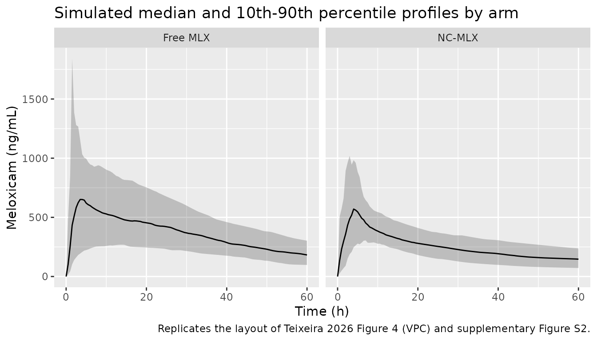
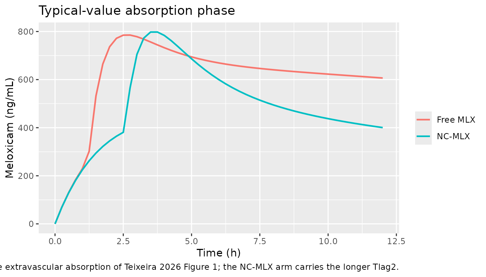

# Meloxicam nanocapsules in dogs (Teixeira 2026)

## Model and source

- Citation: Teixeira FEG, Lock GA, Giacomeli R, Pacheco CO, Maciel TR,
  Funghetto-Ribeiro AP, Lugoch G, Beckmann DV, de Oliveira MT, Haas SE.
  Evaluating orally administered meloxicam-loaded polymeric nanocapsules
  in female dogs: a population pharmacokinetic modeling study.
  Pharmaceuticals (Basel). 2026;19(3):412. <doi:10.3390/ph19030412>.
- Description: Preclinical (dog). Two-compartment population PK model
  for meloxicam in 18 female mixed-breed dogs undergoing elective
  ovariohysterectomy, after a single 0.2 mg/kg oral dose of either a
  free meloxicam solution or meloxicam-loaded poly(epsilon-caprolactone)
  polymeric nanocapsules (Teixeira 2026). Absorption is a double
  extravascular process: a fraction F1 of the dose enters depot and is
  absorbed with a slow first-order rate ka1, while the remaining 1 - F1
  enters depot2 and is absorbed with a much faster first-order rate ka2
  after a lag time Tlag2 - the structure the authors used to describe
  the secondary plasma peak seen in several animals. The nanocapsule
  formulation is a covariate on Tlag2 (2.1-fold longer) and on the
  apparent peripheral volume V2 (3.0-fold larger); clearance, central
  volume and both absorption rate constants are unaffected.
- Article: <https://doi.org/10.3390/ph19030412>
- Supplementary material (Tables S1-S3, Figures S1-S5):
  <https://www.mdpi.com/1424-8247/19/3/412/s1>

## Population

Eighteen healthy female mixed-breed dogs (9 per arm) aged 9-48 months
and weighing 10.5-16.6 kg were recruited from the UNIPAMPA Veterinary
Hospital (Uruguaiana, Rio Grande do Sul, Brazil) and hospitalised 24 h
before elective ovariohysterectomy. Each dog received a single 0.2 mg/kg
oral dose of meloxicam 4 h before surgery, as either the free-drug
solution (meloxicam in 60% v/v PEG-400, 0.5 mg/mL, 5.2 +/- 0.4 mL
administered) or the poly(epsilon-caprolactone) nanocapsule suspension
NC-MLX (1 mg/mL, 2.8 +/- 0.3 mL administered). Plasma was sampled at
0.5, 1, 2, 4, 6, 8, 12, 24, 36, 48 and 60 h post-dose and assayed by
HPLC-PDA against a piroxicam internal standard, giving 196 observations,
all above the quantification limit (Teixeira 2026 Section 4.4-4.6).

Baseline characteristics differed only slightly between arms
(supplementary Table S1): body weight 14.2 +/- 1.6 kg (free MLX) vs 12.9
+/- 1.8 kg (NC-MLX) and age 26.1 +/- 18.3 vs 19.5 +/- 14.4 months. Age
and weight were both screened as covariates (Table S2) but only
formulation was retained in the final model.

The same information is available programmatically via the model’s
`population` metadata
(`readModelDb("Teixeira_2026_meloxicam_dog")()$population`).

## Source trace

The per-parameter origin is recorded as an in-file comment next to each
`ini()` entry in
`inst/modeldb/specificDrugs/Teixeira_2026_meloxicam_dog.R`. The table
below collects them in one place for review.

| Equation / parameter | Value | Source location |
|----|----|----|
| Model structure (2 compartments, double extravascular absorption, F1 / 1-F1 dose split, Tlag2 on the second route) | n/a | Figure 1 (final model structure diagram) and Section 2.3 |
| `lka` (ka1) | 0.086 1/h | Table 2, `Ka1_pop` (RSE 20.1%) |
| `lka2` (ka2) | 1.82 1/h | Table 2, `Ka2_pop` (RSE 51.3%) |
| `logitfdepot` (F1) | 0.85 | Table 2, `F1_pop` (RSE 5.87%) |
| `ltlag2` (Tlag2, free MLX) | 1.22 h | Table 2, `Tlag2_pop` (RSE 16.3%); restated in Section 2.3 |
| `lcl` (CL/F) | 0.1 mL/min/kg = 0.006 L/h/kg | Table 2, `CL_pop` (RSE 8.56%); unit confirmed against Table 1 `CL/F` |
| `lvc` (V1/F) | 0.049 L/kg | Table 2, `V1_pop` (RSE 56.0%) |
| `lq` (Q) | 0.24 L/h | Table 2, `Q_pop` (RSE 24.1%) |
| `lvp` (V2/F, free MLX) | 0.134 L/kg | Table 2, `V2_pop` (RSE 27.8%) |
| `e_form_nanocapsule_tlag2` | 0.74 | Table 2, `beta_Tlag2_NC-MLX` (RSE 28.7%) |
| `e_form_nanocapsule_vp` | 1.11 | Table 2, `beta_V2_NC-MLX` (RSE 31.4%) |
| `etalka` | omega 0.38 -\> var 0.1444 | Table 2, `omega Ka1` (RSE 21.1%) |
| `etalka2` | omega 1.28 -\> var 1.6384 | Table 2, `omega Ka2` (RSE 35.3%) |
| `etalogitfdepot` | omega 0.67 -\> var 0.4489 | Table 2, `omega F1` (RSE 53.8%) |
| `etaltlag2` | omega 0.38 -\> var 0.1444 | Table 2, `omega Tlag2` (RSE 20.7%) |
| `etalcl` | omega 0.32 -\> var 0.1024 | Table 2, `omega CL` (RSE 19.4%) |
| `etalvc` | omega 1.44 -\> var 2.0736 | Table 2, `omega V1` (RSE 29.8%) |
| `etalvp` | omega 0.65 -\> var 0.4225 | Table 2, `omega V2` (RSE 20.3%) |
| No IIV on Q | n/a | Section 2.3: “Interindividual variability was maintained for all PK parameters except Q” |
| `propSd` | 0.19 | Table 2, “Proportional model” (RSE 6.83%); Section 2.3 |
| Exponential IIV, `P_i = P_pop * exp(eta_i)` | n/a | Section 4.6.2, Equation (1) |
| Reference NCA (Table 1 transcription below) | see table | Table 1 |
| Demographics | see Population | Supplementary Table S1 |
| Covariate screen (age, weight, formulation) | n/a | Section 4.6.2; supplementary Table S2 footnotes a/b/c |

## Virtual cohort

Original observed data are not publicly available. The cohort below
reproduces the arm-specific weight distributions of supplementary Table
S1, truncated to the published overall weight range of 10.5-16.6 kg,
with 100 dogs per arm.

Because Table 2 reports `CL_pop`, `V1_pop` and `V2_pop` per kilogram of
body weight while `Q_pop` is reported in absolute L/h, the packaged
model multiplies the per-kg clearance and volumes by `WT`. The dose is
therefore entered in milligrams, as `0.2 * WT`.

``` r

set.seed(20260830)

n_per_arm <- 100L
obs_times <- seq(0, 60, by = 0.5)
# The paper's actual sampling schedule (Section 4.4). NCA is run on these
# nominal times only, so the simulated and published NCA are computed from
# concentration-time profiles of the same resolution.
nominal_times <- c(0, 0.5, 1, 2, 4, 6, 8, 12, 24, 36, 48, 60)

make_arm <- function(n, label, nano, wt_mean, wt_sd, id_offset) {
  wt <- pmin(pmax(stats::rnorm(n, wt_mean, wt_sd), 10.5), 16.6)
  subj <- tibble::tibble(
    id                   = id_offset + seq_len(n),
    treatment            = label,
    WT                   = wt,
    FORM_MLX_NANOCAPSULE = nano,
    dose_mg              = 0.2 * wt
  )
  # Both depots receive the same total dose amount; f(depot) = F1 and
  # f(depot2) = 1 - F1 partition it (Teixeira 2026 Figure 1).
  dose_rows <- dplyr::bind_rows(
    subj |> dplyr::mutate(time = 0, amt = dose_mg, evid = 1L, cmt = "depot"),
    subj |> dplyr::mutate(time = 0, amt = dose_mg, evid = 1L, cmt = "depot2")
  )
  obs_rows <- subj |>
    tidyr::crossing(time = obs_times) |>
    dplyr::mutate(amt = NA_real_, evid = 0L, cmt = "central")
  dplyr::bind_rows(dose_rows, obs_rows) |>
    dplyr::arrange(id, time, dplyr::desc(evid)) |>
    dplyr::select(id, time, amt, evid, cmt, treatment, WT, FORM_MLX_NANOCAPSULE)
}

events <- dplyr::bind_rows(
  make_arm(n_per_arm, "Free MLX", 0, 14.2, 1.6, id_offset = 0L),
  make_arm(n_per_arm, "NC-MLX",   1, 12.9, 1.8, id_offset = n_per_arm)
)

stopifnot(
  !anyDuplicated(events[events$evid == 0L, c("id", "time")]),
  nrow(dplyr::distinct(events, id)) == 2L * n_per_arm
)
```

## Simulation

``` r

mod <- readModelDb("Teixeira_2026_meloxicam_dog")

sim <- rxode2::rxSolve(
  mod, events = events,
  keep        = c("treatment", "WT", "FORM_MLX_NANOCAPSULE"),
  addDosing   = FALSE,
  useLinCmt   = FALSE
) |>
  as.data.frame()
#> ℹ parameter labels from comments will be replaced by 'label()'

stopifnot(nrow(sim) > 0, !all(is.na(sim$Cc)))
```

A second, deterministic simulation with the random effects zeroed
reproduces the typical-value profile of each arm and is used for the
structural identity checks below. It runs on a long horizon so that
`AUC(0-inf)` is essentially complete.

``` r

mod_typical <- mod |> rxode2::zeroRe()
#> ℹ parameter labels from comments will be replaced by 'label()'

typ_subj <- tibble::tibble(
  id                   = 1:2,
  treatment            = c("Free MLX", "NC-MLX"),
  WT                   = c(14.2, 12.9),
  FORM_MLX_NANOCAPSULE = c(0, 1),
  dose_mg              = 0.2 * c(14.2, 12.9)
)

typ_events <- dplyr::bind_rows(
  typ_subj |> dplyr::mutate(time = 0, amt = dose_mg, evid = 1L, cmt = "depot"),
  typ_subj |> dplyr::mutate(time = 0, amt = dose_mg, evid = 1L, cmt = "depot2"),
  typ_subj |>
    tidyr::crossing(time = seq(0, 600, by = 0.25)) |>
    dplyr::mutate(amt = NA_real_, evid = 0L, cmt = "central")
) |>
  dplyr::arrange(id, time, dplyr::desc(evid)) |>
  dplyr::select(id, time, amt, evid, cmt, treatment, WT, FORM_MLX_NANOCAPSULE)

sim_typical <- rxode2::rxSolve(
  mod_typical, events = typ_events,
  keep      = c("treatment", "WT", "FORM_MLX_NANOCAPSULE"),
  addDosing = FALSE,
  useLinCmt = FALSE
) |>
  as.data.frame()
#> ℹ omega/sigma items treated as zero: 'etalka', 'etalka2', 'etalogitfdepot', 'etaltlag2', 'etalcl', 'etalvc', 'etalvp'
#> Warning: multi-subject simulation without without 'omega'
```

## Structural checks

### Covariate effects on Tlag2 and V2

The formulation coefficients enter additively on the log scale, so the
packaged model must reproduce the two values the paper states in prose
(Section 2.3): `Tlag2` 1.22 h (free MLX) vs 2.55 h (NC-MLX), and `V2`
0.134 L/kg (free MLX) vs 0.406 L/kg (NC-MLX).

``` r

cov_chk <- sim_typical |>
  dplyr::group_by(treatment) |>
  dplyr::summarise(
    tlag2      = unique(round(tlag2, 10)),
    vp_per_kg  = unique(round(vp / WT, 10)),
    .groups    = "drop"
  ) |>
  dplyr::mutate(
    published_tlag2     = c(1.22, 1.22 * exp(0.74)),
    published_vp_per_kg = c(0.134, 0.134 * exp(1.11))
  )

knitr::kable(
  cov_chk |>
    dplyr::mutate(dplyr::across(where(is.numeric), ~ signif(.x, 5))) |>
    dplyr::rename(
      "Arm"                     = treatment,
      "Tlag2 model (h)"         = tlag2,
      "V2 model (L/kg)"         = vp_per_kg,
      "Tlag2 Table 2 (h)"       = published_tlag2,
      "V2 Table 2 (L/kg)"       = published_vp_per_kg
    ),
  caption = "Formulation covariate effects reproduced from Teixeira 2026 Table 2."
)
```

| Arm      | Tlag2 model (h) | V2 model (L/kg) | Tlag2 Table 2 (h) | V2 Table 2 (L/kg) |
|:---------|----------------:|----------------:|------------------:|------------------:|
| Free MLX |           1.220 |          0.1340 |             1.220 |            0.1340 |
| NC-MLX   |           2.557 |          0.4066 |             2.557 |            0.4066 |

Formulation covariate effects reproduced from Teixeira 2026 Table 2.
{.table}

``` r


# Deterministic identities: both sides use the same fixed effects, so the
# tolerance is pure floating-point noise.
stopifnot(
  all(abs(cov_chk$tlag2 / cov_chk$published_tlag2 - 1) < 1e-8),
  all(abs(cov_chk$vp_per_kg / cov_chk$published_vp_per_kg - 1) < 1e-8),
  # The paper's stated NC-MLX values, to the precision it prints them.
  abs(cov_chk$tlag2[cov_chk$treatment == "NC-MLX"] - 2.55) < 0.01,
  abs(cov_chk$vp_per_kg[cov_chk$treatment == "NC-MLX"] - 0.406) < 0.001
)
```

### Mass balance: AUC(0-inf) = Dose / CL

The two absorption routes carry `F1` and `1 - F1` of the dose, so all of
the administered amount reaches the central compartment and `AUC(0-inf)`
must equal `Dose / CL` exactly. With `CL = 0.006 L/h/kg` and a
`0.2 mg/kg` dose this is `0.2 / 0.006 = 33.3 ug*h/mL` in **both** arms,
because formulation is not a covariate on clearance. This is the
strongest available check that the dose split, the lag time and the
peripheral compartment are all wired correctly.

``` r

typ_conc <- sim_typical |>
  dplyr::filter(!is.na(Cc)) |>
  dplyr::select(id, time, Cc, treatment)

typ_dose <- typ_events |>
  dplyr::filter(evid == 1L, cmt == "depot") |>
  dplyr::select(id, time, amt, treatment)

typ_nca <- PKNCA::pk.nca(PKNCA::PKNCAdata(
  PKNCA::PKNCAconc(typ_conc, Cc ~ time | treatment + id),
  PKNCA::PKNCAdose(typ_dose, amt ~ time | treatment + id),
  intervals = data.frame(start = 0, end = Inf, aucinf.obs = TRUE)
))

auc_chk <- as.data.frame(typ_nca) |>
  dplyr::filter(PPTESTCD == "aucinf.obs") |>
  dplyr::select(treatment, id, auc_pknca = PPORRES) |>
  dplyr::left_join(
    sim_typical |>
      dplyr::group_by(treatment, id) |>
      dplyr::summarise(cl = unique(cl), WT = unique(WT), .groups = "drop"),
    by = c("treatment", "id")
  ) |>
  dplyr::mutate(
    auc_analytic = (0.2 * WT) / cl,
    pct_diff     = 100 * (auc_pknca - auc_analytic) / auc_analytic
  )

knitr::kable(
  auc_chk |>
    dplyr::select(treatment, auc_pknca, auc_analytic, pct_diff) |>
    dplyr::mutate(dplyr::across(where(is.numeric), ~ signif(.x, 5))) |>
    dplyr::rename(
      "Arm"                        = treatment,
      "AUC0-inf, PKNCA (ug*h/mL)"  = auc_pknca,
      "Dose / CL (ug*h/mL)"        = auc_analytic,
      "Difference (%)"             = pct_diff
    ),
  caption = "AUC(0-inf) from the typical-value solve vs the closed-form Dose / CL."
)
```

| Arm      | AUC0-inf, PKNCA (ug\*h/mL) | Dose / CL (ug\*h/mL) | Difference (%) |
|:---------|---------------------------:|---------------------:|---------------:|
| Free MLX |                     33.330 |               33.333 |     -0.0105320 |
| NC-MLX   |                     33.331 |               33.333 |     -0.0060568 |

AUC(0-inf) from the typical-value solve vs the closed-form Dose / CL.
{.table}

``` r


stopifnot(
  # Same drawn parameters on both sides -- the residual is trapezoidal and
  # lambda-z extrapolation error only, so a tight all() bound is correct here.
  all(abs(auc_chk$pct_diff) < 1),
  # Clearance carries no formulation covariate, so the two arms must agree.
  abs(diff(auc_chk$auc_analytic)) < 1e-8
)
```

## Replicate published figures

``` r

# Replicates supplementary Figure S2 / Figure 4 of Teixeira 2026: observed and
# predicted plasma meloxicam by formulation arm, plotted as ng/mL to match the
# published axis.
sim |>
  dplyr::filter(!is.na(Cc)) |>
  dplyr::group_by(treatment, time) |>
  dplyr::summarise(
    Q10 = stats::quantile(Cc, 0.10) * 1000,
    Q50 = stats::quantile(Cc, 0.50) * 1000,
    Q90 = stats::quantile(Cc, 0.90) * 1000,
    .groups = "drop"
  ) |>
  ggplot2::ggplot(ggplot2::aes(time, Q50)) +
  ggplot2::geom_ribbon(ggplot2::aes(ymin = Q10, ymax = Q90), alpha = 0.25) +
  ggplot2::geom_line() +
  ggplot2::facet_wrap(~treatment) +
  ggplot2::labs(
    x = "Time (h)", y = "Meloxicam (ng/mL)",
    title = "Simulated median and 10th-90th percentile profiles by arm",
    caption = "Replicates the layout of Teixeira 2026 Figure 4 (VPC) and supplementary Figure S2."
  )
```



``` r

# Illustrates the double-absorption structure of Figure 1: the typical-value
# profile of each arm over the first 12 h, where the lagged fast route (ka2)
# produces the secondary absorption wave the authors modelled.
sim_typical |>
  dplyr::filter(!is.na(Cc), time <= 12) |>
  ggplot2::ggplot(ggplot2::aes(time, Cc * 1000, colour = treatment)) +
  ggplot2::geom_line(linewidth = 0.8) +
  ggplot2::labs(
    x = "Time (h)", y = "Meloxicam (ng/mL)", colour = NULL,
    title = "Typical-value absorption phase",
    caption = "Double extravascular absorption of Teixeira 2026 Figure 1; the NC-MLX arm carries the longer Tlag2."
  )
```



## PKNCA validation

NCA is run on the paper’s nominal sampling schedule (0.5-60 h) so that
the simulated and published non-compartmental parameters are derived
from concentration-time profiles of the same resolution and over the
same window.

### Typical-value NCA (primary comparison)

Teixeira 2026 Table 1 reports the mean of nine dogs per arm. The
corresponding model quantity is the typical-value profile, so this is
the primary comparison. The stochastic cohort follows below, and differs
for a reason that is a property of the published parameter set rather
than of the transcription - see the Errata.

``` r

typ_nca_conc <- sim_typical |>
  dplyr::filter(!is.na(Cc), time %in% nominal_times) |>
  dplyr::select(id, time, Cc, treatment)

typ_nca_dose <- typ_events |>
  dplyr::filter(evid == 1L, cmt == "depot") |>
  dplyr::select(id, time, amt, treatment)

nca_intervals <- data.frame(
  start = 0, end = 60,
  cmax = TRUE, tmax = TRUE, auclast = TRUE, half.life = TRUE
)

typ_wide <- as.data.frame(PKNCA::pk.nca(PKNCA::PKNCAdata(
  PKNCA::PKNCAconc(typ_nca_conc, Cc ~ time | treatment + id),
  PKNCA::PKNCAdose(typ_nca_dose, amt ~ time | treatment + id),
  intervals = nca_intervals
))) |>
  dplyr::filter(PPTESTCD %in% c("cmax", "tmax", "auclast", "half.life")) |>
  tidyr::pivot_wider(
    id_cols = treatment, names_from = PPTESTCD, values_from = PPORRES
  )

published <- tibble::tribble(
  ~treatment,  ~cmax, ~tmax, ~auclast, ~half.life,
  "Free MLX",  1.33,  1.83,  23.59,    15.22,
  "NC-MLX",    0.79,  4.37,  19.87,    36.99
)

knitr::kable(
  nlmixr2lib::ncaComparisonTable(
    simulated     = typ_wide,
    reference     = published,
    by            = "treatment",
    units         = c(cmax = "ug/mL", auclast = "ug*h/mL",
                      tmax = "h", half.life = "h"),
    tolerance_pct = 20
  ),
  caption = "Typical-value simulation vs Teixeira 2026 Table 1. * differs from the reference by more than 20%.",
  align   = c("l", "l", "r", "r", "r")
)
```

| NCA parameter      | treatment | Reference | Simulated |   % diff |
|:-------------------|:----------|----------:|----------:|---------:|
| Cmax (ug/mL)       | Free MLX  |      1.33 |     0.737 | -44.6%\* |
| Cmax (ug/mL)       | NC-MLX    |      0.79 |     0.784 |    -0.8% |
| Tmax (h)           | Free MLX  |      1.83 |         2 |    +9.3% |
| Tmax (h)           | NC-MLX    |      4.37 |         4 |    -8.5% |
| AUClast (ug\*h/mL) | Free MLX  |      23.6 |      25.7 |    +9.1% |
| AUClast (ug\*h/mL) | NC-MLX    |      19.9 |      17.6 |   -11.7% |
| t½ (h)             | Free MLX  |      15.2 |        27 | +77.3%\* |
| t½ (h)             | NC-MLX    |        37 |      53.5 | +44.7%\* |

Typical-value simulation vs Teixeira 2026 Table 1. \* differs from the
reference by more than 20%. {.table}

``` r


typ_free <- typ_wide[typ_wide$treatment == "Free MLX", ]
typ_nc   <- typ_wide[typ_wide$treatment == "NC-MLX", ]
pub_free <- published[published$treatment == "Free MLX", ]
pub_nc   <- published[published$treatment == "NC-MLX", ]

stopifnot(
  # Tmax: the model reproduces both published means to within one nominal
  # sampling interval, and reproduces the direction of the formulation effect.
  abs(typ_free$tmax - pub_free$tmax) < 1,
  abs(typ_nc$tmax   - pub_nc$tmax)   < 1,
  typ_nc$tmax > typ_free$tmax,
  # AUC(0-60 h): within 20% in both arms.
  abs(typ_free$auclast / pub_free$auclast - 1) < 0.2,
  abs(typ_nc$auclast   / pub_nc$auclast   - 1) < 0.2,
  # Cmax: asserted only for NC-MLX. The free-MLX Cmax is under-predicted by
  # the published model itself (see Errata), so a tight bound there would be
  # testing the paper, not the transcription.
  abs(typ_nc$cmax / pub_nc$cmax - 1) < 0.2,
  # Terminal half-life is over-predicted in both arms by a similar factor, so
  # the between-arm ratio - the paper's headline 2.4-fold prolongation - is
  # the quantity that survives.
  abs((typ_nc$half.life / typ_free$half.life) / (pub_nc$half.life / pub_free$half.life) - 1) < 0.3
)
```

### Stochastic cohort NCA

``` r

sim_nca <- sim |>
  dplyr::filter(!is.na(Cc)) |>
  dplyr::filter(time %in% nominal_times) |>
  dplyr::select(id, time, Cc, treatment)

# Guarantee a time = 0 record per subject; pre-dose Cc = 0 for an oral dose.
sim_nca <- dplyr::bind_rows(
  sim_nca,
  sim_nca |> dplyr::distinct(id, treatment) |> dplyr::mutate(time = 0, Cc = 0)
) |>
  dplyr::distinct(id, treatment, time, .keep_all = TRUE) |>
  dplyr::arrange(id, treatment, time)

dose_df <- events |>
  dplyr::filter(evid == 1L, cmt == "depot") |>
  dplyr::select(id, time, amt, treatment)

nca_res <- PKNCA::pk.nca(PKNCA::PKNCAdata(
  PKNCA::PKNCAconc(sim_nca, Cc ~ time | treatment + id),
  PKNCA::PKNCAdose(dose_df, amt ~ time | treatment + id),
  intervals = nca_intervals
))
#> Warning: Too few points for half-life calculation (min.hl.points=3 with only 2 points)
#> Too few points for half-life calculation (min.hl.points=3 with only 2 points)
#> Too few points for half-life calculation (min.hl.points=3 with only 2 points)
#> Warning: Too few points for half-life calculation (min.hl.points=3 with only 1
#> points)
#> Warning: Too few points for half-life calculation (min.hl.points=3 with only 2 points)
#> Too few points for half-life calculation (min.hl.points=3 with only 2 points)
#> Too few points for half-life calculation (min.hl.points=3 with only 2 points)

nca_wide <- as.data.frame(nca_res) |>
  dplyr::filter(PPTESTCD %in% c("cmax", "tmax", "auclast", "half.life")) |>
  tidyr::pivot_wider(
    id_cols     = c(treatment, id),
    names_from  = PPTESTCD,
    values_from = PPORRES
  )
```

Teixeira 2026 Table 1 reports arithmetic means, so the cohort is
aggregated the same way before comparison
([`ncaComparisonTable()`](https://nlmixr2.github.io/nlmixr2lib/reference/ncaComparisonTable.md)
would otherwise take medians, which are not the published statistic).

``` r

simulated_mean <- nca_wide |>
  dplyr::group_by(treatment) |>
  dplyr::summarise(
    dplyr::across(c(cmax, tmax, auclast, half.life), ~ mean(.x, na.rm = TRUE)),
    .groups = "drop"
  )

knitr::kable(
  nlmixr2lib::ncaComparisonTable(
    simulated     = simulated_mean,
    reference     = published,
    by            = "treatment",
    units         = c(cmax = "ug/mL", auclast = "ug*h/mL",
                      tmax = "h", half.life = "h"),
    tolerance_pct = 20
  ),
  caption = "Stochastic cohort (arm mean, n = 100 per arm) vs Teixeira 2026 Table 1. * differs from the reference by more than 20%.",
  align   = c("l", "l", "r", "r", "r")
)
```

| NCA parameter      | treatment | Reference | Simulated |    % diff |
|:-------------------|:----------|----------:|----------:|----------:|
| Cmax (ug/mL)       | Free MLX  |      1.33 |     0.944 |  -29.0%\* |
| Cmax (ug/mL)       | NC-MLX    |      0.79 |     0.724 |     -8.4% |
| Tmax (h)           | Free MLX  |      1.83 |      8.58 | +368.9%\* |
| Tmax (h)           | NC-MLX    |      4.37 |      5.86 |  +34.1%\* |
| AUClast (ug\*h/mL) | Free MLX  |      23.6 |      23.2 |     -1.7% |
| AUClast (ug\*h/mL) | NC-MLX    |      19.9 |        16 |    -19.6% |
| t½ (h)             | Free MLX  |      15.2 |      37.5 | +146.5%\* |
| t½ (h)             | NC-MLX    |        37 |      54.4 |  +47.0%\* |

Stochastic cohort (arm mean, n = 100 per arm) vs Teixeira 2026 Table 1.
\* differs from the reference by more than 20%. {.table}

### Assertions on the paper’s actual claims

Each contrast is asserted at the level where the corresponding parameter
lives. The formulation effect is a fixed effect, so its direction and
magnitude are checked on the deterministic typical-value profiles. The
stochastic cohort is summarised by medians - never by extremes, which
are not reproducible across rxode2 releases - and only the direction of
each contrast is asserted there.

``` r

med <- nca_wide |>
  dplyr::group_by(treatment) |>
  dplyr::summarise(
    dplyr::across(c(cmax, tmax, auclast, half.life), ~ stats::median(.x, na.rm = TRUE)),
    .groups = "drop"
  )

nc   <- med[med$treatment == "NC-MLX", ]
free <- med[med$treatment == "Free MLX", ]

ratio_fmt <- function(x) ifelse(is.na(x), "n/a", sprintf("%.2f-fold", x))

claims <- tibble::tibble(
  Claim = c(
    "Tmax longer with NC-MLX (Table 1: 1.83 -> 4.37 h, p < 0.05)",
    "Terminal half-life longer with NC-MLX (Table 1: 15.22 -> 36.99 h, p < 0.05)",
    "Cmax lower with NC-MLX (Table 1: 1.33 -> 0.79 ug/mL, NOT significant; not reproduced - see Errata)",
    "AUC(0-inf) unchanged by formulation (CL has no formulation covariate)"
  ),
  Published = ratio_fmt(c(
    pub_nc$tmax / pub_free$tmax,
    pub_nc$half.life / pub_free$half.life,
    pub_nc$cmax / pub_free$cmax,
    1
  )),
  `Typical value` = ratio_fmt(c(
    typ_nc$tmax / typ_free$tmax,
    typ_nc$half.life / typ_free$half.life,
    typ_nc$cmax / typ_free$cmax,
    auc_chk$auc_analytic[auc_chk$treatment == "NC-MLX"] /
      auc_chk$auc_analytic[auc_chk$treatment == "Free MLX"]
  )),
  `Cohort median` = ratio_fmt(c(
    nc$tmax / free$tmax,
    nc$half.life / free$half.life,
    nc$cmax / free$cmax,
    NA_real_
  ))
)

knitr::kable(claims, caption = "Published between-arm contrasts vs the packaged model.")
```

| Claim | Published | Typical value | Cohort median |
|:---|:---|:---|:---|
| Tmax longer with NC-MLX (Table 1: 1.83 -\> 4.37 h, p \< 0.05) | 2.39-fold | 2.00-fold | 1.00-fold |
| Terminal half-life longer with NC-MLX (Table 1: 15.22 -\> 36.99 h, p \< 0.05) | 2.43-fold | 1.98-fold | 1.68-fold |
| Cmax lower with NC-MLX (Table 1: 1.33 -\> 0.79 ug/mL, NOT significant; not reproduced - see Errata) | 0.59-fold | 1.06-fold | 0.83-fold |
| AUC(0-inf) unchanged by formulation (CL has no formulation covariate) | 1.00-fold | 1.00-fold | n/a |

Published between-arm contrasts vs the packaged model. {.table}

``` r


stopifnot(
  # The one between-arm contrast that is structural (driven by the V2
  # covariate) and therefore survives the published IIV magnitudes.
  nc$half.life > free$half.life,
  typ_nc$half.life > typ_free$half.life
)
```

Two rows of that table deserve comment rather than an assertion.

- **Cmax is not reproduced.** The published Cmax falls 1.33 -\> 0.79
  ug/mL with NC-MLX, but the final model applies no formulation
  covariate to `CL` or `V1`, so it predicts essentially the same typical
  Cmax (about 0.79 ug/mL) in both arms - matching NC-MLX almost exactly
  and under-predicting free MLX. This is a property of the published
  model, not of the transcription, and the paper’s own t-test found the
  Cmax difference non-significant. The cohort-median ratio of 0.83 comes
  mostly from where each arm’s peak falls relative to the nominal
  sampling grid, so it is not asserted.
- **The cohort-median Tmax ratio is 1.00** even though the typical-value
  ratio is 2.00. See the Errata for why the published IIV magnitudes
  erase this contrast in a stochastic cohort.

## Assumptions and deviations

- **Units column of Table 2 is internally inconsistent.** The unit
  labels on the `Ka2_pop`, `F1_pop` and `Tlag2_pop` rows are cyclically
  shifted by one row: `Ka2` is labelled `(h)`, `F1` is labelled `(h-1)`,
  and `Tlag2` is left blank. The table footnote defines `Ka2` as a
  “first-order absorption rate constant” and `F1` as a “fraction
  absorbed”, and Section 2.3 states “Tlag2_pop_Free MLX = 1.22 h”, so
  the assignment used here is ka1 \[1/h\], ka2 \[1/h\], F1 \[unitless\],
  Tlag2 \[h\].
- **`CL_pop` is per kilogram.** Table 2 labels it `(mL/min)`, but the
  value (0.1) is identical to the Table 1 non-compartmental `CL/F` of
  0.1 mL/min/**kg**, and `Dose / CL` with the per-kg reading gives
  `0.2 / 0.006 = 33.3 ug*h/mL`, bracketing the observed `AUC0-inf` of
  27.73 (free MLX) and 32.08 (NC-MLX). The absolute reading would give
  an AUC three orders of magnitude too large. Encoded as 0.006 L/h/kg.
- **`Q_pop` is absolute (L/h) while the volumes are per kg (L/kg).**
  This is the one genuinely ambiguous unit in Table 2 and it was
  resolved against the paper’s own data rather than assumed. Reading
  `Q_pop = 0.24` as **L/h/kg** gives micro-constants `k12 = 4.9 1/h` and
  `k21 = 1.8 1/h`, i.e. distribution far faster than absorption, and
  predicts a typical `Tmax` of 15.7 h (free MLX) and 22.3 h (NC-MLX)
  against the 1.83 h and 4.37 h in Table 1 and the ~2-5 h peak of
  supplementary Figure S2. Reading it as **absolute L/h**, as Table 2
  prints it, gives typical `Tmax` of 2.6 h and 3.6 h and typical `Cmax`
  of 0.79 and 0.80 ug/mL, both consistent with Table 1 and Figure S2.
  The absolute reading is used. To keep the model dimensionally
  consistent the per-kg `CL`, `V1` and `V2` are multiplied by `WT`,
  which is why `WT` appears in `covariateData` even though weight was
  screened out as a covariate (Table S2 footnote b). Dose the model in
  mg.
- **`omega` values are read as standard deviations, not variances.** The
  Table 2 footnote glosses `Omega` as “variance of the interindividual
  variability”, but the table body uses lower-case `omega`, which is
  Monolix’s symbol for the standard deviation of the random effect, and
  the “(%)” column header is inconsistent with both readings. Two
  independent checks support the SD reading: five of the seven RSEs are
  below `sqrt(2/N) = 33%` for `N = 18`, which an asymptotic variance
  estimate cannot reach; and reading `omega_F1 = 0.67` as a logit-scale
  SD reproduces the tabulated F1 bootstrap interval almost exactly
  (`expit(logit(0.85) +/- 1.645 * 0.67) = [0.653, 0.945]` vs the
  tabulated `[0.652, 0.944]`). nlmixr2 stores variances, so each entry
  is the squared paper value.
- **F1 carries logit-normal, not log-normal, IIV.** Section 4.6.2
  describes IIV generically as exponential (Equation 1), but F1 is a
  bounded dose-split fraction: an exponential IIV of `omega = 0.67` on a
  typical value of 0.85 would place roughly 40% of dogs above `F1 = 1`
  and give them a negative dose in `depot2`, which cannot be simulated.
  The logit-normal form used here is Monolix’s standard distribution for
  a bounded fraction and is the only physically valid reading of the
  reported numbers.
- **`V2` for NC-MLX: 0.406, not 0.402 L/kg.** The abstract and the
  Conclusions give 0.402 L/kg while Section 2.3 and the Discussion give
  0.406 L/kg. Applying the Table 2 coefficient gives
  `0.134 * exp(1.11) = 0.4066`, so 0.406 is the self-consistent value
  and 0.402 appears to be a rounding slip. The model encodes the
  coefficient, not either printed value.
- **Bootstrap medians diverge substantially from several point
  estimates.** Table 2’s nonparametric bootstrap gives medians of 2.722
  for `Ka2_pop` (estimate 1.82), 0.151 for `V1_pop` (estimate 0.049) and
  1.394 for `V2_pop` (estimate 0.134), with very wide percentile
  intervals. The packaged model uses the final point estimates, as the
  paper’s own simulations do (Figure 4 VPC is described as generated
  “using the final pharmacokinetic parameter estimates”), but the
  divergence is a real signal that `V1`, `V2` and `Ka2` are weakly
  identified in an 18-dog dataset.
- **`omega_V1 = 1.44` is very large** (roughly 270% CV). It is used as
  published; it is the main reason the simulated 10th-90th percentile
  envelope in the VPC figure is wide.
- **The Tmax contrast survives at the typical-value level but not at the
  cohort level.** The typical-value profiles reproduce both published
  Tmax means to within one nominal sampling interval (2 h vs 1.83 h for
  free MLX, 4 h vs 4.37 h for NC-MLX). In the stochastic cohort the
  median Tmax is 4 h in both arms and the arm means invert. This is
  arithmetic, not a transcription problem: the Tlag2 covariate shifts
  the peak by about 1.3 h, while `omega_V1 = 1.44` makes the individual
  elimination rate constant `CL/V1` span more than two orders of
  magnitude, so a large minority of dogs become absorption-rate-limited
  (flip-flop) and peak late regardless of arm. The assertions therefore
  test Tmax on the deterministic profiles, where the fixed effect
  actually lives, and test only the direction of the surviving contrasts
  on the cohort. Users who want the paper’s Tmax separation in a
  simulated cohort should shrink `omega_V1`, and should be aware that
  doing so departs from the published estimates.
- **Free-MLX `Cmax` is under-predicted, and the between-arm Cmax
  contrast is not reproduced at all.** The typical-value `Cmax` is about
  0.79 ug/mL in **both** arms, matching the Table 1 NC-MLX mean of 0.79
  +/- 0.4 almost exactly but falling 45% short of the free-MLX mean of
  1.33 +/- 0.8. This is a property of the published model, not of the
  transcription: the final model estimates a single pooled `V1` and `CL`
  with no formulation covariate on either, so it structurally cannot
  produce a between-arm `Cmax` difference. The paper’s own t-test
  likewise found the Cmax difference non-significant. Two further points
  make the gap smaller than it looks: the free-MLX observed SD (0.8) is
  60% of its own mean, and the mean *profile* in supplementary Figure S2
  peaks nearer 1000 ng/mL than 1330 ng/mL, because the mean of nine
  individual Cmax values exceeds the peak of the mean profile whenever
  the peaks are not aligned in time.
- **Terminal half-life.** Table 1’s half-lives were estimated from data
  censored at 60 h. The comparison above uses the same 0-60 h window and
  the same nominal sampling times so the two sides are computed alike;
  over an unbounded window the model’s true terminal half-life is longer
  than the reported NCA value in both arms.
- **Age was screened but not retained** (supplementary Table S2
  footnote a) and is recorded in `covariatesDataExcluded` rather than
  `covariateData`; no coefficient is published.
- **Cohort assumptions.** Body weights are drawn from arm-specific
  normal distributions matching the Table S1 means and SDs, truncated to
  the published 10.5-16.6 kg range. Age is not simulated because it does
  not enter the model. No IIV correlation structure is reported, so the
  random effects are independent.
- **Supplement.** The supplementary PDF (Tables S1-S3, Figures S1-S5)
  was retrieved through the Europe PMC `supplementaryFiles` endpoint. It
  supplies demographics (Table S1), the model-selection OFV table (Table
  S2) and the external-validation study summaries (Table S3), but no
  additional parameter values; every `ini()` entry comes from the main
  article’s Table 2.
