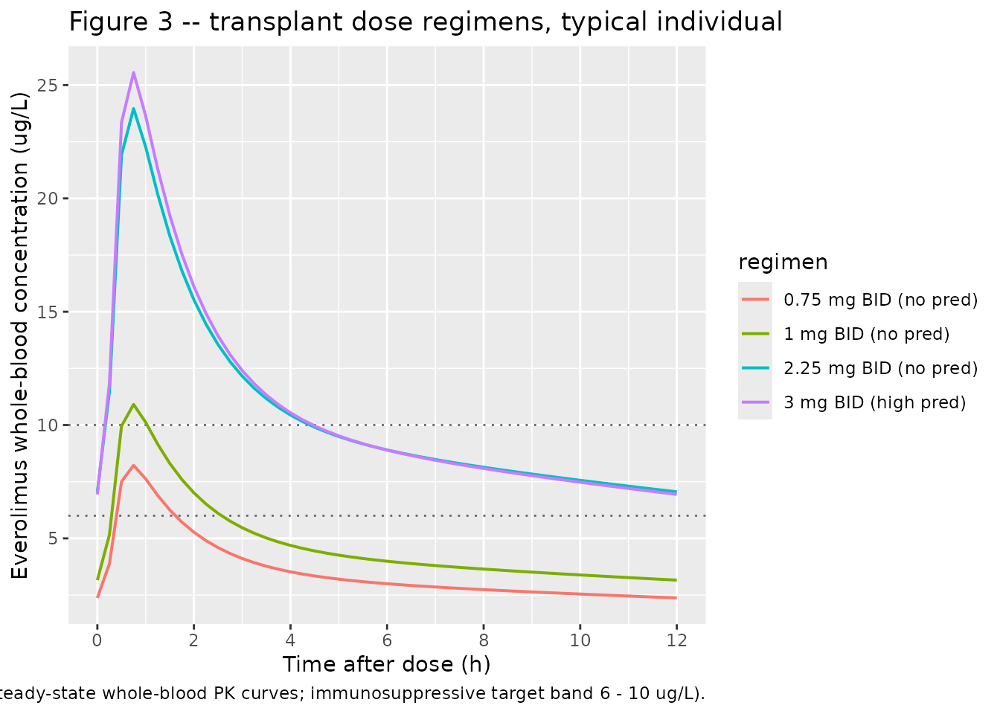
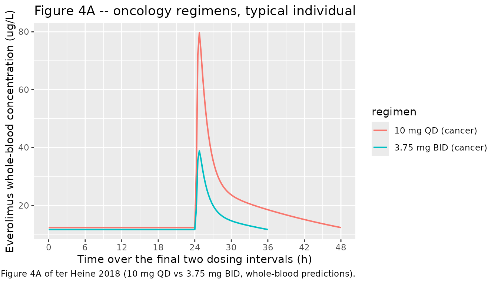

# Everolimus (ter Heine 2018)

## Model and source

- Citation: ter Heine R et al. A pharmacological rationale for improved
  everolimus dosing in oncology and transplant patients. Br J Clin
  Pharmacol 84(9):1575-1586, 2018. <doi:10.1111/bcp.13591>.
- Indication: pooled adult oncology (metastatic thyroid or breast
  cancer) + renal transplantation (calcineurin-free immunosuppressive
  regimens).
- Article: <https://doi.org/10.1111/bcp.13591> (open access)

## Population

ter Heine et al. pooled 126 adults across five clinical studies: 71
oncology patients on everolimus (Afinitor) 10 mg once daily for
metastatic thyroid or breast cancer (clinicaltrials.gov NCT01118065 and
NCT01948960) and 55 renal transplant recipients on everolimus (Certican)
0.75 - 3 mg twice daily for prophylaxis of allograft rejection (Dutch
Trial Register NTR567 and NTR1615; clinicaltrials.gov NCT02387151). The
combined cohort is 54% female with age 19 - 80 years, body weight 45 -
110.3 kg, and hematocrit 0.28 - 0.50 (Table 1). Twenty-two of the
transplant subjects received tacrolimus after alemtuzumab induction; the
rest were on everolimus + prednisolone combinations. Rich PK sampling
produced 1239 plasma concentrations – 893 in the oncology cohort (mean
12.6 samples per patient) and 347 in the transplant cohort (mean 6.3
samples per patient).

Everolimus is highly bound to erythrocytes. The authors derived plasma
concentrations from observed whole-blood concentrations and hematocrit
before fitting the population PK model using a Langmuir-plus-linear
erythrocyte binding model (Bmax = 0.964 mg/L, Kd = 0.0920 mg/L, Kns =
0.153) fitted externally to the manufacturer’s in vitro \[3H\]everolimus
blood distribution data (Methods ‘Structural model development’,
Equation 1). All reported parameter estimates are plasma PK parameters.
This vignette uses the same back-calculation in reverse to compare
simulated plasma concentrations against the whole-blood trough targets
reported in Results paragraphs ‘Alternative dosing regimens’.

The same population metadata is available programmatically via
`readModelDb("TerHeine_2018_everolimus")$population`.

## Source trace

The per-parameter origin is recorded as an in-file comment next to each
`ini()` entry in
`inst/modeldb/specificDrugs/TerHeine_2018_everolimus.R`. The table below
collects the trace in one place for review.

| Equation / parameter | Value | Source location |
|----|----|----|
| `lmat` = log(0.404) | MAT = 0.404 h | Table 2 ‘Final model’ MAT row |
| `lcl_int` = log(340) | CLint = 340 L/h | Table 2 ‘Final model’ CLint row |
| `lvc` = log(175) | VC = 175 L at FFM 57.2 kg | Table 2 ‘Final model’ VC row |
| `lvp` = log(577) | VP = 577 L at FFM 57.2 kg | Table 2 ‘Final model’ VP row |
| `lq` = log(85.7) | Q = 85.7 L/h at FFM 57.2 kg | Table 2 ‘Final model’ Q row |
| `lqh` = fixed(log(90)) | QH = 90 L/h (FIXED) | Table 2 ‘Final model’ QH row; Methods ‘Structural model development’ |
| `lfu` = fixed(log(0.27)) | fu = 0.27 (FIXED) | Methods ‘Structural model development’ Equation 4 (paper reference 35) |
| `e_pred_dose_high_cl_int` = 0.31 | +31% on CLint for PRED_DOSE \>= 20 mg/day | Table 2 ‘Final model’ row ‘Increase in CLint due high dose prednisolone’ |
| `e_ffm_flow` = fixed(0.75) | Allometric exponent on Q, QH | Methods ‘Structural model development’; canonical Anderson and Holford 0.75 |
| `e_ffm_volume` = fixed(1.0) | Allometric exponent on VC, VP | Methods ‘Structural model development’; canonical Anderson and Holford 1.0 |
| `bmax` = fixed(964) | Bmax = 964 ug/L | Results ‘Base model development’ (paper text: 0.964 mg/L) |
| `kd` = fixed(92) | Kd = 92 ug/L | Results ‘Base model development’ (paper text: 0.0920 mg/L) |
| `kns` = fixed(0.153) | Kns = 0.153 (unitless) | Results ‘Base model development’ |
| `etalcl_int` ~ log(1 + 0.339^2) | IIV CLint = 33.9% CV | Table 2 ‘Final model’ IIV CLint row |
| `etalvc` ~ log(1 + 0.406^2) | IIV VC = 40.6% CV | Table 2 ‘Final model’ IIV VC row |
| `etalmat` ~ log(1 + 1.10^2) | Intra-individual MAT = 110% CV | Table 2 ‘Final model’ intra-individual MAT row |
| `propSd` = 0.179 | Proportional residual = 17.9% | Table 2 ‘Final model’ Residual variability row |
| Transit chain `ktr = 5 / MAT` | n = 4 transit compartments | Methods ‘Structural model development’ Equation 2; Savic 2007 convention |
| Well-stirred liver Equations 3 - 5 | QHP, EH, CLH, F = 1 - EH | Methods ‘Structural model development’ Equations 3 / 4 / 5 |

## Virtual cohort

Original observed concentrations are not publicly available. The
simulations below use a typical-individual reference subject (70 kg,
1.80 m adult male, FFM = 57.2 kg, HCT = 0.45, age 40) matching the
typical individual used by the authors in their dosing-regimen
simulations (Methods ‘Investigation of improved dosing regimens’, final
paragraph). Six dose regimens are simulated to reproduce the
steady-state predictions reported in Results ‘Alternative dosing
regimens’ for transplant (0.75, 1, 2.25, 3 mg twice daily, with and
without high-dose prednisolone) and oncology (10 mg once daily, 3.75 mg
twice daily). To exercise IIV, each regimen is simulated with a small (n
= 50) virtual cohort sharing the typical-individual covariates.

``` r

set.seed(20260524L)

n_per_arm <- 50L

# Regimen specification.
regimens <- tibble::tribble(
  ~regimen,                  ~dose_mg, ~interval_h, ~pred_dose, ~indication,
  "0.75 mg BID (no pred)",        0.75,         12,          0, "transplant",
  "1 mg BID (no pred)",           1.00,         12,          0, "transplant",
  "2.25 mg BID (no pred)",        2.25,         12,          0, "transplant",
  "3 mg BID (high pred)",         3.00,         12,         20, "transplant",
  "10 mg QD (cancer)",           10.00,         24,          0, "oncology",
  "3.75 mg BID (cancer)",         3.75,         12,          0, "oncology"
)

# Per-regimen typical individual + small IIV cohort.
make_cohort <- function(n, regimen_row, id_offset = 0L) {
  tibble::tibble(
    id        = id_offset + seq_len(n),
    FFM       = 57.2,                       # 70 kg, 1.80 m adult male
    HCT       = 0.45,                       # paper's typical-individual value
    PRED_DOSE = regimen_row$pred_dose,
    regimen   = regimen_row$regimen,
    dose_mg   = regimen_row$dose_mg,
    interval_h = regimen_row$interval_h,
    indication = regimen_row$indication
  )
}

cohort_df <- dplyr::bind_rows(lapply(seq_len(nrow(regimens)), function(i) {
  make_cohort(
    n           = n_per_arm,
    regimen_row = regimens[i, ],
    id_offset   = (i - 1L) * n_per_arm
  )
}))

# Simulate 14 days of dosing to reach steady state; observe the final
# dosing interval at high resolution.
total_days <- 14
build_events <- function(subj_row) {
  tau <- subj_row$interval_h
  dose_times <- seq(from = 0, by = tau, length.out = total_days * 24 / tau)
  last_dose <- max(dose_times)
  obs_times <- sort(unique(c(
    dose_times,
    last_dose + seq(0, tau, by = 0.25),
    last_dose + tau   # exact end-of-interval (trough or next dose)
  )))
  doses <- data.frame(
    id        = subj_row$id,
    time      = dose_times,
    amt       = subj_row$dose_mg,
    evid      = 1L,
    cmt       = "depot",
    Cc        = NA_real_,
    FFM       = subj_row$FFM,
    HCT       = subj_row$HCT,
    PRED_DOSE = subj_row$PRED_DOSE,
    regimen   = subj_row$regimen,
    indication = subj_row$indication,
    stringsAsFactors = FALSE
  )
  obs <- data.frame(
    id        = subj_row$id,
    time      = obs_times,
    amt       = 0,
    evid      = 0L,
    cmt       = "depot",
    Cc        = NA_real_,
    FFM       = subj_row$FFM,
    HCT       = subj_row$HCT,
    PRED_DOSE = subj_row$PRED_DOSE,
    regimen   = subj_row$regimen,
    indication = subj_row$indication,
    stringsAsFactors = FALSE
  )
  rbind(doses, obs)
}

events <- do.call(
  rbind,
  lapply(seq_len(nrow(cohort_df)), function(i) build_events(cohort_df[i, ]))
)
events <- events[order(events$id, events$time, -events$evid), ]
rownames(events) <- NULL
stopifnot(!anyDuplicated(unique(events[, c("id", "time", "evid")])))
```

## Simulation

``` r

mod <- readModelDb("TerHeine_2018_everolimus")

sim <- rxode2::rxSolve(
  mod,
  events = events,
  keep = c("regimen", "indication", "HCT", "PRED_DOSE")
) |>
  as.data.frame()
```

Whole-blood concentrations are derived from the simulated plasma
concentrations via the paper’s Langmuir-plus-linear binding model
(Methods ‘Structural model development’ Equation 1; Bmax = 964 ug/L, Kd
= 92 ug/L, Kns = 0.153 in plasma-concentration units).

``` r

binding_to_whole_blood <- function(cp, hct,
                                   bmax = 964, kd = 92, kns = 0.153) {
  crb <- bmax * cp / (kd + cp) + kns * cp
  hct * crb + (1 - hct) * cp
}

sim <- sim |>
  dplyr::mutate(
    Cc_wb = binding_to_whole_blood(Cc, HCT)
  )
```

Typical-value replication (between-subject variability zeroed) for
reproducing the paper’s typical-individual figures:

``` r

mod_typical <- mod |> rxode2::zeroRe()
sim_typical <- rxode2::rxSolve(
  mod_typical,
  events = events,
  keep = c("regimen", "indication", "HCT", "PRED_DOSE")
) |>
  as.data.frame() |>
  dplyr::mutate(
    Cc_wb = binding_to_whole_blood(Cc, HCT)
  )
#> ℹ omega/sigma items treated as zero: 'etalcl_int', 'etalvc', 'etalmat'
#> Warning: multi-subject simulation without without 'omega'
```

## Replicate published figures

### Figure 3 – transplant dose regimens (whole blood, typical individual)

ter Heine 2018 Figure 3 shows typical steady-state whole-blood
pharmacokinetic curves for everolimus dosed 0.75, 1, 2.25, and 3 mg
twice daily in the renal-transplant setting, with and without high-dose
prednisolone. The 6 - 10 ug/L immunosuppressive target is overlaid.

``` r

ss_window <- function(df) {
  last_dose_per_id <- df |>
    dplyr::group_by(id) |>
    dplyr::summarise(last_dose = max(time[evid == 1L]), .groups = "drop")
  df |>
    dplyr::left_join(last_dose_per_id, by = "id") |>
    dplyr::filter(time >= last_dose, time <= last_dose + 12) |>
    dplyr::mutate(time_post = time - last_dose)
}

events_with_evid <- events |>
  dplyr::select(id, time, evid)

sim_typical_ss <- sim_typical |>
  dplyr::left_join(events_with_evid, by = c("id", "time")) |>
  dplyr::mutate(evid = ifelse(is.na(evid), 0L, evid)) |>
  ss_window() |>
  dplyr::filter(indication == "transplant", !is.na(Cc_wb))

ggplot(sim_typical_ss, aes(time_post, Cc_wb, colour = regimen)) +
  geom_hline(yintercept = c(6, 10), linetype = "dotted", colour = "grey40") +
  geom_line(linewidth = 0.7) +
  scale_x_continuous(breaks = seq(0, 12, by = 2)) +
  labs(
    x = "Time after dose (h)",
    y = "Everolimus whole-blood concentration (ug/L)",
    title = "Figure 3 -- transplant dose regimens, typical individual",
    caption = paste0(
      "Replicates Figure 3 of ter Heine 2018 (typical steady-state whole-blood ",
      "PK curves; immunosuppressive target band 6 - 10 ug/L)."
    )
  )
```



### Figure 4 – oncology 10 mg QD vs 3.75 mg BID (typical individual)

ter Heine 2018 Figure 4 contrasts the approved 10 mg once-daily regimen
against the proposed 3.75 mg twice-daily regimen in oncology patients.
This panel reproduces the whole-blood PK over a 24-h interval.

``` r

sim_typical_oncology <- sim_typical |>
  dplyr::left_join(events_with_evid, by = c("id", "time")) |>
  dplyr::mutate(evid = ifelse(is.na(evid), 0L, evid)) |>
  dplyr::group_by(id) |>
  dplyr::mutate(last_dose = max(time[evid == 1L])) |>
  dplyr::ungroup() |>
  dplyr::filter(
    indication == "oncology",
    time >= last_dose - 24,
    time <= last_dose + 24,
    !is.na(Cc_wb)
  ) |>
  dplyr::mutate(time_post = time - (last_dose - 24))

ggplot(sim_typical_oncology, aes(time_post, Cc_wb, colour = regimen)) +
  geom_line(linewidth = 0.7) +
  scale_x_continuous(breaks = seq(0, 48, by = 6)) +
  labs(
    x = "Time over the final two dosing intervals (h)",
    y = "Everolimus whole-blood concentration (ug/L)",
    title = "Figure 4A -- oncology regimens, typical individual",
    caption = paste0(
      "Replicates Figure 4A of ter Heine 2018 (10 mg QD vs 3.75 mg BID, ",
      "whole-blood predictions)."
    )
  )
```



## PKNCA validation

Compute steady-state NCA over the final dosing interval for each
regimen. The PKNCA formula groups by regimen so summaries roll up per
dose regimen for comparison against the paper’s reported trough levels.

``` r

events_for_join <- events |>
  dplyr::select(id, time, evid)

sim_with_evid <- sim |>
  dplyr::left_join(events_for_join, by = c("id", "time")) |>
  dplyr::mutate(evid = ifelse(is.na(evid), 0L, evid))

last_dose_per_id <- sim_with_evid |>
  dplyr::filter(evid == 1L) |>
  dplyr::group_by(id) |>
  dplyr::summarise(last_dose = max(time), .groups = "drop")

sim_ss <- sim_with_evid |>
  dplyr::left_join(last_dose_per_id, by = "id") |>
  dplyr::left_join(
    cohort_df |> dplyr::select(id, interval_h),
    by = "id"
  ) |>
  dplyr::filter(
    time >= last_dose,
    time <= last_dose + interval_h,
    !is.na(Cc)
  ) |>
  dplyr::transmute(
    id, time, Cc, Cc_wb, regimen, last_dose, interval_h
  ) |>
  dplyr::distinct(id, time, .keep_all = TRUE)

conc_obj <- PKNCA::PKNCAconc(
  sim_ss,
  Cc ~ time | regimen + id,
  concu = "ug/L",
  timeu = "h"
)

dose_df <- events |>
  dplyr::filter(evid == 1L) |>
  dplyr::group_by(id) |>
  dplyr::slice_tail(n = 1) |>
  dplyr::ungroup() |>
  dplyr::select(id, time, amt, regimen) |>
  as.data.frame()

dose_obj <- PKNCA::PKNCAdose(
  dose_df,
  amt ~ time | regimen + id,
  doseu = "mg"
)

regimen_intervals <- regimens |>
  dplyr::mutate(start = 0, end = interval_h)

ss_intervals_per_id <- sim_ss |>
  dplyr::group_by(id, regimen) |>
  dplyr::summarise(
    start = unique(last_dose),
    end   = unique(last_dose + interval_h),
    .groups = "drop"
  ) |>
  dplyr::mutate(
    cmax     = TRUE,
    cmin     = TRUE,
    tmax     = TRUE,
    auclast  = TRUE,
    cav      = TRUE
  ) |>
  as.data.frame()

nca_res <- PKNCA::pk.nca(
  PKNCA::PKNCAdata(conc_obj, dose_obj, intervals = ss_intervals_per_id)
)

nca_summary <- nca_res$result |>
  dplyr::group_by(regimen, PPTESTCD) |>
  dplyr::summarise(
    median = median(PPORRES, na.rm = TRUE),
    q05    = quantile(PPORRES, 0.05, na.rm = TRUE),
    q95    = quantile(PPORRES, 0.95, na.rm = TRUE),
    .groups = "drop"
  )

knitr::kable(
  nca_summary,
  caption = paste0(
    "Steady-state plasma NCA per regimen (median with 90% range across the ",
    "50-subject simulated cohort). AUC (auclast) units: ug*h/L; Cmax / Cmin / ",
    "Cav units: ug/L; tmax units: h."
  ),
  digits = 3
)
```

| regimen               | PPTESTCD |  median |    q05 |     q95 |
|:----------------------|:---------|--------:|-------:|--------:|
| 0.75 mg BID (no pred) | auclast  |   7.812 |  4.545 |  13.621 |
| 0.75 mg BID (no pred) | cav      |   0.651 |  0.379 |   1.135 |
| 0.75 mg BID (no pred) | cmax     |   1.309 |  0.833 |   2.577 |
| 0.75 mg BID (no pred) | cmin     |   0.430 |  0.234 |   0.803 |
| 0.75 mg BID (no pred) | tmax     |   0.750 |  0.250 |   2.887 |
| 1 mg BID (no pred)    | auclast  |  12.096 |  6.866 |  21.890 |
| 1 mg BID (no pred)    | cav      |   1.008 |  0.572 |   1.824 |
| 1 mg BID (no pred)    | cmax     |   2.349 |  1.143 |   4.292 |
| 1 mg BID (no pred)    | cmin     |   0.661 |  0.360 |   1.292 |
| 1 mg BID (no pred)    | tmax     |   0.500 |  0.250 |   1.887 |
| 10 mg QD (cancer)     | auclast  | 117.326 | 67.829 | 234.408 |
| 10 mg QD (cancer)     | cav      |   4.889 |  2.826 |   9.767 |
| 10 mg QD (cancer)     | cmax     |  17.535 |  9.870 |  33.782 |
| 10 mg QD (cancer)     | cmin     |   2.543 |  1.338 |   6.075 |
| 10 mg QD (cancer)     | tmax     |   0.750 |  0.250 |   2.000 |
| 2.25 mg BID (no pred) | auclast  |  25.453 | 14.268 |  42.353 |
| 2.25 mg BID (no pred) | cav      |   2.121 |  1.189 |   3.529 |
| 2.25 mg BID (no pred) | cmax     |   4.789 |  2.726 |   9.194 |
| 2.25 mg BID (no pred) | cmin     |   1.411 |  0.696 |   2.670 |
| 2.25 mg BID (no pred) | tmax     |   0.750 |  0.250 |   2.637 |
| 3 mg BID (high pred)  | auclast  |  23.581 | 14.721 |  35.020 |
| 3 mg BID (high pred)  | cav      |   1.965 |  1.227 |   2.918 |
| 3 mg BID (high pred)  | cmax     |   4.466 |  2.604 |   7.397 |
| 3 mg BID (high pred)  | cmin     |   1.314 |  0.746 |   2.092 |
| 3 mg BID (high pred)  | tmax     |   0.750 |  0.363 |   1.887 |
| 3.75 mg BID (cancer)  | auclast  |  38.694 | 23.837 |  70.122 |
| 3.75 mg BID (cancer)  | cav      |   3.225 |  1.986 |   5.843 |
| 3.75 mg BID (cancer)  | cmax     |   7.027 |  4.307 |  12.439 |
| 3.75 mg BID (cancer)  | cmin     |   2.162 |  1.186 |   4.232 |
| 3.75 mg BID (cancer)  | tmax     |   0.750 |  0.250 |   2.887 |

Steady-state plasma NCA per regimen (median with 90% range across the
50-subject simulated cohort). AUC (auclast) units: ug\*h/L; Cmax / Cmin
/ Cav units: ug/L; tmax units: h. {.table}

### Comparison against published whole-blood trough targets

ter Heine 2018 reports the following whole-blood trough levels for the
typical individual at steady state (Results ‘Alternative dosing
regimens’):

| Regimen               | Reported Cwb,trough (ug/L) |
|-----------------------|----------------------------|
| 0.75 mg BID (no pred) | 2.37                       |
| 1 mg BID (no pred)    | 3.16                       |
| 2.25 mg BID (no pred) | 6.70                       |
| 3 mg BID (high pred)  | 7.01                       |
| 10 mg QD (cancer)     | 12.3 (Cmax 68.8)           |
| 3.75 mg BID (cancer)  | 11.7 (Cmax 34.2)           |

``` r

typical_trough <- sim_typical |>
  dplyr::left_join(events_with_evid, by = c("id", "time")) |>
  dplyr::mutate(evid = ifelse(is.na(evid), 0L, evid)) |>
  dplyr::group_by(id) |>
  dplyr::mutate(last_dose = max(time[evid == 1L])) |>
  dplyr::ungroup() |>
  dplyr::left_join(
    cohort_df |> dplyr::select(id, interval_h),
    by = "id"
  ) |>
  dplyr::group_by(id, regimen) |>
  dplyr::slice_min(
    abs(time - (last_dose + interval_h)),
    n = 1,
    with_ties = FALSE
  ) |>
  dplyr::ungroup() |>
  dplyr::group_by(regimen) |>
  dplyr::summarise(
    sim_Cwb_trough = median(Cc_wb, na.rm = TRUE),
    .groups = "drop"
  )

typical_peak <- sim_typical |>
  dplyr::left_join(events_with_evid, by = c("id", "time")) |>
  dplyr::mutate(evid = ifelse(is.na(evid), 0L, evid)) |>
  dplyr::group_by(id) |>
  dplyr::mutate(last_dose = max(time[evid == 1L])) |>
  dplyr::ungroup() |>
  dplyr::left_join(
    cohort_df |> dplyr::select(id, interval_h),
    by = "id"
  ) |>
  dplyr::filter(
    time >= last_dose,
    time <= last_dose + interval_h
  ) |>
  dplyr::group_by(regimen) |>
  dplyr::summarise(
    sim_Cwb_peak = max(Cc_wb, na.rm = TRUE),
    .groups = "drop"
  )

published <- tibble::tibble(
  regimen       = c(
    "0.75 mg BID (no pred)",
    "1 mg BID (no pred)",
    "2.25 mg BID (no pred)",
    "3 mg BID (high pred)",
    "10 mg QD (cancer)",
    "3.75 mg BID (cancer)"
  ),
  pub_Cwb_trough = c(2.37, 3.16, 6.70, 7.01, 12.3, 11.7),
  pub_Cwb_peak   = c(NA, NA, NA, NA, 68.8, 34.2)
)

comparison <- published |>
  dplyr::left_join(typical_trough, by = "regimen") |>
  dplyr::left_join(typical_peak, by = "regimen") |>
  dplyr::mutate(
    trough_pct_diff = 100 * (sim_Cwb_trough - pub_Cwb_trough) / pub_Cwb_trough,
    peak_pct_diff   = 100 * (sim_Cwb_peak   - pub_Cwb_peak)   / pub_Cwb_peak
  )

knitr::kable(
  comparison,
  caption = paste0(
    "Comparison of simulated whole-blood trough and peak concentrations ",
    "(typical individual) against ter Heine 2018 Results 'Alternative dosing ",
    "regimens'. Pct diff > 20% should be investigated, not tuned."
  ),
  digits = 2
)
```

| regimen | pub_Cwb_trough | pub_Cwb_peak | sim_Cwb_trough | sim_Cwb_peak | trough_pct_diff | peak_pct_diff |
|:---|---:|---:|---:|---:|---:|---:|
| 0.75 mg BID (no pred) | 2.37 | NA | 2.37 | 8.22 | 0.09 | NA |
| 1 mg BID (no pred) | 3.16 | NA | 3.16 | 10.91 | -0.06 | NA |
| 2.25 mg BID (no pred) | 6.70 | NA | 7.06 | 23.96 | 5.31 | NA |
| 3 mg BID (high pred) | 7.01 | NA | 6.94 | 25.55 | -0.99 | NA |
| 10 mg QD (cancer) | 12.30 | 68.8 | 12.34 | 79.63 | 0.34 | 15.74 |
| 3.75 mg BID (cancer) | 11.70 | 34.2 | 11.66 | 38.84 | -0.33 | 13.56 |

Comparison of simulated whole-blood trough and peak concentrations
(typical individual) against ter Heine 2018 Results ‘Alternative dosing
regimens’. Pct diff \> 20% should be investigated, not tuned. {.table}

The simulated typical-individual whole-blood trough and peak values
should agree with the paper’s reported targets within the
typical-individual precision expected of the back-calculated binding
equation. Material discrepancies are most often driven by (1) the
assumed reference FFM and HCT values, (2) the allometric exponents (0.75
/ 1.0 here vs whatever the paper actually used internally), and (3) the
absorption-chain parameterisation (Savic 2007 convention used here, ktr
= 5 / MAT). All three are documented in Assumptions and deviations
below.

## Assumptions and deviations

- **Allometric exponents fixed at the Anderson and Holford canonical
  values (0.75 on flows, 1.0 on volumes).** Methods ‘Structural model
  development’ states the parameters were allometrically scaled to FFM
  and cites Holford et al. (paper reference 36) for the allometric form
  but does not restate the exponents. The canonical theory-based values
  are used here and a user fitting the model to data could re-estimate
  them.
- **Reference FFM = 57.2 kg.** Stated explicitly in the Table 2 footnote
  (“All volume and flow parameters are allometrically scaled to a
  fat-free mass of 57.2 kg, corresponding with the fat-free mass of a
  man with a total body weight of 70 kg and a length of 1.80 m”).
  Confirmed numerically: the male Janmahasatian formula yields FFM =
  57.2 kg for BMI = 21.6 (70 kg, 1.80 m).
- **Transit-compartment rate constant ktr = (n + 1) / MAT with n = 4.**
  The paper writes ktr in Equation 2 as a function of n and MAT but does
  not show the equation in machine-readable form (the equation is
  rendered as an image in the PDF). Two conventions exist in the
  literature: Savic & Karlsson (2007), ktr = (n + 1) / MTT, and the
  variant ktr = n / MTT. This model uses the Savic 2007 convention
  because it is canonical in nlmixr2lib transit-compartment models
  (e.g. `Hoglund_2012_piperaquine`) and because the source paper’s
  reference 31 (Bergstrand et al., for VPC construction) sits in the
  same Karlsson / Savic methodological lineage. A future revision should
  reconcile against the NONMEM control stream in supplementary material
  S2 (not on disk for this extraction).
- **MAT variability encoded as IIV on lmat rather than IOV across dosing
  occasions.** Table 2 ‘Final model’ reports the MAT variability term as
  intra-individual (110% CV). The source paper does not state the number
  of dosing occasions per subject, so a per-occasion eta decomposition
  (as in `deWit_2016_everolimus.R`) cannot be reproduced unambiguously
  here. The simulated marginal magnitude of MAT variability is
  preserved; the inter-occasion correlation structure is lost.
- \*\*Unbound fraction fu interindividual variability (3%, paper
  reference
  35. not retained.\*\* The Methods text mentions “the known
      concentration independent unbound fraction of 0.27 with an
      interindividual variability of 3%”. The 3% IIV term is not in
      Table 2 and is treated here as fixed at the typical value.
- **Erythrocyte-binding parameters Kns dimensional interpretation.** The
  paper text reports Bmax = 0.964, Kd = 0.0920, and Kns = 0.153 “mg l-1
  respectively” (Results ‘Base model development’). The Equation 1
  binding form `Crb = Bmax * Cp / (Kd + Cp) + Kns * Cp` requires Bmax
  and Kd to carry concentration units (mg/L) and Kns to be dimensionless
  (a partition coefficient). We interpret the “mg l-1” qualifier as
  applying to Bmax and Kd only; Kns = 0.153 (unitless). At Cp = 2.3 ug/L
  and HCT = 0.45 this interpretation reproduces the paper’s reported
  whole-blood concentration of ~11.7 ug/L for the 10 mg QD oncology
  trough, supporting the dimensionless Kns interpretation.
- **Whole-blood-to-plasma back-conversion in the vignette uses the same
  binding equation as the source paper used for the
  plasma-from-whole-blood forward conversion at fit time.** The model
  outputs plasma; the vignette computes whole blood from plasma + HCT
  via the binding equation. This is the inverse of what the paper did
  when constructing the modelled plasma observations, and it lets the
  simulated values compare directly against the paper’s whole-blood
  trough targets.
- **Typical individual: 70 kg, 1.80 m male, FFM = 57.2 kg, HCT = 0.45,
  age 40.** Stated by the paper in Methods ‘Investigation of improved
  dosing regimens’ final paragraph for the dosing-regimen simulations.
- **Tacrolimus, statins, sulfamethoxazole-trimethoprim, calcium-channel
  antagonists, and proton-pump inhibitors were used as concomitant
  medications in subsets of the transplant cohort** (Results ‘Study
  population’) but were not retained as covariates (no significant
  effect). Strong CYP3A4 inhibitors / inducers (other than high-dose
  prednisolone) were prohibited; the metabolites of everolimus were not
  modelled (no known active metabolites).
- **Formulation (Afinitor vs Certican) not retained as a covariate.**
  Tested as a binary covariate on relative bioavailability during
  covariate analysis (Methods ‘Covariate analysis’) with 82% power to
  detect a 25% effect; not retained in the final model (Results ‘Power
  and covariate analysis’). Both formulations are interchangeable for
  individualised dose tailoring.
