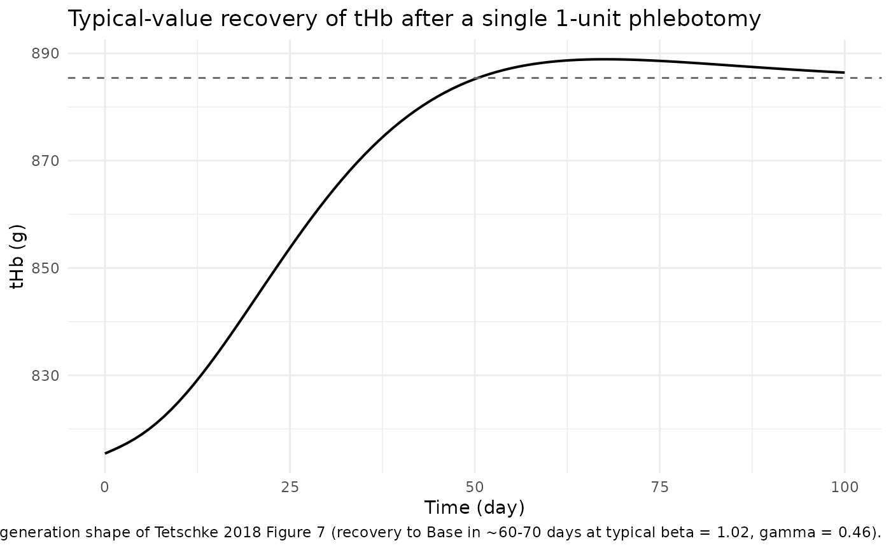
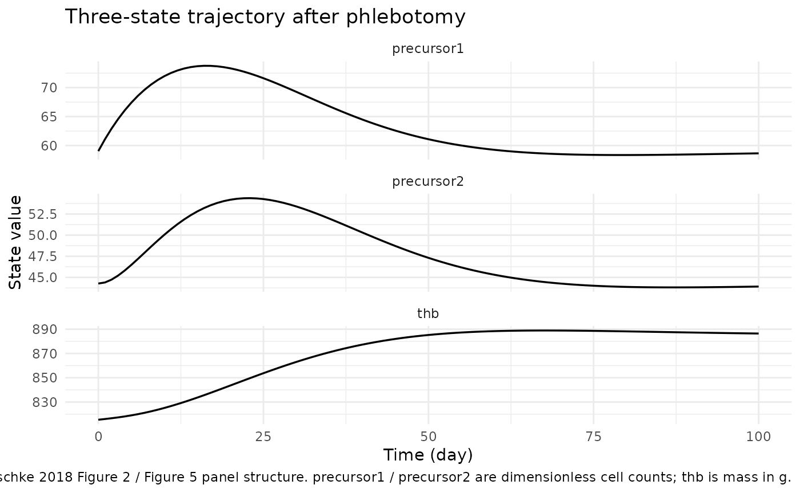
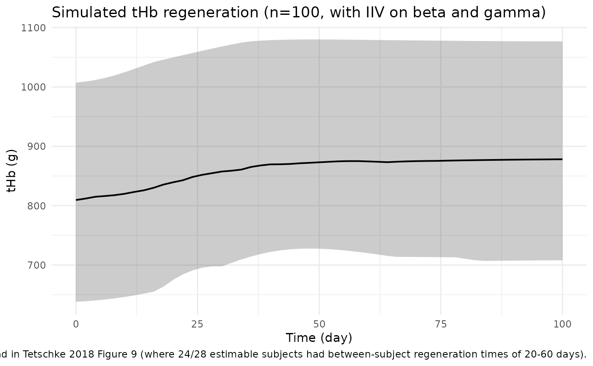
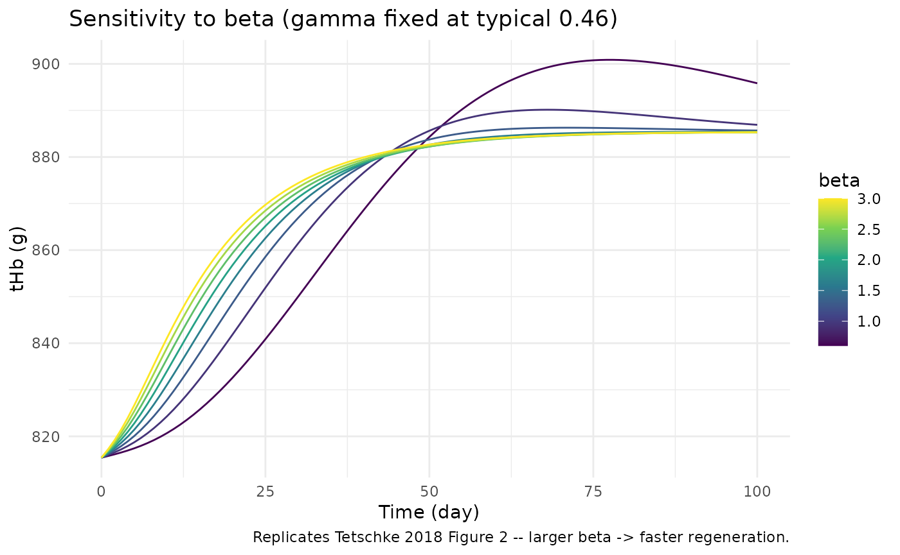
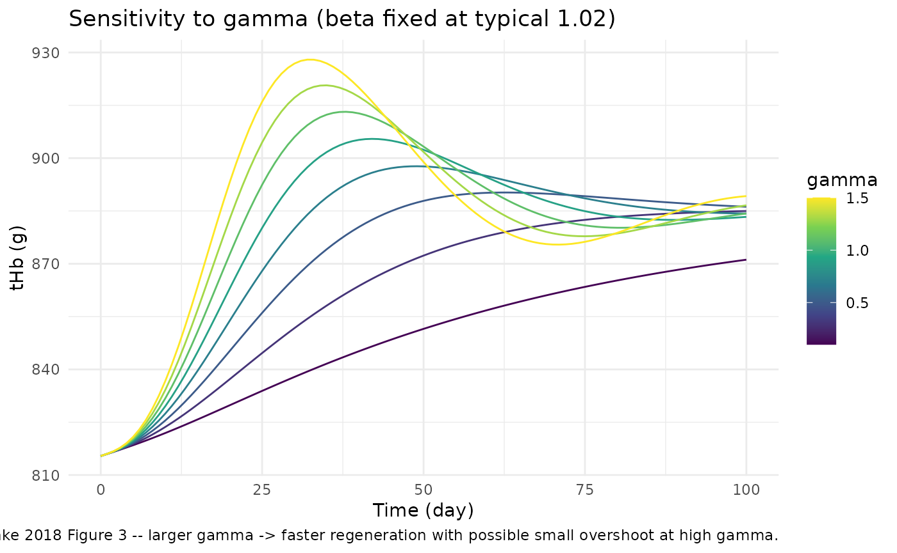

# Tetschke_2018_erythropoiesis

## Model and source

- Citation: Tetschke M, Lilienthal P, Pottgiesser T, Fischer T, Schalk
  E, Sager S. Mathematical Modeling of Red Blood Cell Count Dynamics
  after Blood Loss. Processes. 2018;6(9):157. <doi:10.3390/pr6090157>
- Description: Three-compartment population mixed-effects model for
  human erythropoiesis (red blood cell regeneration after a phlebotomy /
  blood donation) in healthy adults
- Article: <https://doi.org/10.3390/pr6090157> (open access, MDPI
  Processes)

This is an endogenous mechanistic model for human erythropoiesis – it
has no drug, no PK/PD output, and the perturbation of interest is a
**phlebotomy** (whole-blood or single-unit erythrocyte-concentrate
donation). Validation therefore follows the `endogenous-validation.md`
recipe (steady-state, perturbation-recovery, mass-balance, dimensional
analysis) rather than the standard PKNCA recipe.

## Population

The estimation cohort is from Pottgiesser et al. 2008 (Transfusion
48:1390): 29 healthy adult male volunteers (30 +/- 10 years, 181 +/- 7
cm, 76.6 +/- 11.2 kg) each undergoing a single 1-unit standard
erythrocyte-concentrate blood donation, with total hemoglobin (tHb)
measured pre-donation and at multiple time points during regeneration
via the optimised CO-rebreathing method (Schmidt 2005).

Tetschke 2018 fit the model to 276 tHb observations from 29 subjects in
NONMEM 7.4 with FOCE-I, diagonal OMEGA, exponential (log-normal) IIV on
`beta` and `gamma`, and an additive residual error model. The
subject-specific Base value was held fixed per subject from the
arithmetic mean of pre-donation tHb measurements (Section 3.3). The
additive residual SD was not reported in the manuscript, so the packaged
model omits residual error – it is intended for typical-value + IIV
simulation (and for reproducing the published goodness-of-fit behaviour)
rather than for refitting against new data.

The same metadata is available programmatically:

``` r

mod_fn <- readModelDb("Tetschke_2018_erythropoiesis")
mod    <- mod_fn()
str(mod$meta$population)
#> List of 9
#>  $ n_subjects    : num 29
#>  $ n_studies     : num 1
#>  $ age_range     : chr "30 +/- 10 years (mean +/- SD), all adult males"
#>  $ weight_range  : chr "76.6 +/- 11.2 kg (mean +/- SD)"
#>  $ sex_female_pct: num 0
#>  $ disease_state : chr "Healthy adult male volunteers undergoing a single 1-unit standard erythrocyte-concentrate blood donation"
#>  $ dose_range    : chr "Single 1-unit blood donation; per-subject hemoglobin loss inferred from the difference between pre-donation Bas"| __truncated__
#>  $ regions       : chr "Germany (Pottgiesser et al. 2008 Transfusion 48:1390 dataset)"
#>  $ notes         : chr "Population NLME estimation in NONMEM 7.4 FOCE-I across 276 tHb observations from 29 subjects (Tetschke 2018 Sec"| __truncated__
str(mod$meta$covariateData)
#> List of 1
#>  $ THB_MASS:List of 6
#>   ..$ description       : chr "Subject baseline (steady-state) total hemoglobin mass in grams. Plasma-volume-independent measurement obtained "| __truncated__
#>   ..$ units             : chr "g"
#>   ..$ type              : chr "continuous"
#>   ..$ reference_category: NULL
#>   ..$ notes             : chr "Subject-level steady-state baseline. Tetschke 2018 estimates per-subject Base from the arithmetic mean of pre-d"| __truncated__
#>   ..$ source_name       : chr "Base"
```

## Source trace

Per-parameter origin is recorded as in-file comments next to each
[`ini()`](https://nlmixr2.github.io/rxode2/reference/ini.html) entry in
`inst/modeldb/endogenous/Tetschke_2018_erythropoiesis.R`. The table
below collects them in one place for review.

| Equation / parameter | Value | Source location |
|----|----|----|
| `lbeta = log(1.02)` (typical beta) | 1.02 | Tetschke 2018 Section 4.2 (population fixed effect, SE 0.151) |
| `lgamma = log(0.46)` (typical gamma) | 0.46 | Tetschke 2018 Section 4.2 (population fixed effect, SE 0.0651) |
| `etalbeta ~ 0.294` (IIV variance) | 0.294 | Tetschke 2018 Section 4.2 (diagonal OMEGA, SE 0.125) |
| `etalgamma ~ 0.346` (IIV variance) | 0.346 | Tetschke 2018 Section 4.2 (diagonal OMEGA, SE 0.148) |
| `k1 = 1/8` 1/day | 0.125 | Tetschke 2018 Table 1 and Assumption 12 (Section 2.2) – 8-day EPO-proliferating phase |
| `k2 = 1/6` 1/day | 0.1667 | Tetschke 2018 Table 1 and Assumption 12 (Section 2.2) – 6-day non-EPO-proliferating phase |
| `alpha = 1/120` 1/day | 0.00833 | Tetschke 2018 Table 1 and Assumption 12 (Section 2.2) – 120-day mature-erythrocyte lifespan |
| `X0 = alpha * Base` | derived | Tetschke 2018 Eq. 3 (steady-state condition; X0 = k1 \* x1_bar = alpha \* Base) |
| `Fb = gamma * (Base - x3) / Base` | n/a | Tetschke 2018 Eq. 2 |
| `d/dt(precursor1) = beta*(X0 - k1*x1) + Fb*x1` | n/a | Tetschke 2018 Eq. 1, line 1 |
| `d/dt(precursor2) = beta*(k1*x1 - k2*x2)` | n/a | Tetschke 2018 Eq. 1, line 2 |
| `d/dt(thb) = beta*(k2*x2 - alpha*x3)` | n/a | Tetschke 2018 Eq. 1, line 3 |
| Steady-state IC `precursor1(0) = (alpha/k1)*Base` | derived | Tetschke 2018 Eq. 3 |
| Steady-state IC `precursor2(0) = (alpha/k2)*Base` | derived | Tetschke 2018 Eq. 3 |
| Steady-state IC `thb(0) = Base` | n/a | Tetschke 2018 Eq. 3 |

### Units table (per ODE term)

The Tetschke 2018 paper assigns units `[1]` (dimensionless count) to
`x1` and `x2`, but `[g]` to `x3`. Walking through
`dx3/dt = beta*(k2*x2 - alpha*x3)` in those units gives
`(1/day)*[1] - (1/day)*[g]`, which is dimensionally mixed: the `k2*x2`
term carries dimensionless count per day while the `alpha*x3` term
carries grams per day. The model reproduces the paper exactly; the
apparent inconsistency is an implicit unit-conversion convention in the
source (the `x2 -> x3` transition silently rescales count to mass via
the unstated mean-corpuscular-hemoglobin factor). See
`references/endogenous-validation.md` for the comparable Charbonneau
2021 phenylalanine case where dimensional mixing in the published
equations is preserved verbatim by design.

| ODE term | Units (paper’s bookkeeping) | Notes |
|----|----|----|
| `dx1/dt = d(precursor1)/dt` | \[1\]/day | dimensionless count rate |
| `beta * X0` | \[1\] \* \[1\]/day = \[1\]/day | X0 = alpha\*Base has units \[g\]/day in literal SI but is treated as count-rate per the paper’s convention |
| `beta * k1 * precursor1` | \[1\] \* (1/day) \* \[1\] = \[1\]/day | OK |
| `Fb * precursor1` | \[1\] \* \[1\] = \[1\]/day | Fb is treated as fractional deviation from baseline (dimensionless), so the product carries the \[1\]/day rate |
| `dx2/dt` | \[1\]/day | dimensionless count rate |
| `beta * (k1*precursor1 - k2*precursor2)` | (1/day)*\[1\] - (1/day)*\[1\] = \[1\]/day | OK |
| `dx3/dt = d(thb)/dt` | \[g\]/day | mass rate |
| `beta * k2 * precursor2` | (1/day)\*\[1\] = \[1\]/day | implicit \*1 g/cell rescaling at the precursor2 -\> thb interface (paper convention) |
| `beta * alpha * thb` | (1/day)\*\[g\] = \[g\]/day | OK |

## Parameter table (paper vs. file)

``` r

data.frame(
  parameter   = c("beta", "gamma",
                  "IIV(beta) variance", "IIV(gamma) variance",
                  "k1 (1/d)", "k2 (1/d)", "alpha (1/d)",
                  "Base reference (g)"),
  paper       = c("1.02 (SE 0.151)", "0.46 (SE 0.0651)",
                  "0.294 (SE 0.125)", "0.346 (SE 0.148)",
                  "1/8 = 0.125", "1/6 = 0.1667", "1/120 = 0.00833",
                  "885.42 (Tetschke Table 1 example); ~870 (Pottgiesser 2008 cohort mean)"),
  packaged    = c(round(exp(0.01980263), 3), round(exp(-0.77652879), 3),
                  0.294, 0.346,
                  round(1/8, 3), round(1/6, 3), round(1/120, 5),
                  "supplied as covariate THB_MASS")
)
#>             parameter
#> 1                beta
#> 2               gamma
#> 3  IIV(beta) variance
#> 4 IIV(gamma) variance
#> 5            k1 (1/d)
#> 6            k2 (1/d)
#> 7         alpha (1/d)
#> 8  Base reference (g)
#>                                                                    paper
#> 1                                                        1.02 (SE 0.151)
#> 2                                                       0.46 (SE 0.0651)
#> 3                                                       0.294 (SE 0.125)
#> 4                                                       0.346 (SE 0.148)
#> 5                                                            1/8 = 0.125
#> 6                                                           1/6 = 0.1667
#> 7                                                        1/120 = 0.00833
#> 8 885.42 (Tetschke Table 1 example); ~870 (Pottgiesser 2008 cohort mean)
#>                         packaged
#> 1                           1.02
#> 2                           0.46
#> 3                          0.294
#> 4                          0.346
#> 5                          0.125
#> 6                          0.167
#> 7                        0.00833
#> 8 supplied as covariate THB_MASS
```

## Steady-state check

Solve the model with no perturbation (`THB_MASS = 885.42`, no dose, IIV
zeroed out) for 90 days. The state should remain at the seeded baseline
to numerical tolerance.

``` r

mod_typ <- mod |> rxode2::zeroRe()
#> Warning: No sigma parameters in the model

ev_ss <- data.frame(
  id       = 1L,
  time     = seq(0, 90, by = 1),
  amt      = 0,
  evid     = 0,
  cmt      = "thb",
  THB_MASS = 885.42
)

sim_ss <- rxode2::rxSolve(mod_typ, events = ev_ss, returnType = "data.frame")
#> ℹ omega/sigma items treated as zero: 'etalbeta', 'etalgamma'
range(sim_ss$thb)
#> [1] 885.42 885.42
range(sim_ss$precursor1)
#> [1] 59.028 59.028
range(sim_ss$precursor2)
#> [1] 44.271 44.271
```

``` r

stopifnot(diff(range(sim_ss$thb)) < 1e-6)
stopifnot(diff(range(sim_ss$precursor1)) < 1e-6)
stopifnot(diff(range(sim_ss$precursor2)) < 1e-6)
```

## Perturbation-recovery (Tetschke 2018 Figure 5 / Figure 7 behaviour)

A single phlebotomy is encoded as a negative bolus on the `thb`
compartment. The amount removed is set so that the post-donation tHb
matches the 1-unit-erythrocyte-concentrate scale typical for a German
blood-donation center – approximately 70 g of hemoglobin (Pottgiesser
2008 reports a per-unit loss of ~7 – 8 % of pre-donation tHb, i.e. ~60 –
70 g for a typical 870 g baseline).

``` r

phleb_amt <- -70   # g hemoglobin removed in a 1-unit donation

ev_phleb <- rbind(
  data.frame(id = 1L, time =  0, amt = phleb_amt, evid = 1L, cmt = "thb",
             THB_MASS = 885.42),
  data.frame(id = 1L, time = seq(0, 100, by = 1), amt = 0, evid = 0L, cmt = "thb",
             THB_MASS = 885.42)
)

sim_typ <- rxode2::rxSolve(mod_typ, events = ev_phleb, returnType = "data.frame")
#> ℹ omega/sigma items treated as zero: 'etalbeta', 'etalgamma'

ggplot(sim_typ, aes(time, thb)) +
  geom_line(linewidth = 0.7) +
  geom_hline(yintercept = 885.42, linetype = "dashed", colour = "grey40") +
  labs(x = "Time (day)", y = "tHb (g)",
       title = "Typical-value recovery of tHb after a single 1-unit phlebotomy",
       caption = "Replicates the regeneration shape of Tetschke 2018 Figure 7 (recovery to Base in ~60-70 days at typical beta = 1.02, gamma = 0.46).") +
  theme_minimal()
```



``` r

sim_typ |>
  select(time, precursor1, precursor2, thb) |>
  pivot_longer(c(precursor1, precursor2, thb), names_to = "state", values_to = "value") |>
  ggplot(aes(time, value)) +
  geom_line(linewidth = 0.6) +
  facet_wrap(~ state, scales = "free_y", ncol = 1) +
  labs(x = "Time (day)", y = "State value",
       title = "Three-state trajectory after phlebotomy",
       caption = "Replicates Tetschke 2018 Figure 2 / Figure 5 panel structure. precursor1 / precursor2 are dimensionless cell counts; thb is mass in g.") +
  theme_minimal()
```



The trajectory matches the paper’s qualitative findings: `thb` drops by
the phlebotomy amount, `precursor1` and `precursor2` are amplified by
the positive-`Fb` feedback term during the deficit, and `thb` returns to
baseline over ~60 – 70 days (compare Tetschke 2018 Figure 5, where
regeneration to Base takes ~65 days at `beta = 1`, `gamma = 0.5*beta`).

``` r

recovery_threshold <- 0.99 * 885.42
recovery_day <- sim_typ$time[which(sim_typ$thb >= recovery_threshold &
                                   sim_typ$time > 5)[1]]
recovery_day
#> [1] 40
stopifnot(!is.na(recovery_day), recovery_day >= 30, recovery_day <= 100)
```

## Population variability (Monte Carlo with IIV)

Reproduce the spread of regeneration trajectories that motivates the
inter-individual variability reported in Tetschke 2018 Section 4.2.

``` r

set.seed(20180905L)
n_sub <- 100L

baseline_thb <- rnorm(n_sub, mean = 870, sd = 100)

ev_pop <- do.call(rbind, lapply(seq_len(n_sub), function(i) {
  rbind(
    data.frame(id = i, time = 0, amt = phleb_amt, evid = 1L, cmt = "thb",
               THB_MASS = baseline_thb[i]),
    data.frame(id = i, time = seq(0, 100, by = 2), amt = 0, evid = 0L, cmt = "thb",
               THB_MASS = baseline_thb[i])
  )
}))

sim_pop <- rxode2::rxSolve(mod, events = ev_pop, returnType = "data.frame")

vpc_summary <- sim_pop |>
  group_by(time) |>
  summarise(
    Q05 = quantile(thb, 0.05, na.rm = TRUE),
    Q50 = quantile(thb, 0.50, na.rm = TRUE),
    Q95 = quantile(thb, 0.95, na.rm = TRUE),
    .groups = "drop"
  )

ggplot(vpc_summary, aes(time, Q50)) +
  geom_ribbon(aes(ymin = Q05, ymax = Q95), alpha = 0.25) +
  geom_line(linewidth = 0.7) +
  labs(x = "Time (day)", y = "tHb (g)",
       title = "Simulated tHb regeneration (n=100, with IIV on beta and gamma)",
       caption = "Median +/- 5/95th percentile band. Reproduces the cross-subject regeneration spread in Tetschke 2018 Figure 9 (where 24/28 estimable subjects had between-subject regeneration times of 20-60 days).") +
  theme_minimal()
```



## Sensitivity analysis (replicates Tetschke 2018 Figure 2 and Figure 3)

The paper’s Figures 2 and 3 are Monte-Carlo plots showing how varying
`beta` (holding `gamma` fixed) and `gamma` (holding `beta` fixed) shape
the regeneration trajectory. Reproduce the same sensitivity here using a
typical `Base = 885.42`:

``` r

ev_one <- function(THB_MASS) {
  rbind(
    data.frame(id = 1L, time =  0, amt = phleb_amt, evid = 1L, cmt = "thb",
               THB_MASS = THB_MASS),
    data.frame(id = 1L, time = seq(0, 100, by = 1), amt = 0, evid = 0L, cmt = "thb",
               THB_MASS = THB_MASS)
  )
}

beta_grid  <- seq(0.6, 3.0, length.out = 8)
sens_beta  <- do.call(rbind, lapply(beta_grid, function(b) {
  mod_b <- mod_typ |>
    rxode2::ini(lbeta = log(b))
  s <- rxode2::rxSolve(mod_b, events = ev_one(885.42), returnType = "data.frame")
  s$beta_set <- b
  s
}))
#> ℹ change initial estimate of `lbeta` to `-0.510825623765991`
#> ℹ omega/sigma items treated as zero: 'etalbeta', 'etalgamma'
#> ℹ change initial estimate of `lbeta` to `-0.0588405000229335`
#> ℹ omega/sigma items treated as zero: 'etalbeta', 'etalgamma'
#> ℹ change initial estimate of `lbeta` to `0.251314428280906`
#> ℹ omega/sigma items treated as zero: 'etalbeta', 'etalgamma'
#> ℹ change initial estimate of `lbeta` to `0.487703206345136`
#> ℹ omega/sigma items treated as zero: 'etalbeta', 'etalgamma'
#> ℹ change initial estimate of `lbeta` to `0.678758443107846`
#> ℹ omega/sigma items treated as zero: 'etalbeta', 'etalgamma'
#> ℹ change initial estimate of `lbeta` to `0.839101093183025`
#> ℹ omega/sigma items treated as zero: 'etalbeta', 'etalgamma'
#> ℹ change initial estimate of `lbeta` to `0.977251431663842`
#> ℹ omega/sigma items treated as zero: 'etalbeta', 'etalgamma'
#> ℹ change initial estimate of `lbeta` to `1.09861228866811`
#> ℹ omega/sigma items treated as zero: 'etalbeta', 'etalgamma'

ggplot(sens_beta, aes(time, thb, group = beta_set, colour = beta_set)) +
  geom_line() +
  scale_colour_viridis_c(name = "beta") +
  labs(x = "Time (day)", y = "tHb (g)",
       title = "Sensitivity to beta (gamma fixed at typical 0.46)",
       caption = "Replicates Tetschke 2018 Figure 2 -- larger beta -> faster regeneration.") +
  theme_minimal()
```



``` r

gamma_grid <- seq(0.1, 1.5, length.out = 8)
sens_gamma <- do.call(rbind, lapply(gamma_grid, function(g) {
  mod_g <- mod_typ |>
    rxode2::ini(lgamma = log(g))
  s <- rxode2::rxSolve(mod_g, events = ev_one(885.42), returnType = "data.frame")
  s$gamma_set <- g
  s
}))
#> ℹ change initial estimate of `lgamma` to `-2.30258509299405`
#> ℹ omega/sigma items treated as zero: 'etalbeta', 'etalgamma'
#> ℹ change initial estimate of `lgamma` to `-1.20397280432594`
#> ℹ omega/sigma items treated as zero: 'etalbeta', 'etalgamma'
#> ℹ change initial estimate of `lgamma` to `-0.693147180559945`
#> ℹ omega/sigma items treated as zero: 'etalbeta', 'etalgamma'
#> ℹ change initial estimate of `lgamma` to `-0.356674943938732`
#> ℹ omega/sigma items treated as zero: 'etalbeta', 'etalgamma'
#> ℹ change initial estimate of `lgamma` to `-0.105360515657826`
#> ℹ omega/sigma items treated as zero: 'etalbeta', 'etalgamma'
#> ℹ change initial estimate of `lgamma` to `0.0953101798043247`
#> ℹ omega/sigma items treated as zero: 'etalbeta', 'etalgamma'
#> ℹ change initial estimate of `lgamma` to `0.262364264467491`
#> ℹ omega/sigma items treated as zero: 'etalbeta', 'etalgamma'
#> ℹ change initial estimate of `lgamma` to `0.405465108108164`
#> ℹ omega/sigma items treated as zero: 'etalbeta', 'etalgamma'

ggplot(sens_gamma, aes(time, thb, group = gamma_set, colour = gamma_set)) +
  geom_line() +
  scale_colour_viridis_c(name = "gamma") +
  labs(x = "Time (day)", y = "tHb (g)",
       title = "Sensitivity to gamma (beta fixed at typical 1.02)",
       caption = "Replicates Tetschke 2018 Figure 3 -- larger gamma -> faster regeneration with possible small overshoot at high gamma.") +
  theme_minimal()
```



## Mass-balance / flux check (algebraic)

At steady state with `Fb = 0` and the seeded initial conditions, every
ODE right-hand side should evaluate to zero. Verify symbolically with
the example values from Tetschke 2018 Table 1.

``` r

Base  <- 885.42
beta  <- 1.02
gamma <- 0.46
k1    <- 1 / 8
k2    <- 1 / 6
alpha <- 1 / 120

x1_bar <- alpha / k1 * Base
x2_bar <- alpha / k2 * Base
x3_bar <- Base
X0     <- alpha * Base
Fb_bar <- gamma * (Base - x3_bar) / Base

c(
  x1_bar = x1_bar, x2_bar = x2_bar, x3_bar = x3_bar,
  X0     = X0,    Fb_bar = Fb_bar
)
#>   x1_bar   x2_bar   x3_bar       X0   Fb_bar 
#>  59.0280  44.2710 885.4200   7.3785   0.0000

dx1 <- beta * (X0 - k1 * x1_bar) + Fb_bar * x1_bar
dx2 <- beta * (k1 * x1_bar - k2 * x2_bar)
dx3 <- beta * (k2 * x2_bar - alpha * x3_bar)
c(dx1 = dx1, dx2 = dx2, dx3 = dx3)
#> dx1 dx2 dx3 
#>   0   0   0

stopifnot(abs(dx1) < 1e-9, abs(dx2) < 1e-9, abs(dx3) < 1e-9)
```

The reported `x1_bar = 59.03`, `x2_bar = 44.27`, `X0 = 7.3785` reproduce
Tetschke 2018 Table 1 exactly.

## Assumptions and deviations

- **Compartment naming deviation – `thb`.** The third compartment in
  this model carries total hemoglobin mass in grams. The canonical
  nlmixr2lib compartment list (`depot`, `central`, `peripheral1`, …)
  does not include a hemoglobin-mass compartment, so this model uses the
  paper-faithful name `thb`. The companion progenitor states use the
  canonical chain prefix `precursor<n>`. Documented as a known
  convention warning emitted by
  `checkModelConventions("Tetschke_2018_erythropoiesis")`.
- **`THB_MASS` is a newly registered canonical covariate** for total
  hemoglobin mass (grams) measured by the optimised CO-rebreathing
  method (Schmidt 2005). It is distinct from the existing `HGB` (mass
  concentration in g/L or g/dL) and `HCT` (volume fraction) – see
  `inst/references/covariate-columns.md`.
- **No residual error model.** Tetschke 2018 reports an additive
  residual error model was used in NONMEM but does not publish the
  additive SD. The packaged model therefore omits residual error and is
  intended for typical-value + IIV simulation rather than refitting
  against new data.
- **Source-paper dimensional inconsistency in Eq. 1.** Table 1 lists
  `x1` and `x2` as dimensionless `[1]` and `x3` as `[g]`. The transition
  rate `k2*x2` in the `dx3/dt` line therefore has units `[1]/day` while
  the decay term `alpha*x3` has units `[g]/day`. The packaged model
  reproduces the paper’s equations verbatim; the implicit count -\> mass
  rescaling at the precursor2 -\> thb interface is part of the paper’s
  convention. See the units table above and the comparable Charbonneau
  2021 phenylalanine case documented in
  `references/endogenous-validation.md`.
- **Phlebotomy is encoded as a negative bolus on `thb`.** The control
  variable `u(t)` and rate function `P(beta, dt, dx3)` in Tetschke 2018
  Eq. 5 and Appendix A.1 are an internal convenience for the paper’s
  NONMEM implementation; the paper itself notes (Section 2.3) that the
  same numerical results can be reproduced by setting the post-donation
  `thb` value as the simulation start point. The negative-bolus
  formulation is the natural rxode2 / nlmixr2 idiom and is functionally
  equivalent.
- **Typical-cohort baseline `THB_MASS = 885.42 g` (Table 1 example).**
  This is the per-Subject example from Table 1 of the paper. The
  Pottgiesser 2008 cohort spans roughly 612 – 1555 g (Table A2). For
  pediatric, female, hematology-disordered, or non-Pottgiesser
  populations the user must supply a population-appropriate `THB_MASS`
  value.
- **Subject-level Base treated as a covariate.** Tetschke 2018 holds
  Base fixed per subject in the population NLME (Section 4.2) and only
  attempts to estimate Base directly in Section 4.4 (where it has
  identifiability problems). The packaged model therefore exposes
  `THB_MASS` as a covariate to be supplied by the user rather than as an
  estimated parameter.
- **Cohort generalisability.** The Pottgiesser 2008 dataset is
  exclusively adult males. Female and pediatric subjects have
  systematically lower tHb mass (a typical adult female has ~600 g vs
  ~870 g in adult males); pre-pubertal children have ~250 – 500 g
  depending on age and weight. The mechanism (beta, gamma, k1, k2,
  alpha) is expected to extrapolate qualitatively but no quantitative
  cross-cohort validation is in the paper. The Outlook (Section 5)
  explicitly flags polycythemia vera and pathological cases as
  out-of-scope for the published parameter set.
