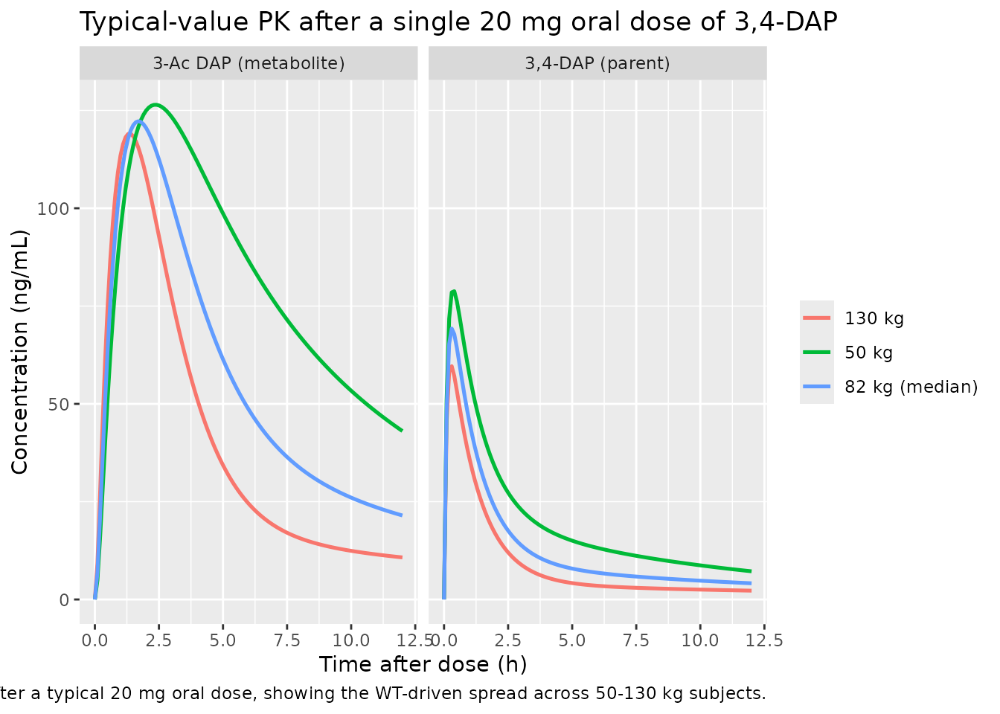
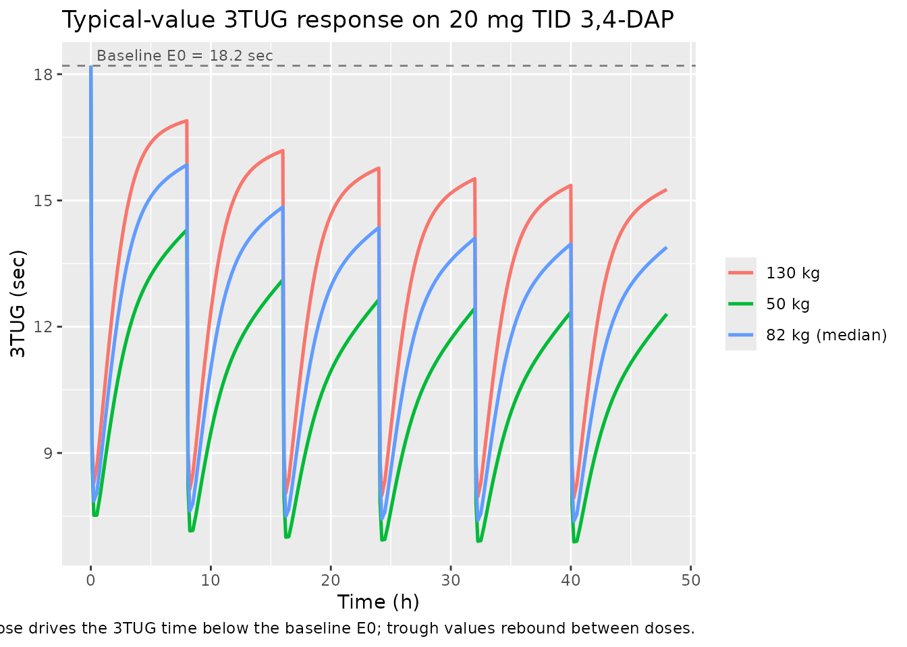

# Amifampridine (Thakkar 2017)

## Model and source

- Citation: Thakkar N, Guptill JT, Ales K, Jacobus D, Jacobus L,
  Peloquin C, Cohen-Wolkowiez M, Gonzalez D, for the DAPPER Study Group.
  Population Pharmacokinetics/Pharmacodynamics of 3,4-Diaminopyridine
  Free Base in Patients With Lambert-Eaton Myasthenia. CPT
  Pharmacometrics Syst Pharmacol. 2017;6(9):625-634.
  <doi:10.1002/psp4.12218>. ClinicalTrials.gov NCT01511978.
- Description: Joint parent-metabolite population PK + fractional-Emax
  PD model for 3,4-diaminopyridine (3,4-DAP, amifampridine) free base
  and its N-acetyl metabolite 3-Ac DAP in 49 adults with Lambert-Eaton
  myasthenia (Thakkar 2017). Two-compartment parent + one-compartment
  metabolite with Fm fixed to 1 (all parent clearance forms metabolite).
  Body weight is allometrically scaled on CL/F and CLm/F3ACDAP (exponent
  0.75 fixed) and linearly on Vp/F (exponent 1 fixed), all with
  reference weight 82 kg. Serum creatinine acts on CLm/F3ACDAP through
  (0.8/SCR)^0.7 with median SCR 0.8 mg/dL. The PD submodel describes the
  Triple Timed Up and Go (3TUG) score in seconds via a
  fractional-inhibitory Emax equation Effect = E0 \* (1 - Emax \* Cp /
  (EC50 + Cp)) where Cp is the parent 3,4-DAP plasma concentration in
  ng/mL.
- Article: <https://doi.org/10.1002/psp4.12218>
- ClinicalTrials.gov: <https://clinicaltrials.gov/study/NCT01511978>

## Population

The published analysis is the DAPPER phase II multicenter double-blind
placebo-controlled withdrawal study (NCT01511978) of 3,4-diaminopyridine
(3,4-DAP, amifampridine) free base in 49 adults with Lambert-Eaton
myasthenia on chronic 3,4-DAP free base treatment (Thakkar 2017 Table
1). Subjects had a median age of 60 years (range 23-83), median body
weight 82.6 kg (range 45.8-131.5 kg), median serum creatinine 0.8 mg/dL
(range 0.5-1.5 mg/dL), 47% male, 94% White, 2% Hispanic. Patients
received single oral 3,4-DAP free base doses of 10-30 mg (median 20 mg)
administered 3-6 times daily; median total daily dose was 80 mg (range
30-100 mg). The PK analysis used 1270 plasma samples from 49 subjects;
the PD analysis used 1091 Triple Timed Up and Go (3TUG) measurements
from 32 randomized patients. The same demographics are available
programmatically via
`readModelDb("Thakkar_2017_amifampridine")$population`.

## Source trace

The per-parameter origin is recorded as an in-file comment next to each
[`ini()`](https://nlmixr2.github.io/rxode2/reference/ini.html) entry in
`inst/modeldb/specificDrugs/Thakkar_2017_amifampridine.R`. The table
below collects them in one place for review.

| Equation / parameter | Final value | Source location |
|----|----|----|
| `lka` (KA) | 0.9 /h | Table 2, Final column |
| `lcl` (CL/F at 82 kg) | 90 L/h | Table 2, Final column |
| `lvc` (Vc/F) | 24 L | Table 2, Final column |
| `lq` (Q/F) | 111 L/h | Table 2, Final column |
| `lvp` (Vp/F at 82 kg) | 669 L | Table 2, Final column |
| `lcl_acdap` (CLm/F3ACDAP at 82 kg, SCR 0.8) | 20.5 L/h | Table 2, Final column |
| `lvc_acdap` (Vm/F3ACDAP) | 36 L | Table 2, Final column |
| `e_wt_cl` (allometric exponent on CL) | 0.75 (fixed) | Methods Eq 3 |
| `e_wt_vp` (linear exponent on Vp) | 1 (fixed) | Methods Eq 4 |
| `e_wt_cl_acdap` (allometric exponent on CLm) | 0.75 (fixed) | Methods Eq 3 |
| `e_creat_cl_acdap` (SCR power exponent on CLm) | 0.7 | Table 2 Final column (RSE 31.8%) |
| `etalcl + etalvc` (correlated block, omega^2) | (0.2082, 0.2926, 1.4649) | Table 2 CV(CL)=48.1%, CV(Vc)=182.4%, corr=0.53 (footnote d) |
| `etalka` | log(1 + 0.362^2) = 0.1239 | Table 2 IIV, KA = 36.2% CV |
| `etalq` | log(1 + 0.487^2) = 0.2122 | Table 2 IIV, Q/F = 48.7% CV |
| `etalvp` | log(1 + 0.898^2) = 0.6989 | Table 2 IIV, Vp/F = 89.8% CV |
| `etalcl_acdap` | log(1 + 0.386^2) = 0.1389 | Table 2 IIV, CLm/F3ACDAP = 38.6% CV |
| `propSd` (3,4-DAP proportional) | 0.348 | Table 2 residual error, 3,4-DAP 34.8% |
| `propSd_acdap` (3-Ac DAP proportional) | 0.201 | Table 2 residual error, 3-Ac DAP 20.1% |
| `logitemax` (logit of fractional Emax) | log(0.816/0.184) | Table 3 Final, Fractional Emax = 0.816 |
| `lec50` (EC50) | log(29.8) | Table 3 Final, EC50 = 29.8 ng/mL (273 nM) |
| `le0` (baseline 3TUG) | log(18.2) | Table 3 Final, E0 = 18.2 sec |
| `etalogitemax` (logit-scale variance) | 2.93 | Table 3 IIV, Fractional Emax variance = 2.93 |
| `etalec50` | log(1 + 0.883^2) = 0.5760 | Table 3 IIV, EC50 = 88.3% CV |
| `etale0` | log(1 + 0.713^2) = 0.4109 | Table 3 IIV, E0 = 71.3% CV |
| `propSd_tug3` (3TUG proportional) | 0.214 | Table 3 residual error, 21.4% |
| Equation: 2-cmt parent + 1-cmt metabolite, Fm fixed to 1 | n/a | Methods, “Fm was fixed to 1 to obtain an identifiable model”; Figure 1 schematic |
| Equation: WT allometric scaling | n/a | Methods Eqs 3 and 4 with reference WT 82 kg |
| Equation: SCR power-form on CLm | n/a | Table 2 footnote c: `CLm/F3ACDAP = 20.5*(WT/82)^0.75 *(0.8/SCR)^0.7` |
| Equation: PD fractional-inhibitory Emax | n/a | Results section, “Effect (sec) = 18.2*(1 - 0.816*Cp/(29.8 + Cp))” |

## Virtual cohort

Original observed data are not publicly available. The simulations below
use typical-value individuals spanning the published weight range
(Thakkar 2017 Table 1: 45.8-131.5 kg) at the population-median serum
creatinine of 0.8 mg/dL, so the WT-allometric effect on CL, Vp, and CLm
is visible across subjects while the renal-function ratio stays at 1.

``` r

set.seed(20170917)

cov_df <- data.frame(
  id     = 1:3,
  WT     = c(50, 82, 130),
  CREAT  = c(0.8, 0.8, 0.8),
  cohort = factor(c("50 kg", "82 kg (median)", "130 kg"),
                  levels = c("50 kg", "82 kg (median)", "130 kg")),
  stringsAsFactors = FALSE
)
```

## Simulation

Two scenarios drawn from the paper’s Table 4 dosing-simulation grid: (a)
a single oral 20 mg dose of 3,4-DAP free base, observed densely over 12
h; (b) the most clinically common multiple-dose regimen of 20 mg TID
(q8h) over 48 h, sampled densely around each dose. Concentrations are
reported in ng/mL (the paper’s PK modeling unit; the corresponding nM
values are obtained as `Cc * 1000 / 109.13` for 3,4-DAP and
`Cc_acdap * 1000 / 151.18` for 3-Ac DAP per Methods).

``` r

mod_typical <- readModelDb("Thakkar_2017_amifampridine") |> rxode2::zeroRe()

build_events <- function(cov_df, obs_times, dose_events) {
  events_list <- lapply(seq_len(nrow(cov_df)), function(i) {
    row <- cov_df[i, , drop = FALSE]
    dose_rows <- dose_events |>
      mutate(id     = row$id,
             WT     = row$WT,
             CREAT  = row$CREAT,
             cohort = as.character(row$cohort))
    obs_rows <- data.frame(
      id     = row$id,
      time   = obs_times,
      amt    = NA_real_,
      evid   = 0L,
      cmt    = "Cc",
      WT     = row$WT,
      CREAT  = row$CREAT,
      cohort = as.character(row$cohort),
      stringsAsFactors = FALSE
    )
    dplyr::bind_rows(dose_rows, obs_rows)
  })
  dplyr::bind_rows(events_list) |> arrange(id, time, evid)
}

# (a) 20 mg single oral dose, 0-12 h
single_dose <- data.frame(
  time = 0, amt = 20, evid = 1L, cmt = "depot",
  stringsAsFactors = FALSE
)
events_single <- build_events(
  cov_df,
  obs_times   = seq(0, 12, by = 0.1),
  dose_events = single_dose
)
sim_single <- rxode2::rxSolve(
  mod_typical,
  events = events_single,
  keep   = c("WT", "CREAT", "cohort")
) |> as.data.frame()
#> ℹ omega/sigma items treated as zero: 'etalcl', 'etalvc', 'etalka', 'etalq', 'etalvp', 'etalcl_acdap', 'etalogitemax', 'etalec50', 'etale0'
#> Warning: multi-subject simulation without without 'omega'
```

``` r

# (b) 20 mg TID (q8h) over 48 h
multi_dose <- data.frame(
  time = seq(0, 40, by = 8),
  amt  = 20,
  evid = 1L,
  cmt  = "depot",
  stringsAsFactors = FALSE
)
obs_times_multi <- sort(unique(c(
  seq(0, 48, by = 0.25),
  c(0.1, 0.5, 1, 2, 4, 8) +
    rep(seq(0, 40, by = 8), each = 6)
)))
obs_times_multi <- obs_times_multi[obs_times_multi <= 48]
events_multi <- build_events(
  cov_df,
  obs_times   = obs_times_multi,
  dose_events = multi_dose
)
sim_multi <- rxode2::rxSolve(
  mod_typical,
  events = events_multi,
  keep   = c("WT", "CREAT", "cohort")
) |> as.data.frame()
#> ℹ omega/sigma items treated as zero: 'etalcl', 'etalvc', 'etalka', 'etalq', 'etalvp', 'etalcl_acdap', 'etalogitemax', 'etalec50', 'etale0'
#> Warning: multi-subject simulation without without 'omega'
```

## Replicate published figures

### Concentration vs time after single 20 mg dose

``` r

plot_single <- sim_single |>
  pivot_longer(cols = c(Cc, Cc_acdap),
               names_to = "species", values_to = "conc") |>
  mutate(species = recode(species,
                          "Cc"       = "3,4-DAP (parent)",
                          "Cc_acdap" = "3-Ac DAP (metabolite)"))

ggplot(plot_single, aes(time, conc, color = cohort)) +
  geom_line(linewidth = 0.9) +
  facet_wrap(~species, ncol = 2) +
  labs(x = "Time after dose (h)", y = "Concentration (ng/mL)",
       color = NULL,
       title = "Typical-value PK after a single 20 mg oral dose of 3,4-DAP",
       caption = paste("Reproduces the qualitative shape of Thakkar 2017 Figure 1",
                       "after a typical 20 mg oral dose, showing the WT-driven",
                       "spread across 50-130 kg subjects."))
```



### 3TUG response after 20 mg TID

``` r

ggplot(sim_multi, aes(time, tug3, color = cohort)) +
  geom_line(linewidth = 0.9) +
  geom_hline(yintercept = 18.2, linetype = "dashed", color = "grey50") +
  annotate("text", x = 0.5, y = 18.2, label = "Baseline E0 = 18.2 sec",
           hjust = 0, vjust = -0.5, color = "grey30", size = 3) +
  labs(x = "Time (h)", y = "3TUG (sec)", color = NULL,
       title = "Typical-value 3TUG response on 20 mg TID 3,4-DAP",
       caption = paste("Fractional-inhibitory Emax model. Each dose drives the",
                       "3TUG time below the baseline E0; trough values rebound",
                       "between doses."))
```



## PKNCA validation

Single-dose NCA over 0-12 h after the 20 mg oral dose, computed
separately for the 3,4-DAP parent and the 3-Ac DAP metabolite.

### 3,4-DAP parent

``` r

sim_nca_parent <- sim_single |>
  filter(!is.na(Cc), time > 0) |>
  select(id, time, Cc, cohort)

dose_df <- events_single |>
  filter(evid == 1L) |>
  select(id, time, amt, cohort) |>
  distinct()

conc_obj_parent <- PKNCA::PKNCAconc(
  sim_nca_parent, Cc ~ time | cohort + id,
  concu = "ng/mL", timeu = "h"
)
dose_obj <- PKNCA::PKNCAdose(
  dose_df, amt ~ time | cohort + id, doseu = "mg"
)

intervals <- data.frame(
  start      = 0,
  end        = 12,
  cmax       = TRUE,
  tmax       = TRUE,
  auclast    = TRUE,
  aucinf.obs = TRUE,
  half.life  = TRUE
)

nca_parent <- PKNCA::pk.nca(
  PKNCA::PKNCAdata(conc_obj_parent, dose_obj, intervals = intervals)
)
#> Warning: Requesting an AUC range starting (0) before the first measurement (0.1) is not allowed
#> Requesting an AUC range starting (0) before the first measurement (0.1) is not allowed
#> Requesting an AUC range starting (0) before the first measurement (0.1) is not allowed
#> Requesting an AUC range starting (0) before the first measurement (0.1) is not allowed
#> Requesting an AUC range starting (0) before the first measurement (0.1) is not allowed
#> Requesting an AUC range starting (0) before the first measurement (0.1) is not allowed
knitr::kable(as.data.frame(summary(nca_parent)),
             caption = "3,4-DAP parent NCA after a single 20 mg oral dose.")
```

| Interval Start | Interval End | cohort | N | AUClast (h\*ng/mL) | Cmax (ng/mL) | Tmax (h) | Half-life (h) | AUCinf,obs (h\*ng/mL) |
|---:|---:|:---|:---|:---|:---|:---|:---|:---|
| 0 | 12 | 130 kg | 1 | NC | 59.6 | 0.300 | 12.1 | NC |
| 0 | 12 | 50 kg | 1 | NC | 78.8 | 0.400 | 7.13 | NC |
| 0 | 12 | 82 kg (median) | 1 | NC | 69.2 | 0.300 | 9.20 | NC |

3,4-DAP parent NCA after a single 20 mg oral dose. {.table
style="width:100%;"}

### 3-Ac DAP metabolite

``` r

sim_nca_metab <- sim_single |>
  filter(!is.na(Cc_acdap), time > 0) |>
  select(id, time, Cc_acdap, cohort) |>
  rename(Cc = Cc_acdap)

conc_obj_metab <- PKNCA::PKNCAconc(
  sim_nca_metab, Cc ~ time | cohort + id,
  concu = "ng/mL", timeu = "h"
)

nca_metab <- PKNCA::pk.nca(
  PKNCA::PKNCAdata(conc_obj_metab, dose_obj, intervals = intervals)
)
#> Warning: Requesting an AUC range starting (0) before the first measurement (0.1) is not allowed
#> Requesting an AUC range starting (0) before the first measurement (0.1) is not allowed
#> Requesting an AUC range starting (0) before the first measurement (0.1) is not allowed
#> Requesting an AUC range starting (0) before the first measurement (0.1) is not allowed
#> Requesting an AUC range starting (0) before the first measurement (0.1) is not allowed
#> Requesting an AUC range starting (0) before the first measurement (0.1) is not allowed
knitr::kable(as.data.frame(summary(nca_metab)),
             caption = "3-Ac DAP metabolite NCA after a single 20 mg oral dose.")
```

| Interval Start | Interval End | cohort | N | AUClast (h\*ng/mL) | Cmax (ng/mL) | Tmax (h) | Half-life (h) | AUCinf,obs (h\*ng/mL) |
|---:|---:|:---|:---|:---|:---|:---|:---|:---|
| 0 | 12 | 130 kg | 1 | NC | 119 | 1.40 | 10.6 | NC |
| 0 | 12 | 50 kg | 1 | NC | 126 | 2.40 | 6.43 | NC |
| 0 | 12 | 82 kg (median) | 1 | NC | 122 | 1.70 | 7.70 | NC |

3-Ac DAP metabolite NCA after a single 20 mg oral dose. {.table
style="width:100%;"}

### Comparison against previously published values

Thakkar 2017 Discussion cites an earlier IV study (reference 12: Wirtz
et al. 2009) reporting a 3,4-DAP steady-state volume of distribution of
159 L and total clearance of 118 L/h. The Thakkar 2017 final model (CL/F
= 90 L/h, Vc/F + Vp/F = 24 + 669 = 693 L apparent volume of distribution
at steady state) is broadly comparable for clearance but apparent
volumes are substantially larger because the present model uses oral
apparent parameters (divided by bioavailability F) whereas the cited
reference used IV true parameters. The Discussion states: “The
population estimates obtained in our study (3,4-DAP Vc/F and CL/F of 24
L and 90 L/h, respectively) are comparable to the previously published
values for patients with LEM (34 L and 118 L/h).” The 3,4-DAP plasma
half-life is reported as 0.5-2 h in earlier literature; with the present
model’s micro constants the parent concentration falls below LOQ by ~12
h after a single 20 mg dose, consistent with that range.

## Assumptions and deviations

- **Plasma observed-concentration unit.** The model reports `Cc` and
  `Cc_acdap` in ng/mL via an explicit `1000 *` factor in the observation
  equations (dose in mg, apparent volume in L; 1 mg/L = 1000 ng/mL). The
  paper’s Figure 1 displays nM but Table 2 parameters and the EC50
  estimate (29.8 ng/mL) are reported in mass-per-volume units; ng/mL is
  carried through here so the EC50 enters the PD equation in its native
  unit.
- **Fm fixed to 1.** Per Methods 2.4, the paper structurally fixed the
  fraction of 3,4-DAP converted to 3-Ac DAP to 1 to obtain an
  identifiable model, with all metabolite clearance and volume
  parameters reported relative to `F3ACDAP = Fm * F`. The model encodes
  this exactly: the parent CL flux feeds the metabolite compartment in
  full and the metabolite apparent volume / clearance absorb the
  (unidentifiable) bioavailability scaling.
- **Allometric and SCR exponents are wrapped in `fixed()` as the source
  paper holds them constant.** The 0.75 and 1 allometric exponents on CL
  / Vp are fixed by the literature convention (Methods Eqs 3 and 4); the
  SCR exponent of 0.7 on CLm/F3ACDAP is estimated and is reported as a
  free parameter in Table 2.
- **Interoccasion variability omitted.** The paper evaluated an IOV term
  on CL across the three inpatient stages and found it small (8%); the
  final reported model does not include IOV (Results “interoccasion
  variability … was not included in the final model”). The model matches
  the paper’s final form.
- **Acetylator status not included as a covariate.** NAT2 genotype was
  available for only 11/49 patients and the forward-backward covariate
  selection did not retain it in the final model (Results paragraph on
  population PK model evaluation). The model therefore takes no
  acetylator-status input.
- **PD covariates none.** The paper’s PD covariate analysis found that
  “no covariates resulted in statistically significant reduction in the
  OFV” (Results paragraph on sequential PK/PD model development). The
  Emax model is therefore a purely structural relationship with BSV on
  the three structural parameters and no covariate effects.
- **Below-quantification (BQL) handling.** Source dataset BQL samples
  (26/1270, 2%) were imputed to zero during fitting; the paper found
  similar estimates after discarding BQL data (Discussion paragraph on
  BQL handling). The model encodes only the structural form; users
  preparing input datasets for re-fitting should follow whichever BQL
  rule matches their downstream analysis.
- **3TUG variable name.** Thakkar 2017 names the response “3TUG” but R
  identifiers cannot start with a digit; the model uses `tug3` as the
  observation-variable name with the residual-error parameter
  `propSd_tug3`. The semantic meaning is unchanged.
