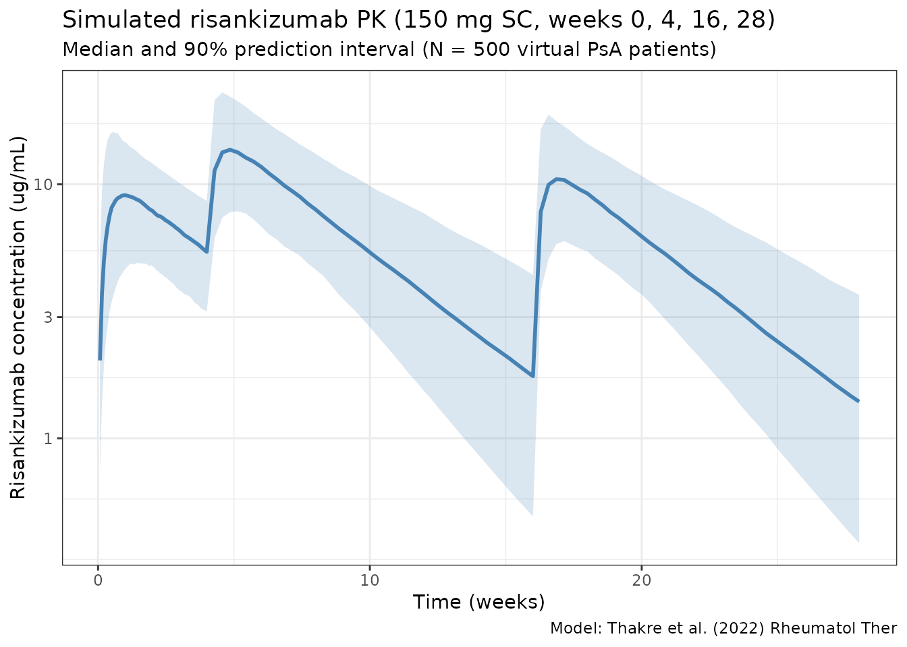

# Thakre_2022_risankizumab

``` r
library(nlmixr2lib)
library(rxode2)
#> rxode2 5.0.2 using 2 threads (see ?getRxThreads)
#>   no cache: create with `rxCreateCache()`
library(dplyr)
#> 
#> Attaching package: 'dplyr'
#> The following objects are masked from 'package:stats':
#> 
#>     filter, lag
#> The following objects are masked from 'package:base':
#> 
#>     intersect, setdiff, setequal, union
library(tidyr)
library(ggplot2)
library(PKNCA)
#> 
#> Attaching package: 'PKNCA'
#> The following object is masked from 'package:stats':
#> 
#>     filter
```

## Risankizumab population PK in psoriatic arthritis

Simulate risankizumab concentration-time profiles using the final
population PK model of Thakre et al. (2022) in patients with active
psoriatic arthritis (PsA). The source paper pooled data from five
studies (one phase 1 healthy- participant study, one phase 2
dose-ranging study in PsA with an open-label extension, and two pivotal
phase 3 PsA studies, KEEPsAKE 1 and KEEPsAKE 2) — 3631 concentrations
from 1527 individuals.

The model is a two-compartment model with first-order subcutaneous
absorption and first-order elimination. The final covariate set is body
weight, age, serum albumin, serum creatinine, and high-sensitivity
C-reactive protein (hsCRP) on clearance, plus body weight on central
volume of distribution. ADA titers on CL and body weight on V2 were
evaluated but did not meet retention criteria and are not in the final
model.

### Source trace

| Element                   | Source location                   | Value / form                                                 |
|---------------------------|-----------------------------------|--------------------------------------------------------------|
| CL, Vc, Vp, Q, ka, F      | Thakre 2022 Table 1               | 0.248 L/day, 4.71 L, 4.26 L, 0.839 L/day, 0.218 /day, 0.835  |
| WT on CL                  | Thakre 2022 Eq. 2 / Table 1       | Power: (WTKG/70)^0.869                                       |
| ALB on CL                 | Thakre 2022 Eq. 2 / Table 1       | Power: (ALB/45)^-0.703                                       |
| CREAT on CL               | Thakre 2022 Eq. 2 / Table 1       | Power: (CRE/70.73)^-0.201                                    |
| hsCRP on CL               | Thakre 2022 Eq. 2 / Table 1       | Power: (CRPHS/5.21)^0.0471                                   |
| AGE on CL                 | Thakre 2022 Eq. 2 / Table 1       | Power: (AGE/52)^-0.138                                       |
| WT on Vc                  | Thakre 2022 Eq. 3 / Table 1       | Power: (WTKG/70)^1.46                                        |
| IIV CL / V1 (correlated)  | Thakre 2022 Table 1               | var(CL)=0.0943, var(V1)=0.171, cov=0.0836 (correlation ~66%) |
| IIV ka                    | Thakre 2022 Table 1               | var=0.164                                                    |
| Residual error            | Thakre 2022 Table 1               | Proportional, variance = 0.0382 (~19.5% CV)                  |
| Dosing regimen (clinical) | Thakre 2022 Abstract / Discussion | 150 mg SC at weeks 0 and 4, then every 12 weeks              |

### Covariate column naming

| Source column  | Canonical column used here        |
|----------------|-----------------------------------|
| `WTKG`         | `WT` (per `covariate-columns.md`) |
| `AGE`          | `AGE`                             |
| `ALB` (g/L)    | `ALB` (g/L)                       |
| `CRE` (umol/L) | `CREAT` (umol/L; canonical name)  |
| `CRPHS` (mg/L) | `hsCRP` (mg/L; canonical name)    |

### Virtual population

PsA phase 2/3 trial-like covariate distributions. The source paper does
not publish per-subject data, so the distributions below approximate
typical PsA populations and are centered so that simulated individual
parameters bracket the paper’s reference covariates.

``` r
set.seed(2022)
n_subj <- 500

pop <- data.frame(
  ID    = seq_len(n_subj),
  WT    = rlnorm(n_subj, log(85), 0.22),  # median ~85 kg
  AGE   = round(pmin(pmax(rnorm(n_subj, 51, 12), 18), 80)),
  ALB   = pmin(pmax(rnorm(n_subj, 43, 3.5), 30), 52),     # g/L
  CREAT = pmin(pmax(rnorm(n_subj, 72, 16), 40), 140),     # umol/L
  hsCRP = rlnorm(n_subj, log(6), 1.1)                     # mg/L, skewed right
)
```

### Dosing dataset

Approved PsA clinical regimen: 150 mg SC at weeks 0 and 4, then every 12
weeks (q12w) thereafter. Simulate the first three full dosing intervals
(weeks 0-28), matching Thakre 2022 Table 2.

``` r
dose_weeks <- c(0, 4, 16, 28)    # 4 SC doses through week 28
dose_times <- dose_weeks * 7     # convert to days

obs_times <- sort(unique(c(
  seq(0,   28,  by = 0.5),
  seq(28,  196, by = 2)
)))

d_dose <- pop %>%
  crossing(TIME = dose_times) %>%
  mutate(
    AMT  = 150,       # mg SC
    EVID = 1,
    CMT  = 1,         # depot
    DV   = NA_real_
  )

d_obs <- pop %>%
  crossing(TIME = obs_times) %>%
  mutate(AMT = NA_real_, EVID = 0, CMT = 2, DV = NA_real_)

d_sim <- bind_rows(d_dose, d_obs) %>%
  arrange(ID, TIME, desc(EVID)) %>%
  as.data.frame()
```

### Simulate

``` r
mod <- readModelDb("Thakre_2022_risankizumab")
sim <- rxSolve(mod, d_sim, returnType = "data.frame")
#> ℹ parameter labels from comments will be replaced by 'label()'
```

### Concentration-time profile

``` r
sim_summary <- sim %>%
  filter(time > 0) %>%
  group_by(time) %>%
  summarise(
    median = median(Cc, na.rm = TRUE),
    lo     = quantile(Cc, 0.05, na.rm = TRUE),
    hi     = quantile(Cc, 0.95, na.rm = TRUE),
    .groups = "drop"
  )

ggplot(sim_summary, aes(x = time / 7)) +
  geom_ribbon(aes(ymin = lo, ymax = hi), alpha = 0.2, fill = "steelblue") +
  geom_line(aes(y = median), color = "steelblue", linewidth = 1) +
  scale_y_log10() +
  labs(
    x = "Time (weeks)",
    y = "Risankizumab concentration (ug/mL)",
    title = "Simulated risankizumab PK (150 mg SC, weeks 0, 4, 16, 28)",
    subtitle = "Median and 90% prediction interval (N = 500 virtual PsA patients)",
    caption = "Model: Thakre et al. (2022) Rheumatol Ther"
  ) +
  theme_bw()
```



### Per dosing-interval exposures vs Thakre 2022 Table 2

Compute Cmax, Ctrough, and AUC over the first three full dosing
intervals (weeks 0-4, 4-16, 16-28) and compare against Thakre 2022 Table
2.

``` r
intervals <- tribble(
  ~label,    ~start_wk, ~end_wk,
  "1 (0-4)",   0,   4,
  "2 (4-16)",  4,  16,
  "3 (16-28)", 16, 28
)

ivl_summary <- intervals %>%
  rowwise() %>%
  do({
    row <- .
    sub <- sim %>%
      filter(time >= row$start_wk * 7, time <= row$end_wk * 7, Cc > 0)
    per_id <- sub %>%
      group_by(id) %>%
      summarise(
        Cmax    = max(Cc, na.rm = TRUE),
        Ctrough = Cc[which.max(time)],
        AUCtau  = sum(diff(time) * (head(Cc, -1) + tail(Cc, -1)) / 2),
        .groups = "drop"
      )
    tibble(
      interval = row$label,
      Cmax_median    = median(per_id$Cmax),
      Cmax_mean      = mean(per_id$Cmax),
      Ctrough_median = median(per_id$Ctrough),
      Ctrough_mean   = mean(per_id$Ctrough),
      AUCtau_median  = median(per_id$AUCtau),
      AUCtau_mean    = mean(per_id$AUCtau)
    )
  }) %>%
  bind_rows()

knitr::kable(
  ivl_summary,
  digits = 2,
  caption = "Simulated per-interval exposures (compare with Thakre 2022 Table 2: interval-1 Cmax median 9.40, interval-2 Cmax median 14.1, interval-3 Cmax median 11.0 ug/mL; interval-1 Ctrough median 5.68, interval-2 Ctrough median 1.93, interval-3 Ctrough median 1.52 ug/mL; interval AUC medians 207, 565, 439 ug*day/mL)."
)
```

| interval  | Cmax_median | Cmax_mean | Ctrough_median | Ctrough_mean | AUCtau_median | AUCtau_mean |
|:----------|------------:|----------:|---------------:|-------------:|--------------:|------------:|
| 1 (0-4)   |        9.24 |      9.77 |           5.45 |         5.66 |        200.86 |      207.22 |
| 2 (4-16)  |       13.72 |     14.49 |           1.79 |         2.04 |        537.79 |      569.53 |
| 3 (16-28) |       10.69 |     11.42 |           1.41 |         1.63 |        418.53 |      447.36 |

Simulated per-interval exposures (compare with Thakre 2022 Table 2:
interval-1 Cmax median 9.40, interval-2 Cmax median 14.1, interval-3
Cmax median 11.0 ug/mL; interval-1 Ctrough median 5.68, interval-2
Ctrough median 1.93, interval-3 Ctrough median 1.52 ug/mL; interval AUC
medians 207, 565, 439 ug\*day/mL).

### PKNCA validation

Run PKNCA on the third dosing interval (weeks 16-28, steady-state
maintenance), which is the one reported as `Third dosing interval` in
Thakre 2022 Table 2.

``` r
nca_conc <- sim %>%
  filter(time >= 16 * 7, time <= 28 * 7, Cc > 0) %>%
  mutate(
    time_rel  = time - 16 * 7,
    treatment = "risankizumab_150mg_q12w"
  ) %>%
  rename(ID = id) %>%
  select(ID, time_rel, Cc, treatment)

nca_dose <- pop %>%
  mutate(
    time_rel  = 0,
    AMT       = 150,
    treatment = "risankizumab_150mg_q12w"
  ) %>%
  select(ID, time_rel, AMT, treatment)

conc_obj <- PKNCAconc(nca_conc, Cc ~ time_rel | treatment + ID)
dose_obj <- PKNCAdose(nca_dose, AMT ~ time_rel | treatment + ID)
data_obj <- PKNCAdata(
  conc_obj,
  dose_obj,
  intervals = data.frame(
    start     = 0,
    end       = 12 * 7,
    cmax      = TRUE,
    tmax      = TRUE,
    auclast   = TRUE,
    half.life = TRUE
  )
)
nca_results <- pk.nca(data_obj)
#>  ■■■■                              10% |  ETA: 17s
#>  ■■■■■■■■■■                        28% |  ETA: 13s
#>  ■■■■■■■■■■■■■■■                   46% |  ETA:  9s
#>  ■■■■■■■■■■■■■■■■■■■■              64% |  ETA:  6s
#>  ■■■■■■■■■■■■■■■■■■■■■■■■■         81% |  ETA:  3s
#>  ■■■■■■■■■■■■■■■■■■■■■■■■■■■■■■■   99% |  ETA:  0s
nca_summary <- summary(nca_results)
knitr::kable(
  nca_summary,
  digits  = 2,
  caption = "PKNCA summary for the third dosing interval (weeks 16-28). Compare Cmax / AUClast against Thakre 2022 Table 2 interval 3."
)
```

| start | end | treatment               | N   | auclast      | cmax          | tmax                | half.life     |
|------:|----:|:------------------------|:----|:-------------|:--------------|:--------------------|:--------------|
|     0 |  84 | risankizumab_150mg_q12w | 500 | 417 \[38.5\] | 10.7 \[38.1\] | 6.00 \[2.00, 16.0\] | 26.4 \[5.79\] |

PKNCA summary for the third dosing interval (weeks 16-28). Compare Cmax
/ AUClast against Thakre 2022 Table 2 interval 3.

### Assumptions and deviations

Thakre 2022 does not publish individual PK or per-subject covariate
values, so the virtual population above approximates typical PsA phase
2/3 populations rather than reproducing them:

- **Weight:** sampled log-normal around a 85 kg median, SD 0.22 on the
  log scale. The paper references 70 kg; the median in PsA phase-3
  trials is typically ~85 kg.
- **Age:** normal around 51 years, SD 12, clipped to 18-80. The paper
  references 52 years.
- **Serum albumin:** normal around 43 g/L, SD 3.5, clipped to 30-52 g/L
  (reference 45 g/L).
- **Serum creatinine:** normal around 72 umol/L, SD 16, clipped to
  40-140 umol/L (reference 70.73 umol/L).
- **hsCRP:** log-normal around a median of 6 mg/L (reference 5.21 mg/L).
  hsCRP is highly skewed in PsA.
- **No correlation** between continuous covariates is imposed; the paper
  does not report joint distributions.
- **Dosing regimen** uses the approved PsA label (150 mg SC at weeks 0
  and 4, then every 12 weeks). Thakre 2022 included earlier dose-ranging
  phase 1 / 2 data; those regimens are not simulated here.
- **ADA titers** are not included because they were evaluated but did
  not meet retention criteria in the final model.

### Notes

- **Model:** two-compartment with first-order SC absorption and linear
  elimination. No TMDD.
- **Typical-subject CL** at reference covariates: 0.248 L/day.
  Typical-subject V1: 4.71 L. Typical-subject Vp: 4.26 L. Steady-state
  Vss = V1 + V2 ~ 9.0 L (reference subject; the paper cites
  approximately 0.31 L/day and 6.8 L for Vc at median-PsA covariates).
- **Strongest covariates:** body weight (power 0.869 on CL, 1.46 on V1)
  and serum albumin (power -0.703 on CL).

### Reference

- Thakre N, D’Cunha R, Goebel A, Liu W, Pang Y, Suleiman AA. Population
  Pharmacokinetics and Exposure-Response Analyses for Risankizumab in
  Patients with Active Psoriatic Arthritis. Rheumatol Ther.
  2022;9(6):1587-1603. <doi:10.1007/s40744-022-00495-0>
