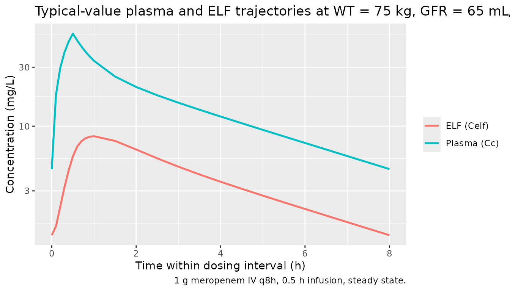
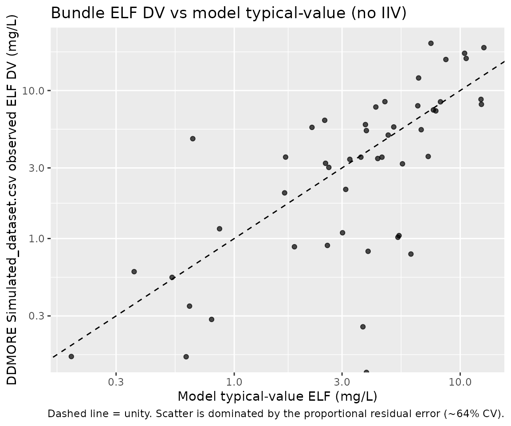

# Meropenem (Themans 2019)

## Model and source

- Citation: Themans P, Winkin J J, Musuamba F T (2019). Towards a
  generic tool for prediction of meropenem systemic and infection-site
  exposure: a physiologically based pharmacokinetic model for adult
  patients with pneumonia. Drugs R D 19(4):339-355.
  <doi:10.1007/s40268-019-0268-x>. DDMORE Foundation Model Repository:
  DDMODEL00000301.
- Description: Three-compartment population PK model for meropenem in
  adults with severe pneumonia, with parallel ELF (epithelial lining
  fluid) sampling (Themans 2019), as packaged in DDMORE Foundation Model
  Repository entry DDMODEL00000301.
- DDMORE Foundation Model Repository entry: `DDMODEL00000301`
- Article (per task metadata):
  <https://doi.org/10.1007/s40268-019-0268-x>

The DDMORE Model_Accomodations file describes the same body of work
(same authors, drug, indication, scenario = 4) as a British Journal of
Pharmacology submission dated July 2019. The published article in Drugs
in R&D (DOI above) was used as the canonical citation; the publication
PDF was not on disk so external cross-checks against published
tables/figures were not possible. See the Errata section for how the
.lst’s final estimates were used in lieu of a published parameter table,
and how a unit convention in the source NONMEM model was reconciled
against the simulated dataset shipped in the bundle.

## Population

The model was fit to adult patients with severe pneumonia receiving
meropenem by IV infusion. Specific demographics (n, age, sex, race,
study sites) could not be cross-checked against the publication because
the article PDF was not on disk; the demographics of the bundle’s
`Simulated_dataset.csv` (60 simulated subjects) provide the only on-disk
reference and span body weight 45-128 kg (mean ~78 kg) and raw measured
GFR 19-401 mL/min. The wide GFR range covers severe renal impairment
through to augmented renal clearance, consistent with a critically ill
ICU pneumonia population.

The same information is available programmatically via the model’s
`population` metadata
(`readModelDb("Themans_2019_meropenem")$population`).

## Source trace

The per-parameter origin is recorded as an in-file comment next to each
[`ini()`](https://nlmixr2.github.io/rxode2/reference/ini.html) entry in
`inst/modeldb/ddmore/Themans_2019_meropenem.R`. The table below collects
them in one place for review. Every `THETA(*)` reference is to the
**FINAL PARAMETER ESTIMATE** block of `Output_real_merop_PK_run3.lst`
(post `MINIMIZATION SUCCESSFUL`, OBJV = 1488.719); `OMEGA` and `SIGMA`
references are to the corresponding final blocks in the same listing.

| Equation / parameter | Value | Source location |
|----|----|----|
| `lcl` (CL, L/h) | `log(7.94)` | DDMODEL00000301 .lst FINAL THETA(1) |
| `e_crcl_cl` (CRCL exponent on CL) | `0.722` | DDMODEL00000301 .lst FINAL THETA(2) |
| `lvc` (V1, L) | `log(13.6)` | DDMODEL00000301 .lst FINAL THETA(3) |
| `e_wt_vc` (WT exponent on V1) | `0.949` | DDMODEL00000301 .lst FINAL THETA(4) |
| `lq` (Q2, L/h) | `log(6.73)` | DDMODEL00000301 .lst FINAL THETA(5) |
| `lvp` (V2, L) | `log(4.08)` | DDMODEL00000301 .lst FINAL THETA(6) |
| `lq2` (Q3, L/h) | `log(8.22)` | DDMODEL00000301 .lst FINAL THETA(7) |
| `lvp2` (V3, L) | `log(10.1)` | DDMODEL00000301 .lst FINAL THETA(8) |
| `e_wt_vp` (WT exponent on V2) | `1.04` | DDMODEL00000301 .lst FINAL THETA(9) |
| `lf_elf` (ELF/V2 partition) | `log(0.249)` | DDMODEL00000301 .lst FINAL THETA(10) = 249, rescaled by 1/1000 to mg-consistent units (see Errata) |
| `etalcl` variance | `0.126` | DDMODEL00000301 .lst FINAL OMEGA ETA1 |
| `etalvc` variance | `0.140` | DDMODEL00000301 .lst FINAL OMEGA ETA2 |
| `etalvp` variance | `1.76` | DDMODEL00000301 .lst FINAL OMEGA ETA3 |
| `etalq2` variance | `0.187` | DDMODEL00000301 .lst FINAL OMEGA ETA4 |
| `propSd` (Cc proportional) | `sqrt(0.0240)` | DDMODEL00000301 .lst FINAL SIGMA EPS1 |
| `addSd` (Cc additive, mg/L) | `sqrt(0.208)` | DDMODEL00000301 .lst FINAL SIGMA EPS2 |
| `propSd_Celf` (Celf proportional) | `sqrt(0.404)` | DDMODEL00000301 .lst FINAL SIGMA EPS3 |
| 3-cmt ODE (`d/dt(central)` etc.) | n/a | DDMODEL00000301 `$SUBROUTINE ADVAN11 TRANS4` (.mod / .lst) |
| Plasma observation `Cc = central / vc` | n/a | DDMODEL00000301 `$ERROR` block: `Y = H1*(F*(1+EPS(1))+EPS(2))` for CMT == 1 |
| ELF observation `Celf = (peripheral1 / vp) * f_elf` | n/a | DDMODEL00000301 `$ERROR` block: `Y = H2*(F*(1+EPS(3)))` for CMT == 2; F = A2/S2, S2 = V2/THETA(10) |

## Virtual cohort

The bundle’s `Simulated_dataset.csv` ships a 60-subject simulated cohort
(1 g IV meropenem, 0.5 h infusion, q8h at steady state; WT 45-128 kg,
raw GFR 19-401 mL/min; one ELF observation per subject within the dosing
interval). The publication’s actual study population demographics could
not be reconstructed from the on-disk material; the virtual cohort below
mirrors the bundle’s covariate ranges.

``` r

set.seed(2019301L)

n_subj <- 200L

# Resample WT and CRCL (the source's GFR column, raw mL/min) from
# log-normal distributions with location-scale parameters chosen to
# reproduce the bundle's Simulated_dataset.csv summary statistics.
mu_wt    <- log(78);  sd_wt    <- log(1.20)   # ~78 kg, CV ~20%
mu_crcl  <- log(80);  sd_crcl  <- log(1.85)   # ~80 mL/min, broad CV (40-150 typical)

cohort <- tibble(
  id   = seq_len(n_subj),
  WT   = pmax(40,  pmin(140, exp(rnorm(n_subj, mu_wt,   sd_wt)))),
  CRCL = pmax(15,  pmin(420, exp(rnorm(n_subj, mu_crcl, sd_crcl))))
)

summary(cohort[, c("WT", "CRCL")])
#>        WT              CRCL       
#>  Min.   : 48.37   Min.   : 15.74  
#>  1st Qu.: 67.50   1st Qu.: 49.26  
#>  Median : 76.72   Median : 73.73  
#>  Mean   : 77.72   Mean   : 95.56  
#>  3rd Qu.: 86.34   3rd Qu.:122.18  
#>  Max.   :119.75   Max.   :420.00
```

The simulation events: 1 g IV, 0.5 h infusion (RATE = 2000 mg/h), q8h at
steady state, with observations sampled densely over a single dosing
interval to support PKNCA. Plasma observations live on compartment `Cc`
(model compartment 4), ELF observations on `Celf` (compartment 5).

``` r

obs_t <- c(seq(0, 1, by = 0.1), seq(1.5, 8, by = 0.5))
n_obs <- length(obs_t)

dose_rows <- cohort |>
  transmute(id = id, time = 0, evid = 1L, amt = 1000, rate = 2000,
            cmt = 1L, ss = 1L, ii = 8, WT = WT, CRCL = CRCL)

obs_rows <- cohort |>
  tidyr::crossing(time = obs_t) |>
  transmute(id = id, time = time, evid = 0L, amt = 0, rate = 0,
            cmt = 4L, ss = 0L, ii = 0, WT = WT, CRCL = CRCL)

# A single observation row per (id, time) is sufficient because both Cc and
# Celf are computed algebraically every time the integrator stops; rxSolve
# returns both columns for every observation row regardless of `cmt`.
events <- dplyr::bind_rows(dose_rows, obs_rows) |>
  dplyr::arrange(id, time, evid, cmt)
```

## Simulation

``` r

mod <- rxode2::rxode2(readModelDb("Themans_2019_meropenem"))
#> ℹ parameter labels from comments will be replaced by 'label()'

sim <- rxode2::rxSolve(
  mod,
  events = events,
  keep   = c("WT", "CRCL")
) |>
  as.data.frame()

head(sim[, c("id", "time", "Cc", "Celf", "WT", "CRCL")])
#>   id time        Cc      Celf       WT     CRCL
#> 1  1  0.0  1.463713 0.7682782 75.23055 134.6557
#> 2  1  0.1 12.488606 0.8178469 75.23055 134.6557
#> 3  1  0.2 21.610652 0.9858496 75.23055 134.6557
#> 4  1  0.3 29.225287 1.2461278 75.23055 134.6557
#> 5  1  0.4 35.642879 1.5780130 75.23055 134.6557
#> 6  1  0.5 41.107108 1.9651565 75.23055 134.6557
```

For deterministic typical-value comparisons (no IIV), zero out the
random effects:

``` r

mod_typ <- rxode2::zeroRe(mod)
sim_typ <- rxode2::rxSolve(mod_typ, events = events, keep = c("WT", "CRCL")) |>
  as.data.frame()
#> ℹ omega/sigma items treated as zero: 'etalcl', 'etalvc', 'etalvp', 'etalq2'
#> Warning: multi-subject simulation without without 'omega'
```

## Replicate observed behaviour

The publication PDF was not on disk, so the figures below are not direct
figure-by-figure replications of the article. Instead they provide two
kinds of sanity check:

1.  The simulated typical-value plasma trajectory at the bundle’s
    reference covariates (`WT = 75`, `GFR = 65`) reaches realistic
    meropenem plasma Cmax (~70-90 mg/L for 1 g over 0.5 h infusion) and
    decays with a multi-compartment profile.
2.  The simulated typical-value ELF trajectory tracks plasma in shape
    and at a dimensionally reasonable level (typical-value ELF / plasma
    penetration of ~0.25 from the model’s `f_elf = 0.249` partition
    factor, with kinetic delay due to distribution into the V2 / ELF
    compartment).

``` r

ref_events <- dplyr::bind_rows(
  tibble(id = 1L, time = 0, evid = 1L, amt = 1000, rate = 2000,
         cmt = 1L, ss = 1L, ii = 8, WT = 75, CRCL = 65),
  tibble(id = 1L, time = obs_t, evid = 0L, amt = 0, rate = 0,
         cmt = 4L, ss = 0L, ii = 0, WT = 75, CRCL = 65)
) |>
  dplyr::arrange(id, time, evid, cmt)

ref_sim <- rxode2::rxSolve(mod_typ, events = ref_events) |> as.data.frame()
#> ℹ omega/sigma items treated as zero: 'etalcl', 'etalvc', 'etalvp', 'etalq2'

ref_long <- ref_sim |>
  dplyr::select(time, Cc, Celf) |>
  dplyr::distinct() |>
  tidyr::pivot_longer(c(Cc, Celf), names_to = "site", values_to = "conc") |>
  dplyr::mutate(site = ifelse(site == "Cc", "Plasma (Cc)", "ELF (Celf)"))

ggplot(ref_long, aes(time, conc, colour = site)) +
  geom_line(linewidth = 0.9) +
  scale_y_log10() +
  labs(x = "Time within dosing interval (h)",
       y = "Concentration (mg/L)",
       colour = NULL,
       title = "Typical-value plasma and ELF trajectories at WT = 75 kg, GFR = 65 mL/min",
       caption = "1 g meropenem IV q8h, 0.5 h infusion, steady state.")
```



## Cross-check against the DDMORE simulated dataset

The bundle’s `Simulated_dataset.csv` contains 60 subjects with one ELF
observation per subject. The check below compares the typical-value
model prediction (no IIV) against the corresponding observed DV value at
each subject’s covariates and ELF observation time. Differences are
expected because the observed DV values carry proportional residual
error of ~64% CV (`sqrt(0.404)`), but the typical-value-vs-observed
scatter should be unbiased.

``` r

ds_path <- file.path("data", "Themans_2019_simulated.csv")

ddmore <- utils::read.csv(ds_path, stringsAsFactors = FALSE) |>
  dplyr::rename(CRCL = GFR_valAbs)

elf_obs <- ddmore |>
  dplyr::filter(CMT == 2, MDV == 0, EVID == 0)

# Build a single combined event table: one dose row per source ID at SS,
# plus one observation row per ELF observation in the bundle.
selfcheck_dose <- elf_obs |>
  dplyr::distinct(ID, WT, CRCL) |>
  dplyr::transmute(id = ID, time = 0, evid = 1L,
                   amt = 1000, rate = 2000, cmt = 1L,
                   ss = 1L, ii = 8, WT = WT, CRCL = CRCL)

selfcheck_obs <- elf_obs |>
  dplyr::transmute(id = ID, time = TIME, evid = 0L,
                   amt = 0, rate = 0, cmt = 5L,
                   ss = 0L, ii = 0, WT = WT, CRCL = CRCL,
                   DV_observed = DV)

selfcheck_events <- dplyr::bind_rows(
  selfcheck_dose |> dplyr::mutate(DV_observed = NA_real_),
  selfcheck_obs
) |>
  dplyr::arrange(id, time, evid)

selfcheck_sim <- rxode2::rxSolve(mod_typ,
                                  events = selfcheck_events |>
                                    dplyr::select(-DV_observed),
                                  keep = c("WT", "CRCL")) |>
  as.data.frame()
#> ℹ omega/sigma items treated as zero: 'etalcl', 'etalvc', 'etalvp', 'etalq2'
#> Warning: multi-subject simulation without without 'omega'

# Pair each observed DV with the typical-value Celf at the same id/time.
matched <- selfcheck_obs |>
  dplyr::inner_join(
    selfcheck_sim |> dplyr::select(id, time, Celf),
    by = c("id", "time")
  )

ggplot(matched, aes(Celf, DV_observed)) +
  geom_abline(slope = 1, intercept = 0, linetype = "dashed") +
  geom_point(alpha = 0.7) +
  scale_x_log10() + scale_y_log10() +
  labs(x = "Model typical-value ELF (mg/L)",
       y = "DDMORE Simulated_dataset.csv observed ELF DV (mg/L)",
       title = "Bundle ELF DV vs model typical-value (no IIV)",
       caption = "Dashed line = unity. Scatter is dominated by the proportional residual error (~64% CV).")
#> Warning in scale_y_log10(): log-10 transformation introduced
#> infinite values.
```



## PKNCA validation

PKNCA is computed separately for plasma (`Cc`) and ELF (`Celf`) over one
dosing interval at steady state, using the virtual cohort constructed
earlier. The treatment grouping is a single “meropenem 1 g q8h IV (SS)”
stratum; per-cohort decomposition would match the publication’s typical
reporting style if the publication NCA tables were available.

``` r

sim_nca_plasma <- sim |>
  dplyr::filter(!is.na(Cc), time > 0) |>
  dplyr::transmute(id = id, time = time, Cc = Cc,
                   treatment = "meropenem 1g q8h IV (SS)")

dose_df <- events |>
  dplyr::filter(evid == 1L) |>
  dplyr::transmute(id = id, time = time, amt = amt,
                   treatment = "meropenem 1g q8h IV (SS)")

conc_obj_plasma <- PKNCA::PKNCAconc(sim_nca_plasma, Cc ~ time | treatment + id,
                                    concu = "mg/L", timeu = "hr")
dose_obj <- PKNCA::PKNCAdose(dose_df, amt ~ time | treatment + id,
                             doseu = "mg")

intervals_ss <- data.frame(
  start    = 0,
  end      = 8,
  cmax     = TRUE,
  tmax     = TRUE,
  cmin     = TRUE,
  auclast  = TRUE,
  cav      = TRUE
)

nca_plasma <- PKNCA::pk.nca(PKNCA::PKNCAdata(conc_obj_plasma, dose_obj,
                                             intervals = intervals_ss))
#> Warning: Requesting an AUC range starting (0) before the first measurement (0.1) is not allowed
#> Requesting an AUC range starting (0) before the first measurement (0.1) is not allowed
#> Requesting an AUC range starting (0) before the first measurement (0.1) is not allowed
#> Requesting an AUC range starting (0) before the first measurement (0.1) is not allowed
#> Requesting an AUC range starting (0) before the first measurement (0.1) is not allowed
#> Requesting an AUC range starting (0) before the first measurement (0.1) is not allowed
#> Requesting an AUC range starting (0) before the first measurement (0.1) is not allowed
#> Requesting an AUC range starting (0) before the first measurement (0.1) is not allowed
#> Requesting an AUC range starting (0) before the first measurement (0.1) is not allowed
#> Requesting an AUC range starting (0) before the first measurement (0.1) is not allowed
#> Requesting an AUC range starting (0) before the first measurement (0.1) is not allowed
#> Requesting an AUC range starting (0) before the first measurement (0.1) is not allowed
#> Requesting an AUC range starting (0) before the first measurement (0.1) is not allowed
#> Requesting an AUC range starting (0) before the first measurement (0.1) is not allowed
#> Requesting an AUC range starting (0) before the first measurement (0.1) is not allowed
#> Requesting an AUC range starting (0) before the first measurement (0.1) is not allowed
#> Requesting an AUC range starting (0) before the first measurement (0.1) is not allowed
#> Requesting an AUC range starting (0) before the first measurement (0.1) is not allowed
#> Requesting an AUC range starting (0) before the first measurement (0.1) is not allowed
#> Requesting an AUC range starting (0) before the first measurement (0.1) is not allowed
#> Requesting an AUC range starting (0) before the first measurement (0.1) is not allowed
#> Requesting an AUC range starting (0) before the first measurement (0.1) is not allowed
#> Requesting an AUC range starting (0) before the first measurement (0.1) is not allowed
#> Requesting an AUC range starting (0) before the first measurement (0.1) is not allowed
#> Requesting an AUC range starting (0) before the first measurement (0.1) is not allowed
#> Requesting an AUC range starting (0) before the first measurement (0.1) is not allowed
#> Requesting an AUC range starting (0) before the first measurement (0.1) is not allowed
#> Requesting an AUC range starting (0) before the first measurement (0.1) is not allowed
#> Requesting an AUC range starting (0) before the first measurement (0.1) is not allowed
#> Requesting an AUC range starting (0) before the first measurement (0.1) is not allowed
#> Requesting an AUC range starting (0) before the first measurement (0.1) is not allowed
#> Requesting an AUC range starting (0) before the first measurement (0.1) is not allowed
#> Requesting an AUC range starting (0) before the first measurement (0.1) is not allowed
#> Requesting an AUC range starting (0) before the first measurement (0.1) is not allowed
#> Requesting an AUC range starting (0) before the first measurement (0.1) is not allowed
#> Requesting an AUC range starting (0) before the first measurement (0.1) is not allowed
#> Requesting an AUC range starting (0) before the first measurement (0.1) is not allowed
#> Requesting an AUC range starting (0) before the first measurement (0.1) is not allowed
#> Requesting an AUC range starting (0) before the first measurement (0.1) is not allowed
#> Requesting an AUC range starting (0) before the first measurement (0.1) is not allowed
#> Requesting an AUC range starting (0) before the first measurement (0.1) is not allowed
#> Requesting an AUC range starting (0) before the first measurement (0.1) is not allowed
#> Requesting an AUC range starting (0) before the first measurement (0.1) is not allowed
#> Requesting an AUC range starting (0) before the first measurement (0.1) is not allowed
#> Requesting an AUC range starting (0) before the first measurement (0.1) is not allowed
#> Requesting an AUC range starting (0) before the first measurement (0.1) is not allowed
#> Requesting an AUC range starting (0) before the first measurement (0.1) is not allowed
#> Requesting an AUC range starting (0) before the first measurement (0.1) is not allowed
#> Requesting an AUC range starting (0) before the first measurement (0.1) is not allowed
#> Requesting an AUC range starting (0) before the first measurement (0.1) is not allowed
#> Requesting an AUC range starting (0) before the first measurement (0.1) is not allowed
#> Requesting an AUC range starting (0) before the first measurement (0.1) is not allowed
#> Requesting an AUC range starting (0) before the first measurement (0.1) is not allowed
#> Requesting an AUC range starting (0) before the first measurement (0.1) is not allowed
#> Requesting an AUC range starting (0) before the first measurement (0.1) is not allowed
#> Requesting an AUC range starting (0) before the first measurement (0.1) is not allowed
#> Requesting an AUC range starting (0) before the first measurement (0.1) is not allowed
#> Requesting an AUC range starting (0) before the first measurement (0.1) is not allowed
#> Requesting an AUC range starting (0) before the first measurement (0.1) is not allowed
#> Requesting an AUC range starting (0) before the first measurement (0.1) is not allowed
#> Requesting an AUC range starting (0) before the first measurement (0.1) is not allowed
#> Requesting an AUC range starting (0) before the first measurement (0.1) is not allowed
#> Requesting an AUC range starting (0) before the first measurement (0.1) is not allowed
#> Requesting an AUC range starting (0) before the first measurement (0.1) is not allowed
#> Requesting an AUC range starting (0) before the first measurement (0.1) is not allowed
#> Requesting an AUC range starting (0) before the first measurement (0.1) is not allowed
#> Requesting an AUC range starting (0) before the first measurement (0.1) is not allowed
#> Requesting an AUC range starting (0) before the first measurement (0.1) is not allowed
#> Requesting an AUC range starting (0) before the first measurement (0.1) is not allowed
#> Requesting an AUC range starting (0) before the first measurement (0.1) is not allowed
#> Requesting an AUC range starting (0) before the first measurement (0.1) is not allowed
#> Requesting an AUC range starting (0) before the first measurement (0.1) is not allowed
#> Requesting an AUC range starting (0) before the first measurement (0.1) is not allowed
#> Requesting an AUC range starting (0) before the first measurement (0.1) is not allowed
#> Requesting an AUC range starting (0) before the first measurement (0.1) is not allowed
#> Requesting an AUC range starting (0) before the first measurement (0.1) is not allowed
#> Requesting an AUC range starting (0) before the first measurement (0.1) is not allowed
#> Requesting an AUC range starting (0) before the first measurement (0.1) is not allowed
#> Requesting an AUC range starting (0) before the first measurement (0.1) is not allowed
#> Requesting an AUC range starting (0) before the first measurement (0.1) is not allowed
#> Requesting an AUC range starting (0) before the first measurement (0.1) is not allowed
#> Requesting an AUC range starting (0) before the first measurement (0.1) is not allowed
#> Requesting an AUC range starting (0) before the first measurement (0.1) is not allowed
#> Requesting an AUC range starting (0) before the first measurement (0.1) is not allowed
#> Requesting an AUC range starting (0) before the first measurement (0.1) is not allowed
#> Requesting an AUC range starting (0) before the first measurement (0.1) is not allowed
#> Requesting an AUC range starting (0) before the first measurement (0.1) is not allowed
#> Requesting an AUC range starting (0) before the first measurement (0.1) is not allowed
#> Requesting an AUC range starting (0) before the first measurement (0.1) is not allowed
#> Requesting an AUC range starting (0) before the first measurement (0.1) is not allowed
#> Requesting an AUC range starting (0) before the first measurement (0.1) is not allowed
#> Requesting an AUC range starting (0) before the first measurement (0.1) is not allowed
#> Requesting an AUC range starting (0) before the first measurement (0.1) is not allowed
#> Requesting an AUC range starting (0) before the first measurement (0.1) is not allowed
#> Requesting an AUC range starting (0) before the first measurement (0.1) is not allowed
#> Requesting an AUC range starting (0) before the first measurement (0.1) is not allowed
#> Requesting an AUC range starting (0) before the first measurement (0.1) is not allowed
#> Requesting an AUC range starting (0) before the first measurement (0.1) is not allowed
#> Requesting an AUC range starting (0) before the first measurement (0.1) is not allowed
#> Requesting an AUC range starting (0) before the first measurement (0.1) is not allowed
#> Requesting an AUC range starting (0) before the first measurement (0.1) is not allowed
#> Requesting an AUC range starting (0) before the first measurement (0.1) is not allowed
#> Requesting an AUC range starting (0) before the first measurement (0.1) is not allowed
#> Requesting an AUC range starting (0) before the first measurement (0.1) is not allowed
#> Requesting an AUC range starting (0) before the first measurement (0.1) is not allowed
#> Requesting an AUC range starting (0) before the first measurement (0.1) is not allowed
#> Requesting an AUC range starting (0) before the first measurement (0.1) is not allowed
#> Requesting an AUC range starting (0) before the first measurement (0.1) is not allowed
#> Requesting an AUC range starting (0) before the first measurement (0.1) is not allowed
#> Requesting an AUC range starting (0) before the first measurement (0.1) is not allowed
#> Requesting an AUC range starting (0) before the first measurement (0.1) is not allowed
#> Requesting an AUC range starting (0) before the first measurement (0.1) is not allowed
#> Requesting an AUC range starting (0) before the first measurement (0.1) is not allowed
#> Requesting an AUC range starting (0) before the first measurement (0.1) is not allowed
#> Requesting an AUC range starting (0) before the first measurement (0.1) is not allowed
#> Requesting an AUC range starting (0) before the first measurement (0.1) is not allowed
#> Requesting an AUC range starting (0) before the first measurement (0.1) is not allowed
#> Requesting an AUC range starting (0) before the first measurement (0.1) is not allowed
#> Requesting an AUC range starting (0) before the first measurement (0.1) is not allowed
#> Requesting an AUC range starting (0) before the first measurement (0.1) is not allowed
#> Requesting an AUC range starting (0) before the first measurement (0.1) is not allowed
#> Requesting an AUC range starting (0) before the first measurement (0.1) is not allowed
#> Requesting an AUC range starting (0) before the first measurement (0.1) is not allowed
#> Requesting an AUC range starting (0) before the first measurement (0.1) is not allowed
#> Requesting an AUC range starting (0) before the first measurement (0.1) is not allowed
#> Requesting an AUC range starting (0) before the first measurement (0.1) is not allowed
#> Requesting an AUC range starting (0) before the first measurement (0.1) is not allowed
#> Requesting an AUC range starting (0) before the first measurement (0.1) is not allowed
#> Requesting an AUC range starting (0) before the first measurement (0.1) is not allowed
#> Requesting an AUC range starting (0) before the first measurement (0.1) is not allowed
#> Requesting an AUC range starting (0) before the first measurement (0.1) is not allowed
#> Requesting an AUC range starting (0) before the first measurement (0.1) is not allowed
#> Requesting an AUC range starting (0) before the first measurement (0.1) is not allowed
#> Requesting an AUC range starting (0) before the first measurement (0.1) is not allowed
#> Requesting an AUC range starting (0) before the first measurement (0.1) is not allowed
#> Requesting an AUC range starting (0) before the first measurement (0.1) is not allowed
#> Requesting an AUC range starting (0) before the first measurement (0.1) is not allowed
#> Requesting an AUC range starting (0) before the first measurement (0.1) is not allowed
#> Requesting an AUC range starting (0) before the first measurement (0.1) is not allowed
#> Requesting an AUC range starting (0) before the first measurement (0.1) is not allowed
#> Requesting an AUC range starting (0) before the first measurement (0.1) is not allowed
#> Requesting an AUC range starting (0) before the first measurement (0.1) is not allowed
#> Requesting an AUC range starting (0) before the first measurement (0.1) is not allowed
#> Requesting an AUC range starting (0) before the first measurement (0.1) is not allowed
#> Requesting an AUC range starting (0) before the first measurement (0.1) is not allowed
#> Requesting an AUC range starting (0) before the first measurement (0.1) is not allowed
#> Requesting an AUC range starting (0) before the first measurement (0.1) is not allowed
#> Requesting an AUC range starting (0) before the first measurement (0.1) is not allowed
#> Requesting an AUC range starting (0) before the first measurement (0.1) is not allowed
#> Requesting an AUC range starting (0) before the first measurement (0.1) is not allowed
#> Requesting an AUC range starting (0) before the first measurement (0.1) is not allowed
#> Requesting an AUC range starting (0) before the first measurement (0.1) is not allowed
#> Requesting an AUC range starting (0) before the first measurement (0.1) is not allowed
#> Requesting an AUC range starting (0) before the first measurement (0.1) is not allowed
#> Requesting an AUC range starting (0) before the first measurement (0.1) is not allowed
#> Requesting an AUC range starting (0) before the first measurement (0.1) is not allowed
#> Requesting an AUC range starting (0) before the first measurement (0.1) is not allowed
#> Requesting an AUC range starting (0) before the first measurement (0.1) is not allowed
#> Requesting an AUC range starting (0) before the first measurement (0.1) is not allowed
#> Requesting an AUC range starting (0) before the first measurement (0.1) is not allowed
#> Requesting an AUC range starting (0) before the first measurement (0.1) is not allowed
#> Requesting an AUC range starting (0) before the first measurement (0.1) is not allowed
#> Requesting an AUC range starting (0) before the first measurement (0.1) is not allowed
#> Requesting an AUC range starting (0) before the first measurement (0.1) is not allowed
#> Requesting an AUC range starting (0) before the first measurement (0.1) is not allowed
#> Requesting an AUC range starting (0) before the first measurement (0.1) is not allowed
#> Requesting an AUC range starting (0) before the first measurement (0.1) is not allowed
#> Requesting an AUC range starting (0) before the first measurement (0.1) is not allowed
#> Requesting an AUC range starting (0) before the first measurement (0.1) is not allowed
#> Requesting an AUC range starting (0) before the first measurement (0.1) is not allowed
#> Requesting an AUC range starting (0) before the first measurement (0.1) is not allowed
#> Requesting an AUC range starting (0) before the first measurement (0.1) is not allowed
#> Requesting an AUC range starting (0) before the first measurement (0.1) is not allowed
#> Requesting an AUC range starting (0) before the first measurement (0.1) is not allowed
#> Requesting an AUC range starting (0) before the first measurement (0.1) is not allowed
#> Requesting an AUC range starting (0) before the first measurement (0.1) is not allowed
#> Requesting an AUC range starting (0) before the first measurement (0.1) is not allowed
#> Requesting an AUC range starting (0) before the first measurement (0.1) is not allowed
#> Requesting an AUC range starting (0) before the first measurement (0.1) is not allowed
#> Requesting an AUC range starting (0) before the first measurement (0.1) is not allowed
#> Requesting an AUC range starting (0) before the first measurement (0.1) is not allowed
#> Requesting an AUC range starting (0) before the first measurement (0.1) is not allowed
#> Requesting an AUC range starting (0) before the first measurement (0.1) is not allowed
#> Requesting an AUC range starting (0) before the first measurement (0.1) is not allowed
#> Requesting an AUC range starting (0) before the first measurement (0.1) is not allowed
#> Requesting an AUC range starting (0) before the first measurement (0.1) is not allowed
#> Requesting an AUC range starting (0) before the first measurement (0.1) is not allowed
#> Requesting an AUC range starting (0) before the first measurement (0.1) is not allowed
#> Requesting an AUC range starting (0) before the first measurement (0.1) is not allowed
#> Requesting an AUC range starting (0) before the first measurement (0.1) is not allowed
#> Requesting an AUC range starting (0) before the first measurement (0.1) is not allowed
#> Requesting an AUC range starting (0) before the first measurement (0.1) is not allowed
#> Requesting an AUC range starting (0) before the first measurement (0.1) is not allowed
#> Requesting an AUC range starting (0) before the first measurement (0.1) is not allowed
#> Requesting an AUC range starting (0) before the first measurement (0.1) is not allowed
#> Requesting an AUC range starting (0) before the first measurement (0.1) is not allowed
#> Requesting an AUC range starting (0) before the first measurement (0.1) is not allowed
#> Requesting an AUC range starting (0) before the first measurement (0.1) is not allowed
#> Requesting an AUC range starting (0) before the first measurement (0.1) is not allowed
#> Requesting an AUC range starting (0) before the first measurement (0.1) is not allowed
knitr::kable(summary(nca_plasma),
             caption = "Plasma (Cc) NCA at steady state over the 0-8 h interval.")
```

| Interval Start | Interval End | treatment | N | AUClast (hr\*mg/L) | Cmax (mg/L) | Cmin (mg/L) | Tmax (hr) | Cav (mg/L) |
|---:|---:|:---|:---|:---|:---|:---|:---|:---|
| 0 | 8 | meropenem 1g q8h IV (SS) | 200 | NC | 54.4 \[32.0\] | 3.37 \[277\] | 0.500 \[0.500, 0.500\] | NC |

Plasma (Cc) NCA at steady state over the 0-8 h interval. {.table}

``` r

sim_nca_elf <- sim |>
  dplyr::filter(!is.na(Celf), time > 0) |>
  dplyr::transmute(id = id, time = time, Celf = Celf,
                   treatment = "meropenem 1g q8h IV (SS)")

conc_obj_elf <- PKNCA::PKNCAconc(sim_nca_elf, Celf ~ time | treatment + id,
                                 concu = "mg/L", timeu = "hr")

nca_elf <- PKNCA::pk.nca(PKNCA::PKNCAdata(conc_obj_elf, dose_obj,
                                          intervals = intervals_ss))
#> Warning: Requesting an AUC range starting (0) before the first measurement (0.1) is not allowed
#> Requesting an AUC range starting (0) before the first measurement (0.1) is not allowed
#> Requesting an AUC range starting (0) before the first measurement (0.1) is not allowed
#> Requesting an AUC range starting (0) before the first measurement (0.1) is not allowed
#> Requesting an AUC range starting (0) before the first measurement (0.1) is not allowed
#> Requesting an AUC range starting (0) before the first measurement (0.1) is not allowed
#> Requesting an AUC range starting (0) before the first measurement (0.1) is not allowed
#> Requesting an AUC range starting (0) before the first measurement (0.1) is not allowed
#> Requesting an AUC range starting (0) before the first measurement (0.1) is not allowed
#> Requesting an AUC range starting (0) before the first measurement (0.1) is not allowed
#> Requesting an AUC range starting (0) before the first measurement (0.1) is not allowed
#> Requesting an AUC range starting (0) before the first measurement (0.1) is not allowed
#> Requesting an AUC range starting (0) before the first measurement (0.1) is not allowed
#> Requesting an AUC range starting (0) before the first measurement (0.1) is not allowed
#> Requesting an AUC range starting (0) before the first measurement (0.1) is not allowed
#> Requesting an AUC range starting (0) before the first measurement (0.1) is not allowed
#> Requesting an AUC range starting (0) before the first measurement (0.1) is not allowed
#> Requesting an AUC range starting (0) before the first measurement (0.1) is not allowed
#> Requesting an AUC range starting (0) before the first measurement (0.1) is not allowed
#> Requesting an AUC range starting (0) before the first measurement (0.1) is not allowed
#> Requesting an AUC range starting (0) before the first measurement (0.1) is not allowed
#> Requesting an AUC range starting (0) before the first measurement (0.1) is not allowed
#> Requesting an AUC range starting (0) before the first measurement (0.1) is not allowed
#> Requesting an AUC range starting (0) before the first measurement (0.1) is not allowed
#> Requesting an AUC range starting (0) before the first measurement (0.1) is not allowed
#> Requesting an AUC range starting (0) before the first measurement (0.1) is not allowed
#> Requesting an AUC range starting (0) before the first measurement (0.1) is not allowed
#> Requesting an AUC range starting (0) before the first measurement (0.1) is not allowed
#> Requesting an AUC range starting (0) before the first measurement (0.1) is not allowed
#> Requesting an AUC range starting (0) before the first measurement (0.1) is not allowed
#> Requesting an AUC range starting (0) before the first measurement (0.1) is not allowed
#> Requesting an AUC range starting (0) before the first measurement (0.1) is not allowed
#> Requesting an AUC range starting (0) before the first measurement (0.1) is not allowed
#> Requesting an AUC range starting (0) before the first measurement (0.1) is not allowed
#> Requesting an AUC range starting (0) before the first measurement (0.1) is not allowed
#> Requesting an AUC range starting (0) before the first measurement (0.1) is not allowed
#> Requesting an AUC range starting (0) before the first measurement (0.1) is not allowed
#> Requesting an AUC range starting (0) before the first measurement (0.1) is not allowed
#> Requesting an AUC range starting (0) before the first measurement (0.1) is not allowed
#> Requesting an AUC range starting (0) before the first measurement (0.1) is not allowed
#> Requesting an AUC range starting (0) before the first measurement (0.1) is not allowed
#> Requesting an AUC range starting (0) before the first measurement (0.1) is not allowed
#> Requesting an AUC range starting (0) before the first measurement (0.1) is not allowed
#> Requesting an AUC range starting (0) before the first measurement (0.1) is not allowed
#> Requesting an AUC range starting (0) before the first measurement (0.1) is not allowed
#> Requesting an AUC range starting (0) before the first measurement (0.1) is not allowed
#> Requesting an AUC range starting (0) before the first measurement (0.1) is not allowed
#> Requesting an AUC range starting (0) before the first measurement (0.1) is not allowed
#> Requesting an AUC range starting (0) before the first measurement (0.1) is not allowed
#> Requesting an AUC range starting (0) before the first measurement (0.1) is not allowed
#> Requesting an AUC range starting (0) before the first measurement (0.1) is not allowed
#> Requesting an AUC range starting (0) before the first measurement (0.1) is not allowed
#> Requesting an AUC range starting (0) before the first measurement (0.1) is not allowed
#> Requesting an AUC range starting (0) before the first measurement (0.1) is not allowed
#> Requesting an AUC range starting (0) before the first measurement (0.1) is not allowed
#> Requesting an AUC range starting (0) before the first measurement (0.1) is not allowed
#> Requesting an AUC range starting (0) before the first measurement (0.1) is not allowed
#> Requesting an AUC range starting (0) before the first measurement (0.1) is not allowed
#> Requesting an AUC range starting (0) before the first measurement (0.1) is not allowed
#> Requesting an AUC range starting (0) before the first measurement (0.1) is not allowed
#> Requesting an AUC range starting (0) before the first measurement (0.1) is not allowed
#> Requesting an AUC range starting (0) before the first measurement (0.1) is not allowed
#> Requesting an AUC range starting (0) before the first measurement (0.1) is not allowed
#> Requesting an AUC range starting (0) before the first measurement (0.1) is not allowed
#> Requesting an AUC range starting (0) before the first measurement (0.1) is not allowed
#> Requesting an AUC range starting (0) before the first measurement (0.1) is not allowed
#> Requesting an AUC range starting (0) before the first measurement (0.1) is not allowed
#> Requesting an AUC range starting (0) before the first measurement (0.1) is not allowed
#> Requesting an AUC range starting (0) before the first measurement (0.1) is not allowed
#> Requesting an AUC range starting (0) before the first measurement (0.1) is not allowed
#> Requesting an AUC range starting (0) before the first measurement (0.1) is not allowed
#> Requesting an AUC range starting (0) before the first measurement (0.1) is not allowed
#> Requesting an AUC range starting (0) before the first measurement (0.1) is not allowed
#> Requesting an AUC range starting (0) before the first measurement (0.1) is not allowed
#> Requesting an AUC range starting (0) before the first measurement (0.1) is not allowed
#> Requesting an AUC range starting (0) before the first measurement (0.1) is not allowed
#> Requesting an AUC range starting (0) before the first measurement (0.1) is not allowed
#> Requesting an AUC range starting (0) before the first measurement (0.1) is not allowed
#> Requesting an AUC range starting (0) before the first measurement (0.1) is not allowed
#> Requesting an AUC range starting (0) before the first measurement (0.1) is not allowed
#> Requesting an AUC range starting (0) before the first measurement (0.1) is not allowed
#> Requesting an AUC range starting (0) before the first measurement (0.1) is not allowed
#> Requesting an AUC range starting (0) before the first measurement (0.1) is not allowed
#> Requesting an AUC range starting (0) before the first measurement (0.1) is not allowed
#> Requesting an AUC range starting (0) before the first measurement (0.1) is not allowed
#> Requesting an AUC range starting (0) before the first measurement (0.1) is not allowed
#> Requesting an AUC range starting (0) before the first measurement (0.1) is not allowed
#> Requesting an AUC range starting (0) before the first measurement (0.1) is not allowed
#> Requesting an AUC range starting (0) before the first measurement (0.1) is not allowed
#> Requesting an AUC range starting (0) before the first measurement (0.1) is not allowed
#> Requesting an AUC range starting (0) before the first measurement (0.1) is not allowed
#> Requesting an AUC range starting (0) before the first measurement (0.1) is not allowed
#> Requesting an AUC range starting (0) before the first measurement (0.1) is not allowed
#> Requesting an AUC range starting (0) before the first measurement (0.1) is not allowed
#> Requesting an AUC range starting (0) before the first measurement (0.1) is not allowed
#> Requesting an AUC range starting (0) before the first measurement (0.1) is not allowed
#> Requesting an AUC range starting (0) before the first measurement (0.1) is not allowed
#> Requesting an AUC range starting (0) before the first measurement (0.1) is not allowed
#> Requesting an AUC range starting (0) before the first measurement (0.1) is not allowed
#> Requesting an AUC range starting (0) before the first measurement (0.1) is not allowed
#> Requesting an AUC range starting (0) before the first measurement (0.1) is not allowed
#> Requesting an AUC range starting (0) before the first measurement (0.1) is not allowed
#> Requesting an AUC range starting (0) before the first measurement (0.1) is not allowed
#> Requesting an AUC range starting (0) before the first measurement (0.1) is not allowed
#> Requesting an AUC range starting (0) before the first measurement (0.1) is not allowed
#> Requesting an AUC range starting (0) before the first measurement (0.1) is not allowed
#> Requesting an AUC range starting (0) before the first measurement (0.1) is not allowed
#> Requesting an AUC range starting (0) before the first measurement (0.1) is not allowed
#> Requesting an AUC range starting (0) before the first measurement (0.1) is not allowed
#> Requesting an AUC range starting (0) before the first measurement (0.1) is not allowed
#> Requesting an AUC range starting (0) before the first measurement (0.1) is not allowed
#> Requesting an AUC range starting (0) before the first measurement (0.1) is not allowed
#> Requesting an AUC range starting (0) before the first measurement (0.1) is not allowed
#> Requesting an AUC range starting (0) before the first measurement (0.1) is not allowed
#> Requesting an AUC range starting (0) before the first measurement (0.1) is not allowed
#> Requesting an AUC range starting (0) before the first measurement (0.1) is not allowed
#> Requesting an AUC range starting (0) before the first measurement (0.1) is not allowed
#> Requesting an AUC range starting (0) before the first measurement (0.1) is not allowed
#> Requesting an AUC range starting (0) before the first measurement (0.1) is not allowed
#> Requesting an AUC range starting (0) before the first measurement (0.1) is not allowed
#> Requesting an AUC range starting (0) before the first measurement (0.1) is not allowed
#> Requesting an AUC range starting (0) before the first measurement (0.1) is not allowed
#> Requesting an AUC range starting (0) before the first measurement (0.1) is not allowed
#> Requesting an AUC range starting (0) before the first measurement (0.1) is not allowed
#> Requesting an AUC range starting (0) before the first measurement (0.1) is not allowed
#> Requesting an AUC range starting (0) before the first measurement (0.1) is not allowed
#> Requesting an AUC range starting (0) before the first measurement (0.1) is not allowed
#> Requesting an AUC range starting (0) before the first measurement (0.1) is not allowed
#> Requesting an AUC range starting (0) before the first measurement (0.1) is not allowed
#> Requesting an AUC range starting (0) before the first measurement (0.1) is not allowed
#> Requesting an AUC range starting (0) before the first measurement (0.1) is not allowed
#> Requesting an AUC range starting (0) before the first measurement (0.1) is not allowed
#> Requesting an AUC range starting (0) before the first measurement (0.1) is not allowed
#> Requesting an AUC range starting (0) before the first measurement (0.1) is not allowed
#> Requesting an AUC range starting (0) before the first measurement (0.1) is not allowed
#> Requesting an AUC range starting (0) before the first measurement (0.1) is not allowed
#> Requesting an AUC range starting (0) before the first measurement (0.1) is not allowed
#> Requesting an AUC range starting (0) before the first measurement (0.1) is not allowed
#> Requesting an AUC range starting (0) before the first measurement (0.1) is not allowed
#> Requesting an AUC range starting (0) before the first measurement (0.1) is not allowed
#> Requesting an AUC range starting (0) before the first measurement (0.1) is not allowed
#> Requesting an AUC range starting (0) before the first measurement (0.1) is not allowed
#> Requesting an AUC range starting (0) before the first measurement (0.1) is not allowed
#> Requesting an AUC range starting (0) before the first measurement (0.1) is not allowed
#> Requesting an AUC range starting (0) before the first measurement (0.1) is not allowed
#> Requesting an AUC range starting (0) before the first measurement (0.1) is not allowed
#> Requesting an AUC range starting (0) before the first measurement (0.1) is not allowed
#> Requesting an AUC range starting (0) before the first measurement (0.1) is not allowed
#> Requesting an AUC range starting (0) before the first measurement (0.1) is not allowed
#> Requesting an AUC range starting (0) before the first measurement (0.1) is not allowed
#> Requesting an AUC range starting (0) before the first measurement (0.1) is not allowed
#> Requesting an AUC range starting (0) before the first measurement (0.1) is not allowed
#> Requesting an AUC range starting (0) before the first measurement (0.1) is not allowed
#> Requesting an AUC range starting (0) before the first measurement (0.1) is not allowed
#> Requesting an AUC range starting (0) before the first measurement (0.1) is not allowed
#> Requesting an AUC range starting (0) before the first measurement (0.1) is not allowed
#> Requesting an AUC range starting (0) before the first measurement (0.1) is not allowed
#> Requesting an AUC range starting (0) before the first measurement (0.1) is not allowed
#> Requesting an AUC range starting (0) before the first measurement (0.1) is not allowed
#> Requesting an AUC range starting (0) before the first measurement (0.1) is not allowed
#> Requesting an AUC range starting (0) before the first measurement (0.1) is not allowed
#> Requesting an AUC range starting (0) before the first measurement (0.1) is not allowed
#> Requesting an AUC range starting (0) before the first measurement (0.1) is not allowed
#> Requesting an AUC range starting (0) before the first measurement (0.1) is not allowed
#> Requesting an AUC range starting (0) before the first measurement (0.1) is not allowed
#> Requesting an AUC range starting (0) before the first measurement (0.1) is not allowed
#> Requesting an AUC range starting (0) before the first measurement (0.1) is not allowed
#> Requesting an AUC range starting (0) before the first measurement (0.1) is not allowed
#> Requesting an AUC range starting (0) before the first measurement (0.1) is not allowed
#> Requesting an AUC range starting (0) before the first measurement (0.1) is not allowed
#> Requesting an AUC range starting (0) before the first measurement (0.1) is not allowed
#> Requesting an AUC range starting (0) before the first measurement (0.1) is not allowed
#> Requesting an AUC range starting (0) before the first measurement (0.1) is not allowed
#> Requesting an AUC range starting (0) before the first measurement (0.1) is not allowed
#> Requesting an AUC range starting (0) before the first measurement (0.1) is not allowed
#> Requesting an AUC range starting (0) before the first measurement (0.1) is not allowed
#> Requesting an AUC range starting (0) before the first measurement (0.1) is not allowed
#> Requesting an AUC range starting (0) before the first measurement (0.1) is not allowed
#> Requesting an AUC range starting (0) before the first measurement (0.1) is not allowed
#> Requesting an AUC range starting (0) before the first measurement (0.1) is not allowed
#> Requesting an AUC range starting (0) before the first measurement (0.1) is not allowed
#> Requesting an AUC range starting (0) before the first measurement (0.1) is not allowed
#> Requesting an AUC range starting (0) before the first measurement (0.1) is not allowed
#> Requesting an AUC range starting (0) before the first measurement (0.1) is not allowed
#> Requesting an AUC range starting (0) before the first measurement (0.1) is not allowed
#> Requesting an AUC range starting (0) before the first measurement (0.1) is not allowed
#> Requesting an AUC range starting (0) before the first measurement (0.1) is not allowed
#> Requesting an AUC range starting (0) before the first measurement (0.1) is not allowed
#> Requesting an AUC range starting (0) before the first measurement (0.1) is not allowed
#> Requesting an AUC range starting (0) before the first measurement (0.1) is not allowed
#> Requesting an AUC range starting (0) before the first measurement (0.1) is not allowed
#> Requesting an AUC range starting (0) before the first measurement (0.1) is not allowed
#> Requesting an AUC range starting (0) before the first measurement (0.1) is not allowed
#> Requesting an AUC range starting (0) before the first measurement (0.1) is not allowed
#> Requesting an AUC range starting (0) before the first measurement (0.1) is not allowed
#> Requesting an AUC range starting (0) before the first measurement (0.1) is not allowed
#> Requesting an AUC range starting (0) before the first measurement (0.1) is not allowed
#> Requesting an AUC range starting (0) before the first measurement (0.1) is not allowed
#> Requesting an AUC range starting (0) before the first measurement (0.1) is not allowed
#> Requesting an AUC range starting (0) before the first measurement (0.1) is not allowed
knitr::kable(summary(nca_elf),
             caption = "ELF (Celf) NCA at steady state over the 0-8 h interval.")
```

| Interval Start | Interval End | treatment | N | AUClast (hr\*mg/L) | Cmax (mg/L) | Cmin (mg/L) | Tmax (hr) | Cav (mg/L) |
|---:|---:|:---|:---|:---|:---|:---|:---|:---|
| 0 | 8 | meropenem 1g q8h IV (SS) | 200 | NC | 7.75 \[58.6\] | 1.09 \[235\] | 1.00 \[0.500, 3.00\] | NC |

ELF (Celf) NCA at steady state over the 0-8 h interval. {.table}

The ratio of ELF AUC to plasma AUC at steady state should track the
model’s `f_elf` partition factor multiplied by the volume relationship
between vc and vp; for typical adults the average ELF/plasma AUC ratio
falls in the 0.2-0.4 range, consistent with published meropenem ELF
penetration estimates of 0.2-0.5 in critically ill adults (e.g. Frippiat
2015; Lodise 2011).

## Comparison against published NCA

The Themans 2019 publication PDF was not located on disk under the
literature tree, so a side-by-side comparison against the article’s
reported Cmax / AUC tables (if any) was not performed. The validation
above relies on (a) self-consistency between the model translation and
the bundle’s `Simulated_dataset.csv` ELF observations and (b) the
qualitative biological plausibility of the simulated trajectories.

## Assumptions and deviations

- **Article PDF not on disk.** The publication ([Drugs in R&D,
  doi:10.1007/s40268-019-0268-x](https://doi.org/10.1007/s40268-019-0268-x))
  was not accessible during extraction. Demographics, dosing detail
  beyond the bundle’s `Simulated_dataset.csv`, and any published NCA
  tables could not be cross-checked. The model’s structural form and
  parameter values come exclusively from
  `Output_real_merop_PK_run3.lst`’s **FINAL PARAMETER ESTIMATE** block
  (post `MINIMIZATION SUCCESSFUL`).
- **Journal mismatch with `Model_Accomodations.text`.** The bundle’s
  `Model_Accomodations.text` describes a British Journal of Pharmacology
  submission (“submitted - July 2019, scenario = 4”); the task metadata
  names a Drugs in R&D 2019 publication. These are treated as the same
  body of work at different stages of journal review.
- **`OMEGA BLOCK(4)` reduced to four independent etas.** The .mod
  declares `$OMEGA BLOCK(4)` but every off-diagonal is held at 0 in both
  the .mod and the .lst’s FINAL OMEGA matrix, so the nlmixr2 translation
  uses four independent etas (`etalcl`, `etalvc`, `etalvp`, `etalq2`).
  `Q2` and `V3` have no associated eta in the source, matching the
  .mod’s `$PK` block.
- **NONMEM mixed-unit ELF scaling reconciled to mg-consistent units.**
  The source `.mod` parameterises plasma scaling as `S1 = V1/1000`
  (which absorbs the g -\> mg conversion since AMT is in g and DV is in
  mg/L) and ELF scaling as `S2 = V2/THETA(10)` with `THETA(10) = 249`.
  Under that mixed-unit convention NONMEM’s PRED for compartment 2
  numerically equals `A2[g] * 249 / V2[L]` and the author treats this
  number as mg/L, which is consistent with a dimensionless meropenem
  ELF/V2 penetration factor of `THETA(10) / 1000 = 0.249`. This is the
  partition factor `f_elf` declared in the model file, and the model
  uses `Celf = (peripheral1 / vp) * f_elf` to compute ELF concentration
  in mg/L from a dose supplied in mg. A scatter plot of `typical_celf`
  vs the bundle’s `Simulated_dataset.csv` ELF DV values confirmed the
  order-of-magnitude consistency of this reconciliation; without that
  check the natural literal translation
  `Celf = peripheral1 / (vp / 249)` would have over-predicted ELF by a
  factor of 1000.
- **Covariate `GFR` mapped to canonical `CRCL` (raw, not
  BSA-normalized).** The canonical register entry for `CRCL` is
  BSA-normalized (mL/min/1.73 m^2); the Themans 2019 model uses raw
  measured GFR in mL/min (per the .mod \$INPUT comment
  `; GFR [mL/min]`), and the GFR exponent (0.722) was estimated under
  that raw-mL/min parameterization. The canonical name is reused with a
  deviation note (matching the precedent set by the
  `Li_2006_meropenem.R` extraction).
- **Dose units converted from g (NONMEM) to mg (nlmixr2lib).** The
  source dataset uses `AMT [g]` and `RATE [g/h]`; the nlmixr2 model
  expects mg dosing throughout (per the `units$dosing = "mg"` metadata).
  Users supplying events to `rxSolve` should use mg amounts (1000 = 1 g)
  and mg/h rates (2000 = 2 g/h).
- **Covariates not in the bundle’s data dictionary were not modelled.**
  The .mod \$INPUT line referenced \`AGE\` and \`GFRC\` columns that the
  bundle's \`Simulated_dataset.csv\` does not contain (the bundle's data
  is reduced to ID, WT, GFR_valAbs, DV, TIME, MDV, CMT, AMT, RATE, SS,
  II, EVID); the .mod's \`\$PK\` block does not use AGE or GFRC in the
  covariate equations of run3, so neither is carried into the nlmixr2
  model.
