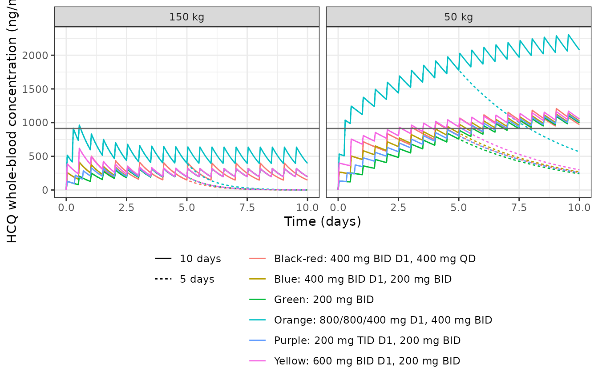
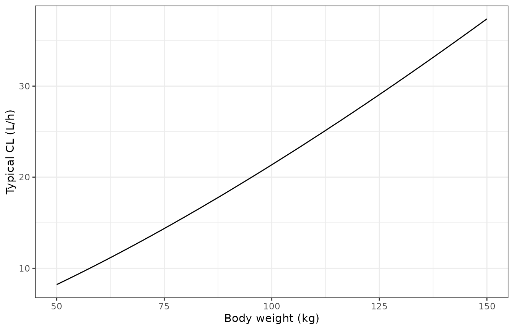
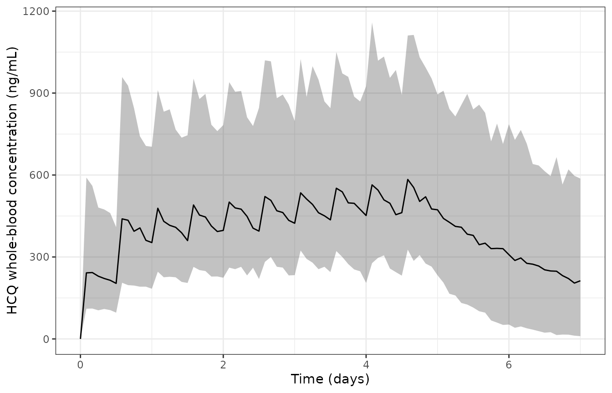

# Hydroxychloroquine in COVID-19 (Themans 2020)

## Model and source

- Citation: Themans P, Belkhir L, Dauby N, Yombi JC, De Greef J,
  Delongie KA, Vandeputte M, Nasreddine R, Wittebole X, Wuillaume F,
  Lescrainier C, Verlinden V, Kiridis S, Dogne JM, Hamdani J, Wallemacq
  P, Musuamba FT. Population Pharmacokinetics of Hydroxychloroquine in
  COVID-19 Patients: Implications for Dose Optimization. Eur J Drug
  Metab Pharmacokinet. 2020;45:703-713.
  <doi:10.1007/s13318-020-00648-y>. PMCID PMC7511144.
- Description: One-compartment first-order-absorption population PK
  model for oral hydroxychloroquine (HCQ) whole-blood concentrations in
  48 hospitalised adult COVID-19 patients from two Belgian tertiary
  hospitals, with bioavailability fixed at 0.746 from Carmichael 2003
  and a power (allometric-type) body-weight effect on clearance (Themans
  2020).
- Article: <https://doi.org/10.1007/s13318-020-00648-y>

## Population

Themans 2020 modelled 84 whole-blood hydroxychloroquine (HCQ)
concentrations from hospitalised adults with COVID-19 at two tertiary
hospitals in Brussels, Belgium (Section 2.1 and Table 1). The
model-building dataset had 48 patients: 33 from an open-label single-arm
study (Eudract 2020-001434-35) and 15 treated as standard of care. Eight
more standard-of-care patients were held out for external validation.
The model-building cohort was 26 male and 22 female, with median age
58.5 years (range 21-93) and median weight 80 kg (range 50-122; two
missing values were imputed to the median). Patients received the
Belgian national protocol: 400 mg HCQ sulfate twice daily on day 1, then
200 mg twice daily for a 5-day course. Plaquenil 200 mg sulfate tablets
contain 155 mg HCQ base. Sampling was sparse: one opportunistic sample
within 4 h of a dose, and one at the end of treatment.

## Source trace

| Element | Value | Source |
|----|----|----|
| Structure | 1-compartment, first-order absorption and elimination, no lag | Results paragraph 1 |
| `lka` | log(9.3) 1/h | Table 2 |
| `lcl` | log(15.7) L/h at 80 kg | Table 2 |
| `lvc` | log(860.8) L | Table 2 |
| `lfdepot` | fixed(log(0.746)) | Table 2 (fixed, from Carmichael 2003) |
| `e_wt_cl` | 1.38 | Table 2 ‘WT effect on CL’ |
| WT form | `CL * (WT/COV_POP)^theta2 * exp(eta)` | Eq. 1 |
| COV_POP | 80 kg (not printed) | Table 1 median; checked against Table S1 below |
| `etalcl` | 0.15 | Table 2 omega^2 |
| `etalvc` | 0.27 | Table 2 omega^2 |
| `propSd` | sqrt(0.029) = 0.1703 | Table 2 sigma^2 |
| Dose unit | mg HCQ base | Section 2.1; checked against Table S1 below |
| Observation | whole blood, ng/mL | Section 2.2 |

``` r

mod <- readModelDb("Themans_2020_hydroxychloroquine")
mod_typ <- rxode2::zeroRe(mod)
#> ℹ parameter labels from comments will be replaced by 'label()'
```

## Dosing regimens

The regimens in Figure 5 and Supplementary Table S1 are written as mg
HCQ sulfate. They are converted to mg base (x 155/200) for the model.

``` r

salt_to_base <- 155 / 200

# Day-1 loading doses (times in h, amounts in mg sulfate), then maintenance
# from 24 h at `md` mg every `tau` h until the end of treatment.
regimen_table <- tibble::tribble(
  ~regimen, ~ld_times, ~ld_amts, ~md, ~tau,
  "Blue: 400 mg BID D1, 200 mg BID", c(0, 12), c(400, 400), 200, 12,
  "Orange: 800/800/400 mg D1, 400 mg BID", c(0, 6, 12), c(800, 800, 400), 400, 12,
  "Yellow: 600 mg BID D1, 200 mg BID", c(0, 12), c(600, 600), 200, 12,
  "Purple: 200 mg TID D1, 200 mg BID", c(0, 8, 16), c(200, 200, 200), 200, 12,
  "Green: 200 mg BID", c(0, 12), c(200, 200), 200, 12,
  "Black-red: 400 mg BID D1, 400 mg QD", c(0, 12), c(400, 400), 400, 24
)

dose_schedule <- function(i, days) {
  r <- regimen_table[i, ]
  mt <- seq(24, 24 * days - 1, by = r$tau)
  data.frame(
    time = c(r$ld_times[[1]], mt),
    amt = salt_to_base * c(r$ld_amts[[1]], rep(r$md, length(mt)))
  )
}
```

## Typical-value profiles (Figure 5)

``` r

obs_times <- seq(0, 240, by = 1)
fig5 <- list()
for (i in seq_len(nrow(regimen_table))) {
  for (days in c(5, 10)) {
    for (wt in c(50, 150)) {
      d <- dose_schedule(i, days)
      ev <- dplyr::bind_rows(
        data.frame(id = 1L, time = d$time, amt = d$amt, evid = 1L, cmt = "depot"),
        data.frame(id = 1L, time = obs_times, amt = 0, evid = 0L, cmt = "central")
      ) |>
        dplyr::arrange(time, dplyr::desc(evid)) |>
        dplyr::mutate(WT = wt)
      s <- as.data.frame(rxode2::rxSolve(mod_typ, ev, returnType = "data.frame"))
      fig5[[length(fig5) + 1]] <- data.frame(
        time = s$time, Cc = s$Cc, WT = paste(wt, "kg"),
        regimen = regimen_table$regimen[i], duration = paste(days, "days")
      )
    }
  }
}
#> ℹ omega/sigma items treated as zero: 'etalcl', 'etalvc'
#> ℹ omega/sigma items treated as zero: 'etalcl', 'etalvc'
#> ℹ omega/sigma items treated as zero: 'etalcl', 'etalvc'
#> ℹ omega/sigma items treated as zero: 'etalcl', 'etalvc'
#> ℹ omega/sigma items treated as zero: 'etalcl', 'etalvc'
#> ℹ omega/sigma items treated as zero: 'etalcl', 'etalvc'
#> ℹ omega/sigma items treated as zero: 'etalcl', 'etalvc'
#> ℹ omega/sigma items treated as zero: 'etalcl', 'etalvc'
#> ℹ omega/sigma items treated as zero: 'etalcl', 'etalvc'
#> ℹ omega/sigma items treated as zero: 'etalcl', 'etalvc'
#> ℹ omega/sigma items treated as zero: 'etalcl', 'etalvc'
#> ℹ omega/sigma items treated as zero: 'etalcl', 'etalvc'
#> ℹ omega/sigma items treated as zero: 'etalcl', 'etalvc'
#> ℹ omega/sigma items treated as zero: 'etalcl', 'etalvc'
#> ℹ omega/sigma items treated as zero: 'etalcl', 'etalvc'
#> ℹ omega/sigma items treated as zero: 'etalcl', 'etalvc'
#> ℹ omega/sigma items treated as zero: 'etalcl', 'etalvc'
#> ℹ omega/sigma items treated as zero: 'etalcl', 'etalvc'
#> ℹ omega/sigma items treated as zero: 'etalcl', 'etalvc'
#> ℹ omega/sigma items treated as zero: 'etalcl', 'etalvc'
#> ℹ omega/sigma items treated as zero: 'etalcl', 'etalvc'
#> ℹ omega/sigma items treated as zero: 'etalcl', 'etalvc'
#> ℹ omega/sigma items treated as zero: 'etalcl', 'etalvc'
#> ℹ omega/sigma items treated as zero: 'etalcl', 'etalvc'
fig5 <- dplyr::bind_rows(fig5)

ggplot(fig5, aes(time / 24, Cc, colour = regimen, linetype = duration)) +
  geom_line() +
  geom_hline(yintercept = 0.72 / 0.5 / 0.53 * 335.87, colour = "grey40") +
  facet_wrap(~WT) +
  labs(x = "Time (days)", y = "HCQ whole-blood concentration (ng/mL)", colour = NULL, linetype = NULL) +
  theme_bw() +
  theme(legend.position = "bottom", legend.direction = "vertical")
```



Replicates the median curves of Figure 5 of Themans 2020 (typical
values; the grey line is the whole-blood target from the Yao EC50,
derived below).

## Clearance versus weight (Figure 4)

``` r

wt_grid <- seq(50, 150, by = 1)
ggplot(data.frame(WT = wt_grid, CL = 15.7 * (wt_grid / 80)^1.38), aes(WT, CL)) +
  geom_line() +
  labs(x = "Body weight (kg)", y = "Typical CL (L/h)") +
  theme_bw()
```



Typical-value counterpart of the post hoc clearances in Figure 4.

## Reproducing Supplementary Table S1

Table S1 reports the percentage of simulated 50 kg and 150 kg patients
whose whole-blood concentration at the end of treatment exceeds a
target. For the Yao EC50 (0.72 uM), the paper scales the free plasma
EC50 to total whole blood with 50% protein binding and a
serum/whole-blood ratio of 0.53 (Discussion). With the HCQ base molar
mass of 335.87 g/mol this gives 0.72 / 0.5 / 0.53 x 335.87 = 913 ng/mL.
The Liu EC50 (4.51 uM) gives about 5700 ng/mL, and every cell for it is
0% in the paper.

The paper used 1000 Monte Carlo subjects per scenario. Here the
probability is computed deterministically instead: a quantile grid over
`etalcl` and `etalvc`, closed-form one-compartment superposition, and
the proportional residual error integrated analytically. First, the
closed form is checked against `rxSolve()`.

``` r

conc_closed <- function(t, dosing, cl, v, ka = 9.3, f = 0.746) {
  k <- cl / v
  out <- 0
  for (j in seq_len(nrow(dosing))) {
    dt <- t - dosing$time[j]
    if (dt > 0) {
      out <- out + 1000 * f * dosing$amt[j] * ka / (v * (ka - k)) * (exp(-k * dt) - exp(-ka * dt))
    }
  }
  out
}

chk <- fig5 |>
  dplyr::filter(WT == "50 kg", duration == "5 days", time %in% c(6, 50, 120, 200)) |>
  dplyr::mutate(
    i = match(regimen, regimen_table$regimen),
    closed = mapply(function(tt, ii) conc_closed(tt, dose_schedule(ii, 5), 15.7 * (50 / 80)^1.38, 860.8), time, i)
  )
stopifnot(all(abs(chk$Cc / chk$closed - 1) < 1e-4))
```

``` r

target_yao <- 0.72 / 0.5 / 0.53 * 335.87
k_grid <- 150
z <- stats::qnorm((seq_len(k_grid) - 0.5) / k_grid)
grid <- expand.grid(zcl = z, zv = z)

pta <- function(i, days, wt, wt_ref = 80, dose_factor = 1) {
  d <- dose_schedule(i, days)
  d$amt <- d$amt * dose_factor
  cl <- 15.7 * (wt / wt_ref)^1.38 * exp(sqrt(0.15) * grid$zcl)
  v <- 860.8 * exp(sqrt(0.27) * grid$zv)
  cc <- conc_closed(24 * days, d, cl, v)
  # P(cc * (1 + eps) > target), eps ~ N(0, 0.029)
  100 * mean(1 - stats::pnorm((target_yao / cc - 1) / sqrt(0.029)))
}

published <- tibble::tribble(
  ~i, ~days, ~pub50, ~pub150,
  1, 5, 34.4, 0, 1, 10, 55.8, 0.1,
  2, 5, 93.3, 2.7, 2, 10, 96.1, 3.4,
  3, 5, 43.3, 0, 3, 10, 57.9, 0.1,
  4, 5, 29.2, 0, 4, 10, 54.3, 0.1,
  5, 5, 21.7, 0, 5, 10, 50.1, 0,
  6, 5, 28.7, 0, 6, 10, 48.9, 0.1
)

s1 <- published |>
  dplyr::rowwise() |>
  dplyr::mutate(
    sim50 = pta(i, days, 50),
    sim150 = pta(i, days, 150),
    sim50_ref70 = pta(i, days, 50, wt_ref = 70),
    sim50_salt = pta(i, days, 50, dose_factor = 1 / salt_to_base)
  ) |>
  dplyr::ungroup() |>
  dplyr::mutate(regimen = regimen_table$regimen[i])

s1 |>
  dplyr::select(regimen, days, pub50, sim50, pub150, sim150, sim50_ref70, sim50_salt) |>
  dplyr::rename(
    "Regimen" = regimen, "Days" = days,
    "50 kg, paper (%)" = pub50, "50 kg, model (%)" = sim50,
    "150 kg, paper (%)" = pub150, "150 kg, model (%)" = sim150,
    "50 kg, WT/70 (%)" = sim50_ref70, "50 kg, salt dose (%)" = sim50_salt
  ) |>
  knitr::kable(digits = 1)
```

| Regimen | Days | 50 kg, paper (%) | 50 kg, model (%) | 150 kg, paper (%) | 150 kg, model (%) | 50 kg, WT/70 (%) | 50 kg, salt dose (%) |
|:---|---:|---:|---:|---:|---:|---:|---:|
| Blue: 400 mg BID D1, 200 mg BID | 5 | 34.4 | 32.0 | 0.0 | 0.0 | 21.4 | 58.5 |
| Blue: 400 mg BID D1, 200 mg BID | 10 | 55.8 | 52.9 | 0.1 | 0.0 | 37.4 | 76.4 |
| Orange: 800/800/400 mg D1, 400 mg BID | 5 | 93.3 | 92.7 | 2.7 | 3.4 | 87.1 | 98.1 |
| Orange: 800/800/400 mg D1, 400 mg BID | 10 | 96.1 | 96.2 | 3.4 | 3.9 | 91.4 | 99.0 |
| Yellow: 600 mg BID D1, 200 mg BID | 5 | 43.3 | 41.8 | 0.0 | 0.0 | 29.3 | 68.0 |
| Yellow: 600 mg BID D1, 200 mg BID | 10 | 57.9 | 55.9 | 0.1 | 0.0 | 40.1 | 78.3 |
| Purple: 200 mg TID D1, 200 mg BID | 5 | 29.2 | 27.4 | 0.0 | 0.0 | 18.0 | 53.4 |
| Purple: 200 mg TID D1, 200 mg BID | 10 | 54.3 | 51.4 | 0.1 | 0.0 | 36.2 | 75.4 |
| Green: 200 mg BID | 5 | 21.7 | 22.5 | 0.0 | 0.0 | 14.4 | 47.3 |
| Green: 200 mg BID | 10 | 50.1 | 49.7 | 0.0 | 0.0 | 34.8 | 74.2 |
| Black-red: 400 mg BID D1, 400 mg QD | 5 | 28.7 | 26.7 | 0.0 | 0.0 | 16.8 | 52.4 |
| Black-red: 400 mg BID D1, 400 mg QD | 10 | 48.9 | 46.5 | 0.1 | 0.0 | 31.2 | 70.4 |

``` r


stopifnot(
  # Monte Carlo noise on the paper's 1000-subject estimates is about 1.5
  # percentage points; the deterministic model values sit within 3.
  max(abs(s1$sim50 - s1$pub50)) < 4,
  max(abs(s1$sim150 - s1$pub150)) < 4,
  # The two alternatives are rejected: centring on 70 kg or dosing in mg
  # sulfate both miss the 5-day blue cell by more than 10 points.
  abs(s1$sim50_ref70[1] - s1$pub50[1]) > 10,
  abs(s1$sim50_salt[1] - s1$pub50[1]) > 10
)
```

The model reproduces all 24 Table S1 cells for the Yao target within 3
percentage points. The last two columns show why the reference weight is
80 kg and why the dose is in mg HCQ base. Centring on 70 kg lowers the
50 kg probabilities by 5 to 18 points. Dosing the sulfate amount raises
them by 20 to 26 points, except for the orange regimen, which is already
close to 100%. Centring on 81.5 kg (the median of all 56 patients)
cannot be told apart from 80 kg at this precision. 80 kg is used because
it is the model-building median and the weight split in Figures 2, 6 and
S1.

## Stochastic cohort under the Belgian protocol

``` r

rxode2::rxSetSeed(20200923)
n_sub <- 200
wt <- numeric(0)
while (length(wt) < n_sub) {
  draw <- stats::rlnorm(n_sub, log(80), 0.22)
  wt <- c(wt, draw[draw >= 50 & draw <= 122])
}
wt <- wt[seq_len(n_sub)]

d <- dose_schedule(1, 5)
ev_vpc <- dplyr::bind_rows(lapply(seq_len(n_sub), function(id) {
  dplyr::bind_rows(
    data.frame(id = id, time = d$time, amt = d$amt, evid = 1L, cmt = "depot"),
    data.frame(id = id, time = seq(0, 168, by = 2), amt = 0, evid = 0L, cmt = "central")
  ) |>
    dplyr::mutate(WT = wt[id])
})) |>
  dplyr::arrange(id, time, dplyr::desc(evid))

sim_vpc <- as.data.frame(rxode2::rxSolve(mod, ev_vpc, returnType = "data.frame"))
#> ℹ parameter labels from comments will be replaced by 'label()'

sim_vpc |>
  dplyr::group_by(time) |>
  dplyr::summarise(
    p05 = stats::quantile(sim, 0.05), p50 = stats::median(sim), p95 = stats::quantile(sim, 0.95)
  ) |>
  ggplot(aes(time / 24)) +
  geom_ribbon(aes(ymin = p05, ymax = p95), alpha = 0.3) +
  geom_line(aes(y = p50)) +
  labs(x = "Time (days)", y = "HCQ whole-blood concentration (ng/mL)") +
  theme_bw()
```



Median and 90% prediction interval for 200 virtual patients (weight
50-122 kg, centred at 80 kg) on the Belgian protocol. It is the
model-side counterpart of Figure 3 and Figure S1.

## PKNCA validation

A single 200 mg sulfate (155 mg base) dose is simulated for typical
patients of 50, 80 and 150 kg. For a one-compartment model, AUC0-inf
must equal F x Dose / CL and the half-life must equal ln(2) x V / CL.

``` r

wts <- c(50, 80, 150)
# Sample each weight out to 10 typical half-lives; beyond that the
# concentrations are solver noise and spoil the lambda-z fit.
t_end <- 10 * log(2) * 860.8 / (15.7 * (wts / 80)^1.38)
ev_nca <- dplyr::bind_rows(lapply(seq_along(wts), function(id) {
  t_nca <- c(0, 0.1, 0.25, 0.5, 1, 2, 4, 8, 12, seq(24, t_end[id], length.out = 40))
  dplyr::bind_rows(
    data.frame(id = id, time = 0, amt = 155, evid = 1L, cmt = "depot"),
    data.frame(id = id, time = t_nca, amt = 0, evid = 0L, cmt = "central")
  ) |>
    dplyr::mutate(WT = wts[id])
}))
sim_nca <- as.data.frame(rxode2::rxSolve(mod_typ, ev_nca, returnType = "data.frame", keep = "WT")) |>
  dplyr::mutate(treatment = paste(WT, "kg"))
#> ℹ omega/sigma items treated as zero: 'etalcl', 'etalvc'
#> Warning: multi-subject simulation without without 'omega'

conc_obj <- PKNCA::PKNCAconc(dplyr::filter(sim_nca, !is.na(Cc)), Cc ~ time | treatment + id)
dose_obj <- PKNCA::PKNCAdose(
  dplyr::distinct(sim_nca, id, treatment) |> dplyr::mutate(time = 0, amt = 155),
  amt ~ time | treatment + id
)
intervals <- data.frame(start = 0, end = Inf, cmax = TRUE, tmax = TRUE, aucinf.obs = TRUE, half.life = TRUE)
nca <- PKNCA::pk.nca(PKNCA::PKNCAdata(conc_obj, dose_obj, intervals = intervals))

nca_wide <- as.data.frame(nca$result) |>
  dplyr::filter(PPTESTCD %in% c("cmax", "tmax", "aucinf.obs", "half.life")) |>
  dplyr::select(treatment, PPTESTCD, PPORRES) |>
  tidyr::pivot_wider(names_from = PPTESTCD, values_from = PPORRES) |>
  dplyr::mutate(
    WT = as.numeric(sub(" kg", "", treatment)),
    cl = 15.7 * (WT / 80)^1.38,
    auc_theory = 1000 * 0.746 * 155 / cl,
    thalf_theory = log(2) * 860.8 / cl
  )

nca_wide |>
  dplyr::select(treatment, cmax, tmax, aucinf.obs, auc_theory, half.life, thalf_theory) |>
  dplyr::rename(
    "Weight" = treatment, "Cmax (ng/mL)" = cmax, "Tmax (h)" = tmax,
    "AUC0-inf (ng*h/mL)" = aucinf.obs, "F*Dose/CL" = auc_theory,
    "t1/2 (h)" = half.life, "ln2*V/CL" = thalf_theory
  ) |>
  knitr::kable(digits = 1)
```

| Weight | Cmax (ng/mL) | Tmax (h) | AUC0-inf (ng\*h/mL) | F\*Dose/CL | t1/2 (h) | ln2\*V/CL |
|:-------|-------------:|---------:|--------------------:|-----------:|---------:|----------:|
| 150 kg |        130.8 |      0.5 |              3091.3 |     3093.4 |     16.0 |      16.0 |
| 50 kg  |        133.2 |      1.0 |             14086.2 |    14088.2 |     72.7 |      72.7 |
| 80 kg  |        132.1 |      1.0 |              7362.9 |     7365.0 |     38.0 |      38.0 |

``` r


stopifnot(
  all(abs(nca_wide$aucinf.obs / nca_wide$auc_theory - 1) < 0.02),
  all(abs(nca_wide$half.life / nca_wide$thalf_theory - 1) < 0.02)
)
```

The paper reports no NCA values, so the check is against the model’s own
closed-form identities.

## Assumptions and deviations

- **Reference weight.** Eq. 1 centres weight on a “population typical
  value” that is not printed. 80 kg is used: the model-building median
  (Table 1) and the weight split in the paper’s figures. Supplementary
  Table S1 is reproduced with 80 kg and rejects 70 kg (see above). The
  paper’s code was deposited in the DDMoRe Model Repository
  (DDMODEL00000322), which was unavailable when checked on 2026-09-27.
- **Dose units.** Doses enter the model as mg HCQ base (200 mg sulfate =
  155 mg base), which reproduces Table S1. Dosing the sulfate amount
  does not.
- **Bioavailability.** Table 2 gives F = 0.746 (fixed); the abstract
  rounds it to 0.74. 0.746 is used, the Carmichael 2003 value it was
  taken from.
- **Yellow regimen.** Table S1 labels the day-1 dose as 600 mg TID,
  while the Figure 5 caption says 600 mg BID. The BID reading reproduces
  Table S1 (model 41.8% and 55.9% against the paper’s 43.3% and 57.9%
  for 50 kg); TID gives 56% for 5 days.
- **Target concentration.** The Table S1 target was re-derived from the
  Discussion’s scaling (50% protein binding, serum/whole-blood ratio
  0.53) and the HCQ base molar mass; the paper does not print the
  resulting value.
- **Time of the target check.** “At the end of the treatment” is read as
  24 x (number of days) hours after the first dose.
- **Covariates not retained.** Sex (correlated with weight) and age were
  tested on clearance but are not in the final model.
