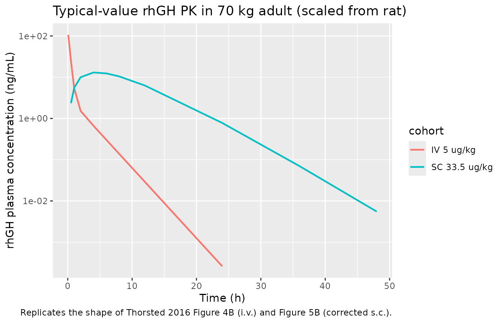
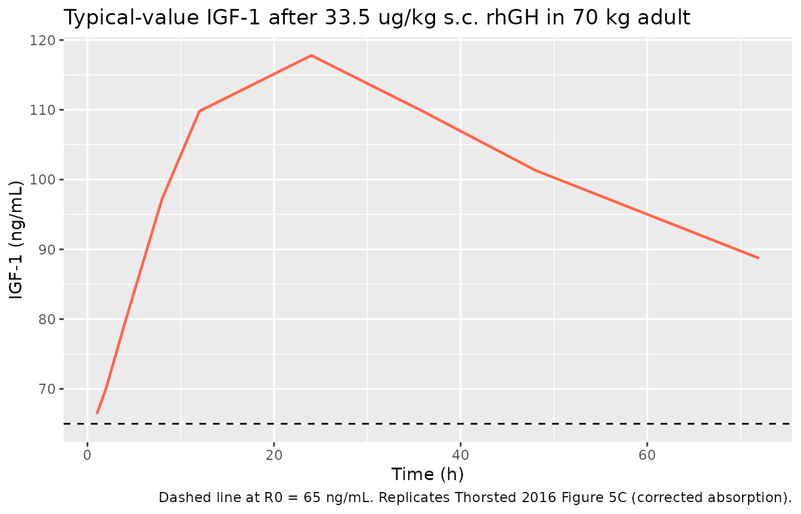

# Somatropin / rhGH translational human (Thorsted 2016)

## Model and source

``` r

mod <- readModelDb("Thorsted_2016_somatropin_human")
ui  <- rxode2::rxode(mod)
#> ℹ parameter labels from comments will be replaced by 'label()'
cat(ui$reference, sep = "\n")
#> Thorsted A, Thygesen P, Agerso H, Laursen T, Kreilgaard M. Translational mixed-effects PKPD modelling of recombinant human growth hormone - from hypophysectomized rat to patients. Br J Pharmacol. 2016 Jun;173(11):1742-55. doi:10.1111/bph.13473. Parameters scaled from the rat fit; see also modellib('Thorsted_2016_somatropin_rat').
```

- Description: Translational (allometrically-scaled rat-to-human)
  population PKPD model for recombinant human growth hormone (rhGH /
  somatropin) in growth-hormone-deficient adult males. Structural
  parameter values are derived from the Thorsted 2016
  hypophysectomized-rat PKPD fit by allometric scaling to a 70 kg
  reference subject (Table 3 of the source paper): clearance terms
  (CL, Q) and Vmax with exponent 0.75; distribution volumes (Vc, Vp)
  with exponent 0.9 (the empirically-selected best-fit exponent for
  human i.v. data); first-order absorption rate constants (ka1, ka2) and
  kout with exponent -0.25; KM unscaled; Emax and EC50 unscaled. The
  s.c. absorption model is the corrected form (Table 3 / Figure 5):
  bioavailability of the ka2 path reduced from 0.833 (rat) to 0.500, and
  one transit compartment added to the ka1 path. The IGF-1 indirect
  response uses kin = kout \* R0 with R0 fixed to 65 ng/mL (human
  population mean per Laursen 1996) and is driven directly by plasma
  rhGH (no effect-delay chain - the rat CPLAG chain is intentionally
  dropped for the human prediction). Bodyweight gain is not included in
  the human model. Variability is inherited from the rat PKPD fit;
  residual error is fixed at the values used for the human-simulation
  validation (Methods).
- Article: [Br J Pharmacol
  173(11):1742-55](https://doi.org/10.1111/bph.13473)

This is the translational (allometrically-scaled rat-to-human) companion
model to `Thorsted_2016_somatropin_rat`. Parameter values are obtained
from the rat fit by scaling clearances and Vmax with exponent 0.75,
distribution volumes with exponent 0.9 (the empirically-selected
best-fit exponent for human i.v. data per Thorsted 2016 Figure 4), and
first-order absorption / IGF-1 turnover rate constants with exponent
-0.25, around a reference adult body weight of 70 kg (Thorsted 2016
Table 3). The s.c. absorption model is the corrected form (F2 reduced
from 0.833 to 0.500 and a transit compartment added to the ka1 path;
Thorsted 2016 Figure 5 narrative). The GH effect-delay (CPLAG) chain is
intentionally dropped for the human prediction.

## Population

``` r

str(ui$population)
#> List of 9
#>  $ species       : chr "human"
#>  $ n_subjects    : int 10
#>  $ n_studies     : int 1
#>  $ age_range     : chr "Adult males (Laursen 1996 validation cohort)"
#>  $ weight_range  : chr "approximately 70 kg (Table 3 reference)"
#>  $ sex_female_pct: num 0
#>  $ disease_state : chr "Growth hormone deficient adult males withdrawn from rhGH treatment for 1 week to washout IGF-1 prior to study ("| __truncated__
#>  $ dose_range    : chr "5 ug/kg i.v. bolus and 33.5 ug/kg s.c. single doses (Laursen 1996 validation)"
#>  $ notes         : chr "Translational forward-simulation construct rather than a fit to human data: parameter values are obtained by al"| __truncated__
```

The translational target is a 70-kg GH-deficient adult male as described
in the Laursen 1996 validation cohort cited by Thorsted 2016 (10
patients, withdrawn from rhGH treatment for 1 week to washout IGF-1
prior to study, dosed at 5 ug/kg i.v. bolus and at 33.5 ug/kg s.c.). The
packaged model is intended for forward simulation rather than re-fitting
to human data.

## Source trace

| Equation / parameter | Rat value (Table 2) | Scaling | Human value (Table 3) | Source |
|----|----|----|----|----|
| CL | 0.0285 L/h | 0.75 | 3.88 L/h | Table 3 |
| Vmax | 11.5 ug/h | 0.75 | 1565 ug/h | Table 3 |
| KM | 358 ug/L | \- (not scaled, see Errata) | 358 ug/L | Table 3 (Methods text) |
| Vc | 0.0069 L | 0.9 | 2.51 L | Table 3 |
| Q | 0.0101 L/h | 0.75 | 1.37 L/h | Table 3 |
| Vp | 0.0081 L | 0.9 | 2.94 L | Table 3 |
| ka1 | 3.02 1/h | -0.25 | 0.587 1/h | Table 3 |
| ka2 | 1.22 1/h | -0.25 | 0.237 1/h | Table 3 |
| F1 | 0.0316 | \- | 0.0316 | Table 3 (kept as in rat) |
| F2 | 0.833 | corrected to 0.500 | 0.500 | Results / Figure 5 narrative |
| kout | 0.0913 1/h | -0.25 | 0.0178 1/h | Table 3 |
| R0 | 29.4 ng/mL | fixed to human pop mean | 65 ng/mL | Table 3 / Methods (Laursen 1996) |
| Emax | 9.88 | \- | 9.88 | Table 3 |
| EC50 | 16.3 ug/L | \- | 16.3 ug/L | Table 3 |
| GH effect-delay chain | active in rat | dropped | not present | Methods (Prediction of human PKPD) |
| Proportional residual error (PK) | 0.233 | fixed at 0.25 | 0.25 | Methods |
| Additive residual SD (PK) | 0.279 ng/mL | fixed at 0.25 | 0.25 ng/mL | Methods |
| Additive residual SD (IGF-1) | 21.3 ng/mL | fixed at 10 | 10 ng/mL | Methods |
| IIV CL / Vp / ka2 / R0 | inherited from rat | inherited from rat | inherited from rat | Methods (variability as estimated in PKPD model) |

## Virtual cohort

``` r

set.seed(20260516)

ref_wt <- 70

make_sc_cohort <- function(n, dose_ug_per_kg, regimen_label, id_offset = 0L,
                           obs_grid = c(0, 0.5, 1, 2, 4, 6, 8, 12, 24, 36, 48)) {
  ids <- id_offset + seq_len(n)
  dose_amt <- dose_ug_per_kg * ref_wt
  doses_depot  <- tidyr::expand_grid(id = ids, time = 0, evid = 1,
                                     amt = dose_amt, cmt = "depot")
  doses_depot2 <- doses_depot |> dplyr::mutate(cmt = "depot2")
  obs <- tidyr::expand_grid(id = ids, time = obs_grid) |>
    dplyr::mutate(evid = 0, amt = 0, cmt = "Cc")
  events <- dplyr::bind_rows(doses_depot, doses_depot2, obs) |>
    dplyr::arrange(id, time, evid) |>
    dplyr::mutate(WT = ref_wt, cohort = regimen_label)
  events
}

make_iv_cohort <- function(n, dose_ug_per_kg, regimen_label, id_offset = 0L,
                           obs_grid = c(0, 0.08, 0.17, 0.33, 0.5, 1, 2, 4, 6,
                                        8, 12, 24)) {
  ids <- id_offset + seq_len(n)
  dose_amt <- dose_ug_per_kg * ref_wt
  doses <- tidyr::expand_grid(id = ids, time = 0, evid = 1,
                              amt = dose_amt, cmt = "central")
  obs <- tidyr::expand_grid(id = ids, time = obs_grid) |>
    dplyr::mutate(evid = 0, amt = 0, cmt = "Cc")
  events <- dplyr::bind_rows(doses, obs) |>
    dplyr::arrange(id, time, evid) |>
    dplyr::mutate(WT = ref_wt, cohort = regimen_label)
  events
}

events <- dplyr::bind_rows(
  make_iv_cohort(20,   5, "IV 5 ug/kg",     id_offset =   0L),
  make_sc_cohort(20, 33.5, "SC 33.5 ug/kg", id_offset = 100L)
)

stopifnot(!anyDuplicated(unique(events[, c("id", "time", "evid", "cmt")])))
```

## Typical-value simulation

``` r

mod_typ <- rxode2::zeroRe(mod)
#> ℹ parameter labels from comments will be replaced by 'label()'
sim_typ <- rxode2::rxSolve(mod_typ, events = events,
                           keep = c("cohort", "WT")) |>
  as.data.frame()
#> ℹ omega/sigma items treated as zero: 'etalcl', 'etalvp', 'etalka2', 'etalrbase'
#> Warning: multi-subject simulation without without 'omega'
```

``` r

sim_typ |>
  dplyr::filter(time > 0) |>
  dplyr::distinct(cohort, time, .keep_all = TRUE) |>
  ggplot(aes(time, Cc, colour = cohort)) +
  geom_line(size = 0.8) +
  scale_y_log10() +
  labs(x = "Time (h)", y = "rhGH plasma concentration (ng/mL)",
       title = "Typical-value rhGH PK in 70 kg adult (scaled from rat)",
       caption = "Replicates the shape of Thorsted 2016 Figure 4B (i.v.) and Figure 5B (corrected s.c.).")
#> Warning: Using `size` aesthetic for lines was deprecated in ggplot2 3.4.0.
#> ℹ Please use `linewidth` instead.
#> This warning is displayed once per session.
#> Call `lifecycle::last_lifecycle_warnings()` to see where this warning was
#> generated.
```



## IGF-1 induction after a single SC dose

``` r

events_pd <- make_sc_cohort(
  n = 10, dose_ug_per_kg = 33.5, regimen_label = "SC 33.5 ug/kg",
  id_offset = 500L,
  obs_grid = c(0, 1, 2, 4, 8, 12, 24, 36, 48, 72)
)
sim_pd <- rxode2::rxSolve(mod_typ, events = events_pd,
                          keep = c("cohort", "WT")) |>
  as.data.frame()
#> ℹ omega/sigma items treated as zero: 'etalcl', 'etalvp', 'etalka2', 'etalrbase'
#> Warning: multi-subject simulation without without 'omega'
```

``` r

sim_pd |>
  dplyr::filter(time > 0) |>
  dplyr::distinct(time, .keep_all = TRUE) |>
  ggplot(aes(time, IGF1)) +
  geom_line(size = 0.8, colour = "tomato") +
  geom_hline(yintercept = 65, linetype = "dashed") +
  labs(x = "Time (h)", y = "IGF-1 (ng/mL)",
       title = "Typical-value IGF-1 after 33.5 ug/kg s.c. rhGH in 70 kg adult",
       caption = "Dashed line at R0 = 65 ng/mL. Replicates Thorsted 2016 Figure 5C (corrected absorption).")
```



## NCA validation of rhGH after i.v. dosing

``` r

sim_nca <- sim_typ |>
  dplyr::filter(grepl("^IV ", cohort)) |>
  dplyr::select(id, time, Cc, cohort)

dose_df <- events |>
  dplyr::filter(evid == 1, grepl("^IV ", cohort)) |>
  dplyr::select(id, time, amt, cohort)

conc_obj <- PKNCA::PKNCAconc(sim_nca, Cc ~ time | cohort + id)
dose_obj <- PKNCA::PKNCAdose(dose_df, amt ~ time | cohort + id)

intervals <- data.frame(
  start      = 0,
  end        = 24,
  cmax       = TRUE,
  tmax       = TRUE,
  aucinf.obs = TRUE,
  half.life  = TRUE
)

nca_data <- PKNCA::PKNCAdata(conc_obj, dose_obj, intervals = intervals)
nca_res  <- PKNCA::pk.nca(nca_data)
knitr::kable(summary(nca_res),
             caption = "Simulated NCA for rhGH after i.v. bolus (typical-value 70 kg adult).")
```

| start | end | cohort | N | cmax | tmax | half.life | aucinf.obs |
|---:|---:|:---|:---|:---|:---|:---|:---|
| 0 | 24 | IV 5 ug/kg | 20 | 139 \[0.000\] | 0.000 \[0.000, 0.000\] | 1.76 \[0.000\] | 46.5 \[0.000\] |

Simulated NCA for rhGH after i.v. bolus (typical-value 70 kg adult).
{.table}

## Assumptions and deviations

- **Translational, not fitted.** This model is a forward simulation
  construct built by allometrically scaling the rat fit. It is not a fit
  to human data. Residual error parameters are fixed at the values used
  by Thorsted 2016 for the human-simulation validation (Methods), not
  estimated.

- **KM = 358 ug/L (text) versus 403 ug/L (Table 3).** Thorsted 2016
  Methods (Prediction of human PKPD) state: “The constant KM was not
  scaled.” Table 3 column “Predicted” reports KM = 403 ug/L for the
  human-scaled model, which is internally inconsistent with the text (no
  scaling exponent should leave the value unchanged at 358). The
  packaged model uses the text-consistent value 358; treat this as a
  minor typographic discrepancy in Table 3.

- **ka2 IIV = 9.3% CV (Table 2) versus 19.3% (Table 3).** Thorsted 2016
  Methods state that the human-prediction variability is “as estimated
  in the PKPD model” (i.e., inherited unchanged from the rat fit). Table
  2 reports rat ka2 IIV at 9.3% CV; Table 3 reports human ka2 IIV at
  19.3%, inconsistent with the text. The packaged model uses 9.3%
  (Table 2) for both rat and human.

- **GH effect-delay (CPLAG) chain dropped for human prediction.** The
  rat IGF-1 response is delayed by a three-compartment effect chain
  feeding the Emax stimulation; Thorsted 2016 explicitly drops this
  chain for the human prediction (Methods: “The effect delay for rats
  was not included for predictions, as patients had only been deprived
  of rhGH for 1 week in order to washout IGF-1”). The packaged human
  model therefore drives IGF-1 stimulation directly from plasma rhGH
  concentration.

- **Bodyweight gain dropped.** The rat model’s linear bodyweight gain
  driven by IGF-1 above baseline is not included in the human model,
  consistent with Thorsted 2016 (which uses bodyweight gain only as a
  preclinical efficacy biomarker, not a human end-point).

- **Parallel-absorption dosing convention.** SC doses require two event
  records per administration in user-supplied datasets (one with
  `cmt = "depot"` and one with `cmt = "depot2"`, same `amt`). IV doses
  use a single event with `cmt = "central"`.
