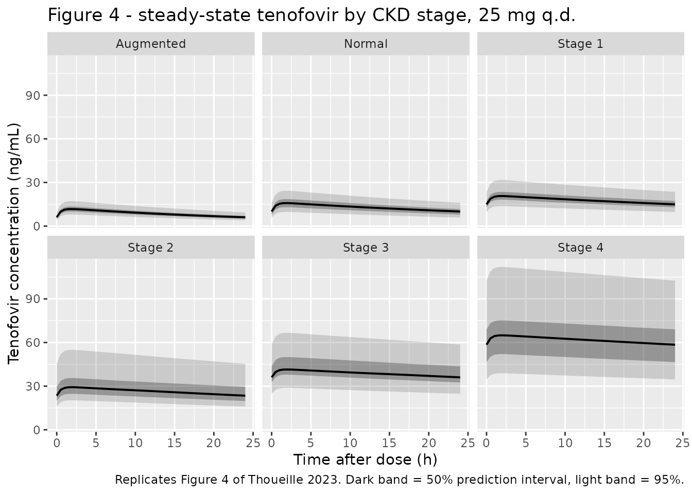
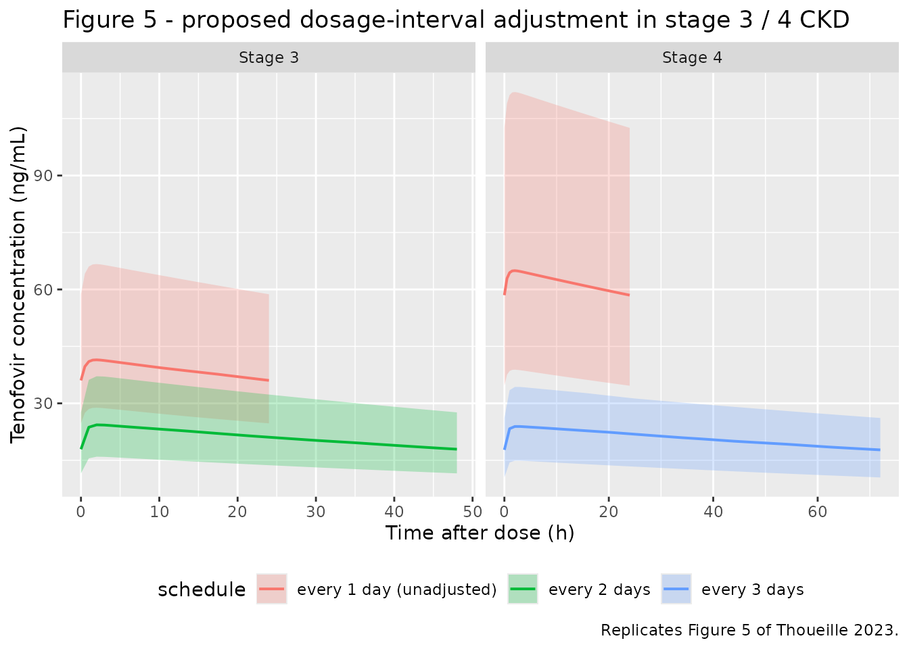
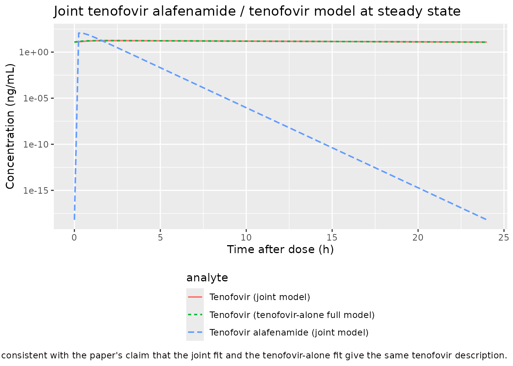

# Tenofovir after tenofovir alafenamide in chronic kidney disease (Thoueille 2023)

## Model and source

This paper reports three independently fitted, independently tabulated
final models, so it contributes three model files to `nlmixr2lib` and
this single vignette ties them together.

| Model file | Paper’s model | Parameter table |
|----|----|----|
| `Thoueille_2023_tenofovir_reduced` | Tenofovir alone, creatinine clearance only (“reduced model”) | Table S2 |
| `Thoueille_2023_tenofovir_full` | Tenofovir alone, full covariate model (“final model”) | Table 2 |
| `Thoueille_2023_tenofovir_alafenamide` | Tenofovir alafenamide and tenofovir fitted simultaneously | Table S3 |

- Citation: Thoueille P, Alves Saldanha S, Desfontaine V, Kusejko K,
  Courlet P, Andre P, Cavassini M, Decosterd LA, Buclin T, Guidi M, and
  the Swiss HIV Cohort Study. Population pharmacokinetic modelling to
  characterize the effect of chronic kidney disease on tenofovir
  exposure after tenofovir alafenamide administration. J Antimicrob
  Chemother. 2023;78:1433-1443. <doi:10.1093/jac/dkad103>
- Article: <https://doi.org/10.1093/jac/dkad103>
- Supplement: available as Supplementary data at *J Antimicrob
  Chemother* Online

Tenofovir alafenamide is a prodrug of tenofovir that is taken up into
cells and hydrolysed there, so the “absorption” step in these models
represents the combined sequence of intestinal absorption, cellular
uptake, intracellular conversion and release of tenofovir back into
plasma. The authors show that this combined step is rate limiting,
i.e. tenofovir displays flip-flop kinetics after tenofovir alafenamide
dosing.

The reduced model is the one the authors recommend for routine
therapeutic-drug-monitoring support, and every clinically relevant
simulation in the paper (Figure 4, Figure 5, Table 3) is generated from
it.

``` r

# Molar-mass constants. These are NOT from the paper -- the population analysis
# was run entirely in molar units (doses in nmol, concentrations in nmol/mL), so
# converting to the mass units used in the paper's own reported predictions
# (ng/mL, ng*h/mL) requires the molar masses. Values are the standard free-base
# molar masses (PubChem CID 9574768 for tenofovir alafenamide, CID 464205 for
# tenofovir).
MW_TAF <- 476.47 # g/mol, tenofovir alafenamide free base
MW_TFV <- 287.21 # g/mol, tenofovir free base

# Tenofovir alafenamide doses converted to nmol, exactly as the authors did.
dose_nmol <- function(mg) mg / MW_TAF * 1e6
DOSE_25 <- dose_nmol(25)
DOSE_10 <- dose_nmol(10)
c(`25 mg` = DOSE_25, `10 mg` = DOSE_10)
#>    25 mg    10 mg 
#> 52469.20 20987.68
```

## Population

The model-building dataset comprised 486 people living with HIV
contributing 793 tenofovir concentrations, drawn from Swiss HIV Cohort
Study project \#815 and from the Lausanne routine
therapeutic-drug-monitoring programme between January 2017 and January
2021 (Table 1). Median age was 51 years (range 19-79), median weight 74
kg (42-142), and 30% were female. Ethnicity was 71% White, 23% Black, 4%
Hispanic American and 2% Asian. Renal function spanned a wide range,
which is what makes the dataset informative about chronic kidney
disease: median Cockcroft-Gault creatinine clearance 93 mL/min with a
range of 33-203 mL/min, and median CKD-EPI eGFR 87 mL/min/1.73 m^2
(range 23-153).

Sampling was mostly sparse (one to two samples per subject),
supplemented by four subjects with detailed 0-24 h profiles. Steady
state was assumed for all individuals. Only 54 subjects contributed
tenofovir alafenamide measurements (Table S1); because tenofovir
alafenamide has a plasma half-life of roughly 0.5 h, only samples drawn
within 6 h of dosing were assayed for it, yielding 100 samples of which
47 were below the limit of quantification. A further 83 subjects (84
observations) formed an external validation set that was not used for
estimation; external validation of the tenofovir models gave a
non-significant mean prediction error of 3.6% (95% CI 0.2-7.1%) with a
precision of 17%.

The same information is available programmatically via each model’s
`population` metadata,
e.g. `readModelDb("Thoueille_2023_tenofovir_reduced")()$population`.

## Source trace

Per-parameter origins are recorded as in-file comments next to each
`ini()` entry in the three files under `inst/modeldb/specificDrugs/`.
Collected here for review.

### Reduced model (`Thoueille_2023_tenofovir_reduced`)

| Equation / parameter | Value | Source location |
|----|----|----|
| `lka` (fixed) | `log(2)` 1/h | Table S2, `k_a` = “2 FIX”; rationale in Methods, “Structural model” |
| `lcl` | `log(43.2)` L/h | Table S2, `CL_TFV` |
| `lvc` | `log(2330)` L | Table S2, `V_TFV` |
| `lfdepot` (fixed) | `log(1)` | Table S2, `F` = “1 FIX” |
| `e_crcl_cl` | 0.827 | Table S2, `theta_CLCR`; reference `CLCR_ref` = 100 mL/min (footnote) |
| `e_cobi_fdepot` | 1.11 | Table S2, `theta_Cobicistat` |
| `etalfdepot` | 0.0493852 | Table S2, BSV on `F` = 22.5% CV; `omega^2 = log(1 + CV^2)` |
| `addSd` | 0.0101 nmol/mL | Table S2, `sigma_add` |
| `TVCL_TFV = CL_TFV * (1 + theta_CLCR * (CLCR - 100) / 100)` | n/a | Table S2, “Reduced model:” equation |
| `TVF = 1 + theta_Cobicistat` | n/a | Table S2, “Reduced model:” equation |

### Full covariate model (`Thoueille_2023_tenofovir_full`)

| Equation / parameter | Value | Source location |
|----|----|----|
| `lka` (fixed) | `log(2)` 1/h | Table 2, `k_a` = “2 FIX” |
| `lcl` | `log(42.2)` L/h | Table 2, `CL_TFV` |
| `lvc` | `log(2390)` L | Table 2, `V_TFV` |
| `lfdepot` (fixed) | `log(1)` | Table 2, `F` = “1 FIX” |
| `e_crcl_cl` | 0.707 | Table 2, `theta_CLCR`; reference 100 mL/min |
| `e_age_cl` | -0.244 | Table 2, `theta_Age`; reference median 51 years |
| `e_race_black_hispanic_cl` | 0.119 | Table 2, `theta_Black or Hispano American` |
| `e_conmed_pgp_inh_cl` | -0.121 | Table 2, `theta_Potent P-gp inhibitors` |
| `e_cobi_fdepot` | 1.15 | Table 2, `theta_Cobicistat` |
| `etalfdepot` | 0.0435584 | Table 2, BSV on `F` = 21.1% CV |
| `addSd` | 0.0099 nmol/mL | Table 2, `sigma_add` |
| Four-way multiplicative covariate product on `CL_TFV` | n/a | Table 2, “Final model:” equation (identical form in Table S3) |

### Joint tenofovir alafenamide + tenofovir model (`Thoueille_2023_tenofovir_alafenamide`)

| Equation / parameter | Value | Source location |
|----|----|----|
| `lka` (fixed) | `log(2)` 1/h | Table S3, `k_12` = 2 (no RSE reported) |
| `lcl` (tenofovir alafenamide) | `log(211)` L/h | Table S3, `CL_TAF` |
| `lvc` (tenofovir alafenamide) | `log(49.8)` L | Table S3, `V_TAF` |
| `lcl_tfv` | `log(42.2)` L/h | Table S3, `CL_TFV` |
| `lvc_tfv` | `log(2380)` L | Table S3, `V_TFV` |
| `lfdepot` (fixed) | `log(1)` | Table S3, `F` = “1 FIX” |
| `e_crcl_cl_tfv` | 0.707 | Table S3, `theta_CLCR` |
| `e_age_cl_tfv` | -0.250 | Table S3, `theta_Age` |
| `e_race_black_hispanic_cl_tfv` | 0.122 | Table S3, `theta_Black or Hispano American` |
| `e_conmed_pgp_inh_cl_tfv` | -0.116 | Table S3, `theta_Potent P-gp inhibitors` |
| `e_cobi_fdepot` | 1.15 | Table S3, `theta_Cobicistat` |
| `etalfdepot` | 0.0439633 | Table S3, BSV on `F` = 21.2% CV |
| `etalcl` | 0.6252023 | Table S3, BSV on `CL_TAF` = 93.2% CV |
| `propSd` | 0.607 | Table S3, `sigma_propTAF` = 60.7 CV% |
| `addSd` | 2.35e-3 nmol/mL | Table S3, `sigma_addTAF` = 2.35x10^-3 |
| `addSd_tfv` | 9.92e-3 nmol/mL | Table S3, `sigma_addTFV` = 9.92x10^-3 |
| Complete irreversible conversion, so `k23 = CL_TAF / V_TAF` is the tenofovir input | n/a | Methods, “Structural model”; Figure 2 upper panel |

## Virtual cohort

Original observed data are not publicly available. The cohort below
reproduces the paper’s own simulation design (Methods, “Model-based
simulations”, and Supplementary “Simulations” item d): uniform
creatinine-clearance distributions within each chronic-kidney-disease
band, with the other covariates left at their reference values so that
the renal-function effect is isolated.

``` r

set.seed(20230412) # advance-access publication date

N_PER_ARM <- 100L # 12 arms; well under the 200-per-arm cap

ckd_bands <- tibble::tribble(
  ~stage,        ~crcl_lo, ~crcl_hi,
  "Augmented",      150,      200,
  "Normal",          90,      149,
  "Stage 1",         60,       89,
  "Stage 2",         30,       59,
  "Stage 3",         15,       29,
  "Stage 4",          1,       15
)

regimens <- tibble::tribble(
  ~regimen,            ~amt,     ~cobi,
  "25 mg q.d.",        DOSE_25,  0L,
  "10 mg q.d. + COBI", DOSE_10,  1L
)

obs_grid <- seq(0, 24, by = 0.5)

# One arm = one CKD band x one regimen. `id_offset` keeps subject IDs disjoint
# across arms; duplicate IDs would be silently merged by rxSolve into a single
# subject receiving the summed dose.
make_arm <- function(stage, crcl_lo, crcl_hi, regimen, amt, cobi, id_offset) {
  subj <- tibble::tibble(
    id = id_offset + seq_len(N_PER_ARM),
    CRCL = runif(N_PER_ARM, crcl_lo, crcl_hi),
    CONMED_COBICISTAT = cobi,
    # Reference values for the covariates the paper held aside in this
    # simulation (Supplementary "Simulations" item d).
    AGE = 51,
    RACE_BLACK_HISPANIC = 0L,
    CONMED_PGP_INH = 0L,
    stage = stage,
    regimen = regimen,
    treatment = paste(stage, regimen, sep = " | ")
  )

  # Steady-state once-daily dosing into the depot, then a 0-24 h observation
  # grid on `central` (the ODE state -- never on the observable name `Cc`).
  doses <- subj |>
    dplyr::mutate(time = 0, amt = amt, evid = 1L, cmt = "depot",
                  ss = 1L, ii = 24)
  obs <- subj |>
    tidyr::crossing(time = obs_grid) |>
    dplyr::mutate(amt = NA_real_, evid = 0L, cmt = "central",
                  ss = NA_integer_, ii = NA_real_)

  dplyr::bind_rows(doses, obs) |>
    dplyr::arrange(id, time, dplyr::desc(evid))
}

arms <- tidyr::crossing(ckd_bands, regimens) |>
  dplyr::mutate(id_offset = (dplyr::row_number() - 1L) * N_PER_ARM)

events <- dplyr::bind_rows(lapply(seq_len(nrow(arms)), function(i) {
  a <- arms[i, ]
  make_arm(a$stage, a$crcl_lo, a$crcl_hi, a$regimen, a$amt, a$cobi, a$id_offset)
}))

stopifnot(!anyDuplicated(unique(events[, c("id", "time", "evid")])))
dplyr::n_distinct(events$id)
#> [1] 1200
```

## Simulation

``` r

mod_reduced <- readModelDb("Thoueille_2023_tenofovir_reduced")

sim <- rxode2::rxSolve(
  mod_reduced,
  events = events,
  keep = c("stage", "regimen", "treatment", "CRCL")
) |>
  as.data.frame() |>
  # Model concentrations are nmol/mL; the paper reports ng/mL.
  dplyr::mutate(Cc_ngml = Cc * MW_TFV)
#> ℹ parameter labels from comments will be replaced by 'label()'

dplyr::glimpse(dplyr::select(sim, id, time, Cc, Cc_ngml, stage, regimen))
#> Rows: 58,800
#> Columns: 6
#> $ id      <int> 1, 1, 1, 1, 1, 1, 1, 1, 1, 1, 1, 1, 1, 1, 1, 1, 1, 1, 1, 1, 1,…
#> $ time    <dbl> 0.0, 0.5, 1.0, 1.5, 2.0, 2.5, 3.0, 3.5, 4.0, 4.5, 5.0, 5.5, 6.…
#> $ Cc      <dbl> 0.01630424, 0.02662624, 0.03011737, 0.03110011, 0.03116452, 0.…
#> $ Cc_ngml <dbl> 4.682742, 7.647322, 8.650011, 8.932262, 8.950763, 8.873503, 8.…
#> $ stage   <chr> "Augmented", "Augmented", "Augmented", "Augmented", "Augmented…
#> $ regimen <chr> "10 mg q.d. + COBI", "10 mg q.d. + COBI", "10 mg q.d. + COBI",…
```

## Replicate published figures

``` r

# Replicates Figure 4 of Thoueille 2023: simulated steady-state tenofovir
# profiles after 25 mg tenofovir alafenamide, by CKD stage.
sim |>
  dplyr::filter(regimen == "25 mg q.d.") |>
  dplyr::mutate(stage = factor(stage, levels = ckd_bands$stage)) |>
  dplyr::group_by(stage, time) |>
  dplyr::summarise(
    Q025 = quantile(Cc_ngml, 0.025),
    Q250 = quantile(Cc_ngml, 0.250),
    Q500 = quantile(Cc_ngml, 0.500),
    Q750 = quantile(Cc_ngml, 0.750),
    Q975 = quantile(Cc_ngml, 0.975),
    .groups = "drop"
  ) |>
  ggplot(aes(time, Q500)) +
  geom_ribbon(aes(ymin = Q025, ymax = Q975), alpha = 0.18) +
  geom_ribbon(aes(ymin = Q250, ymax = Q750), alpha = 0.35) +
  geom_line(linewidth = 0.7) +
  facet_wrap(~stage) +
  labs(
    x = "Time after dose (h)", y = "Tenofovir concentration (ng/mL)",
    title = "Figure 4 - steady-state tenofovir by CKD stage, 25 mg q.d.",
    caption = paste(
      "Replicates Figure 4 of Thoueille 2023. Dark band = 50% prediction",
      "interval, light band = 95%."
    )
  )
```



``` r

# Replicates Figure 5 of Thoueille 2023: the proposed dosage-interval
# adjustment for stage 3 and stage 4 CKD (one dose every 2 and 3 days
# respectively) compared with unadjusted once-daily dosing.
adjust_arms <- tibble::tribble(
  ~stage,     ~crcl_lo, ~crcl_hi, ~ii_adj,
  "Stage 3",       15,       29,       48,
  "Stage 4",        1,       15,       72
)

make_adjusted <- function(stage, crcl_lo, crcl_hi, ii_adj, id_offset) {
  subj <- tibble::tibble(
    id = id_offset + seq_len(N_PER_ARM),
    CRCL = runif(N_PER_ARM, crcl_lo, crcl_hi),
    CONMED_COBICISTAT = 0L, AGE = 51,
    RACE_BLACK_HISPANIC = 0L, CONMED_PGP_INH = 0L,
    stage = stage,
    schedule = paste0("every ", ii_adj / 24, " days")
  )
  doses <- subj |>
    dplyr::mutate(time = 0, amt = DOSE_25, evid = 1L, cmt = "depot",
                  ss = 1L, ii = ii_adj)
  obs <- subj |>
    tidyr::crossing(time = seq(0, ii_adj, by = 1)) |>
    dplyr::mutate(amt = NA_real_, evid = 0L, cmt = "central",
                  ss = NA_integer_, ii = NA_real_)
  dplyr::bind_rows(doses, obs) |>
    dplyr::arrange(id, time, dplyr::desc(evid))
}

adjust_arms2 <- adjust_arms |> dplyr::mutate(id_offset = c(20000L, 21000L))
events_adj <- dplyr::bind_rows(lapply(seq_len(nrow(adjust_arms2)), function(i) {
  a <- adjust_arms2[i, ]
  make_adjusted(a$stage, a$crcl_lo, a$crcl_hi, a$ii_adj, a$id_offset)
}))

sim_adj <- rxode2::rxSolve(
  mod_reduced, events = events_adj,
  keep = c("stage", "schedule", "CRCL")
) |>
  as.data.frame() |>
  dplyr::mutate(Cc_ngml = Cc * MW_TFV)

dplyr::bind_rows(
  sim |>
    dplyr::filter(regimen == "25 mg q.d.", stage %in% adjust_arms$stage) |>
    dplyr::mutate(schedule = "every 1 day (unadjusted)"),
  sim_adj
) |>
  dplyr::group_by(stage, schedule, time) |>
  dplyr::summarise(
    Q025 = quantile(Cc_ngml, 0.025),
    Q500 = quantile(Cc_ngml, 0.500),
    Q975 = quantile(Cc_ngml, 0.975),
    .groups = "drop"
  ) |>
  ggplot(aes(time, Q500, fill = schedule, colour = schedule)) +
  geom_ribbon(aes(ymin = Q025, ymax = Q975), alpha = 0.25, colour = NA) +
  geom_line(linewidth = 0.7) +
  facet_wrap(~stage, scales = "free_x") +
  labs(
    x = "Time after dose (h)", y = "Tenofovir concentration (ng/mL)",
    title = "Figure 5 - proposed dosage-interval adjustment in stage 3 / 4 CKD",
    caption = "Replicates Figure 5 of Thoueille 2023."
  ) +
  theme(legend.position = "bottom")
```



### Covariate effects of the full model

The paper quotes two typical-value clearances from the full model as a
sanity check on the covariate coefficients: 18 L/h at a creatinine
clearance of 20 mL/min (“57% lower” than normal), and 36 L/h at age 80
versus 42 L/h at the median age of 51. Reading `cl` straight out of the
solved full model confirms the encoded covariate algebra.

``` r

mod_full <- readModelDb("Thoueille_2023_tenofovir_full") |> rxode2::zeroRe()
#> ℹ parameter labels from comments will be replaced by 'label()'

probe <- tibble::tribble(
  ~label,                       ~CRCL, ~AGE,
  "CLCR 100 mL/min, age 51",      100,   51,
  "CLCR 20 mL/min (stage 3)",      20,   51,
  "Age 80 y, CLCR 100 mL/min",    100,   80
) |>
  dplyr::mutate(
    id = dplyr::row_number(),
    RACE_BLACK_HISPANIC = 0L, CONMED_PGP_INH = 0L, CONMED_COBICISTAT = 0L
  )

probe_events <- dplyr::bind_rows(
  probe |> dplyr::mutate(time = 0, amt = DOSE_25, evid = 1L, cmt = "depot"),
  probe |> dplyr::mutate(time = 24, amt = NA_real_, evid = 0L, cmt = "central")
) |>
  dplyr::arrange(id, time, dplyr::desc(evid))

rxode2::rxSolve(mod_full, events = probe_events, keep = c("label")) |>
  as.data.frame() |>
  dplyr::filter(!is.na(cl)) |>
  dplyr::group_by(label) |>
  dplyr::summarise(`CL/F (L/h)` = round(mean(cl), 1), .groups = "drop") |>
  dplyr::mutate(`Paper (L/h)` = c(42, 18, 36)[match(
    label, c("CLCR 100 mL/min, age 51", "CLCR 20 mL/min (stage 3)",
             "Age 80 y, CLCR 100 mL/min"))]) |>
  dplyr::rename("Scenario" = label) |>
  knitr::kable(caption = paste(
    "Full-model typical clearance versus the values quoted in Thoueille 2023",
    "Results ('Structural, statistical and covariate models')."
  ))
#> ℹ omega/sigma items treated as zero: 'etalfdepot'
#> Warning: multi-subject simulation without without 'omega'
```

| Scenario                  | CL/F (L/h) | Paper (L/h) |
|:--------------------------|-----------:|------------:|
| Age 80 y, CLCR 100 mL/min |       36.3 |          36 |
| CLCR 100 mL/min, age 51   |       42.2 |          42 |
| CLCR 20 mL/min (stage 3)  |       18.3 |          18 |

Full-model typical clearance versus the values quoted in Thoueille 2023
Results (‘Structural, statistical and covariate models’). {.table}

### Joint model: flip-flop kinetics and agreement with the tenofovir-alone fit

The joint model lets tenofovir alafenamide be observed directly. Two
published claims are checked here. First, flip-flop kinetics: the
absorption rate constant `k12` (2 1/h, fixed) must be smaller than the
conversion rate constant `k23 = CL_TAF / V_TAF`. Second, the paper
states the joint model “provided exactly the same description and
parameter values for tenofovir as the model developed from the tenofovir
data alone”, so the two tenofovir profiles should be close. They are not
bit-identical: at the reference covariates both models share `CL_TFV` =
42.2 L/h and differ only in `V_TFV` (2380 versus 2390 L), but the joint
model routes tenofovir through an extra prodrug compartment, so its
tenofovir input is slightly smoothed relative to the tenofovir-alone
model’s direct first-order absorption. The residual disagreement is
confined to the absorption phase and is quantified below.

``` r

mod_joint <- readModelDb("Thoueille_2023_tenofovir_alafenamide") |> rxode2::zeroRe()
#> ℹ parameter labels from comments will be replaced by 'label()'

k12 <- 2
k23 <- 211 / 49.8 # Table S3: CL_TAF / V_TAF
cat(sprintf("k12 = %.2f 1/h; k23 = %.2f 1/h; flip-flop (k12 < k23): %s\n",
            k12, k23, k12 < k23))
#> k12 = 2.00 1/h; k23 = 4.24 1/h; flip-flop (k12 < k23): TRUE

joint_events <- {
  subj <- tibble::tibble(
    id = 1L, CRCL = 100, AGE = 51,
    RACE_BLACK_HISPANIC = 0L, CONMED_PGP_INH = 0L, CONMED_COBICISTAT = 0L
  )
  dplyr::bind_rows(
    subj |> dplyr::mutate(time = 0, amt = DOSE_25, evid = 1L, cmt = "depot",
                          ss = 1L, ii = 24, dvid = 1L),
    subj |> tidyr::crossing(time = seq(0, 24, by = 0.25)) |>
      dplyr::mutate(amt = NA_real_, evid = 0L, cmt = "central",
                    ss = NA_integer_, ii = NA_real_, dvid = 1L)
  ) |>
    dplyr::arrange(id, time, dplyr::desc(evid))
}

# This model declares two endpoints (`Cc` and `Cc_tfv`) and BOTH are algebraic
# observables rather than ODE states, so rxode2's dvid->cmt map has no
# "endpoint that is also a state" to point `cmt` at. Observation rows therefore
# carry the ODE state name plus an explicit `dvid`; `cmt = "central"` alone
# fails with "'dvid'->'cmt' ... on a undefined compartment". `dvid` is set on
# the dose rows too so the column is not NA-typed. rxode2 still returns both
# observables as columns on every observation row.
sim_joint <- rxode2::rxSolve(mod_joint, events = joint_events) |>
  as.data.frame()
#> ℹ omega/sigma items treated as zero: 'etalfdepot', 'etalcl'

# Same scenario through the tenofovir-alone full model, which has a single
# endpoint and so needs no dvid column.
alone_events <- joint_events |> dplyr::select(-dvid)
sim_alone <- rxode2::rxSolve(mod_full, events = alone_events) |>
  as.data.frame()
#> ℹ omega/sigma items treated as zero: 'etalfdepot'

dplyr::bind_rows(
  tibble::tibble(time = sim_joint$time, conc = sim_joint$Cc * MW_TAF,
                 analyte = "Tenofovir alafenamide (joint model)"),
  tibble::tibble(time = sim_joint$time, conc = sim_joint$Cc_tfv * MW_TFV,
                 analyte = "Tenofovir (joint model)"),
  tibble::tibble(time = sim_alone$time, conc = sim_alone$Cc * MW_TFV,
                 analyte = "Tenofovir (tenofovir-alone full model)")
) |>
  ggplot(aes(time, conc, colour = analyte, linetype = analyte)) +
  geom_line(linewidth = 0.7) +
  scale_y_log10() +
  labs(
    x = "Time after dose (h)", y = "Concentration (ng/mL)",
    title = "Joint tenofovir alafenamide / tenofovir model at steady state",
    caption = paste(
      "Tenofovir alafenamide falls fast (half-life ~0.5 h) while tenofovir",
      "accumulates - the flip-flop behaviour described in Thoueille 2023",
      "Results. The two tenofovir curves are nearly indistinguishable on this",
      "scale, consistent with the paper's claim that the joint fit and the",
      "tenofovir-alone fit give the same tenofovir description."
    )
  ) +
  theme(legend.position = "bottom", legend.direction = "vertical")
```



``` r

# Quantify the superposition claim rather than relying on the eye.
agree <- dplyr::inner_join(
  sim_joint |> dplyr::select(time, joint = Cc_tfv),
  sim_alone |> dplyr::select(time, alone = Cc),
  by = "time"
) |>
  dplyr::filter(time > 0) |>
  dplyr::mutate(pct_diff = 100 * (joint - alone) / alone)

sprintf(
  "Tenofovir profile agreement, joint vs tenofovir-alone: max |difference| = %.2f%% over 0-24 h",
  max(abs(agree$pct_diff))
)
#> [1] "Tenofovir profile agreement, joint vs tenofovir-alone: max |difference| = 9.79% over 0-24 h"
```

## PKNCA validation

The paper’s Table 3 reports model-predicted steady-state `AUC0-24` and
trough concentration (`Cmin`) for each CKD stage under both regimens,
derived from the reduced model. NCA on the simulated profiles reproduces
those metrics.

``` r

sim_nca <- sim |>
  dplyr::filter(!is.na(Cc_ngml)) |>
  dplyr::transmute(id, time, Cc = Cc_ngml, treatment) |>
  dplyr::arrange(id, treatment, time)

# PKNCA anchors AUC0-24 at the interval start, so every subject needs a
# time = 0 record. The observation grid begins at 0 and `ss = 1` makes that
# record the steady-state trough (NOT zero -- this is a steady-state interval,
# so back-filling a pre-dose zero would corrupt both AUC0-24 and Cmin).
# Assert the row is present rather than fabricating one.
stopifnot(all(
  sim_nca |>
    dplyr::group_by(id) |>
    dplyr::summarise(has_t0 = any(dplyr::near(time, 0)), .groups = "drop") |>
    dplyr::pull(has_t0)
))

conc_obj <- PKNCA::PKNCAconc(
  sim_nca, Cc ~ time | treatment + id,
  concu = "ng/mL", timeu = "h"
)

dose_df <- events |>
  dplyr::filter(evid == 1) |>
  dplyr::select(id, time, amt, treatment)

dose_obj <- PKNCA::PKNCAdose(dose_df, amt ~ time | treatment + id, doseu = "nmol")

# At steady state with once-daily dosing the interval minimum is the trough, so
# `cmin` is the paper's Cmin; `auclast` over 0-24 h is its AUC0-24.
intervals <- data.frame(
  start = 0, end = 24,
  auclast = TRUE, cmax = TRUE, tmax = TRUE, cmin = TRUE
)

nca_res <- PKNCA::pk.nca(PKNCA::PKNCAdata(conc_obj, dose_obj, intervals = intervals))
```

### Comparison against published NCA

``` r

# Thoueille 2023 Table 3, transcribed. AUC0-24 in ng*h/mL, Cmin in ng/mL.
published <- tibble::tribble(
  ~treatment,                       ~auclast, ~cmin,
  "Augmented | 25 mg q.d.",              218,   6.4,
  "Normal | 25 mg q.d.",                 298,   9.7,
  "Stage 1 | 25 mg q.d.",                444,  15.7,
  "Stage 2 | 25 mg q.d.",                660,  24.5,
  "Stage 3 | 25 mg q.d.",               1000,  38.9,
  "Stage 4 | 25 mg q.d.",               1610,  64.1,
  "Augmented | 10 mg q.d. + COBI",       183,   5.3,
  "Normal | 10 mg q.d. + COBI",          257,   8.3,
  "Stage 1 | 10 mg q.d. + COBI",         374,  13.2,
  "Stage 2 | 10 mg q.d. + COBI",         555,  20.7,
  "Stage 3 | 10 mg q.d. + COBI",         854,  33.1,
  "Stage 4 | 10 mg q.d. + COBI",        1325,  52.7
)

cmp <- nlmixr2lib::ncaComparisonTable(
  simulated = nca_res,
  reference = published,
  by = "treatment",
  units = c(auclast = "ng*h/mL", cmin = "ng/mL"),
  tolerance_pct = 20
)

knitr::kable(
  cmp,
  caption = paste(
    "Simulated versus published (Thoueille 2023 Table 3) steady-state",
    "tenofovir exposure by CKD stage and regimen.",
    "* differs from reference by >20%."
  ),
  align = c("l", "l", "r", "r", "r")
)
```

| NCA parameter      | treatment                      | Reference | Simulated | % diff |
|:-------------------|:-------------------------------|----------:|----------:|-------:|
| Cmin (ng/mL)       | Augmented \| 25 mg q.d.        |       6.4 |      6.05 |  -5.5% |
| Cmin (ng/mL)       | Normal \| 25 mg q.d.           |       9.7 |        10 |  +3.3% |
| Cmin (ng/mL)       | Stage 1 \| 25 mg q.d.          |      15.7 |      14.9 |  -5.0% |
| Cmin (ng/mL)       | Stage 2 \| 25 mg q.d.          |      24.5 |      23.4 |  -4.3% |
| Cmin (ng/mL)       | Stage 3 \| 25 mg q.d.          |      38.9 |        36 |  -7.3% |
| Cmin (ng/mL)       | Stage 4 \| 25 mg q.d.          |      64.1 |      58.5 |  -8.7% |
| Cmin (ng/mL)       | Augmented \| 10 mg q.d. + COBI |       5.3 |      5.33 |  +0.6% |
| Cmin (ng/mL)       | Normal \| 10 mg q.d. + COBI    |       8.3 |      8.25 |  -0.6% |
| Cmin (ng/mL)       | Stage 1 \| 10 mg q.d. + COBI   |      13.2 |        13 |  -1.3% |
| Cmin (ng/mL)       | Stage 2 \| 10 mg q.d. + COBI   |      20.7 |      20.8 |  +0.5% |
| Cmin (ng/mL)       | Stage 3 \| 10 mg q.d. + COBI   |      33.1 |      32.2 |  -2.6% |
| Cmin (ng/mL)       | Stage 4 \| 10 mg q.d. + COBI   |      52.7 |      50.3 |  -4.5% |
| AUClast (ng\*h/mL) | Augmented \| 25 mg q.d.        |       218 |       210 |  -3.8% |
| AUClast (ng\*h/mL) | Normal \| 25 mg q.d.           |       298 |       308 |  +3.4% |
| AUClast (ng\*h/mL) | Stage 1 \| 25 mg q.d.          |       444 |       428 |  -3.6% |
| AUClast (ng\*h/mL) | Stage 2 \| 25 mg q.d.          |       660 |       637 |  -3.5% |
| AUClast (ng\*h/mL) | Stage 3 \| 25 mg q.d.          |      1000 |       932 |  -6.8% |
| AUClast (ng\*h/mL) | Stage 4 \| 25 mg q.d.          |      1610 |      1480 |  -7.8% |
| AUClast (ng\*h/mL) | Augmented \| 10 mg q.d. + COBI |       183 |       180 |  -1.7% |
| AUClast (ng\*h/mL) | Normal \| 10 mg q.d. + COBI    |       257 |       250 |  -2.6% |
| AUClast (ng\*h/mL) | Stage 1 \| 10 mg q.d. + COBI   |       374 |       372 |  -0.6% |
| AUClast (ng\*h/mL) | Stage 2 \| 10 mg q.d. + COBI   |       555 |       560 |  +0.9% |
| AUClast (ng\*h/mL) | Stage 3 \| 10 mg q.d. + COBI   |       854 |       836 |  -2.1% |
| AUClast (ng\*h/mL) | Stage 4 \| 10 mg q.d. + COBI   |      1320 |      1280 |  -3.8% |

Simulated versus published (Thoueille 2023 Table 3) steady-state
tenofovir exposure by CKD stage and regimen. \* differs from reference
by \>20%. {.table}

``` r

# The paper's headline result: percentage change in median Cmin relative to
# normal renal function (Results, "Simulations": 59%, 143%, 294% and 515%
# increases for stages 1-4, and a 36% decrease with augmented function).
med_cmin <- sim |>
  dplyr::filter(regimen == "25 mg q.d.", dplyr::near(time, 24)) |>
  dplyr::group_by(stage) |>
  dplyr::summarise(cmin = median(Cc_ngml), .groups = "drop")

ref_cmin <- med_cmin$cmin[med_cmin$stage == "Normal"]

med_cmin |>
  dplyr::mutate(
    `Simulated change vs normal (%)` = round(100 * (cmin / ref_cmin - 1)),
    `Paper change vs normal (%)` = c(-36, NA, 59, 143, 294, 515)[
      match(stage, c("Augmented", "Normal", "Stage 1", "Stage 2",
                     "Stage 3", "Stage 4"))],
    `Median Cmin (ng/mL)` = round(cmin, 1)
  ) |>
  dplyr::select(stage, `Median Cmin (ng/mL)`,
                `Simulated change vs normal (%)`,
                `Paper change vs normal (%)`) |>
  dplyr::rename("CKD stage" = stage) |>
  knitr::kable(caption = paste(
    "Median steady-state trough tenofovir by renal function, 25 mg q.d.,",
    "against the percentage changes reported in Thoueille 2023 Results."
  ))
```

| CKD stage | Median Cmin (ng/mL) | Simulated change vs normal (%) | Paper change vs normal (%) |
|:---|---:|---:|---:|
| Augmented | 6.1 | -40 | -36 |
| Normal | 10.0 | 0 | NA |
| Stage 1 | 14.9 | 49 | 59 |
| Stage 2 | 23.4 | 134 | 143 |
| Stage 3 | 36.0 | 260 | 294 |
| Stage 4 | 58.5 | 484 | 515 |

Median steady-state trough tenofovir by renal function, 25 mg q.d.,
against the percentage changes reported in Thoueille 2023 Results.
{.table}

## Assumptions and deviations

- **Stage 4 creatinine-clearance range.** The paper defines stage 4 only
  as `CLCR < 15 mL/min` with no lower bound (Methods, “Model-based
  simulations”). A uniform distribution over 1-15 mL/min is used here.
  The paper’s own median stage-4 predictions correspond to a median
  creatinine clearance nearer 5 mL/min, so the simulated stage-4
  exposures here run modestly *below* the published values; this is a
  consequence of the unstated lower bound, not of the model parameters.
  All other bands use the paper’s stated ranges verbatim.
- **Augmented renal function.** Methods states “augmented kidney
  function: 200-150 mL/min” while the abstract and Figure S6 caption
  describe it as `CLCR > 149 mL/min`. The Methods range (150-200) is
  used, since that is what the simulation section specifies.
- **Molar-mass constants are not from the paper.** The population
  analysis is entirely in molar units, so `MW_TAF = 476.47 g/mol` and
  `MW_TFV = 287.21 g/mol` (standard free-base molar masses, PubChem) are
  needed to express results in the ng/mL and ng\*h/mL units the paper
  reports. They are unit conversions, not model parameters, and are
  therefore defined in this vignette rather than in `ini()`.
- **Concentration scale in `model()`.** Amounts are in nmol and volumes
  in L, so `amount / volume` is nmol/L. Each model divides by a further
  1000 so that `Cc` is on the nmol/mL scale the authors used for the
  concentrations and for the residual-error estimates; this keeps every
  `ini()` value byte-identical to the published tables instead of
  silently rescaling `sigma_add`.
- **Between-subject variability expressed as CV%.** The papers’s tables
  report BSV as a percentage and the Methods state parameters were
  log-normally distributed, so variances are entered as
  `omega^2 = log(1 + CV^2)`.
- **Steady state assumed.** The authors assumed steady state for every
  individual, so the simulations use `ss = 1` with the relevant dosing
  interval rather than dosing forward from time zero.
- **Covariates held at reference values.** Figure 4 and Table 3 come
  from the reduced model, which contains only creatinine clearance and
  cobicistat, so age, ethnicity and P-gp-inhibitor comedication do not
  enter those simulations. For the full-model probe they are set to the
  reference categories (age 51 years, not Black or Hispanic American, no
  potent P-gp inhibitor) so the reported coefficient is isolated.
- **Cobicistat is confounded with dose level.** Every cobicistat-treated
  subject received 10 mg tenofovir alafenamide and every other subject
  25 mg, because cobicistat was forced into the model specifically to
  absorb the dose difference into relative bioavailability.
  `e_cobi_fdepot` therefore represents a combined dose-normalisation and
  boosting effect, not a pure drug-drug interaction; it cannot be reused
  as a standalone cobicistat interaction term.
- **Only the potent P-gp-inhibitor tier is encoded.** The paper screened
  potent inhibitors, moderate inhibitors and inducers as three separate
  strata and retained only the potent one. `CONMED_PGP_INH` therefore
  carries the potent tier alone in these models; moderate inhibitors and
  inducers are recorded in `covariatesDataExcluded`.
- **“Exactly the same description” is approximate, not literal.** The
  paper states the joint model gives “exactly the same description and
  parameter values for tenofovir” as the tenofovir-alone model. The
  parameter values do match at the reference covariates (`CL_TFV` 42.2
  L/h in both; `V_TFV` 2380 versus 2390 L), but the two structures are
  not identical: the joint model passes the dose through a tenofovir
  alafenamide compartment before tenofovir, whereas the tenofovir-alone
  model absorbs directly into tenofovir. Simulated tenofovir profiles
  therefore differ by up to ~10% during the absorption phase and are
  effectively identical thereafter. Neither model was altered to close
  that gap.
- **Figure 3 (the visual predictive checks) and the diagnostic plots are
  not reproduced**, since they require the observed concentrations,
  which are not publicly available.
- **The Figure S5 age + creatinine-clearance variant is not packaged.**
  It has published equations but no parameter table of its own; it
  reuses the full model’s coefficients and is a simulation aid rather
  than a separately fitted model.
- **The base model is not packaged** either. The `V_TFV` of 2660 L /
  `CL_TFV` of 39.9 L/h base-model values quoted in Results (and the
  derived half-life of 46 h and `Tmax` of 2.4 h) precede covariate
  inclusion and are superseded by the three final models.
- **New canonical names registered with this extraction**
  (operator-ratified sidecar 2026-07-29, `oare_PMC10232258`
  request-001): the metabolite suffix `tfv`, the composite race column
  `RACE_BLACK_HISPANIC`, the class-level comedication column
  `CONMED_PGP_INH`, and `CONMED_COBICISTAT`. In the joint model
  tenofovir alafenamide is the dosed parent and so keeps the canonical
  `central` / `Cc` names, with tenofovir carrying the `_tfv` suffix; in
  the two tenofovir-alone models tenofovir itself is `central` / `Cc`.
  That difference follows the register’s “the parent always wins
  canonical naming” rule.
