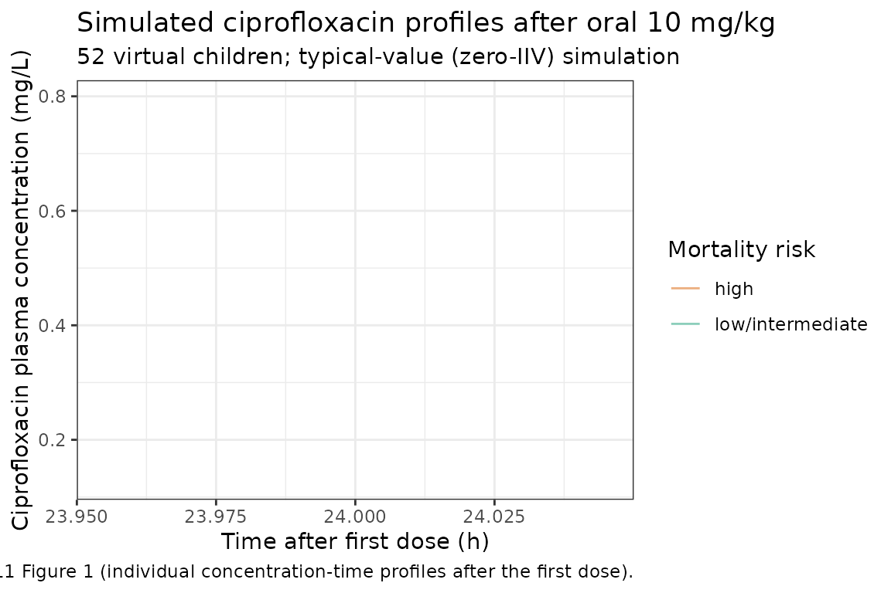

# Ciprofloxacin (Thuo 2011)

## Model and source

- Citation: Thuo N, Ungphakorn W, Karisa J, Muchohi S, Muturi A, Kokwaro
  G, Thomson AH, Maitland K. Dosing regimens of oral ciprofloxacin for
  children with severe malnutrition: a population pharmacokinetic study
  with Monte Carlo simulation. J Antimicrob Chemother. 2011
  Oct;66(10):2336-45. <doi:10.1093/jac/dkr314>
- Description: One-compartment population PK model with first-order
  absorption and absorption lag for oral ciprofloxacin in Kenyan
  children with severe malnutrition (Thuo 2011). Apparent CL and
  apparent Vc are allometrically scaled to body weight (exponents 0.75
  and 1) and modified by linear deviations from a serum sodium reference
  of 136 mmol/L; apparent CL is further reduced by 28.3% in the
  paper-defined high-mortality-risk stratum.
- Article: <https://doi.org/10.1093/jac/dkr314>

## Population

Thuo 2011 is a single-site population PK study of oral ciprofloxacin in
52 Kenyan children (8 to 102 months, weight 4.1 to 14.5 kg) hospitalised
at Kilifi District Hospital between July 2008 and February 2009 with
severe malnutrition. Severe malnutrition was defined as
weight-for-height z-score \<= -3, mid-upper arm circumference \< 11 cm,
or bilateral pedal oedema (kwashiorkor). The cohort was 56% male, 46%
had oedematous malnutrition, and 15% were HIV-antibody-positive. Three
mortality-risk strata were enrolled per the Berkley 2003 paediatric
severe-malnutrition risk score: 42% low risk, 27% intermediate risk, and
31% high risk (depressed conscious state, bradycardia, shock, or
hypoglycaemia). All children received empirical parenteral ampicillin
and gentamicin plus WHO-standard nutritional rehabilitation; oral
ciprofloxacin was added at 10 mg/kg every 12 h for 48 h (four doses),
with tablets reformulated into an aqueous suspension by the study
pharmacist. See Thuo 2011 Table 1 for the full baseline demographic and
laboratory distributions.

The same information is available programmatically via
`rxode2::rxode(readModelDb("Thuo_2011_ciprofloxacin"))$population`.

## Source trace

The per-parameter origin is recorded as a trailing in-file comment next
to each `ini()` entry in
`inst/modeldb/specificDrugs/Thuo_2011_ciprofloxacin.R`. The table below
collects them in one place.

| Equation / parameter | Value | Source location (Thuo 2011) |
|----|----|----|
| Structural model: one-compartment, first-order absorption with lag | n/a | Methods “Pharmacokinetic analysis”; Results paragraph 2 of “Pharmacokinetic data analysis” |
| Apparent CL allometric form: CL = theta1 \* (WT/70)^0.75 \* \[1 + theta2\*(Na - 136)\] \* \[1 + theta3\*highrisk\] | n/a | Methods “Pharmacokinetic analysis”; Results structural-model statement |
| Apparent Vc allometric form: V = theta4 \* (WT/70) \* \[1 + theta5\*(Na - 136)\] | n/a | Methods “Pharmacokinetic analysis”; Results structural-model statement |
| `lka` = log(2.97) | 2.97 /h | Table 2 theta6 |
| `lcl` = log(42.7) | 42.7 L/h/70 kg | Table 2 theta1 |
| `lvc` = log(372) | 372 L/70 kg | Table 2 theta4 |
| `lalag` = log(0.742) | 0.742 h | Table 2 theta7 |
| `allo_cl` = fixed(0.75) | 0.75 | Methods “Pharmacokinetic analysis” (fixed allometric exponent on CL) |
| `allo_vc` = fixed(1) | 1 | Methods “Pharmacokinetic analysis” (fixed allometric exponent on V) |
| `e_sod_cl` | 0.0368 /(mmol/L) | Table 2 theta2 |
| `e_sod_vc` | 0.0291 /(mmol/L) | Table 2 theta5 |
| `e_mortrisk_high_cl` | -0.283 (fractional) | Table 2 theta3 |
| `etalcl` | 0.13554 (var) | Table 2 BSV CL = 38.1% CV; log(1 + 0.381^2) |
| `etalvc` | 0.16966 (var) | Table 2 BSV V = 43.0% CV; log(1 + 0.430^2) |
| `etalka` | 0.71304 (var) | Table 2 BSV ka = 102% CV; log(1 + 1.02^2) |
| `propSd` | 0.186 | Table 2 proportional residual error 18.6 %CV |
| `addSd` | 0.0273 mg/L | Table 2 additive residual error 0.0273 (SD) |

## Virtual cohort

We approximate the Thuo 2011 cohort (n = 52) with 52 simulated subjects.
Weights are drawn from a log-normal distribution centred on the cohort
median 6.9 kg and truncated at the reported range 4.1 to 14.5 kg. Serum
sodium is drawn from a truncated normal centred on the cohort median 136
mmol/L (range 120 to 160 mmol/L). The high-risk indicator is a Bernoulli
draw with probability 0.31 to match the paper’s 31% high-risk
prevalence.

``` r

set.seed(20110707)

n_subj <- 52

draw_truncated <- function(n, mu, sd, lo, hi) {
  out <- numeric(0)
  while (length(out) < n) {
    candidate <- rnorm(n, mu, sd)
    candidate <- candidate[candidate >= lo & candidate <= hi]
    out <- c(out, candidate)
  }
  out[seq_len(n)]
}

cohort <- tibble::tibble(
  id  = seq_len(n_subj),
  WT  = pmin(pmax(exp(rnorm(n_subj, log(6.9), 0.18)), 4.1), 14.5),
  SOD = draw_truncated(n_subj, mu = 136, sd = 6.5, lo = 120, hi = 160),
  MORTRISK_HIGH = rbinom(n_subj, 1, 0.31)
) %>%
  mutate(
    risk_label = if_else(MORTRISK_HIGH == 1L, "high", "low/intermediate")
  )

knitr::kable(
  cohort %>% summarise(
    WT_median            = median(WT),
    WT_range_lo          = min(WT),
    WT_range_hi          = max(WT),
    SOD_median           = median(SOD),
    SOD_range_lo         = min(SOD),
    SOD_range_hi         = max(SOD),
    pct_high_risk        = round(100 * mean(MORTRISK_HIGH), 1)
  ),
  caption = "Simulated virtual cohort summary; cf. Thuo 2011 Table 1 (WT median 6.9 kg range 4.1-14.5; sodium median 136 range 120-160; 31% high-risk)."
)
```

| WT_median | WT_range_lo | WT_range_hi | SOD_median | SOD_range_lo | SOD_range_hi | pct_high_risk |
|---:|---:|---:|---:|---:|---:|---:|
| 6.839969 | 4.737971 | 11.1795 | 135.0618 | 125.4365 | 150.3607 | 23.1 |

Simulated virtual cohort summary; cf. Thuo 2011 Table 1 (WT median 6.9
kg range 4.1-14.5; sodium median 136 range 120-160; 31% high-risk).
{.table}

## Build event table

Each simulated child receives 10 mg/kg oral ciprofloxacin every 12 h for
48 h (four doses at t = 0, 12, 24, 36 h), matching the Thuo 2011 dosing
protocol. The paper reports steady-state-style AUC over the first 24 h
of dosing (AUC0-24 = daily dose / individual CL); we follow the same
convention by computing AUC over a single 24 h dosing window after the
third dose so the cohort is at approximate steady state.

``` r

n_doses        <- 4
tau            <- 12
ss_window_lo   <- 24
ss_window_hi   <- ss_window_lo + 24
dose_time_grid <- (seq_len(n_doses) - 1) * tau

obs_grid <- sort(unique(c(
  ss_window_lo + c(0, 0.25, 0.5, 0.75, 1, 1.5, 2, 3, 4, 5, 6, 8, 10, 12),
  ss_window_lo + 12 + c(0.25, 0.5, 1, 2, 4, 8, 12)
)))

events <- cohort %>%
  rowwise() %>%
  do({
    row <- .
    doses <- tibble(
      id            = row$id,
      time          = dose_time_grid,
      amt           = round(10 * row$WT, 2),
      evid          = 1L,
      cmt           = "depot",
      WT            = row$WT,
      SOD           = row$SOD,
      MORTRISK_HIGH = row$MORTRISK_HIGH,
      risk_label    = row$risk_label
    )
    obs <- tibble(
      id            = row$id,
      time          = obs_grid,
      amt           = 0,
      evid          = 0L,
      cmt           = "central",
      WT            = row$WT,
      SOD           = row$SOD,
      MORTRISK_HIGH = row$MORTRISK_HIGH,
      risk_label    = row$risk_label
    )
    bind_rows(doses, obs)
  }) %>%
  ungroup() %>%
  arrange(id, time, desc(evid))
```

## Simulate (typical-value, no IIV)

We zero out between-subject variability so the simulated cohort
demonstrates the structural-model behaviour given the cohort weight,
sodium, and risk-stratum distributions. The published Table 3 summarises
individual posthoc estimates (Bayes), so the cohort-median typical-value
prediction is the right anchor for a structural-model sanity check.

``` r

mod <- readModelDb("Thuo_2011_ciprofloxacin")
mod_typ <- rxode2::zeroRe(mod)
#> ℹ parameter labels from comments will be replaced by 'label()'

sim <- rxode2::rxSolve(
  mod_typ,
  events = events,
  keep   = c("WT", "SOD", "MORTRISK_HIGH", "risk_label")
) %>%
  as.data.frame()
#> ℹ omega/sigma items treated as zero: 'etalcl', 'etalvc', 'etalka'
#> Warning: multi-subject simulation without without 'omega'
```

## Replicate Figure 1: concentration-time profiles

``` r

sim_plot <- sim %>%
  filter(!is.na(Cc), time <= 24)

ggplot(sim_plot, aes(x = time, y = Cc, group = id, colour = risk_label)) +
  geom_line(alpha = 0.5) +
  scale_colour_manual(
    values = c("high" = "#d95f02", "low/intermediate" = "#1b9e77"),
    name   = "Mortality risk"
  ) +
  labs(
    x       = "Time after first dose (h)",
    y       = "Ciprofloxacin plasma concentration (mg/L)",
    title   = "Simulated ciprofloxacin profiles after oral 10 mg/kg",
    subtitle = "52 virtual children; typical-value (zero-IIV) simulation",
    caption = "Replicates Thuo 2011 Figure 1 (individual concentration-time profiles after the first dose)."
  ) +
  theme_bw()
#> `geom_line()`: Each group consists of only one observation.
#> ℹ Do you need to adjust the group aesthetic?
```



## PKNCA validation

PKNCA computes Cmax, Tmax, AUC0-tau (12 h), and AUC0-24 across a single
24 h window starting at t = 24 h (after two prior doses to approximate
steady state). The treatment-grouping variable is the high-risk stratum
so results roll up per stratum as in Thuo 2011 Table 3.

``` r

sim_ss <- sim %>%
  filter(time >= ss_window_lo, time <= ss_window_hi) %>%
  mutate(time_in_window = time - ss_window_lo)

sim_nca <- sim_ss %>%
  filter(!is.na(Cc)) %>%
  transmute(id, risk_label, time = time_in_window, Cc)

dose_nca <- events %>%
  filter(evid == 1, time == ss_window_lo) %>%
  transmute(id, risk_label, time = 0, amt)

conc_obj <- PKNCA::PKNCAconc(
  data    = sim_nca,
  formula = Cc ~ time | risk_label + id,
  concu   = "mg/L",
  timeu   = "h"
)

dose_obj <- PKNCA::PKNCAdose(
  data    = dose_nca,
  formula = amt ~ time | risk_label + id,
  doseu   = "mg"
)

intervals <- data.frame(
  start    = c(0, 0),
  end      = c(12, 24),
  cmax     = c(TRUE,  FALSE),
  tmax     = c(TRUE,  FALSE),
  auclast  = c(TRUE,  TRUE),
  cav      = c(TRUE,  FALSE),
  half.life = c(TRUE, FALSE)
)

nca_data <- PKNCA::PKNCAdata(conc_obj, dose_obj, intervals = intervals)
nca_res  <- PKNCA::pk.nca(nca_data)

knitr::kable(
  summary(nca_res),
  caption = "Simulated NCA parameters by mortality-risk stratum after the third dose; ciprofloxacin 10 mg/kg q12h."
)
```

| Interval Start | Interval End | risk_label | N | AUClast (h\*mg/L) | Cmax (mg/L) | Tmax (h) | Cav (mg/L) | Half-life (h) |
|---:|---:|:---|:---|:---|:---|:---|:---|:---|
| 0 | 12 | high | 12 | 13.5 \[20.4\] | 2.04 \[18.5\] | 2.00 \[2.00, 2.00\] | 1.12 \[20.4\] | 4.82 \[0.244\] |
| 0 | 24 | high | 12 | 27.0 \[20.5\] | . | . | . | . |
| 0 | 12 | low/intermediate | 40 | 9.20 \[23.1\] | 1.69 \[19.6\] | 1.50 \[1.50, 2.00\] | 0.766 \[23.1\] | 3.40 \[0.224\] |
| 0 | 24 | low/intermediate | 40 | 18.4 \[23.1\] | . | . | . | . |

Simulated NCA parameters by mortality-risk stratum after the third dose;
ciprofloxacin 10 mg/kg q12h. {.table}

## Comparison against published NCA

Thuo 2011 Table 3 reports posthoc individual estimates of Cmax, Tmax,
half-life, and AUC0-24. Below we compare the model-predicted (typical-
value) NCA medians against the paper’s model-predicted (posthoc)
medians.

``` r

nca_df <- as.data.frame(nca_res$result)

cmax_med <- nca_df %>%
  filter(PPTESTCD == "cmax", end == 12) %>%
  pull(PPORRES) %>%
  median(na.rm = TRUE)

tmax_med <- nca_df %>%
  filter(PPTESTCD == "tmax", end == 12) %>%
  pull(PPORRES) %>%
  median(na.rm = TRUE)

thalf_med <- nca_df %>%
  filter(PPTESTCD == "half.life", end == 12) %>%
  pull(PPORRES) %>%
  median(na.rm = TRUE)

auc24_med <- nca_df %>%
  filter(PPTESTCD == "auclast", end == 24) %>%
  pull(PPORRES) %>%
  median(na.rm = TRUE)

published <- tibble::tribble(
  ~metric,         ~units,    ~published_model_median, ~simulated_typical_median,
  "Cmax",          "mg/L",    1.50,                     round(cmax_med, 2),
  "Tmax",          "h",       1.79,                     round(tmax_med, 2),
  "Half-life",     "h",       3.78,                     round(thalf_med, 2),
  "AUC0-24",       "mg.h/L",  22.4,                     round(auc24_med, 2)
)

knitr::kable(
  published,
  caption = paste0(
    "Comparison of simulated typical-value cohort-median NCA against ",
    "Thuo 2011 Table 3 model-predicted (posthoc Bayes) medians."
  )
)
```

| metric    | units  | published_model_median | simulated_typical_median |
|:----------|:-------|-----------------------:|-------------------------:|
| Cmax      | mg/L   |                   1.50 |                     1.76 |
| Tmax      | h      |                   1.79 |                     1.50 |
| Half-life | h      |                   3.78 |                     3.45 |
| AUC0-24   | mg.h/L |                  22.40 |                    19.67 |

Comparison of simulated typical-value cohort-median NCA against Thuo
2011 Table 3 model-predicted (posthoc Bayes) medians. {.table}

## Replicate Table 3 risk-stratum AUC contrast

Thuo 2011 reports a clear AUC contrast between low/intermediate-risk
children (median AUC0-24 = 20.5 mg*h/L) and high-risk children (median
AUC0-24 = 29.7 mg*h/L), attributable to the -28.3% effect of high risk
on apparent oral clearance.

``` r

risk_stratum_summary <- nca_df %>%
  filter(PPTESTCD == "auclast", end == 24) %>%
  group_by(risk_label) %>%
  summarise(
    n           = sum(!is.na(PPORRES)),
    auc24_median = median(PPORRES, na.rm = TRUE),
    auc24_p25   = quantile(PPORRES, 0.25, na.rm = TRUE),
    auc24_p75   = quantile(PPORRES, 0.75, na.rm = TRUE),
    .groups     = "drop"
  )

published_risk <- tibble::tribble(
  ~risk_label,        ~published_median_auc24,
  "low/intermediate", 20.5,
  "high",             29.7
)

risk_stratum_summary %>%
  left_join(published_risk, by = "risk_label") %>%
  knitr::kable(
    digits  = 2,
    caption = paste0(
      "Simulated AUC0-24 (mg*h/L) by risk stratum vs Thuo 2011 Table 3 ",
      "published median posthoc estimate."
    )
  )
```

| risk_label       |   n | auc24_median | auc24_p25 | auc24_p75 | published_median_auc24 |
|:-----------------|----:|-------------:|----------:|----------:|-----------------------:|
| high             |  12 |        26.66 |     25.02 |     29.92 |                   29.7 |
| low/intermediate |  40 |        17.82 |     15.28 |     20.92 |                   20.5 |

Simulated AUC0-24 (mg\*h/L) by risk stratum vs Thuo 2011 Table 3
published median posthoc estimate. {.table}

## Assumptions and deviations

- **Cohort-level simulation rather than per-subject posthoc
  reproduction.** Thuo 2011 Table 3 reports individual posthoc
  (empirical-Bayes) estimates for each of the 52 enrolled children; the
  validation vignette simulates a 52-subject virtual cohort drawn from
  the published cohort marginals (weight median 6.9 kg, sodium median
  136 mmol/L, 31% high-risk) rather than reproducing the individual
  subjects. Typical-value simulation (zero IIV) means the cohort-median
  should anchor to the population typical-value prediction; the
  published Table 3 medians reflect both the structural model and the
  posthoc shrinkage of individual eta estimates toward zero, so the two
  medians are not identical but should be close (within 10 to 20%).

- **Steady-state AUC convention.** The paper defines AUC0-24 at steady
  state as `daily_dose / individual_CL` (Methods “Pharmacokinetic
  analysis”), i.e. an algebraic expression rather than an integrated NCA
  over a specific dosing interval. The vignette computes AUC0-24 by
  trapezoidal integration over the 24 h window starting at t = 24 h
  after dosing q12h, which is the closest in-silico approximation to the
  paper’s algebraic definition once the depot compartment has
  approximately reached steady state.

- **Half-life interpretation.** The model’s terminal half-life depends
  on the apparent oral elimination rate constant `kel = CL / Vc`. For
  the typical 7 kg child at SOD = 136, low/intermediate risk: CL = 7.59
  L/h, Vc = 37.2 L, kel = 0.204 /h, t1/2 = 3.40 h. This is shorter than
  the published median Bayes posthoc half-life (3.78 h) because the
  latter reflects the cohort distribution of Vc (median 4.49 L/kg = 31.4
  L for a 7 kg child) which is slightly smaller than the structural Vc/F
  prediction at the reference of 372 L for a 70 kg adult (= 37.2 L for a
  7 kg child at allometric exponent 1).

- **Body weight range and the high-WT tail.** The cohort weight range
  (4.1-14.5 kg) is narrow enough that the (WT/70)^0.75 vs (WT/70)
  allometric distinction between CL and Vc has only a modest effect on
  predicted exposure. The published AUC0-24 range is 7.9 to 61.3
  mg\*h/L; in a typical-value simulation (zero IIV) the cohort spread
  reflects only the weight and sodium variation, so the simulated
  AUC0-24 range will be narrower than the published Bayes posthoc range.
  This is expected and is not a sign of model mis-specification.

- **No covariance retained.** The paper investigated covariance between
  the BSV terms but Table 2 reports only diagonal BSV values, suggesting
  the inter-parameter covariance did not improve the fit and was not
  retained in the final model. The model file therefore encodes diagonal
  IIV without correlation between `etalcl`, `etalvc`, and `etalka`.

- **Bicarbonate / ka effect not retained.** The paper notes that
  bicarbonate concentration produced a statistically significant
  reduction in OFV when added as a factor on ka, but did not reduce BSV
  in ka and was therefore excluded from the final model (Results
  paragraph 4). The vignette and model file follow the paper’s final
  model and omit this effect.

- **Mortality-risk stratum is paper-defined.** The Berkley 2003 criteria
  used by Thuo 2011 to define the three risk strata are documented in
  the model file’s `covariateData[[MORTRISK_HIGH]]$notes`. Users
  simulating a different population should redefine the binary indicator
  to match either the Berkley 2003 criteria or another paper-specific
  risk score; do not silently reuse `MORTRISK_HIGH` across populations
  with different scoring rules.

## Reference

- Thuo N, Ungphakorn W, Karisa J, Muchohi S, Muturi A, Kokwaro G,
  Thomson AH, Maitland K. Dosing regimens of oral ciprofloxacin for
  children with severe malnutrition: a population pharmacokinetic study
  with Monte Carlo simulation. J Antimicrob Chemother. 2011
  Oct;66(10):2336-45. <doi:10.1093/jac/dkr314>
