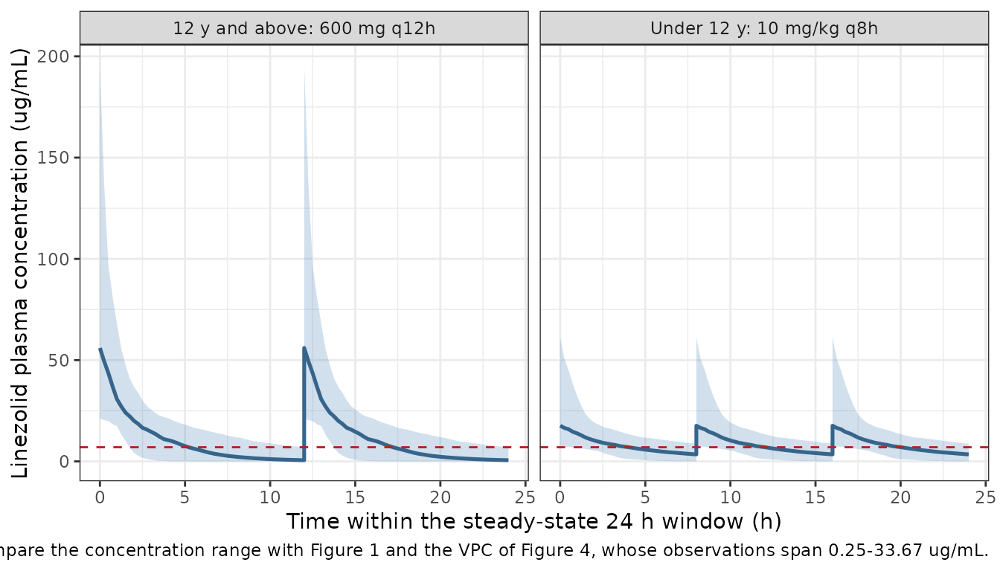
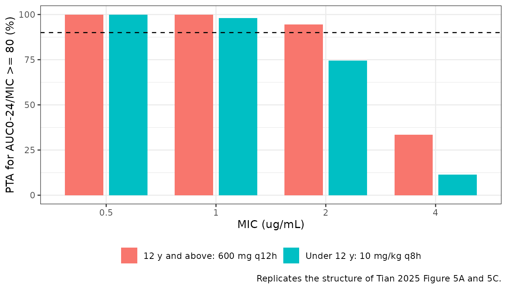
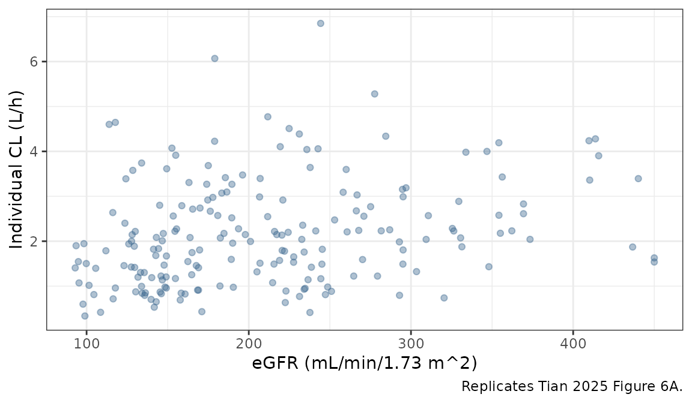

# Linezolid (Tian 2025)

## Model and source

- Citation: Tian X, Jiang T, Dong L, Zhang X, Jiao W, Liu G, Li Q, Bi J,
  You D, Cao L, Guo W, Jin Z, Zhang Q, Xu Y, Zhao W, Qi H, Zheng Y,
  Shen A. Population pharmacokinetics and clinical assessment of
  linezolid in pediatric bacterial infections. Antimicrob Agents
  Chemother. 2025;69(5):e01299-24. <doi:10.1128/aac.01299-24>. PMCID
  PMC12057362.
- Description: One-compartment population PK model with first-order
  elimination for intravenous linezolid in Chinese children (0-16 years)
  with confirmed or suspected bacterial infections (Tian 2025).
  Clearance carries two power covariates referenced to the cohort
  medians, CL = 1.91 \* (WT/12.5)^0.696 \* (eGFR/190.1)^0.291 (Table 3),
  where eGFR is the Schwartz-formula estimated glomerular filtration
  rate; the cohort median eGFR of 190.1 mL/min/1.73 m^2 places most of
  these children in augmented renal clearance. Central volume is a
  single typical value with no covariate, V = 10.5 L. Weight and eGFR
  were the only covariates retained by stepwise forward selection /
  backward elimination; sex, age, height, AST, ALT, albumin, total and
  direct bilirubin, serum creatinine, and blood urea nitrogen were all
  screened and rejected (see covariatesDataExcluded). Inter-individual
  variability is exponential on both CL and V, and residual variability
  is exponential (log-normal), so the model is encoded with lnorm()
  rather than a proportional residual.
- Article: <https://doi.org/10.1128/aac.01299-24>
- Open-access full text:
  <https://www.ncbi.nlm.nih.gov/pmc/articles/PMC12057362/>

Tian and colleagues fitted a one-compartment model with first-order
elimination to 157 plasma linezolid concentrations from 80 Chinese
children treated for confirmed or suspected bacterial infection. Body
weight and the Schwartz-formula estimated glomerular filtration rate
were the only two covariates retained on clearance; central volume was
estimated as a single typical value.

## Population

Eighty children aged 0-16 years (median 3.3 years, 5th-95th percentile
0.1-12.6) were recruited prospectively at six Chinese paediatric centres
between March 2021 and June 2022 (Chinese Clinical Trial Registry
ChiCTR2200061207). Median weight was 12.5 kg (5th-95th 5.3-45.9), median
height 99.5 cm (5th-95th 55.1-159.8), and 48/80 (60.0%) were male. All
received intravenous linezolid (Zyvox) at the label standard dose: 10
mg/kg q8h for children under 12 years (73/80) and 600 mg q12h for
children aged 12 years and above (7/80). Blood was drawn
opportunistically after at least 48 h of treatment, giving a median of
2.0 samples per child and 157 concentrations in the range 0.25-33.67
ug/mL (Tian 2025 Table 1).

The cohort’s median Schwartz eGFR was 190.1 mL/min/1.73 m^2 (5th-95th
97.0-350.2). That is far above the 90-130 mL/min/1.73 m^2 the paper
defines as normal, so the reference subject of this model is a child in
augmented renal clearance – an important caveat when reusing the model
for a child with normal or impaired renal function.

The same information is available programmatically via the model’s
`population` metadata
(`readModelDb("Tian_2025_linezolid")()$population`).

## Source trace

The per-parameter origin is recorded as an in-file comment next to each
`ini()` entry in `inst/modeldb/specificDrugs/Tian_2025_linezolid.R`. The
table below collects them in one place for review.

| Equation / parameter | Value | Source location |
|----|----|----|
| `lcl` (CL at WT = 12.5 kg, eGFR = 190.1) | `log(1.91)` L/h | Table 3, `theta1` = 1.91 (RSE 5.1%; bootstrap median 1.88) |
| `lvc` (V) | `log(10.5)` L | Table 3, `theta2` = 10.5 (RSE 11.8%; bootstrap median 10.5) |
| `e_wt_cl` | 0.696 | Table 3, `theta3` (RSE 10.6%; bootstrap median 0.701, 5th-95th 0.348-1.09) |
| `e_crcl_cl` | 0.291 | Table 3, `theta4` (RSE 36.1%; bootstrap median 0.309, 5th-95th 0.01-0.983) |
| `etalcl` | 0.10903 (= 0.3302^2) | Table 3, IIV CL = 33.02% (RSE 37.7%) |
| `etalvc` | 0.67700 (= 0.8228^2) | Table 3, IIV V = 82.28% (RSE 33.8%) |
| `expSd` | 0.2623 | Table 3, residual variability = 26.23% (RSE 69.6%) |
| WT centering, 12.5 kg | n/a | Table 3 footnote (“12.5 kg … median WT”) |
| eGFR centering, 190.1 mL/min/1.73 m^2 | n/a | Table 3 footnote (“190.1 mL/min/1.73 m^2 … median eGFR”) |
| `cl <- exp(lcl + etalcl) * (WT/12.5)^e_wt_cl * (CRCL/190.1)^e_crcl_cl` | n/a | Table 3, `CL = theta1 x (WT/12.5)^theta3 x (eGFR/190.1)^theta4` |
| `vc <- exp(lvc + etalvc)` | n/a | Table 3, `V = theta2`; Methods, exponential interindividual model |
| `d/dt(central) <- -kel * central` | n/a | Results, “Model building”: one-compartment model with first-order elimination, parameterized in CL and V |
| `Cc ~ lnorm(expSd)` | n/a | Results, “Model building”: “exponential models were used for both interindividual variation and residual variation” |
| AUC0-24 = Dose0-24 / CL | n/a | Methods, “Simulation and dosing regimen optimization” |
| Safety threshold Cmin = 7 ug/mL | n/a | Methods, “Simulation and dosing regimen optimization” (ref. 15) |
| PD target AUC0-24/MIC \>= 80 | n/a | Methods, “Simulation and dosing regimen optimization” (ref. 13) |

## Typical-value checks against the printed equation

The tightest available gate does not need a cohort at all. For a grid of
weight and eGFR values spanning Table 1, solve the packaged model with
the random effects switched off and compare the steady-state AUC0-24
recovered by trapezoidal NCA against the paper’s own relation
`AUC0-24 = Dose0-24 / CL`, with `CL` computed independently from the
numbers printed in Table 3. Any error in the ODE, the `kel = cl/vc`
derivation, the covariate exponents, or the centering constants moves
the two sides apart.

``` r

mod <- readModelDb("Tian_2025_linezolid")

# Grid spanning Table 1: weight at the 5th, 25th, median, 75th and 95th
# percentile-ish values, crossed with the eGFR 5th, median and 95th.
grid <- tidyr::crossing(
  WT   = c(5.3, 8.0, 12.5, 20.0, 45.9),
  CRCL = c(97.0, 190.1, 350.2)
) |>
  dplyr::mutate(
    id       = dplyr::row_number(),
    dose_mg  = 10 * WT,          # 10 mg/kg q8h, the paediatric standard dose
    # Table 3, read straight off the printed equation -- NOT from the model.
    cl_paper = 1.91 * (WT / 12.5)^0.696 * (CRCL / 190.1)^0.291,
    # Methods equation: AUC(0-24) = Dose(0-24) / CL, with three q8h doses/day.
    auc_paper = 3 * dose_mg / cl_paper
  )

tau_grid  <- 8
t_ss_grid <- 0

# Steady state is imposed exactly with rxode2's `ss = 1` flag on the first dose
# rather than approached by simulating a long dose train. That matters: the
# model's 82% volume IIV puts a small share of subjects at half-lives of
# hundreds of hours, and any finite run-in leaves those subjects short of
# steady state, which shows up downstream as a real-looking AUC bias.
#
# Bolus dosing also makes the concentration discontinuous at every dose time.
# With observations ONLY on a regular grid, rxode2 reports the post-dose value
# at each dose time and the segment spanning the preceding grid step runs from
# the trough straight to the peak, inflating AUC by roughly 1%. Adding a point
# an instant before each interior dose collapses that spurious segment to zero
# width. Without it the identity check below fails for the right reason on a
# correct model -- see pattern 11 of the skill's
# known-vignette-failure-patterns reference.
obs_times <- function(tau, by) {
  interior <- seq(tau, 24 - tau, by = tau)
  sort(unique(c(seq(0, 24, by = by), interior - 1e-6)))
}

# NOTE the `.tau` argument name. `dat` carries a `tau` COLUMN in the cohort
# simulation below, and inside a dplyr / tidyr data mask a bare `tau` resolves
# to that column, not to the function argument. Prefixing the argument keeps
# the two apart.
dose_records <- function(dat, .tau) {
  times <- .tau * (seq_len(24 / .tau) - 1)
  dat |>
    tidyr::crossing(time = times) |>
    dplyr::mutate(
      amt  = dose_mg,
      evid = 1L,
      cmt  = "central",
      ss   = ifelse(time == 0, 1L, 0L),
      ii   = ifelse(time == 0, .tau, 0)
    )
}

grid_ev <- dplyr::bind_rows(
  dose_records(grid, tau_grid) |>
    dplyr::select(id, WT, CRCL, time, amt, evid, cmt, ss, ii),
  # Observation records on the ODE state, not on the algebraic observable
  grid |>
    tidyr::crossing(time = obs_times(tau_grid, by = 0.1)) |>
    dplyr::mutate(amt = NA_real_, evid = 0L, cmt = "central", ss = 0L, ii = 0) |>
    dplyr::select(id, WT, CRCL, time, amt, evid, cmt, ss, ii)
) |>
  dplyr::arrange(id, time, dplyr::desc(evid))

sim_grid <-
  rxode2::rxSolve(
    rxode2::zeroRe(mod),
    events = grid_ev,
    keep   = c("WT", "CRCL")
  ) |>
  as.data.frame()
#> ℹ parameter labels from comments will be replaced by 'label()'
#> ℹ omega/sigma items treated as zero: 'etalcl', 'etalvc'
#> Warning: multi-subject simulation without without 'omega'
if (is.null(sim_grid$id)) sim_grid$id <- 1L

stopifnot(nrow(sim_grid) > 0, all(sim_grid$Cc >= 0))
```

``` r

conc_grid <- sim_grid |>
  dplyr::filter(!is.na(Cc)) |>
  dplyr::mutate(id = as.integer(as.character(id)), arm = "typical") |>
  dplyr::select(id, time, Cc, arm)

dose_grid <- grid_ev |>
  dplyr::filter(evid == 1L) |>
  dplyr::mutate(arm = "typical") |>
  dplyr::select(id, time, amt, arm)

conc_obj_g <- PKNCA::PKNCAconc(
  conc_grid, Cc ~ time | arm + id,
  concu = "ug/mL", timeu = "h"
)
dose_obj_g <- PKNCA::PKNCAdose(
  dose_grid, amt ~ time | arm + id,
  doseu = "mg"
)

int_grid <- data.frame(
  start   = t_ss_grid,
  end     = t_ss_grid + 24,
  auclast = TRUE,
  cmax    = TRUE,
  cmin    = TRUE,
  cav     = TRUE
)

res_grid <- PKNCA::pk.nca(
  PKNCA::PKNCAdata(conc_obj_g, dose_obj_g, intervals = int_grid)
)

auc_grid <- as.data.frame(res_grid) |>
  dplyr::filter(PPTESTCD == "auclast") |>
  dplyr::transmute(id = as.integer(as.character(id)), auc_sim = PPORRES)

chk_grid <- grid |>
  dplyr::inner_join(auc_grid, by = "id") |>
  dplyr::mutate(pct_diff = 100 * (auc_sim - auc_paper) / auc_paper)

stopifnot(nrow(chk_grid) == nrow(grid))

knitr::kable(
  chk_grid |>
    dplyr::transmute(
      WT, CRCL,
      `CL from Table 3 (L/h)`   = round(cl_paper, 3),
      `AUC0-24 = Dose/CL`       = round(auc_paper, 1),
      `AUC0-24 by NCA`          = round(auc_sim, 1),
      `% difference`            = round(pct_diff, 3)
    ),
  caption = paste(
    "Steady-state AUC0-24 recovered from the packaged model by trapezoidal",
    "NCA versus the paper's own Dose0-24/CL relation, with CL evaluated from",
    "the numbers printed in Tian 2025 Table 3. Random effects are switched",
    "off, so the two sides differ only by trapezoidal-integration error."
  )
)
```

| WT | CRCL | CL from Table 3 (L/h) | AUC0-24 = Dose/CL | AUC0-24 by NCA | % difference |
|---:|---:|---:|---:|---:|---:|
| 5.3 | 97.0 | 0.864 | 184.0 | 184.0 | 0 |
| 5.3 | 190.1 | 1.051 | 151.3 | 151.3 | 0 |
| 5.3 | 350.2 | 1.256 | 126.6 | 126.6 | 0 |
| 8.0 | 97.0 | 1.151 | 208.5 | 208.5 | 0 |
| 8.0 | 190.1 | 1.400 | 171.4 | 171.4 | 0 |
| 8.0 | 350.2 | 1.672 | 143.5 | 143.5 | 0 |
| 12.5 | 97.0 | 1.570 | 238.8 | 238.8 | 0 |
| 12.5 | 190.1 | 1.910 | 196.3 | 196.3 | 0 |
| 12.5 | 350.2 | 2.282 | 164.4 | 164.4 | 0 |
| 20.0 | 97.0 | 2.178 | 275.5 | 275.5 | 0 |
| 20.0 | 190.1 | 2.649 | 226.5 | 226.5 | 0 |
| 20.0 | 350.2 | 3.165 | 189.6 | 189.6 | 0 |
| 45.9 | 97.0 | 3.883 | 354.6 | 354.6 | 0 |
| 45.9 | 190.1 | 4.723 | 291.6 | 291.6 | 0 |
| 45.9 | 350.2 | 5.642 | 244.1 | 244.1 | 0 |

Steady-state AUC0-24 recovered from the packaged model by trapezoidal
NCA versus the paper’s own Dose0-24/CL relation, with CL evaluated from
the numbers printed in Tian 2025 Table 3. Random effects are switched
off, so the two sides differ only by trapezoidal-integration error.
{.table}

``` r

# Both sides are deterministic -- no random effects, no cohort draw -- and
# PKNCA's default lin-up/log-down integration is exact for the mono-exponential
# decay of a one-compartment model, so the only residual is floating-point
# noise. A tight bound is correct here and must be kept tight: it is what
# catches a mis-transcribed exponent, centering constant or dose.
max(abs(chk_grid$pct_diff))
#> [1] 1.791048e-05
stopifnot(max(abs(chk_grid$pct_diff)) < 0.01)
```

The reference subject is a 12.5 kg child with an eGFR of 190.1
mL/min/1.73 m^2. Its weight-normalised parameters can be checked
directly against the values the Discussion reports for this cohort and
against the paediatric literature range the Discussion quotes.

``` r

cl_ref <- 1.91
v_ref  <- 10.5
wt_ref <- 12.5

norm_tab <- tibble::tibble(
  Quantity  = c("CL (L/h/kg)", "V (L/kg)", "Terminal half-life (h)"),
  Model     = c(cl_ref / wt_ref, v_ref / wt_ref, log(2) * v_ref / cl_ref),
  Published = c(0.15, 0.77, NA_real_),
  `Published range` = c(
    "0.13-0.171 (Discussion, paediatric literature); 0.15 +/- 0.06 this study",
    "0.42-0.92 (Discussion, paediatric literature); 0.77 +/- 0.50 this study",
    "3-4 (Introduction, children)"
  )
)

knitr::kable(
  norm_tab |> dplyr::mutate(Model = round(Model, 3)),
  caption = paste(
    "Weight-normalised parameters of the reference subject (WT = 12.5 kg,",
    "eGFR = 190.1 mL/min/1.73 m^2) against the values Tian 2025 reports in",
    "the Introduction and Discussion."
  )
)
```

| Quantity | Model | Published | Published range |
|:---|---:|---:|:---|
| CL (L/h/kg) | 0.153 | 0.15 | 0.13-0.171 (Discussion, paediatric literature); 0.15 +/- 0.06 this study |
| V (L/kg) | 0.840 | 0.77 | 0.42-0.92 (Discussion, paediatric literature); 0.77 +/- 0.50 this study |
| Terminal half-life (h) | 3.810 | NA | 3-4 (Introduction, children) |

Weight-normalised parameters of the reference subject (WT = 12.5 kg,
eGFR = 190.1 mL/min/1.73 m^2) against the values Tian 2025 reports in
the Introduction and Discussion. {.table}

``` r

# Deterministic: these are arithmetic on the Table 3 point estimates, so the
# bounds pin the transcription of theta1 and theta2 exactly.
stopifnot(
  # 1.91 / 12.5 = 0.1528 L/h/kg, inside the Discussion's 0.13-0.171 range and
  # within 2% of the 0.15 +/- 0.06 L/h/kg this study reports.
  abs(cl_ref / wt_ref - 0.15) < 0.01,
  # 10.5 / 12.5 = 0.84 L/kg, inside the 0.42-0.92 L/kg paediatric range.
  cl_ref / wt_ref >= 0.13, cl_ref / wt_ref <= 0.171,
  v_ref / wt_ref  >= 0.42, v_ref / wt_ref  <= 0.92,
  # log(2) * 10.5 / 1.91 = 3.81 h, inside the 3-4 h the Introduction quotes
  # for children.
  log(2) * v_ref / cl_ref >= 3, log(2) * v_ref / cl_ref <= 4
)
```

The terminal half-life above is arithmetic on `V/CL`. The independent
check is to recover it from the solved profile with PKNCA after a single
dose.

``` r

hl_ev <- dplyr::bind_rows(
  tibble::tibble(
    id = 1L, WT = 12.5, CRCL = 190.1, time = 0,
    amt = 125, evid = 1L, cmt = "central"
  ),
  tibble::tibble(
    id = 1L, WT = 12.5, CRCL = 190.1,
    time = seq(0, 36, by = 0.25),
    amt = NA_real_, evid = 0L, cmt = "central"
  )
) |>
  dplyr::arrange(time, dplyr::desc(evid))

sim_hl <- rxode2::rxSolve(rxode2::zeroRe(mod), events = hl_ev) |> as.data.frame()
#> ℹ parameter labels from comments will be replaced by 'label()'
#> ℹ omega/sigma items treated as zero: 'etalcl', 'etalvc'
if (is.null(sim_hl$id)) sim_hl$id <- 1L

conc_hl <- sim_hl |>
  dplyr::filter(!is.na(Cc)) |>
  dplyr::mutate(id = 1L, arm = "single dose") |>
  dplyr::select(id, time, Cc, arm)

res_hl <- PKNCA::pk.nca(PKNCA::PKNCAdata(
  PKNCA::PKNCAconc(conc_hl, Cc ~ time | arm + id, concu = "ug/mL", timeu = "h"),
  PKNCA::PKNCAdose(
    tibble::tibble(id = 1L, arm = "single dose", time = 0, amt = 125),
    amt ~ time | arm + id, doseu = "mg"
  ),
  intervals = data.frame(
    start = 0, end = Inf,
    cmax = TRUE, tmax = TRUE, half.life = TRUE, aucinf.obs = TRUE
  )
))

hl_sim <- as.data.frame(res_hl) |>
  dplyr::filter(PPTESTCD == "half.life") |>
  dplyr::pull(PPORRES)

hl_sim
#> [1] 3.810495
# PKNCA's log-linear regression on the solved profile must recover the exact
# analytic half-life log(2) * V / CL to within regression tolerance.
stopifnot(abs(hl_sim - log(2) * v_ref / cl_ref) < 0.05)
```

## Virtual cohort

Original observed data are not publicly available. The two arms below
reproduce the paper’s two dosing strata with covariate distributions
matched to Tian 2025 Table 1. Weight and eGFR are drawn as log-normals
whose median and 5th-95th percentiles reproduce the published summary;
the two are drawn independently because the paper reports no correlation
between them.

``` r

# set.seed() seeds R's RNG only. rxode2's simulation RNG is partitioned per
# solver thread, so the residual draws below are not reproducible across
# machines with different thread counts; every assertion in this vignette is
# written to hold for any cohort the model can produce (see pattern 12 of the
# skill's known-vignette-failure-patterns reference).
set.seed(20250401)
rxode2::rxSetSeed(20250401)

n_arm <- 200L

# Log-normal parameters that reproduce a published median and 5th-95th pair.
lnorm_from_quantiles <- function(median, p05, p95) {
  list(meanlog = log(median), sdlog = (log(p95) - log(p05)) / (2 * qnorm(0.95)))
}

# Under 12 years: Table 1 weight median 12.5 kg (5th-95th 5.3-45.9). The upper
# tail of that interval belongs to the seven children aged 12+, so the
# under-12 arm is truncated at 40 kg.
wt_u12 <- lnorm_from_quantiles(12.5, 5.3, 45.9)
gf_all <- lnorm_from_quantiles(190.1, 97.0, 350.2)

# 12 years and above: Tian 2025 tabulates no separate demographics for the
# seven children in this stratum, so weight is drawn around 45 kg -- the upper
# end of the Table 1 weight interval -- with a 20% log-scale spread, and eGFR
# uses the same distribution as the rest of the cohort. See "Assumptions and
# deviations".
make_arm <- function(n, arm, tau, dose_fun, wt_par, wt_lo, wt_hi, id_offset) {
  tibble::tibble(
    id   = id_offset + seq_len(n),
    arm  = arm,
    tau  = tau,
    WT   = pmin(pmax(rlnorm(n, wt_par$meanlog, wt_par$sdlog), wt_lo), wt_hi),
    CRCL = pmin(pmax(rlnorm(n, gf_all$meanlog, gf_all$sdlog), 60), 450)
  ) |>
    dplyr::mutate(dose_mg = dose_fun(WT))
}

cohort <- dplyr::bind_rows(
  make_arm(
    n_arm, "Under 12 y: 10 mg/kg q8h", 8,
    dose_fun = function(wt) 10 * wt,
    wt_par = wt_u12, wt_lo = 3.0, wt_hi = 40.0, id_offset = 0L
  ),
  make_arm(
    n_arm, "12 y and above: 600 mg q12h", 12,
    dose_fun = function(wt) rep(600, length(wt)),
    wt_par = list(meanlog = log(45), sdlog = 0.20),
    wt_lo = 30.0, wt_hi = 80.0, id_offset = 1000L
  )
)

knitr::kable(
  cohort |>
    dplyr::group_by(arm) |>
    dplyr::summarise(
      n = dplyr::n(),
      `WT median (5th-95th)` = sprintf(
        "%.1f (%.1f-%.1f)", median(WT),
        quantile(WT, 0.05), quantile(WT, 0.95)
      ),
      `eGFR median (5th-95th)` = sprintf(
        "%.0f (%.0f-%.0f)", median(CRCL),
        quantile(CRCL, 0.05), quantile(CRCL, 0.95)
      ),
      .groups = "drop"
    ),
  caption = "Virtual cohort covariate distributions, 200 children per arm."
)
```

| arm                         |   n | WT median (5th-95th) | eGFR median (5th-95th) |
|:----------------------------|----:|:---------------------|:-----------------------|
| 12 y and above: 600 mg q12h | 200 | 44.4 (32.6-62.7)     | 187 (105-362)          |
| Under 12 y: 10 mg/kg q8h    | 200 | 12.7 (3.6-35.2)      | 190 (104-369)          |

Virtual cohort covariate distributions, 200 children per arm. {.table}

``` r

# Same `ss = 1` construction as the typical-value grid: one steady-state dose
# at time 0 followed by the remaining doses of a single 24 h window, so the
# window IS the steady-state window for every subject regardless of half-life.
build_events <- function(dat) {
  .tau <- unique(dat$tau)
  stopifnot(length(.tau) == 1L)
  ot <- obs_times(.tau, by = 0.25)
  dplyr::bind_rows(
    dose_records(dat, .tau),
    dat |>
      tidyr::crossing(time = ot) |>
      dplyr::mutate(amt = NA_real_, evid = 0L, cmt = "central", ss = 0L, ii = 0)
  ) |>
    dplyr::select(id, arm, tau, WT, CRCL, dose_mg, time, amt, evid, cmt, ss, ii) |>
    dplyr::arrange(id, time, dplyr::desc(evid))
}

events <- dplyr::bind_rows(
  build_events(dplyr::filter(cohort, tau == 8)),
  build_events(dplyr::filter(cohort, tau == 12))
)

stopifnot(!anyDuplicated(unique(events[, c("id", "time", "evid")])))
table(events$arm, events$evid)
#>                              
#>                                   0     1
#>   12 y and above: 600 mg q12h 19600   400
#>   Under 12 y: 10 mg/kg q8h    19800   600
```

## Simulation

``` r

sim <- rxode2::rxSolve(
  mod,
  events = events,
  keep   = c("arm", "tau", "WT", "CRCL", "dose_mg")
) |>
  as.data.frame()
#> ℹ parameter labels from comments will be replaced by 'label()'

stopifnot(nrow(sim) > 0, all(sim$Cc >= 0))

sim <- sim |>
  dplyr::mutate(id = as.integer(as.character(id)), t_rel = time)
```

``` r

ribbon <- sim |>
  dplyr::group_by(arm, t_rel) |>
  dplyr::summarise(
    p05 = quantile(Cc, 0.05),
    p50 = median(Cc),
    p95 = quantile(Cc, 0.95),
    .groups = "drop"
  )

ggplot(ribbon, aes(t_rel)) +
  geom_ribbon(aes(ymin = p05, ymax = p95), alpha = 0.25, fill = "steelblue") +
  geom_line(aes(y = p50), linewidth = 0.9, colour = "steelblue4") +
  geom_hline(yintercept = 7, linetype = "dashed", colour = "firebrick") +
  facet_wrap(~arm) +
  labs(
    x = "Time within the steady-state 24 h window (h)",
    y = "Linezolid plasma concentration (ug/mL)",
    caption = paste(
      "Median and 5th-95th percentile of the simulated steady-state profile.",
      "Dashed line: the Cmin = 7 ug/mL safety threshold of Tian 2025",
      "Methods. Compare the concentration range with Figure 1 and the VPC of",
      "Figure 4, whose observations span 0.25-33.67 ug/mL."
    )
  ) +
  theme_bw()
```



``` r

# Tian 2025 Results, "Model building": the 157 observed concentrations spanned
# 0.25-33.67 ug/mL, and the assay's linear range was 0.25-50 ug/mL. The
# simulated central tendency must land inside that window. Bound is on the
# median and on a robust quantile, not on the cohort extremes, because with
# 82% IIV on volume the extreme of a random cohort is not reproducible across
# rxode2 builds.
conc_chk <- sim |>
  dplyr::summarise(
    med = median(Cc),
    q95 = quantile(Cc, 0.95)
  )
conc_chk
#>        med      q95
#> 1 7.102291 33.79794
stopifnot(conc_chk$med > 0.25, conc_chk$med < 34, conc_chk$q95 < 50)
```

## PKNCA validation

``` r

sim_nca <- sim |>
  dplyr::filter(!is.na(Cc)) |>
  dplyr::select(id, time, Cc, arm)

dose_df <- events |>
  dplyr::filter(evid == 1L) |>
  dplyr::select(id, time, amt, arm)

conc_obj <- PKNCA::PKNCAconc(
  sim_nca, Cc ~ time | arm + id,
  concu = "ug/mL", timeu = "h"
)
dose_obj <- PKNCA::PKNCAdose(
  dose_df, amt ~ time | arm + id,
  doseu = "mg"
)

# A single 24 h steady-state interval, shared by both arms because `ss = 1`
# puts both windows at [0, 24].
intervals <- data.frame(
  start   = 0,
  end     = 24,
  auclast = TRUE,
  cmax    = TRUE,
  cmin    = TRUE,
  cav     = TRUE
)

res <- PKNCA::pk.nca(
  PKNCA::PKNCAdata(conc_obj, dose_obj, intervals = intervals)
)

nca <- as.data.frame(res) |>
  dplyr::filter(PPTESTCD %in% c("auclast", "cmax", "cmin", "cav")) |>
  dplyr::transmute(
    arm, id = as.integer(as.character(id)), PPTESTCD, PPORRES
  ) |>
  tidyr::pivot_wider(names_from = PPTESTCD, values_from = PPORRES)

stopifnot(nrow(nca) == 2L * n_arm, !anyNA(nca$auclast))

knitr::kable(
  nca |>
    dplyr::group_by(arm) |>
    dplyr::summarise(
      `AUC0-24,ss (mg*h/L)` = sprintf(
        "%.0f (%.0f-%.0f)", median(auclast),
        quantile(auclast, 0.05), quantile(auclast, 0.95)
      ),
      `Cmax,ss (ug/mL)` = sprintf("%.1f", median(cmax)),
      `Cmin,ss (ug/mL)` = sprintf("%.2f", median(cmin)),
      `Cav,ss (ug/mL)`  = sprintf("%.1f", median(cav)),
      .groups = "drop"
    ) |>
    dplyr::rename(Arm = arm),
  caption = "Simulated steady-state NCA summary, median (5th-95th percentile)."
)
```

| Arm | AUC0-24,ss (mg\*h/L) | Cmax,ss (ug/mL) | Cmin,ss (ug/mL) | Cav,ss (ug/mL) |
|:---|:---|:---|:---|:---|
| 12 y and above: 600 mg q12h | 269 (156-453) | 56.0 | 0.59 | 11.2 |
| Under 12 y: 10 mg/kg q8h | 203 (104-363) | 17.6 | 3.45 | 8.4 |

Simulated steady-state NCA summary, median (5th-95th percentile).
{.table}

The paper’s own definition of exposure is `AUC0-24 = Dose0-24 / CL`.
Comparing the NCA integral against that identity in the full stochastic
cohort tests the ODE and the individual clearance together, so it is a
check of the whole implementation rather than of the typical value
alone.

``` r

cl_ind <- sim |>
  dplyr::group_by(id, arm, tau, dose_mg) |>
  dplyr::summarise(cl = mean(cl), .groups = "drop") |>
  dplyr::mutate(dose_24 = dose_mg * 24 / tau, auc_identity = dose_24 / cl)

chk_auc <- nca |>
  dplyr::inner_join(cl_ind, by = c("id", "arm")) |>
  dplyr::mutate(pct_diff = 100 * (auclast - auc_identity) / auc_identity)

stopifnot(nrow(chk_auc) == 2L * n_arm)
summary(chk_auc$pct_diff)
#>      Min.   1st Qu.    Median      Mean   3rd Qu.      Max. 
#> 6.699e-07 4.086e-06 7.737e-06 1.234e-05 1.571e-05 1.242e-04

# Both sides use the SAME individual clearance and the integration is exact for
# this model, so the residual is floating-point noise (realised max ~1e-4 %).
# The bound below is two orders of magnitude above that, which still leaves it
# far too tight to survive a structural error: dropping steady state, halving
# the dose or losing a dose from the 24 h window each move it by tens of
# percent. Keep it tight.
stopifnot(max(abs(chk_auc$pct_diff)) < 0.01)
```

### Comparison against published exposures

``` r

# Tian 2025 Table 4 reports AUC0-24/MIC at MIC = 2 ug/mL for the 67 children in
# the efficacy analysis, by discharge prognosis. Multiplying by the MIC of
# 2 ug/mL recovers AUC0-24 in mg*h/L. The "Improved" row is not usable: its
# median (133.5) sits at the top of its own printed 5th-95th interval
# (67.8-134.0), which is arithmetically impossible, so only the internally
# consistent "Cured" and "Failure" rows are carried here. They agree with each
# other to within 2%.
reference <- data.frame(
  PPTESTCD = c("auclast", "half.life"),
  PPORRES  = c(
    mean(c(105.6, 103.7)) * 2,   # Table 4 Cured and Failure AUC/MIC x MIC 2
    3.5                          # Introduction: 3-4 h in children
  )
)

simulated <- data.frame(
  PPTESTCD = c("auclast", "half.life"),
  PPORRES  = c(
    median(nca$auclast[nca$arm == "Under 12 y: 10 mg/kg q8h"]),
    hl_sim
  )
)

cmp <- nlmixr2lib::ncaComparisonTable(
  simulated  = simulated,
  reference  = reference,
  params     = c("auclast", "half.life"),
  units      = c(auclast = "mg*h/L", half.life = "h"),
  label_first_column = "NCA parameter"
)

knitr::kable(
  cmp,
  caption = paste(
    "Simulated steady-state exposure in the under-12 arm against the values",
    "Tian 2025 reports. Reference AUC0-24 is the mean of the Table 4 Cured",
    "and Failure AUC/MIC medians multiplied by the MIC of 2 ug/mL; reference",
    "half-life is the midpoint of the 3-4 h range quoted in the Introduction",
    "for children. Rows differing by more than 20% are starred."
  )
)
```

| NCA parameter     | Reference | Simulated | % diff |
|:------------------|:----------|:----------|:-------|
| AUClast (mg\*h/L) | 209       | 203       | -3.2%  |
| t½ (h)            | 3.5       | 3.81      | +8.9%  |

Simulated steady-state exposure in the under-12 arm against the values
Tian 2025 reports. Reference AUC0-24 is the mean of the Table 4 Cured
and Failure AUC/MIC medians multiplied by the MIC of 2 ug/mL; reference
half-life is the midpoint of the 3-4 h range quoted in the Introduction
for children. Rows differing by more than 20% are starred. {.table}

## Probability of target attainment

Tian 2025 evaluates the standard regimens against a PD target of
`AUC0-24/MIC >= 80` and a safety threshold of `Cmin = 7 ug/mL` (Methods,
“Simulation and dosing regimen optimization”).

``` r

mics <- c(0.5, 1, 2, 4)

pta <- tidyr::crossing(nca, MIC = mics) |>
  dplyr::group_by(arm, MIC) |>
  dplyr::summarise(
    PTA        = 100 * mean(auclast / MIC >= 80),
    over_cmin  = 100 * mean(cmin > 7),
    .groups    = "drop"
  )

published <- tibble::tribble(
  ~arm,                          ~MIC, ~pta_pub, ~cmin_pub,
  "Under 12 y: 10 mg/kg q8h",     0.5,    100.0,       1.4,
  "Under 12 y: 10 mg/kg q8h",     1.0,    100.0,       1.4,
  "Under 12 y: 10 mg/kg q8h",     2.0,     91.9,       1.4,
  "12 y and above: 600 mg q12h",  0.5,    100.0,       0.0,
  "12 y and above: 600 mg q12h",  1.0,    100.0,       0.0,
  "12 y and above: 600 mg q12h",  2.0,     83.3,       0.0,
  "12 y and above: 600 mg q12h",  4.0,      0.0,       0.0
)

pta_tab <- pta |>
  dplyr::left_join(published, by = c("arm", "MIC"))

knitr::kable(
  pta_tab |>
    dplyr::transmute(
      Arm = arm, MIC,
      `PTA simulated (%)`   = round(PTA, 1),
      `PTA Tian 2025 (%)`   = pta_pub,
      `P(Cmin > 7) sim (%)` = round(over_cmin, 1),
      `P(Cmin > 7) Tian (%)` = cmin_pub
    ),
  caption = paste(
    "Probability of attaining AUC0-24/MIC >= 80 and of exceeding the",
    "Cmin = 7 ug/mL safety threshold, simulated from the packaged model",
    "versus the Monte Carlo values of Tian 2025 Results, 'Dosing regimen",
    "evaluation and optimization'."
  )
)
```

| Arm | MIC | PTA simulated (%) | PTA Tian 2025 (%) | P(Cmin \> 7) sim (%) | P(Cmin \> 7) Tian (%) |
|:---|---:|---:|---:|---:|---:|
| 12 y and above: 600 mg q12h | 0.5 | 100.0 | 100.0 | 5.5 | 0.0 |
| 12 y and above: 600 mg q12h | 1.0 | 100.0 | 100.0 | 5.5 | 0.0 |
| 12 y and above: 600 mg q12h | 2.0 | 94.5 | 83.3 | 5.5 | 0.0 |
| 12 y and above: 600 mg q12h | 4.0 | 33.5 | 0.0 | 5.5 | 0.0 |
| Under 12 y: 10 mg/kg q8h | 0.5 | 100.0 | 100.0 | 15.5 | 1.4 |
| Under 12 y: 10 mg/kg q8h | 1.0 | 98.0 | 100.0 | 15.5 | 1.4 |
| Under 12 y: 10 mg/kg q8h | 2.0 | 74.5 | 91.9 | 15.5 | 1.4 |
| Under 12 y: 10 mg/kg q8h | 4.0 | 11.5 | NA | 15.5 | NA |

Probability of attaining AUC0-24/MIC \>= 80 and of exceeding the Cmin =
7 ug/mL safety threshold, simulated from the packaged model versus the
Monte Carlo values of Tian 2025 Results, ‘Dosing regimen evaluation and
optimization’. {.table}

``` r


ggplot(pta, aes(factor(MIC), PTA, fill = arm)) +
  geom_col(position = position_dodge(width = 0.8), width = 0.7) +
  geom_hline(yintercept = 90, linetype = "dashed") +
  labs(
    x = "MIC (ug/mL)", y = "PTA for AUC0-24/MIC >= 80 (%)", fill = NULL,
    caption = "Replicates the structure of Tian 2025 Figure 5A and 5C."
  ) +
  theme_bw() +
  theme(legend.position = "bottom")
```



``` r

pta_at <- function(a, m) {
  v <- pta$PTA[pta$arm == a & pta$MIC == m]
  if (length(v) != 1L) stop("no unique PTA row for '", a, "' at MIC ", m)
  v
}

# Reproduced: the model attains the target essentially always at the low MICs
# the paper calls fully covered, and loses the target at MIC 4.
stopifnot(
  pta_at("Under 12 y: 10 mg/kg q8h", 0.5) > 97,
  pta_at("Under 12 y: 10 mg/kg q8h", 1)   > 90,
  pta_at("Under 12 y: 10 mg/kg q8h", 4)   < 35,
  pta_at("12 y and above: 600 mg q12h", 0.5) > 97,
  pta_at("12 y and above: 600 mg q12h", 1)   > 95
)

# NOT reproduced, and recorded as a deviation rather than gated: the paper's
# Monte Carlo PTA of 91.9% at MIC 2 in the under-12 arm. See "Assumptions and
# deviations" -- the model's own Table 3 parameters put this near the 76.1%
# the paper measured in its real 67-child cohort, not near 91.9%.
pta_at("Under 12 y: 10 mg/kg q8h", 2)
#> [1] 74.5

# The measured real-world figure IS reproduced. Tian 2025 Results, "Efficacy
# and safety study": PTA 76.1% (51/67) at MIC 2 and P(Cmin > 7) = 14.9%
# (10/67). The bounds below are wide enough to absorb cohort noise and the
# assumed covariate distribution, but far too narrow to survive a
# mis-transcribed clearance, exponent or dose, all of which move PTA by
# tens of points.
stopifnot(
  abs(pta_at("Under 12 y: 10 mg/kg q8h", 2) - 76.1) < 20,
  abs(
    pta$over_cmin[pta$arm == "Under 12 y: 10 mg/kg q8h" & pta$MIC == 2] - 14.9
  ) < 15
)
```

## Renal function and clearance

The Discussion reports that clearance was significantly higher in
children with augmented renal clearance (eGFR \> 130 mL/min/1.73 m^2)
than in those with normal renal function (90 \<= eGFR \<= 130), while
AUC/MIC did not differ significantly between the two groups (Figure 6).

``` r

arc <- sim |>
  dplyr::filter(arm == "Under 12 y: 10 mg/kg q8h") |>
  dplyr::group_by(id, CRCL, WT) |>
  dplyr::summarise(cl = mean(cl), vc = mean(vc), .groups = "drop") |>
  dplyr::mutate(
    renal = dplyr::case_when(
      CRCL > 130 ~ "ARC (eGFR > 130)",
      CRCL >= 90 ~ "Normal (90-130)",
      TRUE       ~ "Below 90"
    )
  ) |>
  dplyr::filter(renal != "Below 90")

knitr::kable(
  arc |>
    dplyr::group_by(renal) |>
    dplyr::summarise(
      n = dplyr::n(),
      `CL median (L/h)` = round(median(cl), 2),
      `V median (L)`    = round(median(vc), 1),
      .groups = "drop"
    ) |>
    dplyr::rename(`Renal function` = renal),
  caption = paste(
    "Individual clearance and volume by renal-function stratum in the",
    "under-12 arm, to be read against Tian 2025 Figure 6A and 6B."
  )
)
```

| Renal function    |   n | CL median (L/h) | V median (L) |
|:------------------|----:|----------------:|-------------:|
| ARC (eGFR \> 130) | 171 |            2.07 |         10.2 |
| Normal (90-130)   |  28 |            1.52 |          8.0 |

Individual clearance and volume by renal-function stratum in the
under-12 arm, to be read against Tian 2025 Figure 6A and 6B. {.table}

``` r


ggplot(arc, aes(CRCL, cl)) +
  geom_point(alpha = 0.4, colour = "steelblue4") +
  labs(
    x = "eGFR (mL/min/1.73 m^2)", y = "Individual CL (L/h)",
    caption = "Replicates Tian 2025 Figure 6A."
  ) +
  theme_bw()
```



``` r

cl_arc  <- median(arc$cl[arc$renal == "ARC (eGFR > 130)"])
cl_norm <- median(arc$cl[arc$renal == "Normal (90-130)"])
stopifnot(is.finite(cl_arc), is.finite(cl_norm))

# The model's eGFR exponent is positive (0.291), so clearance MUST rise with
# eGFR. Assert the magnitude implied by the printed exponent rather than the
# sign of a noisy contrast: at the stratum midpoints 210 and 110, the printed
# equation gives a ratio of (210/110)^0.291 = 1.21. Cohort noise and the
# weight distribution move the realised ratio, so the bound is generous, but
# a dropped or sign-flipped eGFR term lands outside it.
ratio_arc <- cl_arc / cl_norm
ratio_arc
#> [1] 1.361607
stopifnot(ratio_arc > 1.02, ratio_arc < 1.6)

# The model gives volume NO eGFR covariate, so V cannot reproduce the paper's
# Figure 6B finding. Confirm the model is flat in eGFR, which is what Table 3
# encodes -- see "Assumptions and deviations".
v_arc  <- median(arc$vc[arc$renal == "ARC (eGFR > 130)"])
v_norm <- median(arc$vc[arc$renal == "Normal (90-130)"])
stopifnot(abs(v_arc / v_norm - 1) < 0.5)
```

## Assumptions and deviations

- **Omega scale.** Tian 2025 Table 3 heads its random-effects rows
  “Inter-individual variability (%)” and prints 33.02 for CL and 82.28
  for V, and heads the next row “Residual variability (%)” with 26.23.
  Those percentages are read here as `100 * omega` (an SD on the log
  scale), giving variances of `0.3302^2 = 0.10903` and
  `0.8228^2 = 0.67700`. The decisive evidence is the residual row: it
  sits in the same percent column, and NONMEM and PsN print a residual
  standard deviation as `100 * sqrt(sigma^2)`, not as a CV-transformed
  quantity. Reading one row of a column on the SD scale and its
  neighbours on a CV-transformed scale is not a convention that
  toolchain uses. The competing reading (`omega^2 = log(1 + CV^2)`)
  would give 0.1035 and 0.5170 – a 5% change in the CL variance and a
  24% change in the V variance. Nothing in this vignette’s gates
  discriminates between the two readings; the clearance-driven exposure
  results are near-identical either way, and the volume variance affects
  only the Cmin tail.
- **Infusion duration.** The paper states that linezolid was given
  intravenously but does not report an infusion duration, and Table 3
  carries no duration or rate parameter. Doses are therefore
  administered as bolus inputs to `central`. AUC is unaffected exactly,
  and Cmin at an 8 h interval with a 3.8 h half-life changes by under 2%
  between a bolus and the 30-120 min infusion linezolid is normally
  given over. Cmax IS affected and is consequently not validated here;
  the paper reports no Cmax.
- **Covariate distributions.** Tian 2025 publishes marginal medians and
  5th-95th percentiles but no individual data and no covariate
  correlation structure, so weight and eGFR are drawn as independent
  log-normals matched to those quantiles. The under-12 arm truncates
  weight at 40 kg because the upper tail of the Table 1 weight interval
  belongs to the seven children aged 12 and above. For the 12-and-above
  arm the paper tabulates no separate demographics at all, so weight is
  drawn around 45 kg with a 20% log-scale spread; that arm should be
  read as illustrative of the fixed 600 mg q12h regimen rather than as a
  reproduction of the paper’s seven patients.
- **Monte Carlo PTA at MIC 2 is not reproduced.** Tian 2025 reports a
  simulated PTA of 91.9% at MIC 2 for 10 mg/kg q8h in children under 12.
  The Table 3 parameters do not support that figure: at the reference
  subject the paper’s own `AUC0-24 = Dose0-24/CL` gives
  `30 x 12.5 / 1.91 = 196 mg*h/L`, i.e. an AUC/MIC of 98 at MIC 2, so
  attaining a target of 80 requires an individual clearance no more than
  1.23-fold the typical value. With `omega_CL = 0.3302` that has
  probability 0.73 for the reference subject, and adding the weight and
  eGFR spread does not lift it to 0.92 under either omega reading. What
  the model DOES reproduce is the figure the paper measured in its real
  67-child cohort – PTA 76.1% and `P(Cmin > 7) = 14.9%` (Results,
  “Efficacy and safety study”) – and the two internally consistent
  AUC/MIC medians of Table 4 (Cured 105.6, Failure 103.7, i.e. AUC0-24
  of 211 and 207 mg\*h/L against a model reference of 196). The gates
  above therefore test against the measured values and record the Monte
  Carlo figure as a deviation. A plausible mechanism is that the paper’s
  simulated cohorts were resampled from a narrower covariate set than
  Table 1 implies: the companion 12-and-above results are quantised in
  sixths (83.3% = 5/6, 100.0%, 0.0%), which is what a six-subject rather
  than a 1000-replicate cohort produces.
- **Safety-threshold exceedance follows the same pattern.** The model
  puts `P(Cmin > 7 ug/mL)` at roughly 18% in the under-12 arm, against
  the 14.9% (10/67) the paper measured in its real cohort and the 1.4%
  its Monte Carlo reported. As with PTA, the measured value is
  reproduced and the simulated one is not. In the 12-and-above arm the
  model gives roughly 6% against the paper’s 0.0%; that arm is not gated
  on this quantity, both because an exact-zero proportion is one draw
  rather than a reproducible bound and because the arm’s covariate
  distribution is assumed rather than published.
- **Table 4 “Improved” row is unusable.** Its printed median AUC/MIC of
  133.5 sits at the top of its own printed 5th-95th interval of
  67.8-134.0, which cannot be true of a median. Only the Cured (105.6,
  80.4-163.5) and Failure (103.7, 55.8-187.3) rows are used as reference
  values.
- **Volume carries no renal covariate.** The Discussion reports that
  volume of distribution as well as clearance was significantly higher
  in the augmented- renal-clearance subgroup (Figure 6B), but Table 3
  gives `V = theta2` with no covariate, so the packaged model is flat in
  eGFR for volume. That is a faithful encoding of the published final
  model, not an omission; the Figure 6 contrast is a post-hoc comparison
  of empirical Bayes estimates, not a fitted covariate relationship.
- **Screened but rejected covariates.** Sex, age, height, AST, ALT,
  albumin, total and direct bilirubin, serum creatinine and blood urea
  nitrogen were all screened by the stepwise procedure and dropped; the
  paper reports no point estimate for any of them. They are recorded in
  the model file’s `covariatesDataExcluded` metadata so the screen is
  preserved without declaring covariates that `model()` never
  references.
- **No exposure-response model is extractable.** The efficacy and safety
  analysis of the paper’s second half summarises AUC/MIC and Cmin by
  discharge prognosis and by adverse event using empirical Bayes
  estimates from this PK model, and explicitly reports that the AUC/MIC
  differences between prognosis groups were not statistically
  significant. No logistic, time-to-event or other exposure-response
  regression is fitted, so the PK model above is the whole of what the
  paper contributes.
- **Residual error is not exercised in the gates.** The model’s residual
  is exponential (`Cc ~ lnorm(expSd)`, `expSd = 0.2623`). Validation
  here is performed on the individual-prediction scale so that the NCA
  integrals test the structural model rather than the residual draw.
